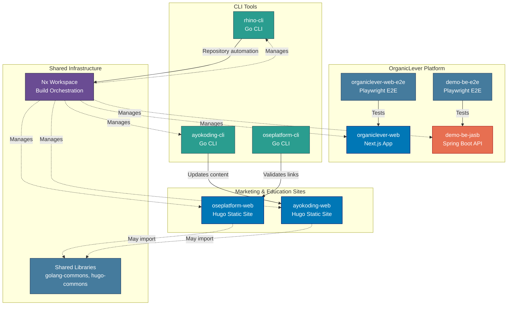
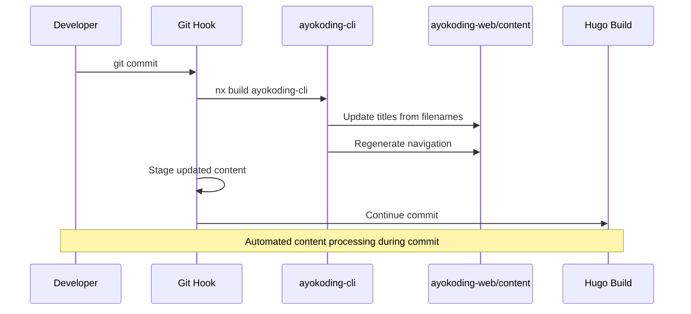

# Applications & Containers

Application inventory and C4 Level 2 container diagram for the Open Sharia Enterprise platform.

## Applications Inventory

The platform consists of 9 applications across 4 technology stacks:

### Frontend Applications (Hugo Static Sites)

#### oseplatform-web

- **Purpose**: Marketing and documentation website for OSE Platform
- **URL**: <https://oseplatform.com>
- **Technology**: Hugo 0.156.0 Extended + PaperMod theme
- **Deployment**: Vercel (via `prod-oseplatform-web` branch)
- **Build Command**: `nx build oseplatform-web`
- **Dev Command**: `nx dev oseplatform-web`
- **Location**: `apps/oseplatform-web/`

#### ayokoding-web

- **Purpose**: Educational platform for programming, AI, and security
- **URL**: <https://ayokoding.com>
- **Technology**: Hugo 0.156.0 Extended + Hextra theme
- **Languages**: Bilingual (Indonesian primary, English)
- **Deployment**: Vercel (via `prod-ayokoding-web` branch)
- **Build Command**: `nx build ayokoding-web`
- **Dev Command**: `nx dev ayokoding-web`
- **Location**: `apps/ayokoding-web/`
- **Special Features**:
  - Automated title updates from filenames
  - Auto-generated navigation structure
  - Pre-commit hooks for content processing

### CLI Tools (Go)

#### ayokoding-cli

- **Purpose**: Content automation for ayokoding-web
- **Language**: Go 1.26
- **Build Command**: `nx build ayokoding-cli`
- **Location**: `apps/ayokoding-cli/`
- **Features**:
  - Title extraction and update from markdown filenames
  - Navigation structure regeneration
  - Integrated into pre-commit hooks
- **Usage**: Automatically runs during git commit when ayokoding-web content changes

#### rhino-cli

- **Purpose**: Repository management and automation
- **Language**: Go 1.26
- **Build Command**: `nx build rhino-cli`
- **Location**: `apps/rhino-cli/`
- **Status**: Active development

#### oseplatform-cli

- **Purpose**: OSE Platform site link validation
- **Language**: Go 1.26
- **Build Command**: `nx build oseplatform-cli`
- **Location**: `apps/oseplatform-cli/`
- **Features**:
  - Validates all internal links in oseplatform-web content
  - Text, JSON, and markdown output formats
- **Usage**: Runs as first step of `oseplatform-web`'s `test:quick` target

### Web Applications (Next.js)

#### organiclever-web

- **Purpose**: Landing and promotional website for OrganicLever
- **URL**: <https://www.organiclever.com>
- **Technology**: Next.js 16 (App Router) + React 19 + TailwindCSS
- **Deployment**: Vercel (via `prod-organiclever-web` branch)
- **Build Command**: `nx build organiclever-web`
- **Dev Command**: `nx dev organiclever-web`
- **Location**: `apps/organiclever-web/`
- **Features**:
  - Radix UI / shadcn-ui component library
  - Cookie-based authentication
  - JSON data files for content
  - Production Dockerfile with standalone output

### Backend Services (Spring Boot)

#### demo-be-jasb

- **Purpose**: REST API backend for OrganicLever (Java Spring Boot implementation)
- **Technology**: Spring Boot + Java + Maven
- **Build Command**: `nx build demo-be-jasb`
- **Location**: `apps/demo-be-jasb/`
- **Features**:
  - JaCoCo code coverage enforcement (>=90%)
  - Production Dockerfile with multi-stage build
  - MockMvc integration testing

### E2E Test Suites (Playwright)

#### organiclever-web-e2e

- **Purpose**: End-to-end tests for organiclever-web
- **Technology**: Playwright
- **Run Command**: `nx run organiclever-web-e2e:test:e2e`
- **Location**: `apps/organiclever-web-e2e/`

#### demo-be-e2e

- **Purpose**: End-to-end tests for demo-be-jasb REST API
- **Technology**: Playwright
- **Run Command**: `nx run demo-be-e2e:test:e2e`
- **Location**: `apps/demo-be-e2e/`

## C4 Level 2: Container Diagram

Shows the high-level technical building blocks (containers) of the system. In C4 terminology, a "container" is a deployable/executable unit (web app, database, file system, etc.), not a Docker container.

## Application Interactions

**Independent Application Suites:**

Marketing & Education Sites:

- oseplatform-web: Fully independent static site
- ayokoding-web: Fully independent static site (with CLI automation)

CLI Tools:

- ayokoding-cli: Processes ayokoding-web content during build
- rhino-cli: Repository management automation

**Build-Time Dependencies:**

- All applications managed by Nx workspace
- CLI tools executed during build processes
- Shared libraries may be imported at build time via `@open-sharia-enterprise/[lib-name]`

**Content Processing Pipeline (ayokoding-web):**

