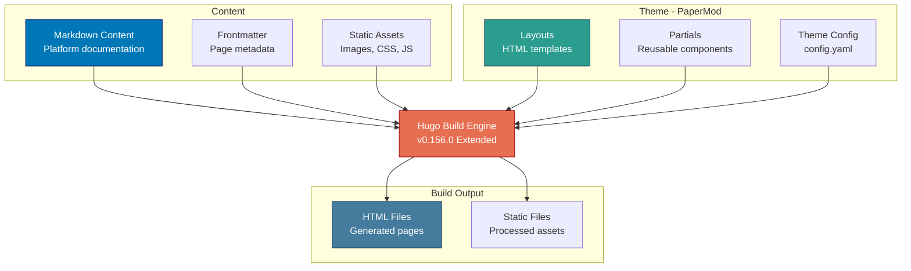
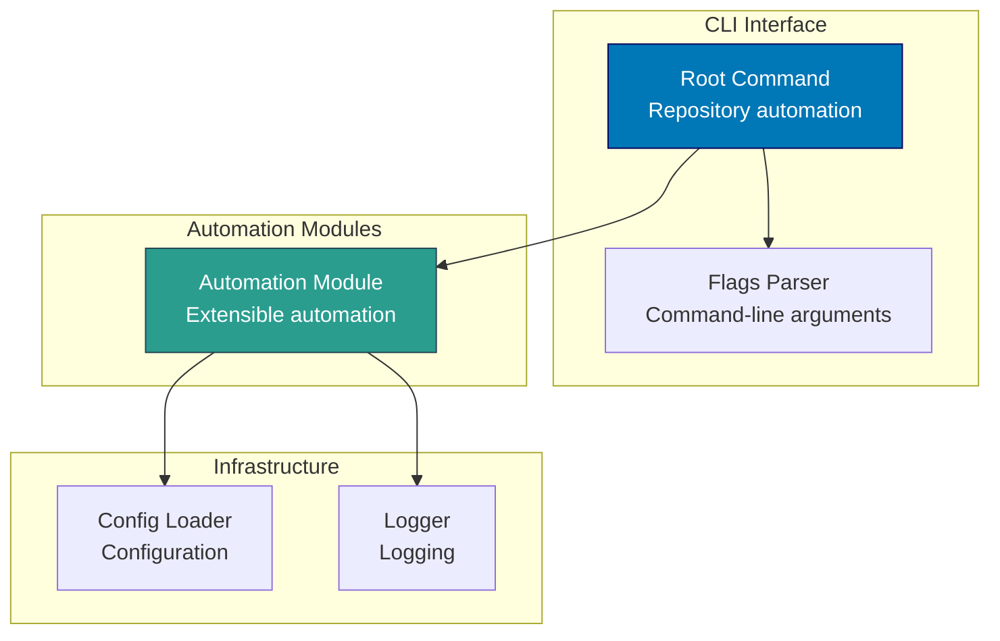

# Components & Code Architecture

C4 Level 3 component diagrams and Level 4 code architecture for the Open Sharia Enterprise platform.

## C4 Level 3: Component Diagrams

Shows the internal components within each container. Components are groupings of related functionality behind a well-defined interface.

### oseplatform-web Components (Hugo Static Site)

**Component Responsibilities:**

- **Markdown Content**: Platform marketing and documentation content
- **Layouts**: PaperMod theme templates for page structure
- **Theme Config**: Site configuration, navigation menus, theme settings

### ayokoding-cli Components (Go CLI Tool)

**Component Responsibilities:**

- **Root Command**: CLI entry point, command routing, help text
- **Links Check Command**: Validate internal links in ayokoding-web content

### rhino-cli Components (Go CLI Tool)

**Component Responsibilities:**

- **Root Command**: CLI entry point for repository automation tasks
- **Automation Module**: Extensible module system for automation workflows
- **Config Loader**: Load butler-specific configuration

### ayokoding-web Components (Next.js Fullstack Platform)

**Component Responsibilities:**

- **Next.js App Router**: Static generation and routing for educational content
- **tRPC API**: Backend API for content retrieval, search, and navigation
- **Content Directory**: Co-located markdown content at `apps/ayokoding-web/content/`
- **Bilingual Support**: Default English with Indonesian content

## C4 Level 4: Code Architecture

Shows implementation details for critical components. Focus on Go CLI tool package structures and key implementation patterns.

### ayokoding-cli Package Structure (Go)

ayokoding-cli now provides only `links check` for validating internal links in ayokoding-web content. The title update and navigation regeneration commands were removed as part of the migration from Hugo to Next.js.
