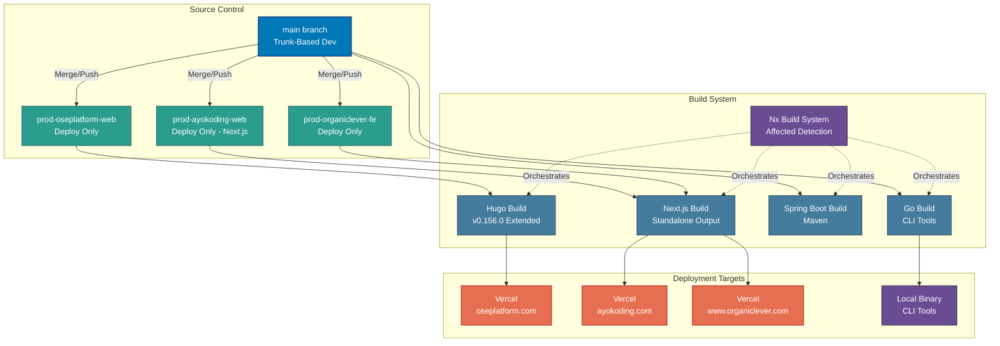

# Deployment Architecture

Deployment architecture, environment branches, and Vercel configuration for the Open Sharia Enterprise platform.

## Deployment Diagram

## Deployment Configuration

### Vercel Deployment

**Hugo Static Sites** (oseplatform-web):

- **Build Framework**: `@vercel/static-build`
- **Build Script**: `build.sh` in each app directory
- **Output Directory**: `public/`
- **Hugo Version**: 0.156.0 (configured via environment variable)

**Security Headers (All Vercel Sites):**

- `X-Content-Type-Options: nosniff`
- `X-Frame-Options: SAMEORIGIN`
- `X-XSS-Protection: 1; mode=block`
- `Referrer-Policy: strict-origin-when-cross-origin`

**Caching Strategy:**

- Static assets (css/js/fonts/images): 1 year immutable cache
- HTML pages: Standard caching

### Environment Branches

- **Purpose**: Deployment triggers only
- **Branches**: `prod-oseplatform-web`, `prod-ayokoding-web`, `prod-organiclever-fe`
- **Policy**: NEVER commit directly to these branches outside CI automation
- **Workflow**: Automated by scheduled GitHub Actions workflows (`test-and-deploy-ayokoding-web.yml`,
  `test-and-deploy-oseplatform-web.yml`, `deploy-organiclever-fe.yml`) running at 6 AM and 6 PM WIB; or
  trigger manually from GitHub Actions UI
