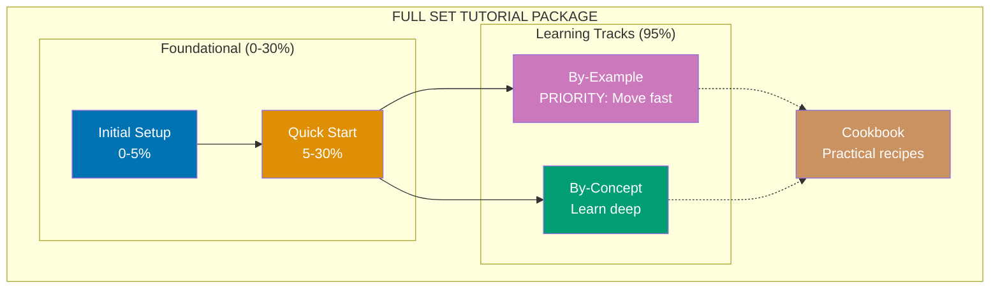
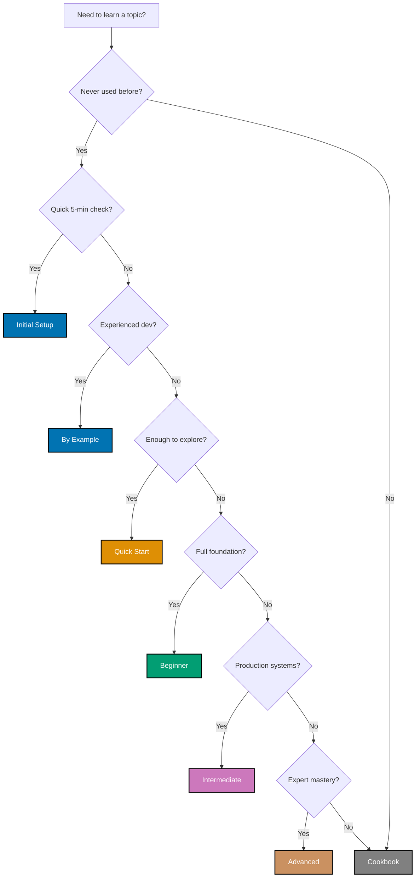

# Tutorial Naming Convention

This document defines the standard tutorial types and naming conventions used across the open-sharia-enterprise documentation. Each tutorial type represents a specific learning depth and audience, ensuring learners can easily find content appropriate for their skill level.

## Principles Implemented/Respected

This convention implements the following core principles:

- **[Progressive Disclosure](../../principles/content/progressive-disclosure.md)**: Six tutorial levels (Initial Setup through Cookbook) provide graduated learning paths. Beginners start simple (0-5% coverage), advanced users access deep content (85-95%). Each level is complete and useful on its own.

- **[No Time Estimates](../../principles/content/no-time-estimates.md)**: Tutorial levels defined by knowledge coverage percentages (0-5%, 5-30%, etc.) instead of completion time. Focus is on WHAT you'll learn and HOW DEEP, not how long it takes.

- **[Explicit Over Implicit](../../principles/software-engineering/explicit-over-implicit.md)**: Tutorial names explicitly state their level and scope ("Initial Setup", "Beginner Tutorial", "Advanced Guide"). No guessing about difficulty or depth - it's clear from the title.

## Scope

### What This Convention Covers

- **Tutorial type naming** - Initial Setup, Quick Start, Beginner, Intermediate, Advanced, Cookbook, By Example
- **Full Set Tutorial Package definition** - All 5 mandatory components for complete language content
- **Coverage percentages** - What each tutorial level covers (0-5%, 5-30%, 0-95%)
- **Component relationships** - How foundational, learning tracks, and cookbook interact
- **Decision tree** - How to choose the right tutorial type
- **Universal applicability** - Applies to **all tutorial content** (docs/, ayokoding-web, oseplatform-web, anywhere)

### What This Convention Does NOT Cover

- **Tutorial content structure** - Covered in [Tutorials Convention](./general.md)
- **General file naming** - Non-tutorial files covered in [File Naming Convention](../structure/file-naming.md)
- **Hugo-specific implementation** - Frontmatter, weights, navigation covered in [Hugo conventions](../hugo/README.md)
- **Tutorial validation** - Covered by docs-tutorial-checker agent

**Note**: These naming standards apply universally to all tutorial content regardless of location. Hugo-specific details (numeric prefixes like `00-`, weight values) are implementation details covered in site-specific conventions

## Purpose

**Why standardize tutorial naming?**

- **Clarity** - Learners immediately understand the tutorial's depth and scope
- **Consistency** - All tutorials follow the same naming and structure patterns
- **Discoverability** - Easy to find the right tutorial for your current skill level
- **Progression** - Clear learning path from beginner to advanced topics
- **Expectations** - Learners know what to expect before starting

## Tutorial Types Overview

**Legend**:

- Solid arrows (→) show linear progression within the "Sequential Learning Path" (5 levels in by-concept/)
- Dotted arrows (⋯→) show complementary learning components used alongside sequential path
- Percentages indicate depth of domain knowledge coverage

**Full Set Tutorial Package**:

A **Full Set Tutorial Package** is a complete educational bundle with all 5 mandatory components providing 0-95% coverage through multiple learning modalities:

1. **Component 1-2: Foundational Tutorials** (0-30% coverage)
   - `initial-setup.md` (0-5%): Installation, verification, Hello World
   - `quick-start.md` (5-30%): Core concepts for independent exploration

2. **Component 3: By-Example Track** (95% coverage) - **PRIORITIZED for fast learning**
   - `by-example/` folder: Code-first learning through annotated examples
   - 3 files: beginner.md (1-25), intermediate.md (26-50), advanced.md (51-75)
   - 75-85 examples total with 1-2.25 annotation density
   - **Move fast**: Experienced developers learn quickly through working code

3. **Component 4: By-Concept Track** (95% coverage)
   - `by-concept/` folder: Narrative-driven comprehensive tutorials
   - 3 files: beginner.md (0-40%), intermediate.md (40-75%), advanced.md (75-95%)
   - 40-60 sections total achieving deep understanding
   - **Learn deep**: Complete beginners get full explanations

4. **Component 5: Cookbook** (Practical recipes)
   - `cookbook/` folder: Problem-solving reference
   - 30+ recipes organized by category
   - Complements both learning tracks

**Sequential Learning Path** (within by-concept/ folder):

- The 5 progressive levels in by-concept/ for deep learning
- Beginner → Intermediate → Advanced progression (0-95%)
- Provides narrative-driven foundation for complete beginners

---

## Tutorial Type Definitions

### Initial Setup

**Coverage**: 0-5% of domain knowledge
**Goal**: Get up and running quickly

**Description**:
Minimal tutorial to get you running your first program or using a tool. In programming languages and frameworks, this means running "Hello World" and understanding the most basic syntax.

**Content includes**:

- Installation instructions
- Basic environment setup
- First "Hello World" program
- Verification that setup works correctly

**What it does NOT include**:

- In-depth explanations of concepts
- Multiple examples or variations
- Advanced features or patterns
- Best practices or optimization

**Example titles**:

- "Initial Setup for Go"
- "Initial Setup for React"
- "Initial Setup for PostgreSQL"

**When to use**: When someone needs to verify they can run code before committing to deeper learning.

---

### Quick Start

**Coverage**: 5-30% of domain knowledge
**Goal**: Learn enough to explore independently

**Description**:
Teaches the core concepts and syntax needed to start exploring the domain independently. After completing a quick start, learners can read documentation, try examples, and solve simple problems on their own.

**Content includes**:

- Core language syntax or tool features
- Fundamental concepts and terminology
- Basic examples demonstrating key features
- Enough knowledge to read official documentation
- Foundation for independent exploration

**What it does NOT include**:

- Comprehensive coverage of all features
- Advanced patterns or edge cases
- Production-ready best practices
- Deep dives into internals

**Example titles**:

- "Quick Start Guide to Golang"
- "React Quick Start"
- "Docker Quick Start"

**When to use**: When someone wants to quickly understand a language/tool's fundamentals and start experimenting independently.

---

### Beginner

**Coverage**: 0-60% of domain knowledge
**Goal**: Comprehensive foundation from zero to working knowledge

**Description**:
Teaches everything from absolute basics to solid working knowledge. Covers the most important 60% of features that you'll use in 90% of real-world scenarios. After completion, learners can build real projects and solve common problems.

**Content includes**:

- Everything in Initial Setup and Quick Start
- Comprehensive coverage of core features
- Multiple examples and practice exercises
- Common patterns and idioms
- Error handling and debugging basics
- Testing fundamentals
- Practical real-world examples

**What it does NOT include**:

- Advanced optimization techniques
- Complex architectural patterns
- Edge cases and specialized scenarios
- Deep internals or theory

**Example titles**:

- "Complete Beginner's Guide to Go"
- "React for Beginners: Zero to Hero"
- "Accounting Fundamentals for Beginners"

**When to use**: When someone is completely new to a domain and wants comprehensive, structured learning from scratch.

---

### Intermediate

**Coverage**: 60-85% of domain knowledge
**Goal**: Professional-level expertise for production systems

**Description**:
Builds on beginner knowledge to cover professional techniques, optimization, and architectural patterns. Focuses on the 25% of features needed for production systems, complex applications, and team collaboration.

**Prerequisites**: Completed beginner-level tutorial or equivalent experience

**Content includes**:

- Advanced features and patterns
- Performance optimization techniques
- Architectural best practices
- Testing strategies (integration, e2e)
- Security considerations
- Production deployment concerns
- Team collaboration patterns
- Code organization at scale

**What it does NOT include**:

- Cutting-edge experimental features
- Highly specialized techniques
- Framework/library internals
- Research-level topics

**Example titles**:

- "Intermediate Go: Production-Ready Applications"
- "Advanced React Patterns"
- "Intermediate PostgreSQL: Query Optimization"

**When to use**: When someone has working knowledge but needs to build production systems or work on professional teams.

---

### Advanced

**Coverage**: 85-95% of domain knowledge
**Goal**: Expert-level mastery of advanced techniques

**Description**:
Covers advanced techniques, edge cases, and sophisticated patterns used by experts. The final 5% (specialized research topics) is addressed in separate specialized tutorials.

**Prerequisites**: Completed intermediate-level tutorial or significant professional experience

**Content includes**:

- Advanced optimization techniques
- Complex architectural patterns
- Edge cases and corner scenarios
- Performance profiling and tuning
- Advanced debugging techniques
- System design trade-offs
- Cutting-edge features and proposals
- Framework/tool internals

**What it does NOT include**:

- Research-level topics (covered in specialized tutorials)
- Experimental/unstable features
- Topics requiring academic background

**Example titles**:

- "Advanced Go: Concurrency Patterns and Optimization"
- "Advanced React: Internals and Performance"
- "Advanced PostgreSQL: Internals and Tuning"

**When to use**: When someone needs expert-level knowledge for complex systems, performance-critical applications, or teaching others.

---

### Cookbook

**Coverage**: Practical recipes (not depth-based)
**Goal**: Solve day-to-day and real-world problems

**Description**:
Collection of practical recipes and patterns for solving common real-world problems. Not organized by difficulty level, but by problem type. Can be used at beginner, intermediate, or advanced levels.

**Prerequisites**: Varies by recipe (usually beginner or intermediate level)

**Content includes**:

- Problem-focused recipes ("How do I...")
- Copy-paste-ready code examples
- Real-world scenarios and solutions
- Common gotchas and workarounds
- Best practices for specific tasks
- Performance tips for common operations
- Troubleshooting guides

**What it does NOT include**:

- Comprehensive explanations of concepts
- Linear learning progression
- Foundational knowledge building

**Example titles**:

- "Golang Cookbook: Practical Recipes"
- "React Cookbook: Common Patterns"
- "PostgreSQL Cookbook: Query Patterns"

**When to use**: When someone needs quick solutions to specific problems rather than comprehensive learning.

---

### By Example

**Coverage**: 95% of domain knowledge through annotated examples
**Goal**: Quick pickup for experienced developers learning new languages

**Description**:
Example-driven learning path for experienced developers (seasonal programmers/software engineers) who want to quickly pick up a new language through heavily annotated code examples. Covers 95% of language concepts through 75-85 self-contained, progressively complex examples organized into three levels.

**Prerequisites**: Programming experience required (not for complete beginners)

**Structure**:

- Total: 75-85 annotated examples organized into 3 files
- **beginner.md**: Examples 1-25/30 (Basics, 0-40% coverage) - fundamental syntax and core concepts
- **intermediate.md**: Examples 26-50/60 (Intermediate, 40-75% coverage) - practical patterns and production features
- **advanced.md**: Examples 51-75/90 (Advanced, 75-95% coverage) - complex features, optimization, and internals

**Content includes**:

- **Five-part format** for every example:
  1. Brief explanation (2-3 sentences) of concept and why it matters
  2. Mermaid diagram (when visualization clarifies concept relationships)
  3. Heavily annotated code with `// =>` or `# =>` notation showing:
     - What each line does (1-2.25 comment lines per code line (target: 1-2.25, upper bound: 2.5))
     - Expected outputs
     - Variable states and intermediate values
     - Side effects and state changes
  4. Key takeaway (1-2 sentences) distilling the core insight
- **Self-contained examples**: Copy-paste-runnable within chapter scope
- **Diagram frequency**: 30-50% of examples include visualizations
- **Color-blind friendly**: All diagrams use accessible color palette
- **Progressive complexity**: Simple → advanced within each level
- **95% coverage**: Production patterns, modern features, testing, optimization

**What it does NOT include**:

- Deep explanations for complete beginners (see Beginner tutorial for that)
- Problem-solving recipes (see Cookbook for that)
- Framework-specific advanced patterns (see Intermediate/Advanced tutorials for comprehensive coverage)
- Setup instructions (see Initial Setup for that)
- The final 5% (highly specialized topics, research areas)

**Example titles**:

- "Elixir By Example: Learn Through Code"
- "Rust By Example: Annotated Examples"
- "Kotlin By Example: Quick Language Pickup"
- "Go By Example: 95% Coverage Through Annotated Code"

**When to use**: When an experienced developer wants to quickly understand a new language's syntax, patterns, and production features through working examples without extensive narrative.

**Relationship to other tutorial types**:

- **NOT a replacement** for comprehensive tutorials (Beginner/Intermediate/Advanced) - those provide deep explanations for complete beginners
- **NOT a replacement** for Quick Start - Quick Start is 5-30% coverage with touchpoints, By Example is 95% coverage with comprehensive examples
- **NOT a replacement** for Cookbook - Cookbook is problem-solving oriented, By Example is learning-oriented
- **Complements** the Full Set by providing an alternative learning path for experienced developers
- **Higher coverage than Advanced tutorials**: By Example reaches 95% through examples while Advanced tutorials reach 85-95% through deep dives

**See**: [By-Example Tutorial Convention](./by-example.md) for complete standards including annotation density, self-containment rules, and diagram requirements.

---

## Choosing the Right Tutorial Type

### Decision Tree

### Quick Reference Table

| Tutorial Component            | Coverage  | Purpose                               |
| ----------------------------- | --------- | ------------------------------------- |
| **FULL SET TUTORIAL PACKAGE** | **0-95%** | **All 5 components for completeness** |
| ↳ Foundational                |           |                                       |
| Initial Setup                 | 0-5%      | Installation and verification         |
| Quick Start                   | 5-30%     | Core concepts for exploration         |
| ↳ Learning Tracks             |           |                                       |
| By-Example (3 files)          | 95%       | **PRIORITY:** Code-first, move fast   |
| By-Concept (3 files)          | 95%       | Narrative-driven, learn deep          |
| ↳ Practical Reference         |           |                                       |
| Cookbook                      | Practical | Problem-solving recipes               |

---

## Naming Examples

### Programming Languages

- **Initial Setup for Python**
- **Python Quick Start**
- **Python for Beginners: Complete Guide**
- **Intermediate Python: Professional Techniques**
- **Advanced Python: Internals and Optimization**
- **Python Cookbook: Practical Recipes**
- **Python By Example: Learn Through Code**

### Frameworks and Tools

- **Initial Setup for React**
- **React Quick Start**
- **React for Beginners**
- **Intermediate React: Production Patterns**
- **Advanced React: Performance and Internals**
- **React Cookbook: Common Solutions**
- **React By Example: Annotated Examples**

### Domain Topics

- **Initial Setup for Accounting**
- **Accounting Quick Start**
- **Accounting for Beginners**
- **Intermediate Accounting: Financial Reporting**
- **Advanced Accounting: Complex Transactions**
- **Accounting Cookbook: Common Scenarios**

**Note**: By Example is primarily used for programming languages and frameworks where heavily annotated code examples provide effective learning. It's less applicable to domain topics like accounting or business concepts.

---

## PASS: Best Practices

### DO

- **Use consistent naming** - Follow the standard tutorial type names
- **Match content to type** - Ensure coverage aligns with tutorial type definition
- **State prerequisites** - Clearly list what learners need before starting
- **Focus on learning outcomes** - Emphasize WHAT learners will achieve, not HOW LONG it takes
- **Use coverage percentages** - Indicate depth (0-5%, 60-85%, etc.) to set expectations
- **Provide practical examples** - Real-world scenarios, not toy problems
- **Test with target audience** - Validate content matches the intended level

### DON'T

- **Mix tutorial types** - Don't combine "Beginner + Intermediate" in one tutorial
- **Skip prerequisite tutorials** - Each level builds on previous ones
- **Include time estimates** - No "X hours" or "X minutes" (people learn at different speeds)
- **Use jargon without explanation** - Define terms appropriate to the level
- **Create arbitrary levels** - Stick to the six standard types
- **Make cookbooks too basic** - Cookbook assumes working knowledge

---

## Related Documentation

- [Tutorial Convention](./general.md) - Standards for tutorial structure and content
- [Diátaxis Framework](../structure/diataxis-framework.md) - Understanding the tutorial category in documentation
- [Tutorials Index](./README.md) - All available tutorials organized by type
- [File Naming Convention](../structure/file-naming.md) - How to name tutorial files
