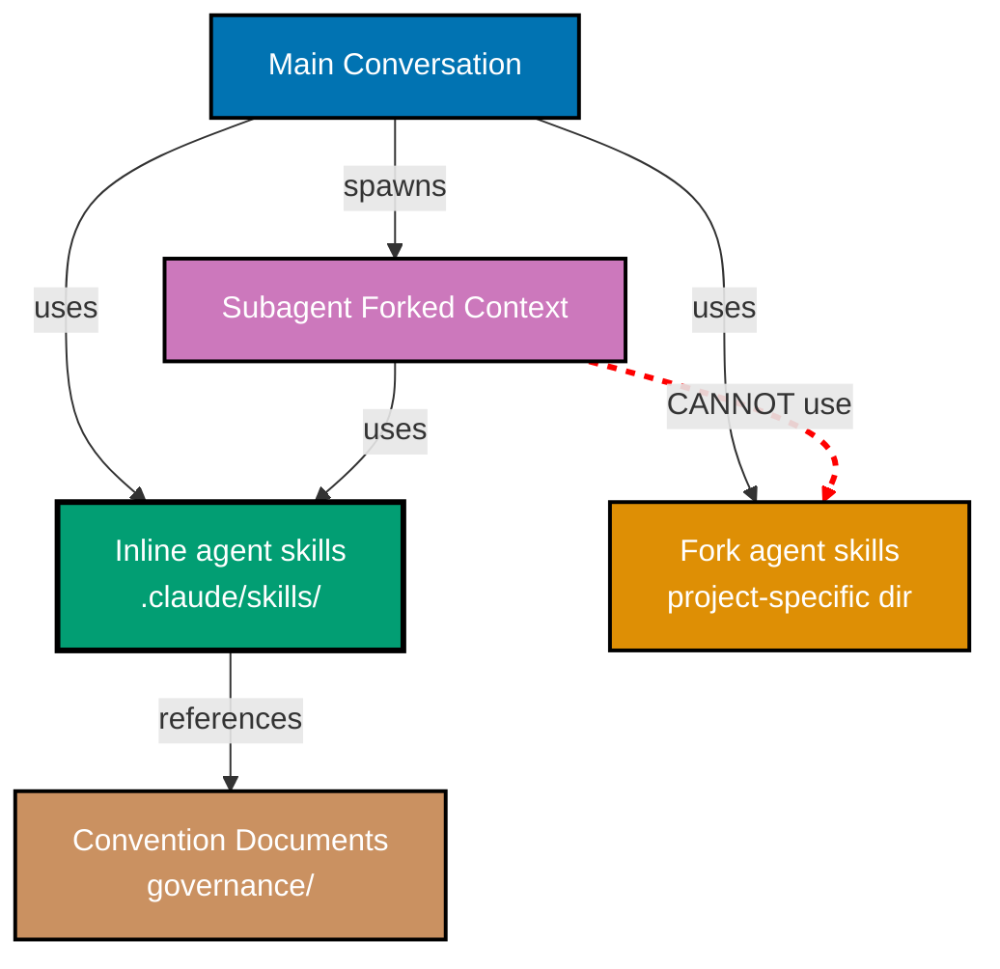

# Skill Context Architecture

This document defines the architectural constraint governing skill context modes in `.claude/skills/`. Inline skills work universally; fork skills work from main conversation only. Both modes are supported in `.claude/skills/`.

## Principles Implemented/Respected

This convention respects the following core principles:

- **[Explicit Over Implicit](../../principles/software-engineering/explicit-over-implicit.md)**: Explicitly documents the architectural constraint preventing delegated agents from spawning other delegated agents. Makes the limitation visible and provides clear guidance on skill design decisions.

- **[Simplicity Over Complexity](../../principles/general/simplicity-over-complexity.md)**: Single-level delegated agent spawning prevents complex nested agent hierarchies. Agent skills remain simple knowledge containers that work everywhere, avoiding architectural complexity.

## Conventions Implemented/Respected

This development practice implements/respects the following conventions:

- **[AI Agents Convention](./ai-agents.md)**: By establishing the architectural constraint that skills must be inline-compatible, this practice ensures agents can reliably compose skills without runtime failures. The AI Agents Convention defines agent structure and tool usage; this architecture ensures skills integrate seamlessly with that structure across both main conversation and delegated agent contexts.

## Purpose

This architectural decision establishes that all skills stored in the `.claude/skills/` directory must remain compatible with both main conversation agents and delegated agents. Since delegated agents cannot spawn other delegated agents (architectural constraint of AI coding agents), skills with `context: fork` would be unusable in delegated agent contexts.

**Target Audience**:

- Agent developers creating or maintaining skills
- Repository maintainers reviewing skill contributions
- Anyone designing agent workflows involving skills

## The Architectural Constraint

### Core Limitation

**Delegated agents cannot spawn other delegated agents.**

This is a fundamental architectural constraint of AI coding agent systems:

```
Main Conversation
├─ Can spawn subagents ✅
└─ Subagent (forked context)
   ├─ Can use inline skills ✅
   ├─ Can reference conventions ✅
   └─ Can spawn subagents ❌ (architectural constraint)
```

### Impact on agent skills

Since skills with `context: fork` spawn delegated agents:

1. **Main conversation** can use fork skills ✅ (spawns delegated agent successfully)
2. **Delegated agents** cannot use fork skills ❌ (would require spawning nested delegated agent)

If `.claude/skills/` contains fork skills:

- ✅ Work in main conversation
- ❌ Break when used by delegated agents
- ❌ Reduce skill composability
- ❌ Create confusing "works sometimes" behavior

## The Repository Standard

### Skill Context Modes in the Primary Binding agent skills Directory

**Standard**: agent skills in `.claude/skills/` support two context modes:

- **Inline skills** (default): Omit `context` field or set `context: inline`. Work in BOTH main conversation AND delegated agent contexts.
- **Fork skills** (`context: fork`): Work from MAIN CONVERSATION ONLY (delegated agents cannot spawn delegated agents).

**Rationale**:

1. **Universal compatibility** - Work in both main conversation and delegated agent contexts
2. **Predictable behavior** - agent skills always inject knowledge, never fail
3. **Composability** - Agents can freely compose multiple skills
4. **Delegated agent safety** - Delegated agents can use any skill without errors

### Inline Context Mode

**Default behavior** when `context` field is omitted or set to `inline`:

```yaml
---
description: Knowledge about X for agents
# context: inline is implicit (default)
---
```

**Characteristics**:

- **Progressive disclosure** - Name/description at startup, full content on-demand
- **Knowledge injection** - Add standards and guidance to current conversation
- **Convention packaging** - Bundle governance knowledge for efficient consumption
- **Universal compatibility** - Work in main conversation AND delegated agent contexts
- **Composition** - Multiple skills work together seamlessly

**Tool usage**: agent skills can use `Read`, `Grep`, `Glob` to reference convention documents but should not modify files.

## Fork agent skills: Main Conversation Only

### When You Need Fork Behavior

**Option 1: Create fork skills in the primary binding skills directory (recommended)**

Fork skills in `.claude/skills/` work from main conversation:

```
.claude/
└─ skills/
   ├─ inline-skill/     # ✅ Inline skill (universal compatibility)
   │  └─ SKILL.md      # context: inline (default)
   └─ fork-skill/       # ✅ Fork skill (main conversation only)
      └─ SKILL.md      # context: fork
```

**Characteristics**:

- Only usable from main conversation
- Clearly separated from universal skills
- Documented as "main conversation only"

**Option 2: Use agent workflows**

For complex orchestration, use workflow documents (Layer 5) that coordinate multiple agents in sequence rather than nesting:

```markdown
## Workflow Steps

1. Main conversation uses agent-maker
2. Main conversation uses agent-checker (separate invocation)
3. Main conversation uses agent-fixer (separate invocation)
```

This avoids delegated agent nesting while achieving similar orchestration goals.

### Fork Skill Use Cases (Outside Repository)

Valid use cases for fork skills (in project-specific directories):

- **Deep research** - Spawn Explore agent for focused investigation
- **Specialized analysis** - Delegate complex analysis to specific agent type
- **Parallel exploration** - Multiple fork skills explore different aspects
- **Workflow delegation** - Main conversation orchestrates multiple delegated agents

**Key constraint**: These must be used from main conversation, never from delegated agents.

## Validation and Compliance

### Skill Validation Checklist

When creating or reviewing skills in `.claude/skills/`:

- [ ] `context` field is omitted (inline default), `inline`, or `fork` (main conversation only)
- [ ] No `agent` field (only valid with `context: fork`)
- [ ] Skill provides knowledge, not task delegation
- [ ] Description focuses on knowledge domain, not agent spawning
- [ ] Skill works identically in main conversation and delegated agent contexts

### Common Mistakes

#### ❌ Mistake 1: Fork skill with agent field in the primary binding skills directory

**Wrong**:

```yaml
# .claude/skills/deep-research/SKILL.md
---
description: Performs deep research on topics
context: fork
agent: Explore
---
```

**Problem**: Breaks when delegated agents try to use this skill.

**Right**: Keep in `.claude/skills/` but document as main-conversation-only, or use a workflow approach.

#### ❌ Mistake 2: Inline skill trying to spawn agents

**Wrong**:

```yaml
# .claude/skills/analysis/SKILL.md
---
description: Analyzes code quality
---
# Analysis Skill

Run the code-checker agent to validate...
```

**Problem**: Inline skills can't spawn agents. Skill will fail to execute.

**Right**: Either make it a fork skill (outside the primary binding skills directory) or reference conventions instead of delegating to agents.

#### ❌ Mistake 3: Mixing inline and fork behavior

**Wrong**:

```yaml
# .claude/skills/hybrid/SKILL.md
---
description: Provides knowledge and delegates tasks
context: inline
---
Use these standards... [knowledge content]

For complex cases, spawn the analyzer agent... [delegation content]
```

**Problem**: Inline skills can't spawn agents. Choose one mode.

**Right**: Split into two skills - inline skill for knowledge, fork skill for delegation (in separate directory).

## Architecture Diagram



**Key**:

- Blue: Main conversation context
- Purple: Delegated agent (forked) context
- Green: Universal inline skills (works everywhere)
- Orange: Fork skills (main conversation only)
- Brown: Convention documents (governance layer)
- Red dashed: Architectural constraint (cannot do)

## Related Documentation

### Core Architecture

- **[Repository Governance Architecture](../../repository-governance-architecture.md)** - Six-layer architecture including skills as delivery infrastructure
- **[AI Agents Convention](./ai-agents.md)** - Agent structure and tool permissions

### Agent skills Documentation

- **[Primary binding skills catalog](../../../.claude/skills/README.md)** - Skill modes (inline vs fork) and organization
- **[How to Create a New Skill](../../../docs/how-to/create-new-skill.md)** - Step-by-step skill creation guide

### Related Conventions

- **[Maker-Checker-Fixer Pattern](../pattern/maker-checker-fixer.md)** - Three-stage workflow without nested delegated agents
- **[Temporary Files Convention](../infra/temporary-files.md)** - Audit reports enabling sequential agent workflows

## Enforcement

### Code Review Checklist

When reviewing PRs that add or modify skills in `.claude/skills/`:

1. Verify `context` field is omitted or set to `inline`
2. Confirm no `agent` field exists
3. Check skill description focuses on knowledge domain
4. Validate skill contains knowledge/guidance, not task delegation
5. Ensure skill references conventions rather than spawning agents

### Automated Validation (Future)

Potential automated checks:

```bash
# Check for fork context in .claude/skills/
grep -r "context: fork" .claude/skills/

# Check for agent field in .claude/skills/
grep -r "^agent:" .claude/skills/
```

Exit code 0 (no matches) = compliant, >0 = violations found.

## Summary

**The Rule**: agent skills in `.claude/skills/` support both inline and fork modes.

**The Reason**: Delegated agents cannot spawn other delegated agents (architectural constraint).

**The Impact**: Universal skill compatibility across main conversation and delegated agent contexts.

**Key distinction**: When writing skills for agents that may run as delegated agents, use inline mode for guaranteed compatibility.

This architectural decision ensures skills work predictably everywhere, enabling confident skill composition and delegated agent usage throughout the repository.

---

**Status**: Active Standard
