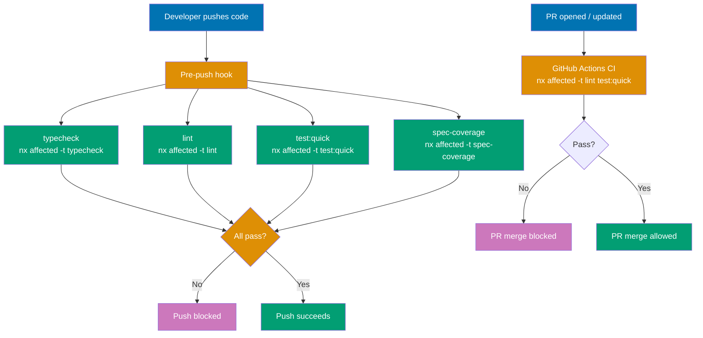
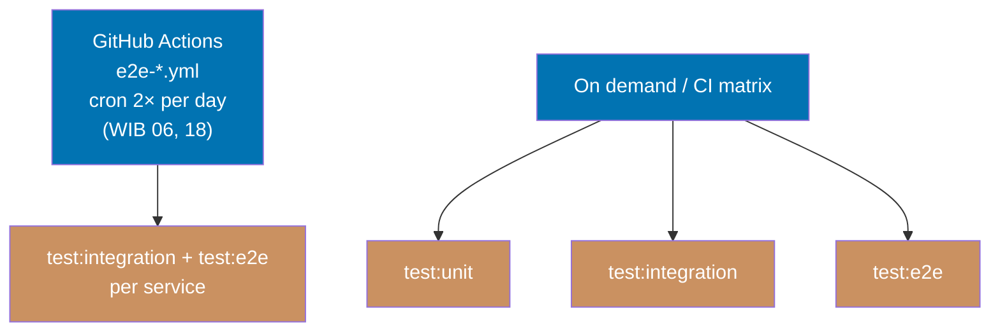

# Nx Target Standards

Defines the standard Nx targets that apps and libs expose, what each target must do, and naming conventions that keep all projects consistent across the workspace.

## Execution Model

### Quality Gates (pre-push enforcement)

`typecheck`, `lint`, `test:quick`, and `spec-coverage` run at two mandatory checkpoints — locally
before push and remotely before merge.



### Scheduled and On-Demand Testing

Deeper tests run outside the pre-push/PR cycle — on a schedule or triggered explicitly.

Scheduled CRON workflows run 5 parallel tracks: lint, typecheck, test:quick (with coverage), spec-coverage, and integration→e2e (sequential chain).



## Principles Implemented/Respected

- **[Explicit Over Implicit](../../principles/software-engineering/explicit-over-implicit.md)**: Every project declares its capabilities through explicit targets. No implicit build or test mechanisms — if a project supports unit tests, it declares `test:unit`; if it has integration tests, it declares `test:integration`; if it has a dev server, it declares `dev`. The composition of `test:quick` is explicit in each project's `project.json`.

- **[Automation Over Manual](../../principles/software-engineering/automation-over-manual.md)**: Targets integrate with Nx affected computation, caching, the pre-push hook, and the PR merge gate. Consistent naming allows workspace-level automation (`nx affected -t test:quick`) to work across all project types without special cases.

- **[Simplicity Over Complexity](../../principles/general/simplicity-over-complexity.md)**: Each project exposes only the targets it actually needs. A Go CLI does not need `dev` or `start`. The full testing spectrum is composed from `test:quick`, `test:unit`, `test:integration`, and `test:e2e` — no aggregate wrapper target needed.

## Conventions Implemented/Respected

- **[File Naming Convention](../../conventions/structure/file-naming.md)**: `project.json` follows Nx workspace conventions; target names follow the kebab-case + colon-variant pattern defined here.

- **[Reproducible Environments Convention](../workflow/reproducible-environments.md)**: Projects with local dependencies expose an `install` target so dependency state is always explicit and reproducible.

- **[Three-Level Testing Standard](../quality/three-level-testing-standard.md)**: The `test:unit`, `test:integration`, and `test:e2e` targets defined here map to the mandatory three-level testing architecture. Each target's isolation boundaries, caching rules, and CI schedule derive from that standard.

## Target Naming Standards

Use these canonical names. Aliases (`serve`, `start:dev`, `unit-test`) are anti-patterns.

| Target             | Purpose                                                                                                                  | When Required                     |
| ------------------ | ------------------------------------------------------------------------------------------------------------------------ | --------------------------------- |
| `build`            | Produce deployable or runnable artifacts                                                                                 | Compiled and bundled projects     |
| `typecheck`        | Verify type correctness without producing artifacts                                                                      | Statically typed languages        |
| `lint`             | Static analysis, code style checks, and static a11y checks (oxlint jsx-a11y for TS UI projects, `dart analyze` for Dart) | All projects                      |
| `test:quick`       | Fast quality gate for pre-push and PR merge; composed of fast checks                                                     | All projects                      |
| `spec-coverage`    | Validate that every Gherkin step has a matching step definition; uses `rhino-cli spec-coverage validate`                 | All apps and E2E runners          |
| `test:unit`        | Isolated unit tests with mocked dependencies; must consume Gherkin specs (demo-be backends and Go CLI apps)              | Projects with unit tests          |
| `test:integration` | Demo-be: real PostgreSQL via docker-compose, direct code calls (no HTTP). Others: existing patterns (MSW, Godog)         | Projects with integration tests   |
| `test:e2e`         | Run E2E tests headlessly against a running app; must consume Gherkin specs (demo-be backends) via Playwright             | E2E test projects (`*-e2e`)       |
| `test:e2e:ui`      | Run E2E tests with interactive Playwright UI                                                                             | E2E test projects                 |
| `test:e2e:report`  | Open the last E2E HTML report                                                                                            | E2E test projects                 |
| `dev`              | Start local development server with hot-reload                                                                           | Apps with dev servers             |
| `start`            | Start server in production mode                                                                                          | Apps with production server mode  |
| `run`              | Execute the application directly                                                                                         | CLI applications                  |
| `codegen`          | Generate code from OpenAPI contract spec into `generated-contracts/`                                                     | Demo apps with contract types     |
| `docs`             | Generate browsable API documentation from contract spec                                                                  | Contract spec projects            |
| `install`          | Install project-local dependencies                                                                                       | E2E suites, Go CLIs               |
| `clean`            | Remove build artifacts and caches                                                                                        | Projects with large build outputs |

### Naming Rules

- Use `dev` for the development server — never `serve`, never `start:dev`
- Use `start` for the production server — never `serve`
- Use `test:quick` for the fast pre-push gate; `test:unit` for isolated unit tests with mocked dependencies (Go CLI apps consume Gherkin specs via godog at this level); `test:integration` for tests with real infrastructure (demo-be: PostgreSQL via docker-compose) or in-process mocking (MSW, Godog); `test:e2e` for end-to-end tests; `spec-coverage` for Gherkin step definition coverage validation — run targets individually rather than through an aggregate wrapper
- Separate target variants with a colon (`build:web`, `test:e2e:ui`), not a hyphen or underscore
- All target names use lowercase with hyphens for multi-word names (`run-pre-commit`)

## Tag Convention

Tags are the standard mechanism for attaching structured metadata to projects in `project.json`. Nx uses tags for boundary enforcement (`@nx/enforce-module-boundaries`), graph filtering (`nx graph --focus`), and `nx affected` scoping. Consistent tags across the workspace allow tooling to query by project kind, framework, language, or product domain without parsing project names.

### Four-Dimension Scheme

Every project declares tags along four dimensions. Each dimension uses a fixed prefix and a controlled vocabulary.

| Dimension | Prefix      | Allowed Values                                                                                                        | Required                       | Purpose                                                       |
| --------- | ----------- | --------------------------------------------------------------------------------------------------------------------- | ------------------------------ | ------------------------------------------------------------- |
| Type      | `type:`     | `app`, `lib`, `e2e`                                                                                                   | Always                         | Distinguishes deployable apps, reusable libs, and test suites |
| Platform  | `platform:` | `hugo`, `cli`, `nextjs`, `spring-boot`, `phoenix`, `giraffe`, `gin`, `fastapi`, `axum`, `ktor`, `vertx`, `playwright` | Apps and e2e projects          | Framework or runtime environment                              |
| Language  | `lang:`     | `golang`, `ts`, `java`, `elixir`, `fsharp`, `python`, `rust`, `kotlin`, `dart`                                        | Projects with application code | Primary language of source code                               |
| Domain    | `domain:`   | `ayokoding`, `oseplatform`, `organiclever`, `demo-be`, `demo-fe`, `tooling`                                           | Always                         | Business or product domain                                    |

### Special Rules

**Hugo sites omit `lang:` (historical -- no active Hugo sites remain)**: Hugo sites consist of templates and markdown content; `go.mod` and `go.sum` present in a Hugo project are Hugo module dependency files, not application source code. No application code is written in Go, so `lang:` does not apply.

**Go libs omit `platform:`**: A Go library has no framework or runtime boundary — only a primary language. Declare `type:lib` and `lang:golang`; omit `platform:`.

**Use `domain:tooling` for general-purpose utilities**: Projects that are not tied to a specific product domain (e.g., `rhino-cli`) use `domain:tooling`. Use a product domain tag only when the project belongs exclusively to that product.

### Current Project Tags

| Project               | Tags                                                                     |
| --------------------- | ------------------------------------------------------------------------ |
| `ayokoding-web`       | `["type:app", "platform:nextjs", "lang:ts", "domain:ayokoding"]`         |
| `ayokoding-cli`       | `["type:app", "platform:cli", "lang:golang", "domain:ayokoding"]`        |
| `rhino-cli`           | `["type:app", "platform:cli", "lang:golang", "domain:tooling"]`          |
| `organiclever-fe`     | `["type:app", "platform:nextjs", "lang:ts", "domain:organiclever"]`      |
| `organiclever-be`     | `["type:app", "platform:giraffe", "lang:fsharp", "domain:organiclever"]` |
| `organiclever-fe-e2e` | `["type:e2e", "platform:playwright", "lang:ts", "domain:organiclever"]`  |
| `organiclever-be-e2e` | `["type:e2e", "platform:playwright", "lang:ts", "domain:organiclever"]`  |
| `oseplatform-cli`     | `["type:app", "platform:cli", "lang:golang", "domain:oseplatform"]`      |
| `oseplatform-web`     | `["type:app", "platform:nextjs", "lang:ts", "domain:oseplatform"]`       |
| `hugo-commons`        | `["type:lib", "lang:golang"]`                                            |
| `golang-commons`      | `["type:lib", "lang:golang"]`                                            |

### Example: Complete Tag Declaration

An F#/Giraffe backend app declares all four dimensions:

```json
{
  "name": "organiclever-be",
  "tags": ["type:app", "platform:giraffe", "lang:fsharp", "domain:organiclever"]
}
```

A Go lib has no platform boundary and no domain, so it omits both:

```json
{
  "name": "golang-commons",
  "tags": ["type:lib", "lang:golang"]
}
```

### Anti-Patterns

- **Omitting required dimensions**: Every project must declare `type:` and `domain:`. Omitting them breaks graph queries and boundary rules that rely on these dimensions.
- **Inventing non-standard values**: Adding values outside the controlled vocabulary (e.g., `platform:express`, `lang:javascript`, `domain:internal`) fragments the tag space. Add new values only by updating this convention.
- **Using a non-prefixed format**: Tags must use the `dimension:value` prefix format (e.g., `type:app`). Bare tags such as `app` or `golang` are not queryable by dimension.
- **Adding a `stack:` dimension**: The four-dimension scheme captures type, platform, language, and domain. A separate `stack:` field duplicates `platform:` and `lang:` without adding information. Use the defined dimensions instead.
- **Tagging apps with `domain:tooling` when they belong to a product**: `domain:tooling` is for general-purpose dev utilities with no product affiliation. An app that serves a specific product must carry that product's domain tag.

## Mandatory Targets by Project Type

### Summary Matrix

Derived from three rules: (1) All apps+libs → unit tests, (2) All apps → integration tests, (3) All web apps (APIs + web UIs) → E2E tests. Hugo sites are exempt from all rules. `spec-coverage` is compulsory for all apps and E2E runners.

| Project Type           | `test:unit` | `test:integration` | `test:e2e` | `test:quick` | `spec-coverage` | `lint` | `build` | `typecheck`  |
| ---------------------- | ----------- | ------------------ | ---------- | ------------ | --------------- | ------ | ------- | ------------ |
| API Backend            | Yes         | Yes (PG)           | Yes\*      | Yes          | Yes             | Yes    | Yes     | Yes (all 11) |
| Web UI App             | Yes         | Yes (MSW)          | Yes\*      | Yes          | Yes             | Yes    | Yes     | If typed     |
| Demo-fe FE             | Yes         | —                  | Yes\*      | Yes          | Yes             | Yes    | Yes     | If typed     |
| Fullstack              | Yes         | Yes                | Yes\*      | Yes          | Yes             | Yes    | Yes     | If typed     |
| CLI App                | Yes         | Yes (Godog)        | —          | Yes          | Yes             | Yes    | Yes     | If typed     |
| Library                | Yes         | Optional           | —          | Yes          | Yes             | Yes    | —       | If typed     |
| Hugo Site (historical) | —           | —                  | —          | Yes          | —               | —      | Yes     | —            |
| E2E Runner             | —           | —                  | Yes        | Yes          | Yes             | Yes    | —       | If typed     |

**Product backend `typecheck` examples** (all statically typed backends use `typecheck` with `dependsOn: ["codegen"]` where codegen applies):

| Backend           | `typecheck` command                                               |
| ----------------- | ----------------------------------------------------------------- |
| `organiclever-be` | `dotnet build .fsproj /p:TreatWarningsAsErrors=true --no-restore` |

> For polyglot backend `typecheck` patterns (Go, Java, Kotlin, Python, Rust, Elixir, TypeScript, C#, Clojure, F#), see the [ose-primer](https://github.com/wahidyankf/ose-primer) repository.

\* E2E tests live in dedicated `*-e2e` runner projects, not in the backend/frontend project itself.

**CI schedules**: Per-service "Test" workflows run 2x daily (WIB 06, 18) combining `lint`, `test:integration`, and `test:e2e` for each service. `lint` and `test:quick` run on every push to main and every PR.

### All Projects

Every project in `apps/` and `libs/` must expose:

| Target          | Requirement                                                                                                                                                                                           |
| --------------- | ----------------------------------------------------------------------------------------------------------------------------------------------------------------------------------------------------- | --- |
| `test:quick`    | Complete in a few minutes (not tens of minutes); enforced by the pre-push hook and as a required GitHub Actions status check before PR merge                                                          |
| `spec-coverage` | Compulsory for all apps and E2E runners; validates every Gherkin step has a matching step definition via `rhino-cli spec-coverage validate`; enforced by the pre-push hook and scheduled CI workflows |
| `lint`          | Exit non-zero on violations; enforced by the pre-push hook, the PR quality gate, and scheduled Test CI workflows. UI projects must include static a11y checks (see "Accessibility Testing" below)     |
| `typecheck`     | Required for statically typed projects; enforced by the pre-push hook; skipped by Nx for projects that do not declare this target                                                                     |     |

**`test:quick` composition** — each project decides which fast checks form its gate. The target runs its checks directly (calling the underlying tools, not other Nx targets) to avoid double execution when `lint` or `typecheck` are also run standalone by the pre-push hook. Common compositions:

| Project type           | Typical `test:quick` composition                                                                                                                                                                                                   |
| ---------------------- | ---------------------------------------------------------------------------------------------------------------------------------------------------------------------------------------------------------------------------------- |
| TypeScript app         | unit tests via vitest (typecheck and lint run separately in pre-push); coverage from unit tests only via `rhino-cli test-coverage validate` ≥90%                                                                                   |
| Go app                 | `go test -coverprofile=cover.out ./... && rhino-cli test-coverage validate <project>/cover.out 90` — compiles and runs unit tests (excluding `//go:build integration` files), then enforces ≥90% line coverage (Codecov algorithm) |
| F#/Giraffe             | unit tests via xUnit + AltCover LCOV → `rhino-cli test-coverage validate` ≥90%                                                                                                                                                     |
| Hugo site (historical) | link check via the site's CLI tool (build runs separately via `nx build`)                                                                                                                                                          |
| Playwright `*-e2e`     | run the linter directly (no unit tests to add beyond linting)                                                                                                                                                                      |

> For polyglot `test:quick` composition patterns (Java, Kotlin, Python, Rust, Elixir, TypeScript backend, C#, Clojure, Dart/Flutter), see the [ose-primer](https://github.com/wahidyankf/ose-primer) repository.

The rule: include only checks that complete fast. If `test:unit` is slow for a project, exclude it from `test:quick` and run it separately. **The target must always exist** — even if it only runs the type checker — so the pre-push hook covers every project.

### Statically Typed Projects

TypeScript, F#, and other statically typed projects:

| Target      | Requirement                                                                |
| ----------- | -------------------------------------------------------------------------- |
| `typecheck` | Run the type checker without emitting artifacts (`tsc --noEmit`, `mypy .`) |

**Statically typed backends declare `typecheck`** with `dependsOn: ["codegen"]` where contract codegen applies. The `organiclever-be` example: `dotnet build .fsproj /p:TreatWarningsAsErrors=true --no-restore`.

**Not required for dynamically typed languages** (plain JavaScript, Ruby) or languages where
compilation already enforces types and `build` covers it — except when an additional static
analysis pass is warranted.

> For polyglot `typecheck` patterns in Go, Java, Kotlin, Python, Rust, Elixir, TypeScript, C#, and Clojure backends, see the [ose-primer](https://github.com/wahidyankf/ose-primer) repository.

### Compiled and Bundled Projects

Projects that produce artifacts from a compilation or bundling step (Go, Java, Hugo, Next.js):

| Target  | Requirement                                                          |
| ------- | -------------------------------------------------------------------- |
| `build` | Produce production-ready artifacts; declare `outputs` for Nx caching |

**Not required for interpreted languages** (Python, Ruby, plain Node.js scripts) where the source is the deployable artifact.

### Apps with Development Servers

Hugo sites, Next.js, Spring Boot, Python web apps:

| Target | Requirement                                       |
| ------ | ------------------------------------------------- |
| `dev`  | Start local server with live-reload or watch mode |

### Apps with Production Server Mode

Spring Boot, Next.js, Python web apps:

| Target  | Requirement                |
| ------- | -------------------------- |
| `start` | Serve the production build |

### Projects with Unit Tests

Spring Boot, Python apps, TypeScript apps:

| Target      | Requirement                                                          |
| ----------- | -------------------------------------------------------------------- |
| `test:unit` | Run only isolated unit tests; must not require any external services |

### Projects with Integration Tests

Two integration test patterns exist depending on project type:

| Pattern             | Projects                                                  | Requirement                                                                                                                                                | Cacheable |
| ------------------- | --------------------------------------------------------- | ---------------------------------------------------------------------------------------------------------------------------------------------------------- | --------- |
| Docker + PostgreSQL | API backends (`organiclever-be`)                          | Real PostgreSQL via `docker-compose.integration.yml`; calls application code directly (no HTTP layer); runs all shared Gherkin scenarios; fresh DB per run | No        |
| In-process mocking  | `organiclever-fe` (MSW), Go CLIs (Godog), Go libs (Godog) | In-process mocking only (MSW / godog `RunE` / mock fixtures); no real database or external services; fully deterministic                                   | Yes       |

**API backends** expose `test:integration` which runs `docker compose -f docker-compose.integration.yml up --abort-on-container-exit --build`. This starts a fresh PostgreSQL container, runs migrations, and executes all shared Gherkin scenarios by calling application service/repository functions directly — no HTTP layer. Each backend has a `docker-compose.integration.yml` (postgres + test runner services) and a `Dockerfile.integration` (language runtime + test execution). Coverage is NOT measured at the integration level — coverage comes from `test:unit` only.

> For polyglot `test:integration` Docker infrastructure patterns across 11 backend languages, see the [ose-primer](https://github.com/wahidyankf/ose-primer) repository.

**Go CLIs** consume Gherkin specs at both test levels. Each command has two test files:

- `{stem}_test.go` (no build tag) — godog unit step definitions; runs in `test:quick` as part of `go test ./...`; mocks all I/O via package-level function variables; coverage measured here
- `{stem}.integration_test.go` (`//go:build integration`) — godog integration step definitions; drives the command in-process via `cmd.RunE()` against controlled `/tmp` filesystem fixtures; runs in `test:integration` via `-tags=integration -run TestIntegration`

Both files are co-located in the same `cmd/` package (not a separate folder) to access unexported package-level flag variables (`output`, `quiet`, `verbose`). Both levels filter scenarios by the same `@tag` from the same feature file. See
[BDD Spec-to-Test Mapping Convention](./bdd-spec-test-mapping.md) for the mandatory 1:1 mapping
between commands and feature file `@tags`.

**Go libs** (`hugo-commons`, `golang-commons`) also expose `test:integration` using the same Godog
BDD pattern. Because libs have no CLI commands, integration tests call the public package API
directly and use external test packages (`package foo_test`). They test complete library pipelines
(e.g., `CheckLinks` → `OutputLinksText/JSON/Markdown`) and realistic consumer scenarios rather than
isolated functions. Mock filesystem fixtures (tmpdir with controlled `.md` files) replace real Hugo
sites; `testutil.CaptureStdout` captures stdout from output functions. Feature files live in
`specs/{lib-name}/{package}/`.

### CLI Applications

Go CLIs and similar tools:

| Target    | Requirement                                              |
| --------- | -------------------------------------------------------- |
| `run`     | Execute the application (`go run main.go` or equivalent) |
| `install` | Sync dependencies (`go mod tidy` or equivalent)          |

### E2E Test Projects

Playwright suites (`*-e2e`):

| Target            | Requirement                  |
| ----------------- | ---------------------------- |
| `install`         | Install npm dependencies     |
| `test:e2e`        | Run all tests headlessly     |
| `test:e2e:ui`     | Run tests with Playwright UI |
| `test:e2e:report` | Open the HTML test report    |

**Execution strategy**: `test:e2e` is **not** part of the pre-push hook. It runs on scheduled GitHub Actions cron jobs (2x daily at WIB 06:00 and 18:00) in per-service "Test" workflows that combine `test:integration` + `test:e2e` for each service. This keeps pre-push fast while ensuring continuous integration and E2E coverage.

**BDD suites**: When the E2E project uses playwright-bdd, `test:e2e` runs
`npx bddgen && npx playwright test`. The `bddgen` step regenerates `.features-gen/`
spec files from the Gherkin feature files before Playwright executes them.
See `apps/organiclever-be-e2e/project.json` for a canonical product-app example.

**API backend `test:integration` with docker-compose**: API backends expose `test:integration`
which runs `docker compose -f docker-compose.integration.yml down -v && docker compose -f docker-compose.integration.yml up --abort-on-container-exit --build`.
Each backend's `docker-compose.integration.yml` defines a `postgres` service (postgres:17-alpine with healthcheck)
and a `test-runner` service that depends on PostgreSQL being healthy. The test runner runs migrations,
optionally loads seed data, then executes all shared Gherkin scenarios
by calling application service/repository functions directly — no HTTP layer. The specs volume is
mounted read-only at `../../specs:/specs:ro`. After tests complete, `docker-compose` tears down all
containers and volumes.

### Spec-Coverage Projects

`spec-coverage` is compulsory for ALL apps and E2E runners. It validates that every Gherkin step in
the project's feature files has a matching step definition in the implementation. It runs
`rhino-cli spec-coverage validate` and is enforced by the pre-push hook alongside `typecheck`,
`lint`, and `test:quick`, as well as in all scheduled Test CI workflows.

**Command flags used across project types**:

| Flag                         | Purpose                                                                                                               |
| ---------------------------- | --------------------------------------------------------------------------------------------------------------------- |
| `--shared-steps`             | Validates steps across ALL source files rather than requiring 1:1 file-to-feature matching; used by all projects      |
| `--exclude-dir test-support` | Excludes E2E-only `test-support` API spec files from non-E2E projects; used by demo-be backends and demo-fe frontends |

**Project coverage status**:

| Project group                                                 | Status   | Notes                                                                                       |
| ------------------------------------------------------------- | -------- | ------------------------------------------------------------------------------------------- |
| Go CLI apps (`rhino-cli`, `ayokoding-cli`, `oseplatform-cli`) | Enforced | `--shared-steps` only; no `--exclude-dir` needed (no test-support specs)                    |
| API backends (`organiclever-be`)                              | Enforced | `--shared-steps --exclude-dir test-support`                                                 |
| E2E runners (`organiclever-be-e2e`, `organiclever-fe-e2e`)    | Enforced | `--shared-steps` only; test-support steps are implemented here                              |
| Content platforms (`ayokoding-web`, `oseplatform-web`)        | Enforced | `--shared-steps`                                                                            |
| Web UI apps (`organiclever-fe`)                               | Enforced | `--shared-steps`                                                                            |
| Libraries (`golang-commons`, `hugo-commons`)                  | Enforced | `--shared-steps`                                                                            |
| Projects with genuine step gaps                               | Deferred | `spec-coverage` target exists but validation deferred until step implementation is complete |

All apps and E2E runners are required to have a `spec-coverage` target. Projects with genuine step
gaps have the target deferred temporarily until step implementations are complete.

**Nx inputs for `spec-coverage`**: The target must declare the project's feature files and source
files as inputs so the cache invalidates when specs or step definitions change:

```json
"spec-coverage": {
  "executor": "nx:run-commands",
  "cache": true,
  "inputs": [
    "{workspaceRoot}/specs/apps/organiclever-be/**/*.feature",
    "{projectRoot}/src/**/*.fs"
  ],
  "options": {
    "command": "rhino-cli spec-coverage validate specs/apps/organiclever-be --shared-steps --exclude-dir test-support apps/organiclever-be/src"
  }
}
```

The exact source directory arguments vary by language. The feature files argument always points to
`{workspaceRoot}/specs/.../**/*.feature` for the project's spec directory.

### Accessibility Testing

Accessibility testing is compulsory for all UI-related projects. It operates at two levels:

**Static a11y linting** (enforced via the `lint` target at all three gates: pre-push hook, PR
quality gate, and scheduled Test CI workflows):

| Project                                                             | Static a11y tool           |
| ------------------------------------------------------------------- | -------------------------- |
| `organiclever-fe`, `ayokoding-web`, `oseplatform-web`, `libs/ts-ui` | `oxlint --jsx-a11y-plugin` |

Static a11y linting catches common accessibility violations at compile time: missing alt text,
missing ARIA labels, invalid ARIA attributes, missing form labels, and incorrect role usage.

**Runtime accessibility E2E tests** (enforced via `test:e2e` in scheduled CI workflows):

All UI projects must have runtime accessibility E2E tests using `@axe-core/playwright` (axe-core)
covering WCAG AA compliance. These tests verify:

- Color contrast ratios (WCAG AA: 4.5:1 for normal text, 3:1 for large text)
- Keyboard navigation (all interactive elements reachable via Tab/Shift+Tab)
- ARIA labels and roles on interactive elements
- Focus management (focus moves logically, focus traps work correctly)
- Heading hierarchy (no skipped levels, single H1)

**Gherkin accessibility specs**: UI projects must have an `accessibility.feature` file under a
domain subdirectory in `specs/apps/<domain>/fe/gherkin/` (e.g., `accessibility/accessibility.feature`
or `layout/accessibility.feature`). UI component library specs in
`specs/libs/ts-ui/gherkin/<component>/` must include "Has no accessibility violations" scenarios for
each component.

### Hugo Sites (Historical -- No Active Hugo Sites Remain)

| Target  | Requirement                                            |
| ------- | ------------------------------------------------------ |
| `clean` | Remove `public/`, `resources/`, and `.hugo_build.lock` |

## Workspace-Level Defaults

`nx.json` `targetDefaults` provide inherited behaviour for standard targets. Individual `project.json` files override these when the project differs (e.g., Hugo sites output to `public/` not `dist/`).

```json
{
  "targetDefaults": {
    "build": {
      "dependsOn": ["^build"],
      "outputs": ["{projectRoot}/dist"],
      "cache": true
    },
    "typecheck": {
      "cache": true
    },
    "lint": {
      "cache": true
    },
    "test:quick": {
      "cache": true
    },
    "test:unit": {
      "cache": true
    },
    "spec-coverage": {
      "cache": true
    },
    "test:integration": {
      "cache": false
    },
    "test:e2e": {
      "cache": false
    }
  }
}
```

### Caching Rules

| Target             | Cached | Notes                                                                                                                                                                                                                                      |
| ------------------ | ------ | ------------------------------------------------------------------------------------------------------------------------------------------------------------------------------------------------------------------------------------------ |
| `build`            | Yes    | Declare `outputs` in `project.json` for cache restoration                                                                                                                                                                                  |
| `typecheck`        | Yes    | Pure analysis; safe to cache against source changes                                                                                                                                                                                        |
| `lint`             | Yes    | Pure static analysis; safe to cache                                                                                                                                                                                                        |
| `test:quick`       | Yes    | Cache hit skips redundant pre-push runs                                                                                                                                                                                                    |
| `spec-coverage`    | Yes    | Pure analysis of Gherkin steps against step definitions; deterministic against source and spec changes                                                                                                                                     |
| `test:unit`        | Yes    | Deterministic; safe to cache against source changes                                                                                                                                                                                        |
| `test:integration` | No     | Demo-be backends use real PostgreSQL via docker-compose (non-deterministic external state). Default `cache: false` in `nx.json`. Projects using in-process mocking only (MSW, Godog) may override to `cache: true` in their `project.json` |
| `dev`              | No     | Long-running process                                                                                                                                                                                                                       |
| `start`            | No     | Long-running process                                                                                                                                                                                                                       |
| `run`              | No     | Side-effectful execution                                                                                                                                                                                                                   |
| `test:e2e`         | No     | Requires live app state; run via scheduled cron, not pre-push                                                                                                                                                                              |
| `test:e2e:ui`      | No     | Interactive process                                                                                                                                                                                                                        |
| `test:e2e:report`  | No     | Reads filesystem state at invocation time                                                                                                                                                                                                  |
| `install`          | No     | Must always run to ensure dep state                                                                                                                                                                                                        |
| `clean`            | No     | Destructive operation                                                                                                                                                                                                                      |

## Build Output Conventions

Declare the output directory in `project.json` `outputs` to enable Nx cache restoration.

| Project Type           | Output Directory        |
| ---------------------- | ----------------------- |
| Go CLI                 | `{projectRoot}/dist/`   |
| Hugo site (historical) | `{projectRoot}/public/` |
| Next.js                | `{projectRoot}/.next/`  |
| Spring Boot            | `{projectRoot}/target/` |

Example override for a Hugo site:

```json
{
  "targets": {
    "build": {
      "executor": "nx:run-commands",
      "outputs": ["{projectRoot}/public"],
      "options": { "command": "bash build.sh" }
    }
  }
}
```

## Cache and Inputs Convention

Declaring explicit `inputs` in `project.json` ensures Nx invalidates the cache when any relevant
file changes. Without explicit inputs, Nx uses a broad default (all project files) and misses
cross-project dependencies like shared Gherkin specs or generated contracts.

### Canonical Inputs per Language

API backends with contract codegen must include Gherkin specs and generated contracts in `test:unit`
and `test:quick` inputs. The Gherkin specs path always points to
`{workspaceRoot}/specs/apps/<app-name>/**/*.feature`. The generated-contracts path varies by
language:

| Language | Source files                                               | Generated contracts                      | Gherkin specs                                        |
| -------- | ---------------------------------------------------------- | ---------------------------------------- | ---------------------------------------------------- |
| F#       | `{projectRoot}/src/**/*.fs`, `{projectRoot}/tests/**/*.fs` | `{projectRoot}/generated-contracts/**/*` | `{workspaceRoot}/specs/apps/<app-name>/**/*.feature` |

> For canonical inputs patterns across Go, Java, Kotlin, Rust, TypeScript, Python, Elixir, C#, Clojure, and Dart, see the [ose-primer](https://github.com/wahidyankf/ose-primer) repository.

**Go CLI apps** (`rhino-cli`, `ayokoding-cli`, `oseplatform-cli`) also consume Gherkin specs in `test:unit` (godog unit step definitions run without a build tag). Their `test:unit` and `test:quick` inputs must include the CLI's own spec files:

| CLI App           | Gherkin specs input                                   |
| ----------------- | ----------------------------------------------------- |
| `rhino-cli`       | `{workspaceRoot}/specs/apps/rhino/**/*.feature`       |
| `ayokoding-cli`   | `{workspaceRoot}/specs/apps/ayokoding/**/*.feature`   |
| `oseplatform-cli` | `{workspaceRoot}/specs/apps/oseplatform/**/*.feature` |

Example for `rhino-cli` `test:unit` inputs:

```json
"inputs": [
  "{projectRoot}/cmd/**/*.go",
  "{projectRoot}/internal/**/*.go",
  "{projectRoot}/go.mod",
  "{projectRoot}/go.sum",
  "{workspaceRoot}/specs/apps/rhino/**/*.feature"
]
```

**Why specs and contracts in inputs**: If a Gherkin feature file changes or the OpenAPI contract
spec changes (triggering `codegen`), `test:unit` and `test:quick` must re-run even if application
source files are unchanged. Without these paths in `inputs`, Nx incorrectly serves cached results.

**Note on spec-coverage enforcement**: `spec-coverage` is compulsory for all apps and E2E runners.
`rhino-cli spec-coverage validate` runs as the `spec-coverage` Nx target, enforced by the pre-push
hook alongside `typecheck`, `lint`, and `test:quick`, and in all scheduled Test CI workflows.
Projects with genuine step gaps have the target deferred temporarily until step implementations are
complete. See the "Spec-Coverage Projects" section for flags and project-by-project status.

## Codegen Dependency Chain

Apps with OpenAPI contract specs share a `codegen` target that generates types and
encoders/decoders from the spec (e.g., `specs/apps/organiclever/contracts/`) into
`generated-contracts/`.

The dependency chain is:

```
codegen → typecheck
codegen → build
```

Both `typecheck` and `build` declare `dependsOn: ["codegen"]` in their `project.json`. This
ensures generated contract types are always present before type-checking or building begins.

**`test:unit` and `test:quick` do NOT directly depend on `codegen`** — they depend on source
files being correct, which is already enforced by `typecheck` and `build`. Some build systems
(Rust, Dart/Flutter) require generated code at compile time and therefore keep
`dependsOn: ["codegen"]` in `test:unit` / `test:quick`.

**Rationale**: Making `codegen` a dependency of `typecheck` and `build` (rather than of test
targets) keeps the dependency graph minimal and avoids running codegen redundantly during test
runs when artifacts already exist from a prior `build` or `typecheck` execution.

## Anti-Patterns

- **Non-standard target names**: `serve` instead of `dev`/`start`, `unit-test` instead of `test:unit`, `integration-test` instead of `test:integration`, `check` instead of `lint` or `typecheck`, bare `test` or `test:full` instead of a specific `test:*` variant
- **Missing `test:quick`**: Omitting the pre-push gate target silently excludes the project from `nx affected -t test:quick` — this breaks the workspace-wide hook
- **Missing `lint`**: Projects without `lint` cannot participate in workspace-wide lint runs or the pre-push hook lint gate
- **Heavy `test:quick`**: Including slow integration tests or E2E in `test:quick` defeats its purpose — keep the total to a few minutes, not tens of minutes
- **Mixing concerns in `test:unit`**: `test:unit` must not spin up databases, external APIs, or network services — those belong in `test:integration`
- **Using a real database in unit tests**: Unit tests must use mocked repositories or in-memory implementations — never a real database. Real databases belong in integration tests (API backends via docker-compose) or E2E tests
- **Using HTTP dispatch in integration tests**: Integration tests for API backends must call service/repository functions directly — not through HTTP dispatch mechanisms. HTTP contract verification belongs in E2E tests. See [Three-Level Testing Standard](../quality/three-level-testing-standard.md) for the full level boundaries
- **Enabling cache on `test:integration` with Docker**: Integration tests that use real PostgreSQL via docker-compose must have `cache: false` — stale results when database state matters. Only in-process-mocking integration tests (MSW, Godog) may enable caching
- **`build` on interpreted-language projects**: Adding a no-op `build` to Python or Ruby just to appear consistent — if there is no compile step, there is no `build` target
- **`typecheck` on compile-enforced languages without additional analysis**: Go and plain Java enforce types through `build`; a separate `typecheck` that only re-runs the compiler is redundant. **Exception**: Java with JSpecify + NullAway warrants `typecheck` because NullAway is a distinct null-safety pass not included in `build`
- **Undeclared outputs**: Omitting `outputs` on `build` disables caching and forces full rebuilds on every run
- **Apps-only targets on libs**: Libs do not expose `dev` or `start`; those are app-specific concepts
- **Creating a `test:full` wrapper**: Adding a `test:full` that just chains other targets adds indirection without value — run `test:unit`, `test:integration`, and `test:e2e` directly or via CI matrix steps

## Principles Traceability

| Decision                                                                                                                                                 | Principle                                                                                 |
| -------------------------------------------------------------------------------------------------------------------------------------------------------- | ----------------------------------------------------------------------------------------- |
| Consistent target names across all projects                                                                                                              | [Explicit Over Implicit](../../principles/software-engineering/explicit-over-implicit.md) |
| `typecheck`, `lint`, `test:quick`, `spec-coverage` enforced at pre-push; `lint` and `test:quick` at PR merge gate; `lint` in scheduled Test CI workflows | [Automation Over Manual](../../principles/software-engineering/automation-over-manual.md) |
| Minimum required targets per project type                                                                                                                | [Simplicity Over Complexity](../../principles/general/simplicity-over-complexity.md)      |
| `outputs` required for cacheable targets                                                                                                                 | [Explicit Over Implicit](../../principles/software-engineering/explicit-over-implicit.md) |
| Four-dimension tag scheme with controlled vocabulary declared in every `project.json`                                                                    | [Explicit Over Implicit](../../principles/software-engineering/explicit-over-implicit.md) |
