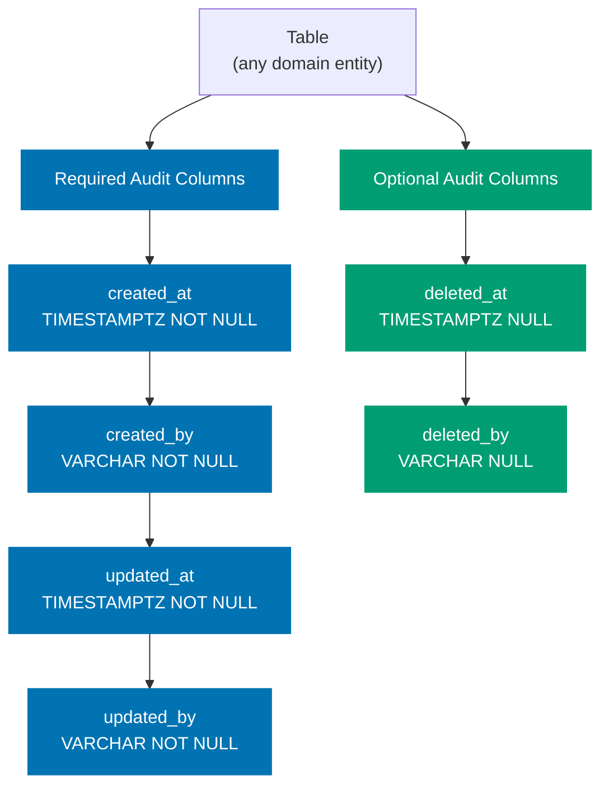

# Database Audit Trail Pattern

Every database table in open-sharia-enterprise MUST include six audit trail columns. These columns record who created, last updated, and soft-deleted each row, along with when each action occurred. Rows with `deleted_at IS NULL` are active; rows with a non-null `deleted_at` are soft-deleted and invisible to normal queries.

## Principles Implemented/Respected

This pattern implements the following core principles:

- **[Explicit Over Implicit](../../principles/software-engineering/explicit-over-implicit.md)**: All audit metadata is stored in dedicated, named columns with mandatory types and nullability. There is no implicit or hidden tracking; every change is visible in the schema.

- **[Automation Over Manual](../../principles/software-engineering/automation-over-manual.md)**: Spring Data JPA Auditing populates `created_at`, `created_by`, `updated_at`, and `updated_by` automatically via `@EntityListeners`. Manual annotation in service code is only required for soft-delete columns.

- **[Reproducibility First](../../principles/software-engineering/reproducibility.md)**: Migration tool changelogs with environment qualifiers ensure the schema is reproducible across PostgreSQL (dev/staging/prod) and in-process test databases without divergence.

- **[Documentation First](../../principles/content/documentation-first.md)**: This pattern documents the required columns, types, and implementation approach before any table is created, ensuring teams follow a consistent and verifiable standard.

## Conventions Implemented/Respected

This pattern respects the following conventions:

- **[Content Quality Principles](../../conventions/writing/quality.md)**: This document uses active voice, a single H1, and proper heading nesting.

- **[Acceptance Criteria Convention](../infra/acceptance-criteria.md)**: The compliance checklist at the end of this document provides testable, concrete criteria for verifying a table meets this pattern.

## Required Audit Columns

Every table MUST include all six columns in the order listed below.



| Column       | Type           | Nullable | Default    | Description                         |
| ------------ | -------------- | -------- | ---------- | ----------------------------------- |
| `created_at` | `TIMESTAMPTZ`  | NOT NULL | `NOW()`    | When the row was created (UTC)      |
| `created_by` | `VARCHAR(255)` | NOT NULL | `'system'` | Who or what created the row         |
| `updated_at` | `TIMESTAMPTZ`  | NOT NULL | `NOW()`    | When the row was last updated (UTC) |
| `updated_by` | `VARCHAR(255)` | NOT NULL | `'system'` | Who or what last updated the row    |
| `deleted_at` | `TIMESTAMPTZ`  | NULL     | —          | When the row was soft-deleted (UTC) |
| `deleted_by` | `VARCHAR(255)` | NULL     | —          | Who or what soft-deleted the row    |

Blue columns (required) are always non-null and managed by JPA Auditing. Green columns (optional by value) are always present in the schema but null for active rows.

## Why This Pattern Exists

**Auditability**: Every change to every row is traceable to an actor and a timestamp. Security reviews, compliance audits, and internal investigations can reconstruct the full history of any record.

**Soft-Delete**: Setting `deleted_at` and `deleted_by` hides a row from normal queries without destroying data. Hard deletes make recovery impossible and break foreign key history. Soft-delete preserves referential integrity and enables undelete workflows.

**Compliance**: Sharia-compliant financial systems require evidence that transactions and contracts were not retroactively altered. The audit columns provide an immutable creation record and a last-modified record for every entity.

**Production Debugging**: When an incident occurs, `updated_at` narrows the time window and `updated_by` identifies the service or user responsible. Without these columns, incident investigation relies on log search, which is slower and less reliable.

## Migration Tool by Language

Each backend uses the idiomatic migration tool for its language and framework ecosystem. All tools must apply the same six audit columns to every table.

| App             | Migration Tool | License |
| --------------- | -------------- | ------- |
| organiclever-be | DbUp (F#)      | MIT     |

> For polyglot migration tool patterns (Liquibase, Ecto, Alembic, goose, Flyway, EF Core, Migratus, @effect/sql, SQLx, Drizzle), see the [ose-primer](https://github.com/wahidyankf/ose-primer) repository.

For licensing decisions related to Liquibase's FSL-1.1-ALv2 licence (introduced in version 5.0), see [Licensing Decisions](../../../docs/explanation/software-engineering/licensing/licensing-decisions.md).

## Schema Migration

Every backend applies the six audit columns through its migration tool. The canonical column definitions are identical regardless of tool — only the migration file format differs.

Regardless of the tool used, migrations must satisfy:

- All six audit columns present in every table, in the order listed above
- `created_at` and `updated_at` use timezone-aware timestamps (`TIMESTAMPTZ` for PostgreSQL, equivalent for other databases)
- `created_by` and `updated_by` default to `'system'` so raw migrations and background jobs produce a traceable actor
- `deleted_at` and `deleted_by` are nullable with no default — `NULL` is the active-row state
- Each migration is reversible (rollback support where the tool provides it)

### Java / Spring Boot: Liquibase

Use a SQL-formatted Liquibase changeset. The `dbms` qualifier selects the correct SQL for each environment. Both PostgreSQL and H2 variants live in the same file.

The following example shows the `users` table as the reference implementation. Apply the same pattern to every new table.

```sql
-- liquibase formatted sql

-- changeset author:create-table-name dbms:postgresql
CREATE TABLE table_name (
    id          UUID            NOT NULL DEFAULT gen_random_uuid(),
    -- ... domain columns ...

    created_at  TIMESTAMPTZ     NOT NULL DEFAULT NOW(),
    created_by  VARCHAR(255)    NOT NULL DEFAULT 'system',
    updated_at  TIMESTAMPTZ     NOT NULL DEFAULT NOW(),
    updated_by  VARCHAR(255)    NOT NULL DEFAULT 'system',
    deleted_at  TIMESTAMPTZ,
    deleted_by  VARCHAR(255),

    CONSTRAINT pk_table_name PRIMARY KEY (id)
);
-- rollback DROP TABLE table_name;

-- changeset author:create-table-name-h2 dbms:h2
CREATE TABLE table_name (
    id          UUID            NOT NULL DEFAULT RANDOM_UUID(),
    -- ... domain columns ...

    created_at  TIMESTAMPTZ     NOT NULL DEFAULT NOW(),
    created_by  VARCHAR(255)    NOT NULL DEFAULT 'system',
    updated_at  TIMESTAMPTZ     NOT NULL DEFAULT NOW(),
    updated_by  VARCHAR(255)    NOT NULL DEFAULT 'system',
    deleted_at  TIMESTAMPTZ,
    deleted_by  VARCHAR(255),

    CONSTRAINT pk_table_name PRIMARY KEY (id)
);
-- rollback DROP TABLE table_name;
```

Key points:

- `TIMESTAMPTZ` is used for both PostgreSQL and H2. H2 in PostgreSQL compatibility mode (`MODE=PostgreSQL`) recognises `TIMESTAMPTZ` as an alias for `TIMESTAMP WITH TIME ZONE`.
- `DEFAULT NOW()` provides a safe fallback when JPA Auditing is not active (e.g., raw SQL inserts in migrations).
- `DEFAULT 'system'` for `_by` columns provides a traceable actor for migrations and system operations.
- `deleted_at` and `deleted_by` have no default because `NULL` is the intended initial state.

## JPA Entity Implementation

### Entity Class

Annotate every entity with `@EntityListeners(AuditingEntityListener.class)`. Use JPA Auditing annotations for the first four columns. Set `deleted_at` and `deleted_by` manually in the service layer.

```java
@NullMarked
package com.ademobejasb.auth.model;

import jakarta.persistence.*;
import org.jspecify.annotations.Nullable;
import org.springframework.data.annotation.*;
import org.springframework.data.jpa.domain.support.AuditingEntityListener;

import java.time.Instant;
import java.util.UUID;

@Entity
@Table(name = "table_name")
@EntityListeners(AuditingEntityListener.class)
@Where(clause = "deleted_at IS NULL")
public class DomainEntity {

    @Id
    @GeneratedValue(strategy = GenerationType.UUID)
    private UUID id;

    // --- Audit columns ---

    @CreatedDate
    @Column(name = "created_at", nullable = false, updatable = false)
    private Instant createdAt;

    @CreatedBy
    @Column(name = "created_by", nullable = false, updatable = false, length = 255)
    private String createdBy;

    @LastModifiedDate
    @Column(name = "updated_at", nullable = false)
    private Instant updatedAt;

    @LastModifiedBy
    @Column(name = "updated_by", nullable = false, length = 255)
    private String updatedBy;

    @Nullable
    @Column(name = "deleted_at")
    private Instant deletedAt;

    @Nullable
    @Column(name = "deleted_by", length = 255)
    private String deletedBy;

    // ... constructors, getters, no public setters ...
}
```

### Enable JPA Auditing

Add `@EnableJpaAuditing` to a `@Configuration` class and provide an `AuditorAware<String>` bean. The bean reads the authenticated principal from the Spring Security context, falling back to `"system"` when no authenticated user exists (background jobs, migrations, system operations).

```java
@Configuration
@EnableJpaAuditing(auditorAwareRef = "auditorProvider")
public class JpaAuditingConfig {

    @Bean
    public AuditorAware<String> auditorProvider() {
        return () -> {
            Authentication auth =
                SecurityContextHolder.getContext().getAuthentication();
            if (auth == null || !auth.isAuthenticated()
                    || "anonymousUser".equals(auth.getPrincipal())) {
                return Optional.of("system");
            }
            return Optional.of(auth.getName());
        };
    }
}
```

### Soft-Delete in the Service Layer

`deleted_at` and `deleted_by` are NOT managed by JPA Auditing. The service layer sets them explicitly before saving. Never call `repository.delete()` on audited entities; always use soft-delete.

```java
// UserNotFoundException is a checked exception (extends Exception), not RuntimeException.
// Project convention requires checked exceptions so error paths are visible in signatures.
public void deleteUser(UUID userId) throws UserNotFoundException {
    User user = userRepository.findById(userId)
        .orElseThrow(() -> new UserNotFoundException(userId));

    Authentication auth = SecurityContextHolder.getContext().getAuthentication();
    String actor = (auth != null && auth.isAuthenticated()
            && !"anonymousUser".equals(auth.getPrincipal()))
        ? auth.getName() : "system";

    user.setDeletedAt(Instant.now());
    user.setDeletedBy(actor);
    userRepository.save(user);
}
```

## Soft-Delete Query Discipline

The `@Where(clause = "deleted_at IS NULL")` annotation on the entity automatically filters soft-deleted rows for all Spring Data JPA queries, JPQL, and Criteria API queries generated by that repository. This means:

- `findAll()` returns only active rows.
- `findById(id)` returns `Optional.empty()` for soft-deleted rows.
- Custom `@Query` methods using JPQL inherit the `@Where` filter automatically.

**PASS: correct query — soft-deleted rows excluded automatically**:

```java
// @Where on entity handles filtering; no manual WHERE clause needed
List<User> activeUsers = userRepository.findAll();
```

**FAIL: never bypass soft-delete with native SQL that ignores `deleted_at`**:

```java
// This returns soft-deleted rows — only acceptable for admin/audit screens
@Query(value = "SELECT * FROM users", nativeQuery = true)
List<User> findAllIncludingDeleted();
```

When a native query or admin endpoint legitimately needs to access soft-deleted rows (e.g., audit log screen, data recovery), name the method clearly (e.g., `findAllIncludingDeleted`) and restrict access to admin roles.

## `@NullMarked` Compatibility

All packages use `@NullMarked` (JSpecify). The audit field nullability must match:

| Field       | Java type | Annotation    | Rationale                                    |
| ----------- | --------- | ------------- | -------------------------------------------- |
| `createdAt` | `Instant` | (none needed) | Non-null; JPA Auditing always populates it   |
| `createdBy` | `String`  | (none needed) | Non-null; fallback `"system"` always present |
| `updatedAt` | `Instant` | (none needed) | Non-null; JPA Auditing always populates it   |
| `updatedBy` | `String`  | (none needed) | Non-null; fallback `"system"` always present |
| `deletedAt` | `Instant` | `@Nullable`   | Null means active row                        |
| `deletedBy` | `String`  | `@Nullable`   | Null means active row                        |

Under `@NullMarked`, all types are non-null by default. Only `deletedAt` and `deletedBy` require an explicit `@Nullable` annotation.

## Compliance Checklist

Use this checklist when adding a new table or reviewing an existing one.

### Schema (All Migration Tools)

- [ ] Migration includes all six audit columns in the correct order
- [ ] `created_at` and `updated_at` are timezone-aware timestamps, NOT NULL, defaulting to the current time
- [ ] `created_by` and `updated_by` are string columns (max 255 chars), NOT NULL, defaulting to `'system'`
- [ ] `deleted_at` and `deleted_by` are nullable with no default
- [ ] Migration is reversible (rollback or down migration provided where the tool supports it)

**Java / Spring Boot (Liquibase) additional checks:**

- [ ] Separate `-- changeset` blocks use `dbms:postgresql` and `dbms:h2` qualifiers
- [ ] Rollback statement present in each changeset

### Entity (Java)

- [ ] Entity class is annotated with `@EntityListeners(AuditingEntityListener.class)`
- [ ] Entity class is annotated with `@Where(clause = "deleted_at IS NULL")`
- [ ] `createdAt` uses `@CreatedDate` and `updatable = false`
- [ ] `createdBy` uses `@CreatedBy` and `updatable = false`
- [ ] `updatedAt` uses `@LastModifiedDate`
- [ ] `updatedBy` uses `@LastModifiedBy`
- [ ] `deletedAt` and `deletedBy` are annotated `@Nullable`
- [ ] Package-level `@NullMarked` annotation is present

### Configuration

- [ ] `@EnableJpaAuditing` is present on a `@Configuration` class
- [ ] `AuditorAware<String>` bean is registered
- [ ] `AuditorAware` bean falls back to `"system"` when no authenticated user exists

### Service Layer

- [ ] No call to `repository.delete()` or `repository.deleteById()` on audited entities
- [ ] Soft-delete sets both `deletedAt` and `deletedBy` before calling `save()`
- [ ] Actor for soft-delete comes from `SecurityContextHolder` with `"system"` fallback

### Queries

- [ ] No native SQL queries bypass `deleted_at IS NULL` filtering without explicit justification
- [ ] Admin/audit queries that intentionally include soft-deleted rows are named clearly and access-restricted

## Related Documentation

- [Acceptance Criteria Convention](../infra/acceptance-criteria.md) - Writing testable criteria for features involving audited entities
- [Functional Programming Practices](./functional-programming.md) - Pure functions for business logic separate from audit side effects
- [Reproducible Environments Convention](../workflow/reproducible-environments.md) - Why H2/PostgreSQL parity matters for test reliability
- [Licensing Decisions](../../../docs/explanation/software-engineering/licensing/licensing-decisions.md) - License analysis for migration tools (Liquibase FSL-1.1-ALv2, Hibernate LGPL-2.1, and others)

## References

**Project Plans:**

- [Auth Register/Login Tech Docs](../../../plans/done/2026-03-09__auth-register-login/tech-docs.md) - Reference implementation of the `users` table applying this pattern

**External (Java / Spring Boot):**

- [Spring Data JPA Auditing Reference](https://docs.spring.io/spring-data/jpa/reference/auditing.html)
- [Liquibase SQL Format Changelogs](https://docs.liquibase.com/concepts/changelogs/sql-format.html)
- [JSpecify `@NullMarked`](https://jspecify.dev/docs/user-guide/)

**External (Other Ecosystems):**

- [goose migrations (Go)](https://github.com/pressly/goose)
- [Alembic migrations (Python)](https://alembic.sqlalchemy.org/)
- [SQLx migrations (Rust)](https://docs.rs/sqlx/latest/sqlx/macro.migrate.html)
- [Ecto migrations (Elixir)](https://hexdocs.pm/ecto_sql/Ecto.Migration.html)
- [DbUp migrations (F#/.NET)](https://dbup.readthedocs.io/)
- [EF Core Migrations (C#/.NET)](https://learn.microsoft.com/en-us/ef/core/managing-schemas/migrations/)
- [Flyway Community (Kotlin/JVM)](https://documentation.red-gate.com/flyway/flyway-cli-and-api)
- [Migratus (Clojure)](https://github.com/yogthos/migratus)
- [@effect/sql Migrator (TypeScript)](https://effect.website/docs/sql/sql-migrator)
- [Drizzle migrations (TypeScript)](https://orm.drizzle.team/docs/migrations)

## Migration Tooling Pitfalls

Lessons from adding migration tooling across 8 language ecosystems (2026-03-27). These apply to any
project replacing programmatic DDL (`AutoMigrate`, `create_all`, `EnsureCreated`, `SchemaUtils.create`)
with dedicated migration tools.

### Match the original schema exactly

Migration SQL must produce the **identical schema** that the previous programmatic DDL created — same
column types, same precision, same constraints. Common mismatches that break E2E tests:

- **DECIMAL precision**: `DECIMAL(19,4)` forces trailing zeros (`10.5000` vs `10.50`). If the
  original DDL used `DECIMAL` (arbitrary precision), keep it.
- **FK constraints**: ORMs like EF Core `EnsureCreated()` and Exposed `SchemaUtils.create()` often
  do NOT create FK constraints unless navigation properties are explicitly defined. Adding FKs in
  migration SQL breaks code that inserts with empty/placeholder foreign keys (e.g., `Guid.Empty`).
- **Type mismatches**: `UUID` vs `TEXT`, `TIMESTAMPTZ` vs `timestamp without time zone`. Check what
  the ORM driver actually generates.

**Rule**: Before writing migration SQL, inspect the original DDL source (the programmatic code being
replaced) and replicate its types exactly.

### Coverage tool configuration

When adding new NuGet packages (DbUp), Go modules (goose), or Python packages (Alembic):

- **AltCover (.NET)**: Third-party assemblies with source-link debug symbols inflate coverage.
  Add the package name to `--assemblyFilter` (case-sensitive — `dbup`, not `DbUp`).
- **Coverlet (.NET)**: EF Core generated migration files (`Migrations/*.cs`) inflate the
  denominator. Add `**/Migrations/**/*.cs` to `ExcludeByFile` in `.runsettings`.
- **Nx inputs**: For Go apps using `embed.FS`, add the migrations directory to `inputs` in
  `project.json` so Nx cache invalidates when migration files change.

### Embedded filesystem paths

Go's `embed.FS` creates a filesystem rooted at the package directory. When using
`goose.NewProvider(dialect, db, embedFS)`, goose expects migration files at the FS root. If the
embed directive is `//go:embed migrations/*.sql`, files live under `migrations/` — use
`fs.Sub(embedFS, "migrations")` to give goose the correct root.

### JVM locale affects test parsing

Cucumber JVM's `{double}` parameter type uses the JVM default locale. On locales where `.` is the
thousands separator (e.g., `id_ID`), `50.5` parses as `505.0`. Fix by adding
`-Duser.language=en -Duser.country=US` to JVM opts in test runner configuration.

### Docker environment differences

Integration tests (built inside `Dockerfile.integration`) and E2E tests (`dotnet run` / `uv run`
with volume mount) may behave differently:

- **Embedded resources**: `dotnet run` recompiles with embedded resources from volume mount. Verify
  `.fsproj` / `.csproj` includes `<EmbeddedResource>` globs correctly.
- **Go version**: Keep `Dockerfile`, `Dockerfile.integration`, AND `Dockerfile.be.dev` in sync with
  `go.mod`'s Go version requirement.
- **Python Alembic**: The `Dockerfile.integration` needs explicit `COPY alembic/ alembic/` and
  `COPY alembic.ini alembic.ini` — the standard `COPY . .` may not include them if `.dockerignore`
  is aggressive.
