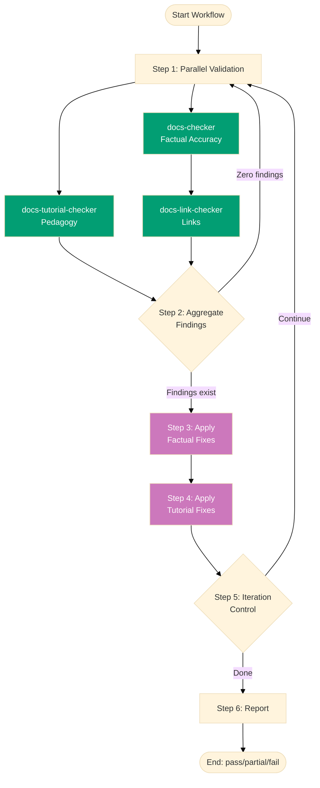

# Documentation Quality Gate Workflow

**Purpose**: Comprehensively validate all documentation content (factual accuracy, pedagogical structure, link validity), apply fixes iteratively until all issues are resolved.

**When to use**:

- After creating or updating documentation
- Before major releases or deployments
- Periodically to ensure documentation quality and accuracy
- After bulk documentation changes or restructuring
- When migrating or refactoring documentation

This workflow implements the **Maker-Checker-Fixer pattern** across three validation dimensions to ensure comprehensive documentation quality before publication.

## Execution Mode

**Preferred Mode**: Agent Delegation — invoke `docs-checker`, `docs-tutorial-checker`,
`docs-link-checker`, `docs-fixer`, and `docs-tutorial-fixer` via the Agent tool
with `subagent_type` (see [Workflow Execution Modes Convention](../meta/execution-modes.md)).

**Fallback Mode**: Manual Orchestration — execute workflow logic directly using
Read/Write/Edit tools when Agent Delegation is unavailable.

The Agent tool runs delegated agents that persist file changes to the actual filesystem, making it
the preferred approach when these agents exist as defined delegated agent types.

**How to Execute**:

```
User: "Run documentation quality gate workflow for docs/tutorials/"
```

The AI will:

1. Invoke `docs-checker`, `docs-tutorial-checker`, and `docs-link-checker` via the Agent tool in parallel (validate, write audits)
2. Invoke `docs-fixer` and `docs-tutorial-fixer` via the Agent tool in sequence (read audits, apply fixes, write fix reports)
3. Iterate until zero findings achieved across all three validators
4. Show git status with modified files
5. Wait for user commit approval

**Fallback (Manual Mode)**:

```
User: "Run documentation quality gate workflow for docs/tutorials/ in manual mode"
```

The AI executes checker and fixer logic directly using Read/Write/Edit tools in the main
context — use this when agent delegation is unavailable.

## Workflow Overview



## Research Delegation

The `docs-checker` and `docs-tutorial-checker` agents invoked by this workflow delegate
multi-page web research to the [`web-research-maker`](../../../.claude/agents/web-research-maker.md)
delegated agent when verifying a single claim requires more than one or two searches, or more than two
fetches. Checkers retain in-context `WebSearch`/`WebFetch` only for single-shot verification
against known authoritative URLs. This keeps each audit context lean. The delegation is encoded
in each checker agent's prompt — no workflow-level configuration required.

## Steps

### 1. Parallel Validation (Parallel)

Run all documentation validators concurrently to identify all issues across different quality dimensions.

**Agent 1a**: `docs-checker`

- **Args**: `scope: {input.scope}, EXECUTION_SCOPE: docs`
- **Output**: `{docs-report-N}` - Factual accuracy, technical correctness, contradictions

**Agent 1b**: `docs-tutorial-checker`

- **Args**: `scope: {input.scope}, EXECUTION_SCOPE: docs`
- **Output**: `{tutorial-report-N}` - Pedagogical structure, narrative flow, visual completeness

**Agent 1c**: `docs-link-checker`

- **Args**: `scope: {input.scope}, EXECUTION_SCOPE: docs`
- **Output**: `{links-report-N}` - Internal/external link validation, cache management

**Success criteria**: All three checkers complete and generate audit reports.

**On failure**: Terminate workflow with status `fail`.

**Notes**:

- All checkers run in parallel (up to max-concurrency) for efficiency
- Each generates independent audit report in `generated-reports/`
- UUID chain scope = "docs" (execution-chain-docs)
- Tutorial-checker gracefully handles non-tutorial files
- Reports use progressive writing to survive context compaction

### 2. Aggregate Findings (Sequential)

Analyze all audit reports to determine if fixes are needed.

**Condition Check**: Count findings based on mode level across all three reports

**Mode-Based Counting**:

- **lax**: Count CRITICAL only
- **normal**: Count CRITICAL + HIGH (default)
- **strict**: Count CRITICAL + HIGH + MEDIUM
- **ocd**: Count all levels (CRITICAL, HIGH, MEDIUM, LOW)

**Below-threshold findings**: Reported but don't block success

- **lax**: HIGH/MEDIUM/LOW reported, not counted
- **normal**: MEDIUM/LOW reported, not counted
- **strict**: LOW reported, not counted
- **ocd**: All findings counted

**Decision**:

- If threshold-level findings > 0: Proceed to step 3 (reset `consecutive_zero_count` to 0)
- If threshold-level findings = 0: Initialize `consecutive_zero_count` to 1 (this check is the
  first zero), proceed to step 1 for confirmation re-check (consecutive pass requirement)

**Depends on**: Step 1 completion

**Notes**:

- Combines findings from all three validation dimensions
- Fix scope determined by mode level
- Below-threshold findings remain visible in audit reports
- Enables progressive quality improvement
- **Link-checker findings count toward total** (blocks success if broken links exist)

### 3. Apply Factual Fixes (Sequential, Conditional)

Fix factual errors, outdated information, technical inaccuracies, and contradictions.

**Agent**: `docs-fixer`

- **Args**: `report: {step1.outputs.docs-report-N}, approved: all, mode: {input.mode}`
- **Output**: `{factual-fixes-applied}` - Fix report with same UUID chain as source audit
- **Condition**: Factual findings exist from step 2
- **Depends on**: Step 2 completion

**Success criteria**: Fixer successfully applies factual fixes without errors.

**On failure**: Log errors, continue to step 4.

**Notes**:

- Re-validates findings before applying (prevents false positives)
- Uses web verification for technical claims
- **Fix scope based on mode**:
  - **lax**: Fix CRITICAL only (skip HIGH/MEDIUM/LOW)
  - **normal**: Fix CRITICAL + HIGH (skip MEDIUM/LOW)
  - **strict**: Fix CRITICAL + HIGH + MEDIUM (skip LOW)
  - **ocd**: Fix all levels (CRITICAL, HIGH, MEDIUM, LOW)
- Below-threshold findings remain untouched
- Preserves documentation intent while ensuring accuracy

### 4. Apply Pedagogical Fixes (Sequential, Conditional)

Fix pedagogical issues, tutorial structure problems, narrative flow issues, and visual completeness gaps.

**Agent**: `docs-tutorial-fixer`

- **Args**: `report: {step1.outputs.tutorial-report-N}, approved: all, mode: {input.mode}`
- **Output**: `{tutorial-fixes-applied}` - Fix report with same UUID chain as source audit
- **Condition**: Tutorial findings exist from step 2
- **Depends on**: Step 3 completion

**Success criteria**: Fixer successfully applies tutorial fixes without errors.

**On failure**: Log errors, proceed to step 5.

**Notes**:

- Runs AFTER docs-fixer (sequential to avoid conflicts)
- Handles subjective tutorial issues carefully
- Only fixes objective, verifiable pedagogical issues
- Respects mode parameter for fix scoping
- Preserves educational narrative and learning objectives

### 5. Iteration Control (Sequential)

Determine whether to continue fixing or finalize.

**Logic**:

- Re-run all checkers (step 1) to get fresh reports
- Count findings based on mode level (same as Step 2):
  - **lax**: Count CRITICAL only
  - **normal**: Count CRITICAL + HIGH
  - **strict**: Count CRITICAL + HIGH + MEDIUM
  - **ocd**: Count all levels
- Track `consecutive_zero_count` across iterations (resets to 0 when threshold-level findings > 0, increments when = 0)
- If consecutive_zero_count >= 2 AND iterations >= min-iterations (or min not provided): Proceed to step 6 (Success — double-zero confirmed)
- If consecutive_zero_count >= 2 AND iterations < min-iterations: Loop back to step 1 (re-validate)
- If consecutive_zero_count < 2 AND threshold-level findings = 0: Loop back to step 1 (confirmation check — no fix needed, just re-verify)
- If threshold-level findings > 0 AND max-iterations provided AND iterations >= max-iterations: Proceed to step 6 (Partial)
- If threshold-level findings > 0 AND (max-iterations not provided OR iterations < max-iterations): Loop back to step 3

**Below-threshold findings**: Continue to be reported in audit but don't affect iteration logic

**Depends on**: Step 4 completion

**Notes**:

- **Default behavior**: Runs up to 7 iterations (default max-iterations). Override with higher value for more attempts
- **Consecutive pass requirement**: Zero findings must be confirmed by a second independent check before declaring success
- **Optional min-iterations**: Prevents premature termination before sufficient iterations
- Each iteration uses the latest audit reports from all validators
- Tracks iteration count for observability
- **Broken links block zero-finding achievement** (no auto-fix available)

### 6. Finalization (Sequential)

Report final status and summary.

**Output**: `{final-status}`, `{iterations-completed}`, `{final-report}`

**Status determination**:

- **Success** (`pass`): Zero threshold-level findings across all validators
- **Partial** (`partial`): Findings remain after max-iterations OR broken links exist
- **Failure** (`fail`): Technical errors during check or fix

**Depends on**: Reaching this step from step 2, 4, or 5

**Notes**:

- Below-threshold findings are reported in final audit but don't prevent success status
- **Broken links always result in `partial` status** (manual intervention required)
- Generates comprehensive summary across all three validation dimensions

## Termination Criteria

**Success** (`pass`):

- **lax**: Zero CRITICAL findings on 2 consecutive checks (HIGH/MEDIUM/LOW may exist)
- **normal**: Zero CRITICAL/HIGH findings on 2 consecutive checks (MEDIUM/LOW may exist)
- **strict**: Zero CRITICAL/HIGH/MEDIUM findings on 2 consecutive checks (LOW may exist)
- **ocd**: Zero findings at all levels on 2 consecutive checks

**Requires**: Zero threshold-level findings across ALL three validators (docs, tutorial, links) confirmed by two consecutive validations (consecutive pass requirement)

**Partial** (`partial`):

- Threshold-level findings remain after max-iterations safety limit
- **Broken links exist** (no fixer available - manual intervention required)
- Some fixers failed to apply changes

**Failure** (`fail`):

- Technical errors during validation
- System failures during execution

**Note**: Below-threshold findings are reported in final audit but don't prevent success status.

## Example Usage

### Standard Invocation (Normal Strictness)

```
User: "Run documentation quality gate workflow in normal mode"
```

The AI will invoke specialized agents via the Agent tool:

- Validate all docs/ content in parallel (`docs-checker`, `docs-tutorial-checker`, `docs-link-checker` subagents)
- Fix CRITICAL/HIGH findings (`docs-fixer`, `docs-tutorial-fixer` subagents)
- Iterate until zero CRITICAL/HIGH findings achieved
- Report MEDIUM/LOW findings without fixing them

### Quick Critical-Only Check (Lax Mode)

```
User: "Run documentation quality gate workflow in lax mode"
```

The AI will invoke agents with minimal criteria:

- Fix CRITICAL findings only
- Report HIGH/MEDIUM/LOW findings without fixing them
- Success when zero CRITICAL findings remain

### Pre-Release Validation (Strict Mode)

```
User: "Run documentation quality gate workflow in strict mode"
```

The AI will invoke agents with stricter criteria:

- Fix CRITICAL/HIGH/MEDIUM findings
- Report LOW findings without fixing them
- Iterate until zero CRITICAL/HIGH/MEDIUM findings achieved

### Comprehensive Audit (OCD Mode)

```
User: "Run documentation quality gate workflow in ocd mode"
```

The AI will invoke agents with zero-tolerance criteria:

- Fix ALL findings (CRITICAL, HIGH, MEDIUM, LOW)
- Iterate until zero findings at all levels
- Equivalent to pre-mode parameter behavior

### Validate Specific Scope

```
User: "Run documentation quality gate workflow for docs/tutorials/"
```

The AI will invoke agents with scoped validation:

- Validate only tutorial files
- Fix issues in that scope only

```
User: "Run documentation quality gate workflow for governance/conventions/structure/file-naming.md"
```

The AI will invoke agents with single-file scope:

- Validate specific file only
- Fix issues in that file

### With Iteration Bounds

```
User: "Run documentation quality gate workflow in normal mode with min-iterations=2 and max-iterations=10"
```

The AI will invoke agents with iteration controls:

- Require at least 2 check-fix cycles
- Cap at maximum 10 iterations
- Report final status after completion

## Iteration Example

Typical execution flow:

```
Iteration 1:
  Parallel Check (3 validators) → 18 total findings
    - Factual: 8 CRITICAL/HIGH findings
    - Tutorial: 6 CRITICAL/HIGH findings
    - Links: 4 broken links
  Sequential Fix → Factual → Tutorial
  Re-check → 4 findings remain (links unfixable)

Iteration 2:
  Parallel Check → 4 findings (all link-related)
  Sequential Fix → Factual (0 new) → Tutorial (0 new)
  Re-check → 4 findings remain

Result: PARTIAL (broken links require manual intervention)

After manual link fixes:

Iteration 3:
  Parallel Check → 0 findings

Result: SUCCESS (3 iterations)
```

## Safety Features

**Infinite Loop Prevention**:

- max-iterations defaults to 7 (override with higher value for more attempts)
- When provided, workflow terminates with `partial` if limit reached
- Tracks iteration count for monitoring
- Escalation warning at iteration 5 if not converging

**Convergence Safeguards**:

- Checker loads `.known-false-positives.md` skip list at start of each iteration
- Fixer persists new FALSE_POSITIVEs to skip list after each run
- Re-validation uses scoped scan (changed files only) to prevent scope expansion
- Factual claims verified in iteration 1 are cached, not re-verified with WebSearch
- Escalation after repeated checker-fixer disagreements on the same finding

**False Positive Protection**:

- Fixers re-validate each finding before applying
- Skips FALSE_POSITIVE findings automatically
- Progressive writing ensures audit history survives

**Error Recovery**:

- Continues to verification even if some fixes fail
- Reports which fixes succeeded/failed
- Generates final report regardless of status

**Mode-Based Progressive Improvement**:

- Start with `mode=lax` for critical issues only
- Progress to `mode=normal` for daily quality
- Use `mode=strict` for pre-release validation
- Apply `mode=ocd` for zero-tolerance requirements

## Validation Dimensions

**Factual Accuracy** (docs-checker):

- Technical correctness using web verification
- Command syntax and flags validation
- Version information accuracy
- Code example API correctness
- Contradiction detection within/across documents
- Outdated information identification
- Mathematical notation validation
- Diagram color accessibility (color-blind palette)

**Pedagogical Quality** (docs-tutorial-checker):

- Tutorial structure and type compliance
- Narrative flow and story arc
- Learning scaffold progression
- Visual completeness (diagrams at 30-50% frequency)
- Hands-on elements (examples, exercises, actionable steps)
- Writing style and engagement
- **Time estimate detection** (forbidden in educational content)
- Color-blind friendly diagrams
- LaTeX delimiter correctness

**Link Validity** (docs-link-checker):

- External URL accessibility (HTTP status codes)
- Internal file reference validity
- Markdown extension presence (.md required)
- Redirect chain tracking
- **Cache management** (docs/metadata/external-links-status.yaml)
- Per-link expiry (6 months individual)
- **NO AUTO-FIX AVAILABLE** - Broken links block success, require manual intervention

## Edge Cases

### Case 1: Only Tutorial-Checker Finds Issues

**Scenario**: Factual and link validators pass, tutorial validator reports findings

**Handling**:

- Step 3 skipped (no factual findings)
- Step 4 runs (tutorial fixer applies fixes)
- Re-validate confirms success across all dimensions

### Case 2: Broken Links Block Success

**Scenario**: Factual and tutorial issues fixed, but link-checker reports broken links

**Handling**:

- No fixer available for links (link-checker reports only)
- Threshold-level findings > 0 (broken links count)
- Max-iterations reached → Status `partial`
- User must manually fix broken links
- Re-run workflow after manual fixes

**Mitigation**:

- Document broken link locations clearly in audit report
- Provide file paths and line numbers for manual fixes
- Recommend running link-checker separately before workflow

### Case 3: Below-Threshold Findings Only

**Scenario**: Mode=normal, but only MEDIUM/LOW findings exist

**Handling**:

- Only CRITICAL/HIGH counted toward threshold
- MEDIUM/LOW reported but don't block
- Fixers skip MEDIUM/LOW (not in scope)
- Success achieved with documented below-threshold issues
- User can re-run with stricter mode if desired

### Case 4: Non-Converging Fixes

**Scenario**: Fixes introduce new issues, findings never reach zero

**Handling**:

- Each iteration tracks finding trends
- Max-iterations reached → Status `partial`
- Report lists remaining issues for investigation
- May indicate fundamental content problems requiring maker intervention

### Case 5: Tutorial-Checker on Non-Tutorial Content

**Scenario**: Tutorial-checker validates reference or how-to documents

**Handling**:

- Tutorial-checker gracefully handles non-tutorial files
- Skips tutorial-specific checks (story arc, scaffold progression)
- Applies universal checks (writing quality, diagram colors, time estimates)
- No false positives from tutorial structure expectations

## Related Workflows

This workflow can be composed with:

- **Repository Rules Validation** (`repo-rules-quality-gate`) - Validate after docs changes affect repository consistency
- Deployment workflows - Validate before deploying documentation sites
- Content creation workflows - Validate after bulk documentation creation
- Migration workflows - Ensure quality during documentation restructuring

## Success Metrics

Track across executions:

- **Average iterations to completion**: How many cycles typically needed
- **Success rate**: Percentage reaching zero findings vs partial/fail
- **Findings by dimension**: Which validators find most issues (factual, pedagogical, links)
- **Fix success rate**: Percentage of fixes applied without errors
- **Common issue categories**: What problems appear most frequently
- **Broken link frequency**: How often manual intervention required

## Notes

- **Three-dimensional validation**: Ensures comprehensive documentation quality
- **Parallel validation**: Efficient checking across all dimensions (up to max-concurrency)
- **Sequential fixing**: Manages dependencies between fixers (factual → tutorial)
- **Mode-based flexibility**: Progressive quality improvement (lax → normal → strict → ocd)
- **Idempotent**: Safe to run multiple times without side effects
- **Observable**: Generates detailed audit reports for each validation dimension
- **Bounded**: Max-iterations prevents runaway execution
- **Link limitation**: Broken links require manual intervention (no auto-fix available)

**Concurrency**: Currently validates in parallel (up to max-concurrency) and fixes sequentially. The `max-concurrency` parameter controls parallel checker execution.

**Best Practice**: Run link-checker separately first (`docs-link-checker` agent) to fix broken links before running full quality gate. This prevents workflow from blocking on unfixable link issues.

This workflow ensures comprehensive documentation quality through multi-dimensional validation, iterative fixing, and mode-based progressive improvement.

## Principles Implemented/Respected

- PASS: **Explicit Over Implicit**: All steps, conditions, and termination criteria are explicit
- PASS: **Automation Over Manual**: Fully automated validation and fixing (except broken links)
- PASS: **Simplicity Over Complexity**: Clear linear flow with mode-based scoping
- PASS: **Accessibility First**: Generates human-readable audit reports, validates color-blind diagrams
- PASS: **Progressive Disclosure**: Can run with different modes and iteration limits
- PASS: **No Time Estimates**: Focus on quality outcomes, not duration

## Conventions Implemented/Respected

- **[File Naming Convention](../../conventions/structure/file-naming.md)**: Workflow file follows plain name convention for workflows
- **[Linking Convention](../../conventions/formatting/linking.md)**: All cross-references use GitHub-compatible markdown with `.md` extensions
- **[Content Quality Principles](../../conventions/writing/quality.md)**: Active voice, proper heading hierarchy, single H1
