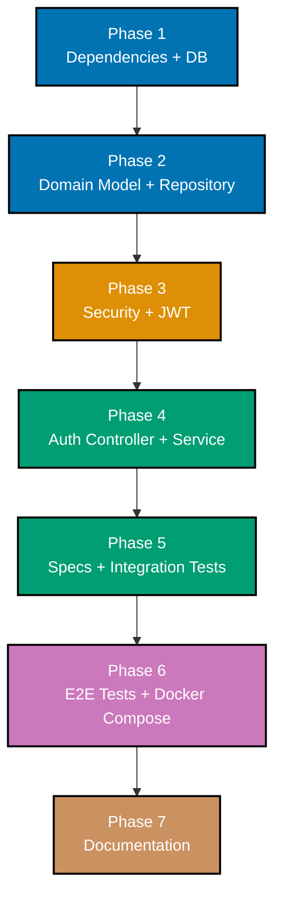

# Delivery

## Phase Overview



## Phase 1 - Dependencies and Database Setup

Add all new Maven dependencies and create the Liquibase changelog.

### Tasks

- [ ] 1.1 Add `spring-boot-starter-security` to `pom.xml`
- [ ] 1.2 Add `spring-boot-starter-data-jpa` to `pom.xml`
- [ ] 1.3 Add `spring-boot-starter-validation` to `pom.xml`
- [ ] 1.4 Add `postgresql` driver (runtime scope) to `pom.xml`
- [ ] 1.5 Add `liquibase-core` to `pom.xml` (no separate dialect jar required)
- [ ] 1.6 Add `jjwt-api`, `jjwt-impl` (runtime), `jjwt-jackson` (runtime) to `pom.xml`; add `<jjwt.version>0.12.6</jjwt.version>` property; use `${jjwt.version}` in version tags
- [ ] 1.7 Add `h2` (test scope) and `spring-security-test` (test scope) to `pom.xml`
- [ ] 1.8 Create directory `apps/organiclever-be/src/main/resources/db/changelog/changes/`
- [ ] 1.9 Create `db/changelog/db.changelog-master.yaml` with `includeAll` pointing to `db/changelog/changes/`
- [ ] 1.10 Create `db/changelog/changes/001-create-users-table.sql` as a Liquibase SQL formatted changelog; include two changesets: `dbms:postgresql` (using `gen_random_uuid()`) and `dbms:h2` (using `RANDOM_UUID()`); both changesets MUST include all 6 audit trail columns (`created_at`, `created_by`, `updated_at`, `updated_by`, `deleted_at`, `deleted_by`) per the database audit trail convention; add `-- rollback DROP TABLE users;` after each `CREATE TABLE`
- [ ] 1.11 Add `spring.liquibase.change-log` and JWT properties to `application.yml`
- [ ] 1.12 Add datasource + JPA config to `application-dev.yml` (no Liquibase override needed)
- [ ] 1.13 Update `application-test.yml`: add H2 datasource and H2 Dialect (no separate Liquibase config — `dbms:h2` changeset is selected automatically)
- [ ] 1.14 Add datasource + JPA config to `application-staging.yml` (env-var-driven)
- [ ] 1.15 Add datasource + JPA config to `application-prod.yml` (env-var-driven)
- [ ] 1.16 Verify `mvn compile -q` succeeds with new dependencies
- [ ] 1.17 Commit: `feat(organiclever-be): add DB dependencies and Liquibase changelog`

### Validation

- [ ] `mvn compile` exits 0
- [ ] `001-create-users-table.sql` contains two changesets: `dbms:postgresql` with `gen_random_uuid()` and `dbms:h2` with `RANDOM_UUID()`; both include `-- rollback DROP TABLE users;`
- [ ] `db.changelog-master.yaml` references `db/changelog/changes/` via `includeAll`

## Phase 2 - Domain Model and Repository

Create the `User` entity, `UserRepository`, and all associated packages.

### Tasks

- [ ] 2.1 Create package `com.organiclever.be.auth.model` with `package-info.java` (`@NullMarked`)
- [ ] 2.2 Create `User.java` entity with fields: `id (UUID)`, `username`, `passwordHash`, and all 6 audit trail fields (`createdAt`, `createdBy`, `updatedAt`, `updatedBy`, `@Nullable deletedAt`, `@Nullable deletedBy`); annotate with `@Entity`, `@Table(name="users")`, `@EntityListeners(AuditingEntityListener.class)`, `@Where(clause = "deleted_at IS NULL")`; use `@CreatedDate`, `@CreatedBy`, `@LastModifiedDate`, `@LastModifiedBy` on audit fields; add a `protected User()` no-arg constructor (required by JPA) and a `public User(String username, String passwordHash)` constructor; no public setters
- [ ] 2.3 Create package `com.organiclever.be.auth.repository` with `package-info.java`
- [ ] 2.4 Create `UserRepository.java` extending `JpaRepository<User, UUID>` with methods: `Optional<User> findByUsername(String username)` and `boolean existsByUsername(String username)`
- [ ] 2.5 Create package `com.organiclever.be.auth.dto` with `package-info.java`
- [ ] 2.6 Create `RegisterRequest.java` record with: `username` annotated `@NotBlank @Size(min=5, max=50) @Pattern(regexp="^[a-zA-Z0-9_]{5,50}$")` (alphanumeric + underscore only, min 5 chars); `password` annotated `@NotBlank @Size(min=8, max=128) @Pattern(regexp="^(?=.*[a-z])(?=.*[A-Z])(?=.*\\d)(?=.*[!@#$%^&*()_+\\-=\\[\\]{};':\"\\\\,.<>/?]).{8,128}$")` (must contain uppercase, lowercase, digit, special character)
- [ ] 2.7 Create `LoginRequest.java` record with `@NotBlank String username` and `@NotBlank String password`
- [ ] 2.8 Create `RegisterResponse.java` record with `UUID id`, `String username`, `Instant createdAt`
- [ ] 2.9 Create `AuthResponse.java` record with `String token`, `String type`; add static factory `bearer(String token)`
- [ ] 2.10 Create package `com.organiclever.be.config` with `package-info.java`
- [ ] 2.11 Create `JpaAuditingConfig.java` in `com.organiclever.be.config` annotated with `@Configuration @EnableJpaAuditing(auditorAwareRef = "auditorProvider")`; define an `AuditorAware<String> auditorProvider()` lambda bean that reads `auth.getName()` from `SecurityContextHolder` and falls back to `"system"` for unauthenticated/anonymous users; use `"anonymousUser".equals(auth.getPrincipal())` (constant first, NPE-safe)
- [ ] 2.12 Verify `mvn compile -q` succeeds
- [ ] 2.13 Commit: `feat(organiclever-be): add User domain model and repository`

### Validation

- [ ] `mvn compile` exits 0
- [ ] `User` entity has `@NullMarked` on its package (via `package-info.java`)
- [ ] `User` entity has all 6 audit trail columns annotated with `@CreatedDate`, `@CreatedBy`, `@LastModifiedDate`, `@LastModifiedBy`, and `@Nullable` for soft-delete fields
- [ ] `User` entity is annotated with `@EntityListeners(AuditingEntityListener.class)` and `@Where(clause = "deleted_at IS NULL")`
- [ ] `RegisterRequest.username` has `@NotBlank`, `@Size(min=5, max=50)`, and `@Pattern` (alphanumeric + underscore)
- [ ] `RegisterRequest.password` has `@NotBlank`, `@Size(min=8, max=128)`, and `@Pattern` (uppercase + lowercase + digit + special char)
- [ ] All DTO classes are Java records (immutable)
- [ ] `UserRepository` extends `JpaRepository<User, UUID>` with no custom SQL

## Phase 3 - Spring Security and JWT Infrastructure

Add `SecurityConfig`, `JwtUtil`, `JwtAuthFilter`, and custom exceptions.

### Tasks

- [ ] 3.1 Create package `com.organiclever.be.security` with `package-info.java`
- [ ] 3.2 Create `JwtUtil.java` with constructor-injected `@Value("${app.jwt.secret}")` and `@Value("${app.jwt.expiration-ms:86400000}")`; implement `generateToken(String username)`, `extractUsername(String token)`, and `isTokenValid(String token)` using JJWT 0.12.x API (`Keys.hmacShaKeyFor`, `Jwts.builder()`, `Jwts.parser().verifyWith()`)
- [ ] 3.3 Create `JwtAuthFilter.java` extending `OncePerRequestFilter`; inject `JwtUtil` and `UserDetailsService`; extract `Bearer` token from `Authorization` header; if valid, load `UserDetails`, create `UsernamePasswordAuthenticationToken`, set in `SecurityContextHolder`
- [ ] 3.4 Create `SecurityConfig.java` annotated with `@Configuration @EnableWebSecurity`; define `SecurityFilterChain` bean: disable CSRF, stateless sessions, permit `/api/v1/auth/**` and `/actuator/**`, require auth for all other requests, add `JwtAuthFilter` before `UsernamePasswordAuthenticationFilter`
- [ ] 3.5 Add `CorsConfigurationSource` bean inside `SecurityConfig`; use `setAllowedOrigins(List.of("http://localhost:3200", "https://www.organiclever.com"))` — explicit whitelist only, no wildcards; allow methods GET/POST/PUT/DELETE/OPTIONS; restrict headers to `Authorization`, `Content-Type`, `Accept`; wire into `HttpSecurity` via `.cors(cors -> cors.configurationSource(corsConfigurationSource()))`
- [ ] 3.6 Add `PasswordEncoder` bean (`BCryptPasswordEncoder(10)`) inside `SecurityConfig`
- [ ] 3.7 Add `AuthenticationManager` bean inside `SecurityConfig` delegating to `AuthenticationConfiguration`
- [ ] 3.8 Remove or convert `CorsConfig.java` (the existing `WebMvcConfigurer`): either delete it if CORS is fully handled in `SecurityConfig`, or annotate with `@ConditionalOnMissingBean(SecurityFilterChain.class)` to avoid double-CORS configuration
- [ ] 3.9 Create package `com.organiclever.be.auth.service` with `package-info.java`
- [ ] 3.10 Create `UsernameAlreadyExistsException.java` in `com.organiclever.be.auth.service` extending `Exception` (not `RuntimeException`); checked exception makes the error path explicit in the service and controller signatures
- [ ] 3.11 Create `InvalidCredentialsException.java` in `com.organiclever.be.auth.service` extending `Exception` (not `RuntimeException`); same reasoning as above
- [ ] 3.12 Create `GlobalExceptionHandler.java` in `com.organiclever.be.config`: handle `UsernameAlreadyExistsException` → 409, handle `InvalidCredentialsException` → 401, each returning `Map.of("message", ex.getMessage())`
- [ ] 3.13 Verify `mvn compile -q` succeeds
- [ ] 3.14 Commit: `feat(organiclever-be): add Spring Security and JWT infrastructure`

### Validation

- [ ] `mvn compile` exits 0
- [ ] `SecurityConfig` disables CSRF and configures stateless sessions
- [ ] `/api/v1/auth/**` and `/actuator/**` are permitted without authentication
- [ ] `JwtUtil` uses `Keys.hmacShaKeyFor()` (not deprecated constructors)
- [ ] `GlobalExceptionHandler` handles both custom exceptions
- [ ] `CorsConfigurationSource` uses `setAllowedOrigins` (not patterns/wildcards) with exactly `http://localhost:3200` and `https://www.organiclever.com`
- [ ] Allowed headers restricted to `Authorization`, `Content-Type`, `Accept`
- [ ] `UserRepository` uses only derived query methods — no `@Query` with string concatenation
- [ ] `AuthSteps.java` uses `ObjectMapper.writeValueAsString(Map.of(...))` for all JSON construction — no string concatenation

## Phase 4 - Auth Controller and Service

Implement `AuthService`, `UserDetailsServiceImpl`, and `AuthController`.

### Tasks

- [ ] 4.1 Create `UserDetailsServiceImpl.java` in `com.organiclever.be.auth.service` implementing `UserDetailsService`; inject `UserRepository`; implement `loadUserByUsername` to look up user and return `User.withUsername().password().roles("USER").build()`; throw `UsernameNotFoundException` when not found
- [ ] 4.2 Create `AuthService.java` in `com.organiclever.be.auth.service`; inject `UserRepository`, `PasswordEncoder`, `JwtUtil`; implement `register(RegisterRequest) throws UsernameAlreadyExistsException` checking `existsByUsername`, saving with `userRepository.save(user)`, returning `new RegisterResponse(saved.getId(), saved.getUsername(), saved.getCreatedAt())`; implement `login(LoginRequest) throws InvalidCredentialsException` using `findByUsername`, verifying with `passwordEncoder.matches(request.password(), user.getPasswordHash())`, returning `AuthResponse.bearer(token)`; use `InvalidCredentialsException::new` method reference with `orElseThrow`
- [ ] 4.3 Create package `com.organiclever.be.auth.controller` with `package-info.java`
- [ ] 4.4 Create `AuthController.java` with `@RestController @RequestMapping("/api/v1/auth")`; inject `AuthService`; implement `POST /register throws UsernameAlreadyExistsException` returning 201 with `RegisterResponse`; implement `POST /login throws InvalidCredentialsException` returning 200 with `AuthResponse`; annotate request bodies with `@Valid`; Spring's `@ExceptionHandler` in `GlobalExceptionHandler` will catch the declared checked exceptions
- [ ] 4.5 Verify `mvn compile -q` succeeds
- [ ] 4.6 Run integration tests to check for regressions: `mvn test -P integration -q`; hello and health scenarios must still pass (auth header now required for `/api/v1/hello`)
- [ ] 4.7 If existing hello/health integration tests fail due to Spring Security 401, update `HelloSteps` to send a valid JWT; or update the test to use a token acquired from `/api/v1/auth/login`
- [ ] 4.8 Commit: `feat(organiclever-be): add auth register and login endpoints`

### Validation

- [ ] `mvn compile` exits 0
- [ ] `POST /api/v1/auth/register` returns 201 when called manually (e.g., via curl or local run)
- [ ] `POST /api/v1/auth/login` returns 200 with `token` and `type: "Bearer"` fields
- [ ] Existing hello/health tests still pass with updated step definitions

## Phase 5 - Specs and Integration Tests

Create Gherkin feature files and Cucumber step definitions for all auth scenarios.

### Tasks

- [ ] 5.1 Create directory `specs/apps/organiclever-be/auth/`
- [ ] 5.2 Create `specs/apps/organiclever-be/auth/register.feature` with all register scenarios from `requirements.md` Story 1 acceptance criteria (all scenarios including: success, duplicate, empty username, short username, invalid username format, empty password, short password, weak password no uppercase, weak password no special character)
- [ ] 5.3 Create `specs/apps/organiclever-be/auth/login.feature` with all login scenarios from `requirements.md` Story 2 acceptance criteria (5 scenarios: success, wrong password, unknown user, empty username, empty password)
- [ ] 5.4 Create `specs/apps/organiclever-be/auth/jwt-protection.feature` with all JWT protection scenarios from `requirements.md` Story 3 acceptance criteria (6 scenarios: no token 401, valid token 200, expired token 401, malformed token 401, actuator no-auth, auth endpoint no-auth)
- [ ] 5.5 Update `specs/apps/organiclever-be/README.md` to list the new `auth/` directory and its feature files
- [ ] 5.6 Create `TokenStore.java` in `apps/organiclever-be/src/test/java/com/organiclever/be/integration/` (see tech-docs for class definition)
- [ ] 5.7 Create `AuthSteps.java` in `apps/organiclever-be/src/test/java/com/organiclever/be/integration/steps/` (see tech-docs for class definition)
- [ ] 5.8 Update `CommonSteps.java` `@Before` hook: inject `UserRepository` and `TokenStore`; call `userRepository.deleteAllInBatch()` first (resets H2 state between scenarios — `deleteAllInBatch()` bypasses `@Where` and issues a single `DELETE FROM users`), then `responseStore.clear()`, then `tokenStore.clear()`
- [ ] 5.9 Update `CucumberSpringContextConfig.java` to apply `SecurityMockMvcConfigurer.springSecurity()` to `MockMvc` builder
- [ ] 5.10 Add additional `Then` steps to `AuthSteps.java` for response body assertions: "the response body should contain {string} equal to {string}", "the response body should not contain a {string} field", "the response body should contain a non-null {string} field", "the response body should contain a {string} field", "the response body should contain an error message about duplicate username", "the response body should contain an error message about invalid credentials", "the response body should contain a validation error for {string}"
- [ ] 5.11 Add steps for JWT-protected endpoint tests to `HelloSteps.java` or a new `ProtectedEndpointSteps.java`: "a client sends GET /api/v1/hello without an Authorization header", "a client sends GET /api/v1/hello with the stored Bearer token", "a client sends GET /api/v1/hello with an expired Bearer token", "a client sends GET /api/v1/hello with Authorization header {string}"
- [ ] 5.12 Run `mvn test -P integration -q` and verify all scenarios pass
- [ ] 5.13 Run `mvn test -P integration` **twice in a row** to confirm scenario isolation: the second run must produce identical results (no 409 from leftover `"alice"` data)
- [ ] 5.14 Run `mvn test -P integration -P nullcheck` to verify NullAway finds no errors
- [ ] 5.15 Check JaCoCo coverage report: `mvn test -P integration` then open `target/site/jacoco/index.html`; confirm ≥95% line coverage
- [ ] 5.16 If coverage is below 95%, identify uncovered lines and add missing scenarios or step definitions
- [ ] 5.17 Commit: `feat(organiclever-be): add auth specs and integration tests`

### Validation

- [ ] All Gherkin scenarios have corresponding step definitions (no `Undefined step` warnings)
- [ ] `mvn test -P integration` exits 0
- [ ] Running `mvn test -P integration` twice consecutively produces identical results (scenario isolation confirmed)
- [ ] JaCoCo line coverage ≥ 95%
- [ ] `package-info.java` exists for `com.organiclever.be.integration.steps` (already present) and for `TokenStore`'s package

## Phase 6 - E2E Tests and Docker Compose

Add Playwright BDD step definitions, DB-cleanup fixture, and update docker-compose with PostgreSQL.

### Tasks

- [ ] 6.1 Add `pg` and `@types/pg` to `devDependencies` in `apps/organiclever-be-e2e/package.json`
- [ ] 6.2 Create `apps/organiclever-be-e2e/tests/utils/token-store.ts` (`setToken`, `getToken`, `clearToken` — see tech-docs)
- [ ] 6.3 Create directory `apps/organiclever-be-e2e/tests/fixtures/`
- [ ] 6.4 Create `apps/organiclever-be-e2e/tests/fixtures/db-cleanup.ts` using `pg` `Client` to `DELETE FROM users`; read connection string from `DATABASE_URL` env var (see tech-docs)
- [ ] 6.5 Create directory `apps/organiclever-be-e2e/tests/hooks/`
- [ ] 6.6 Create `apps/organiclever-be-e2e/tests/hooks/db.hooks.ts` with a `Before` hook that calls `cleanupDatabase()` and `clearToken()` before every scenario
- [ ] 6.7 Create directory `apps/organiclever-be-e2e/tests/steps/auth/`
- [ ] 6.8 Create `apps/organiclever-be-e2e/tests/steps/auth/auth.steps.ts` with all Given/When/Then steps for register, login, and JWT-protected endpoint scenarios (see tech-docs for full implementation)
- [ ] 6.9 Update `infra/dev/organiclever/docker-compose.yml`: add `organiclever-db` service (PostgreSQL 17-alpine) with named volume, healthcheck, and `organiclever-network`
- [ ] 6.10 Update `organiclever-be` service in `docker-compose.yml`: add `depends_on.organiclever-db.condition: service_healthy`; add env vars `SPRING_DATASOURCE_URL`, `SPRING_DATASOURCE_USERNAME`, `SPRING_DATASOURCE_PASSWORD`, `APP_JWT_SECRET`
- [ ] 6.11 Add `organiclever-db-data` named volume to `volumes:` section of `docker-compose.yml`
- [ ] 6.12 Update `infra/dev/organiclever/docker-compose.e2e.yml`: add `DATABASE_URL` env var pointing to `organiclever-db` for the E2E runner
- [ ] 6.13 Create or update `infra/dev/organiclever/.env.example` with `POSTGRES_USER`, `POSTGRES_PASSWORD`, `APP_JWT_SECRET`, `DATABASE_URL` variables
- [ ] 6.14 Verify docker-compose starts cleanly: `docker compose -f infra/dev/organiclever/docker-compose.yml up --wait organiclever-db organiclever-be`
- [ ] 6.15 Run E2E tests against the live stack: `nx run organiclever-be-e2e:test:e2e`
- [ ] 6.16 Commit: `feat(organiclever-be-e2e): add auth E2E step definitions with DB cleanup`
- [ ] 6.17 Commit: `feat(infra): add PostgreSQL service to organiclever docker-compose`

### Validation

- [ ] `docker compose up` starts `organiclever-db` and `organiclever-be` without errors
- [ ] `organiclever-be` healthcheck passes after startup
- [ ] `token-store.ts` and `db-cleanup.ts` exist and compile without errors (`nx run organiclever-be-e2e:lint`)
- [ ] `Before` hook in `db.hooks.ts` runs before every scenario (verify by checking `users` table is empty at start of each test)
- [ ] All auth E2E scenarios pass in Playwright
- [ ] `.env.example` documents all required environment variables including `DATABASE_URL`

## Phase 7 - Documentation

Update all affected documentation files.

### Tasks

- [ ] 7.1 Update `specs/apps/organiclever-be/README.md`: list the three new auth feature files under a new `auth/` section (`auth/register.feature`, `auth/login.feature`, `auth/jwt-protection.feature`)
- [ ] 7.2 Update `apps/organiclever-be/README.md`: document `POST /api/v1/auth/register` and `POST /api/v1/auth/login` endpoints; list required env vars (`APP_JWT_SECRET`, `SPRING_DATASOURCE_URL`, `SPRING_DATASOURCE_USERNAME`, `SPRING_DATASOURCE_PASSWORD`); note Liquibase changelog approach
- [ ] 7.3 Update `apps/organiclever-be-e2e/README.md`: add auth step definitions section, document `tests/utils/token-store.ts`, `tests/fixtures/db-cleanup.ts`, `tests/hooks/db.hooks.ts`; document `DATABASE_URL` env var and `pg` package prerequisite
- [ ] 7.4 Update `infra/dev/organiclever/README.md`: document the new `organiclever-db` PostgreSQL service, how to start the full stack, and all required env vars (`POSTGRES_USER`, `POSTGRES_PASSWORD`, `APP_JWT_SECRET`)
- [ ] 7.5 Update `docs/explanation/software-engineering/platform-web/tools/jvm-spring-boot/ex-soen-plwe-to-jvspbo__data-access.md`: add or expand the Spring Data JPA section documenting the repository pattern used in this project (`JpaRepository<T, ID>`, derived queries like `findByUsername`/`existsByUsername`, `@Entity` with `@GeneratedValue(strategy=GenerationType.UUID)`, `@EntityListeners(AuditingEntityListener.class)`, `@Where` for soft-delete, and `@PrePersist`); include a minimal code example referencing the `UserRepository` pattern
- [ ] 7.6 Update `docs/explanation/software-engineering/platform-web/tools/jvm-spring-boot/ex-soen-plwe-to-jvspbo__security.md`: add a section on the project-specific JWT + Spring Security setup (`SecurityFilterChain`, `JwtAuthFilter`, `OncePerRequestFilter`, stateless sessions, `CorsConfigurationSource` in `SecurityConfig`); reference the JJWT 0.12.x API
- [ ] 7.7 Commit: `docs: update data-access and security docs for JWT and Spring Security pattern`

### Validation

- [ ] `apps/organiclever-be/README.md` describes both auth endpoints and all env vars
- [ ] `specs/apps/organiclever-be/README.md` lists all three auth feature files
- [ ] `apps/organiclever-be-e2e/README.md` documents `DATABASE_URL` and the `pg` dependency
- [ ] `data-access.md` contains expanded Spring Data JPA section with `@Entity`, `JpaRepository`, audit-trail annotations, and soft-delete `@Where` pattern
- [ ] `security.md` contains the project-specific JWT + Spring Security pattern

## Final Acceptance Criteria

```gherkin
Scenario: Auth feature complete
  Given all 7 phases of the delivery checklist are complete
  When the full test suite is run
  Then mvn test -P integration exits 0 for organiclever-be
  And JaCoCo line coverage is at least 95%
  And nx run organiclever-be-e2e:test:e2e exits 0
  And POST /api/v1/auth/register returns 201 for valid input
  And POST /api/v1/auth/login returns 200 with a JWT token for valid credentials
  And GET /api/v1/hello returns 401 without a token
  And GET /api/v1/hello returns 200 with a valid Bearer token
  And GET /actuator/health returns 200 without authentication
```

## Commit Sequence

Execute commits in this order, one per domain boundary:

1. `feat(organiclever-be): add DB dependencies and Liquibase changelog` (Phase 1)
2. `feat(organiclever-be): add User domain model and repository` (Phase 2)
3. `feat(organiclever-be): add Spring Security and JWT infrastructure` (Phase 3)
4. `feat(organiclever-be): add auth register and login endpoints` (Phase 4)
5. `feat(organiclever-be): add auth specs and integration tests` (Phase 5)
6. `feat(organiclever-be-e2e): add auth E2E step definitions with DB cleanup` (Phase 6)
7. `feat(infra): add PostgreSQL service to organiclever docker-compose` (Phase 6)
8. `docs: update data-access and security docs for JWT and Spring Security pattern` (Phase 7)
