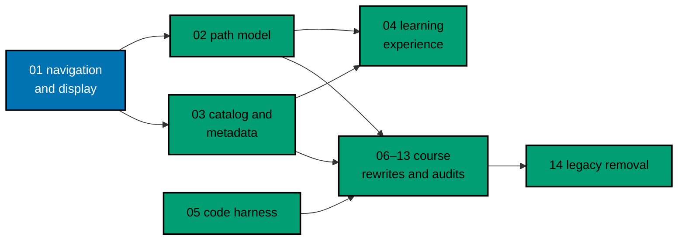

# AyoKoding Learn Revamp 01 — Navigation and Display

> **Status:** Backlog. Do not execute until the user gives an explicit execution command. This plan
> has no predecessor in the series and can start first.

Quick display fixes on the **existing** AyoKoding Learn UI (`apps/ayokoding-www`). Course titles
lose their stale catalogue numbers, and the only order number a reader sees becomes the course's
position in the active path. The path sidebar scrolls to the current course, Overview comes first in
the Learn sidebar, headings stop looking like links, and inline code loses its literal backticks.
Internal "Accuracy notes" become a clean "References" section.

## Scope

- Strip `NN ·` (73 titles) and `Pass N` (3 capstone titles) from course titles and from every place
  those titles are written in course content; regenerate the Learn index pages with
  `ayokoding-www:generate-indexes`.
- Show the path position number in the path syllabus (`path-landing.tsx`), the path rail
  (`path-rail.tsx`, desktop sidebar and mobile drawer), and the arc card preview
  (`syllabus-preview.tsx`, replacing its locked DWT-002 workaround and test). The mobile banner keeps
  its existing "on path · course k of N" readout.
- Auto-scroll the path rail's own container to the current course, without moving the page.
- Put Overview first in the Learn sidebar by fixing the bucket weights (interim: plan 04 later folds
  Overview into a redesigned `/en/learn` landing page).
- Style section headings as headings and remove literal backticks from inline code.
- Convert "Accuracy notes" sections, labels, and internal tags in 153 course files into "References"
  with plain-language caveats, by an exact rule with zero-hit and URL-preservation checks.
- Add a unit guard and two content rules so neither problem returns.

## Non-Goals

- Phase grouping, prerequisite revision, outline badges (plan 02); catalog and course metadata
  (plan 03); roadmap page, progress tracking, context bar, mark-complete, and the `/en/learn` landing
  redesign (plan 04); the example-code harness (plan 05); course rewrites and audits (plans 06–13);
  deleting `learn/legacy` (plan 14).
- Indonesian content (`content/id/**`).

## Series Context

This is plan 01 of the 14-plan AyoKoding Learn Revamp series. One plan is one PR with its own
worktree. The full dependency table and the user decisions this plan implements (1, 24, 25, 35) are
copied into [tech-docs.md §2](./tech-docs.md#2-series-context), so this plan does not depend on any
scratch file.

## Approach Summary

1. Phase 0 provisions the execution worktree `worktrees/ayokoding-learn-revamp-01-navigation-and-display/`,
   records a green baseline, and measures the exact inventory.
2. Each behaviour slice follows Gherkin first, then RED, GREEN, REFACTOR: rendering fixes, Learn
   order, title strip and index regeneration, position numbers, rail auto-scroll, References
   conversion.
3. Rules and docs propagation land the two new content rules and update the spec indexes.
4. Manual Playwright verification in both locales at 375, 768, and 1280 px, then the rule-15
   three-tester retest.
5. Local gates, one PR with exact-head CI and leak review, Knowledge Capture, archival, merge, and
   worktree cleanup.

## Navigation

- [Business requirements](./brd.md)
- [Product requirements, Gherkin, and UI design funnel](./prd.md)
- [Technical design, decisions, and File-Impact Analysis](./tech-docs.md)
- [Delivery checklist](./delivery.md)
- [Execution learnings](./learnings.md)

## Follow-Ups Reported, Not Done Here

- The 73 hand-authored "← Previous / Next →" cross-course lines in course bodies encode the old
  linear journey (plan 02's prerequisite revision decides them).
- The path context renders only after hydration on a direct load.
- `syllabus-preview.tsx` hard-codes "Starts with:" and the banner hard-codes an English `aria-label`.
