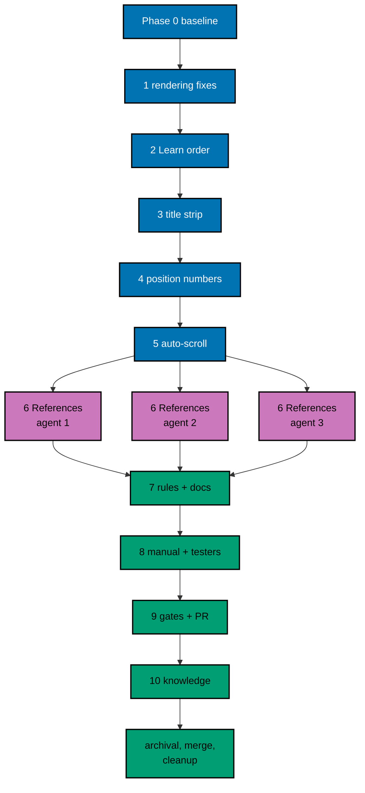

# Delivery Plan — AyoKoding Learn Revamp 01: Navigation and Display

> **Legend** — `[AI]`: an agent performs the step (the default; unmarked steps are `[AI]`).
> `[HUMAN]`: only a human can do it (physical action, out-of-band approval, real-secret or
> privileged-credential handling). `[AI+HUMAN]`: agent prepares, human approves or finishes.

**Do not start** until the user gives an explicit execution command for this plan. That command is

> the authorization for this plan's change set (commits, pushes, PR, merge, and deploy described
> below).

## Worktree

- **Execution worktree:** `worktrees/ayokoding-learn-revamp-01-navigation-and-display/`
- **Provisioning status:** pending
- **Authoring-worktree exception:** this plan was authored inside the separate authoring worktree
  `.claude/worktrees/ayokoding-update` (branch `worktree-ayokoding-update`), which the user required
  for writing all plans of the AyoKoding Learn Revamp series together. That authoring worktree is
  removed after the plan-docs PR merges and is **never** used for execution. The Provisioned Worktree
  Identity and Delivery Branch Inventory are intentionally omitted until Step 0 below creates them.
- **Step 0 obligation (blocking):** the plan-execution Step 0 gate provisions the execution worktree
  from fresh `origin/main` with
  `rtk git worktree add -b ayokoding-learn-revamp-01-navigation-and-display-base worktrees/ayokoding-learn-revamp-01-navigation-and-display origin/main`,
  initializes it per
  [Worktree Toolchain Initialization](../../../repo-governance/development/workflow/worktree-setup.md),
  writes the immutable identity and the first inventory row into this section, replaces
  `Provisioning status: pending` with `Provisioning status: provisioned` in the same plan update, and
  syncs with `origin/main` before any delivery packet starts.
- **Cleanup:** after the PR merges, the worktree and its branches come down through
  [Dev Artifact Clean-Up](../../../repo-governance/workflows/maintenance/dev-artifact-clean-up.md)
  (see Plan Archival).
- **Worktree cap:** one worktree for this plan in this repository, reused by every phase.

## Delivery Mode: worktree-to-pr

`worktree-to-pr` is mandatory in this repository. One branch and **one PR** deliver the whole plan.
The PR needs the exact current-head/base `Quality gate` from `.github/workflows/pr-quality-gate.yml`
and an exact-head posted `pr-leak-review` `pass` (`leak-review` status). Broad semantic PR review is
not run unless the user asks for it. `[AI]` merges once the hardened merge preconditions hold.

### Delivery Unit

| Unit  | Phases                                       | Safe `main` state after merge                                                                                       | Rollback                               |
| ----- | -------------------------------------------- | ------------------------------------------------------------------------------------------------------------------- | -------------------------------------- |
| DU-01 | 1–10 and Plan Archival (Phase 0 opens no PR) | Titles without numbers, numbered syllabus/rail/preview, auto-scroll, fixed typography, References, guard test green | Revert the merge commit in a revert PR |

Every change is complete the moment it lands, so no feature flag is needed. The phases are natural
pauses inside the one branch; no phase is merged on its own.

### Before Phase 0: Promotion

- [ ] [AI] Promote the plan per
      [Starting and Completing Work](../../../repo-governance/conventions/structure/plans/starting-and-completing-work.md):
      a pure move of `plans/backlog/ayokoding-learn-revamp-01-navigation-and-display/` to
      `plans/in-progress/ayokoding-learn-revamp-01-navigation-and-display/` plus the
      `plans/backlog/README.md` and `plans/in-progress/README.md` index updates, landed on
      `origin/main` through its own PR. Acceptance: `rtk git ls-tree -r --name-only origin/main plans/in-progress/ayokoding-learn-revamp-01-navigation-and-display/`
      lists this plan's files. This promotion PR is separate from DU-01.

### Execution Packet Defaults

- **Plan path after promotion:** `plans/in-progress/ayokoding-learn-revamp-01-navigation-and-display/`
  (written below as `<plan>/`). Evidence goes to `<plan>/evidence/`.
- **Scratch:** one-time scripts, dry-run reports, and the execution ledger live in the execution
  worktree's `local-tmp/ayokoding-learn/plan-01/` (gitignored). Record agent IDs and review cycle
  counts in `local-tmp/ayokoding-learn/plan-01/execution-ledger.md`.
- **Evidence hygiene:** evidence files contain repository-relative paths only. Never paste an
  absolute home-directory path, a hostname, a token, or `.env*` content (the PR leak review treats
  machine-specific values as leaks).
- **Never commit** `apps/ayokoding-www/next-env.d.ts` (the dev server rewrites it) or
  `.serena/project.yml`. Before every commit run `rtk git status --short` and restore either file with
  `rtk git checkout -- <file>` if it shows as modified.
- **Never touch** `.env.prod` or `.env.stag`. If the dev server needs a variable, copy the key from
  `apps/ayokoding-www/.env.example` into an uncommitted `apps/ayokoding-www/.env.local`.
- **Bounded loops:** any maker→checker review loop in this plan runs at most 2 cycles. A file still
  failing after cycle 2 is recorded as `BLOCKED` in the execution ledger with its findings, reported
  to the user, and the phase gate stays open until the user decides.
- **Failure handling:** on any unexpected failure, save the output to the phase evidence file, fix
  the root cause (never skip, retry-until-green, loosen, or delete a test), rerun the same command,
  and note the fix.

> **Important**: Fix ALL failures found during quality gates, not just those caused by your
> changes. This follows the root cause orientation principle — proactively fix preexisting
> errors encountered during work.

### Command Reference

Run every command from the execution worktree root. Expected results are stated at each use.

| Name               | Command                                                                                                                                        |
| ------------------ | ---------------------------------------------------------------------------------------------------------------------------------------------- |
| `UNIT-FE <file>`   | `rtk ./hippo run --class ephemeral --resource-tier standard --disk-path . --cwd apps/ayokoding-www -- npx vitest run --project unit-fe <file>` |
| `UNIT-NODE <file>` | `rtk ./hippo run --class ephemeral --resource-tier standard --disk-path . --cwd apps/ayokoding-www -- npx vitest run --project unit <file>`    |
| `QUICK`            | `rtk ./hippo run --class ephemeral --resource-tier standard --disk-path . -- npm exec nx -- run ayokoding-www:test:quick`                      |
| `E2E-QUICK`        | `rtk ./hippo run --class ephemeral --resource-tier standard --disk-path . -- npm exec nx -- run ayokoding-www-fe-e2e:test:quick`               |
| `E2E`              | `rtk ./hippo run --class ephemeral --resource-tier heavy --disk-path . -- npm exec nx -- run ayokoding-www-fe-e2e:test:e2e`                    |
| `GEN-INDEXES`      | `rtk ./hippo run --class transactional --resource-tier standard --disk-path . -- npm exec nx -- run ayokoding-www:generate-indexes`            |
| `VALIDATE-INDEXES` | `rtk ./hippo run --class ephemeral --resource-tier standard --disk-path . -- npm exec nx -- run ayokoding-www:validate-indexes`                |
| `DEV`              | `rtk ./hippo run --class service --resource-tier standard --disk-path . -- npm exec nx -- dev ayokoding-www` (serves `http://localhost:3101`)  |

`E2E` builds the app with the fixture manifests in `apps/ayokoding-www-fe-e2e/fixtures/manifests/`,
then runs every scenario in Chromium, Firefox, and WebKit; expect it to take a long time. Read the
list reporter output for the named scenario titles.

### Agent Topology

The root coordinator owns the file ledger, integration, and every gate. Code phases 1–5 run one at a
time (they share `course-paths.steps.ts` and the course-paths components) and are delegated to
`swe-developer`; Gherkin edits go to `specs-maker`. Phase 6's content conversion fans out to at most
3 background `apps-ayokoding-www-general-maker` agents on disjoint course sets (N=3), then the root
integrates. Phase 7 uses `rules-fixer` and `docs-fixer`.

### Commit Guidelines

- [ ] Do not stage or commit until the user's execution command has authorized this plan's change
      set; do not extend a commit beyond it.
- [ ] Use the fewest build-valid, independently reviewable and revertible commits, one coherent
      purpose each (suggested: one per phase 1–7, plus evidence and archival commits).
- [ ] Follow Conventional Commits: `<type>(<scope>): <description>`, imperative, no period (for
      example `fix(ayokoding-www): stop headings rendering as links`).
- [ ] Keep each change with its tests, specs, regenerated indexes, docs, and generated harness
      routes in the same commit; stage explicit paths only, never `git add -A`.

---

## Phase 0: Worktree, Environment, Baseline, and Inventory

Phase 0 opens no PR. Its evidence rides the DU-01 PR.

- **Input:** the promotion on `origin/main`; this plan at `<plan>/`.
- **Outcome:** a provisioned, initialized worktree, a recorded green baseline, and an exact
  inventory of every file later phases may edit.
- **Proof:** `<plan>/evidence/phase-0-baseline.md` and `<plan>/evidence/phase-0-inventory.md`.

- [ ] [AI] **Plan quality gate (deferred from authoring):** run the `plan-quality-gate` workflow on this
      plan with `max-cycles` 2 before any other step below. It was deliberately not run when this plan was
      written, to keep token use even (user decision, 2026-10-09). Acceptance: verdict `PASS` or
      `PASS_WITH_FINDINGS`; record the line `plan-quality-gate: <verdict> (<n> cycles, <k> open)` in this
      file's header section. If the plan is still in `plans/backlog/`, run the gate before the promotion PR.
      A `BLOCKED` verdict stops execution and is reported to the user.
- [ ] [AI] Run the plan-execution Step 0 gate described in [## Worktree](#worktree): provision
      `worktrees/ayokoding-learn-revamp-01-navigation-and-display/` from fresh `origin/main`, record
      the Provisioned Worktree Identity and the first Delivery Branch Inventory row in this file, and
      set `Provisioning status: provisioned`. Acceptance: `rtk git worktree list --porcelain` shows
      the worktree on branch `ayokoding-learn-revamp-01-navigation-and-display-base`.
- [ ] [AI] From the worktree root, run
      `rtk ./hippo run --class transactional --resource-tier standard --disk-path . -- npm install`.
      Acceptance: exit 0 and Husky hooks installed (`.husky/_` exists).
- [ ] [AI] Run `rtk npm run doctor`. Acceptance: exit 0. Only if it reports a missing or drifted
      toolchain, run
      `rtk ./hippo run --class transactional --resource-tier standard --disk-path . -- ./rhino toolchain provision --apply`
      and then `rtk npm run doctor` again (exit 0).
- [ ] [AI] Create the delivery branch from the synced base: `rtk git switch -c ayokoding-learn-revamp-01-navigation-and-display`
      and append it to the Delivery Branch Inventory (`worktree-to-pr`, `active`).
- [ ] [AI] Run `QUICK`. Acceptance: exit 0. Save the summary (exit code, test counts) in
      `<plan>/evidence/phase-0-baseline.md`.
- [ ] [AI] Run `E2E-QUICK`. Acceptance: exit 0; save the summary in the same file.
- [ ] [AI] Run `E2E`. Acceptance: exit 0 with every scenario passing; save the pass/fail counts. If
      it fails before any change, fix the root cause first per the Failure handling rule.
- [ ] [AI] Run `VALIDATE-INDEXES`. Acceptance: exit 0 (indexes already in sync).
- [ ] [AI] Start `DEV` in the background and open `http://localhost:3101/en/learn/courses/distributed-systems?path=careers/interview-ready/software-engineer`
      with Playwright MCP at 1280×800. Acceptance: the heading reads "46 · Distributed Systems", the
      rail readout reads "Course 85 of 116", and the rail's current row is not visible without
      scrolling. Save the screenshot as `<plan>/evidence/phase-0-before-course-in-path-en-1280px.png`.
      Stop `DEV` afterwards.
- [ ] [AI] Write the title inventory script at `local-tmp/ayokoding-learn/plan-01/title-inventory.py`
      implementing [tech-docs.md §4.1](./tech-docs.md#41-title-strip-rule-closed-list) steps 1–2 in
      read-only mode. Run it with `python3 -I`. Acceptance: it prints 76 `(slug, oldTitle,
newTitle)` rows and a list of files with matches. Copy the counts table and the file list into
      `<plan>/evidence/phase-0-inventory.md` under "Title inventory". If the count is not 76, stop and
      record why.
- [ ] [AI] Write `local-tmp/ayokoding-learn/plan-01/accuracy-inventory.py` that applies the five
      patterns in [tech-docs.md §4.4](./tech-docs.md#44-references-conversion-rule) (verification
      list) to `apps/ayokoding-www/content/en/learn/courses/**`, split into Markdown and
      `learning/code/**` files. Run it with `python3 -I`. Acceptance: it prints per-pattern counts,
      the course list, and the file list; copy them into `<plan>/evidence/phase-0-inventory.md` under
      "Accuracy inventory". Expect about 153 files in about 42 courses; record the real numbers.
- [ ] [AI] In the same evidence file, record the union of both file lists as the **frozen content
      edit ledger**. Later phases may edit course files only from this ledger.

### Phase 0 Gate

> All checks below must pass before starting Phase 1.

- [ ] [AI] `rtk git status --short` shows only `<plan>/` changes (identity, inventory, evidence).
- [ ] [AI] `<plan>/evidence/phase-0-baseline.md` records exit 0 for `QUICK`, `E2E-QUICK`, `E2E`, and
      `VALIDATE-INDEXES`.
- [ ] [AI] `<plan>/evidence/phase-0-inventory.md` contains the 76-row title list, the accuracy counts,
      and the frozen content edit ledger.

> **Pause Safety**: the worktree is provisioned and green, with no product change yet. Safe to stop.
> To resume: `rtk git -C worktrees/ayokoding-learn-revamp-01-navigation-and-display status --short`,
> then rerun `QUICK`.

---

## Phase 1: Headings and Inline Code Render Correctly (S6, S7)

- **Input:** [prd.md S6, S7](./prd.md#feature-content-rendering-new-scenarios-contentcontent-renderingfeature);
  [tech-docs.md §4.6](./tech-docs.md#46-prose-class-change); Decision D7.
- **Outcome:** section headings render in heading colour without underline (still anchors); inline
  code has no backticks and inherits the text's weight, on every Markdown page in both locales.
- **Proof:** RED and GREEN outputs in `<plan>/evidence/phase-1-rendering.md`.
- _Suggested executor: `specs-maker` for the Gherkin step, `swe-developer` for code._

- [ ] [AI] **Gherkin:** add S6 "Section headings render as headings, not as links" and S7 "Inline
      code renders without literal backticks" (titles without the `S<n>` prefix) to
      `specs/apps/ayokoding/www/behaviours/frontend/content/content-rendering.feature`, each preceded
      by the standard `# Exemption(integration): … alternative-proof: ayokoding-www-fe-e2e:test:e2e / <title>`
      comment and `@integration-exempt`. Run
      `rtk ./hippo run --class ephemeral --resource-tier standard --disk-path . -- npm exec nx -- run ayokoding-www:test:coverage:behaviour`.
      Acceptance: it fails and names only the two new scenarios as missing bindings.
- [ ] [AI] **RED (unit):** in `apps/ayokoding-www/tests/unit/fe-steps/content-rendering.steps.tsx`,
      bind S6 and S7: render `MarkdownRenderer` with HTML containing `<h2 id="x"><a href="#x">X</a></h2>`
      and `
Run <code>nvim --version</code>
`; assert the container has the classes
      `prose-headings:[&>a]:no-underline`, `prose-headings:[&>a]:text-inherit`,
      `prose-headings:[&>a]:[font-weight:inherit]`, `prose-code:before:content-none`,
      `prose-code:after:content-none`, and `[&_:not(pre)>code]:[font-weight:inherit]`, and that the
      heading still contains a link to `#x`. Run `UNIT-FE tests/unit/fe-steps/content-rendering.steps.tsx`.
      Acceptance: the new S6/S7 assertions fail on the missing classes; existing scenarios pass.
- [ ] [AI] **RED (e2e):** in `apps/ayokoding-www-fe-e2e/tests/e2e/steps/content-rendering.steps.ts`,
      add steps that open `/en/learn/courses/just-enough-nvim/learning/overview` and evaluate in the
      page: for the first `article h2 > a`, computed `text-decoration-line` is `none`, its `color`
      equals its parent `h2`'s `color`, and its `href` starts with `#`; for the first
      `article p code` that is not inside `pre`, `getComputedStyle(el, "::before").content` and
      `::after` are `none` or `normal`, and its `font-weight` equals the parent `p`'s `font-weight`.
      Run `E2E`. Acceptance: exactly the S6 and S7 scenarios fail (in every browser); all others pass.
- [ ] [AI] **GREEN:** append the eleven tokens from
      [tech-docs.md §4.6](./tech-docs.md#46-prose-class-change) to `MARKDOWN_PROSE_CLASS` in
      `apps/ayokoding-www/src/features/content/shell/markdown-renderer.tsx`. Rerun
      `UNIT-FE tests/unit/fe-steps/content-rendering.steps.tsx` and `E2E`. Acceptance: both exit 0.
- [ ] [AI] **REFACTOR:** keep the class string readable (group heading tokens, then code tokens) and
      add a short comment above `MARKDOWN_PROSE_CLASS` naming the two defects it prevents. Run `QUICK`.
      Acceptance: exit 0, coverage unchanged or higher.

### Phase 1 Gate

> All checks below must pass before starting Phase 2.

- [ ] [AI] `QUICK` exits 0.
- [ ] [AI] `E2E` exits 0 (S6 and S7 pass in all three browsers).
- [ ] [AI] `rtk git status --short` lists only the feature file, the two step files,
      `markdown-renderer.tsx`, and `<plan>/` evidence.

> **Pause Safety**: typography is fixed and tested; nothing else changed. Safe to stop. To resume:
> `QUICK`.

---

## Phase 2: Overview First in the Learn Sidebar (S8)

- **Input:** [prd.md S8](./prd.md#feature-site-navigation-new-scenario-navigationnavigationfeature);
  [tech-docs.md §1.4](./tech-docs.md#14-the-learn-overview-page-is-listed-last); Decision D6.
- **Outcome:** the Learn sidebar lists Overview, Paths, Courses, Legacy in that order (interim fix
  until plan 04 folds Overview into the redesigned `/en/learn` landing).
- **Proof:** `<plan>/evidence/phase-2-learn-order.md`.
- _Suggested executor: `swe-developer`._

- [ ] [AI] **Gherkin:** add S8 "The learn overview is the first entry under Learn in the sidebar" to
      `specs/apps/ayokoding/www/behaviours/frontend/navigation/navigation.feature` with the standard
      exemption comment and tag. Acceptance: `test:coverage:behaviour` names only S8 as missing.
- [ ] [AI] **RED (unit):** in `apps/ayokoding-www/tests/unit/fe-steps/navigation.steps.tsx`, bind S8:
      read the frontmatter `weight` and `title` of the real files `content/en/learn/overview.md`,
      `paths/_index.md`, `courses/_index.md`, and `legacy/_index.md` with `gray-matter` (paths
      relative to `process.cwd()`), build nodes, sort them with `sortTreeByWeight` from
      `src/features/content/core/tree-builder.ts`, and assert the order is Overview, Paths, Courses,
      Legacy. Run `UNIT-FE tests/unit/fe-steps/navigation.steps.tsx`. Acceptance: S8 fails (current
      order is Paths, Courses, Legacy, Overview).
- [ ] [AI] **RED (e2e):** in `apps/ayokoding-www-fe-e2e/tests/e2e/steps/navigation.steps.ts`, open
      `/en/learn/overview` at 1280×800 and, inside the desktop `<aside>`, read the `boundingBox().y`
      of the links whose `href` is `/en/learn/overview`, `/en/learn/paths`, `/en/learn/courses`, and
      `/en/learn/legacy`; assert ascending order in that sequence. Run `E2E`. Acceptance: only S8
      fails.
- [ ] [AI] **GREEN:** set `weight: 101` in `apps/ayokoding-www/content/en/learn/paths/_index.md`,
      `weight: 102` in `content/en/learn/courses/_index.md`, and `weight: 103` in
      `content/en/learn/legacy/_index.md`; leave `overview.md` at 100. Run `GEN-INDEXES`, then
      `VALIDATE-INDEXES` (exit 0). Rerun the S8 unit and `E2E`. Acceptance: both pass.
- [ ] [AI] **REFACTOR:** `rtk git diff --stat` shows only the three weight edits and the regenerated
      `content/en/learn/_index.md`; nothing else. Run `QUICK`. Acceptance: exit 0.

### Phase 2 Gate

> All checks below must pass before starting Phase 3.

- [ ] [AI] `QUICK`, `VALIDATE-INDEXES`, and `E2E` exit 0.

> **Pause Safety**: sidebar order is fixed; indexes are in sync. Safe to stop. To resume:
> `VALIDATE-INDEXES` then `QUICK`.

---

## Phase 3: Course Titles Without Numbers (S4, S9)

- **Input:** [prd.md S4, S9](./prd.md#acceptance-criteria-gherkin);
  [tech-docs.md §4.1](./tech-docs.md#41-title-strip-rule-closed-list); Decisions D1, D2; the Phase 0
  title inventory.
- **Outcome:** no course title or title reference carries `NN ·` or `Pass N`; indexes regenerated;
  tests updated to the new titles; a unit guard prevents regressions.
- **Proof:** `<plan>/evidence/phase-3-title-strip.md` (dry-run counts, apply counts, zero-hit search).
- _Suggested executor: `swe-developer`; the codemod runs from scratch._

- [ ] [AI] **Gherkin:** create
      `specs/apps/ayokoding/www/behaviours/frontend/course-paths/path-position-numbers.feature` with
      the Feature header from prd.md and S4 only; create
      `specs/apps/ayokoding/www/behaviours/frontend/content/course-content-hygiene.feature` with its
      Feature header and S9 only. Both with exemption comments and tags. Acceptance:
      `test:coverage:behaviour` names only S4 and S9 as missing.
- [ ] [AI] **RED (unit, S9):** create `apps/ayokoding-www/tests/unit/be-steps/course-content-hygiene.steps.ts`
      (Node project). Load the feature with `loadFeature`, read every
      `content/en/learn/courses/*/_index.md` with `node:fs` and `gray-matter` (paths from
      `process.cwd()`, like `tests/unit/features/course-paths/manifests/careers/careers-se-manifests.unit.test.ts`),
      and assert no `title` matches `/^\d+\s*·\s/` or `/^Pass \d+ /`, printing offending slugs. Run
      `UNIT-NODE tests/unit/be-steps/course-content-hygiene.steps.ts`. Acceptance: fails listing 76
      slugs.
- [ ] [AI] **RED (unit, S4):** create `apps/ayokoding-www/tests/unit/fe-steps/path-position-numbers.steps.tsx`
      and bind S4: render the path chrome the way `path-order-nav.steps.tsx` does (reuse its mocks)
      for the three courses `just-enough-bash`, `backend-essentials`, `sql-essentials`, but read
      each course `title` from the real `content/en/learn/courses/<slug>/_index.md` with `node:fs`
      and `gray-matter` instead of a synthetic fixture. Assert that the `<h1>`, breadcrumb,
      previous/next, and prerequisite link texts have no `/^\d+\s*·\s/` or `/^Pass \d+ /` match, and
      that the readout reads "Course 2 of 3". Run
      `UNIT-FE tests/unit/fe-steps/path-position-numbers.steps.tsx`. Acceptance: S4 fails because the
      real titles still read "5 · Just Enough Bash", "11 · Backend Essentials", and "10 · SQL Essentials".
- [ ] [AI] **RED (e2e, S4 and S9):** in `course-paths.steps.ts`, bind S4 on
      `/en/learn/courses/backend-essentials?path=careers/immediately-effective/backend-track`: the
      `<h1>` is exactly "Backend Essentials", the breadcrumb, previous ("Just Enough Bash"), next
      ("SQL Essentials"), and prerequisite link texts do not match `/^\d+\s*·\s/`, and the rail
      readout reads "Course 2 of 3". In `content-rendering.steps.ts`, bind S9 on `/en/learn/courses`:
      no link text in `main` matches `/^\d+\s*·\s/` or `/^Pass \d+ /`. Run `E2E`. Acceptance: S4 and
      S9 fail; everything else passes.
- [ ] [AI] **GREEN (dry run):** write `local-tmp/ayokoding-learn/plan-01/strip-titles.py`
      implementing tech-docs §4.1 steps 1–5 with a `--dry-run` flag that prints, per file, the number
      of replacements and a sample before/after line. Run `python3 -I local-tmp/ayokoding-learn/plan-01/strip-titles.py --dry-run`.
      Acceptance: every listed file is in the Phase 0 ledger; totals match the Phase 0 title
      inventory; no replacement touches text outside the 76 old titles. Save the totals to the phase
      evidence.
- [ ] [AI] **GREEN (apply):** run the script without `--dry-run`. Then run `GEN-INDEXES` and
      `VALIDATE-INDEXES` (exit 0).
- [ ] [AI] **GREEN (tests):** update the old-title literals to the stripped titles in
      `apps/ayokoding-www-fe-e2e/tests/e2e/steps/course-paths.steps.ts` lines 221, 222, 330, 336,
      465, 470, 475, 574, and 606 (for example `"4 · Just Enough Python"` → `"Just Enough Python"`,
      `"Pass 0 Capstone · Forge-Ready"` → `"Capstone · Forge-Ready"`), and the comment in
      `apps/ayokoding-www-fe-e2e/tests/e2e/steps/resizable-sidebar.steps.ts` line 68
      (`"21 · Object-Oriented Design & Patterns"` → `"Object-Oriented Design & Patterns"`).
- [ ] [AI] **GREEN (verify):** run the closed-list search from Phase 0 again over the whole worktree
      excluding `plans/`, `local-tmp/`, `node_modules/`, `.next/`, and `generated/`. Acceptance: 0
      matches. Rerun the S9 and S4 units and `E2E`. Acceptance: all pass, including the
      resizable-sidebar horizontal-overflow scenario (the stripped title is still wider than 150 px;
      if that scenario fails, pick a longer course title that still overflows and update the comment,
      recording the choice).
- [ ] [AI] **REFACTOR:** `rtk git diff --stat -- apps/ayokoding-www/content` lists only ledger files
      plus the two regenerated indexes; spot-read five changed files including one with a
      line-wrapped title and confirm wraps are intact. Run `QUICK`. Acceptance: exit 0.

### Phase 3 Gate

> All checks below must pass before starting Phase 4.

- [ ] [AI] The closed-list search reports 0 matches (output saved).
- [ ] [AI] `QUICK`, `VALIDATE-INDEXES`, and `E2E` exit 0.

> **Pause Safety**: all titles are clean and guarded; position numbers are not shown yet, which is
> the same as before this plan. Safe to stop. To resume: `QUICK`.

---

## Phase 4: Path Position Numbers (S1, S2, S3)

- **Input:** [prd.md S1–S3](./prd.md#feature-path-position-numbers-course-pathspath-position-numbersfeature);
  [tech-docs.md §4.2](./tech-docs.md#42-position-number-rendering); Decisions D3, D4; Screen 1 and
  Screen 2 selections in prd.md.
- **Outcome:** the syllabus, the rail (desktop and drawer), and the arc preview show the 1-based path
  position before each title; the DWT-002 workaround and its locked test are replaced.
- **Proof:** `<plan>/evidence/phase-4-position-numbers.md`.
- _Suggested executor: `swe-developer`._

- [ ] [AI] **Gherkin:** add S1, S2, S3 to `path-position-numbers.feature`. Acceptance:
      `test:coverage:behaviour` names only S1–S3 as missing.
- [ ] [AI] **RED (component):** create
      `apps/ayokoding-www/tests/unit/features/course-paths/shell/path-position-number.test.tsx`
      asserting `<PathPositionNumber position={85} />` renders text "85" with the classes
      `tabular-nums` and `text-right` and no `aria-hidden`. Run
      `UNIT-FE tests/unit/features/course-paths/shell/path-position-number.test.tsx`. Acceptance: fails
      (module not found).
- [ ] [AI] **RED (syllabus):** in `tests/unit/features/course-paths/shell/path-landing.test.tsx`, change
      the row expectations so each `listitem` contains its number then its title (for a 3-course
      manifest: "1", "2", "3" in order) and each link's accessible name is still exactly the title.
      Run `UNIT-FE tests/unit/features/course-paths/shell/path-landing.test.tsx`. Acceptance: fails on
      the missing numbers.
- [ ] [AI] **RED (rail):** in `tests/unit/features/course-paths/shell/path-rail.test.tsx`, assert each
      `listitem` shows its position number, the current row still has `aria-current="page"`, the `▸`
      marker, and `bg-accent`, and each link's name is still the title. Run
      `UNIT-FE tests/unit/features/course-paths/shell/path-rail.test.tsx`. Acceptance: fails on the
      numbers only.
- [ ] [AI] **RED (preview):** in `tests/unit/features/course-paths/shell/syllabus-preview.test.tsx`,
      replace the DWT-002 test (lines 38–44) with one that renders
      `courseTitles={["Just Enough Python", "Data Structures & Algorithms Essentials"]}` and expects
      `items[0].textContent` to be `"1 Just Enough Python"` and `items[1].textContent` to be
      `" · 2 Data Structures & Algorithms Essentials"`. Keep the other tests (cap at 3, "Starts
      with:", `<ol>` not inside `
`). Acceptance: the new test fails.
- [ ] [AI] **RED (scenarios):** bind S1–S3 in `tests/unit/fe-steps/path-position-numbers.steps.tsx`
      (render `PathLanding`, `PathRail`, and `SyllabusPreview` with a 3-course fixture). In
      `course-paths.steps.ts`, bind S1 on `/en/learn/paths/careers/immediately-effective/backend-track`
      (rows read "1" Just Enough Bash, "2" Backend Essentials, "3" SQL Essentials), S2 on the rail of
      `/en/learn/courses/backend-essentials?path=careers/immediately-effective/backend-track` (same
      numbers; row 2 is current), and S3 on `/en/learn/paths/careers/interview-ready` (preview items
      contain "1" + "Just Enough Python" and "2" + "Data Structures & Algorithms Essentials"; update
      the existing lines 221–222 accordingly). Run the unit file and `E2E`. Acceptance: only S1–S3
      fail.
- [ ] [AI] **GREEN:** create `apps/ayokoding-www/src/features/course-paths/shell/path-position-number.tsx`
      exactly as in tech-docs §4.2; edit `path-landing.tsx` (li `flex items-baseline gap-2`, number
      before the link), `path-rail.tsx` (li `flex items-center gap-1`, number before the link, all
      link attributes unchanged), and `syllabus-preview.tsx` (number span before each title; replace
      the DWT-002 doc comment with one explaining that titles no longer carry numbers, so the
      position number is safe). Rerun the four component tests, the scenario unit file, and `E2E`.
      Acceptance: all pass.
- [ ] [AI] **REFACTOR:** update the `PathLanding` doc comment ("The visible number **is** the
      `courseOrder` index") to point at `PathPositionNumber`; check the rail at the narrowest panel
      width in the dev server (titles truncate, numbers stay). Run `QUICK`. Acceptance: exit 0 with
      99% line coverage kept.

### Phase 4 Gate

> All checks below must pass before starting Phase 5.

- [ ] [AI] `QUICK` and `E2E` exit 0.
- [ ] [AI] `rtk ./hippo run --class ephemeral --resource-tier standard --disk-path . -- npm exec nx -- run ayokoding-www:test:coverage:behaviour`
      exits 0.

> **Pause Safety**: numbering is complete on all three surfaces. Safe to stop. To resume: `QUICK`.

---

## Phase 5: The Path Rail Scrolls to the Current Course (S5)

- **Input:** [prd.md S5](./prd.md#feature-path-order-navigation-new-scenario-course-pathspath-order-navfeature);
  [tech-docs.md §4.3](./tech-docs.md#43-active-course-auto-scroll); Decisions D5, D11.
- **Outcome:** on load (desktop sidebar) and on drawer open (mobile), a hidden current row is centred
  inside the rail's own scroll container; the page does not move.
- **Proof:** `<plan>/evidence/phase-5-auto-scroll.md`.
- _Suggested executor: `swe-developer`._

- [ ] [AI] **Gherkin:** add S5 "The path rail scrolls the current course into view without moving
      the page" to `specs/apps/ayokoding/www/behaviours/frontend/course-paths/path-order-nav.feature`.
      Acceptance: `test:coverage:behaviour` names only S5 as missing.
- [ ] [AI] **RED (helper):** create
      `apps/ayokoding-www/tests/unit/features/course-paths/shell/active-course-scroll.test.ts` (runs
      under `unit-fe`, jsdom). Cases: `centeredScrollTop` centres a middle row, clamps to 0 near the
      top, and clamps to `scrollHeight - clientHeight` near the bottom; `findScrollContainer` returns
      the nearest ancestor with inline `style.overflowY = "auto"` and `scrollHeight > clientHeight`
      (define both with `Object.defineProperty`), skips non-scrollable ancestors, and returns `null`
      at `document.body`; `scrollActiveCourseIntoView` does nothing without a container, does nothing
      when the row is fully visible (mock `getBoundingClientRect`), sets `container.scrollTop` when
      hidden, and never calls `window.scrollTo` (spy). Run
      `UNIT-FE tests/unit/features/course-paths/shell/active-course-scroll.test.ts`. Acceptance: fails
      (module not found).
- [ ] [AI] **RED (wiring):** in `path-rail.test.tsx`, `vi.mock` the helper module and assert
      `scrollActiveCourseIntoView` is called once with the current course's `<li>` on mount and again
      when `currentCourseId` changes via `rerender`. Acceptance: fails.
- [ ] [AI] **RED (scenario):** bind S5 in `tests/unit/fe-steps/path-order-nav.steps.tsx` (render the
      rail inside a container div with mocked scroll geometry; assert its `scrollTop` changes and
      `window.scrollTo` is not called). In `course-paths.steps.ts`, bind S5: set the viewport to
      1280×200, open `/en/learn/courses/sql-essentials?path=careers/immediately-effective/backend-track`,
      wait for network idle, then assert the `aria-current="page"` link's bounding box lies within the
      bounding box of its nearest `overflow-y: auto` ancestor and `window.scrollY` is 0. Run the unit
      file and `E2E`. Acceptance: S5 fails in the browser because the row is below the visible area.
      If S5 passes before the fix, lower the viewport height to 160, rerun, and record the height used.
- [ ] [AI] **GREEN:** create `apps/ayokoding-www/src/features/course-paths/shell/active-course-scroll.ts`
      per tech-docs §4.3; in `path-rail.tsx` add `"use client"` as the first line, a `useRef` on the
      current `<li>`, and a `useEffect` keyed on `currentCourseId` that calls the helper. Rerun the
      helper test, `path-rail.test.tsx`, the scenario unit file, and `E2E`. Acceptance: all pass.
- [ ] [AI] **REFACTOR:** keep the helper free of React imports and document the "only when hidden"
      rule in its doc comment. Run `QUICK`. Acceptance: exit 0 with 99% line coverage.

### Phase 5 Gate

> All checks below must pass before starting Phase 6.

- [ ] [AI] `QUICK`, `E2E-QUICK`, and `E2E` exit 0.
- [ ] [AI] Start `DEV`; at 1280×800 open
      `http://localhost:3101/en/learn/courses/distributed-systems?path=careers/interview-ready/software-engineer`.
      Acceptance: row 85 is visible in the rail on load and the page is at the top. Save
      `<plan>/evidence/phase-5-autoscroll-en-1280px.png`. Stop `DEV`.

> **Pause Safety**: all code changes are done and green. Safe to stop. To resume: `QUICK`.

---

## Phase 6: References Instead of Accuracy Notes (S10)

- **Input:** [prd.md S10](./prd.md#feature-course-content-hygiene-contentcourse-content-hygienefeature);
  [tech-docs.md §4.4](./tech-docs.md#44-references-conversion-rule); Decisions D8, D9; the Phase 0
  accuracy inventory and frozen ledger.
- **Outcome:** every ledger file uses "References" and plain-language caveats; no internal marker
  remains; every source URL is kept; code mirrors match.
- **Proof:** `<plan>/evidence/phase-6-references.md` (before/after counts, URL check, mirror check,
  link check, review cycle counts).

- [ ] [AI] **Gherkin:** add S10 to `course-content-hygiene.feature`. Acceptance:
      `test:coverage:behaviour` names only S10 as missing.
- [ ] [AI] **RED (unit):** extend `tests/unit/be-steps/course-content-hygiene.steps.ts` to bind S10:
      walk every file under `content/en/learn/courses/` and fail on any match of the five patterns in
      tech-docs §4.4, printing paths. Run `UNIT-NODE tests/unit/be-steps/course-content-hygiene.steps.ts`.
      Acceptance: S10 fails listing the ledger files; S9 still passes.
- [ ] [AI] **RED (e2e):** in `content-rendering.steps.ts`, bind S10 on
      `/en/learn/courses/search-and-information-retrieval/overview`: a level-2 heading "References"
      exists, and the `article` text contains none of "Accuracy notes", "[Unverified]",
      "[Needs Verification]". Run `E2E`. Acceptance: only S10 fails.
- [ ] [AI] **GREEN (snapshot URLs):** write `local-tmp/ayokoding-learn/plan-01/url-snapshot.py` that
      records, per ledger file, the set of `https?://[^\s)>\]]+` URLs to
      `local-tmp/ayokoding-learn/plan-01/urls-before.json`. Run it with `python3 -I`. Acceptance: the
      JSON has one entry per accuracy-ledger file.
- [ ] [AI] **GREEN (mechanical pass):** write and run `local-tmp/ayokoding-learn/plan-01/rename-sections.py`
      (dry run first, then apply) for rule steps 1–2 only: heading rename and `#accuracy-notes` →
      `#references` anchors and their "Accuracy notes" link text. Acceptance: the dry-run counts match
      the inventory's heading (23) and anchor (36) counts or the recorded Phase 0 values.
- [ ] [AI] **GREEN (content pass):** split the remaining ledger courses into 3 disjoint sets and
      dispatch one background `apps-ayokoding-www-general-maker` per set with the full rule text of
      tech-docs §4.4 (steps 3–10), the set's file list, and this instruction: "edit only these files;
      never present an unconfirmed claim as confirmed; keep every URL; keep code files and their
      Markdown fences identical". Record agent IDs in the execution ledger. Acceptance: each agent
      reports its files done.
- [ ] [AI] **GREEN (zero hits):** rerun `local-tmp/ayokoding-learn/plan-01/accuracy-inventory.py`.
      Acceptance: every pattern count is 0. For any remaining hit, send that file back to its agent
      (counts as a cycle; maximum 2 cycles per file, then `BLOCKED`).
- [ ] [AI] **GREEN (URLs kept):** write and run `local-tmp/ayokoding-learn/plan-01/url-check.py`, which
      compares `urls-before.json` with the current files. Acceptance: it prints no missing URL. A
      missing URL is restored by hand in the same file.
- [ ] [AI] **GREEN (mirrors):** for every changed file under `learning/code/**`, find Markdown files in
      the same course that contain its old comment text and confirm the new comment text is
      identical in both. Acceptance: zero mismatches recorded.
- [ ] [AI] **GREEN (honesty review):** dispatch `content-checker` over the Phase 6 diff
      (`rtk git diff -- apps/ayokoding-www/content/en/learn/courses`) with the single question "Does
      any edit present a previously unconfirmed claim as confirmed, drop a source, or leave internal
      process text?". Fix findings and repeat, at most 2 cycles. Acceptance: final cycle reports zero
      such findings.
- [ ] [AI] **GREEN (links):** dispatch `apps-ayokoding-www-link-checker` on the changed course files.
      Acceptance: no broken internal link or anchor introduced by this phase (compare with any
      pre-existing findings recorded in Phase 0 evidence, fixing pre-existing ones too).
- [ ] [AI] **GREEN (tests):** rerun `UNIT-NODE tests/unit/be-steps/course-content-hygiene.steps.ts`
      and `E2E`. Acceptance: S9, S10, and all other scenarios pass.
- [ ] [AI] **REFACTOR:** run `rtk npm run lint:md`. Acceptance: exit 0 (fix formatting in changed
      files only as needed). Run `GEN-INDEXES` then `VALIDATE-INDEXES` (exit 0; any heading-driven
      index change is committed). Run `QUICK` (exit 0).

### Phase 6 Gate

> All checks below must pass before starting Phase 7.

- [ ] [AI] The accuracy inventory reports 0 for every pattern; the URL check prints nothing; the
      mirror check reports zero mismatches.
- [ ] [AI] `QUICK`, `E2E`, and `rtk npm run lint:md` exit 0.
- [ ] [AI] No ledger file is `BLOCKED`, or each `BLOCKED` file was reported to the user and the user
      decided how to proceed (record the decision).

> **Pause Safety**: content is clean and guarded. Safe to stop. To resume: rerun the accuracy
> inventory and `QUICK`.

---

## Phase 7: Rule Impact and Docs Propagation

- **Input:** [tech-docs.md §10](./tech-docs.md#10-rule-impact) rules R1 and R2; Decision D10;
  [Rules Propagation](../../../repo-governance/workflows/quality/rules-propagation.md) and
  [Docs Propagation](../../../repo-governance/workflows/quality/docs-propagation.md).
- **Outcome:** both rules live in one canonical home with a `gated` disposition backed by the hygiene
  test; generated harness routes are regenerated; the spec READMEs describe the new features.
- **Proof:** `<plan>/evidence/phase-7-rules-and-docs.md` and the propagation placement record in
  `local-tmp/ayokoding-learn/plan-01/rules-placement.md`.
- _Suggested executor: `rules-fixer` (rules), `docs-fixer` (docs)._

### Automatic Rule-Impact Coverage — repository `ose-public`

- [ ] [AI] **Inventory (freeze inputs):** record R1 and R2 exactly as stated in tech-docs §10, each with
      its reason, strength (MUST), scope (`apps/ayokoding-www/content/en/learn/courses/**`), and
      intended enforcement (the hygiene test), plus the current revision and uncommitted paths, in
      `local-tmp/ayokoding-learn/plan-01/rules-placement.md`.
- [ ] [AI] **Falsifiability:** confirm each rule states one obligation with a violating example and a
      conforming example (R1: `46 · Distributed Systems` vs `Distributed Systems`; R2:
      `## Accuracy notes` with `[Unverified]` vs `## References` with a plain caveat). Acceptance:
      both recorded as falsifiable.
- [ ] [AI] **Existing-rule check:** search `repo-governance/`, `.agents/`, and `AGENTS.md` for rules
      already covering course-title numbering or published "Accuracy notes" (start with
      `repo-governance/conventions/tutorials/`,
      `repo-governance/conventions/structure/learning-plan-syllabus/`, and
      `repo-governance/conventions/writing/factual-validation/`). Acceptance: the record lists each
      hit and states "no existing rule carries R1/R2" or names the rule that does.
- [ ] [AI] **Conflict and precedence:** check R2 against the plan-syllabus rule that requires
      `## Accuracy notes` in plan syllabus records and against the confidence-classification rule
      ("Never present unverified info as verified"). Acceptance: the record states there is no
      contradiction (different scopes; R2 keeps hedges), or routes a contradiction per the workflow.
- [ ] [AI] **Placement:** per
      [Placement](../../../repo-governance/workflows/quality/rules-propagation/002-placement.md),
      confirm or replace the proposed home
      `.agents/skills/apps-ayokoding-www-developing-content/reference/course-titles-and-references.md`
      (reaches `apps-ayokoding-www-general-maker` and the other ayokoding makers through the skill).
      Record any eviction a full surface requires.
- [ ] [AI] **Canonical edit:** create the chosen module with R1 and R2 (statement, reason, violating
      and conforming example, enforcement line naming
      `apps/ayokoding-www/tests/unit/be-steps/course-content-hygiene.steps.ts`), add a one-line link in
      `.agents/skills/apps-ayokoding-www-developing-content/SKILL.md`, and an entry in
      `.agents/skills/apps-ayokoding-www-developing-content/reference/README.md`. Acceptance: the
      skill stays within its word budget.
- [ ] [AI] **Enforcement disposition:** record R1 → `gated` and R2 → `gated`, both by the hygiene test.
      Show the check failing on a violating input and passing on a conforming one: temporarily set one
      course title back to its numbered form, run
      `UNIT-NODE tests/unit/be-steps/course-content-hygiene.steps.ts` (fails), restore it, rerun
      (passes); repeat with a temporary `[Unverified]` tag. Save both outputs.
- [ ] [AI] **Binding generation:** run
      `rtk ./hippo run --class transactional --resource-tier standard --disk-path . -- ./rhino harness adapters generate`,
      then `rtk ./hippo run --class ephemeral --resource-tier standard --disk-path . -- ./rhino harness adapters validate`.
      Acceptance: both exit 0; record the generated paths from `rtk git status --short`.
- [ ] [AI] **Verification and Rules Quality Gate:** run the
      [Rules Quality Gate](../../../repo-governance/workflows/quality/rules-quality-gate.md) on the
      changed rule surfaces (at most 2 cycles). Acceptance: no open blocking finding; markdown checks
      on the changed files exit 0 (`rtk npm run lint:md`).
- [ ] [AI] **Final status:** reconcile the placement record with `rtk git status --short` (every
      changed path accounted for) and record the propagation `status` (`landed`) with each rule's
      home and disposition.

### Docs Propagation

- [ ] [AI] Run Docs Propagation for the branch's change. At minimum: add
      `path-position-numbers.feature` to `specs/apps/ayokoding/www/behaviours/frontend/course-paths/README.md`;
      add `course-content-hygiene.feature` (and the existing but unlisted `code-block-copy.feature`
      and `static-delivery.feature`) to `specs/apps/ayokoding/www/behaviours/frontend/content/README.md`.
      Search `docs/`, `apps/ayokoding-www/README.md`, and `apps/ayokoding-www-fe-e2e/fixtures/manifests/README.md`
      for any statement this plan made stale. Acceptance: `status` recorded; `rtk npm run lint:md`
      exits 0.

### Phase 7 Gate

> All checks below must pass before starting Phase 8.

- [ ] [AI] `./rhino harness adapters validate` (via the hippo command above) exits 0.
- [ ] [AI] `QUICK` exits 0 and `rtk npm run lint:md` exits 0.

> **Pause Safety**: rules, bindings, and docs are consistent with the code. Safe to stop. To resume:
> rerun the adapters validate command and `QUICK`.

---

## Phase 8: Manual Verification and Live Tester Gates

- **Input:** all prd.md scenarios and the three selected designs.
- **Outcome:** the running UI matches the selected designs in both locales at 375, 768, and 1280 px,
  with zero console errors; the UI quality gate and the rule-15 triad have no open defect.
- **Proof:** screenshots in `<plan>/evidence/` named
  `phase-8-<feature>-<locale>-<breakpoint>px.png` and the notes in `<plan>/evidence/phase-8-manual.md`.

### Manual UI Verification (Playwright MCP) — all locales × all breakpoints

- [ ] [AI] Confirm the locale set: `SUPPORTED_LOCALES` in `apps/ayokoding-www/src/features/i18n/core/config.ts`
      is `["en", "id"]`.
- [ ] [AI] Start `DEV` (port 3101).
- [ ] [AI] For each breakpoint 375, 768, 1280 (`browser_resize`, height 800), open
      `/en/learn/paths/careers/interview-ready/software-engineer`. Acceptance: rows read 1…116 with
      no number inside any title; `browser_snapshot` shows `html[lang="en"]`. Screenshot
      `phase-8-path-syllabus-en-<bp>px.png`.
- [ ] [AI] For each breakpoint, open
      `/en/learn/courses/distributed-systems?path=careers/interview-ready/software-engineer`.
      Acceptance at 768 and 1280: the rail shows "Course 85 of 116", row 85 is visible and highlighted
      without scrolling, the heading is "Distributed Systems", prerequisites show no numbers, and the
      page is at the top. Acceptance at 375: the banner reads "on path · course 85 of 116"; clicking
      "View path" (`browser_click`) opens the drawer with row 85 visible. Screenshot
      `phase-8-course-in-path-en-<bp>px.png` (at 375, with the drawer open).
- [ ] [AI] For each breakpoint, open `/en/learn/courses`. Acceptance: no course title starts with a
      number. Screenshot `phase-8-courses-en-<bp>px.png`.
- [ ] [AI] For each breakpoint, open `/en/learn/courses/just-enough-nvim/learning/overview`.
      Acceptance: headings are in heading colour without underline (underline only on hover at
      1280), inline `nvim --version` has no backticks and sits in a muted chip, and the fenced code
      block below looks unchanged. Screenshot `phase-8-content-en-<bp>px.png`.
- [ ] [AI] At 1280, open `/en/learn/overview`. Acceptance: the sidebar lists Overview, Paths, Courses,
      Legacy in that order. Screenshot `phase-8-learn-order-en-1280px.png`.
- [ ] [AI] For each breakpoint, open `/en/learn/courses/search-and-information-retrieval/overview`.
      Acceptance: a "References" section with working source links; no "Accuracy notes" or tags.
      Screenshot `phase-8-references-en-<bp>px.png`.
- [ ] [AI] For each breakpoint, open
      `/id/belajar/manusia/peralatan/cliftonstrengths/tema/membangun-hubungan/relator` and
      `/id/celoteh/2023/06/menyiapkan-c-typescript-f-dan-dart-untuk-pengembangan-lokal-dalam-vs-code-pengalaman-liburan-saya`.
      Acceptance: `html[lang="id"]`, headings not link-styled, inline code without backticks, no
      untranslated new UI strings. Screenshot `phase-8-content-id-<bp>px.png`. At 1280 open
      `/id/belajar/ikhtisar` and confirm the Indonesian sidebar order is unchanged (screenshot
      `phase-8-learn-order-id-1280px.png`).
- [ ] [AI] After each page, read `browser_console_messages`. Acceptance: zero errors for every page in
      both locales (hydration warnings count as errors).
- [ ] [AI] Rendered production sign-off: stop `DEV`; build and start the production server with
      `rtk ./hippo run --class ephemeral --resource-tier heavy --disk-path . -- npm exec nx -- run ayokoding-www:build`
      then `rtk ./hippo run --class service --resource-tier standard --disk-path . -- npm exec nx -- run ayokoding-www:start`;
      repeat the course-in-path and content checks at 375 and 1280 in both locales against the
      selected hi-fi mockups in prd.md. Acceptance: matches; screenshots
      `phase-8-prodbuild-<feature>-<locale>-<bp>px.png`. Stop the server.
- [ ] [AI] Reference every screenshot in `<plan>/evidence/phase-8-manual.md` with
      `` lines.

### UI Quality Gate and Rule-15 Retest

- [ ] [AI] Run the [UI Web Quality Gate](../../../repo-governance/workflows/quality/ui-web-quality-gate.md)
      against the running dev server for the changed screens (at most 2 cycles). Append each finding
      below as an unchecked checkbox and fix it.
- [ ] [AI] Run [UX Review Fix Planning](../../../repo-governance/workflows/quality/ux-review-fix-planning.md):
      `swe-web-tester` (exploratory charter), `swe-usability-tester`, and `swe-web-tester` (design
      charter) against the running site in `en` and `id`. Append each finding here as an unchecked
      checkbox labelled `EWT-###`, `UWT-###`, or `DWT-###` with its source, then fix it with a
      regression test.
- [ ] [AI] Rerun `QUICK` and `E2E` after the fixes. Acceptance: exit 0.

### Phase 8 Gate

> All checks below must pass before starting Phase 9.

- [ ] [AI] Every manual acceptance above holds and every screenshot is referenced.
- [ ] [AI] Every EWT/UWT/DWT and UI-gate defect checkbox is ticked (deferral only with explicit user
      permission).

> **Pause Safety**: behaviour is verified by hand and by testers. Safe to stop. To resume: `QUICK`.

---

## Phase 9: Local Quality Gates, Push, PR, and CI

- **Input:** the green branch.
- **Outcome:** an open PR whose exact current head has a green `Quality gate` and a posted
  `pr-leak-review` `pass`.
- **Proof:** PR number, head SHA, CI run IDs, and leak-review status in
  `<plan>/evidence/phase-9-pr.md`.

### Local Quality Gates (Before Push)

- [ ] [AI] Run affected typecheck:
      `rtk ./hippo run --class transactional --resource-tier standard --disk-path . -- npm exec nx -- affected -t typecheck`.
      Acceptance: exit 0.
- [ ] [AI] Run `rtk npm run affected:lint`. Acceptance: exit 0.
- [ ] [AI] Run `rtk npm run affected:test`. Acceptance: exit 0.
- [ ] [AI] Run affected spec coverage:
      `rtk ./hippo run --class ephemeral --resource-tier standard --disk-path . -- npm exec nx -- affected -t test:coverage:behaviour`.
      Acceptance: exit 0.
- [ ] [AI] Run `E2E` and `VALIDATE-INDEXES` once more. Acceptance: exit 0.
- [ ] [AI] Run `rtk npm run lint:md`. Acceptance: exit 0.
- [ ] [AI] Fix ALL failures found, including preexisting ones, and rerun until every check above
      exits 0.

### Push and PR

- [ ] [AI] `rtk git status --short`: confirm `apps/ayokoding-www/next-env.d.ts` and
      `.serena/project.yml` are not staged or modified; restore them if they are.
- [ ] [AI] Commit per the Commit Guidelines (explicit paths only).
- [ ] [AI] Run the push leak review for the outgoing range per
      [PR Leak Review — Push Review](../../../repo-governance/workflows/quality/pr-leak-review/002-push-review.md).
      Acceptance: no finding (a finding blocks the push until the history is cleaned).
- [ ] [AI] Push the branch and open a PR against `main` with
      `gh pr create --base main --title "fix(ayokoding-www): learn navigation and display fixes" --body-file <file>`.
      The body lists scope, the rollback (revert), the cost/benefit of new code (one small component,
      one helper, one guard test; tests are exempt from the cost statement), and links to this plan.
      Record the PR number.
- [ ] [AI] Poll the PR checks every 2 minutes with `rtk gh pr checks <number>` (never
      `gh run watch`). Acceptance: the `Quality gate` from `.github/workflows/pr-quality-gate.yml` is
      green for the exact current head and base. On failure, fix the root cause, push, and poll again.
- [ ] [AI] Run [PR Leak Review](../../../repo-governance/workflows/quality/pr-leak-review.md) for the
      exact current head. Acceptance: one posted `ose-pr-leak-review:v1` `pass` and a successful
      `leak-review` status on that head. Any new push needs a new pass.

### Phase 9 Gate

> All checks below must pass before starting Phase 10.

- [ ] [AI] The PR's current head has green `Quality gate` and `leak-review` statuses (recorded with
      run IDs and head SHA).

> **Pause Safety**: the PR is open and green; nothing is merged. Safe to stop. To resume:
> `rtk gh pr checks <number>`.

---

## Phase 10: Knowledge Capture

- [ ] [AI] Apply the litmus test to every `learnings.md` entry — keep only entries where a durable
      surface would catch this automatically next time; discard the rest with a one-line reason.
- [ ] [AI] Apply the **secret/sensitivity gate** to every surviving entry — sanitize to
      `<placeholder>` tokens or discard if the entry cannot be sanitized without losing its meaning.
- [ ] [AI] Apply the **repo-relevance gate** to every surviving entry — infra-private content stays
      private and is never routed into this public repo; public-governance content may route here.
- [ ] [AI] Route each surviving entry to exactly one durable home (`repo-governance/`, `docs/`,
      `.agents/agents/`, `.agents/skills/`, or another owner), landing a small non-code edit inline.
      Create or update a `plans/ideas/<slug>.md` two-pager only when the user has literally
      authorized that plan artifact; otherwise report the follow-up and record
      `Reported without plan authorization` with handoff evidence.
- [ ] [AI] For any entry routed to `plans/ideas/`, scan `plans/ideas/README.md` and the existing
      two-pagers first, after the user literally authorizes an idea artifact; fold into an
      overlapping brief instead of creating a duplicate.
- [ ] [AI] **Code-routing rule**: a learning whose home is `apps/`, `libs/`, or tests never lands
      inline in this PR; it becomes an authorized `plans/ideas/` two-pager or a report. Never create
      or write under `plans/backlog/` for it. A bug that blocks this plan's own scope is fixed inline
      as ordinary root-cause work.
- [ ] [AI] Record the terminal state of every entry (routed inline / authorized two-pager at `<path>` /
      reported without plan authorization with handoff evidence / discarded with reason) in
      `learnings.md`.
- [ ] [AI] If execution surfaced no generalizable learning, record
      `No generalizable learnings — <one-line reason>`.
- [ ] [AI] Report the three known follow-ups from [README.md](./README.md#follow-ups-reported-not-done-here)
      to the user (hand-authored cross-course Previous/Next lines; path context after hydration;
      hard-coded English strings in the preview and banner) with handoff evidence.

### Phase 10 Gate

> All checks below must pass before starting Plan Archival.

- [ ] [AI] Every `learnings.md` entry has a terminal state, or the explicit "none" escape is present.
- [ ] [AI] No code-homed learning landed inline.

> **Pause Safety**: all learnings are routed, reported, or discarded. Safe to stop. To resume:
> re-check `learnings.md` for any entry without a terminal-state marker.

---

### Plan Archival

- [ ] Perform the **preliminary** plan-execution end-to-end delivery completeness audit: trace approved
      scope and every canonical PRD acceptance criterion (S1–S10) through the delivery unit, as-built
      artifacts, automated and manual proof, rollback evidence, and Knowledge Capture. Reopen
      execution at the earliest affected phase for every missing or unsupported row; only
      final-delivery proof may remain pending. Checked boxes alone are not proof.
- [ ] Verify ALL delivery checklist items are ticked.
- [ ] Verify ALL quality gates pass (local + CI).
- [ ] Verify ALL manual assertions pass with committed `evidence/` screenshots.
- [ ] Verify ALL supported locales (`en`, `id`) were exercised in UI verification.
- [ ] Verify every rule-15 EWT/UWT/DWT defect finding is fixed (ticked) — deferral requires explicit
      user permission (only when genuinely impossible); SG-### proposals and USS-### suggestions may
      be triaged or deferred.
- [ ] Rule-16 AET retest: not applicable — this plan changes no API (frontend and content only).
- [ ] Register the workflow-owned terminal audit task with its post-delivery proof fields: merge
      commit, post-merge `origin/main` CI, production deploy run, and the live production visual check
      below. Do not mark it complete before merge.
- [ ] After every pre-archival gate passes, run `rtk date +%F`; record the output as
      `<completion-date>`.
- [ ] Move the plan via
      `rtk git mv plans/in-progress/ayokoding-learn-revamp-01-navigation-and-display/ plans/done/<completion-date>__ayokoding-learn-revamp-01-navigation-and-display/`
      (the `evidence/` subfolder moves with it).
- [ ] Update `plans/in-progress/README.md` — remove the plan entry.
- [ ] Update `plans/done/README.md` — add the plan entry with the same `<completion-date>`.
- [ ] Update any other README that references this plan.
- [ ] Commit `chore(plans): move ayokoding-learn-revamp-01-navigation-and-display to done`, run the
      push leak review, push, and wait for a green `Quality gate` and a new `leak-review` `pass` on the
      new head.
- [ ] [AI] Merge the PR once the hardened preconditions of the
      [PR Merge Protocol](../../../repo-governance/development/workflow/pr-merge-protocol.md) hold
      (exact-head CI green, leak-review pass, surface gates done). Record the merge commit.
- [ ] [AI] Confirm post-merge CI on `origin/main` is green (poll every 2 minutes).
- [ ] [AI] Deploy: run `rtk gh workflow run ayokoding-www-test-local-deploy-prod.yml --ref main` (or
      wait for the next scheduled 6 AM / 6 PM WIB run) and poll it until it succeeds; it force-pushes
      `main` to `prod-ayokoding-www` for Vercel.
- [ ] [AI] Live production visual sign-off: with Playwright MCP, open
      `https://www.ayokoding.com/en/learn/paths/careers/interview-ready/software-engineer`,
      `https://www.ayokoding.com/en/learn/courses/distributed-systems?path=careers/interview-ready/software-engineer`,
      `https://www.ayokoding.com/en/learn/courses`,
      `https://www.ayokoding.com/en/learn/courses/just-enough-nvim/learning/overview`, and
      `https://www.ayokoding.com/id/belajar/manusia/peralatan/cliftonstrengths/tema/membangun-hubungan/relator`
      at 375 and 1280 px; compare with the selected mockups. Record the result in the plan-execution
      final report (the plan folder is already archived). A mismatch reopens the plan per rule 14.
- [ ] Classify every Delivery Branch Inventory entry as delivered, unused, or retained/escalated.
- [ ] Remove the worktree per
      [Dev Artifact Clean-Up](../../../repo-governance/workflows/maintenance/dev-artifact-clean-up.md),
      after the checks in
      `repo-governance/development/workflow/worktree-and-artifact-cleanup/mandatory-pre-removal-checks.md`:
      `rtk git worktree remove worktrees/ayokoding-learn-revamp-01-navigation-and-display`.
- [ ] Complete branch cleanup for every branch this plan created per
      `repo-governance/development/workflow/worktree-and-artifact-cleanup/branch-cleanup.md`, then run
      `rtk git worktree prune`; remove this plan's own `local-tmp/ayokoding-learn/plan-01/` scratch;
      reconcile local `main` until `rtk git rev-list --left-right --count HEAD...origin/main` reads
      `0 0`.
