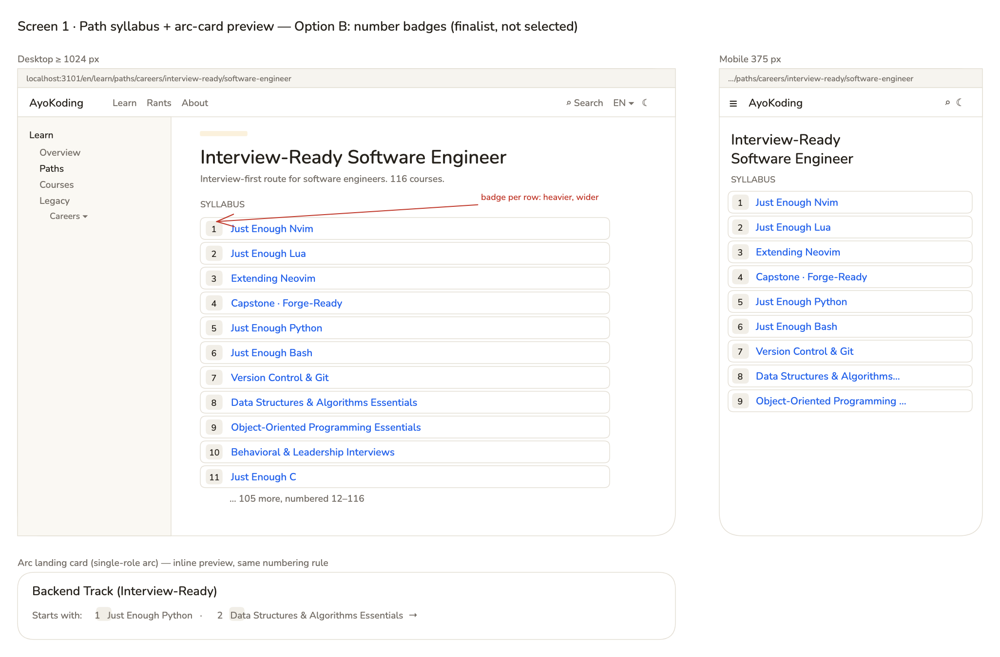
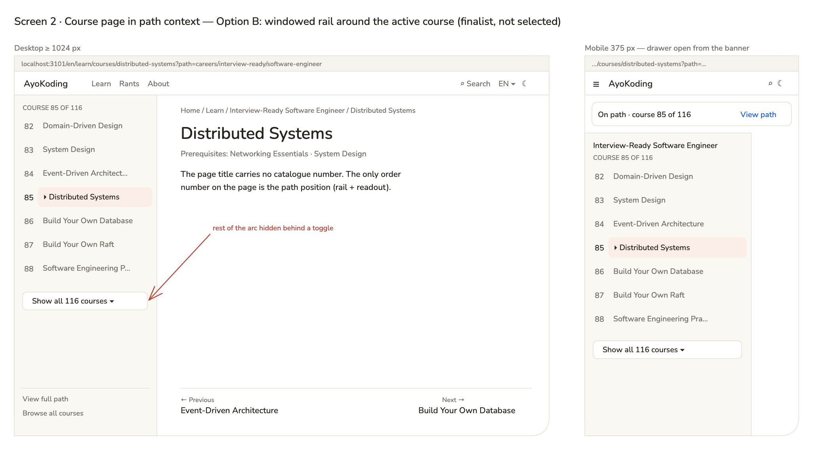
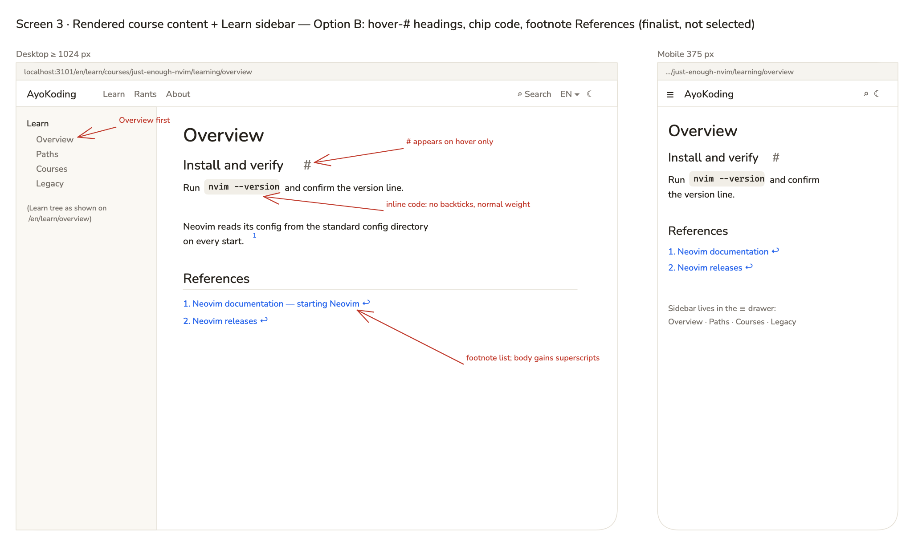

# Product Requirements — AyoKoding Learn Revamp 01: Navigation and Display

## Product Overview

Readers of `www.ayokoding.com/en/learn` should see one clear order number — the course's position
in the path they are following — and clean, readable course pages. This plan fixes the existing
Learn UI only. It does not add new pages or new features; later plans in the series do that (see
[README.md](./README.md#series-context)).

## Personas

- **Path follower.** A learner on a career or skills path (for example Interview-Ready Software
  Engineer, 116 courses). Needs to know "where am I, what is next, how far is left".
- **Course browser.** A reader who opens a course directly from search or the course list. Needs
  readable titles and pages without internal jargon.
- **Screen-reader or keyboard user.** Needs the position and the current course announced in text,
  not only shown by colour or layout.
- **Content maintainer.** Edits course Markdown. Needs a test that fails when a numbered title or an
  internal tag slips back in.

## User Stories

1. As a path follower, I want every course in the path syllabus numbered by its position in that
   path, so that I can see the whole order and judge the size of the path.
2. As a path follower, I want the path sidebar to number each course the same way and to show my
   current course without manual scrolling, so that I never lose my place in a long path.
3. As a path follower on a phone, I want the drawer list to open already scrolled to my current
   course, so that I can see what comes next.
4. As a course browser, I want course titles without old catalogue numbers, so that I do not see two
   different numbers for the same course.
5. As a course browser, I want the Learn sidebar to start with Overview, so that the introduction is
   the first thing I find.
6. As a reader, I want section headings to look like headings and inline code to look like code
   without stray backticks, so that pages are easy to scan.
7. As a reader, I want a "References" section with real sources and plain-language caveats, so that I
   can check facts without reading internal verification notes.
8. As a content maintainer, I want a failing test when a numbered title or an internal tag appears in
   course content, so that these problems do not return.

## Acceptance Criteria (Gherkin)

These scenarios are canonical. Phase-by-phase delivery copies them verbatim into the `specs/` feature
files named in [tech-docs.md §7](./tech-docs.md#7-testing-strategy). Every scenario is tagged
`@integration-exempt` with the repository comment
`# Exemption(integration): the scenario is observable at the public browser or HTTP boundary and has no separate local resource boundary; alternative-proof: ayokoding-www-fe-e2e:test:e2e / <scenario title>`.
S9 and S10 also use it: each has a Unit binding over the real content files and an E2E binding on
a public page (the course list and a converted course page). The `S<n>` prefix is
a plan-local ID for cross-references; omit it from the scenario title in the feature file (for
example the S1 title in the spec is "The path syllabus numbers each course by its position in the
path").

### Feature: Path position numbers (`course-paths/path-position-numbers.feature`)

```gherkin
Feature: Path position numbers

  As a reader following a learning path
  I want every course shown with its position in that path and no other number
  So that I always know where a course sits in the path

  Scenario: S1 The path syllabus numbers each course by its position in the path
    Given a learning path lists its courses in manifest order
    When a reader opens that path's landing page
    Then each syllabus row shows its position number starting at 1 before the course title
    And the position numbers follow the manifest order with no gaps

  Scenario: S2 The path rail numbers each course by its position in the path
    Given a reader opens a course in path context on a desktop-width viewport
    When the page renders
    Then each rail row shows its position number before the course title
    And the current course's row shows its own position number with the current-course marker

  Scenario: S3 The arc card preview numbers its courses by their path position
    Given a fixture arc manifest lists exactly one role
    When a reader opens that arc's landing page
    Then the role card's "Starts with" preview numbers its courses 1, 2, and so on in path order
    And no preview item shows a second number inside the course title

  Scenario: S4 A course page in path context shows no catalogue number in course titles
    Given a reader opens a course in path context
    When the page renders
    Then the page heading, breadcrumb, previous and next links, and prerequisite links show course titles without a leading number
    And the only course order number on the page is the course's position in the active path
```

### Feature: Path-order navigation, new scenario (`course-paths/path-order-nav.feature`)

```gherkin
  Scenario: S5 The path rail scrolls the current course into view without moving the page
    Given a reader opens a course whose rail row starts below the visible part of the sidebar
    When the page renders
    Then the sidebar scrolls so the current course's row is fully visible
    And the page itself stays scrolled to the top
```

### Feature: Content rendering, new scenarios (`content/content-rendering.feature`)

```gherkin
  Scenario: S6 Section headings render as headings, not as links
    When a visitor opens a content page with section headings
    Then each section heading is shown in the heading text colour without an underline
    And the heading still links to its own anchor

  Scenario: S7 Inline code renders without literal backticks
    When a visitor opens a content page containing inline code
    Then the inline code shows no backtick characters before or after it
    And the inline code uses the surrounding text's font weight
```

### Feature: Site navigation, new scenario (`navigation/navigation.feature`)

```gherkin
  Scenario: S8 The learn overview is the first entry under Learn in the sidebar
    When a visitor opens the learn overview page
    Then the first entry under Learn in the sidebar is "Overview"
    And it is followed by Paths, Courses, and Legacy in that order
```

### Feature: Course content hygiene (`content/course-content-hygiene.feature`)

```gherkin
Feature: Course content hygiene

  As a reader of AyoKoding courses
  I want course titles without stale numbers and sources without internal verification notes
  So that course pages read cleanly and stay honest about uncertain facts

  Scenario: S9 No course title carries a catalogue number
    Given the published English course library
    When its course titles are read
    Then no course title starts with a catalogue number or a pass number
    And the course list page shows every course title without a leading number

  Scenario: S10 Courses cite sources in a References section without internal verification tags
    Given the published English course library
    When its course pages and example files are read
    Then no file contains an "Accuracy notes" section, an "Accuracy note" label, or an internal confidence tag
    And a course that cites sources shows them under a "References" heading
```

## Product Scope

**In scope**

- Removing old catalogue and pass numbers from all 76 affected course titles and from every place
  those titles are written in course content; regenerating the Learn index pages.
- Position numbers in the existing path syllabus, path rail (desktop sidebar and mobile drawer), and
  the arc card "Starts with" preview; the mobile banner keeps its existing "course k of N" readout.
- Auto-scrolling the path rail to the current course.
- Overview first in the Learn sidebar (interim; plan 04 folds Overview into a redesigned `/en/learn`
  landing page).
- Heading and inline-code styling on all Markdown pages (both locales).
- Converting "Accuracy notes" and internal tags into "References" across the English course library.
- A unit guard for both content rules, plus the rule text in the ayokoding content skill.

**Out of scope**

- Phase grouping, manifest schema changes, prerequisite revision, outline badges (plan 02).
- Course catalog, categories, course metadata, course landing header (plan 03).
- Phase roadmap page, progress tracking, in-course context bar, mark-complete, continue-learning,
  and the redesigned `/en/learn` landing page (plan 04).
- Example-code harness and `ayokoding-cli` (plan 05); course rewrites and audits (plans 06–13);
  removing `learn/legacy` (plan 14).
- The hand-authored "← Previous / Next →" lines inside 73 course bodies (only their link text loses
  the old numbers here; plan 02 decides whether they stay).
- The path context appearing only after hydration on direct load, and the hard-coded English strings
  in `syllabus-preview.tsx` ("Starts with:") and the banner's `aria-label`; they are reported as
  follow-ups, not fixed here.
- Indonesian content (`content/id/**`).

## Product Risks

| Risk                                                                   | Mitigation                                                                            |
| ---------------------------------------------------------------------- | ------------------------------------------------------------------------------------- |
| A broad pattern strips legitimate `NN ·` example numbering             | Closed list of exact old titles only; zero-hit and diff-scope checks (tech-docs §4.1) |
| Hedge rewriting accidentally presents an unconfirmed fact as confirmed | Rule step 5 forbids it; content-checker review in Phase 6; S10 guard                  |
| A source URL is lost during conversion                                 | URL-preservation check per file (tech-docs §4.4)                                      |
| Auto-scroll moves the page instead of the sidebar                      | Container-only `scrollTop`; S5 asserts `window.scrollY` is 0                          |
| Inline-code chip styling leaks into fenced code blocks                 | `:not(pre)>code` selector; manual check of a page with both                           |
| Removing numbers makes the long rail harder to scan                    | Position numbers replace them, in a fixed tabular gutter                              |

## UI Design Funnel

This plan changes existing screens in `apps/ayokoding-www`, so it is UI-bearing. The funnel covers
three screens. Each has low-fi wireframes for at least two options (mobile and desktop), two hi-fi
finalists, a named selection, and a short justification.

### Grounding Note (R5)

Surveyed before drafting:

- **Existing components reused:** `PathLanding` (`shell/path-landing.tsx`), `PathRail`
  (`shell/path-rail.tsx`), `PathBanner` (`shell/path-banner.tsx`), `SyllabusPreview`
  (`shell/syllabus-preview.tsx`), `ResizableSidebar` (`navigation/shell/resizable-sidebar.tsx`), the
  `MobileNav` drawer (`app-shell/shell/mobile-nav.tsx`), and `MarkdownRenderer`.
- **Tokens reused:** `text-muted-foreground`, `bg-accent` (current rail row), `bg-muted` (inline code
  chip), `text-primary` (links, blue `hsl(221.2 83.2% 53.3%)` from `src/app/globals.css`), and
  Tailwind's `tabular-nums` utility. The warm neutrals come from
  `libs/web-ui-token/src/ayokoding.css`.
- **Net-new component:** only `PathPositionNumber` (a one-line span). Everything else is a change to
  an existing component.
- **Sibling screens checked:** the generic content sidebar (`sidebar-tree.tsx`) and the course page
  layout keep their current structure.

### Prior Art (R7)

- The archived navigation plan (`plans/done/2026-07-25__ayokoding-learning-path-03-navigation-ui/prd.md`,
  Screen 2) selected a numbered syllabus because "the number IS the path order", and its selected
  rail mockup numbered each row. The shipped code lost those numbers; this funnel restores them.
- Tailwind Preflight removes list numbers and VoiceOver list announcements
  (<https://tailwindcss.com/docs/preflight>, accessed 2026-10-09), so the number must be real text.
- Redis docs fixed the same "sidebar does not reach the active item" bug by scrolling the
  `overflow-y-auto` container itself (<https://github.com/redis/docs/pull/2245>, accessed
  2026-10-09).
- Wikipedia's layout guide names the appendix section "References" as "the most frequent choice"
  (<https://en.wikipedia.org/wiki/Wikipedia:Manual_of_Style/Layout>, accessed 2026-10-09).

### Screen 1 · Path syllabus and arc-card preview

URL: `/en/learn/paths/careers/interview-ready/software-engineer` (syllabus) and the single-role arc
landing card (preview).

#### Low-Fidelity Wireframes

**Option A — Number gutter (Recommended)**

_Mobile — 375 px_

```text
┌────────────────────────────────────┐
│ ☰  AyoKoding                ⌕  ☾   │
├────────────────────────────────────┤
│ Interview-Ready                    │
│ Software Engineer                  │
│ SYLLABUS                           │
│   1  Just Enough Nvim              │
│   2  Just Enough Lua               │
│   3  Extending Neovim              │
│   4  Capstone · Forge-Ready        │
│   …                                │
│ 116  <last course>                 │
└────────────────────────────────────┘
```

_Desktop — 1280 px (tablet 768 px is the same column with a narrower sidebar)_

```text
┌── Sidebar ───┬──────────────────────────────────────────────────┐
│ Learn        │ Interview-Ready Software Engineer                │
│  Overview    │ Interview-first route … 116 courses.             │
│  Paths       │ SYLLABUS                                         │
│  Courses     │    1  Just Enough Nvim                           │
│  Legacy      │    2  Just Enough Lua                            │
│              │   …                                              │
│              │   85  Distributed Systems                        │
│              │  116  <last course>                              │
└──────────────┴──────────────────────────────────────────────────┘
Arc card: "Starts with: 1 Just Enough Python · 2 Data Structures & Algorithms Essentials →"
```

**Option B — Number badges**

_Mobile — 375 px_

```text
┌────────────────────────────────────┐
│ SYLLABUS                           │
│ ┌────────────────────────────────┐ │
│ │ [1] Just Enough Nvim           │ │
│ └────────────────────────────────┘ │
│ ┌────────────────────────────────┐ │
│ │ [2] Just Enough Lua            │ │
│ └────────────────────────────────┘ │
└────────────────────────────────────┘
```

_Desktop — 1280 px_

```text
┌── Sidebar ───┬──────────────────────────────────────────────────┐
│ Learn        │ SYLLABUS                                         │
│  …           │ ┌──────────────────────────────────────────────┐ │
│              │ │ [ 1] Just Enough Nvim                        │ │
│              │ └──────────────────────────────────────────────┘ │
│              │ ┌──────────────────────────────────────────────┐ │
│              │ │ [85] Distributed Systems                     │ │
│              │ └──────────────────────────────────────────────┘ │
└──────────────┴──────────────────────────────────────────────────┘
Arc card: "Starts with: [1] Just Enough Python · [2] Data Structures … →"
```

**Option C — Native browser list markers** (`list-decimal`)

```text
SYLLABUS
  1. Just Enough Nvim        (marker drawn by the browser, not in the DOM text)
  2. Just Enough Lua
```

Dropped before hi-fi: it looks like Option A, but jsdom cannot see `::marker` (no unit proof), the
inline preview cannot use markers, and outside markers can be clipped by the rail's
`overflow-x-hidden` container.

#### High-Fidelity Finalists


_High-fidelity mockup. Edit with the Excalidraw VSCode extension — the PNG carries the scene._



_High-fidelity mockup. Edit with the Excalidraw VSCode extension — the PNG carries the scene._

**Selected: Option A — Number gutter.**

| Design                  | Why it won / lost                                                                                |
| ----------------------- | ------------------------------------------------------------------------------------------------ |
| A — number gutter ✅    | Light, aligned numbers for 1–116; same component works in the narrow rail; unit-testable as text |
| B — number badges       | Clear, but 116 bordered cards are heavy, wider, and compete with the rail's current-row marker   |
| C — native list markers | Dropped before hi-fi: not visible to unit tests, unusable inline, clipped in the rail            |

**Responsive strategy (mobile first):** below `md` (768 px) the syllabus is one full-width column
with the gutter at the left; at `md` the content sidebar returns and the column narrows; at `lg`
(1024 px) the column is capped at `max-w-3xl`. The gutter is a fixed 2rem at every width, and long
titles wrap under the title column, never under the number.

### Screen 2 · Course page in path context (rail, banner, auto-scroll)

URL: `/en/learn/courses/distributed-systems?path=careers/interview-ready/software-engineer` (course
85 of 116).

#### Low-Fidelity Wireframes

**Option A — Numbered full rail, auto-scrolled (Recommended)**

_Mobile — 375 px (banner, then the drawer opened from "View path")_

```text
┌────────────────────────────────────┐
│ ☰  AyoKoding                ⌕  ☾   │
│ On path · course 85 of 116  View path
├──────── drawer (scrolled) ─────────┤
│ Interview-Ready Software Engineer  │
│ COURSE 85 OF 116                   │
│  83  System Design                 │
│  84  Event-Driven Architecture     │
│  85 ▸Distributed Systems  ◀ current│
│  86  Build Your Own Database       │
│  87  Build Your Own Raft           │
└────────────────────────────────────┘
```

_Desktop — 1280 px (tablet 768 px: same rail at the resizable panel's narrower width, titles truncate)_

```text
┌── Path rail (scrolled) ──┬──────────────────────────────────────┐
│ COURSE 85 OF 116         │ Home / … / Distributed Systems       │
│  82  Domain-Driven Design│ Distributed Systems                  │
│  83  System Design       │ Prerequisites: Networking Essentials │
│  84  Event-Driven Arch…  │                                      │
│  85 ▸Distributed Systems │ <course body>                        │
│  86  Build Your Own Data…│                                      │
│  87  Build Your Own Raft │ ← Event-Driven Architecture          │
│ View full path           │           Build Your Own Database →  │
│ Browse all courses       │                                      │
└──────────────────────────┴──────────────────────────────────────┘
```

**Option B — Windowed rail with "Show all"**

_Mobile — 375 px_

```text
│ On path · course 85 of 116  View path
├──────── drawer ────────────────────┤
│  83  System Design                 │
│  84  Event-Driven Architecture     │
│  85 ▸Distributed Systems           │
│  86  Build Your Own Database       │
│ [ Show all 116 courses ▾ ]         │
```

_Desktop — 1280 px_

```text
┌── Path rail ─────────────┬──────────────────────────────────────┐
│ COURSE 85 OF 116         │ Distributed Systems                  │
│  83  System Design       │ …                                    │
│  84  Event-Driven Arch…  │                                      │
│  85 ▸Distributed Systems │                                      │
│  86  Build Your Own Data…│                                      │
│ [ Show all 116 courses ] │                                      │
└──────────────────────────┴──────────────────────────────────────┘
```

**Option C — Pinned current row**

```text
┌── Path rail ─────────────┐
│ 85 ▸Distributed Systems  │  ← copy of the current row, always pinned on top
│ ──────────────────────── │
│  1  Just Enough Nvim     │  ← full list starts at the top, not scrolled
│  2  Just Enough Lua      │
```

Dropped before hi-fi: the current course appears twice, and the reader still cannot see its
neighbours without scrolling.

#### High-Fidelity Finalists


_High-fidelity mockup. Edit with the Excalidraw VSCode extension — the PNG carries the scene._



_High-fidelity mockup. Edit with the Excalidraw VSCode extension — the PNG carries the scene._

**Selected: Option A — Numbered full rail, auto-scrolled.**

| Design                     | Why it won / lost                                                                                      |
| -------------------------- | ------------------------------------------------------------------------------------------------------ |
| A — full rail, scrolled ✅ | Keeps the whole path one scroll away, matches the shipped rail, and does exactly what Decision 25 asks |
| B — windowed rail          | Short, but hides most of the path behind an extra click and changes the rail's documented behaviour    |
| C — pinned current row     | Dropped before hi-fi: duplicates the current course and still hides its neighbours                     |

**Responsive strategy (mobile first):** below `md` there is no rail; the banner shows
"on path · course k of N" and "View path" opens the existing drawer, which renders the same numbered
rail and scrolls its own container to the current row when it opens. From `md` the rail sits in the
resizable sidebar; at narrow panel widths titles truncate with an ellipsis while the number gutter
stays fixed. At `lg` and above the layout is unchanged except for the wider panel.

### Screen 3 · Rendered course content and Learn sidebar order

URLs: `/en/learn/courses/just-enough-nvim/learning/overview` (headings, inline code),
`/en/learn/overview` (sidebar order), and an Indonesian page such as
`/id/belajar/manusia/peralatan/cliftonstrengths/tema/membangun-hubungan/relator` (headings).

#### Low-Fidelity Wireframes

**Option A — Plain headings, code chip, bulleted References (Recommended)**

_Mobile — 375 px_

```text
┌────────────────────────────────────┐
│ ☰  AyoKoding                ⌕  ☾   │
├────────────────────────────────────┤
│ Install and open your first file   │  ← heading colour, no underline
│ Run [nvim --version] and confirm   │  ← chip, no backticks
│ the version line.                  │
│ References                         │
│ • Neovim documentation — starting  │
│ • Neovim releases                  │
│ • Version numbers move quickly;    │
│   check the release page first.   │  ← plain-language hedge
└────────────────────────────────────┘
```

_Desktop — 1280 px_

```text
┌── Sidebar ───┬──────────────────────────────────────────────────┐
│ Learn        │ Install and open your first file                 │
│  Overview  ◀ │ Run [nvim --version] and confirm the version.    │
│  Paths       │                                                  │
│  Courses     │ References                                       │
│  Legacy      │ • Neovim documentation — starting Neovim         │
│              │ • Neovim releases                                │
└──────────────┴──────────────────────────────────────────────────┘
```

**Option B — Hover "#" anchor, code chip, footnote References**

_Mobile — 375 px_

```text
│ Install and open your first file  #│  ← "#" link appears on hover/focus
│ Run [nvim --version] and confirm…  │
│ … config directory.¹               │  ← superscript footnote marker
│ References                         │
│ 1. Neovim documentation ↩          │
```

_Desktop — 1280 px_

```text
┌── Sidebar ───┬──────────────────────────────────────────────────┐
│ Learn        │ Install and open your first file  #              │
│  Overview    │ … config directory.¹                             │
│  …           │ References                                       │
│              │ 1. Neovim documentation — starting Neovim ↩      │
└──────────────┴──────────────────────────────────────────────────┘
```

**Option C — No heading links**

```text
│ Install and open your first file   │  ← plain text, no anchor link at all
```

Dropped before hi-fi: readers lose click-to-link on headings, which some use to share a section.

#### High-Fidelity Finalists


_High-fidelity mockup. Edit with the Excalidraw VSCode extension — the PNG carries the scene._



_High-fidelity mockup. Edit with the Excalidraw VSCode extension — the PNG carries the scene._

**Selected: Option A — Plain headings, code chip, bulleted References.**

| Design                    | Why it won / lost                                                                                         |
| ------------------------- | --------------------------------------------------------------------------------------------------------- |
| A — plain headings ✅     | CSS-only change, keeps existing HTML and anchors, simple References list the content conversion can write |
| B — hover "#" + footnotes | Familiar from docs sites, but changes the parser output on every page and needs footnote markers authored |
| C — no heading links      | Dropped before hi-fi: removes a useful permalink                                                          |

**Responsive strategy (mobile first):** the typography changes are width-independent. On mobile the
Learn sidebar lives in the drawer and keeps the same order; at `md` and above it is the left
sidebar. Inline code chips wrap with the text and never cause horizontal scrolling.
