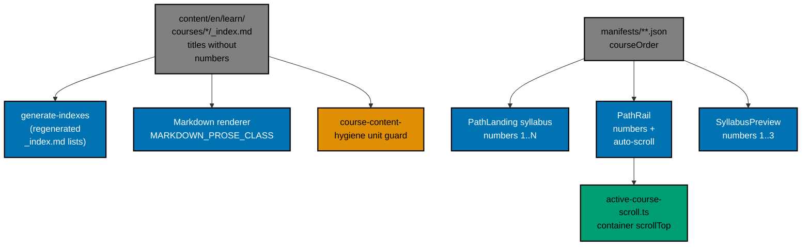

# Technical Design — AyoKoding Learn Revamp 01: Navigation and Display

This document explains **how** the plan works. It assumes you know basic TypeScript, React, CSS, and
Markdown, but nothing about this repository. Read [README.md](./README.md) first for the scope and
[prd.md](./prd.md) for the acceptance criteria. The step-by-step checklist lives in
[delivery.md](./delivery.md).

## 1. Current State (Measured on 2026-10-09)

All paths are relative to the repository root. The app is `apps/ayokoding-www`, a Next.js 16 site
that renders Markdown from `apps/ayokoding-www/content/`. Learning content lives in
`apps/ayokoding-www/content/en/learn/`. Learning paths ("careers" and "skills") are JSON manifests
in `apps/ayokoding-www/src/features/course-paths/manifests/**.json`. Each manifest has a
`courseOrder` array of course IDs (folder names under `content/en/learn/courses/`).

### 1.1 Stale catalogue numbers in course titles

- There are 181 course folders under `apps/ayokoding-www/content/en/learn/courses/`. Each has an
  `_index.md` whose frontmatter `title` is the course title.
- 73 titles start with an old catalogue number in the form `NN ·` (for example
  `title: "46 · Distributed Systems"`). The numbers run from 1 to 94 with gaps, and some repeat:
  58 appears twice, 59 three times, 61 twice, and 62 twice.
- 3 more titles start with an old journey ordinal: `Pass 0 Capstone · Forge-Ready`
  (`capstone-forge-ready`), `Pass 1 Capstone · First Working Software`
  (`capstone-first-working-software`), and `Pass 2 Capstone · SOLID Core` (`capstone-solid-core`).
- These numbers are not the course's position in any path. In the browser, the course page for
  Distributed Systems in the Interview-Ready path showed "course 85 of 116" while the title said
  "46 · Distributed Systems" and its prerequisite said "12 · Networking Essentials" (which sits at
  position 26 in that path). A reader sees three different numbering systems at once.
- The prefixed titles appear wherever a title is rendered: the path syllabus, the path rail
  (sidebar), the page `<h1>`, the browser tab title, the breadcrumb, Previous/Next links,
  prerequisite lists, and the generated Learn index pages.
- A closed-list search (each of the 76 exact old titles, allowing line wraps between words)
  measured these occurrences:

| Where                                                                     | Matches | Files |
| ------------------------------------------------------------------------- | ------: | ----: |
| `apps/ayokoding-www/content/en/learn/courses/**` (73 are the titles)      |     284 |   177 |
| `apps/ayokoding-www/content/en/learn/_index.md` (generated)               |      73 |     1 |
| `apps/ayokoding-www/content/en/learn/courses/_index.md` (generated)       |      73 |     1 |
| `apps/ayokoding-www/src/features/course-paths/shell/syllabus-preview.tsx` |       2 |     1 |
| `apps/ayokoding-www/tests/unit/features/course-paths/shell/…preview.test` |       3 |     1 |
| `apps/ayokoding-www-fe-e2e/tests/e2e/steps/course-paths.steps.ts`         |       7 |     1 |

The `Pass N Capstone ·` form adds 7 matches in course content, 3 in each generated index, and 2
in the E2E steps (lines 336 and 606). No source code parses the prefix; the only code hits are a
doc comment and the tests listed above. `docs/`, `repo-governance/`, and `.agents/` contain no
hits. `apps/ayokoding-www/generated/search-data.json` is gitignored and rebuilt by
`generate-search-data`.

- After stripping, all 181 titles stay distinct (checked: 181 distinct titles), so no two courses
  collide.
- The generic text `<digits> ·` also appears thousands of times for legitimate reasons, for
  example example numbering such as `01 · html-document-structure`. A broad regex would damage
  that content, so the strip must use the closed list of exact old titles (Section 4.1).

### 1.2 No visible position numbers

- `apps/ayokoding-www/src/features/course-paths/shell/path-landing.tsx` renders the syllabus as an
  `<ol>` whose items contain only a link with the title. Tailwind's base styles ("Preflight") set
  `ol, ul, menu { list-style: none; }`, so the browser draws no numbers, and the component renders
  no number itself. Tailwind documents this: "Ordered and unordered lists are unstyled by default,
  with no bullets or numbers", and "Unstyled lists are not announced as lists by VoiceOver"
  (<https://tailwindcss.com/docs/preflight>, accessed 2026-10-09).
- `shell/path-rail.tsx` (the desktop path sidebar, also shown inside the mobile drawer) shows a
  readout "Course 85 of 116" but no number per row.
- `shell/path-banner.tsx` (mobile only, `md:hidden`) already shows "on path · course k of N". It
  needs no code change; it becomes correct once titles stop carrying their own numbers.
- `shell/syllabus-preview.tsx` (the "Starts with: …" line on a single-role arc card, used by
  `shell/arc-landing.tsx`) deliberately renders no number. Its doc comment explains why: an earlier
  `1.` prefix collided with the embedded catalogue number and produced "1. 4 · Just Enough Python"
  (design-tester finding DWT-002). Its test
  `apps/ayokoding-www/tests/unit/features/course-paths/shell/syllabus-preview.test.tsx` locks that
  workaround in: it expects `"4 · Just Enough Python"` and `" · 7 · Data Structures & Algorithms"`.
- The design this code shipped from (the archived plan
  [`2026-07-25__ayokoding-learning-path-03-navigation-ui`](../../done/2026-07-25__ayokoding-learning-path-03-navigation-ui/prd.md),
  Screen 2) selected "Option A — Phase-grouped numbered syllabus" because "the number IS the path
  order", and its selected rail mockup showed a number per row. The shipped code lost both numbers.
  This plan restores the intended design.

### 1.3 The desktop path rail does not scroll to the active course

- `src/features/course-paths/shell/sidebar-host.tsx` swaps the normal sidebar for `PathRail` when a
  path is active. It renders inside `src/features/navigation/shell/resizable-sidebar.tsx`, where the
  scrolling element is `<div className="h-full overflow-x-hidden overflow-y-auto p-4">` inside a
  sticky `<aside className="sticky top-16 hidden h-[calc(100vh-4rem)] … md:block">`.
- On a long path the active row sits far below the visible area (about 4150 px down at course 85 of
  116), so the reader must scroll the sidebar by hand to find where they are.
- On phones, `src/features/app-shell/shell/mobile-nav.tsx` renders the same `PathRail` inside the
  drawer's `SheetContent`, which also has `overflow-y-auto`, so the same problem appears when the
  drawer opens.
- `PathRail` has no `"use client"` directive today, but both of its importers (`sidebar-host.tsx`
  and `mobile-nav.tsx`) are client components, so it already renders on the client.

### 1.4 The Learn Overview page is listed last

- `content/en/learn/overview.md` has `weight: 100`, while `content/en/learn/paths/_index.md` has
  `weight: 90`, `content/en/learn/courses/_index.md` has `weight: 95`, and
  `content/en/learn/legacy/_index.md` has `weight: 96`. The sidebar sorts by ascending weight
  (`sortTreeByWeight` in `src/features/content/core/tree-builder.ts`), so Overview appears after
  Paths, Courses, and Legacy.
- The repository's level-based weight convention
  ([navigation-weight-values.md](../../../repo-governance/conventions/tutorials/programming-language-structure/navigation-weight-values.md))
  says a folder at level N uses weights from the 10^(N-1) range, and its children use the next
  range. `content/en/learn/_index.md` has `weight: 10` (level 2), so its children are level 3 and
  should use weights from 100 upward. The values 90, 95, and 96 break that rule; `overview.md` at 100
  follows it.
- `content/id/belajar/` (Indonesian) already lists `ikhtisar.md` (weight 100) first and is not
  touched.

### 1.5 Headings look like links, and inline code shows backticks

Both were reproduced by compiling the app's own Tailwind 4.2.1 and `@tailwindcss/typography` 0.5.16
toolchain against the class list used by `MARKDOWN_PROSE_CLASS` in
`src/features/content/shell/markdown-renderer.tsx`:

- **Headings.** `src/features/content/core/parser.ts` runs `rehype-autolink-headings` with
  `{ behavior: "wrap" }`, which wraps every heading's text in `<a href="#id">`. The typography
  plugin styles every `a` with `color: var(--tw-prose-links); text-decoration: underline;
font-weight: 500`, and `MARKDOWN_PROSE_CLASS` adds `prose-a:text-primary` (the app's primary is
  blue, `hsl(221.2 83.2% 53.3%)` in `src/app/globals.css`). So every section heading renders blue and
  underlined, like a link.
- **Inline code.** The typography plugin emits `.prose :where(code)::before` and `::after` with
  `content: "`"`and sets`font-weight: 600`. So inline code such as`nvim --version` renders bold
  with literal backtick characters around it.

### 1.6 Internal "Accuracy notes" leak into published courses

Published course pages expose internal verification notes. A pattern scan of
`apps/ayokoding-www/content/en/learn/courses/**` (2026-10-09) found:

| Marker                                                  | Markdown files (count / files) | Code files under `learning/code/**` |
| ------------------------------------------------------- | -----------------------------: | ----------------------------------: |
| Heading `## Accuracy notes` (and variants, any level)   |                        23 / 23 |                                   — |
| Bold label `**Accuracy note…**` (often in a `>` quote)  |                         72 / 5 |                             37 / 37 |
| Link anchor `#accuracy-notes`                           |                        36 / 27 |                                   — |
| Any "accuracy note" mention (case-insensitive)          |                       191 / 88 |                             58 / 55 |
| Tag `[Unverified]`                                      |                        95 / 29 |                             26 / 14 |
| Tag `[Needs Verification]` (may wrap across lines)      |                         11 / 7 |                                   — |
| Tag `[Verified …]` (e.g. `[Verified — stable domain…]`) |                          3 / 3 |                                   — |

In total, 153 files (95 Markdown, 58 code) in 42 courses carry at least one marker. An earlier,
rougher count of "82 files" could not be reproduced; Phase 0 re-measures with the exact patterns in
Section 4.4 and records the baseline.

What these sections contain today:

- real facts and source URLs that readers need (for example the BM25 formula with its paper
  citation);
- internal process notes that readers do not need (for example "2026-07-12 -- **verified**",
  "verified (gap noted at authoring)", "(fetched, verbatim)", "web-researcher sweep", plan
  decision IDs such as `DD-12`);
- confidence tags (`[Unverified]`, `[Needs Verification]`, `[Verified — stable domain fact]`);
- stale claims such as "`[Unverified]` not yet present in the AyoKoding course library on disk, so
  no link is given here", where some named courses now exist;
- `[Error enum]` and `[Error]` strings that are **Mermaid node labels**, not tags. They must not be
  touched.

The repository rule
[confidence-classification-and-handling-uncertainty.md](../../../repo-governance/conventions/writing/factual-validation/confidence-classification-and-handling-uncertainty.md)
says "Never present unverified info as verified". So removing a tag from an unconfirmed claim is
only allowed when the sentence says the uncertainty in plain words. The plan-syllabus convention
(`repo-governance/conventions/structure/learning-plan-syllabus/`) requires `## Accuracy notes` in
**plan syllabus records**, not in published course pages; that rule stays as it is.

## 2. Series Context

This plan is the first of the 14-plan "AyoKoding Learn Revamp" series. Each plan is one PR with its
own worktree. The table is copied here so this plan does not depend on any scratch file.

| NN  | Plan identifier suffix        | Scope                                                                                                                                     | Depends on       |
| --- | ----------------------------- | ----------------------------------------------------------------------------------------------------------------------------------------- | ---------------- |
| 01  | `navigation-and-display`      | This plan: strip numbers, position numbers, rail auto-scroll, Overview order, heading/backtick fixes, References conversion, indexes      | —                |
| 02  | `path-model`                  | Manifest `phases`/`goal`/`assumes`, phase grouping in the existing syllabus and sidebar, prerequisite revision, `status: outline` + badge | 01               |
| 03  | `catalog-and-metadata`        | Course metadata (`category`, `description`, `estimatedHours`, `status`), catalog page, category sidebar, course landing header + Start    | 01               |
| 04  | `learning-experience`         | Browser progress store, phase roadmap path page, in-course context bar, mark complete and continue, redesigned `/en/learn` landing        | 02, 03           |
| 05  | `code-harness`                | `ayokoding-cli` (Go + Cobra), `run.yaml` example contract, runners, Nx target, CI cadence, rule propagation                               | —                |
| 06  | `accounting-courses`          | Rewrite 24 accounting courses to the course definition of done                                                                            | 02, 03, 05       |
| 07  | `erp-courses`                 | Rewrite 30 ERP courses                                                                                                                    | 06               |
| 08  | `capstone-courses`            | Rewrite 8 skeleton capstones                                                                                                              | 02, 03, 05       |
| 09  | `filler-rewrites`             | Rewrite 8 filler courses                                                                                                                  | 03, 05           |
| 10  | `legacy-unique-migration`     | Build courses for legacy topics without an equivalent; record the legacy-to-course mapping                                                | 03, 05           |
| 11  | `audit-languages-and-tooling` | Audit and fix languages and tooling courses                                                                                               | 05               |
| 12  | `audit-cs-systems-and-data`   | Audit and fix CS, systems, and data courses                                                                                               | 05               |
| 13  | `audit-product-security-ai`   | Audit and fix product, security, and AI courses                                                                                           | 05               |
| 14  | `legacy-removal`              | Delete `learn/legacy`, add redirects, repoint `docs/`, update specs and tests                                                             | 10 (+11–13 done) |

The user's decisions this plan implements (resolved on 2026-10-09 through grilling):

- **Decision 1 — numbering.** Strip `NN ·` from all course titles. The only visible order number is
  the course's position within the active path (syllabus, sidebar, banner).
- **Decision 24 — references.** "Accuracy notes" and internal tags become a clean "References"
  section.
- **Decision 25 — obvious fixes.** Overview first in the Learn sidebar; the desktop sidebar scrolls
  to the active course; headings stop looking like links; literal backticks inside bold code fixed.
- **Decision 35 — language.** Courses are English only; `content/id/**` stays untouched.

Boundaries with later plans (do not build these here):

- Plan 02 adds phase grouping to the **existing** syllabus and sidebar. It must keep this plan's
  position numbers continuous across phases (the number is the index in `courseOrder`, not the index
  inside a phase). The hand-authored "← Previous / Next →" lines inside 73 course bodies encode the
  old linear journey; deciding whether they stay is plan 02's prerequisite-revision work. This plan
  only strips the old numbers from their link text.
- Plan 04 replaces the plain `<ol>` syllabus with a phase roadmap of course cards that still show the
  path position number, adds progress tracking, the in-course context bar, mark-complete, and a
  redesigned `/en/learn` landing page. Plan 04 folds the Overview text into that landing page, so
  this plan's Overview weight fix is an **interim** fix that makes today's sidebar sensible until
  then.
- Plan 05 creates `apps/ayokoding-cli` for lasting deterministic tooling. This plan adds no committed
  scripts; its one-time content transforms run from uncommitted scratch (Decision D1), and its
  lasting guard is an app unit test (Decision D10).

## 3. Architecture Overview



There is no API, schema, or database change. There is no new dependency. There is no feature flag:
every change is a display or content correction that is complete and safe the moment it lands, and
rollback is a plain revert (Section 8).

## 4. Contracts

### 4.1 Title-strip rule (closed list)

1. **Build the closed list.** For every `content/en/learn/courses/<slug>/_index.md`, read the
   frontmatter `title`.
   - If it matches `^(\d+) · (.+)$`, the old title is the whole value and the new title is group 2.
   - If it matches `^Pass \d+ (Capstone · .+)$`, the new title is group 1.
   - Record each `(slug, oldTitle, newTitle)` row. Expect 76 rows (73 + 3); a different count stops
     the phase until the difference is explained in the Phase 0 evidence.
2. **Build one pattern per old title.** Escape every word of the old title for regular-expression
   use and join the words with `\s+`, so a title broken across two lines still matches. Wrap it as
   `(?<![\w·])<pattern>(?![\w])` so `146 · X` or `X Extra` never match by accident.
3. **Replace.** In each match, delete only the leading `\d+\s+·\s+` or `Pass\s+\d+\s+` part and keep
   the rest of the matched text exactly, including any line break.
4. **Scope.** Apply to `apps/ayokoding-www/content/en/learn/**` except the two generated index files
   (they are regenerated in step 6). Never touch `plans/**` (historical records), `local-tmp/**`,
   `node_modules/`, `.next/`, or `generated/`. Test and source files are edited by hand during the
   RED/GREEN steps, not by the script.
5. **Frontmatter.** The `title:` lines are rewritten by the same replacement; keep the existing
   quoting style.
6. **Regenerate.** Run the `ayokoding-www:generate-indexes` target, then `ayokoding-www:validate-indexes`
   must exit 0.
7. **Verify.**
   - Re-running the closed-list search over the whole repository (excluding `plans/**`) finds 0
     matches.
   - No course `_index.md` title matches `^\d+\s*·\s` or `^Pass \d+`.
   - `git diff --stat` touches only `content/en/learn/**` files plus the hand-edited tests.
   - The new hygiene unit test (Section 4.5) passes.

### 4.2 Position-number rendering

- **Shared component** `src/features/course-paths/shell/path-position-number.tsx` _(new file)_:

  ```tsx
  export function PathPositionNumber({ position }: { position: number }) {
    return <span className="w-8 shrink-0 text-right text-sm text-muted-foreground tabular-nums">{position}</span>;
  }
  ```

  `tabular-nums` makes every digit the same width, so 1-, 2-, and 3-digit numbers line up on the
  right edge of a fixed 2rem gutter.

- **Position** is always `index + 1` in `manifestCourseOrder(manifest)`, the same order the rail's
  "Course k of N" readout uses (`coursePositionInManifest`).
- **Syllabus (`path-landing.tsx`).** Each `<li>` becomes `className="flex items-baseline gap-2"` and
  contains `<PathPositionNumber position={index + 1} />` followed by the existing `<Link>`. The
  number sits **outside** the link.
- **Rail (`path-rail.tsx`).** Each `<li>` becomes `className="flex items-center gap-1"` and contains
  `<PathPositionNumber position={index + 1} />` followed by the existing `<Link>`. The link keeps its
  `aria-label={title}`, `aria-current`, `▸` marker, `bg-accent`, and `font-semibold` exactly as they
  are. The number stays visible on the current row too.
- **Preview (`syllabus-preview.tsx`).** Each inline `<li>` renders
  `{index > 0 && " · "}<span className="tabular-nums">{index + 1}</span> {title}`, giving
  "Starts with: 1 Just Enough Python · 2 Data Structures & Algorithms Essentials · 3 … →". Replace the
  DWT-002 doc comment with one that says why the number is now safe (titles carry no numbers).
- **Accessibility.** The number is plain visible text, not `aria-hidden`. Because Preflight removes
  list styling, VoiceOver may not announce the `<ol>` as a list, so the text number is what tells a
  screen-reader user the position. It sits outside the link, so the link's accessible name still
  equals its visible text (WCAG 2.5.3 Label in Name). Do not add `role="list"` to the `<ol>`; the
  linter's `jsx-a11y` rules treat an explicit role equal to the implicit one as redundant.
- **Banner (`path-banner.tsx`).** No change. It already reads "on path · course k of N".

### 4.3 Active-course auto-scroll

- **New file** `src/features/course-paths/shell/active-course-scroll.ts` with three exports:
  - `findScrollContainer(element: HTMLElement): HTMLElement | null` walks `parentElement` upward and
    returns the first ancestor whose computed `overflow-y` is `auto` or `scroll` **and** whose
    `scrollHeight > clientHeight`. It stops at `document.body` and returns `null` there, so it never
    selects the page itself.
  - `centeredScrollTop(input): number` is pure arithmetic. Input:
    `{ containerTop, containerScrollTop, containerClientHeight, containerScrollHeight, rowTop, rowHeight }`
    (the two `*Top` positions come from `getBoundingClientRect()`). Result:
    `containerScrollTop + (rowTop - containerTop) - (containerClientHeight - rowHeight) / 2`, rounded,
    then clamped to `[0, containerScrollHeight - containerClientHeight]`.
  - `scrollActiveCourseIntoView(row: HTMLElement): void` finds the container; returns if there is
    none; returns if the row is already fully inside the container's visible box; otherwise sets
    `container.scrollTop = centeredScrollTop(...)`.
- **Wiring.** Add `"use client"` to `path-rail.tsx`. Keep a `useRef<HTMLLIElement>(null)` on the
  current course's `<li>` and call `scrollActiveCourseIntoView(ref.current)` inside
  `useEffect(..., [currentCourseId])`.
- **Why only when hidden.** Moving to the next course usually leaves the new row visible already, so
  the rail does not jump on every Previous/Next click. A hidden row (first load deep in a long path,
  or opening the mobile drawer) is centred.
- **No window scroll and no animation.** Setting `scrollTop` moves only the sidebar container; the
  page never jumps, and there is no smooth-scroll motion to respect for `prefers-reduced-motion`.

### 4.4 References conversion rule

Run per course, in this order, for every file found by the inventory patterns in the table of
Section 1.6 (Markdown files and code files under `learning/code/**`):

1. **Rename the section.** `## Accuracy notes`, `## Accuracy notes and citations`, and
   `### Accuracy notes` (any heading level) become `## References` at the same level they had. If a
   file already has a `## References` section, merge the items into it and delete the old heading.
2. **Fix anchors.** Every link to `…#accuracy-notes` becomes `…#references`. Link text such as
   "Accuracy notes" becomes "References".
3. **Keep every source.** Every URL that existed in the file before the change still exists after
   it, as a Markdown link with a short readable label (for example
   `[Elastic licensing FAQ](https://www.elastic.co/pricing/faq/licensing)`).
4. **Keep facts, drop process.** A reader-useful fact (a definition, a version snapshot, a formula,
   a date that matters to the reader such as a release date) stays as a plain sentence next to its
   source. Delete internal process text: verification-date prefixes such as `2026-07-12 --`, status
   words such as `**verified**`, `verified (gap noted at authoring)`, `(fetched, verbatim)`, "Dated
   per this topic's own accuracy-note discipline", agent or workflow names, and plan decision IDs
   (`DD-NN`) in the same sentence.
5. **Uncertain claims.** Replace `[Unverified]` or `[Needs Verification]` (with or without backticks,
   including a tag split across a line break) with a plain-language hedge, for example "This was not
   independently confirmed; check the linked source before relying on it." If the sentence already
   says the uncertainty in words, delete the tag only. Never turn an unconfirmed claim into a plain
   statement of fact.
6. **Stale "not yet present" claims.** For a claim that a course is "not yet present in the AyoKoding
   course library", check `content/en/learn/courses/<slug>/`. If the course exists, link it
   (`[Course Title](/en/learn/courses/<slug>)`) and delete the claim. If it does not exist, name the
   topic in plain words with no tag and no claim about the library.
7. **Verified tags.** Delete `[Verified …]` tags; keep the sentence.
8. **Inline labels.** `> **Accuracy note**: <fact>. Source: <url>` (and variants such as
   `**Accuracy note (PG 18)**`) becomes `> **Note:** <fact> ([<label>](<url>)).` with steps 4–7
   applied to the text. In code files the comment form `// > **Accuracy note**: …` becomes
   `// Note: … Source: <url>` using the file's own comment syntax.
9. **Mirrors stay identical.** When a code file under `learning/code/**` is also shown in a Markdown
   fence (for example `advanced-frontend/learning/beginner.md` shows
   `learning/code/ex-11-inp-measure/example.ts`), apply the same edit to both so they stay
   byte-for-byte the same inside the fence.
10. **Do not touch** Mermaid node labels such as `[Error enum]` and `[Error]`, quoted error output,
    or the plan-syllabus files under `plans/`.

**Verification for this rule:**

- Zero residual hits for these patterns under `content/en/learn/courses/**`:
  `accuracy note` (case-insensitive), `#accuracy-notes`, `\[Unverified\]`,
  `\[Needs\s+Verification\]`, and `\[Verified\b[^\]]*\]`.
- URL preservation: for each changed file, the set of `http(s)://` URLs after the change contains
  every URL from before the change. The scratch script prints any missing URL; the expected output
  is empty.
- Code mirrors: for each code file changed in step 8, its Markdown mirror (if any) contains the
  identical comment text.
- The link checker (`apps-ayokoding-www-link-checker`) reports no broken internal anchor caused by
  the rename.
- The hygiene unit test (Section 4.5) passes.

### 4.5 Lasting guard: course-content hygiene test

- **New feature file** `specs/apps/ayokoding/www/behaviours/frontend/content/course-content-hygiene.feature`
  (scenarios in [prd.md](./prd.md#acceptance-criteria-gherkin)).
- **Unit binding** `apps/ayokoding-www/tests/unit/be-steps/course-content-hygiene.steps.ts`
  _(new file)_ runs in the `unit` Vitest project (Node environment). Like the existing
  `tests/unit/features/course-paths/manifests/careers/careers-se-manifests.unit.test.ts`, it reads
  the real content from `process.cwd()` (`apps/ayokoding-www`) with `node:fs` and `gray-matter`. It
  asserts:
  - no course `_index.md` title matches `^\d+\s*·\s` or `^Pass \d+`;
  - no file under `content/en/learn/courses/**` (Markdown or code) contains the five patterns from
    Section 4.4.
    On failure it prints the offending file paths so the fix is obvious.
- **Why a test and not a script.** It runs inside the existing `ayokoding-www:test:unit` target, so
  every PR checks it with no new wiring. Plan 05 may later move the same check into an
  `ayokoding-cli` subcommand; that is a follow-up, not a requirement here.

### 4.6 Prose class change

Append these tokens to `MARKDOWN_PROSE_CLASS` in
`src/features/content/shell/markdown-renderer.tsx` (each was compiled with the app's Tailwind
toolchain and emits the expected rule):

| Token                                        | Emitted rule (summary)                                                  | Purpose                                 |
| -------------------------------------------- | ----------------------------------------------------------------------- | --------------------------------------- |
| `prose-code:before:content-none`             | `.prose … :where(code)::before { content: none }`                       | remove leading backtick                 |
| `prose-code:after:content-none`              | `.prose … :where(code)::after { content: none }`                        | remove trailing backtick                |
| `[&_:not(pre)>code]:rounded`                 | `& :not(pre)>code { border-radius: .25rem }`                            | inline code chip                        |
| `[&_:not(pre)>code]:bg-muted`                | `& :not(pre)>code { background-color: var(--color-muted) }`             | chip background                         |
| `[&_:not(pre)>code]:px-1.5`                  | `& :not(pre)>code { padding-inline: … }`                                | chip spacing                            |
| `[&_:not(pre)>code]:py-0.5`                  | `& :not(pre)>code { padding-block: … }`                                 | chip spacing                            |
| `[&_:not(pre)>code]:[font-weight:inherit]`   | `& :not(pre)>code { font-weight: inherit }`                             | normal weight in text, bold in headings |
| `prose-headings:[&>a]:no-underline`          | `:is(:where(h1…h6, th)…) > a { text-decoration-line: none }`            | heading is not underlined               |
| `prose-headings:[&>a]:text-inherit`          | `:is(:where(h1…h6, th)…) > a { color: inherit }`                        | heading uses heading colour             |
| `prose-headings:[&>a]:[font-weight:inherit]` | `:is(:where(h1…h6, th)…) > a { font-weight: inherit }`                  | heading keeps heading weight            |
| `prose-headings:[&>a:hover]:underline`       | `:is(:where(h1…h6, th)…) > a:hover { text-decoration-line: underline }` | hover hint that it is a permalink       |

`:not(pre)>code` excludes fenced code blocks, which `globals.css` already styles. The heading
selectors are more specific than `prose-a:text-primary`, so they win without `!important`. Note:
`font-[inherit]` would set `font-family`, not weight, so use `[font-weight:inherit]`.

## 5. Decisions

Each decision lists the selection, the alternatives, evidence, prior art, trade-offs, consequences,
and when to revisit it.

### D1 — How to strip the numbers

- **Selected:** a one-time closed-list codemod (Section 4.1) written and run from the executor's
  uncommitted scratch folder `local-tmp/ayokoding-learn/plan-01/`, with a dry-run report reviewed
  before writing, then the hygiene test as the lasting proof.
- **Alternative A — manual edits by a content agent.** Rejected: about 380 edits across about 180
  files, including line-wrapped titles, is slow and error-prone by hand, and a missed edit is hard to
  see.
- **Alternative B — a committed command in `apps/ayokoding-cli`.** Rejected: that CLI does not exist
  yet (plan 05 creates it) and a one-time migration does not need lasting code.
- **Evidence:** Section 1.1 measurements; generic `<digits> ·` text appears thousands of times, so a
  broad pattern is unsafe.
- **Prior art:** closed-list find-and-replace codemods are the standard way to rename identifiers
  safely; the repository keeps agent working state in `local-tmp/` per `AGENTS.md`.
- **Trade-offs and consequences:** the transform is not kept in the repository, so the evidence file
  records the script's dry-run counts and the final zero-hit search.
- **Revisit when:** another bulk title change is needed after plan 05 ships `ayokoding-cli`.

### D2 — What counts as a stale number

- **Selected:** strip both `NN ·` (73 titles) and `Pass N` (3 capstone titles, which become
  `Capstone · Forge-Ready`, `Capstone · First Working Software`, `Capstone · SOLID Core`).
- **Alternative A — strip only `NN ·`.** Rejected: "Pass 0/1/2" is also an old journey ordinal
  that is not the path position, which breaks Decision 1 ("the only visible order number is the
  position within the active path").
- **Alternative B — renumber titles to match one path.** Rejected: a course belongs to several paths
  with different positions, so no single number can be right.
- **Consequence:** the capstone titles match the existing un-numbered style, such as
  `Inter-Topic Capstone · Full-Stack App`.
- **Revisit when:** plan 03 adds course categories and wants a different capstone naming pattern.

### D3 — How to show the position number

- **Selected:** Option A from [prd.md](./prd.md), a right-aligned `tabular-nums` number in a fixed
  2rem gutter before each title (Section 4.2).
- **Alternative A — native list markers** (`list-decimal`). Rejected: jsdom does not render
  `::marker`, so unit tests cannot see the number; markers cannot be used in the inline preview; and
  outside markers can be clipped by the rail's `overflow-x-hidden` container.
- **Alternative B — number badges** (a rounded chip per row). Kept as a hi-fi finalist and rejected:
  116 badges add visual weight and width in a narrow rail and compete with the current-row marker.
- **Prior art:** the archived navigation plan's selected rail mockup used a number per row; many
  course syllabi number their lessons in a gutter.
- **Consequence:** one tiny shared component keeps the syllabus and the rail aligned. Plan 04's
  roadmap cards can reuse it.
- **Revisit when:** plan 04 replaces the syllabus with roadmap cards.

### D4 — Accessible name of the numbered rows

- **Selected:** the number is visible text outside the link; the link keeps `aria-label={title}`.
- **Alternative A — number inside the link with `aria-hidden`.** Rejected: the visible label would
  include a number that the accessible name lacks (WCAG 2.5.3 Label in Name risk), and screen-reader
  users would lose the position when VoiceOver drops list semantics.
- **Alternative B — number inside the link, part of the name** ("85 Distributed Systems").
  Rejected: every existing test and the e2e steps find links by exact title, and voice-control users
  would have to say the number.
- **Consequence:** the number is not clickable; the row's 44px-tall link stays the click target.
- **Revisit when:** an accessibility review asks for a different announcement.

### D5 — How the rail finds the active course

- **Selected:** set the nearest scroll container's `scrollTop` so the active row is centred, only
  when it is hidden (Section 4.3).
- **Alternative A — `element.scrollIntoView({ block: "center" })`.** Rejected: MDN states it
  "scrolls the element's ancestor containers such that the element … is visible", which includes
  the page, so the article could jump on load
  (<https://developer.mozilla.org/en-US/docs/Web/API/Element/scrollIntoView>, accessed 2026-10-09).
- **Alternative B — a windowed rail** showing only nearby courses with a "Show all" toggle (hi-fi
  finalist Option B). Rejected: it hides the rest of the path behind an extra click and changes the
  rail's documented behaviour, and Decision 25 asks for scrolling, not hiding.
- **Prior art:** Redis docs fixed the same bug by targeting "the element with `overflow-y-auto`" and
  computing the position "relative to the scrollable container … using `getBoundingClientRect()`"
  (redis/docs PR #2245, merged 2025-10-16, <https://github.com/redis/docs/pull/2245>, accessed
  2026-10-09).
- **Consequence:** a small helper with full unit coverage; works for both the desktop sidebar and
  the mobile drawer because both use an `overflow-y-auto` container.
- **Revisit when:** plan 04's context bar or roadmap changes where the rail lives.

### D6 — How to put Overview first

- **Selected:** renumber `paths/_index.md` to 101, `courses/_index.md` to 102, and
  `legacy/_index.md` to 103; keep `overview.md` at 100.
- **Alternative A — lower Overview's weight** (for example to 50). Rejected: 50 is outside the
  level-3 range (100 and up) required by the weight convention.
- **Alternative B — a code rule that always sorts `overview.md` first.** Rejected: it adds special
  logic to `sortTreeByWeight` for one page and hides the real cause (wrong weights).
- **Consequence:** `content/en/learn/_index.md` is regenerated with Overview listed first.
  `tests/unit/be-steps/helpers/test-service.ts` uses `weight: 95` only in its own synthetic
  fixture and does not change.
- **Interim note:** plan 04 later folds the Overview text into a redesigned `/en/learn` landing
  page; this weight fix is the interim fix until then. Plan 14 also deletes `legacy/`.
- **Revisit when:** plan 04 removes or redirects `overview.md`.

### D7 — How to fix headings and inline code

- **Selected:** add the tokens in Section 4.6 to `MARKDOWN_PROSE_CLASS`.
- **Alternative A — unlayered CSS rules in `src/app/globals.css`.** Rejected: it splits prose styling
  across two places, and the existing unlayered rules there exist only for code blocks.
- **Alternative B — change `rehype-autolink-headings` to `behavior: "append"`** (a separate `#` link
  after the heading text, hi-fi finalist Option B). Rejected: it changes the HTML of every page and
  every parser test, needs new hover styling, and the decision only asks that headings stop looking
  like links.
- **Alternative C — remove heading links entirely.** Rejected: readers lose click-to-copy-link on
  headings; the table of contents still needs the `id`s anyway.
- **Prior art:** the typography plugin documents element modifiers such as `prose-code:{utility}` and
  `prose-headings:{utility}` for exactly this kind of override
  (<https://github.com/tailwindlabs/tailwindcss-typography>, accessed 2026-10-09).
- **Consequence:** every Markdown page in both locales changes look (en and id), so manual
  verification covers an `id` page too.
- **Revisit when:** the design system defines a different inline-code style.

### D8 — How to convert "Accuracy notes"

- **Selected:** a per-course content pass by `apps-ayokoding-www-general-maker` applying the exact
  rule in Section 4.4, with the mechanical parts (heading rename and anchor rewrite) done by a
  scratch codemod first, then the zero-hit and URL-preservation checks.
- **Alternative A — a pure codemod for everything.** Rejected: deciding whether a sentence is a fact
  or a process note, and writing a correct hedge, needs reading comprehension.
- **Alternative B — delete the sections entirely.** Rejected: it removes real sources readers need
  and would present unconfirmed facts elsewhere in the course as if they were confirmed.
- **Prior art:** Wikipedia's layout guide calls the appendix section "References" ("The most
  frequent choice is 'References'") and places it at the end of the article
  (<https://en.wikipedia.org/wiki/Wikipedia:Manual_of_Style/Layout>, accessed 2026-10-09).
- **Consequence:** this is a light correction of an existing corpus, not new course authoring, so
  the plan is not learning-bearing and needs no syllabus record (Section 9).
- **Revisit when:** plan 05's harness or plans 11–13 audits define a structured citation format.

### D9 — What to do with inline "Accuracy note" labels in lessons

- **Selected:** keep the fact where the reader needs it as `> **Note:** … ([source](url)).`
  (Section 4.4 step 8).
- **Alternative A — move every inline note into the course's References section.** Rejected: the
  fact (for example an INP threshold) belongs next to the example that uses it.
- **Alternative B — delete inline labels.** Rejected: it loses source links and context.
- **Consequence:** code comments and their Markdown mirrors change together.
- **Revisit when:** plan 05 adds a Markdown-to-code sync check; it must accept the new comment text.

### D10 — How to stop the problems from coming back

- **Selected:** the course-content hygiene unit test (Section 4.5), recorded as the **gated**
  enforcement for two new content rules, plus the rules themselves in the ayokoding content skill.
- **Alternative A — rule text only, unenforced.** Rejected: the leak happened because nothing
  checked it; "unenforced by decision" is for judgement calls, and these are mechanical.
- **Alternative B — wait for plan 05's CLI.** Rejected: plan 01 does not depend on plan 05, and the
  guard is needed as soon as the content is clean.
- **Consequence:** any future course with a numbered title or an internal tag fails
  `ayokoding-www:test:unit`.
- **Revisit when:** plan 05 offers the same check as a CLI command.

### D11 — How to test auto-scroll in E2E

- **Selected:** reuse the existing fixture `careers/immediately-effective/backend-track` (3 courses),
  open its third course `sql-essentials` at a 1280×200 viewport so the sidebar is shorter than the
  rail, then assert the active row is inside the sidebar's visible box and `window.scrollY` is 0.
- **Alternative A — add a long fixture manifest.** Rejected: other scenarios assert fixture counts
  (for example the interview-ready arc has exactly one role and the careers hub shows three arcs),
  so a new fixture risks unrelated failures.
- **Alternative B — unit test only.** Rejected: jsdom has no layout, so only a real browser proves
  the scroll happens.
- **Consequence:** the RED step must show the scenario failing before the fix. If the row is
  already visible at height 200 on the executor's machine, lower the height to 160 and record it.
- **Revisit when:** the fixture manifests change.

## 6. Dependencies

- No new packages. Existing: Next.js 16, React, Tailwind 4.2.1, `@tailwindcss/typography` 0.5.16,
  `rehype-autolink-headings` 7, Vitest 4 with `@amiceli/vitest-cucumber`, Playwright with
  `playwright-bdd`, `gray-matter`.
- Agents used during execution: `swe-developer` (code), `specs-maker` (Gherkin),
  `apps-ayokoding-www-general-maker` (content conversion), `apps-ayokoding-www-link-checker`,
  `rules-fixer` (rules propagation), `docs-fixer` (docs propagation), `swe-web-tester` and
  `swe-usability-tester` (rule-15 retest).

## 7. Testing Strategy

The repository's
[BDD contract](../../../repo-governance/development/behaviour-driven-development.md) applies:
Gherkin first, a Unit binding always, an E2E binding for browser-visible behaviour, and static
coverage checks in `test:quick`.

| Scenario (see prd.md)                         | Feature file                                         | Unit binding                                                  | E2E binding                  |
| --------------------------------------------- | ---------------------------------------------------- | ------------------------------------------------------------- | ---------------------------- |
| S1 syllabus numbers                           | `course-paths/path-position-numbers.feature` _(new)_ | `tests/unit/fe-steps/path-position-numbers.steps.tsx` _(new)_ | `course-paths.steps.ts`      |
| S2 rail numbers                               | same                                                 | same                                                          | `course-paths.steps.ts`      |
| S3 arc preview numbers                        | same                                                 | same                                                          | `course-paths.steps.ts`      |
| S4 no catalogue number on a course page       | same                                                 | same                                                          | `course-paths.steps.ts`      |
| S5 rail scrolls to the current course         | `course-paths/path-order-nav.feature` _(edit)_       | `tests/unit/fe-steps/path-order-nav.steps.tsx`                | `course-paths.steps.ts`      |
| S6 headings are not link-styled               | `content/content-rendering.feature` _(edit)_         | `tests/unit/fe-steps/content-rendering.steps.tsx`             | `content-rendering.steps.ts` |
| S7 inline code has no backticks               | same                                                 | same                                                          | `content-rendering.steps.ts` |
| S8 Overview first under Learn                 | `navigation/navigation.feature` _(edit)_             | `tests/unit/fe-steps/navigation.steps.tsx`                    | `navigation.steps.ts`        |
| S9 no course title carries a catalogue number | `content/course-content-hygiene.feature` _(new)_     | `tests/unit/be-steps/course-content-hygiene.steps.ts` _(new)_ | `content-rendering.steps.ts` |
| S10 References without internal tags          | same                                                 | same                                                          | `content-rendering.steps.ts` |

All feature paths are under `specs/apps/ayokoding/www/behaviours/frontend/`. E2E step files are under
`apps/ayokoding-www-fe-e2e/tests/e2e/steps/`. Every new scenario carries `@integration-exempt` with
the repository's comment format, because each is observable at the browser or file boundary and has
no separate local resource boundary.

Regression tests for each reported bug:

- numbered titles → S4 and S9 (the unit test fails on any numbered title);
- missing position numbers → S1, S2, S3 and the component tests in `path-landing.test.tsx`,
  `path-rail.test.tsx`, `syllabus-preview.test.tsx`;
- rail not scrolling → S5 and `tests/unit/features/course-paths/shell/active-course-scroll.test.ts`
  _(new)_;
- Overview order → S8;
- heading links and backticks → S6, S7 (computed-style checks in a real browser);
- internal tags → S10.

Unit coverage: `ayokoding-www:test:unit` enforces 99% line coverage. `src/features/course-paths/shell/`
is **not** excluded from coverage (see `apps/ayokoding-www/vitest.config.ts`), so the new component
and helper need full unit tests. `markdown-renderer.tsx` is excluded, so its change is proved by S6
and S7.

Existing tests that must be updated (they assert the old prefixed titles):

- `apps/ayokoding-www/tests/unit/features/course-paths/shell/syllabus-preview.test.tsx` lines 38–44.
- `apps/ayokoding-www-fe-e2e/tests/e2e/steps/course-paths.steps.ts` lines 221–222, 330, 336, 465,
  470, 475, 574, 606.
- `apps/ayokoding-www-fe-e2e/tests/e2e/steps/resizable-sidebar.steps.ts` line 68 (a comment that
  quotes `21 · Object-Oriented Design & Patterns`; the stripped title is still wide enough for the
  horizontal-overflow scenario, which Phase 3 confirms).

## 8. Rollback

Every change is a revert-safe display or content edit. To roll back after merge, revert the PR's
merge commit on a new branch and open a revert PR; the generated `_index.md` files come back with
the revert. There is no data migration and no state to restore.

## 9. Not a Learning-Bearing Plan

The [learning-plan syllabus convention](../../../repo-governance/conventions/structure/learning-plan-syllabus.md)
binds plans that author or restructure course content. This plan only lightly corrects an existing
corpus: it removes numbers from titles and turns internal notes into a References section without
adding or restructuring lessons. So it is exempt and carries no `syllabus/` record.

## 10. Rule Impact

Two new content rules are added; both are enforced by the new hygiene test (gated):

- **R1.** A published course title (the `title` frontmatter of
  `apps/ayokoding-www/content/en/learn/courses/<slug>/_index.md`) has no catalogue or pass number
  prefix (`<digits> ·` or `Pass <digits>`), because the only visible order number is the course's
  position in the active path. Violation: a title such as `46 · Distributed Systems`.
- **R2.** Published course content under `content/en/learn/courses/**` cites sources in a
  `## References` section and contains no "Accuracy note(s)" label or internal confidence tag
  (`[Unverified]`, `[Needs Verification]`, `[Verified …]`); an unconfirmed claim is hedged in plain
  words. Violation: a `## Accuracy notes` heading or an `[Unverified]` tag on a course page.

Proposed placement (the propagation run in Phase 7 confirms it per its placement module): a new
reference module `.agents/skills/apps-ayokoding-www-developing-content/reference/course-titles-and-references.md`
linked from that skill's `SKILL.md` and its `reference/README.md`. That skill is already loaded by
`apps-ayokoding-www-general-maker`. Generated harness routes are regenerated with the pinned
`./rhino harness adapters generate` command, never by hand.

## File-Impact Analysis

```text
.
├── apps/ayokoding-www/
│   ├── content/en/learn/
│   │   ├── _index.md [G] — regenerated: titles without numbers, Overview listed first
│   │   ├── courses/_index.md [E] [G] — frontmatter weight 95 → 102; body regenerated without numbers
│   │   ├── paths/_index.md [E] — weight 90 → 101
│   │   ├── legacy/_index.md [E] — weight 96 → 103
│   │   └── courses/*/** [E] — bounded family: the 177 files with closed-list title hits plus the
│   │       153 files with Accuracy-note markers (Phase 0 inventory lists the exact union)
│   ├── src/features/content/shell/markdown-renderer.tsx [E] — MARKDOWN_PROSE_CLASS tokens
│   └── src/features/course-paths/shell/
│       ├── path-position-number.tsx [N] — shared right-aligned position number
│       ├── active-course-scroll.ts [N] — container-only auto-scroll helper
│       ├── path-landing.tsx [E] — numbered syllabus rows
│       ├── path-rail.tsx [E] — "use client", numbered rows, auto-scroll effect
│       └── syllabus-preview.tsx [E] — numbered preview, new doc comment
├── apps/ayokoding-www/tests/unit/
│   ├── be-steps/course-content-hygiene.steps.ts [N] — S9, S10 over real content
│   ├── fe-steps/path-position-numbers.steps.tsx [N] — S1–S4
│   ├── fe-steps/path-order-nav.steps.tsx [E] — S5
│   ├── fe-steps/content-rendering.steps.tsx [E] — S6, S7
│   ├── fe-steps/navigation.steps.tsx [E] — S8
│   └── features/course-paths/shell/
│       ├── active-course-scroll.test.ts [N] — helper unit tests
│       ├── path-position-number.test.tsx [N] — component unit test
│       ├── path-landing.test.tsx [E] — numbers in syllabus rows
│       ├── path-rail.test.tsx [E] — numbers in rail rows, scroll effect wiring
│       └── syllabus-preview.test.tsx [E] — replace DWT-002 lock with numbered expectations
├── apps/ayokoding-www-fe-e2e/tests/e2e/steps/
│   ├── course-paths.steps.ts [E] — stripped titles; S1–S5 steps
│   ├── content-rendering.steps.ts [E] — S6, S7, S9, S10 steps
│   ├── navigation.steps.ts [E] — S8 steps
│   └── resizable-sidebar.steps.ts [E] — comment quoting a numbered title
├── specs/apps/ayokoding/www/behaviours/frontend/
│   ├── course-paths/path-position-numbers.feature [N] — S1–S4
│   ├── course-paths/path-order-nav.feature [E] — S5
│   ├── course-paths/README.md [E] — index the new feature
│   ├── content/content-rendering.feature [E] — S6, S7
│   ├── content/course-content-hygiene.feature [N] — S9, S10
│   ├── content/README.md [E] — index the new feature (and the two existing unlisted ones)
│   └── navigation/navigation.feature [E] — S8
├── .agents/skills/apps-ayokoding-www-developing-content/
│   ├── SKILL.md [E] — link to the new rules module
│   ├── reference/README.md [E] — index entry
│   └── reference/course-titles-and-references.md [N] — rules R1 and R2
├── <generated harness routes for the skill> [G] — regenerated by ./rhino harness adapters generate
└── plans/backlog/ayokoding-learn-revamp-01-navigation-and-display/ [E] — moves to in-progress,
    then to done/<completion-date>__ayokoding-learn-revamp-01-navigation-and-display/ with evidence/
```

### More Detail

- **Bounded content family.** `courses/*/**` covers only files the Phase 0 inventory lists: files
  with a closed-list title match (Section 4.1) or an Accuracy-note marker (Section 4.4). Phase 0
  writes that exact list to `evidence/phase-0-inventory.md`; any later edit outside it stops the
  phase.
- **Generated harness routes.** The exact generated paths are whatever
  `./rhino harness adapters generate` writes for the edited skill; record them from `git status`
  in the Phase 7 evidence.
- **`content/README.md`.** It lists only `content-rendering.feature` today although
  `code-block-copy.feature` and `static-delivery.feature` exist; the docs propagation step adds all
  missing entries while adding the new one.
- **Not changed.** `content/id/**`, `src/features/course-paths/manifests/**`,
  `path-banner.tsx`, `parser.ts`, `globals.css`, and the e2e fixture manifests.
