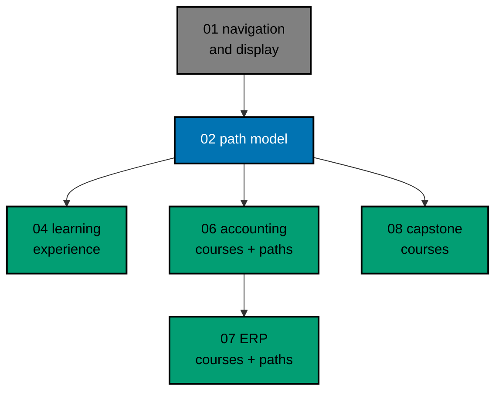

# AyoKoding Learn Revamp 02 — Path Model

> **Status:** Backlog. Do not execute until both are true: the user gives an explicit execution
> command, and plan `ayokoding-learn-revamp-01-navigation-and-display` has merged to `origin/main`.

Today every AyoKoding learning path is one long, flat list. Each of the three software-engineer career
paths holds 114 to 121 courses, and they share 111 of them, so a reader cannot tell what is
essential, what is optional, or where the path ends. This plan gives the paths a data model a junior
reader can follow. Each **career** path gets a short **core** that ends at a clear goal, followed by
optional **extension** phases. Its courses are grouped into titled phases with plain outcomes: "After
this phase you can … / You cannot yet …".

The four **skills** paths (accounting and ERP) are not restructured here. Every one of their courses
is still an outline, and the user decided (decision `UD-02-01`, 2026-10-09) that each skills path is
restructured in the same PR that writes its courses: plan 06 for accounting, plan 07 for ERP. In this
plan the skills paths only move to the new file shape, with the same order and the same copy readers
see today.

This plan owns the **data model** and the smallest UI change that makes the model visible. Plan 04
(`learning-experience`) builds the richer learning experience on top of it: the phase roadmap, progress
tracking, the in-course context bar, and the new Learn home.

## Scope

- **Manifest schema.** Change `apps/ayokoding-www/src/features/course-paths/core/schemas.ts` so each
  path manifest has:
  - titled `phases`, each with a phase `kind` (`core` or `extension`), an `outcome`, and an ordered
    list of course references; core phases come first;
  - `goals`: the goal course or courses of the path;
  - `assumes`: prerequisites that sit outside the path, shown as links.

  Then migrate the loader and every consumer: the path landing syllabus, the path rail (sidebar), the
  mobile banner, Next/Prev, and the arc landing preview. Next/Prev still walks the full ordered list.

- **Minimal phase UI for career paths.** The existing syllabus and path sidebar group courses under
  phase headings. Each core phase shows its outcome line, an **Outline** badge marks outline courses,
  and a "Before you start" note links the `assumes` courses. Nothing else in the UI changes.
- **Skills paths: shape migration only.** Each skills manifest becomes one phase holding today's
  course list in today's order, marked with `restructurePendingIn: "plan-06"` or `"plan-07"`. A closed
  list in code names exactly these four path IDs; a test proves the marker can never apply to a career
  path. Marked paths render exactly as today: no phase heading, no outcome, no badge, no new label.
  Plans 06 and 07 remove the marker when they restructure the path.
- **Outline marker.** Add `status: outline` frontmatter to the 62 skeleton courses (under 1,000
  words). The value is schema-validated.
- **Prerequisite revision.** Reduce the frontmatter `prerequisites` of all 181 courses to true
  conceptual dependencies. The plan includes a written rubric and an evidence table covering every
  edge: 36 removed, 75 added, 325 kept.
- **Integrity checks.** Extend `core/manifest-integrity.ts` and its tests. For every manifest without
  the skills marker, validation fails when:
  - a core course has a prerequisite that is neither earlier in the path nor listed in `assumes`;
  - a core course is an outline.

  The existing checks for unresolved IDs, duplicate IDs, and prerequisite ordering stay and apply to
  every manifest, including the four marked skills manifests.

- **Rewrite the 4 career manifests.** Use the computed cores and thematic phases in
  [tech-docs/004](./tech-docs/004-path-composition.md). No course is dropped from any path.
- **Career path page copy:**
  - move per-phase outcomes into the manifests;
  - fix the Interview-Ready "Phase 1" copy;
  - change the AI Engineer claim from "from scratch" to "for developers who already code";
  - remove "publishes as its manifest ships" from the paths hub and the three career arc pages.
- **Keep working:** the E2E fixture pages `content/en/learn/paths/skills/e2e-fixture-{alpha,beta}` and
  the six E2E fixture manifests, migrated to the new shape.

## Handed to Later Plans

These are recorded in [tech-docs/README.md](./tech-docs/README.md#cross-plan-handoffs).

- **Plan 06 (`accounting-courses`), in the same PR as the filled accounting courses:** restructure
  `skills/conventional-accounting` and `skills/sharia-accounting` into phases with outcomes (series
  decisions 16–18), remove their marker and allowlist entries, remove the skills jargon ("Dangerous
  1–4", "OI-2", "no later plan appends courses") from their pages and from the skills category
  landing, and drop `status: outline` from the 24 accounting courses.
- **Plan 07 (`erp-courses`), in the same PR as the filled ERP courses:** the same for
  `skills/conventional-erp` and `skills/sharia-erp` and the 30 ERP courses; it deletes the allowlist
  module and the flat-render branch once no marked manifest is left.
- **Plan 08 (`capstone-courses`):** writes the 8 skeleton capstones, drops their `status: outline`,
  and gives the AI Engineer path its goal.
- The target phases this plan drafted for the four skills paths are kept in
  [syllabus/paths/](./syllabus/paths/README.md) as **input** for plans 06 and 07. This plan does not
  apply them.

## Non-Goals

- **Plan 01:** course titles, path position numbers, sidebar auto-scroll, and rendering fixes.
- **Plan 03:** course metadata (`category`, `description`, `estimatedHours`), the catalog, and the
  course landing header. This plan adds only the `outline` value of `status`; plan 03 may widen it.
- **Plan 04:** the phase roadmap path page, progress bars, browser progress tracking, the in-course
  context bar, mark-complete, the Learn home landing, and richer path cards. This plan only exposes the
  data plan 04 needs, as described in [tech-docs/002](./tech-docs/002-manifest-schema-and-migration.md#what-plan-04-consumes).
- **Plans 06–13:** writing or rewriting course bodies. This plan edits only course frontmatter
  (`prerequisites`, `status`).
- **Skills path restructuring and skills copy:** plans 06 and 07 (see above).
- **Plan 14:** removing `learn/legacy`.
- **Plan 05:** a reusable command-line tool. Deterministic recompute logic lives in the app's tested
  TypeScript core. An `ayokoding-cli` subcommand that wraps it is a possible follow-up, owned by plan 05.
- **Indonesian content.** `content/id/**` stays untouched.

## Dependency and Result

## Series Context

This plan is row 02 of the 14-plan **AyoKoding Learn Revamp** series. Each plan is one PR delivered
from its own worktree.

The series started when the user asked, in Indonesian, two questions: are the careers, skills, and
course learning paths usable, and can `learn/legacy` be removed? On 2026-10-09 the user then resolved
the series decisions through a grilling session. This plan copies every decision it relies on into
[brd.md](./brd.md#resolved-series-decisions-this-plan-relies-on).

| NN  | Plan suffix                   | Scope                                                                                        | Depends on       |
| --- | ----------------------------- | -------------------------------------------------------------------------------------------- | ---------------- |
| 01  | `navigation-and-display`      | Strip `NN ·` title prefixes; path position numbers; sidebar auto-scroll; render fixes        | —                |
| 02  | `path-model` (this plan)      | Phases, goals, `assumes`, outline marker, prerequisite revision, closure checks, career copy | 01               |
| 03  | `catalog-and-metadata`        | Course metadata schema and backfill, categories, catalog page, course landing header         | 01               |
| 04  | `learning-experience`         | Browser progress, phase roadmap page, context bar, mark complete, Learn home                 | 02, 03           |
| 05  | `code-harness`                | `ayokoding-cli`, `run.yaml` contract, runners, Nx target, CI, quality-gate propagation       | —                |
| 06  | `accounting-courses`          | Write 24 accounting courses; restructure both accounting paths in the same PR                | 02, 03, 05       |
| 07  | `erp-courses`                 | Write 30 ERP courses; restructure both ERP paths in the same PR                              | 06               |
| 08  | `capstone-courses`            | Rewrite 8 skeleton capstones                                                                 | 02, 03, 05       |
| 09  | `filler-rewrites`             | Rewrite 8 templated filler courses                                                           | 03, 05           |
| 10  | `legacy-unique-migration`     | Build courses for legacy topics without an equivalent; record the legacy-to-course map       | 03, 05           |
| 11  | `audit-languages-and-tooling` | Audit and fix language and tooling courses                                                   | 05               |
| 12  | `audit-cs-systems-and-data`   | Audit and fix CS, systems, concurrency, distributed, database, and data courses              | 05               |
| 13  | `audit-product-security-ai`   | Audit and fix web, backend, mobile, security, AI, testing, architecture, product courses     | 05               |
| 14  | `legacy-removal`              | Delete `learn/legacy`, add 308 redirects, repoint `docs/` links, update specs and tests      | 10 (+11–13 done) |

Plans 02 and 03 both edit `frontmatterSchema`. Plan 03 declares plan 02 a hard prerequisite (its
decision D1), so plan 02 merges before plan 03 executes; plan 03 widens the `status` enum that this plan
introduces. [tech-docs/002](./tech-docs/002-manifest-schema-and-migration.md#coordination-with-plan-03)
explains the handover.

## Resolved User Decision

`UD-02-01` (2026-10-09) asked how skills paths should behave while every skills course is still an
outline. The user chose none of the three offered options (a Preview status, unpublishing, or applying
the outline rule to careers only). Instead, each skills path ships with its content plan: plans 06 and
07 restructure the skills paths in the same PR that fills their courses. The record is in
[delivery.md §Resolved User Decision](./delivery.md#resolved-user-decision) and decision D12 in
[tech-docs/007](./tech-docs/007-decision-records.md).

## Navigation

- [Business requirements](./brd.md)
- [Product requirements, Gherkin, and UI design funnel](./prd.md)
- [Technical design](./tech-docs/README.md)
- [Syllabus corpus (path manifests)](./syllabus/README.md)
- [Delivery checklist](./delivery.md)
- [Execution learnings](./learnings.md)
