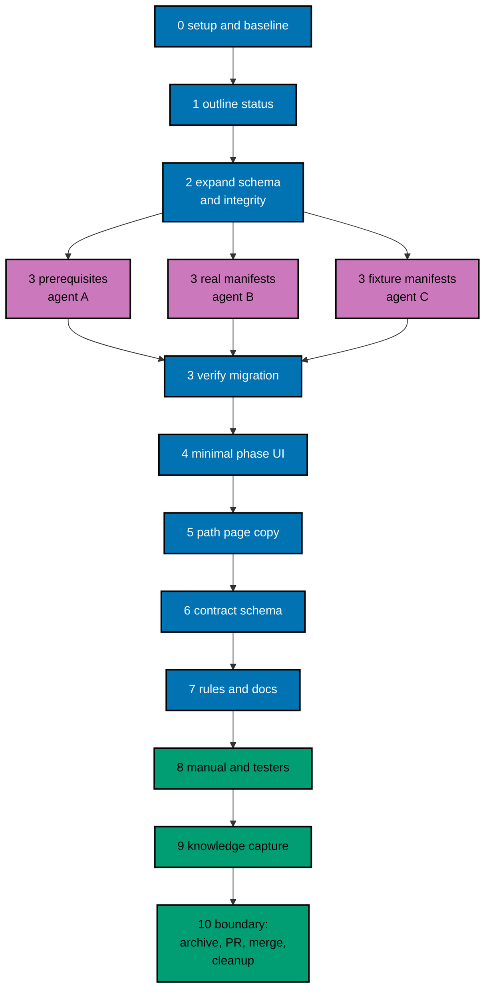

# Delivery Plan — AyoKoding Learn Revamp 02: Path Model

> **Legend** — `[AI]`: an agent performs the step (the default; unmarked steps are `[AI]`).
> `[HUMAN]`: only a human can do it (physical action, out-of-band approval, real-secret or
> privileged-credential handling). `[AI+HUMAN]`: agent prepares, human approves or finishes.

**Do not start** until both are true: (1) the user gives an explicit execution command for this
plan — that command authorizes this plan's change set (commits, pushes, PR, merge, and the deploy
described below); (2) plan `ayokoding-learn-revamp-01-navigation-and-display` has merged to
`origin/main`.

## Resolved User Decision

`UD-02-01` asked: series decision 6 keeps outline courses out of every core, series decision 17 makes
every skills course core, and every one of the 100 course slots in the four skills paths is an
outline today. How should the skills paths behave until their courses are written?

- **Answered:** 2026-10-09, by the user. Recorded as series decision 39.
- **Choice:** `skills_paths_ship_with_content_plans`, which is none of the three offered options (a
  Preview status, unpublishing, or applying the outline rule to careers only).
- **User's words:** "bikin sekalian. semua yang kerangka harus diisi" ("do it together; every outline
  must be filled"), then "Skills path ikut plan konten" ("skills paths go with the content plans").
- **Consequences for this plan:**
  - Scope is the 4 career paths, the schema, and validation. There is no Preview status, badge, or
    notice, no unpublishing, and decision 6 is not narrowed.
  - The 4 skills manifests get only the mechanical shape with the closed `restructurePendingIn`
    marker ([tech-docs/002](./tech-docs/002-manifest-schema-and-migration.md#skills-paths-pending-restructure)).
    Readers see the same order and copy as today.
  - Plan 06 restructures both accounting paths and plan 07 both ERP paths, each in the same PR as the
    filled courses ([tech-docs/README.md](./tech-docs/README.md#cross-plan-handoffs)). The drafted
    skills phases in `syllabus/paths/` are their input.
  - Decision records: D12 and D15 in [tech-docs/007](./tech-docs/007-decision-records.md).

## Worktree

- **Execution worktree:** `worktrees/ayokoding-learn-revamp-02-path-model/`
- **Provisioning command** (from the repository root, at Step 0):
  `claude --worktree ayokoding-learn-revamp-02-path-model`, or the equivalent
  `rtk git worktree add -b ayokoding-learn-revamp-02-path-model-base worktrees/ayokoding-learn-revamp-02-path-model origin/main`.
- **Provisioning status:** pending
- **Authoring-worktree exception:** this plan was authored inside the separate authoring worktree
  `.claude/worktrees/ayokoding-update` (branch `worktree-ayokoding-update`). The user required that
  session to keep writing all plans of the AyoKoding Learn Revamp series together, and said in
  Indonesian not to execute any plan before the user gives the command. That authoring worktree is
  **never** used for execution. The Provisioned Worktree Identity and the Delivery Branch Inventory
  are intentionally omitted until Step 0 creates them.
- **Step 0 obligation (blocking):** Phase 0's first outcome provisions the execution worktree from
  fresh `origin/main` per the
  [Worktree Path Convention](../../../repo-governance/conventions/structure/worktree-path.md),
  initializes it per
  [Worktree Toolchain Initialization](../../../repo-governance/development/workflow/worktree-setup.md),
  writes the immutable identity and the first inventory row into this section, replaces
  `Provisioning status: pending` with `Provisioning status: provisioned`, and syncs with
  `origin/main`. No implementation step may start while the status is pending.
- **Cleanup:** after the PR merges, the worktree, its branches, and this plan's scratch come down
  through [Dev Artifact Clean-Up](../../../repo-governance/workflows/maintenance/dev-artifact-clean-up.md)
  (Phase 10).
- **Worktree cap:** one worktree for this plan in this repository, reused by every phase.

The plan never records an absolute or machine-specific path. Resolve the declared route at runtime
and reconcile it with `rtk git worktree list --porcelain`.

## Delivery Mode: worktree-to-pr

`worktree-to-pr` is mandatory in this repository. One branch and **one PR** deliver the whole plan
(the series rule: each plan is one PR from its own worktree). The PR needs the exact current-head/base
`Quality gate` from `.github/workflows/pr-quality-gate.yml` and an exact-head posted `pr-leak-review`
`pass` (`leak-review` status). Broad semantic PR review is not run unless the user asks for it.
`[AI]` merges once the hardened merge preconditions hold.

## Parallelization Model

The work is one dependency chain: the outline marker feeds the integrity rules; the expanded schema
feeds the migration; the migrated data feeds the UI; the contract step needs every file migrated.
Fan-out happens only **inside** a phase, on disjoint files, never across delivery units.

### Delivery Boundaries

| Phase(s) | Natural cohesive seam                                  | Worktree                                          | Branch                                 | Delivery opportunity             | Exact resulting `main` / rollback / feature-flag evidence                                                                                                                                                                                                                                                                                                                                                 |
| -------- | ------------------------------------------------------ | ------------------------------------------------- | -------------------------------------- | -------------------------------- | --------------------------------------------------------------------------------------------------------------------------------------------------------------------------------------------------------------------------------------------------------------------------------------------------------------------------------------------------------------------------------------------------------- |
| 0        | — (setup and baseline)                                 | —                                                 | —                                      | none                             | No resulting state change; flag not applicable                                                                                                                                                                                                                                                                                                                                                            |
| 1–10     | The path model: data, validation, minimal UI, and copy | `worktrees/ayokoding-learn-revamp-02-path-model/` | `ayokoding-learn-revamp-02-path-model` | PR opened and merged in Phase 10 | `main` gets the phase schema (contracted), migrated manifests and frontmatter, integrity tests, phase UI, and new copy together; every course URL still works. Rollback: revert the merge commit in a revert PR ([tech-docs/002 Rollback](./tech-docs/002-manifest-schema-and-migration.md#rollback)). No flag: no behaviour is incomplete at merge, and the dual-shape schema never reaches `main` (D3). |

### Agent Topology

- **Main thread (root coordinator):** owns the file ledger, every gate, integration of agent output,
  and every commit. It keeps itself free and fills background slots first.
- **N = 3 background agents**, at most, at any time:
  - Phases 1, 2, 4, 6: one `swe-developer` (code and tests) and one `specs-maker` (Gherkin), run in
    sequence because they share step files.
  - Phase 3: three agents in parallel on disjoint files — agent A `apps-ayokoding-www-general-maker`
    (the 43 prerequisite edits), agent B `swe-developer` (the 4 career manifests rewritten and the 4
    skills manifests reshaped), agent C
    `swe-developer` (the 6 fixture manifests). The root then runs the verification.
  - Phase 5: one `apps-ayokoding-www-general-maker` (path page copy).
  - Phase 7: `rules-maker` (rule module), then `docs-fixer` and `readme-fixer` (docs propagation).
  - Phase 8: `swe-web-tester` (exploratory and design charters) and `swe-usability-tester`.
- Record every agent ID, its file set, and its review-cycle count in
  `local-tmp/ayokoding-learn/plan-02/execution-ledger.md`.

### Execution Packet Defaults

- **Plan path after promotion:** `plans/in-progress/ayokoding-learn-revamp-02-path-model/` (written
  below as `<plan>/`). Evidence goes to `<plan>/evidence/`.
- **Scratch:** the execution ledger, raw command output, and curl bodies live in the execution
  worktree's `local-tmp/ayokoding-learn/plan-02/` (gitignored).
- **No ad-hoc scripts (series decision 37).** Core computation, closure checks, and word counts run
  only through the app's unit tests (`src/features/course-paths/core/` and `tests/unit/`). Do not
  write scripts under `scripts/` or `local-tmp/` to compute or edit data. Read-only inspection with
  `rtk git grep`, `rtk git diff`, and `rtk git ls-tree` is fine.
- **Evidence hygiene:** evidence files contain repository-relative paths only. Never paste an
  absolute home-directory path, a hostname, a token, or `.env*` content.
- **Never commit** `apps/ayokoding-www/next-env.d.ts` (the dev server rewrites it) or
  `.serena/project.yml`. Before every commit run `rtk git status --short` and restore either file with
  `rtk git checkout -- <file>` if it shows as modified.
- **Never touch** `.env.prod` or `.env.stag`. If the dev server needs a variable, copy the key from
  `apps/ayokoding-www/.env.example` into an uncommitted `apps/ayokoding-www/.env.local`.
- **No git identity changes.** Never run `git config user.*`.
- **Bounded loops:** any maker→checker review loop runs at most 2 cycles. A file still failing after
  cycle 2 is recorded as `BLOCKED` in the execution ledger with its findings and reported to the user;
  the phase gate stays open until the user decides.
- **Failure handling:** on any unexpected failure, save the output to the phase evidence file, fix the
  root cause (never skip, retry-until-green, loosen, widen, or delete a test), rerun the same command,
  and note the fix.

> **Important**: Fix ALL failures found during quality gates, not just those caused by your
> changes. This follows the root cause orientation principle — proactively fix preexisting
> errors encountered during work.

### Command Reference

Run every command from the execution worktree root. Expected results are stated at each use.

| Name               | Command                                                                                                                                        |
| ------------------ | ---------------------------------------------------------------------------------------------------------------------------------------------- |
| `UNIT-FE <file>`   | `rtk ./hippo run --class ephemeral --resource-tier standard --disk-path . --cwd apps/ayokoding-www -- npx vitest run --project unit-fe <file>` |
| `UNIT-NODE <file>` | `rtk ./hippo run --class ephemeral --resource-tier standard --disk-path . --cwd apps/ayokoding-www -- npx vitest run --project unit <file>`    |
| `QUICK`            | `rtk ./hippo run --class ephemeral --resource-tier standard --disk-path . -- npm exec nx -- run ayokoding-www:test:quick`                      |
| `INTEGRATION`      | `rtk ./hippo run --class ephemeral --resource-tier heavy --disk-path . -- npm exec nx -- run ayokoding-www:test:integration`                   |
| `BEHAVIOUR`        | `rtk ./hippo run --class ephemeral --resource-tier standard --disk-path . -- npm exec nx -- run ayokoding-www:test:coverage:behaviour`         |
| `E2E-BEHAVIOUR`    | `rtk ./hippo run --class ephemeral --resource-tier standard --disk-path . -- npm exec nx -- run ayokoding-www-fe-e2e:test:coverage:behaviour`  |
| `E2E-QUICK`        | `rtk ./hippo run --class ephemeral --resource-tier standard --disk-path . -- npm exec nx -- run ayokoding-www-fe-e2e:test:quick`               |
| `E2E`              | `rtk ./hippo run --class ephemeral --resource-tier heavy --disk-path . -- npm exec nx -- run ayokoding-www-fe-e2e:test:e2e`                    |
| `BUILD`            | `rtk ./hippo run --class ephemeral --resource-tier heavy --disk-path . -- npm exec nx -- run ayokoding-www:build`                              |
| `GEN-INDEXES`      | `rtk ./hippo run --class transactional --resource-tier standard --disk-path . -- npm exec nx -- run ayokoding-www:generate-indexes`            |
| `VALIDATE-INDEXES` | `rtk ./hippo run --class ephemeral --resource-tier standard --disk-path . -- npm exec nx -- run ayokoding-www:validate-indexes`                |
| `DEV`              | `rtk ./hippo run --class service --resource-tier standard --disk-path . -- npm exec nx -- dev ayokoding-www` (serves `http://localhost:3101`)  |
| `LINT-MD`          | `rtk npm run lint:md`                                                                                                                          |

`UNIT-FE` runs files under `tests/unit/fe-steps/` and `tests/unit/features/**/*.test.{ts,tsx}`;
`UNIT-NODE` runs `*.unit.test.ts` files and `tests/unit/be-steps/`. Paths after the command are
relative to `apps/ayokoding-www/`. `E2E` builds the app against the fixture manifests in
`apps/ayokoding-www-fe-e2e/fixtures/manifests/` and runs every scenario in Chromium, Firefox, and
WebKit; it takes a long time. Read the list reporter output for named scenario titles.

### Commit Guidelines

- [ ] [AI] Do not stage or commit until the user's execution command has authorized this plan's
      change set; do not extend a commit beyond it.
- [ ] [AI] Use the fewest build-valid, independently reviewable and revertible commits, one coherent
      purpose each. Suggested: one per phase 1–7, then evidence and the archival move.
- [ ] [AI] Follow Conventional Commits: `<type>(<scope>): <description>`, imperative, no period (for
      example `feat(ayokoding-www): group path courses into phases`).
- [ ] [AI] Keep each change with its tests, specs, regenerated indexes, docs, and generated harness
      routes in the same commit; stage explicit paths only, never `git add -A`.

### Files Changed

The full root-relative tree with `[E]`/`[N]`/`[D]`/`[G]` markers is in
[tech-docs/008](./tech-docs/008-file-impact.md). In short:

- **App code:** `apps/ayokoding-www/src/features/course-paths/{core,shell}/**`,
  `apps/ayokoding-www/src/features/content/{core/schemas.ts,core/types.ts,shell/repository-fs.ts}`,
  `apps/ayokoding-www/src/features/i18n/core/translations.ts`, and the paths hub in
  `apps/ayokoding-www/src/app/[locale]/(content)/[...slug]/page.tsx`.
- **Data:** 4 rewritten career manifests, 4 mechanically reshaped skills manifests, 6 E2E fixture
  manifests, 105 course `_index.md` frontmatter blocks, and 8 path pages (the hub, 3 career arc
  pages, 4 career path pages) under `apps/ayokoding-www/content/en/learn/paths/`. No skills page
  changes.
- **Specs and tests:** 5 new and 5 edited feature files; new and edited unit, step, and E2E files.
- **Rules and docs (Phase 7):** one new rule module in `.agents/skills/apps-ayokoding-www-developing-content/`,
  its regenerated bindings, one example sentence in
  `repo-governance/conventions/structure/learning-plan-syllabus/learning-bearing-trigger.md`, and the
  manifests, fixtures, and specs READMEs.
- **Plan:** `<plan>/delivery.md`, `<plan>/learnings.md`, `<plan>/evidence/**`, and the plan READMEs.

### Before Phase 0: Promotion

- [ ] [AI] Promote the plan per
      [Starting and Completing Work](../../../repo-governance/conventions/structure/plans/starting-and-completing-work.md):
      a pure move of `plans/backlog/ayokoding-learn-revamp-02-path-model/` to
      `plans/in-progress/ayokoding-learn-revamp-02-path-model/` plus the `plans/backlog/README.md` and
      `plans/in-progress/README.md` index updates, landed on `origin/main` through its own PR.
      Acceptance: `rtk git ls-tree -r --name-only origin/main plans/in-progress/ayokoding-learn-revamp-02-path-model/`
      lists this plan's files. This promotion PR is separate from the delivery unit.

---

## Phase 0: Worktree, Environment, Preconditions, and Baseline

Phase 0 opens no PR. Its evidence rides the delivery PR.

- **Input:** the promotion on `origin/main`; this plan at `<plan>/`.
- **Outcome:** a provisioned, initialized worktree; confirmed preconditions; a green baseline,
  including before-screenshots of the skills pages that must not change; and proof that no manifest
  or prerequisite drifted since authoring.
- **Proof:** `<plan>/evidence/phase-0-baseline.md`.

- [ ] [AI] **Plan quality gate (deferred from authoring):** run the `plan-quality-gate` workflow on this
      plan with `max-cycles` 2 before any other step below. It was deliberately not run when this plan was
      written, to keep token use even (user decision, 2026-10-09). Acceptance: verdict `PASS` or
      `PASS_WITH_FINDINGS`; record the line `plan-quality-gate: <verdict> (<n> cycles, <k> open)` in this
      file's header section. If the plan is still in `plans/backlog/`, run the gate before the promotion PR.
      A `BLOCKED` verdict stops execution and is reported to the user.
- [ ] [AI] **Step 0 (blocking first outcome):** from the repository root, provision the execution
      worktree with the command in [## Worktree](#worktree). Record the Provisioned Worktree Identity
      (declared route `worktrees/ayokoding-learn-revamp-02-path-model/`, initial branch
      `ayokoding-learn-revamp-02-path-model-base`, creator, UTC creation time) and the first Delivery
      Branch Inventory row (`provisioned`, `active`, proof `git worktree add` at the timestamp) in
      [## Worktree](#worktree). Set `Provisioning status: provisioned`. Acceptance:
      `rtk git worktree list --porcelain` lists the worktree on the base branch.
- [ ] [AI] From the worktree root, run
      `rtk ./hippo run --class transactional --resource-tier standard --disk-path . -- npm install`.
      Acceptance: exit 0 and Husky hooks installed (`.husky/_` exists).
- [ ] [AI] Run `rtk npm run doctor`. Acceptance: exit 0. Only if it reports a missing or drifted
      toolchain, run
      `rtk ./hippo run --class transactional --resource-tier standard --disk-path . -- ./rhino toolchain provision --apply`
      and then `rtk npm run doctor` again (exit 0).
- [ ] [AI] Sync and branch: `rtk git fetch origin`, `rtk git merge --ff-only origin/main`, then
      `rtk git switch -c ayokoding-learn-revamp-02-path-model`. Append the branch to the inventory
      (`worktree-to-pr`, `active`). Acceptance: `rtk git status` shows the new branch, clean.
- [ ] [AI] **Precondition — plan 01 merged:** run `rtk git ls-tree -d --name-only origin/main plans/done/`.
      Acceptance: the output contains a folder ending in `__ayokoding-learn-revamp-01-navigation-and-display`.
      If not, stop: this plan is blocked; report to the user.
- [ ] [AI] **Plan 03 detection:** run
      `rtk git grep -n "estimatedHours" origin/main -- apps/ayokoding-www/src/features/content/core/schemas.ts`.
      Acceptance: record "plan 03 landed" (a match) or "plan 03 not landed" (no match). If it landed,
      follow [tech-docs/002 Coordination With Plan 03](./tech-docs/002-manifest-schema-and-migration.md#coordination-with-plan-03)
      in Phase 1.
- [ ] [AI] **Drift check — manifests:** run
      `rtk git diff --stat bb7f90137 origin/main -- apps/ayokoding-www/src/features/course-paths/manifests apps/ayokoding-www-fe-e2e/fixtures/manifests`.
      Acceptance: empty output. Any change means the membership data in `syllabus/paths/` may be stale:
      stop and report the diff to the user.
- [ ] [AI] **Drift check — prerequisites and course set:** run
      `rtk git diff --stat -G "^(prerequisites:|  - |status:)" bb7f90137 origin/main -- apps/ayokoding-www/content/en/learn/courses`.
      For every listed file, open its diff and check whether its frontmatter `prerequisites` or
      `status` changed. Then run
      `rtk git ls-tree -d --name-only origin/main apps/ayokoding-www/content/en/learn/courses/` and
      count the lines. Acceptance: no frontmatter `prerequisites`/`status` change and exactly 181
      courses. Otherwise stop and report the difference to the user.
- [ ] [AI] **Vercel MCP re-probe:** check this session's available tools for a Vercel MCP server and
      record "present", "present but unauthenticated", or "absent". The plan assumed "absent" and uses
      no Vercel tool, so any result lets Phase 1 proceed; record it either way. Record no Vercel
      identifiers.
- [ ] [AI] Run `QUICK`. Acceptance: exit 0. Save the summary (exit code, test counts, coverage) in
      `<plan>/evidence/phase-0-baseline.md`.
- [ ] [AI] Run `BEHAVIOUR` and `E2E-BEHAVIOUR`. Acceptance: both exit 0.
- [ ] [AI] Run `E2E-QUICK` and `E2E`. Acceptance: both exit 0 with every scenario passing; record the
      pass counts. If anything fails before any change, fix the root cause first.
- [ ] [AI] Run `INTEGRATION` and `VALIDATE-INDEXES`. Acceptance: both exit 0.
- [ ] [AI] Start `DEV` in the background. With Playwright MCP at 1280×800 open
      `http://localhost:3101/en/learn/paths/careers/interview-ready/software-engineer`. Acceptance: one
      flat numbered list of 116 courses. Screenshot `<plan>/evidence/phase-0-before-ir-path-en-1280px.png`.
      Then open `http://localhost:3101/id/learn/paths/careers/interview-ready/software-engineer` and
      record the HTTP status and what renders (the Indonesian site has no paths tree today); this is
      the baseline Phase 8 compares against. Screenshot `<plan>/evidence/phase-0-before-ir-path-id-1280px.png`.
- [ ] [AI] **Skills baseline (decision 39):** with `DEV` running, open `/en/learn/paths/skills`, the four
      skills paths (`/en/learn/paths/skills/conventional-accounting`, `…/sharia-accounting`,
      `…/conventional-erp`, `…/sharia-erp`), and
      `/en/learn/courses/accounting-foundations?path=skills/conventional-accounting` at 375×800 and
      1280×800. Screenshot each as `<plan>/evidence/phase-0-before-skills-<page>-en-<bp>px.png` and save
      the text of each syllabus list and rail list. Acceptance: the files exist; Phase 8 compares
      against them.
- [ ] [AI] With `DEV` still running, run the tRPC success command from
      [tech-docs/005](./tech-docs/005-integrity-validation-and-testing.md#manual-api-wire-checks-trpc)
      with output files renamed `trpc-en-before.*`. Acceptance: status 200; 8 manifests, each with
      `courseOrder` and no `phases`. Record the status line and the asserted fields. Stop `DEV`.

### Phase 0 Gate

> All checks below must pass before starting Phase 1.

- [ ] [AI] `Provisioning status: provisioned` with identity and inventory recorded.
- [ ] [AI] The skills baseline screenshots and list text are saved.
- [ ] [AI] `<plan>/evidence/phase-0-baseline.md` records exit 0 for `QUICK`, `BEHAVIOUR`,
      `E2E-BEHAVIOUR`, `E2E-QUICK`, `E2E`, `INTEGRATION`, and `VALIDATE-INDEXES`, the two drift checks,
      the plan 03 result, and the Vercel probe.
- [ ] [AI] `rtk git status --short` shows only `<plan>/` changes.

> **Pause Safety**: the worktree is provisioned and green, the baseline is recorded, and no product
> file has changed. Safe to stop. To resume:
> `rtk git -C worktrees/ayokoding-learn-revamp-02-path-model status --short`, then `QUICK`.

---

## Phase 1: Outline Course Status

- **Input:** prd.md FR-10 and `outline-course-status.feature` scenarios "Course status accepts only
  the outline value", "Every course frontmatter parses so no course page is silently dropped", and "A
  course under one thousand words is marked as an outline";
  [tech-docs/002 Field Guide](./tech-docs/002-manifest-schema-and-migration.md#field-guide);
  [syllabus/courses/README.md](./syllabus/courses/README.md) (the 62 courses); decision D7.
- **Outcome:** course frontmatter accepts `status: outline`; `ContentMeta.status` carries it; the 62
  skeleton courses carry it; a guard fails if a course under 1,000 words lacks it.
- **Proof:** `<plan>/evidence/phase-1-outline-status.md` with RED and GREEN outputs and the 62-course
  list printed by the guard before GREEN.
- _Suggested executor: `specs-maker` for Gherkin, `swe-developer` for code and frontmatter._

- [ ] [AI] **Gherkin first:** create
      `specs/apps/ayokoding/www/behaviours/frontend/course-paths/outline-course-status.feature` with the
      feature header and the three scenarios named above, copied from prd.md with their exemption
      comments and tags. The badge scenario lands in Phase 4. Run `BEHAVIOUR`. Acceptance: it fails and
      names exactly the three new scenarios as missing unit bindings.

### AC-1.1 — Frontmatter schema accepts only `outline`

- [ ] [AI] **RED:** in `tests/unit/features/content/core/schemas.test.ts` add cases: `status:
"outline"` parses; no `status` parses; `status: "draft"` fails. Run
      `UNIT-FE tests/unit/features/content/core/schemas.test.ts`. Acceptance: the `"outline"` case fails
      (the key is stripped or rejected today); save the output.
- [ ] [AI] **GREEN:** in `apps/ayokoding-www/src/features/content/core/schemas.ts` add
      `status: z.enum(["outline"]).optional()` to `frontmatterSchema` (if plan 03 landed, keep its enum
      and confirm it contains `"outline"`). Rerun the same command. Acceptance: all cases pass.
- [ ] [AI] **REFACTOR:** add a one-line comment naming the guard test that keeps the marker honest.
      Run `QUICK`. Acceptance: exit 0.

### AC-1.2 — `ContentMeta` carries `status`

- [ ] [AI] **RED:** in `tests/unit/features/content/shell/repository-fs.unit.test.ts` add a case whose
      fixture course frontmatter has `status: outline` and assert the loaded `ContentMeta.status` is
      `"outline"`, and is `undefined` for a course without it. Run
      `UNIT-NODE tests/unit/features/content/shell/repository-fs.unit.test.ts`. Acceptance: the new
      assertion fails.
- [ ] [AI] **GREEN:** add `status?: "outline"` to `ContentMeta` in
      `apps/ayokoding-www/src/features/content/core/types.ts` and map `frontmatter.status` next to
      `prerequisites` in `apps/ayokoding-www/src/features/content/shell/repository-fs.ts`. Rerun.
      Acceptance: pass.
- [ ] [AI] **REFACTOR:** match the doc comment style of `prerequisites` in `types.ts`. Run `QUICK`.
      Acceptance: exit 0.

### AC-1.3 — Every course parses, and every skeleton course is marked

- [ ] [AI] **RED:** create `tests/unit/features/content/course-frontmatter.unit.test.ts`: for each
      folder in `content/en/learn/courses/`, parse `_index.md` with `gray-matter` and
      `frontmatterSchema` (must succeed), and count whitespace-split tokens across every `.md` file in
      the folder; a course under 1,000 words must have `status: "outline"`. The failure message lists
      every offending slug. Run `UNIT-NODE tests/unit/features/content/course-frontmatter.unit.test.ts`.
      Acceptance: the parse test passes; the guard fails listing exactly the 62 slugs in
      [syllabus/courses/README.md](./syllabus/courses/README.md#1-outline-marker-62-courses). Save the
      list. If the list differs, stop and report.
- [ ] [AI] **GREEN:** add the line `status: outline` to the frontmatter of each of the 62
      `apps/ayokoding-www/content/en/learn/courses/<slug>/_index.md` files, directly after
      `prerequisites`. Change nothing else. Rerun the same command. Acceptance: pass. Run
      `rtk git diff --stat -- apps/ayokoding-www/content/en/learn/courses` and confirm 62 files, one
      line each.
- [ ] [AI] **REFACTOR:** extract the word counter into a small named helper inside the test file with
      a comment that it is test code, not a product feature. Run `QUICK`. Acceptance: exit 0.

- [ ] [AI] **Bind the scenarios:** create `tests/unit/fe-steps/outline-course-status.steps.tsx` using
      `describeFeature`/`loadFeature` like `tests/unit/fe-steps/course-path-manifest.steps.ts`, binding
      the three scenarios to the same assertions (schema cases; parse all; guard). Run
      `UNIT-FE tests/unit/fe-steps/outline-course-status.steps.tsx`, then `BEHAVIOUR`. Acceptance: both
      exit 0.

### Phase 1 Gate

> All checks below must pass before starting Phase 2.

- [ ] [AI] `QUICK` exits 0 (coverage threshold held).
- [ ] [AI] `BEHAVIOUR` exits 0.
- [ ] [AI] `VALIDATE-INDEXES` exits 0. If it reports drift, run `GEN-INDEXES`, review the diff, and
      keep the regenerated files with this phase.
- [ ] [AI] `rtk git status --short` lists only the feature file, the schema, types, repository-fs,
      the three test files, the 62 `_index.md` files, any regenerated index files, and `<plan>/`.

> **Pause Safety**: outline courses are marked and guarded; no reader-visible change yet. Safe to
> stop. To resume: `QUICK`.

---

## Phase 2: Expand the Manifest Schema and Add Pure Path-Model Functions

- **Input:** prd.md FR-1, FR-2, FR-3, FR-12, FR-15; `core-closure.feature` scenarios 1–10 (every
  scenario over synthetic data, from "A core course whose prerequisite is neither earlier nor assumed
  fails" to "A marked skills manifest is exempt only from the core rules");
  [tech-docs/002](./tech-docs/002-manifest-schema-and-migration.md) target schema, Expand step, and
  Skills Paths Pending Restructure; [tech-docs/005](./tech-docs/005-integrity-validation-and-testing.md)
  rules R1–R10 and function contracts; decisions D1–D5, D9, D13, D15.
- **Outcome:** the schema accepts both the legacy file shape and the phase shape (expand); the domain
  object always has `phases`, `assumes`, and a derived `courseOrder`; `computeCore`, the phase helpers,
  `checkPathModelIntegrity`, and the closed skills restructure allowlist exist and are unit-tested on
  synthetic manifests; legacy membership and the skills order are frozen. No manifest file changes
  yet.
- **Proof:** `<plan>/evidence/phase-2-expand.md`.
- _Suggested executor: `specs-maker` for Gherkin, `swe-developer` for code._

- [ ] [AI] **Gherkin first:** create `core-closure.feature` with scenarios 1–10 from prd.md, each with
      both exemption comments and `@integration-exempt` `@e2e-exempt` tags in the format of
      `manifest-integrity.feature`. In `manifest-integrity.feature` and
      `prerequisite-consistent-ordering.feature`, change "lists a courseOrder of course IDs" to "lists
      phases of course IDs" (prd.md "Modified Existing Features"). Run `BEHAVIOUR`. Acceptance: fails,
      naming only the new and reworded scenarios.

### AC-2.1 — The schema accepts phases and derives `courseOrder` (expand)

- [ ] [AI] **RED:** create `tests/unit/features/course-paths/manifest-fixture.ts` exporting
      `manifestFixture({ phases?, goals?, assumes?, restructurePendingIn?, pathId? })` that builds a parsed
      `PathManifest` with one core phase by default. In
      `tests/unit/features/course-paths/core/schemas.test.ts` add cases: a phase-shaped file parses and
      its `courseOrder` equals the phases' courses in order; a core phase without `outcome` fails; an
      empty phase fails; a bad phase ID (`Phase 1`) fails; a legacy `{courseOrder}` file still parses
      into one core phase `all-courses`. Run `UNIT-FE tests/unit/features/course-paths/core/schemas.test.ts`.
      Acceptance: the new cases fail.
- [ ] [AI] **GREEN:** in `apps/ayokoding-www/src/features/course-paths/core/schemas.ts` add
      `phaseOutcomeSchema`, `pathPhaseSchema`, `PathManifestFileSchema`, and the transform from
      [tech-docs/002](./tech-docs/002-manifest-schema-and-migration.md#target-schema-coreschemasts), plus
      a temporary union that also accepts the legacy shape and normalizes it (Expand step). Leave
      `restructurePendingIn` and its `superRefine` branch for AC-2.5; until then the core-outcome check
      is the only `superRefine` rule. Export `PathPhase`; re-export from `core/manifest.ts`. Rerun.
      Acceptance: pass.
- [ ] [AI] **REFACTOR:** mark the legacy branch with a `// expand-contract: removed in Phase 6`
      comment. Run `QUICK`. Acceptance: exit 0. Typecheck errors in tests that build `PathManifest`
      literals are fixed by switching them to `manifestFixture` (including
      `tests/unit/fe-steps/course-path-manifest.steps.ts`), not by casting.

### AC-2.2 — Phase helpers

- [ ] [AI] **RED:** create `tests/unit/features/course-paths/core/path-phases.test.ts` covering
      `corePhases`, `extensionPhases`, and `phaseOfCourse` (first course of the first extension phase in
      a 2-core + 1-extension manifest returns that phase and position `= core count + 1`; unknown ID
      returns `null`). Run `UNIT-FE tests/unit/features/course-paths/core/path-phases.test.ts`.
      Acceptance: fails (module missing).
- [ ] [AI] **GREEN:** create `apps/ayokoding-www/src/features/course-paths/core/path-phases.ts` with
      the three pure functions from tech-docs/005. Rerun. Acceptance: pass.
- [ ] [AI] **REFACTOR:** add TSDoc that names plan 04 as the consumer. Run `QUICK`. Acceptance: exit 0.

### AC-2.3 — `computeCore`

- [ ] [AI] **RED:** create `tests/unit/features/course-paths/core/path-core.test.ts`: single goal;
      two goals (union); closure stops at an `assumes` course; diamond dependency counted once; unknown
      prerequisite IDs ignored. Run `UNIT-FE tests/unit/features/course-paths/core/path-core.test.ts`.
      Acceptance: fails (module missing).
- [ ] [AI] **GREEN:** create `apps/ayokoding-www/src/features/course-paths/core/path-core.ts` with
      `computeCore(goals, prerequisitesByCourse, assumes?)` (breadth-first walk, returns a `Set`). Rerun.
      Acceptance: pass.
- [ ] [AI] **REFACTOR:** remove any duplication with `core/prerequisites.ts` types (import
      `PrerequisitesByCourse` from there). Run `QUICK`. Acceptance: exit 0.

### AC-2.4 — `checkPathModelIntegrity` (R1–R8) and the phase-aware existing checks

- [ ] [AI] **RED:** in `tests/unit/features/course-paths/core/manifest-integrity.test.ts` add, for
      each rule R1–R8 in tech-docs/005, one passing and one failing synthetic manifest built with
      `manifestFixture`, asserting the exact violation field and IDs. Add a case that
      `checkManifestIntegrity` reports a duplicate across two phases. In
      `tests/unit/features/course-paths/core/path-nav.test.ts` add a case that Next from the last core
      course returns the first extension course. Run both files with `UNIT-FE`. Acceptance: the new
      integrity cases fail; the path-nav case already passes (it pins existing behaviour across a
      phase boundary) — record that in the evidence.
- [ ] [AI] **GREEN:** in `apps/ayokoding-www/src/features/course-paths/core/manifest-integrity.ts` add
      `PathModelContext`, `PathModelViolations`, `checkPathModelIntegrity`, and `isCleanPathModel`
      exactly as in tech-docs/005, without the marker parts (AC-2.5 adds them). Keep
      `checkManifestIntegrity`'s signature; make it read the derived `courseOrder`. Rerun. Acceptance:
      pass (Next/Prev needs no change because it walks `courseOrder`).
- [ ] [AI] **REFACTOR:** split each rule into a small named function inside the module; keep the file
      pure (no IO, no `console`). Run `QUICK`. Acceptance: exit 0 and coverage at or above the
      threshold.

### AC-2.5 — The closed skills restructure marker (R9)

- [ ] [AI] **RED:** create `tests/unit/features/course-paths/core/skills-restructure-allowlist.test.ts`:
      the allowlist has exactly the four entries from tech-docs/002, every key starts with `skills/`,
      and accounting maps to `plan-06`, ERP to `plan-07`; `isMarkedShape` accepts the one-phase
      `all-courses` shape and rejects a second phase, an outcome, goals, a non-empty `assumes`, and
      another phase ID; `checkMarkerUsage` reports an unused entry and an unexpected marker. In
      `core/schemas.test.ts` add: a marked allowlisted skills file parses; the same marker on
      `careers/interview-ready/software-engineer` fails; on `skills/e2e-fixture-alpha` fails; accounting
      with `"plan-07"` fails; a marked file with two phases fails; a marked file's core phase without an
      outcome parses. In `manifest-integrity.test.ts` add: a marked manifest with outline core courses
      and outside prerequisites reports no R4–R8 violation but still reports an unresolved and a
      duplicate ID; a synthetic career manifest carrying the marker sets `markerNotAllowed`. Run the
      three files with `UNIT-FE`. Acceptance: the new cases fail.
- [ ] [AI] **GREEN:** create `apps/ayokoding-www/src/features/course-paths/core/skills-restructure-allowlist.ts`
      with `SKILLS_RESTRUCTURE_ALLOWLIST`, `isMarkedShape`, `isPendingSkillsRestructure`, and
      `checkMarkerUsage` from tech-docs/005; add `restructurePendingIn` and the marker branch of the
      `superRefine` from tech-docs/002 to `core/schemas.ts`; add `markerNotAllowed` and the marked
      exemption to `checkPathModelIntegrity`. Rerun. Acceptance: pass.
- [ ] [AI] **REFACTOR:** put the comment `// Decision 39: plan 06 removes the accounting entries; plan 07
deletes this module` at the top of the allowlist module and next to the schema field. Run `QUICK`.
      Acceptance: exit 0.

- [ ] [AI] **Freeze legacy membership:** create
      `tests/unit/features/course-paths/manifests/legacy-membership.ts` exporting a sorted course-ID
      array per real path ID, copied from the current manifests on this branch (not computed by a
      script: copy each `courseOrder` array, then sort). Acceptance: lengths IR 116, IE SE 114, IE AI
      26, FS 121, skills 19 / 24 / 27 / 30 (record in evidence).
- [ ] [AI] **Freeze the skills order:** create
      `tests/unit/features/course-paths/manifests/legacy-skills-order.ts` exporting, for each of the four
      skills path IDs, its current `courseOrder` array copied **unsorted** from the manifest on this
      branch. Acceptance: lengths 19 / 24 / 27 / 30 and each array equals the "What Plan 02 Writes" list
      in its `syllabus/paths/manifest-skills-*.md` (record in evidence).
- [ ] [AI] **Bind the scenarios:** create `tests/unit/fe-steps/core-closure.steps.ts` binding scenarios
      1–10 to `checkPathModelIntegrity` and the manifest schema over `manifestFixture` inputs; update
      `tests/unit/fe-steps/course-path-manifest.steps.ts` to the reworded steps. Run
      `UNIT-FE tests/unit/fe-steps/core-closure.steps.ts`, `UNIT-FE tests/unit/fe-steps/course-path-manifest.steps.ts`,
      and `BEHAVIOUR`. Acceptance: all exit 0.

### Phase 2 Gate

> All checks below must pass before starting Phase 3.

- [ ] [AI] `QUICK` and `BEHAVIOUR` exit 0.
- [ ] [AI] `E2E-QUICK` exits 0 (step files still compile against the new types).
- [ ] [AI] `rtk git diff --stat origin/main -- apps/ayokoding-www/src/features/course-paths/manifests apps/ayokoding-www-fe-e2e/fixtures/manifests`
      is empty (no data changed yet).

> **Pause Safety**: the schema accepts both shapes, every manifest still loads in the legacy shape,
> and the new rules are tested on synthetic data. Safe to stop. To resume: `QUICK`.

---

## Phase 3: Migrate Prerequisites and Manifests

- **Input:** prd.md FR-9, FR-11, FR-13, FR-15; `core-closure.feature` scenarios 11–14 ("Every
  allowlist entry is still in use", "The published manifests pass every integrity rule", "The
  rewritten manifests keep every course of their previous version", and "The marked skills manifests
  keep today's course order");
  [tech-docs/003](./tech-docs/003-prerequisite-rubric-and-evidence.md) (per-course table);
  [syllabus/paths/](./syllabus/paths/README.md) (target JSON per path and fixture table);
  [tech-docs/004](./tech-docs/004-path-composition.md); decisions D5, D6, D10, D12, D14, D15.
- **Outcome:** 43 courses have revised `prerequisites`; the 4 career and 6 fixture manifests use
  phases; the 4 skills manifests have the mechanical shape and their marker; every real manifest
  passes every rule that applies to it with real frontmatter; membership is unchanged and the skills
  order is unchanged.
- **Proof:** `<plan>/evidence/phase-3-prerequisites.md` (the 43-file review) and
  `<plan>/evidence/phase-3-manifests.md`.
- _Suggested executor: agent A `apps-ayokoding-www-general-maker`; agents B and C `swe-developer`._

- [ ] [AI] **Gherkin first:** add the four scenarios above to `core-closure.feature`. Run `BEHAVIOUR`.
      Acceptance: fails naming only those four.

### AC-3.1 — Real manifests pass every rule (RED before data)

- [ ] [AI] **RED:** create `tests/unit/features/course-paths/manifests/path-model-integrity.unit.test.ts`.
      For each of the 8 real manifests, load real frontmatter through the content repository (or
      `gray-matter` over `content/en/learn/courses/*/_index.md`), build `PathModelContext`, run
      `checkPathModelIntegrity`, and assert zero violations; on failure print every violation and, for
      a manifest with `goals`, the expected core from `computeCore`. Create
      `tests/unit/features/course-paths/manifests/manifest-membership.unit.test.ts` asserting each real
      manifest's sorted course set equals `legacy-membership.ts`. Create
      `tests/unit/features/course-paths/manifests/skills-order.unit.test.ts` asserting each skills
      manifest's derived `courseOrder` equals `legacy-skills-order.ts` exactly and that
      `checkMarkerUsage` over the 8 real manifests is clean. Run the three with `UNIT-NODE`.
      Acceptance: integrity fails (manifests are still legacy files normalized to one `all-courses`
      phase, with no marker and old prerequisites); marker usage fails (all four allowlist entries
      unused); membership and skills order pass. Save the output.

### AC-3.2 — Data migration (GREEN), three agents in parallel on disjoint files

- [ ] [AI] **Agent A — prerequisites:** for each of the 43 courses whose row in
      [tech-docs/003](./tech-docs/003-prerequisite-rubric-and-evidence.md) shows a change, set the
      `prerequisites` list in `apps/ayokoding-www/content/en/learn/courses/<slug>/_index.md` to the
      table's "after" list, in the table's order. Change nothing else. Acceptance:
      `rtk git diff --stat -- apps/ayokoding-www/content/en/learn/courses` shows exactly 43 more files
      than Phase 1's 62 (105 total), and each diff matches its row; record the 43-row review in
      `<plan>/evidence/phase-3-prerequisites.md`.
- [ ] [AI] **Agent B — real manifests:** replace the body of each of the 4 career files under
      `apps/ayokoding-www/src/features/course-paths/manifests/careers/` with the "Target JSON" block in
      its `syllabus/paths/manifest-careers-*.md`. Replace the body of each of the 4 skills files under
      `manifests/skills/` with the **"What Plan 02 Writes"** block in its
      `syllabus/paths/manifest-skills-*.md`, never the drafted JSON. Acceptance: each file parses as JSON
      (`rtk node -e "JSON.parse(require('fs').readFileSync('<file>','utf8'))"` exits 0 for each), and
      each skills file still has its current `title` and `description`.
- [ ] [AI] **Agent C — fixture manifests:** rewrite the 6 files under
      `apps/ayokoding-www-fe-e2e/fixtures/manifests/` to the phase shape per the table in
      [syllabus/paths/README.md](./syllabus/paths/README.md#e2e-fixture-manifests): same courses, same
      order, the listed phases and `assumes`, and the core outcome `{"can": "complete this fixture path"}`.
      Acceptance: each parses as JSON; `generalist-track` has a core phase and an extension phase.
- [ ] [AI] **GREEN check (root):** rerun the three `UNIT-NODE` files from AC-3.1. Acceptance: zero
      violations for all 8 manifests, clean marker usage, membership unchanged, and skills order
      unchanged. If a closure or core mismatch appears,
      compare the printed expected core with tech-docs/004 and fix the data entry that diverges from
      the plan (never the rule); if the plan itself is wrong, stop and report.

### AC-3.3 — Existing manifest tests read phases (REFACTOR)

- [ ] [AI] **REFACTOR:** update `tests/unit/features/course-paths/manifests/careers/*.unit.test.ts`
      and `skills/*.unit.test.ts` to read `phases` where they asserted on the file's `courseOrder`;
      keep every existing assertion's intent. Run
      `UNIT-NODE tests/unit/features/course-paths/manifests` and `QUICK`. Acceptance: exit 0.
- [ ] [AI] **Bind the scenarios:** add the four scenarios to `tests/unit/fe-steps/core-closure.steps.ts`
      by calling the same loaders as AC-3.1. Run `BEHAVIOUR`. Acceptance: exit 0.

### Phase 3 Gate

> All checks below must pass before starting Phase 4.

- [ ] [AI] `QUICK`, `BEHAVIOUR`, and `E2E-BEHAVIOUR` exit 0.
- [ ] [AI] `E2E` exits 0: the UI still renders flat lists from the derived `courseOrder`, and every
      fixture keeps its order, so existing scenarios (for example "Course 2 of 3" on
      `immediately-effective/backend-track`) pass unchanged.
- [ ] [AI] `INTEGRATION` and `VALIDATE-INDEXES` exit 0.

> **Pause Safety**: all data is migrated and validated; readers see the new order of career extension
> courses but no new UI, and the skills paths are unchanged. Safe to stop. To resume: `QUICK`.

---

## Phase 4: Minimal Phase UI

- **Input:** prd.md FR-4 to FR-9; `path-phases.feature` (7 scenarios),
  `outline-course-status.feature` scenario "An outline course carries an Outline badge wherever a path
  lists it", `path-assumes.feature` (2), and the modified `breadcrumb.feature`,
  `arc-landing-one-role.feature`, and `path-order-nav.feature`; the
  prd.md UI funnel selections S1-A, S2-A, S3-A; [tech-docs/006](./tech-docs/006-ui-and-copy-changes.md)
  components, i18n keys, and the flat-render rule; decisions D11 and D15.
- **Outcome:** on career paths the landing and rail group courses by phase with outcomes, an
  extension heading, Outline badges, and a "Before you start" note; the arc preview names the first
  phase; marked skills paths still render today's flat list; the tRPC payload carries
  `outlineCourseIds`.
- **Proof:** `<plan>/evidence/phase-4-ui.md`.
- _Suggested executor: `specs-maker` for Gherkin, `swe-developer` for code._

- [ ] [AI] **Gherkin first:** create `path-phases.feature` and `path-assumes.feature`, add the badge
      scenario to `outline-course-status.feature`, and apply the three remaining wording changes from
      prd.md "Modified Existing Features" (`breadcrumb.feature`, `arc-landing-one-role.feature`,
      `path-order-nav.feature`). Run `BEHAVIOUR` and
      `E2E-BEHAVIOUR`. Acceptance: both fail, naming only the new and reworded scenarios.

### AC-4.1 — Outline IDs reach the client

- [ ] [AI] **RED:** in `tests/unit/features/course-paths/shell/course-library.test.ts` add: a content
      map with an outline course in `en` yields it in `outlineCourseIds` for both `en` and `id`. In
      `tests/unit/features/course-paths/shell/course-path-nav.test.ts` assert `toCoursePathClientData`
      passes `outlineCourseIds` through and `EMPTY_COURSE_PATH_CLIENT_DATA.outlineCourseIds` is `[]`.
      Run both with `UNIT-FE`. Acceptance: fail.
- [ ] [AI] **GREEN:** add `deriveOutlineCourseIds(contentMap)` (locale-independent, like
      `deriveAllCourseIds`) to `shell/course-library.ts`; add `outlineCourseIds` to `CoursePathData` and
      `CoursePathClientData` in `shell/course-path-nav.ts`; fill it in `shell/route-path-data.ts`.
      Rerun. Acceptance: pass.
- [ ] [AI] **REFACTOR:** keep the TSDoc explaining why the set is locale-independent. Run `QUICK`.
      Acceptance: exit 0.

### AC-4.2 — Phase sections, outcomes, extension heading, and "Before you start" on the landing

- [ ] [AI] **RED:** add `tests/unit/features/course-paths/shell/phase-section.test.tsx`,
      `assumed-courses.test.tsx`, `outline-badge.test.tsx`, and new cases in `path-landing.test.tsx`:
      `h2` per phase with title and count; "Phase n" only on core; outcome lines; "Optional extensions"
      heading before the first extension; continuous position numbers; Outline badge only on outline
      rows; "Before you start" lists every assumed course with canonical links (no `?path=`) and is
      absent when `assumes` is empty; Indonesian strings for `locale="id"`. Run each with `UNIT-FE`.
      Acceptance: fail.
- [ ] [AI] **GREEN:** create `shell/phase-section.tsx`, `shell/assumed-courses.tsx`,
      `shell/outline-badge.tsx` (wrapping `Badge` `variant="secondary"` `size="sm"` from
      `@open-sharia-enterprise/web-ui`); render them from `shell/path-landing.tsx` inside the existing
      syllabus `<nav>`; add the i18n keys from tech-docs/006 to both locales in
      `src/features/i18n/core/translations.ts`. Rerun.
      Acceptance: pass.
- [ ] [AI] **REFACTOR:** remove now-unused flat-list code from `path-landing.tsx`; keep plan 01's
      numbering helper as the single source of position numbers. Run `QUICK`. Acceptance: exit 0.

### AC-4.3 — Phase groups in the rail and drawer

- [ ] [AI] **RED:** add `tests/unit/features/course-paths/shell/phase-group.test.tsx` and cases in
      `path-rail.test.tsx`: a labelled group per phase ("Phase n · Title" for core, the title for
      extensions), an "Optional extensions" divider, Outline badges, the "Course k of N" readout and
      `aria-current` marker unchanged. Run with `UNIT-FE`. Acceptance: fail.
- [ ] [AI] **GREEN:** create `shell/phase-group.tsx` and use it in `shell/path-rail.tsx` for both the
      desktop rail and the drawer. Rerun. Acceptance: pass.
- [ ] [AI] **REFACTOR:** confirm plan 01's auto-scroll still targets the current row (its test stays
      green). Run `QUICK`. Acceptance: exit 0.

### AC-4.4 — Arc preview and careers hub strapline

- [ ] [AI] **RED:** in `syllabus-preview.test.tsx` and `arc-landing.test.tsx` assert "Starts with
      Phase 1 · <title>:" and that phase's course titles. If a test fixture mirrors the careers hub
      strapline (for example in `path-card.test.tsx`), update only that fixture text. Run each with
      `UNIT-FE`. Acceptance: fail.
- [ ] [AI] **GREEN:** change `shell/syllabus-preview.tsx` and `shell/arc-landing.tsx` to pass and
      render the first phase (remove `FIRST_PHASE_PREVIEW_COUNT`); change only the careers hub
      strapline in `src/app/[locale]/(content)/[...slug]/page.tsx`. Rerun. Acceptance: pass.
- [ ] [AI] **REFACTOR:** `rtk git grep -n "FIRST_PHASE_PREVIEW_COUNT" -- apps/ayokoding-www` returns
      nothing, and
      `rtk git diff --stat origin/main -- apps/ayokoding-www/src/features/course-paths/shell/category-landing.tsx apps/ayokoding-www/src/features/course-paths/shell/ramp-milestone-strip.tsx apps/ayokoding-www/src/features/course-paths/shell/path-card.tsx apps/ayokoding-www/content/en/learn/paths/skills`
      is empty. Run `QUICK`. Acceptance: exit 0.

### AC-4.5 — Marked skills paths render as today

- [ ] [AI] **RED:** in `path-landing.test.tsx` and `path-rail.test.tsx` (desktop rail and drawer) add a
      case built with `manifestFixture({ pathId: "skills/conventional-accounting", restructurePendingIn: "plan-06" })`
      in the one-phase `all-courses` shape, listing outline courses: one flat ordered list with
      positions 1…N, and no "Core" label, phase heading, outcome line, "Optional extensions" heading,
      "Before you start" note, or Outline badge. Run each with `UNIT-FE`. Acceptance: the new cases fail
      (the phase view renders).
- [ ] [AI] **GREEN:** in `shell/path-landing.tsx` and `shell/path-rail.tsx` branch on
      `isPendingSkillsRestructure(manifest)` to the flat list, reusing plan 01's numbering helper.
      Rerun. Acceptance: pass.
- [ ] [AI] **REFACTOR:** mark each branch with `// Decision 39: removed by plan 07`. Run `QUICK`.
      Acceptance: exit 0.

### AC-4.6 — Scenario bindings (unit and E2E)

- [ ] [AI] **RED (unit):** create `tests/unit/fe-steps/path-phases.steps.tsx` and
      `tests/unit/fe-steps/path-assumes.steps.tsx` (the 7th path-phases scenario binds to the AC-4.5
      assertions), add the badge scenario to `tests/unit/fe-steps/outline-course-status.steps.tsx`, and
      update the step text in `course-paths-breadcrumb.steps.tsx`, `arc-landing-one-role.steps.tsx`, and
      `path-order-nav.steps.tsx`. Run each with `UNIT-FE`.
      Acceptance: any step that asserts not-yet-wired behaviour fails; record which.
- [ ] [AI] **RED (E2E):** in `apps/ayokoding-www-fe-e2e/tests/e2e/steps/course-paths.steps.ts` bind
      the browser-visible scenarios against the `careers/fundamentally-strong/generalist-track` fixture
      (phase headings, outcome text "complete this fixture path", "Optional extensions", Outline badge
      on `capstone-secure-service`, "Before you start" links, Next from
      `software-engineering-practices` to `capstone-secure-service` keeping `?path=`), and the runtime
      payload scenario with the batch URL from `backend-helpers.ts`. The skills statement step stays
      unchanged. Run `E2E`. Acceptance: only the new or reworded scenarios fail.
- [ ] [AI] **GREEN:** fix any wiring gap the RED runs exposed. Rerun the unit files, `BEHAVIOUR`,
      `E2E-BEHAVIOUR`, and `E2E`. Acceptance: all exit 0.
- [ ] [AI] **REFACTOR:** share locator helpers in `course-paths.steps.ts` instead of repeating
      selectors. Run `E2E-QUICK` and `E2E`. Acceptance: exit 0.

### Phase 4 Gate

> All checks below must pass before starting Phase 5.

- [ ] [AI] `QUICK`, `BEHAVIOUR`, `E2E-BEHAVIOUR`, `E2E-QUICK`, and `E2E` exit 0.
- [ ] [AI] `INTEGRATION` exits 0.

> **Pause Safety**: the model is visible in the career syllabus, rail, drawer, and arc preview; skills
> paths look as before; all tests are green. Safe to stop. To resume: `QUICK`.

---

## Phase 5: Plain Path Page Copy

- **Input:** prd.md FR-14 and `path-copy.feature`; [tech-docs/006](./tech-docs/006-ui-and-copy-changes.md)
  copy sections; series decisions 10, 16, 18.
- **Outcome:** the hub, the three career arc pages, and the four career path pages have the new
  description and body; no internal vocabulary remains on them; the AI Engineer page and manifest say
  "for developers who already code". No skills page changes (decision 39).
- **Proof:** `<plan>/evidence/phase-5-copy.md`.
- _Suggested executor: `apps-ayokoding-www-general-maker` for copy, `swe-developer` for the test._

- [ ] [AI] **Gherkin first:** create `path-copy.feature` with both scenarios, exemption comments, and
      tags. Run `BEHAVIOUR`. Acceptance: fails naming the two scenarios.
- [ ] [AI] **RED:** create `tests/unit/features/course-paths/content/path-copy.unit.test.ts`:
      `apps/ayokoding-www/content/en/learn/paths/_index.md` and every `.md` under
      `apps/ayokoding-www/content/en/learn/paths/careers/` have no case-insensitive match of
      `dangerous`, `oi-2`, `append`, `manifest`, or `from.scratch`; the AI Engineer page description and
      the AI manifest description both contain "for developers who already code". Bind both scenarios
      in `tests/unit/fe-steps/path-copy.steps.ts`. Run `UNIT-NODE tests/unit/features/course-paths/content/path-copy.unit.test.ts`.
      Acceptance: fails, listing the current offending pages.
- [ ] [AI] **GREEN:** apply every description and body in tech-docs/006 to the listed `_index.md`
      files (frontmatter keys other than `description` unchanged; skills and fixture pages untouched;
      the section "Proposed for Plans 06 and 07" is not applied). Rerun the test and
      `UNIT-FE tests/unit/fe-steps/path-copy.steps.ts`. Acceptance: pass.
- [ ] [AI] **REFACTOR:** read each changed page once for plain English (short sentences, no internal
      plan names). Run `VALIDATE-INDEXES` (run `GEN-INDEXES` and keep the output if it reports drift),
      `QUICK`, and `BEHAVIOUR`. Acceptance: exit 0, and
      `rtk git diff --stat origin/main -- apps/ayokoding-www/content/en/learn/paths` lists exactly the 8
      pages.

### Phase 5 Gate

> All checks below must pass before starting Phase 6.

- [ ] [AI] `QUICK`, `BEHAVIOUR`, and `VALIDATE-INDEXES` exit 0.
- [ ] [AI] `E2E` exits 0 (fixture pages unchanged, so `skills-path-landing-body.feature` still passes).

> **Pause Safety**: copy and tests agree. Safe to stop. To resume: `QUICK`.

---

## Phase 6: Contract the Manifest Schema

- **Input:** [tech-docs/002 Contract step](./tech-docs/002-manifest-schema-and-migration.md#migration-expand--migrate--verify--contract);
  decision D3.
- **Outcome:** the legacy file shape is rejected; the normalization code is gone. The marked skills
  files keep their literal `all-courses` phase, which is data.
- **Proof:** `<plan>/evidence/phase-6-contract.md`.
- _Suggested executor: `swe-developer`._

- [ ] [AI] **RED:** in `tests/unit/features/course-paths/core/schemas.test.ts` replace the "legacy file
      still parses" case with "a file containing `courseOrder` is rejected" and add "an unknown top-level
      key is rejected". Run `UNIT-FE tests/unit/features/course-paths/core/schemas.test.ts`. Acceptance:
      both fail.
- [ ] [AI] **GREEN:** remove the legacy union branch and the legacy normalization from
      `core/schemas.ts`; keep `.strict()` on `PathManifestFileSchema`. Rerun. Acceptance: pass.
- [ ] [AI] **REFACTOR:** `rtk git grep -n "expand-contract" -- apps/ayokoding-www apps/ayokoding-www-fe-e2e`
      returns nothing, and `rtk git grep -l "all-courses" -- apps/ayokoding-www apps/ayokoding-www-fe-e2e`
      lists only the 4 skills manifests, `skills-restructure-allowlist.ts`, and test files. Run `QUICK`.
      Acceptance: exit 0.

### Phase 6 Gate

> All checks below must pass before starting Phase 7.

- [ ] [AI] `QUICK`, `BEHAVIOUR`, `E2E-BEHAVIOUR`, `INTEGRATION`, and `E2E` exit 0.
- [ ] [AI] `BUILD` exits 0.

> **Pause Safety**: the schema has one shape and every file uses it. Safe to stop. To resume:
> `QUICK`.

---

## Phase 7: Rule Impact and Docs Propagation

- **Input:** the file-impact tree in [tech-docs/008](./tech-docs/008-file-impact.md);
  [Rules Propagation](../../../repo-governance/workflows/quality/rules-propagation.md) and
  [Docs Propagation](../../../repo-governance/workflows/quality/docs-propagation.md).
- **Outcome:** the content-author rules this plan creates live in one canonical home with recorded
  enforcement; one stale governance example is corrected; generated harness routes are regenerated;
  the READMEs describe the new model.
- **Proof:** `<plan>/evidence/phase-7-rules-and-docs.md` and the placement record
  `local-tmp/ayokoding-learn/plan-02/rules-placement.md`.
- _Suggested executor: `rules-maker` (rules), `docs-fixer` and `readme-fixer` (docs)._

Classification made at authoring time: this plan adds three rules that content authors (and the
content-writing plans 06–13) must follow, and makes one governance example stale. The temporary
`restructurePendingIn` marker is **not** a durable rule: it is a closed, code-owned exception that
plans 06 and 07 remove, enforced by the allowlist and marker-usage tests, so it gets no rule module.

| ID  | Rule (one obligation each)                                                                                                                                                                        | Enforcement intended                                                                            |
| --- | ------------------------------------------------------------------------------------------------------------------------------------------------------------------------------------------------- | ----------------------------------------------------------------------------------------------- |
| PM1 | A course whose markdown files total fewer than 1,000 words carries `status: outline` in its `_index.md`; a course that reaches the definition of done drops it.                                   | `course-frontmatter.unit.test.ts` (new check)                                                   |
| PM2 | A path manifest's core lists every prerequisite of each core course earlier in the path or in `assumes`, and `assumes` lists nothing else (every manifest without the skills restructure marker). | `path-model-integrity.unit.test.ts` (new check)                                                 |
| PM3 | A course's `prerequisites` lists only true conceptual dependencies, judged by the rubric in this plan's tech-docs/003.                                                                            | Judgement; closure and ordering tests catch only the effects (proposed: unenforced by decision) |

### Automatic Rule-Impact Coverage — repository `ose-public`

- [ ] [AI] **Inventory (freeze inputs):** record PM1–PM3 exactly as above, each with its reason,
      strength (MUST), scope (`apps/ayokoding-www/content/en/learn/courses/**` and
      `apps/ayokoding-www/src/features/course-paths/manifests/**`), and intended enforcement, plus the
      stale example in
      `repo-governance/conventions/structure/learning-plan-syllabus/learning-bearing-trigger.md`
      (positive example 2 says "rewrites the `courseOrder` entries"), the current revision, and the
      uncommitted paths, in `local-tmp/ayokoding-learn/plan-02/rules-placement.md`.
- [ ] [AI] **Falsifiability:** for each rule record a violating and a conforming example (PM1: a
      508-word course without the marker vs with it; PM2: a core course whose prerequisite is neither
      earlier nor assumed vs one listed in `assumes`; PM3: `just-enough-python` requiring
      `capstone-forge-ready` vs requiring nothing). Acceptance: each recorded as falsifiable, or PM3
      ruled unfalsifiable by design with its reason.
- [ ] [AI] **Existing-rule check:** search `repo-governance/`, `.agents/`, and `AGENTS.md` by term
      (`outline`, `prerequisite`, `manifest`), by verb (`mark`, `declare`, `assume`), and by surface
      (`content/en/learn/courses`, `course-paths/manifests`). Acceptance: the record lists each hit and
      states that no existing rule carries PM1–PM3, or names the one that does.
- [ ] [AI] **Conflict and precedence:** check PM1–PM3 against the learning-plan syllabus convention
      and plan 01's course-title and References rules (if merged). Acceptance: the record states no
      contradiction, or routes one per
      [Statement and Conflict](../../../repo-governance/workflows/quality/rules-propagation/001-statement-and-conflict.md).
- [ ] [AI] **Placement:** per
      [Placement](../../../repo-governance/workflows/quality/rules-propagation/002-placement.md),
      confirm or replace the proposed home
      `.agents/skills/apps-ayokoding-www-developing-content/reference/course-status-and-path-model.md`
      (reaches the ayokoding content makers through the skill). Record any eviction a full surface
      needs.
- [ ] [AI] **Canonical edits:** create the module with PM1–PM3 (statement, reason line, violating and
      conforming example, enforcement line), link it from
      `.agents/skills/apps-ayokoding-www-developing-content/SKILL.md` and
      `.agents/skills/apps-ayokoding-www-developing-content/reference/README.md`, and narrow-edit the
      stale example in `learning-bearing-trigger.md` to "rewrites the manifest's `phases` entries".
      If plan 01 already edited the same SKILL.md or README, rebase onto it. Acceptance: the skill
      stays within its word budget.
- [ ] [AI] **Enforcement disposition:** PM1 → `gated` by `course-frontmatter.unit.test.ts`; PM2 →
      `gated` by `path-model-integrity.unit.test.ts`; PM3 → `unenforced by decision` with its reason
      recorded on the rule. Prove PM1 and PM2 both ways: temporarily remove `status: outline` from one
      outline course and run `UNIT-NODE tests/unit/features/content/course-frontmatter.unit.test.ts`
      (fails), restore it, rerun (passes); temporarily remove one entry from the AI manifest's `assumes`
      and run `UNIT-NODE tests/unit/features/course-paths/manifests/path-model-integrity.unit.test.ts`
      (fails), restore, rerun (passes). Save all four outputs.
- [ ] [AI] **Binding generation:** run
      `rtk ./hippo run --class transactional --resource-tier standard --disk-path . -- ./rhino harness adapters generate`,
      then `rtk ./hippo run --class ephemeral --resource-tier standard --disk-path . -- ./rhino harness adapters validate`.
      Acceptance: both exit 0; record the generated paths from `rtk git status --short`.
- [ ] [AI] **Propagation verification:** per
      [Enforcement and Verification](../../../repo-governance/workflows/quality/rules-propagation/003-enforcement-and-verification.md):
      regenerate derived surfaces (done above), run `LINT-MD` and `QUICK` judged by exit code, read the
      changed rule text once for closure, and reconcile the placement record with
      `rtk git status --short` (every changed path accounted for). Acceptance: all exit 0 and no
      unexplained path.
- [ ] [AI] **Rules Quality Gate:** run the
      [Rules Quality Gate](../../../repo-governance/workflows/quality/rules-quality-gate.md) on the
      changed rule surfaces (at most 2 cycles). Acceptance: no open blocking finding.
- [ ] [AI] **Final status:** record the propagation `status` (`landed`) with each rule's home and
      disposition in the placement record and copy a summary into the phase evidence.

### Docs Propagation

- [ ] [AI] Run [Docs Propagation](../../../repo-governance/workflows/quality/docs-propagation.md) for
      the branch's change. At minimum: rewrite
      `apps/ayokoding-www/src/features/course-paths/manifests/README.md` to document `phases`, `goals`,
      `assumes`, the temporary `restructurePendingIn` marker (with plans 06 and 07 as its removal
      owners), the derived `courseOrder`, the integrity tests, and fix
      `.yaml` → `.json`; update `apps/ayokoding-www-fe-e2e/fixtures/manifests/README.md` for the new
      shape; add the five new feature files to
      `specs/apps/ayokoding/www/behaviours/frontend/course-paths/README.md`. Search `docs/` and
      `apps/ayokoding-www/README.md` for statements this plan made stale (`courseOrder`, "first three
      courses"). Acceptance: `status` recorded; `LINT-MD` exits 0.

### Phase 7 Gate

> All checks below must pass before starting Phase 8.

- [ ] [AI] The `./rhino harness adapters validate` command above exits 0.
- [ ] [AI] `QUICK` and `LINT-MD` exit 0.

> **Pause Safety**: rules, bindings, and docs match the code. Safe to stop. To resume: rerun the
> adapters validate command and `QUICK`.

---

## Phase 8: Manual Verification and Live Tester Gates

- **Input:** every prd.md scenario, the three selected designs (S1-A, S2-A, S3-A), and the tRPC wire
  checks in tech-docs/005.
- **Outcome:** the running UI matches the selected designs at 375, 768, and 1280 px with zero console
  errors in both locales; the tRPC procedure answers as documented; the UI quality gate and the rule-15
  triad have no open defect.
- **Proof:** screenshots `<plan>/evidence/phase-8-<feature>-<locale>-<breakpoint>px.png` and notes in
  `<plan>/evidence/phase-8-manual.md`.

### Manual UI Verification (Playwright MCP) — all locales × all breakpoints

- [ ] [AI] Confirm the locale set: `SUPPORTED_LOCALES` in
      `apps/ayokoding-www/src/features/i18n/core/config.ts` is `["en", "id"]`.
- [ ] [AI] Start `DEV` (port 3101). For every page below use `browser_resize` to 375×800, 768×800, and
      1280×800, check `browser_snapshot` for `html[lang]` matching the locale, read
      `browser_console_messages` (zero errors, hydration warnings count as errors), and take one
      screenshot per breakpoint.
- [ ] [AI] `/en/learn/paths/careers/interview-ready/software-engineer`. Acceptance: "Core" label; four
      core phase headings with "Phase 1"…"Phase 4" (Programming and the command line; Data structures
      and backend basics; Interview skills; Interview capstone) and their outcome lines; course 13 is
      Capstone · Interview Loop; "Optional extensions" heading; first extension "Editor and shell
      workflow" starts at 14; no "Phase 1 prioritizes" text. Screenshot `phase-8-ir-path-en-<bp>px.png`.
- [ ] [AI] `/en/learn/paths/careers/immediately-effective/software-engineer` (core 13, first phase is
      the editor), `/en/learn/paths/careers/fundamentally-strong/software-engineer` (core 24 in five
      phases). Acceptance: phases and counts match tech-docs/004; Outline badges only on outline rows.
      Screenshots `phase-8-ie-path-en-<bp>px.png`, `phase-8-fs-path-en-<bp>px.png`.
- [ ] [AI] `/en/learn/paths/careers/immediately-effective/ai-engineer`. Acceptance: description says
      "for developers who already code"; "Before you start" lists 11 linked courses whose links have no
      `?path=`; six core phases; extension "Capstone" with an Outline badge on course 26. Screenshot
      `phase-8-ai-path-en-<bp>px.png`.
- [ ] [AI] **Skills unchanged (decision 39):** the same pages as the Phase 0 skills baseline
      (`/en/learn/paths/skills`, the four skills paths, and the accounting course in path context) at
      375 and 1280. Acceptance: each syllabus and rail list has the same courses in the same order as
      the saved Phase 0 text; no phase heading, outcome line, Outline badge, "Before you start" note,
      "Optional extensions" heading, or Preview label; the category statement and milestone strip
      match the Phase 0 screenshots. Screenshots `phase-8-skills-<page>-en-<bp>px.png`, compared side
      by side with the Phase 0 files in the evidence.
- [ ] [AI] `/en/learn/paths/careers/interview-ready` (arc landing) and `/en/learn/paths`. Acceptance:
      "Starts with Phase 1 · Programming and the command line:" with its three courses; the new
      careers hub strapline; the skills hub strapline unchanged. Screenshots `phase-8-arc-en-<bp>px.png`, `phase-8-hub-en-<bp>px.png`.
- [ ] [AI] `/en/learn/courses/capstone-interview-loop?path=careers/interview-ready/software-engineer`.
      Acceptance at 768 and 1280: rail grouped by phase, "Course 13 of 116", current row marked; Next
      goes to Just Enough Nvim with `?path=` kept. At 375: the banner opens the drawer with the same
      grouping (`browser_click`). Screenshot `phase-8-course-in-path-en-<bp>px.png` (375 with the drawer
      open).
- [ ] [AI] `/en/learn/courses/capstone-secure-service?path=careers/fundamentally-strong/software-engineer`.
      Acceptance: the current row in the extension group shows the Outline badge. Screenshot
      `phase-8-outline-in-rail-en-<bp>px.png`.
- [ ] [AI] Indonesian: open `/id/learn/paths/careers/interview-ready/software-engineer`. Acceptance:
      the same status and rendering as the Phase 0 baseline (the Indonesian site has no paths tree; this
      plan adds none). Open `/id` and `/id/belajar/ikhtisar`. Acceptance: `html[lang="id"]`, no English
      strings introduced by this plan, zero console errors. Screenshots
      `phase-8-id-paths-id-<bp>px.png`, `phase-8-id-home-id-<bp>px.png`. The Indonesian path strings
      are proven by the unit tests rendering each new component with `locale="id"`.
- [ ] [AI] Rendered production sign-off: stop `DEV`; run `BUILD`, then
      `rtk ./hippo run --class service --resource-tier standard --disk-path . -- npm exec nx -- run ayokoding-www:start`;
      repeat the IR path and course-in-path checks at 375 and 1280 against the selected hi-fi images in
      prd.md. Acceptance: matches; screenshots `phase-8-prodbuild-<feature>-en-<bp>px.png`. Stop the
      server.
- [ ] [AI] Reference every screenshot in `<plan>/evidence/phase-8-manual.md` with ``.

### Manual API Wire Verification (tRPC over HTTP)

- [ ] [AI] With `DEV` running, run the **success** command from
      [tech-docs/005](./tech-docs/005-integrity-validation-and-testing.md#manual-api-wire-checks-trpc).
      Acceptance: status `200`; `content-type: application/json`; `[0].result.data.json.manifests` has 8
      entries, each with non-empty `phases` (`id`, `title`, `kind`, `courses`), `courseOrder` equal to
      the flattened phases, and `assumes`; the 4 skills entries have one `all-courses` phase and their
      `restructurePendingIn`, the 4 career entries have none; `outlineCourseIds` has 62 entries.
- [ ] [AI] Repeat it with locale `id` (input `%7B%220%22%3A%7B%22json%22%3A%22id%22%7D%7D`, output files
      `trpc-id.*`). Acceptance: status `200`; the same 8 manifests and 62 `outlineCourseIds`.
- [ ] [AI] Run the **failure** command (locale `xx`). Acceptance: status `400`;
      `[0].error.json.data.code` is `BAD_REQUEST`.
- [ ] [AI] Record one sanitized evidence row per case (status line, header names, asserted fields) in
      `<plan>/evidence/phase-8-manual.md`; delete the raw bodies under `local-tmp/`. A mismatch routes
      to Phase 4 (AC-4.1).

### UI Quality Gate and Rule-15 Retest

- [ ] [AI] Run the [UI Web Quality Gate](../../../repo-governance/workflows/quality/ui-web-quality-gate.md)
      against the running dev server for the changed screens (at most 2 cycles). Append each finding
      below as an unchecked checkbox and repair it through
      [UI Web Propagation](../../../repo-governance/workflows/quality/ui-web-propagation.md) with a
      reproducing test.
- [ ] [AI] Run [UX Review Fix Planning](../../../repo-governance/workflows/quality/ux-review-fix-planning.md):
      `swe-web-tester` (exploratory charter), `swe-usability-tester`, and `swe-web-tester` (design
      charter) against the running site in `en` and `id`. Append each finding here as an unchecked
      checkbox labelled `EWT-###`, `UWT-###`, or `DWT-###` with its source, then fix it with a
      regression test.
- [ ] [AI] Rule-16 API exploratory retest: not applicable — the only API change is an additive field
      set on an internal tRPC procedure with no REST or GraphQL contract; it is covered by the wire
      checks above.
- [ ] [AI] Rerun `QUICK` and `E2E` after the fixes. Acceptance: exit 0.

### Phase 8 Gate

> All checks below must pass before starting Phase 9.

- [ ] [AI] Every manual acceptance above holds and every screenshot is referenced.
- [ ] [AI] Every UI-gate, EWT, UWT, and DWT defect checkbox is ticked (deferral only with explicit user
      permission).

> **Pause Safety**: behaviour is verified by hand and by testers. Safe to stop. To resume: `QUICK`.

---

## Phase 9: Knowledge Capture

- [ ] [AI] Apply the litmus test to every `learnings.md` entry — keep only entries where a durable
      surface would catch this automatically next time; discard the rest with a one-line reason.
- [ ] [AI] Apply the **secret/sensitivity gate** to every surviving entry — sanitize to
      `<placeholder>` tokens or discard if the entry cannot be sanitized without losing its meaning.
- [ ] [AI] Apply the **repo-relevance gate** to every surviving entry — infra-private content stays
      private and is never routed into this public repo; public-governance content may route here.
- [ ] [AI] Route each surviving entry to exactly one durable home (`repo-governance/`, `docs/`,
      `.agents/agents/`, `.agents/skills/`, a post-mortem, or another owner), landing a small non-code
      edit inline. Create or update a `plans/ideas/<slug>.md` two-pager only when the user has
      literally authorized that plan artifact; otherwise report the follow-up and record
      `Reported without plan authorization` with handoff evidence.
- [ ] [AI] For any entry routed to `plans/ideas/`, scan `plans/ideas/README.md` and the existing
      two-pagers first, after the user literally authorizes an idea artifact; fold into an overlapping
      brief instead of creating a duplicate.
- [ ] [AI] **Code-routing rule**: a learning whose home is `apps/`, `libs/`, or tests never lands
      inline in this PR; it becomes an authorized `plans/ideas/` two-pager or a report. Never create or
      write under `plans/backlog/` for it. A bug that blocks this plan's own scope is fixed inline as
      ordinary root-cause work.
- [ ] [AI] Record the terminal state of every entry (routed inline / authorized two-pager at `<path>` /
      reported without plan authorization with handoff evidence / discarded with reason) in
      `learnings.md`.
- [ ] [AI] If execution surfaced no generalizable learning, record
      `No generalizable learnings — <one-line reason>`.
- [ ] [AI] Report the known follow-up to the user with handoff evidence: an `ayokoding-cli paths core`
      subcommand wrapping `computeCore`, owned by plan 05 (see
      [tech-docs/README.md](./tech-docs/README.md#out-of-scope-follow-up)).
- [ ] [AI] Report the cross-plan handoffs from
      [tech-docs/README.md](./tech-docs/README.md#cross-plan-handoffs) to the user: plan 06 restructures
      the accounting paths and removes their allowlist entries; plan 07 does the same for ERP and
      deletes the marker mechanism; plan 08 fills the capstones and gives the AI path its goal. Note the
      merge commit so those plans can find the drafted skills input in the archived `syllabus/paths/`.

### Phase 9 Gate

> All checks below must pass before starting Phase 10.

- [ ] [AI] Every `learnings.md` entry has a terminal state, or the explicit "none" escape is present.
- [ ] [AI] No code-homed learning landed inline.

> **Pause Safety**: all learnings are routed, reported, or discarded. Safe to stop. To resume:
> re-check `learnings.md` for any entry without a terminal-state marker.

---

## Phase 10: Delivery Boundary — Archival, PR, Merge, Deploy, and Cleanup

This is the only phase that pushes, opens the PR, and merges.

### Local Quality Gates (Before Push)

- [ ] [AI] Run affected typecheck:
      `rtk ./hippo run --class transactional --resource-tier standard --disk-path . -- npm exec nx -- affected -t typecheck`.
      Acceptance: exit 0.
- [ ] [AI] Run `rtk npm run affected:lint`. Acceptance: exit 0.
- [ ] [AI] Run `rtk npm run affected:test`. Acceptance: exit 0.
- [ ] [AI] Run affected spec coverage:
      `rtk ./hippo run --class ephemeral --resource-tier standard --disk-path . -- npm exec nx -- affected -t test:coverage:behaviour`.
      Acceptance: exit 0.
- [ ] [AI] Run `INTEGRATION`, `E2E`, and `VALIDATE-INDEXES` once more. Acceptance: exit 0.
- [ ] [AI] Run `LINT-MD`. Acceptance: exit 0.
- [ ] [AI] Fix ALL failures found, including preexisting ones, and rerun until every check above exits 0.

### Plan Archival

- [ ] [AI] Perform the **preliminary** plan-execution end-to-end delivery completeness audit: trace
      approved scope and every canonical PRD acceptance criterion (FR-1 to FR-15 and every scenario in
      the five new and five modified features) through the delivery unit, as-built artifacts,
      automated and manual proof, migration and rollback evidence, and Knowledge Capture. Reopen
      execution at the earliest affected phase for every missing or unsupported row; only final-delivery
      proof may remain pending. Checked boxes alone are not proof.
- [ ] [AI] Verify ALL delivery checklist items are ticked.
- [ ] [AI] Verify ALL quality gates pass (local now; CI below).
- [ ] [AI] Verify ALL manual assertions pass with committed `evidence/` screenshots and the tRPC
      evidence rows.
- [ ] [AI] Verify ALL supported locales (`en`, `id`) were exercised in UI verification.
- [ ] [AI] Verify every rule-15 EWT/UWT/DWT defect finding is fixed (ticked) — deferral requires
      explicit user permission (only when genuinely impossible); SG-### proposals and USS-###
      suggestions may be triaged or deferred.
- [ ] [AI] Rule-16 AET retest: not applicable (see Phase 8).
- [ ] [AI] Register the workflow-owned terminal audit task with its post-delivery proof fields: merge
      commit, post-merge `origin/main` CI, the deploy run, and the live production check below. Do not
      mark it complete before merge.
- [ ] [AI] After every pre-archival gate passes, run `rtk date +%F`; record the output as
      `<completion-date>`.
- [ ] [AI] Move the plan via
      `rtk git mv plans/in-progress/ayokoding-learn-revamp-02-path-model/ plans/done/<completion-date>__ayokoding-learn-revamp-02-path-model/`
      (the `evidence/` subfolder moves with it).
- [ ] [AI] Update `plans/in-progress/README.md` — remove the plan entry.
- [ ] [AI] Update `plans/done/README.md` — add the plan entry with the same `<completion-date>`.
- [ ] [AI] Update any other README that references this plan (for example the series rows in sibling
      plan READMEs, if they link to `plans/in-progress/…`).
- [ ] [AI] Commit `chore(plans): move ayokoding-learn-revamp-02-path-model to done`.

### Push and PR

- [ ] [AI] `rtk git status --short`: confirm `apps/ayokoding-www/next-env.d.ts` and
      `.serena/project.yml` are not staged or modified; restore them if they are.
- [ ] [AI] Run the push leak review for the outgoing range per
      [PR Leak Review — Push Review](../../../repo-governance/workflows/quality/pr-leak-review/002-push-review.md).
      Acceptance: no finding (a finding blocks the push until the history is cleaned).
- [ ] [AI] Push the branch and open a PR against `main` with
      `gh pr create --base main --title "feat(ayokoding-www): group learning paths into core and extension phases" --body-file <file>`.
      The body states scope, decision 39 (skills paths unchanged for readers; plans 06 and 07
      restructure them and remove the temporary marker), rollback (revert the merge), and the
      cost/benefit of new code (three pure modules, one of them temporary; four small components; one
      schema change; tests exempt). Record the
      PR number and append the branch's PR to the Delivery Branch Inventory.

### Post-Push Verification

- [ ] [AI] Poll the PR checks every 2 minutes with `rtk gh pr checks <number>` (never `gh run watch`).
      Acceptance: the `Quality gate` from `.github/workflows/pr-quality-gate.yml` is green for the exact
      current head and base. On failure, fix the root cause, commit, rerun the push leak review, push,
      and poll again.
- [ ] [AI] Run [PR Leak Review](../../../repo-governance/workflows/quality/pr-leak-review.md) for the
      exact current head. Acceptance: one posted `ose-pr-leak-review:v1` `pass` and a successful
      `leak-review` status on that head. Any new push needs a new pass.

### Merge, Deploy, and Live Check

- [ ] [AI] Merge the PR once the hardened preconditions of the
      [PR Merge Protocol](../../../repo-governance/development/workflow/pr-merge-protocol.md) hold
      (exact-head CI green, leak-review pass, surface gates done). Record the merge commit and the
      reviewed 40-character head SHA in the Delivery Branch Inventory (`delivered`).
- [ ] [AI] Confirm post-merge CI on `origin/main` is green (poll every 2 minutes).
- [ ] [AI] Deploy: run `rtk gh workflow run ayokoding-www-test-local-deploy-prod.yml --ref main` (or
      wait for the next scheduled run) and poll it until it succeeds; it moves `main` to
      `prod-ayokoding-www` for Vercel.
- [ ] [AI] Live production check with Playwright MCP at 375 and 1280 px:
      `https://www.ayokoding.com/en/learn/paths/careers/interview-ready/software-engineer`,
      `https://www.ayokoding.com/en/learn/paths/careers/immediately-effective/ai-engineer`,
      `https://www.ayokoding.com/en/learn/paths/skills`, and
      `https://www.ayokoding.com/en/learn/courses/capstone-interview-loop?path=careers/interview-ready/software-engineer`.
      Acceptance: matches Phase 8. Record the result in the plan-execution final report (the plan folder
      is already archived). A mismatch reopens the plan.

### Cleanup

- [ ] [AI] Classify every Delivery Branch Inventory entry as delivered, unused, or retained/escalated;
      an ambiguous entry is escalated, never deleted.
- [ ] [AI] Remove the worktree per
      [Dev Artifact Clean-Up](../../../repo-governance/workflows/maintenance/dev-artifact-clean-up.md),
      after the checks in
      `repo-governance/development/workflow/worktree-and-artifact-cleanup/mandatory-pre-removal-checks.md`:
      `rtk git worktree remove worktrees/ayokoding-learn-revamp-02-path-model`.
- [ ] [AI] Complete branch cleanup for every branch this plan created per
      `repo-governance/development/workflow/worktree-and-artifact-cleanup/branch-cleanup.md`, then run
      `rtk git worktree prune`; remove this plan's own `local-tmp/ayokoding-learn/plan-02/` scratch;
      reconcile local `main` until `rtk git rev-list --left-right --count HEAD...origin/main` reads
      `0 0`.

### Phase 10 Gate

- [ ] [AI] The PR is merged, post-merge CI and the deploy run are green, the live check matches, and
      the Dev Artifact Clean-Up verification holds (worktree and branches gone, divergence `0 0`).

> **Pause Safety**: before merge, the PR is open and green and nothing on `main` changed; after merge,
> `main` holds the complete model and a revert PR restores the previous state. Safe to stop at either
> point. To resume: `rtk gh pr checks <number>` (before merge) or the Cleanup checklist (after).
