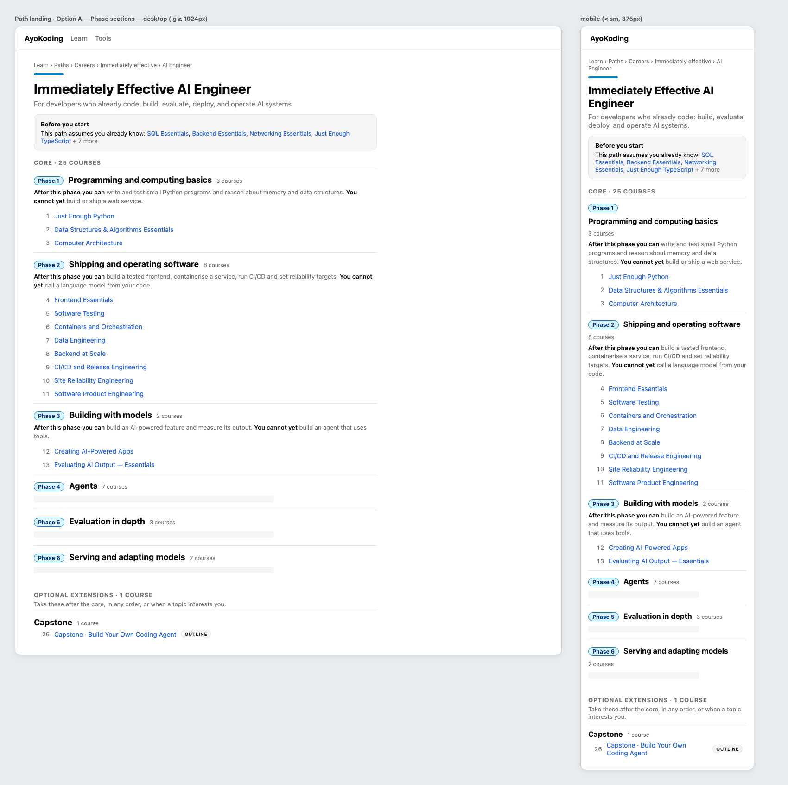
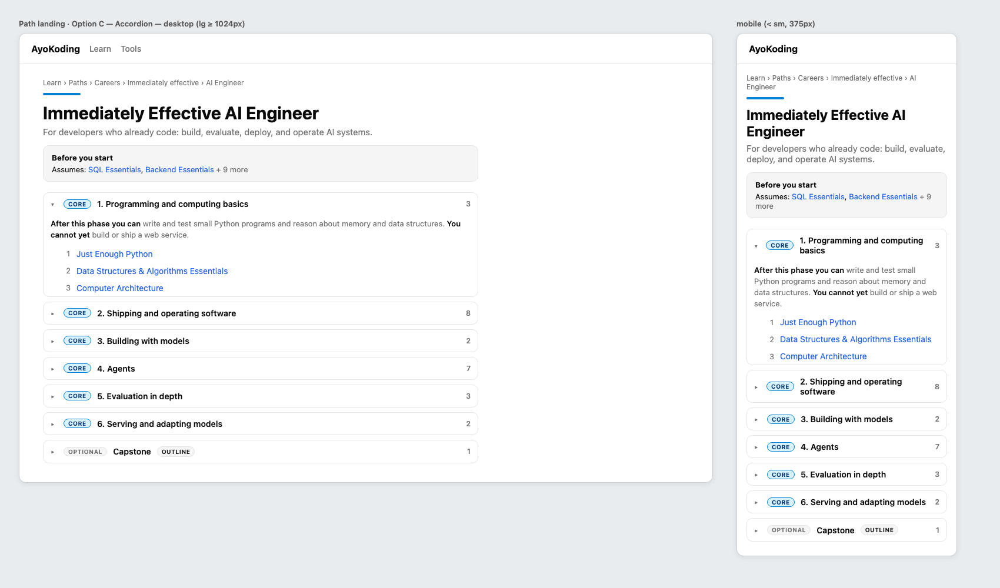
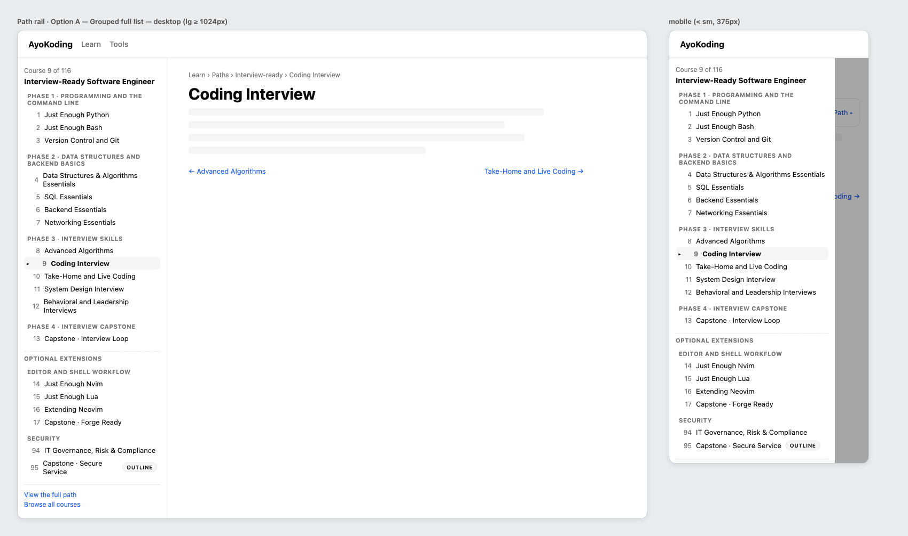
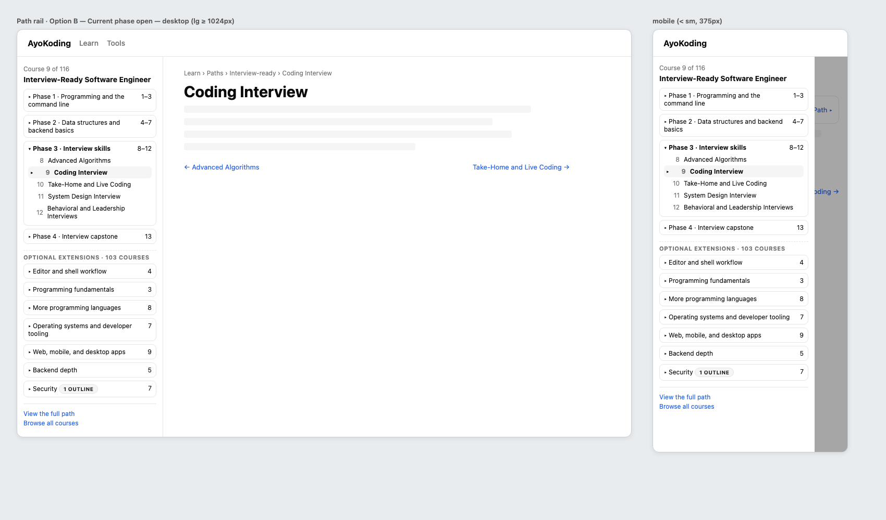
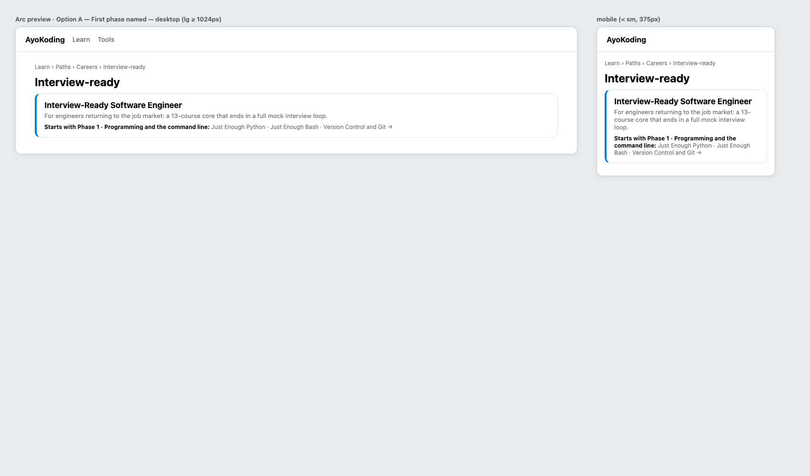
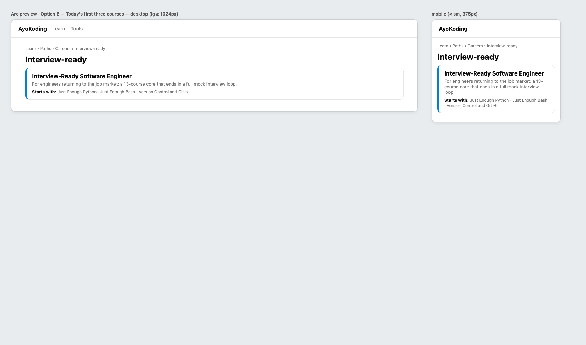

# Product Requirements — Path Model

## Personas

| Persona              | Situation                                                    | Needs from a path                                                                         |
| -------------------- | ------------------------------------------------------------ | ----------------------------------------------------------------------------------------- |
| Returning engineer   | Already codes and is preparing for interviews in a few weeks | A short core that ends at a mock interview loop; depth stays optional                     |
| New engineer         | Wants to start shipping a real app soon                      | Tools, a language, a backend, a frontend, and one full-stack capstone, in that order      |
| Foundations learner  | Wants a strong base before specialising                      | A visible route from first programs to a solid-core capstone                              |
| AI-curious developer | Already codes and wants to build AI systems                  | An honest statement of what is assumed, with links to the assumed courses                 |
| ERP engineer         | Builds accounting or ERP software                            | No change in this plan: the skills paths keep today's view until plans 06 and 07          |
| Maintainer           | Edits courses and manifests in later plans                   | Tests that fail when a path loses an essential prerequisite or lists an outline in a core |

## User Stories

1. As a reader on a path landing page, I see the courses grouped under titled phases, so I know
   where I am going and how far each step takes me.
2. As a reader, I read "After this phase you can … / You cannot yet …" under each core phase, so I
   can decide whether to skip a phase I already know.
3. As a reader, I see the optional extensions after the core under their own heading, so I know the
   core is enough to reach the path's goal.
4. As a reader, I see an **Outline** badge on any course that is still an outline, so I am not
   surprised by an empty course.
5. As a reader of the AI Engineer path, I see a "Before you start" note that links the courses the
   path assumes, so I can fill a gap first.
6. As a reader inside a course reached from a path, the sidebar shows the path's courses grouped by
   phase. Next/Prev still walks every course in path order, across phase boundaries.
7. As a maintainer, I get a failing unit test when a core course needs a prerequisite that is neither
   earlier in the path nor declared in `assumes`, or when a core course is an outline.
8. As plan 04's implementer, I can read each phase's `id`, `title`, `kind`, `outcome`, and ordered
   courses from the domain type without changing the schema.
9. As a reader of a skills path, I see the same course list, order, and copy as before this plan.
10. As the implementer of plan 06 or 07, I find a closed, explicit marker on each skills path that
    tells me what to remove when I restructure it, and a test that fails if I leave it behind.

## Functional Requirements

| ID    | Requirement                                                                                                                                                                                                                                                                                                                                                                                                             |
| ----- | ----------------------------------------------------------------------------------------------------------------------------------------------------------------------------------------------------------------------------------------------------------------------------------------------------------------------------------------------------------------------------------------------------------------------- |
| FR-1  | A path manifest file declares `phases` instead of `courseOrder`. Each phase has a unique `id`, a `title`, a `kind` (`core` or `extension`), an `outcome` (`can` required on core phases, `cannotYet` optional), and ordered `courses`.                                                                                                                                                                                  |
| FR-2  | A manifest may declare `goals` (one or more course IDs in core phases) and `assumes` (course IDs outside the path).                                                                                                                                                                                                                                                                                                     |
| FR-3  | The loader derives a flattened `courseOrder` (core phases first, then extension phases) for every existing consumer and for the tRPC `coursePaths.getRouteData` payload.                                                                                                                                                                                                                                                |
| FR-4  | The path landing groups its syllabus by phase, shows each core phase's outcome, puts extension phases under an "Optional extensions" heading, and keeps one continuous position number per course (plan 01's numbers).                                                                                                                                                                                                  |
| FR-5  | The path rail (desktop) and the navigation drawer (mobile) group the path's courses by phase with the same position numbers.                                                                                                                                                                                                                                                                                            |
| FR-6  | An **Outline** badge appears next to every course whose frontmatter has `status: outline` wherever a path lists it: the syllabus, the rail, and the drawer.                                                                                                                                                                                                                                                             |
| FR-7  | A path with `assumes` shows a "Before you start" note before the syllabus, linking each assumed course to its canonical course URL (no `?path=`).                                                                                                                                                                                                                                                                       |
| FR-8  | The single-role arc landing preview names the first phase and lists its courses, replacing the "first three courses" approximation.                                                                                                                                                                                                                                                                                     |
| FR-9  | The four skills manifests migrate mechanically: one phase `all-courses` holding today's course list in today's order, `assumes: []`, no `goals`, and `restructurePendingIn` set to `"plan-06"` (accounting) or `"plan-07"` (ERP). Their landing, rail, drawer, and cards render exactly as before: no phase heading, outcome, badge, or new label.                                                                      |
| FR-10 | `status` in course frontmatter accepts only `outline` (or is absent). The 62 skeleton courses carry `status: outline`.                                                                                                                                                                                                                                                                                                  |
| FR-11 | Frontmatter `prerequisites` for all 181 courses match [tech-docs/003](./tech-docs/003-prerequisite-rubric-and-evidence.md).                                                                                                                                                                                                                                                                                             |
| FR-12 | Unit tests enforce the integrity rules in [tech-docs/005](./tech-docs/005-integrity-validation-and-testing.md) against synthetic manifests and against the 8 real manifests.                                                                                                                                                                                                                                            |
| FR-13 | The 4 career manifests match [tech-docs/004](./tech-docs/004-path-composition.md); every course of each old manifest, career or skills, stays in that path.                                                                                                                                                                                                                                                             |
| FR-14 | The paths hub page and every page under `content/en/learn/paths/careers/` contain no internal jargon, the AI Engineer description reads "for developers who already code", and the Interview-Ready body no longer promises a "Phase 1" that the page does not show. Skills pages are untouched.                                                                                                                         |
| FR-15 | `restructurePendingIn` is accepted only for the four path IDs in a closed allowlist in code, each with its fixed value. A career manifest, or any other path ID, carrying it fails to parse. Every allowlist entry must be used by its real manifest. A marked manifest skips the core rules (closure, outline-in-core, goals, `assumes`, skills shape, core outcome) and keeps the ID, duplicate, and ordering checks. |

## Non-Functional Requirements

- **Accessibility.** Phase headings are real headings (`h2` on the landing; the rail uses a labelled
  group per phase). Each list has an accessible name. The Outline badge carries text, so it does not
  rely on color alone. Keyboard focus order follows reading order.
- **Locales.** The site has `en` and `id` routes. New UI strings ("Before you start", "Optional
  extensions", "After this phase you can", "You cannot yet", "Outline") go into
  `src/features/i18n/core/translations.ts` for both locales. Phase titles and outcomes are English
  course data, as all course content is (decision 35).
- **Compatibility.** Course URLs and the `?path=` query parameter do not change. The tRPC payload
  keeps `courseOrder`, so a browser tab opened before a deploy still navigates after it.
- **Performance.** The manifests stay static data. The route payload grows only by phase titles and
  outcomes (about 10 KB across all 8 manifests).
- **No silent drops.** A test parses every course `_index.md` against `frontmatterSchema`, because
  `repository-fs.ts` silently skips a file that fails the schema.

## Acceptance Criteria (Gherkin)

These scenarios are the canonical source for the feature files Phase 1 writes under
`specs/apps/ayokoding/www/behaviours/frontend/course-paths/`. Exemption comments use the existing
format of that folder. The E2E scenarios run against the fixture manifests in
`apps/ayokoding-www-fe-e2e/fixtures/manifests/`.

### New: `path-phases.feature`

```gherkin
Feature: Phase-grouped learning paths

  As a reader following a learning path
  I want the path's courses grouped into titled phases
  So that I can see the core route to the goal and the optional depth after it

  # Exemption(integration): the scenario is observable at the public browser or HTTP boundary and has no separate local resource boundary; alternative-proof: ayokoding-www-fe-e2e:test:e2e / A path landing groups its courses under titled phases
  @integration-exempt
  Scenario: A path landing groups its courses under titled phases
    Given a fixture path manifest declares a core phase and an extension phase
    When a reader opens that path's landing page under /en/learn/paths/
    Then each phase renders as a heading with its title
    And the core phase's courses appear before the extension phase's courses
    And course position numbers continue across the phase boundary

  # Exemption(integration): the scenario is observable at the public browser or HTTP boundary and has no separate local resource boundary; alternative-proof: ayokoding-www-fe-e2e:test:e2e / A core phase states what the reader can do after it
  @integration-exempt
  Scenario: A core phase states what the reader can do after it
    Given a fixture core phase declares an outcome
    When a reader opens that path's landing page
    Then the phase shows "After this phase you can" followed by the outcome
    And when the outcome declares what the reader cannot yet do, the phase also shows "You cannot yet"

  # Exemption(integration): the scenario is observable at the public browser or HTTP boundary and has no separate local resource boundary; alternative-proof: ayokoding-www-fe-e2e:test:e2e / Extension phases sit under an optional heading after the core
  @integration-exempt
  Scenario: Extension phases sit under an optional heading after the core
    Given a fixture path manifest declares an extension phase
    When a reader opens that path's landing page
    Then an "Optional extensions" heading appears after the last core phase
    And every extension phase is listed under that heading

  # Exemption(integration): the scenario is observable at the public browser or HTTP boundary and has no separate local resource boundary; alternative-proof: ayokoding-www-fe-e2e:test:e2e / The path rail groups the path's courses by phase
  @integration-exempt
  Scenario: The path rail groups the path's courses by phase
    Given a reader opens a course in path context on a desktop-width viewport
    When the page renders
    Then the left rail shows each phase title followed by that phase's courses
    And the current course is still marked by a marker and weight, not by colour alone

  # Exemption(integration): the scenario is observable at the public browser or HTTP boundary and has no separate local resource boundary; alternative-proof: ayokoding-www-fe-e2e:test:e2e / Next crosses from the last core course into the first extension course
  @integration-exempt
  Scenario: Next crosses from the last core course into the first extension course
    Given a reader is on the last course of a fixture path's last core phase
    When the reader reads the prev/next navigation
    Then next is the first course of the first extension phase
    And the link preserves the path context query parameter

  # Exemption(integration): the scenario is observable at the public browser or HTTP boundary and has no separate local resource boundary; alternative-proof: ayokoding-www-fe-e2e:test:e2e / The runtime path data exposes phases and the flattened order
  @integration-exempt
  Scenario: The runtime path data exposes phases and the flattened order
    Given the fixture manifest set is loaded by the running server
    When a client requests coursePaths.getRouteData for locale "en"
    Then each manifest in the response carries its phases with id, title, kind, outcome, and courses
    And each manifest also carries a courseOrder equal to its phases' courses in order

  # Exemption(integration): the scenario is an internal deterministic render with no local resource boundary; alternative-proof: ayokoding-www:test:unit / A skills path awaiting restructure renders as today's flat list
  @integration-exempt
  # Exemption(e2e): the marker is closed to the four real skills paths, which the E2E fixture manifest set does not load; alternative-proof: ayokoding-www:test:unit / A skills path awaiting restructure renders as today's flat list
  @e2e-exempt
  Scenario: A skills path awaiting restructure renders as today's flat list
    Given a skills manifest carries its restructure marker
    When its landing page and a course in that path render
    Then the syllabus and the path rail list its courses in order without phase headings
    And no outcome line, "Optional extensions" heading, "Before you start" note, or Outline badge appears
```

### New: `outline-course-status.feature`

```gherkin
Feature: Outline course status

  As a reader following a learning path
  I want unfinished courses marked as outlines
  So that I know before I open a course that it is not yet complete

  # Exemption(integration): the scenario is observable at the public browser or HTTP boundary and has no separate local resource boundary; alternative-proof: ayokoding-www-fe-e2e:test:e2e / An outline course carries an Outline badge wherever a path lists it
  @integration-exempt
  Scenario: An outline course carries an Outline badge wherever a path lists it
    Given a fixture path lists a course whose frontmatter declares status outline
    When a reader opens that path's landing page and then a course in that path
    Then the outline course shows a text badge reading "Outline" in the syllabus
    And the same course shows the "Outline" badge in the path rail
    And a course without status outline shows no badge

  # Exemption(integration): the scenario is an internal deterministic transform with no local resource boundary; alternative-proof: ayokoding-www:test:unit / Course status accepts only the outline value
  @integration-exempt
  # Exemption(e2e): the scenario is an internal deterministic transform with no public browser or HTTP boundary; alternative-proof: ayokoding-www:test:unit / Course status accepts only the outline value
  @e2e-exempt
  Scenario: Course status accepts only the outline value
    Given course frontmatter declares a status value
    When the frontmatter schema parses it
    Then the value "outline" is accepted
    And an absent status is accepted
    And any other value is rejected

  # Exemption(integration): the scenario is an internal deterministic transform with no local resource boundary; alternative-proof: ayokoding-www:test:unit / Every course frontmatter parses so no course page is silently dropped
  @integration-exempt
  # Exemption(e2e): the scenario is an internal deterministic transform with no public browser or HTTP boundary; alternative-proof: ayokoding-www:test:unit / Every course frontmatter parses so no course page is silently dropped
  @e2e-exempt
  Scenario: Every course frontmatter parses so no course page is silently dropped
    Given the published course library under content/en/learn/courses
    When every course _index.md is parsed with the frontmatter schema
    Then every course parses without error

  # Exemption(integration): the scenario is an internal deterministic transform with no local resource boundary; alternative-proof: ayokoding-www:test:unit / A course under one thousand words is marked as an outline
  @integration-exempt
  # Exemption(e2e): the scenario is an internal deterministic transform with no public browser or HTTP boundary; alternative-proof: ayokoding-www:test:unit / A course under one thousand words is marked as an outline
  @e2e-exempt
  Scenario: A course under one thousand words is marked as an outline
    Given the published course library under content/en/learn/courses
    When the words of every markdown file in each course directory are counted
    Then every course with fewer than 1000 words declares status outline
```

### New: `path-assumes.feature`

```gherkin
Feature: Assumed prior courses

  As a reader choosing a path that builds on earlier knowledge
  I want the path to name and link what it assumes
  So that I can fill a gap before I start

  # Exemption(integration): the scenario is observable at the public browser or HTTP boundary and has no separate local resource boundary; alternative-proof: ayokoding-www-fe-e2e:test:e2e / A path names its assumed courses before the syllabus
  @integration-exempt
  Scenario: A path names its assumed courses before the syllabus
    Given a fixture path manifest declares assumed courses
    When a reader opens that path's landing page
    Then a "Before you start" note appears before the first phase
    And it links every assumed course to its canonical course page without a path query parameter

  # Exemption(integration): the scenario is an internal deterministic transform with no local resource boundary; alternative-proof: ayokoding-www:test:unit / A path that assumes nothing shows no Before you start note
  @integration-exempt
  # Exemption(e2e): the scenario is an internal deterministic transform with no public browser or HTTP boundary; alternative-proof: ayokoding-www:test:unit / A path that assumes nothing shows no Before you start note
  @e2e-exempt
  Scenario: A path that assumes nothing shows no Before you start note
    Given a path manifest declares no assumed courses
    When its landing page renders
    Then no "Before you start" note is rendered
```

### New: `core-closure.feature`

Every scenario below is a pure rule over manifest data. Each carries both exemption comments in the
form `# Exemption(integration|e2e): the scenario is an internal deterministic transform with no …
boundary; alternative-proof: ayokoding-www:test:unit / <scenario title>` plus both tags, exactly as in
`manifest-integrity.feature`. They are shown without the comments here for readability; Phase 1 adds
them.

```gherkin
Feature: Core closure and path model integrity

  As a path-manifest maintainer
  I want every path's core to be self-sufficient and complete
  So that a reader who follows only the core never meets an unmet prerequisite or an empty course

  Scenario: A core course whose prerequisite is neither earlier nor assumed fails
    Given a manifest whose core course declares a prerequisite outside the path
    And the manifest does not list that prerequisite in assumes
    When the path model integrity check runs
    Then it reports a closure violation naming the course and the missing prerequisite

  Scenario: A prerequisite listed in assumes satisfies the closure rule
    Given a manifest whose core course declares a prerequisite outside the path
    And the manifest lists that prerequisite in assumes
    When the path model integrity check runs
    Then it reports no closure violation for that course

  Scenario: An outline course in a core phase fails
    Given a manifest whose core phase lists a course with status outline
    And the manifest carries no skills restructure marker
    When the path model integrity check runs
    Then it reports an outline-in-core violation naming the course

  Scenario: The core equals the goals plus their prerequisite closure
    Given a manifest that declares goals
    When the path model integrity check runs
    Then the set of core courses equals the goals plus every transitive prerequisite not in assumes
    And any missing or extra core course is reported by ID

  Scenario: An assumed course that no core course needs fails
    Given a manifest whose assumes lists a course that no core course declares as a prerequisite
    When the path model integrity check runs
    Then it reports an unused-assumes violation naming that course

  Scenario: Phases are well formed
    Given a manifest with a duplicate phase ID, an empty phase, or a core phase after an extension phase
    When the path model integrity check runs
    Then it reports each malformed phase

  Scenario: A skills path has no extension phase
    Given a skills manifest that declares an extension phase
    When the path model integrity check runs
    Then it reports a skills-extension violation

  Scenario: A career manifest cannot carry the skills restructure marker
    Given a career path manifest file that declares restructurePendingIn
    When the manifest schema parses it
    Then parsing fails

  Scenario: Only an allowlisted skills path may carry the marker, with its own plan
    Given a skills manifest file that declares restructurePendingIn
    And its path ID is not in the allowlist, or its value is not the allowlisted plan for that path
    When the manifest schema parses it
    Then parsing fails

  Scenario: A marked skills manifest is exempt only from the core rules
    Given an allowlisted skills manifest with its marker, outline courses, and outside prerequisites
    When the path model integrity check runs
    Then it reports no closure, outline-in-core, goals, assumes, skills-shape, or outcome violation
    But it still reports unresolved and duplicate course IDs

  Scenario: Every allowlist entry is still in use
    Given the skills restructure allowlist and the published manifests
    When they are compared
    Then each allowlisted path ID has a published manifest carrying exactly its allowlisted marker
    And no other published manifest carries a marker

  Scenario: The published manifests pass every integrity rule
    Given the 8 published path manifests and the published course frontmatter
    When the path model integrity check and the prerequisite ordering check run on each manifest
    Then every manifest reports zero violations

  Scenario: The rewritten manifests keep every course of their previous version
    Given the frozen course membership of each manifest before this change
    When the published manifests are loaded
    Then each published manifest contains exactly the same set of courses as before

  Scenario: The marked skills manifests keep today's course order
    Given the frozen course order of each skills manifest before this change
    When the published skills manifests are loaded
    Then each one's flattened course order equals its frozen order exactly
```

The marker scenarios disappear in plan 07, when the last skills path is restructured and the
allowlist is deleted.

### New: `path-copy.feature`

```gherkin
Feature: Plain path page copy

  As a reader comparing paths
  I want path pages written in plain language
  So that I never meet internal planning vocabulary

  # (both exemption comments and tags as in core-closure.feature; proof: ayokoding-www:test:unit)
  Scenario: Career path pages contain no internal planning vocabulary
    Given the paths hub page and every markdown page under content/en/learn/paths/careers
    When the page text is searched case-insensitively
    Then no page contains "Dangerous", "OI-2", "append", "manifest", or "from scratch" in any spelling

  Scenario: The AI Engineer path says who it is for
    Given the AI Engineer path manifest and its path page
    When their descriptions are read
    Then both descriptions say the path is for developers who already code
```

### Modified Existing Features

| File                                       | Change                                                                                                                             |
| ------------------------------------------ | ---------------------------------------------------------------------------------------------------------------------------------- |
| `manifest-integrity.feature`               | "lists a courseOrder of course IDs" becomes "lists phases of course IDs"; duplicate check spans all phases.                        |
| `prerequisite-consistent-ordering.feature` | Same wording change; the ordering rule runs over the flattened phase order.                                                        |
| `breadcrumb.feature`                       | "appear in the fixture manifest's courseOrder" becomes "appear in the fixture manifest's phase order".                             |
| `arc-landing-one-role.feature`             | "an inline first-phase syllabus preview" becomes "a preview that names the first phase and lists its courses".                     |
| `path-order-nav.feature`                   | The rail scenario reads "lists that path's courses grouped under phase headings in manifest order with the current course marked". |
| `README.md` (feature index)                | Add the five new feature files with one-line descriptions.                                                                         |

## UI Design Funnel

This plan is UI-bearing: it changes the career path landing syllabus, the path rail and drawer, and
the career arc landing preview. The skills category landing, its cards, and the four skills paths do
not change (decision 39). Plan 04 later replaces the syllabus with a phase roadmap. So this funnel
looks for the **smallest** change that makes the phase model visible.

### Grounding (R5)

- **Shared kit (`libs/web-ui`):** `Badge` (`variant="secondary"`, `size="sm"`) for the Outline
  badge; `Card` already used by `PathCard`. No new library component is needed.
- **Target app:** `shell/path-landing.tsx` (hue bar, `h1`, description, Markdown body, flat `<ol>`),
  `shell/path-rail.tsx` ("Course k of N" readout, flat `<ol>`, current row with `aria-current`, `▸`,
  and `bg-accent`), `shell/path-banner.tsx` (mobile readout that opens the drawer), and
  `shell/syllabus-preview.tsx` ("Starts with:" inline list, used only by the career arc landing).
  Tokens come from `globals.css` and `libs/web-ui-token`.
- **After plan 01:** titles have no `NN ·` prefix, and the syllabus, rail, and banner show path
  position numbers. Mockups assume that state.
- **Net-new app components:** `PhaseSection` (landing), `PhaseGroup` (rail and drawer),
  `OutlineBadge` (a thin wrapper around `Badge`), and `AssumedCourses` ("Before you start" note).
- **Unchanged here:** `shell/category-landing.tsx` and `shell/ramp-milestone-strip.tsx` (skills
  copy, handed to plans 06 and 07). A manifest with the skills restructure marker keeps today's flat
  `<ol>` in the landing, rail, and drawer.

### Prior Art (R7)

- Codecademy career paths are built from **Tracks** made of **Modules**. Each track opens with an
  introduction explaining how it supports the career goal, and "optional content is included in the
  Review sections of Tracks" rather than in the required sequence
  ([Codecademy curriculum standards](https://curriculum-documentation.codecademy.com/containers/career-path-standards/)).
  This supports titled phases with a stated purpose, and optional material kept apart from the core.
- Codecademy's syllabus redesign shows a path at the unit level first
  ([career path redesign](https://www.codecademy.com/resources/blog/career-path-redesign)). This
  supports showing phase headings above course lists.

### Screen S1 — Path landing syllabus

#### Stage 1: Diverge (low-fi)

**Option A — Phase sections (stacked headings).** Mobile (< sm, 375px):

```text
+-----------------------------------+
| Learn > Paths > Careers > AI Eng. |
| ====                              |
| Immediately Effective AI Engineer |
| For developers who already code.. |
| +-------------------------------+ |
| | Before you start              | |
| | Assumes: SQL Essentials,      | |
| | Backend Essentials, ... (11)  | |
| +-------------------------------+ |
| CORE . 25 COURSES                 |
| [Phase 1] Programming and         |
|           computing basics        |
| After this phase you can ...      |
| You cannot yet ...                |
|   1  Just Enough Python           |
|   2  Data Structures & Algo...    |
|   3  Computer Architecture        |
| [Phase 2] Shipping and operating  |
|   4  Frontend Essentials  ...     |
| ...                               |
| OPTIONAL EXTENSIONS . 1 COURSE    |
| Take these after the core ...     |
| Capstone                          |
|  26  Capstone . Build Your Own    |
|      Coding Agent      [OUTLINE]  |
+-----------------------------------+
```

Desktop (lg >= 1024px): the same single column, capped at the current prose width, with the phase
number badge, title, and course count on one line.

```text
+----------------------------------------------------------------+
| Immediately Effective AI Engineer                              |
| For developers who already code: build, evaluate, deploy, ...  |
| [Before you start: SQL Essentials, Backend Essentials, ...]    |
| CORE . 25 COURSES                                              |
| [Phase 1] Programming and computing basics      3 courses      |
| After this phase you can ... You cannot yet ...                |
|   1 Just Enough Python                                         |
|   2 Data Structures & Algorithms Essentials                    |
|   3 Computer Architecture                                      |
| [Phase 2] Shipping and operating software       8 courses      |
| ...                                                            |
| OPTIONAL EXTENSIONS . 1 COURSE                                 |
| Capstone                                        1 course       |
|  26 Capstone . Build Your Own Coding Agent  [OUTLINE]          |
+----------------------------------------------------------------+
```

**Option B — Core / Extensions tabs.** Two tabs above the syllabus: "Core (25)" and "Optional
(1)". Each tab lists its phases. On mobile the tabs become a segmented control.

```text
+----------------------------------------------------------------+
| [ Core (25) ] [ Optional (1) ]                                 |
| Phase 1 Programming and computing basics                       |
|   1 Just Enough Python ...                                     |
+----------------------------------------------------------------+
```

**Option C — Accordion.** Every phase is a collapsible row with a Core or Optional tag; only the
first phase is open. Mobile and desktop are identical apart from width.

```text
+----------------------------------------------------------------+
| v [CORE] 1. Programming and computing basics               3   |
|     After this phase you can ...                               |
|     1 Just Enough Python  2 ...  3 ...                         |
| > [CORE] 2. Shipping and operating software                8   |
| > [CORE] 3. Building with models                           2   |
| > [OPTIONAL] Capstone [OUTLINE]                            1   |
+----------------------------------------------------------------+
```

#### Stage 2: Narrow (hi-fi finalists)

Option B is dropped: tabs hide the extension list behind a click, adding interaction state that plan
04's roadmap would replace anyway.





The hi-fi images are plain PNGs rendered from HTML that uses the app's light-theme tokens. No
Excalidraw scene is embedded. The "+ 7 more" in the assumes note is a mockup shortcut: the build
lists every assumed course.

#### Stage 3: Select

**Selected: Option A — Phase sections.**

#### Stage 4: Justify

| Option             | Outcome  | Reason                                                                                                                                                                                                     |
| ------------------ | -------- | ---------------------------------------------------------------------------------------------------------------------------------------------------------------------------------------------------------- |
| A — Phase sections | Selected | Smallest change to today's `<ol>`: headings and one outcome line. All courses stay visible and linkable, so the existing E2E link-order checks still work. No new interaction state for plan 04 to unwind. |
| B — Tabs           | Dropped  | Hides extensions, adds tab state and keyboard handling, and its "is the core enough?" message conflicts with plan 04's single roadmap.                                                                     |
| C — Accordion      | Finalist | Compact for the 103-course extension lists, but it hides most phase outcomes by default and adds open/closed state. Plan 04's roadmap may revisit collapsing.                                              |

### Screen S2 — Path rail (desktop) and drawer (mobile)

#### Stage 1: Diverge (low-fi)

**Option A — Grouped full list.** Desktop rail and mobile drawer share the markup:

```text
+--------------------------------+
| Course 9 of 116                |
| Interview-Ready Software Eng.  |
| PHASE 1 . PROGRAMMING AND THE  |
| COMMAND LINE                   |
|   1 Just Enough Python         |
|   2 Just Enough Bash           |
|   3 Version Control and Git    |
| PHASE 3 . INTERVIEW SKILLS     |
|   8 Advanced Algorithms        |
| > 9 Coding Interview  (current)|
| - - OPTIONAL EXTENSIONS - - -  |
| SECURITY                       |
|  95 Capstone . Secure Service  |
|                     [OUTLINE]  |
| View the full path             |
| Browse all courses             |
+--------------------------------+
```

**Option B — Current phase open.** Each phase is a collapsible row with its position range; only the
phase holding the current course is open.

```text
+--------------------------------+
| > Phase 1 . Programming ...  1-3 |
| v Phase 3 . Interview skills 8-12|
|     8 Advanced Algorithms      |
|   > 9 Coding Interview         |
| > Phase 4 . Interview capst.  13 |
| - OPTIONAL EXTENSIONS . 103 -  |
| > Security [1 OUTLINE]       7 |
+--------------------------------+
```

#### Stage 2: Narrow (hi-fi finalists)





#### Stage 3: Select

**Selected: Option A — Grouped full list.**

#### Stage 4: Justify

| Option                 | Outcome  | Reason                                                                                                                                                                                      |
| ---------------------- | -------- | ------------------------------------------------------------------------------------------------------------------------------------------------------------------------------------------- |
| A — Grouped full list  | Selected | Adds only group labels to today's list, and keeps every course one click away. Plan 01's auto-scroll to the active course already solves the long-list problem. Least overlap with plan 04. |
| B — Current phase open | Finalist | Shorter, but adds per-phase open/closed state, changes the drawer's focus behaviour that `path-order-nav.feature` locks, and pre-empts plan 04's navigation design.                         |

### Screen S3 — Career arc landing preview

#### Stage 1: Diverge (low-fi)

**Option A — Name the first phase.**

```text
+--------------------------------------------------------------+
| Interview-Ready Software Engineer                            |
| Starts with Phase 1 . Programming and the command line:      |
| Just Enough Python . Just Enough Bash . Version Control ->   |
+--------------------------------------------------------------+
```

**Option B — Keep today's "first three courses" preview.**

```text
+--------------------------------------------------------------+
| Interview-Ready Software Engineer                            |
| Starts with: Just Enough Python . Just Enough Bash . ...  -> |
+--------------------------------------------------------------+
```

**Option C — Phase chips.** The card lists every core phase title as a chip ("Programming and the
command line", "Data structures and backend basics", "+2 more"). Dropped at once: it is a new card
element, and plan 04 owns the path-card redesign.

#### Stage 2: Narrow (hi-fi finalists)





#### Stage 3: Select

**Selected: Option A — Name the first phase.**

#### Stage 4: Justify

| Option | Outcome  | Reason                                                                                                                                      |
| ------ | -------- | ------------------------------------------------------------------------------------------------------------------------------------------- |
| A      | Selected | Replaces the documented "first three courses" approximation with real data, and uses one line. Adds no new card layout, which plan 04 owns. |
| B      | Finalist | No change at all, but after this plan the first three courses can cut across a phase boundary, so the preview would misdescribe the path.   |
| C      | Dropped  | A new card element that plan 04's path-card redesign would replace within one plan.                                                         |

### Responsive Strategy

Mobile first, using the app's existing breakpoints:

| Component           | Mobile (< sm, 375px)                                         | Tablet (md >= 768px)            | Desktop (lg >= 1024px)                       |
| ------------------- | ------------------------------------------------------------ | ------------------------------- | -------------------------------------------- |
| `PhaseSection`      | Phase badge on its own line above the title; outcome wraps   | Badge, title, count on one line | Same as tablet inside the prose-width column |
| `AssumedCourses`    | Full-width box; links wrap                                   | Same                            | Same, capped at prose width                  |
| `PhaseGroup` (rail) | Inside the existing navigation drawer opened from the banner | Drawer, as today                | Persistent left rail, as today               |
| `OutlineBadge`      | Stays on the course row; wraps under a long title            | Inline after the title          | Inline after the title                       |

No component is hidden at any breakpoint. The banner keeps its "Course k of N" text; showing the
phase name in it is left to plan 04's context bar.

## Copy Changes

The new copy for the paths hub, the career arc pages, the four career path pages, and the career
manifest descriptions is in [tech-docs/006](./tech-docs/006-ui-and-copy-changes.md). The user reviews
it in the PR (decision 12). Skills pages and skills manifest descriptions do not change in this plan.
