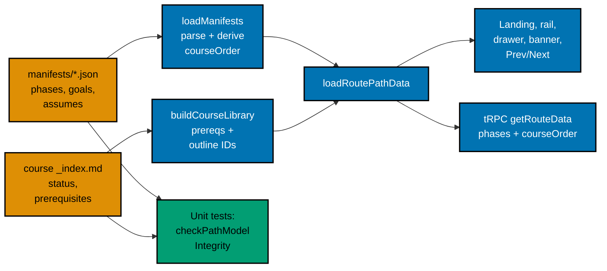

# 001 — Architecture and Data Flow

All paths below are relative to `apps/ayokoding-www/` unless they start with the repository root.

## Where Things Live Today

| Piece                 | Location                                                                                                                                                                                                               | Role                                                                                                  |
| --------------------- | ---------------------------------------------------------------------------------------------------------------------------------------------------------------------------------------------------------------------- | ----------------------------------------------------------------------------------------------------- |
| Path manifests        | `src/features/course-paths/manifests/**/*.json` (8 files)                                                                                                                                                              | `{pathId, arc, title, description, courseOrder}`; `courseOrder` entries are IDs or `{id, framing?}`   |
| Manifest schema       | `src/features/course-paths/core/schemas.ts`                                                                                                                                                                            | `PathManifestSchema` (zod), `CourseRef`, `pathIdSchema`                                               |
| Integrity check       | `src/features/course-paths/core/manifest-integrity.ts`                                                                                                                                                                 | `checkManifestIntegrity(manifest, libraryCourseIds)` → `{unresolvedIds, duplicateIds}`                |
| Ordering check        | `src/features/course-paths/core/prerequisites.ts`                                                                                                                                                                      | `checkPrerequisiteConsistency(manifest, byCourse, libraryIds)` → ordering violations only             |
| Prev/Next             | `src/features/course-paths/core/path-nav.ts`                                                                                                                                                                           | `resolvePathNav(manifest, courseId)` over `courseOrder`                                               |
| Loader                | `src/features/course-paths/shell/manifest-repository.ts`                                                                                                                                                               | `loadManifests(dir, ids)`: recursive `.json` glob, `PathManifestSchema.parse`, skip on unresolved IDs |
| Route data            | `src/features/course-paths/shell/route-path-data.ts`                                                                                                                                                                   | `loadRoutePathData(locale)` (React `cache`): content index + course library + manifests               |
| Course library        | `src/features/course-paths/shell/course-library.ts`                                                                                                                                                                    | `buildCourseLibrary(contentMap, locale)` → library IDs and `prerequisitesByCourse`                    |
| Client data and tRPC  | `shell/course-path-nav.ts`, `shell/router.ts`                                                                                                                                                                          | `toCoursePathClientData`; `coursePaths.getRouteData(locale)` refreshes data after hydration           |
| Course frontmatter    | `content/en/learn/courses/<id>/_index.md`                                                                                                                                                                              | `title`, `date`, `draft`, `weight`, `prerequisites`                                                   |
| Frontmatter schema    | `src/features/content/core/schemas.ts`, `core/types.ts`, `shell/repository-fs.ts`                                                                                                                                      | `frontmatterSchema`; `ContentMeta`; a file failing the schema is silently skipped                     |
| UI                    | `shell/path-landing.tsx`, `path-rail.tsx`, `path-banner.tsx`, `syllabus-preview.tsx`, `arc-landing.tsx`, `category-landing.tsx`, `ramp-milestone-strip.tsx`, `course-page-path-content.tsx`, `course-page-content.tsx` | Render the path from `courseOrder`                                                                    |
| E2E fixture manifests | `apps/ayokoding-www-fe-e2e/fixtures/manifests/**` (6 files)                                                                                                                                                            | Loaded through `AYOKODING_WEB_MANIFESTS_DIR` by `playwright.config.ts` and the e2e Docker image       |

## Data Flow After This Plan

## Key Design Points

1. **One derived order.** The loader derives `courseOrder = phases.flatMap(p => p.courses)` after
   parsing. Core phases come first by rule, so the derived order is "core, then extensions". Every
   consumer that walks the path — `resolvePathNav`, `coursePositionInManifest`, the banner, the e2e
   step `loadPublishedManifests` — keeps reading `courseOrder` unchanged.
2. **Consumers that group read `phases`.** Only the landing syllabus, the rail/drawer, and the arc
   preview read `phases` directly.
3. **Outline status travels through the course library.** `buildCourseLibrary` gains
   `outlineCourseIds`, derived from `ContentMeta.status`. Like `deriveAllCourseIds`, the outline set
   is **locale-independent**: course content exists only in `en`, and the tRPC payload for `id` must
   carry the same set. `CoursePathClientData` gains `outlineCourseIds: readonly string[]` so the
   client rail can render badges after the tRPC refresh.
4. **The runtime stays tolerant; tests are strict.** `loadManifests` still skips only a manifest that
   fails its schema or has unresolved IDs (with `console.warn`). Closure, outline, and goal rules run in
   unit tests over the real files, so a mistake fails CI instead of blanking a page in production.
   [007 D4](./007-decision-records.md#d4--strict-rules-run-in-unit-tests-not-in-the-runtime-loader)
   records why.
5. **No new runtime dependency.** Everything uses zod, gray-matter, and React, which are already in
   the app.
6. **Skills paths keep the old view behind one closed check.** A manifest that carries
   `restructurePendingIn` (only the four skills paths, by allowlist) still has phases in the domain
   object, but `isPendingSkillsRestructure(manifest)` sends it to today's flat list in the landing,
   rail, and drawer. Plans 06 and 07 remove the marker; plan 07 removes the check
   ([002](./002-manifest-schema-and-migration.md#skills-paths-pending-restructure)).

## What Does Not Change

- Course URLs, the `?path=` query parameter, `parsePathContext`, and the breadcrumb.
- `checkPrerequisiteConsistency`'s "link, don't walk" rule: a prerequisite outside the path is listed
  as a link on the course page, never added to the walk.
- Path hues (`core/path-hue.ts`), path IDs, arcs, and file locations of the 8 manifests.
- What readers see on the four skills paths, the skills category landing, and its milestone strip.
