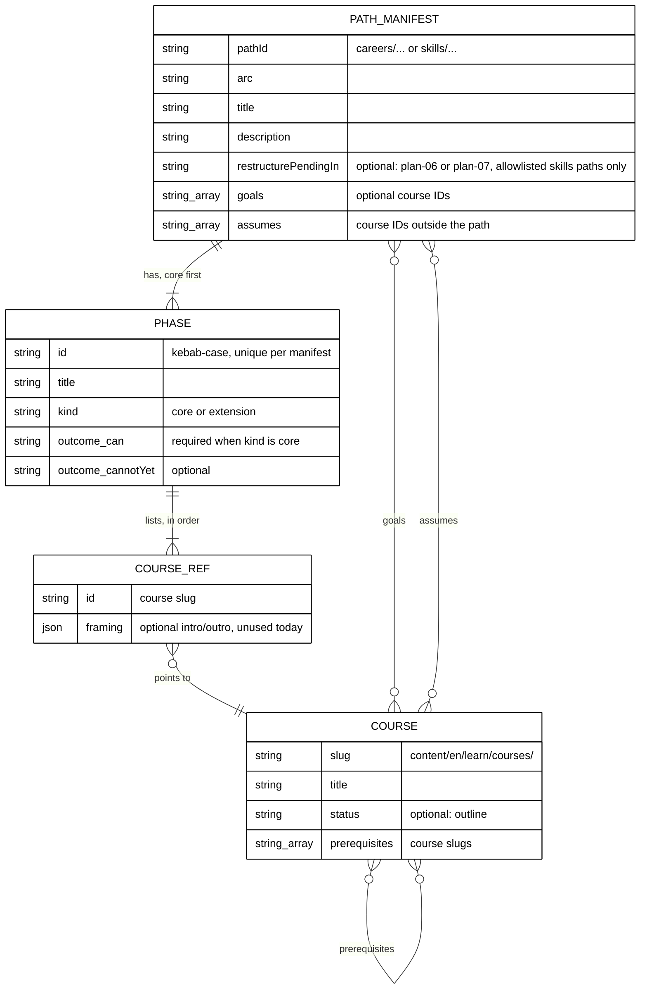

# 002 — Manifest Schema and Migration

This document follows the repository's schema-and-migration contract: data model, field guide,
compatibility, expand → migrate → verify → contract, rollback, and reconciliation.

## Data Model



## Target Schema (`core/schemas.ts`)

```ts
const phaseIdSchema = z.string().regex(/^[a-z0-9]+(?:-[a-z0-9]+)*$/);

export const phaseOutcomeSchema = z
  .object({ can: z.string().min(1), cannotYet: z.string().min(1).optional() })
  .strict();

export const pathPhaseSchema = z
  .object({
    id: phaseIdSchema,
    title: z.string().min(1),
    kind: z.enum(["core", "extension"]),
    outcome: phaseOutcomeSchema.optional(),
    courses: z.array(courseRefSchema).min(1),
  })
  .strict();

/** On-disk shape of a manifest file (after the contract step). */
export const PathManifestFileSchema = z
  .object({
    pathId: pathIdSchema,
    arc: z.string(),
    title: z.string(),
    description: z.string(),
    // Decision 39. Removed by plan 07 together with the allowlist module.
    restructurePendingIn: z.enum(["plan-06", "plan-07"]).optional(),
    goals: z.array(z.string()).min(1).optional(),
    assumes: z.array(z.string()).default([]),
    phases: z.array(pathPhaseSchema).min(1),
  })
  .strict()
  .superRefine((file, ctx) => {
    const marker = file.restructurePendingIn;
    if (marker !== undefined) {
      // Closed allowlist: exact path ID and exact plan, or the file fails to parse.
      if (SKILLS_RESTRUCTURE_ALLOWLIST.get(file.pathId) !== marker) {
        ctx.addIssue({ code: "custom", path: ["restructurePendingIn"], message: "marker not allowed" });
      }
      if (!isMarkedShape(file)) {
        ctx.addIssue({ code: "custom", path: ["phases"], message: "marked manifest must be one all-courses phase" });
      }
      return; // a marked manifest's single core phase has no outcome
    }
    file.phases.forEach((phase, index) => {
      if (phase.kind === "core" && phase.outcome === undefined) {
        ctx.addIssue({
          code: "custom",
          path: ["phases", index, "outcome"],
          message: "a core phase must declare an outcome",
        });
      }
    });
  });

/** Domain shape: the file shape plus the derived, flattened order. */
export const PathManifestSchema = PathManifestFileSchema.transform((file) => ({
  ...file,
  courseOrder: file.phases.flatMap((phase) => phase.courses),
}));

export type PathPhase = z.infer<typeof pathPhaseSchema>;
export type PathManifest = z.output<typeof PathManifestSchema>;
```

`.strict()` makes a leftover `courseOrder` key in a file a schema error after the contract step.
`SKILLS_RESTRUCTURE_ALLOWLIST` and `isMarkedShape` come from `core/skills-restructure-allowlist.ts`
(see [Skills Paths Pending Restructure](#skills-paths-pending-restructure)). The outcome rule moved
from the phase schema to the manifest `superRefine` because only the manifest knows whether it is
marked.

## Field Guide

| Field                                   | Required          | Meaning and rules                                                                                                                   |
| --------------------------------------- | ----------------- | ----------------------------------------------------------------------------------------------------------------------------------- |
| `pathId`, `arc`, `title`, `description` | yes               | Unchanged meaning. `description` is the one-line "who is it for" text shown on cards.                                               |
| `restructurePendingIn`                  | no                | `"plan-06"` or `"plan-07"`. Allowed only on the four allowlisted skills paths, with their own plan. Never shown to readers.         |
| `goals`                                 | careers SE paths  | The course or courses the core leads to. Each goal must sit in a core phase. When present, the core must equal the goal closure.    |
| `assumes`                               | no (default `[]`) | Courses a core course needs that are outside the path. Exactly the set of outside prerequisites of core courses — no more, no less. |
| `phases[]`                              | yes, at least 1   | Ordered. All `core` phases come before any `extension` phase. Unmarked skills paths have only `core` phases.                        |
| `phases[].id`                           | yes               | Kebab-case, unique within the manifest. Stable: plan 04 may key progress or anchors on it.                                          |
| `phases[].title`                        | yes               | Shown as the phase heading. Plain words, no numbering (the UI adds "Phase n" for core phases).                                      |
| `phases[].kind`                         | yes               | `core` or `extension`.                                                                                                              |
| `phases[].outcome.can`                  | unmarked core     | Completes the sentence "After this phase you can …". No trailing period.                                                            |
| `phases[].outcome.cannotYet`            | no                | Completes "You cannot yet …". Use it when it helps a reader decide whether to skip ahead.                                           |
| `phases[].courses[]`                    | yes, at least 1   | Course IDs or `{id, framing?}` objects, as before. A course appears once per manifest across all phases.                            |
| `courseOrder` (domain only)             | derived           | `phases.flatMap(p => p.courses)`. Never written to a file. Kept for every walking consumer and the tRPC payload.                    |

Course frontmatter (`src/features/content/core/schemas.ts`):

| Field           | Change                                                                                                                     |
| --------------- | -------------------------------------------------------------------------------------------------------------------------- |
| `status`        | New: `z.enum(["outline"]).optional()`. Mirrored as `status?: "outline"` in `ContentMeta` and mapped in `repository-fs.ts`. |
| `prerequisites` | Unchanged type; values revised per [003](./003-prerequisite-rubric-and-evidence.md).                                       |

## What Plan 04 Consumes

Plan 04 (`learning-experience`) builds the phase roadmap, progress, and context bar on this model.
It needs, and this plan guarantees through unit-tested exports:

- `PathManifest.phases[]` with `id`, `title`, `kind`, `outcome.can`, `outcome.cannotYet`, and ordered
  `courses`;
- `PathManifest.goals` and `PathManifest.assumes`;
- `PathManifest.restructurePendingIn` and `isPendingSkillsRestructure(manifest)`, so plan 04 can keep
  a marked skills path on today's flat view (if plan 04 lands before plans 06 and 07);
- the derived `PathManifest.courseOrder`;
- helper functions in `core/path-phases.ts`: `corePhases(manifest)`, `extensionPhases(manifest)`, and
  `phaseOfCourse(manifest, courseId)` (returns the phase and the 1-based position within the path);
- `CoursePathClientData.outlineCourseIds` and `ContentMeta.status`.

Plan 04 must not need a schema change to show a phase roadmap. If it does, that is a defect in this
plan's model, routed back through plan 04's own plan.

## Skills Paths Pending Restructure

Decision 39 (the user's answer to `UD-02-01`, 2026-10-09) keeps the four skills paths as they are
until plans 06 and 07 fill their courses. Under the strict schema they still need the new file shape,
so this plan gives them a **mechanical** shape and a **closed** marker.

**Mechanical shape.** A marked manifest is exactly:

```json
{
  "pathId": "skills/conventional-accounting",
  "arc": "skills",
  "title": "<today's title>",
  "description": "<today's description>",
  "restructurePendingIn": "plan-06",
  "assumes": [],
  "phases": [
    {
      "id": "all-courses",
      "title": "<today's title>",
      "kind": "core",
      "courses": ["<today's courseOrder, in order>"]
    }
  ]
}
```

No `goals`, no `outcome`, `assumes` empty, one phase. `isMarkedShape(file)` checks exactly this.

**Closed allowlist.** `src/features/course-paths/core/skills-restructure-allowlist.ts`:

```ts
/** Decision 39. Plan 06 removes the accounting entries; plan 07 deletes this module. */
export const SKILLS_RESTRUCTURE_ALLOWLIST: ReadonlyMap<string, "plan-06" | "plan-07"> = new Map([
  ["skills/conventional-accounting", "plan-06"],
  ["skills/sharia-accounting", "plan-06"],
  ["skills/conventional-erp", "plan-07"],
  ["skills/sharia-erp", "plan-07"],
]);

export function isMarkedShape(file: PathManifestFile): boolean;
export function isPendingSkillsRestructure(manifest: PathManifest): boolean; // marker present
```

**What the marker changes.**

| Rule or view                                                                   | Marked manifest                     |
| ------------------------------------------------------------------------------ | ----------------------------------- |
| Unresolved IDs, duplicate IDs, phase shape, prerequisite ordering              | Applies, as for every manifest      |
| Core outcome, closure, no outline in core, goals, exact `assumes`, skills rule | Skipped until the marker is gone    |
| Landing syllabus, rail, drawer                                                 | Today's flat list, no phase heading |
| Outline badge, "Before you start" note, extension heading                      | Not rendered                        |
| Any reader-visible label for the marker                                        | None                                |

**Why careers can never use it.** Three tests guard the boundary:

1. Every allowlist key starts with `skills/`, and the map has exactly the four entries above.
2. A career manifest (and an unlisted skills manifest) that carries the marker fails `PathManifestFileSchema`.
3. A skills manifest with the other plan's value (for example accounting with `"plan-07"`) fails too.

The marker-usage integrity rule (R9 in [005](./005-integrity-validation-and-testing.md)) also proves
every allowlist entry is used by its real manifest, so an entry cannot outlive its path's restructure.

**Removal.** Plan 06 restructures both accounting paths, removes their marker, and deletes their two
allowlist entries in the same PR as the filled accounting courses. Plan 07 does the same for ERP and
then deletes the module, the `restructurePendingIn` field, the marker scenarios, and the flat-render
branch. The drafted target phases for these paths are input for those plans, in
[syllabus/paths/](../syllabus/paths/README.md#skills-paths-input-for-plans-06-and-07).

## Compatibility

| Surface                                 | Before                    | After                                                 | Compatible?                                          |
| --------------------------------------- | ------------------------- | ----------------------------------------------------- | ---------------------------------------------------- |
| Manifest files                          | `courseOrder`             | `phases` (+ `goals`, `assumes`)                       | No (intentional); all 14 files migrate in this PR    |
| Domain `PathManifest`                   | `courseOrder`             | `phases` + derived `courseOrder`                      | Yes for readers of `courseOrder`                     |
| tRPC `coursePaths.getRouteData` payload | `manifests[].courseOrder` | adds `phases`, `goals`, `assumes`, `outlineCourseIds` | Yes (additive); an old tab still walks `courseOrder` |
| E2E step `loadPublishedManifests`       | reads `courseOrder`       | unchanged                                             | Yes                                                  |
| Course URLs and `?path=`                | —                         | unchanged                                             | Yes                                                  |
| Frontmatter                             | no `status`               | optional `status: outline`                            | Yes (optional key)                                   |

## Migration: Expand → Migrate → Verify → Contract

All four steps land in the **same PR**, as separate commits, so `main` never holds a mixed state.

1. **Expand.** `PathManifestSchema` accepts either shape. A legacy file
   (`{..., courseOrder}`) normalizes to one phase `{id: "all-courses", title: <manifest title>, kind:
"core", courses: courseOrder}` with no outcome. The outcome refine applies only to the new shape.
   `frontmatterSchema` accepts `status`. Every existing test stays green.
2. **Migrate.** Rewrite the 4 career manifests to the phases in [004](./004-path-composition.md).
   Reshape the 4 skills manifests mechanically: one `all-courses` phase with today's `courseOrder`,
   plus their `restructurePendingIn` marker, with title, description, and order unchanged. Migrate
   the 6 E2E fixture manifests. Add `status: outline` to the 62 courses and apply the revised
   `prerequisites` to the 43 changed courses.
3. **Verify.** Run the integrity tests over the real manifests, the membership reconciliation test,
   the full-library frontmatter parse, `test:quick`, `build`, `test:integration`, and the E2E suite.
4. **Contract.** Remove the legacy branch from `PathManifestSchema` and add `.strict()`. A test proves
   a file with `courseOrder` is rejected. Remove the legacy normalization code. The four marked
   skills files keep their literal `all-courses` phase on disk; that is data, not the removed code.

## Rollback

There is no persisted state: manifests and frontmatter are files in git, and the site stores nothing
for this feature in the browser (browser progress arrives later with plan 04).

- **Before merge:** drop or revert the offending commit in the PR branch.
- **After merge:** `git revert` the merge commit in a new PR. Reverting restores the old manifests,
  frontmatter, and schema together. No data migration runs. A browser tab opened on the new version
  keeps working against the old payload because `courseOrder` exists in both versions.
- **Partial rollback is not supported.** Reverting only the frontmatter would make the integrity tests
  fail; revert the whole PR.

## Reconciliation

- **Membership.** Before rewriting, Phase 2 freezes each manifest's course set into
  `tests/unit/features/course-paths/manifests/legacy-membership.ts` (sorted IDs per path ID, copied
  from [syllabus/paths/](../syllabus/paths/README.md)). A test proves each rewritten manifest has
  exactly that set. Counts: IR 116, IE SE 114, IE AI 26, FS 121, skills 19 / 24 / 27 / 30.
- **Skills order.** The same phase also freezes the four skills paths' **ordered** lists into
  `tests/unit/features/course-paths/manifests/legacy-skills-order.ts`. A test proves each marked
  manifest's derived `courseOrder` equals its frozen list exactly, so readers see the same order.
- **Prerequisites.** The evidence table in [003](./003-prerequisite-rubric-and-evidence.md) is
  documentation, not a frozen test oracle, so later plans can still revise prerequisites. Phase 3
  reconciles it by review: exactly 43 course `_index.md` files change their `prerequisites`, and each
  diff matches its table row. The result is recorded in `evidence/phase-3-prerequisites.md`. The
  durable guards are the closure, goal-closure, and ordering tests, which fail if a revised list
  breaks any path.
- **Outline set.** The under-1,000-words guard proves no skeleton course lacks the marker. Phase 3
  evidence records that exactly 62 courses carry `status: outline`.

## Coordination With Plan 03

Plan 03 (`catalog-and-metadata`) also edits `frontmatterSchema`; it adds `category`, `description`,
`estimatedHours`, and may widen `status`. Plan 03 depends on this plan (its decision D1), so this plan
merges first.

- This plan introduces the `status` enum with `"outline"` only. Plan 03 widens the enum and updates the
  one test that says "status accepts only outline".
- Plan 03's Phase 0 verifies this plan's schema, `OutlineBadge` and `pathsOutlineBadge` are on
  `origin/main` before it starts.
- The under-1,000-words guard and the outline-in-core rule are owned by this plan and do not change.
