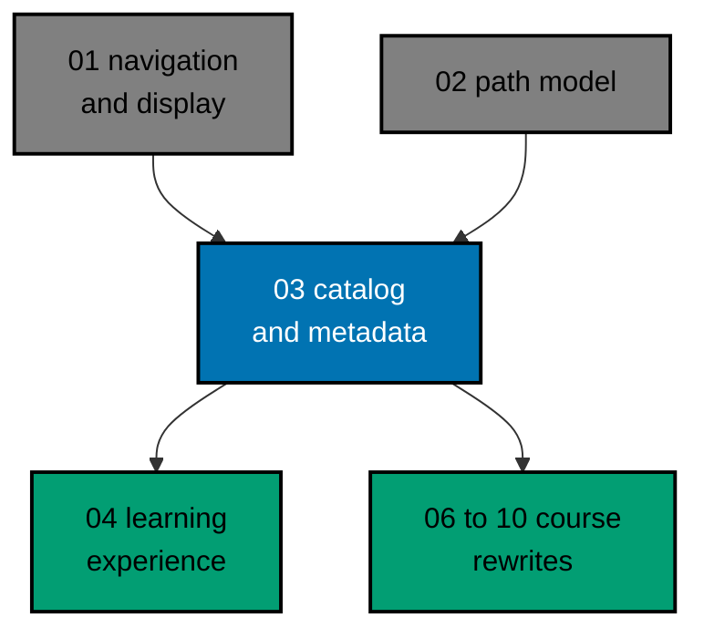

# AyoKoding Learn Revamp 03 — Catalog and Metadata

> **Status:** Backlog. Do not execute until all three are true:
>
> 1. the user gives an explicit execution command (user, 2026-10-09: "jangan kerjain/implement plan
>    ini sebelum gw kasih perintah buat eksekusi ya", meaning "do not work on or implement this plan
>    until I give the command to execute it");
> 2. plan `ayokoding-learn-revamp-01-navigation-and-display` has merged to `origin/main`;
> 3. plan `ayokoding-learn-revamp-02-path-model` has merged to `origin/main`, because this plan
>    reuses the `status: outline` field that plan 02 adds (see
>    [tech-docs/007 D1](./tech-docs/007-decision-records.md#d1--order-against-plan-02)).

Today the page `/en/learn/courses` is a long generated list of links. Its source,
`apps/ayokoding-www/content/en/learn/courses/_index.md`, has 701 lines and 693 links: 181 course
links plus 512 sub-links to each course's Overview, Learning, and Drilling pages (measured
2026-10-09). A new reader cannot tell what a course is about, how long it takes, what kind of course
it is, or which learning paths use it. The global sidebar has the same problem: the "Courses" section
opens into 181 course names in one flat list.

This plan turns the course library into a catalog a junior reader can browse:

- every course gets a small, validated set of **metadata** in its `_index.md` frontmatter;
- the courses page becomes a **catalog grouped by category**, with one card per course;
- the sidebar "Courses" section is **grouped by category** into collapsible groups;
- each course landing page gets a **header** with the facts a reader needs and a **Start** button.

## Scope

- **Metadata schema.** Course `_index.md` frontmatter gains four fields. All 181 courses are backfilled
  by hand from the tables in [tech-docs/003](./tech-docs/003-category-taxonomy-and-course-mapping.md).
  - `category`: one of 14 fixed category ids. Every course has exactly one.
  - `description`: one plain-English sentence. Every course has one.
  - `format`: the course's tutorial format, for example `by-example` or `primer`. Required unless the
    course is an outline.
  - `estimatedHours`: a whole number of hours computed by a tested formula. Required unless the course
    is an outline.
- **Reused field.** `status: outline` is defined by plan 02. This plan reads it and never redefines
  it.
- **Validation.** The validation lives in the app's existing TypeScript core
  (`apps/ayokoding-www/src/features/content/core/`). Unit tests check every real course, including
  that each stored `estimatedHours` still matches the formula. No ad-hoc script is part of the
  deliverable.
- **Catalog page** at `/en/learn/courses`. It shows 14 category sections in a fixed order. Each card
  shows the title, the one-line description, the format, the estimated time, and how many paths use
  the course. The whole card links to the course landing page. Cards have no Overview, Learning, or
  Drilling sub-links.
- **Sidebar.** Inside the global sidebar, the children of "Courses" are grouped by category. Each group
  is a button that opens and closes it, and only the group that holds the current course starts open.
  The mobile navigation drawer uses the same component.
- **Course landing header** on each course root page (for example `/en/learn/courses/sql-essentials`):
  the description, a meta row (format, estimated time, category, Outline badge), the prerequisites,
  the paths that use the course, and a "Start course" button that opens the first learning page. The
  generated structure list stays below the header. The header has a slot that plan 04 fills with
  progress and "Continue".
- **Index generator.** `generate-indexes.ts` stops writing a link list into
  `content/en/learn/courses/_index.md`; that file keeps frontmatter only. All other `_index.md` files
  are generated as before. The locked index-generation tests change with it.
- **Rules and docs.** The gate adapter, the content skills, the specs, and the app README are updated
  to name the new fields (see [tech-docs/009](./tech-docs/009-rule-and-docs-impact.md)).

## Non-Goals

- **Plan 01:** stripping `NN ·` prefixes from titles, path position numbers, sidebar auto-scroll,
  Overview weight, heading and backtick fixes, and the References conversion.
- **Plan 02:** `phases`, `goals`, `assumes`, the `status: outline` field and its badge, and the
  prerequisite revision. This plan uses plan 02's `OutlineBadge` and `ContentMeta.status`.
- **Plan 04:** browser progress, the roadmap path page, the in-course context bar, mark-complete,
  "Continue", and the Learn home. Plan 04 adds progress to this plan's course header through the
  header's slots.
- **Plan 05:** `apps/ayokoding-cli`. A later `ayokoding-cli courses estimate` subcommand that prints
  the same estimates is a possible follow-up owned by plan 05. This plan does not create it.
- **Plans 06–13:** writing or rewriting course bodies. This plan edits course frontmatter only. It
  declares the learning-content exemption in
  [tech-docs/README](./tech-docs/README.md#learning-content-exemption).
- **Search, filters, and sorting controls** on the catalog. They are not in the decisions; see
  [tech-docs/007 D7](./tech-docs/007-decision-records.md#d7--no-filter-box-in-the-sidebar).
- **Indonesian content.** `content/id/**` has no learn section and stays untouched. Only the shared
  translation dictionary gains keys for both locales.

## Dependency and Result

## Series Context

This plan is row 03 of the 14-plan **AyoKoding Learn Revamp** series. Each plan is one implementation
PR delivered from its own worktree.

The series started when the user asked, in Indonesian, whether the careers, skills, and course
learning paths are usable, and whether `learn/legacy` can be removed. On 2026-10-09 the user resolved
the series decisions in a grilling session. This plan copies every decision it relies on into
[brd.md](./brd.md#resolved-series-decisions-this-plan-relies-on).

| NN  | Plan suffix                   | Scope                                                                                    | Depends on       |
| --- | ----------------------------- | ---------------------------------------------------------------------------------------- | ---------------- |
| 01  | `navigation-and-display`      | Strip `NN ·` title prefixes; path position numbers; sidebar auto-scroll; render fixes    | —                |
| 02  | `path-model`                  | Phases, goals, `assumes`, outline marker, prerequisite revision, closure checks, copy    | 01               |
| 03  | `catalog-and-metadata` (this) | Course metadata schema and backfill, categories, catalog page, grouped sidebar, header   | 01 (and 02, D1)  |
| 04  | `learning-experience`         | Browser progress, phase roadmap page, context bar, mark complete, Learn home             | 02, 03           |
| 05  | `code-harness`                | `ayokoding-cli`, `run.yaml` contract, runners, Nx target, CI, quality-gate propagation   | —                |
| 06  | `accounting-courses`          | Rewrite 24 accounting courses to the definition of done; drop `status: outline`          | 02, 03, 05       |
| 07  | `erp-courses`                 | Rewrite 30 ERP courses to the definition of done                                         | 06               |
| 08  | `capstone-courses`            | Rewrite 8 skeleton capstones                                                             | 02, 03, 05       |
| 09  | `filler-rewrites`             | Rewrite 8 templated filler courses                                                       | 03, 05           |
| 10  | `legacy-unique-migration`     | Build courses for legacy topics without an equivalent; record the legacy-to-course map   | 03, 05           |
| 11  | `audit-languages-and-tooling` | Audit and fix language and tooling courses                                               | 05               |
| 12  | `audit-cs-systems-and-data`   | Audit and fix CS, systems, concurrency, distributed, database, and data courses          | 05               |
| 13  | `audit-product-security-ai`   | Audit and fix web, backend, mobile, security, AI, testing, architecture, product courses | 05               |
| 14  | `legacy-removal`              | Delete `learn/legacy`, add 308 redirects, repoint `docs/` links, update specs and tests  | 10 (+11–13 done) |

The series table lists plan 03 as depending on plan 01 only, and the series runs "in this order", so
plan 02 normally lands first. This plan makes that ordering an explicit gate (decision D1). Plan 02's
own README says "whichever lands second rebases"; under D1 the plan-03-first branch of that note never
runs.

## What Later Plans Must Keep True

- **Plans 06–13** rewrite course bodies. When a course's `status: outline` is removed, the same PR
  must add `format` and `estimatedHours`; when a body changes, `estimatedHours` must be updated. The
  drift test from this plan fails until they do, and its failure message prints the expected value.
- **Plan 08** may change a capstone's `format` from `capstone` to a tutorial mode if the rewrite uses
  one.
- **Plan 10** gives every new course a `category`, `description`, `format`, and `estimatedHours`.
- **Plan 04** fills the header's `primaryAction` and `progress` slots; it does not rebuild the header.

## Navigation

- [Business requirements](./brd.md)
- [Product requirements, Gherkin, and UI design funnel](./prd.md)
- [Technical design](./tech-docs/README.md)
- [Delivery checklist](./delivery.md)
- [Execution learnings](./learnings.md)
