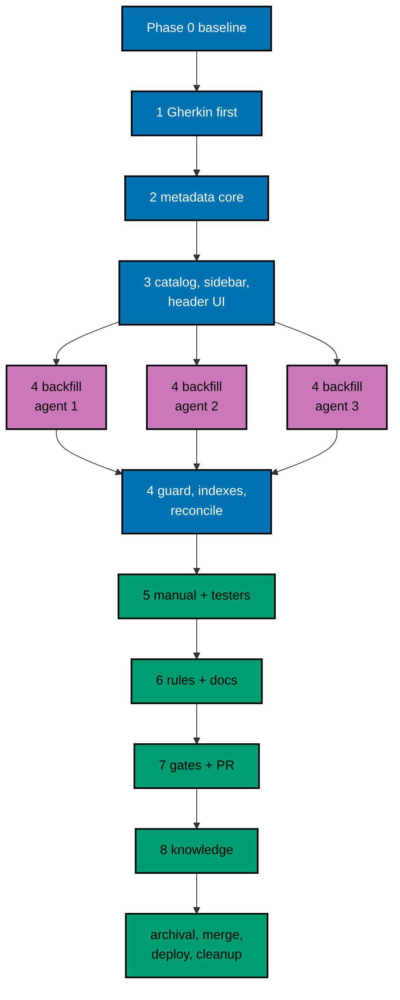

# Delivery Plan — AyoKoding Learn Revamp 03: Catalog and Metadata

> **Legend** — `[AI]`: an agent performs the step (the default; unmarked steps are `[AI]`).
> `[HUMAN]`: only a human can do it (physical action, out-of-band approval, real-secret or
> privileged-credential handling). `[AI+HUMAN]`: agent prepares, human approves or finishes.

**Do not start** until the user gives an explicit execution command for this plan. That command is
the authorization for this plan's change set (commits, pushes, PR, merge, and deploy described
below). Plans 01 and 02 must also be merged first (see Phase 0).

Authored 2026-10-09.

## Worktree

- **Execution worktree:** `worktrees/ayokoding-learn-revamp-03-catalog-and-metadata/`
- **Provisioning status:** pending
- **Authoring-worktree exception:** this plan was authored inside the separate authoring worktree
  `.claude/worktrees/ayokoding-update` (branch `worktree-ayokoding-update`), which the user required
  for writing all plans of the AyoKoding Learn Revamp series together. That authoring worktree is
  removed after the plan-docs PR merges and is **never** used for execution. The Provisioned Worktree
  Identity and Delivery Branch Inventory are intentionally omitted until Step 0 below creates them.
- **Step 0 obligation (blocking):** the plan-execution Step 0 gate provisions the execution worktree
  from fresh `origin/main` with
  `rtk git worktree add -b ayokoding-learn-revamp-03-catalog-and-metadata-base worktrees/ayokoding-learn-revamp-03-catalog-and-metadata origin/main`,
  initializes it per
  [Worktree Toolchain Initialization](../../../repo-governance/development/workflow/worktree-setup.md),
  writes the immutable identity and the first inventory row into this section, replaces
  `Provisioning status: pending` with `Provisioning status: provisioned` in the same plan update, and
  syncs with `origin/main` before any delivery packet starts.
- **Cleanup:** after the PR merges, the worktree and its branches come down through
  [Dev Artifact Clean-Up](../../../repo-governance/workflows/maintenance/dev-artifact-clean-up.md)
  (see Plan Archival).
- **Worktree cap:** one worktree for this plan in this repository, reused by every phase.

## Delivery Mode: worktree-to-pr

`worktree-to-pr` is mandatory in this repository. One branch and **one PR** deliver the whole plan.
The PR opens as a draft. It needs the exact current-head/base `Quality gate` from
`.github/workflows/pr-quality-gate.yml` and an exact-head posted `pr-leak-review` `pass`
(`leak-review` status). Broad semantic PR review is not run unless the user asks for it. `[AI]`
merges once the hardened merge preconditions (a)–(e) of the
[PR Merge Protocol](../../../repo-governance/development/workflow/pr-merge-protocol.md) hold. The plan
folder moves to `plans/done/` inside this same PR, before the merge (archival-in-PR).

### Delivery Unit

| Unit  | Phases                                      | Safe `main` state after merge                                                                                                                                                               | Rollback                                                                                                                                           |
| ----- | ------------------------------------------- | ------------------------------------------------------------------------------------------------------------------------------------------------------------------------------------------- | -------------------------------------------------------------------------------------------------------------------------------------------------- |
| DU-03 | 1–8 and Plan Archival (Phase 0 opens no PR) | All 181 courses carry valid metadata; the catalog, grouped sidebar, and course header are live; the real-corpus guard runs in `test:quick`; rules, skills, and docs describe the new fields | Revert the merge commit in a revert PR (code and content together; see [tech-docs/002](./tech-docs/002-metadata-schema-and-migration.md#rollback)) |

There is no feature flag ([tech-docs/README](./tech-docs/README.md#feature-flag)). The phases are
natural pauses inside the one branch; no phase is merged on its own.

### Before Phase 0: Promotion

- [ ] [AI] Promote the plan per
      [Starting and Completing Work](../../../repo-governance/conventions/structure/plans/starting-and-completing-work.md):
      a pure move of `plans/backlog/ayokoding-learn-revamp-03-catalog-and-metadata/` to
      `plans/in-progress/ayokoding-learn-revamp-03-catalog-and-metadata/` plus the
      `plans/backlog/README.md` and `plans/in-progress/README.md` index updates, landed on
      `origin/main` through its own PR. Acceptance:
      `rtk git ls-tree -r --name-only origin/main plans/in-progress/ayokoding-learn-revamp-03-catalog-and-metadata/`
      lists this plan's files. This promotion PR is separate from DU-03.

### Execution Packet Defaults

- **Plan path after promotion:** `plans/in-progress/ayokoding-learn-revamp-03-catalog-and-metadata/`
  (written below as `<plan>/`). Evidence goes to `<plan>/evidence/`.
- **Scratch:** the execution ledger, tester charters, and temporary notes live in the execution
  worktree's `local-tmp/ayokoding-learn/plan-03/` (gitignored). Record agent IDs and review cycle
  counts in `local-tmp/ayokoding-learn/plan-03/execution-ledger.md`. No ad-hoc script computes
  metadata: the expected `estimatedHours` values come only from the real-corpus test's failure
  message ([tech-docs/004](./tech-docs/004-estimated-hours-and-start-target.md#the-drift-test)).
- **Evidence hygiene:** evidence files contain repository-relative paths only. Never paste an
  absolute home-directory path, a hostname, a token, or `.env*` content (the PR leak review treats
  machine-specific values as leaks).
- **Never commit** `apps/ayokoding-www/next-env.d.ts` (the dev server and `next build` rewrite it) or
  `.serena/project.yml`. Before every commit run `rtk git status --short` and restore either file with
  `rtk git checkout -- <file>` if it shows as modified.
- **Never touch** `.env.prod` or `.env.stag`. If the dev server needs a variable, copy the key from
  `apps/ayokoding-www/.env.example` into an uncommitted `apps/ayokoding-www/.env.local`.
- **No content-body edits.** Course work in this plan is frontmatter only
  ([tech-docs/README](./tech-docs/README.md#learning-content-exemption)). A diff that changes any line
  below a course `_index.md` frontmatter, or any other course file, is a defect to revert.
- **Bounded loops:** every maker→checker loop and every quality gate in this plan runs at most 2
  cycles. A file or finding still failing after cycle 2 is recorded as `BLOCKED` in the execution
  ledger with its findings, reported to the user, and the phase gate stays open until the user
  decides.
- **Failure handling:** on any unexpected failure, save the output to the phase evidence file, fix
  the root cause (never skip, retry-until-green, loosen, sleep, or delete a test), rerun the same
  command, and note the fix.

> **Important**: Fix ALL failures found during quality gates, not just those caused by your
> changes. This follows the root cause orientation principle — proactively fix preexisting
> errors encountered during work.

### Command Reference

Run every command from the execution worktree root. Expected results are stated at each use.

| Name               | Command                                                                                                                                        |
| ------------------ | ---------------------------------------------------------------------------------------------------------------------------------------------- |
| `UNIT-FE <file>`   | `rtk ./hippo run --class ephemeral --resource-tier standard --disk-path . --cwd apps/ayokoding-www -- npx vitest run --project unit-fe <file>` |
| `UNIT-NODE <file>` | `rtk ./hippo run --class ephemeral --resource-tier standard --disk-path . --cwd apps/ayokoding-www -- npx vitest run --project unit <file>`    |
| `TYPECHECK`        | `rtk ./hippo run --class ephemeral --resource-tier standard --disk-path . -- npm exec nx -- run ayokoding-www:typecheck`                       |
| `LINT`             | `rtk ./hippo run --class ephemeral --resource-tier light --disk-path . -- npm exec nx -- run ayokoding-www:lint`                               |
| `UNIT`             | `rtk ./hippo run --class ephemeral --resource-tier standard --disk-path . -- npm exec nx -- run ayokoding-www:test:unit`                       |
| `COVERAGE`         | `rtk ./hippo run --class ephemeral --resource-tier light --disk-path . -- npm exec nx -- run ayokoding-www:test:coverage`                      |
| `COVERAGE-BE-E2E`  | `rtk ./hippo run --class ephemeral --resource-tier light --disk-path . -- npm exec nx -- run ayokoding-www-be-e2e:test:coverage`               |
| `QUICK`            | `rtk ./hippo run --class ephemeral --resource-tier standard --disk-path . -- npm exec nx -- run ayokoding-www:test:quick`                      |
| `E2E-QUICK`        | `rtk ./hippo run --class ephemeral --resource-tier standard --disk-path . -- npm exec nx -- run ayokoding-www-fe-e2e:test:quick`               |
| `BE-E2E-QUICK`     | `rtk ./hippo run --class ephemeral --resource-tier standard --disk-path . -- npm exec nx -- run ayokoding-www-be-e2e:test:quick`               |
| `INTEGRATION`      | `rtk ./hippo run --class ephemeral --resource-tier heavy --disk-path . -- npm exec nx -- run ayokoding-www:test:integration`                   |
| `E2E`              | `rtk ./hippo run --class ephemeral --resource-tier heavy --disk-path . -- npm exec nx -- run ayokoding-www-fe-e2e:test:e2e`                    |
| `BE-E2E`           | `rtk ./hippo run --class ephemeral --resource-tier heavy --disk-path . -- npm exec nx -- run ayokoding-www-be-e2e:test:e2e`                    |
| `GEN-INDEXES`      | `rtk ./hippo run --class transactional --resource-tier standard --disk-path . -- npm exec nx -- run ayokoding-www:generate-indexes`            |
| `VALIDATE-INDEXES` | `rtk ./hippo run --class ephemeral --resource-tier standard --disk-path . -- npm exec nx -- run ayokoding-www:validate-indexes`                |
| `DEV`              | `rtk ./hippo run --class service --resource-tier standard --disk-path . -- npm exec nx -- dev ayokoding-www` (serves `http://localhost:3101`)  |
| `BUILD`            | `rtk ./hippo run --class ephemeral --resource-tier heavy --disk-path . -- npm exec nx -- run ayokoding-www:build`                              |
| `START`            | `rtk ./hippo run --class service --resource-tier standard --disk-path . -- npm exec nx -- run ayokoding-www:start` (serves port 3101)          |
| `HARNESS-GENERATE` | `rtk ./hippo run --class transactional --resource-tier light --disk-path . -- ./rhino harness adapters generate`                               |
| `HARNESS-VALIDATE` | `rtk ./hippo run --class ephemeral --resource-tier light --disk-path . -- ./rhino harness adapters validate`                                   |
| `CORPUS-GUARD`     | `UNIT-NODE tests/unit/be-steps/course-metadata.steps.ts` (the real-corpus guard and the other metadata scenarios)                              |

Notes:

- `QUICK` runs typecheck, lint, `test:unit` (99% line threshold), and `test:coverage` (every scenario
  bound once per non-exempt adapter). Phases 1–3 deliberately leave `QUICK` red (unbound or
  not-yet-backfilled scenarios), so their gates use `TYPECHECK`, `LINT`, `UNIT`, and `COVERAGE`
  separately with stated expected failures. From Phase 4 on, `QUICK` must exit 0.
- `E2E` builds the app with the fixture manifests in `apps/ayokoding-www-fe-e2e/fixtures/manifests/`
  and runs every scenario in Chromium, Firefox, and WebKit; it takes a long time. `BE-E2E` builds the
  app and runs the backend scenarios over HTTP. Both need the backfilled content, so they first run
  green in Phase 4.
- `INTEGRATION` depends on `build`, so it is heavy too.
- `DEV` and `START` both bind port 3101: never run them at the same time, and stop each one before
  `E2E` or `BE-E2E` (their Playwright `webServer` also binds 3101).

### Agent Topology

The root coordinator owns the file ledger, integration, every gate, and every commit. Gherkin goes to
`specs-maker` (checked by `specs-checker`). Code phases 2 and 3 run one slice at a time, delegated to
`swe-developer`, because the slices share `translations.ts`, `page.tsx`, and the course-paths
components. The Phase 4 frontmatter backfill fans out to at most 3 background
`apps-ayokoding-www-general-maker` agents on disjoint category sets (N=3); the root then integrates and
runs the guard. Phase 5 uses `swe-web-tester`, `swe-usability-tester`, and `swe-api-tester` for the
tester gates and `swe-developer` for fixes. Phase 6 uses `rules-fixer` and `docs-fixer`.

### Commit Guidelines

- [ ] Do not stage or commit until the user's execution command has authorized this plan's change
      set; do not extend a commit beyond it.
- [ ] Use the fewest build-valid, independently reviewable and revertible commits, one coherent
      purpose each. Phases 1–3 cannot be committed alone: the Gherkin is unbound until Phase 3 and the
      real-corpus guard fails until the Phase 4 backfill, so the pre-push gate would reject them. The
      product change therefore lands as **one** commit at the Phase 4 gate, followed by separate
      commits for tester-gate fixes (Phase 5), rules and docs (Phase 6), evidence, and archival.
- [ ] Follow Conventional Commits: `<type>(<scope>): <description>`, imperative, no period. Planned
      messages:
  - `feat(ayokoding-www): add course catalog, category sidebar, and course header`
  - `fix(ayokoding-www): <finding summary>` (one per tester-gate fix, if any)
  - `docs(ayokoding-www): document course metadata rules`
  - `docs(plans): record ayokoding-learn-revamp-03 evidence`
  - `chore(plans): move ayokoding-learn-revamp-03-catalog-and-metadata to done`
- [ ] Keep each change with its tests, specs, regenerated indexes, docs, and generated harness
      routes in the same commit; stage explicit paths only, never `git add -A`.
- [ ] Before every commit, run `rtk git status --short` and confirm
      `apps/ayokoding-www/next-env.d.ts` and `.serena/project.yml` are neither staged nor modified.

---

## Phase 0: Worktree, Preconditions, Baseline, and Inventory

Phase 0 opens no PR. Its evidence rides the DU-03 PR.

- **Input:** the promotion on `origin/main`; this plan at `<plan>/`.
- **Outcome:** a provisioned, initialized worktree; confirmed preconditions (plans 01 and 02 merged);
  a recorded green baseline; an exact inventory of the 181 course folders.
- **Proof:** `<plan>/evidence/phase-0-baseline.md` and `<plan>/evidence/phase-0-inventory.md`.

- [ ] [AI] **Plan quality gate (deferred from authoring):** run the `plan-quality-gate` workflow on this
      plan with `max-cycles` 2 before any other step below. It was deliberately not run when this plan was
      written, to keep token use even (user decision, 2026-10-09). Acceptance: verdict `PASS` or
      `PASS_WITH_FINDINGS`; record the line `plan-quality-gate: <verdict> (<n> cycles, <k> open)` in this
      file's header section. If the plan is still in `plans/backlog/`, run the gate before the promotion PR.
      A `BLOCKED` verdict stops execution and is reported to the user.
- [ ] [AI] Run the plan-execution Step 0 gate described in [## Worktree](#worktree): provision
      `worktrees/ayokoding-learn-revamp-03-catalog-and-metadata/` from fresh `origin/main`, record the
      Provisioned Worktree Identity and the first Delivery Branch Inventory row in this file, and set
      `Provisioning status: provisioned`. Acceptance: `rtk git worktree list --porcelain` shows the
      worktree on branch `ayokoding-learn-revamp-03-catalog-and-metadata-base`.
- [ ] [AI] From the worktree root, run
      `rtk ./hippo run --class transactional --resource-tier standard --disk-path . -- npm install`.
      Acceptance: exit 0 and Husky hooks installed (`.husky/_` exists).
- [ ] [AI] Run `rtk npm run doctor`. Acceptance: exit 0. Only if it reports a missing or drifted
      toolchain, run
      `rtk ./hippo run --class transactional --resource-tier standard --disk-path . -- ./rhino toolchain provision --apply`
      and then `rtk npm run doctor` again (exit 0).
- [ ] [AI] Create the delivery branch from the synced base:
      `rtk git switch -c ayokoding-learn-revamp-03-catalog-and-metadata` and append it to the Delivery
      Branch Inventory (`worktree-to-pr`, `active`).

### Preconditions (decision D1)

- [ ] [AI] Plan 01 merged: `rtk git ls-tree -d --name-only origin/main plans/done/` lists a folder
      ending in `__ayokoding-learn-revamp-01-navigation-and-display`. Record the folder name.
- [ ] [AI] Plan 02 merged: the same listing has a folder ending in
      `__ayokoding-learn-revamp-02-path-model`; `rtk git grep -n "status" origin/main -- apps/ayokoding-www/src/features/content/core/schemas.ts`
      shows the `status` field; and
      `rtk git cat-file -e origin/main:apps/ayokoding-www/src/features/course-paths/shell/outline-badge.tsx`
      exits 0. Record all three results.
- [ ] [HUMAN] **Only if either check above fails:** stop. Report which plan is missing. The user
      either waits for it to merge or explicitly authorizes
      [D1](./tech-docs/007-decision-records.md#d1--order-against-plan-02) Alternative A in writing. Do
      not continue on an assumption.
- [ ] [AI] Re-probe Vercel MCP: record in `<plan>/evidence/phase-0-baseline.md` whether any Vercel
      MCP tool is listed in this session (`present` or `absent`). Either way this plan uses no Vercel
      tool ([tech-docs/README](./tech-docs/README.md#vercel-mcp-capability)); record no Vercel
      identifiers.

### Baseline

- [ ] [AI] Run `QUICK`. Acceptance: exit 0. Save the summary (exit code, test counts, line coverage)
      in `<plan>/evidence/phase-0-baseline.md`.
- [ ] [AI] Run `E2E-QUICK` and `BE-E2E-QUICK`. Acceptance: both exit 0; save the summaries.
- [ ] [AI] Run `INTEGRATION`. Acceptance: exit 0; save the pass count.
- [ ] [AI] Run `E2E`, then `BE-E2E`. Acceptance: both exit 0 with every scenario passing; save the
      pass/fail counts. If either fails before any change, fix the root cause first per the Failure
      handling rule.
- [ ] [AI] Run `VALIDATE-INDEXES`. Acceptance: exit 0 (indexes already in sync).
- [ ] [AI] Start `DEV` in the background. With Playwright MCP at 1280×800, open
      `http://localhost:3101/en/learn/courses` and `http://localhost:3101/en/learn/courses/sql-essentials`.
      Acceptance: the courses page is the long generated link list (record the number of links inside
      `main`; 693 on 2026-10-09 before plans 01 and 02) and the course page has no header. Save
      `<plan>/evidence/phase-0-before-courses-en-1280px.png` and
      `<plan>/evidence/phase-0-before-course-landing-en-1280px.png`. Stop `DEV`, then run
      `rtk git status --short` and restore `apps/ayokoding-www/next-env.d.ts` if it changed.

### Inventory

- [ ] [AI] List the course folders:
      `find apps/ayokoding-www/content/en/learn/courses -mindepth 1 -maxdepth 1 -type d | sort`.
      Acceptance: 181 lines. Write the list to `<plan>/evidence/phase-0-inventory.md` under "Course
      folders". Compare it with the 181 slugs in
      [tech-docs/003](./tech-docs/003-category-taxonomy-and-course-mapping.md#the-181-row-mapping) and
      record "identical" or the exact differences.
- [ ] [AI] Count the outline set:
      `grep -l "^status: outline" apps/ayokoding-www/content/en/learn/courses/*/_index.md | sort`.
      Acceptance: 62 files, matching the courses marked outline in tech-docs/003. Record the list.
- [ ] [AI] **If the folder list or the outline set differs from tech-docs/003:** stop and record the
      difference. A course added, removed, or renamed since 2026-10-09 needs a category, a description,
      and (if not an outline) a format before Phase 4. Propose the values in the evidence file using
      the rules in tech-docs/003, and report them to the user before continuing; a different outline
      count means plan 02's or this plan's measurement is wrong
      ([tech-docs/002](./tech-docs/002-metadata-schema-and-migration.md#reconciliation)).
- [ ] [AI] Record the current frontmatter keys of the course `_index.md` files (for example with
      `head -12` on three of them) so Phase 4 can prove that existing lines did not change.

### Phase 0 Gate

> All checks below must pass before starting Phase 1.

- [ ] [AI] Both preconditions hold (or the user has authorized D1 Alternative A in writing).
- [ ] [AI] `<plan>/evidence/phase-0-baseline.md` records exit 0 for `QUICK`, `E2E-QUICK`,
      `BE-E2E-QUICK`, `INTEGRATION`, `E2E`, `BE-E2E`, and `VALIDATE-INDEXES`.
- [ ] [AI] `<plan>/evidence/phase-0-inventory.md` lists 181 course folders and 62 outline courses, or
      records a reported difference.
- [ ] [AI] `rtk git status --short` shows only `<plan>/` changes.

> **Pause Safety**: the worktree is provisioned and green, with no product change yet. Safe to stop.
> To resume: `rtk git -C worktrees/ayokoding-learn-revamp-03-catalog-and-metadata status --short`,
> then rerun `QUICK`.

---

## Phase 1: Gherkin First

- **Input:** [prd.md Acceptance Criteria](./prd.md#acceptance-criteria-gherkin);
  [tech-docs/006](./tech-docs/006-testing-strategy.md#gherkin-to-test-binding-map).
- **Outcome:** every new and changed scenario exists in `specs/` before any code, with valid exemption
  comments, and the coverage checkers fail only because those scenarios have no bindings yet.
- **Proof:** `<plan>/evidence/phase-1-gherkin.md` with the failing coverage output.
- _Suggested executor: `specs-maker`, checked by `specs-checker`._

- [ ] [AI] Create `specs/apps/ayokoding/www/behaviours/frontend/course-paths/course-catalog.feature`
      with the 6 scenarios in prd.md, verbatim.
- [ ] [AI] Create `specs/apps/ayokoding/www/behaviours/frontend/course-paths/course-landing-header.feature`
      with the 7 scenarios in prd.md, verbatim.
- [ ] [AI] Create `specs/apps/ayokoding/www/behaviours/frontend/navigation/sidebar-course-categories.feature`
      with the 4 scenarios in prd.md, verbatim.
- [ ] [AI] Create `specs/apps/ayokoding/www/behaviours/backend/content/course-metadata.feature` with
      the 5 scenarios in prd.md, verbatim.
- [ ] [AI] Append the scenario "The course catalog section keeps a frontmatter-only index" (with its
      exemption comment) to
      `specs/apps/ayokoding/www/behaviours/build-tools/index-generation/index-generation.feature`.
      Acceptance: the six existing scenarios are byte-identical (`rtk git diff` shows only added lines).
- [ ] [AI] Append the scenario "Course nodes carry their category" to
      `specs/apps/ayokoding/www/behaviours/backend/navigation/navigation-api.feature`. Acceptance: only
      added lines.
- [ ] [AI] Index the new features in `specs/apps/ayokoding/www/behaviours/frontend/course-paths/README.md`,
      `specs/apps/ayokoding/www/behaviours/frontend/navigation/README.md`, and
      `specs/apps/ayokoding/www/behaviours/backend/content/README.md`, one annotated line each, in the
      existing style.
- [ ] [AI] Run `specs-checker` on the six feature files (at most 2 cycles). Acceptance: no open
      blocking finding; each exemption comment sits directly above its tag and names a real target and
      scenario.
- [ ] [AI] **RED (coverage):** run `COVERAGE`. Acceptance: it fails, and the missing bindings it names
      are exactly the new scenarios (24 new scenarios: 6 + 7 + 4 + 5 in the new files and 1 + 1 appended, minus the adapters each one is exempt from).
      Run `COVERAGE-BE-E2E`. Acceptance: it fails and names only "Course nodes carry their category".
      Save both outputs in `<plan>/evidence/phase-1-gherkin.md`.

### Phase 1 Gate

> All checks below must pass before starting Phase 2.

- [ ] [AI] The coverage failures name only this plan's new scenarios.
- [ ] [AI] `rtk npm run lint:md` exits 0 on the changed READMEs.
- [ ] [AI] Nothing is committed (see Commit Guidelines).

> **Pause Safety**: only specs changed; the app is untouched. Safe to stop. To resume: rerun
> `COVERAGE` and confirm the same failure list.

---

## Phase 2: Metadata Core (Expand)

- **Input:** [tech-docs/002](./tech-docs/002-metadata-schema-and-migration.md) (schemas, step 1
  "Expand"), [tech-docs/003](./tech-docs/003-category-taxonomy-and-course-mapping.md) (categories and
  formats), [tech-docs/004](./tech-docs/004-estimated-hours-and-start-target.md) (formula and Start
  rule), [tech-docs/006](./tech-docs/006-testing-strategy.md) (bindings and plain tests).
- **Outcome:** the tolerant runtime fields, the tree `category`, the strict course schema, the effort
  estimate, the Start resolver, and the real-corpus check exist and are unit-tested. No content
  changes yet, so the real-corpus guard fails by design and lists every course.
- **Proof:** RED and GREEN outputs in `<plan>/evidence/phase-2-metadata-core.md`.
- _Suggested executor: `swe-developer`._

### 2.1 Tolerant runtime fields

- [ ] [AI] **RED:** in `apps/ayokoding-www/tests/unit/be-steps/course-metadata.steps.ts` (new, with
      `loadFeature` + `describeFeature`), bind "A metadata typo does not hide the page": build a
      content index from a temporary folder whose course `_index.md` has `category: not-a-category`
      and `estimatedHours: lots`; assert the page is present. Add cases to
      `tests/unit/features/content/core/schemas.test.ts` (bad `category`, `format`, `estimatedHours`
      parse to `undefined`; good values pass) and to
      `tests/unit/features/content/shell/repository-fs.unit.test.ts` (the three fields map into
      `ContentMeta`). Run `UNIT-NODE tests/unit/be-steps/course-metadata.steps.ts`,
      `UNIT-FE tests/unit/features/content/core/schemas.test.ts`, and
      `UNIT-NODE tests/unit/features/content/shell/repository-fs.unit.test.ts`. Acceptance: the new
      cases fail (unknown keys stripped, fields missing); the rest of each file passes. Unbound
      scenarios in the step file are expected to fail at this point.
- [ ] [AI] **GREEN:** add `category`, `format`, and `estimatedHours` with `.optional().catch(undefined)`
      to `frontmatterSchema` in `src/features/content/core/schemas.ts`; add the fields to `ContentMeta`
      in `src/features/content/core/types.ts`; map them in `src/features/content/shell/repository-fs.ts`.
      Rerun the three commands. Acceptance: the new cases pass.
- [ ] [AI] **REFACTOR:** keep field order and comments consistent with plan 02's `status` field. Run
      `TYPECHECK`. Acceptance: exit 0.

### 2.2 Tree `category` and `content.getTree`

- [ ] [AI] **RED:** give one mock course in `tests/unit/be-steps/helpers/test-service.ts` the category
      `data-and-databases`; bind "Course nodes carry their category" in
      `tests/unit/be-steps/navigation-api.steps.ts` and in
      `tests/integration/be-steps/navigation-api.steps.ts` (following each file's existing pattern).
      Run `UNIT-NODE tests/unit/be-steps/navigation-api.steps.ts`. Acceptance: the new scenario fails
      (no `category` on the node); existing scenarios pass.
- [ ] [AI] **GREEN:** add `category?: string` to `TreeNode`, copy it in `tree-builder.ts`, and add
      `category: z.string().optional()` to `treeNodeSchema` in
      `src/features/navigation/core/schemas.ts`. Rerun. Acceptance: pass, including "nodes without a
      category should have no `category` field" (the key is omitted, not `undefined`-valued in JSON).
- [ ] [AI] **E2E bindings (run in Phase 4):** add the same scenario's steps to
      `apps/ayokoding-www-fe-e2e/tests/e2e/steps/backend-navigation-api.steps.ts` and
      `apps/ayokoding-www-be-e2e/tests/e2e/steps/navigation-api.steps.ts` (real content: course
      `learn/courses/sql-essentials`, category `data-and-databases`). Acceptance: `E2E-QUICK` and
      `BE-E2E-QUICK` pass typecheck and lint.
- [ ] [AI] **REFACTOR:** no duplicate tree walk; reuse the existing `findNode` helpers. Run `TYPECHECK`.

### 2.3 Category constant

- [ ] [AI] **RED:** write `tests/unit/features/content/core/course-categories.test.ts` per
      [tech-docs/006](./tech-docs/006-testing-strategy.md#plain-unit-tests-no-gherkin) (14 ids in the
      order of tech-docs/003, `groupByCourseCategory` order, empty groups skipped, unknown category
      to the "Other courses" group). Run `UNIT-FE` on it. Acceptance: fails (module missing).
- [ ] [AI] **GREEN:** create `src/features/content/core/course-categories.ts` with
      `COURSE_CATEGORIES` and `groupByCourseCategory` per
      [tech-docs/005](./tech-docs/005-ui-components-and-copy.md#shared-helpers). Rerun. Acceptance:
      pass.
- [ ] [AI] **REFACTOR:** export only what the catalog and sidebar use. Run `TYPECHECK`.

### 2.4 Strict course schema

- [ ] [AI] **RED:** bind "An outline course may omit format and estimated time" and "Invalid metadata
      names the course and the field" in `course-metadata.steps.ts`; write
      `tests/unit/features/content/core/course-metadata.test.ts` (each field rule, outline exemptions,
      description edge cases: `.NET`, semicolons, two sentences, `·`, 19 and 121 characters). Run
      `CORPUS-GUARD` and `UNIT-FE tests/unit/features/content/core/course-metadata.test.ts`.
      Acceptance: the new cases fail (module missing).
- [ ] [AI] **GREEN:** create `src/features/content/core/course-metadata.ts` with `COURSE_FORMATS`,
      `courseMetadataSchema` (reusing `frontmatterSchema.shape.status`, never redefining it), and
      `checkCourseMetadata` exactly as in
      [tech-docs/002](./tech-docs/002-metadata-schema-and-migration.md#strict-course-schema-srcfeaturescontentcorecourse-metadatats-new).
      Rerun. Acceptance: the two scenarios and the plain test pass.
- [ ] [AI] **REFACTOR:** error messages follow the `<courseId>: <field>: <message>` format. Run
      `TYPECHECK`.

### 2.5 Effort estimate

- [ ] [AI] **RED:** write `tests/unit/features/content/core/course-effort.test.ts` and
      `tests/unit/features/content/shell/course-effort-scan.unit.test.ts` per tech-docs/006 (fences,
      words, minimum 1 h, `max` of the two code counts, rounding at .5; temp folder with a rendered
      page, an untitled `.md` in `code/`, a draft, a binary file, an `_index.md`). Run `UNIT-FE` and
      `UNIT-NODE` on them. Acceptance: fail (modules missing).
- [ ] [AI] **GREEN:** create `src/features/content/core/course-effort.ts` (`countPageEffort`,
      `estimateCourseHours`) and `src/features/content/shell/course-effort-scan.ts`
      (`scanCourseEffort`) per [tech-docs/004](./tech-docs/004-estimated-hours-and-start-target.md#code).
      Rerun. Acceptance: pass.
- [ ] [AI] **REFACTOR:** the rates (200 words per minute, 10 code lines per minute) are named constants
      with a comment citing tech-docs/004's reasoning. Run `TYPECHECK`.

### 2.6 Start resolver

- [ ] [AI] **RED:** write `tests/unit/features/content/core/course-start.test.ts` (rules 1–4, the
      synthetic `artifacts` folder skipped, a weight tie broken by slug). Run `UNIT-FE` on it.
      Acceptance: fails (module missing).
- [ ] [AI] **GREEN:** create `src/features/content/core/course-start.ts` with
      `resolveCourseStartSlug(courseNode, isRealPage)` per
      [tech-docs/004](./tech-docs/004-estimated-hours-and-start-target.md#start-target-rule). Rerun.
      Acceptance: pass.
- [ ] [AI] **REFACTOR:** the resolver sorts a copy; it never mutates the tree. Run `TYPECHECK`.

### 2.7 Real-corpus check

- [ ] [AI] **RED:** write `tests/unit/features/content/shell/course-corpus-check.unit.test.ts` (temp
      content folder: a clean course, a stale estimate, a missing field; report sorting). Bind "A stale
      estimate fails with the expected value" (temp folder fixture) and "Every course in the library
      carries valid metadata" (real `apps/ayokoding-www/content`) in `course-metadata.steps.ts` and in
      `tests/integration/be-steps/course-metadata.steps.ts` (new). Run `UNIT-NODE` on the plain test
      and `CORPUS-GUARD`. Acceptance: fail (module missing).
- [ ] [AI] **GREEN:** create `src/features/content/shell/course-corpus-check.ts` with
      `checkCourseCorpus` per
      [tech-docs/006](./tech-docs/006-testing-strategy.md#the-real-corpus-guard). Rerun. Acceptance:
      the plain test, "A stale estimate ...", and the other metadata scenarios pass; **"Every course
      in the library carries valid metadata" still fails by design**, naming every course (missing
      `category`, `description`, and, for non-outline courses, `format` and `estimatedHours`) and
      printing the expected-hours table. Save that full output as
      `<plan>/evidence/phase-2-corpus-red.txt`.
- [ ] [AI] **REFACTOR:** the failure message matches the format in tech-docs/004 exactly (problems
      sorted, then the expected-hours block). Run `TYPECHECK` and `LINT`.

### Phase 2 Gate

> All checks below must pass before starting Phase 3.

- [ ] [AI] `TYPECHECK` and `LINT` exit 0.
- [ ] [AI] `UNIT` fails only on "Every course in the library carries valid metadata" (recorded).
- [ ] [AI] `COVERAGE` fails only on the three frontend features and the index-generation scenario
      (still unbound); `COVERAGE-BE-E2E` exits 0.
- [ ] [AI] `rtk git diff --stat -- apps/ayokoding-www/content` is empty.

> **Pause Safety**: the core exists and is tested; nothing is committed and no content changed. Safe
> to stop. To resume: rerun the Phase 2 Gate commands and compare with the evidence file.

---

## Phase 3: Catalog, Sidebar Groups, and Course Header

- **Input:** [tech-docs/005](./tech-docs/005-ui-components-and-copy.md), the selected designs in
  [prd.md UI Design Funnel](./prd.md#ui-design-funnel) (S1 option A, S2 option A, S3 option A), and
  [tech-docs/006](./tech-docs/006-testing-strategy.md).
- **Outcome:** the three screens render from metadata, every frontend scenario is bound in Unit (with
  fixtures) and E2E (steps written; they run green in Phase 4), and the index generator leaves the
  catalog section frontmatter-only.
- **Proof:** RED and GREEN outputs in `<plan>/evidence/phase-3-ui.md`.
- _Suggested executor: `swe-developer`._

### 3.1 Shared helpers

- [ ] [AI] **RED:** write `tests/unit/features/i18n/core/fill.test.ts` (cases moved from the
      ai-benchmark `fill`/`tf` tests, plus one that imports through the ai-benchmark re-export) and add
      `courseRootIdFromSlug` and `COURSE_CATALOG_SLUG` cases to
      `tests/unit/features/course-paths/shell/course-path-nav.test.ts` (root, subpage, non-course
      slugs). Run `UNIT-FE` on both. Acceptance: the new cases fail.
- [ ] [AI] **GREEN:** create `src/features/i18n/core/fill.ts`; make
      `src/features/ai-benchmark/shell/format.ts` re-export `fill` and `tf` from it; add the two
      exports to `src/features/course-paths/shell/course-path-nav.ts`. Rerun. Acceptance: pass, and
      the existing ai-benchmark tests still pass (`UNIT-FE tests/unit/features/ai-benchmark`).
- [ ] [AI] **REFACTOR:** no other module imports `fill` from ai-benchmark. Run `TYPECHECK`.
- [ ] [AI] Add every translation key in
      [tech-docs/005](./tech-docs/005-ui-components-and-copy.md#translation-keys) to both dictionaries
      in `src/features/i18n/core/translations.ts`, including the 14 category labels and 14 blurbs
      (Indonesian blurbs translated in the same plain style). Acceptance: `TYPECHECK` exits 0 (the
      dictionary type forces both locales to have every key).

### 3.2 Catalog page (S1)

- [ ] [AI] **RED (unit):** write `tests/unit/features/course-paths/core/course-catalog.test.ts` and
      `tests/unit/features/course-paths/shell/course-catalog.test.tsx` per tech-docs/006, and bind all
      6 scenarios of `course-catalog.feature` in `tests/unit/fe-steps/course-catalog.steps.tsx` with a
      fixture tree (three categories, one outline course, one unknown category, `sql-essentials` with
      format `by-example`). Run `UNIT-FE` on the three files. Acceptance: fail (modules missing).
- [ ] [AI] **RED (e2e):** write `apps/ayokoding-www-fe-e2e/tests/e2e/steps/course-catalog.steps.ts`
      for the 6 scenarios against `/en/learn/courses` (outline course `accounting-foundations`; time
      matched with `/^About \d+ h$/`; path count matched with `/^In \d+ paths?$/`, because `E2E` uses
      the fixture manifests). Acceptance: `E2E-QUICK` passes typecheck and lint. The steps run in
      Phase 4.
- [ ] [AI] **GREEN:** create `src/features/course-paths/core/course-catalog.ts` (`buildCourseCatalog`),
      `src/features/course-paths/shell/course-meta-row.tsx`, and
      `src/features/course-paths/shell/course-catalog.tsx` (`CourseCatalog`, `CourseCard`,
      `CategoryJumpLinks`, wrapped in `<article>`); add the `learn/courses` dispatch and its
      `breadcrumbSegments` to `src/app/[locale]/(content)/[...slug]/page.tsx` per
      [tech-docs/005](./tech-docs/005-ui-components-and-copy.md#s1--catalog). Rerun the unit
      commands. Acceptance: pass.
- [ ] [AI] **REFACTOR:** the card is one stretched link whose accessible name is the course title;
      the meta row is shared with the header. Run `TYPECHECK` and `LINT` (the `jsx-a11y` plugin must
      report nothing).

### 3.3 Index generator (R4)

- [ ] [AI] **RED:** bind "The course catalog section keeps a frontmatter-only index" in
      `tests/unit/be-steps/index-generation.steps.ts` and
      `tests/integration/be-steps/index-generation.steps.ts`. Run
      `UNIT-NODE tests/unit/be-steps/index-generation.steps.ts`. Acceptance: the new scenario fails
      (the generator writes the link list); the six existing ones pass.
- [ ] [AI] **GREEN:** in `src/features/content/shell/index-generator.ts`, write only the frontmatter
      for the `learn/courses` section in locale `en`. Rerun. Acceptance: pass.
- [ ] [AI] **REFACTOR:** the special case is one named constant with a comment pointing to the
      catalog dispatch. Run `TYPECHECK`.

### 3.4 Sidebar groups (S3)

- [ ] [AI] **RED (unit):** write `tests/unit/features/navigation/shell/course-category-groups.test.tsx`,
      extend `tests/unit/features/navigation/shell/sidebar-tree.test.tsx`, and bind the 4 scenarios of
      `sidebar-course-categories.feature` in `tests/unit/fe-steps/sidebar-course-categories.steps.tsx`.
      Run `UNIT-FE` on the three files. Acceptance: the new cases fail.
- [ ] [AI] **RED (e2e):** write `apps/ayokoding-www-fe-e2e/tests/e2e/steps/sidebar-course-categories.steps.ts`
      (keyboard Enter and Space on the group button; drawer at 375 px). Change
      `TALL_WIDE_SIDEBAR_PAGE` in `apps/ayokoding-www-fe-e2e/tests/e2e/steps/resizable-sidebar.steps.ts`
      to `/en/learn/courses/erp-foundations-and-history` and update its comment
      ([tech-docs/006](./tech-docs/006-testing-strategy.md#existing-tests-that-change)). Acceptance:
      `E2E-QUICK` passes.
- [ ] [AI] **GREEN:** create `src/features/navigation/shell/course-category-groups.tsx` (client
      component; the wrapper is always rendered with `hidden` when closed, and `aria-controls` points
      to it) and route the `learn/courses` children through it in `sidebar-tree.tsx`, per
      [tech-docs/005](./tech-docs/005-ui-components-and-copy.md#s3--sidebar-groups). Rerun.
      Acceptance: pass.
- [ ] [AI] **REFACTOR:** open state comes from the pathname on first render (no layout shift); the
      chevron uses `motion-safe:`. Run `TYPECHECK` and `LINT`.

### 3.5 Course header (S2)

- [ ] [AI] **RED (unit):** write `tests/unit/features/course-paths/shell/course-header.test.tsx` and
      `course-header-data.test.ts`, and bind the 7 scenarios of `course-landing-header.feature` in
      `tests/unit/fe-steps/course-landing-header.steps.tsx` with fixture trees for the three Start
      shapes and an outline course. Run `UNIT-FE` on the three files. Acceptance: fail.
- [ ] [AI] **RED (e2e):** write `apps/ayokoding-www-fe-e2e/tests/e2e/steps/course-landing-header.steps.ts`
      (`sql-essentials`; `accounting-foundations`; `capstone-data-pipeline`;
      `capstone-first-working-software`; `sql-essentials/learning/beginner`). Acceptance:
      `E2E-QUICK` passes.
- [ ] [AI] **GREEN:** create `src/features/course-paths/shell/course-header-data.ts`
      (`buildCourseHeaderData`) and `course-header.tsx` (`CourseHeader` with `primaryAction` and
      `progress` slots, `StartCourseButton`); change `course-page-content.tsx` and
      `course-page-path-content.tsx` and pass `courseHeader` from `page.tsx`, per
      [tech-docs/005](./tech-docs/005-ui-components-and-copy.md#s2--course-header). Rerun.
      Acceptance: pass, and the existing `prerequisite-display.feature` unit bindings still pass
      (`UNIT-FE tests/unit/fe-steps/prerequisite-display.steps.tsx`).
- [ ] [AI] **REFACTOR:** both slots are covered by tests with placeholder nodes (plan 04 starts
      green); Start keeps `?path=` when present. Run `TYPECHECK` and `LINT`.

### Phase 3 Gate

> All checks below must pass before starting Phase 4.

- [ ] [AI] `TYPECHECK`, `LINT`, `E2E-QUICK`, and `BE-E2E-QUICK` exit 0.
- [ ] [AI] `COVERAGE` and `COVERAGE-BE-E2E` exit 0 (every scenario bound).
- [ ] [AI] `UNIT` fails only on "Every course in the library carries valid metadata".
- [ ] [AI] `rtk git diff --stat -- apps/ayokoding-www/content` is still empty.

> **Pause Safety**: the UI is built and unit-tested on fixtures; content is untouched and nothing is
> committed. Safe to stop. To resume: rerun the Phase 3 Gate commands.

---

## Phase 4: Backfill, Verify, and Commit (Migrate, Verify, Contract)

- **Input:** [tech-docs/003](./tech-docs/003-category-taxonomy-and-course-mapping.md) (category,
  format, and description for every course), `<plan>/evidence/phase-2-corpus-red.txt` (expected
  hours), [tech-docs/002](./tech-docs/002-metadata-schema-and-migration.md#migration-expand-migrate-verify-contract).
- **Outcome:** all 181 course `_index.md` files carry valid metadata; the real-corpus guard passes;
  the catalog index is frontmatter-only; every automated suite is green; the product commit exists.
- **Proof:** `<plan>/evidence/phase-4-reconciliation.md` and the suite outputs.

- [ ] [AI] Rerun `CORPUS-GUARD` and refresh `<plan>/evidence/phase-2-corpus-red.txt` (the expected
      hours must come from the current tree, not from the 2026-10-09 snapshot in tech-docs/003).
- [ ] [AI] Fan out the backfill to 3 background `apps-ayokoding-www-general-maker` agents on disjoint
      category sets (tech-docs/003 order): agent 1 = categories 1–5 (68 courses), agent 2 = categories
      6–12 (59 courses), agent 3 = categories 13–14 (54 courses). Each agent, for each course in its
      set, appends to the existing frontmatter of
      `apps/ayokoding-www/content/en/learn/courses/<slug>/_index.md`: `category` and `description`
      from tech-docs/003, and, for a course without `status: outline`, `format` from tech-docs/003 and
      `estimatedHours` from the expected-hours table. It changes no existing line, and nothing below
      the closing `---`. Record agent IDs in the execution ledger.
- [ ] [AI] Set the `description` of `apps/ayokoding-www/content/en/learn/courses/_index.md` to the text
      in [tech-docs/005](./tech-docs/005-ui-components-and-copy.md#translation-keys); keep `title` and
      `weight`.
- [ ] [AI] **Frontmatter-only proof:** run
      `rtk git diff -U0 -- "apps/ayokoding-www/content/en/learn/courses/*/_index.md" | grep -E "^[+-]" | grep -v -E "^(\+\+\+|---) " | grep -v -E "^\+(category|description|format|estimatedHours): "`.
      Acceptance: no output (on 2026-10-09 no course `_index.md` had a `description`, so every change
      is an added line with one of the four keys). Then
      `rtk git diff -- apps/ayokoding-www/content/en/learn/courses/_index.md` shows only the
      `description` line change. Run both checks before `GEN-INDEXES`. Any other line is a defect to
      revert. `rtk git diff --stat -- apps/ayokoding-www/content` lists exactly 182 files.
- [ ] [AI] **GREEN (guard):** run `CORPUS-GUARD`. Acceptance: every scenario passes, including "Every
      course in the library carries valid metadata" (zero problems, zero drift, a Start page for each
      course). If it fails, fix the named frontmatter value and rerun (at most 2 cycles, then
      `BLOCKED`).
- [ ] [AI] Run `GEN-INDEXES`. Acceptance: in `rtk git status --short`, the only generated change is
      `apps/ayokoding-www/content/en/learn/courses/_index.md`, whose body is now empty (frontmatter
      only). Any other `_index.md` body change means the generator change leaked; fix it in
      `index-generator.ts` and rerun.
- [ ] [AI] Run `VALIDATE-INDEXES`. Acceptance: exit 0.
- [ ] [AI] Run `QUICK`. Acceptance: exit 0, line coverage at or above 99% (record the number).
- [ ] [AI] Run `INTEGRATION`. Acceptance: exit 0, including the new course-metadata, index-generation,
      and navigation-api bindings.
- [ ] [AI] Run `E2E`. Acceptance: exit 0 in every browser, including the 17 new frontend scenarios,
      the new backend navigation scenario, and the unchanged `resizable-sidebar.feature` and
      `navigation.feature` scenarios. If `navigation.steps.ts` fails, fix the root cause (see
      [tech-docs/006](./tech-docs/006-testing-strategy.md#existing-tests-that-change)).
- [ ] [AI] Run `BE-E2E`. Acceptance: exit 0, including "Course nodes carry their category".
- [ ] [AI] **Reconciliation:** fill the table in
      [tech-docs/002](./tech-docs/002-metadata-schema-and-migration.md#reconciliation) in
      `<plan>/evidence/phase-4-reconciliation.md`. Count fields with
      `grep -c` over `apps/ayokoding-www/content/en/learn/courses/*/_index.md` (for example
      `grep -l "^category: " apps/ayokoding-www/content/en/learn/courses/*/_index.md | wc -l`). For the
      two rendered rows, start `DEV`, open `http://localhost:3101/en/learn/courses` with Playwright
      MCP, and count with `browser_evaluate`: cards in `main` (expected 181) and links in `main` whose
      `href` goes below a course root (expected 0). Stop `DEV` and restore `next-env.d.ts` if changed.
      Acceptance: every row equals its expected value.
- [ ] [AI] **Commit:** run `rtk git status --short`; confirm `next-env.d.ts` and `.serena/project.yml`
      are clean; stage the Phase 1–4 paths explicitly (specs, `apps/ayokoding-www/src`,
      `apps/ayokoding-www/tests`, the two E2E projects' step files, the 182 `_index.md` files) and
      commit `feat(ayokoding-www): add course catalog, category sidebar, and course header`. The
      pre-commit gate must pass; never bypass it.

### Phase 4 Gate

> All checks below must pass before starting Phase 5.

- [ ] [AI] `QUICK`, `INTEGRATION`, `E2E`, `BE-E2E`, and `VALIDATE-INDEXES` exit 0 (outputs recorded).
- [ ] [AI] The reconciliation table matches every expected value.
- [ ] [AI] The product commit exists and `rtk git status --short` shows only `<plan>/` changes.

> **Pause Safety**: the full change is committed locally and green; nothing is pushed. Safe to stop.
> To resume: `rtk git log --oneline -3` and rerun `QUICK`.

---

## Phase 5: Manual Verification and Live Tester Gates

- **Input:** the selected designs in [prd.md](./prd.md#ui-design-funnel); the matrix in
  [tech-docs/006](./tech-docs/006-testing-strategy.md#manual-verification-phase-5); the accessibility
  checklist in [tech-docs/005](./tech-docs/005-ui-components-and-copy.md#accessibility-checklist).
- **Outcome:** the running UI matches the selected designs in both locales and at every breakpoint,
  with zero console errors; the rendered production build is signed off; the UI quality gate, the
  rule-15 triad, the API HTTP quality gate, and the rule-16 retest have no open defect.
- **Proof:** screenshots in `<plan>/evidence/` named `phase-5-<what>-<locale>-<width>px.png` and the
  notes in `<plan>/evidence/phase-5-manual.md`.

### Manual UI Verification (Playwright MCP) — all locales × all breakpoints

- [ ] [AI] Confirm the locale set: `SUPPORTED_LOCALES` in
      `apps/ayokoding-www/src/features/i18n/core/config.ts` is `["en", "id"]`. Record it.
- [ ] [AI] Start `DEV` (port 3101).
- [ ] [AI] For each breakpoint 375, 768, 1280 (`browser_resize`, height 800), open `/en/learn/courses`.
      Acceptance: an `h1`, the summary "181 courses in 14 categories.", 14 jump links, 14 sections in
      the tech-docs/003 order, one card per course, no sub-page links, and one card per row at 375 with
      no sideways scroll in `main`. Activate the "Data and databases" jump link (`browser_click`) and
      confirm the section heading is in view. Screenshot `phase-5-catalog-en-<bp>px.png`.
- [ ] [AI] For each breakpoint, open `/en/learn/courses/sql-essentials`. Acceptance: the header shows
      the description, "Code by example", "About N h", "Data and databases", the prerequisites as
      links, and the paths as links; "Start course" opens `/en/learn/courses/sql-essentials/learning/overview`;
      "Course contents" and the page list come after the header; the sidebar's "Data and databases"
      group is open with "SQL Essentials" marked current. At 375, open the navigation drawer and
      confirm the same groups. Screenshot `phase-5-course-header-en-<bp>px.png` (at 375, also
      `phase-5-drawer-en-375px.png`).
- [ ] [AI] At 1280, open `/en/learn/courses/sql-essentials?path=<a path id that lists it>`.
      Acceptance: Start keeps `?path=`. Screenshot `phase-5-course-header-path-en-1280px.png`.
- [ ] [AI] At 1280, open `/en/learn/courses/accounting-foundations`. Acceptance: the "Outline" badge,
      no format and no time. Screenshot `phase-5-course-header-outline-en-1280px.png`.
- [ ] [AI] At 1280, open `/en/learn/courses/capstone-data-pipeline` and
      `/en/learn/courses/capstone-first-working-software`; activate Start on each. Acceptance: the
      first opens the first page under `learning/capstone/`; the second opens its `overview`.
      Screenshots `phase-5-start-fallback-<course>-en-1280px.png`.
- [ ] [AI] At 1280, open `/en/learn/courses/sql-essentials/learning/beginner`. Acceptance: no course
      header. Screenshot `phase-5-inner-page-en-1280px.png`.
- [ ] [AI] Keyboard at 1280: Tab from the top of `/en/learn/courses` through jump links and cards; on a
      course page, Tab to "Start course"; focus a closed sidebar group button, press Enter (opens,
      `aria-expanded="true"`), press Space (closes). Acceptance: visible focus on every stop, in
      reading order. Record the result.
- [ ] [AI] With `prefers-reduced-motion: reduce` emulated, toggle a group. Acceptance: no chevron
      animation. Record the result.
- [ ] [AI] For each breakpoint 375 and 1280, open `/id` and one `/id/` content page (for example
      `/id/belajar/ikhtisar`). Acceptance: `html[lang="id"]`, the sidebar renders with no grouping
      regression, no untranslated new string, and `/id/learn/courses` still returns 404 (this plan
      adds no Indonesian catalog). Screenshots `phase-5-id-home-<bp>px.png` and
      `phase-5-id-content-<bp>px.png`.
- [ ] [AI] After each page, read `browser_console_messages`. Acceptance: zero errors in both locales
      (hydration warnings count as errors).
- [ ] [AI] Stop `DEV`; restore `next-env.d.ts` if changed.

### Rendered Production Sign-Off (staging)

The live site updates only after merge, but archival happens inside the PR before merge. The
production visual sign-off required before archival
([Pre-Archival Gates](../../../repo-governance/workflows/plan/plan-execution/036-finalization-pre-archival-gates.md),
"live or staging environment") therefore runs against a local production build, which serves the
exact code and content that will deploy. The live site is checked again after merge (Plan Archival).

- [ ] [AI] Run `BUILD`, then start `START` in the background (port 3101).
- [ ] [AI] At 375 and 1280, open `/en/learn/courses`, `/en/learn/courses/sql-essentials`, and one
      `/id/` content page; compare each with the selected hi-fi mockups
      (`assets/catalog-option-a-category-card-grid.png`,
      `assets/course-header-option-a-stacked-summary.png`,
      `assets/sidebar-option-a-collapsed-category-groups.png`). Acceptance: layout, order, and content
      match (pixel identity is not required); zero console errors. Screenshots
      `phase-5-prodbuild-<what>-<locale>-<bp>px.png`.
- [ ] [AI] Leave `START` running for the tester gates below.

### UI Quality Gate and Rule-15 Retest

- [ ] [AI] Run the [UI Web Quality Gate](../../../repo-governance/workflows/quality/ui-web-quality-gate.md)
      against `http://localhost:3101` for the three changed screens in `en` and `id`, `max-cycles` 2.
      Append each finding as an unchecked checkbox in the follow-ups section below and fix it with a
      regression test.
- [ ] [AI] Run [UX Review Fix Planning](../../../repo-governance/workflows/quality/ux-review-fix-planning.md)
      with `output-mode: delivery` and this plan's path: `swe-web-tester` (exploratory charter),
      `swe-usability-tester`, and `swe-web-tester` (design charter) against the running site in `en`
      and `id`. Each finding is appended to
      [Rule-15 Three-Tester Retest Follow-Ups](#rule-15-three-tester-retest-follow-ups) as an unchecked
      `EWT-###`, `UWT-###`, or `DWT-###` checkbox with its source; `SG-###` spec gaps are appended as
      their own checkboxes. Fix every defect with a regression test.

### API HTTP Quality Gate and Rule-16 Retest

`content.getTree` gains an optional `category` field. The app has no OpenAPI document; its contract is
the tRPC output schema `treeNodeSchema` in `apps/ayokoding-www/src/features/navigation/core/schemas.ts`
plus `specs/apps/ayokoding/www/behaviours/backend/navigation/navigation-api.feature` and
`backend/content/content-api.feature`. Every call in scope is a read-only query, so it is safe to run
against the local production build.

- [ ] [AI] Run the [API HTTP Quality Gate](../../../repo-governance/workflows/quality/api-http-quality-gate.md)
      with `subject` = `http://localhost:3101/api/trpc` (procedures `content.getTree` and
      `content.getBySlug`, both locales, with and without `rootSlug`) plus the contract above,
      `mode` `normal`, `max-cycles` 2. Append each finding to the follow-ups section and fix it.
- [ ] [AI] Run the rule-16 retest per
      [Rule-16 API Retest](../../../repo-governance/workflows/plan/plan-execution/037-finalization-rule16-api-retest.md):
      `swe-api-tester` (exploratory charter) with `output-mode: delivery` and this plan's path, against
      the same endpoint. Findings land in
      [Rule-16 API Exploratory-Test Retest Follow-Ups](#rule-16-api-exploratory-test-retest-follow-ups)
      as `AET-###` checkboxes; fix each with a regression test.
- [ ] [AI] Stop `START`; restore `next-env.d.ts` if changed.
- [ ] [AI] After all fixes, rerun `QUICK`, `INTEGRATION`, `E2E`, and `BE-E2E`. Acceptance: exit 0.
      Commit each fix as `fix(ayokoding-www): <finding summary>` with its test.

### Phase 5 Gate

> All checks below must pass before starting Phase 6.

- [ ] [AI] Every manual acceptance above holds, and every screenshot is referenced in
      `<plan>/evidence/phase-5-manual.md` with a `` line.
- [ ] [AI] Every UI-gate, API-gate, `EWT`, `UWT`, `DWT`, and `AET` defect checkbox is ticked (deferral
      only with explicit user permission when a fix is genuinely impossible).

> **Pause Safety**: behaviour is verified by hand and by testers; fixes are committed locally. Safe
> to stop. To resume: rerun `QUICK` and check the follow-ups sections for open boxes.

---

## Phase 6: Rule Impact and Docs Propagation

- **Input:** [tech-docs/009](./tech-docs/009-rule-and-docs-impact.md) rules R1–R4;
  [Rules Propagation](../../../repo-governance/workflows/quality/rules-propagation.md) and
  [Docs Propagation](../../../repo-governance/workflows/quality/docs-propagation.md).
- **Outcome:** R1–R4 each live in one canonical home with a recorded disposition; the skills agree
  with the adapter; generated harness routes are regenerated; docs and the C4 page describe the
  change.
- **Proof:** `<plan>/evidence/phase-6-rules-and-docs.md` and the placement record in
  `local-tmp/ayokoding-learn/plan-03/rules-placement.md`.
- _Suggested executor: `rules-fixer` (rules), `docs-fixer` (docs)._

### Automatic Rule-Impact Coverage — repository `ose-public`

- [ ] [AI] **1. Freeze the inputs:** record R1–R4 exactly as stated in tech-docs/009, each with its
      reason, strength (MUST), scope (`apps/ayokoding-www/content/en/learn/courses/**` for R1–R2; the
      tutorial gates for R3; `content/en/learn/courses/_index.md` and the generator for R4), and
      intended enforcement, plus the current revision and uncommitted paths, in
      `local-tmp/ayokoding-learn/plan-03/rules-placement.md`.
- [ ] [AI] **2. Make each rule falsifiable:** record a violating and a conforming example for each
      (R1: a course `_index.md` with no `category` vs one with `category: data-and-databases`; R2:
      stored `estimatedHours: 7` with expected 8 vs equal values; R3: a no-code course judged in
      standard mode vs its `format: annotated-concept-no-code` selecting the no-code sub-mode; R4: a
      generated link list in `learn/courses/_index.md` vs a frontmatter-only file). Acceptance: all
      four recorded as one obligation each.
- [ ] [AI] **3. Stop where rules already suffice:** search `repo-governance/`, `.agents/`, and
      `AGENTS.md` for rules already covering course frontmatter metadata, the tutorial format
      designation, and generated indexes (start with
      `repo-governance/development/quality/gate-adapters/ayokoding-www.md`,
      `repo-governance/development/quality/gate-adapters/ayokoding-www/tutorial-kinds.md`, and
      `.agents/skills/apps-ayokoding-www-developing-content/`). Acceptance: the record lists each hit
      and states which rule (if any) already carries each of R1–R4.
- [ ] [AI] **4. Resolve conflict by level:** apply the supersessions in
      [tech-docs/009](./tech-docs/009-rule-and-docs-impact.md#supersessions-and-conflicts): the
      adapter (higher layer) states R3 and R4; the two `apps-ayokoding-www-authoring-annotated-concept`
      reference files are amended to agree. Acceptance: the record states no remaining contradiction.
- [ ] [AI] **5. Place each rule on the narrowest surface:** per
      [Placement](../../../repo-governance/workflows/quality/rules-propagation/002-placement.md),
      confirm or replace the homes in tech-docs/009 (R1 and R2 in the new
      `.agents/skills/apps-ayokoding-www-developing-content/reference/course-metadata.md`; R3 in
      `tutorial-kinds.md`; R4 in `ayokoding-www.md`). No instruction file (`AGENTS.md`, `CLAUDE.md`)
      changes. Record any eviction a full surface requires.
- [ ] [AI] **6. Write and tidy the subject:** create `course-metadata.md` (fields, the 14 category
      ids, the six formats, the description rubric, the outline exemption, and how to update
      `estimatedHours` from the guard's message; link tech-docs content into the skill, never this
      plan's folder); index it in `reference/README.md`; link it from the skill's `SKILL.md`; edit the
      adapter, `tutorial-kinds.md`, `when-to-use-and-mode-selection.md`, and
      `workflow-and-quality.md`. Acceptance: one canonical statement per rule; every skill stays within
      its word budget.
- [ ] [AI] **7. Give each rule one enforcement disposition:** R1 → `covered`, R2 → `covered`, R4 →
      `covered` (by the scenarios named in tech-docs/009), R3 → `gated` (the Tutorial Annotated Concept
      Quality Gate). Show R1 and R2 failing on a violating input and passing on a conforming one:
      temporarily delete one course's `category`, run `CORPUS-GUARD` (fails naming that course and
      field), restore it, rerun (passes); repeat with a temporary `estimatedHours` off by one. Save both
      outputs.
- [ ] [AI] **Binding generation:** run `HARNESS-GENERATE`, then `HARNESS-VALIDATE`. Acceptance: both
      exit 0; record the generated paths from `rtk git status --short` (expected: none, because no
      skill `name` or `description` changes).
- [ ] [AI] **8. Verify:** run the
      [Rules Quality Gate](../../../repo-governance/workflows/quality/rules-quality-gate.md) on the
      changed rule surfaces (`max-cycles` 2). Acceptance: no open blocking finding;
      `rtk npm run lint:md` exits 0.
- [ ] [AI] **9. Hand delivery to the caller:** reconcile the placement record with
      `rtk git status --short` (every changed path accounted for) and record the propagation `status`
      (`landed`) with each rule's home and disposition. The rule edits are committed in the Phase 6
      commit below.

### Docs Propagation

- [ ] [AI] Run Docs Propagation for the branch's change. At minimum: the paragraph in
      `apps/ayokoding-www/README.md` and the C4 update in `specs/apps/ayokoding/www/architecture.md`
      (the `content` row gains "course metadata validation"), as listed in
      [tech-docs/009](./tech-docs/009-rule-and-docs-impact.md#docs-propagation). The three spec READMEs
      were updated in Phase 1; confirm they still match. Search `docs/` and
      `apps/ayokoding-www-fe-e2e/fixtures/manifests/README.md` for any statement this plan made stale.
      Record the missing `course-paths` row in `architecture.md` as a learning, not a fix. Acceptance:
      `status` recorded; `rtk npm run lint:md` exits 0.
- [ ] [AI] Commit `docs(ayokoding-www): document course metadata rules` with the rule, skill, adapter,
      docs, and any generated route paths, staged explicitly.

### Phase 6 Gate

> All checks below must pass before starting Phase 7.

- [ ] [AI] `HARNESS-VALIDATE` exits 0.
- [ ] [AI] `QUICK` exits 0 and `rtk npm run lint:md` exits 0.

> **Pause Safety**: rules, skills, bindings, and docs agree with the code. Safe to stop. To resume:
> rerun `HARNESS-VALIDATE` and `QUICK`.

---

## Phase 7: Local Quality Gates, Push, PR, and CI

- **Input:** the green, committed branch.
- **Outcome:** an open draft PR whose exact current head has a green `Quality gate` and a posted
  `pr-leak-review` `pass`.
- **Proof:** PR number, head SHA, CI run IDs, and leak-review status in
  `<plan>/evidence/phase-7-pr.md`.

### Local Quality Gates (Before Push)

- [ ] [AI] Run affected typecheck:
      `rtk ./hippo run --class ephemeral --resource-tier standard --disk-path . -- npm exec nx -- affected -t typecheck`.
      Acceptance: exit 0.
- [ ] [AI] Run `rtk npm run affected:lint`. Acceptance: exit 0.
- [ ] [AI] Run `rtk npm run affected:test`. Acceptance: exit 0 (`test:quick` for every affected
      project, including `ayokoding-www-fe-e2e` and `ayokoding-www-be-e2e`).
- [ ] [AI] Run affected spec coverage:
      `rtk ./hippo run --class ephemeral --resource-tier standard --disk-path . -- npm exec nx -- affected -t test:coverage:behaviour`.
      Acceptance: exit 0.
- [ ] [AI] Run `INTEGRATION`, `E2E`, `BE-E2E`, and `VALIDATE-INDEXES` once more on the final tree.
      Acceptance: exit 0.
- [ ] [AI] Run `rtk npm run lint:md`. Acceptance: exit 0.
- [ ] [AI] Fix ALL failures found, including preexisting ones, and rerun until every check above
      exits 0.

### Push and PR

- [ ] [AI] Commit the evidence gathered so far with the planned `docs(plans)` evidence message from
      the Commit Guidelines (explicit `<plan>/` paths).
- [ ] [AI] `rtk git status --short`: confirm `apps/ayokoding-www/next-env.d.ts` and
      `.serena/project.yml` are neither staged nor modified; restore them if they are.
- [ ] [AI] Run the push leak review for the outgoing range per
      [PR Leak Review — Push Review](../../../repo-governance/workflows/quality/pr-leak-review/002-push-review.md).
      Acceptance: no finding (a finding blocks the push until the history is cleaned).
- [ ] [AI] Push the branch and open a **draft** PR against `main`:
      `gh pr create --draft --base main --title "feat(ayokoding-www): course catalog, category sidebar, and course header" --body-file <file>`.
      The body states scope (181 courses' metadata, three screens, one optional API field, rules and
      skills), the rollback (revert the merge commit), the new-code cost and benefit (about ten small
      modules and components plus translation keys; they replace a 693-link list and give the tutorial
      gates one place to read a course's format; tests exempt from the cost statement), the
      frontmatter-only content claim, and a link to this plan. Record the PR number.
- [ ] [AI] Poll the PR checks every 2 minutes with `rtk gh pr checks <number>` (never
      `gh run watch`). Acceptance: the `Quality gate` from `.github/workflows/pr-quality-gate.yml` is
      green for the exact current head and base. On failure, read the failing log
      (`rtk gh run view <run-id> --log-failed`), fix the root cause, run the push leak review, push,
      and poll again.
- [ ] [AI] Run [PR Leak Review](../../../repo-governance/workflows/quality/pr-leak-review.md) for the
      exact current head. Acceptance: one posted `ose-pr-leak-review:v1` `pass` and a successful
      `leak-review` status on that head. Any new push needs a new pass.

### Phase 7 Gate

> All checks below must pass before starting Phase 8.

- [ ] [AI] The PR's current head has green `Quality gate` and `leak-review` statuses (recorded with
      run IDs and head SHA).

> **Pause Safety**: the draft PR is open and green; nothing is merged. Safe to stop. To resume:
> `rtk gh pr checks <number>`.

---

## Phase 8: Knowledge Capture

- [ ] [AI] Apply the litmus test to every `learnings.md` entry — keep only entries where a durable
      surface would catch this automatically next time; discard the rest with a one-line reason.
- [ ] [AI] Apply the **secret/sensitivity gate** to every surviving entry — sanitize to
      `<placeholder>` tokens or discard if the entry cannot be sanitized without losing its meaning.
- [ ] [AI] Apply the **repo-relevance gate** to every surviving entry — infra-private content stays
      private and is never routed into this public repo; public-governance content may route here.
- [ ] [AI] Route each surviving entry to exactly one durable home (`repo-governance/`, `docs/`,
      `.agents/agents/`, `.agents/skills/`, or another owner), landing a small non-code edit inline.
      Create or update a `plans/ideas/<slug>.md` two-pager only when the user has literally
      authorized that plan artifact; otherwise report the follow-up and record
      `Reported without plan authorization` with handoff evidence.
- [ ] [AI] For any entry routed to `plans/ideas/`, scan `plans/ideas/README.md` and the existing
      two-pagers first, after the user literally authorizes an idea artifact; fold into an
      overlapping brief instead of creating a duplicate.
- [ ] [AI] **Code-routing rule**: a learning whose home is `apps/`, `libs/`, or tests never lands
      inline in this PR; it becomes an authorized `plans/ideas/` two-pager or a report. Never create
      or write under `plans/backlog/` for it. A bug that blocks this plan's own scope is fixed inline
      as ordinary root-cause work.
- [ ] [AI] Record the terminal state of every entry (routed inline / authorized two-pager at `<path>` /
      reported without plan authorization with handoff evidence / discarded with reason) in
      `learnings.md`.
- [ ] [AI] If execution surfaced no generalizable learning, record
      `No generalizable learnings — <one-line reason>`.
- [ ] [AI] Report the known follow-ups to the user with handoff evidence: the
      `ayokoding-cli courses estimate` subcommand (plan 05,
      [tech-docs/README](./tech-docs/README.md#out-of-scope-follow-up)); the missing `course-paths` row
      in `specs/apps/ayokoding/www/architecture.md`; and, if Phase 0 found it, any text in plan 02
      that still says plans 02 and 03 may land in either order.
- [ ] [AI] Commit any routed inline edits and the updated `learnings.md`, run the push leak review,
      push, and poll CI every 2 minutes until the new head is green with a new `leak-review` `pass`.

### Phase 8 Gate

> All checks below must pass before starting Plan Archival.

- [ ] [AI] Every `learnings.md` entry has a terminal state, or the explicit "none" escape is present.
- [ ] [AI] No code-homed learning landed inline.

> **Pause Safety**: all learnings are routed, reported, or discarded. Safe to stop. To resume:
> re-check `learnings.md` for any entry without a terminal-state marker.

---

### Plan Archival

- [ ] Perform the **preliminary** plan-execution end-to-end delivery completeness audit: trace approved
      scope and every PRD requirement (FR-01 to FR-15, NFR-01 to NFR-08) and every Gherkin scenario
      through the delivery unit, as-built artifacts, automated and manual proof, rollback evidence,
      and Knowledge Capture. Reopen execution at the earliest affected phase for every missing or
      unsupported row; only final-delivery proof may remain pending. Checked boxes alone are not
      proof.
- [ ] Verify ALL delivery checklist items are ticked.
- [ ] Verify ALL quality gates pass (local + CI).
- [ ] Verify ALL manual assertions pass with committed `evidence/` screenshots.
- [ ] Verify ALL supported locales (`en`, `id`) were exercised in UI verification.
- [ ] Verify the rendered production sign-off (Phase 5, local production build as staging) is
      recorded and matches the selected mockups.
- [ ] Verify every rule-15 `EWT`/`UWT`/`DWT` defect finding is fixed (ticked) — deferral requires
      explicit user permission (only when genuinely impossible); `SG-###` proposals and `USS-###`
      suggestions may be triaged or deferred with written rationale.
- [ ] Verify every rule-16 `AET-###` defect finding is fixed (ticked) — same deferral rule.
- [ ] Register the workflow-owned terminal audit task with its post-delivery proof fields: merge
      commit, post-merge `origin/main` CI, production deploy run, and the live production visual check
      below. Do not mark it complete before merge.
- [ ] After every pre-archival gate passes, run `rtk date +%F`; record the output as
      `<completion-date>`.
- [ ] Move the plan via
      `rtk git mv plans/in-progress/ayokoding-learn-revamp-03-catalog-and-metadata/ plans/done/<completion-date>__ayokoding-learn-revamp-03-catalog-and-metadata/`
      (the `evidence/` subfolder moves with it).
- [ ] Update `plans/in-progress/README.md` — remove the plan entry.
- [ ] Update `plans/done/README.md` — add the plan entry with the same `<completion-date>`.
- [ ] Update any other README that references this plan.
- [ ] Commit `chore(plans): move ayokoding-learn-revamp-03-catalog-and-metadata to done`, run the push
      leak review, push, and poll every 2 minutes until the new head has a green `Quality gate` and a
      new `leak-review` `pass`.
- [ ] [AI] Flip the PR to ready (`rtk gh pr ready <number>`) and confirm the five preconditions in
      [Before Merging](../../../repo-governance/development/workflow/pr-merge-protocol/before-merging.md):
      (a) `Quality gate` green for the exact current head and base; (b) every pushed commit passed the
      push leak review and the current head has a `pass` record with `leak-review` `success`; (c) the
      branch is current with `main` and has no conflict; (d) every review conversation is resolved or
      dismissed by the user; (e) the UI Web, API HTTP, rule-15, and rule-16 gates passed. Record each.
- [ ] [AI] Merge the PR once (a)–(e) hold. Record the merge commit.
- [ ] [AI] Confirm post-merge CI on `origin/main` is green (poll every 2 minutes).
- [ ] [AI] Deploy: run `rtk gh workflow run ayokoding-www-test-local-deploy-prod.yml --ref main` (or
      wait for its next scheduled run) and poll it every 2 minutes until it succeeds; it moves `main`
      to `prod-ayokoding-www`, which Vercel builds.
- [ ] [AI] Live production visual sign-off: with Playwright MCP, open
      `https://www.ayokoding.com/en/learn/courses`,
      `https://www.ayokoding.com/en/learn/courses/sql-essentials`,
      `https://www.ayokoding.com/en/learn/courses/accounting-foundations`, and
      `https://www.ayokoding.com/id/belajar/ikhtisar` at 375 and 1280 px; compare with the selected
      mockups and the Phase 5 production-build screenshots; read the console. Record the result in the
      plan-execution final report (the plan folder is already archived). A mismatch reopens the work
      per rule 14 as a new fix delivery.
- [ ] Classify every Delivery Branch Inventory entry as delivered, unused, or retained/escalated.
- [ ] Remove the worktree per
      [Dev Artifact Clean-Up](../../../repo-governance/workflows/maintenance/dev-artifact-clean-up.md),
      after the checks in
      `repo-governance/development/workflow/worktree-and-artifact-cleanup/mandatory-pre-removal-checks.md`:
      `rtk git worktree remove worktrees/ayokoding-learn-revamp-03-catalog-and-metadata`.
- [ ] Complete branch cleanup for every branch this plan created per
      `repo-governance/development/workflow/worktree-and-artifact-cleanup/branch-cleanup.md`, then run
      `rtk git worktree prune`; remove this plan's own `local-tmp/ayokoding-learn/plan-03/` scratch;
      reconcile local `main` until `rtk git rev-list --left-right --count HEAD...origin/main` reads
      `0 0`.

---

## Rule-15 Three-Tester Retest Follow-Ups

Findings from the UI Web Quality Gate and the rule-15 triad (`swe-web-tester` exploratory,
`swe-usability-tester`, `swe-web-tester` design) across `/en/` and `/id/` are appended here during
Phase 5, one unchecked checkbox each, in the form
`- [ ] EWT-001: <defect> (source: <tester>, <locale>, <page>) — fix before archival`. Every defect is
fixed with a regression test and ticked before archival. `SG-###` spec gaps are appended as their own
checkboxes and folded into the `specs/` steps; `USS-###` suggestions may be triaged with a written
rationale.

- [ ] Rule-15 triad has run in `en` and `id` and every finding is listed above this line (replace this
      line with "No findings" if none).

## Rule-16 API Exploratory-Test Retest Follow-Ups

Findings from the API HTTP Quality Gate and the rule-16 `swe-api-tester` (exploratory charter) retest
of `content.getTree` and `content.getBySlug` are appended here during Phase 5 in the form
`- [ ] AET-001: <defect> (source: swe-api-tester, <procedure>, <input>) — fix before archival`. Every
`AET` defect is fixed and ticked before archival.

- [ ] Rule-16 retest has run and every finding is listed above this line (replace this line with "No
      findings" if none).
