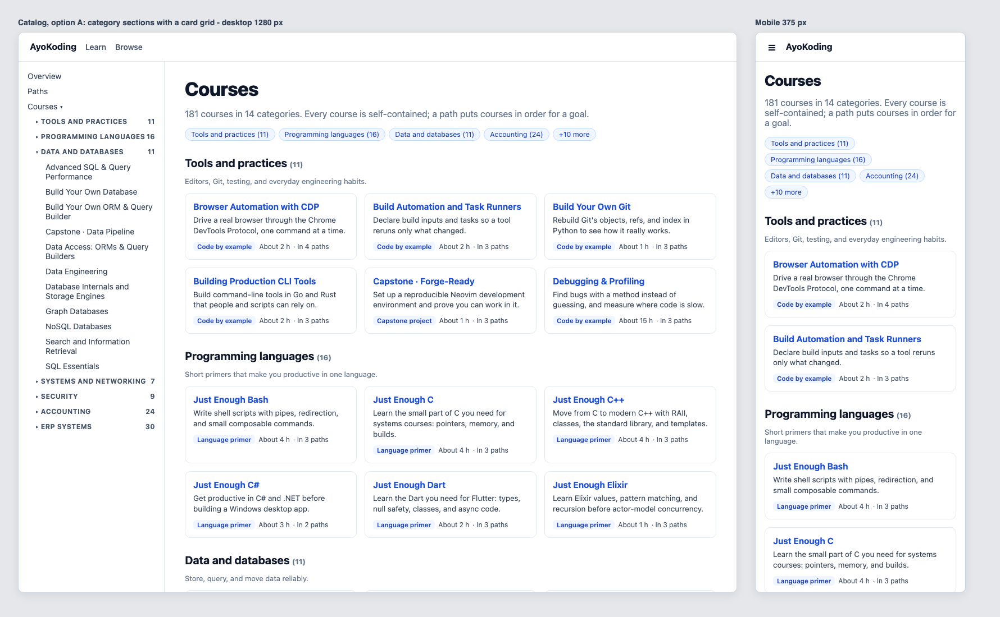
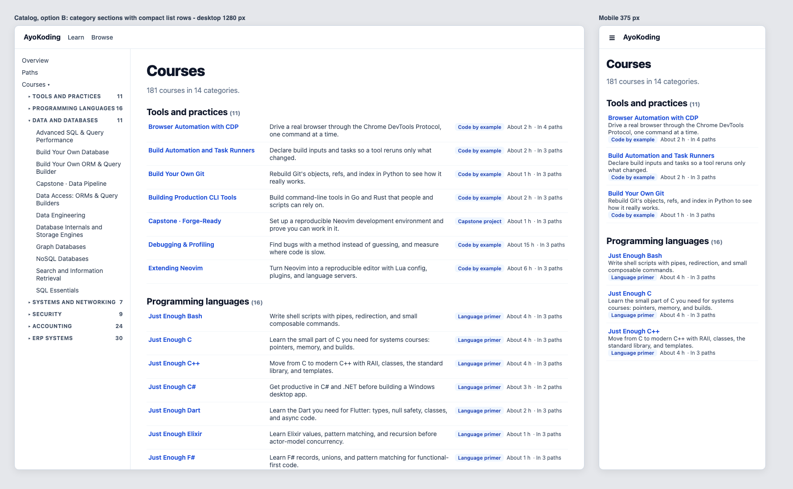
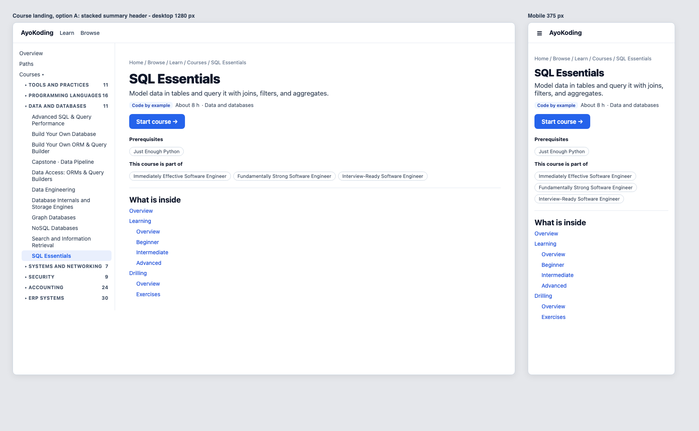
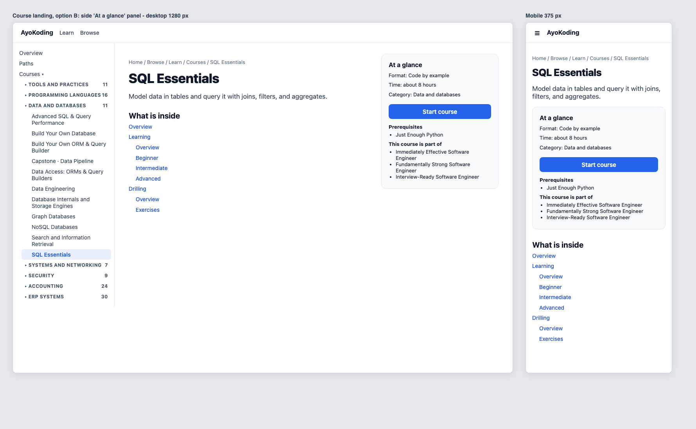
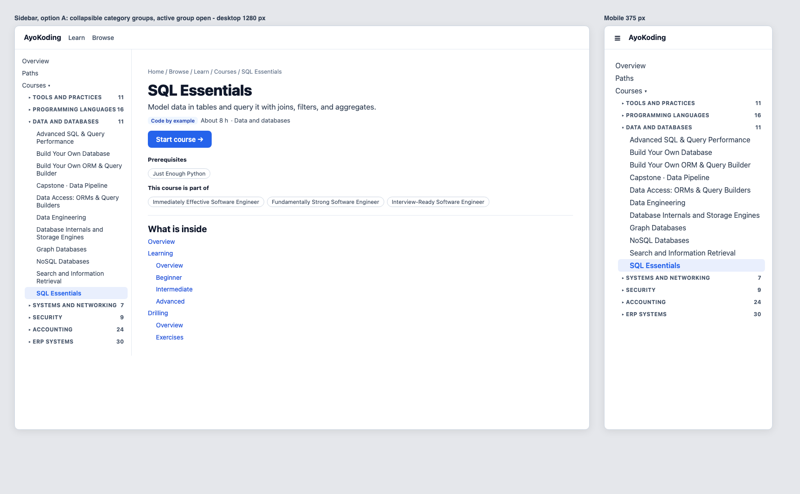
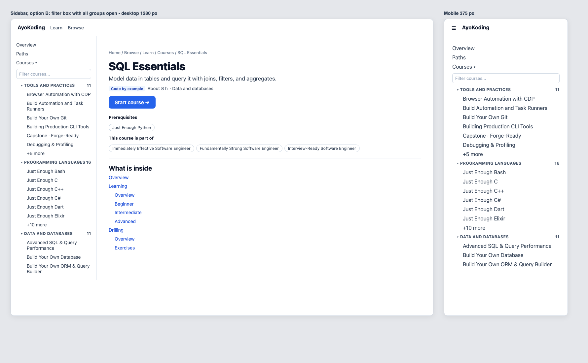

# Product Requirements — Catalog and Metadata

## Personas

- **Nadia, a new learner.** She finished a bootcamp, opens AyoKoding for the first time, and wants a
  database course that fits a weekend. She does not know the site's internal terms.
- **Raka, a path follower.** He follows the Immediately Effective Software Engineer path. He lands on
  a course page from the path and wants to know what it covers, how long it takes, and where to start.
- **Sari, a content maintainer.** She rewrites a course in plan 06–13. She needs one validated place to
  record the course's format and size, and a test that tells her when the numbers are stale.

## User Stories

1. As Nadia, I want the courses page grouped by category, so that I can find the area I care about.
2. As Nadia, I want each course card to show a one-line description, its format, and an estimated
   time, so that I can compare courses without opening them.
3. As Nadia, I want to see which outline courses are not written yet, so that I do not start one by
   mistake.
4. As Raka, I want the sidebar to show only the category I am in, so that I can see nearby courses
   without scrolling past 181 names.
5. As Raka, I want the course page to start with a summary and a "Start course" button, so that I can
   begin in one click.
6. As Raka, I want the course page to show its prerequisites and the paths that use it near the top,
   so that I know whether I am ready.
7. As Sari, I want the build to fail when a course's metadata is missing or its estimate is stale, so
   that the catalog never lies.

## Functional Requirements

| ID    | Requirement                                                                                                                                                                                                                             |
| ----- | --------------------------------------------------------------------------------------------------------------------------------------------------------------------------------------------------------------------------------------- |
| FR-01 | Every course `_index.md` has `category` (one of the 14 ids in [tech-docs/003](./tech-docs/003-category-taxonomy-and-course-mapping.md)) and `description` (one sentence, 20–120 characters, ends with a period, no `·`, no line break). |
| FR-02 | Every course without `status: outline` also has `format` (one of `by-example`, `primer`, `annotated-concept`, `annotated-concept-no-code`, `in-the-field`, `capstone`) and `estimatedHours` (an integer from 1 to 200).                 |
| FR-03 | An outline course may omit `format` and `estimatedHours`. If it declares them, they are validated the same way.                                                                                                                         |
| FR-04 | `estimatedHours` equals `estimateCourseHours` for the course's current content (formula in [tech-docs/004](./tech-docs/004-estimated-hours-and-start-target.md)).                                                                       |
| FR-05 | `/en/learn/courses` renders the catalog: an intro, 14 jump links, then one section per category in fixed order. Inside a section, cards sort by title.                                                                                  |
| FR-06 | A card shows the title, the description, the format label, "About N h", and "In N path(s)". An outline card shows an "Outline" badge in place of the format and time. The whole card is one link to the course landing page.            |
| FR-07 | A course without a known category appears in a last "Other courses" section rather than disappearing. (The FR-01 test keeps this section empty in practice.)                                                                            |
| FR-08 | In the sidebar and mobile drawer, the children of "Courses" are grouped by category. Each group is a disclosure button with the category label and course count. Only the group holding the current page starts open.                   |
| FR-09 | Each course root page shows a header under the title: description; a meta row (format label, "About N h", category, Outline badge when an outline); a "Start course" button; the prerequisites; the paths that use the course.          |
| FR-10 | "Start course" links to the first learning page by the rule in [tech-docs/004](./tech-docs/004-estimated-hours-and-start-target.md#start-target-rule). If no page qualifies, the button is not rendered.                                |
| FR-11 | Below the header, a "Course contents" heading precedes the generated page list. The prerequisites and "This course is part of" lists are not repeated at the bottom of a course root page.                                              |
| FR-12 | Pages inside a course (for example `learning/beginner`) show no course header.                                                                                                                                                          |
| FR-13 | `generate-indexes` writes frontmatter only into `content/en/learn/courses/_index.md`; every other `_index.md` is generated as before.                                                                                                   |
| FR-14 | `content.getTree` adds an optional `category` to course nodes. No other tree field changes.                                                                                                                                             |
| FR-15 | The course header exposes `primaryAction` and `progress` slots so plan 04 can replace "Start course" with "Continue" and add progress without rebuilding the header.                                                                    |

## Non-Functional Requirements

| ID     | Requirement                                                                                                                                                           |
| ------ | --------------------------------------------------------------------------------------------------------------------------------------------------------------------- |
| NFR-01 | Static generation stays the default: the catalog, sidebar, and header render at build time with no per-request work.                                                  |
| NFR-02 | WCAG 2.2 AA: every group button has `aria-expanded` and `aria-controls`; each card has one accessible link name equal to the course title; status is text, not color. |
| NFR-03 | Keyboard: Tab reaches every jump link, card, group button, and the Start button; Enter and Space toggle a group.                                                      |
| NFR-04 | No layout shift: group open state comes from the URL on first render, so server and client markup match.                                                              |
| NFR-05 | Phone width (375 px): one card per row; no horizontal scroll in `main`.                                                                                               |
| NFR-06 | `prefers-reduced-motion`: the group chevron does not animate.                                                                                                         |
| NFR-07 | The runtime frontmatter parse stays tolerant: a metadata typo never hides a page from the site; the strict check runs in tests.                                       |
| NFR-08 | Unit line coverage for `ayokoding-www` stays at or above 99%.                                                                                                         |

## Acceptance Criteria (Gherkin)

These scenarios are written into `specs/apps/ayokoding/www/behaviours/` in Phase 1, before any code.
Frontend scenarios run in the Unit adapter (rendered components with fixtures) and the E2E adapter
(the running site). Their Integration exemption reason is the standard one this corpus uses. The
binding map is in [tech-docs/006](./tech-docs/006-testing-strategy.md).

### New: `frontend/course-paths/course-catalog.feature`

```gherkin
Feature: Course catalog

  As a learner choosing a course
  I want the courses page grouped by category with one card per course
  So that I can pick a course without opening dozens of pages

  Background:
    Given the course library holds courses with a category, a description, a format, and an estimated time

  # Exemption(integration): the scenario is observable at the public browser or HTTP boundary and has no separate local resource boundary; alternative-proof: ayokoding-www-fe-e2e:test:e2e / Every course appears once under its category
  @integration-exempt
  Scenario: Every course appears once under its category
    When a reader opens the courses page
    Then the page shows one section heading per category that has courses
    And the sections follow the fixed category order
    And every course appears in exactly one section

  # Exemption(integration): the scenario is observable at the public browser or HTTP boundary and has no separate local resource boundary; alternative-proof: ayokoding-www-fe-e2e:test:e2e / A course card shows the facts needed to choose
  @integration-exempt
  Scenario: A course card shows the facts needed to choose
    When a reader opens the courses page
    Then the card for "SQL Essentials" shows its one-line description
    And the card shows the format "Code by example"
    And the card shows an estimated time in the form "About N h"
    And the card shows how many paths use the course

  # Exemption(integration): the scenario is observable at the public browser or HTTP boundary and has no separate local resource boundary; alternative-proof: ayokoding-www-fe-e2e:test:e2e / An outline course card says it is an outline
  @integration-exempt
  Scenario: An outline course card says it is an outline
    Given a course is marked as an outline
    When a reader opens the courses page
    Then that course's card shows an "Outline" badge
    And that card shows no format and no estimated time

  # Exemption(integration): the scenario is observable at the public browser or HTTP boundary and has no separate local resource boundary; alternative-proof: ayokoding-www-fe-e2e:test:e2e / A card links only to the course landing page
  @integration-exempt
  Scenario: A card links only to the course landing page
    When a reader opens the courses page
    Then each card holds exactly one link
    And that link opens the course landing page
    And no card links to an Overview, Learning, or Drilling page

  # Exemption(integration): the scenario is observable at the public browser or HTTP boundary and has no separate local resource boundary; alternative-proof: ayokoding-www-fe-e2e:test:e2e / A jump link moves to its category section
  @integration-exempt
  Scenario: A jump link moves to its category section
    When a reader activates the "Data and databases" jump link
    Then the "Data and databases" section heading is the link target

  # Exemption(integration): the scenario is observable at the public browser or HTTP boundary and has no separate local resource boundary; alternative-proof: ayokoding-www-fe-e2e:test:e2e / The catalog fits a phone screen
  @integration-exempt
  Scenario: The catalog fits a phone screen
    Given a viewport 375 pixels wide
    When a reader opens the courses page
    Then the cards stack in one column
    And the main content does not scroll sideways
```

### New: `frontend/course-paths/course-landing-header.feature`

```gherkin
Feature: Course landing header

  As a learner arriving at a course
  I want a short summary and a clear place to start
  So that I can decide whether to take the course and begin in one click

  # Exemption(integration): the scenario is observable at the public browser or HTTP boundary and has no separate local resource boundary; alternative-proof: ayokoding-www-fe-e2e:test:e2e / The header summarizes the course
  @integration-exempt
  Scenario: The header summarizes the course
    Given a course with a description, a format, an estimated time, a category, and prerequisites
    When a reader opens the course landing page
    Then the header shows the description under the title
    And the header shows the format, the estimated time, and the category
    And the header lists the prerequisites as links
    And the header lists the paths that use the course as links

  # Exemption(integration): the scenario is observable at the public browser or HTTP boundary and has no separate local resource boundary; alternative-proof: ayokoding-www-fe-e2e:test:e2e / Start opens the learning overview
  @integration-exempt
  Scenario: Start opens the learning overview
    Given a course has a learning overview page
    When a reader activates "Start course" on the course landing page
    Then the learning overview page of that course opens

  # Exemption(integration): the scenario is observable at the public browser or HTTP boundary and has no separate local resource boundary; alternative-proof: ayokoding-www-fe-e2e:test:e2e / Start falls back to the first learning page
  @integration-exempt
  Scenario: Start falls back to the first learning page
    Given a course has a learning folder without an overview page
    When a reader activates "Start course" on the course landing page
    Then the first learning page in reading order opens
    And that page is not inside a folder that has no index page

  # Exemption(integration): the scenario is observable at the public browser or HTTP boundary and has no separate local resource boundary; alternative-proof: ayokoding-www-fe-e2e:test:e2e / Start falls back to the course overview
  @integration-exempt
  Scenario: Start falls back to the course overview
    Given a course has no learning folder but has a top-level overview page
    When a reader activates "Start course" on the course landing page
    Then the course's overview page opens

  # Exemption(integration): the scenario is observable at the public browser or HTTP boundary and has no separate local resource boundary; alternative-proof: ayokoding-www-fe-e2e:test:e2e / The page list stays below the header
  @integration-exempt
  Scenario: The page list stays below the header
    When a reader opens the course landing page
    Then the "Course contents" heading and the list of course pages appear after the header
    And the page has exactly one prerequisites list
    And the page has at most one "This course is part of" list

  # Exemption(integration): the scenario is observable at the public browser or HTTP boundary and has no separate local resource boundary; alternative-proof: ayokoding-www-fe-e2e:test:e2e / An outline course header says it is an outline
  @integration-exempt
  Scenario: An outline course header says it is an outline
    Given a course is marked as an outline
    When a reader opens the course landing page
    Then the header shows an "Outline" badge
    And the header shows no estimated time

  # Exemption(integration): the scenario is observable at the public browser or HTTP boundary and has no separate local resource boundary; alternative-proof: ayokoding-www-fe-e2e:test:e2e / Pages inside a course have no header
  @integration-exempt
  Scenario: Pages inside a course have no header
    When a reader opens a learning page inside a course
    Then no course header is shown
```

The two fallback scenarios bind their E2E steps to real courses with that shape on 2026-10-09:
`capstone-data-pipeline` (a `learning/` folder with only `capstone/`) and
`capstone-first-working-software` (no `learning/` folder). Their Unit steps use fixtures, so they do
not depend on content. If plan 08 later gives those courses a `learning/overview.md`, plan 08 rebinds
the E2E step to another course with the same shape or, if none remains, records a new exemption with
its own reason.

### New: `frontend/navigation/sidebar-course-categories.feature`

```gherkin
Feature: Sidebar course categories

  As a learner moving between courses
  I want the sidebar's Courses section grouped by category
  So that I see the courses near me without scrolling past the whole library

  # Exemption(integration): the scenario is observable at the public browser or HTTP boundary and has no separate local resource boundary; alternative-proof: ayokoding-www-fe-e2e:test:e2e / The Courses section lists category groups
  @integration-exempt
  Scenario: The Courses section lists category groups
    When a reader opens the courses page
    Then the sidebar Courses section shows one group button per category with its course count
    And every group starts closed

  # Exemption(integration): the scenario is observable at the public browser or HTTP boundary and has no separate local resource boundary; alternative-proof: ayokoding-www-fe-e2e:test:e2e / The current course's group starts open
  @integration-exempt
  Scenario: The current course's group starts open
    When a reader opens the "SQL Essentials" course landing page
    Then the "Data and databases" group is open
    And "SQL Essentials" is marked as the current page
    And every other group is closed

  # Exemption(integration): the scenario is observable at the public browser or HTTP boundary and has no separate local resource boundary; alternative-proof: ayokoding-www-fe-e2e:test:e2e / A group opens and closes from the keyboard
  @integration-exempt
  Scenario: A group opens and closes from the keyboard
    Given the sidebar shows a closed group
    When the reader focuses its button and presses Enter
    Then the group's courses are shown and the button reports that it is expanded
    When the reader presses Space
    Then the group's courses are hidden and the button reports that it is collapsed

  # Exemption(integration): the scenario is observable at the public browser or HTTP boundary and has no separate local resource boundary; alternative-proof: ayokoding-www-fe-e2e:test:e2e / The mobile drawer shows the same groups
  @integration-exempt
  Scenario: The mobile drawer shows the same groups
    Given a viewport 375 pixels wide
    When the reader opens the navigation drawer on the "SQL Essentials" course landing page
    Then the drawer shows the same category groups
    And the "Data and databases" group is open
```

### New: `backend/content/course-metadata.feature`

```gherkin
Feature: Course metadata

  As a content maintainer
  I want every course's catalog metadata validated against its content
  So that the catalog, sidebar, and course header never show missing or stale facts

  # Exemption(e2e): the scenario reads the local content directory and has no public browser or HTTP boundary; alternative-proof: ayokoding-www:test:integration / Every course in the library carries valid metadata
  @e2e-exempt
  Scenario: Every course in the library carries valid metadata
    Given the real course library on disk
    When the course metadata check runs
    Then every course has a known category and a one-sentence description
    And every course that is not an outline has a format and an estimated time
    And every course resolves a Start page

  # Exemption(integration): the scenario is an internal deterministic transform with no local resource boundary; alternative-proof: ayokoding-www:test:unit / An outline course may omit format and estimated time
  @integration-exempt
  # Exemption(e2e): the scenario is an internal deterministic transform with no public browser or HTTP boundary; alternative-proof: ayokoding-www:test:unit / An outline course may omit format and estimated time
  @e2e-exempt
  Scenario: An outline course may omit format and estimated time
    Given a course marked as an outline with a category and a description only
    When the course metadata check runs
    Then the course passes

  # Exemption(integration): the scenario is an internal deterministic transform with no local resource boundary; alternative-proof: ayokoding-www:test:unit / Invalid metadata names the course and the field
  @integration-exempt
  # Exemption(e2e): the scenario is an internal deterministic transform with no public browser or HTTP boundary; alternative-proof: ayokoding-www:test:unit / Invalid metadata names the course and the field
  @e2e-exempt
  Scenario: Invalid metadata names the course and the field
    Given a course that is not an outline has the category "databases" and no format
    When the course metadata check runs
    Then the check fails
    And the failure names the course slug, the "category" field, and the "format" field

  # Exemption(e2e): the scenario reads the local content directory and has no public browser or HTTP boundary; alternative-proof: ayokoding-www:test:integration / A stale estimate fails with the expected value
  @e2e-exempt
  Scenario: A stale estimate fails with the expected value
    Given a course whose stored estimated time differs from the computed estimate
    When the course metadata check runs
    Then the check fails
    And the failure prints the course slug, the stored value, and the expected value

  # Exemption(integration): the scenario is an internal deterministic transform with no local resource boundary; alternative-proof: ayokoding-www:test:unit / A metadata typo does not hide the page
  @integration-exempt
  # Exemption(e2e): the scenario is an internal deterministic transform with no public browser or HTTP boundary; alternative-proof: ayokoding-www:test:unit / A metadata typo does not hide the page
  @e2e-exempt
  Scenario: A metadata typo does not hide the page
    Given a course page whose frontmatter has an unknown category value
    When the content index is built
    Then the page is still in the content index
```

### Modified: `build-tools/index-generation/index-generation.feature`

Add one scenario; the six existing scenarios do not change.

```gherkin
  # Exemption(e2e): the scenario exercises a local filesystem or process boundary rather than a public browser or HTTP boundary; alternative-proof: ayokoding-www:test:integration / The course catalog section keeps a frontmatter-only index
  @e2e-exempt
  Scenario: The course catalog section keeps a frontmatter-only index
    Given a "learn/courses" section in locale "en" with two course sections
    When the index generator runs in generate mode
    Then the learn/courses _index.md contains only its frontmatter
    And each course _index.md still lists its own children
```

### Modified: `backend/navigation/navigation-api.feature`

Add one scenario; the existing scenarios do not change.

```gherkin
  Scenario: Course nodes carry their category
    Given content exists in locale "en" with a course "learn/courses/sql-essentials" in category "data-and-databases"
    When the client calls content.getTree with locale "en"
    Then the "learn/courses/sql-essentials" node should include category "data-and-databases"
    And nodes without a category should have no "category" field
```

### Existing Features That Must Stay Green Unchanged

- `frontend/course-paths/prerequisite-display.feature`: the header reuses `PrerequisiteList`, so a
  course page still lists its prerequisites with or without a path context.
- `frontend/navigation/navigation.feature` "Sidebar shows section tree with collapsible nodes": the
  existing "Expand section" and "Collapse section" buttons stay on every section node.
- `frontend/navigation/resizable-sidebar.feature`: its E2E steps move their tall page to a course
  page whose group is open (see [tech-docs/006](./tech-docs/006-testing-strategy.md)); the scenarios
  stay the same.
- `frontend/navigation/course-rehome-redirects.feature`: catalog card links point at real course
  pages.

## UI Design Funnel

This plan is UI-bearing. It changes three screens: the courses page, the course landing page header,
and the sidebar "Courses" section (desktop rail and mobile drawer).

### Grounding (R5)

- **Shared kit (`libs/web-ui`).** `Card` and `Badge` (already used by `PathCard` in
  `apps/ayokoding-www/src/features/course-paths/shell/path-card.tsx`), and `Button` for the Start
  action. No new library component is needed.
- **Target app components.** `shell/sidebar-tree.tsx` (recursive `SidebarNode`, chevron button with
  "Expand section"/"Collapse section", active style `bg-primary/10 font-medium text-primary`,
  `whitespace-nowrap` labels), `shell/course-page-content.tsx` (breadcrumb, `h1`, `PathBanner`,
  Markdown body, `PrerequisiteList`, `PathCourseLinks`), `app-shell/shell/mobile-nav.tsx` (drawer that
  renders `SidebarTree`). Tokens come from `src/app/globals.css` (primary `hsl(221.2 83.2% 53.3%)`)
  and `libs/web-ui-token`.
- **After plans 01 and 02.** Titles have no `NN ·` prefix; `ContentMeta.status` and `OutlineBadge`
  (`course-paths/shell/outline-badge.tsx`, translated key `pathsOutlineBadge`) exist. Mockups assume
  that state.
- **Net-new app components.** `CourseCatalog`, `CourseCard`, `CategoryJumpLinks`,
  `CourseCategoryGroups` (sidebar), `CourseHeader`, `CourseMetaRow`, `StartCourseButton`.
- **Mockup data.** Titles, descriptions, formats, and hours come from the 2026-10-09 measurement in
  [tech-docs/003](./tech-docs/003-category-taxonomy-and-course-mapping.md). The SQL Essentials
  prerequisite shown ("Just Enough Python") is illustrative; the real value is whatever plan 02 leaves.

### Prior Art (R7)

All sources accessed 2026-10-09.

- **MDN Learn web development** groups its modules into named categories with a purpose line each:
  "Core modules" provide "a structured set of tutorials teaching the essential skills", and "Extension
  modules" cover "useful additional skills"
  ([MDN](https://developer.mozilla.org/en-US/docs/Learn_web_development)). This supports category
  sections with a one-line blurb.
- **Frontend Masters' course catalog** (now at master.dev) shows topic sections such as "JavaScript"
  and "React", each with a few course cards and a "View more" link
  ([catalog](https://master.dev/courses/)). This supports category sections of cards on one page.
- **Microsoft Learn learning-path pages** open with an "At a glance" block (level, role, subject),
  a description, a "Prerequisites" section, and then the list of modules
  ([example](https://learn.microsoft.com/en-us/training/paths/get-started-ai-apps-agents/)). This
  supports a header with facts and prerequisites above the structure list.
- **The Odin Project's paths page** shows each path as a card with a title, a short description, and
  a course count ("7 Courses") ([paths](https://www.theodinproject.com/paths)). This supports one
  count per card instead of a list of sub-links.
- **Exercism's tracks page** is a flat alphabetical list of 84 language links with no grouping or
  description ([tracks](https://exercism.org/tracks)). It is the counter-example: a flat list works
  for one dimension (language), not for a mixed library like AyoKoding's.
- **WAI-ARIA APG disclosure pattern**: the control has role `button`, `aria-expanded` is "true" when
  the content is visible, and Enter or Space "toggles the visibility of the disclosure content"
  ([APG](https://www.w3.org/WAI/ARIA/apg/patterns/disclosure/)). This defines the sidebar group
  button.

### Screen S1 — Courses page (`/en/learn/courses`)

#### Stage 1: Diverge (low-fi)

**Option A — Category sections with a card grid.** Mobile (< sm, 375 px):

```text
+-----------------------------------+
| = AyoKoding                       |
| Courses                           |
| 181 courses in 14 categories ...  |
| [Tools and practices (11)]        |
| [Programming languages (16)]      |
| [Data and databases (11)] [+11]   |
| Tools and practices (11)          |
| Editors, Git, testing, ...        |
| +-------------------------------+ |
| | Browser Automation with CDP   | |
| | Drive a real browser ...      | |
| | [Code by example] About 2 h   | |
| | . In 4 paths                  | |
| +-------------------------------+ |
| +-------------------------------+ |
| | Build Automation and Task ... | |
| +-------------------------------+ |
| Programming languages (16)        |
| ...                               |
+-----------------------------------+
```

Desktop (lg >= 1024 px): sidebar on the left; three cards per row.

```text
+----------+-----------------------------------------------------------+
| Overview | Courses                                                   |
| Paths    | 181 courses in 14 categories. Every course is ...         |
| Courses v| [Tools (11)] [Languages (16)] [Data (11)] ... jump links  |
|  > TOOLS | Tools and practices (11)                                  |
|  > LANGS | +---------------+ +---------------+ +---------------+     |
|  > DATA  | | Title         | | Title         | | Title         |     |
|  ...     | | one line      | | one line      | | one line      |     |
|          | | [fmt] ~2 h 4p | | [fmt] ~2 h 3p | | [fmt] ~1 h 3p |     |
|          | +---------------+ +---------------+ +---------------+     |
+----------+-----------------------------------------------------------+
```

**Option B — Category sections with compact list rows.** Mobile: each row stacks title,
description, and meta. Desktop: one row per course in three columns (title | description | meta).

```text
+----------------------------------------------------------------------+
| Data and databases (11)                                              |
| SQL Essentials       | Model data in tables ...  | [Code by ex] 8 h 3p |
| Graph Databases      | Model and query ...       | [Code by ex] 3 h 2p |
+----------------------------------------------------------------------+
```

**Option C — One category at a time (tabs).** A row of 14 tabs; only the selected category's
courses show. Mobile turns the tabs into a select box.

```text
+----------------------------------------------------------------------+
| [Tools] [Languages] [CS] [App dev] [Data] ...                        |
| (only the selected category's cards below)                           |
+----------------------------------------------------------------------+
```

#### Stage 2: Narrow (hi-fi finalists)

Option C is dropped: it hides 13 of 14 categories behind clicks, needs client state for a static
page, and breaks "find in page".





The hi-fi images are plain PNGs rendered from HTML that uses the app's light-theme primary color.
No Excalidraw scene is embedded. Mockups show only the first categories; the build renders all 14.

#### Stage 3: Select

**Selected: Option A — Category sections with a card grid.**

#### Stage 4: Justify

| Option                | Outcome  | Reason                                                                                                                                                                                                  |
| --------------------- | -------- | ------------------------------------------------------------------------------------------------------------------------------------------------------------------------------------------------------- |
| A — Card grid         | Selected | Matches decision 20's "card" wording; reuses `Card` and `Badge` like `PathCard`; one whole-card link is a large touch target; scales from one column (phone) to three (desktop) with the existing grid. |
| B — List rows         | Finalist | Denser on desktop, but the three-column row truncates descriptions at `md` widths and becomes a stacked card on phones anyway, so it is two layouts to maintain.                                        |
| C — Tabs per category | Dropped  | Hides most courses, adds client state to a static page, and makes cross-category comparison impossible.                                                                                                 |

### Screen S2 — Course landing header

#### Stage 1: Diverge (low-fi)

**Option A — Stacked summary header.** Mobile (< sm, 375 px):

```text
+-----------------------------------+
| Home / Browse / Learn / Courses / |
| SQL Essentials                    |
| Model data in tables and query it |
| with joins, filters, and ...      |
| [Code by example] About 8 h       |
| . Data and databases              |
| [ Start course -> ]               |
| Prerequisites                     |
|  Just Enough Python               |
| This course is part of            |
| (Immediately Effective SE)        |
| (Fundamentally Strong SE) (...)   |
| --------------------------------- |
| Course contents                   |
|  Overview                         |
|  Learning                         |
|    Overview / Beginner / ...      |
|  Drilling                         |
+-----------------------------------+
```

Desktop (lg >= 1024 px): the same stack in the article column; the meta row and the path chips fit
on one line each.

```text
+----------+---------------------------------------------------------+
| sidebar  | SQL Essentials                                          |
|          | Model data in tables and query it with joins, ...       |
|          | [Code by example] About 8 h . Data and databases        |
|          | [ Start course -> ]                                     |
|          | Prerequisites: Just Enough Python                       |
|          | This course is part of: (IE SE) (FS SE) (IR SE)         |
|          | ------------------------------------------------------- |
|          | Course contents                                         |
|          | - Overview  - Learning ...  - Drilling ...              |
+----------+---------------------------------------------------------+
```

**Option B — "At a glance" side panel.** Desktop: title, description, and contents on the left; a
panel on the right with format, time, category, a full-width Start button, prerequisites, and paths.
Mobile: the panel moves under the description.

```text
+----------+------------------------------------+---------------------+
| sidebar  | SQL Essentials                     | At a glance         |
|          | Model data in tables ...           | Format: Code by ex. |
|          | Course contents                    | Time: about 8 h     |
|          | - Overview ...                     | [  Start course  ]  |
|          |                                    | Prerequisites ...   |
+----------+------------------------------------+---------------------+
```

**Option C — Minimal header.** Description and Start only; format, time, prerequisites, and paths
sit inside a closed "Course details" disclosure.

```text
+----------------------------------------------------------------------+
| SQL Essentials                                                       |
| Model data in tables ...                 [ Start course ]            |
| > Course details                                                     |
+----------------------------------------------------------------------+
```

#### Stage 2: Narrow (hi-fi finalists)

Option C is dropped: decision 23 lists the header facts explicitly, and hiding them behind a
disclosure moves the density problem rather than solving it.





#### Stage 3: Select

**Selected: Option A — Stacked summary header.**

#### Stage 4: Justify

| Option              | Outcome  | Reason                                                                                                                                                                                                         |
| ------------------- | -------- | -------------------------------------------------------------------------------------------------------------------------------------------------------------------------------------------------------------- |
| A — Stacked summary | Selected | One layout for every width; keeps the existing `PrerequisiteList` and `PathCourseLinks` landmarks (existing scenarios stay green); the Start button sits where plan 04's "Continue" and progress slot will go. |
| B — Side panel      | Finalist | Clear on desktop, but the article column already shares space with the sidebar and the table-of-contents aside at `xl`; a third column squeezes the content, and on mobile it collapses into Option A anyway.  |
| C — Minimal         | Dropped  | Hides facts decision 23 requires in the header.                                                                                                                                                                |

### Screen S3 — Sidebar "Courses" section (desktop rail and mobile drawer)

#### Stage 1: Diverge (low-fi)

**Option A — Collapsible category groups; the current group starts open.** Desktop rail and mobile
drawer share the markup.

```text
+---------------------------+
| Overview                  |
| Paths                     |
| Courses                 v |
|   > TOOLS AND PRACTICES 11|
|   > PROGRAMMING LANGS   16|
|   v DATA AND DATABASES  11|
|       Advanced SQL & ...  |
|       ...                 |
|      [SQL Essentials]     |
|   > SYSTEMS AND NETWORK  7|
|   ...                     |
|   > ERP SYSTEMS         30|
+---------------------------+
```

**Option B — Filter box with every group open.** A text box filters course names; groups are
always open and show the first six courses plus "+N more".

```text
+---------------------------+
| Courses                 v |
| [Filter courses...      ] |
|   v TOOLS AND PRACTICES 11|
|       Browser Automation  |
|       ... +5 more         |
|   v PROGRAMMING LANGS   16|
|       ... +10 more        |
+---------------------------+
```

**Option C — Category links only.** The Courses section lists the 14 categories as links to the
catalog's section anchors; no course names appear in the sidebar.

```text
+---------------------------+
| Courses                 v |
|   Tools and practices     |
|   Programming languages   |
|   ...                     |
+---------------------------+
```

#### Stage 2: Narrow (hi-fi finalists)

Option C is dropped: on a course page the reader loses the list of neighbouring courses and the
current-page highlight, and decision 22 says the groups are collapsible, which implies they hold
courses.





#### Stage 3: Select

**Selected: Option A — Collapsible category groups.**

#### Stage 4: Justify

| Option             | Outcome  | Reason                                                                                                                                                                                                                                       |
| ------------------ | -------- | -------------------------------------------------------------------------------------------------------------------------------------------------------------------------------------------------------------------------------------------- |
| A — Collapsible    | Selected | Exactly decision 22; 14 rows instead of 181 on the catalog page; the current course is always visible; reuses the APG disclosure pattern and the existing chevron style.                                                                     |
| B — Filter box     | Finalist | Useful, but adds client filtering state and a second search next to the site search; "+N more" truncation hides courses again. Revisit if users ask for it (see [D7](./tech-docs/007-decision-records.md#d7--no-filter-box-in-the-sidebar)). |
| C — Category links | Dropped  | Loses neighbouring courses and the current-page highlight.                                                                                                                                                                                   |

### Responsive Strategy

Mobile first, using the app's existing Tailwind breakpoints.

| Component              | Mobile (< sm, 375 px)                                 | Tablet (md >= 768 px)            | Desktop (lg >= 1024 px)                                   |
| ---------------------- | ----------------------------------------------------- | -------------------------------- | --------------------------------------------------------- |
| `CategoryJumpLinks`    | Chips wrap onto several lines                         | Chips wrap                       | Chips wrap within the content width                       |
| `CourseCatalog` grid   | One column                                            | Two columns (`md:grid-cols-2`)   | Three columns (`lg:grid-cols-3`)                          |
| `CourseCard`           | Full width; meta row wraps                            | Same                             | Same                                                      |
| `CourseHeader`         | Stacked; Start button full width (`w-full sm:w-auto`) | Stacked; Start button auto width | Stacked in the article column; TOC aside at `xl` as today |
| `CourseCategoryGroups` | Inside the existing navigation drawer                 | Drawer, as today                 | Persistent resizable sidebar, as today                    |

No component is hidden at any breakpoint. Group labels keep `whitespace-nowrap`, as the resizable
sidebar contract requires.

## Copy

All new user-visible strings and their Indonesian translations are listed in
[tech-docs/005](./tech-docs/005-ui-components-and-copy.md#translation-keys). The 181 course
descriptions are in [tech-docs/003](./tech-docs/003-category-taxonomy-and-course-mapping.md). The
catalog's own frontmatter `description` changes from "The AyoKoding course library — canonical,
path-neutral course bodies. ..." to "Browse all AyoKoding courses by category, with a short summary,
format, and estimated time for each."
