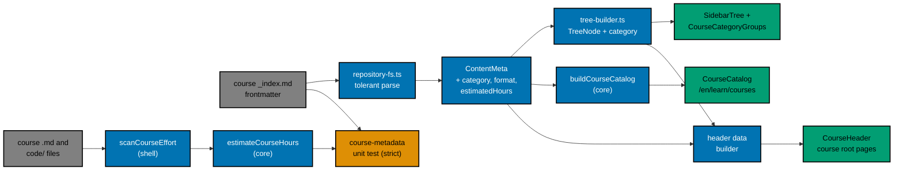

# 001 — Architecture and Data Flow

## Where Things Live Today

`apps/ayokoding-www` is a Next.js 16 App Router app with tRPC v11. It deploys as **one** container
(see `specs/apps/ayokoding/www/architecture.md`). Content is the repository's own Markdown tree under
`apps/ayokoding-www/content/`, read at build time.

| Piece              | File                                                                                | What it does today                                                                                                                   |
| ------------------ | ----------------------------------------------------------------------------------- | ------------------------------------------------------------------------------------------------------------------------------------ |
| Frontmatter schema | `src/features/content/core/schemas.ts`                                              | `frontmatterSchema` (Zod 4.3.6). A page whose frontmatter fails `safeParse` is **skipped silently**.                                 |
| Page metadata type | `src/features/content/core/types.ts`                                                | `ContentMeta`, `TreeNode`, `ContentIndex`.                                                                                           |
| File reader        | `src/features/content/shell/repository-fs.ts`                                       | Reads every `.md`, parses frontmatter with gray-matter, maps it into `ContentMeta`.                                                  |
| Tree builder       | `src/features/content/core/tree-builder.ts`                                         | `buildTreeForLocale` turns `ContentMeta[]` into `TreeNode[]`; creates weight-0 "synthetic" sections for folders without `_index.md`. |
| Content service    | `src/features/content/shell/service.ts`                                             | `getIndex`, `getBySlug`, `getTree`, `listChildren`; backs the tRPC `content.*` procedures.                                           |
| Tree API schema    | `src/features/navigation/core/schemas.ts`                                           | `treeNodeSchema` (lazy Zod) for `content.getTree` output.                                                                            |
| Index generator    | `src/features/content/shell/index-generator.ts` + `src/scripts/generate-indexes.ts` | Rewrites each section `_index.md` body with a two-level child list; keeps frontmatter as raw text.                                   |
| Content route      | `src/app/[locale]/(content)/[...slug]/page.tsx`                                     | Dispatches `learn/paths/**` to path renderers; otherwise renders `CoursePageContent`.                                                |
| Course page body   | `src/features/course-paths/shell/course-page-content.tsx`                           | Breadcrumb, `h1`, `PathBanner`, Markdown, `PrerequisiteList`, `PathCourseLinks`, date, `PrevNext`, TOC.                              |
| Path data loader   | `src/features/course-paths/shell/route-path-data.ts`                                | `loadRoutePathData(locale)` (React `cache`): content map, manifests, prerequisites, library ids.                                     |
| Sidebar            | `src/features/navigation/shell/sidebar.tsx`, `sidebar-tree.tsx`                     | Server `Sidebar` calls `getTree`; client `SidebarTree` renders recursive `SidebarNode`s with chevron buttons.                        |
| Mobile drawer      | `src/features/app-shell/shell/mobile-nav.tsx`                                       | Fetches `getTree` on the client and renders `SidebarTree` (or the path rail when a path is active).                                  |

The words **core** and **shell** follow the app's functional-core / imperative-shell layout: `core/`
holds pure functions with no input/output; `shell/` reads files, calls tRPC, or renders.

## What Changes

### Before and after, by screen

| Screen                       | Before                                                                                       | After                                                                                                                                    |
| ---------------------------- | -------------------------------------------------------------------------------------------- | ---------------------------------------------------------------------------------------------------------------------------------------- |
| `/en/learn/courses`          | `CoursePageContent` renders the generated 693-link Markdown body of `courses/_index.md`.     | `page.tsx` sees `slugStr === "learn/courses"` and renders `CourseCatalog`; the `_index.md` body is empty.                                |
| `/en/learn/courses/<course>` | Title, generated page list, then "Prerequisites" and "This course is part of" at the bottom. | Title, `CourseHeader` (description, meta row, Start, prerequisites, paths), "Course contents" heading, generated list; nothing repeated. |
| Pages inside a course        | Unchanged.                                                                                   | Unchanged (no header).                                                                                                                   |
| Sidebar and drawer           | "Courses" opens into 181 rows.                                                               | "Courses" opens into 14 category groups; the group with the current page is open.                                                        |

### Where the new code goes

| New or changed unit                                                 | Layer               | File                                                             |
| ------------------------------------------------------------------- | ------------------- | ---------------------------------------------------------------- |
| `COURSE_CATEGORIES`, `courseCategoryLabel`, `groupByCourseCategory` | core                | `src/features/content/core/course-categories.ts` (new)           |
| `COURSE_FORMATS`, `courseMetadataSchema`, `checkCourseMetadata`     | core                | `src/features/content/core/course-metadata.ts` (new)             |
| `estimateCourseHours`                                               | core                | `src/features/content/core/course-effort.ts` (new)               |
| `scanCourseEffort`                                                  | shell (reads files) | `src/features/content/shell/course-effort-scan.ts` (new)         |
| `resolveCourseStartSlug`                                            | core                | `src/features/content/core/course-start.ts` (new)                |
| `courseRootIdFromSlug`                                              | shell helper        | `src/features/course-paths/shell/course-path-nav.ts` (edit)      |
| `buildCourseCatalog`                                                | core                | `src/features/course-paths/core/course-catalog.ts` (new)         |
| `CourseCatalog`, `CourseCard`, `CategoryJumpLinks`                  | shell (render)      | `src/features/course-paths/shell/course-catalog.tsx` (new)       |
| `buildCourseHeaderData`                                             | shell (reads tree)  | `src/features/course-paths/shell/course-header-data.ts` (new)    |
| `CourseHeader`, `CourseMetaRow`, `StartCourseButton`                | shell (render)      | `src/features/course-paths/shell/course-header.tsx` (new)        |
| `CourseCategoryGroups`                                              | shell (client)      | `src/features/navigation/shell/course-category-groups.tsx` (new) |

The catalog and header live in the existing `course-paths` feature because it already owns the course
library (`course-library.ts`) and the course page body. Metadata, categories, and the estimate live in
`content/core` because they describe content, and both the sidebar (`navigation`) and the catalog
(`course-paths`) consume them. No new bounded context is created.

## Request and Build Flow

1. `next build` runs `generate-indexes` first (Nx `dependsOn`). With this plan the generator leaves
   `content/en/learn/courses/_index.md` as frontmatter only.
2. `generateStaticParams` in `page.tsx` enumerates every content slug, including `learn/courses` and
   every course root, exactly as today.
3. For `learn/courses`, `ContentPage` calls `loadRoutePathData(locale)` (already cached per request)
   and passes `contentMap` and `manifests` to `buildCourseCatalog`. The page also calls
   `serverCaller.content.getBySlug` for the `title` and `description` used as the intro and SEO
   metadata.
4. For a course root (`learn/courses/<id>` with no further `/`), `ContentPage` calls
   `buildCourseHeaderData(pathData.contentMap, tree, courseId, locale)`. The tree comes from
   `serverCaller.content.getTree({ locale })`. The result is plain serializable data, passed to both
   `CoursePageContent` and `CoursePagePathContent` (a client component), so the header renders the
   same with or without a `?path=` context.
5. The sidebar (server) and the mobile drawer (client) both receive `TreeNode`s that now carry
   `category` on course nodes, and both render through `SidebarTree`.

## Things That Do Not Change

- URLs. No route is added or removed; `/en/learn/courses` keeps its URL.
- `content.getTree` shape, apart from one optional field.
- Path landing pages, the path rail, `PathBanner`, `PrevNext`, and the breadcrumb.
- `content/id/**`. The `id` locale has no `learn/` section, so `/id/` pages show no Courses section.
