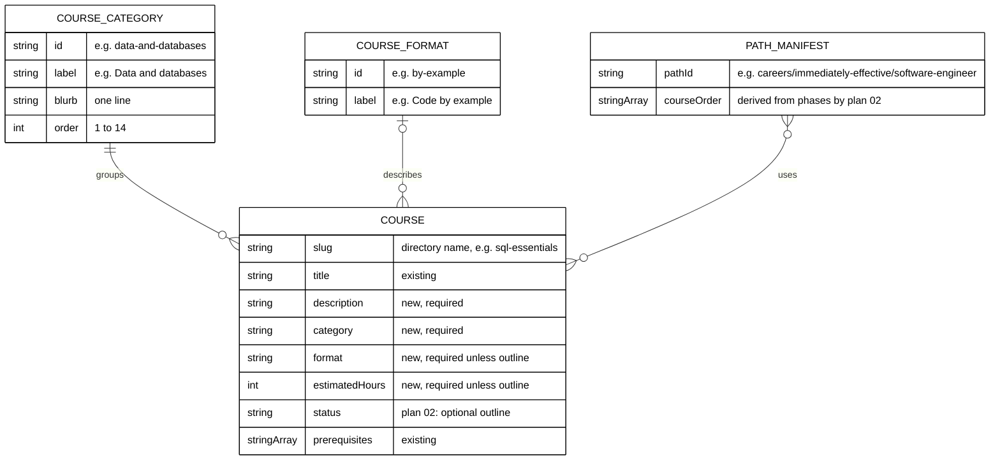

# 002 — Metadata Schema and Migration

## Data Model

The metadata lives in each course's `_index.md` frontmatter. Categories and formats are code
constants, not files.



## Field Guide

An example course `_index.md` after this plan (frontmatter only; the generated body is unchanged):

```yaml
---
title: "SQL Essentials"
date: 2026-07-14T00:00:00+07:00
draft: false
weight: 200
prerequisites: ["just-enough-python"]
category: data-and-databases
description: "Model data in tables and query it with joins, filters, and aggregates."
format: by-example
estimatedHours: 8
---
```

An outline course (plan 02 adds `status`):

```yaml
---
title: "Accounting Foundations"
date: ...
draft: false
weight: ...
prerequisites: [...]
status: outline
category: accounting
description: "Learn the accounting equation, double entry, and why every entry needs evidence."
---
```

| Field            | Required                 | Allowed values                                                                                                                                     | Shown where                                          |
| ---------------- | ------------------------ | -------------------------------------------------------------------------------------------------------------------------------------------------- | ---------------------------------------------------- |
| `category`       | Every course             | One of the 14 ids in [003](./003-category-taxonomy-and-course-mapping.md#the-14-categories).                                                       | Catalog section; sidebar group; header meta row.     |
| `description`    | Every course             | One sentence; 20–120 characters; ends with `.`; no line break; no `·`; exactly one sentence end (`.`, `!`, or `?` followed by a space or the end). | Card; header; the page's SEO `description` meta tag. |
| `format`         | Unless `status: outline` | `by-example`, `primer`, `annotated-concept`, `annotated-concept-no-code`, `in-the-field`, `capstone`.                                              | Card and header meta row, as a translated label.     |
| `estimatedHours` | Unless `status: outline` | Integer 1–200, equal to `estimateCourseHours` for the course's current files ([004](./004-estimated-hours-and-start-target.md)).                   | Card and header, as "About N h".                     |
| `status`         | Plan 02's rules          | `outline` or absent. Not changed here.                                                                                                             | Outline badge on the card and in the header.         |

Write new keys **after** `prerequisites` (and after `status` when present), in the order shown, so
diffs are easy to review. Quote `description` with double quotes; it may contain a colon or a
semicolon.

## Schemas

### Tolerant runtime schema (`src/features/content/core/schemas.ts`)

The runtime parse must never drop a page because of a metadata typo (today any `safeParse` failure
skips the page silently in `repository-fs.ts`). The three new keys therefore use Zod's `.catch`,
which replaces an invalid value with `undefined` instead of failing the whole object:

```ts
// added inside frontmatterSchema = z.object({ ... })
category: z.string().optional().catch(undefined),
format: z.string().optional().catch(undefined),
estimatedHours: z.number().optional().catch(undefined),
```

`description` already exists as `z.string().optional()` and does not change.

### Types (`src/features/content/core/types.ts`)

```ts
export interface ContentMeta {
  // ...existing fields
  category?: string;
  format?: string;
  estimatedHours?: number;
}

export interface TreeNode {
  // ...existing fields
  category?: string; // set only on nodes whose ContentMeta has a category
}
```

`repository-fs.ts` maps the three fields from the parsed frontmatter, the same way it maps
`prerequisites` (and plan 02's `status`). `buildTreeForLocale` copies `category` onto the node only
when it is defined, so existing `toEqual` snapshots of category-less trees stay equal.
`navigation/core/schemas.ts` adds `category: z.string().optional()` to `treeNodeSchema`; without it
the tRPC output would drop the field.

### Strict course schema (`src/features/content/core/course-metadata.ts`, new)

```ts
import { z } from "zod";
import { frontmatterSchema } from "./schemas";
import { COURSE_CATEGORY_IDS } from "./course-categories";

export const COURSE_FORMATS = [
  "by-example",
  "primer",
  "annotated-concept",
  "annotated-concept-no-code",
  "in-the-field",
  "capstone",
] as const;
export type CourseFormat = (typeof COURSE_FORMATS)[number];

const ONE_SENTENCE = /^[^\n·]*[.!?]$/;

export const courseMetadataSchema = z
  .object({
    category: z.enum(COURSE_CATEGORY_IDS),
    description: z
      .string()
      .min(20)
      .max(120)
      .regex(ONE_SENTENCE, "one line, no '·', ends with . ! or ?")
      .refine((text) => (text.match(/[.!?](\s|$)/g) ?? []).length === 1, "exactly one sentence"),
    format: z.enum(COURSE_FORMATS).optional(),
    estimatedHours: z.number().int().min(1).max(200).optional(),
    status: frontmatterSchema.shape.status, // reused from plan 02, never redefined here
  })
  .superRefine((value, ctx) => {
    if (value.status === "outline") return;
    if (value.format === undefined) {
      ctx.addIssue({ code: "custom", path: ["format"], message: "required unless status is outline" });
    }
    if (value.estimatedHours === undefined) {
      ctx.addIssue({ code: "custom", path: ["estimatedHours"], message: "required unless status is outline" });
    }
  });

export interface CourseMetadataIssue {
  courseId: string;
  field: string;
  message: string;
}

/** Pure: validates one course's raw frontmatter object and returns every issue, never throws. */
export function checkCourseMetadata(courseId: string, frontmatter: Record<string, unknown>): CourseMetadataIssue[];
```

`checkCourseMetadata` runs `courseMetadataSchema.safeParse(frontmatter)` and maps each Zod issue to
`{ courseId, field: issue.path.join("."), message: issue.message }`. Tests format the list as one
line per issue: `<courseId>: <field>: <message>`.

## Compatibility

| Consumer                                  | Before                         | After               | Compatible?                                                                  |
| ----------------------------------------- | ------------------------------ | ------------------- | ---------------------------------------------------------------------------- |
| Old code reading new frontmatter          | `z.object` strips unknown keys | New keys present    | Yes: an old build ignores them (this is why a code-only rollback is safe).   |
| New code reading old frontmatter          | —                              | Keys absent         | Yes: all three are optional at runtime; the catalog uses "Other courses".    |
| tRPC `content.getTree`                    | `TreeNode` without `category`  | Optional `category` | Yes (additive optional field).                                               |
| tRPC `content.getBySlug`                  | `description` already returned | Same                | Yes (no shape change).                                                       |
| `content/en/learn/courses/_index.md` body | 693 generated links            | Empty               | Yes: the route renders the catalog; old links in other pages are unaffected. |

## Migration: Expand, Migrate, Verify, Contract

All four steps land in the one PR, in this order of commits (see [delivery.md](../delivery.md)).

1. **Expand.** Add the tolerant runtime fields, the types, the tree mapping, the tRPC schema field,
   and the strict `courseMetadataSchema` with synthetic unit tests. No content changes. Every
   existing test stays green.
2. **Migrate.** Backfill the 181 course `_index.md` files from the tables in
   [003](./003-category-taxonomy-and-course-mapping.md): `category` and `description` for all;
   `format` and `estimatedHours` for every course without `status: outline`. Take `estimatedHours`
   from the drift test's printed table at execution time, not from the 2026-10-09 snapshot, because
   plan 01 and plan 02 change course files before this plan runs.
3. **Verify.** The real-corpus guard (the scenario "Every course in the library carries valid
   metadata", bound in `tests/unit/be-steps/course-metadata.steps.ts`) passes: zero
   metadata issues, zero estimate drift, and a Start page for every course. Record the counts in
   the plan's `evidence/phase-4-reconciliation.md` (see Reconciliation).
4. **Contract.** The real-corpus test stays in `test:unit` (and so in `test:quick` and CI) as the
   permanent guard. There is no old field to remove: the change is purely additive.

## Rollback

- **Whole plan:** revert the merge commit. Content and code return together.
- **Code only** (for example, if the catalog page breaks in production): revert the code commits and
  keep the frontmatter. The old schema strips the new keys, so every page still parses; the courses
  page shows the old generated list after `generate-indexes` runs again in `dev` or `build`.
- **Content only** is not a valid partial rollback: the corpus test would fail. Revert both.

## Reconciliation

Run in Phase 4 and record the output in the evidence folder:

| Check                                                                         | Expected                                                                             |
| ----------------------------------------------------------------------------- | ------------------------------------------------------------------------------------ |
| Course directories                                                            | 181                                                                                  |
| Courses with `category`                                                       | 181                                                                                  |
| Courses with `description`                                                    | 181                                                                                  |
| Courses with `status: outline` (plan 02)                                      | 62 (the set in [003](./003-category-taxonomy-and-course-mapping.md))                 |
| Courses without `status: outline` that have `format` and `estimatedHours`     | 119                                                                                  |
| Courses per category                                                          | The counts in [003](./003-category-taxonomy-and-course-mapping.md#the-14-categories) |
| Catalog cards rendered at `/en/learn/courses` (dev server)                    | 181                                                                                  |
| Links to `/en/learn/courses/<course>/...` sub-pages inside the catalog `main` | 0                                                                                    |

If the outline set at execution differs from the 62 listed in 003, stop and report: plan 02's outline
rule is "under 1,000 words", the same rule used here, so a difference means one plan's measurement is
wrong.

## Coordination With Plan 02

- Plan 02 adds `status: z.enum(["outline"]).optional()` to `frontmatterSchema`, `status?: "outline"`
  to `ContentMeta`, the mapping in `repository-fs.ts`, `OutlineBadge`, and the `pathsOutlineBadge`
  key. This plan reuses all five and changes none.
- Plan 02's tech-docs say "Plan 03 ... may widen `status`". This plan does **not** widen it.
- Plan 02's README says plans 02 and 03 may land in either order. This plan requires plan 02 first
  (decision [D1](./007-decision-records.md#d1--order-against-plan-02)); Phase 0 checks it.
