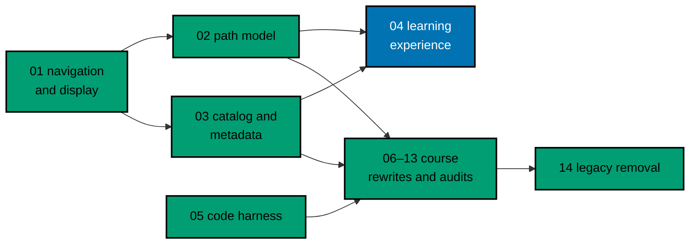

# AyoKoding Learn Revamp 04 — Learning Experience

> **Status:** Backlog. Do not execute until the user gives an explicit execution command. This plan
> depends on plans 02 (`path-model`) and 03 (`catalog-and-metadata`); both must be merged on
> `origin/main` before Phase 1 starts.

AyoKoding Learn today reads like "a pile of documents". This plan turns it into a learning path a
reader can follow and come back to. The user asked for this on 2026-10-09:

> "tampilan uinya, kayaknya juga oke kalo mau dirubah, biar gak kayak cuman 'kumpulan dokumen', tapi
> emang 'learning path'"
>
> (The UI may change, so it no longer feels like a pile of documents but like a real learning path.)

The plan adds browser-only progress, a phase roadmap on every path page, a context bar and a
"Mark complete & continue" flow inside courses, a redesigned Learn home at `/en/learn`, path cards
with progress on the path hubs, and progress on the course landing header from plan 03.

## Scope

- **Progress store.** A versioned `localStorage` record of completed learning pages. Course, phase,
  and path progress are derived from it. Progress is keyed by course and page, so a course shared by
  several paths shows the same progress everywhere. Every read and write is guarded, so the site works
  when storage is blocked. Rendering is client-only after hydration, with no hydration mismatch and no
  layout shift. A "Reset progress" control clears it. Nothing is sent to any server.
- **Path page as a phase roadmap.** It replaces the plain list. Each core phase is a milestone with
  its outcome, a progress bar, "x of y done", and course cards (position number, title, estimated
  time, format, status in words, "Outline" badge). Optional extension phases sit below, closed by
  default. One primary button at the top: "Start: …" or "Continue: …".
- **Lesson pages.** A thin context bar (path › phase › course k of N, page p of P, pages done) and a
  bottom action row: "Previous", a "Mark as complete" toggle that can be un-checked, and
  "Mark complete & continue". On a course's last page, continue goes to the next course in the path.
  Completion happens only when the reader clicks.
- **Learn home `/en/learn`.** A landing page instead of a generated list of about 180 links: a short
  intro (the useful text from today's Overview page), a "Continue learning" card, career and skills
  path cards, and a "Browse all courses" card. The Overview page is removed and its URL redirects
  (308) to `/en/learn`.
- **Path cards with progress** on `/en/learn/paths`, `/en/learn/paths/careers`, each careers arc
  page, and `/en/learn/paths/skills`.
- **Course landing header** (built by plan 03) shows course progress; "Start course" becomes
  "Continue course: …" and then "Review course".
- **Accessibility.** Status in words and icons, never color alone; keyboard operable; status changes
  announced; reduced motion respected; works at 375 px; axe WCAG 2 A/AA scans pass.

## Non-Goals

- Accounts, login, server-side or cross-device sync, analytics on progress, export or import.
- Any change to the manifest schema or course metadata (plans 02 and 03 own them).
- Restructuring the four skills paths, their copy, or the skills hub statement (plans 06 and 07, per
  decision 39).
- The site home hero (`/en`), the legacy bucket, and its removal (plan 14 drops the "Legacy" line on
  the Learn home).
- The path rail on inner lesson pages, and the course content itself.
- Indonesian learning content: `content/id/**` has no courses or paths, so these screens exist only
  under `/en`. New interface strings still get Indonesian translations.

## Series Context

This is plan 04 of the 14-plan AyoKoding Learn Revamp series. One plan is one PR with its own
worktree. Every decision this plan relies on is restated in
[tech-docs/001](./tech-docs/001-current-state-and-architecture.md#series-decisions-this-plan-implements),
so the plan does not depend on any scratch file.

## Approach Summary

1. Phase 0 provisions the execution worktree
   `worktrees/ayokoding-learn-revamp-04-learning-experience/`, records a green baseline, and checks
   that every contract this plan consumes from plans 02 and 03 exists on `main` as described.
2. Pure core first (Gherkin first, then RED, GREEN, REFACTOR): the progress schema and store, the
   course page order ("lesson sequence"), progress derivations, and the next-step rule.
3. Client wiring: one `useSyncExternalStore` hook, then the lesson pages, the roadmap, the course
   header, the Learn home and path cards, and the Overview redirect.
4. Accessibility and layout-shift hardening, rule-impact classification, docs propagation.
5. Manual Playwright verification at 375, 768, and 1280 px, the UI quality gate and the three-tester
   retest, then local gates, one PR, Knowledge Capture, archival, merge, deploy check, and cleanup.

## Navigation

- [Business requirements](./brd.md)
- [Product requirements, Gherkin, and UI design funnel](./prd.md)
- [Technical design](./tech-docs/README.md)
- [Delivery checklist](./delivery.md)
- [Execution learnings](./learnings.md)

## Follow-Ups Reported, Not Done Here

- The path rail (desktop sidebar and phone drawer) still appears only on course landing pages, not on
  inner lesson pages. The context bar covers orientation there.
- `.agents/skills/apps-ayokoding-www-developing-content/reference/canonical-content-tree-shape.md`
  says a direct `.md` page is required for Next.js to render a folder; `courses/` and `paths/` already
  render without one, and after this plan the `learn/` root does too. The claim is stale.
- Progress cannot move between browsers. If readers ask for it, a later plan can add export and
  import (decision 38a puts it out of scope here).
