# Delivery Plan — AyoKoding Learn Revamp 04: Learning Experience

> **Legend** — `[AI]`: an agent performs the step (the default; unmarked steps are `[AI]`).
> `[HUMAN]`: only a human can do it (physical action, out-of-band approval, real-secret or
> privileged-credential handling). `[AI+HUMAN]`: agent prepares, human approves or finishes.

**Do not start** until the user gives an explicit execution command for this plan. The user said on
2026-10-09: "jangan kerjain/implement plan ini sebelum gw kasih perintah buat eksekusi ya" (do not
work on or implement this plan until I give the command to execute it). That command is

> the authorization for this plan's change set (commits, pushes, PR, merge, and deploy described
> below).

**Dependencies:** plans `ayokoding-learn-revamp-02-path-model` and
`ayokoding-learn-revamp-03-catalog-and-metadata` must both be merged and archived on `origin/main`
before Phase 1 starts. Phase 0 checks this and every contract this plan consumes from them.

## Worktree

- **Execution worktree:** `worktrees/ayokoding-learn-revamp-04-learning-experience/`
- **Provisioning status:** pending
- **Authoring-worktree exception:** this plan was authored inside the separate authoring worktree
  `.claude/worktrees/ayokoding-update` (branch `worktree-ayokoding-update`), which the user required
  for writing all plans of the AyoKoding Learn Revamp series together. That authoring worktree is
  removed after the plan-docs PR merges and is **never** used for execution. The Provisioned Worktree
  Identity and Delivery Branch Inventory are intentionally omitted until Step 0 below creates them.
- **Step 0 obligation (blocking):** the plan-execution Step 0 gate provisions the execution worktree
  from fresh `origin/main` with
  `rtk git worktree add -b ayokoding-learn-revamp-04-learning-experience-base worktrees/ayokoding-learn-revamp-04-learning-experience origin/main`,
  initializes it per
  [Worktree Toolchain Initialization](../../../repo-governance/development/workflow/worktree-setup.md),
  writes the immutable identity and the first inventory row into this section, replaces
  `Provisioning status: pending` with `Provisioning status: provisioned` in the same plan update, and
  syncs with `origin/main` before any delivery packet starts.
- **Cleanup:** after the PR merges, the worktree and its branches come down through
  [Dev Artifact Clean-Up](../../../repo-governance/workflows/maintenance/dev-artifact-clean-up.md)
  (see Plan Archival).
- **Worktree cap:** one worktree for this plan in this repository, reused by every phase.

## Delivery Mode: worktree-to-pr

`worktree-to-pr` is mandatory in this repository. One branch and **one PR** deliver the whole plan
(decision D15 in [tech-docs/007](./tech-docs/007-decision-records.md)). The PR needs the exact
current-head/base `Quality gate` from `.github/workflows/pr-quality-gate.yml` and an exact-head posted
`pr-leak-review` `pass` (`leak-review` status). Broad semantic PR review is not run unless the user
asks for it. `[AI]` merges once the hardened merge preconditions hold.

### Delivery Unit

| Unit  | Phases                                       | Safe `main` state after merge                                                                                                                                              | Rollback                               |
| ----- | -------------------------------------------- | -------------------------------------------------------------------------------------------------------------------------------------------------------------------------- | -------------------------------------- |
| DU-01 | 1–12 and Plan Archival (Phase 0 opens no PR) | Browser progress, path roadmap, lesson context bar and action row, course header progress, Learn home, path cards on hubs, `/en/learn/overview` → 308, all scenarios green | Revert the merge commit in a revert PR |

Every screen is complete the moment it lands, so no feature flag is needed. The phases are natural
pauses inside the one branch; no phase is merged on its own. A revert leaves any saved progress record
in readers' browsers unused and harmless
([tech-docs/002 Rollback](./tech-docs/002-progress-store-schema-and-migration.md#rollback)).

### Before Phase 0: Promotion

- [ ] [AI] Promote the plan per
      [Starting and Completing Work](../../../repo-governance/conventions/structure/plans/starting-and-completing-work.md):
      a pure move of `plans/backlog/ayokoding-learn-revamp-04-learning-experience/` to
      `plans/in-progress/ayokoding-learn-revamp-04-learning-experience/` plus the
      `plans/backlog/README.md` and `plans/in-progress/README.md` index updates, landed on
      `origin/main` through its own PR. Acceptance:
      `rtk git ls-tree -r --name-only origin/main plans/in-progress/ayokoding-learn-revamp-04-learning-experience/`
      lists this plan's files. This promotion PR is separate from DU-01.

### Execution Packet Defaults

- **Plan path after promotion:** `plans/in-progress/ayokoding-learn-revamp-04-learning-experience/`
  (written below as `<plan>/`). Evidence goes to `<plan>/evidence/`.
- **Scratch:** one-time scripts, dry-run reports, and the execution ledger live in the execution
  worktree's `local-tmp/ayokoding-learn/plan-04/` (gitignored). Record agent IDs, file ownership, and
  review cycle counts in `local-tmp/ayokoding-learn/plan-04/execution-ledger.md`.
- **Evidence hygiene:** evidence files contain repository-relative paths only. Never paste an
  absolute home-directory path, a hostname, a token, or `.env*` content (the PR leak review treats
  machine-specific values as leaks).
- **Never commit** `apps/ayokoding-www/next-env.d.ts` (the dev server rewrites it) or
  `.serena/project.yml`. Before every commit run `rtk git status --short` and restore either file with
  `rtk git checkout -- <file>` if it shows as modified.
- **Never touch** `.env.prod` or `.env.stag`. If the dev server needs a variable, copy the key from
  `apps/ayokoding-www/.env.example` into an uncommitted `apps/ayokoding-www/.env.local`. No agent sets
  or changes git identity.
- **Bounded loops:** every maker→checker or quality-gate loop in this plan runs at most **2 cycles**.
  A finding still open after cycle 2 is recorded as `BLOCKED` in the execution ledger with its
  findings, reported to the user, and the phase gate stays open until the user decides.
- **Failure handling:** on any unexpected failure, save the output to the phase evidence file, fix
  the root cause (never skip, retry-until-green, sleep, widen a timeout, loosen an assertion, or
  delete a test), rerun the same command, and note the fix.
- **Scenario titles:** the `S<n>` and `U<n>` prefixes in [prd.md](./prd.md#acceptance-criteria-gherkin)
  are plan-local IDs. Feature files use the scenario title without the prefix, each preceded by the
  standard `# Exemption(integration): … alternative-proof: ayokoding-www-fe-e2e:test:e2e / <title>`
  comment and the `@integration-exempt` tag.

> **Important**: Fix ALL failures found during quality gates, not just those caused by your
> changes. This follows the root cause orientation principle — proactively fix preexisting
> errors encountered during work.

### Command Reference

Run every command from the execution worktree root. Expected results are stated at each use.

| Name               | Command                                                                                                                                        |
| ------------------ | ---------------------------------------------------------------------------------------------------------------------------------------------- |
| `UNIT-FE <file>`   | `rtk ./hippo run --class ephemeral --resource-tier standard --disk-path . --cwd apps/ayokoding-www -- npx vitest run --project unit-fe <file>` |
| `UNIT-NODE <file>` | `rtk ./hippo run --class ephemeral --resource-tier standard --disk-path . --cwd apps/ayokoding-www -- npx vitest run --project unit <file>`    |
| `QUICK`            | `rtk ./hippo run --class ephemeral --resource-tier standard --disk-path . -- npm exec nx -- run ayokoding-www:test:quick`                      |
| `BEHAVIOUR`        | `rtk ./hippo run --class ephemeral --resource-tier standard --disk-path . -- npm exec nx -- run ayokoding-www:test:coverage:behaviour`         |
| `E2E-QUICK`        | `rtk ./hippo run --class ephemeral --resource-tier standard --disk-path . -- npm exec nx -- run ayokoding-www-fe-e2e:test:quick`               |
| `E2E`              | `rtk ./hippo run --class ephemeral --resource-tier heavy --disk-path . -- npm exec nx -- run ayokoding-www-fe-e2e:test:e2e`                    |
| `INTEGRATION`      | `rtk ./hippo run --class ephemeral --resource-tier heavy --disk-path . -- npm exec nx -- run ayokoding-www:test:integration`                   |
| `BUILD`            | `rtk ./hippo run --class ephemeral --resource-tier heavy --disk-path . -- npm exec nx -- run ayokoding-www:build`                              |
| `START`            | `rtk ./hippo run --class service --resource-tier standard --disk-path . -- npm exec nx -- run ayokoding-www:start`                             |
| `GEN-INDEXES`      | `rtk ./hippo run --class transactional --resource-tier standard --disk-path . -- npm exec nx -- run ayokoding-www:generate-indexes`            |
| `VALIDATE-INDEXES` | `rtk ./hippo run --class ephemeral --resource-tier standard --disk-path . -- npm exec nx -- run ayokoding-www:validate-indexes`                |
| `DEV`              | `rtk ./hippo run --class service --resource-tier standard --disk-path . -- npm exec nx -- dev ayokoding-www` (serves `http://localhost:3101`)  |
| `LINT-MD`          | `rtk npm run lint:md`                                                                                                                          |

- `QUICK` runs typecheck, lint, unit tests, and `test:coverage` (line coverage at 99% and behaviour
  coverage). A feature file scenario without its Unit and E2E bindings makes it fail, which is the
  expected RED after each Gherkin step.
- `E2E` builds the app with the fixture manifests in `apps/ayokoding-www-fe-e2e/fixtures/manifests/`
  (`AYOKODING_WEB_MANIFESTS_DIR=fixtures/manifests`), then runs every scenario in Chromium, Firefox,
  and WebKit; expect it to take a long time. Read the list reporter output for the scenario titles.
  While iterating on one feature, pass `-- --grep "<scenario title>"` and still run the full `E2E` at
  each gate.
- `INTEGRATION` depends on `build` and is needed only where U6 edits an integration step.

### Agent Topology

The root coordinator owns the file ledger, integration, and every gate. Code phases 1–8 run one at a
time, because they share `page.tsx`, `translations.ts`, and the course-paths components; each is
delegated to `swe-developer`, and Gherkin edits go to `specs-maker` (followed by `specs-checker`, at
most 2 cycles). No phase fans out, so at most one background agent works at a time (well under N=3).
Phase 9 uses `rules-checker` and `docs-fixer`. Phase 10 runs `swe-web-tester` (exploratory and design
charters) and `swe-usability-tester` one after another against one dev server.

```mermaid
%% Color Palette: Blue #0173B2, Orange #DE8F05, Teal #029E73, Purple #CC78BC
flowchart TD
  accTitle: Plan 04 execution order
  accDescr: Phase 0 baseline and contract check, then the pure core, the store and hook, lesson pages, the roadmap, the course header, the Learn home, the path hubs, and accessibility in sequence. Rule impact and docs, manual verification with testers, PR gates, knowledge capture, and archival follow.
  P0["Phase 0 baseline<br/>+ contracts"] --> P1["1 pure core"]
  P1 --> P2["2 store + hook<br/>+ primitives"]
  P2 --> P3["3 lesson pages"]
  P3 --> P4["4 path roadmap"]
  P4 --> P5["5 course header"]
  P5 --> P6["6 Learn home<br/>+ redirect"]
  P6 --> P7["7 path hubs"]
  P7 --> P8["8 accessibility<br/>+ no layout shift"]
  P8 --> P9["9 rule impact<br/>+ docs"]
  P9 --> P10["10 manual +<br/>testers"]
  P10 --> P11["11 gates + PR"]
  P11 --> P12["12 knowledge"]
  P12 --> PA["archival, merge,<br/>deploy, cleanup"]

  classDef serial fill:#0173B2,stroke:#000000,color:#FFFFFF,stroke-width:2px
  classDef gate fill:#029E73,stroke:#000000,color:#000000,stroke-width:2px
  class P0,P1,P2,P3,P4,P5,P6,P7,P8 serial
  class P9,P10,P11,P12,PA gate
  classDef default fill:#FFFFFF,stroke:#000000,color:#000000
```

### Commit Guidelines

- [ ] Do not stage or commit until the user's execution command has authorized this plan's change
      set; do not extend a commit beyond it.
- [ ] Use the fewest build-valid, independently reviewable and revertible commits, one coherent
      purpose each (suggested: one per phase 1–9, plus evidence and archival commits).
- [ ] Follow Conventional Commits: `<type>(<scope>): <description>`, imperative, no period (for
      example `feat(ayokoding-www): add browser learning progress store`).
- [ ] Keep each change with its tests, specs, regenerated indexes, and docs in the same commit; stage
      explicit paths only, never `git add -A`.

---

## Phase 0: Worktree, Environment, Baseline, and Contract Check

Phase 0 opens no PR. Its evidence rides the DU-01 PR.

- **Input:** the promotion on `origin/main`; this plan at `<plan>/`; plans 02 and 03 merged.
- **Outcome:** a provisioned, initialized worktree; a recorded green baseline; every contract from
  plans 01–03 confirmed under its merged name; the inventories later phases rely on.
- **Proof:** `<plan>/evidence/phase-0-baseline.md`, `<plan>/evidence/phase-0-contracts.md`, and
  `<plan>/evidence/phase-0-inventory.md`.

- [ ] [AI] **Plan quality gate (deferred from authoring):** run the `plan-quality-gate` workflow on this
      plan with `max-cycles` 2 before any other step below. It was deliberately not run when this plan was
      written, to keep token use even (user decision, 2026-10-09). Acceptance: verdict `PASS` or
      `PASS_WITH_FINDINGS`; record the line `plan-quality-gate: <verdict> (<n> cycles, <k> open)` in this
      file's header section. If the plan is still in `plans/backlog/`, run the gate before the promotion PR.
      A `BLOCKED` verdict stops execution and is reported to the user.
- [ ] [AI] Confirm both dependencies are archived:
      `rtk git fetch origin` then `rtk git ls-tree --name-only origin/main plans/done/`. Acceptance: the
      output contains one entry ending in `__ayokoding-learn-revamp-02-path-model` and one ending in
      `__ayokoding-learn-revamp-03-catalog-and-metadata`. If either is missing, stop and tell the user
      which plan is not merged.
- [ ] [AI] Run the plan-execution Step 0 gate described in [## Worktree](#worktree): provision
      `worktrees/ayokoding-learn-revamp-04-learning-experience/` from fresh `origin/main`, record the
      Provisioned Worktree Identity and the first Delivery Branch Inventory row in this file, and set
      `Provisioning status: provisioned`. Acceptance: `rtk git worktree list --porcelain` shows the
      worktree on branch `ayokoding-learn-revamp-04-learning-experience-base`.
- [ ] [AI] From the worktree root, run
      `rtk ./hippo run --class transactional --resource-tier standard --disk-path . -- npm install`.
      Acceptance: exit 0 and Husky hooks installed (`.husky/_` exists).
- [ ] [AI] Run `rtk npm run doctor`. Acceptance: exit 0. Only if it reports a missing or drifted
      toolchain, run
      `rtk ./hippo run --class transactional --resource-tier standard --disk-path . -- ./rhino toolchain provision --apply`
      and then `rtk npm run doctor` again (exit 0).
- [ ] [AI] Create the delivery branch from the synced base:
      `rtk git switch -c ayokoding-learn-revamp-04-learning-experience` and append it to the Delivery
      Branch Inventory (`worktree-to-pr`, `active`).

### Baseline

- [ ] [AI] Run `QUICK`. Acceptance: exit 0. Save the summary (exit code, test counts, line coverage) in
      `<plan>/evidence/phase-0-baseline.md`.
- [ ] [AI] Run `E2E-QUICK`. Acceptance: exit 0; save the summary in the same file.
- [ ] [AI] Run `E2E`. Acceptance: exit 0 with every scenario passing; save the pass/fail counts. If it
      fails before any change, fix the root cause first per the Failure handling rule.
- [ ] [AI] Run `VALIDATE-INDEXES`. Acceptance: exit 0 (indexes already in sync).
- [ ] [AI] Re-probe Vercel MCP availability (list the session's tools) and record only "present" or
      "absent" in the baseline file. Acceptance: recorded; no Vercel identifier is written. The plan
      uses no Vercel tool either way
      ([tech-docs/README](./tech-docs/README.md#vercel-mcp-capability)).
- [ ] [AI] Start `DEV` in the background. With Playwright MCP at 1280×800 and at 375×800, open
      `http://localhost:3101/en/learn`,
      `http://localhost:3101/en/learn/paths/careers/immediately-effective/software-engineer`,
      `http://localhost:3101/en/learn/courses/just-enough-nvim`, and
      `http://localhost:3101/en/learn/courses/just-enough-nvim/learning/beginner`. Acceptance: each
      page loads; save `<plan>/evidence/phase-0-before-<screen>-en-<bp>px.png` (`<screen>` is
      `learn-home`, `path`, `course-header`, `lesson`). If a path id differs on `main`, use the
      merged id and record it. Stop `DEV`.

### Contract Check

- [ ] [AI] For every row of
      [tech-docs/001 Contracts Consumed](./tech-docs/001-current-state-and-architecture.md#contracts-consumed-from-plans-02-and-03),
      search the merged code, for example
      `rtk git grep -n "isPendingSkillsRestructure" origin/main -- apps/ayokoding-www/src`,
      `rtk git grep -n "resolveCourseStartSlug" origin/main -- apps/ayokoding-www/src`,
      `rtk git grep -n "primaryAction" origin/main -- apps/ayokoding-www/src/features/course-paths`,
      `rtk git grep -n "outlineCourseIds" origin/main -- apps/ayokoding-www/src`, and
      `rtk git grep -n "PathPositionNumber" origin/main -- apps/ayokoding-www/src`. Record per row:
      the merged name, file, and signature in `<plan>/evidence/phase-0-contracts.md`. Acceptance:
      every row is `present` or `renamed (<new name>)`. A row that is `missing` stops execution: report
      it to the user with the search output and wait.
- [ ] [AI] Read the merged `PathManifest` type and record the exact field names for `phases`, `kind`,
      `outcome`, `goals`, `assumes`, `courseOrder`, and `restructurePendingIn`, and the closed list of
      skills path ids that `isPendingSkillsRestructure` accepts. Acceptance: recorded; any rename is
      applied to this plan's later steps by reading them under the merged name.
- [ ] [AI] Read the merged `CourseHeader` props and confirm `progress` and `primaryAction` slots exist
      and that `estimatedHours` and `format` are optional for outline courses. Acceptance: recorded.

### Inventories

- [ ] [AI] **Fixtures:** list `apps/ayokoding-www-fe-e2e/fixtures/manifests/**/*.json` and record for
      each: path id, phases with `kind` and `outcome`, course order, and whether it is pending
      restructure. Acceptance: recorded; note whether a fixture already has a core phase with an
      outcome plus an extension phase, and whether any fixture is pending restructure (this decides
      the Phase 4 fixture steps in [tech-docs/006](./tech-docs/006-testing-strategy.md#fixtures)).
- [ ] [AI] **Overview references:** `rtk git grep -n "learn/overview" -- apps specs`. Acceptance: the
      list is saved in `<plan>/evidence/phase-0-inventory.md` and compared with the U6 table in
      [tech-docs/008](./tech-docs/008-file-impact.md#steps-opening-the-removed-overview-page-u6); new
      or moved lines are recorded as the frozen U6 ledger.
- [ ] [AI] **Extension-link bindings (U5):** search the step files bound to plan 02's
      `course-paths/path-phases.feature` and other course-paths features for assertions that an
      extension course link is visible. Acceptance: each such step is listed in the inventory file.
- [ ] [AI] **Schema patterns and sequence size:** write
      `local-tmp/ayokoding-learn/plan-04/pattern-check.py` that reads every directory name under
      `apps/ayokoding-www/content/en/learn/courses/`, every Markdown page path under each course
      (without `.md`, relative to the course), and every manifest `pathId`, then tests each against the
      three regular expressions in
      [tech-docs/002 Schema](./tech-docs/002-progress-store-schema-and-migration.md#schema-srcfeatureslearning-progresscoreprogress-schemats).
      Run it with `python3 -I`. Acceptance: it prints counts and zero non-matching values. Any
      non-match is recorded and the pattern is widened in Phase 1 with a test for that value. It also
      prints the JSON byte size of all page paths per course; record it (expected well under 64 KiB).
- [ ] [AI] **Vitest include patterns:** read `apps/ayokoding-www/vitest.config.ts` and record which
      globs the `unit` and `unit-fe` projects include. Acceptance: recorded; every new test file name in
      [tech-docs/006](./tech-docs/006-testing-strategy.md#new-unit-test-files) matches a project, or
      its name is adjusted in this plan's evidence before Phase 1.

### Phase 0 Gate

> All checks below must pass before starting Phase 1.

- [ ] [AI] `rtk git status --short` shows only `<plan>/` changes (identity, inventory, evidence).
- [ ] [AI] `<plan>/evidence/phase-0-baseline.md` records exit 0 for `QUICK`, `E2E-QUICK`, `E2E`, and
      `VALIDATE-INDEXES`, plus the Vercel re-probe result.
- [ ] [AI] `<plan>/evidence/phase-0-contracts.md` has no `missing` row.
- [ ] [AI] `<plan>/evidence/phase-0-inventory.md` contains the fixture shapes, the frozen U6 ledger,
      the U5 list, the pattern check result, and the Vitest globs.

> **Pause Safety**: the worktree is provisioned and green, with no product change yet. Safe to stop.
> To resume: `rtk git -C worktrees/ayokoding-learn-revamp-04-learning-experience status --short`,
> then rerun `QUICK`.

---

## Phase 1: Pure Core

- **Input:** [tech-docs/002](./tech-docs/002-progress-store-schema-and-migration.md) (schema, pure
  operations); [tech-docs/003](./tech-docs/003-active-path-and-navigation.md) (lesson sequence, page
  location, active path rule, derivations, next-step rule); decisions D1, D2, D3, D5, D7.
- **Outcome:** seven pure modules under `apps/ayokoding-www/src/features/learning-progress/core/`,
  fully unit-tested, with no React, storage, or Next.js imports.
- **Proof:** RED and GREEN outputs in `<plan>/evidence/phase-1-core.md`.
- _Suggested executor: `swe-developer`._

- [ ] [AI] **Gherkin:** this phase has no reader-visible behaviour, so it adds no scenario. Record in
      the evidence file which later scenarios each module serves (schema and state: S1–S7; lesson
      sequence: S10, S12–S16, S33; path context: S10, S11, S17; derivations: S19, S24, S25, S35; next
      step: S21, S22, S28, S33, S34). Acceptance: the trace table is saved.
- [ ] [AI] **RED (schema and state):** create `tests/unit/features/learning-progress/progress-schema.unit.test.ts`
      and `progress-state.unit.test.ts` (under `apps/ayokoding-www/`) with every case in
      [tech-docs/006](./tech-docs/006-testing-strategy.md#new-unit-test-files). Run
      `UNIT-NODE tests/unit/features/learning-progress/progress-schema.unit.test.ts` and the same for
      `progress-state.unit.test.ts`. Acceptance: both fail with "module not found".
- [ ] [AI] **GREEN (schema and state):** create `src/features/learning-progress/core/progress-schema.ts`
      and `core/progress-state.ts` exactly as specified in tech-docs/002 (widened patterns from Phase 0,
      if any). Rerun both files. Acceptance: all cases pass.
- [ ] [AI] **RED (lesson sequence and location):** create `lesson-sequence.unit.test.ts` (synthetic
      trees) and `course-location.unit.test.ts` with the cases in tech-docs/006. Acceptance: both fail
      with "module not found".
- [ ] [AI] **GREEN (lesson sequence and location):** create `core/lesson-sequence.ts` and
      `core/course-location.ts` per [tech-docs/003](./tech-docs/003-active-path-and-navigation.md#lesson-sequence).
      Rerun both. Acceptance: all cases pass.
- [ ] [AI] **RED (corpus):** create `lesson-sequence.corpus.unit.test.ts` and
      `progress-schema.corpus.unit.test.ts`. They read the real `content/en/learn/courses/**` and the
      real manifests from `process.cwd()`, build each course tree the way plan 03's start-slug corpus
      test does, and assert: every course has a non-empty sequence whose first slug equals
      `resolveCourseStartSlug`'s result, no page path repeats, and every id matches its schema
      pattern. Run both with `UNIT-NODE`. Acceptance: they pass on the first run only if the GREEN
      code above is correct; if one fails, the failure names the course and the cause. Fix the core
      module (not the test) and record the fix.
- [ ] [AI] **RED (path context, derivations, next step):** create `lesson-path-context.unit.test.ts`,
      `progress-derivations.unit.test.ts`, and `next-step.unit.test.ts` with the cases in tech-docs/006.
      Acceptance: all three fail with "module not found".
- [ ] [AI] **GREEN (path context, derivations, next step):** create `core/lesson-path-context.ts`,
      `core/progress-derivations.ts`, and `core/next-step.ts` per tech-docs/003, importing plan 02's
      `corePhases`, `extensionPhases`, and `isPendingSkillsRestructure` under their merged names.
      Rerun the three files. Acceptance: all cases pass.
- [ ] [AI] **REFACTOR:** remove duplication between derivations and next step (one shared
      `isCourseDone` helper); confirm no file under `core/` imports `react`, `next`, or `window`
      (`rtk git grep -n "from \"react\"\|from \"next\|window\." -- apps/ayokoding-www/src/features/learning-progress/core`
      prints nothing). Run `QUICK`. Acceptance: exit 0 with line coverage at or above 99%.

### Phase 1 Gate

> All checks below must pass before starting Phase 2.

- [ ] [AI] `QUICK` exits 0; the corpus tests print the course count, page count, and skipped synthetic
      page count, saved in the evidence file.
- [ ] [AI] `rtk git status --short` lists only new files under `src/features/learning-progress/core/`,
      `tests/unit/features/learning-progress/`, and `<plan>/`.

> **Pause Safety**: pure modules exist and nothing renders them yet. Safe to stop. To resume: `QUICK`.

---

## Phase 2: Progress Store, Hook, and Shared Progress Components

- **Input:** [tech-docs/002 Guarded Storage and Hook](./tech-docs/002-progress-store-schema-and-migration.md#guarded-storage-srcfeatureslearning-progressshellprogress-storagets);
  [tech-docs/004 Shared Rules](./tech-docs/004-ui-components-and-copy.md#shared-rules) and the
  `ProgressMeter`, `CourseStatusLabel`, `ProgressPlaceholder`, and `StorageNotice` rows; the progress
  keys in [tech-docs/004 Translation Keys](./tech-docs/004-ui-components-and-copy.md#translation-keys);
  decisions D4, D14.
- **Outcome:** a guarded external store with memory fallback and cross-tab events, one
  `useLearningProgress` hook that hydrates without mismatch, the shared progress components, and the
  new translation keys in both locales.
- **Proof:** `<plan>/evidence/phase-2-store.md`.
- _Suggested executor: `swe-developer`._

- [ ] [AI] **Gherkin:** no scenario is added here; S1, S2, S4, S5, S8, and S9 bind in the phases that
      render them. Record that in the evidence file.
- [ ] [AI] **RED (store):** create `tests/unit/features/learning-progress/progress-storage.test.ts`
      (`unit-fe`, jsdom) with every case in tech-docs/006, using a fake `Storage` object whose methods
      can be set to throw. Run `UNIT-FE tests/unit/features/learning-progress/progress-storage.test.ts`.
      Acceptance: fails with "module not found".
- [ ] [AI] **GREEN (store):** create `src/features/learning-progress/shell/progress-storage.ts` with
      `createProgressStore` and the lazy `learningProgressStore`, following the seven rules in
      tech-docs/002. Rerun. Acceptance: all cases pass.
- [ ] [AI] **RED (hook):** create `use-learning-progress.test.tsx`: render a probe component with
      `renderToString`, put the HTML in a container, seed a valid record in `localStorage`, call
      `hydrateRoot`, spy on `console.error`, and assert no call mentions hydration, then assert the
      ready state renders. Acceptance: fails with "module not found".
- [ ] [AI] **GREEN (hook):** create `shell/use-learning-progress.ts`. Rerun. Acceptance: passes with no
      hydration error logged.
- [ ] [AI] **RED (components and keys):** create one test per component (`progress-meter.test.tsx`,
      `course-status-label.test.tsx`, `progress-placeholder.test.tsx`, `storage-notice.test.tsx`):
      meter width from `value / max`, `aria-hidden="true"`, empty track at `max = 0`, `motion-safe`
      transition class only; status label words and icon for all three statuses in `en` and `id`;
      placeholder is `aria-hidden`; notice shows `progressStorageUnavailable` only when `persisted` is
      false and keeps its `h-5` slot otherwise. Add a test that every key added to the `en` dictionary
      exists in `id`. Acceptance: all fail.
- [ ] [AI] **GREEN (components and keys):** create the four components under `shell/` and add the
      progress, status, and storage keys from tech-docs/004 to both dictionaries in
      `src/features/i18n/core/translations.ts`. Rerun the tests. Acceptance: all pass.
- [ ] [AI] **REFACTOR:** check that the store module reads no other `localStorage` key
      (`rtk git grep -n "localStorage" -- apps/ayokoding-www/src/features/learning-progress` shows only
      `progress-storage.ts`). Run `QUICK`. Acceptance: exit 0, coverage at or above 99%.

### Phase 2 Gate

> All checks below must pass before starting Phase 3.

- [ ] [AI] `QUICK` exits 0.
- [ ] [AI] The hydration test log shows zero hydration errors (output saved).

> **Pause Safety**: the store and components exist but no page uses them. Safe to stop. To resume:
> `QUICK`.

---

## Phase 3: Lesson Pages — Context Bar and Action Row (S1, S2, S4, S10–S18, U4)

- **Input:** [prd.md lesson navigation and progress store scenarios](./prd.md#acceptance-criteria-gherkin);
  [tech-docs/003 Active Path Rule and Lesson Navigation](./tech-docs/003-active-path-and-navigation.md#lesson-navigation);
  [tech-docs/004](./tech-docs/004-ui-components-and-copy.md) rows `LessonContextProvider`,
  `ContextBar`, `LessonNav`; [tech-docs/001 Route Dispatch Changes](./tech-docs/001-current-state-and-architecture.md#route-dispatch-changes-pagetsx)
  step 3; Screen 2 Option A in [prd.md](./prd.md#screen-2--lesson-page); decisions D3, D8.
- **Outcome:** every page in a lesson sequence shows the context bar and the action row; completion
  can be set and un-set; path context survives inside one course; other pages are unchanged.
- **Proof:** `<plan>/evidence/phase-3-lesson.md`.
- _Suggested executor: `specs-maker` (Gherkin), `swe-developer` (code)._

- [ ] [AI] **Gherkin:** create `specs/apps/ayokoding/www/behaviours/frontend/learning-progress/README.md`
      (purpose and file list), `lesson-navigation.feature` with S10–S18, and `progress-store.feature`
      with its Feature header, Background, and S1, S2, S4 only. Copy the text from prd.md. Run
      `BEHAVIOUR`. Acceptance: it fails and names only these twelve scenarios as missing bindings.
- [ ] [AI] **RED (server loader):** create `tests/unit/features/learning-progress/lesson-sequences.unit.test.ts`
      for `loadLessonSequence` and `loadLessonPagePaths` (mock `serverCaller.content.getTree` and
      `loadRoutePathData`; assert titles, memoization per locale, and `[]` for an unknown course).
      Acceptance: fails with "module not found".
- [ ] [AI] **GREEN (server loader):** create `src/features/learning-progress/shell/lesson-sequences.ts`
      (`import "server-only"` if the app uses it elsewhere; otherwise a server-only comment). Rerun.
      Acceptance: passes.
- [ ] [AI] **RED (components):** create `lesson-context-provider.test.tsx`, `context-bar.test.tsx`, and
      `lesson-nav.test.tsx`: path mode and canonical mode rows; `?path=` on every link in path mode;
      remembered path when the URL has none; invalid `?path=` gives canonical mode; every row of the
      LessonNav target table in tech-docs/003; `aria-pressed` false → true → false; the primary link
      writes completion before navigation and becomes "Continue →" when the page is complete; the
      toggle is `disabled` while the snapshot is `unknown`; the `role="status"` sentence; the nav is
      named "Page navigation" and its link names contain the target titles (U4). Acceptance: all fail.
- [ ] [AI] **RED (scenarios, unit):** create `tests/unit/fe-steps/lesson-navigation.steps.tsx` and
      `tests/unit/fe-steps/progress-store.steps.tsx` binding S10–S18 and S1, S2, S4 with
      `@amiceli/vitest-cucumber`, rendering `CoursePageContent` with a `lesson` prop and a synthetic
      three-course manifest. Run both with `UNIT-FE`. Acceptance: the scenarios fail on missing UI.
- [ ] [AI] **RED (scenarios, E2E):** create `apps/ayokoding-www-fe-e2e/tests/e2e/steps/lesson-navigation.steps.ts`
      and `progress-store.steps.ts`, using `/en/learn/courses/<course>/<page>?path=careers/immediately-effective/backend-track`
      for the backend-track fixture (`just-enough-bash` → `backend-essentials` → `sql-essentials`). S1
      uses the request log technique and reads the key in the page; S4 uses the blocked-storage init
      script; S17 opens a page with `?path=`, then follows a sidebar link to another page of the same
      course; S18 scrolls to the end and asserts the key is absent or has no entry for the page.
      Create `tests/e2e/steps/support/complete-course.ts` with `completeCourseThroughUi` (tech-docs/006,
      at most 60 clicks). Run `E2E` (with `--grep` while iterating). Acceptance: only the twelve new
      scenarios fail.
- [ ] [AI] **GREEN:** create `shell/lesson-context-provider.tsx`, `shell/context-bar.tsx`, and
      `shell/lesson-nav.tsx`; add the context bar and lesson navigation keys to both dictionaries; add
      the optional `lesson` prop to `features/content/shell/course-page-content.tsx` (render
      `LessonContextProvider`, `ContextBar` under the breadcrumb and above the `h1`, `StorageNotice`
      under the bar, and `LessonNav` in place of `PrevNext`); forward it from
      `course-page-path-content.tsx`; in `page.tsx`, compute `courseLocationFromSlug` and pass
      `lesson` only when the page path is in the loaded sequence. Rerun the component tests, both unit
      step files, and `E2E`. Acceptance: all pass, including every existing navigation and course-paths
      scenario (U4 and the invalid-path fallback scenario unchanged).
- [ ] [AI] **REFACTOR:** pages outside a sequence (course-root `overview` where it is not the start
      page, artifact pages) still render `PrevNext`: add one unit case that proves it. Run `QUICK`.
      Acceptance: exit 0, coverage at or above 99%.

### Phase 3 Gate

> All checks below must pass before starting Phase 4.

- [ ] [AI] `QUICK`, `BEHAVIOUR`, and `E2E` exit 0.
- [ ] [AI] Start `DEV`; at 1280×800 open
      `http://localhost:3101/en/learn/courses/just-enough-nvim/learning/beginner?path=careers/immediately-effective/software-engineer`
      (or the merged path that contains the course). Acceptance: the context bar shows the path, the
      phase, "Course k of N", and "Page p of P"; the toggle checks and un-checks; "Mark complete &
      continue" opens the next page. Save `<plan>/evidence/phase-3-lesson-en-1280px.png`. Stop `DEV`.

> **Pause Safety**: lesson pages work end to end; other screens are unchanged. Safe to stop. To
> resume: `QUICK`.

---

## Phase 4: Path Roadmap (S3, S5, S9, S19–S26, U5)

- **Input:** [prd.md path roadmap scenarios](./prd.md#acceptance-criteria-gherkin) and Screen 1
  Option A ([prd.md](./prd.md#screen-1--path-roadmap)); [tech-docs/004 Course-Paths Components](./tech-docs/004-ui-components-and-copy.md#course-paths-components-featurescourse-pathsshell)
  and Path Hours; [tech-docs/006 Fixtures](./tech-docs/006-testing-strategy.md#fixtures); the Phase 0
  fixture and U5 inventories; decisions D7, D12.
- **Outcome:** every path page is a phase roadmap with progress, one Start or Continue button, closed
  optional extensions, and a flat list for pending-restructure skills paths.
- **Proof:** `<plan>/evidence/phase-4-roadmap.md`.
- _Suggested executor: `specs-maker` (Gherkin), `swe-developer` (code)._

- [ ] [AI] **Gherkin:** create `specs/apps/ayokoding/www/behaviours/frontend/course-paths/path-roadmap.feature`
      with S19–S26, and add S3, S5, and S9 to `learning-progress/progress-store.feature`. Run
      `BEHAVIOUR`. Acceptance: it names only these eleven scenarios as missing.
- [ ] [AI] **Fixtures (only if Phase 0 found them missing):** reshape
      `apps/ayokoding-www-fe-e2e/fixtures/manifests/careers/fundamentally-strong/generalist-track.json`
      into a core phase with an outcome and an extension phase, and add one pending-restructure skills
      fixture with an allowlisted `pathId`, exactly as described in tech-docs/006. Run `E2E`.
      Acceptance: every existing scenario still passes; any changed skills count assertion is updated
      and recorded with its reason.
- [ ] [AI] **RED (components):** create `path-roadmap.test.tsx`, `roadmap-progress-card.test.tsx`,
      `roadmap-phase.test.tsx`, `roadmap-course-card.test.tsx`, `phase-progress.test.tsx`, and
      `course-card-status.test.tsx` under `tests/unit/features/course-paths/shell/`: phase sections
      with `id="phase-<id>"` and outcome lines; core headline counts core only; flat mode counts all
      and shows no phase heading; extension `
` closed by default; Start button in the server
      render; Continue target with `?path=`; core-complete state with no button; card meta row with
      format and "About N h" or the Outline badge; status words; path hours with the outline suffix.
      Edit `path-landing.test.tsx` so it expects `PathRoadmap`. Acceptance: all fail.
- [ ] [AI] **RED (scenarios):** create `tests/unit/fe-steps/path-roadmap.steps.tsx` (S19–S26) and add
      S3, S5, S9 to `progress-store.steps.tsx`. Create `apps/ayokoding-www-fe-e2e/tests/e2e/steps/path-roadmap.steps.ts`;
      add S3 (complete `just-enough-bash` through the UI on the backend-track path, then open
      `skills/e2e-fixture-alpha`), S5 (seed `not json`), and S9 (three pages in one context) to
      `progress-store.steps.ts`. Use the backend-track fixture for S21, S22, and S25 and the reshaped
      generalist-track fixture for S19, S23, and S24. Run both unit files and `E2E`. Acceptance: only
      the eleven new scenarios fail.
- [ ] [AI] **GREEN:** create `path-roadmap.tsx`, `roadmap-progress-card.tsx`, `roadmap-phase.tsx`,
      `roadmap-course-card.tsx`, `phase-progress.tsx`, and `course-card-status.tsx`; add the roadmap
      keys to both dictionaries; render `PathRoadmap` from `path-landing.tsx` with server-built course
      card data and `loadLessonPagePaths("en")`. For each U5 step from the Phase 0 list, open the
      extension `
` before asserting a link. Rerun the component tests, both unit files, and
      `E2E`. Acceptance: all pass, including plan 02's phase scenarios.
- [ ] [AI] **REFACTOR:** if plan 02's `PhaseSection` has no remaining caller
      (`rtk git grep -n "PhaseSection" -- apps/ayokoding-www/src`), delete it and its test; otherwise
      keep it and record the caller. Keep the `<nav aria-label="… syllabus">` wrapper name. Run
      `QUICK`. Acceptance: exit 0, coverage at or above 99%.

### Phase 4 Gate

> All checks below must pass before starting Phase 5.

- [ ] [AI] `QUICK`, `BEHAVIOUR`, and `E2E` exit 0.

> **Pause Safety**: path pages show the roadmap; the store already works across paths. Safe to stop.
> To resume: `QUICK`.

---

## Phase 5: Course Header Progress (S33, S34)

- **Input:** [prd.md course landing progress scenarios](./prd.md#acceptance-criteria-gherkin) and
  Screen 4 Option A in [prd.md](./prd.md#ui-design-funnel); [tech-docs/004](./tech-docs/004-ui-components-and-copy.md)
  rows `CourseProgressSummary` and `CourseProgressAction`; plan 03's `CourseHeader` slots as recorded
  in Phase 0.
- **Outcome:** the course landing header shows status, pages done, and a meter; its main button reads
  "Start course", "Continue course: <page>", or "Review course".
- **Proof:** `<plan>/evidence/phase-5-course-header.md`.
- _Suggested executor: `swe-developer`._

- [ ] [AI] **Gherkin:** create `learning-progress/course-landing-progress.feature` with S33 and S34.
      Run `BEHAVIOUR`. Acceptance: only S33 and S34 are missing.
- [ ] [AI] **RED (components):** create `course-progress-summary.test.tsx` and
      `course-progress-action.test.tsx`: server render shows "Start course" to plan 03's start slug and
      a placeholder in the summary; in-progress shows the next unfinished page's title; done shows
      "Review course" to the first sequence page; `?path=` is kept when `pathId` is given; the summary
      keeps its `h-16` slot. Acceptance: both fail.
- [ ] [AI] **RED (scenarios):** create `tests/unit/fe-steps/course-landing-progress.steps.tsx` and
      `apps/ayokoding-www-fe-e2e/tests/e2e/steps/course-landing-progress.steps.ts` on
      `/en/learn/courses/just-enough-bash` (S33 marks the first two sequence pages through the UI; S34
      uses `completeCourseThroughUi`). Acceptance: S33 and S34 fail.
- [ ] [AI] **GREEN:** create `shell/course-progress-summary.tsx` and `shell/course-progress-action.tsx`,
      add their keys to both dictionaries, and pass them as `progress` and `primaryAction` to plan 03's
      `CourseHeader` from `page.tsx` for course root pages, with `loadLessonSequence`. Course landing
      pages also call `recordVisit` (tech-docs/003 Visit recording). Rerun the tests and `E2E`.
      Acceptance: all pass, including plan 03's header scenarios.
- [ ] [AI] **REFACTOR:** run `QUICK`. Acceptance: exit 0, coverage at or above 99%.

### Phase 5 Gate

> All checks below must pass before starting Phase 6.

- [ ] [AI] `QUICK`, `BEHAVIOUR`, and `E2E` exit 0.

> **Pause Safety**: the course header shows progress. Safe to stop. To resume: `QUICK`.

---

## Phase 6: Learn Home, Reset, and the Overview Redirect (S6, S7, S27–S31, S31a, U1, U2, U6)

- **Input:** [prd.md Learn home scenarios](./prd.md#acceptance-criteria-gherkin) and Screen 3 Option A
  ([prd.md](./prd.md#screen-3--learn-home)); [tech-docs/003 Learn Home Card and Overview Removal](./tech-docs/003-active-path-and-navigation.md#overview-removal-and-redirect);
  [tech-docs/005](./tech-docs/005-api-contract-delta.md); [tech-docs/004 Content Edits](./tech-docs/004-ui-components-and-copy.md#content-edits);
  the frozen U6 ledger; decisions D9, D10, D13.
- **Outcome:** `/en/learn` is a landing page with a Continue or Start card, path cards with progress,
  a catalog link, and a guarded reset; `content/en/learn/overview.md` is gone and its URL answers 308
  to `/en/learn`; every test that opened it uses a stable course page instead.
- **Proof:** `<plan>/evidence/phase-6-learn-home.md`, including the `rtk curl` outputs.
- _Suggested executor: `specs-maker` (Gherkin), `swe-developer` (code)._

- [ ] [AI] **Gherkin:** create `learning-progress/learn-home.feature` with S27–S31 and S31a. S32
      joins this file in Phase 7, not here. Add S6 and S7 to
      `progress-store.feature`. Apply U1 to `navigation/navigation.feature` and U2 to
      `i18n/locale-redirects.feature` exactly as in [prd.md](./prd.md#changes-to-existing-scenarios).
      Run `BEHAVIOUR`. Acceptance: only the new or changed scenarios are missing bindings.
- [ ] [AI] **RED (redirect):** create `tests/unit/redirects/learn-home.unit.test.ts`: the rule exists,
      `permanent: true`, exact source `/en/learn/overview`, destination `/en/learn`, no `:path*`, and
      it sits after `courseRehomeRedirects` and before `learnThreeBucketRedirects` in `next.config.ts`.
      Run `UNIT-NODE tests/unit/redirects/learn-home.unit.test.ts`. Acceptance: fails.
- [ ] [AI] **RED (payload and data):** create `sequence-payload-size.corpus.unit.test.ts` (under 65,536
      bytes, prints the size) and `tests/unit/features/course-paths/shell/route-data-shape.unit.test.ts`
      (the retained `getRouteData` keys, [tech-docs/005](./tech-docs/005-api-contract-delta.md#op-2--trpc-coursepathsgetroutedata)).
      Acceptance: the payload test passes already (the loader exists since Phase 3) and its size is
      recorded; the shape test passes and locks the retained contract. Neither is weakened later.
- [ ] [AI] **RED (components):** create `continue-learning-card.test.tsx` (start, path, course, and
      core-complete modes; fixed `h-44 sm:h-32` slot; server render is start mode),
      `reset-progress-control.test.tsx` (dialog opens with Cancel focused; Cancel keeps the record and
      returns focus; Confirm removes the key and announces `resetDone`), `learn-path-card.test.tsx`,
      `path-card-progress.test.tsx`, and `learn-home.test.tsx` (intro, card area, career and skills
      cards, "Browse all courses" link, no link to any `/en/learn/courses/<id>` page). Acceptance: all
      fail.
- [ ] [AI] **RED (scenarios):** create `tests/unit/fe-steps/learn-home.steps.tsx` and
      `apps/ayokoding-www-fe-e2e/tests/e2e/steps/learn-home.steps.ts` (S27–S31, S31a; S31 asserts the
      response status 308 and the `location` header with `page.request.get(url, { maxRedirects: 0 })`);
      add S6 and S7 to both progress-store step files; update the U1 and U2 bindings. Apply every U6
      replacement from the frozen ledger (open `/en/learn/courses/backend-essentials/overview`
      instead of `/en/learn/overview`). Run the unit files and `E2E`. Acceptance: only the new or
      changed scenarios fail.
- [ ] [AI] **GREEN (redirect and content):** create `src/redirects/learn-home.ts` and spread it in
      `next.config.ts` in the tested position; delete `apps/ayokoding-www/content/en/learn/overview.md`;
      add the `description` from tech-docs/004 to `content/en/learn/_index.md`. Run `GEN-INDEXES`, then
      `VALIDATE-INDEXES`. Acceptance: exit 0; the regenerated `_index.md` body no longer lists Overview.
- [ ] [AI] **GREEN (home):** create `shell/continue-learning-card.tsx`, `shell/reset-progress-control.tsx`,
      `shell/learn-home.tsx`, `course-paths/shell/learn-path-card.tsx`, and
      `course-paths/shell/path-card-progress.tsx`; add their keys to both dictionaries; in `page.tsx`,
      skip the slug `learn` in `generateStaticParams` and render `LearnHome` for `locale === "en"` and
      slug `learn` (tech-docs/001 Route Dispatch Changes steps 1–2). Rerun the component tests, the unit
      step files, the redirect test, and `E2E`. Acceptance: all pass.
- [ ] [AI] **GREEN (integration):** if the U6 ledger includes
      `apps/ayokoding-www/tests/integration/fe-steps/static-delivery.steps.ts`, run `INTEGRATION`.
      Acceptance: exit 0.
- [ ] [AI] **GREEN (HTTP check):** start `DEV` and run the three `rtk curl` recipes in
      [tech-docs/003](./tech-docs/003-active-path-and-navigation.md#overview-removal-and-redirect).
      Acceptance: `308 http://localhost:3101/en/learn`, then `200`, then `404`. Also request
      `http://localhost:3101/id/learn` and confirm its status is unchanged from Phase 0 (record both).
      Save the outputs. Stop `DEV`.
- [ ] [AI] **REFACTOR:** `rtk git grep -n "learn/overview" -- apps specs` shows only the redirect
      module, its test, the S31 step, synthetic mock slugs listed in tech-docs/008, and the namespace
      redirect tests. Run `QUICK`. Acceptance: exit 0, coverage at or above 99%.

### Phase 6 Gate

> All checks below must pass before starting Phase 7.

- [ ] [AI] `QUICK`, `BEHAVIOUR`, `VALIDATE-INDEXES`, and `E2E` exit 0 (and `INTEGRATION` when run).
- [ ] [AI] The three `rtk curl` outputs match the expected lines and are saved.

> **Pause Safety**: the Learn home is live and the old URL redirects. Hubs still use the old cards.
> Safe to stop. To resume: `QUICK`.

---

## Phase 7: Path Cards on the Path Hubs (S32, U3)

- **Input:** [prd.md S32 and U3](./prd.md#changes-to-existing-scenarios); [tech-docs/004](./tech-docs/004-ui-components-and-copy.md)
  rows `path-card.tsx` hub, `category-landing.tsx`, `arc-landing.tsx`, and `CareersArcSections`;
  decision D11.
- **Outcome:** the paths hub, careers landing (grouped by arc), each careers arc page, and the skills
  landing show `LearnPathCard`s with progress; the site home hero card is unchanged.
- **Proof:** `<plan>/evidence/phase-7-hubs.md`.
- _Suggested executor: `swe-developer`._

- [ ] [AI] **Gherkin:** add S32 to `learning-progress/learn-home.feature` and apply U3 to
      `course-paths/category-landing-arc-chooser.feature`. Run `BEHAVIOUR`. Acceptance: only S32 and
      the U3 scenario are missing bindings.
- [ ] [AI] **RED:** create `careers-arc-sections.test.tsx`; edit `category-landing.test.tsx`,
      `arc-landing.test.tsx`, and `route-paths-hub.test.tsx` to expect `LearnPathCard` (and arc
      sections with heading links on careers); keep the skills statement and `RampMilestoneStrip`
      assertions. Bind S32 and U3 in the unit and E2E step files (S32 visits `/en/learn/paths`,
      `/en/learn/paths/careers`, `/en/learn/paths/careers/immediately-effective`, and
      `/en/learn/paths/skills`). Acceptance: the new and edited cases fail.
- [ ] [AI] **GREEN:** create `course-paths/shell/careers-arc-sections.tsx`; edit `path-card.tsx` (hub
      sections only), `category-landing.tsx`, and `arc-landing.tsx`; pass `loadLessonPagePaths("en")`
      from `renderPathsRoute`. Rerun the tests and `E2E`. Acceptance: all pass, including
      `paths-hub-category-grouping.feature`, the skills features, and the site home hero scenario.
- [ ] [AI] **REFACTOR:** `rtk git grep -n "<PathCard" -- apps/ayokoding-www/src` shows only the hero
      use. Run `QUICK`. Acceptance: exit 0, coverage at or above 99%.

### Phase 7 Gate

> All checks below must pass before starting Phase 8.

- [ ] [AI] `QUICK`, `BEHAVIOUR`, and `E2E` exit 0.

> **Pause Safety**: every screen in scope is done. Safe to stop. To resume: `QUICK`.

---

## Phase 8: Accessibility and No Layout Shift (S8, S35–S39)

- **Input:** [prd.md accessibility scenarios and S8](./prd.md#acceptance-criteria-gherkin);
  [tech-docs/006 E2E Techniques](./tech-docs/006-testing-strategy.md#e2e-techniques);
  [tech-docs/004 Shared Rules](./tech-docs/004-ui-components-and-copy.md#shared-rules); decisions D4,
  D14.
- **Outcome:** every progress screen states status in words, works with the keyboard, announces
  changes, respects reduced motion, fits 375 px with 44 px targets, passes axe WCAG 2 A/AA, and shows
  progress without moving content or logging hydration errors.
- **Proof:** `<plan>/evidence/phase-8-accessibility.md` (axe summaries, bounding-box tables).
- _Suggested executor: `swe-developer`._

- [ ] [AI] **Gherkin:** create `learning-progress/learning-progress-accessibility.feature` with
      S35–S39 and add S8 to `progress-store.feature`. Run `BEHAVIOUR`. Acceptance: only these six are
      missing.
- [ ] [AI] **RED:** create `tests/unit/fe-steps/learning-progress-accessibility.steps.tsx` (status
      words, `aria-hidden` bars next to text, `aria-pressed`, `role="status"`, `motion-safe` classes,
      `min-h-11` targets) and add S8 to `progress-store.steps.tsx` (server markup and ready markup keep
      every `[data-progress-slot]` class list for size). Create
      `apps/ayokoding-www-fe-e2e/tests/e2e/steps/learning-progress-accessibility.steps.ts` and add S8 to
      `progress-store.steps.ts` using the techniques in tech-docs/006 (scripts-off vs scripts-on
      bounding boxes within 1 px; reduced-motion computed styles; 375 px scroll width and 44 × 44
      boxes; axe with `wcag2a` and `wcag2aa`; keyboard Tab and Space). Run the unit file and `E2E`.
      Acceptance: the six scenarios fail or pass; record which pass already and why.
- [ ] [AI] **GREEN:** fix every failure at its cause (slot sizes, missing `data-progress-slot`
      markers, contrast, target size, missing labels, transition classes). Rerun. Acceptance: all six
      pass in all three browsers, and earlier scenarios still pass.
- [ ] [AI] **REFACTOR:** run `QUICK` and `E2E-QUICK`. Acceptance: both exit 0.

### Phase 8 Gate

> All checks below must pass before starting Phase 9.

- [ ] [AI] `QUICK`, `BEHAVIOUR`, `E2E-QUICK`, and `E2E` exit 0.
- [ ] [AI] The axe summary shows zero violations on all four screens (saved).

> **Pause Safety**: all code is complete and green. Safe to stop. To resume: `QUICK`.

---

## Phase 9: Rule Impact and Docs Propagation

- **Input:** [tech-docs/008 Rule-Impact Classification](./tech-docs/008-file-impact.md#rule-impact-classification);
  [Rules Propagation](../../../repo-governance/workflows/quality/rules-propagation.md) and
  [Docs Propagation](../../../repo-governance/workflows/quality/docs-propagation.md).
- **Outcome:** the "no normative change" classification is confirmed on the execution branch with
  evidence; app, spec, and fixture READMEs describe the new features.
- **Proof:** `<plan>/evidence/phase-9-rules-and-docs.md`.
- _Suggested executor: `rules-checker` (classification check), `docs-fixer` (docs)._

### Automatic Rule-Impact Coverage — repository `ose-public`

- [ ] [AI] **Inventory:** list this branch's changed paths (`rtk git diff --name-only origin/main...HEAD`)
      and confirm none is under `repo-governance/`, `.agents/`, `.claude/`, `AGENTS.md`, `CLAUDE.md`,
      `repo-config.yml`, or another declared harness directory. Acceptance: recorded.
- [ ] [AI] **Existing-rule check:** repeat the searches in tech-docs/008 on the branch
      (`rtk git grep -n "learn/overview" -- repo-governance .agents AGENTS.md`,
      `rtk git grep -n -i "progress" -- .agents/skills/apps-ayokoding-www-developing-content`).
      Acceptance: no rule names the removed page, the Learn home layout, or browser progress; the
      result is recorded.
- [ ] [AI] **Classification and status:** record "no normative rule surface changes; no binding
      regeneration" with the evidence above, and `status: none-required`. Report the stale
      `canonical-content-tree-shape.md` claim as a follow-up (README Follow-Ups); do not edit it here.

### Docs Propagation

- [ ] [AI] Update `apps/ayokoding-www/README.md` ("How the app is shaped": the `learning-progress`
      feature, browser-only progress, the Learn home dispatch);
      `specs/apps/ayokoding/www/behaviours/frontend/README.md` (the `learning-progress/` folder);
      `specs/apps/ayokoding/www/behaviours/frontend/course-paths/README.md` (`path-roadmap.feature`);
      `apps/ayokoding-www-fe-e2e/fixtures/manifests/README.md` (each fixture's purpose). Search `docs/`
      for statements about `/en/learn/overview` or the Learn home made stale by this plan and fix them.
      Acceptance: `status` recorded; `LINT-MD` exits 0.

### Phase 9 Gate

> All checks below must pass before starting Phase 10.

- [ ] [AI] `QUICK` and `LINT-MD` exit 0; the classification is recorded with its evidence.

> **Pause Safety**: docs match the code. Safe to stop. To resume: `QUICK`.

---

## Phase 10: Manual Verification and Live Tester Gates

- **Input:** every prd.md scenario and the four selected designs (Option A for each screen in the
  [UI design funnel](./prd.md#ui-design-funnel)).
- **Outcome:** the running UI matches the selected designs at 375, 768, and 1280 px, with zero console
  errors; the UI quality gate and the rule-15 triad have no open defect.
- **Proof:** screenshots in `<plan>/evidence/` named `phase-10-<feature>-<locale>-<bp>px.png` and the
  notes in `<plan>/evidence/phase-10-manual.md`.

### Manual UI Verification (Playwright MCP) — all locales × all breakpoints

- [ ] [AI] Confirm the locale set: `SUPPORTED_LOCALES` in
      `apps/ayokoding-www/src/features/i18n/core/config.ts` is `["en", "id"]`. Courses and paths exist
      only under `en` (`content/id/` has none), so the four screens are verified in `en`; `id` gets the
      regression checks below.
- [ ] [AI] Start `DEV` (port 3101). Clear site data before each flow so it starts with no progress.
- [ ] [AI] **Learn home**, for each breakpoint 375, 768, 1280 (`browser_resize`, height 800): open
      `http://localhost:3101/en/learn`. Acceptance: intro, "Start learning" card, career path cards
      grouped by arc, skills path cards, "Browse all courses"; no horizontal scroll at 375;
      `html[lang="en"]`. Screenshot `phase-10-learn-home-en-<bp>px.png`.
- [ ] [AI] **Roadmap**, each breakpoint: open the Immediately Effective Software Engineer path page.
      Acceptance: the progress card with "Start: <first course>", core phases as a timeline with
      outcomes, course cards with number, title, format, "About N h" or "Outline", status in words,
      and "Optional extensions" closed. Screenshot `phase-10-roadmap-en-<bp>px.png`.
- [ ] [AI] **Lesson page**, each breakpoint: click Start, then on the course landing page click "Start
      course", then on the first lesson page check the context bar, click "Mark as complete", click
      it again (un-checks), then click "Mark complete & continue". Acceptance: the bar reads path ›
      phase › "Course k of N" and "Page p of P · x of P done"; the toggle state and the count follow
      each click; the next page opens with `?path=`. Screenshot `phase-10-lesson-en-<bp>px.png`.
- [ ] [AI] **Course header**, each breakpoint: go back to the course landing page. Acceptance: "In
      progress", "1 of P pages done", and "Continue course: <page>". Screenshot
      `phase-10-course-header-en-<bp>px.png`.
- [ ] [AI] **Returning reader**, at 1280: open `/en/learn` and the path page again. Acceptance: the
      "Continue learning" card names the path and next course; the roadmap shows "Continue: …" and
      the first phase "In progress". Screenshot `phase-10-returning-en-1280px.png`.
- [ ] [AI] **Reset**, at 375: open `/en/learn`, choose "Reset progress…", Cancel (focus returns to the
      button), then Reset and Confirm. Acceptance: every count shows nothing done. Screenshot
      `phase-10-reset-en-375px.png`.
- [ ] [AI] **Redirect:** rerun the three `rtk curl` recipes from Phase 6. Acceptance: same results.
- [ ] [AI] **Indonesian regression**, each breakpoint: open
      `http://localhost:3101/id/belajar/manusia/peralatan/cliftonstrengths/tema/membangun-hubungan/relator`.
      Acceptance: `html[lang="id"]`, the page renders as in Phase 0 with no new English UI string and
      no progress UI (not a course page). At 1280, open the Indonesian Learn section root and confirm
      the sidebar is unchanged. Screenshot `phase-10-content-id-<bp>px.png`. The key-parity unit test
      from Phase 2 proves every new key has an Indonesian value.
- [ ] [AI] After each page, read `browser_console_messages`. Acceptance: zero errors on every page
      (hydration warnings count as errors).
- [ ] [AI] Rendered production sign-off: stop `DEV`; run `BUILD`, then `START`; repeat the Learn home,
      roadmap, lesson, and course header checks at 375 and 1280 against the selected hi-fi mockups in
      prd.md. Acceptance: they match; screenshots `phase-10-prodbuild-<feature>-en-<bp>px.png`. Stop
      the server.
- [ ] [AI] Reference every screenshot in `<plan>/evidence/phase-10-manual.md` with ``
      lines.

### UI Quality Gate and Rule-15 Retest

- [ ] [AI] Run the [UI Web Quality Gate](../../../repo-governance/workflows/quality/ui-web-quality-gate.md)
      against the running dev server for the four screens and the hubs (at most 2 cycles). Append each
      finding below as an unchecked checkbox and fix it with a regression test.
- [ ] [AI] Run [UX Review Fix Planning](../../../repo-governance/workflows/quality/ux-review-fix-planning.md):
      `swe-web-tester` (exploratory charter), `swe-usability-tester`, and `swe-web-tester` (design
      charter) against the running site. Append each finding here as an unchecked checkbox labelled
      `EWT-###`, `UWT-###`, or `DWT-###` with its source, then fix it with a regression test (at most 2
      cycles per finding, then `BLOCKED` and report).
- [ ] [AI] Rerun `QUICK` and `E2E` after the fixes. Acceptance: exit 0.

### Phase 10 Gate

> All checks below must pass before starting Phase 11.

- [ ] [AI] Every manual acceptance above holds and every screenshot is referenced.
- [ ] [AI] Every EWT/UWT/DWT and UI-gate defect checkbox is ticked (deferral only with explicit user
      permission).

> **Pause Safety**: behaviour is verified by hand and by testers. Safe to stop. To resume: `QUICK`.

---

## Phase 11: Local Quality Gates, Push, PR, and CI

- **Input:** the green branch.
- **Outcome:** an open PR whose exact current head has a green `Quality gate` and a posted
  `pr-leak-review` `pass`.
- **Proof:** PR number, head SHA, CI run IDs, and leak-review status in
  `<plan>/evidence/phase-11-pr.md`.

### Local Quality Gates (Before Push)

- [ ] [AI] Run affected typecheck:
      `rtk ./hippo run --class transactional --resource-tier standard --disk-path . -- npm exec nx -- affected -t typecheck`.
      Acceptance: exit 0.
- [ ] [AI] Run `rtk npm run affected:lint`. Acceptance: exit 0.
- [ ] [AI] Run `rtk npm run affected:test`. Acceptance: exit 0.
- [ ] [AI] Run affected spec coverage:
      `rtk ./hippo run --class ephemeral --resource-tier standard --disk-path . -- npm exec nx -- affected -t test:coverage:behaviour`.
      Acceptance: exit 0.
- [ ] [AI] Run `E2E`, `INTEGRATION`, and `VALIDATE-INDEXES` once more. Acceptance: exit 0.
- [ ] [AI] Run `LINT-MD`. Acceptance: exit 0.
- [ ] [AI] Fix ALL failures found, including preexisting ones, and rerun until every check above exits
      0 (each fix-and-rerun loop at most 2 cycles before `BLOCKED` and report).

### Push and PR

- [ ] [AI] `rtk git status --short`: confirm `apps/ayokoding-www/next-env.d.ts` and
      `.serena/project.yml` are not staged or modified; restore them if they are.
- [ ] [AI] Commit per the Commit Guidelines (explicit paths only).
- [ ] [AI] Run the push leak review for the outgoing range per
      [PR Leak Review — Push Review](../../../repo-governance/workflows/quality/pr-leak-review/002-push-review.md).
      Acceptance: no finding (a finding blocks the push until the history is cleaned).
- [ ] [AI] Push the branch and open a PR against `main` with
      `gh pr create --base main --title "feat(ayokoding-www): learning progress, path roadmap, and Learn home" --body-file <file>`.
      The body lists scope, the 308 redirect, the rollback (revert; saved browser records stay
      harmless), the cost/benefit of new code (one feature folder of pure modules, a store, and UI
      components replacing hand-built lists; tests are exempt from the cost statement), and links to
      this plan. Record the PR number.
- [ ] [AI] Poll the PR checks every 2 minutes with `rtk gh pr checks <number>` (never
      `gh run watch`). Acceptance: the `Quality gate` from `.github/workflows/pr-quality-gate.yml` is
      green for the exact current head and base. On failure, fix the root cause, push, and poll again.
- [ ] [AI] Run [PR Leak Review](../../../repo-governance/workflows/quality/pr-leak-review.md) for the
      exact current head. Acceptance: one posted `ose-pr-leak-review:v1` `pass` and a successful
      `leak-review` status on that head. Any new push needs a new pass.

### Phase 11 Gate

> All checks below must pass before starting Phase 12.

- [ ] [AI] The PR's current head has green `Quality gate` and `leak-review` statuses (recorded with run
      IDs and head SHA).

> **Pause Safety**: the PR is open and green; nothing is merged. Safe to stop. To resume:
> `rtk gh pr checks <number>`.

---

## Phase 12: Knowledge Capture

- [ ] [AI] Apply the litmus test to every `learnings.md` entry — keep only entries where a durable
      surface would catch this automatically next time; discard the rest with a one-line reason.
- [ ] [AI] Apply the **secret/sensitivity gate** to every surviving entry — sanitize to
      `<placeholder>` tokens or discard if the entry cannot be sanitized without losing its meaning.
- [ ] [AI] Apply the **repo-relevance gate** to every surviving entry — infra-private content stays
      private and is never routed into this public repo; public-governance content may route here.
- [ ] [AI] Route each surviving entry to exactly one durable home (`repo-governance/`, `docs/`,
      `.agents/agents/`, `.agents/skills/`, or another owner), landing a small non-code edit inline.
      Create or update a `plans/ideas/<slug>.md` two-pager only when the user has literally authorized
      that plan artifact; otherwise report the follow-up and record
      `Reported without plan authorization` with handoff evidence.
- [ ] [AI] For any entry routed to `plans/ideas/`, scan `plans/ideas/README.md` and the existing
      two-pagers first, after the user literally authorizes an idea artifact; fold into an overlapping
      brief instead of creating a duplicate.
- [ ] [AI] **Code-routing rule**: a learning whose home is `apps/`, `libs/`, or tests never lands
      inline in this PR; it becomes an authorized `plans/ideas/` two-pager or a report. Never create or
      write under `plans/backlog/` for it. A bug that blocks this plan's own scope is fixed inline as
      ordinary root-cause work.
- [ ] [AI] Record the terminal state of every entry (routed inline / authorized two-pager at `<path>` /
      reported without plan authorization with handoff evidence / discarded with reason) in
      `learnings.md`.
- [ ] [AI] If execution surfaced no generalizable learning, record
      `No generalizable learnings — <one-line reason>`.
- [ ] [AI] Report the three known follow-ups from [README.md](./README.md#follow-ups-reported-not-done-here)
      to the user (path rail on inner lesson pages; the stale canonical-content-tree-shape claim;
      export and import of progress) with handoff evidence.

### Phase 12 Gate

> All checks below must pass before starting Plan Archival.

- [ ] [AI] Every `learnings.md` entry has a terminal state, or the explicit "none" escape is present.
- [ ] [AI] No code-homed learning landed inline.

> **Pause Safety**: all learnings are routed, reported, or discarded. Safe to stop. To resume:
> re-check `learnings.md` for any entry without a terminal-state marker.

---

### Plan Archival

- [ ] Perform the **preliminary** plan-execution end-to-end delivery completeness audit: trace approved
      scope and every canonical PRD acceptance criterion (S1–S39, S31a, U1–U6) through the delivery
      unit, as-built artifacts, automated and manual proof, rollback evidence, and Knowledge Capture.
      Reopen execution at the earliest affected phase for every missing or unsupported row; only
      final-delivery proof may remain pending. Checked boxes alone are not proof.
- [ ] Verify ALL delivery checklist items are ticked.
- [ ] Verify ALL quality gates pass (local + CI).
- [ ] Verify ALL manual assertions pass with committed `evidence/` screenshots.
- [ ] Verify ALL supported locales (`en`, `id`) were exercised in UI verification.
- [ ] Verify every rule-15 EWT/UWT/DWT defect finding is fixed (ticked) — deferral requires explicit
      user permission (only when genuinely impossible); SG-### proposals and USS-### suggestions may
      be triaged or deferred.
- [ ] Rule-16 AET retest: not applicable — the tRPC API is unchanged (retained contract with a shape
      test) and the only HTTP change is one redirect, proved by S31, S31a, and the `rtk curl` recipes
      ([tech-docs/005](./tech-docs/005-api-contract-delta.md)).
- [ ] Register the workflow-owned terminal audit task with its post-delivery proof fields: merge
      commit, post-merge `origin/main` CI, production deploy run, and the live production check below.
      Do not mark it complete before merge.
- [ ] After every pre-archival gate passes, run `rtk date +%F`; record the output as
      `<completion-date>`.
- [ ] Move the plan via
      `rtk git mv plans/in-progress/ayokoding-learn-revamp-04-learning-experience/ plans/done/<completion-date>__ayokoding-learn-revamp-04-learning-experience/`
      (the `evidence/` subfolder moves with it).
- [ ] Update `plans/in-progress/README.md` — remove the plan entry.
- [ ] Update `plans/done/README.md` — add the plan entry with the same `<completion-date>`.
- [ ] Update any other README that references this plan.
- [ ] Commit `chore(plans): move ayokoding-learn-revamp-04-learning-experience to done`, run the push
      leak review, push, and wait for a green `Quality gate` and a new `leak-review` `pass` on the new
      head.
- [ ] [AI] Merge the PR once the hardened preconditions of the
      [PR Merge Protocol](../../../repo-governance/development/workflow/pr-merge-protocol.md) hold
      (exact-head CI green, leak-review pass, surface gates done). Record the merge commit.
- [ ] [AI] Confirm post-merge CI on `origin/main` is green (poll every 2 minutes).
- [ ] [AI] Deploy: run `rtk gh workflow run ayokoding-www-test-local-deploy-prod.yml --ref main` (or
      wait for the next scheduled 6 AM / 6 PM WIB run) and poll it every 2 minutes until it succeeds;
      it force-pushes `main` to `prod-ayokoding-www` for Vercel.
- [ ] [AI] Live production check: run
      `rtk curl -sS -o /dev/null -w "%{http_code} %{redirect_url}\n" https://www.ayokoding.com/en/learn/overview`
      (expected `308 https://www.ayokoding.com/en/learn`). With Playwright MCP, open
      `https://www.ayokoding.com/en/learn`, the Immediately Effective Software Engineer path page, its
      first course landing page, and that course's first lesson page at 375 and 1280 px; mark one page
      complete and un-check it; compare with the selected mockups; read the console (zero errors).
      Record the result in the plan-execution final report (the plan folder is already archived). A
      mismatch reopens the plan per rule 14.
- [ ] Classify every Delivery Branch Inventory entry as delivered, unused, or retained/escalated.
- [ ] Remove the worktree per
      [Dev Artifact Clean-Up](../../../repo-governance/workflows/maintenance/dev-artifact-clean-up.md),
      after the checks in
      `repo-governance/development/workflow/worktree-and-artifact-cleanup/mandatory-pre-removal-checks.md`:
      `rtk git worktree remove worktrees/ayokoding-learn-revamp-04-learning-experience`.
- [ ] Complete branch cleanup for every branch this plan created per
      `repo-governance/development/workflow/worktree-and-artifact-cleanup/branch-cleanup.md`, then run
      `rtk git worktree prune`; remove this plan's own `local-tmp/ayokoding-learn/plan-04/` scratch;
      reconcile local `main` until `rtk git rev-list --left-right --count HEAD...origin/main` reads
      `0 0`.
