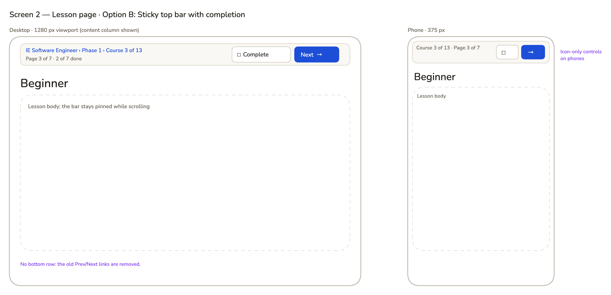
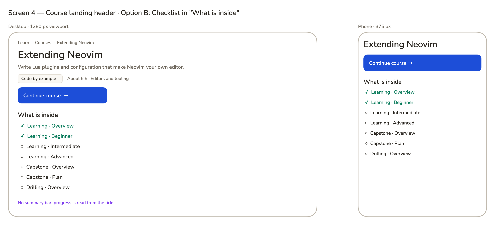

# Product Requirements — AyoKoding Learn Revamp 04: Learning Experience

## Product Overview

A learner on `www.ayokoding.com/en/learn` should always know where they are, how far they have come,
and what to do next. This plan adds browser-only progress and four connected screens: the path
roadmap, the lesson page, the Learn home, and the course landing header. It builds on the phase model
from plan 02 and the course metadata and header from plan 03, and changes neither
([README.md](./README.md#series-context)).

## Personas

- **Path follower.** Follows a career path such as Immediately Effective Software Engineer (13 core
  courses in 4 phases, plus 15 optional extension phases). Needs a roadmap, progress, and one
  "continue" action.
- **Course browser.** Opens a single course from the catalog or search, with no path. Needs course
  progress and a clear next page.
- **Returning learner.** Comes back days later on the same browser. Needs the Learn home to say
  "continue here".
- **Keyboard or screen-reader user.** Needs status in words, focusable controls, and announced
  changes.
- **Phone reader.** Reads at 375 px. Needs every control reachable and nothing cut off.

## User Stories

1. As a path follower, I want each path shown as phases with outcomes and progress, so that I can see
   the whole journey and where I am in it.
2. As a path follower, I want one button that starts or continues the path, so that I do not have to
   work out the next course myself.
3. As a path follower, I want each lesson page to show the path, phase, course, and page I am on, so
   that I keep my bearings deep inside a course.
4. As a learner, I want to mark a page complete and go to the next one in one click, and to un-mark it
   later, so that my progress matches what I really finished.
5. As a learner, I want the last page of a course to lead to the next course in my path, so that I
   never hit a dead end.
6. As a course browser, I want course progress without choosing a path, so that single courses work
   too.
7. As a returning learner, I want a "Continue learning" card on the Learn home, so that I can pick up
   where I stopped.
8. As a new learner, I want the Learn home to show the paths and how to start, so that I am not
   faced with a list of 180 links.
9. As a privacy-minded learner, I want progress kept only in my browser and a way to reset it, so that
   nothing about my learning leaves my device.
10. As a keyboard or screen-reader user, I want progress in words and controls I can operate and hear,
    so that I get the same information as everyone else.

## Acceptance Criteria (Gherkin)

These scenarios are canonical. Delivery copies them into the `specs/` feature files named below and in
[tech-docs/006](./tech-docs/006-testing-strategy.md). The `S<n>` prefix is a plan-local ID; omit it
from the scenario title in the feature file. Every scenario is tagged `@integration-exempt` with the
repository comment
`# Exemption(integration): the scenario is observable at the public browser or HTTP boundary and has no separate local resource boundary; alternative-proof: ayokoding-www-fe-e2e:test:e2e / <scenario title>`.
Each scenario has a Unit binding and an E2E binding.

New feature files live in a new folder `specs/apps/ayokoding/www/behaviours/frontend/learning-progress/`
(with a `README.md`), except the roadmap feature, which joins `course-paths/`.

### Feature: Learning progress store (`learning-progress/progress-store.feature`)

```gherkin
Feature: Learning progress store

  As a learner without an account
  I want my progress kept in this browser only
  So that I can track what I finished without sending anything anywhere

  Background:
    Given the app is running

  Scenario: S1 Marking a page complete is saved in this browser only
    Given a reader has no saved progress
    When the reader marks a learning page as complete
    And the reader reloads the page
    Then the page is still shown as completed
    And no network request sent while marking carries the progress data

  Scenario: S2 A completed page can be un-checked
    Given a reader has marked a learning page as complete
    When the reader activates the completed control again
    Then the page is shown as not completed
    And the course's pages-done count goes down by one

  Scenario: S3 Progress is shared by every path that contains the course
    Given a course belongs to two paths
    And the reader completed every learning page of that course while following the first path
    When the reader opens the second path's page
    Then that course's card shows "Done"

  Scenario: S4 The site still works when browser storage is blocked
    Given the browser refuses to read or write site storage
    When the reader opens a learning page and marks it as complete
    Then the page is shown as completed for the rest of the visit
    And a notice says progress cannot be saved in this browser
    And the page shows no error

  Scenario: S5 Unreadable saved progress is ignored and replaced
    Given the saved progress record cannot be read as valid progress
    When the reader opens a path page
    Then every course card shows "Not started"
    And marking a learning page as complete saves a valid progress record

  Scenario: S6 Resetting progress clears it after confirmation
    Given a reader has saved progress
    When the reader chooses "Reset progress" on the Learn home and confirms
    Then every progress count on the Learn home shows nothing done
    And no saved progress record remains in this browser

  Scenario: S7 Cancelling a reset keeps progress
    Given a reader has saved progress
    When the reader chooses "Reset progress" on the Learn home and cancels
    Then the saved progress is unchanged
    And focus returns to the "Reset progress" button

  Scenario: S8 Progress appears without moving the page
    Given a reader has saved progress
    When the reader opens a path page, a learning page, a course landing page, and the Learn home
    Then each progress area and the content below it sit at the same position as in the page served before scripts run
    And the browser console shows no hydration error

  Scenario: S9 Progress updates in another open tab
    Given the same path page is open in two tabs
    When the reader marks a learning page as complete in a third tab
    Then both open tabs show the new count without a reload
```

### Feature: Lesson navigation (`learning-progress/lesson-navigation.feature`)

```gherkin
Feature: Lesson navigation

  As a learner inside a course
  I want to see where I am and move to the next page in one step
  So that I can work through a course and a path without getting lost

  Background:
    Given the app is running

  Scenario: S10 The context bar shows where the reader is in a path
    Given a reader opens a learning page of a course in path context
    Then the context bar links to the path page
    And it names the phase that contains the course
    And it shows "Course k of N" for the course's position in the path
    And it shows "Page p of P" and how many pages of the course are done

  Scenario: S11 The context bar works without a path
    Given a reader opens a learning page with no path context and no remembered path for that course
    Then the context bar shows the course title, "Page p of P", and how many pages are done
    And it shows no path or phase link

  Scenario: S12 Mark complete and continue opens the next learning page
    Given a reader is on a learning page that is not the course's last page
    When the reader activates "Mark complete & continue"
    Then the next learning page of the course opens
    And the previous page is counted as done

  Scenario: S13 The last page of a course leads to the next course in the path
    Given a reader is on the last learning page of a course in path context
    And the path has a course after it
    When the reader activates "Mark complete & continue"
    Then the next course's landing page opens in the same path context

  Scenario: S14 The last page of the path leads back to the path page
    Given a reader is on the last learning page of the path's last course in path context
    When the reader activates "Mark complete & continue"
    Then the path page opens

  Scenario: S15 Without a path, the last page leads back to the course landing page
    Given a reader is on a course's last learning page with no path context
    When the reader activates "Mark complete & continue"
    Then the course landing page opens

  Scenario: S16 Previous goes back one page, then to the course landing page
    Given a reader is on the first learning page of a course
    Then "Previous" links to the course landing page
    When the reader opens the second learning page
    Then "Previous" links to the first learning page

  Scenario: S17 The path context is remembered inside the same course
    Given a reader opened a course's learning page in path context
    When the reader opens another learning page of the same course from a link without path context
    Then the context bar still shows the same path and phase
    And the navigation links keep the path context

  Scenario: S18 Opening or scrolling a page never marks it complete
    Given a reader has no saved progress
    When the reader opens a learning page and scrolls to its end
    Then the page is not counted as done
```

### Feature: Path roadmap (`course-paths/path-roadmap.feature`)

```gherkin
Feature: Path roadmap

  As a path follower
  I want the path page to show phases, outcomes, and my progress
  So that I can see the journey and take the next step

  Background:
    Given the app is running

  Scenario: S19 Each core phase is a milestone with its outcome and progress
    When a reader opens a path page
    Then each core phase shows its number, title, and "After this phase you can" outcome when the path defines one
    And each core phase shows "x of y done" for its courses

  Scenario: S20 Course cards show order, time, format, and status in words
    When a reader opens a path page
    Then each course card shows its position number, title, estimated time, and format
    And each course card shows "Done", "In progress", or "Not started" as text
    And an outline course card shows an "Outline" badge

  Scenario: S21 A new reader sees one Start button
    Given a reader has no saved progress
    When the reader opens a path page
    Then exactly one primary button reads "Start:" followed by the first course's title
    And it links to that course's landing page in path context

  Scenario: S22 A returning reader sees Continue with the next course
    Given a reader completed some learning pages of the path's second course
    When the reader opens the path page
    Then the primary button reads "Continue:" followed by the second course's title
    And it links to the first learning page of that course the reader has not completed

  Scenario: S23 Optional extensions are separate and closed by default
    When a reader opens a path that has extension phases
    Then an "Optional extensions" heading follows the last core phase
    And each extension phase is a closed section that shows its title and "x of y done"
    And opening an extension phase shows its course cards

  Scenario: S24 The path headline counts core courses only
    Given a reader completed every learning page of one extension course and nothing else
    When the reader opens the path page
    Then the headline reads "0 of N core courses done"
    And that extension phase shows "1 of M done"

  Scenario: S25 Finishing the core path shows completion
    Given a reader completed every core course of a path
    When the reader opens the path page
    Then the headline says the core path is complete
    And no "Start" or "Continue" button is shown

  Scenario: S26 A skills path waiting for its restructure shows one flat list with progress
    Given a skills path is marked as pending restructure
    When a reader opens that path page
    Then its courses appear in one list in today's order with status in words
    And no phase heading, outcome line, or "Optional extensions" heading appears
```

### Feature: Learn home (`learning-progress/learn-home.feature`)

```gherkin
Feature: Learn home

  As a learner arriving at AyoKoding Learn
  I want a landing page that shows paths and how to continue
  So that I can start or resume without scanning a long list of links

  Background:
    Given the app is running

  Scenario: S27 The Learn home is a landing page, not a list of courses
    When a reader opens /en/learn
    Then the page shows an introduction, career path cards, skills path cards, and a "Browse all courses" link to the catalog
    And the page links to no individual course page

  Scenario: S28 A returning reader sees a Continue learning card
    Given a reader completed some learning pages while following a path
    When the reader opens /en/learn
    Then a "Continue learning" card names that path and its next course
    And its button links to the next learning page in path context

  Scenario: S29 A new reader sees a Start learning card in the same place
    Given a reader has no saved progress
    When the reader opens /en/learn
    Then the same card area shows "Start learning" with a link to the paths

  Scenario: S30 Path cards show who it is for, the goal, size, time, and progress
    When a reader opens /en/learn
    Then each career path card shows the path title, who it is for, its goal, its core phase count, its estimated time, and its progress in words
    And each card links to its path page

  Scenario: S31 The old Learn overview address redirects to the Learn home
    When a visitor requests /en/learn/overview
    Then the response is a permanent redirect with status 308 to /en/learn

  Scenario: S31a A deeper address under the old overview is not redirected
    When a visitor requests /en/learn/overview/anything
    Then the response status is 404

  Scenario: S32 Path hubs use the same path cards
    When a reader opens the paths hub, the careers landing, a careers arc page, or the skills landing
    Then every path on the page is shown as a path card with its progress in words
    And the careers landing groups its path cards under one heading per arc that links to the arc page
```

### Feature: Course landing progress (`learning-progress/course-landing-progress.feature`)

```gherkin
Feature: Course landing progress

  As a learner returning to a course
  I want the course header to show my progress and continue where I stopped
  So that I do not start the course again

  Background:
    Given the app is running

  Scenario: S33 A started course shows its progress and a Continue button
    Given a reader completed the first two learning pages of a course
    When the reader opens the course landing page
    Then the header shows "In progress" and "2 of P pages done"
    And the main button reads "Continue course:" followed by the third page's title and links to it

  Scenario: S34 A finished course offers a review
    Given a reader completed every learning page of a course
    When the reader opens the course landing page
    Then the header shows "Done" and "P of P pages done"
    And the main button reads "Review course" and links to the first learning page
```

### Feature: Learning progress accessibility (`learning-progress/learning-progress-accessibility.feature`)

```gherkin
Feature: Learning progress accessibility

  As a keyboard, screen-reader, or phone user
  I want progress shown in words and controls I can reach and hear
  So that I get the same information and actions as every other learner

  Background:
    Given the app is running

  Scenario: S35 Status is shown in words, not only colour
    Given a reader has courses that are done, in progress, and not started
    When the reader opens a path page
    Then every course status is written as the words "Done", "In progress", or "Not started"
    And every progress bar has a text equivalent such as "3 of 13 core courses done"

  Scenario: S36 Progress controls work with the keyboard and announce changes
    Given a reader on a learning page uses only the keyboard
    When the reader tabs to "Mark as complete" and presses Space
    Then the control's pressed state becomes true
    And a status message announces that the page is complete and the new count

  Scenario: S37 Reduced motion turns off progress animations
    Given the reader's system asks for reduced motion
    When the reader marks a page as complete
    Then no progress bar or status element animates

  Scenario: S38 Progress screens fit a phone screen
    Given a 375 pixel wide viewport
    When the reader opens the Learn home, a path page, a learning page, and a course landing page
    Then no page scrolls horizontally
    And every progress control is at least 44 by 44 CSS pixels

  Scenario: S39 Progress screens pass automated accessibility checks
    Given a reader has saved progress
    When the Learn home, a path page, a learning page, and a course landing page are scanned for WCAG 2 A and AA rules
    Then no scan reports a violation
```

### Changes to Existing Scenarios

| ID  | File                                                    | Change                                                                                                                                                                                                                                                                                              |
| --- | ------------------------------------------------------- | --------------------------------------------------------------------------------------------------------------------------------------------------------------------------------------------------------------------------------------------------------------------------------------------------- |
| U1  | `navigation/navigation.feature`                         | Plan 01's scenario "The learn overview is the first entry under Learn in the sidebar" is replaced by "The Learn sidebar lists Paths, Courses, and Legacy in that order" (Overview no longer exists).                                                                                                |
| U2  | `i18n/locale-redirects.feature`                         | The example rows `/EN/learn/overview` and `/ID/learn/overview` become `/EN/learn/courses` → `/en/learn/courses` and `/ID/learn/courses` → `/id/learn/courses`. The scenario tests only lowercase redirects, so it must not depend on the removed page.                                              |
| U3  | `course-paths/category-landing-arc-chooser.feature`     | The scenario becomes "The careers category landing groups path cards by arc": one section per arc, heading links to the arc page, the immediately-effective section shows exactly two path cards. Bindings move with it.                                                                            |
| U4  | `navigation/navigation.feature` (sibling links)         | Unchanged text. The bindings still find a "Page navigation" landmark whose links contain the previous and next page titles; the new lesson navigation keeps that landmark and those names (see [tech-docs/003](./tech-docs/003-active-path-and-navigation.md#lesson-navigation)).                   |
| U5  | Plan 02's `course-paths/path-phases.feature` and others | Text unchanged. If a binding asserts that an extension course link is visible, the binding first opens the closed extension section. Phase 0 lists every such binding.                                                                                                                              |
| U6  | Steps that open `/en/learn/overview`                    | Every E2E, unit, and integration step that opens the removed page switches to `/en/learn/courses/backend-essentials/overview` (a stable course-root page with a sidebar, outside any lesson sequence). Inventory in [tech-docs/008](./tech-docs/008-file-impact.md). Scenario text does not change. |

## Product Scope

**In scope**

- The progress store, its hook, and every screen that shows progress: path roadmap, lesson page,
  course landing header, Learn home, and path cards on the paths hub, careers landing, careers arc
  pages, and skills landing.
- Removing `content/en/learn/overview.md`, the 308 redirect from its URL, and folding its useful text
  into the Learn home intro.
- English and Indonesian strings for every new interface label.

**Out of scope**

- Everything in [README.md Non-Goals](./README.md#non-goals).
- Copy of manifests, phases, and outcomes (plan 02) and of course descriptions and estimates (plan 03).

## Product Risks

| Risk                                                        | Mitigation                                                                                                                    |
| ----------------------------------------------------------- | ----------------------------------------------------------------------------------------------------------------------------- |
| A reader thinks progress is lost when they switch browsers. | "Saved in this browser" appears on the roadmap progress card, the course header, and the Learn home.                          |
| A reader marks pages by mistake.                            | Every completion can be un-checked from the same control; nothing completes automatically.                                    |
| The Continue target surprises a reader who jumped around.   | The rule is fixed and visible: the last path course they worked on, then the first unfinished core course; see tech-docs/003. |
| Progress pieces flash or move after load.                   | Fixed-size slots and server placeholders; S8 compares positions before and after scripts run.                                 |
| Careers readers miss the old arc chooser.                   | Arc grouping stays as section headings that link to each arc page.                                                            |

## UI Design Funnel

This plan is UI-bearing. The funnel covers four screens. Each has low-fi wireframes for at least two
options at phone and desktop widths, two hi-fi finalists in `assets/`, a named selection, and the
reasons.

### Grounding Note (R5)

Surveyed on 2026-10-09 before drafting:

- **Existing components reused:** `PathLanding` (`course-paths/shell/path-landing.tsx`, rebuilt as the
  roadmap container), plan 02's `AssumedCourses`, `OutlineBadge`, and phase copy keys, plan 01's
  `PathPositionNumber`, plan 03's `CourseHeader` with its `progress` and `primaryAction` props and
  `CourseMetaRow`, `MarkdownRenderer`, `Breadcrumb`, and the `@open-sharia-enterprise/web-ui`
  `Button`, `Badge`, `Card`, and `Dialog` components.
- **Rejected reuse:** web-ui `ProgressRing` has a fixed 1 s transition and no text label, so it fails
  the reduced-motion and text-status requirements. A new `ProgressMeter` (a native `<progress>`-style
  bar with a visible text label) replaces it here.
- **Tokens reused:** `text-muted-foreground`, `bg-muted`, `bg-accent`, `text-primary`,
  `border-border`, and the warm neutrals from `libs/web-ui-token/src/ayokoding.css`. Status colours
  use existing Tailwind green-700 (done) and amber-700 (in progress) only as a second signal next to
  the words and icons.
- **Sibling screens checked:** the paths hub, careers and skills landings, arc pages, the plan 03
  catalog and course header, the course page layout with its table of contents, and the mobile
  drawer. The site home hero (`/en`) keeps today's `PathCard`.

### Prior Art (R7)

Accessed 2026-10-09:

- Udemy lets a learner un-mark a lecture by clicking its completed checkmark ("How to Mark or Unmark
  Lectures as Complete", <https://support.udemy.com/hc/articles/229607188>). This supports the
  reversible "Completed ✓" toggle.
- freeCodeCamp's forum documents that progress kept in `localStorage` stays on one device and does not
  sync. This is why every progress surface says "saved in this browser".
- The Odin Project groups lessons into sections inside each path, with completion per lesson, which
  matches phases with course cards and page-level completion.
- WCAG 2.2 success criteria 1.4.1 Use of Color, 4.1.3 Status Messages, 1.4.10 Reflow, and 2.5.8 Target
  Size (Minimum) set the accessibility bar in S35–S39.
- web.dev "Cumulative Layout Shift": a good score is 0.1 or less, and a change in size of an element
  counts only when other elements move. Fixed-size slots avoid that.

### Responsive Strategy (Mobile First)

All four screens start as one column at 375 px. Primary buttons are full width below `sm` (640 px)
and auto width from `sm`. Course cards stack their meta line under the title below `sm` and put the
status at the right from `sm`. The roadmap timeline line sits at the left edge at every width. At `md`
(768 px) the content sidebar returns; at `lg` (1024 px) content is capped at `max-w-3xl` (lesson,
roadmap) or `max-w-5xl` (Learn home, two path cards per row). Every progress slot has a fixed height
per breakpoint so hydration never moves content.

### Screen 1 · Path roadmap

URL: `/en/learn/paths/careers/immediately-effective/software-engineer`.

#### Low-Fidelity Wireframes

**Option A — Milestone timeline (Recommended)**

_Mobile — 375 px_

```text
┌────────────────────────────────────┐
│ ‹ Careers                          │
│ Immediately Effective              │
│ Software Engineer                  │
│ For new engineers who want to ship │
│ ┌────────────────────────────────┐ │
│ │ Your progress (this browser)   │ │
│ │ 3 of 13 core courses done      │ │
│ │ ███░░░░░░░░░░                  │ │
│ │ [ Continue: Extending Neovim → ]│ │
│ └────────────────────────────────┘ │
│ Core path · 4 phases               │
│ ◉ Phase 1 · Set up your editor     │
│ │ ◐ In progress · 3 of 4 done      │
│ │ After this phase you can …       │
│ │ ┌ 1 Just Enough Neovim ────────┐ │
│ │ │ Language primer · About 3 h  │ │
│ │ │ ✓ Done                        │ │
│ │ └──────────────────────────────┘ │
│ ○ Phase 2 · Python, data, …        │
│ Optional extensions                │
│ ▸ Editor and shell workflow  0/2   │
└────────────────────────────────────┘
```

_Desktop — 1280 px (768 px is the same column with the sidebar)_

```text
┌── Sidebar ──┬──────────────────────────────────────────────────────────┐
│             │ Learn › Paths › Careers › Immediately effective          │
│             │ Immediately Effective Software Engineer                  │
│             │ Goal: Capstone: Forge Ready · Capstone: Full-Stack App   │
│             │ ┌ Your progress ───────────────────────────────────────┐ │
│             │ │ 3 of 13 core courses done  ███░░░░░░░                │ │
│             │ │ [ Continue: Extending Neovim → ]                      │ │
│             │ └──────────────────────────────────────────────────────┘ │
│             │ ◉ Phase 1 · Set up your editor   ◐ In progress · 3 of 4  │
│             │ │ After this phase you can edit code quickly in Neovim… │
│             │ │ [1] Just Enough Neovim  Primer · 3 h        ✓ Done    │
│             │ │ [3] Extending Neovim    By example · 6 h    ◐ In prog │
│             │ ○ Phase 2 · Python, data, and the backend  ○ 0 of 4     │
│             │ Optional extensions (do not count toward core)          │
│             │ ▸ Editor and shell workflow       2 courses · 1 of 2    │
└─────────────┴──────────────────────────────────────────────────────────┘
```

**Option B — Phase accordion**

_Mobile — 375 px_

```text
┌────────────────────────────────────┐
│ Immediately Effective SE           │
│ [ Core ] [ Extensions ]            │
│ 3 of 13 core courses done          │
│ [ Continue: Extending Neovim → ]   │
│ ▾ Phase 1 · ◐ 3 of 4 done          │
│   1 Just Enough Neovim  ✓ Done     │
│   3 Extending Neovim    ◐          │
│ ▸ Phase 2 · ○ 0 of 4 done          │
│ ▸ Phase 3 · ○ 0 of 4 done          │
└────────────────────────────────────┘
```

_Desktop — 1280 px_

```text
┌── Sidebar ──┬──────────────────────────────────────────────────────────┐
│             │ Immediately Effective Software Engineer  [Core|Extensions]│
│             │ 3 of 13 core courses done  [ Continue: Extending Neovim ]│
│             │ ▾ Phase 1 · Set up your editor              ◐ 3 of 4     │
│             │     cards …                                              │
│             │ ▸ Phase 2 · Python, data, and the backend    ○ 0 of 4     │
│             │ ▸ Phase 3 · Frontend, testing, and security  ○ 0 of 4     │
└─────────────┴──────────────────────────────────────────────────────────┘
```

**Option C — Horizontal stepper**

```text
 ①───────②───────③───────④      Phase 1 · Set up your editor (selected step)
 ◐       ○       ○       ○      cards for the selected phase only
```

Dropped before hi-fi: four or more steps do not fit 375 px without horizontal scroll (fails Reflow),
and only one phase's courses are visible at a time.

#### High-Fidelity Finalists

![Screen 1, Option A — the Immediately Effective Software Engineer roadmap at desktop and phone widths: a progress card reading "3 of 13 core courses done" with a blue bar and a single "Continue: Extending Neovim" button, then a vertical timeline with a node per core phase; Phase 1 "Set up your editor" shows "In progress · 3 of 4 done", its outcome sentence, an amber bar, and four numbered course cards each with format, "About N h", and a status in words (Done, In progress); Phase 2 to 4 follow; below a divider, "Optional extensions" lists closed rows such as "Editor and shell workflow, 2 courses, 1 of 2 done"](./assets/path-roadmap-option-a-milestone-timeline.excalidraw.png)

_High-fidelity mockup. Edit with the Excalidraw VSCode extension — the PNG carries the scene._


_High-fidelity mockup. Edit with the Excalidraw VSCode extension — the PNG carries the scene._

**Selected: Option A — Milestone timeline.**

| Design                    | Why it won / lost                                                                                                                                     |
| ------------------------- | ----------------------------------------------------------------------------------------------------------------------------------------------------- |
| A — milestone timeline ✅ | Shows the whole core journey at once, matches decision 38b ("vertical milestones per phase"), extensions stay visible but closed, one primary button. |
| B — phase accordion       | Compact, but hides later phases' courses and puts extensions behind a tab, which hides the size of the path and adds a tab widget to make accessible. |
| C — horizontal stepper    | Dropped before hi-fi: breaks at 375 px and shows one phase at a time.                                                                                 |

Details of the selected design:

- Order: breadcrumb, `h1` path title, description, goals line, `AssumedCourses` ("Before you start")
  when `assumes` is not empty, progress card, `h2` "Core path · n phases · About H h", core phases,
  divider, `h2` "Optional extensions" with plan 02's note, extension phases.
- Each core phase is an `<section aria-labelledby>` with `h3` "Phase n · <title>" and
  `id="phase-<phase id>"` (the lesson context bar links to it). Each extension phase is a `<details>`
  whose `<summary>` holds the title and "x of y done".
- Course card: plan 01's position number, the title as the card's only link (to the course landing
  page with `?path=`), the plan 03 format label and "About N h" (or `OutlineBadge` for an outline
  course), and the status label. The whole card is clickable through the title link's overlay.
- The timeline node for each phase repeats the phase status as an icon with `aria-hidden="true"`;
  the words next to it carry the meaning.

### Screen 2 · Lesson page

URL: `/en/learn/courses/extending-neovim/learning/beginner?path=careers/immediately-effective/software-engineer`.

#### Low-Fidelity Wireframes

**Option A — Context bar and bottom action row (Recommended)**

_Mobile — 375 px_

```text
┌────────────────────────────────────┐
│ ┌────────────────────────────────┐ │
│ │ Immediately Effective Softw…   │ │  row 1: path link (truncates)
│ │ Phase 1 · Course 3 of 13       │ │  row 2
│ │ Page 3 of 7 · 2 done ██░░░░    │ │  row 3
│ └────────────────────────────────┘ │
│ Beginner                           │
│ …lesson body…                      │
│ [ Mark complete & continue →     ] │
│ [   Next: Intermediate           ] │
│ [ ☐ Mark as complete             ] │
│ [ ← Previous: Overview           ] │
└────────────────────────────────────┘
```

_Desktop — 1280 px_

```text
┌── Sidebar ──┬───────────────────────────────────────────────┬── TOC ──┐
│             │ ┌───────────────────────────────────────────┐ │         │
│             │ │ IE Software Engineer › Phase 1 · Set up … │ │         │
│             │ │   › Course 3 of 13                        │ │         │
│             │ │ Extending Neovim · Page 3 of 7 · 2 done ██│ │         │
│             │ └───────────────────────────────────────────┘ │         │
│             │ Beginner                                      │         │
│             │ …lesson body…                                 │         │
│             │ ─────────────────────────────────────────────  │         │
│             │ [← Previous: Overview] [☐ Mark as complete]   │         │
│             │            [Mark complete & continue →]        │         │
│             │             Next: Intermediate                 │         │
└─────────────┴───────────────────────────────────────────────┴─────────┘
```

**Option B — Sticky top bar with completion**

_Mobile — 375 px_

```text
┌────────────────────────────────────┐
│ Course 3 of 13 · Page 3   [☐] [→] │  pinned while scrolling
│ Beginner                           │
│ …lesson body…                      │
└────────────────────────────────────┘
```

_Desktop — 1280 px_

```text
┌── Sidebar ──┬───────────────────────────────────────────────┐
│             │ IE SE › Phase 1 › Course 3 of 13 [☐ Complete][Next →] │ (pinned)
│             │ Beginner                                      │
│             │ …lesson body… (no bottom row)                 │
└─────────────┴───────────────────────────────────────────────┘
```

**Option C — Side progress panel**

```text
│ lesson body │ Course progress: ☑ Overview ☑ Beginner ☐ Intermediate … │
```

Dropped before hi-fi: the right column is already the table of contents, and on phones the panel
falls below the article where nobody sees it.

#### High-Fidelity Finalists

![Screen 2, Option A — a lesson page "Beginner" at desktop and phone widths: a light context bar at the top with blue links "Immediately Effective Software Engineer › Phase 1 · Set up your editor › Course 3 of 13" and a second line "Extending Neovim · Page 3 of 7 · 2 of 7 done" with a short amber bar; below the lesson body, a bottom row with "Previous: Overview", a "Mark as complete" toggle, and a blue "Mark complete & continue" button with "Next: Intermediate" under it; on the phone the three controls stack full width](./assets/lesson-page-option-a-context-bar-action-row.excalidraw.png)

_High-fidelity mockup. Edit with the Excalidraw VSCode extension — the PNG carries the scene._



_High-fidelity mockup. Edit with the Excalidraw VSCode extension — the PNG carries the scene._

**Selected: Option A — Context bar and bottom action row.**

| Design                          | Why it won / lost                                                                                                                                                  |
| ------------------------------- | ------------------------------------------------------------------------------------------------------------------------------------------------------------------ |
| A — context bar + action row ✅ | Matches decision 38c (thin bar on top, actions at the bottom where a reader finishes), text labels at every width, keeps the "Page navigation" landmark and links. |
| B — sticky top bar              | Asks to complete before reading, needs icon-only controls on phones (weaker labels), and a pinned bar covers content and anchor targets.                           |
| C — side progress panel         | Dropped before hi-fi: collides with the table of contents and disappears on phones.                                                                                |

Details of the selected design:

- The bar is a `<nav aria-label="Lesson location">` with a fixed height: two rows from `sm`, three
  rows below `sm`. Path mode: path title link › phase link (`#phase-<id>` on the roadmap) › "Course k
  of N" link (course landing with `?path=`). Canonical mode: the course title link. The second row:
  "Page p of P · d of P done" and a `ProgressMeter`.
- The bottom row is `<nav aria-label="Page navigation">`: "← Previous: <title>" link, the toggle
  button ("Mark as complete" / "Completed ✓", `aria-pressed`), and the primary
  "Mark complete & continue →" link whose second line is "Next: <title>" (or "Next course: <title>",
  or "Back to the path", or "Back to the course"). When the page is already complete, the primary
  link reads "Continue →".
- A visually hidden `role="status"` region announces "<page> marked as complete. d of P pages done."
  or "<page> marked as not complete. …".
- When storage is unavailable, one line under the bar reads "Progress can't be saved in this
  browser. It lasts until you close this tab."

### Screen 3 · Learn home

URL: `/en/learn`.

#### Low-Fidelity Wireframes

**Option A — Stacked landing (Recommended)**

_Mobile — 375 px_

```text
┌────────────────────────────────────┐
│ Learn                              │
│ Follow a path from your first      │
│ course to a finished project, …    │
│ ┌ Continue learning ─────────────┐ │
│ │ Immediately Effective SE       │ │
│ │ Next: Extending Neovim  ███░░  │ │
│ │ [ Continue →                 ] │ │
│ └────────────────────────────────┘ │
│ Career paths                       │
│ Immediately effective              │
│ ┌ Software Engineer ─────────────┐ │
│ │ For: … Goal: …                 │ │
│ │ 4 core phases · About 52 h     │ │
│ │ ◐ 3 of 13 core courses done    │ │
│ │ View path →                    │ │
│ └────────────────────────────────┘ │
│ Skill paths …                      │
│ ┌ Browse all courses → ──────────┐ │
│ Saved in this browser only.        │
│ [ Reset progress… ]                │
└────────────────────────────────────┘
```

_Desktop — 1280 px_

```text
┌── Sidebar ──┬──────────────────────────────────────────────────────────┐
│             │ Learn                                                    │
│             │ Follow a path … Every path is split into phases …        │
│             │ ┌ Continue learning ────────────────── [ Continue → ] ┐ │
│             │ │ Immediately Effective Software Engineer ███░░░░░    │ │
│             │ └──────────────────────────────────────────────────────┘ │
│             │ Career paths                                            │
│             │  Immediately effective (link to arc)                    │
│             │  [ path card ]  [ path card ]                           │
│             │ Skill paths                                             │
│             │  [ path card ]  [ path card ]                           │
│             │ [ Browse all courses — 181 courses in 14 categories → ] │
│             │ Saved in this browser only.  [ Reset progress… ]        │
│             │ Looking for older material? Legacy                      │
└─────────────┴──────────────────────────────────────────────────────────┘
```

**Option B — Two-column dashboard**

_Mobile — 375 px_

```text
┌────────────────────────────────────┐
│ Learn                              │
│ ┌ My learning ───────────────────┐ │
│ │ [ Continue → ]                 │ │
│ │ Paths in progress ███░░        │ │
│ │ Courses in progress ◐ …        │ │
│ └────────────────────────────────┘ │
│ Career paths (below the fold)      │
└────────────────────────────────────┘
```

_Desktop — 1280 px_

```text
┌── Sidebar ──┬───────────────┬──────────────────────────────────────────┐
│             │ My learning   │ Career paths                             │
│             │ [ Continue ]  │  Software Engineer         View path →   │
│             │ Paths …       │  Backend Engineer          View path →   │
│             │ Courses …     │ Skill paths …                            │
│             │ [Reset…]      │ Browse all courses →                     │
└─────────────┴───────────────┴──────────────────────────────────────────┘
```

**Option C — Tabs ("My learning", "Careers", "Skills")**

Dropped before hi-fi: tabs hide the paths from a new learner behind a click and add a tab widget
without adding information.

#### High-Fidelity Finalists

![Screen 3, Option A — the Learn home at desktop and phone widths: the heading "Learn", a two-sentence intro, a highlighted "Continue learning" card naming Immediately Effective Software Engineer with "Next: Extending Neovim", a progress bar, and a blue "Continue" button; then "Career paths" grouped under "Immediately effective" with two path cards showing For, Goal, "4 core phases · 15 optional · About 52 h", a bar, and "3 of 13 core courses done" or "Not started", and "View path"; then "Skill paths" cards, a "Browse all courses" card, the line "Your progress is saved in this browser only", a "Reset progress" button, and a small Legacy line](./assets/learn-home-option-a-stacked-landing.excalidraw.png)

_High-fidelity mockup. Edit with the Excalidraw VSCode extension — the PNG carries the scene._


_High-fidelity mockup. Edit with the Excalidraw VSCode extension — the PNG carries the scene._

**Selected: Option A — Stacked landing.**

| Design                   | Why it won / lost                                                                                                                                            |
| ------------------------ | ------------------------------------------------------------------------------------------------------------------------------------------------------------ |
| A — stacked landing ✅   | One reading order for new and returning learners; the Continue/Start card keeps a fixed place; full path cards carry the fields decision 38d asks for.       |
| B — two-column dashboard | Strong for returning learners, but a new learner sees an empty panel first, paths drop below the fold on phones, and path rows lose the "who / goal" fields. |
| C — tabs                 | Dropped before hi-fi: hides paths behind a click.                                                                                                            |

Details of the selected design:

- `h1` "Learn" and the intro come from `content/en/learn/_index.md` (`title`, `description`); the intro
  folds in Overview's text: "Follow a path from your first course to a finished project, or pick
  single courses from the catalog. Every path is split into phases, and each phase says what you can
  do after it."
- The Continue/Start card is a fixed-height slot. Server render and first client render show the
  "Start learning" variant; after hydration, saved progress swaps in the "Continue learning" variant
  of the same size.
- Career paths: one `h3` per arc (the arc title links to the arc page), then that arc's path cards.
  Skill paths: the skills path cards. Two cards per row from `md`.
- Each path card shows the manifest `description` as written (plan 02 writes it as a "For …"
  sentence, so the card adds no "For:" label; the mockup's "For:" prefix only marks the field), a
  "Goal:" line with the goal course titles when the path has `goals`, "n core phases · m optional ·
  About H h", the progress line, and "View path →". Full field rules are in
  [tech-docs/004](./tech-docs/004-ui-components-and-copy.md#course-paths-components-featurescourse-pathsshell).
- "Browse all courses" links to plan 03's catalog at `/en/learn/courses`.
- Footer: "Your progress is saved in this browser only. It is never sent anywhere." and the
  "Reset progress…" button, which opens a web-ui `Dialog` with "Cancel" (initial focus) and
  "Reset progress". Then the line "Looking for older material? Legacy" until plan 14 removes it.

### Screen 4 · Course landing header

URL: `/en/learn/courses/extending-neovim`.

#### Low-Fidelity Wireframes

**Option A — Progress line (Recommended)**

_Mobile — 375 px_

```text
┌────────────────────────────────────┐
│ Extending Neovim                   │
│ Write Lua plugins and …            │
│ Code by example · About 6 h        │
│ ┌────────────────────────────────┐ │
│ │ ◐ In progress · 2 of 7 pages   │ │
│ │ ██░░░░░                         │ │
│ └────────────────────────────────┘ │
│ [ Continue course: Beginner →    ] │
│ Before you start …                 │
└────────────────────────────────────┘
```

_Desktop — 1280 px_

```text
┌── Sidebar ──┬──────────────────────────────────────────────────────────┐
│             │ Extending Neovim                                         │
│             │ Write Lua plugins and configuration …                    │
│             │ [Code by example] About 6 h · Editors and tooling        │
│             │ ┌ ◐ In progress · 2 of 7 pages done  ██░░░░  (browser) ┐ │
│             │ [ Continue course: Beginner → ]                          │
│             │ Before you start · Course contents …                     │
└─────────────┴──────────────────────────────────────────────────────────┘
```

**Option B — Checklist in the contents**

_Mobile — 375 px_

```text
┌────────────────────────────────────┐
│ Extending Neovim                   │
│ [ Continue course → ]              │
│ What is inside                     │
│ ✓ Learning · Overview              │
│ ✓ Learning · Beginner              │
│ ○ Learning · Intermediate          │
└────────────────────────────────────┘
```

_Desktop — 1280 px_

```text
┌── Sidebar ──┬──────────────────────────────────────────────────────────┐
│             │ Extending Neovim  [Code by example] About 6 h            │
│             │ [ Continue course → ]                                    │
│             │ What is inside: ✓ Overview ✓ Beginner ○ Intermediate …   │
└─────────────┴──────────────────────────────────────────────────────────┘
```

**Option C — Progress ring**

Dropped before hi-fi: web-ui `ProgressRing` animates for 1 s with no reduced-motion opt-out and has
no text label.

#### High-Fidelity Finalists


_High-fidelity mockup. Edit with the Excalidraw VSCode extension — the PNG carries the scene._



_High-fidelity mockup. Edit with the Excalidraw VSCode extension — the PNG carries the scene._

**Selected: Option A — Progress line.**

| Design               | Why it won / lost                                                                                                                                                |
| -------------------- | ---------------------------------------------------------------------------------------------------------------------------------------------------------------- |
| A — progress line ✅ | Uses plan 03's `progress` and `primaryAction` slots without changing its layout; a single summary sentence plus a bar; the button names the exact page it opens. |
| B — checklist        | Needs a client copy of plan 03's generated contents list (the body is server Markdown), and a reader must count ticks to know how far along they are.            |
| C — progress ring    | Dropped before hi-fi: animation and missing text label.                                                                                                          |

Details of the selected design:

- `progress` slot: `CourseProgressSummary` — status label, "d of P pages done", `ProgressMeter`, and
  "Saved in this browser". Fixed height.
- `primaryAction` slot: `CourseProgressAction`. Server render: plan 03's "Start course" to the start
  page. After hydration: "Start course" (nothing done), "Continue course: <next page title>", or
  "Review course" (all done). The label stays on one line and truncates with an ellipsis if needed.
- Plan 03's "Before you start" list and its other parts do not change.
