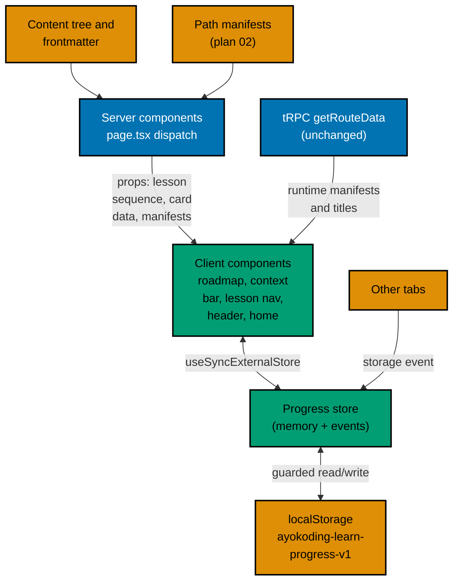

# 001 — Current State and Architecture

## Series Decisions This Plan Implements

Restated from the series decision record agreed with the user on 2026-10-09, so this plan stands
alone. Plan 04 owns decision 38; the others constrain it.

- **38a — Progress in the browser.** `localStorage`, no login, no server, nothing sent anywhere. Unit:
  learning page completion. Course progress = completed / total learning pages; phase and path
  progress derived from courses. Keyed by course slug and page path, so a course shared by several
  paths shows the same progress everywhere. Versioned key and schema; every read and write guarded
  (private mode, blocked storage) and the UI still works without storage. Client-only hydration with
  no layout shift and no hydration mismatch. A "Reset progress" control. Export and import are out of
  scope.
- **38b — Path page as a phase roadmap.** Vertical milestones per phase; each phase shows its
  outcome, a progress bar and "x/y done", and course cards (position number, title, estimated time,
  format, status done / in progress / not started, "Outline" badge). Overall path progress plus one
  primary button at the top: "Start" or "Continue: <next course>". Core phases first, extension phases
  visually separate. Replaces the plain `<ol>` list.
- **38c — In-course experience.** In path context: a thin context bar (path › phase › course n/m, page
  progress in the course). Page bottom: "Previous" and "Mark complete & continue" (next learning page;
  on the course's last page, the next course in the path). Completion is user-clicked only and can be
  un-checked (user: "tapi tandai selesainya juga bisa di 'uncentang' ya").
- **38d — Learn home.** `/en/learn` becomes a landing page: short intro, "Continue learning" card when
  progress exists, career path cards (who it is for, goal capstone, phase count, estimated hours,
  progress), skills path cards, and "Browse all courses" to plan 03's catalog. No full course list.
  Overview's useful text is folded in; the Overview page is removed or redirected; the Legacy mention
  goes once plan 14 lands. The `/en/learn/paths`, `/careers`, and `/skills` pages get the same path
  cards. Plan 03's course header shows course progress and turns "Start" into "Continue". Exact copy
  and layout are proposed here and reviewed in the PR.
- **38e — Accessibility.** Progress and status in text, not only colour; keyboard operable; reduced
  motion respected; works at phone width; passes the app's accessibility checks.
- **Decision 23 (plan 03).** "Start course" opens the course's first learning page.
- **Decision 35.** Courses are English only; `content/id/**` is untouched.
- **Decision 39.** The four skills paths keep today's order and copy until plans 06 and 07 restructure
  them; there is no "Preview" status.
- **Decision 40.** By the end of the series no course carries `status: outline`; until then the
  "Outline" badge is expected.
- **Boundaries.** Plan 01 = quick display fixes; plan 02 = data model with minimal phase grouping;
  plan 03 = catalog, metadata, course header and Start; plan 04 = roadmap, progress, context bar,
  mark-complete flow, continue-learning, building on 02 and 03 without redoing them.

## Current State (2026-10-09, before plans 01–03)

| Area              | Today                                                                                                                                                                                                                                                                                                                                 |
| ----------------- | ------------------------------------------------------------------------------------------------------------------------------------------------------------------------------------------------------------------------------------------------------------------------------------------------------------------------------------- |
| Route             | One statically generated catch-all, `src/app/[locale]/(content)/[...slug]/page.tsx`, with `dynamicParams = true`. `generateStaticParams` skips every `learn/paths/**` slug; those dispatch at request time through `isLearnPathsSlug` and `renderPathsRoute` (hub, category, arc, path).                                              |
| `/en/learn`       | Rendered by the standard content page from `content/en/learn/_index.md` (201 lines, weight 10, no `description`). Its body is generated by `scripts/generate-indexes.ts` via `src/features/content/shell/index-generator.ts`, which rewrites the body of every `_index.md` with children.                                             |
| Overview          | `content/en/learn/overview.md` (weight 100): "Welcome to AyoKoding's learning center! The learn section has three buckets", then Courses, Paths, Legacy bullets.                                                                                                                                                                      |
| Path page         | `PathLanding` (`src/features/course-paths/shell/path-landing.tsx`): title, description, an `<ol>` of course links with `?path=`.                                                                                                                                                                                                      |
| Hubs              | `/en/learn/paths`: `PathCard` grid grouped into Careers (by arc) and Skills. `/careers`: `CategoryLanding` arc chooser (`ArcCard`). `/careers/<arc>`: `ArcLanding` with `PathCard`s. `/skills`: `PathCard` grid plus `RampMilestoneStrip`.                                                                                            |
| Path context      | `?path=<pathId>` read on the client after hydration by `parsePathContext` and `resolveActiveCoursePathContext` inside `CoursePagePathContent` (Suspense + `useSearchParams`). Manifests arrive from tRPC `coursePaths.getRouteData` through `useRuntimeCoursePathData`.                                                               |
| Inner pages       | `courseIdFromSlug` returns everything after `learn/courses/`, so for `learn/courses/x/learning/overview` it returns `x/learning/overview`, which matches no manifest: path context is lost on every inner lesson page.                                                                                                                |
| Prev/next         | `computePrevNext` in `src/features/content/core/tree-builder.ts` links siblings inside one folder only.                                                                                                                                                                                                                               |
| Storage prior art | `ayokoding-sidebar-width` and `ayokoding-mobilenav-width` in `localStorage`, read without `try/catch`.                                                                                                                                                                                                                                |
| Course shape      | `_index.md` (landing), often a course-root `overview.md` (158 of 181 courses), `learning/{_index,overview,beginner,intermediate,advanced}.md`, `learning/capstone/{_index,overview}.md`, `drilling/{_index,overview}.md`; 11 courses also have `learning/artifacts/*.md` without an `_index.md`. `code/**` files have no frontmatter. |
| Locales           | `content/id/` has `belajar/`, `celoteh/`, `konten-video/`, `manusia/`, and no courses or paths.                                                                                                                                                                                                                                       |

## Contracts Consumed From Plans 02 and 03

Plans 02 and 03 were authored in parallel with this plan. The names below come from their plan
documents on 2026-10-09. Phase 0 checks each against `origin/main` with `rtk git grep` and records the
as-merged name in `<plan>/evidence/phase-0-contracts.md`. A renamed item is used under its merged name
and noted. A **missing** item stops execution and is reported to the user.

| From | Contract                                                                                                                                                                                                                                                  | Used for                                                               |
| ---- | --------------------------------------------------------------------------------------------------------------------------------------------------------------------------------------------------------------------------------------------------------- | ---------------------------------------------------------------------- |
| 02   | `PathManifest.phases[]` with `id`, `title`, `kind` (`core`/`extension`), `outcome.can`, `outcome.cannotYet`, `courses`                                                                                                                                    | Roadmap phases, phase anchors, context bar phase                       |
| 02   | `PathManifest.goals`, `PathManifest.assumes`, derived `PathManifest.courseOrder` (core first)                                                                                                                                                             | Goal line, "Before you start", path order for Continue                 |
| 02   | `PathManifest.restructurePendingIn`, `isPendingSkillsRestructure(manifest)`                                                                                                                                                                               | Flat roadmap mode for the four skills paths (S26)                      |
| 02   | `core/path-phases.ts`: `corePhases`, `extensionPhases`, `phaseOfCourse(manifest, courseId)` (phase + 1-based path position)                                                                                                                               | Phase grouping and "Course k of N"                                     |
| 02   | `ContentMeta.status` (`"outline"`), `CoursePathClientData.outlineCourseIds`, `OutlineBadge`, keys `pathsPhaseLabel`, `pathsAfterPhaseCan`, `pathsCannotYet`, `pathsOptionalExtensions`, `pathsExtensionsNote`, `pathsBeforeYouStart`, `pathsOutlineBadge` | Outline badge and reused copy                                          |
| 02   | `AssumedCourses`, `PhaseSection`, `PhaseGroup` components                                                                                                                                                                                                 | `AssumedCourses` reused; `PhaseSection` replaced on the path page only |
| 03   | `ContentMeta.description`, `category`, `format`, `estimatedHours` (absent for outline courses); `CourseFormat`; translated format labels                                                                                                                  | Course cards, path card time                                           |
| 03   | `resolveCourseStartSlug(courseNode, isRealPage)` in `content/core/course-start.ts`                                                                                                                                                                        | First page of the lesson sequence                                      |
| 03   | `CourseHeader` with `progress?: ReactNode` and `primaryAction?: ReactNode`; `CourseHeaderData` with `startSlug`; `buildCourseHeaderData`                                                                                                                  | Course header progress and Continue button                             |
| 03   | `courseRootIdFromSlug(slug)`, `COURSE_CATALOG_SLUG`, `CourseMetaRow`, `fill`/`tf` in `features/i18n/core/fill.ts`, key `courseEstimatedHours`                                                                                                             | Course root detection, meta row on cards, placeholder strings          |
| 01   | `PathPositionNumber` (`course-paths/shell/path-position-number.tsx`); Learn bucket weights Paths 101, Courses 102, Legacy 103                                                                                                                             | Card position numbers; sidebar order after Overview is removed         |

## Architecture After This Plan

### Feature Layout

A new feature folder `src/features/learning-progress/` follows the app's `core/` (pure, no IO) and
`shell/` (React, storage, Next.js) split:

- `core/progress-schema.ts`, `core/progress-state.ts`, `core/lesson-sequence.ts`,
  `core/course-location.ts`, `core/lesson-path-context.ts`, `core/progress-derivations.ts`,
  `core/next-step.ts`.
- `shell/progress-storage.ts`, `shell/use-learning-progress.ts`, and the UI components listed in
  [004](./004-ui-components-and-copy.md).

Path-specific UI (roadmap, path cards) lives in `src/features/course-paths/shell/` next to the
components it replaces.

### Route Dispatch Changes (`page.tsx`)

1. `generateStaticParams` also skips the slug `learn` (the Learn home renders at request time like the
   paths routes, so it reads the same runtime manifests).
2. Before the standard fetch: when `locale === "en"` and `slugStr === "learn"`, render `LearnHome`
   (title and description from `getBySlug`). `/id/learn` keeps its current 404.
3. In the standard branch: compute `courseLocationFromSlug(slugStr)`. When it returns a page that is in
   that course's lesson sequence, pass a `lesson` prop to `CoursePageContent`; it renders the context
   bar and the lesson navigation instead of `PrevNext`. All other pages render as today.
4. For course root pages (plan 03's `courseRootIdFromSlug`), pass `progress` and `primaryAction` to
   plan 03's `CourseHeader`.
5. `renderPathsRoute`: the terminal path page renders `PathRoadmap`; hub, careers, arc, and skills
   pages render `LearnPathCard`s.

### Where Progress Is Read

| Screen                 | Client component                                           | Server data passed as props                                                                       |
| ---------------------- | ---------------------------------------------------------- | ------------------------------------------------------------------------------------------------- |
| Lesson page            | `ContextBar`, `LessonNav`                                  | this course's lesson sequence with titles; course title; course id; page path                     |
| Course landing header  | `CourseProgressSummary`, `CourseProgressAction`            | this course's lesson sequence with titles; plan 03 start slug                                     |
| Path roadmap           | `RoadmapProgressCard`, `PhaseProgress`, `CourseCardStatus` | manifest, card data per course, lesson sequences (page paths only)                                |
| Learn home, path cards | `ContinueLearningCard`, `PathCardProgress`                 | all manifests, course titles, lesson sequences (page paths only) for every course in any manifest |

Lesson sequences without titles cost about 1,500 short strings for the whole library; Phase 0 measures
the serialized size and Phase 6 adds a test that keeps it under 64 KiB (see [006](./006-testing-strategy.md)).
