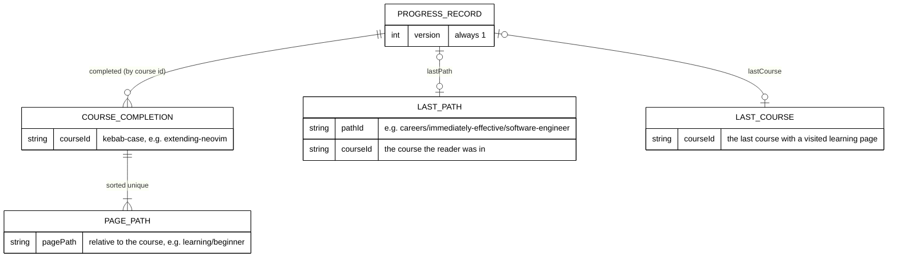

# 002 — Progress Store: Schema and Migration

The progress record is persisted data, so this file follows the repository's schema-and-migration
contract: data model, field guide, compatibility, migration, rollback, and reconciliation.

## Data Model

One JSON record in the reader's browser, under one `localStorage` key. Nothing else is stored, and
nothing is sent to a server.



Example value of `localStorage["ayokoding-learn-progress-v1"]`:

```json
{
  "completed": {
    "extending-neovim": ["learning/beginner", "learning/overview"],
    "just-enough-lua": ["drilling/overview", "learning/advanced", "learning/beginner"]
  },
  "lastCourse": { "courseId": "extending-neovim" },
  "lastPath": { "courseId": "extending-neovim", "pathId": "careers/immediately-effective/software-engineer" },
  "version": 1
}
```

Serialization is deterministic: object keys sorted, page arrays sorted and unique. The same state
always produces the same string, which keeps tests exact.

## Schema (`src/features/learning-progress/core/progress-schema.ts`)

```ts
import { z } from "zod";

export const PROGRESS_STORAGE_KEY = "ayokoding-learn-progress-v1";
export const PROGRESS_VERSION = 1;

const SEGMENT = "[a-z0-9]+(?:-[a-z0-9]+)*";
export const courseIdSchema = z
  .string()
  .max(120)
  .regex(new RegExp(`^${SEGMENT}$`));
export const pagePathSchema = z
  .string()
  .max(200)
  .regex(new RegExp(`^${SEGMENT}(?:/${SEGMENT})*$`));
export const pathIdSchema = z
  .string()
  .max(200)
  .regex(new RegExp(`^(?:careers|skills)(?:/${SEGMENT})+$`));

export const progressStateSchema = z
  .object({
    version: z.literal(PROGRESS_VERSION),
    completed: z.record(courseIdSchema, z.array(pagePathSchema).max(500)),
    lastPath: z.object({ pathId: pathIdSchema, courseId: courseIdSchema }).strict().nullable(),
    lastCourse: z.object({ courseId: courseIdSchema }).strict().nullable(),
  })
  .strict()
  .refine((value) => Object.keys(value.completed).length <= 500, "too many courses");

export type ProgressState = z.infer<typeof progressStateSchema>;
```

Phase 0 checks the patterns against every real course id, page path, and path id (all must match) and
records the result. A pattern that rejects a real value is a defect to fix before Phase 1 ends.

## Field Guide

| Field        | Purpose                                                              | Type and default                       | Writers                                                                  | Readers                                           | Lifecycle and clearing                                                                                        | Recovery                                                                              |
| ------------ | -------------------------------------------------------------------- | -------------------------------------- | ------------------------------------------------------------------------ | ------------------------------------------------- | ------------------------------------------------------------------------------------------------------------- | ------------------------------------------------------------------------------------- |
| `version`    | Schema version; lets a later version migrate.                        | literal `1`; written on every save     | `serializeProgress`                                                      | `parseProgress`                                   | Lives as long as the record.                                                                                  | Any other value makes the record invalid (treated as empty, replaced on next save).   |
| `completed`  | Pages the reader marked complete, per course.                        | `Record<courseId, pagePath[]>`; `{}`   | "Mark as complete" toggle and "Mark complete & continue" on lesson pages | every progress component through derivations      | A course key is removed when its last page is un-checked. Cleared by Reset.                                   | Unknown course ids or pages not in the current lesson sequence are ignored in counts. |
| `lastPath`   | The path the reader last used, and in which course; drives Continue. | `{pathId, courseId}` or `null`; `null` | visit recording on lesson pages and course landing pages                 | next-step rule, sticky path rule, Learn home card | Overwritten on each visit; set to `null` by a visit without path context to another course. Cleared by Reset. | A path id that no manifest has is ignored.                                            |
| `lastCourse` | The last course with a visited page; Continue without a path.        | `{courseId}` or `null`; `null`         | visit recording                                                          | Learn home card                                   | Overwritten on each visit. Cleared by Reset.                                                                  | An unknown course id is ignored.                                                      |

- **Owner:** this feature (`src/features/learning-progress/`). No other code reads or writes the key.
- **Sensitivity:** low. The record holds only public course ids, page paths, and path ids. It contains
  no name, account, timestamp, or device data. It is never sent anywhere; S1 asserts that no request
  carries it.
- **Size:** about 25 bytes per completed page. If a reader completed every learning page of every
  course (about 1,500 pages), the record is about 40 KB, far under the usual `localStorage` quota.

## Guarded Storage (`src/features/learning-progress/shell/progress-storage.ts`)

Browsers can refuse storage. MDN's `Window.localStorage` page (accessed 2026-10-09) says the getter
throws `SecurityError` when "the user has configured the browsers to prevent the page from persisting
data", and that data in private browsing is cleared when the last private tab closes. `setItem` throws
`QuotaExceededError` when storage is full. MDN's `storage` event page says the event is "not fired on
the window that made the change". The store handles each case:

```ts
export type ProgressSnapshot =
  | { status: "unknown" } // server render and hydration
  | { status: "ready"; persisted: boolean; recovered: boolean; state: ProgressState };

export interface ProgressStore {
  subscribe(onChange: () => void): () => void;
  getSnapshot(): ProgressSnapshot; // same object until the state changes
  getServerSnapshot(): ProgressSnapshot; // always the frozen { status: "unknown" }
  update(change: (state: ProgressState) => ProgressState): void;
  reset(): void;
}

export function createProgressStore(getStorage: () => Storage | null, target: EventTarget | null): ProgressStore;
export const learningProgressStore: ProgressStore; // createProgressStore(() => window.localStorage, window), lazily
```

Rules:

1. **Every storage call is inside `try/catch`**, including reading `window.localStorage` itself. Any
   exception switches the store to memory mode: `persisted: false`, state kept in memory for the life
   of the tab. The UI shows the one-line notice from [004](./004-ui-components-and-copy.md).
2. **First read is lazy.** `getSnapshot` reads storage on its first call in the browser and caches an
   immutable snapshot. It returns the same object until a change, as `useSyncExternalStore` requires.
3. **Invalid data is replaced, never shown.** `parseProgress(raw)` returns an empty state and
   `recovered: true` when `JSON.parse` fails or the schema rejects the value. The next successful
   write replaces the bad value. Nothing is deleted on read.
4. **Writes are read-modify-write.** `update` re-reads storage, applies the change to the latest
   state (so another tab's changes are not lost), serializes, and writes. If the write throws, the
   store keeps the new state in memory and sets `persisted: false`.
5. **Same-tab and cross-tab notification.** After each change the store calls its listeners. It also
   listens to the `storage` event on `window`; when `event.key` is the progress key or `null` (a
   `clear()`), it re-reads and notifies.
6. **Reset** calls `removeItem(PROGRESS_STORAGE_KEY)` inside `try/catch` and sets the empty state.
7. **No other key is read or written.** The width keys of the sidebar and drawer are untouched.

### Hook (`src/features/learning-progress/shell/use-learning-progress.ts`)

```ts
export function useLearningProgress(): ProgressSnapshot {
  return useSyncExternalStore(
    learningProgressStore.subscribe,
    learningProgressStore.getSnapshot,
    learningProgressStore.getServerSnapshot,
  );
}
```

React's documentation for `useSyncExternalStore` (accessed 2026-10-09) says `getServerSnapshot` is
used "only during server rendering and during hydration", so the first client render matches the
server HTML exactly; React then re-renders with the real snapshot. Components render placeholders for
`status: "unknown"` inside fixed-size slots, so the switch does not move content (S8).

### Pure Operations (`src/features/learning-progress/core/progress-state.ts`)

```ts
export function emptyProgress(): ProgressState;
export function parseProgress(raw: string | null): { state: ProgressState; recovered: boolean };
export function serializeProgress(state: ProgressState): string; // sorted keys, sorted unique pages
export function setPageComplete(
  state: ProgressState,
  courseId: string,
  pagePath: string,
  complete: boolean,
): ProgressState;
export function recordVisit(state: ProgressState, courseId: string, pathId: string | null): ProgressState;
```

- `setPageComplete(…, true)` adds the page once; `false` removes it and drops an empty course key.
- `recordVisit(state, c, p)` sets `lastCourse = {courseId: c}`. With a path id it sets
  `lastPath = {pathId: p, courseId: c}`. Without one, it keeps `lastPath` when
  `lastPath.courseId === c` and otherwise sets it to `null`.
- All operations return a new object and never mutate the input.

## Compatibility

| Case                                               | Behaviour                                                                                       |
| -------------------------------------------------- | ----------------------------------------------------------------------------------------------- |
| First visit, no key                                | Empty state; nothing is written until the reader marks a page or visits a lesson page.          |
| Key written by this version                        | Parsed and used.                                                                                |
| Key from a hand edit, extension, or future version | Fails the strict schema; treated as empty (`recovered: true`) and replaced on the next write.   |
| A page or course renamed or removed later          | Its key stays in the record but counts nowhere, because counts use the current lesson sequence. |
| An older build of the site (before this plan)      | Does not know the key and never reads it.                                                       |
| Storage blocked, private mode, or quota full       | Memory mode with the notice; every page works.                                                  |
| Server render                                      | Never touches storage (`getServerSnapshot`).                                                    |

## Migration: Expand, Migrate, Verify, Contract

**Not applicable to existing data, with reason:** the key `ayokoding-learn-progress-v1` is new. No
earlier progress data exists on any reader's device, and no server data exists anywhere, so there is
nothing to migrate. The four steps reduce to: expand (ship the v1 reader and writer), verify (S1–S9 and
the unit suite), no migrate step, no contract step.

**Rule for a future v2** (recorded here so a later plan does not lose data):

1. Expand: the v2 code reads `ayokoding-learn-progress-v2` first; if absent, it reads v1, converts it,
   and writes v2. It never deletes v1 in the same release.
2. Verify: tests cover v1-only, v2-only, both, and corrupt inputs.
3. Contract: a later release removes the v1 read path and deletes the v1 key on next write.

## Rollback

- **Code rollback** (revert the PR): the site stops reading and writing the key. Records already in
  browsers stay there, unused and harmless (no older code reads them). Re-applying the plan picks them
  up again. Nothing needs cleaning on any server.
- **Content rollback:** the only content changes are removing `content/en/learn/overview.md` and editing
  the `description` of `content/en/learn/_index.md`; the revert restores both, and the redirect module
  goes with it.

## Reconciliation

There is no server copy to reconcile. Delivery proves the record's correctness instead:

| Check                                                                                                                   | Where                                   |
| ----------------------------------------------------------------------------------------------------------------------- | --------------------------------------- |
| After S1's flow, the key holds exactly the marked page under its course id                                              | E2E (`localStorage` read in the page)   |
| After S2, the page is gone and an emptied course key is removed                                                         | Unit and E2E                            |
| After S6, the key is absent                                                                                             | E2E                                     |
| Every real course id, page path, and path id matches the schema patterns                                                | Phase 0 evidence and a corpus unit test |
| During S1, every request is a `GET`, and no request URL, header, or body contains the key name or the serialized record | E2E request log                         |
