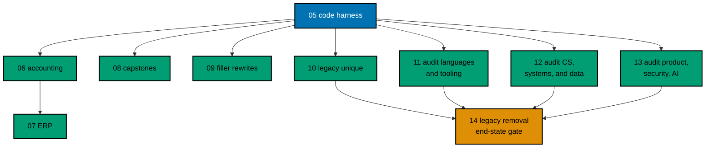

# AyoKoding Learn Revamp 05 — Code Harness

> **Status:** Backlog. Do not execute until the user gives an explicit execution command for this
> plan. This plan depends on no other plan in the series.

AyoKoding courses hold about 9,500 code files in about 25 languages, and nothing runs them. The user
asked that "all the code is solid" (series decision 26). This plan builds the tool that proves it: a
**code harness** that runs every course example in a pinned container, checks the output, and checks
that the code shown in the lesson is the same code that runs.

The harness is a new command-line tool, `apps/ayokoding-cli`, written in Go with the Cobra command
framework and held to the same strictness as the sibling HIPPO repository. This plan builds the tool,
defines the `run.yaml` contract that content plans 06–13 follow, wires the tool into Nx and CI, and
propagates the new rule into the tutorial and content quality gates. It migrates **no** course: a
course without a `run.yaml` stays exactly as it is, and the harness ignores it.

## Scope

- **Revive `apps/ayokoding-cli` as a Go + Cobra CLI** (decision 37). It is a full-bar Nx project
  with the roots-be layout and targets, the product shape of `ferret-cli` and `crane-cli` (README,
  CHANGELOG, CONTRIBUTING, LICENSE, `behaviour-coverage.json`, Gherkin under `specs/`), and the
  HIPPO strictness bar:
  - golangci-lint v2 with `default: all`, where every disabled linter has a written reason;
  - gofumpt and goimports;
  - depguard allowlists for production and test code;
  - nilaway and architecture tests;
  - a 99% coverage floor on the deterministic core;
  - godog unit, integration, and end-to-end (E2E) adapters, where E2E runs the built binary
    stamped with version and commit.

  [tech-docs/002](./tech-docs/002-cli-project-and-hippo-parity.md) holds the side-by-side parity
  table.

- **The `run.yaml` contract** (decision 30). It covers:
  - where examples, katas, and capstone code live;
  - what a `run.yaml` declares: toolchain, command, expected output or invariant, optional tests,
    services, dependencies, and seeds;
  - how a lesson's code block is anchored to the file it shows.

  It also fixes the migration contract that content plans 06–13 follow
  ([tech-docs/003](./tech-docs/003-run-yaml-contract.md),
  [tech-docs/004](./tech-docs/004-content-layout-and-migration-contract.md)).

- **Runners** (decision 32). Anything that runs in a Linux container runs for real, including
  PostgreSQL 18 and Neo4j 2026.09 as service containers. Each image is pinned by digest. Cloud,
  cluster, iOS, Android, and Windows code uses `mode: static` (compile, parse, or validate) with a
  written reason. Languages that have no official image get a small derived image built from a
  checksum-pinned upstream release ([tech-docs/005](./tech-docs/005-runners-and-toolchain-catalog.md)).
- **Determinism** (decision 31). The harness:
  - runs examples with no network, a fixed environment, and resource limits;
  - runs every example twice under different CPU limits and compares the two outputs byte for byte.

  It also defines the deterministic-simulation convention that course teaching code follows: a
  virtual clock, seeded faults, a fixed seed set, failing seeds printed, and one-seed replay
  ([tech-docs/006](./tech-docs/006-determinism-and-simulation.md)).

- **CI** (decision 33). A new Nx target, `ayokoding-www:examples:check`, runs:
  - affected courses on each pull request;
  - a sharded full run monthly, and on any change to the toolchain catalog;
  - never a daily run.

  A coverage report shows how much of each course the harness covers; plans 06–13 drive it to 100%
  and plan 14 measures the end state ([tech-docs/007](./tech-docs/007-ci-and-nx-targets.md)).

- **Inert by default.** The harness does nothing for a course without a `run.yaml`. It
  automatically selects only courses that opted in.
- **Rule propagation.** The four tutorial quality gates, the Content Quality Gate's AyoKoding
  adapter, the content-author skill, the Nx target and workflow naming lists, the CLI tier record,
  and the repository adapter learn about the harness. A course is "done" only when the harness is
  green (decision 27) ([tech-docs/011](./tech-docs/011-rule-and-docs-impact.md)).

## Non-Goals

- **Migrating course code.** No course gets a `run.yaml` here except the harness's own test
  fixtures under `apps/ayokoding-cli/tests/testdata/`. Plans 06–13 migrate their courses and fix the
  1,124 lesson-to-file mismatches measured on 2026-10-09.
- **Teaching simulation libraries.** The deterministic-simulation helpers are teaching code inside
  course content (decision 37). This plan defines their convention only.
- **UI work.** Plans 01–04 own every reader-visible change. The harness ships no UI and changes no
  rendered page.
- **The end-state gate.** Plan 14 measures the series end state, including harness coverage at 100%
  (decision 40).
- **A `paths core` subcommand.** Plan 02 offered an optional `ayokoding-cli paths core` subcommand.
  This plan declines it (decision D18 in [tech-docs/009](./tech-docs/009-decision-records.md)).
- **Indonesian content.** `content/id/**` stays untouched.

## Dependency and Result

## Series Context

This plan is row 05 of the 14-plan **AyoKoding Learn Revamp** series. Each plan is one PR delivered
from its own worktree.

The series started when the user asked, in Indonesian, whether the AyoKoding learning paths and
courses are usable, and whether `learn/legacy` can be removed. On 2026-10-09 the user resolved the
series decisions in a grilling session. This plan copies every decision it relies on into
[brd.md](./brd.md#resolved-series-decisions-this-plan-relies-on).

| NN  | Plan suffix                   | Scope                                                                                        | Depends on       |
| --- | ----------------------------- | -------------------------------------------------------------------------------------------- | ---------------- |
| 01  | `navigation-and-display`      | Strip `NN ·` title prefixes; path position numbers; sidebar auto-scroll; render fixes        | —                |
| 02  | `path-model`                  | Phases, goals, `assumes`, outline marker, prerequisite revision, closure checks, career copy | 01               |
| 03  | `catalog-and-metadata`        | Course metadata schema and backfill, categories, catalog page, course landing header         | 01               |
| 04  | `learning-experience`         | Browser progress, phase roadmap page, context bar, mark complete, Learn home                 | 02, 03           |
| 05  | `code-harness` (this plan)    | `ayokoding-cli`, `run.yaml` contract, runners, Nx target, CI, quality-gate propagation       | —                |
| 06  | `accounting-courses`          | Write 24 accounting courses; restructure both accounting paths in the same PR                | 02, 03, 05       |
| 07  | `erp-courses`                 | Write 30 ERP courses; restructure both ERP paths in the same PR                              | 06               |
| 08  | `capstone-courses`            | Rewrite 8 skeleton capstones                                                                 | 02, 03, 05       |
| 09  | `filler-rewrites`             | Rewrite 8 templated filler courses                                                           | 03, 05           |
| 10  | `legacy-unique-migration`     | Build courses for legacy topics without an equivalent; record the legacy-to-course map       | 03, 05           |
| 11  | `audit-languages-and-tooling` | Audit and fix language and tooling courses, with a `run.yaml` for every example              | 05               |
| 12  | `audit-cs-systems-and-data`   | Audit and fix CS, systems, concurrency, distributed, database, and data courses              | 05               |
| 13  | `audit-product-security-ai`   | Audit and fix web, backend, mobile, security, AI, testing, architecture, and product courses | 05               |
| 14  | `legacy-removal`              | Delete `learn/legacy`, add 308 redirects, repoint `docs/` links; series end-state gate       | 10 (+11–13 done) |

## The Contract Content Plans Follow

Plans 06–13 must follow the contract in
[tech-docs/004 Migration Contract](./tech-docs/004-content-layout-and-migration-contract.md#migration-contract-for-plans-0613).
In short:

1. A course opts in by adding its first `run.yaml`. From then on the course is all-or-nothing:
   - every unit has a `run.yaml`;
   - every code block in its lessons is either anchored to a file and byte-identical to it, or
     marked `<!-- harness: illustration -->`;
   - every `**Output**` block is anchored to an expected-output file.
2. Examples live in `learning/code/ex-NN-<slug>/`, katas in `drilling/code/kata-NN-<slug>/`, and
   capstone code in `learning/capstone/code/`. Any other code location is moved there.
3. Every run is deterministic: no network, no wall clock, fixed seeds, and output that does not
   depend on thread order. Distributed and concurrency examples use the simulation convention.
4. Code that cannot run in a Linux container uses `mode: static` with one of the closed reasons
   (`cloud`, `cluster`, `ios`, `android`, `windows`) and a written note.
5. A course is done only when `ayokoding-cli examples check --course <slug>` exits 0 (decision 27).

## Navigation

- [Business requirements](./brd.md)
- [Product requirements and Gherkin](./prd.md)
- [Technical design](./tech-docs/README.md)
- [Delivery checklist](./delivery.md)
- [Execution learnings](./learnings.md)
