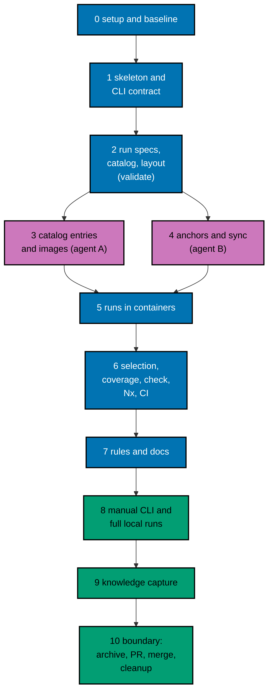

# Delivery Plan — AyoKoding Learn Revamp 05: Code Harness

> **Legend** — `[AI]`: an agent performs the step (the default; unmarked steps are `[AI]`).
> `[HUMAN]`: only a human can do it (physical action, out-of-band approval, real-secret or
> privileged-credential handling). `[AI+HUMAN]`: agent prepares, human approves or finishes.

**Do not start** until the user gives an explicit execution command for this plan. That command
authorizes this plan's change set: commits, pushes, the PR, the merge, and the one post-merge
workflow dispatch described below. This plan depends on no other plan.

## Interpretation to Confirm at Execution

Decision D12 ([tech-docs/009](./tech-docs/009-decision-records.md#d12--static-mode-also-covers-windows-interpretation-of-decision-32))
reads decision 32 as covering Windows code with `mode: static`, because Windows code cannot run in a
Linux container. The user's execution command confirms it unless the user says otherwise. If the
user rejects it, Phase 2 removes `windows` from the closed reason list and Phase 3 drops the
`windows-static` image, and the two Windows courses become a follow-up for the user to decide.

## Worktree

- **Execution worktree:** `worktrees/ayokoding-learn-revamp-05-code-harness/`
- **Provisioning command** (from the repository root, at Step 0):
  `claude --worktree ayokoding-learn-revamp-05-code-harness`, or the equivalent
  `rtk git worktree add -b ayokoding-learn-revamp-05-code-harness-base worktrees/ayokoding-learn-revamp-05-code-harness origin/main`.
- **Provisioning status:** pending
- **Authoring-worktree exception:** this plan was authored inside the separate authoring worktree
  `.claude/worktrees/ayokoding-update` (branch `worktree-ayokoding-update`). The user required that
  session to write all plans of the AyoKoding Learn Revamp series together, and said in Indonesian
  not to execute any plan before the user gives the command. That authoring worktree is **never**
  used for execution. The Provisioned Worktree Identity and the Delivery Branch Inventory are
  intentionally omitted until Step 0 creates them.
- **Step 0 obligation (blocking):** Phase 0's first outcome:
  - provisions the execution worktree from fresh `origin/main` per the
    [Worktree Path Convention](../../../repo-governance/conventions/structure/worktree-path.md);
  - initializes it per
    [Worktree Toolchain Initialization](../../../repo-governance/development/workflow/worktree-setup.md);
  - writes the immutable identity and the first inventory row into this section;
  - replaces `Provisioning status: pending` with `Provisioning status: provisioned`;
  - syncs with `origin/main`.

  No implementation step may start while the status is pending.

- **Cleanup:** after the PR merges, the worktree, its branches, and this plan's scratch come down
  through [Dev Artifact Clean-Up](../../../repo-governance/workflows/maintenance/dev-artifact-clean-up.md)
  (Phase 10).
- **Worktree cap:** one worktree for this plan in this repository, reused by every phase.

The plan never records an absolute or machine-specific path. Resolve the declared route at runtime
and reconcile it with `rtk git worktree list --porcelain`.

## Delivery Mode: worktree-to-pr

`worktree-to-pr` is mandatory in this repository. One branch and **one PR** deliver the whole plan
(the series rule: each plan is one PR from its own worktree). The PR needs:

- the exact current-head/base `Quality gate` from `.github/workflows/pr-quality-gate.yml`;
- an exact-head posted `pr-leak-review` `pass` (`leak-review` status).

Broad semantic PR review is not run unless the user asks for it. `[AI]` merges once the hardened
merge preconditions hold.

## Parallelization Model

The work is one dependency chain with one fork:

- Phase 1 builds the project skeleton.
- Phase 2 adds the pure models that every later phase reads.
- Phases 3 (catalog and images) and 4 (anchors and sync) touch disjoint files, so two agents run
  them at the same time.
- Phase 5 needs both, because runs need images and fixtures need synced lessons.
- Phases 6–10 run in order.

### Delivery Boundaries

| Phase(s) | Natural cohesive seam                                              | Worktree                                            | Branch                                   | Delivery opportunity             | Exact resulting `main` / rollback / feature-flag evidence                                                                                                                                                                                                                                                                       |
| -------- | ------------------------------------------------------------------ | --------------------------------------------------- | ---------------------------------------- | -------------------------------- | ------------------------------------------------------------------------------------------------------------------------------------------------------------------------------------------------------------------------------------------------------------------------------------------------------------------------------- |
| 0        | — (setup and baseline)                                             | —                                                   | —                                        | none                             | No resulting state change; flag not applicable                                                                                                                                                                                                                                                                                  |
| 1–10     | The code harness: CLI, contract, runners, CI, and rule propagation | `worktrees/ayokoding-learn-revamp-05-code-harness/` | `ayokoding-learn-revamp-05-code-harness` | PR opened and merged in Phase 10 | `main` gets `apps/ayokoding-cli`, its specs, the `examples:check` target, the CI jobs, and the rule texts together. With zero opted-in courses, every reader-visible page and every existing check behaves exactly as before. Rollback: revert the merge commit in a revert PR. No flag: inert-by-default is the safety switch. |

### Agent Topology

- **Main thread (root coordinator):** owns the file ledger, every gate, integration of agent output,
  and every commit. It keeps itself free and fills background slots first.
- **N = 3 background agents**, at most, at any time:
  - **Phases 1, 2, 5, 6:** one `specs-maker` writes the Gherkin, then one `swe-developer` writes
    tests and code. They run in sequence because they share step files. In parallel, a second
    `swe-developer` may take a disjoint package named in the phase (for example
    `internal/domain/selection` while the first owns `internal/domain/coverage`).
  - **Phases 3 and 4:**
    - agent A, `swe-developer`, owns Phase 3 (`toolchains/**`,
      `internal/domain/containerplan/build*.go`, `internal/adapters/containers/build*.go`);
    - agent B, `swe-developer`, owns Phase 4 (`internal/domain/anchors/**`,
      `internal/adapters/content/sync*.go`, `scripts/format-staged*`);
    - a `web-researcher` agent may help agent A re-verify versions.
  - **Phase 7:** `rules-maker` (rule module and gate texts), then `docs-fixer` and `readme-fixer`
    (docs propagation).
  - **Phase 8:** the root runs the manual checks; `swe-reviewer` reviews the CLI code once (at most
    2 cycles).
- Record every agent ID, its file set, and its review-cycle count in
  `local-tmp/ayokoding-learn/plan-05/execution-ledger.md`.

### Execution Packet Defaults

- **Plan path after promotion:** `plans/in-progress/ayokoding-learn-revamp-05-code-harness/`
  (written below as `<plan>/`). Evidence goes to `<plan>/evidence/`.
- **Scratch:** the execution ledger and raw command output live in the execution worktree's
  `local-tmp/ayokoding-learn/plan-05/` (gitignored).
- **Scratch content roots:** enforcement proofs copy fixture courses to
  `local-tmp/ayokoding-learn/plan-05/content/`, never into `apps/ayokoding-www/content/`.
- **No ad-hoc scripts (decision 37):** every check this plan needs becomes a CLI command or a test.
  Read-only inspection with `rtk git grep`, `rtk git diff`, and `rtk git ls-tree` is fine.
- **Evidence hygiene:** evidence files contain repository-relative paths only. Never paste an
  absolute home-directory path, a hostname, a token, an image registry credential, or `.env*`
  content.
- **Never commit** `apps/ayokoding-www/next-env.d.ts` (the dev server rewrites it) or
  `.serena/project.yml`. Before every commit run `rtk git status --short` and restore either file
  with `rtk git checkout -- <file>` if it shows as modified.
- **Never touch** `.env.prod` or `.env.stag`. This plan needs no environment file.
- **No git identity changes.** Never run `git config user.*`.
- **Bounded loops:** any maker→checker review loop runs at most 2 cycles. A file still failing
  after cycle 2 is recorded as `BLOCKED` in the execution ledger with its findings and reported to
  the user; the phase gate stays open until the user decides.
- **Failure handling:** on any unexpected failure:
  1. save the output to the phase evidence file;
  2. fix the root cause (never skip, retry-until-green, sleep, loosen, widen, quarantine, or delete
     a test);
  3. rerun the same command;
  4. note the fix.

> **Important**: Fix ALL failures found during quality gates, not just those caused by your
> changes. This follows the root cause orientation principle — proactively fix preexisting
> errors encountered during work.

### Command Reference

Run every command from the execution worktree root. Expected results are stated at each use.

| Name                | Command                                                                                                                                                                                               |
| ------------------- | ----------------------------------------------------------------------------------------------------------------------------------------------------------------------------------------------------- |
| `GO-MOD`            | `rtk ./hippo run --class transactional --resource-tier standard --disk-path . --cwd apps/ayokoding-cli -- go mod tidy`                                                                                |
| `GO-TEST <pkgs>`    | `rtk ./hippo run --class ephemeral --resource-tier standard --disk-path . --cwd apps/ayokoding-cli -- go test -race -count=1 <pkgs>`                                                                  |
| `BDD <adapter>`     | `rtk ./hippo run --class ephemeral --resource-tier standard --disk-path . --cwd apps/ayokoding-cli -- env AYOKODING_BDD_ADAPTER=<adapter> go test -count=1 ./tests/bdd`                               |
| `CLI-LINT`          | `rtk ./hippo run --class ephemeral --resource-tier standard --disk-path . -- npm exec nx -- run ayokoding-cli:lint`                                                                                   |
| `CLI-UNIT`          | `rtk ./hippo run --class ephemeral --resource-tier standard --disk-path . -- npm exec nx -- run ayokoding-cli:test:unit`                                                                              |
| `CLI-QUICK`         | `rtk ./hippo run --class ephemeral --resource-tier standard --disk-path . -- npm exec nx -- run ayokoding-cli:test:quick`                                                                             |
| `CLI-BEHAVIOUR`     | `rtk ./hippo run --class ephemeral --resource-tier standard --disk-path . -- npm exec nx -- run ayokoding-cli:test:coverage`                                                                          |
| `CLI-INTEGRATION`   | `rtk ./hippo run --class ephemeral --resource-tier heavy --disk-path . -- npm exec nx -- run ayokoding-cli:test:integration`                                                                          |
| `CLI-E2E`           | `rtk ./hippo run --class ephemeral --resource-tier heavy --disk-path . -- npm exec nx -- run ayokoding-cli:test:e2e`                                                                                  |
| `CLI-BUILD`         | `rtk ./hippo run --class ephemeral --resource-tier standard --disk-path . -- npm exec nx -- run ayokoding-cli:build`                                                                                  |
| `FIXTURE <args>`    | `rtk ./hippo run --class ephemeral --resource-tier heavy --disk-path . -- apps/ayokoding-cli/dist/ayokoding-cli --content apps/ayokoding-cli/tests/testdata/courses <args>`                           |
| `SMOKE`             | `rtk ./hippo run --class ephemeral --resource-tier heavy --disk-path . -- apps/ayokoding-cli/dist/ayokoding-cli --content apps/ayokoding-cli/tests/testdata/toolchain-smoke examples check --all`     |
| `EXAMPLES-CHECK`    | `rtk ./hippo run --class ephemeral --resource-tier heavy --disk-path . -- npm exec nx -- run ayokoding-www:examples:check`                                                                            |
| `WWW-QUICK`         | `rtk ./hippo run --class ephemeral --resource-tier standard --disk-path . -- npm exec nx -- run ayokoding-www:test:quick`                                                                             |
| `ROOTS-QUICK`       | `rtk ./hippo run --class ephemeral --resource-tier standard --disk-path . -- npm exec nx -- run roots-be:test:quick`                                                                                  |
| `SCRIPT-TESTS`      | `rtk ./hippo run --class ephemeral --resource-tier standard --disk-path . -- node --test scripts/format-staged.test.mjs scripts/workflow-language-lanes.test.mjs scripts/behaviour-coverage.test.mjs` |
| `LINT-WORKFLOWS`    | `rtk ./hippo run --class ephemeral --resource-tier standard --disk-path . -- scripts/lint-workflows`                                                                                                  |
| `ADAPTERS-GEN`      | `rtk ./hippo run --class transactional --resource-tier standard --disk-path . -- ./rhino harness adapters generate`                                                                                   |
| `ADAPTERS-VALIDATE` | `rtk ./hippo run --class ephemeral --resource-tier standard --disk-path . -- ./rhino harness adapters validate`                                                                                       |
| `ENV-VALIDATE`      | `rtk ./hippo run --class ephemeral --resource-tier standard --disk-path . -- ./rhino env validate`                                                                                                    |
| `LINT-MD`           | `rtk npm run lint:md`                                                                                                                                                                                 |

Notes:

- `GO-TEST` and `BDD` take paths relative to `apps/ayokoding-cli/`.
- `CLI-BEHAVIOUR` runs the four static validators (unit, integration, E2E, behaviour).
- `CLI-E2E`, `FIXTURE`, `SMOKE`, and `EXAMPLES-CHECK` with opted-in courses need a running Docker
  daemon.
- The binary used by `FIXTURE` and `SMOKE` comes from `CLI-BUILD`.

### Commit Guidelines

- [ ] [AI] Do not stage or commit until the user's execution command has authorized this plan's
      change set; do not extend a commit beyond it.
- [ ] [AI] Use the fewest build-valid, independently reviewable and revertible commits, one coherent
      purpose each. Suggested: one per phase 1–7, then evidence and the archival move.
- [ ] [AI] Follow Conventional Commits: `<type>(<scope>): <description>`, imperative, no period (for
      example `feat(ayokoding-cli): run course examples in pinned containers`).
- [ ] [AI] Keep each change with its tests, specs, docs, and generated harness routes in the same
      commit; stage explicit paths only, never `git add -A`.

### Files Changed

The full root-relative tree is in [tech-docs/010](./tech-docs/010-file-impact.md). In short:

- **New project:** `apps/ayokoding-cli/**`, apart from the existing `LICENSE`.
- **New specs:** `specs/apps/ayokoding/cli/**`, with 13 feature files and 63 scenarios.
- **Edits:**
  - `apps/ayokoding-www/project.json` and `apps/ayokoding-www/README.md`;
  - `.github/actions/setup-go/action.yml` and five workflow files, two of them new;
  - `scripts/format-staged` and its test;
  - `repo-config.yml`.
- **Rules and docs (Phase 7):**
  - the four tutorial gates, the AyoKoding gate adapter, and the CLI tier record;
  - the Nx target, tag, and workflow-naming records, and the repository adapter;
  - the content skill and its new module, plus regenerated bindings;
  - five `docs/reference/` files, `apps/README.md`, `specs/apps/ayokoding/README.md`, and
    `.github/workflows/README.md`.
- **Plan:** `<plan>/delivery.md`, `<plan>/learnings.md`, `<plan>/evidence/**`.

No file under `apps/ayokoding-www/content/` or `apps/ayokoding-www/src/` changes.

### Before Phase 0: Promotion

- [ ] [AI] Promote the plan per
      [Starting and Completing Work](../../../repo-governance/conventions/structure/plans/starting-and-completing-work.md):
      a pure move of `plans/backlog/ayokoding-learn-revamp-05-code-harness/` to
      `plans/in-progress/ayokoding-learn-revamp-05-code-harness/` plus the `plans/backlog/README.md`
      and `plans/in-progress/README.md` index updates, landed on `origin/main` through its own PR.
      Acceptance:
      `rtk git ls-tree -r --name-only origin/main plans/in-progress/ayokoding-learn-revamp-05-code-harness/`
      lists this plan's files. This promotion PR is separate from the delivery unit.

---

## Phase 0: Worktree, Environment, Preconditions, and Baseline

Phase 0 opens no PR. Its evidence rides the delivery PR.

- **Input:** the promotion on `origin/main`; this plan at `<plan>/`.
- **Outcome:**
  - a provisioned, initialized worktree;
  - confirmed preconditions;
  - re-verified toolchain versions;
  - a re-read of HIPPO's configuration;
  - a green baseline.
- **Proof:** `<plan>/evidence/phase-0-baseline.md`.

- [ ] [AI] **Plan quality gate (deferred from authoring):** run the `plan-quality-gate` workflow on this
      plan with `max-cycles` 2 before any other step below. It was deliberately not run when this plan was
      written, to keep token use even (user decision, 2026-10-09). Acceptance: verdict `PASS` or
      `PASS_WITH_FINDINGS`; record the line `plan-quality-gate: <verdict> (<n> cycles, <k> open)` in this
      file's header section. If the plan is still in `plans/backlog/`, run the gate before the promotion PR.
      A `BLOCKED` verdict stops execution and is reported to the user.
- [ ] [AI] **Step 0 (blocking first outcome):** from the repository root, provision the execution
      worktree with the command in [## Worktree](#worktree). Record the Provisioned Worktree
      Identity in [## Worktree](#worktree):
  - declared route `worktrees/ayokoding-learn-revamp-05-code-harness/`;
  - initial branch `ayokoding-learn-revamp-05-code-harness-base`;
  - creator;
  - UTC creation time.

  Add the first Delivery Branch Inventory row (`provisioned`, `active`, proof `git worktree add` at
  the timestamp) and set `Provisioning status: provisioned`. Acceptance:
  `rtk git worktree list --porcelain` lists the worktree on the base branch.

- [ ] [AI] From the worktree root, run
      `rtk ./hippo run --class transactional --resource-tier standard --disk-path . -- npm install`.
      Acceptance: exit 0 and Husky hooks installed (`.husky/_` exists).
- [ ] [AI] Run `rtk npm run doctor`. Acceptance: exit 0. Only if it reports a missing or drifted
      toolchain, run
      `rtk ./hippo run --class transactional --resource-tier standard --disk-path . -- ./rhino toolchain provision --apply`
      and then `rtk npm run doctor` again (exit 0).
- [ ] [AI] Sync and branch: run `rtk git fetch origin`, then `rtk git merge --ff-only origin/main`,
      then `rtk git switch -c ayokoding-learn-revamp-05-code-harness`. Append the branch to the
      inventory (`worktree-to-pr`, `active`). Acceptance: `rtk git status` shows the new branch,
      clean.
- [ ] [AI] **Precondition — the CLI folder is still a stub:** run
      `rtk git ls-tree -r --name-only origin/main apps/ayokoding-cli/`. Acceptance: exactly
      `apps/ayokoding-cli/LICENSE`. Anything else means someone revived the folder: stop and report
      to the user.
- [ ] [AI] **Precondition — no course has opted in:** run
      `rtk git ls-tree -r --name-only origin/main apps/ayokoding-www/content/en/learn/courses/` and
      count lines ending in `/run.yaml`. Acceptance: 0. Plans 06–13 depend on this plan, so a
      non-zero count means the series order was broken: stop and report.
- [ ] [AI] **Overlap check — plans 01–04:** run
      `rtk git diff --stat bb7f90137 origin/main -- .agents/skills/apps-ayokoding-www-developing-content repo-governance/development/quality/gate-adapters/ayokoding-www.md repo-governance/workflows/quality apps/ayokoding-www/project.json apps/ayokoding-www/README.md .github/workflows/pr-quality-gate.yml scripts/format-staged`.
      Record every changed path. Acceptance: the record exists. Phases 6 and 7 edit on top of
      whatever landed and never revert it.
- [ ] [AI] **HIPPO re-read:** read `.golangci.yml`, `go.mod` (`go` directive, `tool` block, the
      golangci-lint version), and `scripts/test-quick.sh` in the read-only sibling HIPPO checkout
      (resolve its location from the
      [related repositories reference](../../../docs/reference/related-repositories.md); never write
      to it). Compare each with the parity table in
      [tech-docs/002](./tech-docs/002-cli-project-and-hippo-parity.md#hippo-parity-table).
      Acceptance: every difference is recorded with the row it changes; Phase 1 applies them.
- [ ] [AI] **Version re-check:** for each catalog entry in
      [tech-docs/005](./tech-docs/005-runners-and-toolchain-catalog.md#catalog-entries), read its
      listed source and apply the version policy (`web-researcher` may help). Acceptance: a table of
      id, chosen version, source URL, and date, saved in the evidence.
- [ ] [AI] **Docker probe:** run
      `rtk ./hippo run --class ephemeral --resource-tier standard --disk-path . -- docker version --format '{{.Server.Version}}'`.
      Acceptance: exit 0 and a server version; record it. If the daemon is unavailable, start it
      (`[HUMAN]` if it needs a desktop action) before Phase 3.
- [ ] [AI] **Baseline:** run `WWW-QUICK`, `ROOTS-QUICK`, `SCRIPT-TESTS`, `LINT-WORKFLOWS`,
      `ENV-VALIDATE`, and `LINT-MD`. Acceptance: each exits 0. Save the summaries. If anything fails
      before any change, fix the root cause first.

### Phase 0 Gate

> All checks below must pass before starting Phase 1.

- [ ] [AI] `Provisioning status: provisioned`, with identity and inventory recorded.
- [ ] [AI] `<plan>/evidence/phase-0-baseline.md` records:
  - both preconditions;
  - the overlap paths;
  - the HIPPO differences;
  - the version table;
  - the Docker version;
  - six green baseline commands.
- [ ] [AI] `rtk git status --short` shows only `<plan>/` changes.

> **Pause Safety**: the worktree is provisioned and green, the baseline is recorded, and no product
> file has changed. Safe to stop. To resume:
> `rtk git -C worktrees/ayokoding-learn-revamp-05-code-harness status --short`, then `WWW-QUICK`.

---

## Phase 1: Project Skeleton and the Command-Line Contract

- **Input:**
  - [tech-docs/002](./tech-docs/002-cli-project-and-hippo-parity.md): the layout, command tree,
    streams and statuses, Nx targets, and parity table;
  - prd.md FR-1, FR-14, NFR-2, NFR-3, and `cli-contract/command-line-contract.feature`;
  - decisions D1, D2, D5, D19.
- **Outcome:** a full-bar Nx project. It has the module, pinned tools, strict linter, architecture
  tests, coverage gate, every target, a Cobra root with help, version, and usage errors, the exit
  mapping, and eight of the nine CLI-contract scenarios bound in the unit, integration, and E2E
  adapters where the feature says so. The interrupt scenario needs containers, so Phase 5 adds it.
- **Proof:** `<plan>/evidence/phase-1-skeleton.md`, with every RED and GREEN output.
- _Suggested executor: `specs-maker` for Gherkin, `swe-developer` for code._

### AC-1.1 — Module, pinned tools, and the strict linter bite

- [ ] [AI] Create `apps/ayokoding-cli/go.mod` with:
  - module `github.com/wahidyankf/ose-public/apps/ayokoding-cli` and `go 1.26.1`, or the HIPPO value
    recorded in Phase 0;
  - `require` cobra v1.10.2 and `go.yaml.in/yaml/v3` v3.0.4;
  - the test dependencies godog v0.16.0 and messages/go/v34 v34.2.0;
  - the `tool` block (golangci-lint v2 at HIPPO's version, nilaway, goimports, govulncheck, gofumpt,
    shfmt).

  Run `GO-MOD`. Acceptance: exit 0 and `go.sum` written.

- [ ] [AI] Create `.golangci.yml` exactly per parity rows 6–19. Every disabled linter has a reason
      comment.
- [ ] [AI] **RED:** add a probe file `apps/ayokoding-cli/internal/domain/finding/probe.go` holding:
  - an exported function without a doc comment;
  - a `//nolint` without a linter name or reason;
  - an `errors.New` call inline in a return.

  Add a minimal `project.json` with `lint` and `typecheck` per tech-docs/002. Run `CLI-LINT`.
  Acceptance: it fails, naming `revive` (exported), `nolintlint`, and `err113`.

- [ ] [AI] **GREEN:** delete the probe and add `cmd/ayokoding-cli/main.go`, which calls
      `bootstrap.Main`, plus a documented minimal `internal/bootstrap`. Run `CLI-LINT`. Acceptance:
      exit 0.
- [ ] [AI] **REFACTOR:** order the disable list alphabetically, and make each reason a single line
      that names this tool's own situation. Run `CLI-LINT`. Acceptance: exit 0.

### AC-1.2 — Architecture tests guard the production graph

- [ ] [AI] **RED:** write `tests/architecture/imports_test.go`, which uses `go/parser` in
      imports-only mode. It covers the rules in parity row 21 and adds negative fixtures in
      `tests/architecture/testdata/*.go.txt`: a domain file importing `os/exec`, a domain file
      importing cobra, and an application file importing `internal/bootstrap`. Each fixture must be
      reported. Write the test before the rule table exists. Run `GO-TEST ./tests/architecture`.
      Acceptance: it fails (compile error or missing rule).
- [ ] [AI] **GREEN:** add the rule table and the walker. Rerun. Acceptance: the negative fixtures
      are reported and the real tree passes.
- [ ] [AI] **REFACTOR:** give each rule a one-line reason string that appears in its failure
      message. Rerun. Acceptance: pass.

### AC-1.3 — Gherkin first: the CLI-contract corpus

- [ ] [AI] Create:
  - `specs/apps/ayokoding/cli/README.md`;
  - `specs/apps/ayokoding/cli/architecture.md` (the three C4 views from
    [tech-docs/001](./tech-docs/001-architecture.md));
  - `behaviours/README.md`;
  - `behaviours/cli-contract/README.md`;
  - `behaviours/cli-contract/command-line-contract.feature`, copied from prd.md without the
    interrupt scenario (Phase 5 adds it), with its exemption
    comments and tags.
- [ ] [AI] Create `apps/ayokoding-cli/behaviour-coverage.json` (tech-docs/002), plus the
      `test:coverage:{unit,integration,e2e,behaviour}` and `test:coverage` targets. Run
      `CLI-BEHAVIOUR`. Acceptance: it fails and names exactly the eight scenarios as unbound (and the
      seven E2E-bound ones for E2E).

### AC-1.4 — Help, version, bare invocation, usage errors, JSON error bodies

- [ ] [AI] **RED:** in `internal/adapters/cli`, write table-driven tests that run the root command
      in process, with in-memory streams, for:
  - `--help`, which lists both commands and all nine statuses;
  - no arguments, which exits 2 with usage on stderr;
  - `--version`;
  - `--no-such-flag`, which exits 2 with stdout empty;
  - `--output json examples run`, which exits 2 with one JSON body on stderr carrying
    `ayokoding.usage.missing-selection`.

  Run `GO-TEST ./internal/adapters/cli/...`. Acceptance: the tests fail.

- [ ] [AI] **GREEN:** implement the Cobra tree with placeholder-free leaf commands. A leaf not built
      yet returns the usage error `ayokoding.usage.not-implemented`, which is removed by Phase 6.
      Implement the renderer and the version string
      `ayokoding-cli <version> (commit <commit>, catalog <hash>)`. Rerun. Acceptance: pass.
- [ ] [AI] **REFACTOR:** move the status table into `internal/domain/finding`, so help text and exit
      mapping read the same source. Rerun. Acceptance: pass.

### AC-1.5 — Exit mapping, panic recovery, colour, interrupt, closed pipe

- [ ] [AI] **RED:** unit tests for:
  - the exit-mapping function (result kinds → 0/1/2, environment errors → 124–127, signal → 128+N);
  - a recovered panic, which maps to 2 with `ayokoding.internal.panic` and no trace;
  - colour decisions (`--color` × `NO_COLOR` present or absent).

  Integration tests in `tests/integration/signals_test.go` build the binary into `t.TempDir()`, send
  SIGINT, and expect 130. They also close stdout early and expect 141. Run
  `GO-TEST ./internal/... ./tests/integration/...`. Acceptance: the tests fail.

- [ ] [AI] **GREEN:** implement the top-level recover in `bootstrap.Main`, signal handling through
      `signal.NotifyContext` with a cleanup hook (wired to containers in Phase 5), and SIGPIPE
      behaviour. Rerun. Acceptance: pass.
- [ ] [AI] **REFACTOR:** keep `main.go` to one call. Rerun. Acceptance: pass.

### AC-1.6 — Coverage gate, the full target set, and repository registration

- [ ] [AI] **RED:** add `tests/coverage` (the HIPPO-style helper: profile, directories, files,
      minimum), `scripts/coverage-gate.sh`, and a `test:unit` target. `test:unit` runs the
      skipped-test guard, then `COVERAGE_MINIMUM=99 apps/ayokoding-cli/scripts/coverage-gate.sh`.
      The script runs:
  1. `go test -race -count=1 ./tests/architecture ./tests/coverage`;
  2. every package's tests with `-race` and `-coverpkg` over `./internal/domain/...` and
     `./internal/application/...`;
  3. the helper with `--minimum "$COVERAGE_MINIMUM"`;
  4. `AYOKODING_BDD_ADAPTER=unit go test -race -count=1 ./tests/bdd`.

  Temporarily add an untested exported function in `internal/domain/finding`, and run `CLI-UNIT`.
  Acceptance: it fails below 99%. Then add `t.Skip()` to one test and run it again. Acceptance: the
  guard fails.

- [ ] [AI] **GREEN:** remove both probes. Add the remaining targets from tech-docs/002:
  - `install`, `build`, `run`;
  - `test:integration`;
  - `test:e2e` with `scripts/test-e2e.sh`;
  - `test:quick`;
  - `deps:audit`;
  - `compat:min-version` with its script.

  Add `.gitignore` (`dist/`, `coverage/`). Run `CLI-UNIT` and `CLI-QUICK`. Acceptance: both exit 0.

- [ ] [AI] **Bind the scenarios:** in `tests/bdd`, write the godog suite (`Strict: true`), the
      driver interface, and three drivers:
  - unit: in-process;
  - integration: built binary and temp dirs;
  - e2e: `AYOKODING_BIN`.

  Bind the eight CLI-contract scenarios. Run `BDD unit`, `CLI-INTEGRATION`, `CLI-E2E`, and
  `CLI-BEHAVIOUR`. Acceptance: all exit 0.

- [ ] [AI] **Register the project in `repo-config.yml`:**
  - add `ayokoding-cli: {path: apps/ayokoding-cli, kind: app, stacks: [golang]}` under
    `extensions.software-development.projects`;
  - add `apps/ayokoding-cli/README.md` to the heading-hierarchy surface globs;
  - create a stub-free `apps/ayokoding-cli/README.md` with the help excerpt, commands, and targets.

  Run `ENV-VALIDATE`. Acceptance: exit 0. If it reports the CLI's variable reads
  (`AYOKODING_CONTAINER_CLI`, `AYOKODING_BUILDX_CACHE`, `NO_COLOR`) as undeclared, declare them the
  way the env contract requires and record the choice.

### Phase 1 Gate

> All checks below must pass before starting Phase 2.

- [ ] [AI] `CLI-QUICK` exits 0 (lint, NilAway, typecheck, unit with `-race`, 99% floor, static
      coverage).
- [ ] [AI] `CLI-INTEGRATION` and `CLI-E2E` exit 0 with the eight CLI-contract scenarios.
- [ ] [AI] `ENV-VALIDATE` and `LINT-MD` exit 0.
- [ ] [AI] `rtk git status --short` lists only `apps/ayokoding-cli/**`, `specs/apps/ayokoding/cli/**`,
      `repo-config.yml`, and `<plan>/`.

> **Pause Safety**: a strict, empty-but-honest CLI exists; nothing calls it. Safe to stop. To resume:
> `CLI-QUICK`.

---

## Phase 2: Run Specs, Catalog Model, and Layout Validation (`examples validate`)

- **Input:**
  - [tech-docs/003](./tech-docs/003-run-yaml-contract.md): units, the field guide, and selection
    and opt-in;
  - [tech-docs/005 The Catalog](./tech-docs/005-runners-and-toolchain-catalog.md#the-catalog);
  - prd.md FR-2, FR-7 (decoding half), FR-11, FR-13;
  - `run-spec-validation.feature`, `content-layout.feature`, `toolchain-catalog.feature`, and the
    two non-run scenarios of `static-mode.feature` (reason and note; services);
  - decisions D5, D7, D8, D12.
- **Outcome:**
  - `examples validate` and `toolchains list` work against fixture courses and an embedded catalog;
  - the catalog has entries with placeholder digests, so the CLI refuses it until Phase 3 pins them;
    tests use a test catalog.
- **Proof:** `<plan>/evidence/phase-2-validate.md`.

- [ ] [AI] **Gherkin first:** create `examples/README.md`, `toolchains/README.md`,
      `run-spec-validation.feature`, `content-layout.feature`, and `toolchain-catalog.feature`, plus
      `static-mode.feature` with its two non-run scenarios (Phase 5 adds the run scenario), from
      prd.md, with every exemption comment written above its tag. Run `CLI-BEHAVIOUR`. Acceptance:
      it fails and names only the new scenarios.

### AC-2.1 — `run.yaml` decoding and every validation rule

- [ ] [AI] **RED:** in `internal/domain/runspec`, write table-driven tests with one case per field
      rule in tech-docs/003. Each case is a YAML byte slice and an expected finding code and
      location. Cover:
  - an unknown key, a duplicate key, and a missing `schema`;
  - an unknown `mode`;
  - static without a reason or note, static with services, and an unknown static reason;
  - a path escape, an absolute path, and a non-`.txt` expected file;
  - timeout and resources out of range;
  - more than 20 runs and duplicate run names;
  - a reserved `env` key;
  - `stdout: ignore` without an invariant on an example run, and the defaults for `test` and `check`
    runs;
  - one complete valid spec.

  Run `GO-TEST ./internal/domain/runspec/...`. Acceptance: the tests fail.

- [ ] [AI] **GREEN:** implement strict decoding (`KnownFields`), a constructor that returns either a
      checked `Spec` or findings, and the closed codes in `internal/domain/finding`. Rerun.
      Acceptance: pass.
- [ ] [AI] **REFACTOR:** share one path-rule helper between run paths and the lockfile path. Run
      `CLI-QUICK`. Acceptance: exit 0.

### AC-2.2 — The catalog model

- [ ] [AI] **RED:** in `internal/domain/catalog`, write tests for:
  - decoding and the kind rules;
  - `unpinned-image` for a reference without `@sha256:`;
  - `readyTimeout` at most 120s;
  - the derived-image tag, a SHA-256 over the base digest, the Dockerfile bytes, and the build
    arguments, where changing one Dockerfile byte changes the tag;
  - the catalog hash used in `--version`.

  Run `GO-TEST ./internal/domain/catalog/...`. Acceptance: the tests fail.

- [ ] [AI] **GREEN:** implement them. Add `toolchains/catalog.yaml` with every entry from
      tech-docs/005 at the Phase 0 versions, with digest placeholders `@sha256:PENDING`. Add
      `toolchains/toolchains.go` (`go:embed`). Rerun. Acceptance: pass.
- [ ] [AI] **REFACTOR:** keep the embedded catalog behind one `catalog.Load(fs.FS)` call, so tests
      can inject a pinned test catalog. Run `CLI-QUICK`. Acceptance: exit 0.

### AC-2.3 — Unit discovery, opt-in, and layout findings

- [ ] [AI] **RED:** in `internal/domain/layout`, write tests over `fstest.MapFS` for:
  - unit discovery (examples, katas, capstone root);
  - opt-in;
  - `flat-example`, `unplaced-code`, `missing-run-spec`, and `misplaced-run-spec`;
  - shared files that are not findings;
  - applicability (a code dir with files, or a code fence).

  Run `GO-TEST ./internal/domain/layout/...`. Acceptance: the tests fail.

- [ ] [AI] **GREEN:** implement them. Rerun. Acceptance: pass.
- [ ] [AI] **REFACTOR:** run `CLI-QUICK`. Acceptance: exit 0.

### AC-2.4 — `examples validate` and `toolchains list`

- [ ] [AI] **RED:** write application tests for `Validate` (selection by `--course`, opted-in
      default, `--include-inert`) and `Toolchains.List`. Write renderer tests for text and JSON,
      covering the finding shape `{code, course, path, line, message}`. Run
      `GO-TEST ./internal/application/... ./internal/adapters/cli/...`. Acceptance: the tests fail.
- [ ] [AI] **GREEN:** implement them, and remove `not-implemented` from these two commands. Rerun.
      Acceptance: pass.
- [ ] [AI] **REFACTOR:** run `CLI-QUICK`. Acceptance: exit 0.

### AC-2.5 — Fixtures and scenario bindings

- [ ] [AI] Create the fixture courses `broken-layout`, `broken-runspec`, and `inert-course`, and the
      static-unit spec cases, under `tests/testdata/courses/`. Bind every new scenario in all three
      drivers. Run `BDD unit`, `CLI-INTEGRATION`, and `CLI-BEHAVIOUR`. Acceptance: all exit 0.
- [ ] [AI] Run `FIXTURE examples validate --course broken-runspec --output json` after `CLI-BUILD`.
      Acceptance: exit 2 with `ayokoding.catalog.unpinned-image`, because the real catalog is not
      pinned yet. This proves the refusal. Then run it again with
      `--catalog apps/ayokoding-cli/tests/testdata/catalog.yaml` (the pinned test catalog).
      Acceptance: exit 1 with every `ayokoding.runspec.*` code once. Save both outputs.

### Phase 2 Gate

> All checks below must pass before starting Phases 3 and 4.

- [ ] [AI] `CLI-QUICK`, `CLI-INTEGRATION`, and `CLI-BEHAVIOUR` exit 0.
- [ ] [AI] `rtk git status --short` lists only Phase 1–2 paths and `<plan>/`.

> **Pause Safety**: validation works on fixtures; the embedded catalog still refuses to load, so the
> binary cannot run anything against real images by accident. Safe to stop. To resume: `CLI-QUICK`.

---

## Phase 3: Catalog Entries and Images (Agent A, in Parallel With Phase 4)

- **Input:**
  - [tech-docs/005](./tech-docs/005-runners-and-toolchain-catalog.md): catalog entries, images,
    static mode, and adding a toolchain;
  - the Phase 0 version table;
  - decisions D4, D9, D13, D14, D20.
- **Outcome:**
  - every catalog image is digest-pinned;
  - every derived image builds from an embedded `Dockerfile` with checksum-checked downloads;
  - `toolchains build` works;
  - a toolchain smoke fixture exists for every id (run in Phase 5).
- **Files owned:** `apps/ayokoding-cli/toolchains/**`,
  `internal/domain/containerplan/build*.go`, `internal/adapters/containers/build*.go`,
  `tests/testdata/toolchain-smoke/**`.
- **Proof:** `<plan>/evidence/phase-3-catalog.md`, with the id, version, digest, and source table.

### AC-3.1 — Digests pinned

- [ ] [AI] For each official or project image, resolve the multi-architecture index digest with
      `rtk ./hippo run --class ephemeral --resource-tier standard --disk-path . -- docker buildx imagetools inspect <image:tag> --format '{{json .Manifest.Digest}}'`
      and write `<image>:<tag>@sha256:<digest>` into `catalog.yaml`. Acceptance: no `PENDING`
      remains (`rtk git grep -n PENDING -- apps/ayokoding-cli/toolchains` prints nothing).
- [ ] [AI] Run `CLI-BUILD`, then `apps/ayokoding-cli/dist/ayokoding-cli toolchains list` through
      `rtk ./hippo run --class ephemeral --resource-tier standard --disk-path . --`. Acceptance:
      exit 0, with one line per id showing kind, version, and pinned image. Save the output.

### AC-3.2 — Build argv and `toolchains build`

- [ ] [AI] **RED:** in `internal/domain/containerplan`, write tests asserting the exact argv for:
  - a derived image build: `docker buildx build --load --tag ayokoding-toolchain/<id>:<hash>` with
    the build context from the embedded files, plus `--cache-from` and `--cache-to` when
    `AYOKODING_BUILDX_CACHE` is set;
  - an environment image build: lockfile copied to `/deps/lock/`, install argv from the catalog, tag
    `ayokoding-env/<toolchain>:<hash>`;
  - `docker image inspect` for presence.

  Run `GO-TEST ./internal/domain/containerplan/...`. Acceptance: the tests fail.

- [ ] [AI] **GREEN:** implement them, plus the adapter that executes them with a context and returns
      `ayokoding.examples.env-build-failed` with the last 40 log lines. Wire `toolchains build [ID]...`.
      Rerun the tests and `CLI-INTEGRATION`, where the fake container CLI records the build argv.
      Acceptance: pass.
- [ ] [AI] **REFACTOR:** run `CLI-QUICK`. Acceptance: exit 0.

### AC-3.3 — Derived images

- [ ] [AI] Write `toolchains/<id>/Dockerfile` for: `typescript`, `kotlin`, `lua`, `luajit`,
      `neovim`, `flutter`, `shell`, `ktlint`, `kubeconform`, and `windows-static`. Each
      `Dockerfile`:
  - starts `FROM <pinned base digest>`;
  - pins every download with a literal SHA-256 checked by `sha256sum -c`;
  - uses `snapshot.debian.org` at a fixed date for Debian packages;
  - runs nothing as root after setup.

  Each `Dockerfile` also passes the repository's Dockerfile lint
  (`rtk ./hippo run --class ephemeral --resource-tier standard --disk-path . -- scripts/lint-dockerfiles`).

- [ ] [AI] Run `toolchains build` for every derived id. Acceptance: exit 0 for each id; the tag
      hashes are recorded. A failure is fixed at the `Dockerfile`, never by removing a checksum.

### AC-3.4 — Toolchain smoke fixtures

- [ ] [AI] Create `tests/testdata/toolchain-smoke/<id>/`, one tiny opted-in course per catalog id.
      Each has:
  - a `learning/code/ex-01-hello/` unit printing one fixed line, or, for a validator, a valid file;
  - its `run.yaml` and expected file;
  - a one-line lesson anchoring the code and output.

  The services get a unit that queries them (`select 1` for PostgreSQL; `RETURN 1 AS one` in Cypher
  25 for Neo4j). Acceptance: `FIXTURE`-style validation with
  `--content apps/ayokoding-cli/tests/testdata/toolchain-smoke examples validate` exits 0.

### Phase 3 Gate

- [ ] [AI] No `PENDING` digest; `toolchains list` exits 0.
- [ ] [AI] Every derived image builds.
- [ ] [AI] `CLI-QUICK` and `CLI-INTEGRATION` exit 0.

> **Pause Safety**: images are pinned and buildable, and nothing runs them yet. Safe to stop. To
> resume: `toolchains list`.

---

## Phase 4: Anchors and Sync (Agent B, in Parallel With Phase 3)

- **Input:**
  - [tech-docs/003 Markdown-to-File Sync](./tech-docs/003-run-yaml-contract.md#markdown-to-file-sync);
  - prd.md FR-3 and `markdown-file-sync.feature`;
  - decisions D6 and D21.
- **Outcome:**
  - `examples sync` reports every sync finding;
  - `--write` repairs anchored fences and is idempotent;
  - the commit hook no longer rewrites code inside lesson fences under
    `apps/ayokoding-www/content/`.
- **Files owned:** `internal/domain/anchors/**`, `internal/adapters/content/sync*.go`,
  `scripts/format-staged`, `scripts/format-staged.test.mjs`, the fixtures `broken-sync` and
  `green-python` lessons.
- **Proof:** `<plan>/evidence/phase-4-sync.md`.

- [ ] [AI] **Gherkin first:** create `markdown-file-sync.feature` from prd.md. Run `CLI-BEHAVIOUR`.
      Acceptance: it fails and names only its eight scenarios.

### AC-4.1 — Anchor grammar

- [ ] [AI] **RED:** in `internal/domain/anchors`, write tests for:
  - both forms;
  - ranges (valid, reversed, outside the file);
  - labels with punctuation and an optional trailing colon;
  - lines that look similar but are not anchors (bold text without a code span, a code span without
    bold);
  - the next-non-blank-line rule.

  Run `GO-TEST ./internal/domain/anchors/...`. Acceptance: the tests fail.

- [ ] [AI] **GREEN:** implement the parser with the two expressions in tech-docs/003. Rerun.
      Acceptance: pass.
- [ ] [AI] **REFACTOR:** run `CLI-QUICK`. Acceptance: exit 0.

### AC-4.2 — Fence classes and findings

- [ ] [AI] **RED:** tests for each class (anchored, output, prose, code) and each finding:
  - `mismatch`, showing the first differing line;
  - `missing-file`, `bad-range`, `anchor-without-fence`, `indented-fence`;
  - `unanchored-fence` (the illustration marker suppresses it);
  - `unanchored-output`, `unreferenced-unit`, `crlf`.

  Use Markdown and files in `fstest.MapFS`. Acceptance: the tests fail.

- [ ] [AI] **GREEN:** implement them. Rerun. Acceptance: pass.
- [ ] [AI] **REFACTOR:** run `CLI-QUICK`. Acceptance: exit 0.

### AC-4.3 — `sync --write`

- [ ] [AI] **RED:** tests for the pure rewrite function:
  - a body is replaced with the file bytes;
  - a range is replaced with the selected lines;
  - the fence is lengthened when the body holds a backtick fence;
  - the rest of the Markdown is byte-identical;
  - a second rewrite changes nothing.

  Add an integration test that writes to `t.TempDir()` and asserts mode 0644. Acceptance: the tests
  fail.

- [ ] [AI] **GREEN:** implement the rewrite and the adapter, and wire `examples sync [--write]`.
      Rerun. Acceptance: pass.
- [ ] [AI] **REFACTOR:** run `CLI-QUICK`. Acceptance: exit 0.

### AC-4.4 — Formatter symmetry (D21)

- [ ] [AI] **RED:** in `scripts/format-staged.test.mjs`, add two cases:
  1. a Markdown file under `apps/ayokoding-www/content/en/learn/courses/x/learning/` whose `ts`
     fence holds unformatted code; after `format-staged`, the fence body is unchanged;
  2. the same Markdown under `docs/`, whose fence is formatted as before.

  Run `SCRIPT-TESTS`. Acceptance: case 1 fails.

- [ ] [AI] **GREEN:** in `scripts/format-staged`, split Markdown paths under
      `apps/ayokoding-www/content/` into their own Prettier call with
      `--embedded-language-formatting=off`. Rerun. Acceptance: both cases pass.
- [ ] [AI] **REFACTOR:** add a two-line comment above the split that names the reason (lesson fences
      mirror code files byte for byte). Rerun `SCRIPT-TESTS`. Acceptance: pass.

### AC-4.5 — Fixtures and bindings

- [ ] [AI] Create the `broken-sync` fixture (one instance of each finding) and the lessons of
      `green-python` and `green-kata`. Bind all eight scenarios. Run `BDD unit`, `CLI-INTEGRATION`,
      `CLI-E2E`, and `CLI-BEHAVIOUR`. Acceptance: all exit 0.

### Phase 4 Gate

- [ ] [AI] `CLI-QUICK`, `CLI-INTEGRATION`, `SCRIPT-TESTS`, and `CLI-BEHAVIOUR` exit 0.
- [ ] [AI] The root merges agent A's and agent B's file sets. `rtk git status --short` shows no path
      outside the two owned sets, Phases 1–2, and `<plan>/`.

> **Pause Safety**: sync works on fixtures, and the format change affects only lesson fence bodies.
> Safe to stop. To resume: `CLI-QUICK`, then `SCRIPT-TESTS`.

---

## Phase 5: Running Units in Containers (`examples run`)

- **Input:**
  - [tech-docs/005](./tech-docs/005-runners-and-toolchain-catalog.md): container invocation, the
    double run, supervisor statuses, and static mode;
  - [tech-docs/006](./tech-docs/006-determinism-and-simulation.md);
  - prd.md FR-4 to FR-9 and FR-14;
  - `example-execution.feature`, `determinism.feature`, `static-mode.feature` (the run scenario),
    `simulation-runs.feature`, `environment-failures.feature`, and the interrupt scenario of
    `command-line-contract.feature`;
  - decisions D4, D9, D10, D11.
- **Outcome:**
  - `examples run` executes units in isolated containers, twice, and compares;
  - services, static mode, simulations, replay, recording, timeouts, environment statuses, and
    interrupt cleanup all work;
  - every catalog id passes the smoke.
- **Proof:** `<plan>/evidence/phase-5-run.md`.
- _Suggested executor: `specs-maker`, then `swe-developer` on `containerplan` and `application`; a
  second `swe-developer` on `adapters/containers` and `tests/support/fakecontainer`._

- [ ] [AI] **Gherkin first:** create the four new feature files (`example-execution`,
      `determinism`, `simulation-runs`, `environment-failures`) from prd.md, with every exemption
      comment. Add the interrupt scenario to `command-line-contract.feature` and the run scenario
      to `static-mode.feature`. Run `CLI-BEHAVIOUR`. Acceptance: it fails and names only these new
      scenarios.

### AC-5.1 — Run argv

- [ ] [AI] **RED:** in `internal/domain/containerplan`, write byte-for-byte argv tests. Cover:
  - isolation flags;
  - sorted `--env` list with the reserved variables, catalog variables, service connection
    variables, and the run's own `env`;
  - user mapping, the `/work` bind mount, and workdir;
  - `--interactive` only with stdin;
  - CPU quotas for the first and second execution;
  - the run label;
  - `AYOKODING_SEED` only in replay;
  - `link` symlinks planned for the working copy.

  Add a test that the host environment never leaks: put `SECRET_TOKEN` in the input environment and
  assert it is absent. Acceptance: the tests fail.

- [ ] [AI] **GREEN:** implement them. Rerun. Acceptance: pass.
- [ ] [AI] **REFACTOR:** run `CLI-QUICK`. Acceptance: exit 0.

### AC-5.2 — Services plan

- [ ] [AI] **RED:** tests for:
  - the network create argv (`--internal`);
  - service start argv (alias, tmpfs, label, catalog variables);
  - readiness polling bounded by `readyTimeout`, as a pure loop over a fake clock and probe results;
  - cleanup order (containers, then network);
  - 124 when readiness never succeeds.

  Acceptance: the tests fail.

- [ ] [AI] **GREEN:** implement them. Rerun. Acceptance: pass.
- [ ] [AI] **REFACTOR:** run `CLI-QUICK`. Acceptance: exit 0.

### AC-5.3 — Run use case: expectations, double run, static, simulation, replay, record

- [ ] [AI] **RED:** in `internal/application`, write tests with a fake `ContainerRuntime` for:
  - exit, stdout, and stderr comparisons (`empty`, `ignore`, file), with the first differing line
    shown;
  - `run-timeout` as a result;
  - `nondeterministic` when the two executions differ;
  - static units that run only their commands;
  - `simulation-summary` (missing line; total under 32);
  - a bug-demonstration simulation expecting exit 1;
  - replay, which sets `AYOKODING_SEED`, prints the trace, and skips comparison;
  - `--record`, which writes only missing files;
  - `--single-run`;
  - the result precedence (2, then environment statuses, then 1, then 0).

  Acceptance: the tests fail.

- [ ] [AI] **GREEN:** implement `Run`, and remove `not-implemented` from `examples run`. Rerun.
      Acceptance: pass.
- [ ] [AI] **REFACTOR:** keep `Run` under the cyclop and funlen limits by splitting per concern
      (prepare, execute, compare). Run `CLI-QUICK`. Acceptance: exit 0 with no new exclusion.

### AC-5.4 — Container adapter, fake container CLI, and environment statuses

- [ ] [AI] **RED:** integration tests that use `tests/support/fakecontainer` (built into
      `t.TempDir()` and set through `AYOKODING_CONTAINER_CLI`). Cover:
  - argv recorded as planned;
  - a timeout kills the container (the fake sleeps);
  - container CLI not found (127), not executable (126), daemon down (125), and pull failure (125);
  - service never ready (124);
  - SIGINT during a run, after which the fake's log shows `rm -f` for every labelled container and
    the network, and the exit is 130;
  - leftovers older than 24 hours are swept at start.

  Acceptance: the tests fail.

- [ ] [AI] **GREEN:** implement the adapter with `exec.CommandContext`, process-group termination,
      and the cleanup hook registered with the Phase 1 signal handler. Rerun `CLI-INTEGRATION`.
      Acceptance: pass.
- [ ] [AI] **REFACTOR:** run `CLI-QUICK`. Acceptance: exit 0.

### AC-5.5 — Fixtures, E2E, and the toolchain smoke

- [ ] [AI] Create the fixtures `failing-run`, `nondeterministic`, `network-attempt`, `simulation`,
      `services-postgres` (with a hash-locked driver lockfile), `static-unit`, and the run units of
      `green-python` and `green-kata`. Write each expected file by hand.
- [ ] [AI] Bind every new scenario in all drivers. Run `BDD unit`, `CLI-INTEGRATION`, `CLI-E2E`, and
      `CLI-BEHAVIOUR`. Acceptance: all exit 0. The E2E log shows real containers started for every
      E2E-bound scenario of `example-execution`, `determinism`, `static-mode`, and
      `simulation-runs`.
- [ ] [AI] Run `CLI-BUILD`, then `FIXTURE examples check --course green-python` and
      `FIXTURE examples check --course failing-run`. Acceptance: exit 0 and exit 1 respectively.
      Save both outputs.
- [ ] [AI] Run `SMOKE`. Acceptance: exit 0, with every catalog id `passed` (static ids
      `passed (static)`). A failing id is fixed at its image or fixture, never dropped.

### Phase 5 Gate

> All checks below must pass before starting Phase 6.

- [ ] [AI] `CLI-QUICK`, `CLI-INTEGRATION`, `CLI-E2E`, `CLI-BEHAVIOUR`, and `SMOKE` exit 0.
- [ ] [AI] After the runs, `docker ps -a --filter label=ayokoding.run` and
      `docker network ls --filter name=ayokoding-` list nothing. Run each through
      `rtk ./hippo run --class ephemeral --resource-tier standard --disk-path . --`.

> **Pause Safety**: the harness runs fixtures end to end; no real course has opted in and no CI
> calls it. Safe to stop. To resume: `CLI-QUICK`, then `SMOKE`.

---

## Phase 6: Selection, Coverage, `examples check`, the Nx Target, and CI

- **Input:**
  - [tech-docs/007](./tech-docs/007-ci-and-nx-targets.md);
  - [tech-docs/004 What "Covered" Means](./tech-docs/004-content-layout-and-migration-contract.md#what-covered-means);
  - prd.md FR-10 to FR-12, FR-15, NFR-1, NFR-8;
  - `selection.feature`, `coverage-report.feature`, `inert-courses.feature`;
  - decisions D3, D16, D17.
- **Outcome:**
  - `examples check`, `examples affected`, and `examples coverage` work;
  - `ayokoding-www:examples:check` exists and is a no-op on today's content;
  - the PR gate, reusable workflow, monthly workflow, scheduled CLI tests, and audit are wired;
  - the CLI's product documents exist.
- **Proof:** `<plan>/evidence/phase-6-ci.md`.

- [ ] [AI] **Gherkin first:** create the three feature files from prd.md. Run `CLI-BEHAVIOUR`.
      Acceptance: it fails and names only their 11 scenarios.

### AC-6.1 — Selection

- [ ] [AI] **RED:** in `internal/domain/selection`, write tests for:
  - changed paths mapped to course slugs;
  - only opted-in courses selected, with the rest listed as inert;
  - full mode when any path under `apps/ayokoding-cli/toolchains/` changed;
  - `--all`;
  - explicit `--course`;
  - shards K/N by sorted slug, with no overlap and no gap across 1..N;
  - invalid shard text, which is a usage error.

  Acceptance: the tests fail.

- [ ] [AI] **GREEN:** implement them, plus the git adapter
      (`git diff --name-only <merge-base>...HEAD`, run with the `GIT_*` variables cleared). Rerun
      the tests and `CLI-INTEGRATION` against a real temporary repository. Acceptance: pass.
- [ ] [AI] **REFACTOR:** run `CLI-QUICK`. Acceptance: exit 0.

### AC-6.2 — Coverage

- [ ] [AI] **RED:** in `internal/domain/coverage`, write tests for:
  - covered, uncovered, and not-applicable courses;
  - the percentage over applicable courses only;
  - illustration and static counts;
  - `below-minimum` with exit 1.

  Acceptance: the tests fail.

- [ ] [AI] **GREEN:** implement them, plus `examples coverage` with text and JSON output. Rerun.
      Acceptance: pass.
- [ ] [AI] **REFACTOR:** run `CLI-QUICK`. Acceptance: exit 0.

### AC-6.3 — `examples check` and `examples affected`

- [ ] [AI] **RED:** application tests for `Check`:
  - validate and sync over all opted-in courses;
  - run the selection;
  - coverage report at minimum 0;
  - the inert message `0 opted-in courses; nothing to run` with no runtime call.

  Also test `Affected`, which returns the mode and the courses. Acceptance: the tests fail.

- [ ] [AI] **GREEN:** implement them, and remove the last `not-implemented` path. Run
      `rtk git grep -n not-implemented -- apps/ayokoding-cli`. Acceptance: no match. Run the tests.
      Acceptance: pass.
- [ ] [AI] Bind the 11 scenarios. Run `BDD unit`, `CLI-INTEGRATION`, `CLI-E2E`, and
      `CLI-BEHAVIOUR`. Acceptance: all exit 0.

### AC-6.4 — `ayokoding-www:examples:check`

- [ ] [AI] **RED:** run `EXAMPLES-CHECK`. Acceptance: it fails because the target does not exist.
      Save the message.
- [ ] [AI] **GREEN:** add the target and its `full` configuration to
      `apps/ayokoding-www/project.json`, exactly as in tech-docs/007. Run `EXAMPLES-CHECK`.
      Acceptance:
  - exit 0;
  - stdout shows `0 opted-in courses; nothing to run` and `0 of 116 applicable courses covered` (or
    the count measured on the day, recorded);
  - `docker ps -a --filter label=ayokoding.run` lists nothing.

  Then run
  `rtk ./hippo run --class ephemeral --resource-tier heavy --disk-path . -- npm exec nx -- run ayokoding-www:examples:check --configuration=full`.
  Acceptance: the same results.

- [ ] [AI] **Opt-in proof without touching content:** copy the `green-python` fixture course into
      `local-tmp/ayokoding-learn/plan-05/content/`. Run the built CLI with `--content` pointing at
      that copy and `--all`. Acceptance: exit 0 and the course is `green`. Change one expected-file
      byte and rerun. Acceptance: exit 1. Delete the copy afterwards.
- [ ] [AI] Run `WWW-QUICK`. Acceptance: exit 0 (the project file change breaks nothing).

### AC-6.5 — CI wiring

- [ ] [AI] Edit `.github/actions/setup-go/action.yml` so `cache-dependency-path` defaults to both
      `apps/roots-be/go.sum` and `apps/ayokoding-cli/go.sum` (multi-line).
- [ ] [AI] Edit `.github/workflows/pr-quality-gate.yml`:
  - add the `has-ayokoding-examples` output and its two `case` arms in `detect`;
  - add the `examples-plan` and `examples` jobs per tech-docs/007;
  - add both to `quality-gate.needs`.
- [ ] [AI] Create `.github/workflows/_reusable-ayokoding-www-examples-check.yml` and
      `.github/workflows/ayokoding-www-examples-check.yml` per tech-docs/007, with
      `permissions: contents: read`.
- [ ] [AI] Edit `.github/workflows/non-product-full-quality.yml`:
  - add `ayokoding-cli` to the `test:quick`, `test:integration`, and `test:e2e` project lists;
  - add a `setup-go` step to each of those jobs.

  Edit `.github/workflows/dependency-vulnerability-audit.yml` to add `setup-go`.

- [ ] [AI] Run `LINT-WORKFLOWS` and `SCRIPT-TESTS`. Acceptance: both exit 0. If
      `workflow-language-lanes.test.mjs` encodes the job list of `pr-quality-gate.yml`, update its
      expectation in the same commit and say so in the evidence.
- [ ] [AI] Run `ROOTS-QUICK`. Acceptance: exit 0 (the setup-go change is safe for roots-be).

### AC-6.6 — Product documents

- [ ] [AI] Write `apps/ayokoding-cli/README.md`:
  - start with the command help;
  - usage for authors (validate, sync, run, check, coverage, replay, record);
  - local prerequisites (Go via `npm run doctor`, Docker);
  - targets, with omitted targets and reasons (none omitted; no release);
  - a link to the contract module from Phase 7.
- [ ] [AI] Write `CONTRIBUTING.md`: build and verify, code map, BDD layers, and the fake container
      CLI.
- [ ] [AI] Write `CHANGELOG.md` with a `0.1.0` entry, "first Go release; replaces the retired Rust
      link checker".
- [ ] [AI] Run `LINT-MD`. Acceptance: exit 0.

### Phase 6 Gate

> All checks below must pass before starting Phase 7.

- [ ] [AI] `CLI-QUICK`, `CLI-INTEGRATION`, `CLI-E2E`, `CLI-BEHAVIOUR`, `WWW-QUICK`, `ROOTS-QUICK`,
      `LINT-WORKFLOWS`, `SCRIPT-TESTS`, and `LINT-MD` exit 0.
- [ ] [AI] `EXAMPLES-CHECK` exits 0 and starts no container.

> **Pause Safety**: the harness is wired into Nx and CI and is inert on today's content. Safe to
> stop. To resume: `EXAMPLES-CHECK`.

---

## Phase 7: Rule Impact and Docs Propagation

- **Input:**
  - [tech-docs/011](./tech-docs/011-rule-and-docs-impact.md);
  - [Rules Propagation](../../../repo-governance/workflows/quality/rules-propagation.md);
  - [Docs Propagation](../../../repo-governance/workflows/quality/docs-propagation.md);
  - the Phase 0 overlap record.
- **Outcome:**
  - HC1–HC8 live in their canonical homes, with recorded enforcement;
  - the tutorial gates defer to the harness;
  - the Nx, workflow-naming, CLI-tier, and adapter records match the code;
  - bindings are regenerated;
  - docs describe the harness.
- **Proof:** `<plan>/evidence/phase-7-rules-and-docs.md` and the placement record
  `local-tmp/ayokoding-learn/plan-05/rules-placement.md`.
- _Suggested executor: `rules-maker` (rules), then `docs-fixer` and `readme-fixer` (docs)._

### Automatic Rule-Impact Coverage — repository `ose-public`

- [ ] [AI] **Inventory (freeze inputs):** record in the placement record:
  - HC1–HC8 exactly as in tech-docs/011, each with its reason, strength (MUST), scope, and intended
    enforcement;
  - the governance edits listed there;
  - the current revision;
  - the uncommitted paths.
- [ ] [AI] **Falsifiability:** for each rule, record one violating and one conforming example from
      the fixtures. HC4 and the judged half of HC8 are recorded as `unenforced by decision`, with
      the reason that they need judgement.
- [ ] [AI] **Existing-rule check:** search `repo-governance/`, `.agents/`, and `AGENTS.md`:
  - by term: `run.yaml`, `harness`, `example`, `compiles or runs`, `ayokoding-cli`, `ose-cli`;
  - by verb: `run`, `anchor`, `sync`;
  - by surface: `content/en/learn/courses`, `learning/code`.

  Acceptance: the record lists each hit, and states that no existing rule carries HC1–HC8 or names
  the one that does. Every stale `ayokoding-cli` or `ose-cli` statement in normative text is listed
  for editing.

- [ ] [AI] **Conflict and precedence:** check HC1–HC8 against:
  - the four tutorial conventions;
  - the AyoKoding gate adapter's Content Rules and Shared Tutorial Rules (annotation density
    applies to anchored files too);
  - any rule plans 01–04 landed in the same skill.

  Acceptance: the record states no contradiction, or routes one per
  [Statement and Conflict](../../../repo-governance/workflows/quality/rules-propagation/001-statement-and-conflict.md).

- [ ] [AI] **Placement:** per
      [Placement](../../../repo-governance/workflows/quality/rules-propagation/002-placement.md),
      confirm or replace the homes in tech-docs/011. Record any eviction a full surface needs.
- [ ] [AI] **Canonical edits:**
  - create `.agents/skills/apps-ayokoding-www-developing-content/reference/code-example-harness.md`
    with HC1–HC7 (statement, reason line, violating and conforming example, enforcement line), the
    author workflow, and a worked example;
  - link it from the skill's `SKILL.md` and `reference/README.md`;
  - apply the exact text changes in tech-docs/011 to the four tutorial gates, the AyoKoding gate
    adapter (HC8 and the boundary sentence), `009-tiers-here.md`, the Nx target and tag records,
    `execution-model.md`, the workflow vocabulary, and both repository-adapter files.

  Rebase onto any overlapping edits from plans 01–04. Acceptance: the skill and each governance
  file stay within their word budgets.

- [ ] [AI] **Enforcement disposition:** HC1, HC2, HC3, and HC7 are `gated`. HC5 and HC6 are
      `gated` in part, with the judged part named. HC4 and HC8's judged half are
      `unenforced by decision`. Prove each gated rule both ways with the table in
      [tech-docs/011 Enforcement Proof](./tech-docs/011-rule-and-docs-impact.md#enforcement-proof-both-ways),
      using a scratch copy under `local-tmp/ayokoding-learn/plan-05/content/`. Save all twelve
      outputs.
- [ ] [AI] **Binding generation:** run `ADAPTERS-GEN`, then `ADAPTERS-VALIDATE`. Acceptance: both exit
      0; record the generated paths from `rtk git status --short`.
- [ ] [AI] **Propagation verification:** per
      [Enforcement and Verification](../../../repo-governance/workflows/quality/rules-propagation/003-enforcement-and-verification.md):
  - regenerate derived surfaces (done above);
  - run `LINT-MD` and `CLI-QUICK`, judged by exit code;
  - read the changed rule text once for closure;
  - reconcile the placement record with `rtk git status --short`, so every changed path is
    accounted for.

  Acceptance: all exit 0 and no path is unexplained.

- [ ] [AI] **Rules Quality Gate:** run the
      [Rules Quality Gate](../../../repo-governance/workflows/quality/rules-quality-gate.md) on the
      changed rule surfaces (at most 2 cycles). Acceptance: no open blocking finding. A rule still
      failing after cycle 2 is `BLOCKED` and reported.
- [ ] [AI] **Final status:** record the propagation `status` (`landed`), with each rule's home and
      disposition, in the placement record, and copy a summary into the phase evidence.

### Docs Propagation

- [ ] [AI] Run [Docs Propagation](../../../repo-governance/workflows/quality/docs-propagation.md) for
      the branch's change. At minimum, edit every file in the Docs Propagation table of
      tech-docs/011. Then search `docs/` and `apps/*/README.md` for statements this plan made
      stale ("no gate runs tutorial code", "ayokoding-cli" as Rust). Acceptance: `status` recorded;
      `LINT-MD` exits 0.

### Phase 7 Gate

> All checks below must pass before starting Phase 8.

- [ ] [AI] `ADAPTERS-VALIDATE`, `CLI-QUICK`, `WWW-QUICK`, and `LINT-MD` exit 0.
- [ ] [AI] The Rules Quality Gate has no open blocking finding.

> **Pause Safety**: rules, bindings, and docs match the code. Safe to stop. To resume:
> `ADAPTERS-VALIDATE`, then `CLI-QUICK`.

---

## Phase 8: Manual CLI Verification and Full Local Runs

- **Input:** [tech-docs/008 Manual CLI Verification](./tech-docs/008-testing-and-manual-verification.md#manual-cli-verification).
- **Outcome:**
  - the CLI's own interface behaves as documented when run by hand;
  - a baseline of findings exists for plans 06–13;
  - one code review is done.
- **Proof:** `<plan>/evidence/phase-8-manual-cli.md` and
  `<plan>/evidence/phase-8-content-baseline.md`.

- [ ] [AI] Run `CLI-BUILD`. Then run checks 1–15 from tech-docs/008, each through
      `rtk ./hippo run --class ephemeral --resource-tier heavy --disk-path . --`. Record for each:
      the command, the exit status, and the first lines of stdout and stderr. Acceptance: each
      matches its expected column. Save check 15's per-course table (findings by code, applicable
      or not) as `<plan>/evidence/phase-8-content-baseline.md`; plans 06–13 start from it.
- [ ] [AI] **Surface gates:**
  - no UI or HTTP API changes, so the UI Web Quality Gate and the rule-15 and rule-16 tester
    retests are not applicable;
  - record that reason in the evidence;
  - the CLI's tester proof is the manual checklist above plus the E2E adapter.
- [ ] [AI] **Code review:** run `swe-reviewer` over `apps/ayokoding-cli/**` (at most 2 cycles). Fix
      each finding with a regression test. Acceptance: no open blocking finding.
- [ ] [AI] Run `CLI-QUICK`, `CLI-INTEGRATION`, `CLI-E2E`, `CLI-BEHAVIOUR`, and `SMOKE` once more
      after the fixes. Acceptance: all exit 0.

### Phase 8 Gate

> All checks below must pass before starting Phase 9.

- [ ] [AI] All 15 manual checks match; the content baseline table is saved.
- [ ] [AI] Every review finding is fixed and ticked.

> **Pause Safety**: behaviour is verified by hand and reviewed. Safe to stop. To resume: `CLI-QUICK`.

---

## Phase 9: Knowledge Capture

- [ ] [AI] Apply the litmus test to every `learnings.md` entry — keep only entries where a durable
      surface would catch this automatically next time; discard the rest with a one-line reason.
- [ ] [AI] Apply the **secret/sensitivity gate** to every surviving entry — sanitize to
      `<placeholder>` tokens or discard if the entry cannot be sanitized without losing its meaning.
- [ ] [AI] Apply the **repo-relevance gate** to every surviving entry — infra-private content stays
      private and is never routed into this public repo; public-governance content may route here.
- [ ] [AI] Route each surviving entry to exactly one durable home (`repo-governance/`, `docs/`,
      `.agents/agents/`, `.agents/skills/`, a post-mortem, or another owner), landing a small
      non-code edit inline. Create or update a `plans/ideas/<slug>.md` two-pager only when the user
      has literally authorized that plan artifact; otherwise report the follow-up and record
      `Reported without plan authorization` with handoff evidence.
- [ ] [AI] For any entry routed to `plans/ideas/`, scan `plans/ideas/README.md` and the existing
      two-pagers first, after the user literally authorizes an idea artifact; fold into an
      overlapping brief instead of creating a duplicate.
- [ ] [AI] **Code-routing rule**: a learning whose home is `apps/`, `libs/`, or tests never lands
      inline in this PR; it becomes an authorized `plans/ideas/` two-pager or a report. Never create
      or write under `plans/backlog/` for it. A bug that blocks this plan's own scope is fixed inline
      as ordinary root-cause work.
- [ ] [AI] Record the terminal state of every entry in `learnings.md`: routed inline, authorized
      two-pager at `<path>`, reported without plan authorization with handoff evidence, or
      discarded with reason.
- [ ] [AI] If execution surfaced no generalizable learning, record
      `No generalizable learnings — <one-line reason>`.
- [ ] [AI] Report the cross-plan handoffs from
      [tech-docs/README.md](./tech-docs/README.md#cross-plan-handoffs) to the user:
  - the M1–M11 contract for plans 06–13;
  - the 1,124 mismatches for plans 11–13;
  - plan 13's 100% coverage end;
  - plan 14's end-state commands;
  - D18, which closes plan 02's optional `paths core` handoff as declined.

  Include the merge commit once known.

### Phase 9 Gate

> All checks below must pass before starting Phase 10.

- [ ] [AI] Every `learnings.md` entry has a terminal state, or the explicit "none" escape is present.
- [ ] [AI] No code-homed learning landed inline.

> **Pause Safety**: all learnings are routed, reported, or discarded. Safe to stop. To resume:
> re-check `learnings.md` for any entry without a terminal-state marker.

---

## Phase 10: Delivery Boundary — Archival, PR, Merge, and Cleanup

This is the only phase that pushes, opens the PR, and merges. There is no deploy: no app source or
content changes, and the Vercel build branch is untouched.

### Local Quality Gates (Before Push)

- [ ] [AI] Run affected typecheck:
      `rtk ./hippo run --class transactional --resource-tier standard --disk-path . -- npm exec nx -- affected -t typecheck`.
      Acceptance: exit 0.
- [ ] [AI] Run `rtk npm run affected:lint`. Acceptance: exit 0.
- [ ] [AI] Run `rtk npm run affected:test`. Acceptance: exit 0.
- [ ] [AI] Run affected spec coverage:
      `rtk ./hippo run --class ephemeral --resource-tier standard --disk-path . -- npm exec nx -- affected -t test:coverage:behaviour`.
      Acceptance: exit 0.
- [ ] [AI] Run `rtk ./hippo run --class ephemeral --resource-tier heavy --disk-path . -- npm exec nx -- affected -t compat:min-version`.
      Acceptance: exit 0.
- [ ] [AI] Run `CLI-INTEGRATION`, `CLI-E2E`, `EXAMPLES-CHECK`, `LINT-WORKFLOWS`, `SCRIPT-TESTS`,
      `ENV-VALIDATE`, and `LINT-MD` once more. Acceptance: each exits 0.
- [ ] [AI] Fix ALL failures found, including preexisting ones, and rerun until every check above
      exits 0.

### Plan Archival

- [ ] [AI] Perform the **preliminary** plan-execution end-to-end delivery completeness audit.
  - Trace through the delivery unit: the approved scope, every PRD requirement (FR-1 to FR-16,
    NFR-1 to NFR-8), and every scenario of the 13 new features.
  - For each, check the as-built artifacts, automated and manual proof, the parity table, the rule
    propagation record, and Knowledge Capture.
  - Reopen execution at the earliest affected phase for every missing or unsupported row. Only
    final-delivery proof may remain pending. Checked boxes alone are not proof.
- [ ] [AI] Verify ALL delivery checklist items are ticked.
- [ ] [AI] Verify ALL quality gates pass (local now; CI below).
- [ ] [AI] Verify ALL manual assertions pass, with committed evidence files.
- [ ] [AI] Locale verification: not applicable. The CLI has no locale, and no page or content
      changes.
- [ ] [AI] Rule-15 EWT/UWT/DWT and rule-16 AET retests: not applicable (no UI or HTTP API; see
      Phase 8).
- [ ] [AI] Register the workflow-owned terminal audit task with its post-delivery proof fields:
      merge commit, post-merge `origin/main` CI, and the post-merge dispatch below. Do not mark it
      complete before merge.
- [ ] [AI] After every pre-archival gate passes, run `rtk date +%F`; record the output as
      `<completion-date>`.
- [ ] [AI] Move the plan via
      `rtk git mv plans/in-progress/ayokoding-learn-revamp-05-code-harness/ plans/done/<completion-date>__ayokoding-learn-revamp-05-code-harness/`
      (the `evidence/` subfolder moves with it).
- [ ] [AI] Update `plans/in-progress/README.md` — remove the plan entry.
- [ ] [AI] Update `plans/done/README.md` — add the plan entry with the same `<completion-date>`.
- [ ] [AI] Update any other README that references this plan (for example the series rows in sibling
      plan READMEs, if they link to `plans/in-progress/…`).
- [ ] [AI] Commit `chore(plans): move ayokoding-learn-revamp-05-code-harness to done`.

### Push and PR

- [ ] [AI] Run `rtk git status --short`. Confirm that `apps/ayokoding-www/next-env.d.ts` and
      `.serena/project.yml` are not staged or modified; restore them if they are.
- [ ] [AI] Run the push leak review for the outgoing range per
      [PR Leak Review — Push Review](../../../repo-governance/workflows/quality/pr-leak-review/002-push-review.md).
      Acceptance: no finding (a finding blocks the push until the history is cleaned).
- [ ] [AI] Push the branch and open a PR against `main` with
      `gh pr create --base main --title "feat(ayokoding-cli): add the course code harness" --body-file <file>`.
      The body states:
  - the scope;
  - that the harness is inert until a course adds a `run.yaml`;
  - the HIPPO parity summary;
  - decision D12 (Windows static), for visibility;
  - rollback (revert the merge);
  - the cost and benefit of new code (one Go module of about a dozen packages, a catalog, and four
    workflow edits; tests exempt).

  Record the PR number, and append the branch's PR to the Delivery Branch Inventory.

### Post-Push Verification

- [ ] [AI] Poll the PR checks every 2 minutes with `rtk gh pr checks <number>` (never `gh run watch`).
      Acceptance: the `Quality gate` from `.github/workflows/pr-quality-gate.yml` is green for the
      exact current head and base, including the new examples jobs, which find 0 opted-in courses.
      On failure: fix the root cause, commit, rerun the push leak review, push, and poll again.
- [ ] [AI] Run [PR Leak Review](../../../repo-governance/workflows/quality/pr-leak-review.md) for
      the exact current head. Acceptance: one posted `ose-pr-leak-review:v1` `pass` and a successful
      `leak-review` status on that head. Any new push needs a new pass.

### Merge and Post-Merge Check

- [ ] [AI] Merge the PR once the hardened preconditions of the
      [PR Merge Protocol](../../../repo-governance/development/workflow/pr-merge-protocol.md) hold
      (exact-head CI green, leak-review pass, surface gates done). Record the merge commit and the
      reviewed 40-character head SHA in the Delivery Branch Inventory (`delivered`).
- [ ] [AI] Confirm post-merge CI on `origin/main` is green (poll every 2 minutes).
- [ ] [AI] Dispatch the monthly workflow once, to prove it runs from the default branch:
      `rtk gh workflow run ayokoding-www-examples-check.yml --ref main`. Poll it every 2 minutes
      until it ends. Acceptance: all four shards succeed with `0 opted-in courses; nothing to run`.
      Record the run in the plan-execution final report (the plan folder is already archived). A
      failure reopens the plan.

### Cleanup

- [ ] [AI] Classify every Delivery Branch Inventory entry as delivered, unused, or
      retained/escalated; an ambiguous entry is escalated, never deleted.
- [ ] [AI] Remove the worktree per
      [Dev Artifact Clean-Up](../../../repo-governance/workflows/maintenance/dev-artifact-clean-up.md),
      after the checks in
      `repo-governance/development/workflow/worktree-and-artifact-cleanup/mandatory-pre-removal-checks.md`:
      `rtk git worktree remove worktrees/ayokoding-learn-revamp-05-code-harness`.
- [ ] [AI] Complete branch cleanup for every branch this plan created, per
      `repo-governance/development/workflow/worktree-and-artifact-cleanup/branch-cleanup.md`. Then:
  1. run `rtk git worktree prune`;
  2. remove this plan's own `local-tmp/ayokoding-learn/plan-05/` scratch;
  3. remove local images tagged `ayokoding-toolchain/*` and `ayokoding-env/*` that this plan built
     (`docker image rm`, through
     `rtk ./hippo run --class transactional --resource-tier standard --disk-path . --`);
  4. reconcile local `main` until `rtk git rev-list --left-right --count HEAD...origin/main` reads
     `0 0`.

### Phase 10 Gate

- [ ] [AI] The PR is merged.
- [ ] [AI] Post-merge CI and the dispatched monthly run are green.
- [ ] [AI] The Dev Artifact Clean-Up verification holds: worktree and branches gone, divergence
      `0 0`.

> **Pause Safety**: before merge, the PR is open and green and nothing on `main` changed. After
> merge, `main` holds an inert harness, and a revert PR restores the previous state. Safe to stop at
> either point. To resume: `rtk gh pr checks <number>` (before merge) or the Cleanup checklist
> (after).
