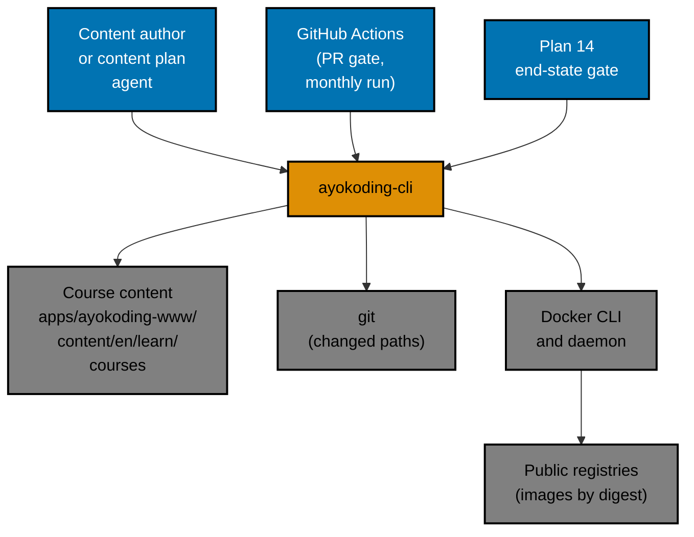
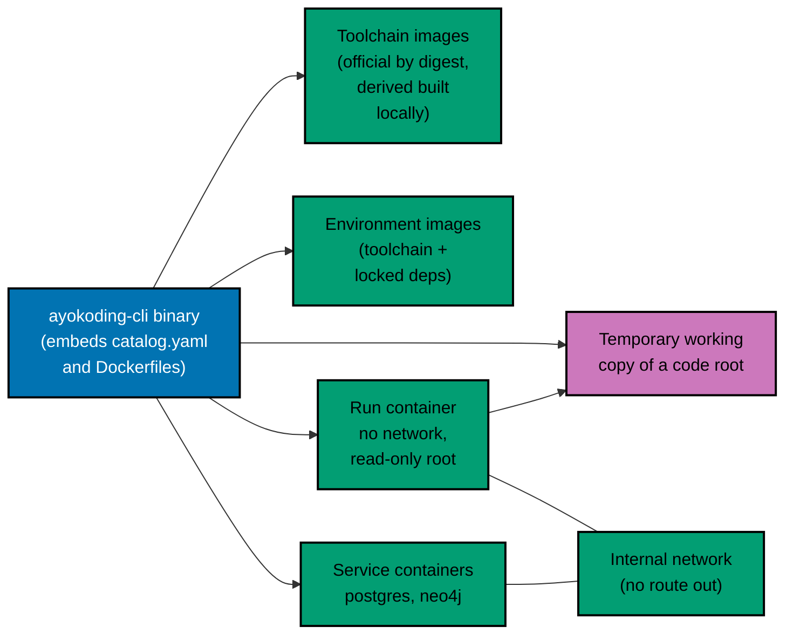
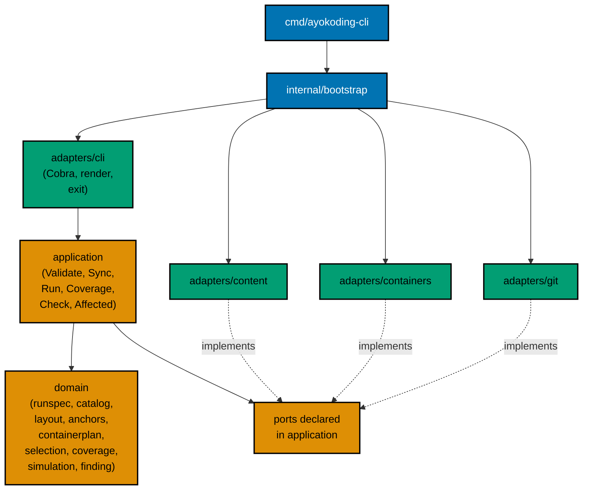
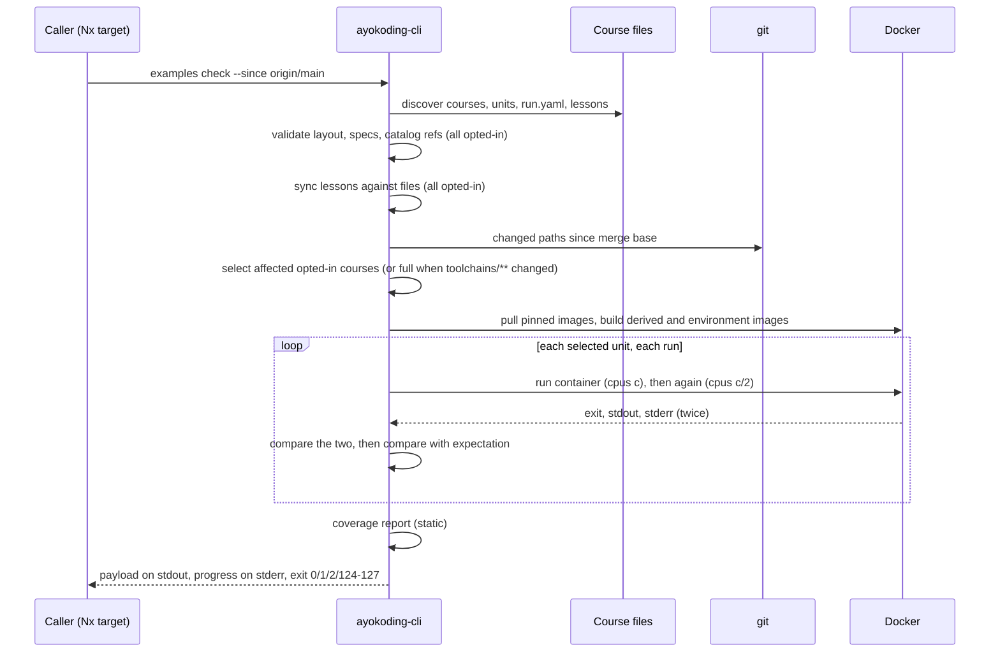

# Architecture

The harness is one Go binary, `ayokoding-cli`. It reads course folders, decides what to run, drives
the container runtime through its command-line interface, and reports. It owns no server, no
database, and no stored state: every run starts from the files in the working tree.

## System Context

## Containers (C4 Level 2)

## Components (C4 Level 3)

The deterministic core is `internal/domain/...` plus `internal/application`. Both are held to 99%
statement coverage by unit tests with no disk, process, or network access.

## Data Flow of `examples check`

## Inert Behaviour

The selection step first keeps only opted-in courses, meaning courses with a `run.yaml` somewhere in
their folder.

- With no opted-in course (the state of `main` when this plan merges), `examples check`:
  - validates and syncs nothing;
  - starts no container and contacts no registry;
  - prints `0 opted-in courses; nothing to run` and the coverage report;
  - exits 0.
- An affected course that is not opted in is listed as `inert`. It is never a finding.

## What Lives Outside the CLI

- **Teaching simulation code** lives in course folders (decision 37).
- **Rendering.** The Next.js app never calls the CLI and renders lessons exactly as before. The only
  change it sees is a Markdown comment line `<!-- harness: illustration -->`, which the renderer
  drops.
- **Plans 02 and 03 validation** stays in the app's TypeScript core and tests.
