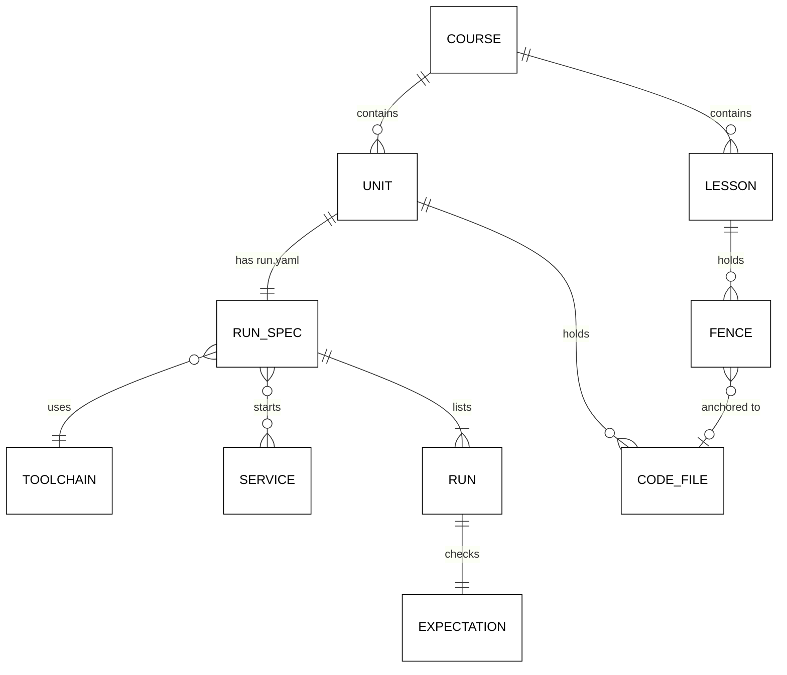

# The `run.yaml` Contract and Markdown-to-File Sync

This file is the normative contract for course code. Content plans 06–13 follow it, and the CLI
implements it. The contract has two halves:

- **What runs:** units and their `run.yaml`.
- **What the lesson shows:** anchors that tie each lesson code block to a file.

Version: `ayokoding.run/v1`. A breaking change needs a new schema value and a migration plan; an
additive optional field does not.

## Units

A **unit** is a folder at one of the canonical places below. It is **covered** when it holds a
valid `run.yaml`. The harness runs units, never single files. A course has three kinds of unit
(paths are relative to the course folder `apps/ayokoding-www/content/en/learn/courses/<slug>/`):

| Kind     | Location                        | Typical runs                                    |
| -------- | ------------------------------- | ----------------------------------------------- |
| Example  | `learning/code/ex-NN-<slug>/`   | `main` (the program) and optionally `tests`     |
| Kata     | `drilling/code/kata-NN-<slug>/` | `before` and `after`, each in its own subfolder |
| Capstone | `learning/capstone/code/`       | One run per capstone stage, plus `tests`        |

- `NN` is two or three digits; `<slug>` is lowercase kebab-case.
- Files directly under a code root (`learning/code/`, `drilling/code/`) that are not units are
  **shared files**: a README, a lockfile, a linter config. Every run can read them (see
  [Runtime View](#runtime-view)).
- Code anywhere else in an opted-in course is a layout finding. This includes flat
  `ex-NN-<slug>.<ext>` files, a top-level `code/` folder, and nested code folders such as
  `learning/coroutines/code/`.

## Field Guide

```yaml
schema: ayokoding.run/v1
toolchain: python
mode: real
services: [postgres]
dependencies:
  lockfile: learning/code/requirements.lock
resources:
  memory: 1g
  cpus: 2
runs:
  - name: main
    kind: example
    command: [python3, example.py]
    timeout: 30s
    expect:
      exit: 0
      stdout: expected/main.stdout.txt
      stderr: empty
  - name: tests
    kind: test
    command: [python3, -m, pytest, -q, -p, no:cacheprovider]
    expect:
      exit: 0
      stdout: ignore
```

| Field                     | Required                                  | Values and rules                                                                                                                                                                                                                                   |
| ------------------------- | ----------------------------------------- | -------------------------------------------------------------------------------------------------------------------------------------------------------------------------------------------------------------------------------------------------- |
| `schema`                  | yes                                       | Exactly `ayokoding.run/v1`                                                                                                                                                                                                                         |
| `toolchain`               | yes                                       | An id from the toolchain catalog ([tech-docs/005](./005-runners-and-toolchain-catalog.md)) whose kind is `language` or `validator`                                                                                                                 |
| `mode`                    | no                                        | `real` (default) or `static`                                                                                                                                                                                                                       |
| `static.reason`           | when `mode: static`                       | One of `cloud`, `cluster`, `ios`, `android`, `windows`                                                                                                                                                                                             |
| `static.note`             | when `mode: static`                       | One or more sentences: what cannot run here and what the static run proves. Not empty.                                                                                                                                                             |
| `services`                | no                                        | Catalog ids whose kind is `service` (today `postgres`, `neo4j`). Forbidden with `mode: static`.                                                                                                                                                    |
| `dependencies.lockfile`   | no                                        | A course-relative path inside this course to a lockfile the toolchain's install recipe accepts (for example `requirements.lock` with hashes, `package-lock.json`, `go.sum`, `Cargo.lock`, `packages.lock.json`, `mix.lock`, `.terraform.lock.hcl`) |
| `resources.memory`        | no                                        | `256m` to `4g`; default `1g`                                                                                                                                                                                                                       |
| `resources.cpus`          | no                                        | `1` or `2`; default `2`                                                                                                                                                                                                                            |
| `runs`                    | yes                                       | 1 to 20 entries, executed in order; names unique                                                                                                                                                                                                   |
| `runs[].name`             | yes                                       | `[a-z0-9][a-z0-9-]*`                                                                                                                                                                                                                               |
| `runs[].kind`             | no                                        | `example` (default), `test`, or `check` (a linter or formatter check the course chooses to run)                                                                                                                                                    |
| `runs[].command`          | yes                                       | A list of strings run as argv, with no shell. A shell script is run as `[bash, run.sh]`.                                                                                                                                                           |
| `runs[].workdir`          | no                                        | A unit-relative folder; default the unit folder                                                                                                                                                                                                    |
| `runs[].stdin`            | no                                        | A unit-relative file fed to standard input; default empty input                                                                                                                                                                                    |
| `runs[].env`              | no                                        | Map of extra variables. Keys match `[A-Z][A-Z0-9_]*` and are not reserved (see [Runtime View](#runtime-view)). Values are literal strings and must not be secrets.                                                                                 |
| `runs[].timeout`          | no                                        | `1s` to `600s`; default `60s`                                                                                                                                                                                                                      |
| `runs[].simulation`       | no                                        | `true` marks a run that follows the simulation convention ([tech-docs/006](./006-determinism-and-simulation.md)); default `false`                                                                                                                  |
| `runs[].expect.exit`      | yes                                       | Integer 0 to 255. A kata's `before` run or a "find the bug" simulation may expect a non-zero exit.                                                                                                                                                 |
| `runs[].expect.stdout`    | yes                                       | A unit-relative `.txt` file compared byte for byte, or `ignore`                                                                                                                                                                                    |
| `runs[].expect.stderr`    | no                                        | `empty` (default), `ignore`, or a unit-relative `.txt` file compared byte for byte                                                                                                                                                                 |
| `runs[].expect.invariant` | when `stdout: ignore` and `kind: example` | One sentence that states what the exit status proves, for example "every committed log entry is identical on all replicas". `kind: test` and `kind: check` default to "the runner exits 0 only when every check passes".                           |

Rules that apply to every field:

- **Strict decoding.** An unknown key, a wrong type, or a duplicate key is a finding. Decoding never
  fills a silent default for a required field.
- **Relative paths only.** Paths never start with `/`, never contain `..` segments, and never
  resolve through a symbolic link that leaves the course.
- **Expected files are `.txt`.** No repository formatter rewrites `.txt` files, so expected bytes
  stay as recorded. Recommended name: `expected/<run>.stdout.txt` and `expected/<run>.stderr.txt`.
- **One toolchain per unit.** A unit that needs two languages (for example Python driving SQL) uses
  the language toolchain plus a service.

## Data Model



## Runtime View

For each run the harness builds one container invocation. The argv is built by a pure function and
tested byte for byte; the full flag list is in
[tech-docs/005 Container Invocation](./005-runners-and-toolchain-catalog.md#container-invocation).
What a run can rely on:

- **Files.** The harness copies the unit's code root (`learning/code/`, `drilling/code/`, or
  `learning/capstone/code/`) into a fresh host temporary folder. It mounts that folder read-write
  at `/work`, and starts the run in `/work/<unit>/<workdir>`. Shared files under the code root are
  therefore at `../`. The repository copy is never mounted, so a run cannot change course files.
- **Filesystem.** The image root is read-only. `/tmp` is a private in-memory filesystem, and `HOME`
  is `/tmp/home`.
- **Network.** None (`--network none`). With services, the run and its services share an internal
  network that has no route out. Service hosts are `postgres` and `neo4j`.
- **Environment.** Cleared, then set to exactly:
  - `PATH` from the toolchain image;
  - `HOME=/tmp/home`, `TZ=UTC`, `LANG=C.UTF-8`, `LC_ALL=C.UTF-8`;
  - `SOURCE_DATE_EPOCH=0`, `PYTHONHASHSEED=0`;
  - `AYOKODING_UNIT=<course>/<unit path>`;
  - `AYOKODING_SEED` only during a one-seed replay;
  - the toolchain's catalog variables;
  - the service connection variables;
  - the run's own `env`.

  The first seven names and every `AYOKODING_*` name are **reserved**.

- **Identity.** The run executes as the invoking host user (`--user <uid>:<gid>`), never as root.
- **Limits.** Memory and CPU from `resources`, 256 processes, and the run's `timeout`. A run that
  exceeds its timeout is killed and reported as a failed result, not as a harness error.

## Markdown-to-File Sync

The sync check reads every Markdown file of the course **outside** its code folders (lessons,
overviews, drilling pages).

### Anchor Grammar

An **anchor** is a line in one of two forms. In both, `<path>` is course-relative, with an optional
1-based inclusive line range `#L<start>-L<end>`:

| Form          | Example                                                                       | Use                               |
| ------------- | ----------------------------------------------------------------------------- | --------------------------------- |
| Path label    | ``**`learning/code/ex-01-hello-script/example.py`**``                         | Source files (today's convention) |
| Labelled path | ``**Before** (`drilling/code/kata-03-null-checks/before/kata.sql`)``          | Katas, excerpts with a caption    |
| Labelled path | ``**Output** (`learning/code/ex-01-hello-script/expected/main.stdout.txt`):`` | Output blocks                     |
| Range         | ``**`learning/capstone/code/app/server.py#L10-L42`**``                        | An excerpt of a long file         |

- The path-label form matches ``^\*\*`([^`]+)`\*\*``. The labelled-path form matches
  ``^\*\*[^*`]+\*\*\s*\(`([^`]+)`\):?\s*$``.
- The next non-blank line must open a fence (three or more backticks or tildes) at column 0.
- The fence body (the lines between the opening and closing fence, joined with line feeds, plus one
  final line feed) must equal the file bytes or the selected lines. A file without a final line feed
  is compared without it.

### Fence Classes in an Opted-In Course

| Class    | How it is recognized                                                                                           | What the check requires                                                                       |
| -------- | -------------------------------------------------------------------------------------------------------------- | --------------------------------------------------------------------------------------------- |
| Anchored | The nearest non-blank line before the fence is an anchor                                                       | Body equals the target                                                                        |
| Output   | The nearest non-blank line before the fence starts with `**Output**`                                           | It must be an anchor in labelled-path form that targets an expected-output file               |
| Prose    | Info string's first word is `text`, `plaintext`, `mermaid`, `markdown`, or `md`, and it is not an Output fence | Nothing                                                                                       |
| Code     | Any other fence, including an empty info string                                                                | Anchored, or the nearest non-blank line before it is exactly `<!-- harness: illustration -->` |

Use `<!-- harness: illustration -->` only for code that is not meant to run as shown: a fragment
inside a larger file, pseudo-code, a deliberately broken snippet, or a shell command that installs
or launches tools. The coverage report counts these per course, and the content gates judge them.

### Sync Findings

| Code                                  | Meaning                                                                           |
| ------------------------------------- | --------------------------------------------------------------------------------- |
| `ayokoding.sync.mismatch`             | Anchored body differs from its target; the finding shows the first differing line |
| `ayokoding.sync.missing-file`         | The anchor's path does not resolve inside the course                              |
| `ayokoding.sync.bad-range`            | The range is malformed or outside the file                                        |
| `ayokoding.sync.anchor-without-fence` | No fence follows the anchor                                                       |
| `ayokoding.sync.indented-fence`       | The anchored fence does not start at column 0                                     |
| `ayokoding.sync.unanchored-fence`     | A code fence is neither anchored nor marked as an illustration                    |
| `ayokoding.sync.unanchored-output`    | An `**Output**` block is not anchored to an expected file                         |
| `ayokoding.sync.unreferenced-unit`    | No anchor in any lesson targets a file inside this unit                           |
| `ayokoding.sync.crlf`                 | A target file uses CRLF line endings                                              |

### Repairing With `examples sync --write`

The file is the source of truth, because it is what runs. `examples sync --write` rewrites the body
of every anchored fence whose target resolves, using the target bytes. It lengthens the fence when
the body contains a line that would close it. It never creates files, never touches unanchored
fences, and is idempotent. It exits 0 when no finding remains and 1 otherwise.

Formatter order matters. The commit hook formats code files with the repository formatters, and
after this plan it no longer reformats code inside lesson fences ([decision D21](./009-decision-records.md)).
The author workflow is therefore:

1. Edit the code file.
2. Format it.
3. Run `examples sync --write`.
4. Commit.

## Selection and Opt-In

- A course is **opted in** when any `run.yaml` exists anywhere in its folder.
- Automatic selection (`examples check`, `--since`, `--all`) considers opted-in courses only. A
  course without a `run.yaml` is reported as `inert` and nothing is checked or run for it.
- An explicit `--course <slug>` processes the named course as if it were opted in, even when it is
  not. This lets a content plan see what remains before it adds the first `run.yaml`.
  `--include-inert` does the same preview for every course at once (`validate` and `sync` only).
- Once opted in, a course is all-or-nothing:
  - every unit is covered (a unit without a `run.yaml` is the finding
    `ayokoding.layout.missing-run-spec`);
  - a `run.yaml` outside a canonical unit folder is the finding `ayokoding.layout.misplaced-run-spec`;
  - there are no layout findings;
  - there are no sync findings;
  - every run is green.
