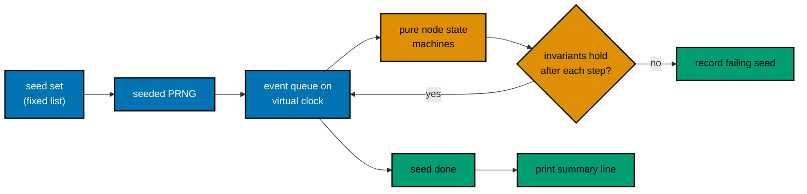

# Determinism and the Simulation Convention

Decision 31 requires every run to be deterministic: fixed seeds, no wall clock, no real network, and
no uncontrolled thread order. Distributed systems, concurrency, Raft, actors, and CSP use in-process
deterministic simulation with a virtual clock and seeded faults, assert invariants over a fixed seed
set, and print failing seeds.

The work is split in two:

- The harness **enforces** what a tool can check.
- The content **follows** a written convention for the rest.

The simulation helpers are teaching code that lives inside each course (decision 37), never inside
`ayokoding-cli`.

## What the Harness Enforces

| Property                      | Mechanism                                                                                                  | Failure code                             |
| ----------------------------- | ---------------------------------------------------------------------------------------------------------- | ---------------------------------------- |
| No real network               | `--network none`, or an internal network with no route out when services are declared                      | The program's own error, then a mismatch |
| No dependency download at run | Dependencies installed only while the environment image is built                                           | Same                                     |
| Fixed environment             | Cleared environment; `TZ=UTC`, `LANG=C.UTF-8`, `SOURCE_DATE_EPOCH=0`, `PYTHONHASHSEED=0`; sorted variables | —                                        |
| Repeatable output             | Every run executes twice under different CPU quotas; outputs must match byte for byte                      | `ayokoding.examples.nondeterministic`    |
| Bounded time                  | Per-run `timeout` (default 60s, maximum 600s); the container is killed when it elapses                     | `ayokoding.examples.run-timeout`         |
| Bounded resources             | Memory, CPU, and 256 processes                                                                             | The program's own failure                |
| No writes to the repository   | Runs see a temporary copy; the image root is read-only                                                     | —                                        |
| Simulation summary            | Runs with `simulation: true` must print the summary line, with at least 32 seeds                           | `ayokoding.examples.simulation-summary`  |

## What the Harness Cannot Enforce

- **Wall-clock reads.** A container shares the host clock, and tools such as libfaketime do not
  reach statically linked runtimes. A program that prints the time usually fails the double run,
  but one that reads the clock to make a decision may not.
- **Thread order in rare interleavings.** The double run catches common scheduling-dependent
  output, but not every interleaving.
- **Hidden randomness** seeded from time or the operating system.

These remain rules for authors, and the content gates judge them. The gate text says that the
harness proves the enforced properties only (see [tech-docs/011](./011-rule-and-docs-impact.md)).

## Rules for Every Example

1. No clock reads that reach output or control flow. Use a value passed in, a fixed timestamp, or a
   virtual clock.
2. Every random generator has an explicit seed written in the code.
3. No network access, even to `localhost`, except to declared services.
4. Output never depends on thread or goroutine order. Either join and print in a fixed order, or use
   the simulation convention.
5. Hash-map iteration order never reaches output. Sort first.
6. Test runners run without timing output in compared streams, or the run uses `stdout: ignore` with
   `kind: test`.

## The Simulation Convention

Use this convention for any example whose behaviour depends on time, message delivery, failures, or
interleaving. Distributed systems, consensus, gossip, actors, CSP, and concurrency examples are the
main users.

### Shape

### Obligations

| #   | Obligation                                                                                                                                                                                                                                                                    |
| --- | ----------------------------------------------------------------------------------------------------------------------------------------------------------------------------------------------------------------------------------------------------------------------------- |
| S1  | **Single-threaded event loop.** All nodes run in one process and one thread; concurrency is modelled as interleaved events, not real threads.                                                                                                                                 |
| S2  | **Virtual clock.** Time is an integer advanced by the event queue. Sleeping schedules an event; nothing waits in real time.                                                                                                                                                   |
| S3  | **One seeded generator** drives every choice: event order among ties, delivery delay, drop, duplicate, reorder, partition, crash, and restart. Prefer a small generator written in the example (SplitMix64 or xorshift) so the sequence does not depend on a library version. |
| S4  | **Pure state machines.** Protocol logic takes a message and returns new state plus outgoing messages; the simulated network and clock are the only I/O.                                                                                                                       |
| S5  | **Invariants after every step**, not only at the end. Examples: at most one leader per term; committed log prefixes agree; no lost acknowledged write.                                                                                                                        |
| S6  | **Fixed seed set** written in the code, at least 32 seeds (for example `range(1, 65)`).                                                                                                                                                                                       |
| S7  | **Output contract.** For each failing seed, print one line `failing seed: <n> (<invariant name>)`. Finish with exactly one summary line `seeds: <passed> passed, <failed> failed (of <total>)`. Exit 0 when no seed fails, otherwise 1.                                       |
| S8  | **Replay.** When the variable `AYOKODING_SEED` is set, run only that seed and print a step trace (virtual time, event, state change). A reader can run the same thing by hand: `AYOKODING_SEED=17 python3 sim.py`.                                                            |
| S9  | **Bug demonstrations are allowed.** A lesson may show a broken protocol whose simulation finds failing seeds; its `run.yaml` then expects exit 1 and an expected-output file that lists those seeds.                                                                          |

In `run.yaml`, the run sets `simulation: true`. The harness then checks that the last line of
standard output matches the S7 summary pattern with a total of at least 32. It also offers
`ayokoding-cli examples run --course <slug> --unit <path> --seed <n>`, which sets `AYOKODING_SEED`,
skips the expected-output comparison, prints the trace, and exits 0 when the run exits 0.

### Language Notes

These are suggestions for content plans, not harness requirements. Each library maturity note
comes from research read on 2026-10-09.

| Language    | Suggested approach                                                                                                              |
| ----------- | ------------------------------------------------------------------------------------------------------------------------------- |
| Python      | A hand-written event loop and generator (no mature simulation library exists); Hypothesis for property tests with printed seeds |
| Go          | `testing/synctest` (generally available since Go 1.25) for virtual time in tests; a hand-written event loop for network faults  |
| Rust        | A hand-written loop; `turmoil` 0.7.2 (Tokio project, 2026-04-24) where a course teaches it                                      |
| TypeScript  | A hand-written loop; fast-check model-based tests, which print a seed and path                                                  |
| Java/Kotlin | Lincheck model checking for thread interleavings; a hand-written loop for distributed examples                                  |
| Elixir      | A hand-written loop over pure functions; StreamData with printed seeds                                                          |

### Prior Art

| System                | Idea this convention borrows                                                                                | Source                                                                |
| --------------------- | ----------------------------------------------------------------------------------------------------------- | --------------------------------------------------------------------- |
| FoundationDB          | Whole cluster in one single-threaded simulated process; clock fast-forwards; repeatability from determinism | <https://apple.github.io/foundationdb/testing.html>                   |
| TigerBeetle VOPR      | Seed plus code version replays a run; network, storage, and clock faults; invariants per replica            | <https://docs.tigerbeetle.com/concepts/safety/>                       |
| sled simulation guide | Deterministic delivery times from a priority queue; invariant checks after each message                     | <https://sled.rs/simulation>                                          |
| turmoil (Tokio)       | Many hosts in one thread; seeded network faults                                                             | <https://github.com/tokio-rs/turmoil>                                 |
| Go `testing/synctest` | Fake clock inside a bubble that jumps when all goroutines block                                             | <https://go.dev/doc/go1.25>                                           |
| Polar Signals on Go   | Determinism needs a single-threaded scheduler                                                               | <https://www.polarsignals.com/blog/posts/2024/05/28/mostly-dst-in-go> |

Jepsen and Maelstrom test real processes and do not claim determinism, so they are not used as the
model. A Raft or gossip course may still mention them as further reading.
