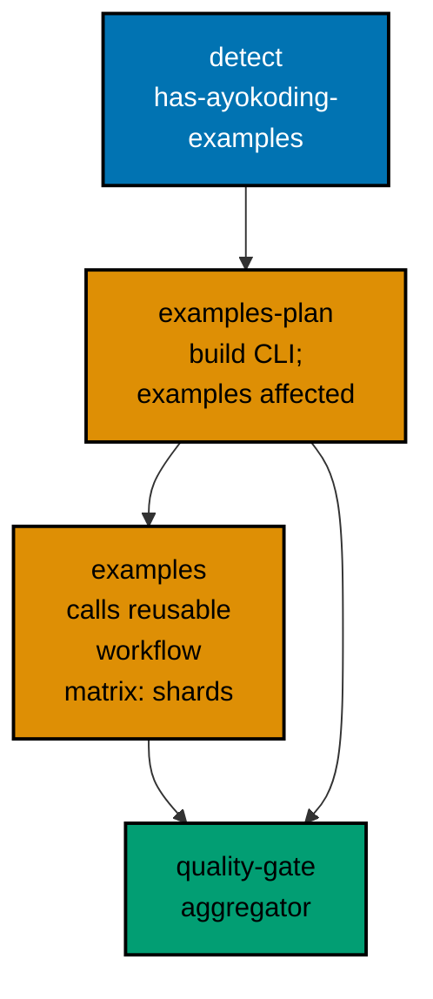

# CI and Nx Targets

Decision 33: a new Nx target runs affected courses on each pull request; a full run happens monthly
and on any toolchain or dependency version bump; never daily.

## The Content Target: `ayokoding-www:examples:check`

The target lives on `ayokoding-www`, because the course content is part of that project.
`nx affected` already marks `ayokoding-www` affected when a course changes.

```json
"examples:check": {
  "executor": "nx:run-commands",
  "dependsOn": [{ "projects": ["ayokoding-cli"], "target": "build" }],
  "cache": false,
  "options": {
    "command": "apps/ayokoding-cli/dist/ayokoding-cli examples check --since \"${NX_BASE:-origin/main}\" --shard \"${AYOKODING_SHARD:-1/1}\""
  },
  "configurations": {
    "full": {
      "command": "apps/ayokoding-cli/dist/ayokoding-cli examples check --all --shard \"${AYOKODING_SHARD:-1/1}\""
    }
  }
}
```

- **Name.** `examples:check` follows the `{domain}:{work}` scheme for validation targets, with the
  bare verb `check`. The series brief proposed `test:examples`, but `test:*` names are reserved for a
  project's own runtime test layers, which run under different rules. Decision D3 records the
  choice.
- **No graph edge.** The build is a `dependsOn` task dependency, not an `implicitDependencies` graph
  edge. A change to the CLI therefore does not mark `ayokoding-www` affected and does not re-run the
  web app's own tests, and a course change does not mark the CLI affected.
- **Not cached.** The result depends on Docker and images outside Nx's view.
- **Selection inside the CLI:**
  - `--since` selects the opted-in courses with a changed file under their folder;
  - when any path under `apps/ayokoding-cli/toolchains/` changed, `--since` selects **every**
    opted-in course (full mode), because a toolchain or shared dependency changed;
  - a course's own lockfile is inside the course, so bumping it selects that course, which is the
    only course that uses it.
- **Inert.** With no opted-in course, the target starts no container and exits 0.

## Pull Request Gate

`.github/workflows/pr-quality-gate.yml` gains two jobs, and its `quality-gate` aggregator needs both.



- **detect.** The existing loop over affected projects also sets `has-ayokoding-examples=true` when
  the project is `ayokoding-www` or `ayokoding-cli`.
- **examples-plan**, which runs only when that output is true:
  1. builds the CLI;
  2. runs `ayokoding-cli examples affected --since "$NX_BASE" --output json`;
  3. emits `shards`: `[1]` when the mode is `affected` and at most 8 courses are selected, otherwise
     `[1,2,3,4]`; and `shard-total` to match.
- **examples** calls `./.github/workflows/_reusable-ayokoding-www-examples-check.yml` with
  `selection: since`, the base, and the shard list.
- The **Go job** needs no change. `ayokoding-cli` carries `lang:go`, so
  `nx affected -t typecheck,lint,test:quick,compat:min-version` already includes it.
- **setup-go.** `.github/actions/setup-go` lists both `apps/roots-be/go.sum` and
  `apps/ayokoding-cli/go.sum` in `cache-dependency-path`, so the new module is cached.

## The Reusable Workflow

`.github/workflows/_reusable-ayokoding-www-examples-check.yml` (`on: workflow_call`):

- **Inputs:**
  - `selection`: `since` or `all`;
  - `base`: the revision for `since`;
  - `shards`: a JSON array;
  - `shard-total`.
- **Job:** `matrix.shard` from `fromJSON(inputs.shards)`, with `fail-fast: false`. Timeouts:
  `timeout-minutes: 60` for `since` and `300` for `all`.
- **Steps:**
  1. Checkout with `fetch-depth: 0`.
  2. Run `setup-node`, `setup-go`, and `setup-docker-cache`.
  3. Run
     `./hippo run --class ephemeral --resource-tier heavy --disk-path . -- npx nx run ayokoding-www:examples:check`
     (adding `--configuration=full` when `selection` is `all`; the flag form avoids ambiguity with
     the colon in the target name). Set `AYOKODING_SHARD=<shard>/<shard-total>` and
     `AYOKODING_BUILDX_CACHE=/tmp/.buildx-cache`.
  4. Rotate the buildx cache folder.
  5. Append `ayokoding-cli examples coverage` (text) to `$GITHUB_STEP_SUMMARY`.
- **Permissions:** `contents: read` only. The workflow pushes nothing and needs no secret.

## Monthly Full Run

`.github/workflows/ayokoding-www-examples-check.yml`:

```yaml
name: ayokoding-www-examples-check
on:
  schedule:
    - cron: "17 3 1 * *" # 03:17 UTC on day 1 of each month; minute 17 avoids top-of-hour load
  workflow_dispatch:
permissions:
  contents: read
concurrency:
  group: ayokoding-www-examples-check
  cancel-in-progress: false
jobs:
  full:
    uses: ./.github/workflows/_reusable-ayokoding-www-examples-check.yml
    with:
      selection: all
      base: ""
      shards: "[1,2,3,4]"
      shard-total: "4"
```

- **Schedule.** Monthly only. No daily schedule exists anywhere for course runs (decision 33).
- **Toolchain bumps.** A pull request that changes `apps/ayokoding-cli/toolchains/**` already runs
  the full selection in the PR gate, before merge.
- **Cost.** At most four shards, once a month, on GitHub-hosted runners. The OSE repositories share
  a limited runner pool, so the shard count is a workflow input that can be lowered.
- **Inactivity.** GitHub disables scheduled workflows in public repositories after 60 days without
  activity. This repository is active daily; the README notes the re-enable command.

## The CLI's Own Tests in Scheduled Quality

These are tests **of the tool**, not course runs. They use small fixture courses, so decision 33's
"never daily" does not apply to them.

- `.github/workflows/non-product-full-quality.yml`, which runs twice daily, adds `ayokoding-cli` to:
  - `run-many -t test:quick`;
  - `run-many -t test:integration`;
  - `run-many -t test:e2e`.

  Each of those jobs gains a `setup-go` step; the E2E job uses the runner's Docker.

- `.github/workflows/dependency-vulnerability-audit.yml` gains a `setup-go` step, so `deps:audit`
  (govulncheck) runs on the pinned Go.

## Workflow Naming

- Add the verb `examples-check` to the workflow filename vocabulary: "Run the AyoKoding example
  harness over opted-in courses, affected or full; never on a daily schedule."
- Amend the `quality-gate` verb's meaning to name the AyoKoding examples check as a content
  validation job, not an Integration or E2E test layer.
- Add both new workflow files to `.github/workflows/README.md`.
