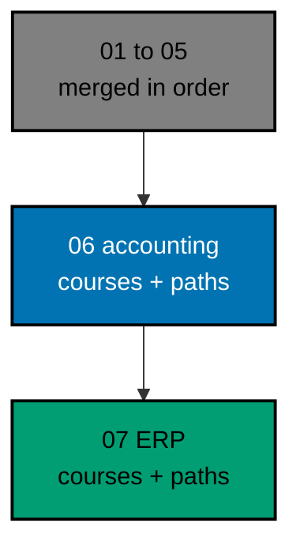

# AyoKoding Learn Revamp 06 — Accounting Courses

> **Status:** Backlog. Do not execute until both are true: the user gives an explicit execution
> command, and plans 01 to 05 of this series have merged to `origin/main`. The 14 plans run strictly
> one after another (series decision 42), so plan 05 is merged, deployed, verified, and cleaned up
> before this plan starts.
>
> **Plan quality gate:** not run yet, so no verdict exists. By the user's decision of 2026-10-09 it
> was not run while the plan was written; it runs at the start of execution, as the first item of
> Phase 0 in [delivery.md](./delivery.md#phase-0-worktree-environment-preconditions-and-baseline),
> with `max-cycles` 2.

AyoKoding has 24 accounting courses: 19 conventional ones and 5 Sharia (Islamic finance) ones. They
make up two skills paths for software engineers who build accounting systems. On 2026-10-09 every one
of them was an outline of 186 to 313 words, with no lessons, no exercises, and no code. This plan
writes all 24 from scratch, as full courses with runnable, tested Python code, and then turns both
accounting paths into titled phases with plain outcomes, in the same PR.

## Scope

- **Write 24 courses** to the series definition of done (decision 27): each course is in one tutorial
  mode, By Example (11 courses) or Annotated Concept (13 courses), chosen per course with a reason; it
  meets its mode's targets, has a full drilling page, passes its mode quality gate and the Content
  Quality Gate with no blocking finding, and runs all its code green in plan 05's example harness.
  See [tech-docs/002](./tech-docs/002-course-modes-and-definition-of-done.md).
- **Runnable code everywhere.** Every example, kata, and capstone is a harness unit with a `run.yaml`
  that is deterministic. Three courses also use PostgreSQL; this plan adds a `psql` toolchain to the
  harness catalog for them. See [tech-docs/003](./tech-docs/003-code-harness-and-determinism.md).
- **Sharia content rules.** The five Sharia courses cite AAOIFI, DSN-MUI, IAI, and Bank Negara Malaysia
  with dates, show where scholars and jurisdictions differ, issue no rulings, flag every Sharia board
  decision with one fixed callout, and teach the standards in force (including FAS 51 and FAS 52 from
  1 January 2027 and the PSAK 401–412 and 459 numbering). Every AAOIFI URL is checked by a person
  before merge. The rules get a durable home for later Sharia content. See
  [tech-docs/004](./tech-docs/004-sharia-content-policy-and-sources.md).
- **Restructure both accounting paths in the same PR** (decision 39): `skills/conventional-accounting`
  becomes 6 titled phases and `skills/sharia-accounting` 7, each with an outcome; the restructure
  marker and the two allowlist entries go; plan 02's closure and no-outline-in-core rules then apply.
  Prerequisites are revised for the 24 courses, and journal entries move before financial statements.
  See [tech-docs/005](./tech-docs/005-path-restructure-and-integrity.md).
- **Skills landing and copy.** The ramp milestone strip ("Dangerous / Comfortable / Confident") is
  deleted, and the skills landing statement, hub strapline, hub description, and the two accounting
  path pages are rewritten in plain words.
- **Metadata.** All 24 courses drop `status: outline` and get plan 03's metadata, with a real
  `estimatedHours` from plan 03's drift test.
- **Guard the end state** (decision 40): a new content-shape test keeps every accounting course
  filled, and `ayokoding-www:examples:check` keeps its code green.

## Non-Goals

- The 30 ERP courses, the two ERP paths, and deleting the allowlist module and marker field (plan 07).
- The 8 capstone courses (plan 08) and every other course (plans 09–13).
- Any change to plan 05's harness beyond the `psql` catalog entry, or to plan 04's roadmap code.
- Indonesian content: `content/id/**` stays untouched (decision 35).
- Issuing or endorsing any Sharia ruling.

## Dependency and Result

The series runs strictly in order, one plan, one worktree, and one PR at a time (series decision
42), so plans 01 to 05 are all merged when this plan starts. Of those, this plan builds directly on
plan 02 (path model), plan 03 (course metadata), and plan 05 (code harness), and it edits the skills
landing as plan 04 left it.

## Series Context

This plan is row 06 of the 14-plan **AyoKoding Learn Revamp** series. Each plan is one PR delivered
from its own worktree, and the plans run strictly in numeric order; the "Depends on" column shows
which earlier plans each one builds on. The user resolved the series decisions on 2026-10-09; every
decision this plan relies on is copied into
[brd.md](./brd.md#resolved-series-decisions-this-plan-relies-on).

| NN  | Plan suffix                      | Scope                                                                                        | Depends on       |
| --- | -------------------------------- | -------------------------------------------------------------------------------------------- | ---------------- |
| 01  | `navigation-and-display`         | Strip `NN ·` title prefixes; path position numbers; sidebar auto-scroll; render fixes        | —                |
| 02  | `path-model`                     | Phases, goals, `assumes`, outline marker, prerequisite revision, closure checks, career copy | 01               |
| 03  | `catalog-and-metadata`           | Course metadata schema and backfill, categories, catalog page, course landing header         | 01               |
| 04  | `learning-experience`            | Browser progress, phase roadmap page, context bar, mark complete, Learn home                 | 02, 03           |
| 05  | `code-harness`                   | `ayokoding-cli`, `run.yaml` contract, runners, Nx target, CI, quality-gate propagation       | —                |
| 06  | `accounting-courses` (this plan) | Write 24 accounting courses; restructure both accounting paths in the same PR                | 02, 03, 05       |
| 07  | `erp-courses`                    | Write 30 ERP courses; restructure both ERP paths in the same PR                              | 06               |
| 08  | `capstone-courses`               | Rewrite 8 skeleton capstones                                                                 | 02, 03, 05       |
| 09  | `filler-rewrites`                | Rewrite 8 templated filler courses                                                           | 03, 05           |
| 10  | `legacy-unique-migration`        | Build courses for legacy topics without an equivalent; record the legacy-to-course map       | 03, 05           |
| 11  | `audit-languages-and-tooling`    | Audit and fix language and tooling courses                                                   | 05               |
| 12  | `audit-cs-systems-and-data`      | Audit and fix CS, systems, concurrency, distributed, database, and data courses              | 05               |
| 13  | `audit-product-security-ai`      | Audit and fix web, backend, mobile, security, AI, testing, architecture, product courses     | 05               |
| 14  | `legacy-removal`                 | Delete `learn/legacy`, add 308 redirects, repoint `docs/` links, update specs and tests      | 10 (+11–13 done) |

## How the Work Runs

The courses are written in twelve batches in prerequisite order, by at most three background agents
at a time. Each course goes maker → mode quality gate → Content Quality Gate → harness green, and
every loop stops after 2 cycles (the user's cap, 2026-10-09: "semua jadi 2 aja"). A course that still
fails is marked BLOCKED, reported, and the batch moves on; the plan then stops for the user before the
paths are restructured. See [tech-docs/006](./tech-docs/006-execution-model.md).

## Navigation

- [Business requirements](./brd.md)
- [Product requirements, Gherkin, and UI design funnel](./prd.md)
- [Technical design](./tech-docs/README.md)
- [Syllabus corpus (24 course briefs and 2 path manifests)](./syllabus/README.md)
- [Delivery checklist](./delivery.md)
- [Execution learnings](./learnings.md)
