# Delivery Plan — AyoKoding Learn Revamp 06: Accounting Courses

> **Legend** — `[AI]`: an agent performs the step (the default; unmarked steps are `[AI]`).
> `[HUMAN]`: only a human can do it (physical action, out-of-band approval, real-secret or
> privileged-credential handling). `[AI+HUMAN]`: agent prepares, human approves or finishes.

**Do not start** until both are true: (1) the user gives an explicit execution command for this
plan — that command authorizes this plan's change set (commits, pushes, PR, merge, and the deploy
described below); (2) plans 01 to 05 of this series have merged to `origin/main`, deployed, been
verified, and had their worktrees cleaned up. The series runs strictly one plan at a time (series
decision 42), so no other series plan runs while this one does, and no rebase between plans is
needed. The user's words (2026-10-09): "jangan kerjain/implement plan ini sebelum gw
kasih perintah buat eksekusi ya" (do not implement this plan until I give the command to execute it).

**Plan quality gate:** not run yet, so no verdict exists. By the user's decision of 2026-10-09 it was
not run while the plan was written. It runs at the start of execution, as the first item of
[Phase 0](#phase-0-worktree-environment-preconditions-and-baseline), with `max-cycles` 2; its verdict
line is recorded here only then.

## Worktree

- **Execution worktree:** `worktrees/ayokoding-learn-revamp-06-accounting-courses/`
- **Provisioning command** (from the repository root, at Step 0):
  `claude --worktree ayokoding-learn-revamp-06-accounting-courses`, or the equivalent
  `rtk git worktree add -b ayokoding-learn-revamp-06-accounting-courses-base worktrees/ayokoding-learn-revamp-06-accounting-courses origin/main`.
- **Provisioning status:** pending
- **Authoring-worktree exception:** this plan was authored inside the separate authoring worktree
  `.claude/worktrees/ayokoding-update` (branch `worktree-ayokoding-update`). The user required that
  session to write all plans of the AyoKoding Learn Revamp series together and not to execute any of
  them before the user's command. That authoring worktree is **never** used for execution. The
  Provisioned Worktree Identity and the Delivery Branch Inventory are intentionally omitted until
  Step 0 creates them.
- **Step 0 obligation (blocking):** Phase 0's first outcome after the plan quality gate provisions
  the execution worktree from
  fresh `origin/main` per the
  [Worktree Path Convention](../../../repo-governance/conventions/structure/worktree-path.md),
  initializes it per
  [Worktree Toolchain Initialization](../../../repo-governance/development/workflow/worktree-setup.md),
  writes the immutable identity and the first inventory row into this section, replaces
  `Provisioning status: pending` with `Provisioning status: provisioned`, and syncs with
  `origin/main`. No implementation step may start while the status is pending.
- **Cleanup:** after the PR merges, the worktree, its branches, and this plan's scratch come down
  through [Dev Artifact Clean-Up](../../../repo-governance/workflows/maintenance/dev-artifact-clean-up.md)
  (Phase 13).
- **Worktree cap:** one worktree for this plan in this repository, reused by every phase.

The plan never records an absolute or machine-specific path. Resolve the declared route at runtime
and reconcile it with `rtk git worktree list --porcelain`.

## Delivery Mode: worktree-to-pr

`worktree-to-pr` is mandatory in this repository. One branch and **one PR** deliver the whole plan
(series decision 39 and the series rule "one plan = one PR"). The PR needs the exact current-head/base
`Quality gate` from `.github/workflows/pr-quality-gate.yml` and an exact-head posted `pr-leak-review`
`pass` (`leak-review` status). Broad semantic PR review is not run unless the user asks for it.
`[AI]` merges once the hardened merge preconditions hold.

## Parallelization Model

Courses are written in prerequisite levels L0–L11 ([tech-docs/006](./tech-docs/006-execution-model.md)).
Inside a level, up to three background agents each write one course; a level starts only when every
course of the levels it needs is DONE or BLOCKED. Every shared file (manifests, tests, catalog, rules,
indexes) is touched by the coordinator in a serial phase.

```mermaid
%% Color Palette: Blue #0173B2, Orange #DE8F05, Teal #029E73, Purple #CC78BC
flowchart TD
  accTitle: Plan 06 execution order
  accDescr: Phase 0 sets up and records a baseline. Phase 1 adds the psql toolchain. Phases 2 to 4 write the courses level by level, with up to three agents per level. A human stop reviews blocked courses and AAOIFI links. Then the metadata flip, the path restructure, the skills landing, rules and docs, the end-state gate, manual checks, knowledge capture, and the delivery boundary run in order.
  P0["0 setup and baseline"] --> P1["1 psql toolchain"]
  P1 --> P2["2 levels L0-L3<br/>one course at a time"]
  P2 --> P3["3 levels L4-L6<br/>up to 3 agents"]
  P3 --> P4["4 levels L7-L11<br/>up to 3 agents"]
  P4 --> P5["5 human stop:<br/>BLOCKED and<br/>AAOIFI links"]
  P5 --> P6["6 metadata flip<br/>and completion test"]
  P6 --> P7["7 path restructure"]
  P7 --> P8["8 skills landing<br/>and path copy"]
  P8 --> P9["9 rules, docs, C4"]
  P9 --> P10["10 end-state gate"]
  P10 --> P11["11 manual and<br/>testers"]
  P11 --> P12["12 knowledge capture"]
  P12 --> P13["13 boundary:<br/>archive, PR, merge,<br/>cleanup"]

  classDef serial fill:#0173B2,stroke:#000000,color:#FFFFFF,stroke-width:2px
  classDef parallel fill:#CC78BC,stroke:#000000,color:#000000,stroke-width:2px
  classDef human fill:#DE8F05,stroke:#000000,color:#000000,stroke-width:2px
  classDef gate fill:#029E73,stroke:#000000,color:#000000,stroke-width:2px
  class P0,P1,P6,P7,P8,P9 serial
  class P2,P3,P4 parallel
  class P5 human
  class P10,P11,P12,P13 gate
  classDef default fill:#FFFFFF,stroke:#000000,color:#000000
```

### Delivery Boundaries

| Phase(s) | Natural cohesive seam                                                 | Worktree                                                  | Branch                                         | Delivery opportunity             | Exact resulting `main` / rollback / feature-flag evidence                                                                                                                                                                                                                                                                                                                                                                |
| -------- | --------------------------------------------------------------------- | --------------------------------------------------------- | ---------------------------------------------- | -------------------------------- | ------------------------------------------------------------------------------------------------------------------------------------------------------------------------------------------------------------------------------------------------------------------------------------------------------------------------------------------------------------------------------------------------------------------------ |
| 0        | — (setup and baseline)                                                | —                                                         | —                                              | none                             | No resulting state change; no PR; flag not applicable                                                                                                                                                                                                                                                                                                                                                                    |
| 1–13     | Filled accounting courses with their restructured paths (decision 39) | `worktrees/ayokoding-learn-revamp-06-accounting-courses/` | `ayokoding-learn-revamp-06-accounting-courses` | PR opened and merged in Phase 13 | `main` gets the 24 filled courses, the `psql` toolchain, both restructured manifests with the marker gone, the new skills copy, the Sharia rule module, and the completion test together. Rollback: revert the merge commit in a revert PR (the previous outline courses and marked manifests come back together). Feature-flag lifecycle: not applicable, because no flag is created (decision D13); nothing to remove. |

### Agent Topology

- **Main thread (coordinator):** owns the execution ledger, every gate, every commit, index
  generation, and every shared file. It keeps itself free and fills background slots first.
- **At most 3 background agents at any time** (N = 3):
  - Phases 2–4: one maker per course — `apps-ayokoding-www-by-example-maker` (By Example) or
    `apps-ayokoding-www-annotated-concept-maker` (Annotated Concept). Each writes only inside
    `apps/ayokoding-www/content/en/learn/courses/<slug>/`, never the `_index.md` frontmatter.
  - The gates run the checker and fixer agents the gate workflows name.
  - Phase 1: one `swe-developer` (catalog entry, fixture, smoke row).
  - Phases 6–8: one `specs-maker` (Gherkin) then one `swe-developer` (code, tests, data), in
    sequence because they share step files; `apps-ayokoding-www-general-maker` writes the path pages.
  - Phase 9: `rules-maker`, then `docs-fixer` and `readme-fixer`.
  - Phase 11: `swe-web-tester` (exploratory and design charters) and `swe-usability-tester`.
- Record every agent ID, its file set, its step, and its cycle count in the execution ledger.

### Execution Packet Defaults

- **Plan path after promotion:** `plans/in-progress/ayokoding-learn-revamp-06-accounting-courses/`
  (written below as `<plan>/`). Evidence goes to `<plan>/evidence/`.
- **Execution ledger:** `local-tmp/ayokoding-learn/execution-ledger.md` in the execution worktree,
  under the heading `## Plan 06 — accounting courses`, with the fields in
  [tech-docs/006](./tech-docs/006-execution-model.md#the-execution-ledger). Other scratch (raw
  output, curl bodies, the placement record, the probe course) lives in
  `local-tmp/ayokoding-learn/plan-06/` (gitignored).
- **No ad-hoc scripts (series decision 37).** Checks run through the app's tests and `ayokoding-cli`.
  Read-only inspection with `rtk git grep`, `rtk git diff`, `rtk git ls-tree`, and `rtk wc -w` is fine.
- **Evidence hygiene:** evidence files contain repository-relative paths only. Never paste an
  absolute home-directory path, a hostname, a token, or `.env*` content.
- **Never commit** `apps/ayokoding-www/next-env.d.ts` (the dev server rewrites it) or
  `.serena/project.yml`. Before every commit run `rtk git status --short` and restore either file with
  `rtk git checkout -- <file>` if it shows as modified.
- **Indonesian content stays untouched (decision 35).** `GEN-INDEXES` and `DEV` regenerate indexes for
  both locales. After each run, `rtk git status --short -- apps/ayokoding-www/content/id` must be
  empty; if not, run `rtk git checkout -- apps/ayokoding-www/content/id`.
- **Never touch** `.env.prod` or `.env.stag`. If the dev server needs a variable, copy the key from
  `apps/ayokoding-www/.env.example` into an uncommitted `apps/ayokoding-www/.env.local`.
- **No git identity changes.** Never run `git config user.*`. Never use a bare `git stash`.
- **Bounded loops (user, 2026-10-09: "semua jadi 2 aja"):** every quality gate runs with
  `max-cycles: 2`, and every maker→checker loop runs at most 2 cycles. A course still failing after
  its second cycle is **BLOCKED**: record it in the ledger, report it to the user, and move on. Any
  other file still failing after its second cycle is recorded as BLOCKED and the phase gate stays open
  until the user decides.
- **Failure handling:** on any unexpected failure, save the output to the phase evidence file, fix the
  root cause (never skip, retry-until-green, loosen, widen, or delete a test), rerun the same command,
  and note the fix. A harness defect is fixed in `apps/ayokoding-cli` with a regression test (plan 05's
  M11), never by weakening a course check.

> **Important**: Fix ALL failures found during quality gates, not just those caused by your
> changes. This follows the root cause orientation principle — proactively fix preexisting
> errors encountered during work.

### Command Reference

Run every command from the execution worktree root. Expected results are stated at each use.

| Name                 | Command                                                                                                                                                                                                                                                                                   |
| -------------------- | ----------------------------------------------------------------------------------------------------------------------------------------------------------------------------------------------------------------------------------------------------------------------------------------- |
| `UNIT-FE <file>`     | `rtk ./hippo run --class ephemeral --resource-tier standard --disk-path . --cwd apps/ayokoding-www -- npx vitest run --project unit-fe <file>`                                                                                                                                            |
| `UNIT-NODE <file>`   | `rtk ./hippo run --class ephemeral --resource-tier standard --disk-path . --cwd apps/ayokoding-www -- npx vitest run --project unit <file>`                                                                                                                                               |
| `QUICK`              | `rtk ./hippo run --class ephemeral --resource-tier standard --disk-path . -- npm exec nx -- run ayokoding-www:test:quick`                                                                                                                                                                 |
| `INTEGRATION`        | `rtk ./hippo run --class ephemeral --resource-tier heavy --disk-path . -- npm exec nx -- run ayokoding-www:test:integration`                                                                                                                                                              |
| `BEHAVIOUR`          | `rtk ./hippo run --class ephemeral --resource-tier standard --disk-path . -- npm exec nx -- run ayokoding-www:test:coverage:behaviour`                                                                                                                                                    |
| `E2E-BEHAVIOUR`      | `rtk ./hippo run --class ephemeral --resource-tier standard --disk-path . -- npm exec nx -- run ayokoding-www-fe-e2e:test:coverage:behaviour`                                                                                                                                             |
| `BE-E2E-BEHAVIOUR`   | `rtk ./hippo run --class ephemeral --resource-tier standard --disk-path . -- npm exec nx -- run ayokoding-www-be-e2e:test:coverage:behaviour`                                                                                                                                             |
| `E2E-QUICK`          | `rtk ./hippo run --class ephemeral --resource-tier standard --disk-path . -- npm exec nx -- run ayokoding-www-fe-e2e:test:quick`                                                                                                                                                          |
| `E2E`                | `rtk ./hippo run --class ephemeral --resource-tier heavy --disk-path . -- npm exec nx -- run ayokoding-www-fe-e2e:test:e2e`                                                                                                                                                               |
| `BUILD`              | `rtk ./hippo run --class ephemeral --resource-tier heavy --disk-path . -- npm exec nx -- run ayokoding-www:build`                                                                                                                                                                         |
| `GEN-INDEXES`        | `rtk ./hippo run --class transactional --resource-tier standard --disk-path . -- npm exec nx -- run ayokoding-www:generate-indexes`                                                                                                                                                       |
| `VALIDATE-INDEXES`   | `rtk ./hippo run --class ephemeral --resource-tier standard --disk-path . -- npm exec nx -- run ayokoding-www:validate-indexes`                                                                                                                                                           |
| `DEV`                | `rtk ./hippo run --class service --resource-tier standard --disk-path . -- npm exec nx -- dev ayokoding-www` (serves `http://localhost:3101`)                                                                                                                                             |
| `LINT-MD`            | `rtk npm run lint:md`                                                                                                                                                                                                                                                                     |
| `CLI-BUILD`          | `rtk ./hippo run --class ephemeral --resource-tier standard --disk-path . -- npm exec nx -- run ayokoding-cli:build`                                                                                                                                                                      |
| `CLI-QUICK`          | `rtk ./hippo run --class ephemeral --resource-tier standard --disk-path . -- npm exec nx -- run ayokoding-cli:test:quick`                                                                                                                                                                 |
| `CLI-E2E`            | `rtk ./hippo run --class ephemeral --resource-tier heavy --disk-path . -- npm exec nx -- run ayokoding-cli:test:e2e`                                                                                                                                                                      |
| `CLI <args>`         | `rtk ./hippo run --class ephemeral --resource-tier heavy --disk-path . -- apps/ayokoding-cli/dist/ayokoding-cli <args>`                                                                                                                                                                   |
| `FIXTURE <args>`     | `CLI --content apps/ayokoding-cli/tests/testdata/courses <args>`                                                                                                                                                                                                                          |
| `SMOKE`              | `CLI --content apps/ayokoding-cli/tests/testdata/toolchain-smoke examples check --all`                                                                                                                                                                                                    |
| `EX-VALIDATE <slug>` | `CLI examples validate --course <slug>`                                                                                                                                                                                                                                                   |
| `EX-SYNC <slug>`     | `CLI examples sync --course <slug>` (add `--write` to repair anchored fences)                                                                                                                                                                                                             |
| `EX-RECORD <slug>`   | `CLI examples run --course <slug> --record` (writes only missing expected files)                                                                                                                                                                                                          |
| `EX-CHECK <slug>`    | `CLI examples check --course <slug>`                                                                                                                                                                                                                                                      |
| `EX-COVERAGE`        | `CLI --output json examples coverage`                                                                                                                                                                                                                                                     |
| `EXAMPLES`           | `rtk ./hippo run --class ephemeral --resource-tier heavy --disk-path . -- npm exec nx -- run ayokoding-www:examples:check` (add `--configuration=full` for a full run)                                                                                                                    |
| `RUFF <files>`       | `rtk ./hippo run --class ephemeral --resource-tier standard --disk-path . -- ruff format --no-cache <files>`                                                                                                                                                                              |
| `UV-LOCK <slug>`     | `rtk ./hippo run --class transactional --resource-tier standard --disk-path . -- uv pip compile --generate-hashes apps/ayokoding-www/content/en/learn/courses/<slug>/learning/code/requirements.in -o apps/ayokoding-www/content/en/learn/courses/<slug>/learning/code/requirements.lock` |

`UNIT-FE` runs files under `tests/unit/fe-steps/` and `tests/unit/features/**/*.test.{ts,tsx}`;
`UNIT-NODE` runs `*.unit.test.ts` files and `tests/unit/be-steps/`. Paths after these two commands are
relative to `apps/ayokoding-www/`. `CLI` uses the default content root
`apps/ayokoding-www/content/en/learn/courses`; build it with `CLI-BUILD` after any CLI or catalog
change (the catalog is embedded). Every `EX-*` command accepts more than one `--course`. If Phase 0
records different merged names for any target or command, use the merged names everywhere below.

### Commit Guidelines

- [ ] [AI] Do not stage or commit until the user's execution command has authorized this plan's
      change set; do not extend a commit beyond it.
- [ ] [AI] Use the fewest build-valid, independently reviewable and revertible commits, one coherent
      purpose each: one for the toolchain, **one per DONE course**
      (`feat(ayokoding-www): rewrite <slug> course`), one each for the metadata flip, the restructure,
      the skills landing, and the rules and docs, then evidence and the archival move.
- [ ] [AI] Follow Conventional Commits: `<type>(<scope>): <description>`, imperative, no period.
- [ ] [AI] Keep each change with its tests, specs, regenerated indexes, docs, and generated harness
      routes in the same commit; stage explicit paths only, never `git add -A`.

### Files Changed

The full root-relative tree with `[E]`/`[N]`/`[D]`/`[G]` markers is in
[tech-docs/009](./tech-docs/009-file-impact.md). In short: the 24 course folders; the `psql` catalog
entry with its fixture and smoke row; the two accounting manifests, the allowlist module, and the
schema enum; the skills landing, the deleted strip, and the hub strapline; three path pages; one new
and three edited feature files with their tests; the Sharia rule module, the tree-shape rule edit,
their regenerated bindings, and the READMEs; and `<plan>/` with its evidence.

### Recovery

- **Interrupted session.** The ledger is the source of truth for the batches. Reconcile it with
  `rtk git status --short` and `rtk git log --oneline origin/main..HEAD`: a course with a commit is
  DONE; a course folder with uncommitted changes and no BLOCKED row is in progress. Resume that
  course at the step and cycle the ledger shows; never reset a cycle count, and never start a new
  maker attempt that would exceed 2.
- **A batch agent stopped mid-course.** Its files stay in the course folder. The next attempt (if
  the course has one left) continues from those files, as [tech-docs/006](./tech-docs/006-execution-model.md#the-per-course-pipeline) says.
- **A wrong commit.** Revert it with a new commit (`rtk git revert <sha>`); never rewrite pushed
  history.
- **After merge.** Revert the merge commit in a revert PR; the outline courses and the marked
  manifests return together, so the paths stay valid.

### Before Phase 0: Promotion

The plan is still in `plans/backlog/` at this point, so the plan quality gate (the first item of
Phase 0) runs first, here; promote only after its verdict is `PASS` or `PASS_WITH_FINDINGS`.

- [ ] [AI] Promote the plan per
      [Starting and Completing Work](../../../repo-governance/conventions/structure/plans/starting-and-completing-work.md):
      a pure move of `plans/backlog/ayokoding-learn-revamp-06-accounting-courses/` to
      `plans/in-progress/ayokoding-learn-revamp-06-accounting-courses/` plus the `plans/backlog/README.md`
      and `plans/in-progress/README.md` index updates, landed on `origin/main` through its own PR.
      Acceptance: `rtk git ls-tree -r --name-only origin/main plans/in-progress/ayokoding-learn-revamp-06-accounting-courses/`
      lists this plan's files. This promotion PR is separate from the delivery unit.

---

## Phase 0: Worktree, Environment, Preconditions, and Baseline

Phase 0 opens no PR. Its evidence rides the delivery PR.

- **Input:** the promotion on `origin/main`; this plan at `<plan>/`;
  [tech-docs/README.md](./tech-docs/README.md#cross-plan-assumptions).
- **Outcome:** a provisioned, initialized worktree; confirmed preconditions and merged names; a
  green baseline with before-screenshots; a list of tests that use an accounting course as a real
  outline; an initialized ledger.
- **Proof:** `<plan>/evidence/phase-0-baseline.md`.

- [ ] [AI] **Plan quality gate (deferred from authoring):** run the `plan-quality-gate` workflow on this
      plan with `max-cycles` 2 before any other step below. It was deliberately not run when this plan was
      written, to keep token use even (user decision, 2026-10-09). Acceptance: verdict `PASS` or
      `PASS_WITH_FINDINGS`; record the line `plan-quality-gate: <verdict> (<n> cycles, <k> open)` in this
      file's header section. If the plan is still in `plans/backlog/`, run the gate before the promotion PR.
      A `BLOCKED` verdict stops execution and is reported to the user.
- [ ] [AI] **Step 0 (blocking first outcome):** from the repository root, provision the execution
      worktree with the command in [## Worktree](#worktree). Record the Provisioned Worktree Identity
      (declared route `worktrees/ayokoding-learn-revamp-06-accounting-courses/`, initial branch
      `ayokoding-learn-revamp-06-accounting-courses-base`, creator, UTC creation time) and the first
      Delivery Branch Inventory row (`provisioned`, `active`, proof `git worktree add` at the
      timestamp) in [## Worktree](#worktree). Set `Provisioning status: provisioned`. Acceptance:
      `rtk git worktree list --porcelain` lists the worktree on the base branch.
- [ ] [AI] From the worktree root, run
      `rtk ./hippo run --class transactional --resource-tier standard --disk-path . -- npm install`.
      Acceptance: exit 0 and Husky hooks installed (`.husky/_` exists).
- [ ] [AI] Run `rtk npm run doctor`. Acceptance: exit 0. Only if it reports a missing or drifted
      toolchain, run
      `rtk ./hippo run --class transactional --resource-tier standard --disk-path . -- ./rhino toolchain provision --apply`
      and then `rtk npm run doctor` again (exit 0).
- [ ] [AI] Sync and branch: `rtk git fetch origin`, `rtk git merge --ff-only origin/main`, then
      `rtk git switch -c ayokoding-learn-revamp-06-accounting-courses`. Append the branch to the
      inventory (`worktree-to-pr`, `active`). Acceptance: `rtk git status` shows the new branch, clean.
- [ ] [AI] **Preconditions — plans 01 to 05 merged:** run
      `rtk git ls-tree -d --name-only origin/main plans/done/`. Acceptance: the output contains folders
      ending in `__ayokoding-learn-revamp-01-navigation-and-display`,
      `__ayokoding-learn-revamp-02-path-model`, `__ayokoding-learn-revamp-03-catalog-and-metadata`,
      `__ayokoding-learn-revamp-04-learning-experience`, and `__ayokoding-learn-revamp-05-code-harness`.
      If any is missing, stop: report to the user.
- [ ] [AI] **Plan 07 not started:** run
      `rtk git grep -n "plan-07" origin/main -- apps/ayokoding-www/src/features/course-paths/manifests/skills`.
      Acceptance: matches in `conventional-erp.json` and `sharia-erp.json` only.
- [ ] [AI] **Name reconciliation:** for each name below, run `rtk git grep -n "<name>" origin/main -- apps specs`
      and record the merged file and spelling in a name map in the baseline evidence:
      `restructurePendingIn`, `SKILLS_RESTRUCTURE_ALLOWLIST`, `isMarkedShape`, `checkPathModelIntegrity`,
      `outlineCourseIds`, `estimatedHours`, `Expected estimatedHours for every non-outline course`,
      `examples:check`, `RampMilestoneStrip`, `LearnPathCard`, `path-copy.feature`,
      `skills-fixed-arc-statement.feature`, `skills-path-composition.feature`. Then run `CLI-BUILD` and
      `CLI toolchains list`. Acceptance: every name is found (or its merged replacement is recorded);
      the catalog lists `python` and `postgres`. A missing name with no replacement stops the plan.
- [ ] [AI] **`psql` already present?** In the `toolchains list` output, look for an SQL client entry.
      Acceptance: record "absent" (Phase 1 adds it) or "present as `<id>`" (Phase 1 only checks it and
      every course unit uses `<id>`; decision D14's revisit trigger).
- [ ] [AI] **Drift check — the 24 courses and two manifests:** run
      `rtk git diff --stat bb7f90137 origin/main -- apps/ayokoding-www/content/en/learn/courses apps/ayokoding-www/src/features/course-paths/manifests/skills apps/ayokoding-www/content/en/learn/paths/skills`.
      For every listed file that belongs to one of the 24 courses, the two accounting manifests, or the
      skills path pages, open its diff and name the plan that made it. Acceptance: every change comes
      from plans 01 to 05 (for example plan 01's title-prefix removal, plan 02's `status: outline` and
      reshaped manifests, plan 03's `category` and `description`), and none adds teaching content to a
      course; record the list. Otherwise stop and report the difference to the user.
- [ ] [AI] **Tree-shape rule (D15):** read the "Tree shape" bullet in
      `repo-governance/development/quality/gate-adapters/ayokoding-www.md` on `origin/main`.
      Acceptance: record "stale" (TS1 runs in Phase 9) or "already fixed in `<commit>`" (TS1 is
      `Not triggered`).
- [ ] [AI] **Sharia rule module:** run
      `rtk git ls-tree --name-only origin/main .agents/skills/apps-ayokoding-www-developing-content/reference/`.
      Acceptance: record whether `sharia-content.md` exists; if another plan created it, Phase 9
      reconciles instead of creating.
- [ ] [AI] **`uv` available:** run `rtk uv --version`. Acceptance: a version prints. If not, run the
      toolchain provision command above and record it.
- [ ] [AI] **Real-outline test examples (D16):** run
      `rtk git grep -n -e accounting-foundations -e chart-of-accounts -e journal-entries -e financial-statements-and-close -e sharia-accounting-and-aaoifi origin/main -- apps/ayokoding-www/tests apps/ayokoding-www-fe-e2e/tests apps/ayokoding-www-be-e2e specs/apps/ayokoding`,
      then repeat with the other 19 slugs. Read each hit and list in the evidence every test that uses
      an accounting course as an **outline** example (for example "An outline course …"). Acceptance:
      the list exists (possibly empty); confirm `erp-foundations-and-history` still has
      `status: outline` on `origin/main`.
- [ ] [AI] **Vercel MCP re-probe:** check this session's available tools for a Vercel MCP server and
      record "present", "present but unauthenticated", or "absent". The plan uses no Vercel tool either
      way. Record no Vercel identifiers.
- [ ] [AI] **Harness baseline (plan 05's M1):** run `EX-VALIDATE` and `EX-SYNC` once each, with one
      `--course` for each of the 24 slugs in [syllabus/courses/README.md](./syllabus/courses/README.md)
      (an explicit `--course` works before a course opts in). Acceptance: record the finding counts per
      course ("no units" is expected).
- [ ] [AI] Run `QUICK`, `BEHAVIOUR`, `E2E-BEHAVIOUR`, `BE-E2E-BEHAVIOUR`, `INTEGRATION`,
      `VALIDATE-INDEXES`, `EXAMPLES`, `E2E-QUICK`, and `E2E`. Acceptance: each exits 0; record the
      counts. If anything fails before any change, fix the root cause first.
- [ ] [AI] Start `DEV` in the background. With Playwright MCP at 375×800 and 1280×800 open
      `/en/learn/paths/skills`, `/en/learn/paths`, `/en/learn/paths/skills/conventional-accounting`,
      `/en/learn/paths/skills/sharia-accounting`,
      `/en/learn/courses/journal-entries-and-posting-mechanics?path=skills/conventional-accounting`,
      `/en/learn/courses`, `/id`, and `/id/learn/paths/skills`. Acceptance: screenshots
      `<plan>/evidence/phase-0-before-<page>-<locale>-<bp>px.png` exist; record what each shows
      (statement, strip, path page jargon, Outline badges, position of the journal course).
- [ ] [AI] With `DEV` running, run the tRPC success command from
      [Manual API Wire Verification](#manual-api-wire-verification-trpc-over-http) with output files
      `trpc-en-before.*`. Acceptance: status 200; record the number of `outlineCourseIds` (the
      baseline B), that both accounting manifests carry `restructurePendingIn: "plan-06"`, and each
      accounting manifest's `arc` value (the restructured manifests in Phase 7 keep it). Stop
      `DEV`; then confirm `rtk git status --short -- apps/ayokoding-www/content/id` is empty (restore if
      not).
- [ ] [AI] Create the ledger section `## Plan 06 — accounting courses` with one `PENDING` row per
      course, ordered by level as in [tech-docs/006](./tech-docs/006-execution-model.md).

### Phase 0 Gate

> All checks below must pass before starting Phase 1.

- [ ] [AI] The plan quality gate verdict line is recorded in this file's header, with verdict `PASS`
      or `PASS_WITH_FINDINGS` after at most 2 cycles.
- [ ] [AI] `Provisioning status: provisioned` with identity and inventory recorded.
- [ ] [AI] `<plan>/evidence/phase-0-baseline.md` records: the five merged plans, plan 07 not started, the name map, the
      `psql` result, the drift check, the tree-shape result, the rule-module result, the outline-example
      list, the Vercel probe, the M1 counts, every baseline exit code, and B.
- [ ] [AI] `rtk git status --short` shows only `<plan>/` changes.

> **Pause Safety**: the worktree is provisioned and green, the baseline is recorded, and no product
> file has changed. Safe to stop. To resume:
> `rtk git -C worktrees/ayokoding-learn-revamp-06-accounting-courses status --short`, then `QUICK`.

---

## Phase 1: The `psql` Toolchain

- **Input:** [tech-docs/003](./tech-docs/003-code-harness-and-determinism.md#sql-units-the-new-psql-toolchain),
  decision D14, plan 05's "Adding a Toolchain" procedure, the Phase 0 `psql` result.
- **Outcome:** SQL course units can run with `toolchain: psql` against the `postgres` service; the
  CLI's fixture and smoke tests cover it; `dblink` availability and the Markdown formatter round trip
  are known before any course is written.
- **Proof:** `<plan>/evidence/phase-1-psql.md`.
- _Suggested executor: `swe-developer`._

If Phase 0 found an SQL client entry already, skip AC-1.1 to AC-1.3, record the existing id, and run
only AC-1.4 and AC-1.5 with it.

### AC-1.1 — RED: a fixture unit that needs `psql`

- [ ] [AI] Add a fixture unit under `apps/ayokoding-cli/tests/testdata/courses/` following plan 05's
      fixture layout (a fixture course with `learning/code/ex-01-psql-select/` holding `main.sql`,
      `run.yaml`, and `expected/main.stdout.txt`). `main.sql` starts with
      `SET client_min_messages TO warning;`, drops and creates its own schema, creates a two-column
      table, inserts three rows, and selects them `ORDER BY` the key. `run.yaml` is the SQL unit in
      [tech-docs/003](./tech-docs/003-code-harness-and-determinism.md#sql-units-the-new-psql-toolchain).
      Add the matching row to plan 05's toolchain smoke table. Run `CLI-BUILD`, then
      `FIXTURE examples validate --course <fixture-course>`. Acceptance: it fails with the harness's
      unknown-toolchain finding for `psql`; save the output.

### AC-1.2 — GREEN: the catalog entry

- [ ] [AI] Add the `psql` language entry to `apps/ayokoding-cli/toolchains/catalog.yaml` with
      version `18.6` and the **same image digest** as the `postgres` service entry. Run `CLI-BUILD`,
      then `CLI toolchains build psql` (step 3 of plan 05's "Adding a Toolchain"). Acceptance: exit 0.
      Rerun the validate command. Acceptance: exit 0. Run
      `FIXTURE examples run --course <fixture-course>`. Acceptance: exit 0 with two executions
      reported. Run `SMOKE` and `CLI-E2E` (the smoke table's E2E scenario rows). Acceptance: both exit
      0, and the `psql` row passes.

### AC-1.3 — REFACTOR

- [ ] [AI] Add a one-line comment on the entry saying it reuses the service image so client and server
      match. If plan 05's `apps/ayokoding-cli/README.md` lists catalog entries, add `psql`. Run
      `CLI-QUICK`. Acceptance: exit 0.

### AC-1.4 — `dblink` probe

- [ ] [AI] Create a probe course in scratch:
      `local-tmp/ayokoding-learn/plan-06/probe/dblink-probe/learning/code/ex-01-dblink/` with a
      `main.sql` that runs `CREATE EXTENSION IF NOT EXISTS dblink;`, opens a second session with
      `dblink_connect`, selects `1` through it, and disconnects, plus a `run.yaml` for `psql` with the
      `postgres` service. Run `CLI --content local-tmp/ayokoding-learn/plan-06/probe examples run --course dblink-probe --record`,
      then rerun without `--record`. Acceptance: record "dblink usable" (exit 0 twice, and the recorded
      output shows `1`) or "dblink unusable" with the error. "Unusable" means the two database courses
      use the fallback in [tech-docs/003](./tech-docs/003-code-harness-and-determinism.md#two-sessions-in-one-run);
      write that into their maker packets.

### AC-1.5 — Markdown formatter round trip

- [ ] [AI] In the probe course add `learning/overview.md` with an anchored `sql` fence showing
      `learning/code/ex-01-dblink/main.sql` and an anchored `python` fence for a one-line `main.py`.
      Run `CLI --content local-tmp/ayokoding-learn/plan-06/probe examples sync --course dblink-probe --write`,
      then `rtk npx prettier --write local-tmp/ayokoding-learn/plan-06/probe/dblink-probe/learning/overview.md`,
      then the same sync command without `--write`. Acceptance: exit 0, which proves the commit hook's
      formatter leaves anchored code fences byte-identical. If it fails, the formatter rewrites
      embedded code: fix it at the root in the repository's formatter configuration for
      `apps/ayokoding-www/content/**/*.md` code fences, with a regression check, in this phase, and
      record the fix.
- [ ] [AI] Delete the probe course (`local-tmp/` scratch only).

### Phase 1 Gate

> All checks below must pass before starting Phase 2.

- [ ] [AI] `CLI-QUICK`, `SMOKE`, `CLI-E2E`, and `EXAMPLES` exit 0.
- [ ] [AI] The dblink and round-trip results are recorded.
- [ ] [AI] `rtk git status --short` lists only the catalog, the fixture unit, the smoke row, the CLI
      README (if changed), any formatter fix, and `<plan>/`. Commit
      `feat(ayokoding-cli): add psql toolchain for SQL course units`.

> **Pause Safety**: the harness can run SQL units; no course changed. Safe to stop. To resume:
> `CLI-BUILD`, then `SMOKE`.

---

## How Every Course Runs (Phases 2–4)

Each course block below repeats the same six checkpoints. They follow
[tech-docs/006](./tech-docs/006-execution-model.md#the-per-course-pipeline); the definition of done is
[tech-docs/002](./tech-docs/002-course-modes-and-definition-of-done.md#definition-of-done).

| Checkpoint | Done when                                                                                                                                                                                                                                                                                                                                                                                                                                                                                                                                                       |
| ---------- | --------------------------------------------------------------------------------------------------------------------------------------------------------------------------------------------------------------------------------------------------------------------------------------------------------------------------------------------------------------------------------------------------------------------------------------------------------------------------------------------------------------------------------------------------------------- |
| **CP-1**   | The coordinator starts the course's maker as a background agent with this packet: the brief `<plan>/syllabus/courses/<slug>.md`; tech-docs 002 and 003 (and 004 for a Sharia course); the finished prerequisite course folders; write scope = the course folder, never the `_index.md` frontmatter; the author workflow (`RUFF`, `EX-SYNC --write`, `EX-RECORD`, read every recorded file); a 2-attempt cap; and the report it must return (files, example count, words, code-bearing count, diagram count, AAOIFI URLs used). The agent ID goes in the ledger. |
| **CP-2**   | Within 2 attempts, every page and unit in the brief exists, and the maker's own `EX-VALIDATE`, `EX-SYNC`, and `EX-CHECK` for the course exit 0. Otherwise the course is BLOCKED at "make".                                                                                                                                                                                                                                                                                                                                                                      |
| **CP-3**   | The mode gate — [Tutorial By Example Quality Gate](../../../repo-governance/workflows/quality/tutorial-by-example-quality-gate.md) or [Tutorial Annotated Concept Quality Gate](../../../repo-governance/workflows/quality/tutorial-annotated-concept-quality-gate.md) — runs with `subject` = the course folder, `mode: normal`, `max-cycles: 2`. Verdict `PASS` or `PASS_WITH_FINDINGS` with no open `needs-decision` row. Ledger: cycles, verdict, report path. Otherwise BLOCKED at "mode gate".                                                            |
| **CP-4**   | The [Content Quality Gate](../../../repo-governance/workflows/quality/content-quality-gate.md) runs with `subject` = the course's Markdown pages, `mode: normal`, `max-cycles: 2`. Same verdict rule. Otherwise BLOCKED at "content gate".                                                                                                                                                                                                                                                                                                                      |
| **CP-5**   | The coordinator runs `EX-CHECK <slug>` after the gates' fixers. Exit 0. A failure goes back to the course's maker with the output, at most 2 repair cycles, each followed by `EX-CHECK`. Otherwise BLOCKED at "harness".                                                                                                                                                                                                                                                                                                                                        |
| **CP-6**   | The ledger row is complete (status DONE or BLOCKED, attempts, cycles, verdicts, harness runs, `rtk wc -w` words, example count). DONE: after the level's `GEN-INDEXES` and the `content/id` check, commit `feat(ayokoding-www): rewrite <slug> course` with only that course folder. BLOCKED: report the course, step, and top findings to the user in one short message; leave its files uncommitted; continue.                                                                                                                                                |

Per level, the coordinator starts at most 3 courses at once; the rest wait for a free slot. After every
course of a level is DONE or BLOCKED, it runs the level's batch gate:

- `GEN-INDEXES`, then the `content/id` check; `VALIDATE-INDEXES` exits 0.
- `EX-CHECK` with `--course` for every DONE course of the level exits 0.
- `rtk git status --short` shows nothing outside the level's course folders, their indexes, and
  `<plan>/`.
- Every course of the level has a ledger row with status DONE or BLOCKED.

`status: outline` stays on every course until Phase 6, and no maker edits `_index.md` frontmatter.

---

## Phase 2: Levels L0–L3 — Foundations and Recording

- **Input:** the briefs of the four courses; [tech-docs/002](./tech-docs/002-course-modes-and-definition-of-done.md),
  [tech-docs/003](./tech-docs/003-code-harness-and-determinism.md), [tech-docs/006](./tech-docs/006-execution-model.md);
  the Phase 1 dblink and round-trip results. The completion scenarios in
  [prd.md](./prd.md#new-backendcontentaccounting-course-completionfeature) describe the end state each
  course must reach.
- **Outcome:** four courses DONE or BLOCKED, each later level able to reuse them.
- **Proof:** the ledger rows and `<plan>/evidence/phase-2-courses.md` (one line per course: status,
  commit, gate verdicts, harness result).

### L0 · `accounting-foundations` — Annotated Concept

- [ ] [AI] CP-1 Dispatch `apps-ayokoding-www-annotated-concept-maker`; record the agent ID.
- [ ] [AI] CP-2 Maker result within 2 attempts.
- [ ] [AI] CP-3 Tutorial Annotated Concept Quality Gate, `max-cycles: 2`.
- [ ] [AI] CP-4 Content Quality Gate, `max-cycles: 2`.
- [ ] [AI] CP-5 `EX-CHECK accounting-foundations` exit 0 (at most 2 repair cycles).
- [ ] [AI] CP-6 Ledger row; commit or report.
- [ ] [AI] Batch gate L0.

### L1 · `chart-of-accounts-and-data-modeling` — By Example

Notes: SQL units use `psql`; Python database units use the `postgres` service and the course lockfile
(`learning/code/requirements.in` → `UV-LOCK chart-of-accounts-and-data-modeling`); every database unit
follows [the database rules](./tech-docs/003-code-harness-and-determinism.md#rules-for-every-database-unit).

- [ ] [AI] CP-1 Dispatch `apps-ayokoding-www-by-example-maker`; record the agent ID.
- [ ] [AI] CP-2 Maker result within 2 attempts; the lockfile exists and has hashes.
- [ ] [AI] CP-3 Tutorial By Example Quality Gate, `max-cycles: 2`.
- [ ] [AI] CP-4 Content Quality Gate, `max-cycles: 2`.
- [ ] [AI] CP-5 `EX-CHECK chart-of-accounts-and-data-modeling` exit 0.
- [ ] [AI] CP-6 Ledger row; commit or report.
- [ ] [AI] Batch gate L1.

### L2 · `journal-entries-and-posting-mechanics` — By Example

Notes: the retry, duplicate, and reorder examples are simulation units (S1–S9, `simulation: true`).

- [ ] [AI] CP-1 Dispatch `apps-ayokoding-www-by-example-maker`; record the agent ID.
- [ ] [AI] CP-2 Maker result within 2 attempts.
- [ ] [AI] CP-3 Tutorial By Example Quality Gate, `max-cycles: 2`.
- [ ] [AI] CP-4 Content Quality Gate, `max-cycles: 2`.
- [ ] [AI] CP-5 `EX-CHECK journal-entries-and-posting-mechanics` exit 0.
- [ ] [AI] CP-6 Ledger row; commit or report.
- [ ] [AI] Batch gate L2.

### L3 · `financial-statements-and-close-cycle` — Annotated Concept

- [ ] [AI] CP-1 Dispatch `apps-ayokoding-www-annotated-concept-maker`; record the agent ID.
- [ ] [AI] CP-2 Maker result within 2 attempts.
- [ ] [AI] CP-3 Tutorial Annotated Concept Quality Gate, `max-cycles: 2`.
- [ ] [AI] CP-4 Content Quality Gate, `max-cycles: 2`.
- [ ] [AI] CP-5 `EX-CHECK financial-statements-and-close-cycle` exit 0.
- [ ] [AI] CP-6 Ledger row; commit or report.
- [ ] [AI] Batch gate L3.

### Phase 2 Gate

> All checks below must pass before starting Phase 3.

- [ ] [AI] Each of the four courses is DONE (committed) or BLOCKED (reported, in the ledger).
- [ ] [AI] `QUICK` and `EXAMPLES` exit 0.
- [ ] [AI] `<plan>/evidence/phase-2-courses.md` lists the four courses.

> **Pause Safety**: every DONE course is committed; BLOCKED files are uncommitted and listed. Safe
> to stop. To resume: read the ledger, then [Recovery](#recovery).

---

## Phase 3: Levels L4–L6 — Transaction Cycles, Costs, Groups, and Controls

- **Input:** as Phase 2, plus the DONE courses of L0–L3.
- **Outcome:** thirteen courses DONE or BLOCKED.
- **Proof:** the ledger rows and `<plan>/evidence/phase-3-courses.md`.

### L4 · `accrual-accounting-and-revenue-recognition` — Annotated Concept

- [ ] [AI] CP-1 Dispatch `apps-ayokoding-www-annotated-concept-maker`; record the agent ID.
- [ ] [AI] CP-2 Maker result within 2 attempts.
- [ ] [AI] CP-3 Tutorial Annotated Concept Quality Gate, `max-cycles: 2`.
- [ ] [AI] CP-4 Content Quality Gate, `max-cycles: 2`.
- [ ] [AI] CP-5 `EX-CHECK accrual-accounting-and-revenue-recognition` exit 0.
- [ ] [AI] CP-6 Ledger row; commit or report.

### L4 · `managerial-and-cost-accounting` — Annotated Concept

- [ ] [AI] CP-1 Dispatch `apps-ayokoding-www-annotated-concept-maker`; record the agent ID.
- [ ] [AI] CP-2 Maker result within 2 attempts.
- [ ] [AI] CP-3 Tutorial Annotated Concept Quality Gate, `max-cycles: 2`.
- [ ] [AI] CP-4 Content Quality Gate, `max-cycles: 2`.
- [ ] [AI] CP-5 `EX-CHECK managerial-and-cost-accounting` exit 0.
- [ ] [AI] CP-6 Ledger row; commit or report.

### L4 · `multi-currency-accounting-and-fx-translation` — By Example

- [ ] [AI] CP-1 Dispatch `apps-ayokoding-www-by-example-maker`; record the agent ID.
- [ ] [AI] CP-2 Maker result within 2 attempts.
- [ ] [AI] CP-3 Tutorial By Example Quality Gate, `max-cycles: 2`.
- [ ] [AI] CP-4 Content Quality Gate, `max-cycles: 2`.
- [ ] [AI] CP-5 `EX-CHECK multi-currency-accounting-and-fx-translation` exit 0.
- [ ] [AI] CP-6 Ledger row; commit or report.

### L4 · `audit-controls-and-compliance` — Annotated Concept

- [ ] [AI] CP-1 Dispatch `apps-ayokoding-www-annotated-concept-maker` (when a slot frees); record the
      agent ID.
- [ ] [AI] CP-2 Maker result within 2 attempts.
- [ ] [AI] CP-3 Tutorial Annotated Concept Quality Gate, `max-cycles: 2`.
- [ ] [AI] CP-4 Content Quality Gate, `max-cycles: 2`.
- [ ] [AI] CP-5 `EX-CHECK audit-controls-and-compliance` exit 0.
- [ ] [AI] CP-6 Ledger row; commit or report.
- [ ] [AI] Batch gate L4.

### L5 · `accounts-payable-and-procure-to-pay` — By Example

- [ ] [AI] CP-1 Dispatch `apps-ayokoding-www-by-example-maker`; record the agent ID.
- [ ] [AI] CP-2 Maker result within 2 attempts.
- [ ] [AI] CP-3 Tutorial By Example Quality Gate, `max-cycles: 2`.
- [ ] [AI] CP-4 Content Quality Gate, `max-cycles: 2`.
- [ ] [AI] CP-5 `EX-CHECK accounts-payable-and-procure-to-pay` exit 0.
- [ ] [AI] CP-6 Ledger row; commit or report.

### L5 · `accounts-receivable-and-order-to-cash` — By Example

- [ ] [AI] CP-1 Dispatch `apps-ayokoding-www-by-example-maker`; record the agent ID.
- [ ] [AI] CP-2 Maker result within 2 attempts.
- [ ] [AI] CP-3 Tutorial By Example Quality Gate, `max-cycles: 2`.
- [ ] [AI] CP-4 Content Quality Gate, `max-cycles: 2`.
- [ ] [AI] CP-5 `EX-CHECK accounts-receivable-and-order-to-cash` exit 0.
- [ ] [AI] CP-6 Ledger row; commit or report.

### L5 · `fixed-assets-and-depreciation` — By Example

- [ ] [AI] CP-1 Dispatch `apps-ayokoding-www-by-example-maker`; record the agent ID.
- [ ] [AI] CP-2 Maker result within 2 attempts.
- [ ] [AI] CP-3 Tutorial By Example Quality Gate, `max-cycles: 2`.
- [ ] [AI] CP-4 Content Quality Gate, `max-cycles: 2`.
- [ ] [AI] CP-5 `EX-CHECK fixed-assets-and-depreciation` exit 0.
- [ ] [AI] CP-6 Ledger row; commit or report.

### L5 · `inventory-and-cogs-accounting` — By Example

- [ ] [AI] CP-1 Dispatch `apps-ayokoding-www-by-example-maker`; record the agent ID.
- [ ] [AI] CP-2 Maker result within 2 attempts.
- [ ] [AI] CP-3 Tutorial By Example Quality Gate, `max-cycles: 2`.
- [ ] [AI] CP-4 Content Quality Gate, `max-cycles: 2`.
- [ ] [AI] CP-5 `EX-CHECK inventory-and-cogs-accounting` exit 0.
- [ ] [AI] CP-6 Ledger row; commit or report.

### L5 · `consolidation-and-multi-entity-accounting` — Annotated Concept

- [ ] [AI] CP-1 Dispatch `apps-ayokoding-www-annotated-concept-maker`; record the agent ID.
- [ ] [AI] CP-2 Maker result within 2 attempts.
- [ ] [AI] CP-3 Tutorial Annotated Concept Quality Gate, `max-cycles: 2`.
- [ ] [AI] CP-4 Content Quality Gate, `max-cycles: 2`.
- [ ] [AI] CP-5 `EX-CHECK consolidation-and-multi-entity-accounting` exit 0.
- [ ] [AI] CP-6 Ledger row; commit or report.

### L5 · `general-ledger-system-architecture` — By Example

Notes: database course (`psql`, `postgres`, lockfile via `UV-LOCK general-ledger-system-architecture`);
two-session examples use `dblink` or the fallback per the Phase 1 probe
([tech-docs/003](./tech-docs/003-code-harness-and-determinism.md#two-sessions-in-one-run)); retry and
idempotency examples are simulation units.

- [ ] [AI] CP-1 Dispatch `apps-ayokoding-www-by-example-maker`; record the agent ID.
- [ ] [AI] CP-2 Maker result within 2 attempts; the lockfile exists and has hashes.
- [ ] [AI] CP-3 Tutorial By Example Quality Gate, `max-cycles: 2`.
- [ ] [AI] CP-4 Content Quality Gate, `max-cycles: 2`.
- [ ] [AI] CP-5 `EX-CHECK general-ledger-system-architecture` exit 0.
- [ ] [AI] CP-6 Ledger row; commit or report.
- [ ] [AI] Batch gate L5.

### L6 · `lease-and-intangible-asset-accounting` — Annotated Concept

- [ ] [AI] CP-1 Dispatch `apps-ayokoding-www-annotated-concept-maker`; record the agent ID.
- [ ] [AI] CP-2 Maker result within 2 attempts.
- [ ] [AI] CP-3 Tutorial Annotated Concept Quality Gate, `max-cycles: 2`.
- [ ] [AI] CP-4 Content Quality Gate, `max-cycles: 2`.
- [ ] [AI] CP-5 `EX-CHECK lease-and-intangible-asset-accounting` exit 0.
- [ ] [AI] CP-6 Ledger row; commit or report.

### L6 · `payroll-and-tax-accounting-essentials` — Annotated Concept

- [ ] [AI] CP-1 Dispatch `apps-ayokoding-www-annotated-concept-maker`; record the agent ID.
- [ ] [AI] CP-2 Maker result within 2 attempts.
- [ ] [AI] CP-3 Tutorial Annotated Concept Quality Gate, `max-cycles: 2`.
- [ ] [AI] CP-4 Content Quality Gate, `max-cycles: 2`.
- [ ] [AI] CP-5 `EX-CHECK payroll-and-tax-accounting-essentials` exit 0.
- [ ] [AI] CP-6 Ledger row; commit or report.

### L6 · `treasury-and-cash-management` — By Example

- [ ] [AI] CP-1 Dispatch `apps-ayokoding-www-by-example-maker`; record the agent ID.
- [ ] [AI] CP-2 Maker result within 2 attempts.
- [ ] [AI] CP-3 Tutorial By Example Quality Gate, `max-cycles: 2`.
- [ ] [AI] CP-4 Content Quality Gate, `max-cycles: 2`.
- [ ] [AI] CP-5 `EX-CHECK treasury-and-cash-management` exit 0.
- [ ] [AI] CP-6 Ledger row; commit or report.
- [ ] [AI] Batch gate L6.

### Phase 3 Gate

> All checks below must pass before starting Phase 4.

- [ ] [AI] Each of the thirteen courses is DONE or BLOCKED with a ledger row.
- [ ] [AI] `QUICK` and `EXAMPLES` exit 0.
- [ ] [AI] `<plan>/evidence/phase-3-courses.md` lists the thirteen courses.

> **Pause Safety**: as Phase 2. To resume: read the ledger, then [Recovery](#recovery).

---

## Phase 4: Levels L7–L11 — Standards, Reporting, and Sharia Accounting

- **Input:** as Phase 2, plus the DONE courses of L0–L6, and for the five Sharia courses
  [tech-docs/004](./tech-docs/004-sharia-content-policy-and-sources.md) (rules SC1–SC8, the
  callout, the disclaimer, the Source Register, and Facts the Maker Must Verify).
- **Outcome:** seven courses DONE or BLOCKED; `<plan>/evidence/aaoifi-url-register.md` lists every
  AAOIFI URL used or proposed in any of the 24 courses.
- **Proof:** the ledger rows, `<plan>/evidence/phase-4-courses.md`, and the register.

Sharia packet additions (L8 `sharia-accounting-and-aaoifi-standards` and L9–L11): the maker re-checks
each Source Register entry it uses and writes the access date into the course's References; it states
any fact it could not verify as uncertain or leaves it out; it uses `cis.aaoifi.com` links or names the
standard without a link, and lists any `aaoifi.com` page it needs as "proposed" in its report. The
coordinator (never the maker) adds the course's AAOIFI URLs to the register.

### L7 · `financial-reporting-standards-ifrs-vs-gaap` — Annotated Concept

- [ ] [AI] CP-1 Dispatch `apps-ayokoding-www-annotated-concept-maker`; record the agent ID.
- [ ] [AI] CP-2 Maker result within 2 attempts (at least 23 code-bearing worked examples).
- [ ] [AI] CP-3 Tutorial Annotated Concept Quality Gate, `max-cycles: 2`.
- [ ] [AI] CP-4 Content Quality Gate, `max-cycles: 2`.
- [ ] [AI] CP-5 `EX-CHECK financial-reporting-standards-ifrs-vs-gaap` exit 0.
- [ ] [AI] CP-6 Ledger row; commit or report.
- [ ] [AI] Batch gate L7.

### L8 · `financial-reporting-and-xbrl` — Annotated Concept

- [ ] [AI] CP-1 Dispatch `apps-ayokoding-www-annotated-concept-maker`; record the agent ID.
- [ ] [AI] CP-2 Maker result within 2 attempts.
- [ ] [AI] CP-3 Tutorial Annotated Concept Quality Gate, `max-cycles: 2`.
- [ ] [AI] CP-4 Content Quality Gate, `max-cycles: 2`.
- [ ] [AI] CP-5 `EX-CHECK financial-reporting-and-xbrl` exit 0.
- [ ] [AI] CP-6 Ledger row; commit or report.

### L8 · `sharia-accounting-and-aaoifi-standards` — Annotated Concept (Sharia)

- [ ] [AI] CP-1 Dispatch `apps-ayokoding-www-annotated-concept-maker` with the Sharia additions;
      record the agent ID.
- [ ] [AI] CP-2 Maker result within 2 attempts (at least 23 code-bearing worked examples; disclaimer;
      at least four board-decision callouts; a differences table; the spotting section).
- [ ] [AI] CP-3 Tutorial Annotated Concept Quality Gate, `max-cycles: 2`.
- [ ] [AI] CP-4 Content Quality Gate, `max-cycles: 2`, with rules SC1–SC8 named in the subject note.
- [ ] [AI] CP-5 `EX-CHECK sharia-accounting-and-aaoifi-standards` exit 0.
- [ ] [AI] CP-6 Ledger row; register rows added; commit or report.
- [ ] [AI] Batch gate L8.

### L9 · `islamic-contract-modeling-for-systems` — By Example (Sharia)

- [ ] [AI] CP-1 Dispatch `apps-ayokoding-www-by-example-maker` with the Sharia additions; record the
      agent ID.
- [ ] [AI] CP-2 Maker result within 2 attempts (disclaimer; callouts; differences table; spotting).
- [ ] [AI] CP-3 Tutorial By Example Quality Gate, `max-cycles: 2`.
- [ ] [AI] CP-4 Content Quality Gate, `max-cycles: 2`, with SC1–SC8.
- [ ] [AI] CP-5 `EX-CHECK islamic-contract-modeling-for-systems` exit 0.
- [ ] [AI] CP-6 Ledger row; register rows added; commit or report.
- [ ] [AI] Batch gate L9.

### L10 · `zakah-computation-and-reporting-for-systems` — Annotated Concept (Sharia)

Notes: zakah rates, nisab, calendar, and method are configuration (SC8); the rate derivation follows
[Zakah Rate Arithmetic](./tech-docs/004-sharia-content-policy-and-sources.md#zakah-rate-arithmetic).

- [ ] [AI] CP-1 Dispatch `apps-ayokoding-www-annotated-concept-maker` with the Sharia additions;
      record the agent ID.
- [ ] [AI] CP-2 Maker result within 2 attempts (disclaimer; callouts; differences table; spotting).
- [ ] [AI] CP-3 Tutorial Annotated Concept Quality Gate, `max-cycles: 2`.
- [ ] [AI] CP-4 Content Quality Gate, `max-cycles: 2`, with SC1–SC8.
- [ ] [AI] CP-5 `EX-CHECK zakah-computation-and-reporting-for-systems` exit 0.
- [ ] [AI] CP-6 Ledger row; register rows added; commit or report.

### L10 · `sukuk-and-islamic-capital-markets-accounting` — Annotated Concept (Sharia)

Notes: draft SS 62 is taught only as a pending draft.

- [ ] [AI] CP-1 Dispatch `apps-ayokoding-www-annotated-concept-maker` with the Sharia additions;
      record the agent ID.
- [ ] [AI] CP-2 Maker result within 2 attempts (disclaimer; callouts; differences table; spotting).
- [ ] [AI] CP-3 Tutorial Annotated Concept Quality Gate, `max-cycles: 2`.
- [ ] [AI] CP-4 Content Quality Gate, `max-cycles: 2`, with SC1–SC8.
- [ ] [AI] CP-5 `EX-CHECK sukuk-and-islamic-capital-markets-accounting` exit 0.
- [ ] [AI] CP-6 Ledger row; register rows added; commit or report.
- [ ] [AI] Batch gate L10.

### L11 · `sharia-ledger-system-architecture` — By Example (Sharia)

Notes: database course (`psql`, `postgres`, lockfile via `UV-LOCK sharia-ledger-system-architecture`);
two-session examples as in the general-ledger course.

- [ ] [AI] CP-1 Dispatch `apps-ayokoding-www-by-example-maker` with the Sharia additions; record the
      agent ID.
- [ ] [AI] CP-2 Maker result within 2 attempts; the lockfile exists and has hashes.
- [ ] [AI] CP-3 Tutorial By Example Quality Gate, `max-cycles: 2`.
- [ ] [AI] CP-4 Content Quality Gate, `max-cycles: 2`, with SC1–SC8.
- [ ] [AI] CP-5 `EX-CHECK sharia-ledger-system-architecture` exit 0.
- [ ] [AI] CP-6 Ledger row; register rows added; commit or report.
- [ ] [AI] Batch gate L11.

### Phase 4 Gate

> All checks below must pass before starting Phase 5.

- [ ] [AI] Each of the seven courses is DONE or BLOCKED with a ledger row.
- [ ] [AI] `rtk git grep -n "aaoifi.com" -- apps/ayokoding-www/content/en/learn/courses` (plus a
      `rtk grep` over any uncommitted BLOCKED course folder) finds no URL missing from the register.
- [ ] [AI] `QUICK` and `EXAMPLES` exit 0.

> **Pause Safety**: as Phase 2. To resume: read the ledger, then [Recovery](#recovery).

---

## Phase 5: Human Stop — BLOCKED Courses and AAOIFI Links

- **Input:** the ledger; `<plan>/evidence/aaoifi-url-register.md`;
  [tech-docs/006 Blocked Courses](./tech-docs/006-execution-model.md#blocked-courses);
  [tech-docs/004 AAOIFI URL Register](./tech-docs/004-sharia-content-policy-and-sources.md#aaoifi-url-register).
- **Outcome:** no BLOCKED course remains, and every AAOIFI URL was checked by a person.
- **Proof:** `<plan>/evidence/phase-5-human-stop.md` and the ticked register.

This stop always happens, even with zero BLOCKED courses, because the URL checks need a person.

- [ ] [AI] Write the summary for the user: every BLOCKED course with its step, cycle counts, and open
      findings, and the register with one row per URL.
- [ ] [AI+HUMAN] For each BLOCKED course, the user decides (for example: authorize more cycles for that
      one course, or change the plan's scope). Record the decision, the user's words, and the date.
      Carry out an authorized decision and update the ledger until the course is DONE. If the user's
      decision leaves any course as an outline, stop: Phase 7 cannot pass plan 02's no-outline-in-core
      rule (R5), so the plan needs replanning; record that and report.
- [ ] [HUMAN] Open each register URL in a normal browser. Tick the row only when the page is AAOIFI's
      own page and says what the course claims; otherwise mark it failed.
- [ ] [AI] For each failed row, replace the link with its `cis.aaoifi.com` equivalent (added to the
      register as a new row needing its own check) or remove the link and name the standard without
      one. Run the `apps-ayokoding-www-link-checker` agent on the changed pages. Commit the fixes with
      the course's scope (`fix(ayokoding-www): replace unchecked AAOIFI link in <slug>`).
- [ ] [HUMAN] Every register row is ticked or resolved. Tick this item.

### Phase 5 Gate

> All checks below must pass before starting Phase 6.

- [ ] [AI] The ledger shows 24 DONE courses.
- [ ] [AI] Every register row is ticked or resolved, and the register is committed.

> **Pause Safety**: all courses are committed and checked by a person. Safe to stop. To resume:
> `QUICK`.

---

## Phase 6: Outline Examples, Metadata Flip, and the Completion Test

- **Input:** prd.md FR1, FR3, FR4, FR5, FR11; all seven scenarios of
  `accounting-course-completion.feature` in [prd.md](./prd.md#new-backendcontentaccounting-course-completionfeature);
  [tech-docs/002 Metadata](./tech-docs/002-course-modes-and-definition-of-done.md#metadata);
  [tech-docs/010](./tech-docs/010-rule-and-docs-impact.md#how-the-gated-rules-are-checked); decisions
  D12 and D16; the Phase 0 outline-example list; the Phase 5 register.
- **Outcome:** no test depends on an accounting course being an outline; all 24 courses carry plan 03
  metadata without `status: outline`; the completion test guards them.
- **Proof:** `<plan>/evidence/phase-6-metadata.md` with RED and GREEN outputs and the drift test's
  printed values.
- _Suggested executor: `specs-maker` for Gherkin, `swe-developer` for tests and frontmatter._

### AC-6.1 — Re-point real-outline test examples (D16)

- [ ] [AI] For each test in the Phase 0 list, replace the accounting slug with
      `erp-foundations-and-history` (and its title where the test asserts it). Run each changed test
      (`UNIT-FE`, `UNIT-NODE`, or `E2E-QUICK` and the named E2E scenario). Acceptance: pass while the
      accounting courses are still outlines. If the list is empty, record "none".

### AC-6.2 — Gherkin first

- [ ] [AI] Create `specs/apps/ayokoding/www/behaviours/backend/content/accounting-course-completion.feature`
      with the feature header and the seven scenarios copied from prd.md, with their exemption
      comments and tags. Run `BEHAVIOUR`. Acceptance: it fails and names exactly the seven new
      scenarios as missing unit bindings. Run `E2E-BEHAVIOUR` and `BE-E2E-BEHAVIOUR`. Acceptance: exit 0
      (the exemptions hold).

### AC-6.3 — RED: the completion test

- [ ] [AI] Create `apps/ayokoding-www/tests/unit/be-steps/accounting-course-completion.steps.ts` binding
      all seven scenarios as [tech-docs/007](./tech-docs/007-testing-strategy.md#new-feature-accounting-course-completion)
      and [tech-docs/010](./tech-docs/010-rule-and-docs-impact.md#how-the-gated-rules-are-checked)
      describe: the course list comes from the two real manifests; `VERIFIED_AAOIFI_URLS` holds exactly
      the ticked register URLs; the superseded list is FAS 2, 8, 9, 11, 16, 18, 20, 22, 25, and 27. Run
      `UNIT-NODE tests/unit/be-steps/accounting-course-completion.steps.ts`. Acceptance: "No accounting
      course is an outline" fails and lists all 24 slugs; "Every accounting course reaches the word
      floor of its format" fails because no course declares a `format` yet; the other five scenarios
      pass. Save the output. If any of those five fails, the course it names reopens at CP-5 (code) or
      CP-4 (content) with the failure, within its remaining cycles; with none left it is BLOCKED and goes
      to the user as in Phase 5.

### AC-6.4 — GREEN: the metadata flip

- [ ] [AI] In each of the 24 `_index.md` files remove `status: outline` and add `format` (`by-example`
      or `annotated-concept`, as in [syllabus/courses/README.md](./syllabus/courses/README.md)). Keep
      the plan 03 `category` and `description`. Run plan 03's drift test,
      `UNIT-NODE tests/unit/be-steps/course-metadata.steps.ts` (or the merged name). Acceptance: it fails
      and prints "Expected estimatedHours for every non-outline course:" with a value for each of the
      24 courses; save the list.
- [ ] [AI] Set each course's `estimatedHours` to the printed value, in plan 03's frontmatter format
      (quoted strings, inline arrays). Rerun the drift test. Acceptance: pass. Rerun the completion
      step file. Acceptance: all seven scenarios pass.

### AC-6.5 — REFACTOR

- [ ] [AI] Move the word counter and the callout and paragraph splitters into small named helpers in
      the step file, with a comment that they are test code. Run `QUICK` and `BEHAVIOUR`. Acceptance:
      exit 0. Commit `feat(ayokoding-www): mark accounting courses complete and guard them`.

### Phase 6 Gate

> All checks below must pass before starting Phase 7.

- [ ] [AI] `QUICK`, `BEHAVIOUR`, `E2E-BEHAVIOUR`, and `BE-E2E-BEHAVIOUR` exit 0.
- [ ] [AI] `rtk git grep -l "status: outline" -- apps/ayokoding-www/content/en/learn/courses` lists
      none of the 24 slugs.

> **Pause Safety**: the courses are marked complete and guarded; the paths are still marked, so the
> stricter path rules do not apply yet. Safe to stop. To resume: `QUICK`.

---

## Phase 7: Restructure Both Accounting Paths

- **Input:** prd.md FR6, FR7; the scenario outline "Each accounting skills path is grouped into titled
  phases with outcomes" in [prd.md](./prd.md#modified-frontendcourse-pathsskills-path-compositionfeature);
  [tech-docs/005](./tech-docs/005-path-restructure-and-integrity.md); the manifests in
  [syllabus/paths/](./syllabus/paths/README.md); decision D6.
- **Outcome:** both manifests have titled core phases with outcomes and `assumes`, and no marker; the
  24 courses have their target prerequisites; journal entries come before financial statements; the
  allowlist and the enum name only `plan-07`; plan 02's ten rules pass for both paths.
- **Proof:** `<plan>/evidence/phase-7-restructure.md`.
- _Suggested executor: `specs-maker`, then `swe-developer`._

The prerequisites, the order swap, and the manifests change in one step, because plan 02's ordering
rule (R10) applies to marked paths too: swapping the order without changing the prerequisites (or the
other way round) would fail it.

- [ ] [AI] **Gherkin first:** add the scenario outline to
      `specs/apps/ayokoding/www/behaviours/frontend/course-paths/skills-path-composition.feature`. Run
      `BEHAVIOUR`. Acceptance: it fails naming the new outline as missing its unit binding.

### AC-7.1 — RED

- [ ] [AI] Edit the tests in [tech-docs/005 Manifest Tests That Change](./tech-docs/005-path-restructure-and-integrity.md#manifest-tests-that-change)
      and [Removing the Marker](./tech-docs/005-path-restructure-and-integrity.md#removing-the-marker-and-the-allowlist-entries):
      the two manifest unit tests (new order, phases, outcomes, no marker, `assumes`), the composition
      unit test and integration step (swapped order, new outline bound), the allowlist test (exactly two
      ERP entries), and the schema test (`"plan-06"` rejected). Run `UNIT-NODE` or `UNIT-FE` on each
      changed file. Acceptance: each fails on the expected assertion; save the output.

### AC-7.2 — GREEN

- [ ] [AI] Set the `prerequisites` of the 24 courses to the target lists in
      [tech-docs/005](./tech-docs/005-path-restructure-and-integrity.md#prerequisite-changes), in the
      order of each brief's "Prior courses" line. Set `weight` 1102 for
      `journal-entries-and-posting-mechanics` and 1103 for `financial-statements-and-close-cycle`.
- [ ] [AI] Write `manifests/skills/conventional-accounting.json` and `sharia-accounting.json` from the
      syllabus manifests (description, `assumes`, phases with titles and outcomes); remove
      `restructurePendingIn`.
- [ ] [AI] Delete the two accounting entries from `SKILLS_RESTRUCTURE_ALLOWLIST`, narrow its value type
      and the schema enum to `"plan-07"`. Edit `legacy-skills-order.ts` only if the order test iterates
      its frozen keys.
- [ ] [AI] Rerun every RED file, then `UNIT-NODE` on `path-model-integrity.unit.test.ts`,
      `manifest-membership.unit.test.ts`, `course-frontmatter.unit.test.ts`, the completion step file,
      and the drift test, then `INTEGRATION`. Acceptance: all pass; the integrity test reports zero
      problems for both paths.

### AC-7.3 — REFACTOR and the no-outline proof

- [ ] [AI] Tidy the manifest tests (one shared expected-phase table per path). Run `QUICK`,
      `BEHAVIOUR`, and `INTEGRATION`. Acceptance: exit 0.
- [ ] [AI] **R5 both ways:** temporarily add `status: outline` to
      `audit-controls-and-compliance/_index.md` and run
      `UNIT-NODE tests/unit/features/course-paths/manifests/path-model-integrity.unit.test.ts`.
      Acceptance: it fails with the no-outline-in-core rule for both paths. Restore the file with
      `rtk git checkout -- <file>` and rerun. Acceptance: pass. Save both outputs.
- [ ] [AI] `GEN-INDEXES` (the weights changed), then the `content/id` check. Commit
      `feat(ayokoding-www): restructure accounting skills paths into phases`.

### Phase 7 Gate

> All checks below must pass before starting Phase 8.

- [ ] [AI] `QUICK`, `BEHAVIOUR`, `INTEGRATION`, and `VALIDATE-INDEXES` exit 0.
- [ ] [AI] `rtk git grep -n "restructurePendingIn" -- apps/ayokoding-www/src/features/course-paths/manifests`
      matches only the two ERP manifests.

> **Pause Safety**: the paths are restructured and valid. Safe to stop. To resume: `QUICK`.

---

## Phase 8: Skills Landing and Path Copy

- **Input:** prd.md FR8, FR9, FR10; the reworded `skills-fixed-arc-statement.feature` and the new
  `path-copy.feature` scenario in [prd.md](./prd.md#acceptance-criteria-gherkin); the selected design
  S1-A in [prd.md](./prd.md#screen-s1--skills-category-landing);
  [tech-docs/005](./tech-docs/005-path-restructure-and-integrity.md#the-skills-landing-and-hub); decision D7.
- **Outcome:** the skills landing states who the paths are for, once, with no strip; the hub strapline
  and the three pages use plain words.
- **Proof:** `<plan>/evidence/phase-8-landing.md` with RED and GREEN outputs.
- _Suggested executor: `specs-maker`, `swe-developer`, and `apps-ayokoding-www-general-maker` (pages)._

- [ ] [AI] **Gherkin first:** reword `skills-fixed-arc-statement.feature` and add the scenario to
      `path-copy.feature`, both from prd.md. Run `BEHAVIOUR` and `E2E-BEHAVIOUR`. Acceptance: both fail,
      reporting the reworded statement step and the new path-copy steps as having no binding (the step
      files still carry the old text); AC-8.1 and AC-8.2 add the bindings.

### AC-8.1 — The statement and the strip

- [ ] [AI] **RED:** in `tests/unit/features/course-paths/shell/category-landing.test.tsx` expect the new
      statement exactly once and no "Dangerous", "Comfortable", or "Confident" text; update
      `tests/unit/fe-steps/skills-fixed-arc-statement.steps.tsx` and the E2E step in
      `apps/ayokoding-www-fe-e2e/tests/e2e/steps/course-paths.steps.ts` to the new step text. Run
      `UNIT-FE tests/unit/features/course-paths/shell/category-landing.test.tsx` and the steps file.
      Acceptance: both fail on the old statement.
- [ ] [AI] **GREEN:** in `shell/category-landing.tsx` replace the statement with "For software engineers
      who build accounting and ERP systems. Work through each path in order.", remove
      `<RampMilestoneStrip />`, its import, and its mention in the doc comment; delete
      `shell/ramp-milestone-strip.tsx` and its test; set the skills strapline in
      `src/app/[locale]/(content)/[...slug]/page.tsx` to "Accounting and ERP for software engineers".
      Rerun. Acceptance: pass. Run `E2E-QUICK`, then `E2E`. Acceptance: exit 0, and the scenario "The
      skills category landing says who its paths are for, once, with no chooser" passes by name.

### AC-8.2 — Plain words on the hub and path pages

- [ ] [AI] **RED:** add the skills hub page and the two accounting path pages to the scope of
      `tests/unit/features/course-paths/content/path-copy.unit.test.ts`, and bind the new scenario in
      `tests/unit/fe-steps/path-copy.steps.ts`. Run both. Acceptance: they fail, naming "dangerous",
      "oi-2", "append", and "manifest" in the three pages.
- [ ] [AI] **GREEN:** write the two path pages' descriptions and bodies from
      [syllabus/paths/](./syllabus/paths/README.md); delete "Each path publishes as its manifest ships."
      from `content/en/learn/paths/skills/_index.md`. Rerun. Acceptance: pass.

### AC-8.3 — REFACTOR

- [ ] [AI] Check the landing's markup still has one `h1`, the labelled `nav`, and a list of links. Run
      `QUICK`, `BEHAVIOUR`, `E2E-BEHAVIOUR`, and `VALIDATE-INDEXES`. Acceptance: exit 0. Commit
      `feat(ayokoding-www): state who skills paths are for and drop the ramp strip`.

### Phase 8 Gate

> All checks below must pass before starting Phase 9.

- [ ] [AI] `QUICK`, `BEHAVIOUR`, `E2E-BEHAVIOUR`, `E2E`, and `VALIDATE-INDEXES` exit 0.
- [ ] [AI] `rtk git grep -n "RampMilestoneStrip" -- apps` finds nothing.

> **Pause Safety**: the reader-facing copy is final. Safe to stop. To resume: `QUICK`.

---

## Phase 9: Rules, Docs, and Architecture

- **Input:** [tech-docs/010](./tech-docs/010-rule-and-docs-impact.md); decisions D9 and D15;
  [Rules Propagation](../../../repo-governance/workflows/quality/rules-propagation.md),
  [Docs Propagation](../../../repo-governance/workflows/quality/docs-propagation.md); the Phase 0
  tree-shape and rule-module results.
- **Outcome:** the Sharia rules have a durable home with recorded enforcement; the stale tree-shape
  rule matches the course layout; generated routes are regenerated; the READMEs and the architecture
  record match the change.
- **Proof:** `<plan>/evidence/phase-9-rules-and-docs.md` and the placement record
  `local-tmp/ayokoding-learn/plan-06/rules-placement.md`.
- _Suggested executor: `rules-maker` (rules), `docs-fixer` and `readme-fixer` (docs)._

### Automatic Rule-Impact Coverage — repository `ose-public`, action: create the Sharia content rules

- [ ] [AI] **Inventory (freeze inputs):** record SC1–SC8 as in tech-docs/004 and tech-docs/010, each
      with its reason, strength (MUST), scope (AyoKoding content that teaches Islamic finance), and
      intended enforcement, plus the current revision and the uncommitted paths, in the placement
      record. Acceptance: eight rows, one obligation each.
- [ ] [AI] **Conflict scan:** search `repo-governance/`, `.agents/`, and `AGENTS.md` by term (`Sharia`,
      `AAOIFI`, `fatwa`, `ruling`, `callout`), by verb (`attribute`, `cite`, `flag`), and by surface
      (`content/en/learn/courses`). Check the result against the content and tutorial gate adapters and
      the Phase 0 rule-module result. Acceptance: the record lists each hit and states no contradiction,
      or routes one per
      [Statement and Conflict](../../../repo-governance/workflows/quality/rules-propagation/001-statement-and-conflict.md).
- [ ] [AI] **Placement:** per
      [Placement](../../../repo-governance/workflows/quality/rules-propagation/002-placement.md),
      confirm or replace the home
      `.agents/skills/apps-ayokoding-www-developing-content/reference/sharia-content.md` plus one pointer
      sentence in `repo-governance/development/quality/gate-adapters/ayokoding-www.md`. Acceptance: the
      record names the home and the reach of each rule.
- [ ] [AI] **Canonical edits:** create the module (statement, reason, violating and conforming example,
      enforcement line per rule; the callout and disclaimer text; no link into `plans/`), link it from
      the skill's `SKILL.md` and `reference/README.md`, and add the adapter pointer. Acceptance: the
      skill and the adapter stay within their word budgets.
- [ ] [AI] **Enforcement disposition:** SC4, SC5, SC6 (superseded part), and SC7 → **Gated** by
      `accounting-course-completion.steps.ts`; SC1, SC2, SC3, SC6 (in-force part), and SC8 →
      **Unenforced by decision**, with the reasons in tech-docs/010 written on each rule. Prove each gated
      rule both ways per
      [tech-docs/010 Enforcement Proof](./tech-docs/010-rule-and-docs-impact.md#enforcement-proof-both-ways):
      make the break, run `UNIT-NODE tests/unit/be-steps/accounting-course-completion.steps.ts`
      (exit 1), undo it with `rtk git checkout -- <file>`, rerun (exit 0). Save all eight outputs.

### Automatic Rule-Impact Coverage — repository `ose-public`, action: edit the stale tree-shape rule

Skip this subsection, recording `Not triggered` with the commit, if Phase 0 found the rule already
fixed.

- [ ] [AI] **Inventory:** record TS1 (the old and new text in
      [tech-docs/010](./tech-docs/010-rule-and-docs-impact.md#exact-text-changes-for-ts1)) in the
      placement record.
- [ ] [AI] **Conflict scan:** search for `by-concept`, `in-the-field`, `<domain>/<area>/<topic>`, and
      `Tree shape` across `repo-governance/`, `.agents/`, and `docs/`. Acceptance: every statement of the
      old shape is listed, with the two homes to edit and any other mention to align.
- [ ] [AI] **Placement and canonical edits:** narrow-edit the adapter bullet and
      `reference/canonical-content-tree-shape.md` (course layout; old tree kept under "Legacy tree").
      Acceptance: the text matches tech-docs/010; word budgets hold.
- [ ] [AI] **Enforcement disposition:** unchanged from today — the page layout is **Unenforced by
      decision** (judged by the content gate); the code-unit layout stays **Covered** by plan 05's
      `examples validate` layout findings. Record both.

### Shared steps for both actions

- [ ] [AI] **Binding generation:** run
      `rtk ./hippo run --class transactional --resource-tier standard --disk-path . -- ./rhino harness adapters generate`,
      then `rtk ./hippo run --class ephemeral --resource-tier standard --disk-path . -- ./rhino harness adapters validate`.
      Acceptance: both exit 0; record the generated paths from `rtk git status --short`.
- [ ] [AI] **Propagation verification:** per
      [Enforcement and Verification](../../../repo-governance/workflows/quality/rules-propagation/003-enforcement-and-verification.md):
      run `LINT-MD` and `QUICK` judged by exit code, read the changed rule text once for closure, and
      reconcile the placement record with `rtk git status --short` (every changed path accounted for).
      Acceptance: all exit 0 and no unexplained path.
- [ ] [AI] **Rules Quality Gate:** run the
      [Rules Quality Gate](../../../repo-governance/workflows/quality/rules-quality-gate.md) on the
      changed rule surfaces with `mode: normal`, `max-cycles: 2`. Acceptance: `PASS` or
      `PASS_WITH_FINDINGS`, no open blocking finding.
- [ ] [AI] **Final status:** record `landed` (or `Not triggered` for TS1) with each rule's home and
      disposition in the placement record, and copy a summary into the phase evidence.

### Docs Propagation

- [ ] [AI] Run [Docs Propagation](../../../repo-governance/workflows/quality/docs-propagation.md) for
      the branch's change, covering at least the files in
      [tech-docs/010 Docs Propagation](./tech-docs/010-rule-and-docs-impact.md#docs-propagation). Search
      `docs/` and `apps/ayokoding-www/README.md` for "ramp", "Dangerous", "RampMilestoneStrip", and
      "restructurePendingIn". Acceptance: every stale normative statement fixed; `status` recorded;
      `LINT-MD` exits 0.

### Architecture (C4) Reconciliation

- [ ] [AI] Read `specs/apps/ayokoding/www/architecture.md` and any C4 document plan 05 added for
      `ayokoding-cli` against the as-built change. Acceptance: record "no change" with the reason in
      [tech-docs/009](./tech-docs/009-file-impact.md#architecture-documents) (no new container,
      component responsibility, relationship, or boundary; one presentational component removed; one
      catalog data entry). If the document names `RampMilestoneStrip` or the ramp, edit it and record
      the edit.
- [ ] [AI] Commit `docs(ayokoding-www): add Sharia content rules and align the course tree rule`.

### Phase 9 Gate

> All checks below must pass before starting Phase 10.

- [ ] [AI] The `./rhino harness adapters validate` command above exits 0.
- [ ] [AI] `QUICK` and `LINT-MD` exit 0.

> **Pause Safety**: rules, bindings, and docs match the code. Safe to stop. To resume: rerun the
> adapters validate command and `QUICK`.

---

## Phase 10: End-State Gate (Decision 40)

- **Input:** decision 40; [tech-docs/002 Definition of Done](./tech-docs/002-course-modes-and-definition-of-done.md#definition-of-done).
- **Outcome:** proof that no accounting course is an outline or skeleton and both paths contain only
  filled courses.
- **Proof:** `<plan>/evidence/phase-10-end-state.md` and `<plan>/evidence/execution-summary.md`.

- [ ] [AI] Run `UNIT-NODE tests/unit/be-steps/accounting-course-completion.steps.ts`. Acceptance: seven
      scenarios pass.
- [ ] [AI] Run `EX-COVERAGE` and save the JSON. Acceptance: each of the 24 courses has `covered: true`.
- [ ] [AI] Run `EXAMPLES --configuration=full`. Acceptance: exit 0 (every opted-in course, including the
      24, green on two executions each).
- [ ] [AI] Run `UNIT-NODE tests/unit/features/course-paths/manifests/path-model-integrity.unit.test.ts`.
      Acceptance: pass with zero problems for both accounting paths.
- [ ] [AI] Copy the ledger table (without scratch paths) to `<plan>/evidence/execution-summary.md`.
      Acceptance: 24 rows, each DONE, each with agent IDs, attempts, cycle counts within 2, verdicts,
      harness result, and commit.
- [ ] [AI] Commit the evidence (`docs(plans): record accounting course evidence`).

### Phase 10 Gate

> All checks below must pass before starting Phase 11.

- [ ] [AI] Every check above holds.

> **Pause Safety**: the end state is proven. Safe to stop. To resume: rerun the completion test.

---

## Phase 11: Manual Verification and Live Tester Gates

- **Input:** every prd.md requirement and scenario; the selected designs S1-A and S2-A;
  [tech-docs/007 Manual Checks](./tech-docs/007-testing-strategy.md#manual-checks).
- **Outcome:** the running site matches the selected designs at 375, 768, and 1280 px with zero
  console errors in both locales; the tRPC route data is as documented; the UI quality gate and the
  tester triad have no open defect.
- **Proof:** screenshots `<plan>/evidence/phase-11-<page>-<locale>-<bp>px.png` and
  `<plan>/evidence/phase-11-manual.md`.

### Manual UI Verification (Playwright MCP) — all locales × all breakpoints

- [ ] [AI] Confirm the locale set: `SUPPORTED_LOCALES` in
      `apps/ayokoding-www/src/features/i18n/core/config.ts` is `["en", "id"]`.
- [ ] [AI] Start `DEV` (port 3101). For every page below use `browser_resize` to 375×800, 768×800, and
      1280×800, check `browser_snapshot` for `html[lang]` matching the locale, read
      `browser_console_messages` (zero errors; hydration warnings count as errors), and take one
      screenshot per breakpoint.
- [ ] [AI] `/en/learn/paths/skills`. Acceptance: the new statement once; four path cards; no milestone
      strip; one column at 375, two at 768 and 1280; the statement and the missing strip match S1-A
      (the cards are plan 04's `LearnPathCard`, which this plan does not change).
- [ ] [AI] `/en/learn/paths`. Acceptance: the accessibility snapshot holds the skills strapline
      "Accounting and ERP for software engineers".
- [ ] [AI] `/en/learn/paths/skills/conventional-accounting` and `/en/learn/paths/skills/sharia-accounting`.
      Acceptance: new description and body; six and seven phase headings with outcomes; the three
      assumed courses listed; no Outline badge; none of the jargon words.
- [ ] [AI] `/en/learn/courses/journal-entries-and-posting-mechanics?path=skills/conventional-accounting`.
      Acceptance: the rail shows phases and position 3 of 19; Next goes to Financial Statements and
      Close Cycle with `?path=` kept. At 375 the banner opens the drawer (`browser_click`).
- [ ] [AI] A Sharia course page with a board-decision callout (for example the zakah course's Theme C).
      Acceptance: the disclaimer on the overview; the callout renders as the warning alert with the
      label first; matches S2-A; text contrast holds.
- [ ] [AI] `/en/learn/courses`. Acceptance: every accounting card shows a format and an estimated time,
      and no Outline badge.
- [ ] [AI] One By Example level page (for example the journal course's beginner page), one Annotated
      Concept theme page, and one drilling page. Acceptance: code, output blocks, tables, and Mermaid
      diagrams render; long code scrolls sideways at 375 without widening the page.
- [ ] [AI] Indonesian: `/id` and the Phase 0 Indonesian pages. Acceptance: the same as the Phase 0
      baseline; `html[lang="id"]`; zero console errors; `rtk git status --short -- apps/ayokoding-www/content/id`
      empty.
- [ ] [AI] Rendered production sign-off: stop `DEV`; run `BUILD`, then
      `rtk ./hippo run --class service --resource-tier standard --disk-path . -- npm exec nx -- run ayokoding-www:start`;
      repeat the skills landing and the Sharia callout checks at 375 and 1280 against the selected hi-fi
      images. Acceptance: matches; screenshots `phase-11-prodbuild-<page>-en-<bp>px.png`. Stop the
      server.
- [ ] [AI] Reference every screenshot in `<plan>/evidence/phase-11-manual.md` with a relative Markdown image link and alt text.

### Manual API Wire Verification (tRPC over HTTP)

The commands use the batch URL format of `apps/ayokoding-www-fe-e2e/tests/e2e/steps/backend-helpers.ts`.

- [ ] [AI] With `DEV` running, run the success command:
      `rtk curl -sS -D local-tmp/ayokoding-learn/plan-06/trpc-en.headers -o local-tmp/ayokoding-learn/plan-06/trpc-en.json 'http://localhost:3101/api/trpc/coursePaths.getRouteData?batch=1&input=%7B%220%22%3A%7B%22json%22%3A%22en%22%7D%7D'`.
      Acceptance: status `200`; `content-type: application/json`; in `[0].result.data.json.manifests`
      the two accounting entries have six and seven phases, each with a title and an outcome, `assumes`
      with the three courses, and no `restructurePendingIn`; the two ERP entries still carry
      `"plan-07"`; `outlineCourseIds` has B − 24 entries and none of the 24 slugs.
- [ ] [AI] Repeat with locale `id` (input `%7B%220%22%3A%7B%22json%22%3A%22id%22%7D%7D`, files
      `trpc-id.*`). Acceptance: status `200` and the same manifest facts.
- [ ] [AI] Run the failure command with locale `xx`
      (input `%7B%220%22%3A%7B%22json%22%3A%22xx%22%7D%7D`, files `trpc-bad.*`). Acceptance: status
      `400`; `[0].error.json.data.code` is `BAD_REQUEST`.
- [ ] [AI] Record one sanitized row per case (status line, header names, asserted fields) in
      `<plan>/evidence/phase-11-manual.md`; delete the raw bodies. A mismatch routes to Phase 7.

### UI Quality Gate and Rule-15 Retest

- [ ] [AI] Run the [UI Web Quality Gate](../../../repo-governance/workflows/quality/ui-web-quality-gate.md)
      against the running dev server for the skills landing and a Sharia lesson page, `mode: normal`,
      `max-cycles: 2`. Append each finding below as an unchecked checkbox and repair it through
      [UI Web Propagation](../../../repo-governance/workflows/quality/ui-web-propagation.md) with a
      reproducing test.
- [ ] [AI] Run [UX Review Fix Planning](../../../repo-governance/workflows/quality/ux-review-fix-planning.md):
      `swe-web-tester` (exploratory charter), `swe-usability-tester`, and `swe-web-tester` (design
      charter) against the running site in `en` and `id`. Append each finding here as an unchecked
      checkbox labelled `EWT-###`, `UWT-###`, or `DWT-###` with its source, then fix it with a
      regression test.
- [ ] [AI] **Conditional packet — `role="alert"` on static callouts.** Only if a finding says static
      lesson callouts should not be announced as live alerts: in
      `apps/ayokoding-www/src/features/content/shell/callout.tsx` pass `role="note"` to `Alert` (its
      props are spread after the default role); RED first with a case asserting the role in
      `tests/unit/features/content/shell/callout.test.tsx` (run with `UNIT-FE`), then GREEN, then
      `QUICK`. The shared `libs/web-ui` component
      does not change. If no finding raises it, record "not triggered".
- [ ] [AI] Rule-16 API exploratory retest: not applicable — the tRPC procedure changes only in data,
      with no REST or GraphQL contract; the wire checks above cover it.
- [ ] [AI] Rerun `QUICK` and `E2E` after the fixes. Acceptance: exit 0.

### Phase 11 Gate

> All checks below must pass before starting Phase 12.

- [ ] [AI] Every manual acceptance above holds and every screenshot is referenced.
- [ ] [AI] Every UI-gate, EWT, UWT, and DWT defect checkbox is ticked (deferral only with explicit user
      permission).

> **Pause Safety**: behaviour is verified by hand and by testers. Safe to stop. To resume: `QUICK`.

---

## Phase 12: Knowledge Capture

- [ ] [AI] Apply the litmus test to every `learnings.md` entry — keep only entries where a durable
      surface would catch this automatically next time; discard the rest with a one-line reason.
- [ ] [AI] Apply the **secret/sensitivity gate** to every surviving entry — sanitize to
      `<placeholder>` tokens or discard if the entry cannot be sanitized without losing its meaning.
- [ ] [AI] Apply the **repo-relevance gate** to every surviving entry — infra-private content stays
      private and is never routed into this public repo; public-governance content may route here.
- [ ] [AI] Route each surviving entry to exactly one durable home (`repo-governance/`, `docs/`,
      `.agents/agents/`, `.agents/skills/`, a post-mortem, or another owner), landing a small non-code
      edit inline. Create or update a `plans/ideas/<slug>.md` two-pager only when the user has
      literally authorized that plan artifact; otherwise report the follow-up and record
      `Reported without plan authorization` with handoff evidence.
- [ ] [AI] **Code-routing rule**: a learning whose home is `apps/`, `libs/`, or tests never lands
      inline in this PR; it becomes an authorized `plans/ideas/` two-pager or a report. Never create or
      write under `plans/backlog/` for it. A bug that blocks this plan's own scope is fixed inline as
      ordinary root-cause work.
- [ ] [AI] Record the terminal state of every entry in `learnings.md`, or record
      `No generalizable learnings — <one-line reason>`.
- [ ] [AI] Report the cross-plan handoffs to the user, with the merge commit once known: plan 07
      removes the ERP marker, deletes the allowlist module, the `restructurePendingIn` field, and the
      flat-render branches, follows the Sharia rule module, re-points the real-outline test examples
      again (D16), and widens the path-copy scope to all of `content/en/learn/paths/**`; plans 11–13
      may reuse the `psql` toolchain.

### Phase 12 Gate

> All checks below must pass before starting Phase 13.

- [ ] [AI] Every `learnings.md` entry has a terminal state, or the explicit "none" escape is present.
- [ ] [AI] No code-homed learning landed inline.

> **Pause Safety**: all learnings are routed, reported, or discarded. Safe to stop. To resume:
> re-check `learnings.md` for any entry without a terminal-state marker.

---

## Phase 13: Delivery Boundary — Archival, PR, Merge, Deploy, and Cleanup

This is the only phase that pushes, opens the PR, and merges.

### Local Quality Gates (Before Push)

- [ ] [AI] Run affected typecheck:
      `rtk ./hippo run --class transactional --resource-tier standard --disk-path . -- npm exec nx -- affected -t typecheck`.
      Acceptance: exit 0.
- [ ] [AI] Run `rtk npm run affected:lint`. Acceptance: exit 0.
- [ ] [AI] Run `rtk npm run affected:test`. Acceptance: exit 0.
- [ ] [AI] Run affected spec coverage:
      `rtk ./hippo run --class ephemeral --resource-tier standard --disk-path . -- npm exec nx -- affected -t test:coverage:behaviour`.
      Acceptance: exit 0.
- [ ] [AI] Run `INTEGRATION`, `E2E`, `VALIDATE-INDEXES`, `CLI-QUICK`, and `EXAMPLES --configuration=full`
      once more. Acceptance: exit 0.
- [ ] [AI] Run `LINT-MD`. Acceptance: exit 0.
- [ ] [AI] Fix ALL failures found, including preexisting ones, and rerun until every check above exits 0.

### Plan Archival

- [ ] [AI] Perform the **preliminary** plan-execution end-to-end delivery completeness audit: trace
      approved scope and every canonical PRD requirement (FR1–FR12) and scenario (seven new, one
      reworded, two added) through the delivery unit, as-built artifacts, automated and manual proof,
      rollback evidence, and Knowledge Capture. Reopen execution at the earliest affected phase for every
      missing or unsupported row; only final-delivery proof may remain pending. Checked boxes alone are
      not proof.
- [ ] [AI] Verify ALL delivery checklist items are ticked.
- [ ] [AI] Verify ALL quality gates pass (local now; CI below).
- [ ] [AI] Verify ALL manual assertions pass with committed `evidence/` screenshots and the tRPC rows.
- [ ] [AI] Verify ALL supported locales (`en`, `id`) were exercised in UI verification.
- [ ] [AI] Verify every rule-15 EWT/UWT/DWT defect finding is fixed (ticked) — deferral requires
      explicit user permission (only when genuinely impossible); SG-### proposals and USS-###
      suggestions may be triaged or deferred.
- [ ] [AI] Rule-16 AET retest: not applicable (see Phase 11).
- [ ] [AI] Register the workflow-owned terminal audit task with its post-delivery proof fields: merge
      commit, post-merge `origin/main` CI, the deploy run, and the live production check below. Do not
      mark it complete before merge.
- [ ] [AI] After every pre-archival gate passes, run `rtk date +%F`; record the output as
      `<completion-date>`.
- [ ] [AI] Move the plan via
      `rtk git mv plans/in-progress/ayokoding-learn-revamp-06-accounting-courses/ plans/done/<completion-date>__ayokoding-learn-revamp-06-accounting-courses/`
      (the `evidence/` subfolder and the `syllabus/` corpus move with it: corpus disposition
      `archive-with-plan`).
- [ ] [AI] Update `plans/in-progress/README.md` — remove the plan entry.
- [ ] [AI] Update `plans/done/README.md` — add the plan entry with the same `<completion-date>`.
- [ ] [AI] Update any other README or live plan that links into this plan's folder or `syllabus/`
      (corpus custody branch (a)); rewrite each link to the archived path.
- [ ] [AI] Commit `chore(plans): move ayokoding-learn-revamp-06-accounting-courses to done`.

### Push and PR

- [ ] [AI] `rtk git status --short`: confirm `apps/ayokoding-www/next-env.d.ts` and
      `.serena/project.yml` are not staged or modified; restore them if they are.
- [ ] [AI] Run the push leak review for the outgoing range per
      [PR Leak Review — Push Review](../../../repo-governance/workflows/quality/pr-leak-review/002-push-review.md).
      Acceptance: no finding (a finding blocks the push until the history is cleaned).
- [ ] [AI] Push the branch and open a PR against `main` with
      `gh pr create --base main --title "feat(ayokoding-www): write the 24 accounting courses and restructure their paths" --body-file <file>`.
      The body states scope (24 courses, two paths, skills copy, `psql`, Sharia rules), decision 39,
      the execution summary, rollback (revert the merge), and the cost/benefit of new code (one catalog
      entry, one deleted component, small edits to the landing and the allowlist; tests exempt).
      Record the PR number and append the branch's PR to the Delivery Branch Inventory.

### Post-Push Verification

- [ ] [AI] Poll the PR checks every 2 minutes with `rtk gh pr checks <number>` (never `gh run watch`).
      Acceptance: the `Quality gate` from `.github/workflows/pr-quality-gate.yml` is green for the exact
      current head and base, including the full `examples:check` run the catalog change triggers. On
      failure, fix the root cause, commit, rerun the push leak review, push, and poll again.
- [ ] [AI] Run [PR Leak Review](../../../repo-governance/workflows/quality/pr-leak-review.md) for the
      exact current head. Acceptance: one posted `ose-pr-leak-review:v1` `pass` and a successful
      `leak-review` status on that head. Any new push needs a new pass.

### Merge, Deploy, and Live Check

- [ ] [AI] Merge the PR once the hardened preconditions of the
      [PR Merge Protocol](../../../repo-governance/development/workflow/pr-merge-protocol.md) hold
      (exact-head CI green, leak-review pass, surface gates done). Record the merge commit and the
      reviewed 40-character head SHA in the Delivery Branch Inventory (`delivered`).
- [ ] [AI] Confirm post-merge CI on `origin/main` is green (poll every 2 minutes).
- [ ] [AI] Deploy: run `rtk gh workflow run ayokoding-www-test-local-deploy-prod.yml --ref main` (or
      wait for the next scheduled run) and poll it until it succeeds; it moves `main` to
      `prod-ayokoding-www` for Vercel.
- [ ] [AI] Live production check with Playwright MCP at 375 and 1280 px:
      `https://www.ayokoding.com/en/learn/paths/skills`,
      `https://www.ayokoding.com/en/learn/paths/skills/conventional-accounting`,
      `https://www.ayokoding.com/en/learn/paths/skills/sharia-accounting`, and
      `https://www.ayokoding.com/en/learn/courses/zakah-computation-and-reporting-for-systems`.
      Acceptance: matches Phase 11. Record the result in the plan-execution final report (the plan folder
      is already archived). A mismatch reopens the plan.

### Cleanup

- [ ] [AI] Classify every Delivery Branch Inventory entry as delivered, unused, or retained/escalated;
      an ambiguous entry is escalated, never deleted.
- [ ] [AI] Remove the worktree per
      [Dev Artifact Clean-Up](../../../repo-governance/workflows/maintenance/dev-artifact-clean-up.md),
      after the checks in
      `repo-governance/development/workflow/worktree-and-artifact-cleanup/mandatory-pre-removal-checks.md`:
      `rtk git worktree remove worktrees/ayokoding-learn-revamp-06-accounting-courses`.
- [ ] [AI] Complete branch cleanup for every branch this plan created per
      `repo-governance/development/workflow/worktree-and-artifact-cleanup/branch-cleanup.md`, then run
      `rtk git worktree prune`; remove this plan's scratch `local-tmp/ayokoding-learn/plan-06/` and its
      ledger section; reconcile local `main` until
      `rtk git rev-list --left-right --count HEAD...origin/main` reads `0 0`.

### Phase 13 Gate

- [ ] [AI] The PR is merged, post-merge CI and the deploy run are green, the live check matches, and
      the Dev Artifact Clean-Up verification holds (worktree and branches gone, divergence `0 0`).

> **Pause Safety**: before merge, the PR is open and green and nothing on `main` changed; after merge,
> `main` holds the complete change and a revert PR restores the previous state. Safe to stop at either
> point. To resume: `rtk gh pr checks <number>` (before merge) or the Cleanup checklist (after).
