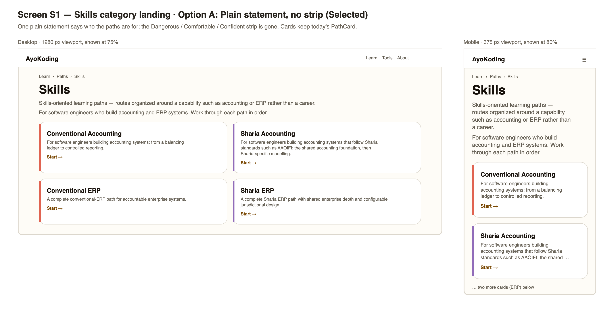
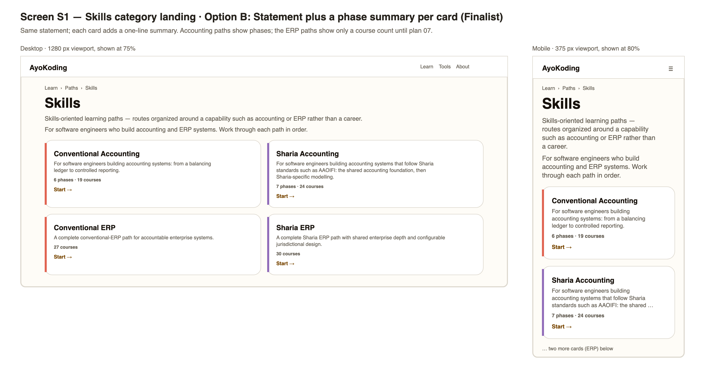
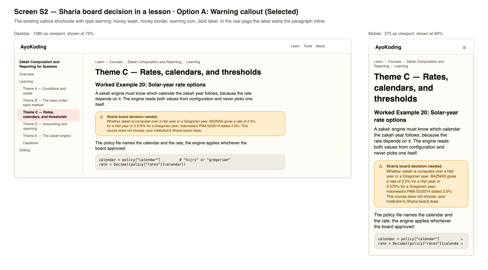
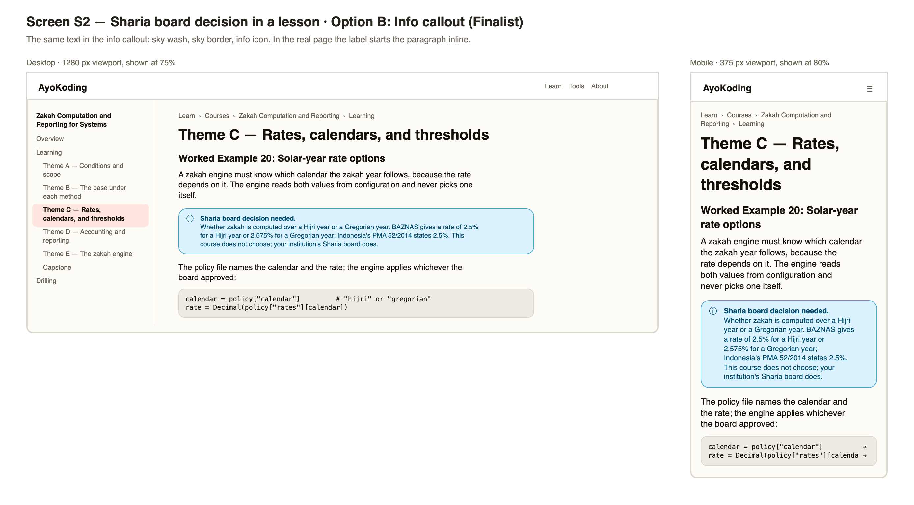

# Product Requirements — Accounting Courses

## Personas

| Persona                          | Who they are                                                                                                                     | What they need from this plan                                                                                                 |
| -------------------------------- | -------------------------------------------------------------------------------------------------------------------------------- | ----------------------------------------------------------------------------------------------------------------------------- |
| **Dina, ledger engineer**        | A backend engineer who joined a team that builds an accounting product. She codes well but has never closed a set of books.      | Courses that teach the accounting behind her code, with Python she can run, change, and test, in an order that builds up.     |
| **Farid, Islamic-bank engineer** | An engineer at an Islamic bank in Jakarta who must implement murabaha, ijarah, and zakah features for AAOIFI and PSAK reporting. | To know which standard applies, where AAOIFI, DSN-MUI, and Malaysia differ, and which choices only his Sharia board can make. |
| **Content maintainer**           | A later plan (07, 11–13) or a person editing a course after merge.                                                               | Rules that stop a course from silently becoming thin again, a toolchain for SQL examples, and a written Sharia content rule.  |
| **PR reviewer**                  | The person who reviews this large PR.                                                                                            | One commit per course, the gate reports, and an evidence summary so each course can be checked on its own.                    |

## User Stories

- **US1.** As Dina, I want every course in the Conventional Accounting path to be a finished course, so
  that no step of the path is an empty outline.
- **US2.** As Dina, I want every example to show code and its real output, so that I can trust the code
  and reuse it.
- **US3.** As Dina, I want drilling with recall questions, applied problems, code katas, and a
  self-check, so that I can test what I learned.
- **US4.** As Farid, I want each Sharia position attributed to its source with a date, and differences
  shown side by side, so that I can see the options instead of one view presented as the only one.
- **US5.** As Farid, I want every point that needs a Sharia board decision marked the same way, so that
  I can list them for my board and never mistake the course for a ruling.
- **US6.** As a reader of either path, I want the path page to show phases with plain outcomes and no
  internal jargon, so that I know what I can do after each phase.
- **US7.** As a reader of the skills landing, I want one plain sentence saying who the paths are for,
  so that I know at once whether they fit me.
- **US8.** As a content maintainer, I want a test that fails when an accounting course loses its
  drilling page, falls under its word floor, or adds an unchecked AAOIFI link, so that the courses stay
  complete after this plan.

## Functional Requirements

| Id   | Requirement                                                                                                                                                                                                                                               | Story    |
| ---- | --------------------------------------------------------------------------------------------------------------------------------------------------------------------------------------------------------------------------------------------------------- | -------- |
| FR1  | Each of the 24 courses is rewritten in its assigned mode (11 By Example, 13 Annotated Concept) and meets that mode's targets in [tech-docs/002](./tech-docs/002-course-modes-and-definition-of-done.md).                                                  | US1      |
| FR2  | Every example with code, every kata, and every capstone is a harness unit with a deterministic `run.yaml`; the lesson's code block and the recorded output match the unit's files.                                                                        | US2      |
| FR3  | Every course has a drilling page with Recall Q&A, Applied problems, Code katas, Self-check checklist, and Elaborative interrogation & self-explanation, at the floors in tech-docs/002.                                                                   | US3      |
| FR4  | The five Sharia courses follow rules SC1–SC8 in [tech-docs/004](./tech-docs/004-sharia-content-policy-and-sources.md); each has the disclaimer, at least four board-decision callouts, a differences table, and a Sharia board decision spotting section. | US4, US5 |
| FR5  | Every course's frontmatter has no `status: outline`, has `format`, and has plan 03's `category`, `description`, and an `estimatedHours` equal to the drift test's expected value.                                                                         | US1      |
| FR6  | `skills/conventional-accounting` has 6 core phases and `skills/sharia-accounting` 7, each with a title and an outcome; neither carries the restructure marker; both assume `backend-essentials`, `just-enough-python`, and `sql-essentials`.              | US6      |
| FR7  | The prerequisites of the 24 courses equal the target lists in [tech-docs/005](./tech-docs/005-path-restructure-and-integrity.md#prerequisite-changes); `journal-entries-and-posting-mechanics` comes before `financial-statements-and-close-cycle`.       | US6      |
| FR8  | The two accounting path pages and the skills hub page contain none of the words in the jargon list, and each accounting path page says the path is for software engineers.                                                                                | US6      |
| FR9  | The skills landing states "For software engineers who build accounting and ERP systems. Work through each path in order." once, shows no milestone strip, and keeps its four path cards.                                                                  | US7      |
| FR10 | The paths hub's screen-reader-only skills strapline reads "Accounting and ERP for software engineers".                                                                                                                                                    | US7      |
| FR11 | A content-shape test over the real content enforces FR1 word floors, FR3, FR4's checkable parts, FR5's outline status, and the AAOIFI link check.                                                                                                         | US8      |
| FR12 | The example harness can run SQL units through a new `psql` toolchain.                                                                                                                                                                                     | US2      |

## Non-Functional Requirements

- **Determinism.** Every unit gives the same output on two runs, the second with half the CPU (plan 05's
  rule), with `TZ=UTC`, `PYTHONHASHSEED=0`, and no network.
- **Accuracy.** Every standard, rate, and date in a Sharia course comes from a tier 1 source where one
  exists, with an access date; a fact the maker could not verify is stated as uncertain or left out.
- **Accessibility.** The warning callout keeps its 6.90:1 text contrast (WCAG AA); the skills landing
  keeps one `h1`, a labelled `nav`, and a list of links; no new interactive control is added.
- **Performance.** No new client JavaScript; one component is deleted.
- **Language.** All new course text is English; nothing under `content/id/**` changes.
- **No rulings.** No course text gives its own Sharia verdict.

## Acceptance Criteria (Gherkin)

How each scenario is bound to tests is in
[tech-docs/007](./tech-docs/007-testing-strategy.md#scenario-to-test-map).

### New: `backend/content/accounting-course-completion.feature`

```gherkin
Feature: Accounting courses are complete

  As a software engineer following an accounting skills path
  I want every course in the path to be a finished course
  So that no step of the path is an empty outline

  # Exemption(integration): the scenarios read committed course files only and have no separate local resource boundary; alternative-proof: ayokoding-www:test:unit / each scenario below
  # Exemption(e2e): course completeness is a property of committed content, not of a browser or HTTP boundary; alternative-proof: ayokoding-www:test:unit / each scenario below
  @integration-exempt @e2e-exempt
  Scenario: No accounting course is an outline
    Given the courses listed in the two accounting skills paths
    When each course's frontmatter is read
    Then no course carries the outline status
    And every course declares the format by-example or annotated-concept

  @integration-exempt @e2e-exempt
  Scenario: Every accounting course reaches the word floor of its format
    Given the courses listed in the two accounting skills paths
    When the words on each course's pages are counted
    Then every by-example course has at least 28000 words
    And every annotated-concept course has at least 22000 words

  @integration-exempt @e2e-exempt
  Scenario: Every accounting course has the full drilling page
    Given the courses listed in the two accounting skills paths
    When each course's drilling overview is read
    Then it has the sections Recall Q&A, Applied problems, Code katas, Self-check checklist, and Elaborative interrogation & self-explanation
    And its drilling overview has at least 5000 words

  @integration-exempt @e2e-exempt
  Scenario: Every accounting course runs its code in the example harness
    Given the courses listed in the two accounting skills paths
    When each course folder is searched for run specifications
    Then every course has a run.yaml under learning/code, under drilling/code, and under learning/capstone/code

  @integration-exempt @e2e-exempt
  Scenario: Every Sharia accounting course states its limit and flags board decisions in one form
    Given the courses that appear only in the Sharia accounting path
    When each course's pages are read
    Then its overview contains the sentence "This course explains standards and design choices; it does not issue Sharia rulings."
    And it has at least four callouts that start with "Sharia board decision needed."
    And every such callout uses the warning type
    And its drilling overview has the section Sharia board decision spotting

  @integration-exempt @e2e-exempt
  Scenario: Sharia accounting courses name superseded AAOIFI standards only as history
    Given the courses that appear only in the Sharia accounting path
    And the list of AAOIFI standards superseded on 2026-10-09
    When each paragraph of those courses is read
    Then every paragraph that names a superseded standard also says it was replaced or superseded

  @integration-exempt @e2e-exempt
  Scenario: Every AAOIFI link in an accounting course was checked by a person
    Given the courses listed in the two accounting skills paths
    When every link to aaoifi.com or one of its subdomains is collected from their pages
    Then each link appears in the list of links a person has checked in a browser
```

### Modified: `frontend/course-paths/skills-fixed-arc-statement.feature`

The one scenario is reworded; the feature title and narrative follow. The file name stays, so no
binding moves.

```gherkin
Feature: Skills category landing statement

  As a reader exploring skills paths
  I want the skills category landing to say plainly who its paths are for, with no chooser
  So that I know at once whether these paths fit me

  # Exemption(integration): the scenario is observable at the public browser or HTTP boundary and has no separate local resource boundary; alternative-proof: ayokoding-www-fe-e2e:test:e2e / The skills category landing says who its paths are for, once, with no chooser
  @integration-exempt
  Scenario: The skills category landing says who its paths are for, once, with no chooser
    Given a fixture skills manifest set is loaded
    When a reader opens the skills category landing at /en/learn/paths/skills/
    Then the page states once that the paths are for software engineers who build accounting and ERP systems
    And no arc-selection control is present anywhere on the page
    And no milestone strip appears under any path card
```

### Modified: `frontend/course-paths/skills-path-composition.feature`

One scenario outline is added after the existing scenario. In the existing scenario's bindings, the
expected order swaps journal entries before financial statements.

```gherkin
  # Exemption(e2e): the browser-test server deliberately replaces production manifests with isolated route fixtures, so published accounting manifests are unavailable through that public test boundary; alternative-proof: ayokoding-www:test:integration / Each accounting skills path is grouped into titled phases with outcomes
  @e2e-exempt
  Scenario Outline: Each accounting skills path is grouped into titled phases with outcomes
    Given the published accounting manifest for "<path-id>"
    When its phases are inspected
    Then it has <phase-count> core phases, each with a title and an outcome
    And it carries no restructure marker
    And it assumes backend-essentials, just-enough-python, and sql-essentials

    Examples:
      | path-id                        | phase-count |
      | skills/conventional-accounting | 6           |
      | skills/sharia-accounting       | 7           |
```

### Modified: `frontend/course-paths/path-copy.feature` (plan 02's)

One scenario is added, in the form of plan 02's scenarios as merged (Phase 0 reads them), with the
same Integration and E2E exemptions as those scenarios.

```gherkin
  Scenario: The skills hub and the accounting path pages use plain words
    Given the skills hub page and the two accounting path pages
    When their text is read
    Then none of them contains dangerous, oi-2, append, manifest, or from scratch
    And each accounting path page says the path is for software engineers
```

## UI Design Funnel

This plan is UI-bearing in two small places: the skills category landing (a statement changes and a
component is deleted) and the way course pages show a Sharia board decision (an existing component,
used in a new, fixed form). The path pages change only in data and copy: their phase sections are
plan 04's phase roadmap on plan 02's data (plans 01 to 05 merge before this plan, series decision
42), so they get no funnel here.

### Grounding (R5)

- **Shared kit (`libs/web-ui`):** `Card` (used by `PathCard`), `Badge`, and `Alert` with its
  `warning` (honey wash, ink, and border) and `info` (sky) variants, classes
  `rounded-lg border px-4 py-3 text-sm`, and `role="alert"`. Tokens come from
  `libs/web-ui-token/src/ayokoding.css` (`--hue-honey`, `--hue-honey-wash`, `--hue-honey-ink`,
  `--hue-sky*`, the warm neutrals).
- **Target app:** `shell/category-landing.tsx` (skills branch: `h1` and the page description from
  `paths/skills/_index.md`, then the statement paragraph, then a `nav` with a one-column, two-column
  from `md`, grid of `PathCard`s, each followed by `RampMilestoneStrip`); `shell/path-card.tsx` (title,
  `line-clamp-3` description, "Start →", a hue `border-l-4`: terracotta for conventional, plum for
  Sharia); `features/content/shell/callout.tsx` (`` →
  `Alert variant="warning"` with an `AlertTriangle` icon; `info` → `Info` icon and the sky variant).
- **Sibling screens:** the careers landing (an arc chooser, unchanged) and the legacy security
  tutorials, which already use warning callouts for legal notices.
- **Net-new components:** none. One component is deleted (`RampMilestoneStrip`).
- **After plan 04 (merged before this plan):** the skills branch renders plan 04's `LearnPathCard`
  (title link, description, phase count and hours, or a course count for a still-flat path, reading
  progress, "View path →") instead of `PathCard`, and keeps the statement and the strip (plan 04
  decision D11). This plan does not change the card. The grounding above and the mockups below show
  the card as measured on 2026-10-09; the selection is about the statement and the strip, and the
  manual check compares those, not the card's inner lines.

### Prior Art (R7)

- The GOV.UK Design System keeps its
  [warning text](https://design-system.service.gov.uk/components/warning-text) component for things
  with legal consequences of acting or not acting. A Sharia decision made without the board has that
  kind of consequence for an institution, which supports the warning form.
- The Microsoft Learn
  [Markdown reference](https://learn.microsoft.com/ro-ro/contribute/markdown-reference) says readers
  skip over notes and tips, and asks for few alerts, never two next to each other. This plan therefore
  uses a callout only for board decisions, never two in a row, and puts ordinary context in the text.
- Codecademy describes each skill path by the
  [outcome it gives a learner](https://help.codecademy.com/hc/en-us/articles/360022742113-What-is-a-Skill-Path),
  with milestones inside the path, not on the list of paths. This supports one plain audience
  statement on the landing and the outcomes on each path page.

### Screen S1 — Skills category landing

#### Stage 1: Diverge (low-fi)

**Option A — Plain statement, no strip.** Mobile (< sm, 375 px):

```text
+-----------------------------------+
| AyoKoding                     [=] |
| Learn > Paths > Skills            |
| Skills                            |
| Skills-oriented learning paths -- |
| routes organized around a ...     |
| For software engineers who build  |
| accounting and ERP systems. Work  |
| through each path in order.       |
| +-------------------------------+ |
| |# Conventional Accounting      | |
| |  For software engineers       | |
| |  building accounting ...      | |
| |  Start ->                     | |
| +-------------------------------+ |
| +-------------------------------+ |
| |# Sharia Accounting            | |
| |  ...                          | |
| +-------------------------------+ |
| (Conventional ERP, Sharia ERP)    |
+-----------------------------------+
```

Desktop (lg >= 1024 px): the same content, with the cards in two columns.

```text
+----------------------------------------------------------------+
| Skills                                                         |
| Skills-oriented learning paths -- routes organized around ...  |
| For software engineers who build accounting and ERP systems.   |
| Work through each path in order.                               |
| +---------------------------+  +---------------------------+   |
| |# Conventional Accounting  |  |# Sharia Accounting        |   |
| |  For software engineers.. |  |  For software engineers.. |   |
| |  Start ->                 |  |  Start ->                 |   |
| +---------------------------+  +---------------------------+   |
| +---------------------------+  +---------------------------+   |
| |# Conventional ERP         |  |# Sharia ERP               |   |
| +---------------------------+  +---------------------------+   |
+----------------------------------------------------------------+
```

**Option B — Statement plus a phase summary per card.** The same statement; each card adds one line.
Mobile is Option A's single column with the extra line in each card.

```text
+----------------------------------------------------------------+
| For software engineers who build accounting and ERP systems.   |
| +---------------------------+  +---------------------------+   |
| |# Conventional Accounting  |  |# Sharia Accounting        |   |
| |  For software engineers.. |  |  For software engineers.. |   |
| |  6 phases . 19 courses    |  |  7 phases . 24 courses    |   |
| |  Start ->                 |  |  Start ->                 |   |
| +---------------------------+  +---------------------------+   |
| |# Conventional ERP         |  |# Sharia ERP               |   |
| |  27 courses               |  |  30 courses               |   |
+----------------------------------------------------------------+
```

**Option C — Strip relabelled with phase titles.** Keep a strip under each card, but show the path's
phase titles instead of "Dangerous / Comfortable / Confident". On mobile the labels wrap to two or
three rows.

```text
+-----------------------------------+
| |# Conventional Accounting      | |
| |  Start ->                     | |
| +-------------------------------+ |
| . Foundations . Recording         |
| . Statements and close            |
| . Transaction cycles . Reporting  |
| . Systems                         |
+-----------------------------------+
```

#### Stage 2: Narrow (hi-fi finalists)

Option C is dropped: it keeps a second, competing summary next to the path pages' outcomes, the ERP
paths have no phases until plan 07, and six or seven labels wrap into a block on a 375 px screen.





The hi-fi images are rendered from HTML that uses the app's light-theme tokens; each PNG embeds an
editable Excalidraw scene of the same layout. The mobile frames show the first two cards only.

#### Stage 3: Select

**Selected: Option A — Plain statement, no strip.**

#### Stage 4: Justify

| Option                                 | Outcome  | Reason                                                                                                                                                                                                                                        |
| -------------------------------------- | -------- | --------------------------------------------------------------------------------------------------------------------------------------------------------------------------------------------------------------------------------------------- |
| A — Plain statement, no strip          | Selected | Says who the paths are for in one sentence, deletes a component, and adds nothing to maintain. The phase outcomes live on each path page, where a reader decides.                                                                             |
| B — Statement plus a phase summary     | Finalist | Useful numbers, but plan 04's `LearnPathCard` already shows the phase count and hours inside each card (a course count for the still-flat ERP paths), so a summary line would repeat it; a count also says little about what a reader can do. |
| C — Strip relabelled with phase titles | Dropped  | A second summary that competes with the outcomes, no data for the ERP paths, and a wrapped block of labels on mobile.                                                                                                                         |

### Screen S2 — A Sharia board decision inside a lesson

#### Stage 1: Diverge (low-fi)

**Option A — Warning callout.** Mobile (< sm, 375 px):

```text
+-----------------------------------+
| Worked Example 20: Solar-year     |
| rate options                      |
| A zakah engine must know which    |
| calendar the zakah year follows.. |
| +-------------------------------+ |
| |/!\ Sharia board decision      | |
| |    needed. Whether zakah is   | |
| |    computed over a Hijri year | |
| |    or a Gregorian year. ...   | |
| |    This course does not       | |
| |    choose; your institution's | |
| |    Sharia board does.         | |
| +-------------------------------+ |
| The policy file names the ...     |
| +-------------------------------+ |
| | calendar = policy["calen... ->| |
| +-------------------------------+ |
+-----------------------------------+
```

Desktop (lg >= 1024 px): the course sidebar on the left; the callout spans the prose column.

```text
+---------------+------------------------------------------------+
| Zakah course  | Worked Example 20: Solar-year rate options     |
|  Overview     | A zakah engine must know which calendar ...    |
|  Learning     | +--------------------------------------------+ |
|   Theme A     | |/!\ Sharia board decision needed. Whether   | |
|   Theme B     | |    zakah is computed over a Hijri year or  | |
|  >Theme C     | |    a Gregorian year. BAZNAS gives ...      | |
|   Theme D     | +--------------------------------------------+ |
|  Drilling     | calendar = policy["calendar"]                  |
+---------------+------------------------------------------------+
```

**Option B — Info callout.** The same text and layout in the `info` callout (sky colours, an "i"
icon). Mobile and desktop as in Option A.

```text
| +--------------------------------------------+ |
| |(i) Sharia board decision needed. Whether   | |
| |    zakah is computed over a Hijri year ... | |
| +--------------------------------------------+ |
```

**Option C — Plain bold label in the text.** No box; the paragraph starts with the bold label.

```text
| **Sharia board decision needed.** Whether zakah is computed    |
| over a Hijri year or a Gregorian year. BAZNAS gives ...        |
```

#### Stage 2: Narrow (hi-fi finalists)

Option C is dropped: a bold label inside ordinary text is easy to miss while skimming, and it gives
the content-shape test no stable block to find and count.





In the mockups the bold label sits on its own line; on the real page it starts the callout's paragraph
inline, because the content is Markdown inside the existing shortcode. A long code line on mobile
scrolls sideways; the mockup marks the cut with an arrow.

#### Stage 3: Select

**Selected: Option A — Warning callout.**

#### Stage 4: Justify

| Option               | Outcome  | Reason                                                                                                                                                                                                                       |
| -------------------- | -------- | ---------------------------------------------------------------------------------------------------------------------------------------------------------------------------------------------------------------------------- |
| A — Warning callout  | Selected | Signals "stop: someone else must decide", which matches the legal and compliance weight of a Sharia decision. It reuses the existing shortcode and `Alert` (6.90:1 contrast), so no new component and a stable form to test. |
| B — Info callout     | Finalist | Same reuse and testability, but "info" reads as optional background, and readers skip notes; a board decision is not optional.                                                                                               |
| C — Plain bold label | Dropped  | Easy to miss and gives the content test nothing stable to find.                                                                                                                                                              |

Usage rules that come with the selection (also in rule SC4): a callout is used only for a board
decision; two callouts never sit next to each other; ordinary context stays in the text.

The `Alert` renders `role="alert"`, which screen readers announce as a live alert. For static lesson
text that is stronger than needed. This plan does not change the shared component; if the accessibility
review in [delivery.md](./delivery.md) flags it, a conditional packet in delivery covers the fix.

### Responsive Strategy

| Element                         | Mobile (< sm)                                          | Tablet (md >= 768 px)                  | Desktop (lg >= 1024 px)                                    |
| ------------------------------- | ------------------------------------------------------ | -------------------------------------- | ---------------------------------------------------------- |
| S1 statement                    | Wraps to three or four lines under the description     | Two lines                              | One or two lines                                           |
| S1 path cards                   | One column, full width; description clamped to 3 lines | Two columns (today's `md:grid-cols-2`) | Two columns                                                |
| S1 milestone strip              | Gone                                                   | Gone                                   | Gone                                                       |
| S2 callout                      | Full width of the prose; icon left, text wraps         | Full width of the prose column         | Full width of the prose column, next to the course sidebar |
| S2 code block after the callout | Scrolls sideways; never widens the page                | Same                                   | Same                                                       |

## Copy Changes

| Place                                      | Before                                                                                                                          | After                                                                                                                                                               |
| ------------------------------------------ | ------------------------------------------------------------------------------------------------------------------------------- | ------------------------------------------------------------------------------------------------------------------------------------------------------------------- |
| Skills landing statement                   | "Get up and running fast on the ramp — every skills path starts safe, gets you productive quickly, and goes deeper from there." | "For software engineers who build accounting and ERP systems. Work through each path in order."                                                                     |
| Skills landing cards                       | "Dangerous", "Comfortable", "Confident" under every card                                                                        | Nothing                                                                                                                                                             |
| Paths hub skills strapline (screen reader) | "Up and running fast, then deeper and deeper"                                                                                   | "Accounting and ERP for software engineers"                                                                                                                         |
| Skills hub page description                | "… rather than a career. Each path publishes as its manifest ships."                                                            | "… rather than a career."                                                                                                                                           |
| Conventional Accounting path description   | "A practical accounting path from a balancing ledger to controlled reporting."                                                  | "For software engineers building accounting systems: from a balancing ledger to controlled reporting."                                                              |
| Sharia Accounting path description         | "A practical accounting path with a shared foundation before Sharia-specific extension."                                        | "For software engineers building accounting systems that follow Sharia standards such as AAOIFI: the shared accounting foundation, then Sharia-specific modelling." |
| Both path page bodies                      | "Dangerous 1/2/3", "OI-2", "complete at nineteen courses", "no later plan appends courses"                                      | The bodies in [syllabus/paths/](./syllabus/paths/README.md)                                                                                                         |
