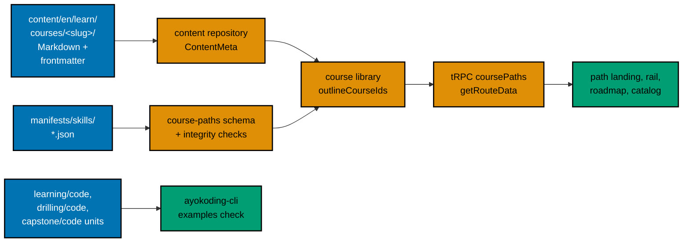

# 001 — Current State and Architecture

All measurements on this page were taken on 2026-10-09 in the authoring worktree, based on
`origin/main` at `bb7f90137`. Plans 01, 02, 03, and 05 change some of these files before this plan
runs; Phase 0 re-measures and records the differences.

## The 24 Courses Today

Every accounting course is an outline: six Markdown files (`_index.md`, `overview.md`,
`learning/_index.md`, `learning/overview.md`, `drilling/_index.md`, `drilling/overview.md`), no code
folder, no example pages, and between 186 and 313 words in total (frontmatter included). The
frontmatter has only `title`, `date`, `draft`, `weight`, and `prerequisites`. Plan 02 adds
`status: outline` to all 24; plan 03 adds `category`, `description`, and (for outlines) no `format`.

| Weight | Course ID                                      | Title                                        | Words | Prerequisites today                                                                                                           |
| ------ | ---------------------------------------------- | -------------------------------------------- | ----- | ----------------------------------------------------------------------------------------------------------------------------- |
| 1100   | `accounting-foundations`                       | Accounting Foundations                       | 285   | —                                                                                                                             |
| 1101   | `chart-of-accounts-and-data-modeling`          | Chart of Accounts and Data Modeling          | 281   | `accounting-foundations`, `sql-essentials`                                                                                    |
| 1102   | `financial-statements-and-close-cycle`         | Financial Statements and Close Cycle         | 275   | `chart-of-accounts-and-data-modeling`                                                                                         |
| 1103   | `journal-entries-and-posting-mechanics`        | Journal Entries and Posting Mechanics        | 264   | `financial-statements-and-close-cycle`                                                                                        |
| 1104   | `accrual-accounting-and-revenue-recognition`   | Accrual Accounting and Revenue Recognition   | 249   | `journal-entries-and-posting-mechanics`                                                                                       |
| 1105   | `accounts-payable-and-procure-to-pay`          | Accounts Payable and Procure to Pay          | 245   | `journal-entries-and-posting-mechanics`, `accrual-accounting-and-revenue-recognition`                                         |
| 1106   | `accounts-receivable-and-order-to-cash`        | Accounts Receivable and Order to Cash        | 245   | `journal-entries-and-posting-mechanics`, `accrual-accounting-and-revenue-recognition`                                         |
| 1107   | `managerial-and-cost-accounting`               | Managerial and Cost Accounting               | 239   | `financial-statements-and-close-cycle`                                                                                        |
| 1108   | `fixed-assets-and-depreciation`                | Fixed Assets and Depreciation                | 231   | `financial-statements-and-close-cycle`                                                                                        |
| 1109   | `inventory-and-cogs-accounting`                | Inventory and COGS Accounting                | 237   | `chart-of-accounts-and-data-modeling`, `managerial-and-cost-accounting`                                                       |
| 1110   | `lease-and-intangible-asset-accounting`        | Lease and Intangible Asset Accounting        | 249   | `fixed-assets-and-depreciation`                                                                                               |
| 1111   | `multi-currency-accounting-and-fx-translation` | Multi-currency Accounting and FX Translation | 203   | `financial-statements-and-close-cycle`                                                                                        |
| 1112   | `consolidation-and-multi-entity-accounting`    | Consolidation and Multi-entity Accounting    | 200   | `chart-of-accounts-and-data-modeling`, `financial-statements-and-close-cycle`, `multi-currency-accounting-and-fx-translation` |
| 1113   | `financial-reporting-standards-ifrs-vs-gaap`   | Financial Reporting Standards: IFRS vs GAAP  | 199   | `accrual-accounting-and-revenue-recognition`, `lease-and-intangible-asset-accounting`                                         |
| 1114   | `audit-controls-and-compliance`                | Audit, Controls, and Compliance              | 189   | `financial-statements-and-close-cycle`                                                                                        |
| 1115   | `payroll-and-tax-accounting-essentials`        | Payroll and Tax Accounting Essentials        | 186   | `chart-of-accounts-and-data-modeling`                                                                                         |
| 1116   | `treasury-and-cash-management`                 | Treasury and Cash Management                 | 192   | `accounts-payable-and-procure-to-pay`, `accounts-receivable-and-order-to-cash`                                                |
| 1117   | `financial-reporting-and-xbrl`                 | Financial Reporting and XBRL                 | 204   | `financial-reporting-standards-ifrs-vs-gaap`                                                                                  |
| 1118   | `general-ledger-system-architecture`           | General Ledger System Architecture           | 210   | `chart-of-accounts-and-data-modeling`, `financial-statements-and-close-cycle`, `backend-essentials`                           |
| 1119   | `sharia-accounting-and-aaoifi-standards`       | Sharia Accounting and AAOIFI Standards       | 285   | `accrual-accounting-and-revenue-recognition`, `financial-reporting-standards-ifrs-vs-gaap`                                    |
| 1120   | `islamic-contract-modeling-for-systems`        | Islamic Contract Modeling for Systems        | 313   | `sharia-accounting-and-aaoifi-standards`, `chart-of-accounts-and-data-modeling`                                               |
| 1121   | `zakah-computation-and-reporting-for-systems`  | Zakah Computation and Reporting for Systems  | 260   | `islamic-contract-modeling-for-systems`                                                                                       |
| 1122   | `sukuk-and-islamic-capital-markets-accounting` | Sukuk and Islamic Capital Markets Accounting | 277   | `islamic-contract-modeling-for-systems`, `multi-currency-accounting-and-fx-translation`                                       |
| 1123   | `sharia-ledger-system-architecture`            | Sharia Ledger System Architecture            | 281   | `islamic-contract-modeling-for-systems`, `general-ledger-system-architecture`                                                 |

Courses outside this plan that list an accounting course as a prerequisite (all ERP courses, owned by
plan 07): `erp-security-and-controls` → `audit-controls-and-compliance`;
`human-capital-management-and-hire-to-retire` → `payroll-and-tax-accounting-essentials`;
`inventory-and-warehouse-management` → `inventory-and-cogs-accounting`;
`multi-company-and-multi-currency-erp` → `consolidation-and-multi-entity-accounting`;
`record-to-report-systems` → `financial-statements-and-close-cycle`; `sharia-compliant-erp-design` →
`islamic-contract-modeling-for-systems` and `sharia-accounting-and-aaoifi-standards`. This plan does
not change those edges; no career manifest and no ERP manifest contains an accounting course.

## The Two Paths Today

| Path                             | Courses | Shape on `main` after plan 02                                             | Page body today                                                                              |
| -------------------------------- | ------- | ------------------------------------------------------------------------- | -------------------------------------------------------------------------------------------- |
| `skills/conventional-accounting` | 19      | One `all-courses` phase, `assumes: []`, `restructurePendingIn: "plan-06"` | "complete at nineteen courses", "**Dangerous 2**", "no later plan appends courses"           |
| `skills/sharia-accounting`       | 24      | Same, with the five Sharia courses after the shared 19                    | "**Dangerous 1/2/3**", "settle OI-2's doctrinal basis", "No further course will be appended" |

The skills category landing (`shell/category-landing.tsx`) renders the statement "Get up and running
fast on the ramp — every skills path starts safe, gets you productive quickly, and goes deeper from
there." and a `RampMilestoneStrip` ("Dangerous", "Comfortable", "Confident") under every skills path
card. The paths hub (`src/app/[locale]/(content)/[...slug]/page.tsx`) passes the skills strapline
"Up and running fast, then deeper and deeper" to `CategorySection`, which renders it as
screen-reader-only text (`sr-only`), so it is heard, not seen. The skills hub page
`paths/skills/_index.md` has the description "… Each path publishes as its manifest ships."

## Where Things Live

- **Course content:** `apps/ayokoding-www/content/en/learn/courses/<slug>/`. `_index.md` files are
  generated by `src/scripts/generate-indexes.ts` (the frontmatter is hand-edited; the bodies are
  generated).
- **Manifests:** `apps/ayokoding-www/src/features/course-paths/manifests/skills/{conventional-accounting,sharia-accounting}.json`.
- **Integrity:** `src/features/course-paths/core/manifest-integrity.ts` and, after plan 02,
  `core/skills-restructure-allowlist.ts`.
- **Skills landing and hub:** `src/features/course-paths/shell/{category-landing.tsx,ramp-milestone-strip.tsx}`
  and `src/app/[locale]/(content)/[...slug]/page.tsx`.
- **Callout shortcode:** `src/features/content/core/shortcodes.ts` turns
  `…` into the `Callout` component, which renders the
  web-ui `Alert` with the warning variant (honey wash, ink, and border tokens from
  `libs/web-ui-token/src/ayokoding.css`). `info` and `tip` map to the other variants.
- **Code harness (plan 05):** `apps/ayokoding-cli/`, its catalog `apps/ayokoding-cli/toolchains/catalog.yaml`,
  and the Nx target `ayokoding-www:examples:check`.

## Prior Art in the Repository

| Prior art                                                                                   | What it gives this plan                                                                                                                                                   |
| ------------------------------------------------------------------------------------------- | ------------------------------------------------------------------------------------------------------------------------------------------------------------------------- |
| `plans/done/2026-08-15__ayokoding-learning-path-14-skills-accounting-foundations/`          | The first accounting syllabus. It planned "paper, no build" courses, which produced today's outlines; this plan reverses that choice (runnable code, decision D1).        |
| `plans/done/2026-08-15__ayokoding-learning-path-15-skills-accounting-enterprise-reporting/` | The enterprise-reporting syllabus (consolidation, IFRS, XBRL, ledger architecture) used as topic lineage only.                                                            |
| `plans/done/2026-08-16__ayokoding-learning-path-16-skills-accounting-sharia-extension/`     | The Sharia extension syllabus. It cites AAOIFI FAS 9, which FAS 39 superseded from 1 January 2023; this plan copies nothing from it.                                      |
| `apps/ayokoding-www/content/en/learn/courses/sql-essentials/`                               | The By Example exemplar: 80 examples, 51,943 words; drilling with 24 recall questions, 12 applied problems, 8 code katas, 25 self-check items, and 6 why/why-not prompts. |
| `apps/ayokoding-www/content/en/learn/courses/statistics-for-evaluation/`                    | The Annotated-Concept exemplar: 46 worked examples in four theme pages, 54,322 words; drilling 24 / 8 / 5 / 24 / 6 in the same order.                                     |
| `apps/ayokoding-www/content/en/learn/courses/backend-essentials/`                           | A second By Example exemplar; drilling has 24 recall questions, 16 applied problems, 19 code katas, 26 self-check items, and no why/why-not section.                      |

The exemplar counts were measured on 2026-10-09 with a read-only scan and set the drilling floors in
[002](./002-course-modes-and-definition-of-done.md#drilling-targets).
