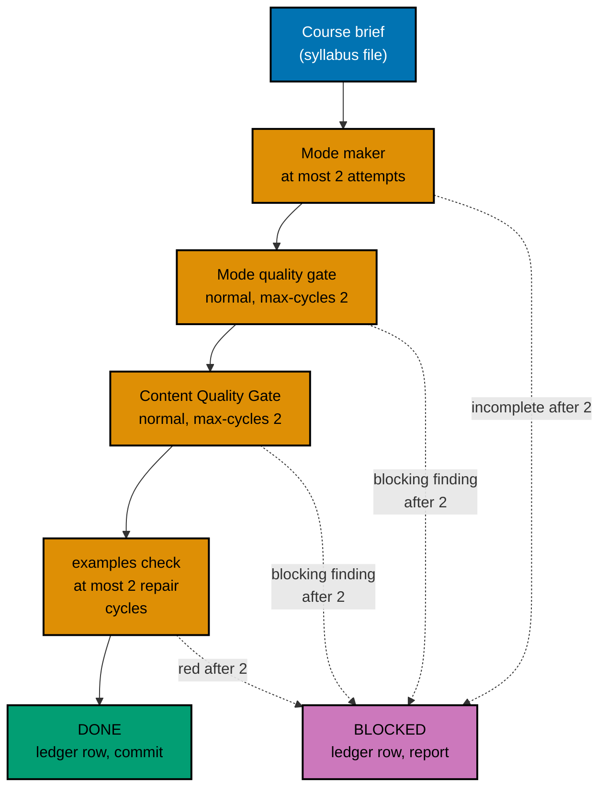

# 006 — Execution Model

Writing 24 long courses is most of this plan's work. This page says in which order the courses are
written, who writes and checks each one, how every loop is bounded, what happens when a course cannot
pass, and where the record of it all lives.

## Batches in Prerequisite Order

A course is written only after every course it requires (inside these 24) is finished. The maker of a
later course reads the finished earlier courses so it reuses their names, data, and code (for example
the posting engine from the journal-entries course) and does not re-teach them. That gives twelve
levels:

| Level | Courses                                                                                                                                                                                                                             | Requires (inside the 24) |
| ----- | ----------------------------------------------------------------------------------------------------------------------------------------------------------------------------------------------------------------------------------- | ------------------------ |
| L0    | `accounting-foundations`                                                                                                                                                                                                            | —                        |
| L1    | `chart-of-accounts-and-data-modeling`                                                                                                                                                                                               | L0                       |
| L2    | `journal-entries-and-posting-mechanics`                                                                                                                                                                                             | L0, L1                   |
| L3    | `financial-statements-and-close-cycle`                                                                                                                                                                                              | L1, L2                   |
| L4    | `accrual-accounting-and-revenue-recognition`, `managerial-and-cost-accounting`, `multi-currency-accounting-and-fx-translation`, `audit-controls-and-compliance`                                                                     | L2, L3                   |
| L5    | `accounts-payable-and-procure-to-pay`, `accounts-receivable-and-order-to-cash`, `fixed-assets-and-depreciation`, `inventory-and-cogs-accounting`, `consolidation-and-multi-entity-accounting`, `general-ledger-system-architecture` | L1–L4                    |
| L6    | `lease-and-intangible-asset-accounting`, `payroll-and-tax-accounting-essentials`, `treasury-and-cash-management`                                                                                                                    | L4, L5                   |
| L7    | `financial-reporting-standards-ifrs-vs-gaap`                                                                                                                                                                                        | L4–L6                    |
| L8    | `financial-reporting-and-xbrl`, `sharia-accounting-and-aaoifi-standards`                                                                                                                                                            | L3, L4, L7               |
| L9    | `islamic-contract-modeling-for-systems`                                                                                                                                                                                             | L2, L5, L6, L8           |
| L10   | `zakah-computation-and-reporting-for-systems`, `sukuk-and-islamic-capital-markets-accounting`                                                                                                                                       | L3, L4, L5, L9           |
| L11   | `sharia-ledger-system-architecture`                                                                                                                                                                                                 | L5, L9, L10              |

Levels are computed from the target prerequisites in
[005](./005-path-restructure-and-integrity.md#prerequisite-changes). A level starts only when every
course in the levels it needs is **DONE** or **BLOCKED** (see below).

## Agent Topology

- **Main thread (coordinator).** Owns the execution ledger, every commit, index generation, every
  shared file (manifests, tests, the harness catalog, rule files), and every phase gate. It keeps its
  own context free and fills background slots first.
- **At most 3 background agents at any time** (the repository's N+1 model with N = 3). Each one runs
  the pipeline below for exactly one course and writes only inside that course's folder
  `apps/ayokoding-www/content/en/learn/courses/<slug>/`. When a level has more than three courses,
  the rest wait for a free slot; a level with one course uses one slot.
- **Never shared:** two agents never write the same file. Shared files are touched only by the
  coordinator, in the non-course phases of [../delivery.md](../delivery.md).
- **Compute.** Every command runs through `./hippo`, so concurrent harness runs (which start Docker
  containers) wait for HIPPO admission instead of overloading the machine.

## The Per-Course Pipeline

Every step is bounded. "Cycle" means one check-then-fix round. The user set the cap on 2026-10-09:
every gate and every maker-checker loop stops after **2 cycles** ("semua jadi 2 aja").

| Step             | Who                                                                                                                    | Input                                                                                                                                                                                                                            | Done when                                                                                                                                                                         | Cap                                                                                     |
| ---------------- | ---------------------------------------------------------------------------------------------------------------------- | -------------------------------------------------------------------------------------------------------------------------------------------------------------------------------------------------------------------------------- | --------------------------------------------------------------------------------------------------------------------------------------------------------------------------------- | --------------------------------------------------------------------------------------- |
| 1. Make          | `apps-ayokoding-www-by-example-maker` (By Example) or `apps-ayokoding-www-annotated-concept-maker` (Annotated Concept) | The course brief, [002](./002-course-modes-and-definition-of-done.md), [003](./003-code-harness-and-determinism.md), [004](./004-sharia-content-policy-and-sources.md) for Sharia courses, and the finished prerequisite courses | Every page and every code unit in the brief exists; `examples validate`, `sync`, and `check --course <slug>` exit 0 on the maker's own run; every recorded expected file was read | 2 attempts. A second attempt continues from the first one's files; it never starts over |
| 2. Mode gate     | The Tutorial By Example or Tutorial Annotated Concept Quality Gate                                                     | `subject` = the course folder, `mode: normal`, `max-cycles: 2`                                                                                                                                                                   | Verdict `PASS` or `PASS_WITH_FINDINGS`                                                                                                                                            | 2 cycles (the gate's own input)                                                         |
| 3. Content gate  | The Content Quality Gate                                                                                               | The same inputs                                                                                                                                                                                                                  | Verdict `PASS` or `PASS_WITH_FINDINGS`                                                                                                                                            | 2 cycles                                                                                |
| 4. Harness green | The coordinator runs `examples check --course <slug>`; a repair, if needed, goes back to the course's maker            | The course folder after the gates' fixers                                                                                                                                                                                        | Exit 0                                                                                                                                                                            | 2 repair cycles                                                                         |
| 5. Record        | The coordinator                                                                                                        | The reports and exit codes                                                                                                                                                                                                       | A ledger row with every field below, and one commit for the course                                                                                                                | —                                                                                       |

The harness also runs inside step 1, because a maker must hand over code that works. Step 4 still
runs after the gates, because the gates' fixers may edit lessons or code; it is the step decision 29
names.

A gate verdict of `FAIL` or `BLOCKED` after its second cycle, or any open `needs-decision` finding
(the gate adapter routes an example count under its floor to `needs-decision`), makes the course
BLOCKED. No verdict stops the batch.

`status: outline` stays on every course during the batches. All 24 drop it together in the
metadata phase of [../delivery.md](../delivery.md), because the manifest restructure, the drift
test's `estimatedHours` output, and plan 02's no-outline-in-core rule all need them to change in one
step.

## Blocked Courses

A course is **BLOCKED** when any step reaches its cap without passing. Then:

1. The coordinator records it in the ledger with the step, the cycle count, and every open finding.
2. It reports the course to the user in one short message (course, step, top findings) and continues
   with the next course. Dependent courses still run: their makers use the BLOCKED course's brief
   and whatever pages it has, and the ledger notes that dependency.
3. The BLOCKED course keeps `status: outline` and its partial pages stay uncommitted in the worktree.
4. After the last batch, the plan stops at a `[HUMAN]` decision before the metadata and manifest
   phases, because a BLOCKED course would fail plan 02's no-outline-in-core rule (R5) for both paths
   and series decision 39 forbids shipping the restructure without filled courses. The user chooses
   for each BLOCKED course, for example to authorise more cycles for that one course or to change
   the plan's scope. The plan does not continue until every BLOCKED course is resolved.

The same human stop also holds the AAOIFI URL checks from
[004](./004-sharia-content-policy-and-sources.md#aaoifi-url-register), so the user is asked once. The
stop happens even when no course is BLOCKED, because the URL checks always need a person.

## The Execution Ledger

The ledger is the running record of the batches. It lives in the execution worktree at
`local-tmp/ayokoding-learn/execution-ledger.md` (gitignored scratch, shared by the series), under a
heading `## Plan 06 — accounting courses`. One row per course:

| Field           | Example                                     |
| --------------- | ------------------------------------------- |
| Course          | `journal-entries-and-posting-mechanics`     |
| Level and mode  | L2, by-example                              |
| Maker agent ID  | the agent ID the harness reports            |
| Maker attempts  | 1                                           |
| Mode gate       | 2 cycles, `PASS_WITH_FINDINGS`, report path |
| Content gate    | 1 cycle, `PASS`, report path                |
| Harness         | exit 0, 0 repair cycles, units 83, runs 166 |
| Words, examples | 31,240 words, 78 examples, 41 diagrams      |
| Status          | DONE or BLOCKED                             |
| Open findings   | — or the list                               |
| Commit          | the short SHA                               |

At the end the coordinator copies the table (without scratch paths) into
`<plan>/evidence/execution-summary.md`, which is committed, so the record survives the worktree's
cleanup.

## Commits

One commit per DONE course, made by the coordinator after step 5:
`feat(ayokoding-www): rewrite <slug> course`. It stages only that course's folder (and the
regenerated `_index.md` files that belong to it). Indexes are regenerated by the coordinator once per
batch, never by a background agent, and the coordinator then confirms with `rtk git status --short`
that nothing under `apps/ayokoding-www/content/id/` changed; if something did, it restores those
files with `rtk git checkout -- apps/ayokoding-www/content/id` before committing.

## What the Coordinator Checks Between Batches

- Every course in the batch is DONE or BLOCKED and has a ledger row.
- `examples check` for every DONE course in the batch still exits 0 (a later fix must not break an
  earlier course).
- `rtk git status --short` shows only the batch's course folders and their indexes.
- The quick suite is not run between levels; it runs at the end of each course phase (L0–L3, L4–L6,
  L7–L11) and in the end phases. The harness and the index validation run after every level.
