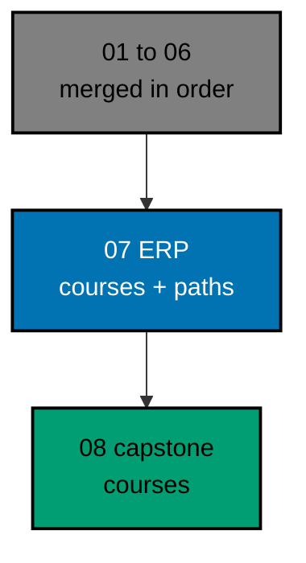

# AyoKoding Learn Revamp 07 — ERP Courses

> **Status:** Backlog. Do not execute until both are true: the user gives an explicit execution
> command, and plans 01 to 06 of this series have merged to `origin/main`. The 14 plans run strictly
> one after another (series decision 42), so plan 06 is merged, deployed, verified, and cleaned up
> before this plan starts. The user said: "jangan kerjain/implement plan ini sebelum gw kasih perintah
> buat eksekusi ya".
>
> **Plan quality gate:** not run yet, so no verdict exists. By the user's decision of 2026-10-09 it
> was not run while the plan was written; it runs at the start of execution, as the first item of
> Phase 0 in [delivery.md](./delivery.md#phase-0-worktree-preconditions-contracts-probes-and-baseline),
> with `max-cycles` 2.

AyoKoding has 30 ERP courses: 27 conventional ones and 3 Sharia (Islamic finance) ones. They make up two
skills paths for software engineers who build ERP systems. On 2026-10-09 every one of them was an outline of
215 to 250 words, with no lessons, no exercises, and no code. This plan writes all 30 as full courses with
runnable, tested code, and then turns both ERP paths into titled phases with plain outcomes, in the same PR.
It also deletes the temporary "pending restructure" mechanism that plan 02 added for exactly this moment.

## Scope

- **Write 30 courses** to the series definition of done (decision 27): each course is in one tutorial mode,
  By Example (18 courses) or Annotated-Concept (12 courses), chosen per course with a reason; it meets its
  mode's targets, has a full drilling page, passes its mode quality gate and the Content Quality Gate with no
  blocking finding, and runs all its code green in plan 05's example harness. See
  [tech-docs/002](./tech-docs/002-course-catalog-and-modes.md) and
  [tech-docs/003](./tech-docs/003-definition-of-done-and-targets.md).
- **Runnable code everywhere.** Every example, kata, and capstone is a harness unit with a deterministic
  `run.yaml`. Every unit runs on Python 3.14. Fourteen courses also run PostgreSQL 18 for real (through plan 06's
  `psql` toolchain or the hash-locked `pg8000` driver), and two courses include seeded simulations. See
  [tech-docs/004](./tech-docs/004-code-runtime-and-run-yaml.md).
- **Sharia content rules.** The three Sharia ERP courses follow plan 06's rules SC1 to SC8: they cite AAOIFI
  and recognized fatwa bodies with dates, show only sourced differences between scholars and jurisdictions,
  issue no rulings, flag every Sharia board decision with one fixed callout, and teach the standards in force
  (including FAS 51 and FAS 52 from 1 January 2027). Every AAOIFI URL is checked by a person before merge. See
  [tech-docs/005](./tech-docs/005-sharia-policy-and-source-register.md).
- **Restructure both ERP paths in the same PR** (decision 39): `skills/conventional-erp` becomes 5 titled
  phases and `skills/sharia-erp` 6, each with an outcome ("After this phase you can ... / You cannot yet ...");
  the audience and the outside prerequisites are stated (decisions 16 to 18); the closure and
  no-outline-in-core rules turn on. See [tech-docs/006](./tech-docs/006-path-restructure-and-pending-removal.md).
- **Delete the pending mechanism.** The `restructurePendingIn` field, the allowlist module, rule R9, the marker
  scenarios, the frozen skills-order test, and every flat-render branch go. Whatever plan 06 left undone in the
  skills landing work is finished here (Phase 0 reads what plan 06 merged and does what remains).
- **Metadata.** All 30 courses drop `status: outline` and get plan 03's metadata, with a real `estimatedHours`
  taken from plan 03's drift test, never guessed.
- **Guard the end state** (decision 40): a new content-shape test keeps every ERP course filled, and
  `ayokoding-www:examples:check` keeps its code green. The path-copy test now covers every published page under
  `content/en/learn/paths/`.

## Non-Goals

- The 24 accounting courses and their two paths (plan 06), and the 8 capstone courses (plan 08). The capstones
  stay outlines until plan 08.
- Any new durable rule. The plan applies rules from plans 02, 03, 05, and 06 and retires one closed exception
  ([tech-docs/011](./tech-docs/011-rule-and-docs-impact.md)).
- Any change to plan 05's harness or to plan 04's roadmap code, except deleting plan 04's flat mode.
- Indonesian content: `content/id/**` stays untouched (decision 35).
- Issuing or endorsing any Sharia ruling.

## Dependency and Result

The series runs strictly in order, one plan, one worktree, and one PR at a time (series decision 42), so plans
01 to 06 are all merged when this plan starts. This plan builds directly on plan 02 (path model and the
mechanism it deletes), plan 03 (course metadata), plan 04 (the roadmap with the flat mode it removes), plan 05
(code harness), and plan 06 (accounting courses, the Sharia rules, the `psql` toolchain, and the shared
content-shape helpers).

## Series Context

This plan is row 07 of the 14-plan **AyoKoding Learn Revamp** series. Each plan is one PR delivered from its
own worktree, and the plans run strictly in numeric order; the "Depends on" column shows which earlier plans
each one builds on. The user resolved the series decisions on 2026-10-09; every decision this plan relies on is
copied into [brd.md](./brd.md#resolved-series-decisions-this-plan-relies-on).

| NN  | Plan suffix                   | Scope                                                                                         | Depends on       |
| --- | ----------------------------- | --------------------------------------------------------------------------------------------- | ---------------- |
| 01  | `navigation-and-display`      | Strip `NN ·` title prefixes; path position numbers; sidebar auto-scroll; render fixes         | —                |
| 02  | `path-model`                  | Phases, goals, `assumes`, outline marker, prerequisite revision, closure checks, career copy  | 01               |
| 03  | `catalog-and-metadata`        | Course metadata schema and backfill, categories, catalog page, course landing header          | 01               |
| 04  | `learning-experience`         | Browser progress, phase roadmap page, context bar, mark complete, Learn home                  | 02, 03           |
| 05  | `code-harness`                | `ayokoding-cli`, `run.yaml` contract, runners, Nx target, CI, quality-gate propagation        | —                |
| 06  | `accounting-courses`          | Write 24 accounting courses; restructure both accounting paths in the same PR                 | 02, 03, 05       |
| 07  | `erp-courses` (this plan)     | Write 30 ERP courses; restructure both ERP paths in the same PR; delete the pending mechanism | 06 (and 02–05)   |
| 08  | `capstone-courses`            | Rewrite 8 skeleton capstones                                                                  | 02, 03, 05       |
| 09  | `filler-rewrites`             | Rewrite 8 templated filler courses                                                            | 03, 05           |
| 10  | `legacy-unique-migration`     | Build courses for legacy topics without an equivalent; record the legacy-to-course map        | 03, 05           |
| 11  | `audit-languages-and-tooling` | Audit and fix language and tooling courses                                                    | 05               |
| 12  | `audit-cs-systems-and-data`   | Audit and fix CS, systems, concurrency, distributed, database, and data courses               | 05               |
| 13  | `audit-product-security-ai`   | Audit and fix web, backend, mobile, security, AI, testing, architecture, product courses      | 05               |
| 14  | `legacy-removal`              | Delete `learn/legacy`, add 308 redirects, repoint `docs/` links, update specs and tests       | 10 (+11–13 done) |

## How the Work Runs

The 30 courses are written in 13 waves of at most three courses, in prerequisite order, by at most three
background agents at a time. Each course goes maker → mode quality gate → Content Quality Gate → harness green,
and every loop stops after 2 cycles (the user's cap, 2026-10-09: "semua jadi 2 aja"). A course that still fails
is marked `BLOCKED`, restored to its skeleton, recorded in the execution ledger, and reported to the user; the
batch moves on, and the plan then waits for the user's decision before the paths are restructured. After wave 13
the two ERP paths are restructured and the pending mechanism is deleted, test first. A person then checks every
AAOIFI link in a browser before the PR is marked ready. See
[tech-docs/007](./tech-docs/007-execution-batching-and-ledger.md).

## Navigation

- [Business requirements](./brd.md)
- [Product requirements, Gherkin, and UI design funnel](./prd.md)
- [Technical design](./tech-docs/README.md)
- [Syllabus corpus (30 course briefs and 2 path manifests)](./syllabus/README.md)
- [Delivery checklist](./delivery.md)
- [Execution learnings](./learnings.md)
