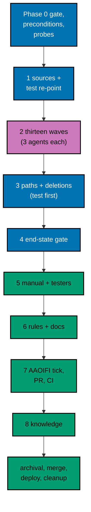

# Delivery Plan — AyoKoding Learn Revamp 07: ERP Courses

> **Legend** — `[AI]`: an agent performs the step (the default; unmarked steps are `[AI]`).
> `[HUMAN]`: only a human can do it (physical action, out-of-band approval, real-secret or
> privileged-credential handling). `[AI+HUMAN]`: agent prepares, human approves or finishes.

**Do not start** until the user gives an explicit execution command for this plan. That command is
the authorization for this plan's change set (commits, pushes, PR, merge, and deploy described
below). The user said: "jangan kerjain/implement plan ini sebelum gw kasih perintah buat eksekusi
ya". The 14 plans of the series run strictly one after another (series decision 42), so plans 01 to
06 must be merged, deployed, verified, and cleaned up first (see Phase 0).

**Plan quality gate:** not run yet, so no verdict exists. By the user's decision of 2026-10-09 it was
not run while this plan was written; it runs at the start of execution, as the first checkbox of
Phase 0, with `max-cycles` 2. The executor records the verdict line in this section when the gate has
run; until then this section holds no verdict and none is claimed.

Authored 2026-10-09.

## Worktree

- **Execution worktree:** `worktrees/ayokoding-learn-revamp-07-erp-courses/`
- **Provisioning status:** pending
- **Authoring-worktree exception:** this plan was authored inside the separate authoring worktree
  `.claude/worktrees/ayokoding-update` (branch `worktree-ayokoding-update`), which the user required
  for writing all plans of the AyoKoding Learn Revamp series together. That authoring worktree is
  removed after the plan-docs PR merges and is **never** used for execution. The Provisioned Worktree
  Identity and Delivery Branch Inventory are intentionally omitted until Step 0 below creates them.
- **Step 0 obligation (blocking):** the plan-execution Step 0 gate provisions the execution worktree
  from fresh `origin/main` with
  `rtk git worktree add -b ayokoding-learn-revamp-07-erp-courses-base worktrees/ayokoding-learn-revamp-07-erp-courses origin/main`,
  initializes it per
  [Worktree Toolchain Initialization](../../../repo-governance/development/workflow/worktree-setup.md),
  writes the immutable identity and the first inventory row into this section, replaces
  `Provisioning status: pending` with `Provisioning status: provisioned` in the same plan update, and
  syncs with `origin/main` before any delivery packet starts.
- **Cleanup:** after the PR merges, the worktree and its branches come down through
  [Dev Artifact Clean-Up](../../../repo-governance/workflows/maintenance/dev-artifact-clean-up.md)
  (see Plan Archival).
- **Worktree cap:** one worktree for this plan in this repository, reused by every phase.
- **Never leave the worktree:** every command runs from the worktree root. Do not `cd` out of it; a
  session whose working directory drifts outside its bound worktree can be disabled by the tool guard.

## Delivery Mode: worktree-to-pr

`worktree-to-pr` is mandatory in this repository. One branch and **one PR** deliver the whole plan.
The PR opens as a draft at the first checkpoint push (after wave 3). It needs the exact
current-head/base `Quality gate` from `.github/workflows/pr-quality-gate.yml` and an exact-head posted
`pr-leak-review` `pass` (`leak-review` status). Broad semantic PR review is not run unless the user
asks for it. `[AI]` merges once the hardened merge preconditions (a)–(e) of the
[PR Merge Protocol](../../../repo-governance/development/workflow/pr-merge-protocol.md) hold. The plan
folder moves to `plans/done/` inside this same PR, before the merge (archival-in-PR).

### Delivery Unit

| Unit  | Phases                                      | Safe `main` state after merge                                                                                                                                                                                      | Rollback                                                                                                                                                              |
| ----- | ------------------------------------------- | ------------------------------------------------------------------------------------------------------------------------------------------------------------------------------------------------------------------ | --------------------------------------------------------------------------------------------------------------------------------------------------------------------- |
| DU-07 | 1–8 and Plan Archival (Phase 0 opens no PR) | All 30 ERP courses are complete and green in the harness; both ERP paths are phase-structured with outcomes; the pending-restructure mechanism is gone; the content-shape and path-structure tests guard all of it | Revert the merge commit in a revert PR (courses, manifests, and deletions return together; see [tech-docs/008](./tech-docs/008-testing-and-verification.md#rollback)) |

There is no feature flag ([tech-docs/README](./tech-docs/README.md#feature-flag)): plan 02's marker
was the temporary switch, and this plan removes it in the same PR that fills the courses. The phases
are natural pauses inside the one branch; no phase is merged on its own.

### Before Phase 0: Promotion

> If the plan is still in `plans/backlog/`, run the plan quality gate first (the first checkbox of
> Phase 0) and only then promote. A gate verdict of `BLOCKED` stops execution before any promotion.

- [ ] [AI] Promote the plan per
      [Starting and Completing Work](../../../repo-governance/conventions/structure/plans/starting-and-completing-work.md):
      a pure move of `plans/backlog/ayokoding-learn-revamp-07-erp-courses/` to
      `plans/in-progress/ayokoding-learn-revamp-07-erp-courses/` plus the `plans/backlog/README.md`
      and `plans/in-progress/README.md` index updates, landed on `origin/main` through its own PR.
      Acceptance:
      `rtk git ls-tree -r --name-only origin/main plans/in-progress/ayokoding-learn-revamp-07-erp-courses/`
      lists this plan's files. This promotion PR is separate from DU-07.

### Execution Packet Defaults

- **Plan path after promotion:** `plans/in-progress/ayokoding-learn-revamp-07-erp-courses/` (written
  below as `<plan>/`). Evidence goes to `<plan>/evidence/`.
- **Course folder:** `<dir>` means `apps/ayokoding-www/content/en/learn/courses/<slug>` for the course
  in hand.
- **Scratch:** the execution ledger, saved partial work, and probe content live in the execution
  worktree's `local-tmp/ayokoding-learn/` (gitignored). The ledger is
  `local-tmp/ayokoding-learn/execution-ledger.md`; this plan writes only under its heading
  `## Plan 07 — ERP courses`. Saved partial work of a blocked course goes to
  `local-tmp/ayokoding-learn/blocked/<slug>/`. Probe content goes to
  `local-tmp/ayokoding-learn/probe-content/`.
- **No ad-hoc scripts** for deterministic tasks (series decision 37). Expected `estimatedHours` values
  come only from the `CORPUS-GUARD` failure message; code outputs come only from the harness
  (`EX-RECORD`, then read); counts come from the commands in
  [tech-docs/003](./tech-docs/003-definition-of-done-and-targets.md#measuring).
- **Format before sync.** Run `FORMAT-PY` on Python files and `FORMAT-MD` on lesson files before
  `EX-SYNC-WRITE`, because the pre-commit formatter would otherwise rewrite a fence and the harness
  would report a sync finding. No emoji appears in any code or content file.
- **Evidence hygiene:** evidence files contain repository-relative paths only. Never paste an
  absolute home-directory path, a hostname, a token, or `.env*` content (the PR leak review treats
  machine-specific values as leaks).
- **Never commit** `apps/ayokoding-www/next-env.d.ts` (the dev server and `next build` rewrite it) or
  `.serena/project.yml`. Before every commit run `rtk git status --short` and restore either file with
  `rtk git checkout -- <file>` if it shows as modified.
- **Never touch** `.env.prod` or `.env.stag`. If the dev server needs a variable, copy the key from
  `apps/ayokoding-www/.env.example` into an uncommitted `apps/ayokoding-www/.env.local`.
- **English only.** Nothing under `apps/ayokoding-www/content/id/**` changes. After every
  `GEN-INDEXES`, `rtk git status --short -- apps/ayokoding-www/content/id` prints nothing.
- **Bounded loops:** every maker→checker loop and every quality gate in this plan (mode gate, Content
  Quality Gate, specs, rules, docs, UI, and code review loops) runs at most 2 cycles; a harness repair
  runs at most 2 attempts. A course, file, or finding still failing after the cap is recorded as
  `BLOCKED` in the execution ledger with its findings, reported to the user, and the gate stays open
  until the user decides. Parallelism stays at N=3 background agents.
- **Failure handling:** on any unexpected failure, save the output to the phase evidence file, fix
  the root cause (never skip, retry-until-green, loosen, sleep, or delete a test), rerun the same
  command, and note the fix.
- **If `rtk git` is refused inside the worktree** with a message about session isolation (a known
  `rtk` defect up to version 0.48.0), run the same git command by absolute path (`/usr/bin/git`; find
  it with `which git`). This file writes `rtk git` for brevity.

> **Important**: Fix ALL failures found during quality gates, not just those caused by your
> changes. This follows the root cause orientation principle — proactively fix preexisting
> errors encountered during work.

### Command Reference

Run every command from the execution worktree root. Expected results are stated at each use.

| Name                   | Command                                                                                                                                                                               |
| ---------------------- | ------------------------------------------------------------------------------------------------------------------------------------------------------------------------------------- |
| `UNIT-FE <file>`       | `rtk ./hippo run --class ephemeral --resource-tier standard --disk-path . --cwd apps/ayokoding-www -- npx vitest run --project unit-fe <file>`                                        |
| `UNIT-NODE <file>`     | `rtk ./hippo run --class ephemeral --resource-tier standard --disk-path . --cwd apps/ayokoding-www -- npx vitest run --project unit <file>`                                           |
| `TYPECHECK`            | `rtk ./hippo run --class ephemeral --resource-tier standard --disk-path . -- npm exec nx -- run ayokoding-www:typecheck`                                                              |
| `LINT`                 | `rtk ./hippo run --class ephemeral --resource-tier light --disk-path . -- npm exec nx -- run ayokoding-www:lint`                                                                      |
| `UNIT`                 | `rtk ./hippo run --class ephemeral --resource-tier standard --disk-path . -- npm exec nx -- run ayokoding-www:test:unit`                                                              |
| `COVERAGE`             | `rtk ./hippo run --class ephemeral --resource-tier light --disk-path . -- npm exec nx -- run ayokoding-www:test:coverage`                                                             |
| `COVERAGE-BE-E2E`      | `rtk ./hippo run --class ephemeral --resource-tier light --disk-path . -- npm exec nx -- run ayokoding-www-be-e2e:test:coverage`                                                      |
| `QUICK`                | `rtk ./hippo run --class ephemeral --resource-tier standard --disk-path . -- npm exec nx -- run ayokoding-www:test:quick`                                                             |
| `E2E-QUICK`            | `rtk ./hippo run --class ephemeral --resource-tier standard --disk-path . -- npm exec nx -- run ayokoding-www-fe-e2e:test:quick`                                                      |
| `BE-E2E-QUICK`         | `rtk ./hippo run --class ephemeral --resource-tier standard --disk-path . -- npm exec nx -- run ayokoding-www-be-e2e:test:quick`                                                      |
| `INTEGRATION`          | `rtk ./hippo run --class ephemeral --resource-tier heavy --disk-path . -- npm exec nx -- run ayokoding-www:test:integration`                                                          |
| `E2E`                  | `rtk ./hippo run --class ephemeral --resource-tier heavy --disk-path . -- npm exec nx -- run ayokoding-www-fe-e2e:test:e2e`                                                           |
| `BE-E2E`               | `rtk ./hippo run --class ephemeral --resource-tier heavy --disk-path . -- npm exec nx -- run ayokoding-www-be-e2e:test:e2e`                                                           |
| `GEN-INDEXES`          | `rtk ./hippo run --class transactional --resource-tier standard --disk-path . -- npm exec nx -- run ayokoding-www:generate-indexes`                                                   |
| `VALIDATE-INDEXES`     | `rtk ./hippo run --class ephemeral --resource-tier standard --disk-path . -- npm exec nx -- run ayokoding-www:validate-indexes`                                                       |
| `DEV`                  | `rtk ./hippo run --class service --resource-tier standard --disk-path . -- npm exec nx -- dev ayokoding-www` (serves `http://localhost:3101`)                                         |
| `BUILD`                | `rtk ./hippo run --class ephemeral --resource-tier heavy --disk-path . -- npm exec nx -- run ayokoding-www:build`                                                                     |
| `START`                | `rtk ./hippo run --class service --resource-tier standard --disk-path . -- npm exec nx -- run ayokoding-www:start` (serves port 3101)                                                 |
| `HARNESS-GENERATE`     | `rtk ./hippo run --class transactional --resource-tier light --disk-path . -- ./rhino harness adapters generate`                                                                      |
| `HARNESS-VALIDATE`     | `rtk ./hippo run --class ephemeral --resource-tier light --disk-path . -- ./rhino harness adapters validate`                                                                          |
| `LINT-MD`              | `rtk npm run lint:md`                                                                                                                                                                 |
| `CORPUS-GUARD`         | `UNIT-NODE tests/unit/be-steps/course-metadata.steps.ts` (plan 03's real-corpus guard; it prints "Expected estimatedHours for every non-outline course:" on drift)                    |
| `CLI-BUILD`            | `rtk ./hippo run --class ephemeral --resource-tier standard --disk-path . -- npm exec nx -- run ayokoding-cli:build`                                                                  |
| `EX-VALIDATE [<slug>]` | `rtk ./hippo run --class ephemeral --resource-tier standard --disk-path . -- apps/ayokoding-cli/dist/ayokoding-cli examples validate [--course <slug>]`                               |
| `EX-SYNC <slug>`       | `rtk ./hippo run --class ephemeral --resource-tier standard --disk-path . -- apps/ayokoding-cli/dist/ayokoding-cli examples sync --course <slug>`                                     |
| `EX-SYNC-WRITE <slug>` | `rtk ./hippo run --class transactional --resource-tier standard --disk-path . -- apps/ayokoding-cli/dist/ayokoding-cli examples sync --write --course <slug>`                         |
| `EX-RUN <slug>`        | `rtk ./hippo run --class ephemeral --resource-tier heavy --disk-path . -- apps/ayokoding-cli/dist/ayokoding-cli examples run --course <slug>`                                         |
| `EX-RECORD <slug>`     | `rtk ./hippo run --class transactional --resource-tier heavy --disk-path . -- apps/ayokoding-cli/dist/ayokoding-cli examples run --course <slug> --record`                            |
| `EX-CHECK <slug>`      | `rtk ./hippo run --class ephemeral --resource-tier heavy --disk-path . -- apps/ayokoding-cli/dist/ayokoding-cli examples check --course <slug>`                                       |
| `EX-CHECK-SINCE`       | `rtk ./hippo run --class ephemeral --resource-tier heavy --disk-path . -- npm exec nx -- run ayokoding-www:examples:check` (selects the opted-in courses changed since `origin/main`) |
| `EX-COVERAGE`          | `rtk ./hippo run --class ephemeral --resource-tier standard --disk-path . -- apps/ayokoding-cli/dist/ayokoding-cli examples coverage`                                                 |
| `FORMAT-PY <files>`    | `rtk ./hippo run --class transactional --resource-tier light --disk-path . -- ruff format --no-cache <files>` (Phase 0 confirms this form)                                            |
| `FORMAT-MD <files>`    | `rtk ./hippo run --class transactional --resource-tier light --disk-path . -- npx prettier --write <files>`                                                                           |

Notes:

- `QUICK` runs typecheck, lint, `test:unit` (99% line threshold), and `test:coverage` (every scenario
  bound once per non-exempt adapter). Phases 3's middle steps deliberately leave `QUICK` red while
  scenarios and deletions are half done; their gates name the commands and the expected failures. From
  the end of Phase 3 on, `QUICK` must exit 0. Wave commits in Phase 2 keep `QUICK` green because they add
  only complete courses.
- The `EX-*` commands need a running Docker daemon and a built CLI (`CLI-BUILD`). `EX-RECORD` writes
  only expected files that are missing; it never overwrites one. `EX-CHECK-SINCE` runs every changed
  opted-in course: late in this plan that is most of the 30 courses, so it takes hours; run it in the
  background and poll.
- `E2E` builds the app with the fixture manifests in `apps/ayokoding-www-fe-e2e/fixtures/manifests/`
  and runs every scenario in three browsers. `INTEGRATION` depends on `build`, so it is heavy too.
- `DEV` and `START` both bind port 3101: never run them at the same time, and stop each one before
  `E2E` or `BE-E2E` (their Playwright `webServer` also binds 3101).

### Agent Topology

The root coordinator owns the file ledger, integration, every gate, and every commit. Phase 2 fans out
to at most 3 background maker agents per wave, one per course, using the maker for the course's mode
(`apps-ayokoding-www-by-example-maker` or `apps-ayokoding-www-annotated-concept-maker`), then the
mode's checker and quality gate, the Content Quality Gate, and a harness job. Gherkin goes to
`specs-maker` (checked by `specs-checker`). The TypeScript work of Phase 3 runs one slice at a time,
delegated to `swe-developer`, because the slices share the course-paths files and their tests. Phase 5
uses `swe-web-tester`, `swe-usability-tester`, and (if the API gate applies) `swe-api-tester` for the
tester gates, and `swe-developer` for fixes. Phase 6 uses `rules-fixer` and `docs-fixer`.

### Commit Guidelines

- [ ] Do not stage or commit until the user's execution command has authorized this plan's change
      set; do not extend a commit beyond it.
- [ ] Use the fewest build-valid, independently reviewable and revertible commits, one coherent
      purpose each. The wave commits of Phase 2 each add only complete, gated courses, so every hook
      stays green. Phase 3 cannot be committed in pieces: the new Gherkin is unbound until its steps
      exist, and the deletions and manifest rewrite depend on each other, so it lands as **one**
      commit at its gate. Fixes from the tester gates, rules and docs, the AAOIFI links, evidence, and
      archival are separate commits.
- [ ] Follow Conventional Commits: `<type>(<scope>): <description>`, imperative, no period, header
      at most 100 characters. Planned messages:
  - `test(ayokoding-www): point outline-example tests at a capstone course` (Phase 1)
  - `docs(ayokoding-www): write ERP courses, wave N` (13 commits; the body names the slugs, one per line)
  - `feat(ayokoding-www): restructure the ERP paths and remove the pending mechanism` (Phase 3)
  - `fix(ayokoding-www): <finding summary>` (one per tester-gate fix, if any)
  - `docs(ayokoding-www): propagate the ERP path model into rules and docs` (Phase 6)
  - `docs(ayokoding-www): link checked AAOIFI sources in the Sharia ERP courses` (Phase 7)
  - `docs(plans): record ayokoding-learn-revamp-07 evidence`
  - `chore(plans): move ayokoding-learn-revamp-07-erp-courses to done`
- [ ] Keep each change with its tests, specs, regenerated indexes, docs, and generated harness
      routes in the same commit; stage explicit paths only, never `git add -A`.
- [ ] Before every commit, run `rtk git status --short` and confirm
      `apps/ayokoding-www/next-env.d.ts` and `.serena/project.yml` are neither staged nor modified.

---

## The Course Loop

Every one of the 30 courses runs this loop in Phase 2. The single detailed definition (the step table,
the Maker Prompt, the unit rule, harness-repair limits, and the BLOCKED procedure) is
[tech-docs/007](./tech-docs/007-execution-batching-and-ledger.md#the-course-loop); the per-course
checklists in Phase 2 name each step with its acceptance, and this section is the short form.

| Step               | What                                                                                                                                 | Pass condition                                                                                |
| ------------------ | ------------------------------------------------------------------------------------------------------------------------------------ | --------------------------------------------------------------------------------------------- |
| S0 Expand the spec | Replace the cluster list in the course spec with one row per example                                                                 | Row count, level counts, anchors, and concept coverage match the spec                         |
| S1 Shared pages    | Root overview, learning overview, code README, and (PostgreSQL courses with a Python unit) the lockfile                              | `EX-VALIDATE <slug>` shows no layout finding; the lockfile is a byte copy of the Phase 0 lock |
| S2 to S4 Examples  | Level pages (By Example) or theme pages (Annotated-Concept), each example with its unit and recorded output; capstone and course map | `EX-RUN <slug>` exits 0 so far; the pages hold exactly the planned example headings           |
| S5 Drilling        | The drilling page with its exact H2 sections and the kata units                                                                      | `EX-RUN <slug>` exits 0; the counts and the word floor of the drilling convention are met     |
| S6 Metadata        | Frontmatter, prerequisites by rubric, `## References`, `GEN-INDEXES`, real `estimatedHours`                                          | `CORPUS-GUARD` names no row for the course                                                    |
| Measure            | The measuring commands of tech-docs/003                                                                                              | Every number meets its target                                                                 |
| Harness pre-check  | `EX-CHECK <slug>` before any gate                                                                                                    | Exit 0 (at most 2 repair attempts)                                                            |
| Sharia checks      | SH1 to SH4 (Sharia courses only)                                                                                                     | All four hold                                                                                 |
| Course checks      | The spec's course-specific checks                                                                                                    | Each shown in the text or code                                                                |
| Mode gate          | The mode's tutorial quality gate, `max-cycles` 2                                                                                     | `PASS` or `PASS_WITH_FINDINGS`; otherwise `BLOCKED`                                           |
| Content gate       | The Content Quality Gate, `max-cycles` 2                                                                                             | `PASS` or `PASS_WITH_FINDINGS`; otherwise `BLOCKED`                                           |
| Harness green      | `EX-CHECK <slug>` on the final text                                                                                                  | Exit 0 (at most 2 repair attempts); otherwise `BLOCKED`                                       |
| Ledger             | The ledger row                                                                                                                       | Complete                                                                                      |

Rules that keep it bounded:

- The first failing gate ends the course as `BLOCKED`; the next gate does not run.
- A unit gets its first run plus at most 2 fix attempts, then one simpler replacement with the same
  budget; a second red replacement ends the course as `BLOCKED`.
- A harness repair may touch only code, `run.yaml`, expected files, anchored fences (through
  `EX-SYNC-WRITE`), and prose needed to make a stated output true. Anything else needs a new gate pass,
  so the course is `BLOCKED` instead.
- No quiet narrowing: a course is never `DONE` by dropping an example, shrinking a target, or setting a
  Preview status.

**When a course is `BLOCKED`:**

- [ ] [AI] Copy the course folder to `local-tmp/ayokoding-learn/blocked/<slug>/` and run
      `diff -r <dir> local-tmp/ayokoding-learn/blocked/<slug>`. Acceptance: no output.
- [ ] [AI] Restore the skeleton: `rtk git restore -- <dir>`, then the dry run
      `rtk git clean -n -d -- <dir>`, read the listed paths, then `rtk git clean -f -d -- <dir>`.
      Acceptance: `rtk git status --short -- <dir>` prints nothing.
- [ ] [AI] Write the ledger row (`BLOCKED`, failing step, open findings, harness output, saved path) and
      report to the user: the course, the step, the blocking findings in short, and the options (retry
      with a changed approach, defer, or stop). Do not choose for the user. The wave gate stays open
      until the user decides.

---

## Phase 0: Worktree, Preconditions, Contracts, Probes, and Baseline

Phase 0 opens no PR. Its evidence rides the DU-07 PR.

- **Input:** this plan at `<plan>/`; `origin/main` with plans 01 to 06 merged.
- **Outcome:** a verdict from the plan quality gate; a provisioned, initialized worktree; confirmed
  preconditions; the as-merged names of every consumed contract; the landing-split and removal
  baselines; a lockfile source; nine probe results; a recorded green baseline; the empty ledger.
- **Proof:** `<plan>/evidence/phase-0-*.md` (named at each step).

- [ ] [AI] **Plan quality gate (deferred from authoring):** run the `plan-quality-gate` workflow on
      this plan with `max-cycles` 2 before any other step below. It was deliberately not run when this
      plan was written, to keep token use even (user decision, 2026-10-09). Acceptance: verdict `PASS`
      or `PASS_WITH_FINDINGS`; record the line `plan-quality-gate: <verdict> (<n> cycles, <k> open)` in
      this file's header section. If the plan is still in `plans/backlog/`, run the gate before the
      promotion PR. A `BLOCKED` verdict stops execution and is reported to the user.
- [ ] [AI] Run the plan-execution Step 0 gate described in [## Worktree](#worktree): provision
      `worktrees/ayokoding-learn-revamp-07-erp-courses/` from fresh `origin/main`, record the
      Provisioned Worktree Identity and the first Delivery Branch Inventory row in this file, and set
      `Provisioning status: provisioned`. Acceptance: `rtk git worktree list --porcelain` shows the
      worktree on branch `ayokoding-learn-revamp-07-erp-courses-base`.
- [ ] [AI] From the worktree root, run
      `rtk ./hippo run --class transactional --resource-tier standard --disk-path . -- npm install`.
      Acceptance: exit 0 and Husky hooks installed (`.husky/_` exists).
- [ ] [AI] Run `rtk npm run doctor`. Acceptance: exit 0. Only if it reports a missing or drifted
      toolchain, run
      `rtk ./hippo run --class transactional --resource-tier standard --disk-path . -- ./rhino toolchain provision --apply`
      and then `rtk npm run doctor` again (exit 0).
- [ ] [AI] Create the delivery branch from the synced base:
      `rtk git switch -c ayokoding-learn-revamp-07-erp-courses` and append it to the Delivery Branch
      Inventory (`worktree-to-pr`, `active`).
- [ ] [AI] Run `rtk git rev-parse HEAD` and record it in `<plan>/evidence/phase-0-contracts.md` as the
      base commit of this plan; every later "since the plan started" comparison uses it.

### Preconditions (decision D1)

- [ ] [AI] Plans 01 to 06 merged and archived: `rtk git ls-tree -d --name-only origin/main plans/done/`
      lists a folder ending in each of `__ayokoding-learn-revamp-01-navigation-and-display`,
      `__ayokoding-learn-revamp-02-path-model`, `__ayokoding-learn-revamp-03-catalog-and-metadata`,
      `__ayokoding-learn-revamp-04-learning-experience`, `__ayokoding-learn-revamp-05-code-harness`, and
      `__ayokoding-learn-revamp-06-accounting-courses`. Record the six folder names. Also record whether
      `plans/done/` or `plans/in-progress/` holds a folder for plan 08 (expected: none; plan 08 follows
      this plan).
- [ ] [AI] Each earlier plan's product is on `origin/main`. Run each command and record its result in
      `<plan>/evidence/phase-0-contracts.md`:
  - plan 02: `rtk git cat-file -e origin/main:apps/ayokoding-www/src/features/course-paths/core/skills-restructure-allowlist.ts`
    exits 0, and `rtk git grep -n "plan-07" origin/main -- apps/ayokoding-www/src/features/course-paths/core`
    shows the narrowed marker enum and exactly two allowlist entries (plan 06 removed the accounting ones);
  - plan 03: `rtk git cat-file -e origin/main:apps/ayokoding-www/src/features/content/core/course-metadata.ts`
    exits 0, and `rtk git grep -n "erp-systems" origin/main -- apps/ayokoding-www/src` shows the category;
  - plan 04: `rtk git grep -n -e progressCoursesDone -e roadmapCoursesCount origin/main -- apps/ayokoding-www/src`
    shows the flat-mode keys this plan removes;
  - plan 05: `rtk git grep -n "examples:check" origin/main -- apps/ayokoding-www/project.json` shows the Nx
    target, and `rtk git ls-tree -r --name-only origin/main apps/ayokoding-cli` lists the Go project;
  - plan 06: `rtk git cat-file -e origin/main:.agents/skills/apps-ayokoding-www-developing-content/reference/sharia-content.md`
    exits 0; `rtk git ls-tree -r --name-only origin/main specs/apps/ayokoding/www/behaviours/backend/content`
    lists `accounting-course-completion.feature`; `rtk git grep -n "psql" origin/main -- apps/ayokoding-cli`
    shows the toolchain entry.
- [ ] [HUMAN] **Only if any check above fails:** stop and report which plan or product is missing. The user
      decides; the series order (decision 42) makes a missing earlier plan an unexpected state. Do not
      continue on an assumption.
- [ ] [AI] Re-probe Vercel MCP: record in `<plan>/evidence/phase-0-baseline.md` whether any Vercel MCP
      tool is listed in this session (`present` or `absent`). Either way this plan uses no Vercel tool
      ([tech-docs/README](./tech-docs/README.md#vercel-mcp-capability)); record no Vercel identifiers.

### Contracts and Merged Text

- [ ] [AI] For every row of
      [Contracts This Plan Consumes](./tech-docs/001-current-state-and-architecture.md#contracts-this-plan-consumes),
      confirm the planned name with `rtk git grep` on the worktree and record the as-merged name (or
      "same") in `<plan>/evidence/phase-0-contracts.md`. Acceptance: no row is missing. A renamed item
      is used under its merged name from here on; a missing item stops execution (`[HUMAN]` report).
- [ ] [AI] Read plan 06's merged Sharia module
      (`.agents/skills/apps-ayokoding-www-developing-content/reference/sharia-content.md`), its merged
      `accounting-course-completion.feature` and step file, and its merged AAOIFI URL register. Record
      every difference from [tech-docs/005](./tech-docs/005-sharia-policy-and-source-register.md) (the
      rule text, the callout and disclaimer wording, the superseded-standards list, the path of the
      checked-links list). Acceptance: the differences are recorded and the merged text is used from here
      on; if the module is missing, stop at the `[HUMAN]` report above.
- [ ] [AI] Read plan 06's merged Sharia tool facts that the ERP courses reuse: the `psql` catalog entry,
      the lockfile text, and the database conventions in its merged code-harness design. Record any
      difference from [tech-docs/004](./tech-docs/004-code-runtime-and-run-yaml.md#postgresql-example-shape).
- [ ] [AI] Confirm the formatter commands: run `FORMAT-PY` on a scratch Python file in
      `local-tmp/ayokoding-learn/probe-content/` and `FORMAT-MD` on a scratch Markdown file. Acceptance:
      both exit 0. If the `ruff` form differs (for example it is wrapped by a repository script), record
      the working command and use it as `FORMAT-PY` from here on.
- [ ] [AI] Run `./rhino md internal-link validate` (or the repository's link check) on this plan folder.
      Acceptance: exit 0; a failing link to plan 02's archived folder is repointed to its `plans/done/`
      location.

### Landing Split With Plan 06

- [ ] [AI] For each row L1 to L7 of
      [006](./tech-docs/006-path-restructure-and-pending-removal.md#landing-split-with-plan-06), run the
      "Phase 0 check" command on the worktree and apply the decision rules of that section. Write one
      line per row to `<plan>/evidence/phase-0-landing-split.md`: "done by plan 06" (expected), or the
      text that remains and the merge commit of plan 06. Acceptance: all seven rows are classified, and
      the file lists what Phase 3 must still do (expected: nothing).

### Removal Baseline

- [ ] [AI] Run the "Find with" command of every row of the
      [Removal Inventory](./tech-docs/006-path-restructure-and-pending-removal.md#removal-inventory) and
      save the output in `<plan>/evidence/phase-0-removal-baseline.md`, one section per row. Mark a row
      "already done" with the commit that did it, and add a row (with its command) for any marker
      mechanism that is not in the table. Acceptance: every row is "present" with its hit list, "already
      done" with a commit, or newly added.
- [ ] [AI] Run `rtk git grep -n "restructurePendingIn" -- apps/ayokoding-www/src/server`. Acceptance: no
      hit. A hit means the marker reaches the tRPC payload: record the line `api-gate: applies` in
      `<plan>/evidence/phase-0-baseline.md`. No hit means the API contract does not change: record the line
      `api-gate: not applicable` and the reason. Phase 5 follows that record.

### Baseline and Inventory

- [ ] [AI] Run `QUICK`. Acceptance: exit 0. Save the summary (exit code, test counts, line coverage) in
      `<plan>/evidence/phase-0-baseline.md`.
- [ ] [AI] Run `E2E-QUICK` and `BE-E2E-QUICK`. Acceptance: both exit 0; save the summaries.
- [ ] [AI] Run `INTEGRATION`, then `E2E`, then `BE-E2E`. Acceptance: all exit 0 with every scenario
      passing; save the pass counts. If one fails before any change, fix the root cause first per the
      failure-handling rule.
- [ ] [AI] Run `VALIDATE-INDEXES`. Acceptance: exit 0.
- [ ] [AI] Run `CLI-BUILD`, then `EX-COVERAGE`. Acceptance: exit 0; save the covered and applicable
      counts (the 24 accounting courses are covered; the 30 ERP courses are not opted in yet).
- [ ] [AI] Outline baseline: run `grep -l "^status: outline" apps/ayokoding-www/content/en/learn/courses/*/_index.md`.
      Acceptance: 38 files, namely the 30 ERP courses and the 8 capstone courses. Record the list. A
      different count means an earlier plan changed the set: record the difference, and stop at a
      `[HUMAN]` report if an ERP course is missing from the list or a non-ERP, non-capstone course is on it.
- [ ] [AI] Skeleton baseline: for each of the 30 ERP slugs in
      [tech-docs/002](./tech-docs/002-course-catalog-and-modes.md#the-catalog), confirm the folder holds
      the 6 skeleton files and fewer than 1,000 words, and compare its `prerequisites` line with the
      "Prerequisites" section of its spec. Record "identical" or the exact differences in
      `<plan>/evidence/phase-0-inventory.md`; for a difference, the merged value wins (plan 02 or 06 may
      have revised it) and the spec file and path file are edited to match.
- [ ] [AI] Start `DEV` in the background. With Playwright MCP at 1280×800, open
      `http://localhost:3101/en/learn/paths/skills/conventional-erp`,
      `http://localhost:3101/en/learn/paths/skills/sharia-erp`, and `http://localhost:3101/en/learn/paths/skills`.
      Acceptance: the ERP pages are flat lists with the old wording; the hub shows plan 06's statement.
      Save `<plan>/evidence/phase-0-before-conventional-erp-en-1280px.png`,
      `phase-0-before-sharia-erp-en-1280px.png`, and `phase-0-before-skills-hub-en-1280px.png`. Stop
      `DEV`, then run `rtk git status --short` and restore `apps/ayokoding-www/next-env.d.ts` if changed.

### Lock Source and Probes

- [ ] [AI] **Lock source.** Read plan 06's merged
      `apps/ayokoding-www/content/en/learn/courses/general-ledger-system-architecture/learning/code/requirements.lock`
      (or the lock of any plan 06 course that uses `pg8000`). Compute `shasum -a 256` of the file, save
      the file text and the hash in `<plan>/evidence/phase-0-lock.md`. Only if plan 06 shipped none,
      build one with the recipe in
      [tech-docs/004](./tech-docs/004-code-runtime-and-run-yaml.md#postgresql-example-shape) and save
      the same. Acceptance: the lock text and `sha256` are in the evidence file.
- [ ] [AI] Build the probe content in `local-tmp/ayokoding-learn/probe-content/` from the templates in
      [tech-docs/004](./tech-docs/004-code-runtime-and-run-yaml.md#runyaml-templates) (a Python-only
      unit, a `psql` unit, a Python PostgreSQL unit with the lock, a kata, a capstone, and a
      simulation). Run each probe P1 to P9 of
      [tech-docs/004](./tech-docs/004-code-runtime-and-run-yaml.md#phase-0-probes) with
      `--content local-tmp/ayokoding-learn/probe-content`, and record the result, the pass condition,
      and any rule or template correction in `<plan>/evidence/phase-0-probes.md`:
  - [ ] P1: CLI build, validate, and the `tests` run in both forms (with and without `stderr: ignore`).
  - [ ] P2: Decimal table, sorted set, fixed date: byte-identical double run.
  - [ ] P3: Python PostgreSQL unit with the lock, plus a kata and a capstone using it.
  - [ ] P4: `psql` SQL unit with a caught SQLSTATE and an exit-3 refusal.
  - [ ] P5: the scripted behaviours, each run 20 times with `--single-run`, then once under the double run.
  - [ ] P6: collation, time zone, and ordering.
  - [ ] P7: the SplitMix64 simulation with seeds 1 to 64 and the `--seed 17` replay.
  - [ ] P8: timing of one unit of each kind, and the projected shard time.
  - [ ] P9: the lock installs with `--require-hashes --no-deps` in the Python image, with wheels for both
        architectures.
- [ ] [AI] Acceptance for the probes: every pass condition holds, or the "If it fails" action of the
      probe table was taken and recorded. Apply each correction to the **template** it concerns
      (the plan file under `tech-docs/004`) in the same commit as the evidence, so the makers read the
      corrected form.
- [ ] [HUMAN] **Only if probe P8 projects more than about 45 minutes for any CI shard:** stop and report the
      projection. The user chooses a longer job timeout, more shards, or a change to plan 05's reusable
      workflow, because it changes shared CI cost. Record the decision before continuing.
- [ ] [AI] Remove `local-tmp/ayokoding-learn/probe-content/` after the evidence is saved (it is not
      committed).

### Ledger

- [ ] [AI] Create `local-tmp/ayokoding-learn/execution-ledger.md` if it does not exist, and add the
      heading `## Plan 07 — ERP courses` with the empty ledger table of
      [tech-docs/007](./tech-docs/007-execution-batching-and-ledger.md#execution-ledger) (30 rows,
      state `PENDING`). Never overwrite another plan's heading. Acceptance: 30 rows exist.

### Phase 0 Gate

> All checks below must pass before starting Phase 1.

- [ ] [AI] The plan quality gate verdict is `PASS` or `PASS_WITH_FINDINGS` and its line is recorded in
      this file's header section.
- [ ] [AI] The preconditions hold, and `<plan>/evidence/phase-0-contracts.md`, `phase-0-landing-split.md`,
      `phase-0-removal-baseline.md`, `phase-0-lock.md`, `phase-0-probes.md`, `phase-0-inventory.md`, and
      `phase-0-baseline.md` all exist.
- [ ] [AI] `phase-0-baseline.md` records exit 0 for `QUICK`, `E2E-QUICK`, `BE-E2E-QUICK`, `INTEGRATION`,
      `E2E`, `BE-E2E`, and `VALIDATE-INDEXES`, and the outline baseline (38).
- [ ] [AI] Every probe passed or has a recorded correction; no `[HUMAN]` stop is open.
- [ ] [AI] `rtk git status --short` shows only `<plan>/` changes.

> **Pause Safety**: the worktree is provisioned and green, with no product change yet. Safe to stop.
> To resume: `rtk git -C worktrees/ayokoding-learn-revamp-07-erp-courses status --short`, then rerun
> `QUICK`.

---

## Phase 1: Sharia Sources and Outline-Example Tests

- **Input:** [tech-docs/005](./tech-docs/005-sharia-policy-and-source-register.md) (source register,
  AAOIFI URL register);
  [tech-docs/006](./tech-docs/006-path-restructure-and-pending-removal.md#outline-example-tests-handoff-from-plan-06).
- **Outcome:** every source a Sharia course will use is read at its primary document or removed; the
  tests that treated an ERP course as an outline now use a course that stays an outline; the ledger is
  ready for wave 1.
- **Proof:** `<plan>/evidence/phase-1-sources.md` and `<plan>/evidence/phase-1-outline-tests.md`.

### 1.1 Sharia sources (before the three Sharia courses are written)

- [ ] [AI] For each row of the source register that a Sharia course will cite (the course specs list
      them), open the primary document (the issuer's page or the official gazette) with a web fetch or
      Playwright and compare the stated fact: standard number and title, effective date, what it
      replaces, and the passage the course will paraphrase. Set the row to **Verified** with the date
      accessed, or remove the row. Record each row, the URL opened, and the result in
      `<plan>/evidence/phase-1-sources.md`, and update the register in tech-docs/005 in place.
      Acceptance: no row that a course uses is still "Researched" or "To verify".
- [ ] [AI] Specific rows to settle, each recorded: the DSN-MUI fatwa numbers (only 41/2004 was confirmed on
      2026-10-09); FAS 53 and its effective date; the FAS 1 revised effective date (2024 or 2023); the
      BAZNAS rate (2.5% Hijri, 2.5775% solar-year equivalent) and nisab decision; PMA 52/2014 and
      PMA 31/2019 articles; MUI Fatwa 3/2003. A fact that cannot be verified is cited by body and title
      only, with no number, date, or link, and the course spec's source list is edited to match.
- [ ] [AI] For each candidate in the
      [AAOIFI URL register](./tech-docs/005-sharia-policy-and-source-register.md#aaoifi-url-register),
      open it and read the page title and first paragraph. Strike a candidate that shows unrelated
      content. This is a preliminary read by an agent; it does **not** replace the human tick in
      Phase 7, and nothing is linked until the box is ticked.

### 1.2 Re-point outline-example tests

- [ ] [AI] Find the tests: run the search in
      [006](./tech-docs/006-path-restructure-and-pending-removal.md#outline-example-tests-handoff-from-plan-06)
      for `erp-foundations-and-history` and for each other ERP slug, over `apps/ayokoding-www/tests`,
      `apps/ayokoding-www-fe-e2e`, `apps/ayokoding-www-be-e2e`, and `specs`. Record every hit in
      `<plan>/evidence/phase-1-outline-tests.md`.
- [ ] [AI] Choose the replacement: the first capstone course listed by
      `grep -l "^status: outline" apps/ayokoding-www/content/en/learn/courses/capstone-*/_index.md`. It
      stays an outline after this PR, because plan 08 follows this plan. Record its slug.
- [ ] [HUMAN] **Only if no outline course would remain after this PR** (unexpected): stop and report. The
      Outline badge would then need a synthetic fixture, which is a user decision.
- [ ] [AI] **Before:** run every re-pointed test unchanged and confirm it passes (the ERP course is
      still an outline). **Change:** replace the slug (and any title or word-count expectation that
      depends on it) in each hit. **After:** rerun each test with `UNIT-FE`, `UNIT-NODE`, or the E2E
      step's project. Acceptance: all pass with the new slug, and
      `rtk git grep -n -e erp- -e "-erp" -- apps/ayokoding-www/tests apps/ayokoding-www-fe-e2e/tests apps/ayokoding-www-be-e2e/tests`
      shows no hit that uses an ERP course as an outline example.
- [ ] [AI] Run `UNIT`, `E2E-QUICK`, and `BE-E2E-QUICK`; run `E2E` and `BE-E2E` if any browser or HTTP step
      changed. Acceptance: exit 0.
- [ ] [AI] Commit `test(ayokoding-www): point outline-example tests at a capstone course` (explicit
      paths).

### Phase 1 Gate

> All checks below must pass before starting Phase 2.

- [ ] [AI] `<plan>/evidence/phase-1-sources.md` shows every used source row Verified or removed.
- [ ] [AI] `<plan>/evidence/phase-1-outline-tests.md` lists every re-pointed test and the replacement slug,
      and `UNIT` exits 0.
- [ ] [AI] `rtk git status --short` shows only `<plan>/` changes (the test commit is made).

> **Pause Safety**: the test commit is the only product change, and it is behaviour-neutral. Safe to
> stop. To resume: rerun `UNIT`.

---

## Phase 2: Write the 30 Courses

- **Input:** the 30 course specs in [syllabus/courses/](./syllabus/courses/README.md); the Course Loop
  above; [tech-docs/003](./tech-docs/003-definition-of-done-and-targets.md) (targets, layout, drilling,
  metadata); [tech-docs/004](./tech-docs/004-code-runtime-and-run-yaml.md) (code);
  [tech-docs/005](./tech-docs/005-sharia-policy-and-source-register.md) (Sharia rules);
  [tech-docs/007](./tech-docs/007-execution-batching-and-ledger.md) (ledger, Maker Prompt, waves).
- **Outcome:** all 30 courses are `DONE` (or `BLOCKED` with the user's decision recorded), committed in
  13 wave commits, with checkpoint pushes after waves 3, 6, 9, and 12.
- **Proof:** the ledger, the wave commits, `<plan>/evidence/phase-2-checkpoints.md`, and
  `<plan>/evidence/execution-summary.md`.
- _Suggested executors: `apps-ayokoding-www-by-example-maker` or `apps-ayokoding-www-annotated-concept-maker`
  per course, checked by the matching tutorial checker and quality gate._

Waves run strictly in order, with at most three courses in parallel inside a wave. A course owns one
slot for its whole wave. For each maker job, give the agent the **Maker Prompt** of
[tech-docs/007](./tech-docs/007-execution-batching-and-ledger.md#maker-prompt) with the slug and mode
filled in. Each course checklist below is ticked by the coordinator only after reading the evidence the
step names.

### Wave 1: `erp-foundations-and-history`

- **Courses:** 1 `erp-foundations-and-history` (Annotated-Concept).
- **Examples this wave:** 48. **Agents:** 1 background maker agent (the repository cap is N=3).
- **Needs:** nothing earlier in this plan.

- [ ] [AI] **Sync and read.** `rtk git fetch origin`; if `rtk git rev-list --count HEAD..origin/main` is not
      0, read the full diff of the new commits (`rtk git log --stat HEAD..origin/main`), reconcile any change
      that touches ERP courses, the manifests, the harness, or these assumptions, then merge `origin/main`
      into the branch (never rebase or force-push a pushed branch). Acceptance: the count reads 0 and the
      reconciliation is noted in the wave evidence.
- [ ] [AI] **Ledger.** Mark the wave's rows `IN-PROGRESS` in `local-tmp/ayokoding-learn/execution-ledger.md`
      and start one background maker agent per course (at most 3 at once). Acceptance: each row shows its
      agent ID.

#### Course 01: `erp-foundations-and-history` (Annotated-Concept)

- **Spec:** [syllabus/courses/erp-foundations-and-history.md](./syllabus/courses/erp-foundations-and-history.md). **`<dir>`:** `apps/ayokoding-www/content/en/learn/courses/erp-foundations-and-history/`. **Maker:** `apps-ayokoding-www-annotated-concept-maker`. **Mode gate:** `tutorial-annotated-concept-quality-gate`. **Planned examples:** 48 in 9 themes (15 / 18 / 15 per group of three themes). **Runtime mix:** py 48. Steps follow the [Course Loop](#the-course-loop) exactly.

- [ ] [AI] **S0.** Expand the example section of the spec to 48 rows `ex-01` to `ex-48`. Acceptance: the Loop
      S0 checks hold and the spec diff shows only that section.
- [ ] [AI] **S1.** Write `<dir>/learning/overview.md` and `<dir>/learning/code/README.md`. Acceptance:
      `EX-VALIDATE erp-foundations-and-history` shows no layout finding for these files.
- [ ] [AI] **S2.** Theme pages `<dir>/learning/theme-a-one-record-or-many.md` (One record or many: ex-01 to
      ex-05); `<dir>/learning/theme-b-master-and-transaction-data.md` (Master and transaction data: ex-06 to
      ex-10); `<dir>/learning/theme-c-events-as-the-unit.md` (Events as the unit: ex-11 to ex-15), each
      opening with its anchor and holding `### Worked Example 1: <title>` to `### Worked Example 15: <title>`
      across the three pages; units for the code-bearing examples (at least 10 of ex-01 to ex-15). Acceptance:
      `EX-RUN erp-foundations-and-history` exits 0 with at least 10 units green so far and the three pages
      hold exactly 15 example headings.
- [ ] [AI] **S3.** Theme pages `<dir>/learning/theme-d-from-reorder-point-to-mrp.md` (From reorder point to
      MRP: ex-16 to ex-21); `<dir>/learning/theme-e-systems-of-record.md` (Systems of record: ex-22 to ex-27);
      `<dir>/learning/theme-f-integration-debt.md` (Integration debt: ex-28 to ex-33), each opening with its
      anchor and holding `### Worked Example 16: <title>` to `### Worked Example 33: <title>` across the three
      pages; units for the code-bearing examples (at least 12 of ex-16 to ex-33). Acceptance:
      `EX-RUN erp-foundations-and-history` exits 0 with at least 22 units green so far and the three pages
      hold exactly 18 example headings.
- [ ] [AI] **S4.** Theme pages `<dir>/learning/theme-g-build-buy-extend.md` (Build, buy, extend: ex-34 to
      ex-38); `<dir>/learning/theme-h-migration-to-a-shared-model.md` (Migration to a shared model: ex-39 to
      ex-43); `<dir>/learning/theme-i-deployment-and-ownership.md` (Deployment and ownership: ex-44 to ex-48),
      each opening with its anchor and holding `### Worked Example 34: <title>` to
      `### Worked Example 48: <title>` across the three pages; units for the code-bearing examples (at least
      10 of ex-34 to ex-48). Also the theme list of `<dir>/learning/overview.md` (one bullet per worked
      example, linking its heading) and the capstone: `<dir>/learning/capstone/overview.md` (at least 800
      words) and `<dir>/learning/capstone/code/` with its `run.yaml` and golden output. Brief: Model one small
      company first as three isolated systems and then as one shared event log. The capstone prints both
      reconciliation reports and the inputs for a one-page build-or-buy memo. Acceptance:
      `EX-RUN erp-foundations-and-history` exits 0 with at least 32 units green so far and the three pages
      hold exactly 15 example headings.
- [ ] [AI] **S5.** `<dir>/drilling/overview.md` with the exact H2 sections `## Recall Q&A` (24 questions),
      `## Applied problems` (at least 8), `## Code katas` (at least 5 under
      `<dir>/drilling/code/kata-NN-<slug>/`), `## Self-check checklist` (24 items),
      `## Elaborative interrogation & self-explanation` (at least 6 prompts), and at least 5,000 words. Named
      katas: classify order fields; find fields with two owners; rebuild balances from events. Acceptance:
      `EX-RUN erp-foundations-and-history` exits 0, `grep -n "^## " <dir>/drilling/overview.md` shows the
      sections, and the counts match.
- [ ] [AI] **S6.** `<dir>/_index.md`: `category: erp-systems`, plan 03's `description` (changed only if the
      objectives no longer fit, with the reason in the ledger), `format: annotated-concept`, `estimatedHours`
      from the `CORPUS-GUARD` message, no `status: outline`; `prerequisites` re-derived by rubric rules T1 to
      T4 and L1 (expected `just-enough-python`); `## References` in place of any `## Accuracy notes`;
      `GEN-INDEXES`. Acceptance: `CORPUS-GUARD` names no row for `erp-foundations-and-history`.
- [ ] [AI] **Measure.** Example headings 48 in total over the nine theme pages; diagrams at least 10; course
      words at least 22,000 (commands in the Loop). Acceptance: all meet the target, and the counts are in the
      ledger.
- [ ] [AI] **Harness pre-check.** `EX-CHECK erp-foundations-and-history` exits 0. Acceptance: exit 0 (at most
      2 repair attempts, per the Loop).
- [ ] [AI] **Mode gate.** `tutorial-annotated-concept-quality-gate`, subject `<dir>`, `mode` `normal`,
      `max-cycles` 2. Acceptance: `PASS` or `PASS_WITH_FINDINGS` with no open blocking row; otherwise
      `BLOCKED`.
- [ ] [AI] **Content gate.**
      [content-quality-gate](../../../repo-governance/workflows/quality/content-quality-gate.md) over the
      published pages of `<dir>`, `mode` `normal`, `max-cycles` 2. Acceptance: no open blocking row; otherwise
      `BLOCKED`.
- [ ] [AI] **Harness green.** `EX-CHECK erp-foundations-and-history` exits 0 on the final text, with the
      Measure commands and `CORPUS-GUARD` re-run. Acceptance: exit 0 and the summary line saved in the ledger;
      red after 2 repair attempts is `BLOCKED`.
- [ ] [AI] **Course check.** History claims (dates, who coined ERP) verified or hedged; no vendor-proprietary
      structure reproduced (license boundary). Acceptance: shown in the course text or code and ticked only
      after reading the evidence.
- [ ] [AI] **Ledger.** Row `erp-foundations-and-history` in `local-tmp/ayokoding-learn/execution-ledger.md`
      set to `DONE` or `BLOCKED` with the Loop's fields. Acceptance: the row is complete.

#### Wave 1 Gate

> All checks below must pass before starting the next wave (or Phase 3 after wave 13).

- [ ] [AI] Every course of the wave is `DONE` in the ledger, or `BLOCKED` and reported to the user; a
      `BLOCKED` course keeps the gate open until the user decides (see [BLOCKED
      handling](./tech-docs/007-execution-batching-and-ledger.md#blocked-courses)).
- [ ] [AI] `EX-VALIDATE` with no course argument exits 0 for every opted-in course on the branch (a static
      check, no containers), and `QUICK` exits 0 (this runs the real-corpus guard and the unit suite). Each
      course of the wave already has its own `EX-CHECK` result from its Harness green step; the full container
      run of every course happens in the checkpoint CI and again in Phase 4.
- [ ] [AI] `rtk git status --short` lists only this wave's course directories, the plan folder, and nothing
      under `next-env.d.ts` or `.serena/`. Commit the wave's `DONE` courses (explicit paths) with the header
      `docs(ayokoding-www): write ERP courses, wave 1` and a body that names the committed slugs, one line of
      at most 100 characters per slug. Acceptance: the commit exists and `rtk git status --short` is clean for
      those paths.

> **Pause Safety**: every committed course is complete and green; every other course is still its original skeleton and the manifests are unchanged, so the branch builds and the site works. Safe to stop. To resume: re-read the ledger, run `rtk git status --short`, then start the first non-`DONE` course of the wave.

---

### Wave 2: `erp-conceptual-data-model`

- **Courses:** 2 `erp-conceptual-data-model` (Annotated-Concept).
- **Examples this wave:** 48. **Agents:** 1 background maker agent (the repository cap is N=3).
- **Needs:** the committed `DONE` courses of wave 1.

- [ ] [AI] **Sync and read.** `rtk git fetch origin`; if `rtk git rev-list --count HEAD..origin/main` is not
      0, read the full diff of the new commits (`rtk git log --stat HEAD..origin/main`), reconcile any change
      that touches ERP courses, the manifests, the harness, or these assumptions, then merge `origin/main`
      into the branch (never rebase or force-push a pushed branch). Acceptance: the count reads 0 and the
      reconciliation is noted in the wave evidence.
- [ ] [AI] **Ledger.** Mark the wave's rows `IN-PROGRESS` in `local-tmp/ayokoding-learn/execution-ledger.md`
      and start one background maker agent per course (at most 3 at once). Acceptance: each row shows its
      agent ID.

#### Course 02: `erp-conceptual-data-model` (Annotated-Concept)

- **Spec:** [syllabus/courses/erp-conceptual-data-model.md](./syllabus/courses/erp-conceptual-data-model.md). **`<dir>`:** `apps/ayokoding-www/content/en/learn/courses/erp-conceptual-data-model/`. **Maker:** `apps-ayokoding-www-annotated-concept-maker`. **Mode gate:** `tutorial-annotated-concept-quality-gate`. **Planned examples:** 48 in 9 themes (15 / 18 / 15 per group of three themes). **Runtime mix:** pg 6, py 42. Steps follow the [Course Loop](#the-course-loop) exactly.

- [ ] [AI] **S0.** Expand the example section of the spec to 48 rows `ex-01` to `ex-48`. Acceptance: the Loop
      S0 checks hold and the spec diff shows only that section.
- [ ] [AI] **S1.** Write `<dir>/learning/overview.md` and `<dir>/learning/code/README.md`, and write
      `<dir>/learning/code/requirements.in` and `<dir>/learning/code/requirements.lock` (the lock is a
      byte-for-byte copy of the one recorded in the Phase 0 evidence, built by the [lockfile
      recipe](./tech-docs/004-code-runtime-and-run-yaml.md#postgresql-example-shape)); 6 of the 48 examples
      drive PostgreSQL. Acceptance: `EX-VALIDATE erp-conceptual-data-model` shows no layout finding for these
      files; `cmp` of the lockfile with the Phase 0 evidence copy exits 0.
- [ ] [AI] **S2.** Theme pages `<dir>/learning/theme-a-identities-and-keys.md` (Identities and keys: ex-01 to
      ex-05); `<dir>/learning/theme-b-parties-and-roles.md` (Parties and roles: ex-06 to ex-10);
      `<dir>/learning/theme-c-items-and-units.md` (Items and units: ex-11 to ex-15), each opening with its
      anchor and holding `### Worked Example 1: <title>` to `### Worked Example 15: <title>` across the three
      pages; units for the code-bearing examples (at least 10 of ex-01 to ex-15). Acceptance:
      `EX-RUN erp-conceptual-data-model` exits 0 with at least 10 units green so far and the three pages hold
      exactly 15 example headings.
- [ ] [AI] **S3.** Theme pages `<dir>/learning/theme-d-headers-and-lines.md` (Headers and lines: ex-16 to
      ex-21); `<dir>/learning/theme-e-links-and-events.md` (Links and events: ex-22 to ex-27);
      `<dir>/learning/theme-f-time.md` (Time: ex-28 to ex-33), each opening with its anchor and holding
      `### Worked Example 16: <title>` to `### Worked Example 33: <title>` across the three pages; units for
      the code-bearing examples (at least 12 of ex-16 to ex-33). Acceptance:
      `EX-RUN erp-conceptual-data-model` exits 0 with at least 22 units green so far and the three pages hold
      exactly 18 example headings.
- [ ] [AI] **S4.** Theme pages `<dir>/learning/theme-g-snapshot-or-reference.md` (Snapshot or reference: ex-34
      to ex-38); `<dir>/learning/theme-h-merge-and-history.md` (Merge and history: ex-39 to ex-43);
      `<dir>/learning/theme-i-invariants-and-extension.md` (Invariants and extension: ex-44 to ex-48), each
      opening with its anchor and holding `### Worked Example 34: <title>` to `### Worked Example 48: <title>`
      across the three pages; units for the code-bearing examples (at least 10 of ex-34 to ex-48). Also the
      theme list of `<dir>/learning/overview.md` (one bullet per worked example, linking its heading) and the
      capstone: `<dir>/learning/capstone/overview.md` (at least 800 words) and `<dir>/learning/capstone/code/`
      with its `run.yaml` and golden output. Brief: Build the conceptual model of a small trading company as
      code and data: parties, items, documents, events, effective dating, and an invariant suite that runs
      against sample data and prints a model report. Acceptance: `EX-RUN erp-conceptual-data-model` exits 0
      with at least 32 units green so far and the three pages hold exactly 15 example headings.
- [ ] [AI] **S5.** `<dir>/drilling/overview.md` with the exact H2 sections `## Recall Q&A` (24 questions),
      `## Applied problems` (at least 8), `## Code katas` (at least 5 under
      `<dir>/drilling/code/kata-NN-<slug>/`), `## Self-check checklist` (24 items),
      `## Elaborative interrogation & self-explanation` (at least 6 prompts), and at least 5,000 words. Named
      katas: detect an overlapping effective date; merge two parties; reject a header-line total mismatch.
      Acceptance: `EX-RUN erp-conceptual-data-model` exits 0, `grep -n "^## " <dir>/drilling/overview.md`
      shows the sections, and the counts match.
- [ ] [AI] **S6.** `<dir>/_index.md`: `category: erp-systems`, plan 03's `description` (changed only if the
      objectives no longer fit, with the reason in the ledger), `format: annotated-concept`, `estimatedHours`
      from the `CORPUS-GUARD` message, no `status: outline`; `prerequisites` re-derived by rubric rules T1 to
      T4 and L1 (expected `erp-foundations-and-history`, `just-enough-python`, `sql-essentials`);
      `## References` in place of any `## Accuracy notes`; `GEN-INDEXES`. Acceptance: `CORPUS-GUARD` names no
      row for `erp-conceptual-data-model`.
- [ ] [AI] **Measure.** Example headings 48 in total over the nine theme pages; diagrams at least 10; course
      words at least 22,000 (commands in the Loop). Acceptance: all meet the target, and the counts are in the
      ledger.
- [ ] [AI] **Harness pre-check.** `EX-CHECK erp-conceptual-data-model` exits 0. Acceptance: exit 0 (at most 2
      repair attempts, per the Loop).
- [ ] [AI] **Mode gate.** `tutorial-annotated-concept-quality-gate`, subject `<dir>`, `mode` `normal`,
      `max-cycles` 2. Acceptance: `PASS` or `PASS_WITH_FINDINGS` with no open blocking row; otherwise
      `BLOCKED`.
- [ ] [AI] **Content gate.**
      [content-quality-gate](../../../repo-governance/workflows/quality/content-quality-gate.md) over the
      published pages of `<dir>`, `mode` `normal`, `max-cycles` 2. Acceptance: no open blocking row; otherwise
      `BLOCKED`.
- [ ] [AI] **Harness green.** `EX-CHECK erp-conceptual-data-model` exits 0 on the final text, with the Measure
      commands and `CORPUS-GUARD` re-run. Acceptance: exit 0 and the summary line saved in the ledger; red
      after 2 repair attempts is `BLOCKED`.
- [ ] [AI] **Course check.** The overlapping-range example uses a documented PostgreSQL 18 feature; its
      behaviour is checked in the pinned image, not assumed. Acceptance: shown in the course text or code and
      ticked only after reading the evidence.
- [ ] [AI] **Ledger.** Row `erp-conceptual-data-model` in `local-tmp/ayokoding-learn/execution-ledger.md` set
      to `DONE` or `BLOCKED` with the Loop's fields. Acceptance: the row is complete.

#### Wave 2 Gate

> All checks below must pass before starting the next wave (or Phase 3 after wave 13).

- [ ] [AI] Every course of the wave is `DONE` in the ledger, or `BLOCKED` and reported to the user; a
      `BLOCKED` course keeps the gate open until the user decides (see [BLOCKED
      handling](./tech-docs/007-execution-batching-and-ledger.md#blocked-courses)).
- [ ] [AI] `EX-VALIDATE` with no course argument exits 0 for every opted-in course on the branch (a static
      check, no containers), and `QUICK` exits 0 (this runs the real-corpus guard and the unit suite). Each
      course of the wave already has its own `EX-CHECK` result from its Harness green step; the full container
      run of every course happens in the checkpoint CI and again in Phase 4.
- [ ] [AI] `rtk git status --short` lists only this wave's course directories, the plan folder, and nothing
      under `next-env.d.ts` or `.serena/`. Commit the wave's `DONE` courses (explicit paths) with the header
      `docs(ayokoding-www): write ERP courses, wave 2` and a body that names the committed slugs, one line of
      at most 100 characters per slug. Acceptance: the commit exists and `rtk git status --short` is clean for
      those paths.

> **Pause Safety**: every committed course is complete and green; every other course is still its original skeleton and the manifests are unchanged, so the branch builds and the site works. Safe to stop. To resume: re-read the ledger, run `rtk git status --short`, then start the first non-`DONE` course of the wave.

---

### Wave 3: `erp-module-map-and-architecture` and `erp-bom-and-routing-architecture`

- **Courses:** 3 `erp-module-map-and-architecture` (Annotated-Concept); 17 `erp-bom-and-routing-architecture` (By Example).
- **Examples this wave:** 126. **Agents:** 2 background maker agents, one per course (the repository cap is N=3).
- **Needs:** the committed `DONE` courses of wave 2.

- [ ] [AI] **Sync and read.** `rtk git fetch origin`; if `rtk git rev-list --count HEAD..origin/main` is not
      0, read the full diff of the new commits (`rtk git log --stat HEAD..origin/main`), reconcile any change
      that touches ERP courses, the manifests, the harness, or these assumptions, then merge `origin/main`
      into the branch (never rebase or force-push a pushed branch). Acceptance: the count reads 0 and the
      reconciliation is noted in the wave evidence.
- [ ] [AI] **Ledger.** Mark the wave's rows `IN-PROGRESS` in `local-tmp/ayokoding-learn/execution-ledger.md`
      and start one background maker agent per course (at most 3 at once). Acceptance: each row shows its
      agent ID.

#### Course 03: `erp-module-map-and-architecture` (Annotated-Concept)

- **Spec:** [syllabus/courses/erp-module-map-and-architecture.md](./syllabus/courses/erp-module-map-and-architecture.md). **`<dir>`:** `apps/ayokoding-www/content/en/learn/courses/erp-module-map-and-architecture/`. **Maker:** `apps-ayokoding-www-annotated-concept-maker`. **Mode gate:** `tutorial-annotated-concept-quality-gate`. **Planned examples:** 48 in 9 themes (15 / 18 / 15 per group of three themes). **Runtime mix:** py 48. Steps follow the [Course Loop](#the-course-loop) exactly.

- [ ] [AI] **S0.** Expand the example section of the spec to 48 rows `ex-01` to `ex-48`. Acceptance: the Loop
      S0 checks hold and the spec diff shows only that section.
- [ ] [AI] **S1.** Write `<dir>/learning/overview.md` and `<dir>/learning/code/README.md`. Acceptance:
      `EX-VALIDATE erp-module-map-and-architecture` shows no layout finding for these files.
- [ ] [AI] **S2.** Theme pages `<dir>/learning/theme-a-responsibility-map.md` (Responsibility map: ex-01 to
      ex-05); `<dir>/learning/theme-b-reading-across-modules.md` (Reading across modules: ex-06 to ex-10);
      `<dir>/learning/theme-c-shared-services.md` (Shared services: ex-11 to ex-15), each opening with its
      anchor and holding `### Worked Example 1: <title>` to `### Worked Example 15: <title>` across the three
      pages; units for the code-bearing examples (at least 10 of ex-01 to ex-15). Acceptance:
      `EX-RUN erp-module-map-and-architecture` exits 0 with at least 10 units green so far and the three pages
      hold exactly 15 example headings.
- [ ] [AI] **S3.** Theme pages `<dir>/learning/theme-d-dependency-direction.md` (Dependency direction: ex-16
      to ex-21); `<dir>/learning/theme-e-orchestration.md` (Orchestration: ex-22 to ex-27);
      `<dir>/learning/theme-f-organization-scaffolding.md` (Organization scaffolding: ex-28 to ex-33), each
      opening with its anchor and holding `### Worked Example 16: <title>` to `### Worked Example 33: <title>`
      across the three pages; units for the code-bearing examples (at least 12 of ex-16 to ex-33). Acceptance:
      `EX-RUN erp-module-map-and-architecture` exits 0 with at least 22 units green so far and the three pages
      hold exactly 18 example headings.
- [ ] [AI] **S4.** Theme pages `<dir>/learning/theme-g-monolith-and-services.md` (Monolith and services: ex-34
      to ex-38); `<dir>/learning/theme-h-configuration-and-localization.md` (Configuration and localization:
      ex-39 to ex-43); `<dir>/learning/theme-i-decisions.md` (Decisions: ex-44 to ex-48), each opening with
      its anchor and holding `### Worked Example 34: <title>` to `### Worked Example 48: <title>` across the
      three pages; units for the code-bearing examples (at least 10 of ex-34 to ex-48). Also the theme list of
      `<dir>/learning/overview.md` (one bullet per worked example, linking its heading) and the capstone:
      `<dir>/learning/capstone/overview.md` (at least 800 words) and `<dir>/learning/capstone/code/` with its
      `run.yaml` and golden output. Brief: Describe a six-module ERP as data, enforce dependency direction and
      single ownership in a test, and print an ownership and dependency report. Acceptance:
      `EX-RUN erp-module-map-and-architecture` exits 0 with at least 32 units green so far and the three pages
      hold exactly 15 example headings.
- [ ] [AI] **S5.** `<dir>/drilling/overview.md` with the exact H2 sections `## Recall Q&A` (24 questions),
      `## Applied problems` (at least 8), `## Code katas` (at least 5 under
      `<dir>/drilling/code/kata-NN-<slug>/`), `## Self-check checklist` (24 items),
      `## Elaborative interrogation & self-explanation` (at least 6 prompts), and at least 5,000 words. Named
      katas: find a fact with two owners; detect a dependency cycle; resolve layered configuration.
      Acceptance: `EX-RUN erp-module-map-and-architecture` exits 0,
      `grep -n "^## " <dir>/drilling/overview.md` shows the sections, and the counts match.
- [ ] [AI] **S6.** `<dir>/_index.md`: `category: erp-systems`, plan 03's `description` (changed only if the
      objectives no longer fit, with the reason in the ledger), `format: annotated-concept`, `estimatedHours`
      from the `CORPUS-GUARD` message, no `status: outline`; `prerequisites` re-derived by rubric rules T1 to
      T4 and L1 (expected `erp-conceptual-data-model`, `just-enough-python`); `## References` in place of any
      `## Accuracy notes`; `GEN-INDEXES`. Acceptance: `CORPUS-GUARD` names no row for
      `erp-module-map-and-architecture`.
- [ ] [AI] **Measure.** Example headings 48 in total over the nine theme pages; diagrams at least 10; course
      words at least 22,000 (commands in the Loop). Acceptance: all meet the target, and the counts are in the
      ledger.
- [ ] [AI] **Harness pre-check.** `EX-CHECK erp-module-map-and-architecture` exits 0. Acceptance: exit 0 (at
      most 2 repair attempts, per the Loop).
- [ ] [AI] **Mode gate.** `tutorial-annotated-concept-quality-gate`, subject `<dir>`, `mode` `normal`,
      `max-cycles` 2. Acceptance: `PASS` or `PASS_WITH_FINDINGS` with no open blocking row; otherwise
      `BLOCKED`.
- [ ] [AI] **Content gate.**
      [content-quality-gate](../../../repo-governance/workflows/quality/content-quality-gate.md) over the
      published pages of `<dir>`, `mode` `normal`, `max-cycles` 2. Acceptance: no open blocking row; otherwise
      `BLOCKED`.
- [ ] [AI] **Harness green.** `EX-CHECK erp-module-map-and-architecture` exits 0 on the final text, with the
      Measure commands and `CORPUS-GUARD` re-run. Acceptance: exit 0 and the summary line saved in the ledger;
      red after 2 repair attempts is `BLOCKED`.
- [ ] [AI] **Course check.** Module names stay functional categories; no vendor module names or table names
      appear. Acceptance: shown in the course text or code and ticked only after reading the evidence.
- [ ] [AI] **Ledger.** Row `erp-module-map-and-architecture` in
      `local-tmp/ayokoding-learn/execution-ledger.md` set to `DONE` or `BLOCKED` with the Loop's fields.
      Acceptance: the row is complete.

#### Course 17: `erp-bom-and-routing-architecture` (By Example)

- **Spec:** [syllabus/courses/erp-bom-and-routing-architecture.md](./syllabus/courses/erp-bom-and-routing-architecture.md). **`<dir>`:** `apps/ayokoding-www/content/en/learn/courses/erp-bom-and-routing-architecture/`. **Maker:** `apps-ayokoding-www-by-example-maker`. **Mode gate:** `tutorial-by-example-quality-gate`. **Planned examples:** 78 (25 / 28 / 25 by level). **Runtime mix:** pg 17, py 61. Steps follow the [Course Loop](#the-course-loop) exactly.

- [ ] [AI] **S0.** Expand the example section of the spec to 78 rows `ex-01` to `ex-78`. Acceptance: the Loop
      S0 checks hold and the spec diff shows only that section.
- [ ] [AI] **S1.** Write `<dir>/learning/overview.md` and `<dir>/learning/code/README.md`, and write
      `<dir>/learning/code/requirements.in` and `<dir>/learning/code/requirements.lock` (the lock is a
      byte-for-byte copy of the one recorded in the Phase 0 evidence, built by the [lockfile
      recipe](./tech-docs/004-code-runtime-and-run-yaml.md#postgresql-example-shape)); 17 of the 78 examples
      drive PostgreSQL. Acceptance: `EX-VALIDATE erp-bom-and-routing-architecture` shows no layout finding for
      these files; `cmp` of the lockfile with the Phase 0 evidence copy exits 0.
- [ ] [AI] **S2.** `<dir>/learning/beginner.md`: headings `### Example 1: <title>` to
      `### Example 25: <title>` in the spec's three clusters (Single-level BOM: ex-01 to ex-08, Explosion:
      ex-09 to ex-17, Where-used: ex-18 to ex-25), each opening with its anchor; units `ex-01` to `ex-25`.
      Acceptance: `EX-RUN erp-bom-and-routing-architecture` exits 0 with 25 units green so far and the page
      holds exactly 25 example headings.
- [ ] [AI] **S3.** `<dir>/learning/intermediate.md`: headings `### Example 26: <title>` to
      `### Example 53: <title>` in the spec's three clusters (Routing and operations: ex-26 to ex-34, Yield
      and scrap: ex-35 to ex-44, Effective dating: ex-45 to ex-53), each opening with its anchor; units
      `ex-26` to `ex-53`. Acceptance: `EX-RUN erp-bom-and-routing-architecture` exits 0 with 53 units green so
      far and the page holds exactly 28 example headings.
- [ ] [AI] **S4.** `<dir>/learning/advanced.md`: headings `### Example 54: <title>` to
      `### Example 78: <title>` in the spec's three clusters (Substitutions: ex-54 to ex-61, Engineering
      changes: ex-62 to ex-70, Phantoms and by-products: ex-71 to ex-78), each opening with its anchor; units
      `ex-54` to `ex-78`. Also the `## Examples by Level` section of `<dir>/learning/overview.md` (one bullet
      per example heading, verbatim, with its anchor link) and the capstone:
      `<dir>/learning/capstone/overview.md` (at least 800 words) and `<dir>/learning/capstone/code/` with its
      `run.yaml` and golden output. Brief: Build a BOM and routing service with versioned multi-level
      structures, explosion and where-used (recursive SQL), engineering-change effectivity, substitutions, and
      a trace to the applied version. Acceptance: `EX-RUN erp-bom-and-routing-architecture` exits 0 with 78
      units green so far and the page holds exactly 25 example headings.
- [ ] [AI] **S5.** `<dir>/drilling/overview.md` with the exact H2 sections `## Recall Q&A` (24 questions),
      `## Applied problems` (at least 8), `## Code katas` (at least 8 under
      `<dir>/drilling/code/kata-NN-<slug>/`), `## Self-check checklist` (24 items),
      `## Elaborative interrogation & self-explanation` (at least 6 prompts), and at least 5,000 words. Named
      katas: explode a three-level bill; write a where-used query; select by effective date. Acceptance:
      `EX-RUN erp-bom-and-routing-architecture` exits 0, `grep -n "^## " <dir>/drilling/overview.md` shows the
      sections, and the counts match.
- [ ] [AI] **S6.** `<dir>/_index.md`: `category: erp-systems`, plan 03's `description` (changed only if the
      objectives no longer fit, with the reason in the ledger), `format: by-example`, `estimatedHours` from
      the `CORPUS-GUARD` message, no `status: outline`; `prerequisites` re-derived by rubric rules T1 to T4
      and L1 (expected `erp-conceptual-data-model`, `just-enough-python`, `sql-essentials`); `## References`
      in place of any `## Accuracy notes`; `GEN-INDEXES`. Acceptance: `CORPUS-GUARD` names no row for
      `erp-bom-and-routing-architecture`.
- [ ] [AI] **Measure.** Example headings 25 / 28 / 25 per page; diagrams at least 30; course words at least
      28,000 (commands in the Loop). Acceptance: all meet the target, and the counts are in the ledger.
- [ ] [AI] **Harness pre-check.** `EX-CHECK erp-bom-and-routing-architecture` exits 0. Acceptance: exit 0 (at
      most 2 repair attempts, per the Loop).
- [ ] [AI] **Mode gate.** `tutorial-by-example-quality-gate`, subject `<dir>`, `mode` `normal`, `max-cycles` 2. Acceptance: `PASS` or `PASS_WITH_FINDINGS` with no open blocking row; otherwise `BLOCKED`.
- [ ] [AI] **Content gate.**
      [content-quality-gate](../../../repo-governance/workflows/quality/content-quality-gate.md) over the
      published pages of `<dir>`, `mode` `normal`, `max-cycles` 2. Acceptance: no open blocking row; otherwise
      `BLOCKED`.
- [ ] [AI] **Harness green.** `EX-CHECK erp-bom-and-routing-architecture` exits 0 on the final text, with the
      Measure commands and `CORPUS-GUARD` re-run. Acceptance: exit 0 and the summary line saved in the ledger;
      red after 2 repair attempts is `BLOCKED`.
- [ ] [AI] **Course check.** Part numbers and products are invented. Acceptance: shown in the course text or
      code and ticked only after reading the evidence.
- [ ] [AI] **Ledger.** Row `erp-bom-and-routing-architecture` in
      `local-tmp/ayokoding-learn/execution-ledger.md` set to `DONE` or `BLOCKED` with the Loop's fields.
      Acceptance: the row is complete.

#### Wave 3 Gate

> All checks below must pass before starting the next wave (or Phase 3 after wave 13).

- [ ] [AI] Every course of the wave is `DONE` in the ledger, or `BLOCKED` and reported to the user; a
      `BLOCKED` course keeps the gate open until the user decides (see [BLOCKED
      handling](./tech-docs/007-execution-batching-and-ledger.md#blocked-courses)).
- [ ] [AI] `EX-VALIDATE` with no course argument exits 0 for every opted-in course on the branch (a static
      check, no containers), and `QUICK` exits 0 (this runs the real-corpus guard and the unit suite). Each
      course of the wave already has its own `EX-CHECK` result from its Harness green step; the full container
      run of every course happens in the checkpoint CI and again in Phase 4.
- [ ] [AI] `rtk git status --short` lists only this wave's course directories, the plan folder, and nothing
      under `next-env.d.ts` or `.serena/`. Commit the wave's `DONE` courses (explicit paths) with the header
      `docs(ayokoding-www): write ERP courses, wave 3` and a body that names the committed slugs, one line of
      at most 100 characters per slug. Acceptance: the commit exists and `rtk git status --short` is clean for
      those paths.
- [ ] [AI] **Checkpoint push.** Run the push leak review for the outgoing range per [PR Leak Review, Push
      Review](../../../repo-governance/workflows/quality/pr-leak-review/002-push-review.md); push the branch;
      open the draft PR on the first checkpoint (title
      `docs(ayokoding-www): write the ERP courses and restructure the ERP paths`, body a short scope note and
      a link to this plan; the full body is written in Phase 7) and record its number; poll
      `rtk gh pr checks <number>` every 2 minutes until the current head's `Quality gate` is green.
      Acceptance: green for the exact head; record head SHA and run IDs in
      `<plan>/evidence/phase-2-checkpoints.md`.

> **Pause Safety**: every committed course is complete and green; every other course is still its original skeleton and the manifests are unchanged, so the branch builds and the site works. Safe to stop. To resume: re-read the ledger, run `rtk git status --short`, then start the first non-`DONE` course of the wave.

---

### Wave 4: `erp-document-lifecycle-and-state-machines` and `erp-numbering-sequences-and-uom-conversion` and `erp-extension-and-customization`

- **Courses:** 4 `erp-document-lifecycle-and-state-machines` (Annotated-Concept); 8 `erp-numbering-sequences-and-uom-conversion` (Annotated-Concept); 22 `erp-extension-and-customization` (By Example).
- **Examples this wave:** 174. **Agents:** 3 background maker agents, one per course (the repository cap is N=3).
- **Needs:** the committed `DONE` courses of wave 3.

- [ ] [AI] **Sync and read.** `rtk git fetch origin`; if `rtk git rev-list --count HEAD..origin/main` is not
      0, read the full diff of the new commits (`rtk git log --stat HEAD..origin/main`), reconcile any change
      that touches ERP courses, the manifests, the harness, or these assumptions, then merge `origin/main`
      into the branch (never rebase or force-push a pushed branch). Acceptance: the count reads 0 and the
      reconciliation is noted in the wave evidence.
- [ ] [AI] **Ledger.** Mark the wave's rows `IN-PROGRESS` in `local-tmp/ayokoding-learn/execution-ledger.md`
      and start one background maker agent per course (at most 3 at once). Acceptance: each row shows its
      agent ID.

#### Course 04: `erp-document-lifecycle-and-state-machines` (Annotated-Concept)

- **Spec:** [syllabus/courses/erp-document-lifecycle-and-state-machines.md](./syllabus/courses/erp-document-lifecycle-and-state-machines.md). **`<dir>`:** `apps/ayokoding-www/content/en/learn/courses/erp-document-lifecycle-and-state-machines/`. **Maker:** `apps-ayokoding-www-annotated-concept-maker`. **Mode gate:** `tutorial-annotated-concept-quality-gate`. **Planned examples:** 48 in 9 themes (15 / 18 / 15 per group of three themes). **Runtime mix:** pg 6, py 42. Steps follow the [Course Loop](#the-course-loop) exactly.

- [ ] [AI] **S0.** Expand the example section of the spec to 48 rows `ex-01` to `ex-48`. Acceptance: the Loop
      S0 checks hold and the spec diff shows only that section.
- [ ] [AI] **S1.** Write `<dir>/learning/overview.md` and `<dir>/learning/code/README.md`, and write
      `<dir>/learning/code/requirements.in` and `<dir>/learning/code/requirements.lock` (the lock is a
      byte-for-byte copy of the one recorded in the Phase 0 evidence, built by the [lockfile
      recipe](./tech-docs/004-code-runtime-and-run-yaml.md#postgresql-example-shape)); 6 of the 48 examples
      drive PostgreSQL. Acceptance: `EX-VALIDATE erp-document-lifecycle-and-state-machines` shows no layout
      finding for these files; `cmp` of the lockfile with the Phase 0 evidence copy exits 0.
- [ ] [AI] **S2.** Theme pages `<dir>/learning/theme-a-states-and-transitions.md` (States and transitions:
      ex-01 to ex-05); `<dir>/learning/theme-b-guards.md` (Guards: ex-06 to ex-10);
      `<dir>/learning/theme-c-commands-and-actors.md` (Commands and actors: ex-11 to ex-15), each opening with
      its anchor and holding `### Worked Example 1: <title>` to `### Worked Example 15: <title>` across the
      three pages; units for the code-bearing examples (at least 10 of ex-01 to ex-15). Acceptance:
      `EX-RUN erp-document-lifecycle-and-state-machines` exits 0 with at least 10 units green so far and the
      three pages hold exactly 15 example headings.
- [ ] [AI] **S3.** Theme pages `<dir>/learning/theme-d-idempotency.md` (Idempotency: ex-16 to ex-21);
      `<dir>/learning/theme-e-concurrency.md` (Concurrency: ex-22 to ex-27);
      `<dir>/learning/theme-f-document-chains.md` (Document chains: ex-28 to ex-33), each opening with its
      anchor and holding `### Worked Example 16: <title>` to `### Worked Example 33: <title>` across the three
      pages; units for the code-bearing examples (at least 12 of ex-16 to ex-33). Acceptance:
      `EX-RUN erp-document-lifecycle-and-state-machines` exits 0 with at least 22 units green so far and the
      three pages hold exactly 18 example headings.
- [ ] [AI] **S4.** Theme pages `<dir>/learning/theme-g-reversal-and-compensation.md` (Reversal and
      compensation: ex-34 to ex-38); `<dir>/learning/theme-h-partial-completion.md` (Partial completion: ex-39
      to ex-43); `<dir>/learning/theme-i-declared-machines.md` (Declared machines: ex-44 to ex-48), each
      opening with its anchor and holding `### Worked Example 34: <title>` to `### Worked Example 48: <title>`
      across the three pages; units for the code-bearing examples (at least 10 of ex-34 to ex-48). Also the
      theme list of `<dir>/learning/overview.md` (one bullet per worked example, linking its heading) and the
      capstone: `<dir>/learning/capstone/overview.md` (at least 800 words) and `<dir>/learning/capstone/code/`
      with its `run.yaml` and golden output. Brief: Build a table-driven document engine used by purchase
      order, sales order, and invoice documents, with guards, idempotent commands, audit rows, and reversal.
      Acceptance: `EX-RUN erp-document-lifecycle-and-state-machines` exits 0 with at least 32 units green so
      far and the three pages hold exactly 15 example headings.
- [ ] [AI] **S5.** `<dir>/drilling/overview.md` with the exact H2 sections `## Recall Q&A` (24 questions),
      `## Applied problems` (at least 8), `## Code katas` (at least 5 under
      `<dir>/drilling/code/kata-NN-<slug>/`), `## Self-check checklist` (24 items),
      `## Elaborative interrogation & self-explanation` (at least 6 prompts), and at least 5,000 words. Named
      katas: find unreachable states; make a command idempotent; reverse a posted document. Acceptance:
      `EX-RUN erp-document-lifecycle-and-state-machines` exits 0, `grep -n "^## " <dir>/drilling/overview.md`
      shows the sections, and the counts match.
- [ ] [AI] **S6.** `<dir>/_index.md`: `category: erp-systems`, plan 03's `description` (changed only if the
      objectives no longer fit, with the reason in the ledger), `format: annotated-concept`, `estimatedHours`
      from the `CORPUS-GUARD` message, no `status: outline`; `prerequisites` re-derived by rubric rules T1 to
      T4 and L1 (expected `erp-module-map-and-architecture`, `domain-driven-design`, `just-enough-python`,
      `sql-essentials`); `## References` in place of any `## Accuracy notes`; `GEN-INDEXES`. Acceptance:
      `CORPUS-GUARD` names no row for `erp-document-lifecycle-and-state-machines`.
- [ ] [AI] **Measure.** Example headings 48 in total over the nine theme pages; diagrams at least 10; course
      words at least 22,000 (commands in the Loop). Acceptance: all meet the target, and the counts are in the
      ledger.
- [ ] [AI] **Harness pre-check.** `EX-CHECK erp-document-lifecycle-and-state-machines` exits 0. Acceptance:
      exit 0 (at most 2 repair attempts, per the Loop).
- [ ] [AI] **Mode gate.** `tutorial-annotated-concept-quality-gate`, subject `<dir>`, `mode` `normal`,
      `max-cycles` 2. Acceptance: `PASS` or `PASS_WITH_FINDINGS` with no open blocking row; otherwise
      `BLOCKED`.
- [ ] [AI] **Content gate.**
      [content-quality-gate](../../../repo-governance/workflows/quality/content-quality-gate.md) over the
      published pages of `<dir>`, `mode` `normal`, `max-cycles` 2. Acceptance: no open blocking row; otherwise
      `BLOCKED`.
- [ ] [AI] **Harness green.** `EX-CHECK erp-document-lifecycle-and-state-machines` exits 0 on the final text,
      with the Measure commands and `CORPUS-GUARD` re-run. Acceptance: exit 0 and the summary line saved in
      the ledger; red after 2 repair attempts is `BLOCKED`.
- [ ] [AI] **Course check.** Money amounts use Decimal in Python and numeric in SQL, never float. Acceptance:
      shown in the course text or code and ticked only after reading the evidence.
- [ ] [AI] **Ledger.** Row `erp-document-lifecycle-and-state-machines` in
      `local-tmp/ayokoding-learn/execution-ledger.md` set to `DONE` or `BLOCKED` with the Loop's fields.
      Acceptance: the row is complete.

#### Course 08: `erp-numbering-sequences-and-uom-conversion` (Annotated-Concept)

- **Spec:** [syllabus/courses/erp-numbering-sequences-and-uom-conversion.md](./syllabus/courses/erp-numbering-sequences-and-uom-conversion.md). **`<dir>`:** `apps/ayokoding-www/content/en/learn/courses/erp-numbering-sequences-and-uom-conversion/`. **Maker:** `apps-ayokoding-www-annotated-concept-maker`. **Mode gate:** `tutorial-annotated-concept-quality-gate`. **Planned examples:** 48 in 9 themes (15 / 18 / 15 per group of three themes). **Runtime mix:** pg 16, py 32. Steps follow the [Course Loop](#the-course-loop) exactly.

- [ ] [AI] **S0.** Expand the example section of the spec to 48 rows `ex-01` to `ex-48`. Acceptance: the Loop
      S0 checks hold and the spec diff shows only that section.
- [ ] [AI] **S1.** Write `<dir>/learning/overview.md` and `<dir>/learning/code/README.md`, and write
      `<dir>/learning/code/requirements.in` and `<dir>/learning/code/requirements.lock` (the lock is a
      byte-for-byte copy of the one recorded in the Phase 0 evidence, built by the [lockfile
      recipe](./tech-docs/004-code-runtime-and-run-yaml.md#postgresql-example-shape)); 16 of the 48 examples
      drive PostgreSQL. Acceptance: `EX-VALIDATE erp-numbering-sequences-and-uom-conversion` shows no layout
      finding for these files; `cmp` of the lockfile with the Phase 0 evidence copy exits 0.
- [ ] [AI] **S2.** Theme pages `<dir>/learning/theme-a-unique-identifiers.md` (Unique identifiers: ex-01 to
      ex-05); `<dir>/learning/theme-b-allocating-numbers.md` (Allocating numbers: ex-06 to ex-10);
      `<dir>/learning/theme-c-units-and-base-units.md` (Units and base units: ex-11 to ex-15), each opening
      with its anchor and holding `### Worked Example 1: <title>` to `### Worked Example 15: <title>` across
      the three pages; units for the code-bearing examples (at least 10 of ex-01 to ex-15). Acceptance:
      `EX-RUN erp-numbering-sequences-and-uom-conversion` exits 0 with at least 10 units green so far and the
      three pages hold exactly 15 example headings.
- [ ] [AI] **S3.** Theme pages `<dir>/learning/theme-d-gapless-allocation.md` (Gapless allocation: ex-16 to
      ex-21); `<dir>/learning/theme-e-conversion-factors.md` (Conversion factors: ex-22 to ex-27);
      `<dir>/learning/theme-f-rounding-policies.md` (Rounding policies: ex-28 to ex-33), each opening with its
      anchor and holding `### Worked Example 16: <title>` to `### Worked Example 33: <title>` across the three
      pages; units for the code-bearing examples (at least 12 of ex-16 to ex-33). Acceptance:
      `EX-RUN erp-numbering-sequences-and-uom-conversion` exits 0 with at least 22 units green so far and the
      three pages hold exactly 18 example headings.
- [ ] [AI] **S4.** Theme pages `<dir>/learning/theme-g-voids-and-resets.md` (Voids and resets: ex-34 to
      ex-38); `<dir>/learning/theme-h-cross-dimension-conversion.md` (Cross-dimension conversion: ex-39 to
      ex-43); `<dir>/learning/theme-i-audit-of-conversion.md` (Audit of conversion: ex-44 to ex-48), each
      opening with its anchor and holding `### Worked Example 34: <title>` to `### Worked Example 48: <title>`
      across the three pages; units for the code-bearing examples (at least 10 of ex-34 to ex-48). Also the
      theme list of `<dir>/learning/overview.md` (one bullet per worked example, linking its heading) and the
      capstone: `<dir>/learning/capstone/overview.md` (at least 800 words) and `<dir>/learning/capstone/code/`
      with its `run.yaml` and golden output. Brief: Build a number and unit service: scoped sequences with
      void handling and a conversion engine that stores audit evidence, tested with a scripted two-session
      allocation. Acceptance: `EX-RUN erp-numbering-sequences-and-uom-conversion` exits 0 with at least 32
      units green so far and the three pages hold exactly 15 example headings.
- [ ] [AI] **S5.** `<dir>/drilling/overview.md` with the exact H2 sections `## Recall Q&A` (24 questions),
      `## Applied problems` (at least 8), `## Code katas` (at least 5 under
      `<dir>/drilling/code/kata-NN-<slug>/`), `## Self-check checklist` (24 items),
      `## Elaborative interrogation & self-explanation` (at least 6 prompts), and at least 5,000 words. Named
      katas: scope a document number; convert with item-specific factors; reproduce a conversion from its
      record. Acceptance: `EX-RUN erp-numbering-sequences-and-uom-conversion` exits 0,
      `grep -n "^## " <dir>/drilling/overview.md` shows the sections, and the counts match.
- [ ] [AI] **S6.** `<dir>/_index.md`: `category: erp-systems`, plan 03's `description` (changed only if the
      objectives no longer fit, with the reason in the ledger), `format: annotated-concept`, `estimatedHours`
      from the `CORPUS-GUARD` message, no `status: outline`; `prerequisites` re-derived by rubric rules T1 to
      T4 and L1 (expected `erp-module-map-and-architecture`, `just-enough-python`, `sql-essentials`);
      `## References` in place of any `## Accuracy notes`; `GEN-INDEXES`. Acceptance: `CORPUS-GUARD` names no
      row for `erp-numbering-sequences-and-uom-conversion`.
- [ ] [AI] **Measure.** Example headings 48 in total over the nine theme pages; diagrams at least 10; course
      words at least 22,000 (commands in the Loop). Acceptance: all meet the target, and the counts are in the
      ledger.
- [ ] [AI] **Harness pre-check.** `EX-CHECK erp-numbering-sequences-and-uom-conversion` exits 0. Acceptance:
      exit 0 (at most 2 repair attempts, per the Loop).
- [ ] [AI] **Mode gate.** `tutorial-annotated-concept-quality-gate`, subject `<dir>`, `mode` `normal`,
      `max-cycles` 2. Acceptance: `PASS` or `PASS_WITH_FINDINGS` with no open blocking row; otherwise
      `BLOCKED`.
- [ ] [AI] **Content gate.**
      [content-quality-gate](../../../repo-governance/workflows/quality/content-quality-gate.md) over the
      published pages of `<dir>`, `mode` `normal`, `max-cycles` 2. Acceptance: no open blocking row; otherwise
      `BLOCKED`.
- [ ] [AI] **Harness green.** `EX-CHECK erp-numbering-sequences-and-uom-conversion` exits 0 on the final text,
      with the Measure commands and `CORPUS-GUARD` re-run. Acceptance: exit 0 and the summary line saved in
      the ledger; red after 2 repair attempts is `BLOCKED`.
- [ ] [AI] **Course check.** Any statement about a country's invoice-numbering rule is sourced to that
      regime's text or hedged. Acceptance: shown in the course text or code and ticked only after reading the
      evidence.
- [ ] [AI] **Ledger.** Row `erp-numbering-sequences-and-uom-conversion` in
      `local-tmp/ayokoding-learn/execution-ledger.md` set to `DONE` or `BLOCKED` with the Loop's fields.
      Acceptance: the row is complete.

#### Course 22: `erp-extension-and-customization` (By Example)

- **Spec:** [syllabus/courses/erp-extension-and-customization.md](./syllabus/courses/erp-extension-and-customization.md). **`<dir>`:** `apps/ayokoding-www/content/en/learn/courses/erp-extension-and-customization/`. **Maker:** `apps-ayokoding-www-by-example-maker`. **Mode gate:** `tutorial-by-example-quality-gate`. **Planned examples:** 78 (25 / 28 / 25 by level). **Runtime mix:** pg 17, py 61. Steps follow the [Course Loop](#the-course-loop) exactly.

- [ ] [AI] **S0.** Expand the example section of the spec to 78 rows `ex-01` to `ex-78`. Acceptance: the Loop
      S0 checks hold and the spec diff shows only that section.
- [ ] [AI] **S1.** Write `<dir>/learning/overview.md` and `<dir>/learning/code/README.md`, and write
      `<dir>/learning/code/requirements.in` and `<dir>/learning/code/requirements.lock` (the lock is a
      byte-for-byte copy of the one recorded in the Phase 0 evidence, built by the [lockfile
      recipe](./tech-docs/004-code-runtime-and-run-yaml.md#postgresql-example-shape)); 17 of the 78 examples
      drive PostgreSQL. Acceptance: `EX-VALIDATE erp-extension-and-customization` shows no layout finding for
      these files; `cmp` of the lockfile with the Phase 0 evidence copy exits 0.
- [ ] [AI] **S2.** `<dir>/learning/beginner.md`: headings `### Example 1: <title>` to
      `### Example 25: <title>` in the spec's three clusters (Configuration first: ex-01 to ex-08, Custom
      fields: ex-09 to ex-17, Read-only views: ex-18 to ex-25), each opening with its anchor; units `ex-01` to
      `ex-25`. Acceptance: `EX-RUN erp-extension-and-customization` exits 0 with 25 units green so far and the
      page holds exactly 25 example headings.
- [ ] [AI] **S3.** `<dir>/learning/intermediate.md`: headings `### Example 26: <title>` to
      `### Example 53: <title>` in the spec's three clusters (Extension points: ex-26 to ex-34, Hooks and
      events: ex-35 to ex-44, Registry: ex-45 to ex-53), each opening with its anchor; units `ex-26` to
      `ex-53`. Acceptance: `EX-RUN erp-extension-and-customization` exits 0 with 53 units green so far and the
      page holds exactly 28 example headings.
- [ ] [AI] **S4.** `<dir>/learning/advanced.md`: headings `### Example 54: <title>` to
      `### Example 78: <title>` in the spec's three clusters (Upgrade safety: ex-54 to ex-61, Schema
      evolution: ex-62 to ex-70, Decision records: ex-71 to ex-78), each opening with its anchor; units
      `ex-54` to `ex-78`. Also the `## Examples by Level` section of `<dir>/learning/overview.md` (one bullet
      per example heading, verbatim, with its anchor link) and the capstone:
      `<dir>/learning/capstone/overview.md` (at least 800 words) and `<dir>/learning/capstone/code/` with its
      `run.yaml` and golden output. Brief: Build an extension host with a plugin registry, custom fields,
      hooks, a reporting view, and an upgrade compatibility checker. Acceptance:
      `EX-RUN erp-extension-and-customization` exits 0 with 78 units green so far and the page holds exactly
      25 example headings.
- [ ] [AI] **S5.** `<dir>/drilling/overview.md` with the exact H2 sections `## Recall Q&A` (24 questions),
      `## Applied problems` (at least 8), `## Code katas` (at least 8 under
      `<dir>/drilling/code/kata-NN-<slug>/`), `## Self-check checklist` (24 items),
      `## Elaborative interrogation & self-explanation` (at least 6 prompts), and at least 5,000 words. Named
      katas: add a validated custom field; refuse an incompatible plugin; run an expand-contract rename.
      Acceptance: `EX-RUN erp-extension-and-customization` exits 0,
      `grep -n "^## " <dir>/drilling/overview.md` shows the sections, and the counts match.
- [ ] [AI] **S6.** `<dir>/_index.md`: `category: erp-systems`, plan 03's `description` (changed only if the
      objectives no longer fit, with the reason in the ledger), `format: by-example`, `estimatedHours` from
      the `CORPUS-GUARD` message, no `status: outline`; `prerequisites` re-derived by rubric rules T1 to T4
      and L1 (expected `erp-module-map-and-architecture`, `sql-essentials`, `just-enough-python`);
      `## References` in place of any `## Accuracy notes`; `GEN-INDEXES`. Acceptance: `CORPUS-GUARD` names no
      row for `erp-extension-and-customization`.
- [ ] [AI] **Measure.** Example headings 25 / 28 / 25 per page; diagrams at least 30; course words at least
      28,000 (commands in the Loop). Acceptance: all meet the target, and the counts are in the ledger.
- [ ] [AI] **Harness pre-check.** `EX-CHECK erp-extension-and-customization` exits 0. Acceptance: exit 0 (at
      most 2 repair attempts, per the Loop).
- [ ] [AI] **Mode gate.** `tutorial-by-example-quality-gate`, subject `<dir>`, `mode` `normal`, `max-cycles` 2. Acceptance: `PASS` or `PASS_WITH_FINDINGS` with no open blocking row; otherwise `BLOCKED`.
- [ ] [AI] **Content gate.**
      [content-quality-gate](../../../repo-governance/workflows/quality/content-quality-gate.md) over the
      published pages of `<dir>`, `mode` `normal`, `max-cycles` 2. Acceptance: no open blocking row; otherwise
      `BLOCKED`.
- [ ] [AI] **Harness green.** `EX-CHECK erp-extension-and-customization` exits 0 on the final text, with the
      Measure commands and `CORPUS-GUARD` re-run. Acceptance: exit 0 and the summary line saved in the ledger;
      red after 2 repair attempts is `BLOCKED`.
- [ ] [AI] **Course check.** No vendor extension framework is named or reproduced. Acceptance: shown in the
      course text or code and ticked only after reading the evidence.
- [ ] [AI] **Ledger.** Row `erp-extension-and-customization` in
      `local-tmp/ayokoding-learn/execution-ledger.md` set to `DONE` or `BLOCKED` with the Loop's fields.
      Acceptance: the row is complete.

#### Wave 4 Gate

> All checks below must pass before starting the next wave (or Phase 3 after wave 13).

- [ ] [AI] Every course of the wave is `DONE` in the ledger, or `BLOCKED` and reported to the user; a
      `BLOCKED` course keeps the gate open until the user decides (see [BLOCKED
      handling](./tech-docs/007-execution-batching-and-ledger.md#blocked-courses)).
- [ ] [AI] `EX-VALIDATE` with no course argument exits 0 for every opted-in course on the branch (a static
      check, no containers), and `QUICK` exits 0 (this runs the real-corpus guard and the unit suite). Each
      course of the wave already has its own `EX-CHECK` result from its Harness green step; the full container
      run of every course happens in the checkpoint CI and again in Phase 4.
- [ ] [AI] `rtk git status --short` lists only this wave's course directories, the plan folder, and nothing
      under `next-env.d.ts` or `.serena/`. Commit the wave's `DONE` courses (explicit paths) with the header
      `docs(ayokoding-www): write ERP courses, wave 4` and a body that names the committed slugs, one line of
      at most 100 characters per slug. Acceptance: the commit exists and `rtk git status --short` is clean for
      those paths.

> **Pause Safety**: every committed course is complete and green; every other course is still its original skeleton and the manifests are unchanged, so the branch builds and the site works. Safe to stop. To resume: re-read the ledger, run `rtk git status --short`, then start the first non-`DONE` course of the wave.

---

### Wave 5: `erp-posting-rules-and-account-determination` and `human-capital-management-and-hire-to-retire` and `erp-security-and-controls`

- **Courses:** 5 `erp-posting-rules-and-account-determination` (By Example); 24 `human-capital-management-and-hire-to-retire` (Annotated-Concept); 26 `erp-security-and-controls` (Annotated-Concept).
- **Examples this wave:** 174. **Agents:** 3 background maker agents, one per course (the repository cap is N=3).
- **Needs:** the committed `DONE` courses of waves 3, 4.

- [ ] [AI] **Sync and read.** `rtk git fetch origin`; if `rtk git rev-list --count HEAD..origin/main` is not
      0, read the full diff of the new commits (`rtk git log --stat HEAD..origin/main`), reconcile any change
      that touches ERP courses, the manifests, the harness, or these assumptions, then merge `origin/main`
      into the branch (never rebase or force-push a pushed branch). Acceptance: the count reads 0 and the
      reconciliation is noted in the wave evidence.
- [ ] [AI] **Ledger.** Mark the wave's rows `IN-PROGRESS` in `local-tmp/ayokoding-learn/execution-ledger.md`
      and start one background maker agent per course (at most 3 at once). Acceptance: each row shows its
      agent ID.

#### Course 05: `erp-posting-rules-and-account-determination` (By Example)

- **Spec:** [syllabus/courses/erp-posting-rules-and-account-determination.md](./syllabus/courses/erp-posting-rules-and-account-determination.md). **`<dir>`:** `apps/ayokoding-www/content/en/learn/courses/erp-posting-rules-and-account-determination/`. **Maker:** `apps-ayokoding-www-by-example-maker`. **Mode gate:** `tutorial-by-example-quality-gate`. **Planned examples:** 78 (25 / 28 / 25 by level). **Runtime mix:** py 78. Steps follow the [Course Loop](#the-course-loop) exactly.

- [ ] [AI] **S0.** Expand the example section of the spec to 78 rows `ex-01` to `ex-78`. Acceptance: the Loop
      S0 checks hold and the spec diff shows only that section.
- [ ] [AI] **S1.** Write `<dir>/learning/overview.md` and `<dir>/learning/code/README.md`. Acceptance:
      `EX-VALIDATE erp-posting-rules-and-account-determination` shows no layout finding for these files.
- [ ] [AI] **S2.** `<dir>/learning/beginner.md`: headings `### Example 1: <title>` to
      `### Example 25: <title>` in the spec's three clusters (Lookup by item group: ex-01 to ex-08, Entries
      from events: ex-09 to ex-17, Balanced entries: ex-18 to ex-25), each opening with its anchor; units
      `ex-01` to `ex-25`. Acceptance: `EX-RUN erp-posting-rules-and-account-determination` exits 0 with 25
      units green so far and the page holds exactly 25 example headings.
- [ ] [AI] **S3.** `<dir>/learning/intermediate.md`: headings `### Example 26: <title>` to
      `### Example 53: <title>` in the spec's three clusters (Precedence and fallback: ex-26 to ex-34,
      Effective dating: ex-35 to ex-44, Dimensions, tax, and currency: ex-45 to ex-53), each opening with its
      anchor; units `ex-26` to `ex-53`. Acceptance: `EX-RUN erp-posting-rules-and-account-determination` exits
      0 with 53 units green so far and the page holds exactly 28 example headings.
- [ ] [AI] **S4.** `<dir>/learning/advanced.md`: headings `### Example 54: <title>` to
      `### Example 78: <title>` in the spec's three clusters (Rounding and allocation: ex-54 to ex-61,
      Exceptions and dry run: ex-62 to ex-70, Versioning and golden tests: ex-71 to ex-78), each opening with
      its anchor; units `ex-54` to `ex-78`. Also the `## Examples by Level` section of
      `<dir>/learning/overview.md` (one bullet per example heading, verbatim, with its anchor link) and the
      capstone: `<dir>/learning/capstone/overview.md` (at least 800 words) and `<dir>/learning/capstone/code/`
      with its `run.yaml` and golden output. Brief: Build a posting engine for purchase, sale, and stock
      events with a rule table, precedence, effective dates, explanation traces, rounding allocation, and an
      exception queue, pinned by a golden-case suite. Acceptance:
      `EX-RUN erp-posting-rules-and-account-determination` exits 0 with 78 units green so far and the page
      holds exactly 25 example headings.
- [ ] [AI] **S5.** `<dir>/drilling/overview.md` with the exact H2 sections `## Recall Q&A` (24 questions),
      `## Applied problems` (at least 8), `## Code katas` (at least 8 under
      `<dir>/drilling/code/kata-NN-<slug>/`), `## Self-check checklist` (24 items),
      `## Elaborative interrogation & self-explanation` (at least 6 prompts), and at least 5,000 words. Named
      katas: add a rule without breaking precedence; allocate cents by largest remainder; explain a posting
      from its trace. Acceptance: `EX-RUN erp-posting-rules-and-account-determination` exits 0,
      `grep -n "^## " <dir>/drilling/overview.md` shows the sections, and the counts match.
- [ ] [AI] **S6.** `<dir>/_index.md`: `category: erp-systems`, plan 03's `description` (changed only if the
      objectives no longer fit, with the reason in the ledger), `format: by-example`, `estimatedHours` from
      the `CORPUS-GUARD` message, no `status: outline`; `prerequisites` re-derived by rubric rules T1 to T4
      and L1 (expected `erp-document-lifecycle-and-state-machines`, `just-enough-python`); `## References` in
      place of any `## Accuracy notes`; `GEN-INDEXES`. Acceptance: `CORPUS-GUARD` names no row for
      `erp-posting-rules-and-account-determination`.
- [ ] [AI] **Measure.** Example headings 25 / 28 / 25 per page; diagrams at least 30; course words at least
      28,000 (commands in the Loop). Acceptance: all meet the target, and the counts are in the ledger.
- [ ] [AI] **Harness pre-check.** `EX-CHECK erp-posting-rules-and-account-determination` exits 0. Acceptance:
      exit 0 (at most 2 repair attempts, per the Loop).
- [ ] [AI] **Mode gate.** `tutorial-by-example-quality-gate`, subject `<dir>`, `mode` `normal`, `max-cycles` 2. Acceptance: `PASS` or `PASS_WITH_FINDINGS` with no open blocking row; otherwise `BLOCKED`.
- [ ] [AI] **Content gate.**
      [content-quality-gate](../../../repo-governance/workflows/quality/content-quality-gate.md) over the
      published pages of `<dir>`, `mode` `normal`, `max-cycles` 2. Acceptance: no open blocking row; otherwise
      `BLOCKED`.
- [ ] [AI] **Harness green.** `EX-CHECK erp-posting-rules-and-account-determination` exits 0 on the final
      text, with the Measure commands and `CORPUS-GUARD` re-run. Acceptance: exit 0 and the summary line saved
      in the ledger; red after 2 repair attempts is `BLOCKED`.
- [ ] [AI] **Course check.** Money uses Decimal with an explicit rounding mode, never float. Acceptance: shown
      in the course text or code and ticked only after reading the evidence.
- [ ] [AI] **Course check.** Account names and codes are invented, not copied from a vendor chart. Acceptance:
      shown in the course text or code and ticked only after reading the evidence.
- [ ] [AI] **Ledger.** Row `erp-posting-rules-and-account-determination` in
      `local-tmp/ayokoding-learn/execution-ledger.md` set to `DONE` or `BLOCKED` with the Loop's fields.
      Acceptance: the row is complete.

#### Course 24: `human-capital-management-and-hire-to-retire` (Annotated-Concept)

- **Spec:** [syllabus/courses/human-capital-management-and-hire-to-retire.md](./syllabus/courses/human-capital-management-and-hire-to-retire.md). **`<dir>`:** `apps/ayokoding-www/content/en/learn/courses/human-capital-management-and-hire-to-retire/`. **Maker:** `apps-ayokoding-www-annotated-concept-maker`. **Mode gate:** `tutorial-annotated-concept-quality-gate`. **Planned examples:** 48 in 9 themes (15 / 18 / 15 per group of three themes). **Runtime mix:** py 48. Steps follow the [Course Loop](#the-course-loop) exactly.

- [ ] [AI] **S0.** Expand the example section of the spec to 48 rows `ex-01` to `ex-48`. Acceptance: the Loop
      S0 checks hold and the spec diff shows only that section.
- [ ] [AI] **S1.** Write `<dir>/learning/overview.md` and `<dir>/learning/code/README.md`. Acceptance:
      `EX-VALIDATE human-capital-management-and-hire-to-retire` shows no layout finding for these files.
- [ ] [AI] **S2.** Theme pages `<dir>/learning/theme-a-worker-records.md` (Worker records: ex-01 to ex-05);
      `<dir>/learning/theme-b-lifecycle-events.md` (Lifecycle events: ex-06 to ex-10);
      `<dir>/learning/theme-c-effective-dated-assignments.md` (Effective-dated assignments: ex-11 to ex-15),
      each opening with its anchor and holding `### Worked Example 1: <title>` to
      `### Worked Example 15: <title>` across the three pages; units for the code-bearing examples (at least
      10 of ex-01 to ex-15). Acceptance: `EX-RUN human-capital-management-and-hire-to-retire` exits 0 with at
      least 10 units green so far and the three pages hold exactly 15 example headings.
- [ ] [AI] **S3.** Theme pages `<dir>/learning/theme-d-time-and-leave.md` (Time and leave: ex-16 to ex-21);
      `<dir>/learning/theme-e-payroll-inputs.md` (Payroll inputs: ex-22 to ex-27);
      `<dir>/learning/theme-f-approval-chains.md` (Approval chains: ex-28 to ex-33), each opening with its
      anchor and holding `### Worked Example 16: <title>` to `### Worked Example 33: <title>` across the three
      pages; units for the code-bearing examples (at least 12 of ex-16 to ex-33). Acceptance:
      `EX-RUN human-capital-management-and-hire-to-retire` exits 0 with at least 22 units green so far and the
      three pages hold exactly 18 example headings.
- [ ] [AI] **S4.** Theme pages `<dir>/learning/theme-g-privacy.md` (Privacy: ex-34 to ex-38);
      `<dir>/learning/theme-h-retention-and-erasure.md` (Retention and erasure: ex-39 to ex-43);
      `<dir>/learning/theme-i-offboarding.md` (Offboarding: ex-44 to ex-48), each opening with its anchor and
      holding `### Worked Example 34: <title>` to `### Worked Example 48: <title>` across the three pages;
      units for the code-bearing examples (at least 10 of ex-34 to ex-48). Also the theme list of
      `<dir>/learning/overview.md` (one bullet per worked example, linking its heading) and the capstone:
      `<dir>/learning/capstone/overview.md` (at least 800 words) and `<dir>/learning/capstone/code/` with its
      `run.yaml` and golden output. Brief: Build an HCM core with effective-dated records, lifecycle events,
      leave accrual, payroll input export, privacy masking, retention, and offboarding checks. Acceptance:
      `EX-RUN human-capital-management-and-hire-to-retire` exits 0 with at least 32 units green so far and the
      three pages hold exactly 15 example headings.
- [ ] [AI] **S5.** `<dir>/drilling/overview.md` with the exact H2 sections `## Recall Q&A` (24 questions),
      `## Applied problems` (at least 8), `## Code katas` (at least 5 under
      `<dir>/drilling/code/kata-NN-<slug>/`), `## Self-check checklist` (24 items),
      `## Elaborative interrogation & self-explanation` (at least 6 prompts), and at least 5,000 words. Named
      katas: derive current state from events; accrue leave exactly; mask a field by role. Acceptance:
      `EX-RUN human-capital-management-and-hire-to-retire` exits 0,
      `grep -n "^## " <dir>/drilling/overview.md` shows the sections, and the counts match.
- [ ] [AI] **S6.** `<dir>/_index.md`: `category: erp-systems`, plan 03's `description` (changed only if the
      objectives no longer fit, with the reason in the ledger), `format: annotated-concept`, `estimatedHours`
      from the `CORPUS-GUARD` message, no `status: outline`; `prerequisites` re-derived by rubric rules T1 to
      T4 and L1 (expected `erp-module-map-and-architecture`, `payroll-and-tax-accounting-essentials`,
      `just-enough-python`); `## References` in place of any `## Accuracy notes`; `GEN-INDEXES`. Acceptance:
      `CORPUS-GUARD` names no row for `human-capital-management-and-hire-to-retire`.
- [ ] [AI] **Measure.** Example headings 48 in total over the nine theme pages; diagrams at least 10; course
      words at least 22,000 (commands in the Loop). Acceptance: all meet the target, and the counts are in the
      ledger.
- [ ] [AI] **Harness pre-check.** `EX-CHECK human-capital-management-and-hire-to-retire` exits 0. Acceptance:
      exit 0 (at most 2 repair attempts, per the Loop).
- [ ] [AI] **Mode gate.** `tutorial-annotated-concept-quality-gate`, subject `<dir>`, `mode` `normal`,
      `max-cycles` 2. Acceptance: `PASS` or `PASS_WITH_FINDINGS` with no open blocking row; otherwise
      `BLOCKED`.
- [ ] [AI] **Content gate.**
      [content-quality-gate](../../../repo-governance/workflows/quality/content-quality-gate.md) over the
      published pages of `<dir>`, `mode` `normal`, `max-cycles` 2. Acceptance: no open blocking row; otherwise
      `BLOCKED`.
- [ ] [AI] **Harness green.** `EX-CHECK human-capital-management-and-hire-to-retire` exits 0 on the final
      text, with the Measure commands and `CORPUS-GUARD` re-run. Acceptance: exit 0 and the summary line saved
      in the ledger; red after 2 repair attempts is `BLOCKED`.
- [ ] [AI] **Course check.** All people are invented; no real names or identifiers. Acceptance: shown in the
      course text or code and ticked only after reading the evidence.
- [ ] [AI] **Course check.** Legal statements are sourced or hedged and never presented as advice. Acceptance:
      shown in the course text or code and ticked only after reading the evidence.
- [ ] [AI] **Ledger.** Row `human-capital-management-and-hire-to-retire` in
      `local-tmp/ayokoding-learn/execution-ledger.md` set to `DONE` or `BLOCKED` with the Loop's fields.
      Acceptance: the row is complete.

#### Course 26: `erp-security-and-controls` (Annotated-Concept)

- **Spec:** [syllabus/courses/erp-security-and-controls.md](./syllabus/courses/erp-security-and-controls.md). **`<dir>`:** `apps/ayokoding-www/content/en/learn/courses/erp-security-and-controls/`. **Maker:** `apps-ayokoding-www-annotated-concept-maker`. **Mode gate:** `tutorial-annotated-concept-quality-gate`. **Planned examples:** 48 in 9 themes (15 / 18 / 15 per group of three themes). **Runtime mix:** py 48. Steps follow the [Course Loop](#the-course-loop) exactly.

- [ ] [AI] **S0.** Expand the example section of the spec to 48 rows `ex-01` to `ex-48`. Acceptance: the Loop
      S0 checks hold and the spec diff shows only that section.
- [ ] [AI] **S1.** Write `<dir>/learning/overview.md` and `<dir>/learning/code/README.md`. Acceptance:
      `EX-VALIDATE erp-security-and-controls` shows no layout finding for these files.
- [ ] [AI] **S2.** Theme pages `<dir>/learning/theme-a-roles-and-permissions.md` (Roles and permissions: ex-01
      to ex-05); `<dir>/learning/theme-b-sod-basics.md` (SoD basics: ex-06 to ex-10);
      `<dir>/learning/theme-c-approval-limits.md` (Approval limits: ex-11 to ex-15), each opening with its
      anchor and holding `### Worked Example 1: <title>` to `### Worked Example 15: <title>` across the three
      pages; units for the code-bearing examples (at least 10 of ex-01 to ex-15). Acceptance:
      `EX-RUN erp-security-and-controls` exits 0 with at least 10 units green so far and the three pages hold
      exactly 15 example headings.
- [ ] [AI] **S3.** Theme pages `<dir>/learning/theme-d-the-sod-matrix.md` (The SoD matrix: ex-16 to ex-21);
      `<dir>/learning/theme-e-maker-checker.md` (Maker-checker: ex-22 to ex-27);
      `<dir>/learning/theme-f-master-data-controls.md` (Master-data controls: ex-28 to ex-33), each opening
      with its anchor and holding `### Worked Example 16: <title>` to `### Worked Example 33: <title>` across
      the three pages; units for the code-bearing examples (at least 12 of ex-16 to ex-33). Acceptance:
      `EX-RUN erp-security-and-controls` exits 0 with at least 22 units green so far and the three pages hold
      exactly 18 example headings.
- [ ] [AI] **S4.** Theme pages `<dir>/learning/theme-g-emergency-access.md` (Emergency access: ex-34 to
      ex-38); `<dir>/learning/theme-h-access-reviews.md` (Access reviews: ex-39 to ex-43);
      `<dir>/learning/theme-i-control-testing.md` (Control testing: ex-44 to ex-48), each opening with its
      anchor and holding `### Worked Example 34: <title>` to `### Worked Example 48: <title>` across the three
      pages; units for the code-bearing examples (at least 10 of ex-34 to ex-48). Also the theme list of
      `<dir>/learning/overview.md` (one bullet per worked example, linking its heading) and the capstone:
      `<dir>/learning/capstone/overview.md` (at least 800 words) and `<dir>/learning/capstone/code/` with its
      `run.yaml` and golden output. Brief: Build an access-control analyzer with roles, an SoD matrix,
      approval limits, emergency access, an access review, and an evidence report over a synthetic user and
      permission set. Acceptance: `EX-RUN erp-security-and-controls` exits 0 with at least 32 units green so
      far and the three pages hold exactly 15 example headings.
- [ ] [AI] **S5.** `<dir>/drilling/overview.md` with the exact H2 sections `## Recall Q&A` (24 questions),
      `## Applied problems` (at least 8), `## Code katas` (at least 5 under
      `<dir>/drilling/code/kata-NN-<slug>/`), `## Self-check checklist` (24 items),
      `## Elaborative interrogation & self-explanation` (at least 6 prompts), and at least 5,000 words. Named
      katas: evaluate an access request; find SoD conflicts; expire emergency access. Acceptance:
      `EX-RUN erp-security-and-controls` exits 0, `grep -n "^## " <dir>/drilling/overview.md` shows the
      sections, and the counts match.
- [ ] [AI] **S6.** `<dir>/_index.md`: `category: erp-systems`, plan 03's `description` (changed only if the
      objectives no longer fit, with the reason in the ledger), `format: annotated-concept`, `estimatedHours`
      from the `CORPUS-GUARD` message, no `status: outline`; `prerequisites` re-derived by rubric rules T1 to
      T4 and L1 (expected `erp-module-map-and-architecture`, `audit-controls-and-compliance`,
      `just-enough-python`); `## References` in place of any `## Accuracy notes`; `GEN-INDEXES`. Acceptance:
      `CORPUS-GUARD` names no row for `erp-security-and-controls`.
- [ ] [AI] **Measure.** Example headings 48 in total over the nine theme pages; diagrams at least 10; course
      words at least 22,000 (commands in the Loop). Acceptance: all meet the target, and the counts are in the
      ledger.
- [ ] [AI] **Harness pre-check.** `EX-CHECK erp-security-and-controls` exits 0. Acceptance: exit 0 (at most 2
      repair attempts, per the Loop).
- [ ] [AI] **Mode gate.** `tutorial-annotated-concept-quality-gate`, subject `<dir>`, `mode` `normal`,
      `max-cycles` 2. Acceptance: `PASS` or `PASS_WITH_FINDINGS` with no open blocking row; otherwise
      `BLOCKED`.
- [ ] [AI] **Content gate.**
      [content-quality-gate](../../../repo-governance/workflows/quality/content-quality-gate.md) over the
      published pages of `<dir>`, `mode` `normal`, `max-cycles` 2. Acceptance: no open blocking row; otherwise
      `BLOCKED`.
- [ ] [AI] **Harness green.** `EX-CHECK erp-security-and-controls` exits 0 on the final text, with the Measure
      commands and `CORPUS-GUARD` re-run. Acceptance: exit 0 and the summary line saved in the ledger; red
      after 2 repair attempts is `BLOCKED`.
- [ ] [AI] **Course check.** Users, roles, and limits are invented. Acceptance: shown in the course text or
      code and ticked only after reading the evidence.
- [ ] [AI] **Course check.** Time uses a virtual clock. Acceptance: shown in the course text or code and
      ticked only after reading the evidence.
- [ ] [AI] **Ledger.** Row `erp-security-and-controls` in `local-tmp/ayokoding-learn/execution-ledger.md` set
      to `DONE` or `BLOCKED` with the Loop's fields. Acceptance: the row is complete.

#### Wave 5 Gate

> All checks below must pass before starting the next wave (or Phase 3 after wave 13).

- [ ] [AI] Every course of the wave is `DONE` in the ledger, or `BLOCKED` and reported to the user; a
      `BLOCKED` course keeps the gate open until the user decides (see [BLOCKED
      handling](./tech-docs/007-execution-batching-and-ledger.md#blocked-courses)).
- [ ] [AI] `EX-VALIDATE` with no course argument exits 0 for every opted-in course on the branch (a static
      check, no containers), and `QUICK` exits 0 (this runs the real-corpus guard and the unit suite). Each
      course of the wave already has its own `EX-CHECK` result from its Harness green step; the full container
      run of every course happens in the checkpoint CI and again in Phase 4.
- [ ] [AI] `rtk git status --short` lists only this wave's course directories, the plan folder, and nothing
      under `next-env.d.ts` or `.serena/`. Commit the wave's `DONE` courses (explicit paths) with the header
      `docs(ayokoding-www): write ERP courses, wave 5` and a body that names the committed slugs, one line of
      at most 100 characters per slug. Acceptance: the commit exists and `rtk git status --short` is clean for
      those paths.

> **Pause Safety**: every committed course is complete and green; every other course is still its original skeleton and the manifests are unchanged, so the branch builds and the site works. Safe to stop. To resume: re-read the ledger, run `rtk git status --short`, then start the first non-`DONE` course of the wave.

---

### Wave 6: `erp-subledger-to-gl-architecture` and `erp-audit-trail-and-change-tracking` and `erp-integration-patterns`

- **Courses:** 6 `erp-subledger-to-gl-architecture` (By Example); 9 `erp-audit-trail-and-change-tracking` (Annotated-Concept); 23 `erp-integration-patterns` (By Example).
- **Examples this wave:** 204. **Agents:** 3 background maker agents, one per course (the repository cap is N=3).
- **Needs:** the committed `DONE` courses of waves 4, 5.

- [ ] [AI] **Sync and read.** `rtk git fetch origin`; if `rtk git rev-list --count HEAD..origin/main` is not
      0, read the full diff of the new commits (`rtk git log --stat HEAD..origin/main`), reconcile any change
      that touches ERP courses, the manifests, the harness, or these assumptions, then merge `origin/main`
      into the branch (never rebase or force-push a pushed branch). Acceptance: the count reads 0 and the
      reconciliation is noted in the wave evidence.
- [ ] [AI] **Ledger.** Mark the wave's rows `IN-PROGRESS` in `local-tmp/ayokoding-learn/execution-ledger.md`
      and start one background maker agent per course (at most 3 at once). Acceptance: each row shows its
      agent ID.

#### Course 06: `erp-subledger-to-gl-architecture` (By Example)

- **Spec:** [syllabus/courses/erp-subledger-to-gl-architecture.md](./syllabus/courses/erp-subledger-to-gl-architecture.md). **`<dir>`:** `apps/ayokoding-www/content/en/learn/courses/erp-subledger-to-gl-architecture/`. **Maker:** `apps-ayokoding-www-by-example-maker`. **Mode gate:** `tutorial-by-example-quality-gate`. **Planned examples:** 78 (25 / 28 / 25 by level). **Runtime mix:** pg 16, py 62. Steps follow the [Course Loop](#the-course-loop) exactly.

- [ ] [AI] **S0.** Expand the example section of the spec to 78 rows `ex-01` to `ex-78`. Acceptance: the Loop
      S0 checks hold and the spec diff shows only that section.
- [ ] [AI] **S1.** Write `<dir>/learning/overview.md` and `<dir>/learning/code/README.md`, and write
      `<dir>/learning/code/requirements.in` and `<dir>/learning/code/requirements.lock` (the lock is a
      byte-for-byte copy of the one recorded in the Phase 0 evidence, built by the [lockfile
      recipe](./tech-docs/004-code-runtime-and-run-yaml.md#postgresql-example-shape)); 16 of the 78 examples
      drive PostgreSQL. Acceptance: `EX-VALIDATE erp-subledger-to-gl-architecture` shows no layout finding for
      these files; `cmp` of the lockfile with the Phase 0 evidence copy exits 0.
- [ ] [AI] **S2.** `<dir>/learning/beginner.md`: headings `### Example 1: <title>` to
      `### Example 25: <title>` in the spec's three clusters (Subledger and control account: ex-01 to ex-08,
      Batches and links: ex-09 to ex-17, Trial balance: ex-18 to ex-25), each opening with its anchor; units
      `ex-01` to `ex-25`. Acceptance: `EX-RUN erp-subledger-to-gl-architecture` exits 0 with 25 units green so
      far and the page holds exactly 25 example headings.
- [ ] [AI] **S3.** `<dir>/learning/intermediate.md`: headings `### Example 26: <title>` to
      `### Example 53: <title>` in the spec's three clusters (Posting status machine: ex-26 to ex-34,
      Idempotent posting: ex-35 to ex-44, Summarization and drill-down: ex-45 to ex-53), each opening with its
      anchor; units `ex-26` to `ex-53`. Acceptance: `EX-RUN erp-subledger-to-gl-architecture` exits 0 with 53
      units green so far and the page holds exactly 28 example headings.
- [ ] [AI] **S4.** `<dir>/learning/advanced.md`: headings `### Example 54: <title>` to
      `### Example 78: <title>` in the spec's three clusters (Reconciliation breaks: ex-54 to ex-61,
      Corrections: ex-62 to ex-70, Async posting with an outbox: ex-71 to ex-78), each opening with its
      anchor; units `ex-54` to `ex-78`. Also the `## Examples by Level` section of
      `<dir>/learning/overview.md` (one bullet per example heading, verbatim, with its anchor link) and the
      capstone: `<dir>/learning/capstone/overview.md` (at least 800 words) and `<dir>/learning/capstone/code/`
      with its `run.yaml` and golden output. Brief: Build subledgers for receivables, payables, and inventory
      that post into a general ledger with batches, links, reconciliation, replay, and an outbox relay.
      Acceptance: `EX-RUN erp-subledger-to-gl-architecture` exits 0 with 78 units green so far and the page
      holds exactly 25 example headings.
- [ ] [AI] **S5.** `<dir>/drilling/overview.md` with the exact H2 sections `## Recall Q&A` (24 questions),
      `## Applied problems` (at least 8), `## Code katas` (at least 8 under
      `<dir>/drilling/code/kata-NN-<slug>/`), `## Self-check checklist` (24 items),
      `## Elaborative interrogation & self-explanation` (at least 6 prompts), and at least 5,000 words. Named
      katas: reconcile detail to a control total; make a relay restart safe; drill down from a summary line.
      Acceptance: `EX-RUN erp-subledger-to-gl-architecture` exits 0,
      `grep -n "^## " <dir>/drilling/overview.md` shows the sections, and the counts match.
- [ ] [AI] **S6.** `<dir>/_index.md`: `category: erp-systems`, plan 03's `description` (changed only if the
      objectives no longer fit, with the reason in the ledger), `format: by-example`, `estimatedHours` from
      the `CORPUS-GUARD` message, no `status: outline`; `prerequisites` re-derived by rubric rules T1 to T4
      and L1 (expected `erp-posting-rules-and-account-determination`, `just-enough-python`, `sql-essentials`);
      `## References` in place of any `## Accuracy notes`; `GEN-INDEXES`. Acceptance: `CORPUS-GUARD` names no
      row for `erp-subledger-to-gl-architecture`.
- [ ] [AI] **Measure.** Example headings 25 / 28 / 25 per page; diagrams at least 30; course words at least
      28,000 (commands in the Loop). Acceptance: all meet the target, and the counts are in the ledger.
- [ ] [AI] **Harness pre-check.** `EX-CHECK erp-subledger-to-gl-architecture` exits 0. Acceptance: exit 0 (at
      most 2 repair attempts, per the Loop).
- [ ] [AI] **Mode gate.** `tutorial-by-example-quality-gate`, subject `<dir>`, `mode` `normal`, `max-cycles` 2. Acceptance: `PASS` or `PASS_WITH_FINDINGS` with no open blocking row; otherwise `BLOCKED`.
- [ ] [AI] **Content gate.**
      [content-quality-gate](../../../repo-governance/workflows/quality/content-quality-gate.md) over the
      published pages of `<dir>`, `mode` `normal`, `max-cycles` 2. Acceptance: no open blocking row; otherwise
      `BLOCKED`.
- [ ] [AI] **Harness green.** `EX-CHECK erp-subledger-to-gl-architecture` exits 0 on the final text, with the
      Measure commands and `CORPUS-GUARD` re-run. Acceptance: exit 0 and the summary line saved in the ledger;
      red after 2 repair attempts is `BLOCKED`.
- [ ] [AI] **Course check.** The relay example uses scripted two-session interleaving, not sleeps. Acceptance:
      shown in the course text or code and ticked only after reading the evidence.
- [ ] [AI] **Ledger.** Row `erp-subledger-to-gl-architecture` in
      `local-tmp/ayokoding-learn/execution-ledger.md` set to `DONE` or `BLOCKED` with the Loop's fields.
      Acceptance: the row is complete.

#### Course 09: `erp-audit-trail-and-change-tracking` (Annotated-Concept)

- **Spec:** [syllabus/courses/erp-audit-trail-and-change-tracking.md](./syllabus/courses/erp-audit-trail-and-change-tracking.md). **`<dir>`:** `apps/ayokoding-www/content/en/learn/courses/erp-audit-trail-and-change-tracking/`. **Maker:** `apps-ayokoding-www-annotated-concept-maker`. **Mode gate:** `tutorial-annotated-concept-quality-gate`. **Planned examples:** 48 in 9 themes (15 / 18 / 15 per group of three themes). **Runtime mix:** pg 17, py 31. Steps follow the [Course Loop](#the-course-loop) exactly.

- [ ] [AI] **S0.** Expand the example section of the spec to 48 rows `ex-01` to `ex-48`. Acceptance: the Loop
      S0 checks hold and the spec diff shows only that section.
- [ ] [AI] **S1.** Write `<dir>/learning/overview.md` and `<dir>/learning/code/README.md`, and write
      `<dir>/learning/code/requirements.in` and `<dir>/learning/code/requirements.lock` (the lock is a
      byte-for-byte copy of the one recorded in the Phase 0 evidence, built by the [lockfile
      recipe](./tech-docs/004-code-runtime-and-run-yaml.md#postgresql-example-shape)); 17 of the 48 examples
      drive PostgreSQL. Acceptance: `EX-VALIDATE erp-audit-trail-and-change-tracking` shows no layout finding
      for these files; `cmp` of the lockfile with the Phase 0 evidence copy exits 0.
- [ ] [AI] **S2.** Theme pages `<dir>/learning/theme-a-capturing-events.md` (Capturing events: ex-01 to
      ex-05); `<dir>/learning/theme-b-actor-and-reason.md` (Actor and reason: ex-06 to ex-10);
      `<dir>/learning/theme-c-before-and-after.md` (Before and after: ex-11 to ex-15), each opening with its
      anchor and holding `### Worked Example 1: <title>` to `### Worked Example 15: <title>` across the three
      pages; units for the code-bearing examples (at least 10 of ex-01 to ex-15). Acceptance:
      `EX-RUN erp-audit-trail-and-change-tracking` exits 0 with at least 10 units green so far and the three
      pages hold exactly 15 example headings.
- [ ] [AI] **S3.** Theme pages `<dir>/learning/theme-d-append-only.md` (Append-only: ex-16 to ex-21);
      `<dir>/learning/theme-e-correlation.md` (Correlation: ex-22 to ex-27);
      `<dir>/learning/theme-f-querying-history.md` (Querying history: ex-28 to ex-33), each opening with its
      anchor and holding `### Worked Example 16: <title>` to `### Worked Example 33: <title>` across the three
      pages; units for the code-bearing examples (at least 12 of ex-16 to ex-33). Acceptance:
      `EX-RUN erp-audit-trail-and-change-tracking` exits 0 with at least 22 units green so far and the three
      pages hold exactly 18 example headings.
- [ ] [AI] **S4.** Theme pages `<dir>/learning/theme-g-tamper-evidence.md` (Tamper evidence: ex-34 to ex-38);
      `<dir>/learning/theme-h-masking-and-read-logs.md` (Masking and read logs: ex-39 to ex-43);
      `<dir>/learning/theme-i-retention-and-archival.md` (Retention and archival: ex-44 to ex-48), each
      opening with its anchor and holding `### Worked Example 34: <title>` to `### Worked Example 48: <title>`
      across the three pages; units for the code-bearing examples (at least 10 of ex-34 to ex-48). Also the
      theme list of `<dir>/learning/overview.md` (one bullet per worked example, linking its heading) and the
      capstone: `<dir>/learning/capstone/overview.md` (at least 800 words) and `<dir>/learning/capstone/code/`
      with its `run.yaml` and golden output. Brief: Build an audit service that captures document changes with
      actor and reason, enforces append-only history, verifies a hash chain, masks sensitive fields, answers
      history queries, and applies retention. Acceptance: `EX-RUN erp-audit-trail-and-change-tracking` exits 0
      with at least 32 units green so far and the three pages hold exactly 15 example headings.
- [ ] [AI] **S5.** `<dir>/drilling/overview.md` with the exact H2 sections `## Recall Q&A` (24 questions),
      `## Applied problems` (at least 8), `## Code katas` (at least 5 under
      `<dir>/drilling/code/kata-NN-<slug>/`), `## Self-check checklist` (24 items),
      `## Elaborative interrogation & self-explanation` (at least 6 prompts), and at least 5,000 words. Named
      katas: compute a field diff; verify a hash chain; write a who-changed query. Acceptance:
      `EX-RUN erp-audit-trail-and-change-tracking` exits 0, `grep -n "^## " <dir>/drilling/overview.md` shows
      the sections, and the counts match.
- [ ] [AI] **S6.** `<dir>/_index.md`: `category: erp-systems`, plan 03's `description` (changed only if the
      objectives no longer fit, with the reason in the ledger), `format: annotated-concept`, `estimatedHours`
      from the `CORPUS-GUARD` message, no `status: outline`; `prerequisites` re-derived by rubric rules T1 to
      T4 and L1 (expected `erp-document-lifecycle-and-state-machines`, `just-enough-python`,
      `sql-essentials`); `## References` in place of any `## Accuracy notes`; `GEN-INDEXES`. Acceptance:
      `CORPUS-GUARD` names no row for `erp-audit-trail-and-change-tracking`.
- [ ] [AI] **Measure.** Example headings 48 in total over the nine theme pages; diagrams at least 10; course
      words at least 22,000 (commands in the Loop). Acceptance: all meet the target, and the counts are in the
      ledger.
- [ ] [AI] **Harness pre-check.** `EX-CHECK erp-audit-trail-and-change-tracking` exits 0. Acceptance: exit 0
      (at most 2 repair attempts, per the Loop).
- [ ] [AI] **Mode gate.** `tutorial-annotated-concept-quality-gate`, subject `<dir>`, `mode` `normal`,
      `max-cycles` 2. Acceptance: `PASS` or `PASS_WITH_FINDINGS` with no open blocking row; otherwise
      `BLOCKED`.
- [ ] [AI] **Content gate.**
      [content-quality-gate](../../../repo-governance/workflows/quality/content-quality-gate.md) over the
      published pages of `<dir>`, `mode` `normal`, `max-cycles` 2. Acceptance: no open blocking row; otherwise
      `BLOCKED`.
- [ ] [AI] **Harness green.** `EX-CHECK erp-audit-trail-and-change-tracking` exits 0 on the final text, with
      the Measure commands and `CORPUS-GUARD` re-run. Acceptance: exit 0 and the summary line saved in the
      ledger; red after 2 repair attempts is `BLOCKED`.
- [ ] [AI] **Course check.** No legal retention period is stated as fact; retention is a configurable policy
      input. Acceptance: shown in the course text or code and ticked only after reading the evidence.
- [ ] [AI] **Ledger.** Row `erp-audit-trail-and-change-tracking` in
      `local-tmp/ayokoding-learn/execution-ledger.md` set to `DONE` or `BLOCKED` with the Loop's fields.
      Acceptance: the row is complete.

#### Course 23: `erp-integration-patterns` (By Example)

- **Spec:** [syllabus/courses/erp-integration-patterns.md](./syllabus/courses/erp-integration-patterns.md). **`<dir>`:** `apps/ayokoding-www/content/en/learn/courses/erp-integration-patterns/`. **Maker:** `apps-ayokoding-www-by-example-maker`. **Mode gate:** `tutorial-by-example-quality-gate`. **Planned examples:** 78 (25 / 28 / 25 by level). **Runtime mix:** pg 9, py 59, sim 10. Steps follow the [Course Loop](#the-course-loop) exactly.

- [ ] [AI] **S0.** Expand the example section of the spec to 78 rows `ex-01` to `ex-78`. Acceptance: the Loop
      S0 checks hold and the spec diff shows only that section.
- [ ] [AI] **S1.** Write `<dir>/learning/overview.md` and `<dir>/learning/code/README.md`, and write
      `<dir>/learning/code/requirements.in` and `<dir>/learning/code/requirements.lock` (the lock is a
      byte-for-byte copy of the one recorded in the Phase 0 evidence, built by the [lockfile
      recipe](./tech-docs/004-code-runtime-and-run-yaml.md#postgresql-example-shape)); 9 of the 78 examples
      drive PostgreSQL. Acceptance: `EX-VALIDATE erp-integration-patterns` shows no layout finding for these
      files; `cmp` of the lockfile with the Phase 0 evidence copy exits 0.
- [ ] [AI] **S2.** `<dir>/learning/beginner.md`: headings `### Example 1: <title>` to
      `### Example 25: <title>` in the spec's three clusters (Versioned contracts: ex-01 to ex-08, Commands
      and events: ex-09 to ex-17, Idempotent consumers: ex-18 to ex-25), each opening with its anchor; units
      `ex-01` to `ex-25`. Acceptance: `EX-RUN erp-integration-patterns` exits 0 with 25 units green so far and
      the page holds exactly 25 example headings.
- [ ] [AI] **S3.** `<dir>/learning/intermediate.md`: headings `### Example 26: <title>` to
      `### Example 53: <title>` in the spec's three clusters (Outbox: ex-26 to ex-34, Retries and dead
      letters: ex-35 to ex-44, Webhook signatures: ex-45 to ex-53), each opening with its anchor; units
      `ex-26` to `ex-53`. Acceptance: `EX-RUN erp-integration-patterns` exits 0 with 53 units green so far and
      the page holds exactly 28 example headings.
- [ ] [AI] **S4.** `<dir>/learning/advanced.md`: headings `### Example 54: <title>` to
      `### Example 78: <title>` in the spec's three clusters (Anti-corruption layer: ex-54 to ex-61, Batch and
      reconciliation feeds: ex-62 to ex-70, Schema evolution: ex-71 to ex-78), each opening with its anchor;
      units `ex-54` to `ex-78`. Also the `## Examples by Level` section of `<dir>/learning/overview.md` (one
      bullet per example heading, verbatim, with its anchor link) and the capstone:
      `<dir>/learning/capstone/overview.md` (at least 800 words) and `<dir>/learning/capstone/code/` with its
      `run.yaml` and golden output. Brief: Build the order integration between a simulated shop and the ERP
      with versioned events, an outbox, an idempotent consumer, retries and a dead-letter queue, a
      reconciliation feed, and seeded fault injection over a fixed seed set. Acceptance:
      `EX-RUN erp-integration-patterns` exits 0 with 78 units green so far and the page holds exactly 25
      example headings.
- [ ] [AI] **S5.** `<dir>/drilling/overview.md` with the exact H2 sections `## Recall Q&A` (24 questions),
      `## Applied problems` (at least 8), `## Code katas` (at least 8 under
      `<dir>/drilling/code/kata-NN-<slug>/`), `## Self-check checklist` (24 items),
      `## Elaborative interrogation & self-explanation` (at least 6 prompts), and at least 5,000 words. Named
      katas: make a consumer idempotent; verify a webhook signature; classify a contract change. Acceptance:
      `EX-RUN erp-integration-patterns` exits 0, `grep -n "^## " <dir>/drilling/overview.md` shows the
      sections, and the counts match.
- [ ] [AI] **S6.** `<dir>/_index.md`: `category: erp-systems`, plan 03's `description` (changed only if the
      objectives no longer fit, with the reason in the ledger), `format: by-example`, `estimatedHours` from
      the `CORPUS-GUARD` message, no `status: outline`; `prerequisites` re-derived by rubric rules T1 to T4
      and L1 (expected `erp-extension-and-customization`, `event-driven-architecture`,
      `networking-essentials`, `backend-essentials`, `api-design`, `just-enough-python`, `sql-essentials`);
      `## References` in place of any `## Accuracy notes`; `GEN-INDEXES`. Acceptance: `CORPUS-GUARD` names no
      row for `erp-integration-patterns`.
- [ ] [AI] **Measure.** Example headings 25 / 28 / 25 per page; diagrams at least 30; course words at least
      28,000 (commands in the Loop). Acceptance: all meet the target, and the counts are in the ledger.
- [ ] [AI] **Harness pre-check.** `EX-CHECK erp-integration-patterns` exits 0. Acceptance: exit 0 (at most 2
      repair attempts, per the Loop).
- [ ] [AI] **Mode gate.** `tutorial-by-example-quality-gate`, subject `<dir>`, `mode` `normal`, `max-cycles` 2. Acceptance: `PASS` or `PASS_WITH_FINDINGS` with no open blocking row; otherwise `BLOCKED`.
- [ ] [AI] **Content gate.**
      [content-quality-gate](../../../repo-governance/workflows/quality/content-quality-gate.md) over the
      published pages of `<dir>`, `mode` `normal`, `max-cycles` 2. Acceptance: no open blocking row; otherwise
      `BLOCKED`.
- [ ] [AI] **Harness green.** `EX-CHECK erp-integration-patterns` exits 0 on the final text, with the Measure
      commands and `CORPUS-GUARD` re-run. Acceptance: exit 0 and the summary line saved in the ledger; red
      after 2 repair attempts is `BLOCKED`.
- [ ] [AI] **Course check.** No network: the shop and the ERP are in-process simulations. Acceptance: shown in
      the course text or code and ticked only after reading the evidence.
- [ ] [AI] **Course check.** Fault injection follows the plan 05 simulation convention: `simulation: true`, a
      fixed seed set of at least 32 seeds, one `failing seed: <n> (<invariant>)` line per failure, one final
      `seeds: <passed> passed, <failed> failed (of <total>)` line, and a one-seed replay with
      `AYOKODING_SEED=<n>`. Acceptance: shown in the course text or code and ticked only after reading the
      evidence.
- [ ] [AI] **Course check.** Signing keys in examples are labelled synthetic test values. Acceptance: shown in
      the course text or code and ticked only after reading the evidence.
- [ ] [AI] **Ledger.** Row `erp-integration-patterns` in `local-tmp/ayokoding-learn/execution-ledger.md` set
      to `DONE` or `BLOCKED` with the Loop's fields. Acceptance: the row is complete.

#### Wave 6 Gate

> All checks below must pass before starting the next wave (or Phase 3 after wave 13).

- [ ] [AI] Every course of the wave is `DONE` in the ledger, or `BLOCKED` and reported to the user; a
      `BLOCKED` course keeps the gate open until the user decides (see [BLOCKED
      handling](./tech-docs/007-execution-batching-and-ledger.md#blocked-courses)).
- [ ] [AI] `EX-VALIDATE` with no course argument exits 0 for every opted-in course on the branch (a static
      check, no containers), and `QUICK` exits 0 (this runs the real-corpus guard and the unit suite). Each
      course of the wave already has its own `EX-CHECK` result from its Harness green step; the full container
      run of every course happens in the checkpoint CI and again in Phase 4.
- [ ] [AI] `rtk git status --short` lists only this wave's course directories, the plan folder, and nothing
      under `next-env.d.ts` or `.serena/`. Commit the wave's `DONE` courses (explicit paths) with the header
      `docs(ayokoding-www): write ERP courses, wave 6` and a body that names the committed slugs, one line of
      at most 100 characters per slug. Acceptance: the commit exists and `rtk git status --short` is clean for
      those paths.
- [ ] [AI] **Checkpoint push.** Run the push leak review for the outgoing range per [PR Leak Review, Push
      Review](../../../repo-governance/workflows/quality/pr-leak-review/002-push-review.md); push the branch;
      open the draft PR on the first checkpoint (title
      `docs(ayokoding-www): write the ERP courses and restructure the ERP paths`, body a short scope note and
      a link to this plan; the full body is written in Phase 7) and record its number; poll
      `rtk gh pr checks <number>` every 2 minutes until the current head's `Quality gate` is green.
      Acceptance: green for the exact head; record head SHA and run IDs in
      `<plan>/evidence/phase-2-checkpoints.md`.

> **Pause Safety**: every committed course is complete and green; every other course is still its original skeleton and the manifests are unchanged, so the branch builds and the site works. Safe to stop. To resume: re-read the ledger, run `rtk git status --short`, then start the first non-`DONE` course of the wave.

---

### Wave 7: `erp-fiscal-calendar-and-period-close` and `procure-to-pay-systems` and `order-to-cash-systems`

- **Courses:** 7 `erp-fiscal-calendar-and-period-close` (Annotated-Concept); 10 `procure-to-pay-systems` (By Example); 11 `order-to-cash-systems` (By Example).
- **Examples this wave:** 204. **Agents:** 3 background maker agents, one per course (the repository cap is N=3).
- **Needs:** the committed `DONE` courses of wave 6.

- [ ] [AI] **Sync and read.** `rtk git fetch origin`; if `rtk git rev-list --count HEAD..origin/main` is not
      0, read the full diff of the new commits (`rtk git log --stat HEAD..origin/main`), reconcile any change
      that touches ERP courses, the manifests, the harness, or these assumptions, then merge `origin/main`
      into the branch (never rebase or force-push a pushed branch). Acceptance: the count reads 0 and the
      reconciliation is noted in the wave evidence.
- [ ] [AI] **Ledger.** Mark the wave's rows `IN-PROGRESS` in `local-tmp/ayokoding-learn/execution-ledger.md`
      and start one background maker agent per course (at most 3 at once). Acceptance: each row shows its
      agent ID.

#### Course 07: `erp-fiscal-calendar-and-period-close` (Annotated-Concept)

- **Spec:** [syllabus/courses/erp-fiscal-calendar-and-period-close.md](./syllabus/courses/erp-fiscal-calendar-and-period-close.md). **`<dir>`:** `apps/ayokoding-www/content/en/learn/courses/erp-fiscal-calendar-and-period-close/`. **Maker:** `apps-ayokoding-www-annotated-concept-maker`. **Mode gate:** `tutorial-annotated-concept-quality-gate`. **Planned examples:** 48 in 9 themes (15 / 18 / 15 per group of three themes). **Runtime mix:** py 48. Steps follow the [Course Loop](#the-course-loop) exactly.

- [ ] [AI] **S0.** Expand the example section of the spec to 48 rows `ex-01` to `ex-48`. Acceptance: the Loop
      S0 checks hold and the spec diff shows only that section.
- [ ] [AI] **S1.** Write `<dir>/learning/overview.md` and `<dir>/learning/code/README.md`. Acceptance:
      `EX-VALIDATE erp-fiscal-calendar-and-period-close` shows no layout finding for these files.
- [ ] [AI] **S2.** Theme pages `<dir>/learning/theme-a-calendars.md` (Calendars: ex-01 to ex-05);
      `<dir>/learning/theme-b-which-period.md` (Which period?: ex-06 to ex-10);
      `<dir>/learning/theme-c-open-and-closed.md` (Open and closed: ex-11 to ex-15), each opening with its
      anchor and holding `### Worked Example 1: <title>` to `### Worked Example 15: <title>` across the three
      pages; units for the code-bearing examples (at least 10 of ex-01 to ex-15). Acceptance:
      `EX-RUN erp-fiscal-calendar-and-period-close` exits 0 with at least 10 units green so far and the three
      pages hold exactly 15 example headings.
- [ ] [AI] **S3.** Theme pages `<dir>/learning/theme-d-soft-and-hard-close.md` (Soft and hard close: ex-16 to
      ex-21); `<dir>/learning/theme-e-accruals.md` (Accruals: ex-22 to ex-27);
      `<dir>/learning/theme-f-close-checklist.md` (Close checklist: ex-28 to ex-33), each opening with its
      anchor and holding `### Worked Example 16: <title>` to `### Worked Example 33: <title>` across the three
      pages; units for the code-bearing examples (at least 12 of ex-16 to ex-33). Acceptance:
      `EX-RUN erp-fiscal-calendar-and-period-close` exits 0 with at least 22 units green so far and the three
      pages hold exactly 18 example headings.
- [ ] [AI] **S4.** Theme pages `<dir>/learning/theme-g-reopen-with-authority.md` (Reopen with authority: ex-34
      to ex-38); `<dir>/learning/theme-h-year-end.md` (Year-end: ex-39 to ex-43);
      `<dir>/learning/theme-i-multiple-ledgers.md` (Multiple ledgers: ex-44 to ex-48), each opening with its
      anchor and holding `### Worked Example 34: <title>` to `### Worked Example 48: <title>` across the three
      pages; units for the code-bearing examples (at least 10 of ex-34 to ex-48). Also the theme list of
      `<dir>/learning/overview.md` (one bullet per worked example, linking its heading) and the capstone:
      `<dir>/learning/capstone/overview.md` (at least 800 words) and `<dir>/learning/capstone/code/` with its
      `run.yaml` and golden output. Brief: Build a period service with calendars, a status machine,
      checklists, accruals, controlled reopening, and an audit trail, driven by a virtual clock. Acceptance:
      `EX-RUN erp-fiscal-calendar-and-period-close` exits 0 with at least 32 units green so far and the three
      pages hold exactly 15 example headings.
- [ ] [AI] **S5.** `<dir>/drilling/overview.md` with the exact H2 sections `## Recall Q&A` (24 questions),
      `## Applied problems` (at least 8), `## Code katas` (at least 5 under
      `<dir>/drilling/code/kata-NN-<slug>/`), `## Self-check checklist` (24 items),
      `## Elaborative interrogation & self-explanation` (at least 6 prompts), and at least 5,000 words. Named
      katas: build a 4-4-5 calendar; block a post into a closed period; order close tasks by dependency.
      Acceptance: `EX-RUN erp-fiscal-calendar-and-period-close` exits 0,
      `grep -n "^## " <dir>/drilling/overview.md` shows the sections, and the counts match.
- [ ] [AI] **S6.** `<dir>/_index.md`: `category: erp-systems`, plan 03's `description` (changed only if the
      objectives no longer fit, with the reason in the ledger), `format: annotated-concept`, `estimatedHours`
      from the `CORPUS-GUARD` message, no `status: outline`; `prerequisites` re-derived by rubric rules T1 to
      T4 and L1 (expected `erp-subledger-to-gl-architecture`, `just-enough-python`); `## References` in place
      of any `## Accuracy notes`; `GEN-INDEXES`. Acceptance: `CORPUS-GUARD` names no row for
      `erp-fiscal-calendar-and-period-close`.
- [ ] [AI] **Measure.** Example headings 48 in total over the nine theme pages; diagrams at least 10; course
      words at least 22,000 (commands in the Loop). Acceptance: all meet the target, and the counts are in the
      ledger.
- [ ] [AI] **Harness pre-check.** `EX-CHECK erp-fiscal-calendar-and-period-close` exits 0. Acceptance: exit 0
      (at most 2 repair attempts, per the Loop).
- [ ] [AI] **Mode gate.** `tutorial-annotated-concept-quality-gate`, subject `<dir>`, `mode` `normal`,
      `max-cycles` 2. Acceptance: `PASS` or `PASS_WITH_FINDINGS` with no open blocking row; otherwise
      `BLOCKED`.
- [ ] [AI] **Content gate.**
      [content-quality-gate](../../../repo-governance/workflows/quality/content-quality-gate.md) over the
      published pages of `<dir>`, `mode` `normal`, `max-cycles` 2. Acceptance: no open blocking row; otherwise
      `BLOCKED`.
- [ ] [AI] **Harness green.** `EX-CHECK erp-fiscal-calendar-and-period-close` exits 0 on the final text, with
      the Measure commands and `CORPUS-GUARD` re-run. Acceptance: exit 0 and the summary line saved in the
      ledger; red after 2 repair attempts is `BLOCKED`.
- [ ] [AI] **Course check.** No wall clock: all dates are fixed inputs or a virtual clock. Acceptance: shown
      in the course text or code and ticked only after reading the evidence.
- [ ] [AI] **Ledger.** Row `erp-fiscal-calendar-and-period-close` in
      `local-tmp/ayokoding-learn/execution-ledger.md` set to `DONE` or `BLOCKED` with the Loop's fields.
      Acceptance: the row is complete.

#### Course 10: `procure-to-pay-systems` (By Example)

- **Spec:** [syllabus/courses/procure-to-pay-systems.md](./syllabus/courses/procure-to-pay-systems.md). **`<dir>`:** `apps/ayokoding-www/content/en/learn/courses/procure-to-pay-systems/`. **Maker:** `apps-ayokoding-www-by-example-maker`. **Mode gate:** `tutorial-by-example-quality-gate`. **Planned examples:** 78 (25 / 28 / 25 by level). **Runtime mix:** py 78. Steps follow the [Course Loop](#the-course-loop) exactly.

- [ ] [AI] **S0.** Expand the example section of the spec to 78 rows `ex-01` to `ex-78`. Acceptance: the Loop
      S0 checks hold and the spec diff shows only that section.
- [ ] [AI] **S1.** Write `<dir>/learning/overview.md` and `<dir>/learning/code/README.md`. Acceptance:
      `EX-VALIDATE procure-to-pay-systems` shows no layout finding for these files.
- [ ] [AI] **S2.** `<dir>/learning/beginner.md`: headings `### Example 1: <title>` to
      `### Example 25: <title>` in the spec's three clusters (Requisition and approval: ex-01 to ex-08, Order
      and receipt: ex-09 to ex-17, Invoice and payable: ex-18 to ex-25), each opening with its anchor; units
      `ex-01` to `ex-25`. Acceptance: `EX-RUN procure-to-pay-systems` exits 0 with 25 units green so far and
      the page holds exactly 25 example headings.
- [ ] [AI] **S3.** `<dir>/learning/intermediate.md`: headings `### Example 26: <title>` to
      `### Example 53: <title>` in the spec's three clusters (Tolerances: ex-26 to ex-34, GRNI and accruals:
      ex-35 to ex-44, Payment terms: ex-45 to ex-53), each opening with its anchor; units `ex-26` to `ex-53`.
      Acceptance: `EX-RUN procure-to-pay-systems` exits 0 with 53 units green so far and the page holds
      exactly 28 example headings.
- [ ] [AI] **S4.** `<dir>/learning/advanced.md`: headings `### Example 54: <title>` to
      `### Example 78: <title>` in the spec's three clusters (Duplicate and fraud signals: ex-54 to ex-61,
      Payment runs: ex-62 to ex-70, Vendor master control: ex-71 to ex-78), each opening with its anchor;
      units `ex-54` to `ex-78`. Also the `## Examples by Level` section of `<dir>/learning/overview.md` (one
      bullet per example heading, verbatim, with its anchor link) and the capstone:
      `<dir>/learning/capstone/overview.md` (at least 800 words) and `<dir>/learning/capstone/code/` with its
      `run.yaml` and golden output. Brief: Build a procure-to-pay engine from requisition to payment run with
      approvals, matching, accruals, duplicate detection, and posting to a general ledger. Acceptance:
      `EX-RUN procure-to-pay-systems` exits 0 with 78 units green so far and the page holds exactly 25 example
      headings.
- [ ] [AI] **S5.** `<dir>/drilling/overview.md` with the exact H2 sections `## Recall Q&A` (24 questions),
      `## Applied problems` (at least 8), `## Code katas` (at least 8 under
      `<dir>/drilling/code/kata-NN-<slug>/`), `## Self-check checklist` (24 items),
      `## Elaborative interrogation & self-explanation` (at least 6 prompts), and at least 5,000 words. Named
      katas: route by approval limit; run a three-way match; select invoices for a payment run. Acceptance:
      `EX-RUN procure-to-pay-systems` exits 0, `grep -n "^## " <dir>/drilling/overview.md` shows the sections,
      and the counts match.
- [ ] [AI] **S6.** `<dir>/_index.md`: `category: erp-systems`, plan 03's `description` (changed only if the
      objectives no longer fit, with the reason in the ledger), `format: by-example`, `estimatedHours` from
      the `CORPUS-GUARD` message, no `status: outline`; `prerequisites` re-derived by rubric rules T1 to T4
      and L1 (expected `erp-subledger-to-gl-architecture`, `just-enough-python`); `## References` in place of
      any `## Accuracy notes`; `GEN-INDEXES`. Acceptance: `CORPUS-GUARD` names no row for
      `procure-to-pay-systems`.
- [ ] [AI] **Measure.** Example headings 25 / 28 / 25 per page; diagrams at least 30; course words at least
      28,000 (commands in the Loop). Acceptance: all meet the target, and the counts are in the ledger.
- [ ] [AI] **Harness pre-check.** `EX-CHECK procure-to-pay-systems` exits 0. Acceptance: exit 0 (at most 2
      repair attempts, per the Loop).
- [ ] [AI] **Mode gate.** `tutorial-by-example-quality-gate`, subject `<dir>`, `mode` `normal`, `max-cycles` 2. Acceptance: `PASS` or `PASS_WITH_FINDINGS` with no open blocking row; otherwise `BLOCKED`.
- [ ] [AI] **Content gate.**
      [content-quality-gate](../../../repo-governance/workflows/quality/content-quality-gate.md) over the
      published pages of `<dir>`, `mode` `normal`, `max-cycles` 2. Acceptance: no open blocking row; otherwise
      `BLOCKED`.
- [ ] [AI] **Harness green.** `EX-CHECK procure-to-pay-systems` exits 0 on the final text, with the Measure
      commands and `CORPUS-GUARD` re-run. Acceptance: exit 0 and the summary line saved in the ledger; red
      after 2 repair attempts is `BLOCKED`.
- [ ] [AI] **Course check.** Vendor names, bank details, and amounts are invented and obviously synthetic.
      Acceptance: shown in the course text or code and ticked only after reading the evidence.
- [ ] [AI] **Ledger.** Row `procure-to-pay-systems` in `local-tmp/ayokoding-learn/execution-ledger.md` set to
      `DONE` or `BLOCKED` with the Loop's fields. Acceptance: the row is complete.

#### Course 11: `order-to-cash-systems` (By Example)

- **Spec:** [syllabus/courses/order-to-cash-systems.md](./syllabus/courses/order-to-cash-systems.md). **`<dir>`:** `apps/ayokoding-www/content/en/learn/courses/order-to-cash-systems/`. **Maker:** `apps-ayokoding-www-by-example-maker`. **Mode gate:** `tutorial-by-example-quality-gate`. **Planned examples:** 78 (25 / 28 / 25 by level). **Runtime mix:** py 78. Steps follow the [Course Loop](#the-course-loop) exactly.

- [ ] [AI] **S0.** Expand the example section of the spec to 78 rows `ex-01` to `ex-78`. Acceptance: the Loop
      S0 checks hold and the spec diff shows only that section.
- [ ] [AI] **S1.** Write `<dir>/learning/overview.md` and `<dir>/learning/code/README.md`. Acceptance:
      `EX-VALIDATE order-to-cash-systems` shows no layout finding for these files.
- [ ] [AI] **S2.** `<dir>/learning/beginner.md`: headings `### Example 1: <title>` to
      `### Example 25: <title>` in the spec's three clusters (Orders and allocation: ex-01 to ex-08, Invoice
      from shipment: ex-09 to ex-17, Receivable and collection: ex-18 to ex-25), each opening with its anchor;
      units `ex-01` to `ex-25`. Acceptance: `EX-RUN order-to-cash-systems` exits 0 with 25 units green so far
      and the page holds exactly 25 example headings.
- [ ] [AI] **S3.** `<dir>/learning/intermediate.md`: headings `### Example 26: <title>` to
      `### Example 53: <title>` in the spec's three clusters (Credit control: ex-26 to ex-34, Pricing: ex-35
      to ex-44, Billing plans: ex-45 to ex-53), each opening with its anchor; units `ex-26` to `ex-53`.
      Acceptance: `EX-RUN order-to-cash-systems` exits 0 with 53 units green so far and the page holds exactly
      28 example headings.
- [ ] [AI] **S4.** `<dir>/learning/advanced.md`: headings `### Example 54: <title>` to
      `### Example 78: <title>` in the spec's three clusters (Returns and credit notes: ex-54 to ex-61, Cash
      application edge cases: ex-62 to ex-70, Dunning and statements: ex-71 to ex-78), each opening with its
      anchor; units `ex-54` to `ex-78`. Also the `## Examples by Level` section of
      `<dir>/learning/overview.md` (one bullet per example heading, verbatim, with its anchor link) and the
      capstone: `<dir>/learning/capstone/overview.md` (at least 800 words) and `<dir>/learning/capstone/code/`
      with its `run.yaml` and golden output. Brief: Build an order-to-cash engine with allocation, pricing
      conditions, billing plans, credit holds, cash application, returns, and posting to a general ledger.
      Acceptance: `EX-RUN order-to-cash-systems` exits 0 with 78 units green so far and the page holds exactly
      25 example headings.
- [ ] [AI] **S5.** `<dir>/drilling/overview.md` with the exact H2 sections `## Recall Q&A` (24 questions),
      `## Applied problems` (at least 8), `## Code katas` (at least 8 under
      `<dir>/drilling/code/kata-NN-<slug>/`), `## Self-check checklist` (24 items),
      `## Elaborative interrogation & self-explanation` (at least 6 prompts), and at least 5,000 words. Named
      katas: resolve a price by precedence; apply a short payment; reverse a partial return. Acceptance:
      `EX-RUN order-to-cash-systems` exits 0, `grep -n "^## " <dir>/drilling/overview.md` shows the sections,
      and the counts match.
- [ ] [AI] **S6.** `<dir>/_index.md`: `category: erp-systems`, plan 03's `description` (changed only if the
      objectives no longer fit, with the reason in the ledger), `format: by-example`, `estimatedHours` from
      the `CORPUS-GUARD` message, no `status: outline`; `prerequisites` re-derived by rubric rules T1 to T4
      and L1 (expected `erp-subledger-to-gl-architecture`, `just-enough-python`); `## References` in place of
      any `## Accuracy notes`; `GEN-INDEXES`. Acceptance: `CORPUS-GUARD` names no row for
      `order-to-cash-systems`.
- [ ] [AI] **Measure.** Example headings 25 / 28 / 25 per page; diagrams at least 30; course words at least
      28,000 (commands in the Loop). Acceptance: all meet the target, and the counts are in the ledger.
- [ ] [AI] **Harness pre-check.** `EX-CHECK order-to-cash-systems` exits 0. Acceptance: exit 0 (at most 2
      repair attempts, per the Loop).
- [ ] [AI] **Mode gate.** `tutorial-by-example-quality-gate`, subject `<dir>`, `mode` `normal`, `max-cycles` 2. Acceptance: `PASS` or `PASS_WITH_FINDINGS` with no open blocking row; otherwise `BLOCKED`.
- [ ] [AI] **Content gate.**
      [content-quality-gate](../../../repo-governance/workflows/quality/content-quality-gate.md) over the
      published pages of `<dir>`, `mode` `normal`, `max-cycles` 2. Acceptance: no open blocking row; otherwise
      `BLOCKED`.
- [ ] [AI] **Harness green.** `EX-CHECK order-to-cash-systems` exits 0 on the final text, with the Measure
      commands and `CORPUS-GUARD` re-run. Acceptance: exit 0 and the summary line saved in the ledger; red
      after 2 repair attempts is `BLOCKED`.
- [ ] [AI] **Course check.** Customer names and amounts are invented and obviously synthetic. Acceptance:
      shown in the course text or code and ticked only after reading the evidence.
- [ ] [AI] **Ledger.** Row `order-to-cash-systems` in `local-tmp/ayokoding-learn/execution-ledger.md` set to
      `DONE` or `BLOCKED` with the Loop's fields. Acceptance: the row is complete.

#### Wave 7 Gate

> All checks below must pass before starting the next wave (or Phase 3 after wave 13).

- [ ] [AI] Every course of the wave is `DONE` in the ledger, or `BLOCKED` and reported to the user; a
      `BLOCKED` course keeps the gate open until the user decides (see [BLOCKED
      handling](./tech-docs/007-execution-batching-and-ledger.md#blocked-courses)).
- [ ] [AI] `EX-VALIDATE` with no course argument exits 0 for every opted-in course on the branch (a static
      check, no containers), and `QUICK` exits 0 (this runs the real-corpus guard and the unit suite). Each
      course of the wave already has its own `EX-CHECK` result from its Harness green step; the full container
      run of every course happens in the checkpoint CI and again in Phase 4.
- [ ] [AI] `rtk git status --short` lists only this wave's course directories, the plan folder, and nothing
      under `next-env.d.ts` or `.serena/`. Commit the wave's `DONE` courses (explicit paths) with the header
      `docs(ayokoding-www): write ERP courses, wave 7` and a body that names the committed slugs, one line of
      at most 100 characters per slug. Acceptance: the commit exists and `rtk git status --short` is clean for
      those paths.

> **Pause Safety**: every committed course is complete and green; every other course is still its original skeleton and the manifests are unchanged, so the branch builds and the site works. Safe to stop. To resume: re-read the ledger, run `rtk git status --short`, then start the first non-`DONE` course of the wave.

---

### Wave 8: `erp-procurement-and-fulfillment-exceptions` and `record-to-report-systems` and `inventory-and-warehouse-management`

- **Courses:** 12 `erp-procurement-and-fulfillment-exceptions` (By Example); 13 `record-to-report-systems` (By Example); 14 `inventory-and-warehouse-management` (By Example).
- **Examples this wave:** 234. **Agents:** 3 background maker agents, one per course (the repository cap is N=3).
- **Needs:** the committed `DONE` courses of waves 6, 7.

- [ ] [AI] **Sync and read.** `rtk git fetch origin`; if `rtk git rev-list --count HEAD..origin/main` is not
      0, read the full diff of the new commits (`rtk git log --stat HEAD..origin/main`), reconcile any change
      that touches ERP courses, the manifests, the harness, or these assumptions, then merge `origin/main`
      into the branch (never rebase or force-push a pushed branch). Acceptance: the count reads 0 and the
      reconciliation is noted in the wave evidence.
- [ ] [AI] **Ledger.** Mark the wave's rows `IN-PROGRESS` in `local-tmp/ayokoding-learn/execution-ledger.md`
      and start one background maker agent per course (at most 3 at once). Acceptance: each row shows its
      agent ID.

#### Course 12: `erp-procurement-and-fulfillment-exceptions` (By Example)

- **Spec:** [syllabus/courses/erp-procurement-and-fulfillment-exceptions.md](./syllabus/courses/erp-procurement-and-fulfillment-exceptions.md). **`<dir>`:** `apps/ayokoding-www/content/en/learn/courses/erp-procurement-and-fulfillment-exceptions/`. **Maker:** `apps-ayokoding-www-by-example-maker`. **Mode gate:** `tutorial-by-example-quality-gate`. **Planned examples:** 78 (25 / 28 / 25 by level). **Runtime mix:** py 78. Steps follow the [Course Loop](#the-course-loop) exactly.

- [ ] [AI] **S0.** Expand the example section of the spec to 78 rows `ex-01` to `ex-78`. Acceptance: the Loop
      S0 checks hold and the spec diff shows only that section.
- [ ] [AI] **S1.** Write `<dir>/learning/overview.md` and `<dir>/learning/code/README.md`. Acceptance:
      `EX-VALIDATE erp-procurement-and-fulfillment-exceptions` shows no layout finding for these files.
- [ ] [AI] **S2.** `<dir>/learning/beginner.md`: headings `### Example 1: <title>` to
      `### Example 25: <title>` in the spec's three clusters (Quantity exceptions: ex-01 to ex-08, Price
      exceptions: ex-09 to ex-17, Cancellations: ex-18 to ex-25), each opening with its anchor; units `ex-01`
      to `ex-25`. Acceptance: `EX-RUN erp-procurement-and-fulfillment-exceptions` exits 0 with 25 units green
      so far and the page holds exactly 25 example headings.
- [ ] [AI] **S3.** `<dir>/learning/intermediate.md`: headings `### Example 26: <title>` to
      `### Example 53: <title>` in the spec's three clusters (Disputes: ex-26 to ex-34, Returns: ex-35 to
      ex-44, Backorders and substitutions: ex-45 to ex-53), each opening with its anchor; units `ex-26` to
      `ex-53`. Acceptance: `EX-RUN erp-procurement-and-fulfillment-exceptions` exits 0 with 53 units green so
      far and the page holds exactly 28 example headings.
- [ ] [AI] **S4.** `<dir>/learning/advanced.md`: headings `### Example 54: <title>` to
      `### Example 78: <title>` in the spec's three clusters (Compensating events: ex-54 to ex-61, Aging and
      SLAs: ex-62 to ex-70, Write-offs: ex-71 to ex-78), each opening with its anchor; units `ex-54` to
      `ex-78`. Also the `## Examples by Level` section of `<dir>/learning/overview.md` (one bullet per example
      heading, verbatim, with its anchor link) and the capstone: `<dir>/learning/capstone/overview.md` (at
      least 800 words) and `<dir>/learning/capstone/code/` with its `run.yaml` and golden output. Brief: Build
      an exception layer over the procure-to-pay and order-to-cash engines with holds, disputes, compensating
      events, aging, escalation, and approved write-offs. Acceptance:
      `EX-RUN erp-procurement-and-fulfillment-exceptions` exits 0 with 78 units green so far and the page
      holds exactly 25 example headings.
- [ ] [AI] **S5.** `<dir>/drilling/overview.md` with the exact H2 sections `## Recall Q&A` (24 questions),
      `## Applied problems` (at least 8), `## Code katas` (at least 8 under
      `<dir>/drilling/code/kata-NN-<slug>/`), `## Self-check checklist` (24 items),
      `## Elaborative interrogation & self-explanation` (at least 6 prompts), and at least 5,000 words. Named
      katas: hold a price variance; release a backorder in priority order; escalate an aged exception.
      Acceptance: `EX-RUN erp-procurement-and-fulfillment-exceptions` exits 0,
      `grep -n "^## " <dir>/drilling/overview.md` shows the sections, and the counts match.
- [ ] [AI] **S6.** `<dir>/_index.md`: `category: erp-systems`, plan 03's `description` (changed only if the
      objectives no longer fit, with the reason in the ledger), `format: by-example`, `estimatedHours` from
      the `CORPUS-GUARD` message, no `status: outline`; `prerequisites` re-derived by rubric rules T1 to T4
      and L1 (expected `procure-to-pay-systems`, `order-to-cash-systems`, `just-enough-python`);
      `## References` in place of any `## Accuracy notes`; `GEN-INDEXES`. Acceptance: `CORPUS-GUARD` names no
      row for `erp-procurement-and-fulfillment-exceptions`.
- [ ] [AI] **Measure.** Example headings 25 / 28 / 25 per page; diagrams at least 30; course words at least
      28,000 (commands in the Loop). Acceptance: all meet the target, and the counts are in the ledger.
- [ ] [AI] **Harness pre-check.** `EX-CHECK erp-procurement-and-fulfillment-exceptions` exits 0. Acceptance:
      exit 0 (at most 2 repair attempts, per the Loop).
- [ ] [AI] **Mode gate.** `tutorial-by-example-quality-gate`, subject `<dir>`, `mode` `normal`, `max-cycles` 2. Acceptance: `PASS` or `PASS_WITH_FINDINGS` with no open blocking row; otherwise `BLOCKED`.
- [ ] [AI] **Content gate.**
      [content-quality-gate](../../../repo-governance/workflows/quality/content-quality-gate.md) over the
      published pages of `<dir>`, `mode` `normal`, `max-cycles` 2. Acceptance: no open blocking row; otherwise
      `BLOCKED`.
- [ ] [AI] **Harness green.** `EX-CHECK erp-procurement-and-fulfillment-exceptions` exits 0 on the final text,
      with the Measure commands and `CORPUS-GUARD` re-run. Acceptance: exit 0 and the summary line saved in
      the ledger; red after 2 repair attempts is `BLOCKED`.
- [ ] [AI] **Course check.** Time uses a virtual clock only. Acceptance: shown in the course text or code and
      ticked only after reading the evidence.
- [ ] [AI] **Ledger.** Row `erp-procurement-and-fulfillment-exceptions` in
      `local-tmp/ayokoding-learn/execution-ledger.md` set to `DONE` or `BLOCKED` with the Loop's fields.
      Acceptance: the row is complete.

#### Course 13: `record-to-report-systems` (By Example)

- **Spec:** [syllabus/courses/record-to-report-systems.md](./syllabus/courses/record-to-report-systems.md). **`<dir>`:** `apps/ayokoding-www/content/en/learn/courses/record-to-report-systems/`. **Maker:** `apps-ayokoding-www-by-example-maker`. **Mode gate:** `tutorial-by-example-quality-gate`. **Planned examples:** 78 (25 / 28 / 25 by level). **Runtime mix:** pg 8, py 70. Steps follow the [Course Loop](#the-course-loop) exactly.

- [ ] [AI] **S0.** Expand the example section of the spec to 78 rows `ex-01` to `ex-78`. Acceptance: the Loop
      S0 checks hold and the spec diff shows only that section.
- [ ] [AI] **S1.** Write `<dir>/learning/overview.md` and `<dir>/learning/code/README.md`, and write
      `<dir>/learning/code/requirements.in` and `<dir>/learning/code/requirements.lock` (the lock is a
      byte-for-byte copy of the one recorded in the Phase 0 evidence, built by the [lockfile
      recipe](./tech-docs/004-code-runtime-and-run-yaml.md#postgresql-example-shape)); 8 of the 78 examples
      drive PostgreSQL. Acceptance: `EX-VALIDATE record-to-report-systems` shows no layout finding for these
      files; `cmp` of the lockfile with the Phase 0 evidence copy exits 0.
- [ ] [AI] **S2.** `<dir>/learning/beginner.md`: headings `### Example 1: <title>` to
      `### Example 25: <title>` in the spec's three clusters (Journals with control: ex-01 to ex-08, Recurring
      entries: ex-09 to ex-17, Trial balance: ex-18 to ex-25), each opening with its anchor; units `ex-01` to
      `ex-25`. Acceptance: `EX-RUN record-to-report-systems` exits 0 with 25 units green so far and the page
      holds exactly 25 example headings.
- [ ] [AI] **S3.** `<dir>/learning/intermediate.md`: headings `### Example 26: <title>` to
      `### Example 53: <title>` in the spec's three clusters (Accruals and reversals: ex-26 to ex-34, Account
      reconciliation: ex-35 to ex-44, Allocations: ex-45 to ex-53), each opening with its anchor; units
      `ex-26` to `ex-53`. Acceptance: `EX-RUN record-to-report-systems` exits 0 with 53 units green so far and
      the page holds exactly 28 example headings.
- [ ] [AI] **S4.** `<dir>/learning/advanced.md`: headings `### Example 54: <title>` to
      `### Example 78: <title>` in the spec's three clusters (Close orchestration: ex-54 to ex-61, Variance
      analysis: ex-62 to ex-70, Post-close and sign-off: ex-71 to ex-78), each opening with its anchor; units
      `ex-54` to `ex-78`. Also the `## Examples by Level` section of `<dir>/learning/overview.md` (one bullet
      per example heading, verbatim, with its anchor link) and the capstone:
      `<dir>/learning/capstone/overview.md` (at least 800 words) and `<dir>/learning/capstone/code/` with its
      `run.yaml` and golden output. Brief: Build a record-to-report workbench with controlled journals,
      recurring entries, reconciliations, allocations, a close task graph, sign-offs, and a variance report
      tied to the subledger totals. Acceptance: `EX-RUN record-to-report-systems` exits 0 with 78 units green
      so far and the page holds exactly 25 example headings.
- [ ] [AI] **S5.** `<dir>/drilling/overview.md` with the exact H2 sections `## Recall Q&A` (24 questions),
      `## Applied problems` (at least 8), `## Code katas` (at least 8 under
      `<dir>/drilling/code/kata-NN-<slug>/`), `## Self-check checklist` (24 items),
      `## Elaborative interrogation & self-explanation` (at least 6 prompts), and at least 5,000 words. Named
      katas: enforce maker-checker; match a reconciliation; order close tasks. Acceptance:
      `EX-RUN record-to-report-systems` exits 0, `grep -n "^## " <dir>/drilling/overview.md` shows the
      sections, and the counts match.
- [ ] [AI] **S6.** `<dir>/_index.md`: `category: erp-systems`, plan 03's `description` (changed only if the
      objectives no longer fit, with the reason in the ledger), `format: by-example`, `estimatedHours` from
      the `CORPUS-GUARD` message, no `status: outline`; `prerequisites` re-derived by rubric rules T1 to T4
      and L1 (expected `erp-subledger-to-gl-architecture`, `erp-fiscal-calendar-and-period-close`,
      `financial-statements-and-close-cycle`, `just-enough-python`, `sql-essentials`); `## References` in
      place of any `## Accuracy notes`; `GEN-INDEXES`. Acceptance: `CORPUS-GUARD` names no row for
      `record-to-report-systems`.
- [ ] [AI] **Measure.** Example headings 25 / 28 / 25 per page; diagrams at least 30; course words at least
      28,000 (commands in the Loop). Acceptance: all meet the target, and the counts are in the ledger.
- [ ] [AI] **Harness pre-check.** `EX-CHECK record-to-report-systems` exits 0. Acceptance: exit 0 (at most 2
      repair attempts, per the Loop).
- [ ] [AI] **Mode gate.** `tutorial-by-example-quality-gate`, subject `<dir>`, `mode` `normal`, `max-cycles` 2. Acceptance: `PASS` or `PASS_WITH_FINDINGS` with no open blocking row; otherwise `BLOCKED`.
- [ ] [AI] **Content gate.**
      [content-quality-gate](../../../repo-governance/workflows/quality/content-quality-gate.md) over the
      published pages of `<dir>`, `mode` `normal`, `max-cycles` 2. Acceptance: no open blocking row; otherwise
      `BLOCKED`.
- [ ] [AI] **Harness green.** `EX-CHECK record-to-report-systems` exits 0 on the final text, with the Measure
      commands and `CORPUS-GUARD` re-run. Acceptance: exit 0 and the summary line saved in the ledger; red
      after 2 repair attempts is `BLOCKED`.
- [ ] [AI] **Course check.** Account names and amounts are invented; no real company figures. Acceptance:
      shown in the course text or code and ticked only after reading the evidence.
- [ ] [AI] **Ledger.** Row `record-to-report-systems` in `local-tmp/ayokoding-learn/execution-ledger.md` set
      to `DONE` or `BLOCKED` with the Loop's fields. Acceptance: the row is complete.

#### Course 14: `inventory-and-warehouse-management` (By Example)

- **Spec:** [syllabus/courses/inventory-and-warehouse-management.md](./syllabus/courses/inventory-and-warehouse-management.md). **`<dir>`:** `apps/ayokoding-www/content/en/learn/courses/inventory-and-warehouse-management/`. **Maker:** `apps-ayokoding-www-by-example-maker`. **Mode gate:** `tutorial-by-example-quality-gate`. **Planned examples:** 78 (25 / 28 / 25 by level). **Runtime mix:** pg 8, py 70. Steps follow the [Course Loop](#the-course-loop) exactly.

- [ ] [AI] **S0.** Expand the example section of the spec to 78 rows `ex-01` to `ex-78`. Acceptance: the Loop
      S0 checks hold and the spec diff shows only that section.
- [ ] [AI] **S1.** Write `<dir>/learning/overview.md` and `<dir>/learning/code/README.md`, and write
      `<dir>/learning/code/requirements.in` and `<dir>/learning/code/requirements.lock` (the lock is a
      byte-for-byte copy of the one recorded in the Phase 0 evidence, built by the [lockfile
      recipe](./tech-docs/004-code-runtime-and-run-yaml.md#postgresql-example-shape)); 8 of the 78 examples
      drive PostgreSQL. Acceptance: `EX-VALIDATE inventory-and-warehouse-management` shows no layout finding
      for these files; `cmp` of the lockfile with the Phase 0 evidence copy exits 0.
- [ ] [AI] **S2.** `<dir>/learning/beginner.md`: headings `### Example 1: <title>` to
      `### Example 25: <title>` in the spec's three clusters (Stock as movements: ex-01 to ex-08, Locations:
      ex-09 to ex-17, Lots and serials: ex-18 to ex-25), each opening with its anchor; units `ex-01` to
      `ex-25`. Acceptance: `EX-RUN inventory-and-warehouse-management` exits 0 with 25 units green so far and
      the page holds exactly 25 example headings.
- [ ] [AI] **S3.** `<dir>/learning/intermediate.md`: headings `### Example 26: <title>` to
      `### Example 53: <title>` in the spec's three clusters (Goods movements: ex-26 to ex-34, Putaway and
      picking: ex-35 to ex-44, Cycle counts: ex-45 to ex-53), each opening with its anchor; units `ex-26` to
      `ex-53`. Acceptance: `EX-RUN inventory-and-warehouse-management` exits 0 with 53 units green so far and
      the page holds exactly 28 example headings.
- [ ] [AI] **S4.** `<dir>/learning/advanced.md`: headings `### Example 54: <title>` to
      `### Example 78: <title>` in the spec's three clusters (Stock status: ex-54 to ex-61, Ownership: ex-62
      to ex-70, Reconciliation: ex-71 to ex-78), each opening with its anchor; units `ex-54` to `ex-78`. Also
      the `## Examples by Level` section of `<dir>/learning/overview.md` (one bullet per example heading,
      verbatim, with its anchor link) and the capstone: `<dir>/learning/capstone/overview.md` (at least 800
      words) and `<dir>/learning/capstone/code/` with its `run.yaml` and golden output. Brief: Build a
      warehouse stock ledger with locations, lots, serials, in-transit stock, counts, holds, consignment, and
      reconciliation to a GL control account. Acceptance: `EX-RUN inventory-and-warehouse-management` exits 0
      with 78 units green so far and the page holds exactly 25 example headings.
- [ ] [AI] **S5.** `<dir>/drilling/overview.md` with the exact H2 sections `## Recall Q&A` (24 questions),
      `## Applied problems` (at least 8), `## Code katas` (at least 8 under
      `<dir>/drilling/code/kata-NN-<slug>/`), `## Self-check checklist` (24 items),
      `## Elaborative interrogation & self-explanation` (at least 6 prompts), and at least 5,000 words. Named
      katas: derive on-hand from movements; pick by earliest expiry; post a count variance. Acceptance:
      `EX-RUN inventory-and-warehouse-management` exits 0, `grep -n "^## " <dir>/drilling/overview.md` shows
      the sections, and the counts match.
- [ ] [AI] **S6.** `<dir>/_index.md`: `category: erp-systems`, plan 03's `description` (changed only if the
      objectives no longer fit, with the reason in the ledger), `format: by-example`, `estimatedHours` from
      the `CORPUS-GUARD` message, no `status: outline`; `prerequisites` re-derived by rubric rules T1 to T4
      and L1 (expected `erp-subledger-to-gl-architecture`, `inventory-and-cogs-accounting`,
      `just-enough-python`, `sql-essentials`); `## References` in place of any `## Accuracy notes`;
      `GEN-INDEXES`. Acceptance: `CORPUS-GUARD` names no row for `inventory-and-warehouse-management`.
- [ ] [AI] **Measure.** Example headings 25 / 28 / 25 per page; diagrams at least 30; course words at least
      28,000 (commands in the Loop). Acceptance: all meet the target, and the counts are in the ledger.
- [ ] [AI] **Harness pre-check.** `EX-CHECK inventory-and-warehouse-management` exits 0. Acceptance: exit 0
      (at most 2 repair attempts, per the Loop).
- [ ] [AI] **Mode gate.** `tutorial-by-example-quality-gate`, subject `<dir>`, `mode` `normal`, `max-cycles` 2. Acceptance: `PASS` or `PASS_WITH_FINDINGS` with no open blocking row; otherwise `BLOCKED`.
- [ ] [AI] **Content gate.**
      [content-quality-gate](../../../repo-governance/workflows/quality/content-quality-gate.md) over the
      published pages of `<dir>`, `mode` `normal`, `max-cycles` 2. Acceptance: no open blocking row; otherwise
      `BLOCKED`.
- [ ] [AI] **Harness green.** `EX-CHECK inventory-and-warehouse-management` exits 0 on the final text, with
      the Measure commands and `CORPUS-GUARD` re-run. Acceptance: exit 0 and the summary line saved in the
      ledger; red after 2 repair attempts is `BLOCKED`.
- [ ] [AI] **Course check.** Stock quantities use exact decimals; no float. Acceptance: shown in the course
      text or code and ticked only after reading the evidence.
- [ ] [AI] **Ledger.** Row `inventory-and-warehouse-management` in
      `local-tmp/ayokoding-learn/execution-ledger.md` set to `DONE` or `BLOCKED` with the Loop's fields.
      Acceptance: the row is complete.

#### Wave 8 Gate

> All checks below must pass before starting the next wave (or Phase 3 after wave 13).

- [ ] [AI] Every course of the wave is `DONE` in the ledger, or `BLOCKED` and reported to the user; a
      `BLOCKED` course keeps the gate open until the user decides (see [BLOCKED
      handling](./tech-docs/007-execution-batching-and-ledger.md#blocked-courses)).
- [ ] [AI] `EX-VALIDATE` with no course argument exits 0 for every opted-in course on the branch (a static
      check, no containers), and `QUICK` exits 0 (this runs the real-corpus guard and the unit suite). Each
      course of the wave already has its own `EX-CHECK` result from its Harness green step; the full container
      run of every course happens in the checkpoint CI and again in Phase 4.
- [ ] [AI] `rtk git status --short` lists only this wave's course directories, the plan folder, and nothing
      under `next-env.d.ts` or `.serena/`. Commit the wave's `DONE` courses (explicit paths) with the header
      `docs(ayokoding-www): write ERP courses, wave 8` and a body that names the committed slugs, one line of
      at most 100 characters per slug. Acceptance: the commit exists and `rtk git status --short` is clean for
      those paths.

> **Pause Safety**: every committed course is complete and green; every other course is still its original skeleton and the manifests are unchanged, so the branch builds and the site works. Safe to stop. To resume: re-read the ledger, run `rtk git status --short`, then start the first non-`DONE` course of the wave.

---

### Wave 9: `erp-inventory-costing-methods` and `erp-inventory-integrity-and-concurrency` and `production-planning-and-mrp`

- **Courses:** 15 `erp-inventory-costing-methods` (By Example); 16 `erp-inventory-integrity-and-concurrency` (By Example); 18 `production-planning-and-mrp` (By Example).
- **Examples this wave:** 234. **Agents:** 3 background maker agents, one per course (the repository cap is N=3).
- **Needs:** the committed `DONE` courses of waves 3, 8.

- [ ] [AI] **Sync and read.** `rtk git fetch origin`; if `rtk git rev-list --count HEAD..origin/main` is not
      0, read the full diff of the new commits (`rtk git log --stat HEAD..origin/main`), reconcile any change
      that touches ERP courses, the manifests, the harness, or these assumptions, then merge `origin/main`
      into the branch (never rebase or force-push a pushed branch). Acceptance: the count reads 0 and the
      reconciliation is noted in the wave evidence.
- [ ] [AI] **Ledger.** Mark the wave's rows `IN-PROGRESS` in `local-tmp/ayokoding-learn/execution-ledger.md`
      and start one background maker agent per course (at most 3 at once). Acceptance: each row shows its
      agent ID.

#### Course 15: `erp-inventory-costing-methods` (By Example)

- **Spec:** [syllabus/courses/erp-inventory-costing-methods.md](./syllabus/courses/erp-inventory-costing-methods.md). **`<dir>`:** `apps/ayokoding-www/content/en/learn/courses/erp-inventory-costing-methods/`. **Maker:** `apps-ayokoding-www-by-example-maker`. **Mode gate:** `tutorial-by-example-quality-gate`. **Planned examples:** 78 (25 / 28 / 25 by level). **Runtime mix:** pg 9, py 69. Steps follow the [Course Loop](#the-course-loop) exactly.

- [ ] [AI] **S0.** Expand the example section of the spec to 78 rows `ex-01` to `ex-78`. Acceptance: the Loop
      S0 checks hold and the spec diff shows only that section.
- [ ] [AI] **S1.** Write `<dir>/learning/overview.md` and `<dir>/learning/code/README.md`, and write
      `<dir>/learning/code/requirements.in` and `<dir>/learning/code/requirements.lock` (the lock is a
      byte-for-byte copy of the one recorded in the Phase 0 evidence, built by the [lockfile
      recipe](./tech-docs/004-code-runtime-and-run-yaml.md#postgresql-example-shape)); 9 of the 78 examples
      drive PostgreSQL. Acceptance: `EX-VALIDATE erp-inventory-costing-methods` shows no layout finding for
      these files; `cmp` of the lockfile with the Phase 0 evidence copy exits 0.
- [ ] [AI] **S2.** `<dir>/learning/beginner.md`: headings `### Example 1: <title>` to
      `### Example 25: <title>` in the spec's three clusters (FIFO layers: ex-01 to ex-08, Moving average:
      ex-09 to ex-17, COGS posting: ex-18 to ex-25), each opening with its anchor; units `ex-01` to `ex-25`.
      Acceptance: `EX-RUN erp-inventory-costing-methods` exits 0 with 25 units green so far and the page holds
      exactly 25 example headings.
- [ ] [AI] **S3.** `<dir>/learning/intermediate.md`: headings `### Example 26: <title>` to
      `### Example 53: <title>` in the spec's three clusters (Standard cost: ex-26 to ex-34, Landed cost:
      ex-35 to ex-44, Valuation report: ex-45 to ex-53), each opening with its anchor; units `ex-26` to
      `ex-53`. Acceptance: `EX-RUN erp-inventory-costing-methods` exits 0 with 53 units green so far and the
      page holds exactly 28 example headings.
- [ ] [AI] **S4.** `<dir>/learning/advanced.md`: headings `### Example 54: <title>` to
      `### Example 78: <title>` in the spec's three clusters (Backdated receipts: ex-54 to ex-61, Negative
      stock: ex-62 to ex-70, Method change and NRV: ex-71 to ex-78), each opening with its anchor; units
      `ex-54` to `ex-78`. Also the `## Examples by Level` section of `<dir>/learning/overview.md` (one bullet
      per example heading, verbatim, with its anchor link) and the capstone:
      `<dir>/learning/capstone/overview.md` (at least 800 words) and `<dir>/learning/capstone/code/` with its
      `run.yaml` and golden output. Brief: Build a costing engine that replays one movement history under
      FIFO, moving average, and standard cost, posts COGS and variances, handles backdating, and reconciles
      valuation to the GL. Acceptance: `EX-RUN erp-inventory-costing-methods` exits 0 with 78 units green so
      far and the page holds exactly 25 example headings.
- [ ] [AI] **S5.** `<dir>/drilling/overview.md` with the exact H2 sections `## Recall Q&A` (24 questions),
      `## Applied problems` (at least 8), `## Code katas` (at least 8 under
      `<dir>/drilling/code/kata-NN-<slug>/`), `## Self-check checklist` (24 items),
      `## Elaborative interrogation & self-explanation` (at least 6 prompts), and at least 5,000 words. Named
      katas: issue across layers; allocate landed cost exactly; restate after a backdated receipt. Acceptance:
      `EX-RUN erp-inventory-costing-methods` exits 0, `grep -n "^## " <dir>/drilling/overview.md` shows the
      sections, and the counts match.
- [ ] [AI] **S6.** `<dir>/_index.md`: `category: erp-systems`, plan 03's `description` (changed only if the
      objectives no longer fit, with the reason in the ledger), `format: by-example`, `estimatedHours` from
      the `CORPUS-GUARD` message, no `status: outline`; `prerequisites` re-derived by rubric rules T1 to T4
      and L1 (expected `inventory-and-warehouse-management`, `just-enough-python`, `sql-essentials`);
      `## References` in place of any `## Accuracy notes`; `GEN-INDEXES`. Acceptance: `CORPUS-GUARD` names no
      row for `erp-inventory-costing-methods`.
- [ ] [AI] **Measure.** Example headings 25 / 28 / 25 per page; diagrams at least 30; course words at least
      28,000 (commands in the Loop). Acceptance: all meet the target, and the counts are in the ledger.
- [ ] [AI] **Harness pre-check.** `EX-CHECK erp-inventory-costing-methods` exits 0. Acceptance: exit 0 (at
      most 2 repair attempts, per the Loop).
- [ ] [AI] **Mode gate.** `tutorial-by-example-quality-gate`, subject `<dir>`, `mode` `normal`, `max-cycles` 2. Acceptance: `PASS` or `PASS_WITH_FINDINGS` with no open blocking row; otherwise `BLOCKED`.
- [ ] [AI] **Content gate.**
      [content-quality-gate](../../../repo-governance/workflows/quality/content-quality-gate.md) over the
      published pages of `<dir>`, `mode` `normal`, `max-cycles` 2. Acceptance: no open blocking row; otherwise
      `BLOCKED`.
- [ ] [AI] **Harness green.** `EX-CHECK erp-inventory-costing-methods` exits 0 on the final text, with the
      Measure commands and `CORPUS-GUARD` re-run. Acceptance: exit 0 and the summary line saved in the ledger;
      red after 2 repair attempts is `BLOCKED`.
- [ ] [AI] **Course check.** The claim that IAS 2 prohibits LIFO is verified against the IFRS text or removed.
      Acceptance: shown in the course text or code and ticked only after reading the evidence.
- [ ] [AI] **Course check.** Unit costs keep enough precision; rounding is explicit. Acceptance: shown in the
      course text or code and ticked only after reading the evidence.
- [ ] [AI] **Ledger.** Row `erp-inventory-costing-methods` in `local-tmp/ayokoding-learn/execution-ledger.md`
      set to `DONE` or `BLOCKED` with the Loop's fields. Acceptance: the row is complete.

#### Course 16: `erp-inventory-integrity-and-concurrency` (By Example)

- **Spec:** [syllabus/courses/erp-inventory-integrity-and-concurrency.md](./syllabus/courses/erp-inventory-integrity-and-concurrency.md). **`<dir>`:** `apps/ayokoding-www/content/en/learn/courses/erp-inventory-integrity-and-concurrency/`. **Maker:** `apps-ayokoding-www-by-example-maker`. **Mode gate:** `tutorial-by-example-quality-gate`. **Planned examples:** 78 (25 / 28 / 25 by level). **Runtime mix:** pg 70, sim 8. Steps follow the [Course Loop](#the-course-loop) exactly.

- [ ] [AI] **S0.** Expand the example section of the spec to 78 rows `ex-01` to `ex-78`. Acceptance: the Loop
      S0 checks hold and the spec diff shows only that section.
- [ ] [AI] **S1.** Write `<dir>/learning/overview.md` and `<dir>/learning/code/README.md`, and write
      `<dir>/learning/code/requirements.in` and `<dir>/learning/code/requirements.lock` (the lock is a
      byte-for-byte copy of the one recorded in the Phase 0 evidence, built by the [lockfile
      recipe](./tech-docs/004-code-runtime-and-run-yaml.md#postgresql-example-shape)); 70 of the 78 examples
      drive PostgreSQL. Acceptance: `EX-VALIDATE erp-inventory-integrity-and-concurrency` shows no layout
      finding for these files; `cmp` of the lockfile with the Phase 0 evidence copy exits 0.
- [ ] [AI] **S2.** `<dir>/learning/beginner.md`: headings `### Example 1: <title>` to
      `### Example 25: <title>` in the spec's three clusters (Lost update: ex-01 to ex-08, Atomic updates:
      ex-09 to ex-17, Constraints as guards: ex-18 to ex-25), each opening with its anchor; units `ex-01` to
      `ex-25`. Acceptance: `EX-RUN erp-inventory-integrity-and-concurrency` exits 0 with 25 units green so far
      and the page holds exactly 25 example headings.
- [ ] [AI] **S3.** `<dir>/learning/intermediate.md`: headings `### Example 26: <title>` to
      `### Example 53: <title>` in the spec's three clusters (Pessimistic locking: ex-26 to ex-34, Optimistic
      versioning: ex-35 to ex-44, Idempotency keys: ex-45 to ex-53), each opening with its anchor; units
      `ex-26` to `ex-53`. Acceptance: `EX-RUN erp-inventory-integrity-and-concurrency` exits 0 with 53 units
      green so far and the page holds exactly 28 example headings.
- [ ] [AI] **S4.** `<dir>/learning/advanced.md`: headings `### Example 54: <title>` to
      `### Example 78: <title>` in the spec's three clusters (Isolation anomalies: ex-54 to ex-61, Deadlocks:
      ex-62 to ex-70, Seeded schedules: ex-71 to ex-78), each opening with its anchor; units `ex-54` to
      `ex-78`. Also the `## Examples by Level` section of `<dir>/learning/overview.md` (one bullet per example
      heading, verbatim, with its anchor link) and the capstone: `<dir>/learning/capstone/overview.md` (at
      least 800 words) and `<dir>/learning/capstone/code/` with its `run.yaml` and golden output. Brief: Build
      a stock-issue service with idempotent movements, a bounded serialization retry, and a seeded
      interleaving explorer that checks the never-negative invariant across a fixed seed set. Acceptance:
      `EX-RUN erp-inventory-integrity-and-concurrency` exits 0 with 78 units green so far and the page holds
      exactly 25 example headings.
- [ ] [AI] **S5.** `<dir>/drilling/overview.md` with the exact H2 sections `## Recall Q&A` (24 questions),
      `## Applied problems` (at least 8), `## Code katas` (at least 8 under
      `<dir>/drilling/code/kata-NN-<slug>/`), `## Self-check checklist` (24 items),
      `## Elaborative interrogation & self-explanation` (at least 6 prompts), and at least 5,000 words. Named
      katas: fix a lost update atomically; reject negative stock with a constraint; replay one failing seed.
      Acceptance: `EX-RUN erp-inventory-integrity-and-concurrency` exits 0,
      `grep -n "^## " <dir>/drilling/overview.md` shows the sections, and the counts match.
- [ ] [AI] **S6.** `<dir>/_index.md`: `category: erp-systems`, plan 03's `description` (changed only if the
      objectives no longer fit, with the reason in the ledger), `format: by-example`, `estimatedHours` from
      the `CORPUS-GUARD` message, no `status: outline`; `prerequisites` re-derived by rubric rules T1 to T4
      and L1 (expected `inventory-and-warehouse-management`, `just-enough-python`, `sql-essentials`);
      `## References` in place of any `## Accuracy notes`; `GEN-INDEXES`. Acceptance: `CORPUS-GUARD` names no
      row for `erp-inventory-integrity-and-concurrency`.
- [ ] [AI] **Measure.** Example headings 25 / 28 / 25 per page; diagrams at least 30; course words at least
      28,000 (commands in the Loop). Acceptance: all meet the target, and the counts are in the ledger.
- [ ] [AI] **Harness pre-check.** `EX-CHECK erp-inventory-integrity-and-concurrency` exits 0. Acceptance: exit
      0 (at most 2 repair attempts, per the Loop).
- [ ] [AI] **Mode gate.** `tutorial-by-example-quality-gate`, subject `<dir>`, `mode` `normal`, `max-cycles` 2. Acceptance: `PASS` or `PASS_WITH_FINDINGS` with no open blocking row; otherwise `BLOCKED`.
- [ ] [AI] **Content gate.**
      [content-quality-gate](../../../repo-governance/workflows/quality/content-quality-gate.md) over the
      published pages of `<dir>`, `mode` `normal`, `max-cycles` 2. Acceptance: no open blocking row; otherwise
      `BLOCKED`.
- [ ] [AI] **Harness green.** `EX-CHECK erp-inventory-integrity-and-concurrency` exits 0 on the final text,
      with the Measure commands and `CORPUS-GUARD` re-run. Acceptance: exit 0 and the summary line saved in
      the ledger; red after 2 repair attempts is `BLOCKED`.
- [ ] [AI] **Course check.** Two sessions in one run follow the dblink pattern or a fixed step order in which
      no statement waits: a step that would wait uses NOWAIT, SKIP LOCKED, or a serialization failure
      (SQLSTATE 40001), and the few real waits (a row lock, a deadlock) send the blocking statement through
      dblink and poll pg_stat_activity for the lock wait, never a fixed sleep. Acceptance: shown in the course
      text or code and ticked only after reading the evidence.
- [ ] [AI] **Course check.** The seeded explorer follows the plan 05 simulation convention:
      `simulation: true`, a fixed seed set of at least 32 seeds, one `failing seed: <n> (<invariant>)` line
      per failure, one final `seeds: <passed> passed, <failed> failed (of <total>)` line, and a one-seed
      replay with `AYOKODING_SEED=<n>`. Acceptance: shown in the course text or code and ticked only after
      reading the evidence.
- [ ] [AI] **Ledger.** Row `erp-inventory-integrity-and-concurrency` in
      `local-tmp/ayokoding-learn/execution-ledger.md` set to `DONE` or `BLOCKED` with the Loop's fields.
      Acceptance: the row is complete.

#### Course 18: `production-planning-and-mrp` (By Example)

- **Spec:** [syllabus/courses/production-planning-and-mrp.md](./syllabus/courses/production-planning-and-mrp.md). **`<dir>`:** `apps/ayokoding-www/content/en/learn/courses/production-planning-and-mrp/`. **Maker:** `apps-ayokoding-www-by-example-maker`. **Mode gate:** `tutorial-by-example-quality-gate`. **Planned examples:** 78 (25 / 28 / 25 by level). **Runtime mix:** py 78. Steps follow the [Course Loop](#the-course-loop) exactly.

- [ ] [AI] **S0.** Expand the example section of the spec to 78 rows `ex-01` to `ex-78`. Acceptance: the Loop
      S0 checks hold and the spec diff shows only that section.
- [ ] [AI] **S1.** Write `<dir>/learning/overview.md` and `<dir>/learning/code/README.md`. Acceptance:
      `EX-VALIDATE production-planning-and-mrp` shows no layout finding for these files.
- [ ] [AI] **S2.** `<dir>/learning/beginner.md`: headings `### Example 1: <title>` to
      `### Example 25: <title>` in the spec's three clusters (One-item netting: ex-01 to ex-08, Lead-time
      offset: ex-09 to ex-17, Lot sizing: ex-18 to ex-25), each opening with its anchor; units `ex-01` to
      `ex-25`. Acceptance: `EX-RUN production-planning-and-mrp` exits 0 with 25 units green so far and the
      page holds exactly 25 example headings.
- [ ] [AI] **S3.** `<dir>/learning/intermediate.md`: headings `### Example 26: <title>` to
      `### Example 53: <title>` in the spec's three clusters (Multi-level explosion: ex-26 to ex-34, Safety
      stock: ex-35 to ex-44, Low-level coding: ex-45 to ex-53), each opening with its anchor; units `ex-26` to
      `ex-53`. Acceptance: `EX-RUN production-planning-and-mrp` exits 0 with 53 units green so far and the
      page holds exactly 28 example headings.
- [ ] [AI] **S4.** `<dir>/learning/advanced.md`: headings `### Example 54: <title>` to
      `### Example 78: <title>` in the spec's three clusters (Pegging: ex-54 to ex-61, Action messages: ex-62
      to ex-70, Net change and time fence: ex-71 to ex-78), each opening with its anchor; units `ex-54` to
      `ex-78`. Also the `## Examples by Level` section of `<dir>/learning/overview.md` (one bullet per example
      heading, verbatim, with its anchor link) and the capstone: `<dir>/learning/capstone/overview.md` (at
      least 800 words) and `<dir>/learning/capstone/code/` with its `run.yaml` and golden output. Brief: Build
      an MRP engine over a bill of materials, stock, and demand that prints planned orders, pegging, and
      exceptions, with a golden-output regression test. Acceptance: `EX-RUN production-planning-and-mrp` exits
      0 with 78 units green so far and the page holds exactly 25 example headings.
- [ ] [AI] **S5.** `<dir>/drilling/overview.md` with the exact H2 sections `## Recall Q&A` (24 questions),
      `## Applied problems` (at least 8), `## Code katas` (at least 8 under
      `<dir>/drilling/code/kata-NN-<slug>/`), `## Self-check checklist` (24 items),
      `## Elaborative interrogation & self-explanation` (at least 6 prompts), and at least 5,000 words. Named
      katas: net one item by week; apply lot-for-lot versus fixed lot; peg a planned order. Acceptance:
      `EX-RUN production-planning-and-mrp` exits 0, `grep -n "^## " <dir>/drilling/overview.md` shows the
      sections, and the counts match.
- [ ] [AI] **S6.** `<dir>/_index.md`: `category: erp-systems`, plan 03's `description` (changed only if the
      objectives no longer fit, with the reason in the ledger), `format: by-example`, `estimatedHours` from
      the `CORPUS-GUARD` message, no `status: outline`; `prerequisites` re-derived by rubric rules T1 to T4
      and L1 (expected `inventory-and-warehouse-management`, `erp-bom-and-routing-architecture`,
      `just-enough-python`); `## References` in place of any `## Accuracy notes`; `GEN-INDEXES`. Acceptance:
      `CORPUS-GUARD` names no row for `production-planning-and-mrp`.
- [ ] [AI] **Measure.** Example headings 25 / 28 / 25 per page; diagrams at least 30; course words at least
      28,000 (commands in the Loop). Acceptance: all meet the target, and the counts are in the ledger.
- [ ] [AI] **Harness pre-check.** `EX-CHECK production-planning-and-mrp` exits 0. Acceptance: exit 0 (at most
      2 repair attempts, per the Loop).
- [ ] [AI] **Mode gate.** `tutorial-by-example-quality-gate`, subject `<dir>`, `mode` `normal`, `max-cycles` 2. Acceptance: `PASS` or `PASS_WITH_FINDINGS` with no open blocking row; otherwise `BLOCKED`.
- [ ] [AI] **Content gate.**
      [content-quality-gate](../../../repo-governance/workflows/quality/content-quality-gate.md) over the
      published pages of `<dir>`, `mode` `normal`, `max-cycles` 2. Acceptance: no open blocking row; otherwise
      `BLOCKED`.
- [ ] [AI] **Harness green.** `EX-CHECK production-planning-and-mrp` exits 0 on the final text, with the
      Measure commands and `CORPUS-GUARD` re-run. Acceptance: exit 0 and the summary line saved in the ledger;
      red after 2 repair attempts is `BLOCKED`.
- [ ] [AI] **Course check.** Item and product names are invented; planned outputs are pinned by a golden file.
      Acceptance: shown in the course text or code and ticked only after reading the evidence.
- [ ] [AI] **Ledger.** Row `production-planning-and-mrp` in `local-tmp/ayokoding-learn/execution-ledger.md`
      set to `DONE` or `BLOCKED` with the Loop's fields. Acceptance: the row is complete.

#### Wave 9 Gate

> All checks below must pass before starting the next wave (or Phase 3 after wave 13).

- [ ] [AI] Every course of the wave is `DONE` in the ledger, or `BLOCKED` and reported to the user; a
      `BLOCKED` course keeps the gate open until the user decides (see [BLOCKED
      handling](./tech-docs/007-execution-batching-and-ledger.md#blocked-courses)).
- [ ] [AI] `EX-VALIDATE` with no course argument exits 0 for every opted-in course on the branch (a static
      check, no containers), and `QUICK` exits 0 (this runs the real-corpus guard and the unit suite). Each
      course of the wave already has its own `EX-CHECK` result from its Harness green step; the full container
      run of every course happens in the checkpoint CI and again in Phase 4.
- [ ] [AI] `rtk git status --short` lists only this wave's course directories, the plan folder, and nothing
      under `next-env.d.ts` or `.serena/`. Commit the wave's `DONE` courses (explicit paths) with the header
      `docs(ayokoding-www): write ERP courses, wave 9` and a body that names the committed slugs, one line of
      at most 100 characters per slug. Acceptance: the commit exists and `rtk git status --short` is clean for
      those paths.
- [ ] [AI] **Checkpoint push.** Run the push leak review for the outgoing range per [PR Leak Review, Push
      Review](../../../repo-governance/workflows/quality/pr-leak-review/002-push-review.md); push the branch;
      open the draft PR on the first checkpoint (title
      `docs(ayokoding-www): write the ERP courses and restructure the ERP paths`, body a short scope note and
      a link to this plan; the full body is written in Phase 7) and record its number; poll
      `rtk gh pr checks <number>` every 2 minutes until the current head's `Quality gate` is green.
      Acceptance: green for the exact head; record head SHA and run IDs in
      `<plan>/evidence/phase-2-checkpoints.md`.

> **Pause Safety**: every committed course is complete and green; every other course is still its original skeleton and the manifests are unchanged, so the branch builds and the site works. Safe to stop. To resume: re-read the ledger, run `rtk git status --short`, then start the first non-`DONE` course of the wave.

---

### Wave 10: `demand-and-supply-planning` and `erp-availability-and-reservations` and `quality-management-and-inspection`

- **Courses:** 19 `demand-and-supply-planning` (Annotated-Concept); 20 `erp-availability-and-reservations` (By Example); 21 `quality-management-and-inspection` (By Example).
- **Examples this wave:** 204. **Agents:** 3 background maker agents, one per course (the repository cap is N=3).
- **Needs:** the committed `DONE` courses of waves 3, 8, 9.

- [ ] [AI] **Sync and read.** `rtk git fetch origin`; if `rtk git rev-list --count HEAD..origin/main` is not
      0, read the full diff of the new commits (`rtk git log --stat HEAD..origin/main`), reconcile any change
      that touches ERP courses, the manifests, the harness, or these assumptions, then merge `origin/main`
      into the branch (never rebase or force-push a pushed branch). Acceptance: the count reads 0 and the
      reconciliation is noted in the wave evidence.
- [ ] [AI] **Ledger.** Mark the wave's rows `IN-PROGRESS` in `local-tmp/ayokoding-learn/execution-ledger.md`
      and start one background maker agent per course (at most 3 at once). Acceptance: each row shows its
      agent ID.

#### Course 19: `demand-and-supply-planning` (Annotated-Concept)

- **Spec:** [syllabus/courses/demand-and-supply-planning.md](./syllabus/courses/demand-and-supply-planning.md). **`<dir>`:** `apps/ayokoding-www/content/en/learn/courses/demand-and-supply-planning/`. **Maker:** `apps-ayokoding-www-annotated-concept-maker`. **Mode gate:** `tutorial-annotated-concept-quality-gate`. **Planned examples:** 48 in 9 themes (15 / 18 / 15 per group of three themes). **Runtime mix:** py 48. Steps follow the [Course Loop](#the-course-loop) exactly.

- [ ] [AI] **S0.** Expand the example section of the spec to 48 rows `ex-01` to `ex-48`. Acceptance: the Loop
      S0 checks hold and the spec diff shows only that section.
- [ ] [AI] **S1.** Write `<dir>/learning/overview.md` and `<dir>/learning/code/README.md`. Acceptance:
      `EX-VALIDATE demand-and-supply-planning` shows no layout finding for these files.
- [ ] [AI] **S2.** Theme pages `<dir>/learning/theme-a-baseline-forecasts.md` (Baseline forecasts: ex-01 to
      ex-05); `<dir>/learning/theme-b-measuring-error.md` (Measuring error: ex-06 to ex-10);
      `<dir>/learning/theme-c-seasonality.md` (Seasonality: ex-11 to ex-15), each opening with its anchor and
      holding `### Worked Example 1: <title>` to `### Worked Example 15: <title>` across the three pages;
      units for the code-bearing examples (at least 10 of ex-01 to ex-15). Acceptance:
      `EX-RUN demand-and-supply-planning` exits 0 with at least 10 units green so far and the three pages hold
      exactly 15 example headings.
- [ ] [AI] **S3.** Theme pages `<dir>/learning/theme-d-smoothing.md` (Smoothing: ex-16 to ex-21);
      `<dir>/learning/theme-e-consensus-and-overrides.md` (Consensus and overrides: ex-22 to ex-27);
      `<dir>/learning/theme-f-safety-stock-and-service.md` (Safety stock and service: ex-28 to ex-33), each
      opening with its anchor and holding `### Worked Example 16: <title>` to `### Worked Example 33: <title>`
      across the three pages; units for the code-bearing examples (at least 12 of ex-16 to ex-33). Acceptance:
      `EX-RUN demand-and-supply-planning` exits 0 with at least 22 units green so far and the three pages hold
      exactly 18 example headings.
- [ ] [AI] **S4.** Theme pages `<dir>/learning/theme-g-constrained-supply.md` (Constrained supply: ex-34 to
      ex-38); `<dir>/learning/theme-h-plan-versions.md` (Plan versions: ex-39 to ex-43);
      `<dir>/learning/theme-i-the-planning-cycle.md` (The planning cycle: ex-44 to ex-48), each opening with
      its anchor and holding `### Worked Example 34: <title>` to `### Worked Example 48: <title>` across the
      three pages; units for the code-bearing examples (at least 10 of ex-34 to ex-48). Also the theme list of
      `<dir>/learning/overview.md` (one bullet per worked example, linking its heading) and the capstone:
      `<dir>/learning/capstone/overview.md` (at least 800 words) and `<dir>/learning/capstone/code/` with its
      `run.yaml` and golden output. Brief: Build a planning workbench with forecasts, error metrics, audited
      consensus, safety stock by service level, a capacity-constrained supply plan, version comparison, and a
      gap report. Acceptance: `EX-RUN demand-and-supply-planning` exits 0 with at least 32 units green so far
      and the three pages hold exactly 15 example headings.
- [ ] [AI] **S5.** `<dir>/drilling/overview.md` with the exact H2 sections `## Recall Q&A` (24 questions),
      `## Applied problems` (at least 8), `## Code katas` (at least 5 under
      `<dir>/drilling/code/kata-NN-<slug>/`), `## Self-check checklist` (24 items),
      `## Elaborative interrogation & self-explanation` (at least 6 prompts), and at least 5,000 words. Named
      katas: compute MAPE and bias; size safety stock; diff two plan versions. Acceptance:
      `EX-RUN demand-and-supply-planning` exits 0, `grep -n "^## " <dir>/drilling/overview.md` shows the
      sections, and the counts match.
- [ ] [AI] **S6.** `<dir>/_index.md`: `category: erp-systems`, plan 03's `description` (changed only if the
      objectives no longer fit, with the reason in the ledger), `format: annotated-concept`, `estimatedHours`
      from the `CORPUS-GUARD` message, no `status: outline`; `prerequisites` re-derived by rubric rules T1 to
      T4 and L1 (expected `production-planning-and-mrp`, `just-enough-python`); `## References` in place of
      any `## Accuracy notes`; `GEN-INDEXES`. Acceptance: `CORPUS-GUARD` names no row for
      `demand-and-supply-planning`.
- [ ] [AI] **Measure.** Example headings 48 in total over the nine theme pages; diagrams at least 10; course
      words at least 22,000 (commands in the Loop). Acceptance: all meet the target, and the counts are in the
      ledger.
- [ ] [AI] **Harness pre-check.** `EX-CHECK demand-and-supply-planning` exits 0. Acceptance: exit 0 (at most 2
      repair attempts, per the Loop).
- [ ] [AI] **Mode gate.** `tutorial-annotated-concept-quality-gate`, subject `<dir>`, `mode` `normal`,
      `max-cycles` 2. Acceptance: `PASS` or `PASS_WITH_FINDINGS` with no open blocking row; otherwise
      `BLOCKED`.
- [ ] [AI] **Content gate.**
      [content-quality-gate](../../../repo-governance/workflows/quality/content-quality-gate.md) over the
      published pages of `<dir>`, `mode` `normal`, `max-cycles` 2. Acceptance: no open blocking row; otherwise
      `BLOCKED`.
- [ ] [AI] **Harness green.** `EX-CHECK demand-and-supply-planning` exits 0 on the final text, with the
      Measure commands and `CORPUS-GUARD` re-run. Acceptance: exit 0 and the summary line saved in the ledger;
      red after 2 repair attempts is `BLOCKED`.
- [ ] [AI] **Course check.** Forecast data is a fixed synthetic series; no random data without a fixed seed.
      Acceptance: shown in the course text or code and ticked only after reading the evidence.
- [ ] [AI] **Ledger.** Row `demand-and-supply-planning` in `local-tmp/ayokoding-learn/execution-ledger.md` set
      to `DONE` or `BLOCKED` with the Loop's fields. Acceptance: the row is complete.

#### Course 20: `erp-availability-and-reservations` (By Example)

- **Spec:** [syllabus/courses/erp-availability-and-reservations.md](./syllabus/courses/erp-availability-and-reservations.md). **`<dir>`:** `apps/ayokoding-www/content/en/learn/courses/erp-availability-and-reservations/`. **Maker:** `apps-ayokoding-www-by-example-maker`. **Mode gate:** `tutorial-by-example-quality-gate`. **Planned examples:** 78 (25 / 28 / 25 by level). **Runtime mix:** pg 8, py 70. Steps follow the [Course Loop](#the-course-loop) exactly.

- [ ] [AI] **S0.** Expand the example section of the spec to 78 rows `ex-01` to `ex-78`. Acceptance: the Loop
      S0 checks hold and the spec diff shows only that section.
- [ ] [AI] **S1.** Write `<dir>/learning/overview.md` and `<dir>/learning/code/README.md`, and write
      `<dir>/learning/code/requirements.in` and `<dir>/learning/code/requirements.lock` (the lock is a
      byte-for-byte copy of the one recorded in the Phase 0 evidence, built by the [lockfile
      recipe](./tech-docs/004-code-runtime-and-run-yaml.md#postgresql-example-shape)); 8 of the 78 examples
      drive PostgreSQL. Acceptance: `EX-VALIDATE erp-availability-and-reservations` shows no layout finding
      for these files; `cmp` of the lockfile with the Phase 0 evidence copy exits 0.
- [ ] [AI] **S2.** `<dir>/learning/beginner.md`: headings `### Example 1: <title>` to
      `### Example 25: <title>` in the spec's three clusters (Availability arithmetic: ex-01 to ex-08,
      Reserving stock: ex-09 to ex-17, Allocation priority: ex-18 to ex-25), each opening with its anchor;
      units `ex-01` to `ex-25`. Acceptance: `EX-RUN erp-availability-and-reservations` exits 0 with 25 units
      green so far and the page holds exactly 25 example headings.
- [ ] [AI] **S3.** `<dir>/learning/intermediate.md`: headings `### Example 26: <title>` to
      `### Example 53: <title>` in the spec's three clusters (Inbound and cumulative ATP: ex-26 to ex-34,
      Expiry: ex-35 to ex-44, Soft and hard reservations: ex-45 to ex-53), each opening with its anchor; units
      `ex-26` to `ex-53`. Acceptance: `EX-RUN erp-availability-and-reservations` exits 0 with 53 units green
      so far and the page holds exactly 28 example headings.
- [ ] [AI] **S4.** `<dir>/learning/advanced.md`: headings `### Example 54: <title>` to
      `### Example 78: <title>` in the spec's three clusters (Concurrent reservations: ex-54 to ex-61,
      Multi-location sourcing: ex-62 to ex-70, Promise audit: ex-71 to ex-78), each opening with its anchor;
      units `ex-54` to `ex-78`. Also the `## Examples by Level` section of `<dir>/learning/overview.md` (one
      bullet per example heading, verbatim, with its anchor link) and the capstone:
      `<dir>/learning/capstone/overview.md` (at least 800 words) and `<dir>/learning/capstone/code/` with its
      `run.yaml` and golden output. Brief: Build an availability service with a reservation lifecycle, ATP,
      allocation priority, multi-location sourcing, a concurrent allocation test, and promise explanations.
      Acceptance: `EX-RUN erp-availability-and-reservations` exits 0 with 78 units green so far and the page
      holds exactly 25 example headings.
- [ ] [AI] **S5.** `<dir>/drilling/overview.md` with the exact H2 sections `## Recall Q&A` (24 questions),
      `## Applied problems` (at least 8), `## Code katas` (at least 8 under
      `<dir>/drilling/code/kata-NN-<slug>/`), `## Self-check checklist` (24 items),
      `## Elaborative interrogation & self-explanation` (at least 6 prompts), and at least 5,000 words. Named
      katas: compute ATP from states; allocate by priority; expire a reservation on a virtual clock.
      Acceptance: `EX-RUN erp-availability-and-reservations` exits 0,
      `grep -n "^## " <dir>/drilling/overview.md` shows the sections, and the counts match.
- [ ] [AI] **S6.** `<dir>/_index.md`: `category: erp-systems`, plan 03's `description` (changed only if the
      objectives no longer fit, with the reason in the ledger), `format: by-example`, `estimatedHours` from
      the `CORPUS-GUARD` message, no `status: outline`; `prerequisites` re-derived by rubric rules T1 to T4
      and L1 (expected `inventory-and-warehouse-management`, `production-planning-and-mrp`,
      `just-enough-python`, `sql-essentials`); `## References` in place of any `## Accuracy notes`;
      `GEN-INDEXES`. Acceptance: `CORPUS-GUARD` names no row for `erp-availability-and-reservations`.
- [ ] [AI] **Measure.** Example headings 25 / 28 / 25 per page; diagrams at least 30; course words at least
      28,000 (commands in the Loop). Acceptance: all meet the target, and the counts are in the ledger.
- [ ] [AI] **Harness pre-check.** `EX-CHECK erp-availability-and-reservations` exits 0. Acceptance: exit 0 (at
      most 2 repair attempts, per the Loop).
- [ ] [AI] **Mode gate.** `tutorial-by-example-quality-gate`, subject `<dir>`, `mode` `normal`, `max-cycles` 2. Acceptance: `PASS` or `PASS_WITH_FINDINGS` with no open blocking row; otherwise `BLOCKED`.
- [ ] [AI] **Content gate.**
      [content-quality-gate](../../../repo-governance/workflows/quality/content-quality-gate.md) over the
      published pages of `<dir>`, `mode` `normal`, `max-cycles` 2. Acceptance: no open blocking row; otherwise
      `BLOCKED`.
- [ ] [AI] **Harness green.** `EX-CHECK erp-availability-and-reservations` exits 0 on the final text, with the
      Measure commands and `CORPUS-GUARD` re-run. Acceptance: exit 0 and the summary line saved in the ledger;
      red after 2 repair attempts is `BLOCKED`.
- [ ] [AI] **Course check.** Time uses a virtual clock only. Acceptance: shown in the course text or code and
      ticked only after reading the evidence.
- [ ] [AI] **Course check.** The concurrent allocation script never sleeps. Acceptance: shown in the course
      text or code and ticked only after reading the evidence.
- [ ] [AI] **Ledger.** Row `erp-availability-and-reservations` in
      `local-tmp/ayokoding-learn/execution-ledger.md` set to `DONE` or `BLOCKED` with the Loop's fields.
      Acceptance: the row is complete.

#### Course 21: `quality-management-and-inspection` (By Example)

- **Spec:** [syllabus/courses/quality-management-and-inspection.md](./syllabus/courses/quality-management-and-inspection.md). **`<dir>`:** `apps/ayokoding-www/content/en/learn/courses/quality-management-and-inspection/`. **Maker:** `apps-ayokoding-www-by-example-maker`. **Mode gate:** `tutorial-by-example-quality-gate`. **Planned examples:** 78 (25 / 28 / 25 by level). **Runtime mix:** py 78. Steps follow the [Course Loop](#the-course-loop) exactly.

- [ ] [AI] **S0.** Expand the example section of the spec to 78 rows `ex-01` to `ex-78`. Acceptance: the Loop
      S0 checks hold and the spec diff shows only that section.
- [ ] [AI] **S1.** Write `<dir>/learning/overview.md` and `<dir>/learning/code/README.md`. Acceptance:
      `EX-VALIDATE quality-management-and-inspection` shows no layout finding for these files.
- [ ] [AI] **S2.** `<dir>/learning/beginner.md`: headings `### Example 1: <title>` to
      `### Example 25: <title>` in the spec's three clusters (Inspection plans: ex-01 to ex-08, Inspection
      lots: ex-09 to ex-17, Usage decisions: ex-18 to ex-25), each opening with its anchor; units `ex-01` to
      `ex-25`. Acceptance: `EX-RUN quality-management-and-inspection` exits 0 with 25 units green so far and
      the page holds exactly 25 example headings.
- [ ] [AI] **S3.** `<dir>/learning/intermediate.md`: headings `### Example 26: <title>` to
      `### Example 53: <title>` in the spec's three clusters (Sampling: ex-26 to ex-34, Holds and stock: ex-35
      to ex-44, Nonconformance and disposition: ex-45 to ex-53), each opening with its anchor; units `ex-26`
      to `ex-53`. Acceptance: `EX-RUN quality-management-and-inspection` exits 0 with 53 units green so far
      and the page holds exactly 28 example headings.
- [ ] [AI] **S4.** `<dir>/learning/advanced.md`: headings `### Example 54: <title>` to
      `### Example 78: <title>` in the spec's three clusters (Genealogy and recall: ex-54 to ex-61, Supplier
      scoring: ex-62 to ex-70, Corrective action: ex-71 to ex-78), each opening with its anchor; units `ex-54`
      to `ex-78`. Also the `## Examples by Level` section of `<dir>/learning/overview.md` (one bullet per
      example heading, verbatim, with its anchor link) and the capstone: `<dir>/learning/capstone/overview.md`
      (at least 800 words) and `<dir>/learning/capstone/code/` with its `run.yaml` and golden output. Brief:
      Build a quality module with plans, lots, sampling, usage decisions, holds, disposition, corrective
      actions, and a genealogy trace to affected orders. Acceptance:
      `EX-RUN quality-management-and-inspection` exits 0 with 78 units green so far and the page holds exactly
      25 example headings.
- [ ] [AI] **S5.** `<dir>/drilling/overview.md` with the exact H2 sections `## Recall Q&A` (24 questions),
      `## Applied problems` (at least 8), `## Code katas` (at least 8 under
      `<dir>/drilling/code/kata-NN-<slug>/`), `## Self-check checklist` (24 items),
      `## Elaborative interrogation & self-explanation` (at least 6 prompts), and at least 5,000 words. Named
      katas: look up a sample size; block held stock; trace a lot both ways. Acceptance:
      `EX-RUN quality-management-and-inspection` exits 0, `grep -n "^## " <dir>/drilling/overview.md` shows
      the sections, and the counts match.
- [ ] [AI] **S6.** `<dir>/_index.md`: `category: erp-systems`, plan 03's `description` (changed only if the
      objectives no longer fit, with the reason in the ledger), `format: by-example`, `estimatedHours` from
      the `CORPUS-GUARD` message, no `status: outline`; `prerequisites` re-derived by rubric rules T1 to T4
      and L1 (expected `erp-procurement-and-fulfillment-exceptions`, `erp-bom-and-routing-architecture`,
      `inventory-and-warehouse-management`, `just-enough-python`); `## References` in place of any
      `## Accuracy notes`; `GEN-INDEXES`. Acceptance: `CORPUS-GUARD` names no row for
      `quality-management-and-inspection`.
- [ ] [AI] **Measure.** Example headings 25 / 28 / 25 per page; diagrams at least 30; course words at least
      28,000 (commands in the Loop). Acceptance: all meet the target, and the counts are in the ledger.
- [ ] [AI] **Harness pre-check.** `EX-CHECK quality-management-and-inspection` exits 0. Acceptance: exit 0 (at
      most 2 repair attempts, per the Loop).
- [ ] [AI] **Mode gate.** `tutorial-by-example-quality-gate`, subject `<dir>`, `mode` `normal`, `max-cycles` 2. Acceptance: `PASS` or `PASS_WITH_FINDINGS` with no open blocking row; otherwise `BLOCKED`.
- [ ] [AI] **Content gate.**
      [content-quality-gate](../../../repo-governance/workflows/quality/content-quality-gate.md) over the
      published pages of `<dir>`, `mode` `normal`, `max-cycles` 2. Acceptance: no open blocking row; otherwise
      `BLOCKED`.
- [ ] [AI] **Harness green.** `EX-CHECK quality-management-and-inspection` exits 0 on the final text, with the
      Measure commands and `CORPUS-GUARD` re-run. Acceptance: exit 0 and the summary line saved in the ledger;
      red after 2 repair attempts is `BLOCKED`.
- [ ] [AI] **Course check.** Sampling tables are invented teaching tables; any named standard is verified for
      edition and licence. Acceptance: shown in the course text or code and ticked only after reading the
      evidence.
- [ ] [AI] **Ledger.** Row `quality-management-and-inspection` in
      `local-tmp/ayokoding-learn/execution-ledger.md` set to `DONE` or `BLOCKED` with the Loop's fields.
      Acceptance: the row is complete.

#### Wave 10 Gate

> All checks below must pass before starting the next wave (or Phase 3 after wave 13).

- [ ] [AI] Every course of the wave is `DONE` in the ledger, or `BLOCKED` and reported to the user; a
      `BLOCKED` course keeps the gate open until the user decides (see [BLOCKED
      handling](./tech-docs/007-execution-batching-and-ledger.md#blocked-courses)).
- [ ] [AI] `EX-VALIDATE` with no course argument exits 0 for every opted-in course on the branch (a static
      check, no containers), and `QUICK` exits 0 (this runs the real-corpus guard and the unit suite). Each
      course of the wave already has its own `EX-CHECK` result from its Harness green step; the full container
      run of every course happens in the checkpoint CI and again in Phase 4.
- [ ] [AI] `rtk git status --short` lists only this wave's course directories, the plan folder, and nothing
      under `next-env.d.ts` or `.serena/`. Commit the wave's `DONE` courses (explicit paths) with the header
      `docs(ayokoding-www): write ERP courses, wave 10` and a body that names the committed slugs, one line of
      at most 100 characters per slug. Acceptance: the commit exists and `rtk git status --short` is clean for
      those paths.

> **Pause Safety**: every committed course is complete and green; every other course is still its original skeleton and the manifests are unchanged, so the branch builds and the site works. Safe to stop. To resume: re-read the ledger, run `rtk git status --short`, then start the first non-`DONE` course of the wave.

---

### Wave 11: `multi-company-and-multi-currency-erp` and `erp-analytics-and-reporting`

- **Courses:** 25 `multi-company-and-multi-currency-erp` (By Example); 27 `erp-analytics-and-reporting` (By Example).
- **Examples this wave:** 156. **Agents:** 2 background maker agents, one per course (the repository cap is N=3).
- **Needs:** the committed `DONE` courses of wave 8.

- [ ] [AI] **Sync and read.** `rtk git fetch origin`; if `rtk git rev-list --count HEAD..origin/main` is not
      0, read the full diff of the new commits (`rtk git log --stat HEAD..origin/main`), reconcile any change
      that touches ERP courses, the manifests, the harness, or these assumptions, then merge `origin/main`
      into the branch (never rebase or force-push a pushed branch). Acceptance: the count reads 0 and the
      reconciliation is noted in the wave evidence.
- [ ] [AI] **Ledger.** Mark the wave's rows `IN-PROGRESS` in `local-tmp/ayokoding-learn/execution-ledger.md`
      and start one background maker agent per course (at most 3 at once). Acceptance: each row shows its
      agent ID.

#### Course 25: `multi-company-and-multi-currency-erp` (By Example)

- **Spec:** [syllabus/courses/multi-company-and-multi-currency-erp.md](./syllabus/courses/multi-company-and-multi-currency-erp.md). **`<dir>`:** `apps/ayokoding-www/content/en/learn/courses/multi-company-and-multi-currency-erp/`. **Maker:** `apps-ayokoding-www-by-example-maker`. **Mode gate:** `tutorial-by-example-quality-gate`. **Planned examples:** 78 (25 / 28 / 25 by level). **Runtime mix:** py 78. Steps follow the [Course Loop](#the-course-loop) exactly.

- [ ] [AI] **S0.** Expand the example section of the spec to 78 rows `ex-01` to `ex-78`. Acceptance: the Loop
      S0 checks hold and the spec diff shows only that section.
- [ ] [AI] **S1.** Write `<dir>/learning/overview.md` and `<dir>/learning/code/README.md`. Acceptance:
      `EX-VALIDATE multi-company-and-multi-currency-erp` shows no layout finding for these files.
- [ ] [AI] **S2.** `<dir>/learning/beginner.md`: headings `### Example 1: <title>` to
      `### Example 25: <title>` in the spec's three clusters (Entities and scope: ex-01 to ex-08, Currency
      roles: ex-09 to ex-17, Rate tables: ex-18 to ex-25), each opening with its anchor; units `ex-01` to
      `ex-25`. Acceptance: `EX-RUN multi-company-and-multi-currency-erp` exits 0 with 25 units green so far
      and the page holds exactly 25 example headings.
- [ ] [AI] **S3.** `<dir>/learning/intermediate.md`: headings `### Example 26: <title>` to
      `### Example 53: <title>` in the spec's three clusters (Intercompany documents: ex-26 to ex-34,
      Matching: ex-35 to ex-44, Revaluation: ex-45 to ex-53), each opening with its anchor; units `ex-26` to
      `ex-53`. Acceptance: `EX-RUN multi-company-and-multi-currency-erp` exits 0 with 53 units green so far
      and the page holds exactly 28 example headings.
- [ ] [AI] **S4.** `<dir>/learning/advanced.md`: headings `### Example 54: <title>` to
      `### Example 78: <title>` in the spec's three clusters (Realized differences: ex-54 to ex-61,
      Eliminations: ex-62 to ex-70, Rounding: ex-71 to ex-78), each opening with its anchor; units `ex-54` to
      `ex-78`. Also the `## Examples by Level` section of `<dir>/learning/overview.md` (one bullet per example
      heading, verbatim, with its anchor link) and the capstone: `<dir>/learning/capstone/overview.md` (at
      least 800 words) and `<dir>/learning/capstone/code/` with its `run.yaml` and golden output. Brief: Build
      a multi-entity ledger with entity scoping, intercompany pairs, three currency amounts, rate evidence,
      revaluation, and elimination reports. Acceptance: `EX-RUN multi-company-and-multi-currency-erp` exits 0
      with 78 units green so far and the page holds exactly 25 example headings.
- [ ] [AI] **S5.** `<dir>/drilling/overview.md` with the exact H2 sections `## Recall Q&A` (24 questions),
      `## Applied problems` (at least 8), `## Code katas` (at least 8 under
      `<dir>/drilling/code/kata-NN-<slug>/`), `## Self-check checklist` (24 items),
      `## Elaborative interrogation & self-explanation` (at least 6 prompts), and at least 5,000 words. Named
      katas: look up a rate by date; match intercompany sides; separate realized from unrealized. Acceptance:
      `EX-RUN multi-company-and-multi-currency-erp` exits 0, `grep -n "^## " <dir>/drilling/overview.md` shows
      the sections, and the counts match.
- [ ] [AI] **S6.** `<dir>/_index.md`: `category: erp-systems`, plan 03's `description` (changed only if the
      objectives no longer fit, with the reason in the ledger), `format: by-example`, `estimatedHours` from
      the `CORPUS-GUARD` message, no `status: outline`; `prerequisites` re-derived by rubric rules T1 to T4
      and L1 (expected `record-to-report-systems`, `consolidation-and-multi-entity-accounting`,
      `just-enough-python`); `## References` in place of any `## Accuracy notes`; `GEN-INDEXES`. Acceptance:
      `CORPUS-GUARD` names no row for `multi-company-and-multi-currency-erp`.
- [ ] [AI] **Measure.** Example headings 25 / 28 / 25 per page; diagrams at least 30; course words at least
      28,000 (commands in the Loop). Acceptance: all meet the target, and the counts are in the ledger.
- [ ] [AI] **Harness pre-check.** `EX-CHECK multi-company-and-multi-currency-erp` exits 0. Acceptance: exit 0
      (at most 2 repair attempts, per the Loop).
- [ ] [AI] **Mode gate.** `tutorial-by-example-quality-gate`, subject `<dir>`, `mode` `normal`, `max-cycles` 2. Acceptance: `PASS` or `PASS_WITH_FINDINGS` with no open blocking row; otherwise `BLOCKED`.
- [ ] [AI] **Content gate.**
      [content-quality-gate](../../../repo-governance/workflows/quality/content-quality-gate.md) over the
      published pages of `<dir>`, `mode` `normal`, `max-cycles` 2. Acceptance: no open blocking row; otherwise
      `BLOCKED`.
- [ ] [AI] **Harness green.** `EX-CHECK multi-company-and-multi-currency-erp` exits 0 on the final text, with
      the Measure commands and `CORPUS-GUARD` re-run. Acceptance: exit 0 and the summary line saved in the
      ledger; red after 2 repair attempts is `BLOCKED`.
- [ ] [AI] **Course check.** Rates in examples are fixed invented values, not market data. Acceptance: shown
      in the course text or code and ticked only after reading the evidence.
- [ ] [AI] **Course check.** Currency codes use ISO 4217 codes or obviously invented ones. Acceptance: shown
      in the course text or code and ticked only after reading the evidence.
- [ ] [AI] **Ledger.** Row `multi-company-and-multi-currency-erp` in
      `local-tmp/ayokoding-learn/execution-ledger.md` set to `DONE` or `BLOCKED` with the Loop's fields.
      Acceptance: the row is complete.

#### Course 27: `erp-analytics-and-reporting` (By Example)

- **Spec:** [syllabus/courses/erp-analytics-and-reporting.md](./syllabus/courses/erp-analytics-and-reporting.md). **`<dir>`:** `apps/ayokoding-www/content/en/learn/courses/erp-analytics-and-reporting/`. **Maker:** `apps-ayokoding-www-by-example-maker`. **Mode gate:** `tutorial-by-example-quality-gate`. **Planned examples:** 78 (25 / 28 / 25 by level). **Runtime mix:** pg 78. Steps follow the [Course Loop](#the-course-loop) exactly.

- [ ] [AI] **S0.** Expand the example section of the spec to 78 rows `ex-01` to `ex-78`. Acceptance: the Loop
      S0 checks hold and the spec diff shows only that section.
- [ ] [AI] **S1.** Write `<dir>/learning/overview.md` and `<dir>/learning/code/README.md`, and write
      `<dir>/learning/code/requirements.in` and `<dir>/learning/code/requirements.lock` (the lock is a
      byte-for-byte copy of the one recorded in the Phase 0 evidence, built by the [lockfile
      recipe](./tech-docs/004-code-runtime-and-run-yaml.md#postgresql-example-shape)); 78 of the 78 examples
      drive PostgreSQL. Acceptance: `EX-VALIDATE erp-analytics-and-reporting` shows no layout finding for
      these files; `cmp` of the lockfile with the Phase 0 evidence copy exits 0.
- [ ] [AI] **S2.** `<dir>/learning/beginner.md`: headings `### Example 1: <title>` to
      `### Example 25: <title>` in the spec's three clusters (Grain: ex-01 to ex-08, Control totals: ex-09 to
      ex-17, Aging buckets: ex-18 to ex-25), each opening with its anchor; units `ex-01` to `ex-25`.
      Acceptance: `EX-RUN erp-analytics-and-reporting` exits 0 with 25 units green so far and the page holds
      exactly 25 example headings.
- [ ] [AI] **S3.** `<dir>/learning/intermediate.md`: headings `### Example 26: <title>` to
      `### Example 53: <title>` in the spec's three clusters (Snapshot vs live: ex-26 to ex-34, Slowly
      changing dimensions: ex-35 to ex-44, Window functions: ex-45 to ex-53), each opening with its anchor;
      units `ex-26` to `ex-53`. Acceptance: `EX-RUN erp-analytics-and-reporting` exits 0 with 53 units green
      so far and the page holds exactly 28 example headings.
- [ ] [AI] **S4.** `<dir>/learning/advanced.md`: headings `### Example 54: <title>` to
      `### Example 78: <title>` in the spec's three clusters (Freshness and refresh: ex-54 to ex-61, Row-level
      access: ex-62 to ex-70, Metric definitions and tests: ex-71 to ex-78), each opening with its anchor;
      units `ex-54` to `ex-78`. Also the `## Examples by Level` section of `<dir>/learning/overview.md` (one
      bullet per example heading, verbatim, with its anchor link) and the capstone:
      `<dir>/learning/capstone/overview.md` (at least 800 words) and `<dir>/learning/capstone/code/` with its
      `run.yaml` and golden output. Brief: Build a reporting mart over GL and subledger facts with aging,
      snapshots, row-level filters, freshness flags, and golden tests tied to control totals. Acceptance:
      `EX-RUN erp-analytics-and-reporting` exits 0 with 78 units green so far and the page holds exactly 25
      example headings.
- [ ] [AI] **S5.** `<dir>/drilling/overview.md` with the exact H2 sections `## Recall Q&A` (24 questions),
      `## Applied problems` (at least 8), `## Code katas` (at least 8 under
      `<dir>/drilling/code/kata-NN-<slug>/`), `## Self-check checklist` (24 items),
      `## Elaborative interrogation & self-explanation` (at least 6 prompts), and at least 5,000 words. Named
      katas: find a double count; build aging buckets; write a running balance. Acceptance:
      `EX-RUN erp-analytics-and-reporting` exits 0, `grep -n "^## " <dir>/drilling/overview.md` shows the
      sections, and the counts match.
- [ ] [AI] **S6.** `<dir>/_index.md`: `category: erp-systems`, plan 03's `description` (changed only if the
      objectives no longer fit, with the reason in the ledger), `format: by-example`, `estimatedHours` from
      the `CORPUS-GUARD` message, no `status: outline`; `prerequisites` re-derived by rubric rules T1 to T4
      and L1 (expected `record-to-report-systems`, `just-enough-python`, `sql-essentials`); `## References` in
      place of any `## Accuracy notes`; `GEN-INDEXES`. Acceptance: `CORPUS-GUARD` names no row for
      `erp-analytics-and-reporting`.
- [ ] [AI] **Measure.** Example headings 25 / 28 / 25 per page; diagrams at least 30; course words at least
      28,000 (commands in the Loop). Acceptance: all meet the target, and the counts are in the ledger.
- [ ] [AI] **Harness pre-check.** `EX-CHECK erp-analytics-and-reporting` exits 0. Acceptance: exit 0 (at most
      2 repair attempts, per the Loop).
- [ ] [AI] **Mode gate.** `tutorial-by-example-quality-gate`, subject `<dir>`, `mode` `normal`, `max-cycles` 2. Acceptance: `PASS` or `PASS_WITH_FINDINGS` with no open blocking row; otherwise `BLOCKED`.
- [ ] [AI] **Content gate.**
      [content-quality-gate](../../../repo-governance/workflows/quality/content-quality-gate.md) over the
      published pages of `<dir>`, `mode` `normal`, `max-cycles` 2. Acceptance: no open blocking row; otherwise
      `BLOCKED`.
- [ ] [AI] **Harness green.** `EX-CHECK erp-analytics-and-reporting` exits 0 on the final text, with the
      Measure commands and `CORPUS-GUARD` re-run. Acceptance: exit 0 and the summary line saved in the ledger;
      red after 2 repair attempts is `BLOCKED`.
- [ ] [AI] **Course check.** Report dates are fixed inputs; no CURRENT_DATE in examples. Acceptance: shown in
      the course text or code and ticked only after reading the evidence.
- [ ] [AI] **Ledger.** Row `erp-analytics-and-reporting` in `local-tmp/ayokoding-learn/execution-ledger.md`
      set to `DONE` or `BLOCKED` with the Loop's fields. Acceptance: the row is complete.

#### Wave 11 Gate

> All checks below must pass before starting the next wave (or Phase 3 after wave 13).

- [ ] [AI] Every course of the wave is `DONE` in the ledger, or `BLOCKED` and reported to the user; a
      `BLOCKED` course keeps the gate open until the user decides (see [BLOCKED
      handling](./tech-docs/007-execution-batching-and-ledger.md#blocked-courses)).
- [ ] [AI] `EX-VALIDATE` with no course argument exits 0 for every opted-in course on the branch (a static
      check, no containers), and `QUICK` exits 0 (this runs the real-corpus guard and the unit suite). Each
      course of the wave already has its own `EX-CHECK` result from its Harness green step; the full container
      run of every course happens in the checkpoint CI and again in Phase 4.
- [ ] [AI] `rtk git status --short` lists only this wave's course directories, the plan folder, and nothing
      under `next-env.d.ts` or `.serena/`. Commit the wave's `DONE` courses (explicit paths) with the header
      `docs(ayokoding-www): write ERP courses, wave 11` and a body that names the committed slugs, one line of
      at most 100 characters per slug. Acceptance: the commit exists and `rtk git status --short` is clean for
      those paths.

> **Pause Safety**: every committed course is complete and green; every other course is still its original skeleton and the manifests are unchanged, so the branch builds and the site works. Safe to stop. To resume: re-read the ledger, run `rtk git status --short`, then start the first non-`DONE` course of the wave.

---

### Wave 12: `sharia-compliant-erp-design`

- **Courses:** 28 `sharia-compliant-erp-design` (Annotated-Concept).
- **Examples this wave:** 48. **Agents:** 1 background maker agent (the repository cap is N=3).
- **Needs:** the committed `DONE` courses of wave 11.

- [ ] [AI] **Sync and read.** `rtk git fetch origin`; if `rtk git rev-list --count HEAD..origin/main` is not
      0, read the full diff of the new commits (`rtk git log --stat HEAD..origin/main`), reconcile any change
      that touches ERP courses, the manifests, the harness, or these assumptions, then merge `origin/main`
      into the branch (never rebase or force-push a pushed branch). Acceptance: the count reads 0 and the
      reconciliation is noted in the wave evidence.
- [ ] [AI] **Ledger.** Mark the wave's rows `IN-PROGRESS` in `local-tmp/ayokoding-learn/execution-ledger.md`
      and start one background maker agent per course (at most 3 at once). Acceptance: each row shows its
      agent ID.

#### Course 28: `sharia-compliant-erp-design` (Annotated-Concept)

- **Spec:** [syllabus/courses/sharia-compliant-erp-design.md](./syllabus/courses/sharia-compliant-erp-design.md). **`<dir>`:** `apps/ayokoding-www/content/en/learn/courses/sharia-compliant-erp-design/`. **Maker:** `apps-ayokoding-www-annotated-concept-maker`. **Mode gate:** `tutorial-annotated-concept-quality-gate`. **Planned examples:** 48 in 9 themes (15 / 18 / 15 per group of three themes). **Runtime mix:** py 48. Steps follow the [Course Loop](#the-course-loop) exactly.

- [ ] [AI] **S0.** Expand the example section of the spec to 48 rows `ex-01` to `ex-48`. Acceptance: the Loop
      S0 checks hold and the spec diff shows only that section.
- [ ] [AI] **S1.** Write `<dir>/learning/overview.md` and `<dir>/learning/code/README.md`. Acceptance:
      `EX-VALIDATE sharia-compliant-erp-design` shows no layout finding for these files.
- [ ] [AI] **S2.** Theme pages `<dir>/learning/theme-a-registry-and-profiles.md` (Registry and profiles: ex-01
      to ex-05); `<dir>/learning/theme-b-jurisdiction-configuration.md` (Jurisdiction configuration: ex-06 to
      ex-10); `<dir>/learning/theme-c-standards-as-data.md` (Standards as data: ex-11 to ex-15), each opening
      with its anchor and holding `### Worked Example 1: <title>` to `### Worked Example 15: <title>` across
      the three pages; units for the code-bearing examples (at least 10 of ex-01 to ex-15). Acceptance:
      `EX-RUN sharia-compliant-erp-design` exits 0 with at least 10 units green so far and the three pages
      hold exactly 15 example headings.
- [ ] [AI] **S3.** Theme pages `<dir>/learning/theme-d-term-capture.md` (Term capture: ex-16 to ex-21);
      `<dir>/learning/theme-e-decision-points.md` (Decision points: ex-22 to ex-27);
      `<dir>/learning/theme-f-decision-log.md` (Decision log: ex-28 to ex-33), each opening with its anchor
      and holding `### Worked Example 16: <title>` to `### Worked Example 33: <title>` across the three pages;
      units for the code-bearing examples (at least 12 of ex-16 to ex-33). Acceptance:
      `EX-RUN sharia-compliant-erp-design` exits 0 with at least 22 units green so far and the three pages
      hold exactly 18 example headings.
- [ ] [AI] **S4.** Theme pages `<dir>/learning/theme-g-dual-reporting.md` (Dual reporting: ex-34 to ex-38);
      `<dir>/learning/theme-h-policy-change-control.md` (Policy change control: ex-39 to ex-43);
      `<dir>/learning/theme-i-audit-pack.md` (Audit pack: ex-44 to ex-48), each opening with its anchor and
      holding `### Worked Example 34: <title>` to `### Worked Example 48: <title>` across the three pages;
      units for the code-bearing examples (at least 10 of ex-34 to ex-48). Also the theme list of
      `<dir>/learning/overview.md` (one bullet per worked example, linking its heading) and the capstone:
      `<dir>/learning/capstone/overview.md` (at least 800 words) and `<dir>/learning/capstone/code/` with its
      `run.yaml` and golden output. Brief: Build a configurable compliance core with a contract registry,
      policy profiles, a standards table, a board decision log, dual-view postings, and an audit pack, with
      every board question flagged and none answered. Acceptance: `EX-RUN sharia-compliant-erp-design` exits 0
      with at least 32 units green so far and the three pages hold exactly 15 example headings.
- [ ] [AI] **S5.** `<dir>/drilling/overview.md` with the exact H2 sections `## Recall Q&A` (24 questions),
      `## Applied problems` (at least 8), `## Code katas` (at least 5 under
      `<dir>/drilling/code/kata-NN-<slug>/`), `## Self-check checklist` (24 items),
      `## Elaborative interrogation & self-explanation` (at least 6 prompts), then
      `## Sharia board decision spotting` (at least 6 scenarios), and at least 5,000 words. Named katas: look
      up the standard in force on a date; flag a term for board review; roll back a policy version.
      Acceptance: `EX-RUN sharia-compliant-erp-design` exits 0, `grep -n "^## " <dir>/drilling/overview.md`
      shows the sections, and the counts match.
- [ ] [AI] **S6.** `<dir>/_index.md`: `category: erp-systems`, plan 03's `description` (changed only if the
      objectives no longer fit, with the reason in the ledger), `format: annotated-concept`, `estimatedHours`
      from the `CORPUS-GUARD` message, no `status: outline`; `prerequisites` re-derived by rubric rules T1 to
      T4 and L1 (expected `multi-company-and-multi-currency-erp`, `islamic-contract-modeling-for-systems`,
      `sharia-accounting-and-aaoifi-standards`, `just-enough-python`); `## References` in place of any
      `## Accuracy notes`; `GEN-INDEXES`. Acceptance: `CORPUS-GUARD` names no row for
      `sharia-compliant-erp-design`.
- [ ] [AI] **Measure.** Example headings 48 in total over the nine theme pages; diagrams at least 10; course
      words at least 22,000 (commands in the Loop). Acceptance: all meet the target, and the counts are in the
      ledger.
- [ ] [AI] **Harness pre-check.** `EX-CHECK sharia-compliant-erp-design` exits 0. Acceptance: exit 0 (at most
      2 repair attempts, per the Loop).
- [ ] [AI] **Sharia checks** ([rules and
      checks](./tech-docs/005-sharia-policy-and-source-register.md#course-checks)). Board-decision warning
      callouts for the 4 points in the spec (at least four in all); the disclaimer sentence once in the root
      `overview.md`; no ruling language; one sourced differences table; every AAOIFI URL ticked in the
      [register](./tech-docs/005-sharia-policy-and-source-register.md#aaoifi-url-register). Acceptance: checks
      SH1 to SH4 hold before the Mode gate runs.
- [ ] [AI] **Mode gate.** `tutorial-annotated-concept-quality-gate`, subject `<dir>`, `mode` `normal`,
      `max-cycles` 2. Acceptance: `PASS` or `PASS_WITH_FINDINGS` with no open blocking row; otherwise
      `BLOCKED`.
- [ ] [AI] **Content gate.**
      [content-quality-gate](../../../repo-governance/workflows/quality/content-quality-gate.md) over the
      published pages of `<dir>`, `mode` `normal`, `max-cycles` 2. Acceptance: no open blocking row; otherwise
      `BLOCKED`.
- [ ] [AI] **Harness green.** `EX-CHECK sharia-compliant-erp-design` exits 0 on the final text, with the
      Measure commands and `CORPUS-GUARD` re-run. Acceptance: exit 0 and the summary line saved in the ledger;
      red after 2 repair attempts is `BLOCKED`.
- [ ] [AI] **Ledger.** Row `sharia-compliant-erp-design` in `local-tmp/ayokoding-learn/execution-ledger.md`
      set to `DONE` or `BLOCKED` with the Loop's fields. Acceptance: the row is complete.

#### Wave 12 Gate

> All checks below must pass before starting the next wave (or Phase 3 after wave 13).

- [ ] [AI] Every course of the wave is `DONE` in the ledger, or `BLOCKED` and reported to the user; a
      `BLOCKED` course keeps the gate open until the user decides (see [BLOCKED
      handling](./tech-docs/007-execution-batching-and-ledger.md#blocked-courses)).
- [ ] [AI] `EX-VALIDATE` with no course argument exits 0 for every opted-in course on the branch (a static
      check, no containers), and `QUICK` exits 0 (this runs the real-corpus guard and the unit suite). Each
      course of the wave already has its own `EX-CHECK` result from its Harness green step; the full container
      run of every course happens in the checkpoint CI and again in Phase 4.
- [ ] [AI] `rtk git status --short` lists only this wave's course directories, the plan folder, and nothing
      under `next-env.d.ts` or `.serena/`. Commit the wave's `DONE` courses (explicit paths) with the header
      `docs(ayokoding-www): write ERP courses, wave 12` and a body that names the committed slugs, one line of
      at most 100 characters per slug. Acceptance: the commit exists and `rtk git status --short` is clean for
      those paths.
- [ ] [AI] **Checkpoint push.** Run the push leak review for the outgoing range per [PR Leak Review, Push
      Review](../../../repo-governance/workflows/quality/pr-leak-review/002-push-review.md); push the branch;
      open the draft PR on the first checkpoint (title
      `docs(ayokoding-www): write the ERP courses and restructure the ERP paths`, body a short scope note and
      a link to this plan; the full body is written in Phase 7) and record its number; poll
      `rtk gh pr checks <number>` every 2 minutes until the current head's `Quality gate` is green.
      Acceptance: green for the exact head; record head SHA and run IDs in
      `<plan>/evidence/phase-2-checkpoints.md`.

> **Pause Safety**: every committed course is complete and green; every other course is still its original skeleton and the manifests are unchanged, so the branch builds and the site works. Safe to stop. To resume: re-read the ledger, run `rtk git status --short`, then start the first non-`DONE` course of the wave.

---

### Wave 13: `islamic-contract-based-transaction-flows` and `zakat-and-sharia-compliance-modules`

- **Courses:** 29 `islamic-contract-based-transaction-flows` (By Example); 30 `zakat-and-sharia-compliance-modules` (Annotated-Concept).
- **Examples this wave:** 126. **Agents:** 2 background maker agents, one per course (the repository cap is N=3).
- **Needs:** the committed `DONE` courses of waves 5, 7, 12.

- [ ] [AI] **Sync and read.** `rtk git fetch origin`; if `rtk git rev-list --count HEAD..origin/main` is not
      0, read the full diff of the new commits (`rtk git log --stat HEAD..origin/main`), reconcile any change
      that touches ERP courses, the manifests, the harness, or these assumptions, then merge `origin/main`
      into the branch (never rebase or force-push a pushed branch). Acceptance: the count reads 0 and the
      reconciliation is noted in the wave evidence.
- [ ] [AI] **Ledger.** Mark the wave's rows `IN-PROGRESS` in `local-tmp/ayokoding-learn/execution-ledger.md`
      and start one background maker agent per course (at most 3 at once). Acceptance: each row shows its
      agent ID.

#### Course 29: `islamic-contract-based-transaction-flows` (By Example)

- **Spec:** [syllabus/courses/islamic-contract-based-transaction-flows.md](./syllabus/courses/islamic-contract-based-transaction-flows.md). **`<dir>`:** `apps/ayokoding-www/content/en/learn/courses/islamic-contract-based-transaction-flows/`. **Maker:** `apps-ayokoding-www-by-example-maker`. **Mode gate:** `tutorial-by-example-quality-gate`. **Planned examples:** 78 (25 / 28 / 25 by level). **Runtime mix:** py 78. Steps follow the [Course Loop](#the-course-loop) exactly.

- [ ] [AI] **S0.** Expand the example section of the spec to 78 rows `ex-01` to `ex-78`. Acceptance: the Loop
      S0 checks hold and the spec diff shows only that section.
- [ ] [AI] **S1.** Write `<dir>/learning/overview.md` and `<dir>/learning/code/README.md`. Acceptance:
      `EX-VALIDATE islamic-contract-based-transaction-flows` shows no layout finding for these files.
- [ ] [AI] **S2.** `<dir>/learning/beginner.md`: headings `### Example 1: <title>` to
      `### Example 25: <title>` in the spec's three clusters (Murabaha basics: ex-01 to ex-08, Ownership
      before sale: ex-09 to ex-17, Ijarah basics: ex-18 to ex-25), each opening with its anchor; units `ex-01`
      to `ex-25`. Acceptance: `EX-RUN islamic-contract-based-transaction-flows` exits 0 with 25 units green so
      far and the page holds exactly 25 example headings.
- [ ] [AI] **S3.** `<dir>/learning/intermediate.md`: headings `### Example 26: <title>` to
      `### Example 53: <title>` in the spec's three clusters (Salam: ex-26 to ex-34, Istisna': ex-35 to ex-44,
      Wakalah: ex-45 to ex-53), each opening with its anchor; units `ex-26` to `ex-53`. Acceptance:
      `EX-RUN islamic-contract-based-transaction-flows` exits 0 with 53 units green so far and the page holds
      exactly 28 example headings.
- [ ] [AI] **S4.** `<dir>/learning/advanced.md`: headings `### Example 54: <title>` to
      `### Example 78: <title>` in the spec's three clusters (Profit sharing: ex-54 to ex-61, Tawarruq and
      promises: ex-62 to ex-70, Amendments and late payment: ex-71 to ex-78), each opening with its anchor;
      units `ex-54` to `ex-78`. Also the `## Examples by Level` section of `<dir>/learning/overview.md` (one
      bullet per example heading, verbatim, with its anchor link) and the capstone:
      `<dir>/learning/capstone/overview.md` (at least 800 words) and `<dir>/learning/capstone/code/` with its
      `run.yaml` and golden output. Brief: Build a contract-flow engine with policy profiles and state
      machines for each contract type; every flow posts under a selectable standard and lists its decision
      points for the board. Acceptance: `EX-RUN islamic-contract-based-transaction-flows` exits 0 with 78
      units green so far and the page holds exactly 25 example headings.
- [ ] [AI] **S5.** `<dir>/drilling/overview.md` with the exact H2 sections `## Recall Q&A` (24 questions),
      `## Applied problems` (at least 8), `## Code katas` (at least 8 under
      `<dir>/drilling/code/kata-NN-<slug>/`), `## Self-check checklist` (24 items),
      `## Elaborative interrogation & self-explanation` (at least 6 prompts), then
      `## Sharia board decision spotting` (at least 6 scenarios), and at least 5,000 words. Named katas: guard
      ownership before sale; generate a rental schedule; split profit and loss. Acceptance:
      `EX-RUN islamic-contract-based-transaction-flows` exits 0, `grep -n "^## " <dir>/drilling/overview.md`
      shows the sections, and the counts match.
- [ ] [AI] **S6.** `<dir>/_index.md`: `category: erp-systems`, plan 03's `description` (changed only if the
      objectives no longer fit, with the reason in the ledger), `format: by-example`, `estimatedHours` from
      the `CORPUS-GUARD` message, no `status: outline`; `prerequisites` re-derived by rubric rules T1 to T4
      and L1 (expected `procure-to-pay-systems`, `order-to-cash-systems`, `sharia-compliant-erp-design`,
      `just-enough-python`); `## References` in place of any `## Accuracy notes`; `GEN-INDEXES`. Acceptance:
      `CORPUS-GUARD` names no row for `islamic-contract-based-transaction-flows`.
- [ ] [AI] **Measure.** Example headings 25 / 28 / 25 per page; diagrams at least 30; course words at least
      28,000 (commands in the Loop). Acceptance: all meet the target, and the counts are in the ledger.
- [ ] [AI] **Harness pre-check.** `EX-CHECK islamic-contract-based-transaction-flows` exits 0. Acceptance:
      exit 0 (at most 2 repair attempts, per the Loop).
- [ ] [AI] **Sharia checks** ([rules and
      checks](./tech-docs/005-sharia-policy-and-source-register.md#course-checks)). Board-decision warning
      callouts for the 5 points in the spec (at least four in all); the disclaimer sentence once in the root
      `overview.md`; no ruling language; one sourced differences table; every AAOIFI URL ticked in the
      [register](./tech-docs/005-sharia-policy-and-source-register.md#aaoifi-url-register). Acceptance: checks
      SH1 to SH4 hold before the Mode gate runs.
- [ ] [AI] **Mode gate.** `tutorial-by-example-quality-gate`, subject `<dir>`, `mode` `normal`, `max-cycles` 2. Acceptance: `PASS` or `PASS_WITH_FINDINGS` with no open blocking row; otherwise `BLOCKED`.
- [ ] [AI] **Content gate.**
      [content-quality-gate](../../../repo-governance/workflows/quality/content-quality-gate.md) over the
      published pages of `<dir>`, `mode` `normal`, `max-cycles` 2. Acceptance: no open blocking row; otherwise
      `BLOCKED`.
- [ ] [AI] **Harness green.** `EX-CHECK islamic-contract-based-transaction-flows` exits 0 on the final text,
      with the Measure commands and `CORPUS-GUARD` re-run. Acceptance: exit 0 and the summary line saved in
      the ledger; red after 2 repair attempts is `BLOCKED`.
- [ ] [AI] **Ledger.** Row `islamic-contract-based-transaction-flows` in
      `local-tmp/ayokoding-learn/execution-ledger.md` set to `DONE` or `BLOCKED` with the Loop's fields.
      Acceptance: the row is complete.

#### Course 30: `zakat-and-sharia-compliance-modules` (Annotated-Concept)

- **Spec:** [syllabus/courses/zakat-and-sharia-compliance-modules.md](./syllabus/courses/zakat-and-sharia-compliance-modules.md). **`<dir>`:** `apps/ayokoding-www/content/en/learn/courses/zakat-and-sharia-compliance-modules/`. **Maker:** `apps-ayokoding-www-annotated-concept-maker`. **Mode gate:** `tutorial-annotated-concept-quality-gate`. **Planned examples:** 48 in 9 themes (15 / 18 / 15 per group of three themes). **Runtime mix:** py 48. Steps follow the [Course Loop](#the-course-loop) exactly.

- [ ] [AI] **S0.** Expand the example section of the spec to 48 rows `ex-01` to `ex-48`. Acceptance: the Loop
      S0 checks hold and the spec diff shows only that section.
- [ ] [AI] **S1.** Write `<dir>/learning/overview.md` and `<dir>/learning/code/README.md`. Acceptance:
      `EX-VALIDATE zakat-and-sharia-compliance-modules` shows no layout finding for these files.
- [ ] [AI] **S2.** Theme pages `<dir>/learning/theme-a-zakat-base.md` (Zakat base: ex-01 to ex-05);
      `<dir>/learning/theme-b-nisab-and-rate.md` (Nisab and rate: ex-06 to ex-10);
      `<dir>/learning/theme-c-haul.md` (Haul: ex-11 to ex-15), each opening with its anchor and holding
      `### Worked Example 1: <title>` to `### Worked Example 15: <title>` across the three pages; units for
      the code-bearing examples (at least 10 of ex-01 to ex-15). Acceptance:
      `EX-RUN zakat-and-sharia-compliance-modules` exits 0 with at least 10 units green so far and the three
      pages hold exactly 15 example headings.
- [ ] [AI] **S3.** Theme pages `<dir>/learning/theme-d-jurisdiction-policies.md` (Jurisdiction policies: ex-16
      to ex-21); `<dir>/learning/theme-e-parameters-over-time.md` (Parameters over time: ex-22 to ex-27);
      `<dir>/learning/theme-f-calculation-versions.md` (Calculation versions: ex-28 to ex-33), each opening
      with its anchor and holding `### Worked Example 16: <title>` to `### Worked Example 33: <title>` across
      the three pages; units for the code-bearing examples (at least 12 of ex-16 to ex-33). Acceptance:
      `EX-RUN zakat-and-sharia-compliance-modules` exits 0 with at least 22 units green so far and the three
      pages hold exactly 18 example headings.
- [ ] [AI] **S4.** Theme pages `<dir>/learning/theme-g-approval-and-evidence.md` (Approval and evidence: ex-34
      to ex-38); `<dir>/learning/theme-h-reproducible-disclosure.md` (Reproducible disclosure: ex-39 to
      ex-43); `<dir>/learning/theme-i-change-and-rollback.md` (Change and rollback: ex-44 to ex-48), each
      opening with its anchor and holding `### Worked Example 34: <title>` to `### Worked Example 48: <title>`
      across the three pages; units for the code-bearing examples (at least 10 of ex-34 to ex-48). Also the
      theme list of `<dir>/learning/overview.md` (one bullet per worked example, linking its heading) and the
      capstone: `<dir>/learning/capstone/overview.md` (at least 800 words) and `<dir>/learning/capstone/code/`
      with its `run.yaml` and golden output. Brief: Build a zakat module with two selectable policy profiles,
      dated parameters, approval workflow, reproducible disclosure, rollback, and a comparison report; board
      and authority questions are flagged and never answered. Acceptance:
      `EX-RUN zakat-and-sharia-compliance-modules` exits 0 with at least 32 units green so far and the three
      pages hold exactly 15 example headings.
- [ ] [AI] **S5.** `<dir>/drilling/overview.md` with the exact H2 sections `## Recall Q&A` (24 questions),
      `## Applied problems` (at least 8), `## Code katas` (at least 5 under
      `<dir>/drilling/code/kata-NN-<slug>/`), `## Self-check checklist` (24 items),
      `## Elaborative interrogation & self-explanation` (at least 6 prompts), then
      `## Sharia board decision spotting` (at least 6 scenarios), and at least 5,000 words. Named katas:
      compute a base itemized; look up parameters by date; hash a disclosure. Acceptance:
      `EX-RUN zakat-and-sharia-compliance-modules` exits 0, `grep -n "^## " <dir>/drilling/overview.md` shows
      the sections, and the counts match.
- [ ] [AI] **S6.** `<dir>/_index.md`: `category: erp-systems`, plan 03's `description` (changed only if the
      objectives no longer fit, with the reason in the ledger), `format: annotated-concept`, `estimatedHours`
      from the `CORPUS-GUARD` message, no `status: outline`; `prerequisites` re-derived by rubric rules T1 to
      T4 and L1 (expected `erp-security-and-controls`, `sharia-compliant-erp-design`, `just-enough-python`);
      `## References` in place of any `## Accuracy notes`; `GEN-INDEXES`. Acceptance: `CORPUS-GUARD` names no
      row for `zakat-and-sharia-compliance-modules`.
- [ ] [AI] **Measure.** Example headings 48 in total over the nine theme pages; diagrams at least 10; course
      words at least 22,000 (commands in the Loop). Acceptance: all meet the target, and the counts are in the
      ledger.
- [ ] [AI] **Harness pre-check.** `EX-CHECK zakat-and-sharia-compliance-modules` exits 0. Acceptance: exit 0
      (at most 2 repair attempts, per the Loop).
- [ ] [AI] **Sharia checks** ([rules and
      checks](./tech-docs/005-sharia-policy-and-source-register.md#course-checks)). Board-decision warning
      callouts for the 4 points in the spec (at least four in all); the disclaimer sentence once in the root
      `overview.md`; no ruling language; one sourced differences table; every AAOIFI URL ticked in the
      [register](./tech-docs/005-sharia-policy-and-source-register.md#aaoifi-url-register). Acceptance: checks
      SH1 to SH4 hold before the Mode gate runs.
- [ ] [AI] **Mode gate.** `tutorial-annotated-concept-quality-gate`, subject `<dir>`, `mode` `normal`,
      `max-cycles` 2. Acceptance: `PASS` or `PASS_WITH_FINDINGS` with no open blocking row; otherwise
      `BLOCKED`.
- [ ] [AI] **Content gate.**
      [content-quality-gate](../../../repo-governance/workflows/quality/content-quality-gate.md) over the
      published pages of `<dir>`, `mode` `normal`, `max-cycles` 2. Acceptance: no open blocking row; otherwise
      `BLOCKED`.
- [ ] [AI] **Harness green.** `EX-CHECK zakat-and-sharia-compliance-modules` exits 0 on the final text, with
      the Measure commands and `CORPUS-GUARD` re-run. Acceptance: exit 0 and the summary line saved in the
      ledger; red after 2 repair attempts is `BLOCKED`.
- [ ] [AI] **Ledger.** Row `zakat-and-sharia-compliance-modules` in
      `local-tmp/ayokoding-learn/execution-ledger.md` set to `DONE` or `BLOCKED` with the Loop's fields.
      Acceptance: the row is complete.

#### Wave 13 Gate

> All checks below must pass before starting the next wave (or Phase 3 after wave 13).

- [ ] [AI] Every course of the wave is `DONE` in the ledger, or `BLOCKED` and reported to the user; a
      `BLOCKED` course keeps the gate open until the user decides (see [BLOCKED
      handling](./tech-docs/007-execution-batching-and-ledger.md#blocked-courses)).
- [ ] [AI] `EX-VALIDATE` with no course argument exits 0 for every opted-in course on the branch (a static
      check, no containers), and `QUICK` exits 0 (this runs the real-corpus guard and the unit suite). Each
      course of the wave already has its own `EX-CHECK` result from its Harness green step; the full container
      run of every course happens in the checkpoint CI and again in Phase 4.
- [ ] [AI] `rtk git status --short` lists only this wave's course directories, the plan folder, and nothing
      under `next-env.d.ts` or `.serena/`. Commit the wave's `DONE` courses (explicit paths) with the header
      `docs(ayokoding-www): write ERP courses, wave 13` and a body that names the committed slugs, one line of
      at most 100 characters per slug. Acceptance: the commit exists and `rtk git status --short` is clean for
      those paths.

> **Pause Safety**: every committed course is complete and green; every other course is still its original skeleton and the manifests are unchanged, so the branch builds and the site works. Safe to stop. To resume: re-read the ledger, run `rtk git status --short`, then start the first non-`DONE` course of the wave.

---

### Phase 2 Gate

> All checks below must pass before starting Phase 3.

- [ ] [AI] The ledger shows 30 rows `DONE`, or each `BLOCKED` course has the user's recorded decision
      (retry now `DONE`, defer, or stop). Phase 3 cannot complete while any ERP course is an outline:
      if the user defers a course, stop at a `[HUMAN]` checkpoint and let the user decide how the paths
      are shaped.
- [ ] [AI] `grep -l "^status: outline" apps/ayokoding-www/content/en/learn/courses/*/_index.md` lists
      only the 8 capstone courses.
- [ ] [AI] `CORPUS-GUARD` and `VALIDATE-INDEXES` exit 0, and `rtk git status --short -- apps/ayokoding-www/content/id`
      prints nothing.
- [ ] [AI] Write `<plan>/evidence/execution-summary.md`: one row per course with its mode, examples,
      diagrams, words, `estimatedHours`, gate verdicts with cycle counts, harness repair attempts, and
      notes. Use repository-relative paths and no scratch paths. Acceptance: 30 rows, matching the ledger.
- [ ] [AI] The draft PR is open, and the last checkpoint head has a green `Quality gate`.

> **Pause Safety**: the courses are committed and green; the paths are still marked and unchanged, so
> the site works. Safe to stop. To resume: `rtk git log --oneline -20` and the ledger.

---

## Phase 3: Path Restructure and Pending-Removal

- **Input:** [tech-docs/006](./tech-docs/006-path-restructure-and-pending-removal.md) (manifests, removal
  inventory, landing split, order of work); the two path files in [syllabus/paths/](./syllabus/paths/README.md);
  [prd.md Part A](./prd.md#part-a-specs-bound-gherkin);
  [tech-docs/008](./tech-docs/008-testing-and-verification.md#gherkin-to-test-binding-map).
- **Outcome:** both ERP manifests are phase-structured with outcomes and exact `assumes`; the two page
  bodies use the new copy; the whole pending mechanism is deleted; the ERP content-shape and path-structure
  tests guard the end state; `QUICK` is green.
- **Proof:** RED and GREEN outputs in `<plan>/evidence/phase-3-paths.md`; the Phase 3 commit.
- _Suggested executors: `specs-maker` (Gherkin), `swe-developer` (TypeScript and tests)._

The steps are in the order of tech-docs/006, "Order of Work Inside Phase 3". The tree is deliberately
red in the middle of the phase and nothing is committed until the Phase 3 Gate.

### 3.0 Recompute the manifests

- [ ] [AI] Compare each finished course's `prerequisites` with the "Closure Derivation" table in
      [conventional-erp](./syllabus/paths/manifest-skills-conventional-erp.md) and
      [sharia-erp](./syllabus/paths/manifest-skills-sharia-erp.md) (the recompute rule in tech-docs/006).
      If they differ, edit the path file's `assumes` and phases and note the reason in
      `<plan>/evidence/phase-3-paths.md`. Acceptance: the path files match the merged frontmatter, or
      the differences are recorded and resolved.

### 3.1 Gherkin first (RED, coverage)

- [ ] [AI] Create `specs/apps/ayokoding/www/behaviours/frontend/course-paths/skills-erp-path-structure.feature`
      with the 4 scenarios of Part A, verbatim.
- [ ] [AI] Create `specs/apps/ayokoding/www/behaviours/backend/content/erp-course-completion.feature`
      with the 7 scenarios of Part A, verbatim.
- [ ] [AI] Edit `core-closure.feature` as the Part A table says (read the merged file first): delete the
      marker line from "An outline course in a core phase fails", delete the five marker scenarios, and
      add the retired-marker scenario with both exemption comments and tags.
- [ ] [AI] Delete the flat scenario in `path-phases.feature`; reword the two scenarios in
      `path-copy.feature`; delete scenario S26 in plan 04's `path-roadmap.feature`; and, only if the
      landing-split evidence says plan 06 left it, rewrite `skills-fixed-arc-statement.feature`.
- [ ] [AI] Run `specs-checker` on the changed and new feature files (at most 2 cycles). Acceptance: no
      open blocking finding; each exemption comment sits directly above its tag and names a real target
      and scenario.
- [ ] [AI] **RED (coverage):** run `COVERAGE` and `COVERAGE-BE-E2E`. Acceptance: they fail, and the
      failures name exactly the 12 new scenarios (4 + 7 + 1), the two path-copy scenarios, and the step
      definitions of the deleted scenarios. Save the output.

### 3.2 Path structure and copy (RED)

- [ ] [AI] **RED:** write `apps/ayokoding-www/tests/unit/fe-steps/skills-erp-path-structure.steps.ts`
      (`loadFeature` + `describeFeature`, binding the 4 scenarios; the fourth renders `PathLanding` with
      the real manifest and the real course titles).
- [ ] [AI] **RED:** edit `tests/unit/features/course-paths/manifests/skills/erp-manifests.unit.test.ts` to
      expect the phases (ids, titles, course order), outcomes, exact `assumes`, no marker, and no ERP
      course in the outline set.
- [ ] [AI] **RED:** in `tests/unit/features/course-paths/core/schemas.test.ts` add the case that a manifest
      file carrying `restructurePendingIn` fails to parse, and bind the retired-marker scenario in
      `tests/unit/fe-steps/core-closure.steps.ts`.
- [ ] [AI] **RED:** widen `tests/unit/features/course-paths/content/path-copy.unit.test.ts` and
      `tests/unit/fe-steps/path-copy.steps.ts` to every published page under
      `content/en/learn/paths/**` (a page is published when `draft` is false or absent; the two E2E
      fixture pages are drafts), forbidden words matched case-insensitively as whole words in the body and
      the `description`.
- [ ] [AI] Run `UNIT-FE` on each of the four test files and `UNIT-NODE` on any node-side step file.
      Acceptance: the new cases fail for the expected reasons (the manifests still carry the marker and
      one flat phase; the schema still accepts the marker; the ERP page bodies contain "Dangerous");
      save the output.

### 3.3 Path structure and copy (GREEN, data)

- [ ] [AI] **GREEN:** replace `apps/ayokoding-www/src/features/course-paths/manifests/skills/conventional-erp.json`
      and `sharia-erp.json` with the "Final JSON" of the two path files (after 3.0), verbatim.
- [ ] [AI] **GREEN:** replace the bodies and descriptions of
      `apps/ayokoding-www/content/en/learn/paths/skills/conventional-erp/_index.md` and
      `sharia-erp/_index.md` with the "Page Copy" blocks, keeping `date`, `draft: false`, and `weight`.
- [ ] [AI] Rerun the 3.2 commands. Acceptance: the path-structure, ERP-manifest, and path-copy tests pass.
      The only failures left are the tests that assert the marker still exists (the allowlist tests, the
      marked-manifest cases, and the frozen skills order); 3.5 deletes them. Save the output.

### 3.4 ERP content-shape test (RED, GREEN, REFACTOR)

- [ ] [AI] **RED:** write `tests/unit/be-steps/erp-course-completion.steps.ts` binding the 7 scenarios, importing
      the shared helper from `tests/unit/be-steps/helpers/` (name chosen at this step, for example
      `course-completeness.ts`). Run `UNIT-NODE tests/unit/be-steps/erp-course-completion.steps.ts`.
      Acceptance: it fails because the helper module does not exist yet.
- [ ] [AI] **GREEN:** create the helper by moving the shared readers out of plan 06's
      `accounting-course-completion.steps.ts` (course listing from a manifest, word counter, callout reader,
      the superseded-standards list, and the checked-links list); make both step files import it.
      Run both step files. Acceptance: both pass (all 30 ERP courses are done, and the accounting step file
      behaves as before).
- [ ] [AI] **REFACTOR:** remove duplicated lists, name the helper's exports for what they read, and keep one
      source for the superseded list and the checked-links list. Run `TYPECHECK` and `LINT`. Acceptance:
      exit 0.

### 3.5 Delete the mechanism (GREEN, deletions)

Delete in this order so that every step compiles: first the readers of the marker, then the module, then
the field. Use the baseline hit lists in `<plan>/evidence/phase-0-removal-baseline.md` and the row numbers
of the [Removal Inventory](./tech-docs/006-path-restructure-and-pending-removal.md#removal-inventory).
After each item run `TYPECHECK` and the tests named.

- [ ] [AI] Row 3: delete rule R9, `markerNotAllowed`, and the marked-manifest skip in
      `core/manifest-integrity.ts`. Acceptance: `UNIT-FE tests/unit/features/course-paths/core/manifest-integrity.test.ts`
      passes after the R9 and marked-manifest cases are deleted, and R4 to R8 each still have a passing
      and a failing synthetic case.
- [ ] [AI] Row 6: delete the flat branches for marked manifests in `shell/path-landing.tsx`,
      `shell/path-rail.tsx`, and the drawer, and their unit cases. Acceptance: the shell tests pass and
      the phase rendering is the only rendering.
- [ ] [AI] Row 7: delete plan 04's flat mode in `PathRoadmap`, the flat headline in `RoadmapProgressCard`,
      and the flat copy in `LearnPathCard`; delete the translation keys that nothing else reads
      (`progressCoursesDone`, `roadmapCoursesCount`) but keep `roadmapHoursPlusOutline`; delete the
      pending fixture and its unit cases if present. Acceptance: their tests pass.
- [ ] [AI] Row 4: delete `core/skills-restructure-allowlist.test.ts`, `manifests/skills-order.unit.test.ts`,
      and `manifests/legacy-skills-order.ts`. Acceptance: `UNIT` runs without them.
- [ ] [AI] Row 5: delete the marker cases in `core/schemas.test.ts` and `core/manifest-integrity.test.ts`
      that remain (keep the new retired-marker case). Acceptance: those files pass.
- [ ] [AI] Row 2: delete `core/skills-restructure-allowlist.ts` after every import is gone. Acceptance:
      `TYPECHECK` exits 0.
- [ ] [AI] Row 1: delete the field `restructurePendingIn` and its refinement from `core/schemas.ts`; the
      strict schema now rejects the key. Acceptance: the retired-marker case from 3.2 passes (**GREEN**).
- [ ] [AI] Rows 8 to 10: delete the step definitions of the deleted scenarios (`core-closure`,
      `path-phases`, plan 04's roadmap S26 in every adapter that bound it); edit the docs and rule text
      that describe the marker so no text describes a mechanism that no longer exists
      (`manifests/README.md`, the e2e `fixtures/manifests/README.md`, the app README, the spec READMEs,
      and PM2 are finished in Phase 6). Acceptance: `rtk git grep -n "restructurePendingIn" -- apps specs docs repo-governance .agents`
      shows hits only in the retired-marker test and its scenario.

### 3.6 Remaining landing rows

- [ ] [AI] For each row that `<plan>/evidence/phase-0-landing-split.md` lists as still to do (expected:
      none), do it test first: change the unit test or scenario (RED), then the component or content
      (GREEN), using plan 06's wording as the target. Acceptance: each row's Phase 0 check command now shows
      the target state.

### 3.7 Refactor and verify

- [ ] [AI] **REFACTOR:** remove dead imports and unused types left by the deletions; remove unused
      translation keys; keep comments accurate. Run `TYPECHECK`, `LINT`, and `UNIT`. Acceptance: exit 0,
      and the 99% line threshold holds.
- [ ] [AI] Run `GEN-INDEXES`, then `VALIDATE-INDEXES`, then
      `rtk git status --short -- apps/ayokoding-www/content/id`. Acceptance: exit 0 and no output for
      `content/id`; the two path pages are the only changed path content.

### Phase 3 Gate

> All checks below must pass before starting Phase 4.

- [ ] [AI] `QUICK`, `E2E-QUICK`, and `BE-E2E-QUICK` exit 0, and `COVERAGE` reports no unbound scenario and no
      orphan step.
- [ ] [AI] `UNIT-NODE tests/unit/be-steps/erp-course-completion.steps.ts` and
      `UNIT-FE tests/unit/fe-steps/skills-erp-path-structure.steps.ts` pass.
- [ ] [AI] The end-state greps G6 to G9 and G11 of
      [tech-docs/008](./tech-docs/008-testing-and-verification.md#end-state-gate) return the expected
      observations. Save the output in `<plan>/evidence/phase-3-paths.md`.
- [ ] [AI] **Commit:** `rtk git status --short`; confirm `next-env.d.ts` and `.serena/project.yml` are
      clean; stage the Phase 3 paths explicitly (the specs, the step files, the manifests, the two path
      pages, the deletions, and the edited tests) and commit
      `feat(ayokoding-www): restructure the ERP paths and remove the pending mechanism`. The pre-commit gate
      must pass; never bypass it.

> **Pause Safety**: the restructure is committed locally and green; nothing new is pushed. Safe to stop.
> To resume: `rtk git log --oneline -3` and rerun `QUICK`.

---

## Phase 4: End-State Gate and Full Local Suites

- **Input:** [tech-docs/008](./tech-docs/008-testing-and-verification.md#end-state-gate).
- **Outcome:** decision 40 is measured for the ERP category: zero outline or skeleton courses, both paths
  filled, no pending mechanism anywhere; every suite is green on the final tree.
- **Proof:** `<plan>/evidence/phase-4-end-state.md` (one table row per check, with the command output) and
  `<plan>/evidence/phase-4-reconciliation.md`.

- [ ] [AI] Run each check G1 to G17 of the end-state gate from the worktree root, record the command, the
      observation, and the pass or fail in `<plan>/evidence/phase-4-end-state.md`. Acceptance: every row
      passes. A failing row is fixed at its root cause and rerun (at most 2 cycles, then stop and report).
- [ ] [AI] Run `INTEGRATION`, `E2E`, `BE-E2E`, and `BUILD`. Acceptance: all exit 0.
- [ ] [AI] Run `EX-CHECK-SINCE` in the background (all 30 courses differ from `origin/main`, so it runs
      every ERP unit; expect hours; poll every 2 minutes), then `EX-COVERAGE`. Acceptance: exit 0 for
      both, and the 30 ERP courses are listed as covered.
- [ ] [AI] **Reconciliation.** Fill `<plan>/evidence/phase-4-reconciliation.md` with these counts, each
      taken with its command, and compare with the expected value:

  | Item                                      | Command (from the worktree root)                                                                                        | Expected                            |
  | ----------------------------------------- | ----------------------------------------------------------------------------------------------------------------------- | ----------------------------------- |
  | ERP courses in the category               | `grep -l "^category: erp-systems" apps/ayokoding-www/content/en/learn/courses/*/_index.md`, count the lines             | 30                                  |
  | By Example courses                        | `grep -l "^format: by-example" ...` over the 30 ERP slugs                                                               | 18                                  |
  | Annotated-Concept courses                 | `grep -l "^format: annotated-concept" ...` over the 30 ERP slugs                                                        | 12                                  |
  | Courses with `estimatedHours`             | `grep -l "^estimatedHours: " ...` over the 30 ERP slugs                                                                 | 30                                  |
  | Outline courses in the library            | `grep -l "^status: outline" apps/ayokoding-www/content/en/learn/courses/*/_index.md`                                    | 8                                   |
  | By Example example headings               | `grep -rh "^### Example [0-9]" ...` over the 18 By Example courses, count                                               | 1,404                               |
  | Annotated-Concept worked-example headings | `grep -rh "^### Worked Example [0-9]" ...` over the 12 Annotated-Concept courses, count                                 | 576                                 |
  | Kata units                                | `find` for `run.yaml` under `drilling/code/` in the 30 courses, count                                                   | 204                                 |
  | Capstone units                            | `find` for `run.yaml` under `learning/capstone/code/` in the 30 courses, count (one per course, with its stages inside) | 30                                  |
  | Course words per course                   | The word-count commands of tech-docs/003                                                                                | At or above the floor of its format |
  | Skills path pages with jargon             | `UNIT-FE tests/unit/features/course-paths/content/path-copy.unit.test.ts`                                               | Exit 0                              |

- [ ] [AI] Extract the distinct AAOIFI URLs that the courses link:
      `grep -rhoE "https?://[a-z.]*aaoifi\.com[^) ]*" apps/ayokoding-www/content/en/learn/courses` (expected:
      only URLs already ticked by plan 06; a new URL is a defect until Phase 7 ticks it). Write the
      distinct list with the course and file of each to `<plan>/evidence/aaoifi-url-register.md`.

### Phase 4 Gate

> All checks below must pass before starting Phase 5.

- [ ] [AI] Every row of `phase-4-end-state.md` and `phase-4-reconciliation.md` passes.
- [ ] [AI] `QUICK`, `INTEGRATION`, `E2E`, `BE-E2E`, `BUILD`, `EX-CHECK-SINCE`, and `VALIDATE-INDEXES` exit 0
      (outputs recorded).
- [ ] [AI] `rtk git status --short` shows only `<plan>/` changes.

> **Pause Safety**: the full change is committed locally and green. Safe to stop. To resume: rerun `QUICK`.

---

## Phase 5: Manual Verification and Live Tester Gates

- **Input:** the matrix in [tech-docs/008](./tech-docs/008-testing-and-verification.md#manual-verification-matrix);
  the exemption in [prd.md](./prd.md#ui-design-funnel).
- **Outcome:** the running pages match the intent in both locales at phone and desktop width with zero
  console errors; the rendered production build is signed off; the UI quality gate and the rule-15 triad
  (and the API gates, if they apply) have no open defect.
- **Proof:** screenshots in `<plan>/evidence/` named `phase-5-<what>-<locale>-<width>px.png` and the notes in
  `<plan>/evidence/phase-5-manual.md`.

### Manual UI Verification (Playwright MCP) — all locales × both widths

- [ ] [AI] Confirm the locale set: `SUPPORTED_LOCALES` in
      `apps/ayokoding-www/src/features/i18n/core/config.ts` is `["en", "id"]`. Record it.
- [ ] [AI] Start `DEV` (port 3101).
- [ ] [AI] Rows M1 and M2: for each of the two ERP path pages at 1280 and 390 px (height 800), check what the
      matrix says (phase headings, outcome lines, "Before you start", course counts, no Outline badge, the
      Sharia limit sentence). Screenshot `phase-5-path-conventional-erp-en-<width>px.png` and
      `phase-5-path-sharia-erp-en-<width>px.png`.
- [ ] [AI] Rows M3 and M4: the skills hub and `/en/learn/paths`. Screenshot `phase-5-skills-hub-en-<width>px.png`.
- [ ] [AI] Rows M5 to M7: open the first course and the last course of phase 1 from M1 with the path
      query; check the rail groups, "Course k of N", Previous and Next across a phase boundary, the mobile
      drawer at 390 px, and plan 04's roadmap. Screenshot each.
- [ ] [AI] Rows M8 to M10: open the sample courses (`erp-inventory-integrity-and-concurrency`,
      `erp-foundations-and-history`, `zakat-and-sharia-compliance-modules`) and check the listed items: code
      and output blocks, Mermaid diagrams, the nine theme pages in order, the warning callouts, and the
      disclaimer. Open each AAOIFI link a course shows and confirm it opens the page named in the register.
- [ ] [AI] Row M11: `/en/learn/courses`: the 30 ERP courses under their category with hours and a format badge,
      none with an outline marker.
- [ ] [AI] Row M12: keyboard at 1280 px on M1 (Tab order reaches every course link; phase headings are real
      headings; outcome lines are text).
- [ ] [AI] For each breakpoint 390 and 1280, open `/id` and one `/id/` content page. Acceptance:
      `html[lang="id"]`, no untranslated new string, no layout regression. Screenshots
      `phase-5-id-home-<width>px.png` and `phase-5-id-content-<width>px.png`.
- [ ] [AI] After each page, read `browser_console_messages`. Acceptance: zero errors in both locales
      (hydration warnings count as errors).
- [ ] [AI] Stop `DEV`; restore `next-env.d.ts` if changed.

### Rendered Production Sign-Off (local production build)

- [ ] [AI] Run `BUILD`, then start `START` in the background (port 3101). At 1280 and 390 px open the two ERP
      path pages, `/en/learn/paths/skills`, `/en/learn/courses`, and one `/id/` content page. Acceptance:
      the layout, order, and content match the dev run; zero console errors. Screenshots
      `phase-5-prodbuild-<what>-<locale>-<width>px.png`. Leave `START` running for the tester gates.

### UI Quality Gate and Rule-15 Retest

- [ ] [AI] Run the [UI Web Quality Gate](../../../repo-governance/workflows/quality/ui-web-quality-gate.md)
      against `http://localhost:3101` for the two ERP path pages and the skills hub in `en` and `id`,
      `max-cycles` 2. Append each finding as an unchecked checkbox in the follow-ups section below and fix it
      with a regression test.
- [ ] [AI] Run [UX Review Fix Planning](../../../repo-governance/workflows/quality/ux-review-fix-planning.md)
      with `output-mode: delivery` and this plan's path: `swe-web-tester` (exploratory charter),
      `swe-usability-tester`, and `swe-web-tester` (design charter) against the running site in `en` and
      `id`. Each finding is appended to
      [Rule-15 Three-Tester Retest Follow-Ups](#rule-15-three-tester-retest-follow-ups) as an unchecked
      `EWT-###`, `UWT-###`, or `DWT-###` checkbox; `SG-###` spec gaps as their own checkboxes. Fix every
      defect with a regression test.

### API HTTP Quality Gate and Rule-16 Retest (conditional)

- [ ] [AI] Read the `api-gate` line in `<plan>/evidence/phase-0-baseline.md`. If it says `not applicable`,
      copy its reason to `<plan>/evidence/phase-5-manual.md` ("no procedure or schema changes; the payload
      shape of `coursePaths.getRouteData` is unchanged") and tick this item and the next two as not
      applicable. If it says `applies`, do the next two.
- [ ] [AI] Run the [API HTTP Quality Gate](../../../repo-governance/workflows/quality/api-http-quality-gate.md)
      with `subject` = `http://localhost:3101/api/trpc` (procedure `coursePaths.getRouteData`, both
      locales), `mode` `normal`, `max-cycles` 2. Append each finding to the follow-ups section and fix it.
- [ ] [AI] Run the rule-16 retest per
      [Rule-16 API Retest](../../../repo-governance/workflows/plan/plan-execution/037-finalization-rule16-api-retest.md):
      `swe-api-tester` (exploratory charter) with `output-mode: delivery` and this plan's path. Findings land
      in [Rule-16 API Exploratory-Test Retest Follow-Ups](#rule-16-api-exploratory-test-retest-follow-ups) as
      `AET-###` checkboxes; fix each with a regression test.
- [ ] [AI] Stop `START`; restore `next-env.d.ts` if changed.
- [ ] [AI] After all fixes, rerun `QUICK`, `INTEGRATION`, `E2E`, and `BE-E2E`. Acceptance: exit 0. Commit
      each fix as `fix(ayokoding-www): <finding summary>` with its test.

### Phase 5 Gate

> All checks below must pass before starting Phase 6.

- [ ] [AI] Every manual acceptance above holds, and every screenshot is referenced in
      `<plan>/evidence/phase-5-manual.md` with a `` line.
- [ ] [AI] Every UI-gate, `EWT`, `UWT`, `DWT`, and (if applicable) API-gate and `AET` defect checkbox is
      ticked (deferral only with explicit user permission when a fix is genuinely impossible).

> **Pause Safety**: behaviour is verified by hand and by testers; fixes are committed locally. Safe to stop.
> To resume: rerun `QUICK` and check the follow-ups sections for open boxes.

---

## Phase 6: Rule Impact and Docs Propagation

- **Input:** [tech-docs/011](./tech-docs/011-rule-and-docs-impact.md);
  [Rules Propagation](../../../repo-governance/workflows/quality/rules-propagation.md) and
  [Docs Propagation](../../../repo-governance/workflows/quality/docs-propagation.md).
- **Outcome:** the one rule edit (PM2) lives in its canonical home with its enforcement proven both ways;
  the retirement is complete; generated harness routes are regenerated; the READMEs describe the new model;
  the C4 page is reconciled.
- **Proof:** `<plan>/evidence/phase-6-rules-and-docs.md` and the placement record in
  `local-tmp/ayokoding-learn/plan-07/rules-placement.md`.
- _Suggested executors: `rules-fixer` (rules), `docs-fixer` (docs)._

### Automatic Rule-Impact Coverage — repository `ose-public`

- [ ] [AI] **1. Freeze the inputs:** record the Rule Inventory of tech-docs/011 exactly (RT1, PM1 to PM3,
      SC1 to SC8, HC1 to HC8, DT1), each with its reason, strength (MUST), scope, and intended
      enforcement, plus the current revision and uncommitted paths, in
      `local-tmp/ayokoding-learn/plan-07/rules-placement.md`.
- [ ] [AI] **2. Make each rule falsifiable:** for each item that changes or is applied, record a violating
      and a conforming example. PM2: a manifest whose core course has a prerequisite that is neither earlier
      nor assumed vs one that lists it in `assumes`. RT1: a manifest file with `restructurePendingIn` vs one
      without. SC4 to SC7 and DT1: the breaks of the enforcement table in tech-docs/011. Acceptance: all
      recorded as one obligation each.
- [ ] [AI] **3. Stop where rules already suffice:** search `repo-governance/`, `.agents/`, and `AGENTS.md` for
      text about the restructure marker, the pending mechanism, and skills paths (`restructurePending`,
      "pending restructure", "skills restructure", "flat"). Acceptance: the record lists each hit and
      states which are the PM2 parenthetical (edit) and which are docs (Docs Propagation below).
- [ ] [AI] **4. Resolve conflict by level:** confirm that no higher-level text requires the marker, and
      that plan 02's module and plan 06's module agree after the edit. Acceptance: no remaining contradiction.
- [ ] [AI] **5. Place each rule on the narrowest surface:** PM2 stays in
      `.agents/skills/apps-ayokoding-www-developing-content/reference/course-status-and-path-model.md`; no
      instruction file (`AGENTS.md`, `CLAUDE.md`) changes. Record any eviction a full surface requires
      (none expected; the edit removes words).
- [ ] [AI] **6. Write and tidy the subject:** make the PM2 text change of tech-docs/011 (or record
      `Not triggered` with the commit if the module no longer mentions the marker). If Phase 0 recorded that
      the Sharia module's scope line names only accounting courses, widen it by one line. Acceptance: one
      canonical statement per rule; the skill stays within its word budget.
- [ ] [AI] **7. Give each rule one enforcement disposition and prove it both ways:** run every row of the
      enforcement table in tech-docs/011 (break, run, undo with `rtk git checkout -- <file>`, run). Acceptance:
      each command exits 1 with the break in place and 0 after it is undone; save all outputs.
- [ ] [AI] **Binding generation:** run `HARNESS-GENERATE`, then `HARNESS-VALIDATE`. Acceptance: both exit 0;
      record the generated paths from `rtk git status --short` (expected: the mirrored copy of the edited
      reference file, or none).
- [ ] [AI] **8. Verify:** run the
      [Rules Quality Gate](../../../repo-governance/workflows/quality/rules-quality-gate.md) on the changed
      rule surfaces (`max-cycles` 2). Acceptance: no open blocking finding; `LINT-MD` exits 0.
- [ ] [AI] **9. Hand delivery to the caller:** reconcile the placement record with `rtk git status --short`
      (every changed path accounted for) and record the propagation `status` (`landed`) with each item's home
      and disposition.

### Docs Propagation

- [ ] [AI] Run Docs Propagation for the branch's change. At minimum edit the files in the Docs Propagation
      table of tech-docs/011: `manifests/README.md` (marker section removed), the e2e
      `fixtures/manifests/README.md`, the app `README.md`, and the two spec READMEs (list
      `skills-erp-path-structure.feature` and `erp-course-completion.feature`; drop the deleted scenarios'
      descriptions). Search `docs/` and `repo-governance/` for `restructurePendingIn`, "pending restructure",
      "skills restructure", "flat roadmap", "ramp", and "Dangerous"; fix each stale normative statement.
      Acceptance: `status` recorded; `LINT-MD` exits 0.
- [ ] [AI] **C4 reconciliation:** read `specs/apps/ayokoding/www/architecture.md` (and any C4 document plan 05
      added for `ayokoding-cli`) against the as-built change. Acceptance: record "no change" with the reason
      in tech-docs/011 (no container, component responsibility, relationship, or boundary changed), and edit
      the file only if it describes the marker mechanism.
- [ ] [AI] Commit `docs(ayokoding-www): propagate the ERP path model into rules and docs` with the rule, skill,
      docs, and any generated route paths, staged explicitly.

### Phase 6 Gate

> All checks below must pass before starting Phase 7.

- [ ] [AI] `HARNESS-VALIDATE` exits 0.
- [ ] [AI] `QUICK` exits 0 and `LINT-MD` exits 0.

> **Pause Safety**: rules, bindings, and docs agree with the code. Safe to stop. To resume: rerun
> `HARNESS-VALIDATE` and `QUICK`.

---

## Phase 7: AAOIFI Check, Local Quality Gates, Push, PR, and CI

- **Input:** the green, committed branch; `<plan>/evidence/aaoifi-url-register.md`.
- **Outcome:** every AAOIFI link a Sharia ERP course shows was opened by a person; an open PR whose exact
  current head has a green `Quality gate` and a posted `pr-leak-review` `pass`.
- **Proof:** the ticked register, and PR number, head SHA, CI run IDs, and leak-review status in
  `<plan>/evidence/phase-7-pr.md`.

### AAOIFI Human Check

- [ ] [AI+HUMAN] Prepare the check: list the AAOIFI URLs that the courses should link but are not yet
      ticked (the `Researched` candidates of the register that Phase 1 confirmed), each with the course and
      the sentence it supports. Give the list to the user.
- [ ] [HUMAN] Open each listed URL in a normal browser and confirm it shows the AAOIFI standard it is meant
      to (`aaoifi.com` once served unrelated gambling content, and `cis.aaoifi.com` is not exempt from this
      check). Tick the box in
      [the register](./tech-docs/005-sharia-policy-and-source-register.md#aaoifi-url-register), replacing a
      candidate with the page that was actually opened, or leave it unticked.
- [ ] [AI] For each ticked URL: add it to the shared checked-links list in the helper of Phase 3.4, and add it
      as a link in the `## References` of the course(s) that cite it. For each unticked URL: the course keeps
      the standard's number and title without a link. Acceptance: `UNIT-NODE tests/unit/be-steps/erp-course-completion.steps.ts`
      exits 0, `FORMAT-MD` and `EX-VALIDATE` show no finding for the touched courses, and the Phase 4 command
      "Extract the distinct AAOIFI URLs" lists only ticked URLs.
- [ ] [AI] Commit `docs(ayokoding-www): link checked AAOIFI sources in the Sharia ERP courses` (explicit paths).
      Do not mark the PR ready while any URL a course links is unticked.

### Local Quality Gates (Before Push)

- [ ] [AI] Run affected typecheck:
      `rtk ./hippo run --class ephemeral --resource-tier standard --disk-path . -- npm exec nx -- affected -t typecheck`.
      Acceptance: exit 0.
- [ ] [AI] Run `rtk npm run affected:lint`. Acceptance: exit 0.
- [ ] [AI] Run `rtk npm run affected:test`. Acceptance: exit 0 (`test:quick` for every affected project).
- [ ] [AI] Run affected spec coverage:
      `rtk ./hippo run --class ephemeral --resource-tier standard --disk-path . -- npm exec nx -- affected -t test:coverage:behaviour`.
      Acceptance: exit 0.
- [ ] [AI] Run `INTEGRATION`, `E2E`, `BE-E2E`, and `VALIDATE-INDEXES` once more on the final tree. If any
      course or harness file changed after Phase 4
      (`rtk git diff --stat <phase-4-head>..HEAD -- apps/ayokoding-www/content apps/ayokoding-cli`), also run
      `EX-CHECK-SINCE`. Acceptance: exit 0.
- [ ] [AI] Run `LINT-MD`. Acceptance: exit 0.
- [ ] [AI] Fix ALL failures found, including preexisting ones, and rerun until every check above exits 0.

### Push and PR

- [ ] [AI] Commit the evidence gathered so far with the planned `docs(plans)` evidence message (explicit
      `<plan>/` paths).
- [ ] [AI] `rtk git status --short`: confirm `apps/ayokoding-www/next-env.d.ts` and `.serena/project.yml` are
      neither staged nor modified; restore them if they are.
- [ ] [AI] Run the push leak review for the outgoing range per
      [PR Leak Review — Push Review](../../../repo-governance/workflows/quality/pr-leak-review/002-push-review.md).
      Read the commits locally with git: the range is far larger than GitHub's diff view can show.
      Acceptance: no finding (a finding blocks the push until the history is cleaned).
- [ ] [AI] Push the branch and update the draft PR opened at the first checkpoint: set the title
      `docs(ayokoding-www): write the ERP courses and restructure the ERP paths` and write the body with
      `gh pr edit <number> --body-file <file>`. The body states the scope (30 courses, two paths, the
      deleted mechanism, the new guards), the rollback (revert the merge commit), the new-code cost and benefit
      (the new code is two step files, one shared helper, and the manifests; the benefit is a repository with
      no pending-restructure mechanism and a test that keeps the courses complete; the plan deletes more code
      than it adds; tests exempt from the cost statement), the PR size and how to review it (per-wave commits
      and the committed execution summary, because GitHub's diff view cannot show about 8,000 files), the
      deferred plan-quality-gate fact if it matters, and a link to this plan. Record the PR number.
- [ ] [AI] Poll the PR checks every 2 minutes with `rtk gh pr checks <number>` (never `gh run watch`).
      Acceptance: the `Quality gate` from `.github/workflows/pr-quality-gate.yml` is green for the exact
      current head and base, including all four `examples:check` shards. On failure, read the failing log
      (`rtk gh run view <run-id> --log-failed`), fix the root cause, run the push leak review, push, and poll
      again. A shard that times out is the case probe P8 warned about: stop and report to the user.
- [ ] [AI] Run [PR Leak Review](../../../repo-governance/workflows/quality/pr-leak-review.md) for the exact
      current head. Acceptance: one posted `ose-pr-leak-review:v1` `pass` and a successful `leak-review`
      status on that head. Any new push needs a new pass.

### Phase 7 Gate

> All checks below must pass before starting Phase 8.

- [ ] [AI] The PR's current head has green `Quality gate` and `leak-review` statuses (recorded with run IDs and
      head SHA).
- [ ] [AI] No AAOIFI URL that a course links is unticked.

> **Pause Safety**: the PR is open and green; nothing is merged. Safe to stop. To resume:
> `rtk gh pr checks <number>`.

---

## Phase 8: Knowledge Capture

- [ ] [AI] Apply the litmus test to every `learnings.md` entry — keep only entries where a durable surface
      would catch this automatically next time; discard the rest with a one-line reason.
- [ ] [AI] Apply the **secret/sensitivity gate** to every surviving entry — sanitize to `<placeholder>` tokens
      or discard if the entry cannot be sanitized without losing its meaning.
- [ ] [AI] Apply the **repo-relevance gate** to every surviving entry — infra-private content stays private and
      is never routed into this public repo; public-governance content may route here.
- [ ] [AI] Route each surviving entry to exactly one durable home (`repo-governance/`, `docs/`,
      `.agents/agents/`, `.agents/skills/`, or another owner), landing a small non-code edit inline. Create or
      update a `plans/ideas/<slug>.md` two-pager only when the user has literally authorized that plan
      artifact; otherwise report the follow-up and record `Reported without plan authorization` with handoff
      evidence.
- [ ] [AI] For any entry routed to `plans/ideas/`, scan `plans/ideas/README.md` and the existing two-pagers
      first, after the user literally authorizes an idea artifact; fold into an overlapping brief instead of
      creating a duplicate.
- [ ] [AI] **Code-routing rule**: a learning whose home is `apps/`, `libs/`, or tests never lands inline in
      this PR; it becomes an authorized `plans/ideas/` two-pager or a report. Never create or write under
      `plans/backlog/` for it. A bug that blocks this plan's own scope is fixed inline as ordinary root-cause
      work.
- [ ] [AI] Record the terminal state of every entry (routed inline / authorized two-pager at `<path>` /
      reported without plan authorization with handoff evidence / discarded with reason) in `learnings.md`.
- [ ] [AI] If execution surfaced no generalizable learning, record
      `No generalizable learnings — <one-line reason>`.
- [ ] [AI] Report the known follow-ups to the user with handoff evidence: whether plan 06's `unittest` run
      template needed `stderr: ignore` (probe P1); each Sharia fact that stayed uncertain; the GitHub diff-view
      limit as a risk for any later very large content PR; and, for plan 14, that all 30 ERP courses are
      covered by the harness.
- [ ] [AI] Commit any routed inline edits and the updated `learnings.md`, run the push leak review, push, and
      poll CI every 2 minutes until the new head is green with a new `leak-review` `pass`.

### Phase 8 Gate

> All checks below must pass before starting Plan Archival.

- [ ] [AI] Every `learnings.md` entry has a terminal state, or the explicit "none" escape is present.
- [ ] [AI] No code-homed learning landed inline.

> **Pause Safety**: all learnings are routed, reported, or discarded. Safe to stop. To resume: re-check
> `learnings.md` for any entry without a terminal-state marker.

---

### Plan Archival

- [ ] Perform the **preliminary** plan-execution end-to-end delivery completeness audit: trace approved scope
      and every PRD requirement (FR1 to FR12 and the non-functional requirements) and every Gherkin scenario
      through the delivery unit, as-built artifacts, automated and manual proof, rollback evidence, and
      Knowledge Capture. Reopen execution at the earliest affected phase for every missing or unsupported
      row; only final-delivery proof may remain pending. Checked boxes alone are not proof.
- [ ] Verify ALL delivery checklist items are ticked.
- [ ] Verify ALL quality gates pass (local + CI).
- [ ] Verify ALL manual assertions pass with committed `evidence/` screenshots.
- [ ] Verify ALL supported locales (`en`, `id`) were exercised in UI verification.
- [ ] Verify the rendered production sign-off (Phase 5, local production build as staging) is recorded.
- [ ] Verify every rule-15 `EWT`/`UWT`/`DWT` defect finding is fixed (ticked) — deferral requires explicit
      user permission (only when genuinely impossible); `SG-###` proposals and `USS-###` suggestions may be
      triaged or deferred with written rationale.
- [ ] Verify every rule-16 `AET-###` defect finding is fixed (ticked), or that the API gate was recorded as
      not applicable in Phase 5.
- [ ] Register the workflow-owned terminal audit task with its post-delivery proof fields: merge commit,
      post-merge `origin/main` CI, production deploy run, and the live production visual check below. Do
      not mark it complete before merge.
- [ ] After every pre-archival gate passes, run `rtk date +%F`; record the output as `<completion-date>`.
- [ ] Move the plan via
      `rtk git mv plans/in-progress/ayokoding-learn-revamp-07-erp-courses/ plans/done/<completion-date>__ayokoding-learn-revamp-07-erp-courses/`
      (the `evidence/` subfolder and the `syllabus/` corpus move with it).
- [ ] Update `plans/in-progress/README.md` — remove the plan entry.
- [ ] Update `plans/done/README.md` — add the plan entry with the same `<completion-date>`.
- [ ] Update any other README that references this plan.
- [ ] Commit `chore(plans): move ayokoding-learn-revamp-07-erp-courses to done`, run the push leak review,
      push, and poll every 2 minutes until the new head has a green `Quality gate` and a new `leak-review`
      `pass`.
- [ ] [AI] Flip the PR to ready (`rtk gh pr ready <number>`) and confirm the five preconditions in
      [Before Merging](../../../repo-governance/development/workflow/pr-merge-protocol/before-merging.md):
      (a) `Quality gate` green for the exact current head and base; (b) every pushed commit passed the push
      leak review and the current head has a `pass` record with `leak-review` `success`; (c) the branch is
      current with `main` and has no conflict; (d) every review conversation is resolved or dismissed by the
      user; (e) the UI Web, API HTTP (if applicable), rule-15, and rule-16 (if applicable) gates passed.
      Record each.
- [ ] [AI] Merge the PR once (a)–(e) hold. Record the merge commit.
- [ ] [AI] Confirm post-merge CI on `origin/main` is green (poll every 2 minutes).
- [ ] [AI] Deploy: run `rtk gh workflow run ayokoding-www-test-local-deploy-prod.yml --ref main` (or wait for
      its next scheduled run) and poll it every 2 minutes until it succeeds; it moves `main` to
      `prod-ayokoding-www`, which Vercel builds.
- [ ] [AI] Live production visual sign-off: with Playwright MCP, open
      `https://www.ayokoding.com/en/learn/paths/skills/conventional-erp`,
      `https://www.ayokoding.com/en/learn/paths/skills/sharia-erp`,
      `https://www.ayokoding.com/en/learn/paths/skills`,
      `https://www.ayokoding.com/en/learn/courses/erp-inventory-integrity-and-concurrency`, and
      `https://www.ayokoding.com/en/learn/courses/zakat-and-sharia-compliance-modules` at 390 and 1280 px;
      compare with the Phase 5 production-build screenshots; read the console. Record the result in the
      plan-execution final report (the plan folder is already archived). A mismatch reopens the work per
      rule 14 as a new fix delivery.
- [ ] Classify every Delivery Branch Inventory entry as delivered, unused, or retained/escalated.
- [ ] Remove the worktree per
      [Dev Artifact Clean-Up](../../../repo-governance/workflows/maintenance/dev-artifact-clean-up.md), after
      the checks in
      `repo-governance/development/workflow/worktree-and-artifact-cleanup/mandatory-pre-removal-checks.md`:
      `rtk git worktree remove worktrees/ayokoding-learn-revamp-07-erp-courses`.
- [ ] Complete branch cleanup for every branch this plan created per
      `repo-governance/development/workflow/worktree-and-artifact-cleanup/branch-cleanup.md`, then run
      `rtk git worktree prune`; remove this plan's own scratch (`local-tmp/ayokoding-learn/blocked/`,
      `probe-content/`, and `plan-07/`; the shared ledger file stays for the later plans); reconcile local
      `main` until `rtk git rev-list --left-right --count HEAD...origin/main` reads `0 0`.

---

## Rule-15 Three-Tester Retest Follow-Ups

Findings from the UI Web Quality Gate and the rule-15 triad (`swe-web-tester` exploratory,
`swe-usability-tester`, `swe-web-tester` design) across `/en/` and `/id/` are appended here during Phase 5,
one unchecked checkbox each, in the form
`- [ ] EWT-001: <defect> (source: <tester>, <locale>, <page>) — fix before archival`. Every defect is fixed
with a regression test and ticked before archival. `SG-###` spec gaps are appended as their own checkboxes
and folded into the `specs/` steps; `USS-###` suggestions may be triaged with a written rationale.

- [ ] Rule-15 triad has run in `en` and `id` and every finding is listed above this line (replace this line
      with "No findings" if none).

## Rule-16 API Exploratory-Test Retest Follow-Ups

Only if the Phase 0 `api-gate` record says `applies`. Findings from the API HTTP Quality Gate and the
rule-16 `swe-api-tester` (exploratory charter) retest of `coursePaths.getRouteData` are appended here during
Phase 5, one unchecked checkbox each, in the form
`- [ ] AET-001: <defect> (source: swe-api-tester, <procedure>, <input>) — fix before archival`. Every `AET`
defect is fixed and ticked before archival.

- [ ] Rule-16 retest has run and every finding is listed above this line, or the gate was recorded as not
      applicable in Phase 5 (replace this line with "No findings" or "Not applicable" accordingly).
