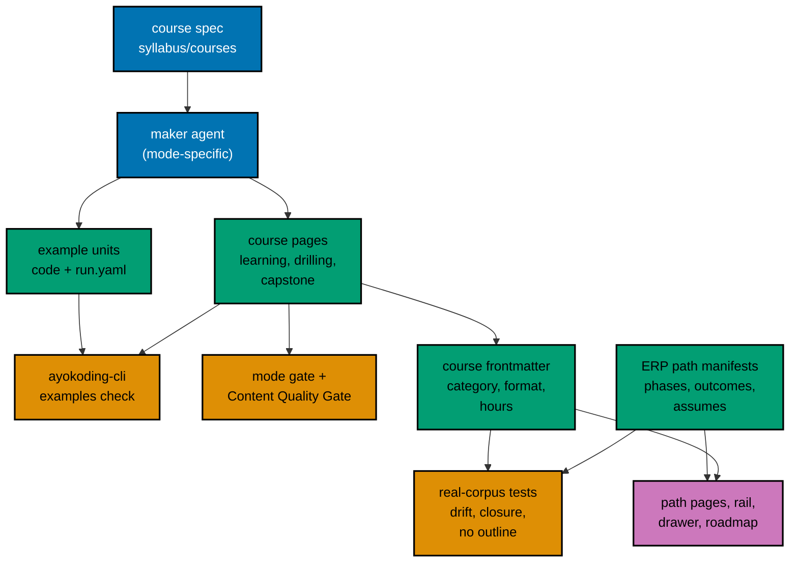
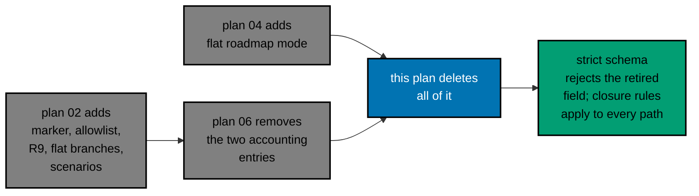

# 001 — Current State and Architecture

This file records what exists on 2026-10-09, what this plan assumes the earlier plans have delivered by the
time it runs, and how the pieces fit together.

## Current State (measured 2026-10-09 at `origin/main` `bb7f90137`)

| Fact                                                                                                                                                                                  | How it was measured                                                                                                                            |
| ------------------------------------------------------------------------------------------------------------------------------------------------------------------------------------- | ---------------------------------------------------------------------------------------------------------------------------------------------- |
| 30 ERP course folders: 27 conventional and 3 Sharia-only                                                                                                                              | The `courseOrder` of `skills/sharia-erp.json` (30) and `skills/conventional-erp.json` (27) in `src/features/course-paths/manifests/skills/`    |
| Each course has exactly 6 Markdown files (`_index.md`, `overview.md`, `learning/_index.md`, `learning/overview.md`, `drilling/_index.md`, `drilling/overview.md`), 180 files in total | `find` over the 30 folders, `-name '*.md'`                                                                                                     |
| Every course is 215 to 250 words in total (7,043 words over the 30 courses)                                                                                                           | Whitespace-split word count over every `.md` file in each course folder                                                                        |
| No course has a `code/` folder, a capstone, a level page, or a drilling page with content                                                                                             | Directory listing of the 30 folders                                                                                                            |
| Course frontmatter is `title`, `date`, `draft`, `weight`, `prerequisites` only; most ERP courses have `prerequisites: []` or one edge                                                 | Read `_index.md` of each course                                                                                                                |
| Both ERP manifests still use `courseOrder` on `origin/main`; plan 02 turns each into one `all-courses` phase plus the `restructurePendingIn: "plan-07"` marker                        | Read the two JSON files                                                                                                                        |
| The two ERP path pages carry internal jargon ("Dangerous 3", "Dangerous 4") and no audience statement                                                                                 | Read `content/en/learn/paths/skills/{conventional-erp,sharia-erp}/_index.md`                                                                   |
| The skills hub page `content/en/learn/paths/skills/_index.md` says "Each path publishes as its manifest ships"                                                                        | Read the file                                                                                                                                  |
| `shell/category-landing.tsx` renders "Get up and running fast on the ramp" and a `RampMilestoneStrip` per skills card                                                                 | Read the file; an E2E step in `apps/ayokoding-www-fe-e2e/tests/e2e/steps/course-paths.steps.ts` asserts the sentence                           |
| One existing test pins the ERP course sets and order: `tests/unit/features/course-paths/manifests/skills/erp-manifests.unit.test.ts`                                                  | Read the file                                                                                                                                  |
| Two well-built By Example peers exist: `sql-essentials` (80 examples, 32 diagrams, 40,224 learning words) and `api-design` (80 examples, 26 diagrams, 47,441 learning words)          | Counted `### Example` headings, `mermaid` fences, and whitespace-split words in `overview.md`, `beginner.md`, `intermediate.md`, `advanced.md` |
| The one Annotated-Concept peer measured, `system-design`, is thin: 53 examples, 4 diagrams, 5,140 learning words                                                                      | Same method                                                                                                                                    |
| `apps/ayokoding-cli` holds only `LICENSE`; no `run.yaml` exists anywhere; the Nx target `ayokoding-www:examples:check` does not exist yet                                             | `git ls-files apps/ayokoding-cli`; search for `run.yaml`; read `apps/ayokoding-www/project.json` (plan 05 adds them)                           |

The 30 skeletons are pure outlines: a one-paragraph description, a short concept list, and a stub
drilling page. Nothing in them is reusable as finished prose, so the archived predecessor specifications
under `plans/done/2026-08-16__ayokoding-learning-path-17-skills-erp-foundations/` and
`plans/done/2026-08-16__ayokoding-learning-path-18-skills-erp-enterprise-depth/` serve only as history.

## Contracts This Plan Consumes

The 14 plans run strictly in sequence (series decision 42), so plans 01 to 06 are merged when this plan
starts. The names below come from their plan documents of 2026-10-09 (plan 06's design files 001 to 010 were
read in full); the plans may have been adjusted while they were executed. Phase 0 checks each name against
`origin/main` with `rtk git grep` and records the as-merged name in `<plan>/evidence/phase-0-contracts.md`. A
renamed item is used under its merged name and noted. A **missing** item stops execution and is reported to the
user.

| From | Contract (planned name)                                                                                                                                                                                                                                                                                                                                                                                                                                                                                                    | Used for                                                                      |
| ---- | -------------------------------------------------------------------------------------------------------------------------------------------------------------------------------------------------------------------------------------------------------------------------------------------------------------------------------------------------------------------------------------------------------------------------------------------------------------------------------------------------------------------------- | ----------------------------------------------------------------------------- |
| 02   | `PathManifest.phases[]` (`id`, `title`, `kind`, `outcome.can`, `outcome.cannotYet`, `courses`), `assumes`, derived `courseOrder`; `status: outline`; rules R1 to R10 in `core/manifest-integrity.ts`                                                                                                                                                                                                                                                                                                                       | The two ERP manifests and the end-state tests                                 |
| 02   | `restructurePendingIn`, `core/skills-restructure-allowlist.ts` (`SKILLS_RESTRUCTURE_ALLOWLIST`, `isMarkedShape`, `isPendingSkillsRestructure`, `checkMarkerUsage`), rule R9 and `markerNotAllowed`                                                                                                                                                                                                                                                                                                                         | What this plan deletes                                                        |
| 02   | `legacy-skills-order.ts`, `skills-order.unit.test.ts`, `skills-restructure-allowlist.test.ts`, `legacy-membership.ts`, `manifest-membership.unit.test.ts`, `path-model-integrity.unit.test.ts`, `content/path-copy.unit.test.ts`                                                                                                                                                                                                                                                                                           | Tests this plan deletes or edits                                              |
| 02   | Features `core-closure.feature`, `path-phases.feature`, `path-copy.feature` under `specs/apps/ayokoding/www/behaviours/frontend/course-paths/`                                                                                                                                                                                                                                                                                                                                                                             | Scenarios this plan deletes, rewords, and adds                                |
| 02   | The prerequisite rubric (T1 to T4, L1, C1) in its `tech-docs/003`, which plans 06 to 08 re-run for the outline courses they rewrite                                                                                                                                                                                                                                                                                                                                                                                        | Each course's `prerequisites`                                                 |
| 03   | `category`, `description`, `format`, `estimatedHours` in course frontmatter; the `erp-systems` category; the real-corpus drift test that prints the expected `estimatedHours` (planned as `CORPUS-GUARD`)                                                                                                                                                                                                                                                                                                                  | Course metadata                                                               |
| 04   | `PathRoadmap` with a flat mode for pending skills paths (scenario S26), `RoadmapProgressCard`, `LearnPathCard` flat copy, keys `progressCoursesDone` and `roadmapCoursesCount`, an optional pending fixture                                                                                                                                                                                                                                                                                                                | What this plan removes from plan 04                                           |
| 05   | `apps/ayokoding-cli` (`examples validate`, `sync`, `run`, `check`, `coverage`, `affected`), the Nx target `ayokoding-www:examples:check`, `run.yaml` schema `ayokoding.run/v1`, the toolchain catalog (`python`, `postgres`), the simulation convention                                                                                                                                                                                                                                                                    | Every example's proof                                                         |
| 06   | The 24 accounting courses filled; the accounting path restructure; the skills landing work (strip deleted, statement, hub strapline and description reworded); the `psql` toolchain; the PostgreSQL conventions (pg8000, lockfile, schema rules, two-session patterns); the Sharia rule module `.agents/skills/apps-ayokoding-www-developing-content/reference/sharia-content.md` (SC1 to SC8); `accounting-course-completion.feature` and its step file with the shared lists; the marker narrowed to the two ERP entries | The accounting prerequisites, the landing split, the shared rules and helpers |

## Architecture After This Plan

### What Is Removed

## Data Flow Per Course

1. The coordinator picks the next course of a wave and starts one background maker agent with the course
   spec.
2. The maker writes the pages and the example units in slices S0 to S6
   ([007](./007-execution-batching-and-ledger.md#the-course-loop)).
3. `ayokoding-cli examples check --course <slug>` proves the code and the lesson-to-file sync.
4. The mode gate and the Content Quality Gate judge the pages (each at most 2 cycles).
5. The harness runs once more on the final text. Green means done; red after the repair cap means `BLOCKED`.
6. The coordinator records the result in the execution ledger and commits the wave's `DONE` courses.

## Constraints That Shape the Design

- **Determinism.** The harness runs every unit twice under different CPU limits and compares the output
  byte for byte, so no ERP example may read a clock, a random source, or an unordered collection
  ([004](./004-code-runtime-and-run-yaml.md#determinism-rules-for-erp-code)).
- **All or nothing per course.** Once a course holds its first `run.yaml`, every unit and every lesson code
  block must be covered. A half-written course therefore cannot be committed; only `DONE` courses are.
- **Skeleton-safe branch.** Until a course is `DONE`, it keeps its skeleton and the paths keep the plan 02
  marker, so every commit on the branch builds and the site works. A `DONE` course has already lost
  `status: outline`; the marked ERP manifests skip the no-outline rule, so this is safe until Phase 3.
- **One PR.** Series decision 39 ties the path restructure to the filled courses, and the series rule is one
  plan, one PR ([D12](./009-decision-records.md#d12--one-pr-for-the-whole-plan)).
