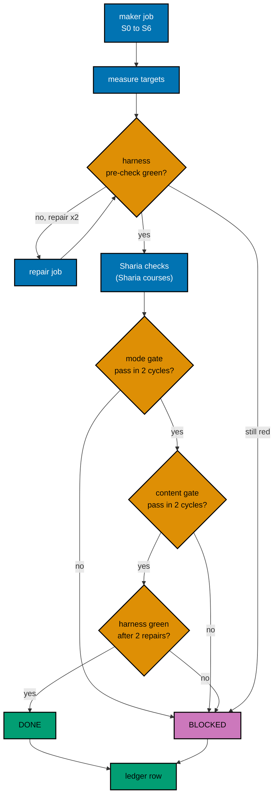
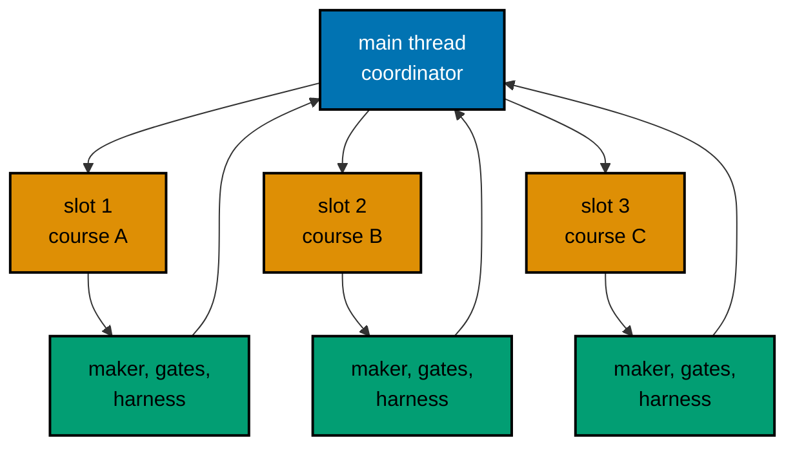

# 007 — Execution, Batching, and Ledger

How 30 courses get written without losing control: who does what, the steps every course follows, the order of
the 13 waves, the ledger that survives interruptions, and what happens to a course that cannot be finished.

## Roles and Slots

The repository runs `N+1` agents with `N = 3`: up to three background workers and one main thread that
orchestrates and stays free ([agent workflow orchestration](../../../../repo-governance/development/agents/agent-workflow-orchestration.md)).

- **Main thread (the coordinator).** Starts jobs, reads their reports, runs the cheap commands, writes the
  ledger, commits each wave, and talks to the user. It does not write course content.
- **Slot.** One of three background-agent places. A wave has at most three courses, so each course owns one
  slot for the whole wave.
- **Job.** One background agent run. A course passes through these jobs in its slot, one at a time:
  1. the **maker job** (slices S0 to S6, the measures, the Sharia checks, and the course checks);
  2. a **harness job** for the pre-check: it runs `EX-CHECK` and, if it is red, makes the allowed repairs;
  3. for each gate cycle, a **checker job** and, if it finds blocking rows, a **fixer job** (the gate workflow
     defines both);
  4. a second **harness job** on the final text.

Quality gates run only when someone asks for them by name. Executing this plan is that request, once the user
has given the execution command (the plan is a backlog plan until then). The gates' own ledgers under
`local-tmp/quality/` are never committed; the execution ledger below records each verdict line.

## The Course Loop

The delivery checklist for each course names these steps and acceptances. This section is the single place that
defines them, so a per-course checklist stays short.



### Step Reference

| Step                      | Job     | What happens                                                                                                                                                                                                                                                                                                                                                                                                                                                                                                                                                                                                                                      | Acceptance                                                                                                                                                                                                                                                                                                                                      |
| ------------------------- | ------- | ------------------------------------------------------------------------------------------------------------------------------------------------------------------------------------------------------------------------------------------------------------------------------------------------------------------------------------------------------------------------------------------------------------------------------------------------------------------------------------------------------------------------------------------------------------------------------------------------------------------------------------------------- | ----------------------------------------------------------------------------------------------------------------------------------------------------------------------------------------------------------------------------------------------------------------------------------------------------------------------------------------------- |
| S0 Expand the spec        | maker   | In `syllabus/courses/<slug>.md`, replace the cluster list under `## Worked examples` with one table row per example: `ex-NN`, title, level, cluster, runtime, what runs, the assertion its output proves, and the concepts it exercises. Keep the anchors, counts, and every other section as they are.                                                                                                                                                                                                                                                                                                                                           | Row count equals the planned total; numbers run 1 to N with no gap; level counts match the spec; each cluster starts with its anchor; every concept is in at least two rows; every row names at least one concept; no two titles are equal; Annotated-Concept has at most 16 diagram- or table-only rows; the spec diff shows only that section |
| S1 Overview, shared       | maker   | Write the root `overview.md` (150 to 400 words: audience, outcomes, prerequisites, how to use the course; the Sharia disclaimer sentence in a Sharia course), `learning/overview.md` (mental model, a concept-map diagram, example progression; the theme list for Annotated-Concept), `learning/code/README.md`, and, in a course with a Python PostgreSQL unit, `requirements.in` and `requirements.lock` (a byte copy of the Phase 0 lock)                                                                                                                                                                                                     | `EX-VALIDATE <slug>` reports no layout finding for these files; `cmp` of the lockfile with the Phase 0 evidence copy exits 0                                                                                                                                                                                                                    |
| S2 to S4 Levels or themes | maker   | By Example: for each level page, write the examples of each cluster in spec order. Annotated-Concept: for each group of three themes, write one theme page per theme in spec order, each opening with its theme intro. Each example gets its lesson text with the mode's parts, its unit (program, `run.yaml`) when it is code-bearing, its expected output (recorded with `EX-RECORD`, then read), and anchored fences. Run `EX-RUN` after each cluster or theme. S4 also writes the capstone and, for By Example, the `## Examples by Level` section of `learning/overview.md` (one bullet per example heading, verbatim, with its anchor link) | `EX-RUN <slug>` exits 0 with the units written so far green; the pages hold exactly the planned example headings                                                                                                                                                                                                                                |
| S5 Drilling               | maker   | Write `drilling/overview.md` with the exact H2 sections of the [drilling convention](./003-definition-of-done-and-targets.md#drilling-convention) (a sixth section in a Sharia course) and the kata units, each with `before/`, `after/`, `run.yaml`, and expected output                                                                                                                                                                                                                                                                                                                                                                         | `EX-RUN <slug>` exits 0; `grep -n "^## " drilling/overview.md` shows the sections; the counts of questions, problems, katas, checklist items, and prompts and the word floor meet the targets                                                                                                                                                   |
| S6 Metadata, index        | maker   | Fill the `_index.md` frontmatter per [003](./003-definition-of-done-and-targets.md#metadata), re-derive `prerequisites` with the rubric, replace `## Accuracy notes` with `## References`, run `GEN-INDEXES`, then read the expected `estimatedHours` from `CORPUS-GUARD` and set it                                                                                                                                                                                                                                                                                                                                                              | `CORPUS-GUARD` names no row for the course; `grep -rn -i 'accuracy notes' <dir>` returns nothing                                                                                                                                                                                                                                                |
| Measure                   | maker   | Run the measuring commands in [003](./003-definition-of-done-and-targets.md#measuring) and write the numbers to the report                                                                                                                                                                                                                                                                                                                                                                                                                                                                                                                        | Every number meets its target; a miss is fixed with real content, never padding                                                                                                                                                                                                                                                                 |
| Harness pre-check         | harness | `EX-CHECK <slug>` before any gate, so the gates judge code that runs                                                                                                                                                                                                                                                                                                                                                                                                                                                                                                                                                                              | Exit 0. Red: a repair job fixes the cause and the check runs again, at most 2 repair attempts; still red is `BLOCKED`                                                                                                                                                                                                                           |
| Sharia checks             | maker   | Sharia courses only: SH1 to SH4 in [005](./005-sharia-policy-and-source-register.md#course-checks)                                                                                                                                                                                                                                                                                                                                                                                                                                                                                                                                                | All four hold                                                                                                                                                                                                                                                                                                                                   |
| Course checks             | maker   | The "Course-specific checks" section of the spec (for example scripted concurrency and the simulation convention)                                                                                                                                                                                                                                                                                                                                                                                                                                                                                                                                 | Each shown in the text or the code, ticked only after reading the evidence                                                                                                                                                                                                                                                                      |
| Mode gate                 | gate    | `tutorial-by-example-quality-gate` or `tutorial-annotated-concept-quality-gate`, `subject` the course folder, `mode` `normal`, `max-cycles` 2                                                                                                                                                                                                                                                                                                                                                                                                                                                                                                     | `PASS` or `PASS_WITH_FINDINGS`. `FAIL` or `BLOCKED` after cycle 2 ends the course as `BLOCKED`                                                                                                                                                                                                                                                  |
| Content gate              | gate    | [Content Quality Gate](../../../../repo-governance/workflows/quality/content-quality-gate.md) over the published pages of the course folder, `mode` `normal`, `max-cycles` 2                                                                                                                                                                                                                                                                                                                                                                                                                                                                      | `PASS` or `PASS_WITH_FINDINGS`. `FAIL` or `BLOCKED` after cycle 2 ends the course as `BLOCKED`                                                                                                                                                                                                                                                  |
| Harness green             | harness | `EX-CHECK <slug>` on the final text; re-run the Measure commands and `CORPUS-GUARD`; apply the allowed repairs                                                                                                                                                                                                                                                                                                                                                                                                                                                                                                                                    | Exit 0, targets still met, `CORPUS-GUARD` clean. Red after 2 repair attempts is `BLOCKED`                                                                                                                                                                                                                                                       |
| Ledger                    | main    | Write the row (fields below)                                                                                                                                                                                                                                                                                                                                                                                                                                                                                                                                                                                                                      | The row is complete                                                                                                                                                                                                                                                                                                                             |

### Rules That Keep the Loop Bounded

- **Two cycles per gate, per course.** The cap covers all rules, UI, and code review loops too (the user's
  decision of 2026-10-09). A gate that has not passed after cycle 2 is a failure, not a reason for a third
  cycle.
- **First failure ends the chain.** If the mode gate fails, the content gate does not run. The course is
  `BLOCKED` and the slot moves on.
- **Verdict mapping.** The gate verdicts are `PASS`, `PASS_WITH_FINDINGS`, `FAIL`, and `BLOCKED`. The ledger
  state `BLOCKED` is used for a `FAIL` or `BLOCKED` gate verdict after cycle 2, for a harness failure after the
  repair cap, and for a unit that stays red under the unit rule below.
- **Unit rule.** A unit gets its first run plus at most 2 fix attempts. If it is still red, the maker replaces
  the example with a simpler one that teaches the same concept (the cluster list does not change), and the
  replacement gets the same budget. A second red replacement ends the course as `BLOCKED` with the unit named.
- **Harness repairs may touch only:** code files, `run.yaml`, expected files (re-recorded only after reading
  them), anchored fence bodies (through `EX-SYNC-WRITE`), and prose strictly to make a stated output, command,
  or number true. Anything else (restructuring a lesson, adding or removing an example, changing a target)
  would need a new gate pass, so the course is `BLOCKED` instead.
- **A prose-only factual repair never restarts a gate.** The gate verdict stays as recorded.
- **No quiet narrowing.** A course is never made `DONE` by dropping an example, shrinking a target, setting a
  Preview status, or unpublishing. A shortfall is a finding to fix or a `BLOCKED` row.

## Maker Prompt

The coordinator gives each maker job this prompt, with the angle-bracket values filled in. The maker agent
definitions still mention bilingual output from before decision 35, so the prompt overrides that explicitly.

```text
Write the course <slug> to the definition of done in
plans/backlog/ayokoding-learn-revamp-07-erp-courses/tech-docs/003-definition-of-done-and-targets.md.
Mode: <By Example | Annotated-Concept>. Spec: syllabus/courses/<slug>.md in the same plan folder.

Work in the execution worktree only. Touch only:
  apps/ayokoding-www/content/en/learn/courses/<slug>/
  plans/backlog/ayokoding-learn-revamp-07-erp-courses/syllabus/courses/<slug>.md   (slice S0 only)
Do not stage, commit, push, or edit any other file. Write English only; never touch content/id/.
The agent definition says "bilingual"; ignore that. Decision 35 makes courses English only.

Follow, in order: slices S0 to S6, the measures, and the harness pre-check in tech-docs/007 "Step Reference".
Rules you must follow: the determinism rules E1 to E15 and the run.yaml templates in tech-docs/004; the
PostgreSQL example shape in tech-docs/004 if the spec lists PostgreSQL clusters (every unit self-contained, no
helper shared between units, no threads); the layout and drilling convention in tech-docs/003 (exact H2 drilling
headings; nine theme pages for Annotated-Concept); for Sharia courses, the rules SC1 to SC8 and the checks SH1 to
SH4 in tech-docs/005 and the module .agents/skills/apps-ayokoding-www-developing-content/reference/sharia-content.md.

Run all commands as rtk ./hippo run --class ephemeral --resource-tier standard --disk-path . -- <command>.
Record expected outputs with EX-RECORD, then read every recorded file and confirm it shows what the lesson says.

When you finish, report: files written, the example/diagram/word counts, the EX-CHECK result line, every
deviation from the spec, and every place you could not meet a target. Do not claim a target you did not measure.
```

## Waves

A wave is the set of courses that run at the same time. The 13 waves follow the prerequisite order, never exceed
three courses, and put a course after every in-plan course it lists as a prerequisite. The wave number of a course
also appears in its checklist in the delivery.

| Wave | Courses (path position)                                                                                                                   | Examples | Agents in parallel | Needs waves | Checkpoint push after |
| ---- | ----------------------------------------------------------------------------------------------------------------------------------------- | -------- | ------------------ | ----------- | --------------------- |
| 1    | `erp-foundations-and-history` (1)                                                                                                         | 48       | 1                  | none        | no                    |
| 2    | `erp-conceptual-data-model` (2)                                                                                                           | 48       | 1                  | 1           | no                    |
| 3    | `erp-module-map-and-architecture` (3); `erp-bom-and-routing-architecture` (17)                                                            | 126      | 2                  | 2           | yes                   |
| 4    | `erp-document-lifecycle-and-state-machines` (4); `erp-numbering-sequences-and-uom-conversion` (8); `erp-extension-and-customization` (22) | 174      | 3                  | 3           | no                    |
| 5    | `erp-posting-rules-and-account-determination` (5); `human-capital-management-and-hire-to-retire` (24); `erp-security-and-controls` (26)   | 174      | 3                  | 3, 4        | no                    |
| 6    | `erp-subledger-to-gl-architecture` (6); `erp-audit-trail-and-change-tracking` (9); `erp-integration-patterns` (23)                        | 204      | 3                  | 4, 5        | yes                   |
| 7    | `erp-fiscal-calendar-and-period-close` (7); `procure-to-pay-systems` (10); `order-to-cash-systems` (11)                                   | 204      | 3                  | 6           | no                    |
| 8    | `erp-procurement-and-fulfillment-exceptions` (12); `record-to-report-systems` (13); `inventory-and-warehouse-management` (14)             | 234      | 3                  | 6, 7        | no                    |
| 9    | `erp-inventory-costing-methods` (15); `erp-inventory-integrity-and-concurrency` (16); `production-planning-and-mrp` (18)                  | 234      | 3                  | 3, 8        | yes                   |
| 10   | `demand-and-supply-planning` (19); `erp-availability-and-reservations` (20); `quality-management-and-inspection` (21)                     | 204      | 3                  | 3, 8, 9     | no                    |
| 11   | `multi-company-and-multi-currency-erp` (25); `erp-analytics-and-reporting` (27)                                                           | 156      | 2                  | 8           | no                    |
| 12   | `sharia-compliant-erp-design` (28)                                                                                                        | 48       | 1                  | 11          | yes                   |
| 13   | `islamic-contract-based-transaction-flows` (29); `zakat-and-sharia-compliance-modules` (30)                                               | 126      | 2                  | 5, 7, 12    | no                    |

```mermaid
%% Color Palette: Blue #0173B2, Orange #DE8F05, Teal #029E73, Purple #CC78BC, Gray #808080
flowchart LR
  accTitle: Wave order and checkpoint pushes
  accDescr: Thirteen waves run one after another. After waves three, six, nine, and twelve the branch is pushed as a checkpoint. After wave thirteen the path restructure begins.
  W1["W1"] --> W2["W2"] --> W3["W3"] --> C1(["push"])
  C1 --> W4["W4"] --> W5["W5"] --> W6["W6"] --> C2(["push"])
  C2 --> W7["W7"] --> W8["W8"] --> W9["W9"] --> C3(["push"])
  C3 --> W10["W10"] --> W11["W11"] --> W12["W12"] --> C4(["push"])
  C4 --> W13["W13"] --> P3["Phase 3<br/>paths"]

  classDef wave fill:#0173B2,stroke:#000000,color:#FFFFFF,stroke-width:2px
  classDef push fill:#DE8F05,stroke:#000000,color:#000000,stroke-width:2px
  classDef next fill:#029E73,stroke:#000000,color:#000000,stroke-width:2px
  classDef default fill:#FFFFFF,stroke:#000000,color:#000000
  class W1,W2,W3,W4,W5,W6,W7,W8,W9,W10,W11,W12,W13 wave
  class C1,C2,C3,C4 push
  class P3 next
```



Waves run strictly in order. The "Needs waves" column is the content dependency, which the order always
satisfies. Overlapping a later wave into an idle slot is not allowed, because it would make the ledger and the
resume rules harder to follow for a saving of a few idle slots in the one- and two-course waves
([D7](./009-decision-records.md#d7--13-waves-of-at-most-three-courses)).

## Execution Ledger

The ledger is the working record of the batch: `local-tmp/ayokoding-learn/execution-ledger.md`. The series shares
this one file; this plan owns the heading `## Plan 07 — ERP courses` and writes only under it. It is agent
working state, so it is never committed and is not part of the plan. A swept ledger is rebuilt from the git log
(the wave commits name the `DONE` courses) and the state of the course folders.

| Column                    | Meaning                                                                                                           |
| ------------------------- | ----------------------------------------------------------------------------------------------------------------- |
| Wave, Pos, Course         | Fixed by the table above                                                                                          |
| Mode                      | By Example or Annotated-Concept                                                                                   |
| State                     | `PENDING`, `IN-PROGRESS`, `DONE`, or `BLOCKED`                                                                    |
| Maker agent               | The agent ID of the maker job, so a resumed session can read its report                                           |
| Mode gate                 | Verdict and cycles used, for example `PASS_WITH_FINDINGS (2 cycles, 3 LOW open)`                                  |
| Content gate              | The same                                                                                                          |
| Harness                   | The `EX-CHECK` exit code and the repair attempts used, plus the summary line                                      |
| Examples, Words, Diagrams | The measured values                                                                                               |
| `estimatedHours`          | The value set from the drift test                                                                                 |
| Notes                     | Deviations, runtime-mix changes from S0, the lockfile `sha256` of a PostgreSQL course, open non-blocking findings |

The empty ledger the coordinator writes in Phase 0:

| Wave | Pos | Course                                        | Mode              | State   | Maker agent | Mode gate (verdict, cycles) | Content gate (verdict, cycles) | Harness (exit, repair attempts) | Examples | Words | Diagrams | estimatedHours | Notes |
| ---- | --- | --------------------------------------------- | ----------------- | ------- | ----------- | --------------------------- | ------------------------------ | ------------------------------- | -------- | ----- | -------- | -------------- | ----- |
| 1    | 1   | `erp-foundations-and-history`                 | Annotated-Concept | PENDING |             |                             |                                |                                 |          |       |          |                |       |
| 2    | 2   | `erp-conceptual-data-model`                   | Annotated-Concept | PENDING |             |                             |                                |                                 |          |       |          |                |       |
| 3    | 3   | `erp-module-map-and-architecture`             | Annotated-Concept | PENDING |             |                             |                                |                                 |          |       |          |                |       |
| 4    | 4   | `erp-document-lifecycle-and-state-machines`   | Annotated-Concept | PENDING |             |                             |                                |                                 |          |       |          |                |       |
| 5    | 5   | `erp-posting-rules-and-account-determination` | By Example        | PENDING |             |                             |                                |                                 |          |       |          |                |       |
| 6    | 6   | `erp-subledger-to-gl-architecture`            | By Example        | PENDING |             |                             |                                |                                 |          |       |          |                |       |
| 7    | 7   | `erp-fiscal-calendar-and-period-close`        | Annotated-Concept | PENDING |             |                             |                                |                                 |          |       |          |                |       |
| 4    | 8   | `erp-numbering-sequences-and-uom-conversion`  | Annotated-Concept | PENDING |             |                             |                                |                                 |          |       |          |                |       |
| 6    | 9   | `erp-audit-trail-and-change-tracking`         | Annotated-Concept | PENDING |             |                             |                                |                                 |          |       |          |                |       |
| 7    | 10  | `procure-to-pay-systems`                      | By Example        | PENDING |             |                             |                                |                                 |          |       |          |                |       |
| 7    | 11  | `order-to-cash-systems`                       | By Example        | PENDING |             |                             |                                |                                 |          |       |          |                |       |
| 8    | 12  | `erp-procurement-and-fulfillment-exceptions`  | By Example        | PENDING |             |                             |                                |                                 |          |       |          |                |       |
| 8    | 13  | `record-to-report-systems`                    | By Example        | PENDING |             |                             |                                |                                 |          |       |          |                |       |
| 8    | 14  | `inventory-and-warehouse-management`          | By Example        | PENDING |             |                             |                                |                                 |          |       |          |                |       |
| 9    | 15  | `erp-inventory-costing-methods`               | By Example        | PENDING |             |                             |                                |                                 |          |       |          |                |       |
| 9    | 16  | `erp-inventory-integrity-and-concurrency`     | By Example        | PENDING |             |                             |                                |                                 |          |       |          |                |       |
| 3    | 17  | `erp-bom-and-routing-architecture`            | By Example        | PENDING |             |                             |                                |                                 |          |       |          |                |       |
| 9    | 18  | `production-planning-and-mrp`                 | By Example        | PENDING |             |                             |                                |                                 |          |       |          |                |       |
| 10   | 19  | `demand-and-supply-planning`                  | Annotated-Concept | PENDING |             |                             |                                |                                 |          |       |          |                |       |
| 10   | 20  | `erp-availability-and-reservations`           | By Example        | PENDING |             |                             |                                |                                 |          |       |          |                |       |
| 10   | 21  | `quality-management-and-inspection`           | By Example        | PENDING |             |                             |                                |                                 |          |       |          |                |       |
| 4    | 22  | `erp-extension-and-customization`             | By Example        | PENDING |             |                             |                                |                                 |          |       |          |                |       |
| 6    | 23  | `erp-integration-patterns`                    | By Example        | PENDING |             |                             |                                |                                 |          |       |          |                |       |
| 5    | 24  | `human-capital-management-and-hire-to-retire` | Annotated-Concept | PENDING |             |                             |                                |                                 |          |       |          |                |       |
| 11   | 25  | `multi-company-and-multi-currency-erp`        | By Example        | PENDING |             |                             |                                |                                 |          |       |          |                |       |
| 5    | 26  | `erp-security-and-controls`                   | Annotated-Concept | PENDING |             |                             |                                |                                 |          |       |          |                |       |
| 11   | 27  | `erp-analytics-and-reporting`                 | By Example        | PENDING |             |                             |                                |                                 |          |       |          |                |       |
| 12   | 28  | `sharia-compliant-erp-design`                 | Annotated-Concept | PENDING |             |                             |                                |                                 |          |       |          |                |       |
| 13   | 29  | `islamic-contract-based-transaction-flows`    | By Example        | PENDING |             |                             |                                |                                 |          |       |          |                |       |
| 13   | 30  | `zakat-and-sharia-compliance-modules`         | Annotated-Concept | PENDING |             |                             |                                |                                 |          |       |          |                |       |

### Resuming

A new session, or the same session after its context was compacted, resumes like this:

1. Read the ledger and `rtk git status --short`; reconcile them (a `DONE` row must have its commit, an
   `IN-PROGRESS` row must have an uncommitted course folder).
2. For each `IN-PROGRESS` row, read the maker's report if the agent ID is still readable; otherwise run
   `EX-CHECK <slug>` and the Measure commands to see how far the course got, and restart from the first slice
   that fails.
3. A course folder with an unfinished set of units is never committed: an opted-in course is all or nothing.

## Blocked Courses

A course is `BLOCKED` when the Loop says so. The coordinator handles it in this order and then reports to the
user. The batch does not stop: the other courses of the wave continue.

1. Save the partial work: copy the course folder to `local-tmp/ayokoding-learn/blocked/<slug>/` and run
   `diff -r` between the two folders; the diff must print nothing before the next step.
2. Restore the skeleton: `rtk git restore -- <dir>` for the tracked files, then a dry run `rtk git clean -n -d -- <dir>`,
   read the listed paths, and only then `rtk git clean -f -d -- <dir>` for the untracked ones. Run
   `rtk git status --short -- <dir>` and expect no output.
3. Write the ledger row: state `BLOCKED`, the failing step, the open findings (the gate's ledger path and the
   blocking rows), the harness output, and the path of the saved partial work.
4. Report to the user: the course, the step that failed, the blocking findings in short, and the options below.
   Do not choose for them.
5. The wave gate stays open (the wave's last checklist items stay unticked) until the user decides.

Options the user can choose:

- **Retry** with a changed approach (a smaller example plan, a different design for the failing unit, or a
  repair of the cause in a shared kit). The course re-enters the Loop with fresh budgets, and the decision is
  recorded in the ledger Notes.
- **Defer** the course to a follow-up plan. This cannot meet decision 40 (zero outline courses in the ERP
  category), so the user decides explicitly whether this PR ships without the course. The path manifests
  cannot list the course as core while it is an outline (rule R5), so the user also decides how the path is
  shaped. The plan does not pre-decide this.
- **Stop** the plan.

The plan never narrows quietly: no Preview status, no unpublishing, no smaller target recorded as done.
A course that depends on a `BLOCKED` course can still be written (its prerequisite list is metadata), but Phase 3
cannot complete while any ERP course remains an outline.

## Commits and Checkpoint Pushes

- **Wave commits.** One commit per wave, containing the wave's `DONE` courses (explicit paths), the spec
  expansions for those courses, and nothing else. Header `docs(ayokoding-www): write ERP courses, wave N`; the
  body names the slugs, one per line of at most 100 characters. A `BLOCKED` course is never in the commit.
- **Why a wave is one commit.** A wave is the set of courses that were gated together and recorded together in
  the ledger, so one commit per wave keeps the history aligned with the ledger.
- **Checkpoint pushes.** After waves 3, 6, 9, and 12 the branch is pushed. The first checkpoint opens a draft
  pull request. Each push first passes the per-commit push leak review, and the current head's CI must be green
  before the next wave starts, so a harness or lockfile problem on the CI runner (for example the amd64 wheel hashes)
  surfaces at wave 3 and not at the end. CI is polled every 2 minutes; `gh run watch` is not used.
- **Merging `origin/main`.** Before each wave, fetch and, if `origin/main` moved, read the full diff of the new
  commits, reconcile, and merge (not rebase) so pushed history is stable.

## Agent Topology



Compute inside a job goes through `rtk ./hippo run` with the resource tier of the Command Reference in the
delivery. Independent compute from different slots may overlap only through HIPPO admission; the dependency,
shared-output, byte-identity, and correctness edges (the lockfile bytes copied to each PostgreSQL course, the
one environment image per lockfile, the ledger, and the wave commit) stay serial.
