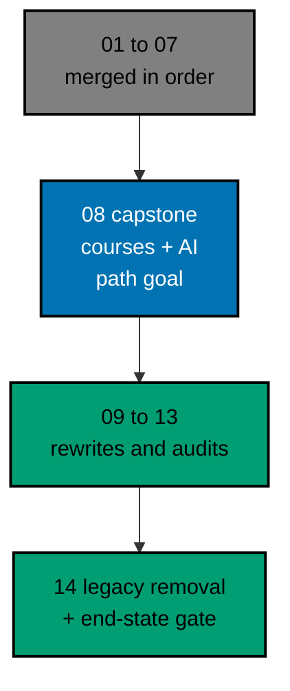

# AyoKoding Learn Revamp 08 — Capstone Courses

> **Status:** Backlog. Do not execute until both are true: the user gives an explicit execution
> command, and plans 01 to 07 of this series have merged to `origin/main`. The 14 plans run strictly
> one after another (series decision 42), so plan 07 is merged, deployed, verified, and cleaned up
> before this plan starts, and plans 09 to 14 start only after this plan has merged.
>
> **Plan quality gate:** not run yet, so no verdict exists. By the user's decision of 2026-10-09 it
> was not run while the plan was written; it runs at the start of execution, as the first item of
> Phase 0 in [delivery.md](./delivery.md#phase-0-worktree-environment-preconditions-and-baseline),
> with `max-cycles` 2.

AyoKoding has eight capstone courses that were planned as projects and are still empty outlines: a
coding agent, a pentest engine, a secure service, a data pipeline, a real-world delivery, two
concurrency capstones, and a leadership capstone. On 2026-10-09 each had three short pages and 216 to
395 words, with no lessons, no exercises, and no project. This plan writes all eight from scratch, as
full project courses with runnable, tested code (seven of them) and a graded project each, and then
gives the AI Engineer career path its goal, in the same PR.

## Scope

- **Write 8 courses** to the series definition of done (decision 27): each course is in one tutorial
  mode, Annotated Concept standard (7 courses) or its no-code sub-mode (1 course), chosen per course
  with a reason; it meets its mode's targets and the capstone contract (a project brief, milestones,
  acceptance criteria that name their proof, a rubric, and a reference solution), has a full drilling
  page, passes its mode quality gate and the Content Quality Gate with no blocking finding, and runs all
  its code green in plan 05's example harness. See
  [tech-docs/002](./tech-docs/002-capstone-course-contract-and-modes.md).
- **Re-run the prerequisite rubric** on the written courses: 9 edge changes (7 language primers, 1 course
  added, 1 removed), course-level coupling so that a later rewrite of a prerequisite cannot make a
  capstone wrong, and a readiness check before each course starts. See
  [tech-docs/003](./tech-docs/003-prerequisites-readiness-and-ordering.md).
- **Runnable code everywhere.** About 358 harness units over 7 code courses, each deterministic; the CI
  time budget is measured first and has a response ladder. See
  [tech-docs/004](./tech-docs/004-code-harness-and-determinism-design.md).
- **Safe security content.** The secure service, the pentest engine, and the real-world delivery capstone
  teach defence and auditable assessment in an offline fixture lab, with a written safety boundary and a
  deterministic scan.
- **Give the AI Engineer path its goal** (decisions 6, 7, 9): `capstone-build-your-own-coding-agent`
  becomes the goal, the core becomes the goal's prerequisite closure, and the manifest, the page copy,
  the frozen membership list, and the tests change. See
  [tech-docs/005](./tech-docs/005-ai-path-goal-and-closure.md).
- **Rebind the browser tests** that need a course shape or an outline status that no longer exists, with
  Unit proof over fixtures. See
  [tech-docs/006](./tech-docs/006-e2e-rebinding-and-testing-strategy.md).
- **Metadata.** All 8 courses drop `status: outline` and get plan 03's metadata, with a real
  `estimatedHours` from plan 03's drift test.
- **Guard the end state** (decision 40): a new content-shape test keeps every capstone filled, a new
  career-goals test keeps every career core a closure, and `ayokoding-www:examples:check` keeps the code
  green.

## Non-Goals

- The five other capstones (`capstone-first-working-software`, `capstone-forge-ready`,
  `capstone-full-stack-app`, `capstone-interview-loop`, `capstone-solid-core`), the two filler
  prerequisites, and every other course (plans 09 to 13).
- The accounting and ERP courses and paths (plans 06 and 07).
- Any change to plan 05's harness beyond a shard-count fix or a timeout change that the CI ladder
  requires, or to plan 04's roadmap code.
- Indonesian content: `content/id/**` stays untouched (decision 35).
- Live attack labs, real targets, and operational attack material of any kind.

## Flags for the User

These are choices this plan made on its own authority. None needs an answer to start, and each is easy
to change before execution.

1. **The AI core shrinks from 25 to 12 courses** (16 courses move to five named extension phases; 28
   courses stay on the path; `assumes` drops from 11 to 4). This follows decisions 6, 7, and 9: with a
   goal, the core is the goal's closure. Adding a second goal to keep more courses in the core is a
   one-line manifest change.
2. **Volume.** The courses follow the Annotated-Concept floor of 45 worked examples: about 23,000 words
   per code course and 18,000 for the no-code course, about 156,000 words and 358 code units in all.
3. **Cap of 2 cycles** on every gate and loop (the user's instruction of 2026-10-09). Sibling plans 02
   to 04 may still say 3 in places; this plan does not edit them.
4. **A possible gap in plan 05:** a capstone unit holds one toolchain, so two capstones use secondary
   units with identical copies of shared files. If plan 05 allows two toolchains in one unit, the copies
   go.
5. **Browser-test exemptions** are added to plan 03's "Start falls back to the first learning page"
   scenario and to the scenarios of plans 02 to 04 that open a real outline course, because after this
   plan no such course exists.
6. **No plan quality gate verdict exists yet.** It runs first in Phase 0.

## Dependency and Result

The series runs strictly in order, one plan, one worktree, and one PR at a time (series decision 42),
so plans 01 to 07 are all merged when this plan starts. This plan builds directly on plan 02 (path
model), plan 03 (course metadata), and plan 05 (code harness). Plans 09 to 13 run after it, so the
courses these capstones depend on are written against their current text, and the capstones are built to
survive a later rewrite of them ([tech-docs/003](./tech-docs/003-prerequisites-readiness-and-ordering.md#course-level-coupling)).

## Series Context

This plan is row 08 of the 14-plan **AyoKoding Learn Revamp** series. Each plan is one PR delivered
from its own worktree, and the plans run strictly in numeric order; the "Depends on" column shows
which earlier plans each one builds on directly. The user resolved the series decisions on 2026-10-09;
every decision this plan relies on is copied into
[brd.md](./brd.md#resolved-series-decisions-this-plan-relies-on).

| NN  | Plan suffix                    | Scope                                                                                        | Depends on       |
| --- | ------------------------------ | -------------------------------------------------------------------------------------------- | ---------------- |
| 01  | `navigation-and-display`       | Strip `NN ·` title prefixes; path position numbers; sidebar auto-scroll; render fixes        | —                |
| 02  | `path-model`                   | Phases, goals, `assumes`, outline marker, prerequisite revision, closure checks, career copy | 01               |
| 03  | `catalog-and-metadata`         | Course metadata schema and backfill, categories, catalog page, course landing header         | 01               |
| 04  | `learning-experience`          | Browser progress, phase roadmap page, context bar, mark complete, Learn home                 | 02, 03           |
| 05  | `code-harness`                 | `ayokoding-cli`, `run.yaml` contract, runners, Nx target, CI, quality-gate propagation       | —                |
| 06  | `accounting-courses`           | Write 24 accounting courses; restructure both accounting paths in the same PR                | 02, 03, 05       |
| 07  | `erp-courses`                  | Write 30 ERP courses; restructure both ERP paths in the same PR                              | 06               |
| 08  | `capstone-courses` (this plan) | Rewrite 8 skeleton capstones; give the AI Engineer path its goal                             | 02, 03, 05       |
| 09  | `filler-rewrites`              | Rewrite 8 templated filler courses                                                           | 03, 05           |
| 10  | `legacy-unique-migration`      | Build courses for legacy topics without an equivalent; record the legacy-to-course map       | 03, 05           |
| 11  | `audit-languages-and-tooling`  | Audit and fix language and tooling courses                                                   | 05               |
| 12  | `audit-cs-systems-and-data`    | Audit and fix CS, systems, concurrency, distributed, database, and data courses              | 05               |
| 13  | `audit-product-security-ai`    | Audit and fix web, backend, mobile, security, AI, testing, architecture, product courses     | 05               |
| 14  | `legacy-removal`               | Delete `learn/legacy`, add 308 redirects, repoint `docs/` links, update specs and tests      | 10 (+11–13 done) |

## How the Work Runs

The courses are written in three batches in prerequisite order, by at most three background agents at a
time. Each course goes maker → mode quality gate → Content Quality Gate → harness green, and every loop
stops after 2 cycles (the user's cap, 2026-10-09: "semua jadi 2 aja"). The code of each reference
solution is built test first by `swe-developer`; the lessons are written by the Annotated-Concept
maker. A course that still fails is marked BLOCKED, reported, and the batch moves on; the plan then
stops for the user before the metadata and path phases. See
[tech-docs/007](./tech-docs/007-execution-model.md).

## Navigation

- [Business requirements](./brd.md)
- [Product requirements, Gherkin, and UI note](./prd.md)
- [Technical design](./tech-docs/README.md)
- [Syllabus corpus (8 course briefs and the AI Engineer manifest specification)](./syllabus/README.md)
- [Delivery checklist](./delivery.md)
- [Execution learnings](./learnings.md)
