# Delivery Plan — AyoKoding Learn Revamp 08: Capstone Courses

> **Legend** — `[AI]`: an agent performs the step (the default; unmarked steps are `[AI]`).
> `[HUMAN]`: only a human can do it (physical action, out-of-band approval, real-secret or
> privileged-credential handling). `[AI+HUMAN]`: agent prepares, human approves or finishes.

**Do not start** until both are true: (1) the user gives an explicit execution command for this
plan — that command authorizes this plan's change set (commits, pushes, PR, merge, and the deploy
described below); (2) plans 01 to 07 of this series have merged to `origin/main`, deployed, been
verified, and had their worktrees cleaned up. The series runs strictly one plan at a time (series
decision 42), so no other series plan runs while this one does, plans 09 to 14 have not started, and no
rebase between plans is needed. The user's words (2026-10-09): "jangan kerjain/implement plan ini sebelum
gw kasih perintah buat eksekusi ya" (do not implement this plan until I give the command to execute it).

**Plan quality gate:** not run yet, so no verdict exists. By the user's decision of 2026-10-09 it was
not run while the plan was written. It runs at the start of execution, as the first item of
[Phase 0](#phase-0-worktree-environment-preconditions-and-baseline), with `max-cycles` 2; its verdict
line is recorded here only then.

## Worktree

- **Execution worktree:** `worktrees/ayokoding-learn-revamp-08-capstone-courses/`
- **Provisioning command** (from the repository root, at Step 0):
  `claude --worktree ayokoding-learn-revamp-08-capstone-courses`, or the equivalent
  `rtk git worktree add -b ayokoding-learn-revamp-08-capstone-courses-base worktrees/ayokoding-learn-revamp-08-capstone-courses origin/main`.
- **Provisioning status:** pending
- **Authoring-worktree exception:** this plan was authored inside the separate authoring worktree
  `.claude/worktrees/ayokoding-update` (branch `worktree-ayokoding-update`). The user required that
  session to write all plans of the AyoKoding Learn Revamp series together and not to execute any of
  them before the user's command. That authoring worktree is **never** used for execution. The
  Provisioned Worktree Identity and the Delivery Branch Inventory are intentionally omitted until
  Step 0 creates them.
- **Step 0 obligation (blocking):** Phase 0's first outcome after the plan quality gate provisions
  the execution worktree from fresh `origin/main` per the
  [Worktree Path Convention](../../../repo-governance/conventions/structure/worktree-path.md),
  initializes it per
  [Worktree Toolchain Initialization](../../../repo-governance/development/workflow/worktree-setup.md),
  writes the immutable identity and the first inventory row into this section, replaces
  `Provisioning status: pending` with `Provisioning status: provisioned`, and syncs with
  `origin/main`. No implementation step may start while the status is pending.
- **Cleanup:** after the PR merges, the worktree, its branches, and this plan's scratch come down
  through [Dev Artifact Clean-Up](../../../repo-governance/workflows/maintenance/dev-artifact-clean-up.md)
  (Phase 13).
- **Worktree cap:** one worktree for this plan in this repository, reused by every phase.

The plan never records an absolute or machine-specific path. Resolve the declared route at runtime
and reconcile it with `rtk git worktree list --porcelain`.

## Delivery Mode: worktree-to-pr

`worktree-to-pr` is mandatory in this repository. One branch and **one PR** deliver the whole plan
(the series rule "one plan = one PR"). The PR needs the exact current-head/base `Quality gate` from
`.github/workflows/pr-quality-gate.yml` and an exact-head posted `pr-leak-review` `pass`
(`leak-review` status). Broad semantic PR review is not run unless the user asks for it. The
applicable UI and API surface gates still bind (Phase 11). `[AI]` merges once the hardened merge
preconditions hold.

## Parallelization Model

The eight courses are written in three batches in prerequisite order
([tech-docs/007](./tech-docs/007-execution-model.md#batches)). Inside a batch, up to three background
agents each run one course's pipeline; a batch starts only when every course of the earlier batch is DONE
or BLOCKED. Every shared file (manifests, tests, features, rules, indexes, the CLI) is touched by the
coordinator in a serial phase.

```mermaid
%% Color Palette: Blue #0173B2, Orange #DE8F05, Teal #029E73, Purple #CC78BC
flowchart TD
  accTitle: Plan 08 execution order
  accDescr: Phase 0 sets up and records a baseline, including the deferred plan quality gate. Phase 1 settles harness readiness and the CI time budget. Phases 2 to 4 write the courses in three batches with up to three agents each. A human stop reviews blocked courses. Then the metadata flip, the AI path, the browser-test rebinding, rules and docs, the end-state gate, manual checks, knowledge capture, and the delivery boundary run in order.
  P0["0 setup,<br/>quality gate,<br/>baseline"] --> P1["1 harness readiness<br/>and CI budget"]
  P1 --> P2["2 batch B1<br/>up to 3 agents"]
  P2 --> P3["3 batch B2<br/>up to 3 agents"]
  P3 --> P4["4 batch B3<br/>up to 2 agents"]
  P4 --> P5["5 human stop:<br/>BLOCKED courses"]
  P5 --> P6["6 metadata flip<br/>and completion test"]
  P6 --> P7["7 AI path goal<br/>and closure"]
  P7 --> P8["8 browser-test<br/>rebinding"]
  P8 --> P9["9 rules, docs, C4"]
  P9 --> P10["10 end-state gate"]
  P10 --> P11["11 manual<br/>and testers"]
  P11 --> P12["12 knowledge capture"]
  P12 --> P13["13 boundary:<br/>archive, PR,<br/>merge, cleanup"]

  classDef serial fill:#0173B2,stroke:#000000,color:#FFFFFF,stroke-width:2px
  classDef parallel fill:#CC78BC,stroke:#000000,color:#000000,stroke-width:2px
  classDef human fill:#DE8F05,stroke:#000000,color:#000000,stroke-width:2px
  classDef gate fill:#029E73,stroke:#000000,color:#000000,stroke-width:2px
  classDef default fill:#FFFFFF,stroke:#000000,color:#000000
  class P0,P1,P6,P7,P8,P9 serial
  class P2,P3,P4 parallel
  class P5 human
  class P10,P11,P12,P13 gate
```

### Delivery Boundaries

| Phase(s) | Natural cohesive seam                                                                  | Worktree                                                | Branch                                       | Delivery opportunity             | Exact resulting `main` / rollback / feature-flag evidence                                                                                                                                                                                                                                                                                                                                                                |
| -------- | -------------------------------------------------------------------------------------- | ------------------------------------------------------- | -------------------------------------------- | -------------------------------- | ------------------------------------------------------------------------------------------------------------------------------------------------------------------------------------------------------------------------------------------------------------------------------------------------------------------------------------------------------------------------------------------------------------------------ |
| 0        | — (setup and baseline)                                                                 | —                                                       | —                                            | none                             | No resulting state change; no PR; flag not applicable                                                                                                                                                                                                                                                                                                                                                                    |
| 1–13     | Eight filled capstone courses with the AI Engineer path's goal (decisions 6, 7, 9, 40) | `worktrees/ayokoding-learn-revamp-08-capstone-courses/` | `ayokoding-learn-revamp-08-capstone-courses` | PR opened and merged in Phase 13 | `main` gets the 8 filled capstones, the AI manifest with its goal, the membership and test edits, the browser-test exemptions, the capstone rule module, and the completion and career-goals tests together. Rollback: revert the merge commit in a revert PR (the outline capstones and the old AI manifest come back together). Feature-flag lifecycle: not applicable, because no flag is created; nothing to remove. |

### Agent Topology

- **Main thread (coordinator):** owns the execution ledger, every gate, every commit, index
  generation, and every shared file. It keeps itself free and fills background slots first.
- **At most 3 background agents at any time** (N = 3). One course pipeline is one slot at a time:
  - Phases 2–4, per code course: `swe-developer` builds the reference solution test first (CP-1), then
    `apps-ayokoding-www-annotated-concept-maker` writes the lessons, examples, katas, and drilling (CP-2).
    For the no-code course only the maker runs. Each writes only inside
    `apps/ayokoding-www/content/en/learn/courses/<slug>/`, never the `_index.md` frontmatter.
  - The gates run the checker and fixer agents the gate workflows name.
  - Phase 1: one `swe-developer` for the shard-count fix, only if the CI ladder needs it.
  - Phases 6–8: one `specs-maker` (Gherkin) then one `swe-developer` (code, tests, data), in sequence
    because they share step files; `apps-ayokoding-www-general-maker` writes the AI path page.
  - Phase 9: `rules-maker`, then `docs-fixer` and `readme-fixer`.
  - Phase 11: `swe-web-tester` (exploratory and design charters) and `swe-usability-tester`.
- Record every agent ID, its file set, its step, and its cycle count in the execution ledger.

### Execution Packet Defaults

- **Plan path after promotion:** `plans/in-progress/ayokoding-learn-revamp-08-capstone-courses/`
  (written below as `<plan>/`). Evidence goes to `<plan>/evidence/`.
- **Execution ledger:** `local-tmp/ayokoding-learn/execution-ledger.md` in the execution worktree,
  under the heading `## Plan 08 — capstone courses`, with the fields in
  [tech-docs/007](./tech-docs/007-execution-model.md#the-execution-ledger). Other scratch (raw output,
  curl bodies, the placement record, agent packets) lives in `local-tmp/ayokoding-learn/plan-08/`
  (gitignored).
- **No ad-hoc scripts (series decision 37).** Checks run through the app's tests and `ayokoding-cli`.
  Read-only inspection with `rtk git grep`, `rtk git diff`, `rtk git ls-tree`, and `rtk wc -w` is fine.
  A temporary edit that a test then reads (the closure probe) is restored with `rtk git checkout -- <file>`.
- **Evidence hygiene:** evidence files contain repository-relative paths only. Never paste an
  absolute home-directory path, a hostname, a token, or `.env*` content.
- **Never commit** `apps/ayokoding-www/next-env.d.ts` (the dev server rewrites it) or
  `.serena/project.yml`. Before every commit run `rtk git status --short` and restore either file with
  `rtk git checkout -- <file>` if it shows as modified.
- **Indonesian content stays untouched (decision 35).** `GEN-INDEXES` and `DEV` regenerate indexes for
  both locales. After each run, `rtk git status --short -- apps/ayokoding-www/content/id` must be
  empty; if not, run `rtk git checkout -- apps/ayokoding-www/content/id`.
- **Never touch** `.env.prod` or `.env.stag`. If the dev server needs a variable, copy the key from
  `apps/ayokoding-www/.env.example` into an uncommitted `apps/ayokoding-www/.env.local`.
- **No git identity changes.** Never run `git config user.*`. Never use a bare `git stash`.
- **Bounded loops (user, 2026-10-09: "semua jadi 2 aja"):** every quality gate runs with
  `max-cycles: 2`, and every maker→checker loop, review loop, and repair loop runs at most 2 cycles.
  This supersedes the repository default of 3 that decision 29 first recorded. A course still failing
  after its second cycle is **BLOCKED**: record it in the ledger, report it to the user, and move on.
  Any other file still failing after its second cycle is recorded as BLOCKED and the phase gate stays
  open until the user decides.
- **Failure handling:** on any unexpected failure, save the output to the phase evidence file, fix the
  root cause (never skip, retry-until-green, loosen, widen, or delete a test), rerun the same command,
  and note the fix. A harness defect is fixed in `apps/ayokoding-cli` with a regression test (plan 05's
  M11), never by weakening a course check.
- **Polling:** poll CI every 2 minutes with `rtk gh pr checks`; never use `gh run watch`. While only
  background agents are working, update the user every 5 minutes.

> **Important**: Fix ALL failures found during quality gates, not just those caused by your
> changes. This follows the root cause orientation principle — proactively fix preexisting
> errors encountered during work.

### Command Reference

Run every command from the execution worktree root. Expected results are stated at each use.

| Name                 | Command                                                                                                                                                                                                                                                                                   |
| -------------------- | ----------------------------------------------------------------------------------------------------------------------------------------------------------------------------------------------------------------------------------------------------------------------------------------- |
| `UNIT-FE <file>`     | `rtk ./hippo run --class ephemeral --resource-tier standard --disk-path . --cwd apps/ayokoding-www -- npx vitest run --project unit-fe <file>`                                                                                                                                            |
| `UNIT-NODE <file>`   | `rtk ./hippo run --class ephemeral --resource-tier standard --disk-path . --cwd apps/ayokoding-www -- npx vitest run --project unit <file>`                                                                                                                                               |
| `QUICK`              | `rtk ./hippo run --class ephemeral --resource-tier standard --disk-path . -- npm exec nx -- run ayokoding-www:test:quick`                                                                                                                                                                 |
| `INTEGRATION`        | `rtk ./hippo run --class ephemeral --resource-tier heavy --disk-path . -- npm exec nx -- run ayokoding-www:test:integration`                                                                                                                                                              |
| `BEHAVIOUR`          | `rtk ./hippo run --class ephemeral --resource-tier standard --disk-path . -- npm exec nx -- run ayokoding-www:test:coverage:behaviour`                                                                                                                                                    |
| `E2E-BEHAVIOUR`      | `rtk ./hippo run --class ephemeral --resource-tier standard --disk-path . -- npm exec nx -- run ayokoding-www-fe-e2e:test:coverage:behaviour`                                                                                                                                             |
| `BE-E2E-BEHAVIOUR`   | `rtk ./hippo run --class ephemeral --resource-tier standard --disk-path . -- npm exec nx -- run ayokoding-www-be-e2e:test:coverage:behaviour`                                                                                                                                             |
| `E2E-QUICK`          | `rtk ./hippo run --class ephemeral --resource-tier standard --disk-path . -- npm exec nx -- run ayokoding-www-fe-e2e:test:quick`                                                                                                                                                          |
| `E2E`                | `rtk ./hippo run --class ephemeral --resource-tier heavy --disk-path . -- npm exec nx -- run ayokoding-www-fe-e2e:test:e2e`                                                                                                                                                               |
| `BUILD`              | `rtk ./hippo run --class ephemeral --resource-tier heavy --disk-path . -- npm exec nx -- run ayokoding-www:build`                                                                                                                                                                         |
| `GEN-INDEXES`        | `rtk ./hippo run --class transactional --resource-tier standard --disk-path . -- npm exec nx -- run ayokoding-www:generate-indexes`                                                                                                                                                       |
| `VALIDATE-INDEXES`   | `rtk ./hippo run --class ephemeral --resource-tier standard --disk-path . -- npm exec nx -- run ayokoding-www:validate-indexes`                                                                                                                                                           |
| `DEV`                | `rtk ./hippo run --class service --resource-tier standard --disk-path . -- npm exec nx -- dev ayokoding-www` (serves `http://localhost:3101`)                                                                                                                                             |
| `LINT-MD`            | `rtk npm run lint:md`                                                                                                                                                                                                                                                                     |
| `CLI-BUILD`          | `rtk ./hippo run --class ephemeral --resource-tier standard --disk-path . -- npm exec nx -- run ayokoding-cli:build`                                                                                                                                                                      |
| `CLI-QUICK`          | `rtk ./hippo run --class ephemeral --resource-tier standard --disk-path . -- npm exec nx -- run ayokoding-cli:test:quick`                                                                                                                                                                 |
| `CLI-E2E`            | `rtk ./hippo run --class ephemeral --resource-tier heavy --disk-path . -- npm exec nx -- run ayokoding-cli:test:e2e`                                                                                                                                                                      |
| `CLI <args>`         | `rtk ./hippo run --class ephemeral --resource-tier heavy --disk-path . -- apps/ayokoding-cli/dist/ayokoding-cli <args>`                                                                                                                                                                   |
| `FIXTURE <args>`     | `CLI --content apps/ayokoding-cli/tests/testdata/courses <args>`                                                                                                                                                                                                                          |
| `SMOKE`              | `CLI --content apps/ayokoding-cli/tests/testdata/toolchain-smoke examples check --all`                                                                                                                                                                                                    |
| `EX-VALIDATE <slug>` | `CLI examples validate --course <slug>`                                                                                                                                                                                                                                                   |
| `EX-SYNC <slug>`     | `CLI examples sync --course <slug>` (add `--write` to repair anchored fences)                                                                                                                                                                                                             |
| `EX-RECORD <slug>`   | `CLI examples run --course <slug> --record` (writes only missing expected files)                                                                                                                                                                                                          |
| `EX-CHECK <slug>`    | `CLI examples check --course <slug>`                                                                                                                                                                                                                                                      |
| `EX-CHECK-ALL`       | `CLI examples check` with one `--course <slug>` for each of the 7 code capstones                                                                                                                                                                                                          |
| `EX-AFFECTED`        | `CLI --output json examples affected --since origin/main`                                                                                                                                                                                                                                 |
| `EX-COVERAGE`        | `CLI --output json examples coverage`                                                                                                                                                                                                                                                     |
| `EXAMPLES`           | `rtk ./hippo run --class ephemeral --resource-tier heavy --disk-path . -- npm exec nx -- run ayokoding-www:examples:check` (add `--configuration=full` for a full run)                                                                                                                    |
| `RUFF <files>`       | `rtk ./hippo run --class ephemeral --resource-tier standard --disk-path . -- ruff format --no-cache <files>`                                                                                                                                                                              |
| `UV-LOCK <slug>`     | `rtk ./hippo run --class transactional --resource-tier standard --disk-path . -- uv pip compile --generate-hashes apps/ayokoding-www/content/en/learn/courses/<slug>/learning/code/requirements.in -o apps/ayokoding-www/content/en/learn/courses/<slug>/learning/code/requirements.lock` |

`UNIT-FE` runs files under `tests/unit/fe-steps/` and `tests/unit/features/**/*.test.{ts,tsx}`;
`UNIT-NODE` runs `*.unit.test.ts` files and `tests/unit/be-steps/`. Paths after these two commands are
relative to `apps/ayokoding-www/`. `CLI` uses the default content root
`apps/ayokoding-www/content/en/learn/courses`; build it with `CLI-BUILD` after any CLI or catalog
change (the catalog is embedded). Every `EX-*` command accepts more than one `--course`. If Phase 0
records different merged names for any target or command, use the merged names everywhere below.

### Commit Guidelines

- [ ] [AI] Do not stage or commit until the user's execution command has authorized this plan's
      change set; do not extend a commit beyond it.
- [ ] [AI] Use the fewest build-valid, independently reviewable and revertible commits, one coherent
      purpose each: one for the CI shard-count fix (only if needed), **one per DONE course**
      (`feat(ayokoding-www): write <slug> capstone course`), one each for the metadata flip and
      completion test, the AI path, the browser-test rebinding, and the rules and docs, then evidence
      and the archival move.
- [ ] [AI] Follow Conventional Commits: `<type>(<scope>): <description>`, imperative, no period.
- [ ] [AI] Keep each change with its tests, specs, regenerated indexes, docs, and generated harness
      routes in the same commit; stage explicit paths only, never `git add -A`.

### Files Changed

The full root-relative tree with `[E]`/`[N]`/`[D]`/`[G]` markers is in
[tech-docs/010](./tech-docs/010-file-impact.md). In short: the 8 course folders (about 358 code units in
7 of them); the AI manifest, its path page, the frozen membership list, and its tests; two new feature
files with their step files and one edited feature file with the scenarios of plans 02 to 04 that open a
real outline course; the capstone rule module, the two gate-adapter sentences, their regenerated
bindings, and the READMEs; a shard-count fix in `apps/ayokoding-cli` only if the CI ladder needs it; and
`<plan>/` with its evidence.

### Recovery

- **Interrupted session.** The ledger is the source of truth for the batches. Reconcile it with
  `rtk git status --short` and `rtk git log --oneline origin/main..HEAD`: a course with a commit is
  DONE; a course folder with uncommitted changes and no BLOCKED row is in progress. Resume that
  course at the step and cycle the ledger shows; never reset a cycle count, and never start a new
  attempt that would exceed 2.
- **A batch agent stopped mid-course.** Its files stay in the course folder. The next attempt (if
  the course has one left) continues from those files, as
  [tech-docs/007](./tech-docs/007-execution-model.md#recovery) says.
- **A wrong commit.** Revert it with a new commit (`rtk git revert <sha>`); never rewrite pushed
  history.
- **After merge.** Revert the merge commit in a revert PR; the outline capstones and the old AI
  manifest return together, so the paths stay valid.

### Before Phase 0: Promotion

The plan is still in `plans/backlog/` at this point, so the plan quality gate (the first item of
Phase 0) runs first, here; promote only after its verdict is `PASS` or `PASS_WITH_FINDINGS`.

- [ ] [AI] Promote the plan per
      [Starting and Completing Work](../../../repo-governance/conventions/structure/plans/starting-and-completing-work.md):
      a pure move of `plans/backlog/ayokoding-learn-revamp-08-capstone-courses/` to
      `plans/in-progress/ayokoding-learn-revamp-08-capstone-courses/` plus the `plans/backlog/README.md`
      and `plans/in-progress/README.md` index updates, landed on `origin/main` through its own PR.
      Acceptance: `rtk git ls-tree -r --name-only origin/main plans/in-progress/ayokoding-learn-revamp-08-capstone-courses/`
      lists this plan's files. This promotion PR is separate from the delivery unit.

---

## Phase 0: Worktree, Environment, Preconditions, and Baseline

Phase 0 opens no PR. Its evidence rides the delivery PR.

- **Input:** the promotion on `origin/main`; this plan at `<plan>/`;
  [tech-docs/README.md](./tech-docs/README.md#cross-plan-assumptions).
- **Outcome:** a provisioned, initialized worktree; a plan that passed its deferred quality gate;
  confirmed preconditions and merged names; the AI closure recomputed from the merged graph; the CI
  time projected; the external facts re-read; a list of tests that use a real outline course; a green
  baseline with before-screenshots; an initialized ledger.
- **Proof:** `<plan>/evidence/phase-0-baseline.md`, `phase-0-facts.md`, `closure-recompute.md`, and
  `ci-projection.md`.

- [ ] [AI] **Plan quality gate (deferred from authoring):** run the `plan-quality-gate` workflow on this
      plan with `max-cycles` 2 before any other step below. It was deliberately not run when this plan was
      written, to keep token use even (user decision, 2026-10-09). Acceptance: verdict `PASS` or
      `PASS_WITH_FINDINGS`; record the line `plan-quality-gate: <verdict> (<n> cycles, <k> open)` in this
      file's header section. If the plan is still in `plans/backlog/`, run the gate before the promotion PR.
      A `BLOCKED` verdict stops execution and is reported to the user.
- [ ] [AI] **Step 0 (blocking first outcome):** from the repository root, provision the execution
      worktree with the command in [## Worktree](#worktree). Record the Provisioned Worktree Identity
      (declared route `worktrees/ayokoding-learn-revamp-08-capstone-courses/`, initial branch
      `ayokoding-learn-revamp-08-capstone-courses-base`, creator, UTC creation time) and the first
      Delivery Branch Inventory row (`provisioned`, `active`, proof `git worktree add` at the
      timestamp) in [## Worktree](#worktree). Set `Provisioning status: provisioned`. Acceptance:
      `rtk git worktree list --porcelain` lists the worktree on the base branch.
- [ ] [AI] From the worktree root, run
      `rtk ./hippo run --class transactional --resource-tier standard --disk-path . -- npm install`.
      Acceptance: exit 0 and Husky hooks installed (`.husky/_` exists).
- [ ] [AI] Run `rtk npm run doctor`. Acceptance: exit 0. Only if it reports a missing or drifted
      toolchain, run
      `rtk ./hippo run --class transactional --resource-tier standard --disk-path . -- ./rhino toolchain provision --apply`
      and then `rtk npm run doctor` again (exit 0).
- [ ] [AI] Sync and branch: `rtk git fetch origin`, `rtk git merge --ff-only origin/main`, then
      `rtk git switch -c ayokoding-learn-revamp-08-capstone-courses`. Append the branch to the
      inventory (`worktree-to-pr`, `active`). Acceptance: `rtk git status` shows the new branch, clean.
- [ ] [AI] **Preconditions — plans 01 to 07 merged, 09 to 14 not started:** run
      `rtk git ls-tree -d --name-only origin/main plans/done/`. Acceptance: the output contains folders
      ending in `__ayokoding-learn-revamp-01-navigation-and-display`,
      `__ayokoding-learn-revamp-02-path-model`, `__ayokoding-learn-revamp-03-catalog-and-metadata`,
      `__ayokoding-learn-revamp-04-learning-experience`, `__ayokoding-learn-revamp-05-code-harness`,
      `__ayokoding-learn-revamp-06-accounting-courses`, and `__ayokoding-learn-revamp-07-erp-courses`,
      and none of plans 09 to 14. If any of the seven is missing, or any later plan is present, stop and
      report to the user (the strict order of decision 42 was broken).
- [ ] [AI] **Outline count is 8:** run
      `rtk git grep -l "status: outline" origin/main -- apps/ayokoding-www/content/en/learn/courses`.
      Acceptance: exactly the 8 capstone `_index.md` files (record the list). More means plan 06 or 07
      left a course as an outline: stop and report. Fewer than 8 means a capstone was already filled:
      stop and report.
- [ ] [AI] **Name reconciliation:** for each name below, run `rtk git grep -n "<name>" origin/main -- apps specs`
      and record the merged file and spelling in a name map in the baseline evidence:
      `checkPathModelIntegrity`, `computeCore`, `outlineCourseIds`, `legacy-membership.ts`,
      `manifest-membership.unit.test.ts`, `course-frontmatter.unit.test.ts`, `path-copy.unit.test.ts`,
      `careers-ai-manifest.unit.test.ts`, `estimatedHours`,
      `Expected estimatedHours for every non-outline course`, `course-landing-header.feature`,
      `Start falls back to the first learning page`, `examples:check`, `LearnPathCard`. Then run `CLI-BUILD`
      and `CLI toolchains list`. Acceptance: every name is found (or its merged replacement is recorded);
      the catalog lists `python`, `go`, `elixir`, `typescript`, `postgres`, `kubeconform`, and `opentofu`.
      A missing name with no replacement stops the plan. Also confirm `SKILLS_RESTRUCTURE_ALLOWLIST` and
      `restructurePendingIn` are gone (plan 07 removed them); if they remain, record it.
- [ ] [AI] **Drift check — the 8 courses and the career paths:** run
      `rtk git diff --stat bb7f90137 origin/main -- apps/ayokoding-www/content/en/learn/courses/capstone-build-your-own-coding-agent apps/ayokoding-www/content/en/learn/courses/capstone-build-your-own-pentest-engine apps/ayokoding-www/content/en/learn/courses/capstone-concurrency-and-systems apps/ayokoding-www/content/en/learn/courses/capstone-concurrency-showdown apps/ayokoding-www/content/en/learn/courses/capstone-data-pipeline apps/ayokoding-www/content/en/learn/courses/capstone-lead-at-altitude apps/ayokoding-www/content/en/learn/courses/capstone-real-world-delivery apps/ayokoding-www/content/en/learn/courses/capstone-secure-service apps/ayokoding-www/src/features/course-paths/manifests/careers apps/ayokoding-www/content/en/learn/paths/careers`.
      For every listed file, open its diff and name the plan that made it. Acceptance: every change comes
      from plans 01 to 07 (for example plan 01's title edits, plan 02's `status: outline` and reshaped
      manifests, plan 03's `category` and `description`), and none adds teaching content to a capstone;
      record the list. Otherwise stop and report the difference to the user.
- [ ] [AI] **Start shape and layout of the 8:** for each capstone confirm `learning/` holds only
      `_index.md` and `capstone/` (shape 2), and record the coding-agent's `agent.py` and `test_agent.py`.
      Acceptance: the shapes match [tech-docs/001](./tech-docs/001-current-state-and-architecture.md#the-8-skeleton-capstones-today);
      record any difference.
- [ ] [AI] **Closure probe (read-only, uses the app's own tested code):** in the merged AI manifest
      `apps/ayokoding-www/src/features/course-paths/manifests/careers/immediately-effective/ai-engineer.json`
      temporarily add `"goals": ["capstone-build-your-own-coding-agent"]`, and temporarily add
      `just-enough-python` to the coding-agent capstone's `prerequisites`. Run
      `UNIT-NODE tests/unit/features/course-paths/manifests/path-model-integrity.unit.test.ts`.
      Acceptance: it fails rule R6 and prints the expected core. Save the printed core in
      `<plan>/evidence/closure-recompute.md` and compare it with the 12 courses in
      [tech-docs/005](./tech-docs/005-ai-path-goal-and-closure.md#closure-proof). Then restore both files
      with `rtk git checkout -- <file>` and confirm `rtk git status --short` shows no product change.
      A different set is not an error: record the cause (for example, a prerequisite revised after plan
      02), and edit tech-docs/005 and the manifest specification in `<plan>/syllabus/paths/` to match
      before Phase 7.
- [ ] [AI] **Career-path ordering check:** run
      `UNIT-NODE tests/unit/features/course-paths/manifests/path-model-integrity.unit.test.ts` on the
      untouched merged state. Acceptance: pass. Record that the nine edge changes of
      [tech-docs/003](./tech-docs/003-prerequisites-readiness-and-ordering.md#prerequisite-rubric-re-run)
      will be re-checked after each course commit.
- [ ] [AI] **Start-fallback binding (plan 03):** open the merged
      `specs/apps/ayokoding/www/behaviours/frontend/course-paths/course-landing-header.feature` and the
      steps for "Start falls back to the first learning page". Acceptance: record (a) the E2E binding
      course (expected `capstone-data-pipeline`), (b) whether the Unit binding in
      `tests/unit/fe-steps/course-landing-header.steps.tsx` uses fixture trees for all three Start shapes
      (if not, Phase 8 adds a fixture proof first), and (c) the course bound to shape 3 (expected
      `capstone-first-working-software`, which this plan does not touch).
- [ ] [AI] **Outline-anchor search (D7):** run
      `rtk git grep -n -i -e "outline" origin/main -- specs/apps/ayokoding apps/ayokoding-www-fe-e2e/tests apps/ayokoding-www-be-e2e apps/ayokoding-www/tests`,
      then repeat with each of the 8 capstone slugs. Read each hit and list in the evidence every
      scenario or test that uses a **real** outline course as its example (expected: the Outline badge on
      path pages, the catalog card, the course header, and the roadmap card, from plans 02 to 04), the
      layer that needs it, and whether a Unit fixture proof already exists. Also list assertions that
      count outline courses against real data (`outlineCourseIds`, "62", "24 fewer IDs"). Acceptance: the
      list exists (possibly empty); it is the work list for Phase 8.
- [ ] [AI] **Harness readiness:** run `CLI-BUILD`, `SMOKE`, and `EX-VALIDATE` for one of the 8 slugs.
      Acceptance: record the merged `run.yaml` field guide's answer to "can a unit declare a validator
      toolchain beside its language?" (yes means the copies in tech-docs/004 are replaced by it; no
      means the copies stay, and the gap is reported to the user in Phase 12), the shard rule and the
      timeouts in `.github/workflows/pr-quality-gate.yml` and
      `.github/workflows/_reusable-ayokoding-www-examples-check.yml`, and the toolchain versions in
      the catalog.
- [ ] [AI] **CI projection ([tech-docs/004](./tech-docs/004-code-harness-and-determinism-design.md#run-time-budget)):**
      with the CLI's smoke fixtures, record seconds per invocation for `python`, `go`, `elixir`,
      `typescript`, `kubeconform`, `opentofu`, and the `postgres` start with its readiness wait (use the
      durations in `--output json` if the report has them; otherwise two `rtk date +%s` readings around a
      single `CLI ... examples run --unit <path>`). Compute the projection for each course and for the
      longest shard under plan 05's split by slug. Write it to `<plan>/evidence/ci-projection.md` with
      the rung of the response ladder it implies (1 author for speed, 2 shard count by units, 3 timeout, 4
      stop). Acceptance: the file exists and names one rung.
- [ ] [AI] **External facts re-read (`<plan>/evidence/phase-0-facts.md`):** open each official page and
      record the access date and the result, with a difference from the course briefs marked for the
      maker packets:
      OWASP Top 10:2025 (`https://owasp.org/Top10/2025/`: the ten categories and names, and whether SSRF is
      folded into A01); MITRE ATT&CK (`https://attack.mitre.org/`: the current Enterprise version and the
      notice text); NIST SP 800-115 (`https://csrc.nist.gov/pubs/sp/800/115/final`: whether it is still
      current, withdrawn, or superseded); the Google SRE Workbook "Alerting on SLOs"
      (`https://sre.google/workbook/alerting-on-slos/`: the 14.4, 6, and 1 burn rates, their windows, and the
      budget percentages); RFC 5737 (`https://www.rfc-editor.org/rfc/rfc5737`: the three ranges); the Go
      release notes for `testing/synctest` (`https://go.dev/doc/go1.25`); and the OWASP Top 10 for LLM
      Applications (`https://genai.owasp.org/llm-top-10/`: the risk-class names the coding-agent course
      cites). Acceptance: every row has a date and a result. A fact that is withdrawn or changed corrects
      every table in the affected briefs in this branch before its course starts.
- [ ] [AI] **Rule homes:** run
      `rtk git ls-tree --name-only origin/main .agents/skills/apps-ayokoding-www-developing-content/reference/`
      and read the "Annotated Concept" Mode bullet of
      `repo-governance/development/quality/gate-adapters/ayokoding-www/tutorial-kinds.md`, the Content
      Rules of `repo-governance/development/quality/gate-adapters/ayokoding-www.md`, and plan 02's
      path-model rule module. Acceptance: record whether `capstone-courses.md` exists (expected: no), the
      exact merged R3 sentence from plan 03, and the merged name of plan 02's module (CG1's home).
- [ ] [AI] **Vercel MCP re-probe:** check this session's available tools for a Vercel MCP server and
      record "present", "present but unauthenticated", or "absent". The plan uses no Vercel tool either
      way. Record no Vercel identifiers.
- [ ] [AI] Run `QUICK`, `BEHAVIOUR`, `E2E-BEHAVIOUR`, `BE-E2E-BEHAVIOUR`, `INTEGRATION`,
      `VALIDATE-INDEXES`, `EXAMPLES`, `E2E-QUICK`, and `E2E`. Acceptance: each exits 0; record the
      counts. If anything fails before any change, fix the root cause first.
- [ ] [AI] Start `DEV` in the background. With Playwright MCP at 375×800 and 1280×800 open
      `/en/learn/paths/careers/immediately-effective/ai-engineer`,
      `/en/learn/paths/careers/immediately-effective/software-engineer`,
      `/en/learn/courses/capstone-data-pipeline`, `/en/learn/courses`, `/id`, and
      `/id/learn/paths/careers`. Acceptance: screenshots
      `<plan>/evidence/phase-0-before-<page>-<locale>-<bp>px.png` exist; record what each shows (the AI
      path's phases and core size, the Outline badges, where Start goes on the data-pipeline header).
- [ ] [AI] With `DEV` running, run the tRPC success command from
      [Manual API Wire Verification](#manual-api-wire-verification-trpc-over-http) with output files
      `trpc-en-before.*`. Acceptance: status 200; record the number of `outlineCourseIds` (the baseline
      B, expected 8), and the AI manifest's `goals`, core size, and `assumes`. Stop `DEV`; then confirm
      `rtk git status --short -- apps/ayokoding-www/content/id` is empty (restore if not).
- [ ] [AI] Create the ledger section `## Plan 08 — capstone courses` with one `PENDING` row per course,
      ordered by batch as in [tech-docs/007](./tech-docs/007-execution-model.md#batches).

### Phase 0 Gate

> All checks below must pass before starting Phase 1.

- [ ] [AI] The plan quality gate verdict line is recorded in this file's header, with verdict `PASS`
      or `PASS_WITH_FINDINGS` after at most 2 cycles.
- [ ] [AI] `Provisioning status: provisioned` with identity and inventory recorded.
- [ ] [AI] `<plan>/evidence/phase-0-baseline.md` records: the seven merged plans, plans 09 to 14 not
      started, the outline count (8), the name map, the drift check, the Start-fallback binding, the
      outline-anchor list, the harness readiness answers, the rule-home results, the Vercel probe, every
      baseline exit code, and B. `phase-0-facts.md`, `closure-recompute.md`, and `ci-projection.md` exist.
- [ ] [AI] `rtk git status --short` shows only `<plan>/` changes.

> **Pause Safety**: the worktree is provisioned and green, the baseline is recorded, and no product
> file has changed. Safe to stop. To resume:
> `rtk git -C worktrees/ayokoding-learn-revamp-08-capstone-courses status --short`, then `QUICK`.

---

## Phase 1: Harness Readiness and the CI Time Budget

- **Input:** [tech-docs/004](./tech-docs/004-code-harness-and-determinism-design.md#run-time-budget),
  decision D8, the Phase 0 projection and harness answers.
- **Outcome:** the projected longest CI shard is at most 45 minutes, by the lowest rung of the ladder
  that achieves it; the single-toolchain answer is settled; the agent packets are ready.
- **Proof:** `<plan>/evidence/phase-1-harness.md`.
- _Suggested executor: `swe-developer` for rungs 2 and 3._

- [ ] [AI] **Decide the rung** from `ci-projection.md`. If the projection is already at most 45 minutes
      with rung 1 only, record "rung 1" and skip AC-1.1 to AC-1.4. If it is not, apply AC-1.1 to AC-1.3
      (rung 2), recompute, and apply AC-1.4 (rung 3) only if the longest shard is still over 45 minutes.
      If it is still over after rung 3, mark the heaviest course BLOCKED in advance with the cause "does
      not fit the CI budget" and report to the user (rung 4); never weaken a course to fit.
- [ ] [AI] **Rung 1 is always in force.** Add to every maker and `swe-developer` packet: one run per
      example unit, short programs, one source file per example where the toolchain allows it, and no
      merged units.

### AC-1.1 — RED: the shard count ignores units (only for rung 2)

- [ ] [AI] In the unit tests of `apps/ayokoding-cli` for the selection or shard rule (the file the Phase
      0 harness readiness check named), add a test that selects 7 courses holding 358 units and expects
      four shards. Run `CLI-QUICK`. Acceptance: it fails because the rule counts only courses and
      returns one shard; save the output.

### AC-1.2 — GREEN: choose the shard count by units (only for rung 2)

- [ ] [AI] Change the rule to count selected **units**: `[1]` when at most 120 units are selected,
      otherwise `[1,2,3,4]`. If the count is made in the `examples-plan` step of
      `.github/workflows/pr-quality-gate.yml`, make the CLI's `examples affected --output json` report a
      `units` field first (RED then GREEN in the CLI), then read it in the workflow. Run `CLI-BUILD`,
      `CLI-QUICK`, and `EX-AFFECTED`. Acceptance: the test passes, and `CLI-QUICK` exits 0.

### AC-1.3 — REFACTOR (only for rung 2)

- [ ] [AI] Update `apps/ayokoding-cli/README.md` with the new rule and its reason. Run `CLI-QUICK` and
      `SMOKE`. Acceptance: exit 0. Commit
      `fix(ayokoding-cli): choose the CI shard count by selected units`.

### AC-1.4 — Timeout (only for rung 3)

- [ ] [AI] In `.github/workflows/_reusable-ayokoding-www-examples-check.yml` raise `timeout-minutes`
      for `selection: since` from 60 to 120 and add a comment giving the reason and the date. Acceptance:
      the workflow lints (`rtk npm run lint:md` for any README touched; the workflow file is read back).
      Commit `ci(ayokoding-www): allow 120 minutes for large example runs`.

### AC-1.5 — Single-toolchain answer and packets

- [ ] [AI] Record the Phase 0 answer on validator-beside-language support. If **yes**, edit
      `<plan>/tech-docs/004-code-harness-and-determinism-design.md` and the two briefs
      (`capstone-concurrency-showdown` and `capstone-real-world-delivery`) to use it and drop the copies
      and the byte-identity scenario's second half; if **no**, keep the copies. Record the choice.
- [ ] [AI] Assemble the packet text once in `local-tmp/ayokoding-learn/plan-08/packets/`: for
      `swe-developer` (the brief, tech-docs 002 and 004, test first with RED then GREEN, the unit shape,
      the safety boundary for the three, a 2-attempt cap, and the report: files, stage runs, tests run,
      measured seconds) and for the maker (the brief, tech-docs 002, 003, and 004, the finished capstone
      unit, English only, the course-level coupling rules, the author workflow `RUFF`, `EX-SYNC --write`,
      `EX-RECORD`, read every recorded expected file, a 2-attempt cap, and the report: files, example
      count, words, code-bearing count, diagram count, proposed `prerequisites` edits, `relies-on` rows).

### Phase 1 Gate

> All checks below must pass before starting Phase 2.

- [ ] [AI] `ci-projection.md` records the rung taken and a projected longest shard of at most 45
      minutes (or the rung-4 report).
- [ ] [AI] If the CLI changed: `CLI-QUICK`, `SMOKE`, and `CLI-E2E` exit 0. Otherwise `rtk git status
--short` lists only `<plan>/` changes.
- [ ] [AI] `<plan>/evidence/phase-1-harness.md` records the rung, the single-toolchain choice, and the
      packet location.

> **Pause Safety**: the harness is ready and no course changed. Safe to stop. To resume: `CLI-BUILD`,
> then `SMOKE`.

---

## How Every Course Runs (Phases 2–4)

Each course block below repeats the same seven checkpoints. They follow
[tech-docs/007](./tech-docs/007-execution-model.md#the-per-course-pipeline); the definition of done is
[tech-docs/002](./tech-docs/002-capstone-course-contract-and-modes.md#definition-of-done).

| Checkpoint | Done when                                                                                                                                                                                                                                                                                                                                                                                                                                                                                    |
| ---------- | -------------------------------------------------------------------------------------------------------------------------------------------------------------------------------------------------------------------------------------------------------------------------------------------------------------------------------------------------------------------------------------------------------------------------------------------------------------------------------------------- |
| **CP-0**   | **Gate R** ([tech-docs/003](./tech-docs/003-prerequisites-readiness-and-ordering.md#gate-r-prerequisite-readiness)): R-1 every prerequisite exists; R-2 none is an outline (the in-plan prerequisite of the lead course must be DONE); R-3 each has more than 1,000 words and names the concepts the brief's `relies-on` rows use; R-4 only concepts the maker can confirm in the prerequisite's current text are listed. Otherwise BLOCKED at "readiness" (cause "prerequisite not ready"). |
| **CP-1**   | `swe-developer` builds the capstone unit test first (RED: the `tests` run fails against an empty package; GREEN: every stage run and `tests` exit 0) within 2 attempts; `EX-VALIDATE <slug>` exits 0. Not applicable to the no-code course. Otherwise BLOCKED at "reference solution".                                                                                                                                                                                                       |
| **CP-2**   | The maker, with the finished capstone unit as truth, writes every page and unit in the brief within 2 attempts; its own `EX-VALIDATE`, `EX-SYNC`, and `EX-CHECK` exit 0; its report lists the proposed `prerequisites` edits and the `relies-on` rows. The coordinator then applies the `prerequisites` edit to `_index.md` and runs plan 02's integrity tests and the plan 03 metadata tests (`UNIT-NODE`); a failure is fixed before the gates. Otherwise BLOCKED at "make".               |
| **CP-3**   | The Tutorial Annotated Concept Quality Gate ([workflow](../../../repo-governance/workflows/quality/tutorial-annotated-concept-quality-gate.md)) runs with `subject` = the course folder, `mode: normal`, `max-cycles: 2`. Verdict `PASS` or `PASS_WITH_FINDINGS` with no open `needs-decision` row. Ledger: cycles, verdict, report path. Otherwise BLOCKED at "mode gate".                                                                                                                  |
| **CP-4**   | The pre-gate checks of the course (below) are clean; then the [Content Quality Gate](../../../repo-governance/workflows/quality/content-quality-gate.md) runs with `subject` = the course's Markdown pages and code, `mode: normal`, `max-cycles: 2`; for the three security-flavoured courses the checker is told to read the Safety boundary. Same verdict rule. Otherwise BLOCKED at "content gate".                                                                                      |
| **CP-5**   | The coordinator runs `EX-CHECK <slug>` after the gates' fixers and records the measured minutes. Exit 0. A failure goes back to the course's maker with the output, at most 2 repair cycles, each followed by `EX-CHECK`. Not applicable to the no-code course (confirm it has no `code/` folder). Otherwise BLOCKED at "harness".                                                                                                                                                           |
| **CP-6**   | The ledger row is complete (status DONE or BLOCKED, attempts, cycles, verdicts, harness runs, `rtk wc -w` words, example count). DONE: after the batch's `GEN-INDEXES` and the `content/id` check, commit `feat(ayokoding-www): write <slug> capstone course` with only that course folder and its `_index.md`. BLOCKED: report the course, step, and top findings to the user in one short message; leave its files uncommitted; continue.                                                  |

Per batch, the coordinator starts at most 3 courses at once. After every course of the batch is DONE or
BLOCKED, it runs the batch gate:

- `GEN-INDEXES`, then the `content/id` check; `VALIDATE-INDEXES` exits 0.
- `EX-CHECK` with `--course` for every DONE code course of the batch and of earlier batches exits 0.
- Plan 02's integrity tests, `manifest-membership.unit.test.ts`, `course-frontmatter.unit.test.ts`, and
  the plan 03 metadata tests pass (`UNIT-NODE`).
- `rtk git status --short` shows nothing outside the batch's course folders, their indexes, and `<plan>/`.
- Every course of the batch has a ledger row with status DONE or BLOCKED.
- `ci-projection.md` is updated with the batch's measured minutes and the rung is re-decided.

`status: outline` stays on every capstone until Phase 6, and no maker edits `_index.md` frontmatter.

---

## Phase 2: Batch B1 — Coding Agent, Data Pipeline, Concurrency and Systems

- **Input:** the briefs of the three courses; [tech-docs/002](./tech-docs/002-capstone-course-contract-and-modes.md),
  [tech-docs/003](./tech-docs/003-prerequisites-readiness-and-ordering.md),
  [tech-docs/004](./tech-docs/004-code-harness-and-determinism-design.md),
  [tech-docs/007](./tech-docs/007-execution-model.md); the packets from Phase 1. The completion scenarios in
  [prd.md](./prd.md#new-backendcontentcapstone-course-completionfeature) describe the end state each
  course must reach.
- **Outcome:** three courses DONE or BLOCKED; the concurrency course finished before the lead course
  starts.
- **Proof:** the ledger rows and `<plan>/evidence/phase-2-courses.md` (one line per course: status,
  commit, gate verdicts, harness result).

### B1 · `capstone-build-your-own-coding-agent` — Annotated Concept (standard), Python

Notes: the path's goal course; if it is BLOCKED, Phase 7 is skipped. Standard library only; the loop is
`async` with a fake clock passed in. Capstone runs `stage-1-loop` to `stage-5-fix` and `tests`. The
unit replaces the stray `learning/capstone/code/agent.py` and `test_agent.py` (delete them; keep the
`approve` idea in ex-13 and ex-19). Proposed edit: `+just-enough-python (A-L1)`.

- [ ] [AI] CP-0 Gate R.
- [ ] [AI] CP-1 Dispatch `swe-developer` (reference solution, test first); record the agent ID.
- [ ] [AI] CP-2 Dispatch `apps-ayokoding-www-annotated-concept-maker`; record the agent ID; apply the
      `prerequisites` edit; run the integrity tests.
- [ ] [AI] CP-3 Tutorial Annotated Concept Quality Gate, `max-cycles: 2`.
- [ ] [AI] CP-4 Content Quality Gate, `max-cycles: 2`.
- [ ] [AI] CP-5 `EX-CHECK capstone-build-your-own-coding-agent` exit 0; record minutes.
- [ ] [AI] CP-6 Ledger row; commit or report.

### B1 · `capstone-data-pipeline` — Annotated Concept (standard), Python and PostgreSQL

Notes: `services: [postgres]` on the units that need the database; one hash-locked
`learning/code/requirements.lock` for the PostgreSQL driver (`UV-LOCK capstone-data-pipeline`), installed
when the image is built; every query has `ORDER BY`; no `now()` reaches output; plan text from
`EXPLAIN (COSTS OFF)` after `ANALYZE` on fixed data is valid for the pinned image digest. Capstone runs
`stage-1-bronze` to `stage-5-answers`, `stage-6-rerun`, and `tests`. Proposed edit: `+just-enough-python (A-L1)`.
This course was plan 03's real-content Start-fallback binding; Phase 8 handles that.

- [ ] [AI] CP-0 Gate R.
- [ ] [AI] CP-1 Dispatch `swe-developer`; record the agent ID.
- [ ] [AI] CP-2 Dispatch `apps-ayokoding-www-annotated-concept-maker`; the lockfile exists and has hashes;
      apply the `prerequisites` edit; run the integrity tests.
- [ ] [AI] CP-3 Tutorial Annotated Concept Quality Gate, `max-cycles: 2`.
- [ ] [AI] CP-4 Content Quality Gate, `max-cycles: 2`.
- [ ] [AI] CP-5 `EX-CHECK capstone-data-pipeline` exit 0; record minutes.
- [ ] [AI] CP-6 Ledger row; commit or report.

### B1 · `capstone-concurrency-and-systems` — Annotated Concept (standard), Go

Notes: in-process deterministic simulation with `testing/synctest` (re-checked in Phase 0), 64 seeds,
results sorted by job ID, `go test -race -count=1` as a `kind: test` run with `stdout: ignore`.
**The expected-output files of ex-42 (error budget), ex-43 (burn-rate table), and ex-45 (simulated outage)
are the figure sources for the lead course** ([tech-docs/004](./tech-docs/004-code-harness-and-determinism-design.md#cross-course-figures));
after B2 starts they are not edited without reopening the lead course. Proposed edit: `+just-enough-go (A-L1)`.

- [ ] [AI] CP-0 Gate R.
- [ ] [AI] CP-1 Dispatch `swe-developer`; record the agent ID.
- [ ] [AI] CP-2 Dispatch `apps-ayokoding-www-annotated-concept-maker`; apply the `prerequisites` edit;
      run the integrity tests.
- [ ] [AI] CP-3 Tutorial Annotated Concept Quality Gate, `max-cycles: 2`.
- [ ] [AI] CP-4 Content Quality Gate, `max-cycles: 2`.
- [ ] [AI] CP-5 `EX-CHECK capstone-concurrency-and-systems` exit 0; record minutes.
- [ ] [AI] CP-6 Ledger row; commit or report.
- [ ] [AI] Batch gate B1 (see [How Every Course Runs](#how-every-course-runs-phases-24)).

### Phase 2 Gate

> All checks below must pass before starting Phase 3.

- [ ] [AI] Each of the three courses is DONE (committed) or BLOCKED (reported, in the ledger).
- [ ] [AI] `QUICK` and `EXAMPLES` exit 0.
- [ ] [AI] `<plan>/evidence/phase-2-courses.md` lists the three courses, and `ci-projection.md` shows the
      measured minutes of B1.

> **Pause Safety**: every DONE course is committed; BLOCKED files are uncommitted and listed. Safe to
> stop. To resume: read the ledger, then [Recovery](#recovery).

---

## Phase 3: Batch B2 — Concurrency Showdown, Lead at Altitude, Secure Service

- **Input:** as Phase 2, plus the DONE courses of B1 (the lead course needs
  `capstone-concurrency-and-systems` DONE).
- **Outcome:** three courses DONE or BLOCKED.
- **Proof:** the ledger rows and `<plan>/evidence/phase-3-courses.md`.

### B2 · `capstone-concurrency-showdown` — Annotated Concept (standard), Go and Elixir

Notes: the capstone unit is Go; the Elixir half is the secondary example unit
`learning/code/ex-46-capstone-elixir-batch/` (a Mix project on the standard library and OTP only); both
hold the same `vectors.json`, and each asserts its SHA-256. 52 units. Proposed edits:
`+just-enough-go`, `+just-enough-elixir` (A-L1). If Phase 1 found validator-beside-language support, use
it instead of the copy.

- [ ] [AI] CP-0 Gate R.
- [ ] [AI] CP-1 Dispatch `swe-developer` (Go capstone unit and the Elixir unit); record the agent ID.
- [ ] [AI] CP-2 Dispatch `apps-ayokoding-www-annotated-concept-maker`; apply the `prerequisites` edits;
      run the integrity tests.
- [ ] [AI] CP-3 Tutorial Annotated Concept Quality Gate, `max-cycles: 2`.
- [ ] [AI] CP-4 Pre-check: run `diff` on the two `vectors.json` copies; record the result in the ledger
      (identical). Then the Content Quality Gate, `max-cycles: 2`.
- [ ] [AI] CP-5 `EX-CHECK capstone-concurrency-showdown` exit 0; record minutes.
- [ ] [AI] CP-6 Ledger row; commit or report.

### B2 · `capstone-lead-at-altitude` — Annotated Concept (no-code), no code

Notes: four themes of six scenarios, five decision documents over a constructed case, no `code/` folder
and no `run.yaml` anywhere. Mode declaration sentence: "This is an annotated-concept course (no-code mode)
with 24 worked scenarios in four themes." It starts only when `capstone-concurrency-and-systems` is DONE.
Prerequisites stay as they are (no edit).

- [ ] [AI] CP-0 Gate R, including R-2 for `capstone-concurrency-and-systems` (DONE in the ledger).
- [ ] [AI] CP-1 Not applicable (no code); record that.
- [ ] [AI] CP-2 Dispatch `apps-ayokoding-www-annotated-concept-maker` (no-code sub-mode); record the agent
      ID.
- [ ] [AI] CP-3 Tutorial Annotated Concept Quality Gate (no-code sub-mode), `max-cycles: 2`.
- [ ] [AI] CP-4 Pre-check: for each figure in
      [tech-docs/004](./tech-docs/004-code-harness-and-determinism-design.md#cross-course-figures), run
      `rtk git grep -n -F "<figure text>"` over the lead course and over the source expected-output file;
      the text must be in both, and the constructed "31 of 43.2 minutes" figure must be labelled as
      constructed. Record the results. Then the Content Quality Gate, `max-cycles: 2`.
- [ ] [AI] CP-5 `rtk git ls-files apps/ayokoding-www/content/en/learn/courses/capstone-lead-at-altitude`
      shows no `code/` path and no `run.yaml`; `EX-VALIDATE capstone-lead-at-altitude` reports no units.
- [ ] [AI] CP-6 Ledger row; commit or report.

### B2 · `capstone-secure-service` — Annotated Concept (standard), Python, security-flavoured

Notes: six weaknesses reproduced, fixed, and detected in an in-process service; the course `overview.md`
carries `## Safety boundary`; OWASP Top 10:2025 names as re-read in Phase 0; the ATT&CK notice text if
techniques are named; standard library only, no lockfile needed. Proposed edit: `+just-enough-python`
(A-L1).

- [ ] [AI] CP-0 Gate R.
- [ ] [AI] CP-1 Dispatch `swe-developer` with the safety boundary in the packet; record the agent ID.
- [ ] [AI] CP-2 Dispatch `apps-ayokoding-www-annotated-concept-maker`; apply the `prerequisites` edit;
      run the integrity tests.
- [ ] [AI] CP-3 Tutorial Annotated Concept Quality Gate, `max-cycles: 2`.
- [ ] [AI] CP-4 Pre-check: the safety search of
      [tech-docs/004](./tech-docs/004-code-harness-and-determinism-design.md#safety-checks-for-security-courses)
      over the course folder; every hit is removed or recorded with a one-line reason. Then the Content
      Quality Gate, `max-cycles: 2`, with the checker told to read the Safety boundary; an open safety
      finding blocks `PASS`.
- [ ] [AI] CP-5 `EX-CHECK capstone-secure-service` exit 0; record minutes.
- [ ] [AI] CP-6 Ledger row (with the safety-search result); commit or report.
- [ ] [AI] Batch gate B2.

### Phase 3 Gate

> All checks below must pass before starting Phase 4.

- [ ] [AI] Each of the three courses is DONE or BLOCKED with a ledger row.
- [ ] [AI] `QUICK` and `EXAMPLES` exit 0.
- [ ] [AI] The lead course's figure check and the showdown's `diff` are recorded.

> **Pause Safety**: as Phase 2. To resume: read the ledger, then [Recovery](#recovery).

---

## Phase 4: Batch B3 — Pentest Engine and Real-World Delivery

- **Input:** as Phase 2, plus the DONE courses of B1 and B2. These are the heaviest courses: the
  TypeScript toolchain and the safety review, and the offline validators with the longest CI time.
- **Outcome:** two courses DONE or BLOCKED.
- **Proof:** the ledger rows and `<plan>/evidence/phase-4-courses.md`.

### B3 · `capstone-build-your-own-pentest-engine` — Annotated Concept (standard), TypeScript, security-flavoured

Notes: Node standard library and `node --test` only; the target list is a constant in code, and no
function takes a target from a model response or fixture text; the course `overview.md` carries
`## Safety boundary`; addresses only in the RFC 5737 ranges; NIST SP 800-115 cited with the status found
in Phase 0. Proposed edit: `-browser-automation-with-cdp (R-UNUSED)`; `just-enough-typescript` stays.

- [ ] [AI] CP-0 Gate R (R-3 for `defensive-security` and `vulnerability-management-and-assessment`: the
      `relies-on` rows use definition-level concepts only, per tech-docs/003).
- [ ] [AI] CP-1 Dispatch `swe-developer` with the safety boundary in the packet; record the agent ID.
- [ ] [AI] CP-2 Dispatch `apps-ayokoding-www-annotated-concept-maker`; apply the `prerequisites` edit;
      run the integrity tests.
- [ ] [AI] CP-3 Tutorial Annotated Concept Quality Gate, `max-cycles: 2`.
- [ ] [AI] CP-4 Pre-check: the safety search over the course folder (including the scope-guard check);
      every hit removed or recorded. Then the Content Quality Gate, `max-cycles: 2`, with the safety
      boundary; an open safety finding blocks `PASS`.
- [ ] [AI] CP-5 `EX-CHECK capstone-build-your-own-pentest-engine` exit 0; record minutes.
- [ ] [AI] CP-6 Ledger row (with the safety-search result); commit or report.

### B3 · `capstone-real-world-delivery` — Annotated Concept (standard), Python with offline validators

Notes: the capstone unit is Python (Habit Hub, simulation, manifests, infrastructure code, workflow,
threat register, ship check) with a hash-locked `requirements.lock` (`UV-LOCK capstone-real-world-delivery`)
and its own copy of the service shape (rule CL3). Examples ex-29, ex-30, and ex-32 are `mode: static`
validator units (`kubeconform`, reason `cluster`; `opentofu`, reason `cloud`) holding identical copies of the
manifest and infrastructure files; ex-28 (container recipe) and ex-34 (CI workflow) are illustrations with
Python structural tests and a sentence saying why they are not run. Providers come from the course's
`.terraform.lock.hcl`. The course `overview.md` carries `## Safety boundary`. Proposed edits:
`+just-enough-python (A-L1)`, `+event-driven-architecture (A-PROSE)`.

- [ ] [AI] CP-0 Gate R.
- [ ] [AI] CP-1 Dispatch `swe-developer`; record the agent ID.
- [ ] [AI] CP-2 Dispatch `apps-ayokoding-www-annotated-concept-maker`; the lockfile exists and has hashes;
      apply the `prerequisites` edits; run the integrity tests.
- [ ] [AI] CP-3 Tutorial Annotated Concept Quality Gate, `max-cycles: 2`.
- [ ] [AI] CP-4 Pre-checks: run `diff` between each validator copy and the capstone's own file and record
      the results (identical); the safety search over the course folder. Then the Content Quality Gate,
      `max-cycles: 2`, with the safety boundary.
- [ ] [AI] CP-5 `EX-CHECK capstone-real-world-delivery` exit 0; record minutes.
- [ ] [AI] CP-6 Ledger row; commit or report.
- [ ] [AI] Batch gate B3.

### Phase 4 Gate

> All checks below must pass before starting Phase 5.

- [ ] [AI] Each of the two courses is DONE or BLOCKED with a ledger row; all eight courses have one.
- [ ] [AI] `EX-CHECK-ALL` and `QUICK` exit 0 for every DONE code course.
- [ ] [AI] `ci-projection.md` shows the measured minutes of all three batches and the final projected
      longest shard (at most 45 minutes, or the recorded rung).

> **Pause Safety**: as Phase 2. To resume: read the ledger, then [Recovery](#recovery).

---

## Phase 5: Human Stop — BLOCKED Courses

- **Input:** the ledger;
  [tech-docs/007 Blocked Courses](./tech-docs/007-execution-model.md#blocked-courses).
- **Outcome:** no BLOCKED course remains, and the user has seen the flags.
- **Proof:** `<plan>/evidence/phase-5-human-stop.md`.

This phase always writes the summary. It waits for the user only when a course is BLOCKED.

- [ ] [AI] Write the summary for the user: every course with status, cycles, and verdicts; every BLOCKED
      course with its step, cycle counts, and open findings; the rung taken on the CI ladder and the
      projected longest shard; the single-toolchain choice; and the flags from the README (the AI core
      shrinks from 25 to 12, the volume, the cap of 2, the browser-test exemptions to come).
- [ ] [AI+HUMAN] For each BLOCKED course, the user decides (for example: authorize more cycles for that
      one course, or change the plan's scope). Record the decision, the user's words, and the date.
      Carry out an authorized decision and update the ledger until the course is DONE. If the user's
      decision leaves any capstone as an outline, stop: the metadata and path phases and the end-state
      gate (decision 40) cannot pass, and for the coding agent plan 02's no-outline-in-core rule (R5)
      fails; record that and report so the plan can be replanned. With zero BLOCKED courses, record "none".

### Phase 5 Gate

> All checks below must pass before starting Phase 6.

- [ ] [AI] The ledger shows 8 DONE courses.
- [ ] [AI] `<plan>/evidence/phase-5-human-stop.md` records the summary and any decision.

> **Pause Safety**: all courses are committed. Safe to stop. To resume: `QUICK`.

---

## Phase 6: Metadata Flip and the Completion Test

- **Input:** prd.md FR1, FR2, FR4, FR5, FR6, FR7, FR11; the nine scenarios of
  `capstone-course-completion.feature` in [prd.md](./prd.md#new-backendcontentcapstone-course-completionfeature);
  [tech-docs/002 Metadata](./tech-docs/002-capstone-course-contract-and-modes.md#metadata) and the
  expected-hours ranges; [tech-docs/009](./tech-docs/009-rule-and-docs-impact.md#how-the-gated-rules-are-checked);
  decision D12.
- **Outcome:** all 8 capstones carry plan 03 metadata without `status: outline`; the completion test
  guards them.
- **Proof:** `<plan>/evidence/phase-6-metadata.md` with RED and GREEN outputs and the drift test's
  printed values.
- _Suggested executor: `specs-maker` for Gherkin, `swe-developer` for tests and frontmatter._

### AC-6.1 — Gherkin first

- [ ] [AI] Create `specs/apps/ayokoding/www/behaviours/backend/content/capstone-course-completion.feature`
      with the feature header and the nine scenarios copied from prd.md, with their exemption comments
      and tags, and list it in `specs/apps/ayokoding/www/behaviours/backend/content/README.md`. Run
      `BEHAVIOUR`. Acceptance: it fails and names exactly the nine new scenarios as missing unit
      bindings. Run `E2E-BEHAVIOUR` and `BE-E2E-BEHAVIOUR`. Acceptance: exit 0 (the exemptions hold).

### AC-6.2 — RED: the completion test

- [ ] [AI] Create `apps/ayokoding-www/tests/unit/be-steps/capstone-course-completion.steps.ts` binding
      all nine scenarios as [tech-docs/006](./tech-docs/006-e2e-rebinding-and-testing-strategy.md#new-feature-capstone-course-completion)
      and [tech-docs/009](./tech-docs/009-rule-and-docs-impact.md#how-the-gated-rules-are-checked)
      describe: one constant holding the eight slugs, the word helper, the heading checks, the
      link and `relies-on` checks, the banned-API and address scan, the figure check, and the
      byte-identity pairs. Run `UNIT-NODE tests/unit/be-steps/capstone-course-completion.steps.ts`.
      Acceptance: "No capstone course is an outline" fails and lists all 8 slugs; the other eight scenarios
      pass. Save the output. If any other scenario fails, the course it names reopens at CP-5 (code) or CP-4
      (content) with the failure, within its remaining cycles; with none left it is BLOCKED and goes to
      the user as in Phase 5.

### AC-6.3 — GREEN: the metadata flip

- [ ] [AI] In each of the 8 `_index.md` files remove `status: outline` and make sure `format: capstone`
      is set; keep plan 03's `category` and `description`. Run plan 03's drift test,
      `UNIT-NODE tests/unit/be-steps/course-metadata.steps.ts` (or the merged name). Acceptance: it fails
      and prints "Expected estimatedHours for every non-outline course:" with a value for each of the
      8 courses; save the list.
- [ ] [AI] Compare each printed value with the expected range in
      [tech-docs/002](./tech-docs/002-capstone-course-contract-and-modes.md#expected-hours) (coding agent
      6–10, data pipeline 6–9, concurrency and systems 5–8, showdown 5–8, lead 2, secure service 6–10,
      pentest engine 6–10, real-world delivery 7–11). A value outside its range is recorded in the ledger
      with its cause (a missing section when low, a bloated one when high); the printed value is still the
      one used.
- [ ] [AI] Set each course's `estimatedHours` to the printed value, in plan 03's frontmatter format.
      Rerun the drift test. Acceptance: pass. Rerun the completion step file. Acceptance: all nine
      scenarios pass. Run plan 02's `course-frontmatter.unit.test.ts`. Acceptance: pass (each capstone has
      more than 1,000 words, so no outline marker is required).

### AC-6.4 — REFACTOR

- [ ] [AI] Move the word counter, the heading reader, and the link collector into small named helpers in
      the step file, with a comment that they are test code. Run `QUICK` and `BEHAVIOUR`. Acceptance:
      exit 0. `GEN-INDEXES` and the `content/id` check. Commit
      `feat(ayokoding-www): mark capstone courses complete and guard them`.

### Phase 6 Gate

> All checks below must pass before starting Phase 7.

- [ ] [AI] `QUICK`, `BEHAVIOUR`, `E2E-BEHAVIOUR`, and `BE-E2E-BEHAVIOUR` exit 0.
- [ ] [AI] `rtk git grep -l "status: outline" -- apps/ayokoding-www/content/en/learn/courses` finds nothing.

> **Pause Safety**: the courses are marked complete and guarded. The browser tests that use a real
> outline course or the old Start shape fail until Phase 8, and they are not part of `QUICK`. Safe to
> stop. To resume: `QUICK`.

---

## Phase 7: The AI Engineer Path Gets Its Goal

Skip this phase, recording the reason, if `capstone-build-your-own-coding-agent` is BLOCKED (plan 02's
R5 would fail with an outline goal), and report that the end-state gate cannot pass.

- **Input:** prd.md FR8, FR9, FR10; the two scenarios of `career-path-goals.feature` in
  [prd.md](./prd.md#new-frontendcourse-pathscareer-path-goalsfeature);
  [tech-docs/005](./tech-docs/005-ai-path-goal-and-closure.md); the manifest specification in
  [syllabus/paths](./syllabus/paths/README.md); decision D4; `closure-recompute.md` from Phase 0.
- **Outcome:** the AI manifest declares its goal, a 12-course core that equals the closure, 4 assumed
  courses, and 5 named extension phases; the page copy, the frozen membership list, and the tests agree;
  every career path has a goal; plan 02's ten rules pass for all four career manifests.
- **Proof:** `<plan>/evidence/phase-7-ai-path.md`.
- _Suggested executor: `specs-maker`, then `swe-developer`, and `apps-ayokoding-www-general-maker` for the page._

- [ ] [AI] **Gherkin first:** create
      `specs/apps/ayokoding/www/behaviours/frontend/course-paths/career-path-goals.feature` from prd.md
      and list it in `specs/apps/ayokoding/www/behaviours/frontend/course-paths/README.md`. Run
      `BEHAVIOUR`. Acceptance: it fails naming the two new scenarios as missing unit bindings. Run
      `E2E-BEHAVIOUR` and `BE-E2E-BEHAVIOUR`. Acceptance: exit 0.

### AC-7.1 — RED

- [ ] [AI] Edit `careers-ai-manifest.unit.test.ts` as in
      [tech-docs/005 Test Changes](./tech-docs/005-ai-path-goal-and-closure.md#test-changes) (the goal, a
      core of 12 ending in the goal, `assumes`, the four core phase ids, the existing assertions kept);
      create `career-goals.unit.test.ts` and `tests/unit/fe-steps/career-path-goals.steps.ts`; add the two
      IDs to the AI array of `legacy-membership.ts` with the reason comment. In the manifest set **only**
      `goals`. Run `UNIT-NODE` on the AI manifest test, `career-goals.unit.test.ts`,
      `path-model-integrity.unit.test.ts`, and `manifest-membership.unit.test.ts`, and `UNIT-FE` on the
      steps file. Acceptance: each fails on the expected assertion, and the integrity test fails rule R6 and
      prints the expected core. Save the output.
- [ ] [AI] **Reconcile:** compare the printed core with the 12 courses in tech-docs/005. Equal: continue.
      Different: edit tech-docs/005 and the manifest specification to match, record the cause in the ledger
      and `closure-recompute.md`, then continue. An unexplained difference stops the phase.

### AC-7.2 — GREEN

- [ ] [AI] Write `ai-engineer.json` from the JSON in the manifest specification (description, goals,
      `assumes`, four core phases with titles and outcomes, five extension phases). Update the page
      `content/en/learn/paths/careers/immediately-effective/ai-engineer/_index.md`: `description` equal to
      the manifest's, and the body from the specification; keep its other frontmatter. Rerun every RED
      file, then `UNIT-NODE` on `path-copy.unit.test.ts`, `course-frontmatter.unit.test.ts`, and the
      drift test, then `INTEGRATION`. Acceptance: all pass; the integrity test reports zero problems for all
      four career manifests.
- [ ] [AI] Search `specs/`, `docs/`, `apps/ayokoding-www-fe-e2e/`, and `apps/ayokoding-www/README.md` for
      `ai-engineer`, `AI Engineer`, and `25 courses`. Fix each statement that the new manifest breaks.

### AC-7.3 — REFACTOR and the closure proofs

- [ ] [AI] **R5 and R6 both ways:** temporarily add `status: outline` to the coding-agent capstone's
      `_index.md` and run `path-model-integrity.unit.test.ts`. Acceptance: it fails with the
      no-outline-in-core rule. Restore the file with `rtk git checkout -- <file>`; then temporarily remove
      `just-enough-bash` from `assumes` and run it again. Acceptance: it fails with the missing-prerequisite
      rule. Restore and rerun. Acceptance: pass. Save the outputs.
- [ ] [AI] `GEN-INDEXES`, then the `content/id` check. Run `QUICK`, `BEHAVIOUR`, and `INTEGRATION`.
      Commit `feat(ayokoding-www): give the AI Engineer path its goal and a closed core`.

### Phase 7 Gate

> All checks below must pass before starting Phase 8.

- [ ] [AI] `QUICK`, `BEHAVIOUR`, `E2E-BEHAVIOUR`, `BE-E2E-BEHAVIOUR`, `INTEGRATION`, and
      `VALIDATE-INDEXES` exit 0.
- [ ] [AI] The AI manifest has 12 core courses (last is the goal), 4 `assumes`, and 28 courses in all.

> **Pause Safety**: the AI path is valid with its goal. Safe to stop. To resume: `QUICK`.

---

## Phase 8: Browser-Test Rebinding

- **Input:** [tech-docs/006](./tech-docs/006-e2e-rebinding-and-testing-strategy.md); decision D7; the
  Phase 0 Start-fallback binding record and outline-anchor list.
- **Outcome:** no browser or integration step depends on a course shape or an outline status that no
  longer exists; Unit still proves each scenario over fixtures; the product code for the outline status stays.
- **Proof:** `<plan>/evidence/phase-8-e2e.md` with RED and GREEN outputs.
- _Suggested executor: `specs-maker`, then `swe-developer`._

### AC-8.1 — RED: the browser suite

- [ ] [AI] Run `E2E`. Acceptance: it fails, and the failing scenarios are exactly the Start-fallback
      scenario (its binding course gained a learning overview in Phase 2) and the outline-anchor scenarios
      from the Phase 0 list. Any other failure is a defect to fix at its root cause first. Save the
      failing list.

### AC-8.2 — Unit proofs first

- [ ] [AI] For the Start-fallback scenario and for each outline-anchor scenario, confirm a Unit binding
      proves it with fixture courses (all three Start shapes; a fixture course with `status: outline`).
      Where one does not, add the fixture-based proof first (RED, then GREEN, with `UNIT-FE` or
      `UNIT-NODE`). Acceptance: each scenario has a passing fixture-based Unit proof.

### AC-8.3 — GREEN: exemptions and removed steps

- [ ] [AI] In `course-landing-header.feature` change the Start-fallback scenario as in
      [prd.md](./prd.md#modified-frontendcourse-pathscourse-landing-headerfeature-plan-03s-file): the
      integration exemption's alternative proof moves to `ayokoding-www:test:unit`, and an `@e2e-exempt`
      pair is added. In `apps/ayokoding-www-fe-e2e/tests/e2e/steps/course-landing-header.steps.ts` remove
      the step bound to this scenario and its `capstone-data-pipeline` navigation; keep the other steps. Shape 3
      (`capstone-first-working-software`) and shape 1 stay.
- [ ] [AI] For each outline-anchor scenario from the Phase 0 list, remove the step that opens a real
      outline course and add the exemption pair with the reason in
      [prd.md](./prd.md#modified-scenarios-that-open-a-real-outline-course-plans-02-to-04). Update every
      assertion that counts outline courses against real data to the new value. Update
      `specs/apps/ayokoding/www/behaviours/frontend/course-paths/README.md`.
- [ ] [AI] Run `BEHAVIOUR`, `E2E-BEHAVIOUR`, and `BE-E2E-BEHAVIOUR`. Acceptance: exit 0. Run `E2E-QUICK`
      and `E2E`. Acceptance: exit 0.

### AC-8.4 — REFACTOR

- [ ] [AI] Run `QUICK` and `LINT-MD`. Acceptance: exit 0. Commit
      `test(ayokoding-www): exempt browser checks that need a real outline course`.

### Phase 8 Gate

> All checks below must pass before starting Phase 9.

- [ ] [AI] `QUICK`, `BEHAVIOUR`, `E2E-BEHAVIOUR`, `BE-E2E-BEHAVIOUR`, `E2E-QUICK`, and `E2E` exit 0.
- [ ] [AI] Every scenario in the Phase 0 list is recorded with its Unit proof and exemption.

> **Pause Safety**: the browser suite is green and honest. Safe to stop. To resume: `QUICK`.

---

## Phase 9: Rules, Docs, and Architecture

- **Input:** [tech-docs/009](./tech-docs/009-rule-and-docs-impact.md); decisions D1, D9, and D13;
  [Rules Propagation](../../../repo-governance/workflows/quality/rules-propagation.md),
  [Docs Propagation](../../../repo-governance/workflows/quality/docs-propagation.md); the Phase 0
  rule-home results.
- **Outcome:** the capstone rules CC1 to CC7 and CG1 have a durable home with recorded enforcement; the
  mode rule covers `format: capstone`; generated routes are regenerated; the READMEs and the architecture
  record match the change.
- **Proof:** `<plan>/evidence/phase-9-rules-and-docs.md` and the placement record
  `local-tmp/ayokoding-learn/plan-08/rules-placement.md`.
- _Suggested executor: `rules-maker` (rules), `docs-fixer` and `readme-fixer` (docs)._

### Automatic Rule-Impact Coverage — repository `ose-public`, action: create the capstone course rules

- [ ] [AI] **Inventory (freeze inputs):** record CC1 to CC7 and CG1 as in tech-docs/009, each with its
      reason, strength (MUST), scope, and intended enforcement, plus the current revision and the
      uncommitted paths, in the placement record. Acceptance: eight rows, one obligation each.
- [ ] [AI] **Conflict scan:** search `repo-governance/`, `.agents/`, and `AGENTS.md` by term (`capstone`,
      `format`, `Safety boundary`, `relies-on`), by verb (`declare`, `link`, `restate`), and by surface
      (`content/en/learn/courses`). Check the result against plan 03's R3 sentence, the content and
      tutorial gate adapters, plan 05's `code-example-harness.md`, and plan 02's path-model module.
      Acceptance: the record lists each hit and states no contradiction, or routes one per
      [Statement and Conflict](../../../repo-governance/workflows/quality/rules-propagation/001-statement-and-conflict.md).
- [ ] [AI] **Placement:** per
      [Placement](../../../repo-governance/workflows/quality/rules-propagation/002-placement.md), confirm or
      replace the homes in tech-docs/009: `reference/capstone-courses.md`, one pointer bullet in the
      gate adapter, one sentence in `tutorial-kinds.md`, and CG1 in plan 02's module. Acceptance: the
      record names the home and the reach of each rule.
- [ ] [AI] **Canonical edits:** create the module (statement, reason, violating and conforming example,
      enforcement line per rule; no link into `plans/`), link it from `SKILL.md` and `reference/README.md`,
      add the adapter bullet, the `tutorial-kinds.md` sentence, and the clause in the two
      annotated-concept authoring reference files. Acceptance: the skill and the adapter stay within their
      word budgets.
- [ ] [AI] **Enforcement disposition:** CC1, CC2 (headings and tables), CC3, CC4 (CL3), CC5 (section and
      scan), CC6, CC7, and CG1 → **Gated**; CC2 (proof run), CC4 (CL2), and CC5 (operational detail) →
      **Unenforced by decision**, with the reasons in tech-docs/009 written on each rule. Prove each gated
      rule both ways per
      [tech-docs/009 Enforcement Proof](./tech-docs/009-rule-and-docs-impact.md#enforcement-proof-both-ways):
      make the break, run the command (exit 1), undo it with `rtk git checkout -- <file>`, rerun (exit
      0). Save all seven outputs.

### Shared steps

- [ ] [AI] **Binding generation:** run
      `rtk ./hippo run --class transactional --resource-tier standard --disk-path . -- ./rhino harness adapters generate`,
      then `rtk ./hippo run --class ephemeral --resource-tier standard --disk-path . -- ./rhino harness adapters validate`.
      Acceptance: both exit 0; record the generated paths from `rtk git status --short` (expected: none).
- [ ] [AI] **Propagation verification:** per
      [Enforcement and Verification](../../../repo-governance/workflows/quality/rules-propagation/003-enforcement-and-verification.md):
      run `LINT-MD` and `QUICK` judged by exit code, read the changed rule text once for closure, and
      reconcile the placement record with `rtk git status --short` (every changed path accounted for).
      Acceptance: all exit 0 and no unexplained path.
- [ ] [AI] **Rules Quality Gate:** run the
      [Rules Quality Gate](../../../repo-governance/workflows/quality/rules-quality-gate.md) on the
      changed rule surfaces with `mode: normal`, `max-cycles: 2`. Acceptance: `PASS` or
      `PASS_WITH_FINDINGS`, no open blocking finding.
- [ ] [AI] **Final status:** record `landed` (or `Not triggered` with the commit) with each rule's home
      and disposition in the placement record, and copy a summary into the phase evidence.

### Docs Propagation

- [ ] [AI] Run [Docs Propagation](../../../repo-governance/workflows/quality/docs-propagation.md) for
      the branch's change, covering at least the files in
      [tech-docs/009 Docs Propagation](./tech-docs/009-rule-and-docs-impact.md#docs-propagation). Acceptance:
      every stale normative statement fixed; `status` recorded; `LINT-MD` exits 0.

### Architecture (C4) Reconciliation

- [ ] [AI] Read `specs/apps/ayokoding/www/architecture.md` and any C4 document plan 05 added for
      `ayokoding-cli` against the as-built change. Acceptance: record "no change" with the reason in
      [tech-docs/010](./tech-docs/010-file-impact.md#architecture-documents) (no new container, component
      responsibility, relationship, or boundary; content, data, and test files only; at most a shard-count
      rule inside an existing element). If the document names the AI path's size or a capstone's outline
      state, edit it and record the edit.
- [ ] [AI] Commit `docs(ayokoding-www): add capstone course rules and extend the mode rule`.

### Phase 9 Gate

> All checks below must pass before starting Phase 10.

- [ ] [AI] The `./rhino harness adapters validate` command above exits 0.
- [ ] [AI] `QUICK` and `LINT-MD` exit 0.

> **Pause Safety**: rules, bindings, and docs match the code. Safe to stop. To resume: rerun the
> adapters validate command and `QUICK`.

---

## Phase 10: End-State Gate (Decision 40, This Plan's Share)

- **Input:** decision 40; [tech-docs/002 Definition of Done](./tech-docs/002-capstone-course-contract-and-modes.md#definition-of-done).
- **Outcome:** proof that no capstone is an outline or skeleton, every career-path goal course is
  filled, and no career core contains an outline course.
- **Proof:** `<plan>/evidence/phase-10-end-state.md` and `<plan>/evidence/execution-summary.md`.

- [ ] [AI] Run `UNIT-NODE tests/unit/be-steps/capstone-course-completion.steps.ts`. Acceptance: nine
      scenarios pass.
- [ ] [AI] Run `rtk git grep -l "status: outline" -- apps/ayokoding-www/content/en/learn/courses`.
      Acceptance: no output (zero outline courses on this branch).
- [ ] [AI] Run `UNIT-NODE tests/unit/features/course-paths/manifests/path-model-integrity.unit.test.ts`
      and `career-goals.unit.test.ts`. Acceptance: pass with zero problems for all four career manifests
      (every goal course is a filled course in its core; no career core holds an outline course).
- [ ] [AI] List the four goal courses (`capstone-interview-loop`, `capstone-full-stack-app`,
      `capstone-solid-core`, `capstone-build-your-own-coding-agent`) and record each one's word count with
      `rtk wc -w`. Acceptance: each is above 1,000 words and has no `status`.
- [ ] [AI] Run `EX-COVERAGE` and save the JSON. Acceptance: each of the 7 code capstones has
      `covered: true`; the no-code course is recorded as not applicable.
- [ ] [AI] Run `EX-CHECK-ALL` and `EXAMPLES`. Acceptance: exit 0 (every code capstone green on two
      executions each, no sync finding).
- [ ] [AI] Run the deterministic safety scan once more over the three security-flavoured courses (the
      completion scenario "Security-flavoured capstones state their boundary and use no network or shell
      API"). Acceptance: pass; the ledger lists every recorded harmless hit.
- [ ] [AI] Copy the ledger table (without scratch paths) to `<plan>/evidence/execution-summary.md`.
      Acceptance: 8 rows, each DONE, each with agent IDs, attempts, cycle counts of at most 2, verdicts,
      harness result, safety result where it applies, `estimatedHours`, and commit.
- [ ] [AI] Commit the evidence (`docs(plans): record capstone course evidence`).

### Phase 10 Gate

> All checks below must pass before starting Phase 11.

- [ ] [AI] Every check above holds.

> **Pause Safety**: the end state is proven. Safe to stop. To resume: rerun the completion test.

---

## Phase 11: Manual Verification and Live Tester Gates

- **Input:** every prd.md requirement and scenario;
  [tech-docs/006 Manual Checks](./tech-docs/006-e2e-rebinding-and-testing-strategy.md#manual-checks).
- **Outcome:** the running site shows the eight capstones and the AI path correctly at 375, 768, and
  1280 px with zero console errors in both locales; the tRPC route data is as documented; the UI quality
  gate and the tester triad have no open defect.
- **Proof:** screenshots `<plan>/evidence/phase-11-<page>-<locale>-<bp>px.png` and
  `<plan>/evidence/phase-11-manual.md`.

### Manual UI Verification (Playwright MCP) — all locales × all breakpoints

- [ ] [AI] Confirm the locale set: `SUPPORTED_LOCALES` in
      `apps/ayokoding-www/src/features/i18n/core/config.ts` is `["en", "id"]`.
- [ ] [AI] Start `DEV` (port 3101). For every page below use `browser_resize` to 375×800, 768×800, and
      1280×800, check `browser_snapshot` for `html[lang]` matching the locale, read
      `browser_console_messages` (zero errors; hydration warnings count as errors), and take one
      screenshot per breakpoint.
- [ ] [AI] `/en/learn/paths/careers/immediately-effective/ai-engineer`. Acceptance: four core phases with
      outcomes, the coding-agent capstone as the last core course, "Before you start" listing the four
      assumed courses, five extension phases, no Outline badge, and the new description and body.
- [ ] [AI] The three software-engineer career path pages. Acceptance: the capstones appear in their
      extension phases with no Outline badge; counts unchanged.
- [ ] [AI] `/en/learn/courses`. Acceptance: the eight capstone cards show a format and "About N h", with
      no Outline badge; no Outline badge anywhere on the page.
- [ ] [AI] Each of the eight capstone course pages, for example
      `/en/learn/courses/capstone-data-pipeline`. Acceptance: the header shows the description,
      prerequisites as links (including the added ones), the estimated time, and Start; Start opens
      `learning/overview`, not the capstone page.
- [ ] [AI] A theme page of a standard capstone and a theme page of the no-code capstone. Acceptance:
      code, output, tables, and Mermaid diagrams render; the worked-example headings read well; long
      code scrolls sideways at 375 without widening the page.
- [ ] [AI] One capstone overview page (for example the coding agent's). Acceptance: the milestones,
      acceptance-criteria, and rubric tables render and fit at 375 by scrolling inside the table.
- [ ] [AI] `/en/learn/courses/capstone-secure-service` and `/en/learn/courses/capstone-build-your-own-pentest-engine`.
      Acceptance: the Safety boundary is visible near the top of the course overview.
- [ ] [AI] Indonesian: `/id` and the Phase 0 Indonesian pages. Acceptance: the same as the Phase 0
      baseline; `html[lang="id"]`; zero console errors; `rtk git status --short -- apps/ayokoding-www/content/id`
      empty.
- [ ] [AI] Rendered production sign-off: stop `DEV`; run `BUILD`, then
      `rtk ./hippo run --class service --resource-tier standard --disk-path . -- npm exec nx -- run ayokoding-www:start`;
      repeat the AI path page and one capstone page at 375 and 1280. Acceptance: matches; screenshots
      `phase-11-prodbuild-<page>-en-<bp>px.png`. Stop the server.
- [ ] [AI] Reference every screenshot in `<plan>/evidence/phase-11-manual.md` with a relative Markdown
      image link and alt text.

### Manual API Wire Verification (tRPC over HTTP)

The commands use the batch URL format of `apps/ayokoding-www-fe-e2e/tests/e2e/steps/backend-helpers.ts`.

- [ ] [AI] With `DEV` running, run the success command:
      `rtk curl -sS -D local-tmp/ayokoding-learn/plan-08/trpc-en.headers -o local-tmp/ayokoding-learn/plan-08/trpc-en.json 'http://localhost:3101/api/trpc/coursePaths.getRouteData?batch=1&input=%7B%220%22%3A%7B%22json%22%3A%22en%22%7D%7D'`.
      Acceptance: status `200`; `content-type: application/json`; in `[0].result.data.json.manifests` the
      AI entry has `goals` with the coding-agent capstone, four core phases and five extension phases, and
      `assumes` with four courses; `outlineCourseIds` is empty (the Phase 0 baseline B was 8).
- [ ] [AI] Repeat with locale `id` (input `%7B%220%22%3A%7B%22json%22%3A%22id%22%7D%7D`, files
      `trpc-id.*`). Acceptance: status `200` and the same manifest facts.
- [ ] [AI] Run the failure command with locale `xx`
      (input `%7B%220%22%3A%7B%22json%22%3A%22xx%22%7D%7D`, files `trpc-bad.*`). Acceptance: status
      `400`; `[0].error.json.data.code` is `BAD_REQUEST`.
- [ ] [AI] Record one sanitized row per case (status line, header names, asserted fields) in
      `<plan>/evidence/phase-11-manual.md`; delete the raw bodies. A mismatch routes to Phase 7.

### UI Quality Gate and Rule-15 Retest

- [ ] [AI] Run the [UI Web Quality Gate](../../../repo-governance/workflows/quality/ui-web-quality-gate.md)
      against the running dev server for the AI path page and one capstone lesson page, `mode: normal`,
      `max-cycles: 2`. Append each finding below as an unchecked checkbox and repair it through
      [UI Web Propagation](../../../repo-governance/workflows/quality/ui-web-propagation.md) with a
      reproducing test.
- [ ] [AI] Run [UX Review Fix Planning](../../../repo-governance/workflows/quality/ux-review-fix-planning.md):
      `swe-web-tester` (exploratory charter), `swe-usability-tester`, and `swe-web-tester` (design
      charter) against the running site in `en` and `id`. Append each finding here as an unchecked
      checkbox labelled `EWT-###`, `UWT-###`, or `DWT-###` with its source, then fix it with a
      regression test.
- [ ] [AI] Rule-16 API exploratory retest: not applicable — the tRPC procedure changes only in data,
      with no REST or GraphQL contract; the wire checks above cover it.
- [ ] [AI] Rerun `QUICK` and `E2E` after the fixes. Acceptance: exit 0.

### Phase 11 Gate

> All checks below must pass before starting Phase 12.

- [ ] [AI] Every manual acceptance above holds and every screenshot is referenced.
- [ ] [AI] Every UI-gate, EWT, UWT, and DWT defect checkbox is ticked (deferral only with explicit user
      permission).

> **Pause Safety**: behaviour is verified by hand and by testers. Safe to stop. To resume: `QUICK`.

---

## Phase 12: Knowledge Capture

- [ ] [AI] Apply the litmus test to every `learnings.md` entry — keep only entries where a durable
      surface would catch this automatically next time; discard the rest with a one-line reason.
- [ ] [AI] Apply the **secret/sensitivity gate** to every surviving entry — sanitize to
      `<placeholder>` tokens or discard if the entry cannot be sanitized without losing its meaning.
- [ ] [AI] Apply the **repo-relevance gate** to every surviving entry — infra-private content stays
      private and is never routed into this public repo; public-governance content may route here.
- [ ] [AI] Route each surviving entry to exactly one durable home (`repo-governance/`, `docs/`,
      `.agents/agents/`, `.agents/skills/`, a post-mortem, or another owner), landing a small non-code
      edit inline. Create or update a `plans/ideas/<slug>.md` two-pager only when the user has
      literally authorized that plan artifact; otherwise report the follow-up and record
      `Reported without plan authorization` with handoff evidence.
- [ ] [AI] **Code-routing rule**: a learning whose home is `apps/`, `libs/`, or tests never lands
      inline in this PR; it becomes an authorized `plans/ideas/` two-pager or a report. Never create or
      write under `plans/backlog/` for it. A bug that blocks this plan's own scope is fixed inline as
      ordinary root-cause work.
- [ ] [AI] Record the terminal state of every entry in `learnings.md`, or record
      `No generalizable learnings — <one-line reason>`.
- [ ] [AI] Report the cross-plan handoffs to the user, with the merge commit once known:
      plan 09 rewrites `defensive-security` and `vulnerability-management-and-assessment` and must
      re-read the `relies-on` rows of the pentest engine, the secure service, and the real-world delivery
      capstone before its merge; plans 10 to 13 owe the same re-check for any course they rewrite or
      whose `prerequisites` they change, and must update the AI manifest in the same PR if a change
      alters its core; plans 11 to 13 audit `capstone-first-working-software` and rebind the shape-3
      Start-fallback step if they give it a `learning/` folder; plan 14's end-state gate re-reads every
      capstone's `relies-on` table against the prerequisite courses changed since this plan merged.
      Also report: the AI core shrank from 25 to 12 courses; the cap of 2 cycles versus any sibling plan
      that still says 3; the single-toolchain choice and, if the copies stayed, the possible gap in plan
      05; the rung taken on the CI ladder; and that the five other capstones were not touched.

### Phase 12 Gate

> All checks below must pass before starting Phase 13.

- [ ] [AI] Every `learnings.md` entry has a terminal state, or the explicit "none" escape is present.
- [ ] [AI] No code-homed learning landed inline.

> **Pause Safety**: all learnings are routed, reported, or discarded. Safe to stop. To resume:
> re-check `learnings.md` for any entry without a terminal-state marker.

---

## Phase 13: Delivery Boundary — Archival, PR, Merge, Deploy, and Cleanup

This is the only phase that pushes, opens the PR, and merges.

### Local Quality Gates (Before Push)

- [ ] [AI] Run affected typecheck:
      `rtk ./hippo run --class transactional --resource-tier standard --disk-path . -- npm exec nx -- affected -t typecheck`.
      Acceptance: exit 0.
- [ ] [AI] Run `rtk npm run affected:lint`. Acceptance: exit 0.
- [ ] [AI] Run `rtk npm run affected:test`. Acceptance: exit 0.
- [ ] [AI] Run affected spec coverage:
      `rtk ./hippo run --class ephemeral --resource-tier standard --disk-path . -- npm exec nx -- affected -t test:coverage:behaviour`.
      Acceptance: exit 0.
- [ ] [AI] Run `INTEGRATION`, `E2E`, `VALIDATE-INDEXES`, `CLI-QUICK`, `EX-CHECK-ALL`, and `EXAMPLES`
      once more. Acceptance: exit 0.
- [ ] [AI] Run `LINT-MD`. Acceptance: exit 0.
- [ ] [AI] Fix ALL failures found, including preexisting ones, and rerun until every check above exits 0.

### Plan Archival

- [ ] [AI] Perform the **preliminary** plan-execution end-to-end delivery completeness audit: trace
      approved scope and every canonical PRD requirement (FR1–FR13) and scenario (nine capstone
      completion, two career-path goals, one Start-fallback exemption, and the outline-anchor exemptions)
      through the delivery unit, as-built artifacts, automated and manual proof, rollback evidence, and
      Knowledge Capture. Reopen execution at the earliest affected phase for every missing or unsupported
      row; only final-delivery proof may remain pending. Checked boxes alone are not proof.
- [ ] [AI] Verify ALL delivery checklist items are ticked.
- [ ] [AI] Verify ALL quality gates pass (local now; CI below).
- [ ] [AI] Verify ALL manual assertions pass with committed `evidence/` screenshots and the tRPC rows.
- [ ] [AI] Verify ALL supported locales (`en`, `id`) were exercised in UI verification.
- [ ] [AI] Verify every rule-15 EWT/UWT/DWT defect finding is fixed (ticked) — deferral requires
      explicit user permission (only when genuinely impossible); SG-### proposals and USS-###
      suggestions may be triaged or deferred.
- [ ] [AI] Rule-16 AET retest: not applicable (see Phase 11).
- [ ] [AI] Register the workflow-owned terminal audit task with its post-delivery proof fields: merge
      commit, post-merge `origin/main` CI, the deploy run, and the live production check below. Do not
      mark it complete before merge.
- [ ] [AI] After every pre-archival gate passes, run `rtk date +%F`; record the output as
      `<completion-date>`.
- [ ] [AI] Move the plan via
      `rtk git mv plans/in-progress/ayokoding-learn-revamp-08-capstone-courses/ plans/done/<completion-date>__ayokoding-learn-revamp-08-capstone-courses/`
      (the `evidence/` subfolder and the `syllabus/` corpus move with it: corpus disposition
      `archive-with-plan`).
- [ ] [AI] Update `plans/in-progress/README.md` — remove the plan entry.
- [ ] [AI] Update `plans/done/README.md` — add the plan entry with the same `<completion-date>`.
- [ ] [AI] Update any other README or live plan that links into this plan's folder or `syllabus/`
      (corpus custody branch (a)); rewrite each link to the archived path.
- [ ] [AI] Commit `chore(plans): move ayokoding-learn-revamp-08-capstone-courses to done`.

### Push and PR

- [ ] [AI] `rtk git status --short`: confirm `apps/ayokoding-www/next-env.d.ts` and
      `.serena/project.yml` are not staged or modified; restore them if they are.
- [ ] [AI] Run the push leak review for the outgoing range per
      [PR Leak Review — Push Review](../../../repo-governance/workflows/quality/pr-leak-review/002-push-review.md).
      Acceptance: no finding (a finding blocks the push until the history is cleaned).
- [ ] [AI] Push the branch and open a PR against `main` with
      `gh pr create --base main --title "feat(ayokoding-www): write the 8 capstone courses and give the AI path its goal" --body-file <file>`.
      The body states scope (8 courses, the AI path goal, browser-test exemptions, capstone rules), the
      product-shape change (AI core 25 → 12), the execution summary, rollback (revert the merge), and the
      cost/benefit of new code (two content-shape test files, one manifest and its copy, a possible
      shard-count change in `ayokoding-cli`; tests exempt). Record the PR number and append the branch's PR
      to the Delivery Branch Inventory.

### Post-Push Verification

- [ ] [AI] Poll the PR checks every 2 minutes with `rtk gh pr checks <number>` (never `gh run watch`).
      Acceptance: the `Quality gate` from `.github/workflows/pr-quality-gate.yml` is green for the exact
      current head and base, including the `examples:check` job over the seven new code courses (all
      shards). On failure, fix the root cause, commit, rerun the push leak review, push, and poll again.
- [ ] [AI] Run [PR Leak Review](../../../repo-governance/workflows/quality/pr-leak-review.md) for the
      exact current head. Acceptance: one posted `ose-pr-leak-review:v1` `pass` and a successful
      `leak-review` status on that head. Any new push needs a new pass.

### Merge, Deploy, and Live Check

- [ ] [AI] Merge the PR once the hardened preconditions of the
      [PR Merge Protocol](../../../repo-governance/development/workflow/pr-merge-protocol.md) hold
      (exact-head CI green, leak-review pass, surface gates done). Record the merge commit and the
      reviewed 40-character head SHA in the Delivery Branch Inventory (`delivered`).
- [ ] [AI] Confirm post-merge CI on `origin/main` is green (poll every 2 minutes).
- [ ] [AI] Deploy: run `rtk gh workflow run ayokoding-www-test-local-deploy-prod.yml --ref main` (or
      wait for the next scheduled run) and poll it until it succeeds; it moves `main` to
      `prod-ayokoding-www` for Vercel.
- [ ] [AI] Live production check with Playwright MCP at 375 and 1280 px:
      `https://www.ayokoding.com/en/learn/paths/careers/immediately-effective/ai-engineer`,
      `https://www.ayokoding.com/en/learn/courses/capstone-build-your-own-coding-agent`, and
      `https://www.ayokoding.com/en/learn/courses/capstone-lead-at-altitude`.
      Acceptance: matches Phase 11. Record the result in the plan-execution final report (the plan folder
      is already archived). A mismatch reopens the plan.

### Cleanup

- [ ] [AI] Classify every Delivery Branch Inventory entry as delivered, unused, or retained/escalated;
      an ambiguous entry is escalated, never deleted.
- [ ] [AI] Remove the worktree per
      [Dev Artifact Clean-Up](../../../repo-governance/workflows/maintenance/dev-artifact-clean-up.md),
      after the checks in
      `repo-governance/development/workflow/worktree-and-artifact-cleanup/mandatory-pre-removal-checks.md`:
      `rtk git worktree remove worktrees/ayokoding-learn-revamp-08-capstone-courses`.
- [ ] [AI] Complete branch cleanup for every branch this plan created per
      `repo-governance/development/workflow/worktree-and-artifact-cleanup/branch-cleanup.md`, then run
      `rtk git worktree prune`; remove this plan's scratch `local-tmp/ayokoding-learn/plan-08/` and its
      ledger section; reconcile local `main` until
      `rtk git rev-list --left-right --count HEAD...origin/main` reads `0 0`.

### Phase 13 Gate

- [ ] [AI] The PR is merged, post-merge CI and the deploy run are green, the live check matches, and
      the Dev Artifact Clean-Up verification holds (worktree and branches gone, divergence `0 0`).

> **Pause Safety**: before merge, the PR is open and green and nothing on `main` changed; after merge,
> `main` holds the complete change and a revert PR restores the previous state. Safe to stop at either
> point. To resume: `rtk gh pr checks <number>` (before merge) or the Cleanup checklist (after).
