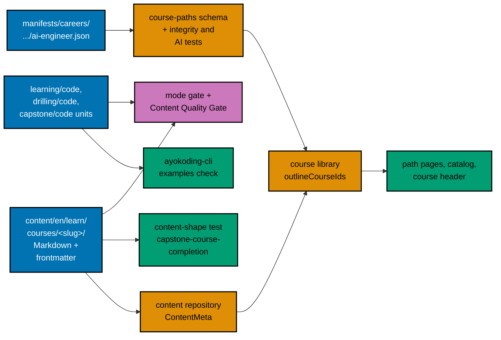

# 001 — Current State and Architecture

All measurements on this page were taken on 2026-10-09 in the authoring worktree, based on
`origin/main` at `bb7f90137`. Plans 01 to 07 change some of these files before this plan runs (the series
executes strictly in order, one plan at a time); Phase 0 re-measures and records the differences.

## The 8 Skeleton Capstones Today

Each skeleton has the same small shape: `_index.md`, `overview.md`, `learning/_index.md`,
`learning/capstone/_index.md`, `learning/capstone/overview.md`, `drilling/_index.md`, and
`drilling/overview.md`. There is **no** `learning/overview.md`, no theme page, no worked example, and no
code folder (one exception, below). The three hand-written pages per course hold between 216 and 395
words in total; all eight together hold 2,143 words (whitespace-split tokens, frontmatter excluded).
The frontmatter has `title`, `date`, `draft`, `weight`, and `prerequisites`. Plan 02 adds `status:
outline` to all eight; plan 03 adds `category`, `description`, and, for an outline, no `format`.

| Weight | Course ID                                | Words | Prerequisites today                                                                                                                                                                                                                                                  |
| ------ | ---------------------------------------- | ----- | -------------------------------------------------------------------------------------------------------------------------------------------------------------------------------------------------------------------------------------------------------------------- |
| 1005   | `capstone-build-your-own-coding-agent`   | 395   | `the-agent-loop`, `agent-tools-and-mcp`, `agent-context-and-memory`, `agent-permissions-and-sandboxing`, `agent-orchestration-subagents-and-observability`, `async-python-and-fastapi-services`, `software-engineering-practices`                                    |
| 1006   | `capstone-build-your-own-pentest-engine` | 290   | `agentic-ai`, the five agent courses, `security-essentials`, `offensive-security`, `defensive-security`, `detection-engineering-and-siem-operations`, `vulnerability-management-and-assessment`, `browser-automation-with-cdp`, `just-enough-typescript` (13 in all) |
| 1007   | `capstone-secure-service`                | 283   | `security-essentials`, `backend-at-scale`, `it-and-application-security`, `offensive-security`, `defensive-security`                                                                                                                                                 |
| 1008   | `capstone-data-pipeline`                 | 216   | `sql-essentials`, `advanced-sql-and-query-performance`, `data-engineering`, `backend-at-scale`, `creating-ai-powered-apps`                                                                                                                                           |
| 1009   | `capstone-concurrency-showdown`          | 219   | `csp-style-concurrency`, `actor-model-concurrency`                                                                                                                                                                                                                   |
| 1010   | `capstone-concurrency-and-systems`       | 237   | `csp-style-concurrency`, `containers-and-orchestration`, `site-reliability-engineering`                                                                                                                                                                              |
| 1011   | `capstone-real-world-delivery`           | 239   | `capstone-solid-core`, `backend-at-scale`, `software-architecture`, `domain-driven-design`, `containers-and-orchestration`, `cloud-and-iac`, `cicd-and-release-engineering`, `it-and-application-security`, `offensive-security`, `defensive-security` (10 in all)   |
| 1012   | `capstone-lead-at-altitude`              | 264   | `capstone-concurrency-and-systems`, `site-reliability-engineering`, `engineering-management`                                                                                                                                                                         |

- **One stray file pair.** `capstone-build-your-own-coding-agent/learning/capstone/code/` holds
  `agent.py` (21 lines: an `approve` function and a fake runner) and `test_agent.py` (13 lines). They
  have no `run.yaml`. The capstone unit replaces them; the `approve` idea is kept as the start of two
  worked examples ([the coding-agent brief](../syllabus/courses/capstone-build-your-own-coding-agent.md)).
- **Start shape.** In plan 03's three shapes for the Start button, these eight are shape 2 (a `learning/`
  folder with no `learning/overview.md`; the Start button falls back to the first learning page, which
  here is the capstone page). After this plan all eight are shape 1. Plan 03 has one real-content E2E
  binding for shape 2, `capstone-data-pipeline`; the exemption that replaces it is in
  [006](./006-e2e-rebinding-and-testing-strategy.md#modified-feature-course-landing-headerfeature-plan-03).
- **Outline anchors.** After plan 07 merges, these eight are the only courses left with `status:
outline`, so some E2E steps written in plans 02 to 04 name one of them as "an outline course"
  ([006](./006-e2e-rebinding-and-testing-strategy.md#outline-anchors-tests-that-use-a-real-outline-course)).
- **Prerequisite readiness.** Every prerequisite is an existing, filled course, with one in-plan
  exception (`capstone-lead-at-altitude` needs `capstone-concurrency-and-systems`). Two prerequisites are
  templated filler courses that plan 09 rewrites later:
  [003](./003-prerequisites-readiness-and-ordering.md#the-two-filler-prerequisites).

## The Five Filled Capstones (Not in Scope)

| Course                            | Words  | Layout                                                             |
| --------------------------------- | ------ | ------------------------------------------------------------------ |
| `capstone-first-working-software` | 9,756  | `overview.md` plus `code/` at the course root; no `learning/`      |
| `capstone-forge-ready`            | 3,009  | Same                                                               |
| `capstone-full-stack-app`         | 7,616  | Same                                                               |
| `capstone-solid-core`             | 17,867 | Same (35 files under `code/`)                                      |
| `capstone-interview-loop`         | 2,867  | `learning/` and `drilling/` pages, plus `code/` at the course root |

None follows the harness layout (units under `learning/code/` and `drilling/code/`), and none is an
Annotated-Concept course with themes. They are not models for this plan; they are the courses that plans
11 to 13 audit. This plan reads them for one reason only: `capstone-solid-core` is a prerequisite of
`capstone-real-world-delivery`, so the delivery capstone ships its own copy of the service shape (rule
CL3 in [003](./003-prerequisites-readiness-and-ordering.md#course-level-coupling)).

## The Career Paths Today

On `main` today, the three software-engineer career paths each list all eight skeleton capstones in their
long tails, and the AI Engineer path lists the coding-agent capstone as its last course. Plan 02 moves the
eight into extension phases of the software-engineer paths (checked in
[003](./003-prerequisites-readiness-and-ordering.md#effect-on-the-four-career-paths)) and, because the
coding-agent capstone is an outline, leaves the AI path with no goal and a hand-curated core of 25 courses.
This plan gives the AI path its goal and a core that is the goal's closure:
[005](./005-ai-path-goal-and-closure.md).

## Where Things Live

- **Course content:** `apps/ayokoding-www/content/en/learn/courses/<slug>/`. `_index.md` files are
  generated by `src/scripts/generate-indexes.ts` (the frontmatter is hand-edited; the bodies are
  generated).
- **Code units:** read only by `apps/ayokoding-cli` (plan 05). The harness never reads Markdown to run
  code, and the content-shape test never runs code.
- **Manifest and tests:** `apps/ayokoding-www/src/features/course-paths/manifests/careers/immediately-effective/ai-engineer.json`,
  plan 02's integrity checks, and the AI manifest tests listed in
  [005](./005-ai-path-goal-and-closure.md#test-changes).
- **Content-shape test:** `apps/ayokoding-www/tests/unit/be-steps/capstone-course-completion.steps.ts`
  (new): headings, floors, links, and safety scans over committed files, with no model in the loop.
- **Gates:** judgement of the lessons and the code, per course, at most 2 cycles each.

## Prior Art in the Repository

| Prior art                                                                | What it gives this plan                                                                                                                                                                     |
| ------------------------------------------------------------------------ | ------------------------------------------------------------------------------------------------------------------------------------------------------------------------------------------- |
| `apps/ayokoding-www/content/en/learn/courses/statistics-for-evaluation/` | The Annotated-Concept exemplar: theme pages, a `capstone/` folder inside `learning/`, and drilling with 24 recall questions, 8 applied problems, 5 katas, 24 checklist items, 6 why-prompts |
| `apps/ayokoding-www/content/en/learn/courses/sql-essentials/`            | The drilling exemplar, with all drill sections in `drilling/overview.md` and katas in `drilling/code/`                                                                                      |
| `apps/ayokoding-www/content/en/learn/courses/engineering-management/`    | An Annotated-Concept no-code course: scenarios, decision artifacts, and no `code/` folder                                                                                                   |
| Plan 06 (accounting courses) and plan 07 (ERP courses)                   | The execution model (maker, mode gate, Content Quality Gate, harness, ledger) that this plan reuses with a cap of 2 cycles                                                                  |
| Plan 05 (code harness)                                                   | The `run.yaml` contract, the toolchain catalog, the determinism and simulation conventions, and the CI design this plan loads                                                               |
| CodeCrafters challenges (<https://codecrafters.io>)                      | External prior art for staged projects: each stage has its own automated test, as each milestone here has its own stage run                                                                 |

The exemplar counts and the benchmark of existing Annotated-Concept courses (17.6k to 26k words, median
near 21.5k) were measured on 2026-10-09 with a read-only scan; they set the floors in
[002](./002-capstone-course-contract-and-modes.md#word-and-hour-targets).
