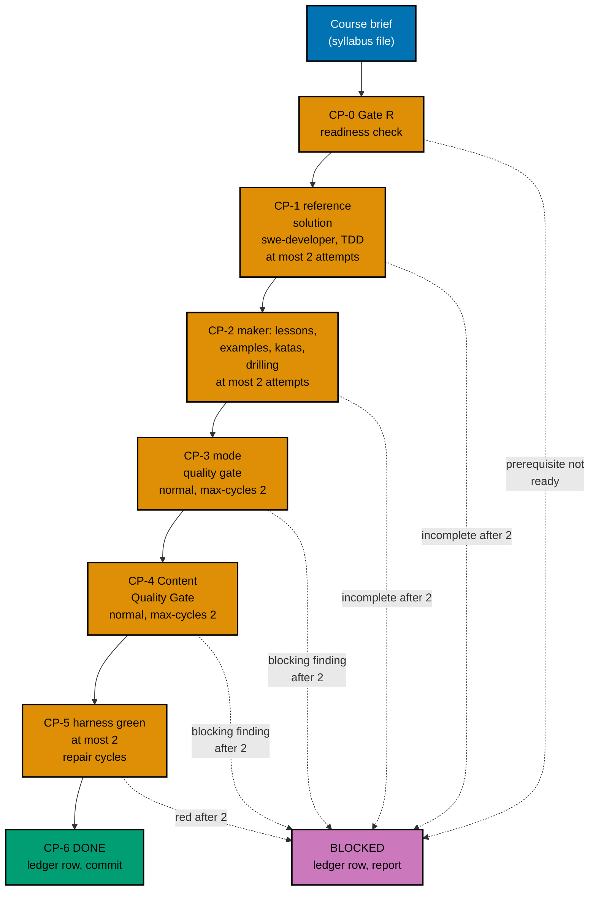

# 007 — Execution Model

Writing eight long courses with working code is most of this plan's work. This page says in which
order the courses are written, who writes and checks each one, how every loop is bounded, what happens
when a course cannot pass, and where the record of it all lives.

The previous plans (01–07) are already merged when this plan starts, because the series executes
strictly in order (decision 42). Nothing in this plan waits for another plan, rebases onto one, or runs
beside one.

## Batches

Courses start in the order of the [waves](./003-prerequisites-readiness-and-ordering.md#waves), at most
three at a time (the repository's N+1 model with N = 3). A batch is the set of courses started together.

| Batch | Courses                                                                                              | Why these together                                                                                                                                                   |
| ----- | ---------------------------------------------------------------------------------------------------- | -------------------------------------------------------------------------------------------------------------------------------------------------------------------- |
| B1    | `capstone-build-your-own-coding-agent`, `capstone-data-pipeline`, `capstone-concurrency-and-systems` | Three independent code courses on three toolchains (`python`; `python` and `postgres`; `go`). The first is the AI path's goal; the third is the lead course's source |
| B2    | `capstone-concurrency-showdown`, `capstone-lead-at-altitude`, `capstone-secure-service`              | The lead course starts only now, because B1 has finished the concurrency capstone it copies figures from                                                             |
| B3    | `capstone-build-your-own-pentest-engine`, `capstone-real-world-delivery`                             | The heaviest courses: the TypeScript toolchain and the safety review, and the offline validators and the longest CI time                                             |

A batch starts when the previous batch is DONE or BLOCKED for every course in it (the lead course also
needs `capstone-concurrency-and-systems` DONE, which B1 guarantees unless it is BLOCKED; if it is, the lead
course is BLOCKED with cause "prerequisite not ready", not started).

## Agent Topology

- **Main thread (coordinator).** Owns the execution ledger, every commit, index generation, every shared
  file (manifests, tests, features, rule files, the CLI), and every phase gate. It keeps its own context
  free and fills background slots first.
- **At most 3 background agents at any time.** Each runs the pipeline below for exactly one course and
  writes only inside that course's folder `apps/ayokoding-www/content/en/learn/courses/<slug>/`, and never
  in its `_index.md` frontmatter. Two agents never write the same file.
- **Who writes what, per course.** The capstone unit (the reference solution, its tests, and its stage
  runs) is testable code, so the repository's SWE delegation rule applies: the coordinator dispatches
  `swe-developer` for it, test first (RED: the `tests` run fails against an empty package; GREEN: the
  stages pass). The lessons, the 45 example units, the katas, and the drilling page are teaching content
  and are written by `apps-ayokoding-www-annotated-concept-maker`, which uses the finished capstone unit
  as the truth the lessons teach. Both read the course brief and the contract in
  [002](./002-capstone-course-contract-and-modes.md).
- **Compute.** Every command runs through `./hippo`, so concurrent harness runs (which start Docker
  containers) wait for HIPPO admission instead of overloading the machine.

The maker agents are told in their packet: English only (series decision 35; the agent's text about
bilingual content does not apply), the course brief is the floor for examples, and the course-level
coupling rule is binding.

## The Per-Course Pipeline

Every step is bounded. A "cycle" is one check-then-fix round. The user set the cap on 2026-10-09: every
gate and every maker-checker loop stops after **2 cycles** ("semua jadi 2 aja"). This replaces the
repository default of 3 that decision 29 first recorded. Plans 05 and 06 already use 2; sibling plans
02–04 may still say 3 and are the user's to reconcile (see [README.md](./README.md#cross-plan-assumptions)).

| Step                    | Who                                                                                             | Input                                                                                                                                          | Done when                                                                                                                                                                                                                                     | Cap                                                                                 |
| ----------------------- | ----------------------------------------------------------------------------------------------- | ---------------------------------------------------------------------------------------------------------------------------------------------- | --------------------------------------------------------------------------------------------------------------------------------------------------------------------------------------------------------------------------------------------- | ----------------------------------------------------------------------------------- |
| CP-0 Gate R             | The coordinator                                                                                 | The brief and the prerequisites' current state                                                                                                 | Checks R-1 to R-4 in [003](./003-prerequisites-readiness-and-ordering.md#gate-r-prerequisite-readiness) pass; the maker's first act in CP-2 is to build the `relies-on` table                                                                 | One run; a failure is BLOCKED                                                       |
| CP-1 Reference solution | `swe-developer`; the no-code course has none                                                    | The brief's project, milestones, acceptance criteria, [004](./004-code-harness-and-determinism-design.md)                                      | The capstone unit exists with `run.yaml`; every stage run and `tests` exit 0 on the agent's own run; the unit has a test that fails when a stage is broken                                                                                    | 2 attempts; the second continues from the first's files                             |
| CP-2 Make               | `apps-ayokoding-www-annotated-concept-maker`                                                    | The brief, [002](./002-capstone-course-contract-and-modes.md), [004](./004-code-harness-and-determinism-design.md), the finished capstone unit | Every page and every unit in the brief exists; `examples validate`, `sync`, and `check --course <slug>` exit 0 on the maker's own run; every recorded expected file was read; the prerequisite edits are made; the `relies-on` table is built | 2 attempts; a second attempt continues from the first's files and never starts over |
| CP-3 Mode gate          | The Tutorial Annotated Concept Quality Gate                                                     | `subject` = the course folder, `mode: normal`, `max-cycles: 2`                                                                                 | Verdict `PASS` or `PASS_WITH_FINDINGS`                                                                                                                                                                                                        | 2 cycles (the gate's own input)                                                     |
| CP-4 Content gate       | The Content Quality Gate                                                                        | The same inputs, plus the safety boundary for the three security-flavoured courses                                                             | Verdict `PASS` or `PASS_WITH_FINDINGS`                                                                                                                                                                                                        | 2 cycles                                                                            |
| CP-5 Harness green      | The coordinator runs `examples check --course <slug>`; a repair goes back to the course's maker | The course folder after the gates' fixers                                                                                                      | Exit 0; the safety search of [004](./004-code-harness-and-determinism-design.md#safety-checks-for-security-courses) is clean for the three; shared copies are identical                                                                       | 2 repair cycles                                                                     |
| CP-6 Record             | The coordinator                                                                                 | The reports and exit codes                                                                                                                     | A ledger row with every field below, and one commit for the course                                                                                                                                                                            | —                                                                                   |

The harness also runs inside CP-1 and CP-2, because an author must hand over code that works. CP-5 still
runs after the gates, because the gates' fixers may edit lessons or code; it is the step decision 29
names.

A gate verdict of `FAIL` or `BLOCKED` after its second cycle, or any open `needs-decision` finding, makes
the course BLOCKED. No verdict stops the batch.

`status: outline` stays on every course during the batches. All eight drop it together in the metadata
phase of [../delivery.md](../delivery.md), because the drift test that prints `estimatedHours` covers
only non-outline courses, and because plan 02's rules for the AI path need the goal course to leave the
outline state in one step with the manifest.

## Blocked Courses

A course is **BLOCKED** when a step reaches its cap without passing, when Gate R fails, or when the CI
budget rung 4 applies. Then:

1. The coordinator records it in the ledger with the step, the cycle count, and every open finding.
2. It reports the course to the user in one short message (course, step, top findings) and continues with
   the next course. A course that needs a BLOCKED course (only the lead course needs one) is BLOCKED too,
   with the cause recorded.
3. The BLOCKED course keeps `status: outline` and its partial pages stay uncommitted in the worktree.
4. After the last batch, the plan stops at a `[HUMAN]` decision before the metadata and manifest phases,
   because a BLOCKED capstone would leave an outline course and break the end-state gate (decision 40),
   and, for the coding agent, plan 02's no-outline-in-core rule (R5). The user chooses for each BLOCKED
   course, for example to authorise more cycles for that one or to change the plan's scope. The plan does
   not continue until every BLOCKED course is resolved.

There is no WAITING state. Plan 09 and the audit plans run after this plan, so nothing here waits for them
([003](./003-prerequisites-readiness-and-ordering.md#gate-r-prerequisite-readiness)).

## The Execution Ledger

The ledger is the running record of the batches. It lives in the execution worktree at
`local-tmp/ayokoding-learn/execution-ledger.md` (gitignored scratch, shared by the series), under a
heading `## Plan 08 — capstone courses`. One row per course:

| Field              | Example                                                       |
| ------------------ | ------------------------------------------------------------- |
| Course             | `capstone-concurrency-and-systems`                            |
| Batch and mode     | B1, annotated-concept (standard)                              |
| Gate R             | pass, or the failed check                                     |
| Edge changes       | `+just-enough-go (A-L1)`                                      |
| Reference solution | agent ID, attempts, stage runs green                          |
| Maker agent ID     | the agent ID the harness reports                              |
| Maker attempts     | 1                                                             |
| Mode gate          | 2 cycles, `PASS_WITH_FINDINGS`, report path                   |
| Content gate       | 1 cycle, `PASS`, report path                                  |
| Harness            | exit 0, 0 repair cycles, units 51, runs 102, measured minutes |
| Safety search      | clean, or the recorded harmless hits (security courses only)  |
| Words, examples    | 24,310 words, 45 examples, 7 diagrams                         |
| `estimatedHours`   | filled at the metadata phase                                  |
| Status             | DONE or BLOCKED                                               |
| Open findings      | — or the list                                                 |
| Commit             | the short SHA                                                 |

Plan-level rows: the CI projection and the measured minutes after each batch, the rung of the response
ladder taken, and the outline-anchor scenarios found and edited.

At the end the coordinator copies the table (without scratch paths) into
`<plan>/evidence/execution-summary.md`, which is committed, so the record survives the worktree's
cleanup. Only this named ledger location is referred to; no plan document links into `local-tmp/`.

## Commits

One commit per DONE course, made by the coordinator after CP-6:
`feat(ayokoding-www): write <slug> capstone course`. It stages only that course's folder, the course's
`_index.md` `prerequisites` edit, and the regenerated `_index.md` files that belong to the course.
Indexes are regenerated by the coordinator once per batch, never by a background agent, and the
coordinator then confirms with `rtk git status --short` that nothing under
`apps/ayokoding-www/content/id/` changed; if something did, it restores those files with
`rtk git checkout -- apps/ayokoding-www/content/id` before committing. Other commits: one each for the
CI shard rule (if needed), the metadata flip and completion test, the AI path, the E2E rebinding, the
rules and docs, then evidence and the archival move. Stage explicit paths only; never
`apps/ayokoding-www/next-env.d.ts` or `.serena/project.yml`.

## What the Coordinator Checks Between Batches

- Every course in the batch is DONE or BLOCKED and has a ledger row.
- `examples check` for every DONE course in the batch still exits 0 (a later fix must not break an
  earlier course).
- Plan 02's integrity tests and the plan 03 metadata tests still pass after the batch's `prerequisites`
  edits (`ayokoding-www:test:unit` for the named files).
- The CI projection is updated with the batch's measured minutes
  ([004](./004-code-harness-and-determinism-design.md#run-time-budget)) and the response-ladder rung is
  decided.
- `rtk git status --short` shows only the batch's course folders and their indexes.
- Every five minutes while only background work is running, the coordinator updates the user (the
  repository's polling rule); CI is polled every two minutes and `gh run watch` is never used.

## Recovery

- **Interrupted session.** The ledger is the source of truth for the batches. Reconcile it with
  `rtk git status --short` and `rtk git log --oneline origin/main..HEAD`: a course with a commit is DONE; a
  course folder with uncommitted changes and no BLOCKED row is in progress. Resume that course at the
  step and cycle the ledger shows; never reset a cycle count, and never start an attempt that would
  exceed 2.
- **A background agent stopped mid-course.** Its files stay in the course folder. The next attempt, if
  one is left, continues from those files.
- **A wrong commit.** Revert it with a new commit (`rtk git revert <sha>`); never rewrite pushed history.
