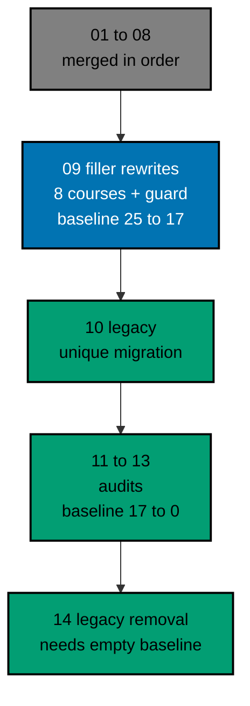

# AyoKoding Learn Revamp 09 — Filler Course Rewrites

> **Status:** Backlog. Do not execute until both are true: the user gives an explicit execution
> command, and plans 01 to 08 of this series have merged to `origin/main`. The 14 plans run strictly
> one after another (series decision 42), so plan 08 is merged, deployed, verified, and cleaned up
> before this plan starts.
>
> **Plan quality gate:** not run yet, so no verdict exists. By the user's decision of 2026-10-09 it
> was not run while the plan was written; it runs at the start of execution, as the first item of
> Phase 0 in [delivery.md](./delivery.md#phase-0-worktree-environment-preconditions-and-baseline),
> with `max-cycles` 2.

Eight AyoKoding courses look finished and are not. Each has a full set of pages and about 80 examples,
but the examples are the same few sentences with a different number or name swapped in, and the code
repeats in the same way. On 2026-10-09 their unique-body ratios were between 0.01 and 0.06 (no other course scores below 1.00), and one of
them, `build-your-own-git`, has 79 code files that hash a wrong header (a backslash and a zero where
Git writes a NUL byte), so none of its object ids match real Git. This plan writes all eight again
from scratch as real courses with runnable, tested code. It also adds a permanent test that tells a
templated course from a written one, so no course in the library can slip back into filler.

## Scope

- **Rewrite eight courses** to the series definition of done (decision 27): `build-your-own-git`,
  `compilers-parsers-and-transpilers`, `type-systems`, `lisp`, `enterprise-java-and-the-jvm`,
  `defensive-security`, and `vulnerability-management-and-assessment` in By Example mode, and
  `just-enough-fsharp` in Primer mode. Each course has a mode with a reason, learning objectives, an
  example list, a full drilling page, and a capstone. Each meets the mode's word, example, and diagram
  targets, passes its mode quality gate and the Content Quality Gate with no blocking finding, and
  runs all its code green in plan 05's example harness. See
  [tech-docs/002](./tech-docs/002-course-modes-and-definition-of-done.md) and the brief of each course in
  [syllabus/courses](./syllabus/courses/README.md).
- **Fix the Git course's hashing bug** at its root. Every object id is proven against real Git by a
  shell unit and a shared vectors file, and a test forbids the literal bug. See
  [tech-docs/004](./tech-docs/004-code-harness-and-determinism.md).
- **A permanent filler guard** (decision 40): a deterministic TypeScript unit test with six structural
  rules, a closed baseline that can only shrink, and an interface that plan 14 calls. Every course, not
  only these eight, must pass it. See [tech-docs/003](./tech-docs/003-filler-guard.md).
- **Runnable code everywhere.** Every example, kata, and capstone is a harness unit with a deterministic
  `run.yaml`. Languages come from plan 05's catalog (Python, F# on .NET, TypeScript, OCaml, Rust, Racket,
  Java, and the shell). This plan adds a `clojure` catalog entry and a hash-locked jar recipe for
  `java`, through plan 05's "Adding a Toolchain".
- **Safe security content.** The two security courses keep their safe-lab promise and gain a test that
  allows only reserved addresses. They keep teaching the four concepts that three of plan 08's
  capstones rely on, and the plan re-reads those capstone rows before merge. See
  [tech-docs/005](./tech-docs/005-security-content-and-accuracy.md).
- **Metadata.** All eight courses drop `status: outline` (where present) and get plan 03's metadata with a
  real `estimatedHours` from plan 03's drift test. Three courses get a prerequisite change if plan 02's
  integrity rules stay green.
- **Rules and docs.** Three rules (FILL1, FILL2, SEC1) get a durable home in a skill reference module,
  and the repository's docs that describe the checks are updated. See
  [tech-docs/010](./tech-docs/010-rule-and-docs-impact.md).

## Non-Goals

- The 17 other courses the guard flags. They stay in the baseline, each with an owner among plans 11, 12,
  and 13, until those plans fix them.
- Any change to a career path, manifest, or catalog datum. The eight courses stay where they are, and
  other plans depend only on their slugs and URLs (checked in Phase 0).
- The 24 accounting courses, the 30 ERP courses, and the 8 capstones (plans 06 to 08).
- Migrating unique content from the legacy tracks (plan 10) and removing `learn/legacy` (plan 14).
- Any change to plan 05's harness beyond the `clojure` entry and the `java` recipe, or to plan 04's
  roadmap code.
- Indonesian content: `content/id/**` stays untouched (decision 35).
- Real exploit code, real targets, or any use of a public address in the security courses.

## Dependency and Result

The series runs strictly in order, one plan, one worktree, and one PR at a time (series decision 42),
so plans 01 to 08 are all merged when this plan starts. This plan builds directly on plan 03 (course
metadata) and plan 05 (code harness). It also relies on plan 02 (the path integrity rules that guard the
prerequisite changes), plan 08 (the `relies-on` handoff for the security courses), and plan 04 (any
course page convention it added, read in Phase 0).

When this plan ends, the eight courses pass the filler guard, have no `status: outline`, reach the
28,000-word floor, and are green in the harness. The filler baseline holds 17 courses, each with an
owner, and shrinks only.

## Series Context

This plan is row 09 of the 14-plan **AyoKoding Learn Revamp** series. Each plan is one PR delivered
from its own worktree, and the plans run strictly in numeric order; the "Depends on" column shows
which earlier plans each one builds on. The user resolved the series decisions on 2026-10-09; every
decision this plan relies on is copied into
[brd.md](./brd.md#resolved-series-decisions-this-plan-relies-on).

| NN  | Plan suffix                   | Scope                                                                                        | Depends on       |
| --- | ----------------------------- | -------------------------------------------------------------------------------------------- | ---------------- |
| 01  | `navigation-and-display`      | Strip `NN ·` title prefixes; path position numbers; sidebar auto-scroll; render fixes        | —                |
| 02  | `path-model`                  | Phases, goals, `assumes`, outline marker, prerequisite revision, closure checks, career copy | 01               |
| 03  | `catalog-and-metadata`        | Course metadata schema and backfill, categories, catalog page, course landing header         | 01               |
| 04  | `learning-experience`         | Browser progress, phase roadmap page, context bar, mark complete, Learn home                 | 02, 03           |
| 05  | `code-harness`                | `ayokoding-cli`, `run.yaml` contract, runners, Nx target, CI, quality-gate propagation       | —                |
| 06  | `accounting-courses`          | Write 24 accounting courses; restructure both accounting paths in the same PR                | 02, 03, 05       |
| 07  | `erp-courses`                 | Write 30 ERP courses; restructure both ERP paths in the same PR                              | 06               |
| 08  | `capstone-courses`            | Rewrite 8 skeleton capstones                                                                 | 02, 03, 05       |
| 09  | `filler-rewrites` (this plan) | Rewrite 8 templated filler courses                                                           | 03, 05           |
| 10  | `legacy-unique-migration`     | Build courses for legacy topics without an equivalent; record the legacy-to-course map       | 03, 05           |
| 11  | `audit-languages-and-tooling` | Audit and fix language and tooling courses                                                   | 05               |
| 12  | `audit-cs-systems-and-data`   | Audit and fix CS, systems, concurrency, distributed, database, and data courses              | 05               |
| 13  | `audit-product-security-ai`   | Audit and fix web, backend, mobile, security, AI, testing, architecture, product courses     | 05               |
| 14  | `legacy-removal`              | Delete `learn/legacy`, add 308 redirects, repoint `docs/` links, update specs and tests      | 10 (+11–13 done) |

The "Depends on" column lists the plans a plan builds on most directly. Plan 09 also relies on plan 02
(its integrity rules check the three prerequisite changes), plan 08 (the `relies-on` handoff for the
security courses), and plan 04 (course page conventions, read in Phase 0). Because the plans run in
order, all three are merged when this plan starts.

## How the Work Runs

The courses are written in three waves in prerequisite order, by at most three background agents at a
time. Wave 1 is `build-your-own-git`, `just-enough-fsharp`, and `defensive-security`; wave 2 is
`type-systems`, `lisp`, and `enterprise-java-and-the-jvm`; wave 3 is `compilers-parsers-and-transpilers`
and `vulnerability-management-and-assessment`. Each course goes maker → mode quality gate → Content
Quality Gate → harness green → filler guard, and every loop stops after 2 cycles (the user's cap,
2026-10-09: "semua jadi 2 aja"). A course that still fails is marked BLOCKED in
`local-tmp/ayokoding-learn/execution-ledger.md`, reported, and the wave moves on; the plan then stops
for the user before the end-state steps. The guard and its baseline are built first, test-first, so every
course is measured against it as it lands. See [tech-docs/006](./tech-docs/006-execution-model.md).

## Navigation

- [Business requirements](./brd.md)
- [Product requirements, Gherkin, and UI design funnel](./prd.md)
- [Technical design](./tech-docs/README.md)
- [Syllabus corpus (8 course briefs and a paths index)](./syllabus/README.md)
- [Delivery checklist](./delivery.md)
- [Execution learnings](./learnings.md)
