# Delivery Plan — AyoKoding Learn Revamp 09: Filler Course Rewrites

> **Legend** — `[AI]`: an agent performs the step (the default; unmarked steps are `[AI]`).
> `[HUMAN]`: only a human can do it (physical action, out-of-band approval, real-secret or
> privileged-credential handling). `[AI+HUMAN]`: agent prepares, human approves or finishes.

**Do not start** until both are true: (1) the user gives an explicit execution command for this
plan — that command authorizes this plan's change set (commits, pushes, PR, merge, and the deploy
described below); (2) plans 01 to 08 of this series have merged to `origin/main`, deployed, been
verified, and had their worktrees cleaned up. The series runs strictly one plan at a time (series
decision 42), so no other series plan runs while this one does, and no rebase between plans is
needed. The user's words (2026-10-09): "jangan kerjain/implement plan ini sebelum gw
kasih perintah buat eksekusi ya" (do not implement this plan until I give the command to execute it).

**Plan quality gate:** not run yet, so no verdict exists. By the user's decision of 2026-10-09 it was
not run while the plan was written. It runs at the start of execution, as the first item of
[Phase 0](#phase-0-worktree-environment-preconditions-and-baseline), with `max-cycles` 2; its verdict
line is recorded here only then.

## Worktree

- **Execution worktree:** `worktrees/ayokoding-learn-revamp-09-filler-rewrites/`
- **Provisioning command** (from the repository root, at Step 0):
  `claude --worktree ayokoding-learn-revamp-09-filler-rewrites`, or the equivalent
  `rtk git worktree add -b ayokoding-learn-revamp-09-filler-rewrites-base worktrees/ayokoding-learn-revamp-09-filler-rewrites origin/main`.
- **Provisioning status:** pending
- **Authoring-worktree exception:** this plan was authored inside the separate authoring worktree
  `.claude/worktrees/ayokoding-update` (branch `worktree-ayokoding-update`). The user required that
  session to write all plans of the AyoKoding Learn Revamp series together and not to execute any of
  them before the user's command. That authoring worktree is **never** used for execution. The
  Provisioned Worktree Identity and the Delivery Branch Inventory are intentionally omitted until
  Step 0 creates them.
- **Step 0 obligation (blocking):** Phase 0's first outcome after the plan quality gate provisions
  the execution worktree from
  fresh `origin/main` per the
  [Worktree Path Convention](../../../repo-governance/conventions/structure/worktree-path.md),
  initializes it per
  [Worktree Toolchain Initialization](../../../repo-governance/development/workflow/worktree-setup.md),
  writes the immutable identity and the first inventory row into this section, replaces
  `Provisioning status: pending` with `Provisioning status: provisioned`, and syncs with
  `origin/main`. No implementation step may start while the status is pending.
- **Cleanup:** after the PR merges, the worktree, its branches, and this plan's scratch come down
  through [Dev Artifact Clean-Up](../../../repo-governance/workflows/maintenance/dev-artifact-clean-up.md)
  (Phase 12).
- **Worktree cap:** one worktree for this plan in this repository, reused by every phase.

The plan never records an absolute or machine-specific path. Resolve the declared route at runtime
and reconcile it with `rtk git worktree list --porcelain`. Never move the session's working directory
outside the execution worktree.

## Delivery Mode: worktree-to-pr

`worktree-to-pr` is mandatory in this repository. One branch and **one PR** deliver the whole plan
(series rule "one plan = one PR"; [tech-docs/008 D13](./tech-docs/008-decision-records.md#d13--one-pr-for-the-guard-and-the-eight-courses)).
The PR needs the exact current-head/base `Quality gate` from `.github/workflows/pr-quality-gate.yml` and
an exact-head posted `pr-leak-review` `pass` (`leak-review` status). Broad semantic PR review is not run
unless the user asks for it. `[AI]` merges once the hardened merge preconditions hold.

## Parallelization Model

The eight courses are written in three waves in prerequisite order ([tech-docs/006](./tech-docs/006-execution-model.md)).
Inside a wave, up to three background agents each write one course; a wave starts only when every course
of the waves it needs is DONE or BLOCKED. Every shared file (the baseline module, the completion test,
the catalog, the skill reference, the indexes, `_index.md` frontmatter) is touched by the coordinator in a
serial step.

```mermaid
%% Color Palette: Blue #0173B2, Orange #DE8F05, Teal #029E73, Purple #CC78BC
flowchart TD
  accTitle: Plan 09 execution order
  accDescr: Phase 0 sets up and records a baseline. Phase 1 builds the filler guard, its baseline of 25 courses, and the completion test, test first. Phase 2 adds the clojure and java toolchain changes and runs eleven probes. Phases 3 to 5 write the courses in three waves with up to three agents each. A human stop reviews blocked courses and the Java risk. Then the end-state scenario and capstone handoff, rules and docs, the end-state gate, manual checks, knowledge capture, and the delivery boundary run in order.
  P0["0 setup and baseline"] --> P1["1 guard, baseline,<br/>completion test"]
  P1 --> P2["2 toolchains<br/>and probes P1-P11"]
  P2 --> P3["3 wave 1<br/>git, F#, defensive"]
  P3 --> P4["4 wave 2<br/>types, lisp, java"]
  P4 --> P5["5 wave 3<br/>compilers,<br/>vulnerability"]
  P5 --> P6["6 human stop:<br/>BLOCKED, Java risk"]
  P6 --> P7["7 end-state scenario<br/>and capstone handoff"]
  P7 --> P8["8 rules, docs, C4"]
  P8 --> P9["9 end-state gate"]
  P9 --> P10["10 manual<br/>and testers"]
  P10 --> P11["11 knowledge capture"]
  P11 --> P12["12 boundary:<br/>archive, PR,<br/>merge, cleanup"]

  classDef serial fill:#0173B2,stroke:#000000,color:#FFFFFF,stroke-width:2px
  classDef parallel fill:#CC78BC,stroke:#000000,color:#000000,stroke-width:2px
  classDef human fill:#DE8F05,stroke:#000000,color:#000000,stroke-width:2px
  classDef gate fill:#029E73,stroke:#000000,color:#000000,stroke-width:2px
  classDef default fill:#FFFFFF,stroke:#000000,color:#000000
  class P0,P1,P2,P7,P8 serial
  class P3,P4,P5 parallel
  class P6 human
  class P9,P10,P11,P12 gate
```

### Delivery Boundaries

| Phase(s) | Natural cohesive seam                                                      | Worktree                                               | Branch                                      | Delivery opportunity             | Exact resulting `main` / rollback / feature-flag evidence                                                                                                                                                                                                                                                                                                                                                                                                                                         |
| -------- | -------------------------------------------------------------------------- | ------------------------------------------------------ | ------------------------------------------- | -------------------------------- | ------------------------------------------------------------------------------------------------------------------------------------------------------------------------------------------------------------------------------------------------------------------------------------------------------------------------------------------------------------------------------------------------------------------------------------------------------------------------------------------------- |
| 0        | — (setup and baseline)                                                     | —                                                      | —                                           | none                             | No resulting state change; no PR; flag not applicable                                                                                                                                                                                                                                                                                                                                                                                                                                             |
| 1–12     | The filler guard with its baseline, and the eight courses it was built for | `worktrees/ayokoding-learn-revamp-09-filler-rewrites/` | `ayokoding-learn-revamp-09-filler-rewrites` | PR opened and merged in Phase 12 | `main` gets the guard and its closed baseline (25 courses, then 17), the completion test, the `clojure` toolchain entry and the `java` jar recipe, the eight rewritten courses, and the skill reference together. Rollback: revert the merge commit in a revert PR (the eight old courses and the 25-entry baseline come back together). Feature-flag lifecycle: not applicable, because no flag is created ([D14](./tech-docs/008-decision-records.md#d14--no-feature-flag)); nothing to remove. |

### Agent Topology

- **Main thread (coordinator):** owns the execution ledger, every gate, every commit, index
  generation, and every shared file. It keeps itself free and fills background slots first.
- **At most 3 background agents at any time** (N = 3):
  - Phases 3–5: one maker per course — `apps-ayokoding-www-by-example-maker` (seven courses) or
    `apps-ayokoding-www-primer-maker` (`just-enough-fsharp`). Each writes only inside
    `apps/ayokoding-www/content/en/learn/courses/<slug>/`, never the `_index.md` frontmatter.
  - The gates run the checker and fixer agents the gate workflows name, inside that course's slot.
  - Phase 1: `specs-maker` (Gherkin), then one `swe-developer` (tests and code), in sequence because
    they share step files.
  - Phase 2: one `swe-developer` for the two toolchain changes (both edit the catalog, so they run one
    after the other); a second `swe-developer` may run probes P1–P8 and P11 beside it, because those
    probes only read the catalog and write scratch files. Probes P9 and P10 wait for the toolchain
    builds.
  - Phase 7: one `swe-developer` (the end-state scenario and its step).
  - Phase 8: `rules-maker`, then `docs-fixer` and `readme-fixer`.
  - Phase 10: `swe-web-tester` (exploratory and design charters) and `swe-usability-tester`.
- Record every agent ID, its file set, its step, and its cycle count in the execution ledger.

### Execution Packet Defaults

- **Plan path after promotion:** `plans/in-progress/ayokoding-learn-revamp-09-filler-rewrites/`
  (written below as `<plan>/`). Evidence goes to `<plan>/evidence/`.
- **Execution ledger:** `local-tmp/ayokoding-learn/execution-ledger.md` in the execution worktree,
  under the heading `## Plan 09 — filler rewrites`, with the fields in
  [tech-docs/006](./tech-docs/006-execution-model.md#the-execution-ledger). Other scratch (raw output,
  curl bodies, probe courses, patches of BLOCKED courses) lives in `local-tmp/ayokoding-learn/plan-09/`
  (gitignored).
- **No ad-hoc scripts (series decision 37).** Checks run through the app's tests and `ayokoding-cli`.
  Read-only inspection with `rtk git grep`, `rtk git diff`, `rtk git ls-tree`, `rtk jq`, and `rtk wc -w`
  is fine.
- **Evidence hygiene:** evidence files contain repository-relative paths only. Never paste an
  absolute home-directory path, a hostname, a token, or `.env*` content.
- **Never commit** `apps/ayokoding-www/next-env.d.ts` (the dev server rewrites it) or
  `.serena/project.yml`. Before every commit run `rtk git status --short` and restore either file with
  `rtk git checkout -- <file>` if it shows as modified.
- **Indonesian content stays untouched (decision 35).** `GEN-INDEXES` and `DEV` regenerate indexes for
  both locales. After each run, `rtk git status --short -- apps/ayokoding-www/content/id` must be
  empty; if not, run `rtk git checkout -- apps/ayokoding-www/content/id`.
- **Never touch** `.env.prod` or `.env.stag`. If the dev server needs a variable, copy the key from
  `apps/ayokoding-www/.env.example` into an uncommitted `apps/ayokoding-www/.env.local`.
- **No git identity changes.** Never run `git config user.*`. Never use a bare `git stash`.
- **Bounded loops (user, 2026-10-09: "semua jadi 2 aja"):** every quality gate runs with
  `max-cycles: 2`, and every maker→checker loop runs at most 2 cycles. A course still failing after
  its second cycle is **BLOCKED**: record it in the ledger, report it to the user, and move on. Any
  other file still failing after its second cycle is recorded as BLOCKED and the phase gate stays open
  until the user decides. Only the user's words change a cap.
- **Failure handling:** on any unexpected failure, save the output to the phase evidence file, fix the
  root cause (never skip, retry-until-green, loosen, widen, or delete a test), rerun the same command,
  and note the fix. A harness defect is fixed in `apps/ayokoding-cli` with a regression test (plan 05's
  M11), never by weakening a course check. A flaky run is a defect at its root (a clock, a seed, a
  thread order, a CPU count), never a reason to retry.
- **Facts are probes (rule A3).** Every version, default, count, and policy in a brief is fetched again
  at execution, recorded with its value, source, and access date, and the brief is corrected when the
  world differs. The same rule applies to the Phase 2 toolchain versions.

> **Important**: Fix ALL failures found during quality gates, not just those caused by your
> changes. This follows the root cause orientation principle — proactively fix preexisting
> errors encountered during work.

### Command Reference

Run every command from the execution worktree root. Expected results are stated at each use.

| Name                 | Command                                                                                                                                                                                                                                                                                   |
| -------------------- | ----------------------------------------------------------------------------------------------------------------------------------------------------------------------------------------------------------------------------------------------------------------------------------------- |
| `UNIT-FE <file>`     | `rtk ./hippo run --class ephemeral --resource-tier standard --disk-path . --cwd apps/ayokoding-www -- npx vitest run --project unit-fe <file>`                                                                                                                                            |
| `UNIT-NODE <file>`   | `rtk ./hippo run --class ephemeral --resource-tier standard --disk-path . --cwd apps/ayokoding-www -- npx vitest run --project unit <file>`                                                                                                                                               |
| `QUICK`              | `rtk ./hippo run --class ephemeral --resource-tier standard --disk-path . -- npm exec nx -- run ayokoding-www:test:quick`                                                                                                                                                                 |
| `INTEGRATION`        | `rtk ./hippo run --class ephemeral --resource-tier heavy --disk-path . -- npm exec nx -- run ayokoding-www:test:integration`                                                                                                                                                              |
| `BEHAVIOUR`          | `rtk ./hippo run --class ephemeral --resource-tier standard --disk-path . -- npm exec nx -- run ayokoding-www:test:coverage:behaviour`                                                                                                                                                    |
| `E2E-BEHAVIOUR`      | `rtk ./hippo run --class ephemeral --resource-tier standard --disk-path . -- npm exec nx -- run ayokoding-www-fe-e2e:test:coverage:behaviour`                                                                                                                                             |
| `BE-E2E-BEHAVIOUR`   | `rtk ./hippo run --class ephemeral --resource-tier standard --disk-path . -- npm exec nx -- run ayokoding-www-be-e2e:test:coverage:behaviour`                                                                                                                                             |
| `E2E-QUICK`          | `rtk ./hippo run --class ephemeral --resource-tier standard --disk-path . -- npm exec nx -- run ayokoding-www-fe-e2e:test:quick`                                                                                                                                                          |
| `E2E`                | `rtk ./hippo run --class ephemeral --resource-tier heavy --disk-path . -- npm exec nx -- run ayokoding-www-fe-e2e:test:e2e`                                                                                                                                                               |
| `BUILD`              | `rtk ./hippo run --class ephemeral --resource-tier heavy --disk-path . -- npm exec nx -- run ayokoding-www:build`                                                                                                                                                                         |
| `GEN-INDEXES`        | `rtk ./hippo run --class transactional --resource-tier standard --disk-path . -- npm exec nx -- run ayokoding-www:generate-indexes`                                                                                                                                                       |
| `VALIDATE-INDEXES`   | `rtk ./hippo run --class ephemeral --resource-tier standard --disk-path . -- npm exec nx -- run ayokoding-www:validate-indexes`                                                                                                                                                           |
| `DEV`                | `rtk ./hippo run --class service --resource-tier standard --disk-path . -- npm exec nx -- dev ayokoding-www` (serves `http://localhost:3101`)                                                                                                                                             |
| `LINT-MD`            | `rtk ./hippo run --class ephemeral --resource-tier standard --disk-path . -- npm run lint:md`                                                                                                                                                                                             |
| `CLI-BUILD`          | `rtk ./hippo run --class ephemeral --resource-tier standard --disk-path . -- npm exec nx -- run ayokoding-cli:build`                                                                                                                                                                      |
| `CLI-QUICK`          | `rtk ./hippo run --class ephemeral --resource-tier standard --disk-path . -- npm exec nx -- run ayokoding-cli:test:quick`                                                                                                                                                                 |
| `CLI-E2E`            | `rtk ./hippo run --class ephemeral --resource-tier heavy --disk-path . -- npm exec nx -- run ayokoding-cli:test:e2e`                                                                                                                                                                      |
| `CLI <args>`         | `rtk ./hippo run --class ephemeral --resource-tier heavy --disk-path . -- apps/ayokoding-cli/dist/ayokoding-cli <args>`                                                                                                                                                                   |
| `FIXTURE <args>`     | `CLI --content apps/ayokoding-cli/tests/testdata/courses <args>`                                                                                                                                                                                                                          |
| `SMOKE`              | `CLI --content apps/ayokoding-cli/tests/testdata/toolchain-smoke examples check --all`                                                                                                                                                                                                    |
| `EX-VALIDATE <slug>` | `CLI examples validate --course <slug>`                                                                                                                                                                                                                                                   |
| `EX-SYNC <slug>`     | `CLI examples sync --course <slug>` (add `--write` to repair anchored fences)                                                                                                                                                                                                             |
| `EX-RECORD <slug>`   | `CLI examples run --course <slug> --record` (writes only missing expected files)                                                                                                                                                                                                          |
| `EX-CHECK <slug>`    | `CLI examples check --course <slug>`                                                                                                                                                                                                                                                      |
| `EX-COVERAGE`        | `CLI --output json examples coverage`                                                                                                                                                                                                                                                     |
| `EXAMPLES`           | `rtk ./hippo run --class ephemeral --resource-tier heavy --disk-path . -- npm exec nx -- run ayokoding-www:examples:check` (add `--configuration=full` for a full run)                                                                                                                    |
| `RUFF <files>`       | `rtk ./hippo run --class ephemeral --resource-tier standard --disk-path . -- ruff format --no-cache <files>`                                                                                                                                                                              |
| `UV-LOCK <slug>`     | `rtk ./hippo run --class transactional --resource-tier standard --disk-path . -- uv pip compile --generate-hashes apps/ayokoding-www/content/en/learn/courses/<slug>/learning/code/requirements.in -o apps/ayokoding-www/content/en/learn/courses/<slug>/learning/code/requirements.lock` |

Four names are new in this plan. Each is a shorthand over `UNIT-NODE`, and Phase 0 replaces a file name
with the merged one where plans 03 or 06 renamed it:

| Name         | Command                                                                                                                                                     |
| ------------ | ----------------------------------------------------------------------------------------------------------------------------------------------------------- |
| `GUARD`      | `UNIT-NODE tests/unit/be-steps/course-filler.steps.ts --reporter=verbose` (prints the guard's metrics table for every course through `console.info`)        |
| `COMPLETION` | `UNIT-NODE tests/unit/be-steps/filler-course-completion.steps.ts`                                                                                           |
| `DRIFT`      | `UNIT-NODE tests/unit/be-steps/course-metadata.steps.ts` (plan 03's metadata drift test; it prints "Expected estimatedHours for every non-outline course:") |
| `INTEGRITY`  | `UNIT-NODE tests/unit/features/course-paths/manifests/path-model-integrity.unit.test.ts` (plan 02's integrity rules)                                        |

`UNIT-FE` runs files under `tests/unit/fe-steps/` and `tests/unit/features/**/*.test.{ts,tsx}`; `UNIT-NODE`
runs `*.unit.test.ts` files and `tests/unit/be-steps/`. Paths after these two commands are relative to
`apps/ayokoding-www/`. The guard's pure tests (`tests/unit/features/content/core/*.test.ts`) run with
`UNIT-FE`; the scanner test and every step file run with `UNIT-NODE`. `CLI` uses the default content root
`apps/ayokoding-www/content/en/learn/courses`; build it with `CLI-BUILD` after any CLI or catalog change
(the catalog is embedded). Every `EX-*` command accepts more than one `--course`. If Phase 0 records
different merged names for any target or command, use the merged names everywhere below.

### Commit Guidelines

- [ ] [AI] Do not stage or commit until the user's execution command has authorized this plan's
      change set; do not extend a commit beyond it.
- [ ] [AI] Use the fewest build-valid, independently reviewable and revertible commits, one coherent
      purpose each: one for the guard (Phase 1), one for the toolchain changes (Phase 2), **one per DONE
      course** (`feat(ayokoding-www): rewrite <slug> course`), one each for the end-state scenario, the
      rules and docs, then evidence and the archival move.
- [ ] [AI] Follow Conventional Commits: `<type>(<scope>): <description>`, imperative, no period.
- [ ] [AI] Keep each change with its tests, specs, regenerated indexes, docs, and generated harness
      routes in the same commit; stage explicit paths only, never `git add -A`.

### Files Changed

The full root-relative tree with `[E]`/`[N]`/`[D]`/`[G]` markers is in
[tech-docs/009](./tech-docs/009-file-impact.md). In short: the eight course folders; the `clojure` catalog
entry and the `java` install recipe with their Dockerfiles, `JarFetch.java`, fixtures, and smoke rows;
three new guard modules and their tests; two new feature files with their step files and helper; the
skill reference module and its index entries; the gate adapter pointer; and `<plan>/` with its
evidence. No manifest, path page, route, or component changes.

### Recovery

- **Interrupted session.** The ledger is the source of truth for the waves. Reconcile it with
  `rtk git status --short` and `rtk git log --oneline origin/main..HEAD`: a course with a commit is
  DONE; a course folder with uncommitted changes and no BLOCKED row is in progress. Resume that
  course at the step and cycle the ledger shows; never reset a cycle count, and never start a new
  maker attempt that would exceed 2.
- **A batch agent stopped mid-course.** Its files stay in the course folder. The next attempt (if
  the course has one left) continues from those files, as
  [tech-docs/006](./tech-docs/006-execution-model.md#the-per-course-pipeline) says.
- **A BLOCKED course.** Its folder is back at the branch state and its patch is under
  `local-tmp/ayokoding-learn/plan-09/blocked/` ([tech-docs/006](./tech-docs/006-execution-model.md#blocked-courses));
  the course is still in `FILLER_BASELINE`, so the branch stays green.
- **A wrong commit.** Revert it with a new commit (`rtk git revert <sha>`); never rewrite pushed
  history.
- **After merge.** Revert the merge commit in a revert PR; the eight filler courses and the 25-entry
  baseline return together, so the guard stays green.

### Before Phase 0: Promotion

The plan is still in `plans/backlog/` at this point, so the plan quality gate (the first item of
Phase 0) runs first, here; promote only after its verdict is `PASS` or `PASS_WITH_FINDINGS`.

- [ ] [AI] Promote the plan per
      [Starting and Completing Work](../../../repo-governance/conventions/structure/plans/starting-and-completing-work.md):
      a pure move of `plans/backlog/ayokoding-learn-revamp-09-filler-rewrites/` to
      `plans/in-progress/ayokoding-learn-revamp-09-filler-rewrites/` plus the `plans/backlog/README.md`
      and `plans/in-progress/README.md` index updates, landed on `origin/main` through its own PR.
      Acceptance: `rtk git ls-tree -r --name-only origin/main plans/in-progress/ayokoding-learn-revamp-09-filler-rewrites/`
      lists this plan's files. This promotion PR is separate from the delivery unit.

---

## Phase 0: Worktree, Environment, Preconditions, and Baseline

Phase 0 opens no PR. Its evidence rides the delivery PR.

- **Input:** the promotion on `origin/main`; this plan at `<plan>/`;
  [tech-docs/README.md](./tech-docs/README.md#cross-plan-assumptions).
- **Outcome:** a provisioned, initialized worktree; confirmed preconditions and merged names; a
  green baseline with before-screenshots and a before-snapshot of the route data; the dependency
  search recorded; the three prerequisite edges tried against plan 02's integrity rules; an
  initialized ledger.
- **Proof:** `<plan>/evidence/phase-0-baseline.md`.

- [ ] [AI] **Plan quality gate (deferred from authoring):** run the `plan-quality-gate` workflow on this
      plan with `max-cycles` 2 before any other step below. It was deliberately not run when this plan was
      written, to keep token use even (user decision, 2026-10-09). Acceptance: verdict `PASS` or
      `PASS_WITH_FINDINGS`; record the line `plan-quality-gate: <verdict> (<n> cycles, <k> open)` in this
      file's header section. If the plan is still in `plans/backlog/`, run the gate before the promotion PR.
      A `BLOCKED` verdict stops execution and is reported to the user.
- [ ] [AI] **Step 0 (blocking first outcome):** from the repository root, provision the execution
      worktree with the command in [## Worktree](#worktree). Record the Provisioned Worktree Identity
      (declared route `worktrees/ayokoding-learn-revamp-09-filler-rewrites/`, initial branch
      `ayokoding-learn-revamp-09-filler-rewrites-base`, creator, UTC creation time) and the first
      Delivery Branch Inventory row (`provisioned`, `active`, proof `git worktree add` at the
      timestamp) in [## Worktree](#worktree). Set `Provisioning status: provisioned`. Acceptance:
      `rtk git worktree list --porcelain` lists the worktree on the base branch.
- [ ] [AI] From the worktree root, run
      `rtk ./hippo run --class transactional --resource-tier standard --disk-path . -- npm install`.
      Acceptance: exit 0 and Husky hooks installed (`.husky/_` exists).
- [ ] [AI] Run `rtk ./hippo run --class ephemeral --resource-tier standard --disk-path . -- npm run doctor`
      (below, `DOCTOR`). Acceptance: exit 0. Only if it reports a missing or drifted
      toolchain, run
      `rtk ./hippo run --class transactional --resource-tier standard --disk-path . -- ./rhino toolchain provision --apply`
      and then `DOCTOR` again (exit 0).
- [ ] [AI] Sync and branch: `rtk git fetch origin`, `rtk git merge --ff-only origin/main`, then
      `rtk git switch -c ayokoding-learn-revamp-09-filler-rewrites`. Append the branch to the
      inventory (`worktree-to-pr`, `active`). Acceptance: `rtk git status` shows the new branch, clean.
- [ ] [AI] **Preconditions — plans 01 to 08 merged:** run
      `rtk git ls-tree -d --name-only origin/main plans/done/`. Acceptance: the output contains folders
      ending in `__ayokoding-learn-revamp-01-navigation-and-display`,
      `__ayokoding-learn-revamp-02-path-model`, `__ayokoding-learn-revamp-03-catalog-and-metadata`,
      `__ayokoding-learn-revamp-04-learning-experience`, `__ayokoding-learn-revamp-05-code-harness`,
      `__ayokoding-learn-revamp-06-accounting-courses`, `__ayokoding-learn-revamp-07-erp-courses`, and
      `__ayokoding-learn-revamp-08-capstone-courses`. If any is missing, stop: report to the user.
- [ ] [AI] **Plans 10 to 14 not started:** run
      `rtk git ls-tree -d --name-only origin/main plans/in-progress/ plans/done/`. Acceptance: no folder
      name ends in `ayokoding-learn-revamp-10-legacy-unique-migration`, `-11-audit-languages-and-tooling`,
      `-12-audit-cs-systems-and-data`, `-13-audit-product-security-ai`, or `-14-legacy-removal`, and
      `plans/in-progress/` holds no other series plan. If one is there, stop and report.
- [ ] [AI] **Name reconciliation:** for each name below, run
      `rtk git grep -n "<name>" origin/main -- apps specs repo-governance .agents` and record the merged file and
      spelling in a name map in the baseline evidence: `estimatedHours`,
      `Expected estimatedHours for every non-outline course`, `course-corpus-check`, `outlineCourseIds`,
      `checkPathModelIntegrity`, `accounting-course-completion.steps.ts`, `behaviour-coverage.json`,
      `examples:check`, `Adding a Toolchain`, `course-rehome-redirects.steps.tsx`. Then open the vitest
      configuration of `apps/ayokoding-www` and record the include globs of the `unit` and `unit-fe`
      projects. Acceptance: every name is found (or its merged replacement is recorded), and the globs
      cover the new test files named in [tech-docs/007](./tech-docs/007-testing-strategy.md); if a new file
      would fall under neither project, fix the glob or the file name before Phase 1. A missing name with
      no replacement stops the plan. Replace the shorthand names in the Command Reference with the merged
      names.
- [ ] [AI] **Harness and catalog:** run `CLI-BUILD`, then `CLI toolchains list`. Acceptance: the catalog
      lists `python`, `shell`, `dotnet`, `typescript`, `ocaml`, `rust`, `racket`, and `java`; record each
      version and image digest. Record whether `clojure` is **absent** (Phase 2 adds it) and whether the
      `java` entry has an install recipe (Phase 2 adds one if not). If either was added by an earlier
      plan, Phase 2 checks and reuses it instead of adding it, and the ledger says so.
- [ ] [AI] **Plans 01 and 04 conventions:** read the merged outcomes of both plans
      (`plans/done/*__ayokoding-learn-revamp-01-*/` and `*-04-*/`, their `README.md` and `learnings.md`).
      Acceptance: record "no new course-page convention" or list each convention (for example stable
      example anchors or a page-title rule). A convention that changes what a course page must contain
      is applied to the brief of each affected course before Phase 3, in the plan folder, and recorded.
- [ ] [AI] **Manifest location and placement:** find the three software-engineer manifests on the merged
      tree (`rtk git ls-tree -r --name-only origin/main apps/ayokoding-www/src/features/course-paths/manifests`).
      Open each and record, for each of the eight courses, its phase and position. Fill in the table
      "Observed in the Merged Manifests" in [syllabus/paths/README.md](./syllabus/paths/README.md#observed-in-the-merged-manifests).
      Acceptance: every course sits in an extension phase as the table above it says, and no other
      manifest holds any of the eight. A difference is recorded; it changes the plan only if a prerequisite
      edge below fails.
- [ ] [AI] **Dependency search (series decision 40):** run the search in
      [syllabus/paths/README.md](./syllabus/paths/README.md#where-the-eight-courses-sit) with
      `rtk git grep -l -E "<the eight slugs and lisp, separated by |>" origin/main -- apps/ayokoding-www/content apps/ayokoding-www/src apps/ayokoding-www/tests specs/apps/ayokoding`.
      Classify every hit outside the eight course folders: manifest, a course page that names one of the
      eight as a prerequisite or in a link, a plan 08 capstone, a legacy "Superseded by" line, or the
      redirect test. Acceptance: all hits are of those kinds and depend only on a slug or URL; any other
      hit is read, listed, and handled before the course it names is touched. Open each course page that
      states what one of the eight teaches (for example `detection-engineering-and-siem-operations` and
      `it-governance-grc`, which list `defensive-security` as a prerequisite) and list the claim; the
      finished course must still teach it (checked again in Phase 7).
- [ ] [AI] **Prerequisite edges against plan 02's rules:** in the working tree, apply the three additions
      of [tech-docs/001](./tech-docs/001-current-state.md#prerequisite-changes) (`just-enough-rust` to
      `type-systems`; `just-enough-python` to `defensive-security` and to
      `vulnerability-management-and-assessment`), run `INTEGRITY`, and run the frontmatter and membership
      unit tests plan 02 added. Acceptance: zero problems for every manifest, or the failing edge is
      named; drop each failing edge, record why, and have the course state the language as assumed
      knowledge in its overview instead. Then restore the three files with `rtk git checkout -- <files>`
      (each course's real edit happens at its CP-6) and record the result per edge.
- [ ] [AI] **Plan 08 dependents:** run
      `rtk git grep -n -E "defensive-security|vulnerability-management-and-assessment" origin/main -- 'apps/ayokoding-www/content/en/learn/courses/capstone-*'`.
      Acceptance: record each capstone, its `## What this course relies on` row, and the concepts it
      names; compare with the table in [tech-docs/005](./tech-docs/005-security-content-and-accuracy.md#capstone-handoff)
      (`capstone-secure-service`, `capstone-real-world-delivery`, `capstone-build-your-own-pentest-engine`
      on 2026-10-09). A row that names a concept outside the four (detection rule, log source, severity
      rating, finding) is recorded and added to the brief of the course it names.
- [ ] [AI] **Plan 06 and 07 completion tests:** confirm
      `apps/ayokoding-www/tests/unit/be-steps/accounting-course-completion.steps.ts` (and plan 07's ERP
      equivalent) exist on `origin/main`. Acceptance: both found, as the pattern this plan's
      `filler-course-completion.steps.ts` follows.
- [ ] [AI] **Drift check — the eight courses:** run
      `rtk git diff --stat bb7f90137 origin/main -- apps/ayokoding-www/content/en/learn/courses/build-your-own-git apps/ayokoding-www/content/en/learn/courses/compilers-parsers-and-transpilers apps/ayokoding-www/content/en/learn/courses/type-systems apps/ayokoding-www/content/en/learn/courses/just-enough-fsharp apps/ayokoding-www/content/en/learn/courses/lisp apps/ayokoding-www/content/en/learn/courses/enterprise-java-and-the-jvm apps/ayokoding-www/content/en/learn/courses/defensive-security apps/ayokoding-www/content/en/learn/courses/vulnerability-management-and-assessment`.
      For every listed file, open its diff and name the plan that made it. Acceptance: every change comes
      from plans 01 to 05 (for example plan 01's title-prefix removal and plan 03's `category`, `description`,
      `format`, and `estimatedHours`), and none adds teaching content; record the list. Otherwise stop
      and report the difference to the user. Then compare each `_index.md` frontmatter with the metadata
      block in its brief and record each difference (the finished value is what the brief's maker keeps).
- [ ] [AI] **Owner tags:** read the scope lines of plans 11, 12, and 13 where they exist on `origin/main`
      (`plans/backlog/`), and compare with the owner table in
      [tech-docs/003](./tech-docs/003-filler-guard.md#owners). Acceptance: record "no change" or the
      re-tagged courses; Phase 1 uses the recorded tags.
- [ ] [AI] **Skill reference and adapter:** run
      `rtk git ls-tree --name-only origin/main .agents/skills/apps-ayokoding-www-developing-content/reference/`.
      Acceptance: record whether `course-quality-guards.md` exists; if another plan created it, Phase 8
      reconciles instead of creating. Record the current pointer sentences in
      `repo-governance/development/quality/gate-adapters/ayokoding-www.md`.
- [ ] [AI] **`uv` available:** run `rtk uv --version`. Acceptance: a version prints. If not, run the
      toolchain provision command above and record it.
- [ ] [AI] **Vercel MCP re-probe:** check this session's available tools for a Vercel MCP server and
      record "present", "present but unauthenticated", or "absent". The plan uses no Vercel tool either
      way. Record no Vercel identifiers.
- [ ] [AI] **Harness baseline (plan 05's M1):** run `EX-VALIDATE` and `EX-SYNC` once each, with one
      `--course` for each of the eight slugs in [syllabus/courses/README.md](./syllabus/courses/README.md)
      (an explicit `--course` works before a course opts in). Acceptance: record the finding counts per
      course ("no units" is expected). Run `rtk wc -w` over each course's Markdown and record the counts
      against [tech-docs/001](./tech-docs/001-current-state.md#the-eight-courses-today).
- [ ] [AI] Run `QUICK`, `BEHAVIOUR`, `E2E-BEHAVIOUR`, `BE-E2E-BEHAVIOUR`, `INTEGRATION`,
      `VALIDATE-INDEXES`, `EXAMPLES`, `E2E-QUICK`, and `E2E`. Acceptance: each exits 0; record the
      counts. If anything fails before any change, fix the root cause first.
- [ ] [AI] Start `DEV` in the background. With Playwright MCP at 375×800 and 1280×800 open
      `/en/learn/courses`, `/en/learn/courses/build-your-own-git`,
      `/en/learn/courses/build-your-own-git/learning/beginner`,
      `/en/learn/courses/defensive-security/learning/beginner`, each of the three software-engineer career
      path pages (reached from `/en/learn/paths`), `/id`, and `/id/learn/courses`. Acceptance: screenshots
      `<plan>/evidence/phase-0-before-<page>-<locale>-<bp>px.png` exist; record what each shows (the repeated
      example text, the Outline badges, the position of the eight courses in each path).
- [ ] [AI] With `DEV` running, run the tRPC success command from
      [Manual API Wire Verification](#manual-api-wire-verification-trpc-over-http) with output files
      `trpc-en-before.*`. Acceptance: status 200; record the number of `outlineCourseIds` (the baseline B)
      and keep the `manifests` subtree of the response (`rtk jq -S '.[0].result.data.json.manifests'`) in
      `local-tmp/ayokoding-learn/plan-09/` for the Phase 10 comparison. Stop `DEV`; then confirm
      `rtk git status --short -- apps/ayokoding-www/content/id` is empty (restore if not).
- [ ] [AI] Create the ledger section `## Plan 09 — filler rewrites` with one `PENDING` row per course,
      ordered by wave as in [tech-docs/006](./tech-docs/006-execution-model.md#waves-in-prerequisite-order).

### Phase 0 Gate

> All checks below must pass before starting Phase 1.

- [ ] [AI] The plan quality gate verdict line is recorded in this file's header, with verdict `PASS`
      or `PASS_WITH_FINDINGS` after at most 2 cycles.
- [ ] [AI] `Provisioning status: provisioned` with identity and inventory recorded.
- [ ] [AI] `<plan>/evidence/phase-0-baseline.md` records: the eight merged plans, plans 10 to 14 not started,
      the name map and vitest globs, the catalog result, the plan 01 and 04 conventions, the manifest
      placement, the dependency search with its classification, the prerequisite-edge result, the plan 08
      dependents, the drift check, the owner tags, the skill-module result, the Vercel probe, the M1 counts,
      every baseline exit code, and B.
- [ ] [AI] `rtk git status --short` shows only `<plan>/` changes.

> **Pause Safety**: the worktree is provisioned and green, the baseline is recorded, and no product
> file has changed. Safe to stop. To resume:
> `rtk git -C worktrees/ayokoding-learn-revamp-09-filler-rewrites status --short`, then `QUICK`.

---

## Phase 1: The Filler Guard, Its Baseline, and the Completion Test

- **Input:** [tech-docs/003](./tech-docs/003-filler-guard.md), [tech-docs/007](./tech-docs/007-testing-strategy.md),
  [prd.md](./prd.md#new-backendcontentcourse-filler-guardfeature) (both features), decisions D1 to D3;
  the Phase 0 name map and owner tags.
- **Outcome:** the six-rule guard, its closed baseline of 25 courses, the completion helpers, and eight
  completion scenarios exist and are green on the merged tree with `REWRITTEN_FILLER_COURSES` empty. The
  calibration of [tech-docs/003](./tech-docs/003-filler-guard.md#calibration) is re-derived within 0.01.
- **Proof:** `<plan>/evidence/guard-calibration.md` and `<plan>/evidence/phase-1-guard.md`, with the RED and
  GREEN outputs.
- _Suggested executor: `specs-maker` for Gherkin, then `swe-developer` for tests and code._

Test-driven development applies to every step: write the test, watch it fail for the right reason (RED),
write the least code that passes (GREEN), then clean (REFACTOR).

### AC-1.1 — Gherkin first

- [ ] [AI] Create `specs/apps/ayokoding/www/behaviours/backend/content/course-filler-guard.feature` with
      the feature header and every scenario of
      [prd.md](./prd.md#new-backendcontentcourse-filler-guardfeature), and
      `filler-course-completion.feature` with the feature header and its **first eight** scenarios (the
      ninth is added in Phase 7), each with its exemption comments and tags. List both in
      `specs/apps/ayokoding/www/behaviours/backend/content/README.md`. Run `BEHAVIOUR`. Acceptance: it fails
      and names exactly the new scenarios as missing unit bindings. Run `E2E-BEHAVIOUR` and
      `BE-E2E-BEHAVIOUR`. Acceptance: exit 0 (the exemptions hold).

### AC-1.2 — RED: the rules on synthetic samples

- [ ] [AI] Create `apps/ayokoding-www/src/features/content/core/course-filler.ts` with only the interface of
      [tech-docs/003](./tech-docs/003-filler-guard.md#files-and-interfaces): `FILLER_RULES`, the types,
      the six threshold constants (each with the flagged extreme, the threshold, and the healthy extreme
      from the calibration table in a comment), and an `evaluateCourse` that returns every rule with
      `evaluated: false`. Acceptance: typecheck passes.
- [ ] [AI] Write one test group per rule, in this order, in
      `tests/unit/features/content/core/course-filler.test.ts`, with the boundary values of the scenario
      tables in prd.md: **FG5** (999 words fire, 1,000 do not; no sample minimum), **FG1** (10 bodies with
      4 distinct fire, with 5 do not; 78 bodies with 1 distinct fire; 9 bodies are not evaluated), **FG2**
      (the same for units), **FG4** (8 of 10 stubs fire, 7 do not), **FG3** (10 of 20 clustered bodies
      fire, 9 do not; bodies of fewer than four tokens; chains and two separate pairs), **FG6** (20 bodies
      that end in the same 30-word paragraph fire at 90 other words and do not at 91), the minimum-sample
      rule, and the normalizers (digits, strings, and comments by extension, including an unknown
      extension). Bind the same cases in `tests/unit/be-steps/course-filler.steps.ts` for the scenario
      outlines. Run `UNIT-FE tests/unit/features/content/core/course-filler.test.ts`. Acceptance: every
      test fails on its assertion, not on an import or type error; save the output.

### AC-1.3 — GREEN: the rules

- [ ] [AI] Implement, in the same order, the body splitter (the heading pattern of
      [tech-docs/003](./tech-docs/003-filler-guard.md#what-counts-as-a-sample)), the prose, paragraph, and
      unit-code normalizers, 4-token shingles and Jaccard similarity, connected-component clusters, the
      boilerplate share, and `evaluateCourse`. Rerun after each rule. Acceptance: the rule's group passes
      and the earlier groups still pass; at the end the whole file passes.

### AC-1.4 — The scanner

- [ ] [AI] **RED:** write `tests/unit/features/content/shell/course-filler-scan.unit.test.ts` with
      temporary course trees: a templated course (12 bodies and 12 units that differ only by a number), a
      varied course, an outline course (skipped), a flat `ex-NN` file as a unit, a comment-heavy unit, an
      unknown extension, an `obj/` folder (ignored), and a unit folder four levels deep. Bind the scan
      scenarios in the steps file. Create `shell/course-filler-scan.ts` with the two exported signatures
      only. Run `UNIT-NODE` on both files. Acceptance: every test fails on its assertion.
- [ ] [AI] **GREEN:** implement `scanCourseFiller(coursesDir)` (read `_index.md` frontmatter for
      `status: outline`, pages without a `code` path segment, units as `ex-NN-*` and `kata-NN-*` folders and
      flat files, the skip lists of the normalization table) and `formatFillerReport(reports)`. Rerun.
      Acceptance: pass.

### AC-1.5 — The baseline module and the real-corpus run

- [ ] [AI] **RED:** create `core/course-filler-baseline.ts` with the three exports of
      [tech-docs/003](./tech-docs/003-filler-guard.md#the-baseline-ratchet), `FILLER_BASELINE` empty,
      `FILLER_BASELINE_CAP` 0, and `REWRITTEN_FILLER_COURSES` empty. Write the ratchet scenarios' steps and
      the data tests in `tests/unit/features/content/core/course-filler-baseline.test.ts` (sorted by slug,
      unique, closed owner set, non-empty reason, length at most the cap). Run `GUARD`. Acceptance: the
      scenario "Every non-outline course that fires a rule is in the baseline" fails and lists the firing
      courses; save the metrics table.
- [ ] [AI] **Compare with the expected 25.** Compare the firing courses with the table in
      [tech-docs/003](./tech-docs/003-filler-guard.md#the-25-non-outline-courses-that-fire) and handle each
      difference with the table in
      [tech-docs/006](./tech-docs/006-execution-model.md#unexpected-guard-findings): a course rewritten by
      plans 06 to 08 that fires is a regression, so stop and report it to the user before baselining; any
      other unexplained course is reported before it is baselined. Acceptance: every difference is
      explained in the evidence file, or Phase 1 stops.
- [ ] [AI] **GREEN:** fill `FILLER_BASELINE` with the firing courses, sorted by slug, each with its owner
      (`plan-09` for the eight; the others as recorded in Phase 0) and a reason of the form
      `"FG1, FG2, FG3, FG6 (<run date>)"`; set `FILLER_BASELINE_CAP` to the number of entries (25 when there
      is no difference). Run `GUARD`. Acceptance: all ratchet scenarios pass.
- [ ] [AI] **Calibration.** Compare, rule by rule, the flagged extreme and the healthy extreme of the
      run with the table in [tech-docs/003](./tech-docs/003-filler-guard.md#calibration), within 0.01
      (words within 1). Record the elapsed time of the scan (budget 30 seconds under HIPPO's `standard`
      tier; if exceeded, read files with bounded concurrency, never skip any). Write the table, the
      margins, the differences with their explanations, and the elapsed time to
      `<plan>/evidence/guard-calibration.md`. Acceptance: no unexplained difference.

### AC-1.6 — The completion helpers and scenarios

- [ ] [AI] **RED (helpers):** write `be-steps/support/course-completion-checks.unit.test.ts` on temporary
      course folders: a complete course passes; a course with 23 Q&A blocks, a missing
      `## Examples by Level`, a missing `run.yaml`, a malformed object-id header (the two-character
      backslash-and-zero form), a capstone id missing from the vectors file, a public address, and a
      version-like quad such as `1.2.3.4` each fail with a message naming the defect. Create
      `course-completion-checks.ts` with the exported names returning "pass". Run it. Acceptance: the
      failure cases fail on their assertions.
- [ ] [AI] **GREEN (helpers and steps):** implement the helpers, then bind the eight scenarios in
      `be-steps/filler-course-completion.steps.ts`. The steps read `REWRITTEN_FILLER_COURSES`. The
      course-specific scenarios (Git, security, primer) check their course once it is in that list; for a
      course not yet listed the step records `pending: <slug> not yet rewritten` with `console.info` and
      passes. The "All eight filler courses are rewritten" scenario in Phase 7 closes that gap. Run
      `COMPLETION`. Acceptance: pass with the list empty.
- [ ] [AI] **RED against the real filler:** temporarily list all eight slugs in `REWRITTEN_FILLER_COURSES`
      (do not keep this edit), run `COMPLETION`, and save the output. Acceptance: exit 1; the word-floor,
      drilling, examples-by-level, harness, Git, and primer scenarios fail and name the defects (for
      example 2,710 words, a missing `## Examples by Level`, no `run.yaml`, a backslash-and-zero header in
      the Git course's files); record how the security scenario behaves. Restore the empty list and rerun
      `COMPLETION`. Acceptance: exit 0.

### AC-1.7 — REFACTOR and the commit

- [ ] [AI] Tidy names and move shared fixtures into the support folder. Run `QUICK` and record the
      unit coverage of the three new modules (the unit project enforces 99% of lines). Run `BEHAVIOUR`,
      `E2E-BEHAVIOUR`, and `BE-E2E-BEHAVIOUR`. Acceptance: all exit 0. Commit
      `feat(ayokoding-www): add course filler guard, baseline, and completion checks`.

### Phase 1 Gate

> All checks below must pass before starting Phase 2.

- [ ] [AI] `QUICK`, `BEHAVIOUR`, `E2E-BEHAVIOUR`, and `BE-E2E-BEHAVIOUR` exit 0.
- [ ] [AI] `GUARD` prints the metrics table; the firing non-outline courses equal `FILLER_BASELINE` (25
      entries, cap 25); the elapsed time is within the budget.
- [ ] [AI] `<plan>/evidence/guard-calibration.md` and `<plan>/evidence/phase-1-guard.md` exist, and the
      eight scenarios of the completion feature are bound.
- [ ] [AI] `rtk git status --short` lists only the guard, baseline, and completion files, the two features
      and their README, and `<plan>/`.

> **Pause Safety**: the guard and its baseline are committed and green; no course changed. Safe to
> stop. To resume: `QUICK`, then `GUARD`.

---

## Phase 2: Toolchains and Probes

- **Input:** [tech-docs/004](./tech-docs/004-code-harness-and-determinism.md#two-toolchain-changes) (the two
  toolchain changes) and its [Phase 2 Probes](./tech-docs/004-code-harness-and-determinism.md#phase-2-probes);
  decisions D4, D5, D6, and D10; plan 05's "Adding a Toolchain" procedure; the Phase 0 catalog result.
- **Outcome:** the `clojure` catalog entry and the `java` hash-locked jar recipe exist, each with a fixture
  unit, a smoke-table row, and a successful `toolchains build`; probes P1 to P11 are recorded; every design
  question they decide is answered before any course is written.
- **Proof:** `<plan>/evidence/phase-2-toolchains.md` and `<plan>/evidence/phase-2-probes.md`.
- _Suggested executor: `swe-developer`._

If Phase 0 found `clojure` or a `java` install recipe already in the catalog, skip the matching AC-2.1 or
AC-2.2, record the existing entry, and run only its probe.

### AC-2.1 — The `clojure` entry

- [ ] [AI] **RED:** add a smoke course under `apps/ayokoding-cli/tests/testdata/toolchain-smoke/`, in plan
      05's layout, with one unit `ex-01-sorted-map/` (a `main.clj` that prints a sorted map, a `run.yaml`
      with toolchain `clojure`, and `expected/main.stdout.txt`), and add its row to plan 05's toolchain smoke
      table. Run `CLI-BUILD`, then
      `CLI --content apps/ayokoding-cli/tests/testdata/toolchain-smoke examples validate --course <the smoke course>`.
      Acceptance: it fails with the harness's unknown-toolchain finding for `clojure`; save the output.
- [ ] [AI] **GREEN:** re-read the Maven Central pages for `org.clojure:clojure:1.12.6`, `spec.alpha`, and
      `core.specs.alpha` and record the versions, the SHA-256 of each jar, and the access date (rule A3).
      Add `toolchains/clojure/Dockerfile` as
      [tech-docs/004](./tech-docs/004-code-harness-and-determinism.md#the-clojure-entry) describes: the base
      image of the existing `java` entry pinned by the same digest, three jars downloaded by exact
      coordinates and checked with `sha256sum -c` against values written in the file, and a `clojure`
      wrapper on `PATH`. Add the catalog entry (`kind: language`, `version: "1.12.6"`, no install recipe).
      Run `CLI-BUILD`, then `CLI toolchains build clojure`. Acceptance: exit 0. Rerun the validate command
      (exit 0), then `FIXTURE`-style `examples run` on the smoke course (two executions agree), `SMOKE`, and
      `CLI-E2E`. Acceptance: all exit 0 and the `clojure` row passes.
- [ ] [AI] **REFACTOR:** comment the entry with the source and access date; add `clojure` to
      `apps/ayokoding-cli/README.md` if it lists entries. Run `CLI-QUICK`. Acceptance: exit 0.

### AC-2.2 — The `java` install recipe

- [ ] [AI] **RED:** add a second smoke course with one `java` unit that declares
      `dependencies.lockfile: jars.lock`, a `jars.lock` of two small jars (two current jars from Maven
      Central; the executor downloads them once and computes their SHA-256), and a class that compiles against
      both and prints a fixed line. Add its row to the smoke table. Run `CLI-BUILD` and the validate command
      for that course. Acceptance: it fails with the harness's missing-install-recipe finding for `java`;
      save the output.
- [ ] [AI] **GREEN:** add `toolchains/java/Dockerfile` (the existing base image by the same digest, plus
      `COPY JarFetch.java /opt/tools/JarFetch.java`), the single-file `JarFetch.java` of about sixty lines
      ([tech-docs/004](./tech-docs/004-code-harness-and-determinism.md#the-java-install-recipe): download
      each lock line from Maven Central with `java.net.http`, check SHA-256, fail on any difference or any
      missing line), and the catalog `install` block (lockfile `jars.lock`, argv
      `java /opt/tools/JarFetch.java /deps/lock/jars.lock /deps/java`, run-time variable `JARS=/deps/java`).
      Run `CLI-BUILD`, then `CLI toolchains build java`. Acceptance: exit 0. Run the smoke unit twice
      (agreeing outputs) and `SMOKE`.
- [ ] [AI] **Negative case:** edit one hash of the smoke course's lock in a scratch copy and rebuild its
      environment. Acceptance: the build fails with a hash-mismatch message and never starts the unit; save
      the output and discard the copy.
- [ ] [AI] **Existing Java units unaffected:** run `EXAMPLES --configuration=full`. Acceptance: exit 0
      (a change under `toolchains/` forces a full run; this is the proof that earlier Java courses still
      pass).
- [ ] [AI] **REFACTOR:** comment the recipe; add it to the CLI README if that lists recipes; run
      `CLI-QUICK` and `CLI-E2E`. Acceptance: exit 0. Commit
      `feat(ayokoding-cli): add clojure toolchain and a hash-locked jar recipe for java`.

### AC-2.3 — Probes P1 to P11

Each probe is a throwaway unit in `local-tmp/ayokoding-learn/plan-09/probe/<probe-course>/learning/code/ex-NN-<probe>/`
run through the real harness: `CLI --content local-tmp/ayokoding-learn/plan-09/probe examples run --course <probe-course> --record`,
then the same command without `--record` (every run executes twice by design). Record each result and the
decision it forces in `<plan>/evidence/phase-2-probes.md`. P1 to P8 and P11 may run beside AC-2.1 and AC-2.2;
P9 and P10 run after the builds.

- [ ] [AI] **P1** `dotnet fsi --exec` runs a script under the harness isolation. Record start-up time, the
      `DOTNET_*` variables it needs, and the FS0025 diagnostic text. If it needs variables, add them to each
      run's `env`; if all runs need them, add them to the catalog entry with the fixture. If it cannot run,
      `just-enough-fsharp` and `compilers-parsers-and-transpilers` are BLOCKED.
- [ ] [AI] **P2** A `dotnet build` of an F# console project works offline. If not, the two F# capstones stay
      `dotnet fsi` scripts with `#load`; edit the two briefs.
- [ ] [AI] **P3** TypeScript: the exit code and output of `tsc --noEmit --pretty false` on a file with an
      error; whether `node main.ts` prints a warning; `erasableSyntaxOnly` works. Pin what is seen.
- [ ] [AI] **P4** OCaml: `ocaml` and `ocamlc` are on `PATH`; `ocamlc -i` and warning 8 print as designed. If
      not, fix `PATH` in the catalog entry with a fixture (plan 05's M11).
- [ ] [AI] **P5** Rust: `bash run.sh` with `rustc -o /tmp/main` runs; the E0004, E0277, E0382, and E0117
      diagnostics print with `--color never`. If not, switch to `cargo` with `CARGO_TARGET_DIR=/tmp/target` and
      `--offline`.
- [ ] [AI] **P6** Racket: `racket/base`, the `r5rs` language, `racket/match`, `syntax/parse`, and `rackunit`
      load. Drop whatever is missing from the designs that use it.
- [ ] [AI] **P7** A shared file under a code root is readable as `../<name>` from a unit, including a long hex
      file, and the layout check does not flag it. If not, put the file inside each unit that needs it and let
      a unit-local copy check keep the copies equal.
- [ ] [AI] **P8** The `shell` image has `git`, `diff`, `sort -V`, and `perl` or `basenc`. Record the Git
      version (never printed in a course). A missing tool is added to the `shell` entry with a fixture; an old
      Git version moves the SHA-256 examples to illustrations.
- [ ] [AI] **P10** `toolchains build clojure` succeeded in AC-2.1; now `clojure main.clj` prints,
      `*warn-on-reflection*` prints the expected text, and start-up time is recorded. If it fails, fix the
      Dockerfile; `lisp` is BLOCKED only if no fix exists.
- [ ] [AI] **P11** `UV-LOCK`-style `uv pip compile --generate-hashes` produces a lock for PyYAML and for
      `mypy` that installs for both `linux/amd64` and `linux/arm64` (resolve the same input for both
      `--python-platform` targets and compare). Pin versions that have wheels for both; never hand-edit a hash.

### AC-2.4 — P9: Spring Boot under the harness (the riskiest probe)

- [ ] [AI] Build a probe course for the `java` toolchain. Write a `pom.xml` with the Spring Boot 4.1.1
      parent and the dependencies the course needs (a Boot 4 test starter for MockMvc, JPA, H2, validation, and
      JUnit; read the Boot 4.1 reference for the artifact names rather than reusing Boot 3 names, and record
      the access date). Resolve its closure with Maven in a throwaway container with network, compute each
      jar's SHA-256, and write `jars.lock` with a header that records the Boot version and the direct
      dependencies.
- [ ] [AI] Write four probe units: a context that starts with no web server; a MockMvc request against a
      controller (no port, not even on localhost); a JPA repository on H2; and a JUnit run through the console
      launcher. Use the explicit flags of
      [tech-docs/004](./tech-docs/004-code-harness-and-determinism.md#determinism-rules-this-plan-adds)
      (`-XX:+UseSerialGC`, `-XX:ActiveProcessorCount=N` where a count prints, log pattern `%msg%n`, banner
      off). Run them. Acceptance: all four pass with the jars installed by `JarFetch`, no network at run time,
      and byte-equal output on both executions. Record start-up time, memory, and the flags that were needed.
- [ ] [AI] If P9 cannot be made to pass at the root (a harness or recipe defect is fixed first, per M11),
      mark `enterprise-java-and-the-jvm` **BLOCKED at Phase 2** in the ledger, record the findings, and
      continue: Phase 6 is the `[HUMAN]` stop where the user chooses (for example a Boot-free Java design, or
      more time). No other course waits for it.

### Phase 2 Gate

> All checks below must pass before starting Phase 3.

- [ ] [AI] `CLI-QUICK`, `SMOKE`, `CLI-E2E`, and `EXAMPLES --configuration=full` exit 0.
- [ ] [AI] `<plan>/evidence/phase-2-probes.md` has eleven results, each with its decision; every brief that a
      result changes has been edited in the plan folder and the edit recorded.
- [ ] [AI] `rtk git status --short` lists only the catalog, the two Dockerfiles, `JarFetch.java`, the
      fixtures, the smoke rows, the CLI README (if changed), and `<plan>/`.

> **Pause Safety**: the harness can run Clojure and locked Java jars; no course changed. Safe to stop. To
> resume: `CLI-BUILD`, then `SMOKE`.

---

## How Every Course Runs (Phases 3–5)

Each course block below repeats the same checkpoints. They follow
[tech-docs/006](./tech-docs/006-execution-model.md#checkpoints-per-course); the definition of done is
[tech-docs/002](./tech-docs/002-course-modes-and-definition-of-done.md#definition-of-done).

| Checkpoint | Done when                                                                                                                                                                                                                                                                                                                                                                                                                                                                                                                                                                                                           |
| ---------- | ------------------------------------------------------------------------------------------------------------------------------------------------------------------------------------------------------------------------------------------------------------------------------------------------------------------------------------------------------------------------------------------------------------------------------------------------------------------------------------------------------------------------------------------------------------------------------------------------------------------- |
| **CP-0**   | The coordinator records the course's baseline: its row from `GUARD` (all six measures), `rtk wc -w` of its Markdown, the `EX-VALIDATE` and `EX-SYNC` finding counts (plan 05's M1), its current `_index.md` frontmatter, and the brief's accuracy notes (read).                                                                                                                                                                                                                                                                                                                                                     |
| **CP-1**   | The coordinator starts the course's maker as a background agent with this packet: the brief `<plan>/syllabus/courses/<slug>.md`; tech-docs 002, 003, 004, and 005; the finished prerequisite course folders; write scope = the course folder, never the `_index.md` frontmatter; the author workflow (`RUFF` for Python, `EX-SYNC --write`, `EX-RECORD`, read every recorded file); a 2-attempt cap; and the report it must return (files, example count, words, code-bearing and diagram counts, units and runs, and every fact re-verified with value, source, and access date). The agent ID goes in the ledger. |
| **CP-2**   | Within 2 attempts, every page and unit in the brief exists, and the maker's own `EX-VALIDATE`, `EX-SYNC`, and `EX-CHECK` for the course exit 0 (both executions agree; every recorded expected file was read). Otherwise the course is BLOCKED at "make".                                                                                                                                                                                                                                                                                                                                                           |
| **CP-3**   | Lessons synced: `EX-SYNC <slug>` has no finding; `learning/overview.md` has `## Examples by Level` and the concept list; the example, level, `[D]`, kata, and concept counts match the brief (or the ledger says why they differ); the old flat code files, the code `README.md`, and the side pages named in [tech-docs/001](./tech-docs/001-current-state.md) are gone.                                                                                                                                                                                                                                           |
| **CP-4**   | The mode gate — [Tutorial By Example Quality Gate](../../../repo-governance/workflows/quality/tutorial-by-example-quality-gate.md) or [Tutorial Primer Quality Gate](../../../repo-governance/workflows/quality/tutorial-primer-quality-gate.md) — runs with `subject` = the course folder, `mode: normal`, `max-cycles: 2`; then the [Content Quality Gate](../../../repo-governance/workflows/quality/content-quality-gate.md) with the same inputs. Each ends `PASS` or `PASS_WITH_FINDINGS` with no open `needs-decision` row; the reports are saved. Otherwise BLOCKED at "mode gate" or "content gate".       |
| **CP-5**   | After the gates' fixers, the coordinator runs `EX-CHECK <slug>` (exit 0) and reads the course's row from `GUARD` (no rule fired). A failure goes back to the course's maker with the output, at most 2 repair cycles, each followed by both checks. A fired rule is a content defect, usually a repeated paragraph a fixer pasted. Otherwise BLOCKED at "harness" or "guard".                                                                                                                                                                                                                                       |
| **CP-6**   | Closed by the wave closing procedure below: ledger row complete, `estimatedHours` and `prerequisites` edited, the baseline entry removed with the cap lowered and the slug added to `REWRITTEN_FILLER_COURSES`, indexes regenerated, and one commit `feat(ayokoding-www): rewrite <slug> course`. A BLOCKED course changes nothing on the branch.                                                                                                                                                                                                                                                                   |
| **CP-7**   | Only for `defensive-security` and `vulnerability-management-and-assessment`: the capstones' `relies-on` rows are searched and compared with the finished course ([tech-docs/005](./tech-docs/005-security-content-and-accuracy.md#capstone-handoff)); any edit goes in the same commit as the course.                                                                                                                                                                                                                                                                                                               |

Per wave, the coordinator starts at most 3 courses at once; a slot that frees takes the next ready course.
When every course of the wave is DONE-pending-CP-6 or BLOCKED, it runs the **wave closing procedure**:

- [ ] [AI] **BLOCKED courses first.** For each BLOCKED course save its work as
      `local-tmp/ayokoding-learn/plan-09/blocked/<slug>.patch` (mark new files with `rtk git add -N -- <folder>`
      and capture `rtk git diff --binary -- <folder>`), unmark them with `rtk git reset -- <folder>`, then
      restore the folder to the branch state with `rtk git checkout -- <folder>` and
      `rtk git clean -fd -- <folder>`. Acceptance: `rtk git status --short -- <folder>` prints nothing, and
      the course stays in `FILLER_BASELINE`. Report the course to the user in one short message (course, step,
      top findings).
- [ ] [AI] Run `GEN-INDEXES`, then confirm `rtk git status --short -- apps/ayokoding-www/content/id` is empty
      (restore with `rtk git checkout -- apps/ayokoding-www/content/id` if not), then `VALIDATE-INDEXES`
      (exit 0).
- [ ] [AI] Run `DRIFT`. Acceptance: it fails and prints "Expected estimatedHours for every non-outline
      course:" with a value for each DONE course; save the list. Set each DONE course's `estimatedHours` to
      its printed value in plan 03's frontmatter format, and set its `prerequisites` per
      [tech-docs/001](./tech-docs/001-current-state.md#prerequisite-changes) (unless Phase 0 dropped the
      edge). In `core/course-filler-baseline.ts`, remove each DONE course's entry, lower
      `FILLER_BASELINE_CAP` by the number removed, and add each slug to `REWRITTEN_FILLER_COURSES`, kept
      sorted. Save a copy of the edited baseline module in `local-tmp/ayokoding-learn/plan-09/`.
- [ ] [AI] **Verify the wave as a whole.** Run `DRIFT`, `GUARD`, `COMPLETION`, and `INTEGRITY`, then
      `EX-CHECK` with one `--course` for every course DONE so far (earlier waves included). Acceptance: all
      exit 0, and `GUARD` shows every DONE course clean and every remaining baseline course still firing.
- [ ] [AI] **Commit one course at a time.** Restore the baseline module to the branch state
      (`rtk git checkout -- apps/ayokoding-www/src/features/content/core/course-filler-baseline.ts`). Then,
      for each DONE course in ledger order: apply that course's three baseline edits (entry removed, cap
      lowered by one, slug added), stage explicit paths only (the course folder, the `_index.md` files that
      belong to it, any capstone file edited at CP-7, and the baseline module), and commit
      `feat(ayokoding-www): rewrite <slug> course`.
      After the last commit the baseline module must equal the saved copy. Each commit moves one course
      with its metadata and its baseline entry together, so no commit leaves a rewritten course in the
      baseline or an unlisted filler course out of it.
- [ ] [AI] Rerun `GUARD` and `COMPLETION` after the last commit. Acceptance: exit 0 and
      `rtk git status --short` shows nothing outside `<plan>/`. Record in the ledger each course's final
      row (status, attempts, cycles, verdicts, harness result, guard values, measures, metadata, commit).
      The quick suite is not run between waves; it runs at the end of Phase 5.

The coordinator also keeps these checks between waves ([tech-docs/006](./tech-docs/006-execution-model.md#what-the-coordinator-checks-between-waves)):
every course of the wave has a ledger row; `EX-CHECK` for all DONE courses still exits 0; and
`rtk git status --short` shows only the wave's course folders, their indexes, and the baseline and test
edits.

If a course a later course requires is BLOCKED, the later course's maker uses the BLOCKED course's brief
and whatever the old course provides, and the ledger notes the dependency.

---

## Phase 3: Wave 1 — Git, the F# Primer, and Defensive Security

- **Input:** the three briefs; [tech-docs/002](./tech-docs/002-course-modes-and-definition-of-done.md),
  [003](./tech-docs/003-filler-guard.md), [004](./tech-docs/004-code-harness-and-determinism.md),
  [005](./tech-docs/005-security-content-and-accuracy.md), and
  [006](./tech-docs/006-execution-model.md); the Phase 2 probe results. The completion scenarios in
  [prd.md](./prd.md#new-backendcontentfiller-course-completionfeature) describe the end state each course
  must reach.
- **Outcome:** three courses DONE or BLOCKED; the F# primer and the defensive course are ready for the
  courses that need them.
- **Proof:** the ledger rows and `<plan>/evidence/phase-3-courses.md` (one line per course: status, commit,
  gate verdicts, harness result, guard values).

### `build-your-own-git` — By Example

Notes: toolchains `python` and `shell`; the shared `learning/code/git-oracle-vectors.txt` is checked by the
shell units against real Git, and the Python units compare to it; the capstone carries its own equal copy;
six examples are `[S]` shell units; example 6 shows the NUL trap and its fix; no `.py` file contains the
two-character backslash-and-zero header; the Git version is never printed.

- [ ] [AI] CP-0 Baseline row recorded.
- [ ] [AI] CP-1 Dispatch `apps-ayokoding-www-by-example-maker`; record the agent ID and the re-verified
      facts (Git object format, `gitformat-pack`, SHA-256 repositories, the Git 3.0 default-hash status).
- [ ] [AI] CP-2 Maker result within 2 attempts; every object id in the course equals its vector, and the
      oracle shell unit exits 0.
- [ ] [AI] CP-3 Lessons synced; 78 examples (26 / 26 / 26), 32 `[D]`, 8 katas, 32 concepts.
- [ ] [AI] CP-4 Tutorial By Example Quality Gate, `max-cycles: 2`; Content Quality Gate, `max-cycles: 2`.
- [ ] [AI] CP-5 `EX-CHECK build-your-own-git` exit 0; guard row clean.
- [ ] [AI] CP-6 Closed by the wave closing procedure (a commit, or BLOCKED with its patch).

### `just-enough-fsharp` — Primer

Notes: toolchain `dotnet`; scripts run with `dotnet fsi`, and the capstone is a `dotnet run` project only if
probe P2 passed; the overview has a `Scope` heading that names `compilers-parsers-and-transpilers`; the
capstone is a light RPN calculator; `DOTNET_SYSTEM_GLOBALIZATION_INVARIANT=1`; no `System.Random` output.

- [ ] [AI] CP-0 Baseline row recorded.
- [ ] [AI] CP-1 Dispatch `apps-ayokoding-www-primer-maker`; record the agent ID and the re-verified facts
      (the .NET SDK and F# version of the catalog entry, FS0025 text).
- [ ] [AI] CP-2 Maker result within 2 attempts (Primer shape: scope statement, light capstone).
- [ ] [AI] CP-3 Lessons synced; 78 examples (26 / 26 / 26), 32 `[D]`, 8 katas, 30 concepts.
- [ ] [AI] CP-4 Tutorial Primer Quality Gate, `max-cycles: 2`; Content Quality Gate, `max-cycles: 2`.
- [ ] [AI] CP-5 `EX-CHECK just-enough-fsharp` exit 0; guard row clean.
- [ ] [AI] CP-6 Closed by the wave closing procedure.

### `defensive-security` — By Example

Notes: toolchain `python` with a PyYAML lock (`UV-LOCK defensive-security`); per-example units over shared
synthetic fixtures; the safe-lab banner appears once per level page; every address is reserved (SEC1); the
handoff examples do not move (detection rule 14 to 17, log source 2, 3, and 8, severity 29); the
`## Legacy relation` section of the overview stays unchanged; ATT&CK version and the 15-tactic set are
re-verified.

- [ ] [AI] CP-0 Baseline row recorded.
- [ ] [AI] CP-1 Dispatch `apps-ayokoding-www-by-example-maker`; record the agent ID and the re-verified
      facts (ATT&CK version and tactics, Sigma specification version, NIST SP 800-61 Rev. 3, CSF 2.0).
- [ ] [AI] CP-2 Maker result within 2 attempts; `requirements.lock` exists and has hashes.
- [ ] [AI] CP-3 Lessons synced; 78 examples (26 / 26 / 26), 36 `[D]`, 8 katas, 34 concepts.
- [ ] [AI] CP-4 Tutorial By Example Quality Gate, `max-cycles: 2`; Content Quality Gate, `max-cycles: 2`,
      with the safe-lab rules S1 to S7 named in the subject note.
- [ ] [AI] CP-5 `EX-CHECK defensive-security` exit 0; guard row clean.
- [ ] [AI] CP-7 (before CP-6, so the edit joins the course's commit) Search the capstones for
      `defensive-security` (the Phase 0 list), compare each `relies-on` row with the finished course, and
      edit row and paragraph if a concept is gone, staging those capstone files with this course's commit.
      Record the result.
- [ ] [AI] CP-6 Closed by the wave closing procedure.
- [ ] [AI] Wave closing procedure for wave 1.

### Phase 3 Gate

> All checks below must pass before starting Phase 4.

- [ ] [AI] Each of the three courses is DONE (committed) or BLOCKED (patch saved, folder restored, reported).
- [ ] [AI] `GUARD`, `COMPLETION`, `VALIDATE-INDEXES`, and `EX-CHECK` for every DONE course exit 0.
- [ ] [AI] `<plan>/evidence/phase-3-courses.md` lists the three courses.

> **Pause Safety**: every DONE course is committed; BLOCKED courses changed nothing. Safe to stop. To
> resume: read the ledger, then [Recovery](#recovery).

---

## Phase 4: Wave 2 — Type Systems, Lisp, and Enterprise Java

- **Input:** as Phase 3, plus the DONE courses of wave 1 and the Phase 2 results (P3 to P6, P9, P10).
- **Outcome:** three courses DONE or BLOCKED. If P9 failed, `enterprise-java-and-the-jvm` is already BLOCKED
  at Phase 2: do not dispatch it, and record that.
- **Proof:** the ledger rows and `<plan>/evidence/phase-4-courses.md`.

### `type-systems` — By Example

Notes: toolchains `typescript`, `ocaml`, and `rust`, with no Haskell; every "the compiler rejects this" claim
is a recorded diagnostic from the pinned compiler, read by the maker; diagnostics are correct for the catalog
versions and the lessons name them; the capstone is the `minityper` inferencer in OCaml; `just-enough-rust`
joins the prerequisites unless Phase 0 dropped the edge.

- [ ] [AI] CP-0 Baseline row recorded.
- [ ] [AI] CP-1 Dispatch `apps-ayokoding-www-by-example-maker`; record the agent ID and the re-verified
      facts (TypeScript, OCaml, and Rust versions and diagnostic texts).
- [ ] [AI] CP-2 Maker result within 2 attempts.
- [ ] [AI] CP-3 Lessons synced; 78 examples (26 / 26 / 26), 36 `[D]`, 8 katas, 30 concepts.
- [ ] [AI] CP-4 Tutorial By Example Quality Gate, `max-cycles: 2`; Content Quality Gate, `max-cycles: 2`.
- [ ] [AI] CP-5 `EX-CHECK type-systems` exit 0; guard row clean.
- [ ] [AI] CP-6 Closed by the wave closing procedure.

### `lisp` — By Example

Notes: toolchains `racket` and the new `clojure`; every macro example shows its expansion, and hygiene is
demonstrated by a capture the Scheme macro avoids and the Clojure macro needs `gensym` for; example 75 is
an illustration (`[I]`) of Common Lisp, marked `<!-- harness: illustration -->` and said not to run here;
the capstone is `mini-lisp` in Racket plus a Clojure `gensym` unit.

- [ ] [AI] CP-0 Baseline row recorded.
- [ ] [AI] CP-1 Dispatch `apps-ayokoding-www-by-example-maker`; record the agent ID and the re-verified
      facts (Racket 9.3 and Clojure 1.12.6 behaviour, R7RS-small semantics).
- [ ] [AI] CP-2 Maker result within 2 attempts.
- [ ] [AI] CP-3 Lessons synced; 78 examples (26 / 26 / 26), 34 `[D]`, 8 katas, 30 concepts, one `[I]`.
- [ ] [AI] CP-4 Tutorial By Example Quality Gate, `max-cycles: 2`; Content Quality Gate, `max-cycles: 2`.
- [ ] [AI] CP-5 `EX-CHECK lisp` exit 0; guard row clean.
- [ ] [AI] CP-6 Closed by the wave closing procedure.

### `enterprise-java-and-the-jvm` — By Example

Notes: toolchain `java` with `jars.lock` (Spring Boot 4.1.1, Spring Framework 7, Jackson 3, Hibernate 7;
re-verify); web examples use MockMvc and never open a port; explicit garbage-collector and processor flags;
JVM-behaviour examples assert invariants, never a duration; the `ex-NN-pom-and-lock-agree` unit keeps
`pom.xml` and `jars.lock` equal; the runs request the `heavy` tier.

- [ ] [AI] CP-0 Baseline row recorded.
- [ ] [AI] CP-1 Dispatch `apps-ayokoding-www-by-example-maker` (skip and record BLOCKED if P9 failed);
      record the agent ID and the re-verified facts (the current Spring Boot and JDK releases, the Boot 4
      starter names, the garbage-collector defaults).
- [ ] [AI] CP-2 Maker result within 2 attempts; `jars.lock` exists with a SHA-256 per jar and the
      pom-and-lock unit passes.
- [ ] [AI] CP-3 Lessons synced; 78 examples (26 / 26 / 26), 41 `[D]`, 8 katas, 30 concepts.
- [ ] [AI] CP-4 Tutorial By Example Quality Gate, `max-cycles: 2`; Content Quality Gate, `max-cycles: 2`.
- [ ] [AI] CP-5 `EX-CHECK enterprise-java-and-the-jvm` exit 0; guard row clean.
- [ ] [AI] CP-6 Closed by the wave closing procedure.
- [ ] [AI] Wave closing procedure for wave 2.

### Phase 4 Gate

> All checks below must pass before starting Phase 5.

- [ ] [AI] Each of the three courses is DONE or BLOCKED with a ledger row.
- [ ] [AI] `GUARD`, `COMPLETION`, `VALIDATE-INDEXES`, and `EX-CHECK` for every DONE course exit 0.
- [ ] [AI] `<plan>/evidence/phase-4-courses.md` lists the three courses.

> **Pause Safety**: as Phase 3. To resume: read the ledger, then [Recovery](#recovery).

---

## Phase 5: Wave 3 — Compilers and Vulnerability Management

- **Input:** as Phase 3, plus the DONE courses of waves 1 and 2. The compilers maker reads the finished
  `just-enough-fsharp` and `type-systems` folders; the vulnerability maker reads the finished
  `defensive-security` folder. A BLOCKED prerequisite course is handled as the note above says.
- **Outcome:** two courses DONE or BLOCKED; the quick suite passes with all waves in.
- **Proof:** the ledger rows and `<plan>/evidence/phase-5-courses.md`.

### `compilers-parsers-and-transpilers` — By Example

Notes: toolchain `dotnet`; no NuGet package (hand-written parser combinators instead of FParsec); the course
re-teaches no F# and no typing rule; the capstone is a "Tiny" pipeline in F#.

- [ ] [AI] CP-0 Baseline row recorded.
- [ ] [AI] CP-1 Dispatch `apps-ayokoding-www-by-example-maker`; record the agent ID and the re-verified
      facts (the .NET SDK and F# version, any compiler reference the lessons cite).
- [ ] [AI] CP-2 Maker result within 2 attempts.
- [ ] [AI] CP-3 Lessons synced; 78 examples (26 / 26 / 26), 32 `[D]`, 8 katas, 30 concepts.
- [ ] [AI] CP-4 Tutorial By Example Quality Gate, `max-cycles: 2`; Content Quality Gate, `max-cycles: 2`,
      with the prerequisite check named in the subject note.
- [ ] [AI] CP-5 `EX-CHECK compilers-parsers-and-transpilers` exit 0; guard row clean.
- [ ] [AI] CP-6 Closed by the wave closing procedure.

### `vulnerability-management-and-assessment` — By Example

Notes: toolchain `python` with a `mypy` lock (`UV-LOCK vulnerability-management-and-assessment`); 80 examples
(28 / 28 / 24); the typed capstone has `mypy --strict` as one of its `check` runs; no example calls a
scanner, feed, or host; fixture CVE identifiers use 2099; the CVSS v4.0 score is not recomputed in code;
the handoff examples do not move (severity 10 to 15, finding 50 to 52 and 57); the `## Legacy relation`
section stays unchanged.

- [ ] [AI] CP-0 Baseline row recorded.
- [ ] [AI] CP-1 Dispatch `apps-ayokoding-www-by-example-maker`; record the agent ID and the re-verified
      facts (the NVD enrichment policy of 15 April 2026, the CVSS version, the EPSS model version, KEV fields,
      CWE and CycloneDX and SPDX releases).
- [ ] [AI] CP-2 Maker result within 2 attempts; `requirements.lock` exists and has hashes.
- [ ] [AI] CP-3 Lessons synced; 80 examples (28 / 28 / 24), 36 `[D]`, 8 katas, 34 concepts.
- [ ] [AI] CP-4 Tutorial By Example Quality Gate, `max-cycles: 2`; Content Quality Gate, `max-cycles: 2`,
      with the safe-lab rules S1 to S7 named in the subject note.
- [ ] [AI] CP-5 `EX-CHECK vulnerability-management-and-assessment` exit 0; guard row clean.
- [ ] [AI] CP-7 (before CP-6, so the edit joins the course's commit) Search the capstones for
      `vulnerability-management-and-assessment`, compare each `relies-on` row with the finished course, and
      edit row and paragraph if a concept is gone, staging those capstone files with this course's commit.
      Record the result.
- [ ] [AI] CP-6 Closed by the wave closing procedure.
- [ ] [AI] Wave closing procedure for wave 3.

### Phase 5 Gate

> All checks below must pass before starting Phase 6.

- [ ] [AI] Each of the two courses is DONE or BLOCKED with a ledger row.
- [ ] [AI] `QUICK`, `GUARD`, `COMPLETION`, `VALIDATE-INDEXES`, and `EXAMPLES` exit 0, and `EX-CHECK` for
      every DONE course exits 0.
- [ ] [AI] `<plan>/evidence/phase-5-courses.md` lists the two courses.

> **Pause Safety**: as Phase 3. To resume: read the ledger, then [Recovery](#recovery).

---

## Phase 6: Human Stop — BLOCKED Courses and the Java Risk

- **Input:** the ledger; the patches under `local-tmp/ayokoding-learn/plan-09/blocked/`;
  [tech-docs/006 Blocked Courses](./tech-docs/006-execution-model.md#blocked-courses); the P9 result and the
  risk note in [tech-docs/004](./tech-docs/004-code-harness-and-determinism.md#the-java-install-recipe).
- **Outcome:** no BLOCKED course remains, or the user has decided in words what happens to each one.
- **Proof:** `<plan>/evidence/phase-6-human-stop.md`.

A BLOCKED course would leave a filler course live, and plan 14 would find it. The plan therefore does not
merge with a BLOCKED course unless the user says so in words.

- [ ] [AI] Write the summary for the user: one row per course with its status; every BLOCKED course with
      its step, cycle counts, open findings, and patch path; the P9 result and what it means for
      `enterprise-java-and-the-jvm`; and the 17 courses that stay in the baseline for plans 11 to 13.
- [ ] [AI+HUMAN] **Only if at least one course is BLOCKED** (including Java at Phase 2): for each one the
      user decides among (a) authorizing more cycles for that one course, (b) changing its scope or design
      (for Java, a design without Spring Boot), or (c) merging without it. Record the decision, the user's
      words, and the date. For (a) and (b) the course runs its pipeline again with the cycles the user
      names (only the user's words change the cap of 2), followed by a wave closing procedure for it. For
      (c) the course stays in `FILLER_BASELINE` with owner `plan-09` and its old text stays live, the
      end-state scenario of Phase 7 is edited to name the courses that were rewritten, and the final report
      names the open entry so plan 14 inherits it.
- [ ] [AI] If no course is BLOCKED, record "no stop needed: eight DONE" and continue without waiting.

### Phase 6 Gate

> All checks below must pass before starting Phase 7.

- [ ] [AI] The ledger shows eight DONE courses, or every BLOCKED course has a recorded user decision in the
      user's words.
- [ ] [AI] `GUARD`, `COMPLETION`, and `QUICK` exit 0.

> **Pause Safety**: every DONE course is committed; BLOCKED courses changed nothing. Safe to stop. To
> resume: `QUICK`.

---

## Phase 7: The End-State Scenario and the Capstone Handoff

- **Input:** the ninth scenario in [prd.md](./prd.md#new-backendcontentfiller-course-completionfeature);
  [tech-docs/005](./tech-docs/005-security-content-and-accuracy.md#capstone-handoff); the Phase 0 dependency
  search and plan 08 dependents; series decision 40.
- **Outcome:** a scenario fails the build if any of the eight courses is missing from the rewritten list or
  still in the baseline; the capstone rows that rely on the security courses match the finished courses;
  nothing a path or the catalog stores depends on a change here.
- **Proof:** `<plan>/evidence/phase-7-end-state.md`.
- _Suggested executor: `swe-developer`._

### AC-7.1 — The end-state scenario, both ways

- [ ] [AI] **Gherkin first:** add the scenario "All eight filler courses are rewritten" to
      `filler-course-completion.feature`, copied from prd.md. Run `BEHAVIOUR`. Acceptance: it fails and
      names the new scenario as missing its unit binding.
- [ ] [AI] **RED then GREEN:** bind the scenario in `filler-course-completion.steps.ts`: it compares
      `REWRITTEN_FILLER_COURSES` with the eight slugs and checks that `FILLER_BASELINE` holds none of them
      (if Phase 6 recorded decision (c), the expected list names the rewritten courses only). Run `COMPLETION`.
      Acceptance: all nine scenarios pass. Prove it both ways and save the outputs: remove one slug from
      `REWRITTEN_FILLER_COURSES` in the working tree (exit 1), restore it (exit 0); then add that
      course's entry back to `FILLER_BASELINE` with the cap raised by one (exit 1), and restore it
      (exit 0) with `rtk git checkout -- <file>` each time.
- [ ] [AI] Run `QUICK`, `BEHAVIOUR`, `E2E-BEHAVIOUR`, and `BE-E2E-BEHAVIOUR`. Acceptance: all exit 0. Commit
      `test(ayokoding-www): require all eight filler courses to be rewritten`.

### AC-7.2 — The capstone handoff, final check

- [ ] [AI] Repeat the Phase 0 plan 08 search against the working tree. For each `relies-on` row that names
      `defensive-security` or `vulnerability-management-and-assessment`, compare the concept names with the
      finished course's concept list and with the handoff table of example numbers in the brief
      (detection rule, log source, severity rating, finding). Acceptance: every row holds, or the row and
      the capstone paragraph that restates it were edited in the course's own commit at CP-7; record each
      row and its result.
- [ ] [AI] If any capstone file changed, run the capstone's content-shape test and `EX-CHECK` for it (use
      the merged capstone names from Phase 0). Acceptance: exit 0. A row edit made now (a row missed at
      CP-7) goes in a new commit `docs(ayokoding-www): align capstone relies-on rows with the security courses`.

### AC-7.3 — The dependency search, repeated

- [ ] [AI] Run the Phase 0 dependency search against the working tree
      (`rtk git grep -l -E "<the same pattern>" -- apps/ayokoding-www/content apps/ayokoding-www/src apps/ayokoding-www/tests specs/apps/ayokoding`)
      and compare the hits outside the eight course folders with Phase 0. Acceptance: no new kind of
      dependency; each page that states what one of the eight teaches (for example
      `detection-engineering-and-siem-operations` and `it-governance-grc`) still matches the finished
      `defensive-security`, or its passage was edited and the edit recorded.
- [ ] [AI] Run `rtk git diff --stat origin/main...HEAD -- apps/ayokoding-www/src/features/course-paths apps/ayokoding-www/content/en/learn/paths apps/ayokoding-www/content/id`
      (the three-dot form compares with the branch's fork point, so a later merge to `main` does not
      appear). Acceptance: it prints nothing (series decision 40: no path or catalog datum depends on the
      eight courses; decision D8: no manifest change).

### Phase 7 Gate

> All checks below must pass before starting Phase 8.

- [ ] [AI] `QUICK`, `BEHAVIOUR`, `E2E-BEHAVIOUR`, and `BE-E2E-BEHAVIOUR` exit 0.
- [ ] [AI] The two outputs of the both-ways proof are in `<plan>/evidence/phase-7-end-state.md`.

> **Pause Safety**: the end state is guarded by a scenario. Safe to stop. To resume: `COMPLETION`.

---

## Phase 8: Rules, Docs, and Architecture

- **Input:** [tech-docs/010](./tech-docs/010-rule-and-docs-impact.md); decisions D1 to D3;
  [Rules Propagation](../../../repo-governance/workflows/quality/rules-propagation.md),
  [Docs Propagation](../../../repo-governance/workflows/quality/docs-propagation.md); the Phase 0
  skill-module result.
- **Outcome:** FILL1, FILL2, and SEC1 have a durable home with recorded enforcement; generated routes are
  regenerated; the READMEs and the architecture record match the change.
- **Proof:** `<plan>/evidence/phase-8-rules-and-docs.md` and the placement record
  `local-tmp/ayokoding-learn/plan-09/rules-placement.md`.
- _Suggested executor: `rules-maker` (rules), `docs-fixer` and `readme-fixer` (docs)._

### Automatic Rule-Impact Coverage — repository `ose-public`, action: create the course quality guard rules

- [ ] [AI] **Inventory (freeze inputs):** record FILL1, FILL2, and SEC1 as in tech-docs/010, each with its
      reason, strength (MUST), scope, and intended enforcement, plus the current revision and the uncommitted
      paths, in the placement record. Record the judged obligations (S1 to S4, S6, S7, A1 to A7) as one line
      each. Acceptance: three rule rows, one obligation each.
- [ ] [AI] **Conflict scan:** search `repo-governance/`, `.agents/`, and `AGENTS.md` by term (`filler`,
      `templated`, `baseline`, `fictional IP`, `RFC 5737`, `reserved address`), by verb (`must not`,
      `only shrinks`, `cite`), and by surface (`content/en/learn/courses`). Check the result against the
      content and tutorial gate adapters, the security by-example convention
      (`repo-governance/conventions/tutorials/security-by-example/`), and the Phase 0 skill-module result.
      Acceptance: the record lists each hit and states no contradiction, or routes one per
      [Statement and Conflict](../../../repo-governance/workflows/quality/rules-propagation/001-statement-and-conflict.md).
- [ ] [AI] **Placement:** per
      [Placement](../../../repo-governance/workflows/quality/rules-propagation/002-placement.md),
      confirm or replace the home
      `.agents/skills/apps-ayokoding-www-developing-content/reference/course-quality-guards.md` plus one
      pointer sentence in `repo-governance/development/quality/gate-adapters/ayokoding-www.md`. Acceptance:
      the record names the home and the reach of each rule.
- [ ] [AI] **Canonical edits:** create the module with the five parts of the outline in
      [tech-docs/010](./tech-docs/010-rule-and-docs-impact.md#module-outline) (why this exists; FILL1 with the
      six measures; FILL2 with the removal procedure and the rule-change route; SEC1 with the allowed
      ranges and the four-part-version trap; the judged obligations), each rule as statement, reason,
      violating and conforming example, and enforcement line, and no link into `plans/`. Link it from the
      skill's `SKILL.md` and `reference/README.md`, and add the adapter pointer. Acceptance: the skill and
      the adapter stay within their word budgets (move text into the reference module, never delete a rule).
- [ ] [AI] **Enforcement disposition:** FILL1, FILL2, and SEC1 → **Gated** by the scenarios named in
      tech-docs/010; S1 to S4, S6, S7, and A1 to A7 → **Unenforced by decision** (judged by the Content
      Quality Gate; S4 is also caught by FG6), with the reasons written on each rule. Prove each gated rule
      both ways per [tech-docs/010 Enforcement Proof](./tech-docs/010-rule-and-docs-impact.md#enforcement-proof-both-ways):
      make the break in the working tree, run the command (exit 1), undo it with
      `rtk git checkout -- <file>` (or remove an added untracked folder with `rtk git clean -fd -- <folder>`),
      rerun (exit 0), and save all twelve outputs: 1. FILL1 — replace twelve example bodies of a rewritten course with the same paragraph; `GUARD`. 2. FILL1 — add a new, unlisted course folder with twelve near-identical bodies and units; `GUARD`. 3. FILL2 — remove one baseline entry whose course still fires; `GUARD`. 4. FILL2 — add a baseline entry beyond the cap without raising the cap; `GUARD`. 5. FILL2 — add a baseline entry for a course that passes (for example `sql-essentials`) and raise the
      cap to match, which is the working-tree equivalent of fixing a course without deleting its entry;
      `GUARD`. 6. SEC1 — add a line containing `8.8.8.8` to a fixture of a security course; `COMPLETION`.

### Shared steps

- [ ] [AI] **Binding generation:** run
      `rtk ./hippo run --class transactional --resource-tier standard --disk-path . -- ./rhino harness adapters generate`,
      then `rtk ./hippo run --class ephemeral --resource-tier standard --disk-path . -- ./rhino harness adapters validate`.
      Acceptance: both exit 0; record the generated paths from `rtk git status --short`. Never edit a
      generated route by hand.
- [ ] [AI] **Propagation verification:** per
      [Enforcement and Verification](../../../repo-governance/workflows/quality/rules-propagation/003-enforcement-and-verification.md):
      run `LINT-MD` and `QUICK` judged by exit code, read the changed rule text once for closure, and
      reconcile the placement record with `rtk git status --short` (every changed path accounted for).
      Acceptance: all exit 0 and no unexplained path.
- [ ] [AI] **Rules Quality Gate:** run the
      [Rules Quality Gate](../../../repo-governance/workflows/quality/rules-quality-gate.md) on the
      changed rule surfaces with `mode: normal`, `max-cycles: 2`. Acceptance: `PASS` or
      `PASS_WITH_FINDINGS`, no open blocking finding.
- [ ] [AI] **Final status:** record `landed` with each rule's home and disposition in the placement
      record, and copy a summary into the phase evidence.

### Docs Propagation

- [ ] [AI] Run [Docs Propagation](../../../repo-governance/workflows/quality/docs-propagation.md) for
      the branch's change, covering at least the files in
      [tech-docs/010 Docs Propagation](./tech-docs/010-rule-and-docs-impact.md#docs-propagation): confirm
      `specs/apps/ayokoding/www/behaviours/backend/content/README.md` lists both new features (added in
      Phase 1); add the `clojure` toolchain and the `java` install recipe to `apps/ayokoding-cli/README.md`
      if it lists catalog entries; search `docs/` and `apps/ayokoding-www/README.md` for "filler",
      "templated", "outline", and the eight slugs. Leave the security by-example convention unedited.
      Acceptance: every stale normative statement fixed; `status` recorded; `LINT-MD` exits 0.

### Architecture (C4) Reconciliation

- [ ] [AI] Read `specs/apps/ayokoding/www/architecture.md` and any C4 document plan 05 added for
      `ayokoding-cli` against the as-built change. Acceptance: record "no change" with the reason in
      [tech-docs/009](./tech-docs/009-file-impact.md#architecture-documents) (a test-time check over the
      same files; no new container, component responsibility, relationship, or boundary; two toolchain
      entries are data inside `ayokoding-cli`). If a document names something this plan changed, edit it
      and record the edit.
- [ ] [AI] Commit `docs(ayokoding-www): add course quality guard rules`.

### Phase 8 Gate

> All checks below must pass before starting Phase 9.

- [ ] [AI] The `./rhino harness adapters validate` command above exits 0.
- [ ] [AI] `QUICK` and `LINT-MD` exit 0.
- [ ] [AI] The twelve enforcement-proof outputs are in the phase evidence.

> **Pause Safety**: rules, bindings, and docs match the code. Safe to stop. To resume: rerun the adapters
> validate command and `QUICK`.

---

## Phase 9: End-State Gate (Decision 40)

- **Input:** decision 40; [tech-docs/002 Definition of Done](./tech-docs/002-course-modes-and-definition-of-done.md#definition-of-done).
- **Outcome:** proof that none of the eight courses is an outline, skeleton, or filler, that each reaches its
  floor, and that the baseline holds only the courses of later plans.
- **Proof:** `<plan>/evidence/phase-9-end-state.md` and `<plan>/evidence/execution-summary.md`.

- [ ] [AI] Run `COMPLETION`. Acceptance: nine scenarios pass.
- [ ] [AI] Run `GUARD` and save the metrics table. Acceptance: the eight courses fire no rule;
      `REWRITTEN_FILLER_COURSES` equals the eight slugs; `FILLER_BASELINE` has 17 entries (owners
      `plan-11`, `plan-12`, and `plan-13`; plus any `plan-09` entry that Phase 6 decision (c) kept) and
      `FILLER_BASELINE_CAP` equals its length.
- [ ] [AI] Run `rtk git grep -l "status: outline" -- <the eight course folders>`. Acceptance: no file.
- [ ] [AI] Run `rtk wc -w` over the Markdown pages of each course (outside `code/`). Acceptance: each is at
      least 28,000 words (the completion test is the authority; record the numbers).
- [ ] [AI] Run `DRIFT` and `INTEGRITY`. Acceptance: both pass, with zero problems for every manifest.
- [ ] [AI] Run `EX-COVERAGE` and save the JSON. Acceptance: each of the eight courses has `covered: true`
      (plan 05's M10).
- [ ] [AI] Run `EXAMPLES --configuration=full`. Acceptance: exit 0 (every opted-in course, including the
      eight, green on two executions each).
- [ ] [AI] Run `QUICK`, `INTEGRATION`, `BEHAVIOUR`, `E2E-BEHAVIOUR`, `BE-E2E-BEHAVIOUR`,
      `VALIDATE-INDEXES`, `BUILD`, and `E2E`. Acceptance: each exits 0.
- [ ] [AI] Run `rtk git diff --stat origin/main...HEAD -- apps/ayokoding-www/src/features/course-paths apps/ayokoding-www/content/en/learn/paths apps/ayokoding-www/content/id`.
      Acceptance: it prints nothing.
- [ ] [AI] Copy the ledger table (without scratch paths) to `<plan>/evidence/execution-summary.md`.
      Acceptance: eight rows, each DONE (or BLOCKED with the user's recorded decision), each with agent IDs,
      attempts, cycle counts within 2, verdicts, harness result, guard values, measures, metadata, and
      commit.
- [ ] [AI] Commit the evidence (`docs(plans): record filler rewrite evidence`).

### Phase 9 Gate

> All checks below must pass before starting Phase 10.

- [ ] [AI] Every check above holds.

> **Pause Safety**: the end state is proven. Safe to stop. To resume: rerun `COMPLETION` and `GUARD`.

---

## Phase 10: Manual Verification and Live Tester Gates

- **Input:** every prd.md requirement and scenario;
  [tech-docs/007 Manual Checks](./tech-docs/007-testing-strategy.md#manual-checks); the Phase 0 screenshots
  and route-data snapshot.
- **Outcome:** the running site shows the eight courses at 375, 768, and 1280 px with zero console errors in
  both locales; the career paths and the route data are unchanged; the UI quality gate and the tester triad
  have no open defect.
- **Proof:** screenshots `<plan>/evidence/phase-10-<page>-<locale>-<bp>px.png` and
  `<plan>/evidence/phase-10-manual.md`.

### Manual UI Verification (Playwright MCP) — all locales × all breakpoints

- [ ] [AI] Confirm the locale set: `SUPPORTED_LOCALES` in
      `apps/ayokoding-www/src/features/i18n/core/config.ts` is `["en", "id"]`.
- [ ] [AI] Start `DEV` (port 3101). For every page below use `browser_resize` to 375×800, 768×800, and
      1280×800, check `browser_snapshot` for `html[lang]` matching the locale, read
      `browser_console_messages` (zero errors; hydration warnings count as errors), and take one
      screenshot per breakpoint.
- [ ] [AI] `/en/learn/courses`. Acceptance: the eight cards show their format and an hours value equal to the
      drift test's; none shows an Outline badge.
- [ ] [AI] `/en/learn/courses/<slug>` for each of the eight. Acceptance: the page lists overview, learning,
      and drilling; the new description appears; the page is not a template.
- [ ] [AI] One level page of each course (for example `.../learning/beginner`). Acceptance: code, expected
      output, tables, and Mermaid diagrams render; the example list is long and not repeated; long code
      scrolls sideways at 375 without widening the page.
- [ ] [AI] `/en/learn/courses/build-your-own-git/learning/beginner`. Acceptance: a shown object id equals the
      id in `git-oracle-vectors.txt` (open the vectors file and compare one blob, one tree, and one commit).
- [ ] [AI] `/en/learn/courses/lisp/learning/intermediate`. Acceptance: a `syntax-rules` expansion and a
      Clojure `macroexpand` render as code blocks with their output.
- [ ] [AI] `/en/learn/courses/defensive-security/learning/beginner` and
      `/en/learn/courses/vulnerability-management-and-assessment/learning/beginner`. Acceptance: the safe-lab
      banner appears once at the top; no banner repeats under an example.
- [ ] [AI] The three software-engineer career paths. Acceptance: the cards and the rail list the eight
      courses where the Phase 0 screenshots showed them; order and phases are unchanged; no course shows an
      Outline badge.
- [ ] [AI] Indonesian: `/id` and `/id/learn/courses`. Acceptance: the same as the Phase 0 baseline;
      `html[lang="id"]`; zero console errors; `rtk git status --short -- apps/ayokoding-www/content/id`
      empty.
- [ ] [AI] Rendered production sign-off: stop `DEV`; run `BUILD`, then
      `rtk ./hippo run --class service --resource-tier standard --disk-path . -- npm exec nx -- run ayokoding-www:start`;
      repeat the catalog, the Git beginner page, and one security level page at 375 and 1280.
      Acceptance: they match the dev server; screenshots `phase-10-prodbuild-<page>-en-<bp>px.png`. Stop the
      server.
- [ ] [AI] Reference every screenshot in `<plan>/evidence/phase-10-manual.md` with a relative Markdown image
      link and alt text.

### Manual API Wire Verification (tRPC over HTTP)

The commands use the batch URL format of `apps/ayokoding-www-fe-e2e/tests/e2e/steps/backend-helpers.ts`.

- [ ] [AI] With `DEV` running, run the success command:
      `rtk curl -sS -D local-tmp/ayokoding-learn/plan-09/trpc-en.headers -o local-tmp/ayokoding-learn/plan-09/trpc-en.json 'http://localhost:3101/api/trpc/coursePaths.getRouteData?batch=1&input=%7B%220%22%3A%7B%22json%22%3A%22en%22%7D%7D'`.
      Acceptance: status `200`; `content-type: application/json`; the `manifests` subtree
      (`rtk jq -S '.[0].result.data.json.manifests'`) equals the Phase 0 snapshot (compare the two files with
      `rtk diff`); `outlineCourseIds` has B entries.
- [ ] [AI] Repeat with locale `id` (input `%7B%220%22%3A%7B%22json%22%3A%22id%22%7D%7D`, files
      `trpc-id.*`). Acceptance: status `200` and the same manifest facts.
- [ ] [AI] Run the failure command with locale `xx`
      (input `%7B%220%22%3A%7B%22json%22%3A%22xx%22%7D%7D`, files `trpc-bad.*`). Acceptance: status
      `400`; `[0].error.json.data.code` is `BAD_REQUEST`.
- [ ] [AI] Record one sanitized row per case (status line, header names, asserted fields) in
      `<plan>/evidence/phase-10-manual.md`; delete the raw bodies. A manifest difference means a path datum
      changed, which D8 forbids: find the change and revert it.

### UI Quality Gate and Rule-15 Retest

- [ ] [AI] Run the [UI Web Quality Gate](../../../repo-governance/workflows/quality/ui-web-quality-gate.md)
      against the running dev server for the Git beginner page and the defensive-security beginner page,
      `mode: normal`, `max-cycles: 2`. Append each finding below as an unchecked checkbox and repair it
      through [UI Web Propagation](../../../repo-governance/workflows/quality/ui-web-propagation.md) with
      a reproducing test.
- [ ] [AI] Run [UX Review Fix Planning](../../../repo-governance/workflows/quality/ux-review-fix-planning.md):
      `swe-web-tester` (exploratory charter), `swe-usability-tester`, and `swe-web-tester` (design
      charter) against the running site in `en` and `id`. Append each finding here as an unchecked
      checkbox labelled `EWT-###`, `UWT-###`, or `DWT-###` with its source, then fix it with a
      regression test.
- [ ] [AI] Rule-16 API exploratory retest: not applicable — no tRPC procedure, REST, or GraphQL contract
      changes; the wire checks above cover the route data.
- [ ] [AI] Rerun `QUICK` and `E2E` after the fixes. Acceptance: exit 0.

### Phase 10 Gate

> All checks below must pass before starting Phase 11.

- [ ] [AI] Every manual acceptance above holds and every screenshot is referenced.
- [ ] [AI] Every UI-gate, EWT, UWT, and DWT defect checkbox is ticked (deferral only with explicit user
      permission).

> **Pause Safety**: behaviour is verified by hand and by testers. Safe to stop. To resume: `QUICK`.

---

## Phase 11: Knowledge Capture

- [ ] [AI] Apply the litmus test to every `learnings.md` entry — keep only entries where a durable
      surface would catch this automatically next time; discard the rest with a one-line reason.
- [ ] [AI] Apply the **secret/sensitivity gate** to every surviving entry — sanitize to
      `<placeholder>` tokens or discard if the entry cannot be sanitized without losing its meaning.
- [ ] [AI] Apply the **repo-relevance gate** to every surviving entry — infra-private content stays
      private and is never routed into this public repo; public-governance content may route here.
- [ ] [AI] Route each surviving entry to exactly one durable home (`repo-governance/`, `docs/`,
      `.agents/agents/`, `.agents/skills/`, a post-mortem, or another owner), landing a small non-code
      edit inline. Create or update a `plans/ideas/<slug>.md` two-pager only when the user has
      literally authorized that plan artifact; otherwise report the follow-up and record
      `Reported without plan authorization` with handoff evidence.
- [ ] [AI] **Code-routing rule**: a learning whose home is `apps/`, `libs/`, or tests never lands
      inline in this PR; it becomes an authorized `plans/ideas/` two-pager or a report. Never create or
      write under `plans/backlog/` for it. A bug that blocks this plan's own scope is fixed inline as
      ordinary root-cause work.
- [ ] [AI] Record the terminal state of every entry in `learnings.md`, or record
      `No generalizable learnings — <one-line reason>`.
- [ ] [AI] Report the cross-plan handoffs to the user, with the merge commit once known: plans 11 to 13 own
      the 17 baseline entries by owner tag and remove each in the commit that fixes its course (entry out,
      cap down, `course-quality-guards.md` as the rule); plan 14 requires an empty baseline, may add the
      scenario "The filler baseline is empty", and calls `scanCourseFiller` and `FILLER_BASELINE` as they
      stand; plan 10 reads the unchanged `## Legacy relation` sections of the two security overviews; the
      `clojure` toolchain and the `java` jar recipe are available to later plans; and any capstone
      `relies-on` row this plan edited (plan 08's capstones) is named.

### Phase 11 Gate

> All checks below must pass before starting Phase 12.

- [ ] [AI] Every `learnings.md` entry has a terminal state, or the explicit "none" escape is present.
- [ ] [AI] No code-homed learning landed inline.

> **Pause Safety**: all learnings are routed, reported, or discarded. Safe to stop. To resume:
> re-check `learnings.md` for any entry without a terminal-state marker.

---

## Phase 12: Delivery Boundary — Archival, PR, Merge, Deploy, and Cleanup

This is the only phase that pushes, opens the PR, and merges.

### Local Quality Gates (Before Push)

- [ ] [AI] Run affected typecheck:
      `rtk ./hippo run --class transactional --resource-tier standard --disk-path . -- npm exec nx -- affected -t typecheck`.
      Acceptance: exit 0.
- [ ] [AI] Run `rtk ./hippo run --class ephemeral --resource-tier standard --disk-path . -- npm run affected:lint`.
      Acceptance: exit 0.
- [ ] [AI] Run `rtk ./hippo run --class ephemeral --resource-tier heavy --disk-path . -- npm run affected:test`.
      Acceptance: exit 0.
- [ ] [AI] Run affected spec coverage:
      `rtk ./hippo run --class ephemeral --resource-tier standard --disk-path . -- npm exec nx -- affected -t test:coverage:behaviour`.
      Acceptance: exit 0.
- [ ] [AI] Run `INTEGRATION`, `E2E`, `VALIDATE-INDEXES`, `CLI-QUICK`, and `EXAMPLES --configuration=full`
      once more. Acceptance: exit 0.
- [ ] [AI] Run `LINT-MD`. Acceptance: exit 0.
- [ ] [AI] Fix ALL failures found, including preexisting ones, and rerun until every check above exits 0.

### Plan Archival

- [ ] [AI] Perform the **preliminary** plan-execution end-to-end delivery completeness audit: trace
      approved scope and every canonical PRD requirement (FR1–FR16) and scenario (19 in the guard feature,
      9 in the completion feature) through the delivery unit, as-built artifacts, automated and manual
      proof, rollback evidence, and Knowledge Capture. Reopen execution at the earliest affected phase for
      every missing or unsupported row; only final-delivery proof may remain pending. Checked boxes alone
      are not proof.
- [ ] [AI] Verify ALL delivery checklist items are ticked.
- [ ] [AI] Verify ALL quality gates pass (local now; CI below).
- [ ] [AI] Verify ALL manual assertions pass with committed `evidence/` screenshots and the tRPC rows.
- [ ] [AI] Verify ALL supported locales (`en`, `id`) were exercised in UI verification.
- [ ] [AI] Verify every rule-15 EWT/UWT/DWT defect finding is fixed (ticked) — deferral requires
      explicit user permission (only when genuinely impossible); SG-### proposals and USS-###
      suggestions may be triaged or deferred.
- [ ] [AI] Rule-16 AET retest: not applicable (see Phase 10).
- [ ] [AI] Register the workflow-owned terminal audit task with its post-delivery proof fields: merge
      commit, post-merge `origin/main` CI, the deploy run, and the live production check below. Do not
      mark it complete before merge.
- [ ] [AI] After every pre-archival gate passes, run `rtk date +%F`; record the output as
      `<completion-date>`.
- [ ] [AI] Move the plan via
      `rtk git mv plans/in-progress/ayokoding-learn-revamp-09-filler-rewrites/ plans/done/<completion-date>__ayokoding-learn-revamp-09-filler-rewrites/`
      (the `evidence/` subfolder and the `syllabus/` corpus move with it: corpus disposition
      `archive-with-plan`).
- [ ] [AI] Update `plans/in-progress/README.md` — remove the plan entry.
- [ ] [AI] Update `plans/done/README.md` — add the plan entry with the same `<completion-date>`.
- [ ] [AI] Update any other README or live plan that links into this plan's folder or `syllabus/`
      (corpus custody branch (a)); rewrite each link to the archived path.
- [ ] [AI] Commit `chore(plans): move ayokoding-learn-revamp-09-filler-rewrites to done`.

### Push and PR

- [ ] [AI] `rtk git status --short`: confirm `apps/ayokoding-www/next-env.d.ts` and
      `.serena/project.yml` are not staged or modified; restore them if they are.
- [ ] [AI] Run the push leak review for the outgoing range per
      [PR Leak Review — Push Review](../../../repo-governance/workflows/quality/pr-leak-review/002-push-review.md).
      Acceptance: no finding (a finding blocks the push until the history is cleaned).
- [ ] [AI] Push the branch and open a PR against `main` with
      `gh pr create --base main --title "feat(ayokoding-www): rewrite eight filler courses and add the filler guard" --body-file <file>`.
      The body states scope (eight courses, the guard with its baseline moving from 25 to 17, the completion
      test, the `clojure` toolchain and the `java` jar recipe, the skill reference), decision 40, the execution
      summary (including any BLOCKED course and the user's decision), rollback (revert the merge), and the
      cost/benefit of new code (three small guard modules, two catalog entries, one Java file, and one
      reference module; the benefit is a permanent block on filler courses and eight courses a reader can
      run; tests exempt). Record the PR number and append the branch's PR to the Delivery Branch Inventory.

### Post-Push Verification

- [ ] [AI] Poll the PR checks every 2 minutes with `rtk gh pr checks <number>` (never `gh run watch`).
      Acceptance: the `Quality gate` from `.github/workflows/pr-quality-gate.yml` is green for the exact
      current head and base, including the full `examples:check` run the catalog change triggers. On
      failure, fix the root cause, commit, rerun the push leak review, push, and poll again.
- [ ] [AI] Run [PR Leak Review](../../../repo-governance/workflows/quality/pr-leak-review.md) for the
      exact current head. Acceptance: one posted `ose-pr-leak-review:v1` `pass` and a successful
      `leak-review` status on that head. Any new push needs a new pass.

### Merge, Deploy, and Live Check

- [ ] [AI] Merge the PR once the hardened preconditions of the
      [PR Merge Protocol](../../../repo-governance/development/workflow/pr-merge-protocol.md) hold
      (exact-head CI green, leak-review pass, surface gates done). Record the merge commit and the
      reviewed 40-character head SHA in the Delivery Branch Inventory (`delivered`).
- [ ] [AI] Confirm post-merge CI on `origin/main` is green (poll every 2 minutes).
- [ ] [AI] Deploy: run `rtk gh workflow run ayokoding-www-test-local-deploy-prod.yml --ref main` (or
      wait for the next scheduled run) and poll it until it succeeds; it moves `main` to
      `prod-ayokoding-www` for Vercel.
- [ ] [AI] Live production check with Playwright MCP at 375 and 1280 px:
      `https://www.ayokoding.com/en/learn/courses`,
      `https://www.ayokoding.com/en/learn/courses/build-your-own-git/learning/beginner`,
      `https://www.ayokoding.com/en/learn/courses/lisp/learning/intermediate`, and
      `https://www.ayokoding.com/en/learn/courses/defensive-security/learning/beginner`.
      Acceptance: matches Phase 10. Record the result in the plan-execution final report (the plan folder
      is already archived). A mismatch reopens the plan.

### Cleanup

- [ ] [AI] Classify every Delivery Branch Inventory entry as delivered, unused, or retained/escalated;
      an ambiguous entry is escalated, never deleted.
- [ ] [AI] Remove the worktree per
      [Dev Artifact Clean-Up](../../../repo-governance/workflows/maintenance/dev-artifact-clean-up.md),
      after the checks in
      `repo-governance/development/workflow/worktree-and-artifact-cleanup/mandatory-pre-removal-checks.md`:
      `rtk git worktree remove worktrees/ayokoding-learn-revamp-09-filler-rewrites`.
- [ ] [AI] Complete branch cleanup for every branch this plan created per
      `repo-governance/development/workflow/worktree-and-artifact-cleanup/branch-cleanup.md`, then run
      `rtk git worktree prune`; remove this plan's scratch `local-tmp/ayokoding-learn/plan-09/` (including
      the BLOCKED patches, if any, after their findings are in the final report) and its ledger section;
      reconcile local `main` until `rtk git rev-list --left-right --count HEAD...origin/main` reads `0 0`.

### Phase 12 Gate

- [ ] [AI] The PR is merged, post-merge CI and the deploy run are green, the live check matches, and
      the Dev Artifact Clean-Up verification holds (worktree and branches gone, divergence `0 0`).

> **Pause Safety**: before merge, the PR is open and green and nothing on `main` changed; after merge,
> `main` holds the complete change and a revert PR restores the previous state. Safe to stop at either
> point. To resume: `rtk gh pr checks <number>` (before merge) or the Cleanup checklist (after).
