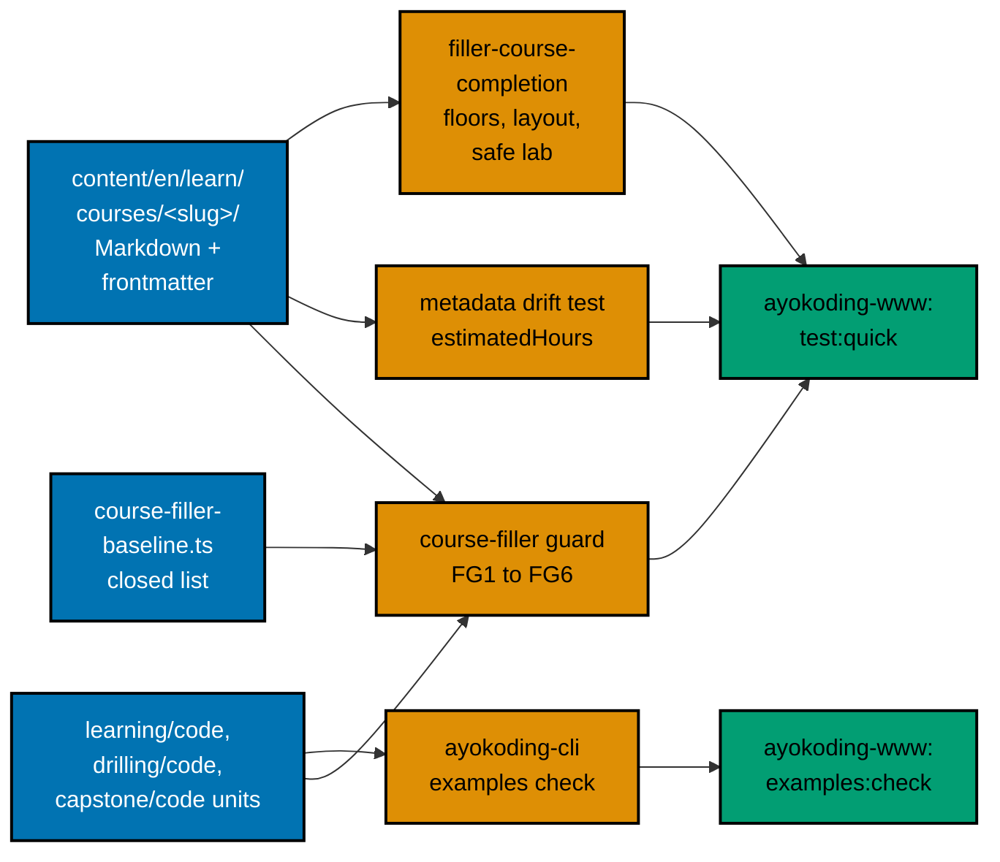

# 001 — Current State

All measurements on this page were taken on 2026-10-09 in the authoring worktree, based on `origin/main`
at `bb7f90137`, with read-only scripts. Plans 01 to 08 change some of these files before this plan runs;
Phase 0 re-measures and records the differences.

## Main Moved After Measurement

On 2026-10-10 `origin/main` moved to `66379d592`. Commit `0bf04407b` (#671, "complete five just-enough
primers") rewrote `just-enough-fsharp`: its three learning pages are now 703, 742, and 868 lines of varied
examples with their own explanations, not 78 headings with one repeated body. The row for `just-enough-fsharp`
below, and every figure built from it (the eight-course total, the unique-body ratio, the filler baseline
count), describe the course as it was at `bb7f90137`. The example folders are still named with the template
`ex-NN-fsharp-example-NN`.

The plan keeps `just-enough-fsharp` in scope, because the series arithmetic (8 filler courses, 111 audited
courses, 229 in all) depends on it. Phase 0 runs the filler guard on the as-merged course:

- If a guard rule still fires, the course is rewritten as planned.
- If no rule fires, the course gets the audit that every audited course gets (harness green, mode gate,
  Content Quality Gate, templated folder names replaced) and no rewrite. The ledger records why. The other
  seven courses are unaffected.

The baseline figures in this series (25, 17, 12, 6, 0) are planning figures. Each plan's Phase 0 reads the
actual baseline file and follows it.

## The Eight Courses Today

Every course has 11 or 12 Markdown pages, `status` unset (they are not outlines), 78 or 80 example headings,
a code folder, and a drilling page. They look finished to every automatic check. They are not.

| Weight | Course ID                                 | Title                                        | Words  | Pages | Example headings | Code files tracked                                                               | Unique-body ratio |
| ------ | ----------------------------------------- | -------------------------------------------- | ------ | ----- | ---------------- | -------------------------------------------------------------------------------- | ----------------- |
| 190    | `build-your-own-git`                      | Build Your Own Git                           | 2,710  | 11    | 78               | 81 (78 `example.py`, `store.py`, `test_store.py`, README)                        | 0.01              |
| 189    | `compilers-parsers-and-transpilers`       | Compilers, Parsers, and Transpilers          | 2,700  | 11    | 78               | 80 (78 unit `.fsx`, the capstone `interpreter.fsx`, and a README)                | 0.01              |
| 188    | `type-systems`                            | Type Systems                                 | 2,781  | 11    | 78               | 83 (`.ml`, one `.fsx`, one `.hs`, two `.md`)                                     | 0.01              |
| 187    | `just-enough-fsharp`                      | Just Enough F#                               | 2,952  | 11    | 78               | 81 (78 `.fsx`, `.fsproj`, `Program.fs`, README)                                  | 0.01              |
| 186    | `lisp`                                    | Lisp                                         | 3,962  | 11    | 78               | 81 (79 `.rkt`, one `.clj`, README)                                               | 0.01              |
| 185    | `enterprise-java-and-the-jvm`             | Enterprise Java and the JVM                  | 3,509  | 11    | 78               | 88 (85 `.java`, `pom.xml`, `application.properties`, README)                     | 0.01              |
| 600    | `defensive-security`                      | 60 · Defensive Security                      | 12,255 | 12    | 78               | 4 (`blue_lab.py`, `check-lab.sh`, `failed-login-burst.yml`, `lab-events.ndjson`) | 0.04              |
| 610    | `vulnerability-management-and-assessment` | 61 · Vulnerability Management and Assessment | 11,561 | 12    | 80               | 1 under `code/` (`vuln_triage_lab.py`) and 6 capstone modules beside the page    | 0.06              |

"Unique-body ratio" is the guard's FG1 measure ([003](./003-filler-guard.md)). The healthy minimum across
the other 173 courses is 1.00. The "Code files tracked" counts are `git ls-files` counts; the F# primer also
has an untracked `obj/` folder on disk (build output that must never be committed or counted).

## What a Reader Finds

| Course                                    | What the course contains today                                                                                                                                                                                                                                                                                                                                                                                                                                |
| ----------------------------------------- | ------------------------------------------------------------------------------------------------------------------------------------------------------------------------------------------------------------------------------------------------------------------------------------------------------------------------------------------------------------------------------------------------------------------------------------------------------------- |
| `build-your-own-git`                      | 78 headings `Example N: git-internals-NN`; every body is the same two sentences plus `_ex-NN_`. 78 identical `example.py` programs and a capstone `store.py`; **79 files hash `b"\\0"`, a backslash and a zero, instead of the NUL byte**, so every printed object id is wrong. The concept list names 30 ideas (blobs, trees, refs, index, status, diff), and the lessons teach none. No `Examples by Level`, no diagrams, no expected output, no `run.yaml` |
| `compilers-parsers-and-transpilers`       | 78 headings `compiler-stage-NN` with one repeated body. 78 identical-shape `.fsx` files. The concept list names FParsec, which no offline environment has. The capstone is a calculator that tokenizes numbers and `+`                                                                                                                                                                                                                                        |
| `type-systems`                            | 78 headings with one repeated body. Code in OCaml, F#, and Haskell with unpinned versions. The course says it "deliberately does not require Just Enough F#" and then ships F# files. The capstone is mirrored in three languages "to compare syntax"                                                                                                                                                                                                         |
| `just-enough-fsharp`                      | 78 headings with one repeated body. The overview refuses to name an SDK version. The capstone is `dotnet run` on a project that needs the SDK's restore                                                                                                                                                                                                                                                                                                       |
| `lisp`                                    | 78 headings with one repeated body. The concept list covers `call/cc`, vectors, `defmacro`, and "Common Lisp trade-offs"; the lessons teach none. The overview avoids "version-pinned implementation claims" while naming Racket and Clojure                                                                                                                                                                                                                  |
| `enterprise-java-and-the-jvm`             | 78 headings with one repeated body and 85 `.java` files. The text cites Spring Boot 4.1.0 and `mvn test`, which needs a network; the current release is 4.1.1 (checked 2026-10-09). The concept list covers JIT and garbage-collector choice; the lessons contain no GC output                                                                                                                                                                                |
| `defensive-security`                      | 78 real titles ("Write a Failed-Login Sigma Rule") over bodies that share two sentences. The 78 examples run one of ten subcommands of a single 174-line script (`blue_lab.py`), so about 8 examples share each command and print the same result. The drilling page has five numbered headings and 246 words. The capstone side page `ir-report.md` holds 234 words                                                                                          |
| `vulnerability-management-and-assessment` | 80 real titles over bodies that share two sentences. **Each of the 80 examples runs `vuln_triage_lab.py example N`, which prints the same report for every N.** A 79-line script is the only code in `code/`. The capstone describes six modules; they exist, but beside the page. The drilling page has five numbered headings and 228 words                                                                                                                 |

Four wider facts follow:

1. **The filler is invisible to the existing checks.** Plan 02's outline rules skip non-outline courses;
   plan 03's word guard does not read examples; the quality gates run only on request; the code harness has
   not been run on any of the eight (no `run.yaml`).
2. **Prose, not code, is the main gap in the security courses.** Their word counts look healthy, because the
   same 70-word "Why it matters" paragraph repeats 78 times. That is why the guard needs a boilerplate rule
   (FG6) and not only a word floor.
3. **Drilling is a fixed-template page in all eight.** Six use the same six headings with a handful of
   questions each; the two security courses use five numbered headings. None meets decision 27's drilling
   shape ([002](./002-course-modes-and-definition-of-done.md#drilling-targets)).
4. **Nothing was ever verified.** There are no expected-output files. The NUL bug survived because no check
   ever compared an id with real Git.

## Who Uses These Courses

| Consumer                                                                                                                             | What it relies on                                                                                                                                                                                                                                                                       |
| ------------------------------------------------------------------------------------------------------------------------------------ | --------------------------------------------------------------------------------------------------------------------------------------------------------------------------------------------------------------------------------------------------------------------------------------- |
| The three software-engineer career manifests (fundamentally strong, immediately effective, interview ready), all in extension phases | `systems-and-tooling` holds git; `more-computer-science` holds fsharp, type-systems, and compilers (and `lisp` in fundamentally-strong only); `architecture-and-distributed-systems` holds java; `security` holds defensive and vulnerability. No other manifest holds any of the eight |
| Prerequisite edges inside the course library                                                                                         | `compilers-parsers-and-transpilers` requires `just-enough-fsharp` and `type-systems`; `vulnerability-management-and-assessment` requires `defensive-security`; `detection-engineering-and-siem-operations` and `it-governance-grc` also require `defensive-security`                    |
| Plan 08's capstones (after this plan's predecessors merge)                                                                           | `capstone-secure-service`, `capstone-real-world-delivery`, and `capstone-build-your-own-pentest-engine` list `defensive-security` or `vulnerability-management-and-assessment` in a `relies-on` table ([005](./005-security-content-and-accuracy.md#capstone-handoff))                  |
| `tests/unit/fe-steps/course-rehome-redirects.steps.tsx`                                                                              | Mentions all eight slugs. It tests redirects only, so the slugs must not change; no content is read                                                                                                                                                                                     |
| Plan 10 (legacy unique-content migration, after this plan)                                                                           | Reads the `## Legacy relation` section of the two security overviews. This plan keeps that section unchanged                                                                                                                                                                            |

No path or catalog datum depends on the number of examples, the example titles, or any heading inside the
eight courses. Series decision 40 asks this plan to check that; the check is the search in Phase 0 of
[../delivery.md](../delivery.md), repeated at the end. The slugs, weights, and dates do not change.

## Prerequisite Changes

Current frontmatter, planned deltas, and the reason. Phase 0 re-reads each `_index.md` on the merged tree; a
plan before this one may already have made a change, and the finished value is what is recorded.

| Course                                    | Prerequisites today                                                         | After this plan          | Why                                                                                                                                                                              |
| ----------------------------------------- | --------------------------------------------------------------------------- | ------------------------ | -------------------------------------------------------------------------------------------------------------------------------------------------------------------------------- |
| `build-your-own-git`                      | `just-enough-python`, `version-control-and-git`                             | unchanged                | The units are Python and the shell; the reader must already use Git                                                                                                              |
| `compilers-parsers-and-transpilers`       | `just-enough-fsharp`, `type-systems`, `computer-science-foundations`        | unchanged                | The pipeline is written in F# and uses unions and inference from the two earlier courses                                                                                         |
| `type-systems`                            | `functional-programming`, `programming-paradigms`, `just-enough-typescript` | add `just-enough-rust`   | Rust carries the trait (typeclass), newtype, and phantom-type examples. The reader needs its syntax. `just-enough-rust` sits in `more-languages`, before `more-computer-science` |
| `just-enough-fsharp`                      | `functional-programming`, `object-oriented-programming-essentials`          | unchanged                | The primer builds on functional ideas and needs .NET object vocabulary                                                                                                           |
| `lisp`                                    | `functional-programming`, `programming-paradigms`                           | unchanged                | Recursion and higher-order functions come first                                                                                                                                  |
| `enterprise-java-and-the-jvm`             | `just-enough-java`, `software-architecture`                                 | unchanged                | Plan 11 rewrites `just-enough-java`; its API stays the same                                                                                                                      |
| `defensive-security`                      | `offensive-security`, `it-and-application-security`, `just-enough-bash`     | add `just-enough-python` | The units are Python scripts over synthetic data                                                                                                                                 |
| `vulnerability-management-and-assessment` | `security-essentials`, `it-and-application-security`, `defensive-security`  | add `just-enough-python` | The units are typed Python; the course used to say "typed Python" as assumed knowledge                                                                                           |

An added prerequisite is allowed only if it keeps plan 02's integrity rules green: the new edge must not make a
cycle, and in every career manifest where the course appears, the added course must appear in the same or an
earlier phase or be already listed. Phase 0 runs the integrity tests with the edits in place before any
course work. The three additions affect these manifests:

| Added edge                                                       | Present in manifests                                | Order check                                                                                          |
| ---------------------------------------------------------------- | --------------------------------------------------- | ---------------------------------------------------------------------------------------------------- |
| `type-systems` + `just-enough-rust`                              | the three software-engineer paths                   | `just-enough-rust` is in `more-languages` (positions 18 to 26), earlier than `more-computer-science` |
| `defensive-security` + `just-enough-python`                      | the three software-engineer paths, `security` phase | `just-enough-python` is in an earlier core phase of each; Phase 0 confirms                           |
| `vulnerability-management-and-assessment` + `just-enough-python` | the same                                            | The same                                                                                             |

If a check fails, the edge is dropped, the course states the language in its overview as assumed knowledge,
and the decision is recorded in the ledger. It is not a reason to move a course in a manifest; this plan changes
no manifest ([008](./008-decision-records.md#d8--no-manifest-change)).

## Where Things Live

- **Course content:** `apps/ayokoding-www/content/en/learn/courses/<slug>/`. `_index.md` bodies are generated by
  `src/scripts/generate-indexes.ts`; the frontmatter is hand-edited.
- **Guard:** new files under `src/features/content/core/` and `src/features/content/shell/`
  ([009](./009-file-impact.md)).
- **Completion test and features:** `tests/unit/be-steps/` and
  `specs/apps/ayokoding/www/behaviours/backend/content/` ([007](./007-testing-strategy.md)).
- **Code harness (plan 05):** `apps/ayokoding-cli/`, its catalog `apps/ayokoding-cli/toolchains/catalog.yaml`,
  and the Nx target `ayokoding-www:examples:check`.
- **Skill rules:** `.agents/skills/apps-ayokoding-www-developing-content/` ([010](./010-rule-and-docs-impact.md)).

## Prior Art in the Repository

| Prior art                                                                                    | What it gives this plan                                                                                                                                                                   |
| -------------------------------------------------------------------------------------------- | ----------------------------------------------------------------------------------------------------------------------------------------------------------------------------------------- |
| `plans/done/2026-08-15__ayokoding-learning-path-10-course-authoring-jvm-and-build-your-own/` | Authored the six templated courses (cohorts 1 and 2). Its prerequisite reasoning is kept (for example, type-systems does not require the F# primer); its generated bodies are the problem |
| `plans/done/2026-08-15__ayokoding-learning-path-08-course-authoring-security-and-ops/`       | Authored the two security courses, with their safe-lab rules, which this plan keeps                                                                                                       |
| `plans/done/2026-07-19__fundamentally-strong-software-engineer/syllabus/`                    | The first syllabus briefs for git (90) and compilers (89); topic lineage only                                                                                                             |
| `apps/ayokoding-www/content/en/learn/courses/sql-essentials/`                                | The By Example exemplar: 80 examples, 51,943 words, drilling 24 / 12 / 8 / 25 / 6                                                                                                         |
| `apps/ayokoding-www/content/en/learn/courses/backend-essentials/`                            | A second By Example exemplar; drilling 24 recall, 16 applied, 19 katas, 26 self-check                                                                                                     |
| `repo-governance/development/quality/gate-adapters/ayokoding-www/tutorial-kinds.md`          | The By Example and Primer thresholds the gates apply                                                                                                                                      |
| `plans/backlog/ayokoding-learn-revamp-05-code-harness/` (merged before this plan)            | The `run.yaml` contract, catalog, and "Adding a Toolchain" procedure used in [004](./004-code-harness-and-determinism.md)                                                                 |
| `plans/backlog/ayokoding-learn-revamp-06-accounting-courses/`                                | The form this plan follows: briefs, definition of done, execution model, and per-course commit                                                                                            |

The exemplar counts were measured on 2026-10-09 with a read-only scan.
